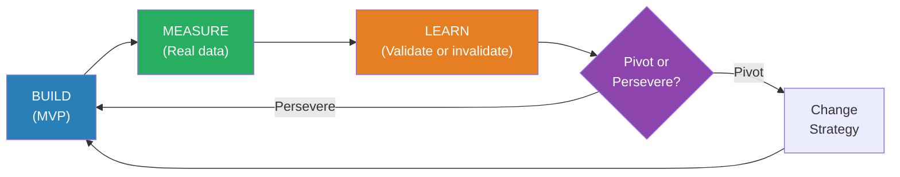
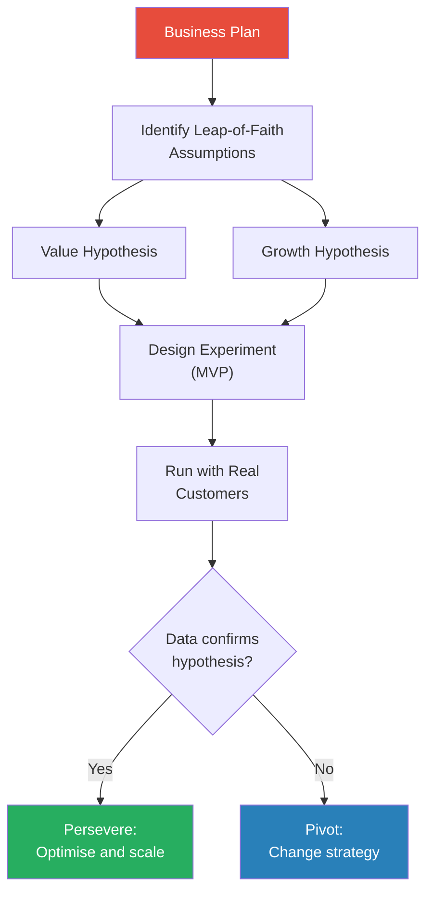
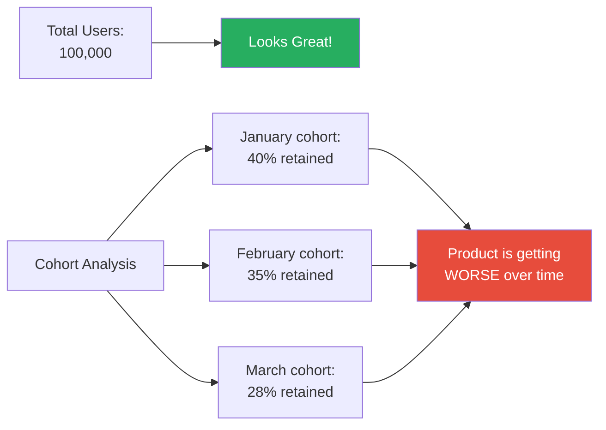
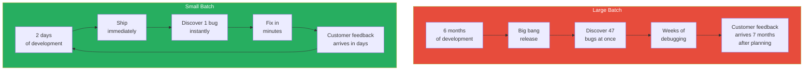
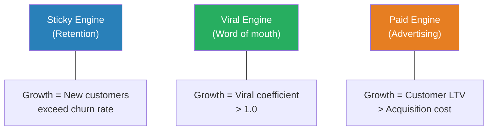
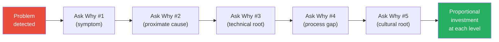

# The Lean Startup — Eric Ries

> Most startups die not from a failure of technology but from a failure of imagination — they build products nobody wants, then wonder why nobody buys them. Eric Ries, co-founder of IMVU, spent years building features that customers ignored before arriving at a disciplined alternative: treat every product idea as a hypothesis, test it with the smallest possible experiment, measure actual customer behaviour, and learn whether to change course or double down. *The Lean Startup* codifies that alternative into a repeatable methodology — the Build-Measure-Learn feedback loop — that has since become the default operating system for entrepreneurship worldwide. The book draws on Toyota's lean manufacturing principles, Steve Blank's Customer Development methodology, and Ries' own bruising experience at IMVU to argue that startups need management — but a fundamentally different kind of management than what business schools teach. The core insight is deceptively simple: **don't ask customers what they want; build the smallest thing that tests whether they want it, and let their behaviour answer the question.**

---

## About the Author

Eric Ries is an entrepreneur and author who co-founded IMVU, a 3D avatar social platform, in 2004. His painful experience building features no one used — including a six-month effort to integrate IMVU with existing instant messaging networks that customers actively rejected — led him to develop the Lean Startup methodology. He drew on Toyota's lean manufacturing principles (via Steve Blank's Customer Development methodology and Taiichi Ohno's Toyota Production System) and applied them to the uncertainty of startups. Ries began blogging about his ideas in 2008, attracting a following of entrepreneurs who recognised their own failures in his stories. He has since advised startups, Fortune 500 companies, and government agencies on applying lean principles to innovation.

---

## The Big Idea

- <b style="color: #2980b9">A startup is a human institution designed to create a new product or service under conditions of extreme uncertainty</b>
- This definition is deliberately broad — it includes a two-person garage operation, a team inside General Electric, and a government agency launching a new programme
- Under uncertainty, the traditional management playbook — write a business plan, get investors, build the product, sell it — fails catastrophically because every assumption in the plan is untested
- The business plan is a work of fiction until validated by real customer behaviour
- <b style="color: #27ae60">The antidote is validated learning: running experiments that prove or disprove the assumptions your business depends on</b>
- Progress for a startup is not lines of code written, features shipped, or meetings held — it is learning what creates value for customers
- Ries argues that entrepreneurs need a new kind of management — one built for uncertainty, not for executing a known plan
- Traditional management teaches you to make a plan and stick to it; lean management teaches you to make a plan, test it, and change it the moment reality disagrees
- The entire methodology revolves around one question: <b style="color: #e74c3c">are we building something people actually want, or are we just keeping ourselves busy?</b>

The Build-Measure-Learn loop is the engine of the entire methodology — every concept in the book either feeds into it, accelerates it, or helps you decide what to do when it delivers bad news.

---

## Key Concepts at a Glance

| Concept | One-line summary |
|---------|-----------------|
| **Build-Measure-Learn** | The core feedback loop — build an MVP, measure customer behaviour, learn whether your hypothesis is right |
| **Validated Learning** | Progress measured by what you learn about customers, not what you build |
| **Minimum Viable Product (MVP)** | The smallest experiment that tests a business hypothesis with real customers |
| **Pivot or Persevere** | The structured decision: change strategy (pivot) or stay the course (persevere) |
| **Innovation Accounting** | Measuring startup progress when revenue and profit are not yet meaningful |
| **Leap-of-Faith Assumptions** | The value hypothesis and growth hypothesis — the two bets every startup makes |
| **Engines of Growth** | Three models for sustainable growth: sticky, viral, paid |
| **Small Batches** | Ship smaller increments more frequently to find problems faster |
| **Five Whys** | Trace every defect to its root cause by asking "why?" five times |
| **Genchi Gembutsu** | Go and see for yourself — get out of the building and observe real customers |
| **Vanity Metrics** | Numbers that always go up and always look good but tell you nothing about real progress |
| **Actionable Metrics** | Per-cohort data that reveals whether your product is actually improving |
| **The Runway** | Not how much money you have left, but how many pivots you can still afford |

Landing page and video MVPs are the fastest and cheapest — ideal for gauging market demand — while concierge and wizard-of-oz MVPs sacrifice speed for dramatically deeper learning about what customers actually value.

---

## Part One: Vision

### Chapter 1 — Start

*Ries opens with his own origin story — the humbling experience of building something nobody wanted — to establish why startups need a different kind of management altogether.*

- Entrepreneurship is management — but not the kind taught in business schools
- The prevailing "just do it" culture of startups is not the opposite of bureaucratic management — it is equally dysfunctional
- One extreme produces startups that plan obsessively and never ship; the other produces startups that ship recklessly and never learn
- <b style="color: #27ae60">The Lean Startup is a third way: disciplined experimentation that replaces both blind planning and chaos</b>
- Ries positions himself squarely between two camps that had been arguing past each other for decades:
  - The MBA camp: write a plan, do the research, then execute
  - The hacker camp: just build it, ship it, figure it out later
- Both camps have a fatal flaw: the MBA camp assumes you can research your way out of uncertainty (you can't — the customer doesn't know what they want until they see it), and the hacker camp assumes that shipping fast is the same as learning fast (it isn't — you can ship a hundred features and learn nothing)

Ries argues that startups fail for two reasons, and neither is the one people expect:

- They do not fail because the technology doesn't work — most of the time it does
- They do not fail because of bad luck or timing — though entrepreneurs love to blame both
- <b style="color: #e74c3c">They fail because they build products nobody wants, and they discover this too late to recover</b>
- The failure is not a failure of execution but a failure of learning — the team executed perfectly on a plan that was wrong from the beginning

> [!example] IMVU's Costly Mistake (2004)
> - Ries and his co-founders at IMVU spent six months building a 3D instant messaging add-on that integrated with existing chat networks like AIM and MSN
> - The assumption: users would want to bring their existing friends into a 3D chat world
> - The team shipped the integration, waited for users to adopt it, and got silence
> - When they finally talked to customers, they discovered something shocking: teenagers did not want to use IMVU with their existing friends — they wanted to use it to make new friends
> - The entire six-month integration effort was wasted — not because it was poorly built, but because the underlying assumption was wrong
> - IMVU eventually pivoted to a standalone social network for meeting strangers, which became its core product
> **The lesson:** Six months of engineering work tested zero assumptions. A single afternoon of customer conversation would have revealed the flaw.

> [!tip] Core Insight
> The most dangerous form of waste in a startup is building something nobody wants. Every hour of engineering that goes into an unvalidated feature is not investment — it is gambling.

---

### Chapter 2 — Define

*Ries broadens the definition of "startup" far beyond Silicon Valley garages and establishes that anyone operating under conditions of extreme uncertainty needs this methodology.*

- <b style="color: #2980b9">A startup is not defined by its size, industry, or sector — it is defined by the conditions it operates under</b>
- If you are creating a new product or service and you don't know who your customer is, what they want, or how to reach them, you are a startup
- This means intrapreneurs inside large corporations are startups — a team at Intuit building SnapTax faces the same uncertainty as a two-person garage company
- Government agencies launching new programmes are startups
- Non-profits testing new service models are startups
- Ries is deliberately expansive here because the lesson of his methodology is universal: <b style="color: #e74c3c">whenever you face extreme uncertainty, the traditional management playbook does more harm than good</b>

The implications of this definition are radical:

- A startup cannot be managed with a business plan, because the plan is guesswork
- A startup cannot be managed with traditional accounting, because revenue and profit are not yet meaningful
- A startup needs its own management discipline — one designed for learning under uncertainty
- <b style="color: #27ae60">That discipline is the Build-Measure-Learn loop, and every chapter that follows is about making it faster</b>

Ries draws an important distinction between two types of uncertainty:

| Type of Uncertainty | Examples | Can You Plan Through It? |
|---------------------|----------|--------------------------|
| **Market uncertainty** | Will customers buy this? Is this the right price? | No — only experiments reveal the answer |
| **Technical uncertainty** | Can we build this at all? Will the technology work? | Partially — research and prototyping help |
| **Business model uncertainty** | How will we make money? What's the right channel? | No — only real transactions reveal the answer |
| **Known problems** | Build a bridge, run a factory, ship a package | Yes — traditional management excels here |

- The Lean Startup is designed for the first three rows — not the fourth
- Applying lean methods to known problems is wasteful (you don't need to experiment to know how to build a bridge)
- Applying traditional methods to unknown problems is catastrophic (you can't plan your way to product-market fit)

---

### Chapter 3 — Learn

*This chapter introduces the book's most important concept: validated learning — the idea that a startup's true product is not code or widgets, but knowledge about what customers actually want.*

- Learning is the essential unit of progress for startups
- But not all learning counts — only <b style="color: #2980b9">validated learning</b>, which Ries defines as learning that is "demonstrated by positive improvements in the startup's core metrics"
- The distinction matters enormously: most startup teams "learn" all the time — they learn about new technologies, new design patterns, new marketing channels — but none of that learning tells them whether customers want what they are building
- <b style="color: #e74c3c">A startup can be incredibly productive — shipping code, running campaigns, hiring people — and be learning nothing at all</b>

> [!example] IMVU's Validated Learning Moment (2005)
> - After the instant messaging integration failure, the IMVU team decided to test a radical hypothesis: would users pay for virtual goods?
> - Instead of building an elaborate virtual economy, they created the simplest possible test — a single virtual item available for purchase
> - They measured not just whether people bought it, but whether purchasing increased engagement
> - The data showed that paying customers used the product significantly more than free users — validating the hypothesis that charging money actually increased perceived value
> - This single experiment — which took days, not months — redirected the company's entire revenue strategy
> **The lesson:** Validated learning answers a specific question with real customer data. Everything else is just opinion.

Ries introduces a crucial reframe of how to think about effort:

- Traditional thinking: effort that produces product is valuable; effort that does not produce product is waste
- Lean thinking: effort that produces validated learning is valuable; effort that does not produce validated learning is waste
- This means a team that ships a feature nobody uses has wasted effort — even though they "shipped"
- And a team that runs a simple experiment that disproves an assumption has created enormous value — even though they "shipped nothing"

This reframe is emotionally difficult for builders:

- Engineers feel productive when they write code — even if the code serves an unvalidated idea
- Designers feel productive when they polish interfaces — even if no one will use the interface
- Marketers feel productive when they run campaigns — even if the product has a retention problem
- <b style="color: #e74c3c">Busyness is the enemy of learning because it creates the illusion of progress without the substance</b>
- Ries calls this "achieving failure" — perfectly executing a plan that was wrong from the start
- The cure is not to work less but to work on the right things — and the only way to know what the right things are is to run experiments

> [!example] The Stealth-Mode Catastrophe
> - Ries describes a common pattern he encountered in Silicon Valley: a startup would raise $5 million, hire 30 engineers, spend 18 months in "stealth mode" building a product in secret, then launch with a big press event
> - Sometimes it worked — and those stories became legends
> - Far more often, the launch revealed that the product missed the market entirely
> - The team had spent 18 months perfecting a solution to a problem that did not exist — or existed in a form they did not understand
> - By the time they discovered the mismatch, they had burned through most of their funding and most of their team's morale
> - An MVP approach could have revealed the same mismatch in weeks, not months
> **The lesson:** Stealth mode trades the discomfort of early feedback for the catastrophe of late feedback. The longer you hide from customers, the more expensive the truth becomes.

> [!tip] Core Insight
> If you cannot explain what you learned and show the data that proves it, you did not make progress. You just stayed busy.

---

### Chapter 4 — Experiment

*Ries makes the case that every element of a startup's business plan is a hypothesis to be tested, not a truth to be executed — and introduces the concept of leap-of-faith assumptions.*

Every startup rests on two fundamental hypotheses:

- <b style="color: #2980b9">The Value Hypothesis</b> — does the product deliver value to customers once they start using it? Will they come back? Will they pay?
- <b style="color: #2980b9">The Growth Hypothesis</b> — how will new customers discover the product? Will existing customers bring in new ones? Can the company afford to acquire customers through paid channels?

These are <b style="color: #e74c3c">leap-of-faith assumptions</b> — the assumptions that, if wrong, will kill the company. Everything else is secondary.

- Most business plans bury these assumptions inside optimistic projections
- The lean approach is to identify them explicitly and test them first
- An experiment is not a focus group or a survey — it is a product that generates real behavioural data

> [!abstract] How to Design a Lean Experiment
> 1. Write down the hypothesis you want to test (e.g., "College students will share our app with at least 3 friends")
> 2. Identify the leap-of-faith assumption embedded in that hypothesis (e.g., "sharing creates value for the sharer, not just the recipient")
> 3. Build the smallest possible thing that tests that specific assumption
> 4. Define in advance what data would confirm or refute the hypothesis
> 5. Run the experiment with real customers (not friends, not family, not colleagues)
> 6. Compare the actual results to your predictions
> 7. Decide: pivot or persevere

> [!example] Zappos and the Shoe Hypothesis (1999)
> - Nick Swinmurn wanted to test whether people would buy shoes online — a radical idea in 1999 when everyone assumed customers needed to try shoes on in person
> - Instead of building a warehouse, buying inventory, and creating a full e-commerce platform, Swinmurn went to local shoe stores and photographed their inventory
> - He posted the photos on a simple website
> - When someone placed an order, he went to the store, bought the shoes at full price, and shipped them to the customer
> - He lost money on every sale — but that was not the point
> - The point was to test the value hypothesis: would real customers complete a real purchase of shoes online?
> - They did — and that validated learning justified building the real company
> **The lesson:** Swinmurn didn't need a warehouse, inventory, or logistics to answer his most important question. He needed a camera and a website.

> [!example] The Village Laundry Service (India)
> - A team at Procter & Gamble wanted to test whether villagers in India would pay for a laundry service
> - Instead of building a laundry facility, they parked a truck with a washing machine in a village and offered to wash clothes
> - They tested pricing, turnaround time, and which features customers actually valued
> - They discovered that customers cared most about same-day turnaround and the smell of clean clothes — not the brand of detergent
> - These insights could never have come from a business plan or a focus group
> **The lesson:** Get out of the building. Park a truck in a village. See what happens.

Every experiment starts with identifying the riskiest assumption, not the easiest feature to build.

---

## Part Two: Steer

### Chapter 5 — Leap

*Ries deepens the concept of leap-of-faith assumptions and argues that the most successful entrepreneurs are not visionaries who ignore data — they are scientists who test their vision systematically.*

- Every startup strategy is based on assumptions — about customers, markets, technology, and business models
- Most of these assumptions are reasonable guesses — but some of them are leaps of faith
- <b style="color: #2980b9">Leap-of-faith assumptions</b> are the ones that must be true for the business to succeed — and they are the ones most likely to be wrong
- The discipline of the Lean Startup is to surface these assumptions, rank them by risk, and test the riskiest ones first

Ries distinguishes between two kinds of strategy:

| Strategy Type | How It Works | Risk |
|--------------|-------------|------|
| **Analogy** | "We'll be the Amazon of pet supplies" | Assumes the analogy holds — often it doesn't |
| **Antilog** | "Unlike Webvan, we won't build warehouses before we have customers" | Learns from others' failures — but may over-correct |

- Neither analogy nor antilog is sufficient — both are just hypotheses wearing the costume of certainty
- <b style="color: #27ae60">The only way to know if your leap-of-faith assumptions are correct is to test them with real customers</b>

Ries also introduces <b style="color: #2980b9">genchi gembutsu</b> — a Toyota principle meaning "go and see for yourself":

- You cannot understand customers from a conference room
- Surveys and focus groups capture what people say they want, not what they actually do
- The gap between stated preferences and revealed preferences is enormous
- <b style="color: #e74c3c">Customers don't know what they want until you show it to them — and even then, what they say and what they do may be completely different</b>

> [!example] Scott Cook and Intuit's Origin (1983)
> - Scott Cook founded Intuit after watching his wife struggle with their household finances
> - He did not conduct a survey asking "Would you buy personal finance software?"
> - Instead, he observed the actual behaviour: she hated balancing the chequebook, made errors, and avoided the task
> - His leap-of-faith assumption: if software could make this painless, millions of people with the same frustration would pay for it
> - The value hypothesis was confirmed not by asking but by observing
> **The lesson:** The best entrepreneurs don't ask customers what they want. They watch what customers do and identify the pain they are trying to eliminate.

---

### Chapter 6 — Test

*This chapter is the operational heart of the book: how to build a Minimum Viable Product, what forms it can take, and why the fear of shipping something imperfect is the enemy of learning.*

- <b style="color: #2980b9">The Minimum Viable Product (MVP)</b> is the version of a new product that allows a team to collect the maximum amount of validated learning with the least effort
- An MVP is not a crappy version of your product — it is the smallest experiment that tests a specific hypothesis
- The goal is learning, not launch; data, not delight
- <b style="color: #e74c3c">If you are not embarrassed by the first version, you launched too late</b>

Ries catalogues several MVP types, each suited to different hypotheses:

| MVP Type | How It Works | Best For Testing |
|----------|-------------|-----------------|
| **Video MVP** | Show what the product would do before building it | Demand — would anyone want this? |
| **Concierge MVP** | Deliver the service manually to a single customer | Value — does this solve a real problem? |
| **Wizard of Oz MVP** | Customer sees a product; behind the scenes, humans do the work | Behaviour — will customers actually use it? |
| **Landing Page MVP** | Describe the product, measure sign-ups | Interest — is there a market for this? |
| **Single-Feature MVP** | Build one feature, nothing else | Core value — which feature matters most? |

> [!example] Dropbox's Video MVP (2007)
> - Drew Houston wanted to test whether people wanted a seamless file-syncing service
> - The technology was extremely difficult to build — synchronising files across operating systems, handling conflicts, managing bandwidth
> - Instead of spending months on engineering, Houston made a three-minute screencast demonstrating how the product would work
> - He posted it on Hacker News
> - The waiting list went from 5,000 to 75,000 overnight
> - He had validated enormous demand without writing a single line of syncing code
> - The video tested the growth hypothesis (would people share it?) and the value hypothesis (did the concept resonate?) simultaneously
> **The lesson:** Houston spent one evening making a video. The data it generated would have taken months and millions of dollars to produce through traditional product development.

> [!example] Food on the Table — The Concierge MVP (2009)
> - Manuel Rosso, CEO of Food on the Table, wanted to build an app that created personalised meal plans based on grocery store sales
> - Instead of building the app, he found one customer — a mother in Austin, Texas
> - Every week, he personally visited her, asked about her family's food preferences, checked the local store's sales, and created a meal plan and shopping list by hand
> - He charged her for the service from day one
> - He was the algorithm — doing by hand what software would eventually automate
> - Only after he deeply understood what one customer valued did he begin building features
> - He added a second customer only after the first was delighted
> **The lesson:** The concierge MVP is the slowest, most unscalable approach possible — and it produces the deepest learning because you see every customer reaction in real time.

> [!example] Groupon's WordPress MVP (2008)
> - Before Groupon became a billion-dollar company, it was a simple WordPress blog
> - Andrew Mason and his team posted one deal per day as a blog post
> - When someone wanted to buy, they manually generated a PDF coupon and emailed it to the customer
> - There was no automated payments, no merchant portal, no mobile app
> - The entire operation was held together with WordPress, email, and manual labour
> - But it tested the core hypothesis: would people buy a deeply discounted product if the deal expired in 24 hours?
> - The answer was a resounding yes — and only then did they invest in building real technology
> **The lesson:** A WordPress blog and a PDF coupon were sufficient to validate a billion-dollar idea. Most MVPs can be dramatically simpler than founders imagine.

#### The Quality Paradox

Ries tackles head-on the tension between "ship something embarrassing" and "build something people love":

- The MVP is not a permanent state — it is a starting point for learning
- <b style="color: #27ae60">Quality matters, but the relevant quality is fitness for purpose — does the product teach you what you need to learn?</b>
- A beautifully designed product that tests no hypothesis is lower quality (in the lean sense) than an ugly prototype that generates actionable data
- Professional quality matters once you know what to build — not before
- The MVP approach does not mean you never invest in quality — it means you invest in quality after you've validated what customers want

Ries addresses the most common objections to the MVP approach:

- **"Customers will judge us by the crappy first version"** — If you target early adopters, they want solutions to problems, not polished products. They will forgive roughness if the core value is real.
- **"Competitors will steal our idea"** — Most startups die from obscurity, not competition. The speed advantage of validated learning far outweighs the risk of idea theft.
- **"Our brand will be damaged"** — Launch the MVP under a different brand name. Google did this routinely with internal projects.
- **"We need more data before we can learn anything"** — You need less data than you think. A handful of real customer interactions teaches more than a thousand survey responses.

> [!tip] Core Insight
> The MVP is the beginning of the learning process, not the end. It is designed to be embarrassing — because the alternative to embarrassment is months of building the wrong thing.

---

### Chapter 7 — Measure

*Ries introduces innovation accounting — a rigorous framework for measuring whether a startup is actually making progress, or just going through the motions while heading toward failure.*

- Traditional accounting measures success in revenue, profit, and return on investment
- For early-stage startups, these metrics are meaningless — revenue is zero, profit is negative, ROI is undefined
- <b style="color: #e74c3c">Without a different way to measure progress, startup teams fall into a dangerous pattern: they substitute activity for achievement</b>
- They ship features, run campaigns, attend conferences, and hire people — all of which feel productive but none of which proves the business is viable

<b style="color: #2980b9">Innovation accounting</b> works in three steps:

> [!abstract] Innovation Accounting — Three Steps
> 1. **Establish the baseline** — Use an MVP to collect real data on where the startup stands today. What is the current conversion rate? Retention rate? Revenue per customer?
> 2. **Tune the engine** — Run experiments designed to move the baseline metrics toward the business plan's ideal. Each experiment tests a specific hypothesis about how to improve a specific metric.
> 3. **Pivot or persevere** — After enough tuning attempts, evaluate honestly: are the metrics moving toward the ideal, or are they stuck? If stuck, the current strategy is not working, and it is time to pivot.

---

#### Vanity Metrics vs. Actionable Metrics

The most important distinction in the entire measurement chapter:

- <b style="color: #e74c3c">Vanity metrics</b> are numbers that always go up and always look good: total registered users, total revenue, total page views, number of downloads
  - They feel encouraging because they only move in one direction
  - They tell you nothing about whether your product is getting better
  - A startup with 100,000 registered users and a 2% retention rate is dying — but the "100,000 users" headline makes it look alive

- <b style="color: #27ae60">Actionable metrics</b> tell you whether a specific change actually improved customer behaviour:
  - Per-cohort retention rates (are the users you acquired this month staying longer than last month's users?)
  - Conversion rates by channel (which acquisition channel produces customers who actually pay?)
  - Revenue per customer over time (are customers spending more as the product improves?)

| Metric Type | Example | What It Tells You |
|------------|---------|-------------------|
| **Vanity** | Total users: 100,000 | People signed up at some point |
| **Vanity** | Total revenue: $500,000 | Money came in at some point |
| **Actionable** | Month-3 retention: 15% → 22% | Product improvements are working |
| **Actionable** | Conversion rate: 2.1% → 3.4% | Landing page change attracted better-fit customers |
| **Actionable** | Revenue per cohort, week 4: $12 → $18 | Customers are finding more value |

> [!example] The Grocery Delivery Startup's Vanity Trap
> - Ries describes a startup (a composite example drawn from his consulting work) that tracked total revenue as its key metric
> - Revenue grew 20% month over month for six months — the team celebrated
> - But when they broke the data into cohorts, a different picture emerged: each new cohort of customers spent less than the previous one
> - Revenue was growing only because the marketing team was acquiring customers faster than old customers were leaving
> - The product was not getting better — the marketing team was running on a treadmill
> - When acquisition spending slowed, revenue collapsed
> **The lesson:** Aggregate numbers hide the truth. Cohort analysis reveals it.

Ries introduces three requirements for actionable metrics — he calls them the three A's:

- **Actionable** — the metric must demonstrate clear cause and effect. When we changed X, Y happened.
- **Accessible** — the reports must be simple enough for everyone in the company to understand. If only the data team can read the dashboard, it is useless.
- **Auditable** — the data must be credible. Teams under pressure will game any metric they can. The system must be transparent enough to resist manipulation.

> [!tip] Core Insight
> A startup that tracks vanity metrics is flying blind with an altimeter that only goes up. Cohort-based analysis is the only way to see whether your product is actually improving.

---

#### Cohort Analysis and Split Testing

Ries devotes significant attention to two measurement tools that make innovation accounting work:

**Cohort analysis** groups customers by when they joined, not just how many there are total:

- Instead of asking "how many users do we have?", ask "of the users who signed up in January, how many are still active in March?"
- This reveals whether product changes are actually improving retention, conversion, and engagement
- <b style="color: #2980b9">Without cohort analysis, you cannot distinguish between growth driven by acquisition spending and growth driven by product improvement</b>

**Split testing (A/B testing)** runs two versions of the product simultaneously to measure which performs better:

- Half of users see version A, half see version B
- The difference in behaviour between the two groups isolates the impact of a single change
- This prevents the common failure of attributing improvements to the wrong cause

> [!example] IMVU's Split Testing Revelation
> - At IMVU, the team spent weeks redesigning a key page based on customer feedback and internal design intuition
> - When they A/B tested the redesign against the original, the original performed better
> - The team was deflated — weeks of work produced a net negative result
> - But the learning was invaluable: their intuitions about what customers wanted were wrong
> - This experience convinced the team to A/B test everything, no matter how obvious the improvement seemed
> **The lesson:** Without a split test, you will attribute improvements to your talent and failures to external factors. The data tells a less flattering but more useful story.

Vanity metrics paint a rosy picture. Cohort analysis shows what is actually happening beneath the surface.

---

### Chapter 8 — Pivot (or Persevere)

*The hardest decision in entrepreneurship is not which idea to pursue — it is knowing when to abandon a strategy that is not working and try something fundamentally different.*

- A <b style="color: #2980b9">pivot</b> is a structured course correction — a change in strategy without a change in vision
- It is not failure — it is learning applied
- It is not random flailing — it is a deliberate decision based on accumulated data from validated learning
- <b style="color: #e74c3c">The danger is the "land of the living dead" — startups that have enough traction to survive but not enough to thrive, and whose founders are too emotionally invested to change course</b>

Ries identifies the telltale signs that a pivot is needed:

- The product experiments are producing diminishing returns — each iteration moves the metrics less
- Customer acquisition costs are rising, not falling
- The team is demoralised because they can see the metrics plateauing
- Conversations with customers reveal excitement about a feature that is not the core product
- <b style="color: #27ae60">The startup is alive but not growing — stuck in a slow-motion failure that feels like progress because people are busy</b>

#### The Pivot Catalogue

Ries catalogues ten types of pivot, each representing a different dimension of change:

| Pivot Type | What Changes | Example |
|-----------|-------------|---------|
| **Zoom-in** | A single feature becomes the whole product | Flickr started as a game; the photo-sharing feature became the product |
| **Zoom-out** | The whole product becomes a single feature | A standalone product becomes part of a larger platform |
| **Customer segment** | Same product, different customers | Your real users are not who you expected |
| **Customer need** | Same customers, different problem | You built for problem A but customers care about problem B |
| **Platform** | Application becomes platform (or vice versa) | Single app evolves into a marketplace |
| **Business architecture** | Switch between high-margin/low-volume and low-margin/high-volume | Enterprise software company becomes a self-serve SaaS product |
| **Value capture** | Change how you make money | Switch from advertising to subscription, or freemium to paid |
| **Engine of growth** | Switch from viral to paid, or sticky to viral | The growth model changes |
| **Channel** | Change how you reach customers | Direct sales to online, retail to enterprise |
| **Technology** | Same solution, different technology | Rebuild with a fundamentally different tech stack |

> [!example] Wealthfront's Customer Segment Pivot
> - Wealthfront (originally kaChing) started as a platform for amateur investors to follow expert stock traders
> - The value hypothesis seemed validated — users were engaged and active
> - But the growth hypothesis failed: the target market of amateur day-traders was too small and too fickle
> - The team pivoted from a customer segment of active traders to a much larger segment: young professionals who wanted automated investment management
> - Same core technology (algorithmically managed portfolios), entirely different customer and value proposition
> - After the pivot, growth accelerated dramatically
> **The lesson:** Sometimes the product is right but the audience is wrong. A customer segment pivot lets you keep what works and discard what doesn't.

> [!example] IMVU's Zoom-In Pivot
> - IMVU originally envisioned a full 3D social world — avatars, rooms, games, messaging, and an economy
> - The data showed that users cared overwhelmingly about one thing: customising their avatars and showing them off
> - Everything else — the games, the rooms, the messaging features — was secondary
> - The team pivoted by zooming in: avatar customisation and the virtual economy around it became the entire product
> - Features that didn't serve avatar customisation were deprioritised or removed
> **The lesson:** When one feature generates all the excitement, stop building everything else and make that feature the product.

#### The Pivot Meeting

Ries recommends that every startup hold a regular "pivot or persevere" meeting — typically every four to eight weeks:

- The meeting reviews the data from recent experiments against the innovation accounting framework
- The question is not "are we working hard?" but "are the metrics moving in the right direction?"
- The meeting must include both the data team (who present the numbers) and the product team (who provide context about what customers are saying)
- <b style="color: #27ae60">The most important output of the meeting is an honest decision: should we continue on this path, or test a fundamentally different approach?</b>
- Ries warns that the pivot decision is almost always delayed too long — founders have emotional attachment to their original idea, and teams have sunk-cost bias from the work already invested
- The antidote to delay is a regular cadence: if you have to make the pivot-or-persevere decision every six weeks, you cannot avoid it indefinitely

> [!example] Votizen's Cascade of Pivots
> - David Binetti founded Votizen to make it easier for citizens to contact their elected representatives
> - The first version was a social network for voters — but nobody used it because there was no compelling reason to return after signing up
> - Pivot 1 (customer need): instead of a social network, Votizen became a tool for organising voter petitions around specific issues — engagement improved but growth was flat
> - Pivot 2 (business architecture): instead of a consumer tool, Votizen became a platform for political campaigns to target and mobilise voters — revenue appeared for the first time
> - Pivot 3 (value capture): instead of charging campaigns per voter, they shifted to a SaaS model — predictable revenue, better unit economics
> - Each pivot preserved what worked and discarded what didn't — the core vision (making democracy more accessible) never changed
> - The final product bore little resemblance to the original, but every pivot was informed by real data from real users
> **The lesson:** Votizen pivoted three times before finding a sustainable business model. Each pivot was painful but data-driven. Without the discipline to pivot, Binetti would have burned through his funding on the original social network.

Ries introduces a critical concept about pivots and runway:

- Startup runway is not measured in months of cash remaining
- <b style="color: #27ae60">Runway is the number of pivots you can still afford</b>
- A startup with $1 million in the bank and $100,000 per pivot has ten pivots left
- A startup with $1 million in the bank and $500,000 per pivot has two pivots left
- Anything that reduces the cost of each pivot — smaller teams, cheaper experiments, faster feedback loops — extends the runway

> [!tip] Core Insight
> Every pivot is a new strategic hypothesis. The faster and cheaper you can test each hypothesis, the more chances you get before the money runs out. Speed of iteration is not a luxury — it is survival.

---

## Part Three: Accelerate

### Chapter 9 — Batch

*Ries imports Toyota's small-batch philosophy and demonstrates why shipping less, more frequently, produces better results faster than shipping large releases on long timelines.*

- In traditional manufacturing, large batches seem more efficient — set up the machine once, run a thousand units
- <b style="color: #2980b9">In product development, small batches are almost always faster than large batches</b> because the dominant cost is not production but learning
- With large batches, you do not discover problems until the entire batch is complete — and then every unit in the batch has the same problem
- With small batches, you discover problems immediately and fix them before they multiply

> [!example] The Envelope-Stuffing Experiment
> - Ries describes a classic lean manufacturing demonstration: two teams race to stuff, seal, stamp, and address 100 envelopes
> - Team A uses large batches: fold all 100 letters, then stuff all 100 envelopes, then seal all 100, then stamp all 100
> - Team B uses small batches: fold one letter, stuff it, seal it, stamp it, then move to the next
> - Intuition says Team A should win — they are more "efficient" because they do each step in bulk
> - In practice, Team B wins almost every time
> - Why? Large batches hide problems: if the envelopes are the wrong size, Team A discovers this after folding all 100 letters. Team B discovers it on the first envelope.
> - The same principle applies to software: ship a small change, see if it breaks anything, learn from the result. Don't accumulate six months of changes and deploy them all at once.
> **The lesson:** Small batches feel slower but finish faster because they expose errors immediately instead of allowing them to compound.

The software development implications are profound:

- <b style="color: #27ae60">Continuous deployment</b> — shipping code to production multiple times per day — is the ultimate small-batch approach
- At IMVU, the team deployed to production 50 times per day
- Each deployment was tiny — a few lines of code — which meant:
  - If something broke, they knew exactly which change caused it
  - Rollbacks were trivial — just undo the last small change
  - Customer feedback came in hours, not months
- <b style="color: #e74c3c">Large-batch releases (the "big bang" launch) are the single most common source of catastrophic product failures</b>

Large batches delay learning. Small batches accelerate it. The entire Lean Startup methodology is about making the feedback loop as short as possible.

#### Continuous Deployment in Practice

Ries devotes significant attention to how IMVU implemented continuous deployment — the extreme version of small-batch thinking:

- At IMVU, every engineer could deploy code to production as soon as it passed automated tests
- The team averaged 50 deployments per day — one every 15 minutes during working hours
- Each deployment was:
  - Automatically tested against a comprehensive suite of unit and integration tests
  - Monitored in real time for changes in key business metrics
  - Automatically rolled back if any metric degraded beyond a threshold
- The psychological impact was as important as the technical impact:
  - Engineers were not afraid of breaking things because the safety net was robust
  - The feedback loop from code-to-customer-data was hours, not months
  - <b style="color: #27ae60">Bugs became cheap and small instead of expensive and catastrophic</b>

> [!abstract] Continuous Deployment Requirements
> 1. Comprehensive automated test suite (unit, integration, acceptance)
> 2. Automated deployment pipeline (code → test → staging → production)
> 3. Real-time business metric monitoring (revenue, errors, performance)
> 4. Automatic rollback triggers (if key metrics degrade)
> 5. Feature flags (to deploy code without exposing it to all users)
> 6. Culture of shared ownership (anyone can deploy, everyone is responsible)

#### The Pull System

Ries extends the small-batch concept into a pull system for product development:

- Traditional product development uses a "push" system: the product team decides what to build, engineers build it, marketing launches it
- <b style="color: #2980b9">A pull system</b> works in reverse: customer behaviour signals what to build next
- You do not build features because they are on a roadmap — you build features because an experiment revealed that customers need them
- This requires:
  - Automated testing (so you can ship confidently)
  - Continuous deployment (so you can ship frequently)
  - Cohort analysis (so you can measure impact)
  - A culture that values learning over shipping

The pull system has profound implications for how product teams are structured:

- Traditional product teams work from a roadmap created months in advance — features are "pushed" through the pipeline regardless of what customers are doing
- Lean product teams work from experiment results — the next thing to build is "pulled" by the most important unanswered question about customer behaviour
- <b style="color: #27ae60">The roadmap is not a list of features to build — it is a list of hypotheses to test, ordered by risk</b>
- This means the team must be comfortable with not knowing what they will build next month — because next month's work depends on this month's learning
- It also means that the team must resist the pressure to commit to specific deliverables on a fixed timeline — because validated learning cannot be scheduled

> [!abstract] Push vs. Pull in Product Development
> - **Push system**: Product manager writes requirements → Engineers build features → Marketing launches → Hope customers care
> - **Pull system**: Experiment reveals customer behaviour → Team identifies the riskiest assumption → Engineers build the smallest thing that tests it → Data determines what happens next
> - Push systems optimise for **output** (features shipped)
> - Pull systems optimise for **outcomes** (customer behaviour changed)

---

### Chapter 10 — Grow

*Ries identifies the three engines that drive sustainable growth and argues that startups must pick one and optimise ruthlessly — not try to run all three at once.*

Every startup's growth is powered by one of three <b style="color: #2980b9">engines of growth</b>:

Each engine has a fundamentally different mechanism and a different key metric.

#### The Sticky Engine

- Growth comes from <b style="color: #27ae60">high retention</b> — customers use the product, love it, and keep using it
- The key metric is the churn rate — the percentage of customers who stop using the product in a given period
- If the rate of new customer acquisition exceeds the churn rate, the company grows
- If churn exceeds acquisition, the company is dying regardless of how many new customers it attracts
- Products powered by the sticky engine include databases, enterprise software, and subscription services where switching costs are high
- <b style="color: #e74c3c">The classic mistake: pouring resources into acquisition when the product has a retention problem. You are filling a leaky bucket.</b>

#### The Viral Engine

- Growth comes from <b style="color: #27ae60">existing customers bringing in new ones</b> as a natural side effect of using the product
- The key metric is the <b style="color: #2980b9">viral coefficient</b> — the number of new users each existing user generates
- If the viral coefficient is greater than 1.0, growth is exponential
- Even small changes in the viral coefficient produce massive differences in outcome:
  - Coefficient of 0.9: growth stalls
  - Coefficient of 1.1: explosive growth
- Viral growth is not the same as word-of-mouth marketing — it is built into the product's mechanics
- Hotmail's "Get your free email at Hotmail" signature is the classic example: every email sent was an advertisement

> [!example] Hotmail's Viral Engine (1996)
> - Sabeer Bhatia and Jack Smith launched Hotmail, one of the first free webmail services
> - Growth was modest until they added a single line to the bottom of every outgoing email: "PS: I love you. Get your free email at Hotmail"
> - Every user became an involuntary advertiser — and each recipient who signed up did the same
> - The viral coefficient exceeded 1.0 and growth became exponential
> - Within 18 months, Hotmail had 12 million users and was acquired by Microsoft for $400 million
> **The lesson:** Viral growth is engineered into the product, not bolted on through marketing campaigns.

#### The Paid Engine

- Growth comes from <b style="color: #27ae60">spending money to acquire customers</b> — advertising, sales teams, partnerships
- The key metric is the ratio between <b style="color: #2980b9">customer lifetime value (LTV)</b> and <b style="color: #2980b9">customer acquisition cost (CAC)</b>
- If LTV > CAC, every dollar spent on acquisition returns more than a dollar in revenue — and you can reinvest the surplus to grow faster
- If CAC > LTV, every customer you acquire is a net loss — and more marketing just accelerates the losses
- The paid engine works for companies with high margins or long customer lifetimes: SaaS products, insurance, financial services

| Engine | Key Metric | How to Improve | Danger Sign |
|--------|-----------|---------------|-------------|
| **Sticky** | Churn rate | Improve the product so customers stay | High acquisition, high churn — leaky bucket |
| **Viral** | Viral coefficient | Make sharing a natural part of using the product | Coefficient below 1.0 — growth stalls |
| **Paid** | LTV:CAC ratio | Increase revenue per customer or decrease acquisition cost | CAC rising faster than LTV — unsustainable |

#### How Engines Run Down

Ries makes a subtle but important point: every engine of growth eventually runs down.

- The sticky engine runs down when you saturate your market — everyone who would retain already has
- The viral engine runs down when you exhaust the connected network — everyone your users know has already been invited
- The paid engine runs down when competitors bid up acquisition costs — CAC rises until it exceeds LTV
- <b style="color: #2980b9">When an engine runs down, the company needs to find a new engine — which is itself a pivot</b>
- This is why many companies experience a growth plateau: the first engine carried them to a certain scale, and they need to discover a second engine to continue growing
- The transition between engines is one of the most difficult periods in a company's life — the metrics, skills, and culture required for the new engine may be completely different from the old one

> [!example] Ries' Engine-Switching Example
> - A company grows rapidly using the viral engine — every user brings in 1.3 new users
> - Growth is exponential for two years, then flattens as the viral coefficient drops below 1.0
> - The team has exhausted their natural viral network — everyone in the target demographic has already been invited
> - To continue growing, the company must switch to a paid engine — buying customers through advertising
> - This requires entirely new capabilities: media buying, funnel optimisation, LTV modelling
> - The team that built a viral product has none of these skills
> - If the company does not recognise the engine transition, they will spend months trying to "fix" viral growth when the real problem is that they need a different engine entirely
> **The lesson:** Engines are not permanent. The companies that sustain growth over the long term are the ones that recognise when one engine is running down and successfully transition to another.

Ries issues a critical warning:

- <b style="color: #e74c3c">Do not try to run all three engines simultaneously</b>
- Each engine has a different set of tactics, metrics, and skills required
- Companies that try to be sticky, viral, and paid at the same time end up being mediocre at all three
- Pick the engine that fits your product and optimise relentlessly

> [!tip] Core Insight
> Sustainable growth comes from one of three engines. Know which engine powers your business, measure its core metric obsessively, and ignore everything that does not improve that metric.

The treemap reveals that each engine has its own internal hierarchy of priorities — the sticky engine lives or dies by churn rate, the viral engine by its coefficient, and the paid engine by the LTV-to-CAC ratio.

---

### Chapter 11 — Adapt

*Ries tackles the question of organisational speed: how do you build an organisation that can move fast without breaking everything? The answer comes from Toyota's adaptive processes.*

- Startups need speed — but speed without quality produces a mess that eventually stops you cold
- <b style="color: #27ae60">The goal is not to go fast; the goal is to build an organisation that can sustain a fast pace without accumulating crippling technical and organisational debt</b>

Ries imports two key concepts from Toyota:

#### The Five Whys

- When something goes wrong — a bug, a customer complaint, a missed deadline — ask "Why?" five times to trace the symptom back to its root cause
- Most organisations stop at the first answer, which addresses the symptom but not the cause
- <b style="color: #2980b9">The Five Whys</b> forces you deeper:

> [!abstract] Five Whys — Worked Example
> 1. **Why** did the website go down? — A server ran out of memory.
> 2. **Why** did the server run out of memory? — A background process was consuming memory and never releasing it.
> 3. **Why** was the process consuming memory? — A developer wrote a query that loaded an entire database table into memory.
> 4. **Why** did the developer write that query? — There was no code review process for database queries.
> 5. **Why** was there no code review process? — The team was moving fast and skipped process setup to save time.

The root cause is not a memory leak — it is the absence of a code review process. The Five Whys trace technical symptoms to organisational causes.

Ries adds a critical rule: <b style="color: #27ae60">make a proportional investment at each level of the Five Whys</b>:

- At level 1: fix the immediate problem (restart the server)
- At level 2: fix the proximate technical cause (patch the memory leak)
- At level 3: fix the developer's approach (add a query size limit)
- At level 4: fix the process gap (institute code reviews for database queries)
- At level 5: fix the cultural root (allocate time for process development alongside feature development)
- The investment at each level should be proportional — not a massive overhaul, but enough to prevent recurrence
- <b style="color: #e74c3c">The two failure modes: under-reaction (just restart the server and move on) and over-reaction (shut down all development for two weeks to rebuild the entire infrastructure)</b>

Ries warns about common failure modes when organisations adopt the Five Whys:

- **The blame game** — If the fifth "why" always leads to a person rather than a process, the exercise becomes an inquisition. Ries insists on a strict rule: the Five Whys must target systems and processes, never individuals. "Why did Bob make a mistake?" is the wrong question. "Why did the system allow Bob's mistake to reach production?" is the right one.
- **The Five Blames** — A degenerate form where each "why" assigns blame to a different department. This produces finger-pointing, not root-cause analysis.
- **Superficial whys** — Stopping at the second or third "why" because the answer is uncomfortable. The deeper you go, the more likely you are to find an organisational or cultural problem that leadership would prefer not to address.
- **Inconsistent application** — Using the Five Whys only for dramatic failures and ignoring small problems. The small problems are where the technique is most valuable, because they reveal systemic issues before they cause catastrophic failures.

> [!tip] Core Insight
> The Five Whys is a tool for building an adaptive organisation — one that gets stronger every time something goes wrong. But it only works in a culture of psychological safety where the goal is learning, not punishment.

#### The Andon Cord

- In Toyota's factories, any worker can pull the "andon cord" to stop the entire production line when they spot a defect
- This seems insane — stopping the whole factory because one person noticed one problem?
- But it works because:
  - It prevents defective products from reaching customers
  - It creates immediate, intense focus on fixing the root cause
  - It communicates that quality is everyone's responsibility, not just the quality team's
- In software, the equivalent is: when a build breaks, everyone stops and fixes it before doing anything else
- <b style="color: #2980b9">At IMVU, the immune system was automated</b> — if a deployment caused any metric to drop below a threshold, the deployment was automatically rolled back and the team was alerted
- This gave the team the confidence to deploy 50 times per day — because they knew that any damage would be caught and reversed within minutes

> [!example] IMVU's Automated Immune System
> - At IMVU, every deployment was monitored by an automated system that tracked key business metrics in real time
> - If any metric — revenue per user, page load time, error rate — moved outside acceptable bounds within minutes of a deployment, the system automatically rolled back the change
> - The developer who deployed the code was immediately alerted with the specific metrics that triggered the rollback
> - This meant the team could deploy confidently and frequently — the safety net was automated
> - It also meant that problems were caught in minutes, not days, reducing the cost of each failure dramatically
> **The lesson:** Speed and quality are not trade-offs when you have automated safeguards. You can move fast because the system catches mistakes instantly.

The Five Whys trace symptoms to root causes. Proportional investment prevents both under-reaction and over-reaction.

---

### Chapter 12 — Innovate

*Ries addresses the question that haunts every successful company: how do you keep innovating once you are no longer a scrappy startup? The answer involves creating protected spaces for entrepreneurship within the larger organisation.*

- Every company starts as an innovation engine and gradually becomes an execution engine
- <b style="color: #e74c3c">The tragedy of success is that the processes that made the company efficient eventually make it incapable of doing anything new</b>
- Large organisations optimise for predictability — but innovation is inherently unpredictable
- The Lean Startup methodology applies not just to garage startups but to internal innovation teams inside large companies

Ries identifies three structural requirements for internal innovation:

1. **Scarce but secure resources** — Internal startups need a guaranteed budget that is small enough not to attract political attention but secure enough not to be raided during budget cuts
2. **Independent development authority** — The team must be able to build and ship without going through the parent company's approval processes, which are designed for execution, not experimentation
3. **A personal stake in the outcome** — The team members need skin in the game — whether through equity, bonuses, or career advancement tied to the startup's success

> [!example] Intuit's SnapTax — Innovation Inside a Giant (2009)
> - Intuit, the massive financial software company, wanted to build a mobile tax-filing product
> - Instead of assigning it to an existing division, they created a small, autonomous team with startup-like independence
> - The SnapTax team used lean methods: they built an MVP, tested it with a tiny group of customers, and iterated rapidly
> - They discovered that mobile users wanted to photograph their W-2 form and have the app fill out the return automatically — a feature the team had not originally planned
> - SnapTax grew to serve hundreds of thousands of users and became one of Intuit's fastest-growing products
> - The key: the team was inside Intuit but operated like a startup — small, fast, and empowered to make decisions without corporate approval
> **The lesson:** Large companies can innovate — but only if they create protected environments where innovation teams can operate with startup-like autonomy and speed.

> [!example] Toyota's Innovation Paradox
> - Toyota — the company whose manufacturing principles inspired the Lean Startup — faced its own innovation challenge
> - The Toyota Production System was designed for continuous improvement of existing processes (kaizen), not for creating entirely new products
> - When Toyota wanted to create the Prius, its first hybrid car, it could not use the existing production system — the uncertainty was too high
> - Toyota created a separate team with a separate facility, a separate budget, and separate authority to make engineering decisions
> - The Prius team could experiment, fail, and iterate without disrupting the main business
> - The result was the world's first mass-market hybrid car — an innovation that Toyota's main production system could never have produced
> **The lesson:** Even the company that invented lean manufacturing recognised that innovation requires different structures than execution.

#### The Innovation Sandbox

Ries proposes a practical model for institutionalising innovation:

- <b style="color: #2980b9">Create an "innovation sandbox"</b> — a controlled environment where teams can experiment freely, but with clear constraints:
  - The experiment can affect only a defined customer segment (e.g., a specific geographic market or a percentage of traffic)
  - The team owns the experiment end-to-end: build, measure, learn
  - The experiment has a time limit (e.g., four weeks)
  - The team uses actionable metrics, not vanity metrics, to evaluate results
  - If the experiment succeeds, the innovation can be scaled to the broader organisation
  - If it fails, the blast radius is contained

- This approach gives innovators the freedom to experiment while protecting the core business from uncontrolled risk
- <b style="color: #27ae60">The sandbox is the structural embodiment of the Lean Startup: constrained experimentation with real customers and real data</b>

#### The Accountability Problem

Ries acknowledges that internal innovation teams face a unique accountability challenge:

- In a standalone startup, the market delivers the verdict: you either find product-market fit or you run out of money
- In a large company, the verdict is political: a senior executive decides whether the innovation team gets more funding
- This creates perverse incentives:
  - The innovation team is tempted to use vanity metrics to justify its existence to leadership
  - Leaders are tempted to judge the innovation team by the same metrics used for the core business
  - <b style="color: #e74c3c">Both behaviours undermine learning — the innovation team optimises for looking good instead of being good</b>
- The solution is innovation accounting applied at the organisational level: judge internal startups by validated learning milestones, not revenue milestones
- If the innovation team can show that it has validated key hypotheses and that the metrics are improving cohort over cohort, it is making progress — even if revenue is still zero

---

### Chapter 13 — Epilogue: Waste Not

*Ries closes with a meditation on waste — the central enemy of lean thinking — and argues that the Lean Startup methodology is ultimately about respecting human time and creativity.*

- The Toyota Production System was built to eliminate waste in manufacturing — overproduction, inventory, transportation, motion, waiting, over-processing, defects
- <b style="color: #2980b9">The Lean Startup translates this into knowledge work</b>: the waste is not defective widgets but unvalidated ideas
- Every feature built on an untested assumption is potential waste
- Every month spent in "stealth mode" is potential waste
- Every hire made before product-market fit is potential waste
- <b style="color: #27ae60">The ultimate waste is building something nobody wants — because it wastes not just money and time but the creative energy and passion of the people who built it</b>

Ries argues that this waste is not just an economic problem — it is a human one:

- Entrepreneurs pour their lives into their work — nights, weekends, relationships sacrificed
- When that work produces a product nobody wants, the human cost is enormous
- The Lean Startup does not guarantee success — but it guarantees that failure will come quickly, cheaply, and with maximum learning
- <b style="color: #e74c3c">The worst outcome is not failing — it is succeeding at building the wrong thing</b>

> [!tip] Core Insight
> The Lean Startup is not about being cheap or cutting corners. It is about respecting human effort enough to ensure it is directed toward something customers actually want. Validated learning is the most efficient use of entrepreneurial energy.

---

## Cross-Cutting Themes

### The Lean Startup vs. Traditional Management

*Ries does not reject management — he rejects the wrong kind of management applied to the wrong conditions.*

| Dimension | Traditional Management | Lean Startup |
|-----------|----------------------|-------------|
| **Planning** | Build a detailed plan, then execute it | Build a hypothesis, then test it |
| **Progress** | Measured by milestones delivered | Measured by validated learning |
| **Metrics** | Revenue, profit, ROI | Cohort retention, conversion, LTV/CAC |
| **Failure** | Something went wrong; someone is at fault | An experiment that produced learning |
| **Speed** | Controlled, deliberate, risk-averse | Fast iteration with automated safeguards |
| **Customer input** | Focus groups and surveys before building | Real behaviour data from MVPs |
| **Strategy change** | A sign of poor planning | A sign of learning (pivot) |

- Traditional management works when the problem is well-defined and the solution is known — building a factory, running a supply chain, scaling an existing business
- Lean management works when the problem is uncertain and the solution is unknown — new products, new markets, new technologies
- <b style="color: #e74c3c">The failure is not traditional management itself but applying it where it does not belong</b>

Most startups burn 42% of their time building features nobody asked for — the Lean Startup's core argument is that time should shift dramatically toward running experiments and measuring results.

---

### When Lean Fails — The Limits of Iteration

Ries acknowledges — and his critics amplify — the situations where lean methodology struggles:

- **Network-effect products**: Products that only become valuable at scale (social networks, marketplaces) cannot be validated with a handful of early adopters. An MVP of Facebook with 50 users proves nothing.
- **High-technology products**: Products where the technology must work perfectly before any value exists (self-driving cars, medical devices) cannot be validated with a rough prototype.
- **Category-creating products**: Products that define entirely new categories (the original iPhone, SpaceX) cannot be validated by asking customers what they want — because customers cannot imagine what does not yet exist.
- **Regulated industries**: Industries where experimentation with real customers is legally constrained (pharmaceuticals, financial services) require different approaches to validation.

- <b style="color: #27ae60">Ries' methodology is most powerful when the primary risk is market risk — "will anyone want this?" — not technical risk — "can we build it?"</b>
- When the primary risk is technical, you need engineering breakthroughs before customer experiments make sense
- When the primary risk is regulatory, you need legal compliance before customer experiments are possible

---

### The Lean Startup's Intellectual Heritage

*Ries did not invent his ideas from scratch — he synthesised decades of thinking from manufacturing, military strategy, and software engineering into a coherent methodology for entrepreneurship.*

The key intellectual ancestors:

| Thinker | Contribution | How Ries Adapted It |
|---------|-------------|---------------------|
| **Taiichi Ohno** | Toyota Production System — eliminate waste, small batches, continuous flow | Applied manufacturing principles to product development |
| **W. Edwards Deming** | Statistical quality control, Plan-Do-Check-Act cycle | Build-Measure-Learn is a direct descendant of PDCA |
| **Steve Blank** | Customer Development — "get out of the building" | Provided the customer-facing half of the methodology |
| **Lean Manufacturing** | Pull systems, just-in-time, andon cord | Translated physical production principles to knowledge work |
| **Agile Software Development** | Iterative development, working software over documentation | Provided the engineering practices that make small batches possible |
| **Scientific Method** | Hypothesis → experiment → data → conclusion | The epistemological foundation of validated learning |

- Steve Blank's <b style="color: #2980b9">Customer Development</b> methodology is the most direct ancestor — Blank argued that startups should "get out of the building" and talk to customers before building products
- Ries was Blank's student at Stanford and took the idea further: not just talk to customers, but run structured experiments with real products
- The Toyota Production System provides the operational model: small batches, pull systems, root-cause analysis, continuous improvement
- <b style="color: #27ae60">Ries' unique contribution was combining Blank's customer-facing methodology with Toyota's operational discipline and wrapping both in a management framework that any startup could adopt</b>

The Lean Startup stands on centuries of accumulated insight — from the scientific method's hypothesis-testing logic through Toyota's waste elimination to Blank's customer-facing methodology — synthesising them into a single framework for entrepreneurship under uncertainty.

---

### The Lean Startup and Organisational Culture

*The methodology only works if the organisation's culture supports it — and most organisations' cultures actively resist it.*

Ries identifies several cultural requirements:

- **Tolerance for failure as learning** — If people are punished for experiments that produce negative results, no one will run experiments. The data must be separated from the blame.
- **Cross-functional teams** — The Build-Measure-Learn loop requires engineers, designers, and product managers to work together in a single team, not hand off between siloed departments.
- **Speed over perfection** — The goal is to learn fast, not to ship something perfect. This requires letting go of the craftsman's desire for polish before validation.
- **Data over opinions** — When the CEO's intuition conflicts with customer data, the data wins. This requires humility that is rare in entrepreneurial cultures built around charismatic founders.

> [!tip] Core Insight
> The Lean Startup is not just a set of techniques — it is a culture. Without psychological safety, cross-functional teams, and genuine respect for data over opinion, the techniques become theatre: teams go through the motions of Build-Measure-Learn without actually changing their behaviour when the data disagrees with their beliefs.

---

## The Verdict

*The Lean Startup* is the most practically useful book on entrepreneurship written in the last two decades. Its methodology — hypothesis-driven development, minimum viable products, actionable metrics, structured pivots — has become so deeply embedded in startup culture that it is easy to forget how radical the ideas were when published in 2011. Before Ries, the dominant approach was "stealth mode" — spend months or years building in secret, then launch with a big reveal and hope for the best. That approach produced spectacular failures alongside its occasional successes, because it provided no mechanism for learning before commitment. Ries replaced faith with evidence, and intuition with experimentation. The Build-Measure-Learn loop gave entrepreneurs a repeatable process for navigating uncertainty — and that process has saved countless startups from the most common cause of death: building something nobody wants.

The book's weakness is that it overweights process and underweights vision. Peter Thiel's critique in *[[Zero to One - Peter Thiel|Zero to One]]* is sharp: lean methodology is excellent for optimising an existing idea but poorly suited for the kind of breakthrough thinking that creates entirely new categories. Nobody "iterated" their way to the iPhone. Steve Jobs did not run A/B tests on whether people wanted a touchscreen phone — he had a vision and bet the company on it. The lean approach also tends to produce local optima: you can iterate your way to the best version of the thing you are building, but iteration alone will never tell you whether you should be building something completely different. There is a reason Ries' own examples skew toward consumer internet companies and away from deep technology — lean methodology's sweet spot is market risk, not technical risk.

The reader who benefits most from this book is someone about to build a product under conditions of genuine uncertainty — whether as a founder, an intrapreneur inside a large company, or a product manager exploring a new market. If you already know who your customer is and what they want, you do not need the Lean Startup — you need project management. But if you are not sure whether your customer exists, whether they care about your product, or whether your business model will work, this book provides the most structured and battle-tested approach to finding out before you run out of money.

How does it compare? *The Lean Startup* is the operational complement to [[Zero to One - Peter Thiel|Zero to One]]. Thiel tells you to think big and be contrarian. Ries tells you how to test whether your contrarian idea actually works. They are not in opposition — they are two halves of the same process. Read Thiel for vision, read Ries for execution. Add [[Measure What Matters - John Doerr|Measure What Matters]] for the operational framework (OKRs) that translates lean experiments into organisational goals, and [[The Phoenix Project - Gene Kim|The Phoenix Project]] for the engineering practices (continuous deployment, DevOps) that make small batches possible at scale.

---

## Related Reading

- [[Zero to One - Peter Thiel|Zero to One]] — Thiel's contrarian rebuttal: lean methodology produces incremental improvements, not breakthroughs. Read both and decide for yourself.
- [[The Effective Executive - Peter Drucker|The Effective Executive]] — Drucker's systematic abandonment and contribution focus anticipate Ries' pivot-or-persevere discipline by fifty years.
- [[The Phoenix Project - Gene Kim|The Phoenix Project]] — Small batches, deployment pipelines, and feedback loops applied to IT operations. The engineering companion to Ries' management methodology.
- [[Measure What Matters - John Doerr|Measure What Matters]] — OKRs as an operational framework for the kind of actionable metrics Ries advocates. Pairs naturally with innovation accounting.
- [[Working Backwards - Colin Bryar & Bill Carr|Working Backwards]] — Amazon's approach to innovation: start with the customer and work backwards. A different methodology, same customer obsession.
- [[Thinking in Systems - Donella H. Meadows|Thinking in Systems]] — For understanding the feedback loops that Ries builds his entire methodology around. Systems thinking is the deeper theory beneath lean practice.
