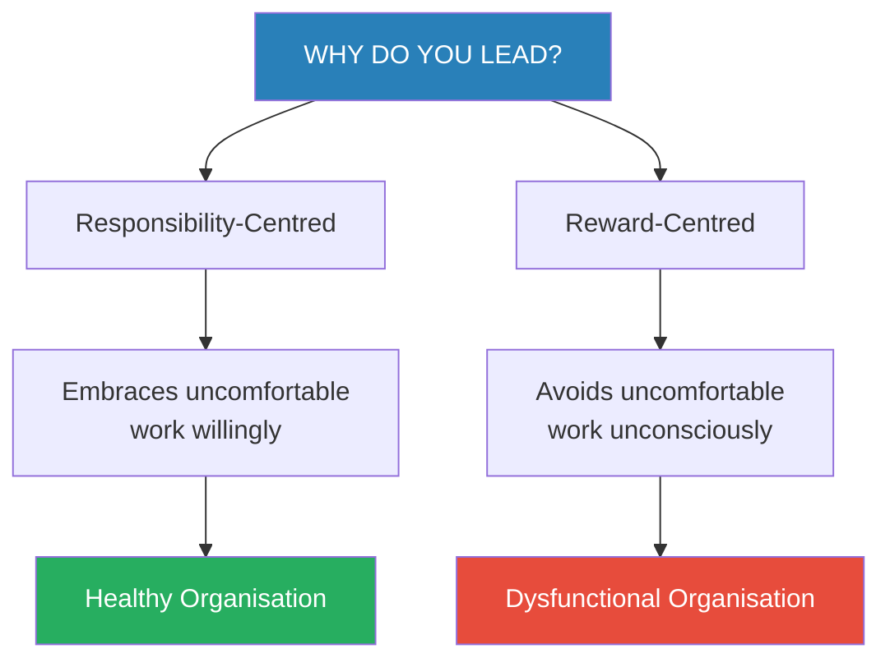
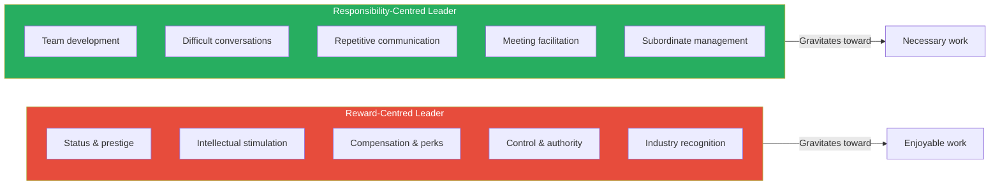
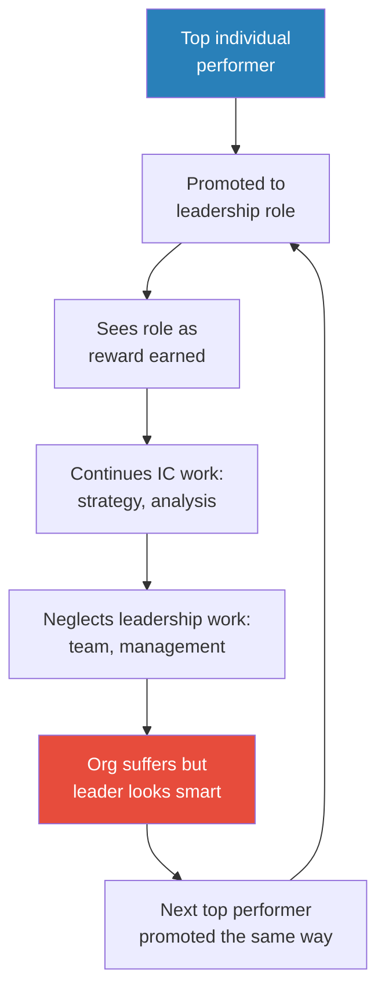
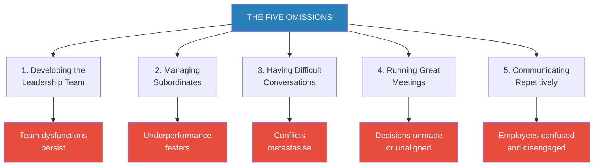
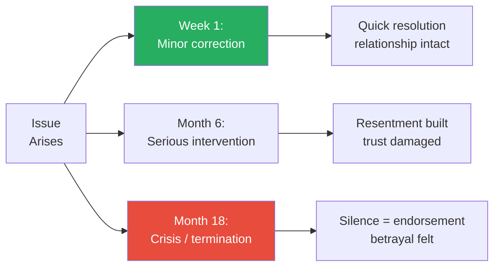
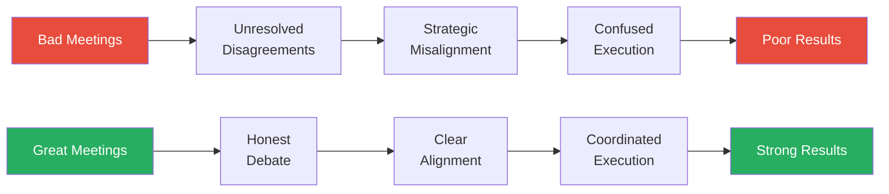
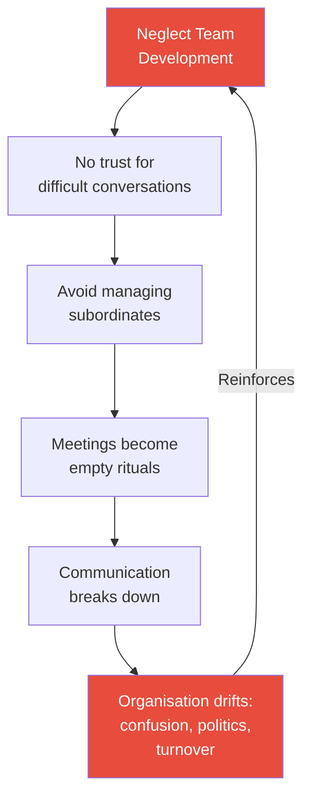

# The Motive — Patrick M. Lencioni

> Lencioni poses the question that most leadership books never think to ask: **why do you want to lead?** His answer is uncomfortable. Most leaders, he argues, pursue the role not because they are drawn to the responsibility of making other people's lives better, but because they see it as a reward — the prize for years of hard work, the corner office, the status, the compensation, the intellectual stimulation of working on big problems. This matters because the motive determines which parts of the job you actually do. Reward-centred leaders unconsciously avoid the five responsibilities that matter most: building the leadership team, managing subordinates, having difficult conversations, running great meetings, and communicating repetitively. Responsibility-centred leaders embrace those same uncomfortable tasks precisely because no one else can do them. Delivered through Lencioni's trademark fable-then-framework format, this is the shortest and most pointed of his books — a mirror held up to every leader who suspects they might be doing the fun parts of the job while neglecting the essential ones.

---

## About the Author

Patrick Lencioni is the founder and president of The Table Group, a management consulting firm specialising in organisational health and executive team dynamics, based in the San Francisco Bay Area. Before founding The Table Group, he worked at Bain & Company, Oracle, and Sybase, where he observed firsthand the patterns that distinguish healthy organisations from dysfunctional ones. He is best known for *The Five Dysfunctions of a Team*, which has sold over three million copies and become a foundational text in team leadership. His books collectively have sold over six million copies and have been translated into more than thirty languages. *The Motive* is arguably the capstone of his body of work — the book that explains why leaders fail to do the things his other books prescribe.

---

## The Big Idea

*Before you can fix how you lead, you have to confront why you lead. Lencioni argues that the motive behind seeking leadership determines everything — which tasks you embrace, which you avoid, and ultimately whether your organisation thrives or decays.*

- There are only two fundamental reasons people become leaders, and most people have never honestly examined which one drives them
- <b style="color: #2980b9">Responsibility-centred leadership</b> treats the role as a duty — the leader accepts that much of their job will be uncomfortable, tedious, and thankless, and does it anyway because the organisation needs them to
- <b style="color: #2980b9">Reward-centred leadership</b> treats the role as a prize — the leader gravitates toward the status, the intellectually stimulating work, the prestige, and the compensation, while unconsciously avoiding the parts of the job that feel like drudgery
- The distinction is not about skills, intelligence, or charisma — it is about **which parts of the job you are willing to do**
- <b style="color: #27ae60">A leader with mediocre skills but the right motive will outperform a brilliant leader with the wrong motive</b>
  - The right motive drives you toward the uncomfortable work
  - The wrong motive drives you away from it
  - Over time, that avoidance compounds — small neglects become systemic dysfunctions

The entire book pivots on this single diagnostic question — and Lencioni argues that answering it honestly is the most important thing a leader can do.

- The motive is not fixed — leaders can shift from reward-centred to responsibility-centred, but only through honest self-examination
- Most leaders are a blend of both motives, but one tends to dominate, especially under pressure
  - When the work gets boring, which motive wins?
  - When a difficult conversation is needed, which motive decides whether you have it?
  - When you could spend Tuesday morning on strategy (stimulating) or a team-building exercise (tedious), which do you choose?
- <b style="color: #e74c3c">The motive reveals itself not in what you say but in what you actually spend your time on</b>
- Lencioni positions this book as the prequel to all his other work: if your motive is wrong, you will never build a cohesive team (*The Five Dysfunctions*), never pursue organisational health (*The Four Obsessions*), and never fix your meetings (*Death by Meeting*)

---

## Key Concepts at a Glance

| Concept | One-line summary |
|---------|-----------------|
| **Responsibility-centred leadership** | Leading because the organisation needs you to do things only you can do |
| **Reward-centred leadership** | Leading because you enjoy the status, pay, and stimulation that come with the title |
| **The five omissions** | The five uncomfortable responsibilities that reward-centred leaders consistently avoid |
| **Developing the leadership team** | Building genuine trust and cohesion among your direct reports, not just sharing information |
| **Managing subordinates** | Having difficult performance and behaviour conversations instead of "trusting" people to self-manage |
| **Having difficult conversations** | Confronting interpersonal conflicts and uncomfortable truths promptly rather than hoping they resolve |
| **Running great meetings** | Treating meetings as your most important activity and investing real energy into making them productive |
| **Communicating repetitively** | Repeating key messages far more often than feels necessary because employees need seven exposures |
| **The first team concept** | Your leadership team is your primary team — not the department you run |
| **The servant-leader paradox** | True servant leadership is not weakness — it requires more courage than reward-centred leadership |
| **Organisational health** | The ultimate competitive advantage: low politics, high clarity, high morale, low turnover |

The stark gap between the two profiles reveals Lencioni's central thesis: reward-centred leaders consistently score low on every omission because each one requires embracing discomfort they are motivated to avoid.

---

# PART ONE: THE FABLE

## The Setup: Two CEOs, Two Motives

*Lencioni opens with a story designed to make you uncomfortable — because at least one of the two protagonists will remind you of yourself.*

- The fable centres on <b style="color: #2980b9">Shay Davis</b>, the CEO of **Golden Gate Alarm**, a mid-sized technology and security company in the San Francisco Bay Area
- Shay was promoted to CEO after years of excellent functional performance — he was a strong operator, a good strategist, and universally liked
- But something is wrong: despite two years in the role, the company is drifting
  - Team meetings feel flat and transactional
  - Several key executives are underperforming but nobody is addressing it
  - Strategic decisions get made but never seem to land with the broader organisation
  - Shay himself feels vaguely dissatisfied but cannot articulate why
- The catalyst arrives when Shay's board asks him to meet with <b style="color: #2980b9">Liam Alcott</b>, the CEO of **Del Mar Analytics**, a company in a related industry
  - Liam is everything Shay thinks a CEO should be — polished, charismatic, strategically impressive, well-connected in the industry
  - Liam's company has been growing and attracting talent
  - The board wants Shay to learn from Liam and possibly explore a partnership

> [!example] Shay's First Impression of Liam
> - Shay drives to Del Mar's headquarters expecting to meet a visionary leader
> - Liam's office is immaculate, his presentation is polished, and his strategic thinking is sharp
> - Liam talks about industry trends, competitive positioning, and his company's growth trajectory
> - Shay leaves feeling impressed — and inadequate
> - He wonders why his own company feels messier, slower, less impressive than Liam's
> - What Shay does not yet realise is that he is comparing surfaces, not substance
> **The lesson:** The leaders who look most impressive from the outside are often the ones most dangerously neglecting the invisible work that holds an organisation together.

---

### The Problem Beneath the Problem

*Before the fable introduces its turning point, Lencioni carefully establishes why Shay's leadership feels off — not through dramatic failures but through a slow accumulation of small avoidances.*

- Shay's company is not in crisis — it is drifting
- The symptoms are subtle enough that Shay can explain each one away individually:
  - Team meetings are "efficient" — they just happen to be lifeless
  - His VP of sales is "going through a transition" — she just happens to have been going through it for eighteen months
  - His executives "get along" — they just happen to never disagree about anything important
  - His strategy is "clear" — frontline employees just happen to have no idea what it is
- Lencioni is making a deliberate narrative choice here: <b style="color: #e74c3c">the most dangerous form of leadership failure is not the spectacular blowup — it is the slow, imperceptible erosion that no one names until it is too late</b>
- Each symptom on its own looks like a minor issue — together they form a pattern that points to a single cause
- The cause is not incompetence, and it is not laziness — it is motive
- Shay is doing all the parts of the CEO job that he finds stimulating (strategy, competitive analysis, industry positioning) and avoiding all the parts he finds tedious (team dynamics, performance conversations, repetitive communication)
- <b style="color: #27ae60">The pattern of avoidance IS the diagnosis</b>

> [!example] Shay's Calendar Tells the Truth
> - A revealing moment in the fable comes when Shay reviews his own calendar from the past quarter
> - Strategy meetings, board prep, industry events, and one-on-one meetings with his most intellectually stimulating executives dominated his time
> - Conspicuously absent: any team-building activities, any performance conversations with his underperforming VP, any all-hands communication sessions
> - When his advisor points this out, Shay's first reaction is defensive: "I was busy with important things"
> - His advisor's response cuts to the core: "Important to whom? To the company — or to you?"
> - Shay realises that his calendar reveals his true priorities — and those priorities have been serving himself, not the organisation
> **The lesson:** Your calendar does not lie. Where you spend your time reveals your motive — regardless of what you say your priorities are.

---

### The Mentor's Challenge

- Shay's real education comes not from Liam but from a series of conversations with people who force him to examine his own leadership honestly
- The pivotal figure is a trusted advisor who asks Shay a question he has never considered: **"Why did you want to be CEO?"**
- Shay's honest answer, once he stops deflecting, is revealing:
  - He liked the idea of being in charge
  - He enjoyed the status and recognition
  - He wanted to prove he could do it
  - He found the strategic and intellectual parts of the role stimulating
- What is conspicuously absent from his answer:
  - No mention of developing his people
  - No mention of the hard, tedious parts of leading
  - No mention of serving the organisation
- <b style="color: #e74c3c">The absence is the diagnosis</b> — Shay has been leading for the reward, not the responsibility

> [!tip] Core Insight
> The motive reveals itself not in grand declarations but in daily choices. When you consistently choose the stimulating work over the necessary work, the reward motive is driving.

---

### Shay Confronts His Omissions

*As the fable progresses, Shay begins to see his leadership failures through a new lens — not as skills gaps but as motivational avoidance.*

- Each conversation peels back another layer of Shay's self-deception:
  - He thought he was "empowering" his team by leaving them alone — he was actually avoiding the discomfort of managing them
  - He thought his meetings were "efficient" because they were short and information-focused — they were actually empty because no real debate or decision-making happened
  - He thought he was a "good communicator" because he sent clear emails — he had never repeated a key message enough for it to actually penetrate the organisation
  - He thought the interpersonal tension between two of his executives would "work itself out" — it had been festering for eighteen months
- Lencioni layers these revelations deliberately — each one is small enough for Shay to accept without becoming defensive
  - The accumulation creates the impact
  - No single avoidance looks catastrophic
  - But when Shay sees them together as a pattern, the diagnosis becomes undeniable

> [!example] The Unmanaged Executive
> - One of Shay's direct reports, a VP of sales, had been consistently underperforming
> - The numbers were mediocre, the team's morale was low, and other executives had privately complained
> - Shay had noticed all of this but had not had a single direct conversation about it
> - His rationalisation: "She's a professional, she knows the numbers, I don't want to micromanage"
> - The reality: Shay dreaded the awkwardness of confronting someone he liked personally
> - By the time the conversation finally happened, the damage was deep — the VP's team had lost two strong performers who got tired of working for someone who was never held accountable
> **The lesson:** "Trusting your people" and "avoiding uncomfortable conversations" look identical from the outside. The difference is the motive.

---

### The Liam Reveal

*The fable's most powerful turn comes when Shay discovers that Liam — the CEO he admired — is actually a textbook case of everything that goes wrong with reward-centred leadership.*

- As Shay spends more time with Liam, cracks appear in the polished surface:
  - Liam's executive team does not trust each other — they are polite in meetings but undermine each other behind closed doors
  - Liam has no idea what his frontline employees think or feel because he rarely communicates with anyone below his direct reports
  - Liam's meetings are presentations, not discussions — people share updates but never debate or disagree
  - When confronted about a serious interpersonal conflict between two of his VPs, Liam shrugs: "They're adults, they'll figure it out"

> [!example] Liam's Impressive Facade
> - Liam hosted an industry conference panel where he spoke brilliantly about leadership, culture, and strategic vision
> - The audience was captivated — several attendees approached Shay afterward saying how lucky the industry was to have a leader like Liam
> - Behind the scenes, Del Mar Analytics was haemorrhaging talent — three senior leaders had left in the past year
> - Liam blamed market conditions and compensation — never once considering that his leadership style was the cause
> - His favourite parts of the CEO role: strategy sessions, industry events, board presentations, media interviews
> - His least favourite parts: one-on-ones with struggling executives, team-building offsites, repeating the company's priorities for the hundredth time
> - The correlation between what he avoided and what was failing was not a coincidence
> **The lesson:** The most dangerous leaders are the ones who look like great leaders from the outside — because their organisations may be decaying from the inside while the facade remains intact.

- <b style="color: #e74c3c">Liam is the cautionary tale</b> — a brilliant, charismatic, strategically gifted CEO whose company is failing because he treats leadership as a reward rather than a responsibility
- Shay recognises Liam as a mirror of his own tendencies — the same patterns, just further along in their consequences
- This recognition is the turning point of the fable

> [!example] The Moment of Mirror Recognition
> - The pivotal scene occurs when Shay and Liam have a candid dinner conversation
> - Liam describes his philosophy of leadership with unmistakable pride: the CEO's job is to set the vision, attract talent, and represent the company externally
> - When Shay asks about team-building, Liam dismisses it: "My team is senior enough to manage themselves"
> - When Shay asks about communicating priorities to frontline employees, Liam says: "That's what middle management is for"
> - Shay hears his own rationalisations — the same phrases he has used for two years — coming from someone else's mouth
> - And for the first time, he hears how hollow they sound
> - The dinner ends with Shay not admiring Liam but pitying him — because Liam has no idea that his leadership is failing
> **The lesson:** We rarely recognise our own rationalisations until we hear them spoken by someone else. The most effective mirror for a leader is another leader with the same blind spots.

---

### Shay's Transformation

- The fable's resolution is not dramatic — it is a series of small, uncomfortable choices:
  - Shay schedules the difficult conversation with his underperforming VP that he has been avoiding for months
  - He redesigns his team meetings to include real debate and conflict, not just status updates
  - He starts repeating the company's core priorities in every all-hands meeting, every department visit, every one-on-one — even when it feels tedious
  - He invests in a genuine team-building process for his executive team, confronting the interpersonal tensions he had been ignoring
- None of these actions require new skills — they require a different **willingness**
- <b style="color: #27ae60">The transformation is not about learning something new but about choosing to do what he already knew he should be doing</b>
- Lencioni includes a subtle but important detail: Shay's transformation does not make his job more enjoyable — it makes it more meaningful
  - The difficult conversations are still difficult
  - The repetitive communication is still tedious
  - The team-building work is still uncomfortable
  - But the results — a more aligned team, a healthier culture, stronger performance — create a different kind of satisfaction than the intellectual buzz of strategy work

> [!tip] Core Insight
> Leadership transformation rarely requires new knowledge. It almost always requires new willingness — the decision to do the uncomfortable things you have been avoiding.

---

# PART TWO: THE MODEL

## The Two Motives

*Lencioni strips away the fable and presents his framework directly — a binary that is simple to understand but brutally difficult to apply to yourself honestly.*

- Every leader operates from one of two primary motives, whether they are conscious of it or not:

| Dimension | Responsibility-Centred | Reward-Centred |
|-----------|----------------------|----------------|
| **Why they lead** | The organisation needs them to do things only they can do | They earned the position through years of hard work |
| **How they see the role** | A burden they accept willingly | A prize they have won |
| **What they spend time on** | Whatever the organisation needs, especially the uncomfortable parts | Whatever they find intellectually stimulating or enjoyable |
| **How they feel about tedious work** | Accept it as part of the job | Avoid it or delegate it |
| **How they respond to conflict** | Lean into it because unresolved conflict destroys teams | Avoid it because it is unpleasant |
| **What they measure success by** | The health and results of the organisation | Their personal status, compensation, and reputation |
| **How they view their people** | As their primary responsibility | As resources who should manage themselves |

- <b style="color: #e74c3c">Most leaders have never honestly examined which motive drives them</b>
  - The reward-centred motive is socially unacceptable, so leaders rationalise it
  - "I'm empowering my team" often means "I'm avoiding the discomfort of managing them"
  - "I trust my people" often means "I don't want to have the hard conversation"
  - "I'm focused on strategy" often means "Strategy is more fun than team development"
- Lencioni is careful to note that the binary is not absolute — most leaders are a mixture
  - But one motive tends to dominate, especially under pressure
  - The dominance reveals itself in patterns: which meetings you cancel, which conversations you postpone, which work you do first on Monday morning
- The distinction also does not map onto personality types:
  - A warm, likeable leader can be deeply reward-centred (they enjoy being liked, so they avoid conversations that might make people uncomfortable)
  - A gruff, blunt leader can be deeply responsibility-centred (they have difficult conversations because the organisation needs them to, not because they enjoy confrontation)

---

The diagram illustrates the fundamental asymmetry: reward-centred leaders are pulled toward what feels good; responsibility-centred leaders are pulled toward what the organisation needs.

---

### The Servant-Leader Paradox

- Lencioni explicitly positions his argument within the servant leadership tradition but challenges a common misunderstanding of it
- <b style="color: #27ae60">Servant leadership is not passive, gentle, or accommodating — it is the most demanding form of leadership there is</b>
- The servant-leader does not serve by making people comfortable — they serve by doing the hard things that no one else will do:
  - Telling someone their performance is unacceptable
  - Forcing a team to confront its dysfunctions instead of pretending everything is fine
  - Sitting through the discomfort of a team-building exercise when they would rather be doing strategy
  - Repeating the same message for the hundredth time because the organisation needs to hear it again
- The paradox: <b style="color: #e74c3c">the leaders who avoid difficult conversations because they "don't want to hurt people" are actually the selfish ones</b> — they are prioritising their own comfort over the organisation's need for accountability
- The truly selfless act is having the conversation even though it is uncomfortable for you
- Lencioni draws a sharp line between two versions of servant leadership:
  - The **popular version**: be kind, be accommodating, put your people's feelings first, never make anyone uncomfortable
  - The **real version**: do whatever your people need you to do, even when — especially when — it is uncomfortable for both of you
  - The popular version produces leaders who are liked but ineffective
  - The real version produces leaders who are respected and transformative

> [!example] The "Nice" CEO Who Destroyed Morale
> - Lencioni describes a CEO he consulted for who was universally described as "one of the nicest leaders I've ever worked for"
> - This CEO never raised his voice, never criticised anyone publicly, and went out of his way to make people feel valued
> - But his company had a serious problem: underperformers were never confronted
> - High performers watched mediocre colleagues coast without consequence and grew resentful
> - Three of the company's best people left within eighteen months — all citing the same reason in exit interviews: "Nobody holds anyone accountable"
> - The "nice" CEO's avoidance of difficult conversations was not kindness — it was self-protection disguised as kindness
> **The lesson:** Avoiding difficult conversations feels kind in the moment but is cruel over time. The people who suffer most are the high performers who watch standards erode.

---

## Why Organisations Promote Reward-Centred Leaders

*Before examining the five specific failures, Lencioni addresses a systemic question: if reward-centred leadership is so damaging, why do organisations keep putting reward-centred people in charge?*

- The answer reveals a deep structural problem in how most organisations select leaders:
- <b style="color: #e74c3c">Most promotion systems reward exactly the traits that produce reward-centred leaders</b>
  - Individual contributor excellence gets rewarded with management positions
  - Technical brilliance gets rewarded with leadership roles
  - Strategic thinking gets rewarded with executive authority
  - None of these qualities predict willingness to do the uncomfortable work of leadership
- The person who gets promoted is usually the best individual performer — the best engineer, the best salesperson, the best analyst
  - Their reward for years of excellent individual work is a leadership position
  - They naturally see the position as a prize they have earned, not a responsibility they have accepted
  - They want to keep doing the intellectually stimulating work that got them promoted
  - They have no desire — and often no training — for the tedious interpersonal work that leadership actually requires
- This creates a predictable cycle:
  - High performers get promoted into leadership
  - They enjoy the status and continue doing individual-contributor-type work (strategy, analysis, external visibility)
  - They neglect the leadership-specific work (team building, managing, communicating)
  - The organisation suffers, but the leader's personal reputation remains intact because they are still "the smartest person in the room"
  - The cycle continues because the next generation of promotions follows the same pattern

This self-reinforcing promotion cycle explains why reward-centred leadership is systemic rather than individual — the system produces exactly what it is designed to produce.

> [!example] The Brilliant Engineer Who Became a Terrible VP
> - A technology company promoted its most talented software architect to VP of Engineering
> - He had fifteen years of technical brilliance — he could solve problems no one else could
> - As VP, he continued to spend 70% of his time on technical architecture decisions
> - He held no regular one-on-ones with his managers, ran team meetings as technical reviews, and never addressed the growing tension between two of his directors
> - When asked why he did not invest more time in people management, he said: "That's HR's job. My job is to make sure the architecture is right"
> - His team's attrition rate doubled within a year — not because of bad technology decisions, but because talented engineers felt unseen, unmanaged, and uncoached
> - The VP had been rewarded for technical excellence and was now expected to do something entirely different — and he had no motive to do it
> **The lesson:** Promoting someone for being great at one job and expecting them to be great at a completely different job is an organisational design flaw, not an individual failure. But once in the role, the individual must confront their motive.

- Lencioni argues that this structural problem does not excuse the individual leader
- Once you are in the role, you have a choice: embrace the responsibility or enjoy the reward
- Understanding why you were promoted for the wrong reasons is useful — but it does not change your obligation to lead for the right ones

---

## The Five Omissions

*Lencioni identifies five specific responsibilities that reward-centred leaders consistently neglect — not because they lack the skills, but because the work is uncomfortable, tedious, or both.*

### The Logic of the Five

- These five responsibilities share a common characteristic: <b style="color: #27ae60">they are all work that only the leader can do</b>
- Strategy can be delegated. Financial analysis can be delegated. Product development can be delegated
- But building your leadership team? Managing your direct reports? Running your meetings? Communicating the organisation's priorities? Having the hard conversations?
- <b style="color: #e74c3c">No one else can do these things for you. If you do not do them, they do not get done.</b>
- That is precisely why the motive matters so much — the reward-centred leader avoids the irreplaceable parts of their job

Each omission creates a specific organisational pathology — and the pathologies compound each other over time.

---

## Omission 1: Developing the Leadership Team

*Most leaders assemble a group of talented individuals and call it a team. Lencioni argues that a real team requires deliberate, uncomfortable work that most leaders are unwilling to do.*

- <b style="color: #2980b9">Developing the leadership team</b> means building genuine trust, vulnerability, and cohesion among your direct reports — not just gathering them in a room to share updates
- This is the most foundational of the five omissions because everything else depends on having a cohesive leadership team
  - If your leadership team is not truly aligned, every decision gets relitigated in hallways after the meeting
  - If your leadership team does not trust each other, they will not have honest debates about strategy
  - If your leadership team operates in silos, your organisation will operate in silos

---

### What Reward-Centred Leaders Do Instead

- They run leadership team meetings as **information-sharing sessions**:
  - Each executive gives a departmental update
  - The CEO listens, nods, asks a few questions
  - No one challenges anyone else's update
  - No one debates priorities or trade-offs
  - The meeting ends and everyone goes back to their silo
- They avoid **team-building work** because it feels soft, touchy-feely, and unproductive
  - "We're all adults, we don't need trust exercises"
  - "I'd rather spend that time on strategy"
  - "My team gets along fine" (meaning: no one fights openly, which is not the same as trust)
- They tolerate **silos** because breaking them down requires confrontation:
  - When sales and engineering are misaligned, fixing it means forcing two executives to have an uncomfortable conversation about priorities
  - The reward-centred leader lets each VP run their fiefdom because it is easier than mediating
- <b style="color: #e74c3c">The result: a group of talented individuals who happen to report to the same person, but who do not function as a team</b>

### What Responsibility-Centred Leaders Do

- They invest significant time — often uncomfortably so — in building genuine vulnerability-based trust among their leadership team
- They treat team cohesion as a prerequisite for everything else:
  - Before debating strategy, they ensure the team can have honest, ego-free conversations
  - Before cascading priorities to the organisation, they ensure the leadership team is genuinely aligned (not just politely agreeable)
- They actively break down silos:
  - They design meetings where executives must engage with each other's problems, not just report on their own
  - They make it clear that "first team" loyalty is to the leadership team, not to each executive's department
- They view team-building activities not as soft extras but as essential infrastructure:
  - Just as you would not skip building the foundation of a house, you should not skip building the relational foundation of a team

### The "First Team" Concept

- One of the most powerful ideas embedded in this omission is what Lencioni calls the <b style="color: #2980b9">first team</b> principle
- Every executive sits on two teams:
  - The leadership team they are a member of (the CEO's team)
  - The functional team they lead (their department)
- Most executives treat their department as their "first team" — the group they are most loyal to, most invested in, most protective of
- <b style="color: #27ae60">Responsibility-centred leaders make it clear that the leadership team is everyone's first team</b>
  - When the leadership team makes a decision, every executive must support it publicly — even if they argued against it privately
  - When there is a conflict between what is good for a department and what is good for the organisation, the organisation wins
  - When resources must be allocated, the leadership team collectively decides — not each VP lobbying for their own budget
- This is uncomfortable because it requires executives to sometimes act against their department's short-term interests:
  - The VP of Sales might need to support an engineering investment that reduces her budget
  - The VP of Engineering might need to delay a technical project to support a sales initiative
  - Both must do this willingly, because the leadership team agreed it was the right call
- <b style="color: #e74c3c">Without first-team loyalty, the leadership team is not a team — it is a collection of departmental ambassadors negotiating for their own interests</b>
- The reward-centred leader never enforces first-team loyalty because doing so requires confronting executives who prioritise their own departments — and that confrontation is uncomfortable

> [!example] The CEO Who Skipped Team Building
> - A CEO Lencioni consulted for had a leadership team of eight talented executives
> - Each one was individually brilliant — the best functional leaders money could buy
> - But the team never operated as a team: they attended the same meetings, shared updates, and left
> - When Lencioni suggested a two-day offsite focused on trust-building and interpersonal understanding, the CEO resisted: "We don't have time for that. We need to focus on strategy"
> - The CEO eventually agreed, reluctantly — and the offsite revealed deep resentments between the VP of Sales and the VP of Engineering that had been silently undermining product launches for two years
> - The resentment was not about strategy — it was personal. Neither executive trusted the other's motives, and neither had ever said so
> - Once surfaced and addressed, the relationship improved, product launches accelerated, and revenue increased
> - The CEO admitted later: "I avoided that offsite for eighteen months because I was afraid of what would come out"
> **The lesson:** The "soft" work of team building often surfaces the hard problems that are actually blocking results. Avoiding it is not efficiency — it is cowardice.

> [!tip] Core Insight
> A leadership team that shares information but avoids real debate is not a team — it is a collection of solo operators pretending to collaborate. Only the leader can change this.

---

## Omission 2: Managing Subordinates (and Making Them Manage Theirs)

*Of all five omissions, this is the one leaders most desperately want to escape — and the one whose absence causes the most damage.*

- <b style="color: #2980b9">Managing subordinates</b> means having regular, direct conversations about performance, behaviour, and professional development — not just reviewing metrics from a safe distance
- It means telling people things they do not want to hear: "Your performance this quarter was not acceptable." "The way you handled that meeting undermined your colleague." "You need to improve in this specific area or your role is at risk."
- <b style="color: #e74c3c">This is the responsibility that reward-centred leaders rationalise away most aggressively</b>

---

### The Rationalisations

- Reward-centred leaders deploy a repertoire of rationalisations to justify not managing their people:

| Rationalisation | What It Sounds Like | What It Actually Means |
|----------------|--------------------|-----------------------|
| **Empowerment** | "I hired great people, I should let them do their jobs" | "I don't want to have the uncomfortable conversation" |
| **Anti-micromanagement** | "I don't believe in looking over people's shoulders" | "Checking in would require me to confront problems" |
| **Trust** | "I trust my team to manage themselves" | "Managing them would require effort I'd rather avoid" |
| **Busy-ness** | "I'm too focused on strategy to get into the weeds" | "Strategy is more enjoyable than management" |
| **Egalitarianism** | "We're all peers here, I don't want to be hierarchical" | "Being the boss means having hard conversations I'd rather not have" |

- Every one of these rationalisations contains a grain of truth, which is what makes them so effective as self-deception:
  - You should empower your people — but empowerment without accountability is abandonment
  - You should not micromanage — but the opposite of micromanagement is not neglect
  - You should trust your team — but trust does not mean never checking on results
- <b style="color: #27ae60">The responsibility-centred leader finds the middle ground: clear expectations, regular check-ins, honest feedback, and genuine accountability — delivered with care but without flinching</b>

---

### The Cascading Effect

- When a CEO does not manage their direct reports, a predictable cascade follows:
  - The CEO's direct reports learn that they will not be held accountable
  - They stop managing their own direct reports with rigour
  - The pattern cascades down through the organisation
  - Within two levels, the entire management culture has eroded
- <b style="color: #e74c3c">The CEO sets the management standard for the entire organisation — whether they intend to or not</b>
  - If the CEO avoids difficult conversations, their VPs learn to avoid difficult conversations
  - If the CEO treats one-on-ones as optional, their VPs treat one-on-ones as optional
  - If the CEO tolerates underperformance, the entire organisation learns that underperformance is tolerated
- This is why the "making them manage theirs" part of the omission matters so much:
  - It is not enough for the CEO to manage their own direct reports
  - The CEO must also ensure that every manager in the chain is managing their reports
  - This requires asking uncomfortable questions: "Have you had the conversation with Sarah about her performance?" "What was the outcome?" "When is the follow-up?"

> [!example] The VP Who Was Never Managed
> - A VP of marketing had been in her role for three years
> - Her department produced adequate but uninspired work — campaigns were competent but never exceptional
> - The CEO had never once given her direct feedback about the quality of her department's output
> - When asked about it, the CEO said: "She knows marketing better than I do, I trust her judgement"
> - What the CEO had actually done was abdicate his responsibility — he was so afraid of having an awkward conversation about quality that he convinced himself it was not his place to comment
> - The VP, meanwhile, assumed the CEO was satisfied because no one had said otherwise
> - When the company brought in an outside consultant who provided honest feedback, the VP was shocked — and angry: "Why didn't anyone tell me this two years ago?"
> - She ultimately improved significantly, but two years of mediocre output had already damaged the company's brand
> **The lesson:** Not giving feedback is not the same as giving positive feedback. Silence communicates satisfaction — even when you are dissatisfied.

---

> [!example] The Star Performer Who Left
> - A senior engineer was the highest performer on his team — consistently delivering exceptional work
> - His manager (who reported to the CEO) was a classic reward-centred leader: friendly, likeable, but conflict-avoidant
> - Two of the engineer's peers were chronic underperformers — regularly missing deadlines and producing subpar work
> - The manager never addressed the underperformance, rationalising it as "they're going through a rough patch"
> - The star engineer watched this for fourteen months, growing increasingly frustrated
> - He eventually left for a competitor, citing in his exit interview: "I can't work in a place where mediocrity is accepted"
> - The manager was surprised. The CEO was surprised. Nobody should have been surprised
> **The lesson:** When you tolerate underperformance, the person who pays the highest price is not the underperformer — it is the high performer who watches standards erode.

> [!tip] Core Insight
> The opposite of micromanagement is not absence — it is thoughtful, regular, honest management. Leaders who confuse the two destroy their organisations through neglect.

---

## Omission 3: Having Difficult and Uncomfortable Conversations

*Closely related to managing subordinates but broader in scope — this omission covers every uncomfortable conversation a leader avoids, not just performance discussions.*

- <b style="color: #2980b9">Difficult conversations</b> include:
  - Confronting a peer about behaviour that is damaging the team
  - Telling a board member something they do not want to hear
  - Addressing an interpersonal conflict between two executives
  - Delivering bad news to the organisation
  - Challenging a popular decision that you believe is wrong
  - Admitting that you made a mistake
- The common thread: all of these conversations are uncomfortable for the leader, and the reward-centred leader avoids discomfort

---

### Why Leaders Avoid Them

- The primary driver is not lack of skill — it is <b style="color: #e74c3c">emotional avoidance</b>
- Difficult conversations trigger specific fears:
  - Fear of damaging a relationship
  - Fear of being seen as harsh or unfair
  - Fear of conflict and the emotional residue it leaves
  - Fear of being wrong about the feedback
  - Fear of the other person's emotional reaction
- Reward-centred leaders are particularly susceptible because they value the relational perks of leadership:
  - Being liked, respected, and admired
  - Having harmonious relationships with their team
  - Being seen as a "good boss"
- <b style="color: #e74c3c">Every avoided conversation is a bet that the problem will resolve itself. That bet almost never pays off.</b>
- Problems that are not addressed early do not disappear — they metastasise:
  - A small interpersonal friction becomes a factional war
  - A minor performance issue becomes a pattern of underperformance
  - A quiet disagreement about priorities becomes a strategic drift that takes years to correct

### The Cost of Delay

- Lencioni is emphatic about the relationship between time and damage:
  - A difficult conversation in week one is a minor correction
  - The same conversation in month six is a serious intervention
  - The same conversation in month eighteen is a crisis — and may require termination rather than coaching
- <b style="color: #e74c3c">Delay does not reduce the difficulty of the conversation — it increases it exponentially</b>
- The dynamics change with delay:
  - After a week, you are giving feedback on a single incident
  - After six months, you are confronting an established pattern — and the person will reasonably ask: "Why didn't you say something sooner?"
  - After eighteen months, you have implicitly endorsed the behaviour by tolerating it, and the person feels betrayed when you finally raise it
- The compound cost:
  - Other team members lose confidence in your leadership ("If the boss won't address this, who will?")
  - The behaviour becomes normalised — other people begin mirroring it
  - The high performers who are frustrated by the unaddressed problem leave — and they leave silently, without drama, because they have concluded that leadership does not care

The cost of delay is not linear — it is exponential. What begins as a five-minute correction becomes an organisational crisis.

> [!example] The Feedback That Came Two Years Late
> - A CFO had a habit of dominating meetings — interrupting colleagues, dismissing ideas that were not financially grounded, and using his command of the numbers to win every argument
> - The CEO noticed this in the CFO's first month but said nothing — the CFO's financial acumen was genuinely valuable
> - Over two years, the pattern entrenched: other executives stopped contributing ideas in meetings where the CFO was present
> - Innovation stalled because no one wanted to propose anything that had not already been financially validated
> - When the CEO finally confronted the CFO, his response was devastating: "You've watched me do this for two years and said nothing. I assumed this was what you wanted"
> - He was right — the CEO's silence had been interpreted as endorsement
> - The conversation was far harder at month twenty-four than it would have been at month one
> **The lesson:** Every day you delay a difficult conversation, you are making it harder — not because the issue gets more complex, but because your silence retroactively endorses the behaviour.

### What Happens When You Have Them

- Lencioni's experience across hundreds of organisations reveals a consistent pattern:
  - Leaders dread the conversation for weeks or months
  - The conversation itself is uncomfortable but rarely as bad as anticipated
  - The relief afterward is immediate and significant
  - The relationship typically improves, not worsens — because most people prefer honest feedback to being silently judged
  - The issue begins to resolve
- There is a physiological dimension to this:
  - The anticipation of a difficult conversation triggers far more anxiety than the conversation itself
  - Leaders who develop the habit of having difficult conversations quickly report that the anticipatory dread diminishes over time
  - It never disappears entirely — but it becomes manageable, like stage fright for an experienced speaker
- <b style="color: #27ae60">The conversation you are avoiding is almost always the most important conversation you could have</b>

> [!abstract] Lencioni's Framework for Difficult Conversations
> 1. Identify the specific behaviour or issue — not a vague feeling, but a concrete observation
> 2. Do it quickly — the longer you wait, the harder it gets and the more damage accumulates
> 3. Be direct — do not soften the message so much that it becomes unclear
> 4. Show genuine care — make it clear that you are having this conversation because you care about the person and the organisation, not because you enjoy it
> 5. Follow up — one conversation is not enough; check in to see whether the issue is improving

---

> [!example] The Eighteen-Month Conflict
> - Two VPs on a leadership team had a deep interpersonal conflict that everyone on the team knew about
> - The CEO had noticed the tension from the beginning — subtle jabs in meetings, refusal to collaborate, separate lunch tables
> - For eighteen months, the CEO hoped the problem would resolve itself
> - His reasoning: "They're both adults. If I intervene, I'll look like I'm babysitting"
> - The conflict did not resolve — it escalated. Each VP began building a factional alliance, and the leadership team split into two camps
> - When the CEO finally intervened (at a consultant's insistence), the conversation took forty-five minutes
> - Both VPs admitted they had been waiting for someone to address it. Both were relieved
> - The CEO's delay had cost the company eighteen months of factional infighting, three departures, and at least two missed strategic opportunities
> **The lesson:** The conversation you are dreading will take less than an hour. The cost of not having it compounds every day you delay.

---

## Omission 4: Running Great Team Meetings

*Most leaders treat meetings as a necessary evil. Lencioni argues they are the most important thing a leader does — and that bad meetings are not an organisational curse but a personal failure of leadership.*

- <b style="color: #2980b9">Running great meetings</b> means investing real energy and structure into the forums where the leadership team makes decisions, debates priorities, and aligns on direction
- Lencioni has written an entire book on this topic (*Death by Meeting*), and *The Motive* explains the precondition: <b style="color: #27ae60">you will never fix your meetings unless you believe they are your most important activity</b>
- Reward-centred leaders treat meetings as interruptions to their real work
- Responsibility-centred leaders treat meetings as their real work

---

### Why Meetings Are the Leader's Primary Job

- Meetings are where the leadership team:
  - Debates and resolves strategic disagreements
  - Aligns on priorities so the organisation moves in one direction
  - Surfaces problems before they become crises
  - Holds each other accountable for commitments
  - Builds the trust and cohesion that makes everything else possible
- <b style="color: #27ae60">If your meetings are bad, your decisions are bad. If your decisions are bad, your organisation fails.</b>
- The causal chain is direct and unavoidable:
  - Bad meetings → unresolved disagreements → misalignment → confused execution → poor results
  - Good meetings → honest debate → clear alignment → coordinated execution → strong results

The quality of meetings directly determines the quality of organisational outcomes — there is no shortcut around this mechanism.

---

### What Bad Meetings Look Like

- Lencioni identifies a pattern that is almost universal in reward-centred organisations:

| Symptom | What Happens | Why It Matters |
|---------|-------------|----------------|
| **Information dumps** | Each executive gives a departmental update; no one engages with anyone else's | No alignment, no debate, no decisions |
| **No conflict** | Disagreements are either suppressed or expressed only in private after the meeting | Decisions are not truly made; they are relitigated in hallways |
| **Low energy** | People check phones, multitask, or mentally disengage | The leader's lack of investment signals that meetings do not matter |
| **No clear outcomes** | Meetings end without explicit decisions or accountability | People leave unsure what was decided or who owns what |
| **Too many topics** | Everything gets discussed superficially; nothing gets discussed deeply | Critical issues receive the same attention as trivial ones |
| **Same format always** | Every meeting looks the same regardless of purpose | Strategic conversations get compressed into operational status-update formats |

- <b style="color: #e74c3c">The leader is responsible for every one of these failures</b>
  - If the meeting is an information dump, it is because the leader designed it that way
  - If there is no conflict, it is because the leader does not create safety for disagreement
  - If energy is low, it is because the leader does not bring energy
  - If outcomes are unclear, it is because the leader does not insist on clarity

### What Great Meetings Require

- Great meetings require the leader to do things that are uncomfortable:
  - **Create conflict** — deliberately surface disagreements instead of letting them stay buried
  - **Stay engaged** — put away the phone, make eye contact, ask probing questions, model the behaviour you want
  - **Insist on decisions** — do not let the meeting end until there is explicit agreement on what was decided and who owns it
  - **Separate meeting types** — use different meeting structures for different purposes (daily check-ins, weekly tactical meetings, monthly strategic conversations, quarterly offsites)
  - **Mine for conflict** — when the room goes quiet and everyone seems to agree, that is the moment to probe: "Does anyone see this differently?" "What are we missing?" "Who disagrees but is not saying so?"

> [!example] The CEO Who Transformed His Meetings
> - A CEO ran weekly leadership team meetings that lasted ninety minutes and followed the same format every week: departmental updates followed by any new business
> - The meetings were lifeless — executives attended but did not engage, checked their phones, and left as quickly as possible
> - The CEO complained to Lencioni that his team was "not strategic enough"
> - Lencioni observed one meeting and diagnosed the problem immediately: the meeting was structured to prevent strategic conversation
> - Ninety minutes of updates left no time for debate, disagreement, or decision-making
> - The CEO restructured: daily 10-minute standups for updates, weekly 60-minute tactical meetings for real-time problem-solving, and monthly 3-hour strategic meetings for one or two deep-dive topics
> - The transformation was dramatic — within a month, the team was having the most productive conversations of their tenure
> - The CEO admitted: "I was running bad meetings because I didn't think meetings were important enough to invest real energy in"
> **The lesson:** Bad meetings are not caused by bad teams. They are caused by leaders who do not believe meetings are their most important work.

> [!abstract] Lencioni's Meeting Architecture
> 1. **Daily check-in** (5-10 minutes) — quick sync on priorities, no sitting down, no discussion
> 2. **Weekly tactical** (45-90 minutes) — real-time issues, problem-solving, accountability review
> 3. **Monthly strategic** (2-4 hours) — one or two big topics, deep discussion, genuine debate
> 4. **Quarterly offsite** (1-2 days) — team cohesion, big-picture strategy, interpersonal dynamics

> [!tip] Core Insight
> If you dread your meetings, you are probably running them wrong. If you think meetings are unimportant, you are probably a reward-centred leader who prefers working alone on stimulating problems.

---

## Omission 5: Communicating Constantly and Repetitively to Employees

*The final omission is the one that feels the most tedious — and that is precisely why reward-centred leaders neglect it.*

- <b style="color: #2980b9">Communicating constantly and repetitively</b> means saying the same things — the organisation's mission, values, strategic priorities, and current focus areas — over and over and over, far more often than feels necessary or natural
- Lencioni's guideline: <b style="color: #27ae60">employees need to hear a message at least seven times before it truly penetrates</b>
- Most leaders say something once (maybe twice) and assume the organisation has heard it, understood it, and internalised it
- This assumption is almost always wrong

---

### Why Leaders Stop Repeating

- The reward-centred leader stops repeating because:
  - **Boredom** — saying the same thing for the tenth time feels mind-numbing
  - **Ego** — "I already said this, why do I have to say it again?"
  - **Assumption of competence** — "These are smart people, they heard me the first time"
  - **Fear of being patronising** — "If I say it again, they'll think I think they're stupid"
- Every one of these reactions prioritises the leader's comfort over the organisation's need
- <b style="color: #e74c3c">The leader's boredom with the message is completely irrelevant</b> — what matters is whether employees have actually absorbed it

### Why Repetition Is Essential

- Employees are drowning in information — emails, Slack messages, meetings, projects, deadlines
- A single communication from the CEO, no matter how clear, is just one signal in a sea of noise
- Without repetition:
  - People hear the message but do not internalise it
  - People interpret it differently depending on their role and context
  - People forget it within days as other priorities take over
  - Different parts of the organisation develop different understandings of what matters
- With repetition:
  - The message begins to feel like "just the way things are here" — which is exactly the goal
  - Alignment improves because everyone has heard the same priorities reinforced repeatedly
  - New employees absorb the message quickly because it is in the air, not just in an onboarding deck
- <b style="color: #27ae60">When you are so tired of saying something that you feel absurd saying it again — that is the moment it is finally beginning to sink in</b>

### How to Communicate Repetitively Without Being Monotonous

- The key is **same message, different contexts**:
  - Say it in all-hands meetings
  - Say it in one-on-ones
  - Say it when visiting different departments
  - Say it when explaining a decision: "We chose this approach because of our priority to..."
  - Say it when recognising someone: "What Sarah did exemplifies our commitment to..."
  - Say it when course-correcting: "We got off track from our priority of..."
- The message does not change, but the delivery vehicle changes every time
- This is not scripted — it is woven into every interaction naturally
- The leader becomes a living, breathing broadcast tower for the organisation's priorities

> [!example] The CEO Employees Could Quote
> - A responsibility-centred CEO Lencioni worked with had three strategic priorities for the year
> - She mentioned them in every all-hands meeting, every department visit, every email to the company, and every one-on-one with her direct reports
> - After six months, she tested the organisation informally: she asked random employees at different levels what the company's priorities were
> - Almost every person could name all three — not from memory of a slide deck, but because they had heard the CEO say them dozens of times in different contexts
> - By contrast, Lencioni ran the same test at a company led by a reward-centred CEO — fewer than 20% of employees could name even one strategic priority
> - The difference was not the quality of the strategy; it was the frequency of communication
> **The lesson:** If you ask ten random employees what the company's top three priorities are and they cannot answer, you have not communicated enough — regardless of how many emails you have sent.

> [!example] The All-Hands That Changed Nothing
> - A CEO held a well-produced all-hands meeting to announce a new strategic direction
> - The presentation was polished, the messaging was clear, the Q&A was thoughtful
> - The CEO was satisfied that the organisation was now aligned
> - Two weeks later, the CEO's chief of staff surveyed middle managers and found that fewer than half could accurately describe the new direction
> - Of those who could, many had already reverted to their previous priorities
> - The CEO was frustrated: "I told them! It was a great presentation!"
> - The problem was not the quality of the communication — it was the quantity. One excellent presentation cannot overcome the gravitational pull of existing habits and information overload
> **The lesson:** A single well-crafted communication is never enough. Repetition is not a sign of failure — it is the mechanism of success.

> [!tip] Core Insight
> The leader who says "I already told them" is confusing speaking with communicating. Speaking is what you do. Communicating is what they absorb. The gap between the two is filled by repetition.

---

## How the Five Omissions Interact

*The five omissions are not independent — they form an interconnected system where each failure amplifies the others.*

- When leaders neglect team development, they lack the trust needed for difficult conversations
- When they avoid difficult conversations, management breaks down
- When management breaks down, meetings become empty rituals
- When meetings are empty, communication never reaches the organisation

The five omissions create a self-reinforcing cycle of organisational decay — each failure makes the others worse.

- The cycle also works in reverse:
  - When you invest in team development, trust grows
  - Trust makes difficult conversations possible
  - Difficult conversations enable genuine management
  - Genuine management makes meetings productive
  - Productive meetings create clear communication
  - Clear communication creates a healthy organisation
- <b style="color: #27ae60">The virtuous cycle starts with the same thing the vicious cycle starts with: the leader's willingness to do the uncomfortable work</b>
- The practical implication is that you do not need to fix all five at once
  - Start with team development — it creates the trust foundation for everything else
  - As trust grows, the other omissions become easier to address
  - But you must start somewhere, and you must start with genuine discomfort — if the first step feels easy, you are probably not doing it right

The hottest cells cluster around team development and difficult conversations — neglecting either one cripples multiple other responsibilities, confirming Lencioni's advice to start with trust-building as the foundation for everything else.

---

## The Diagnostic: Are You Reward-Centred?

*Lencioni provides a set of honest questions that reveal which motive is driving your leadership — if you are willing to answer them truthfully.*

- The hardest part of this diagnostic is that reward-centred leaders are experts at rationalising:
  - They do not see themselves as selfish or lazy
  - They genuinely believe they are leading well
  - The rationalisations are sophisticated and partially true
- Lencioni's diagnostic questions cut through the rationalisations by focusing on behaviour, not beliefs:

> [!abstract] The Motive Diagnostic
> 1. When you have a choice between working on strategy and having a team-building conversation, which do you choose?
> 2. When an executive is underperforming, how quickly do you address it? Days? Weeks? Months? Never?
> 3. How many times have you communicated this quarter's priorities? Can random employees name them?
> 4. When was the last time your leadership team had a genuinely uncomfortable conversation in a meeting — where real disagreement was surfaced and resolved?
> 5. If you were told that the CEO role would involve no increase in compensation, no change in title, and no external recognition — would you still want it?
> 6. Which parts of your job do you look forward to? Which parts do you dread? Does the dread list include any of the five responsibilities?
> 7. When you cancel a meeting because you are "too busy," what are you busy with? Is it truly more important, or is it more enjoyable?

- The pattern that emerges from honest answers is usually clear:
  - If you consistently choose stimulating work over uncomfortable work, the reward motive is dominant
  - If you can describe your strategic vision in detail but cannot name the interpersonal issues on your leadership team, the reward motive is dominant
  - If your employees cannot articulate the company's priorities, you have not communicated enough — regardless of how many memos you have sent

### What the Reward Motive Looks Like at Different Levels

- The reward motive is not exclusive to CEOs — it manifests at every level of leadership, with different symptoms:

| Level | What the Reward Looks Like | What Gets Neglected |
|-------|---------------------------|-------------------|
| **First-line manager** | Title bump, authority over former peers, no longer doing "grunt work" | Coaching direct reports, having performance conversations, running team meetings |
| **Director** | Larger budget, bigger team, visibility to senior leadership | Cross-functional collaboration, managing underperforming managers, cascading priorities |
| **VP** | Executive team membership, strategic influence, industry recognition | Team cohesion with peer VPs, communicating down to frontline, confronting peer conflicts |
| **CEO** | Ultimate authority, compensation, public profile, board relationships | All five omissions — team development, management, difficult conversations, meetings, communication |

- The higher the level, the more damaging the reward motive becomes — because the scope of neglect grows with the scope of responsibility
- <b style="color: #e74c3c">At the CEO level, the reward motive affects the entire organisation because the CEO's behaviour sets the tone for every leader below them</b>

The blast radius of reward-centred leadership scales with seniority — a first-line manager's avoidance damages one team, while a CEO's avoidance cascades through the entire organisation.

---

## The Path from Reward to Responsibility

*Lencioni does not present the two motives as fixed personality types — he argues that leaders can shift from reward-centred to responsibility-centred, but only through honest self-examination and deliberate practice.*

- The shift requires three things:

### 1. Honest Self-Diagnosis

- Most leaders have never honestly asked themselves why they want to lead
- The question is uncomfortable because the honest answer often includes elements of ego, status, and self-interest
- <b style="color: #27ae60">Acknowledging the reward motive is not shameful — it is the necessary first step toward changing it</b>
- Almost everyone who pursues leadership has some reward motive — the question is whether you let it dominate your behaviour

### 2. Redefining What "Good Work" Feels Like

- Reward-centred leaders define a "good day" as one spent on stimulating, intellectually challenging work
- Responsibility-centred leaders define a "good day" as one where they did the things the organisation needed — even if those things were tedious or uncomfortable
- This redefinition does not happen overnight — it is a gradual shift in what you value and how you measure your own contribution
- The key insight: <b style="color: #27ae60">the satisfaction of responsibility-centred leadership is deeper and more lasting than the stimulation of reward-centred leadership</b>
  - The reward-centred leader feels a buzz after a great strategy session — and emptiness when the buzz fades
  - The responsibility-centred leader feels satisfaction after a difficult conversation that improved someone's performance — and that satisfaction compounds as the organisation gets healthier

### 3. Building New Habits

- Once you have diagnosed yourself honestly and redefined what "good work" means, the change is practical:
  - Schedule the team-building time you have been avoiding
  - Have the difficult conversation this week, not next month
  - Restructure your meetings to include real debate
  - Start repeating your priorities in every interaction
  - Check in with your direct reports about their performance — honestly, specifically, regularly

| Stage | Action | Time Frame |
|-------|--------|------------|
| **Diagnosis** | Answer the diagnostic questions honestly | This week |
| **Commitment** | Choose one omission to address first | This week |
| **Action** | Have the first uncomfortable conversation or restructure the first meeting | Within two weeks |
| **Repetition** | Continue the new behaviour even when it feels unnatural | Ongoing |
| **Reinforcement** | Ask your team for feedback on whether you are actually changing | Monthly |

- <b style="color: #e74c3c">The most dangerous moment is the first relapse</b> — the day you skip the team check-in because "something more important came up"
- That "something more important" is almost always something more enjoyable — and the reward motive has won again
- Lencioni is realistic about the difficulty of this shift:
  - It is not a one-time decision — it is a daily recommitment
  - There will be days when the reward motive wins
  - The question is not whether you will relapse but how quickly you recognise the relapse and correct course
  - Over time, the responsibility motive becomes more natural — not because the uncomfortable work becomes enjoyable, but because the results make the discomfort worth it

The effort-impact crossover occurs around months 2-6 — initial diagnosis is high-effort but low-impact, while the compounding effect of sustained repetition eventually produces organisational transformation that far exceeds the ongoing effort.

---

## How The Motive Connects to Lencioni's Other Works

*The Motive functions as a prequel and diagnostic key to Lencioni's entire body of work — it explains why leaders fail to implement the frameworks from his other books.*

- Lencioni has spent his career building a coherent system of organisational health frameworks:

| Book | Framework | What The Motive Adds |
|------|-----------|---------------------|
| [[The Four Obsessions of an Extraordinary Executive - Patrick M. Lencioni\|The Four Obsessions]] | Build a cohesive team, create clarity, over-communicate, reinforce through systems | Explains WHY leaders fail to pursue these obsessions — the reward motive makes them avoid the uncomfortable parts |
| *The Five Dysfunctions of a Team* | Trust, conflict, commitment, accountability, results | Explains WHY leaders tolerate dysfunctions — addressing them requires uncomfortable work that reward-centred leaders avoid |
| *Death by Meeting* | Four types of meetings for four types of decisions | Explains WHY leaders run bad meetings — they do not believe meetings are their most important work |
| *The Ideal Team Player* | Humble, hungry, smart | Describes the individual virtues; The Motive describes the leadership motive that makes those virtues possible at the organisational level |
| [[The Culture Code - Daniel Coyle\|The Culture Code]] | Build safety, share vulnerability, establish purpose | Coyle's research supports Lencioni's argument — building safety and sharing vulnerability require the discomfort that reward-centred leaders avoid |

- <b style="color: #27ae60">If you have read Lencioni's other books and wondered why the advice is hard to implement, The Motive is the answer: you may be leading for the wrong reason</b>
- The Motive also reveals a pattern across Lencioni's body of work:
  - Every one of his frameworks requires the leader to do something uncomfortable
  - Building trust requires vulnerability (uncomfortable)
  - Creating healthy conflict requires surfacing disagreements (uncomfortable)
  - Over-communicating requires repetition (tedious)
  - Holding people accountable requires confrontation (uncomfortable)
  - The motive determines whether you are willing to endure that discomfort

---

## The Verdict

The Motive's greatest contribution is its diagnostic power. Most leadership books assume the reader already wants to lead for the right reasons and just needs better tools. Lencioni challenges that assumption head-on. By positing that the motive matters more than the method, he explains a pattern that every organisation has witnessed: the brilliant, well-trained leader who somehow fails to do the basic things that make an organisation healthy. The answer is not more training — it is more honesty about why you wanted the job in the first place. This framing is genuinely useful because it shifts the conversation from "what should I do?" to "am I willing to do it?" — and that willingness question is far more diagnostic than any competency assessment.

The book's weaknesses are the same ones that run through all of Lencioni's work: the evidence base is entirely anecdotal, drawn from his consulting practice rather than rigorous research. The binary framing of reward versus responsibility, while clarifying, oversimplifies — most leaders are a complex blend of both motives that shifts depending on the situation, their energy levels, and the organisational context. The fable characters are somewhat schematic, serving the argument rather than reflecting the messy reality of actual leadership. And the book is light on structural and systemic factors — it places the entire burden on the individual leader's motive without acknowledging that some organisational designs make responsibility-centred leadership nearly impossible (boards that reward only financial metrics, for example, actively encourage reward-centred behaviour).

The reader who benefits most from this book is the mid-career leader who has recently been promoted to a senior role and is struggling to define what their job actually is. If you find yourself spending most of your time on strategy, industry events, and intellectually stimulating projects while your team drifts, your meetings are lifeless, and your direct reports are unmanaged — this book will diagnose the problem in a way that no skills-based framework can. It is also valuable for anyone who manages leaders, because the motive framework provides a lens for understanding why some leaders consistently fail to do the basics despite having the talent and training.

Compared to Lencioni's other works, The Motive is the most focused and the most uncomfortable. [[The Four Obsessions of an Extraordinary Executive - Patrick M. Lencioni|The Four Obsessions]] tells you what to do; The Motive asks whether you are willing to do it. Compared to Drucker's [[The Effective Executive - Peter Drucker|The Effective Executive]], which provides a similar emphasis on what leaders should spend time on, Lencioni goes one layer deeper by asking why leaders resist spending time on the right things. And compared to Coyle's [[The Culture Code - Daniel Coyle|The Culture Code]], which demonstrates the mechanisms of healthy group culture, The Motive explains the leadership prerequisite: none of Coyle's three skills (build safety, share vulnerability, establish purpose) will be pursued by a leader who finds them tedious and unrewarding.

---

## Related Reading

- [[The Four Obsessions of an Extraordinary Executive - Patrick M. Lencioni]] — The companion piece; Four Obsessions tells you WHAT to do, The Motive explains WHY you resist doing it
- [[The Effective Executive - Peter Drucker]] — Drucker's five habits of effectiveness share DNA with Lencioni's five omissions — both are about doing the necessary work rather than the enjoyable work
- [[The Culture Code - Daniel Coyle]] — Coyle's research on group culture provides the empirical evidence that Lencioni's consulting observations lack
- [[7 Rules of Power - Jeffrey Pfeffer]] — A contrasting perspective: Pfeffer argues leaders must accumulate power to be effective, while Lencioni argues they must embrace responsibility
- [[Crucial Conversations - Kerry Patterson]] — Provides the practical toolkit for Lencioni's third omission (having difficult conversations)
- [[The Phoenix Project - Gene Kim]] — Another business fable that dramatises organisational dysfunction, but from an IT/DevOps perspective rather than a leadership-motive perspective
