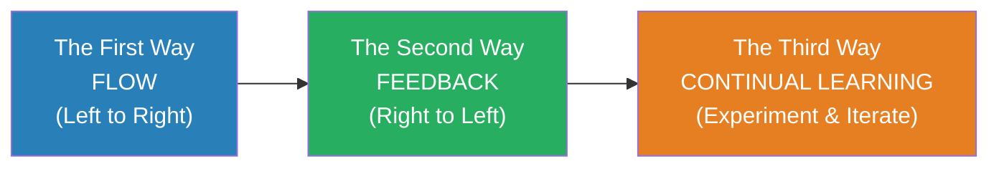
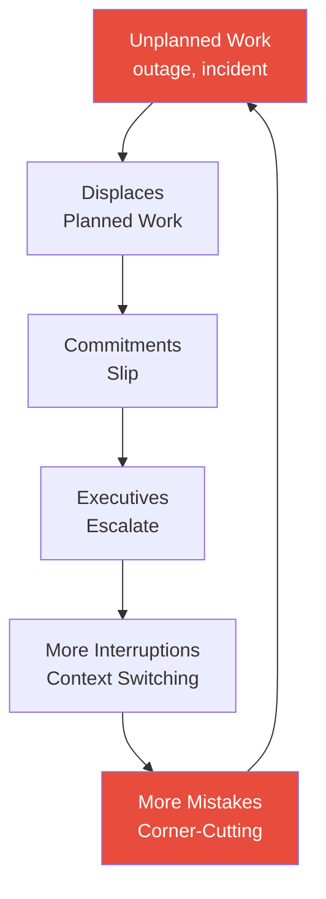
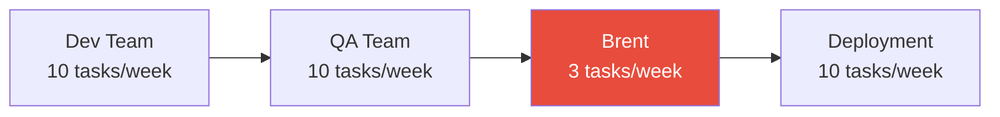
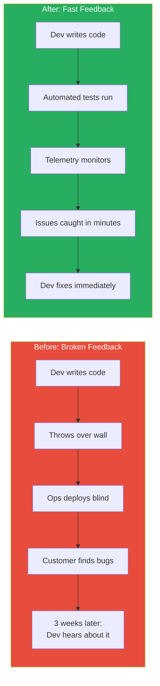
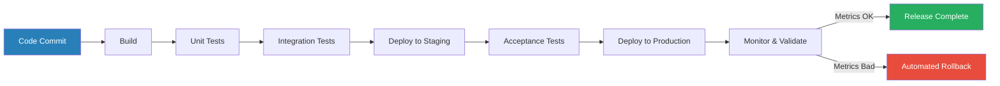
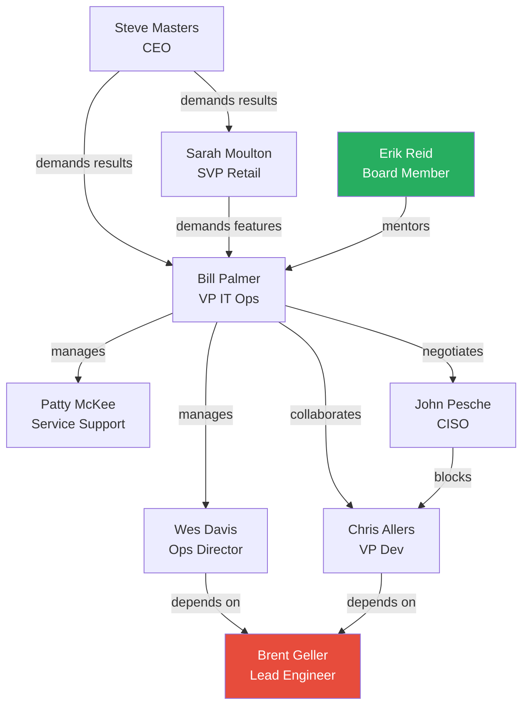

# The Phoenix Project — Gene Kim

> Bill Palmer is having the worst Tuesday of his career. He has just been promoted to VP of IT Operations at Parts Unlimited, a $4 billion auto parts manufacturer — and within hours he discovers that the company's most critical initiative, the Phoenix Project, is months behind schedule, millions over budget, and threatening to sink the entire company. Payroll is broken. Auditors are circling. The CEO has given IT ninety days to fix everything or the whole department gets outsourced. Into this chaos steps Erik Reid, an eccentric board member who walks Bill through a manufacturing plant and asks a question that changes everything: "What are the four types of work?" Over the next ninety days, Bill learns that IT is not a mysterious black box — it is a production line, and the same principles that revolutionised manufacturing can transform how technology organisations operate. *The Phoenix Project* is the origin story of the DevOps movement, told as a novel that makes you feel every crisis, every breakthrough, and every argument along the way.

---

## About the Author

Gene Kim is a researcher, author, and former CTO who spent thirteen years studying high-performing technology organisations. He co-authored *The Phoenix Project* with Kevin Behr and George Spafford, drawing on Eliyahu Goldratt's *The Goal* — the manufacturing novel that inspired this book's format — and on Kim's own research into what distinguishes elite IT organisations from struggling ones. Kim later co-authored *The DevOps Handbook* (the non-fiction companion that translates the novel's lessons into concrete practices) and *The Unicorn Project* (a sequel told from a developer's perspective). His work has become foundational reading in technology leadership worldwide, and the vocabulary he introduced — The Three Ways, the Four Types of Work, the concept of "Brent the bottleneck" — has entered common usage across the industry.

---

## The Big Idea

- <b style="color: #2980b9">IT work is work — and it follows the same physical laws as any other kind of work</b>
- Work in progress clogs the system. Bottlenecks determine throughput. Uncontrolled changes introduce chaos. Invisible work is unmanageable work.
- The insight that manufacturing principles apply to technology work seems obvious in retrospect, but it was revolutionary when Kim dramatised it in 2013
- Most IT departments treat their work as fundamentally different from factory work — creative, unpredictable, impossible to standardise
- Kim's argument is that this belief is both wrong and self-serving: it lets IT avoid accountability while guaranteeing poor outcomes
- <b style="color: #27ae60">The Three Ways provide a philosophical framework for transforming IT from firefighting to flow</b>:
  - **The First Way:** Optimise the flow of work from left (development) to right (operations/customer)
  - **The Second Way:** Amplify feedback loops from right (operations/customer) to left (development)
  - **The Third Way:** Foster a culture of experimentation, risk-taking, and learning from failure
- <b style="color: #e74c3c">When IT departments ignore these principles, the result is predictable: missed deadlines, broken systems, burned-out engineers, and executives who view technology as a liability</b>

The Three Ways form a progression: you cannot build meaningful feedback loops until work flows predictably, and you cannot foster experimentation until feedback tells you what is working and what is not.

---

## Key Concepts at a Glance

| Concept | One-line summary |
|---------|-----------------|
| **The Three Ways** | Flow, Feedback, Continual Learning — the philosophical pillars of DevOps |
| **Four Types of IT Work** | Business projects, internal IT projects, changes, unplanned work |
| **Unplanned Work** | The silent killer — crowds out all planned work and feeds on itself |
| **Theory of Constraints** | The system's throughput is limited by its single biggest bottleneck |
| **WIP Limits** | Stop starting, start finishing — limit work in progress to increase throughput |
| **Brent the Bottleneck** | One person who is the constraint for every critical system — the anti-pattern |
| **Make Work Visible** | You cannot manage what you cannot see — kanban boards expose hidden queues |
| **Deployment Pipeline** | Automated build-test-deploy reduces risk and increases speed simultaneously |
| **Change Management** | 80% of outages are caused by changes — controlling changes reduces unplanned work |
| **IT as Manufacturing** | The factory floor metaphor that unlocks everything else |
| **Wait Time Formula** | Resources at high utilisation have exponentially growing queue times |
| **Ten Deploys Per Day** | The North Star — frequent, small, automated releases instead of quarterly terror |

---

## Part One: The Crisis (Chapters 1-8)

*Bill Palmer inherits a burning building, and every attempt to put out one fire starts another — because nobody can see the full picture of what IT actually does.*

### Bill's Terrible Tuesday

- Bill Palmer is a mid-level IT manager at Parts Unlimited, a $4 billion auto parts company headquartered in Elkhart Grove
- He is called into CEO Steve Masters' office and told he has been promoted to VP of IT Operations — his predecessor, Luke, has been fired
- Within hours of his promotion, Bill discovers:
  - The Phoenix Project (a massive e-commerce and ERP initiative) is months behind schedule and millions over budget
  - Payroll processing has broken — 5,000 employees may not get paid on time
  - An audit finding from John, the Chief Information Security Officer, threatens the company's ability to process credit cards
  - The SAN (storage area network) has failed, taking multiple systems offline
- <b style="color: #e74c3c">Every problem is urgent. Every problem needs the same people. Nobody knows what anyone else is working on.</b>

> [!example] The Payroll Disaster (Chapter 2)
> - Bill arrives Monday morning to find that payroll cannot run — the system that calculates and distributes pay for 5,000 employees is broken
> - The development team made a database change on Friday as part of Phoenix work — they did not tell operations, and nobody tested the impact on payroll
> - The change was not tracked, not reviewed, and not communicated across teams
> - Bill's team scrambles over the weekend, working through the night to manually reconstruct payroll data
> - Some employees get paid late; some get incorrect amounts; the finance team is furious
> - HR fields hundreds of calls from panicked employees who cannot pay their bills
> **The lesson:** A single uncontrolled change to a shared database, invisible to the teams that depend on it, caused a company-wide crisis affecting thousands of people.

> [!example] The SAN Failure (Chapter 3)
> - The SAN (storage area network) that supports multiple critical systems goes down
> - Nobody is sure what caused it — recent changes are not documented
> - Bill's team begins troubleshooting, but they need Brent — the one engineer who understands how the SAN is configured
> - Brent is already working on three other emergencies simultaneously
> - Recovery takes far longer than it should because no runbooks exist and Brent's knowledge is entirely in his head
> **The lesson:** When critical knowledge lives in one person's head, every outage becomes a hostage situation.

### The Cast of Characters

| Character | Role | Function in the Story |
|-----------|------|----------------------|
| **Bill Palmer** | VP of IT Operations | Protagonist — learns the hard way, then the right way |
| **Erik Reid** | Board member, plant operations guru | Socratic mentor — teaches by asking questions, not giving answers |
| **Steve Masters** | CEO of Parts Unlimited | Sets the 90-day deadline; initially threatening, eventually supportive |
| **Wes Davis** | Director of Distributed Technology | Bill's operations lieutenant — loyal, reactive, always firefighting |
| **Patty McKee** | Director of IT Service Support | Process-oriented, becomes Bill's change management champion |
| **Brent Geller** | Lead engineer | The brilliant constraint — knows everything, touches everything |
| **Chris Allers** | VP of Application Development | Leads the Phoenix dev team; initially adversarial, later collaborative |
| **Sarah Moulton** | SVP of Retail Operations | Business sponsor of Phoenix; embodies the disconnect between business demands and IT capacity |
| **John Pesche** | CISO | Security enforcer; blocks everything in the name of compliance |

---

### The Phoenix Project Itself

*The Phoenix Project is Parts Unlimited's bet-the-company initiative — and it is failing for every predictable reason.*

- Phoenix is a combined e-commerce platform and ERP modernisation effort
- It has been in development for years, absorbing enormous resources
- The scope has grown repeatedly — every business unit has added requirements
- Nobody has a clear view of what Phoenix actually includes or when it will be done
- <b style="color: #2980b9">Phoenix is a textbook example of a death march project</b> — too big, too complex, too many stakeholders, no clear ownership of delivery
- Sarah Moulton, the SVP of Retail Operations, is pushing hard to launch Phoenix because the business is losing market share to competitors with better online capabilities
- She views IT's inability to deliver as incompetence, not understanding the systemic causes

> [!tip] Core Insight
> Phoenix is not failing because of bad engineers or lazy developers. It is failing because Parts Unlimited's IT organisation has no system for managing work flow, no visibility into what work is in progress, no control over changes, and no way to protect critical resources from being overwhelmed. The project is a symptom. The disease is the system.

---

## Part Two: Erik and the Factory (Chapters 9-16)

*An eccentric board member takes Bill on a factory tour and asks the question that changes everything: "What are your four types of work?"*

### Meeting Erik Reid

- Erik Reid is an unusual board member — he made his fortune in manufacturing and logistics, not technology
- He approaches Bill after a board meeting and invites him to visit a Parts Unlimited manufacturing plant
- Bill is skeptical — he runs IT, not manufacturing — but accepts out of desperation
- <b style="color: #27ae60">Erik's central teaching method is Socratic: he asks questions rather than giving answers, forcing Bill to discover the principles himself</b>

> [!example] The Factory Floor Tour (Chapter 9)
> - Erik walks Bill through the manufacturing plant, pointing out the flow of materials from raw inputs to finished products
> - He shows Bill the work centres, the kanban signals, the WIP limits on the production line
> - He asks: "What do you see?" Bill sees an orderly, visible, controlled flow of work
> - Erik then asks: "How is your IT department different from this?" Bill starts to answer "completely different" — then stops
> - The realisation hits: IT work is invisible, but it follows the same physical laws
> - Work arrives from everywhere (email, hallway conversations, executive demands), enters invisible queues, competes for the same resources, and gets stuck at the same bottlenecks
> - The only difference is that you can see inventory piling up on a factory floor — you cannot see a request sitting in someone's email inbox
> **The lesson:** IT is a manufacturing plant. The fact that the work product is invisible does not mean the physics are different.

### The Four Types of IT Work

*Erik's most important lesson: all IT work falls into exactly four categories, and you cannot manage any of them until you can see all of them.*

| Type | Description | Example | Visibility |
|------|-------------|---------|------------|
| **Business Projects** | Work that serves the business directly | The Phoenix Project itself | Usually tracked (sort of) |
| **Internal IT Projects** | Infrastructure and capability improvements | Database upgrades, server migrations | Barely tracked |
| **Changes** | Modifications triggered by the first two types | Config changes, patches, deployments | Often invisible |
| **Unplanned Work** | Firefighting — the work you did not plan for | Outages, security incidents, broken payroll | Completely invisible |

The Sankey flow reveals why Brent is the bottleneck: every type of work funnels through him, and the resulting delays feed back into more unplanned work — a self-reinforcing cycle.

- Business projects get all the executive attention — they are the ones on the roadmap and in the board presentations
- Internal IT projects are the unglamorous work that keeps the lights on — they get deferred indefinitely because "there's no budget"
- Changes are the connective tissue between intention and execution — every project creates dozens of changes that need to be planned, tested, and deployed
- <b style="color: #e74c3c">Unplanned work is the most destructive because it is invisible and self-reinforcing</b>

---

### The Poison of Unplanned Work

*Unplanned work is not just inconvenient — it is a feedback loop that, left unchecked, consumes the entire organisation.*

- When you firefight instead of fixing root causes, you create the conditions for more fires
- Unplanned work displaces planned work, which means commitments slip
- Slipped commitments mean executives escalate and demand status updates
- Escalations mean more interruptions and context-switching
- More interruptions mean more mistakes
- More mistakes mean more unplanned work
- <b style="color: #e74c3c">This is a reinforcing feedback loop — a death spiral that accelerates as it grows</b>

This diagram shows the self-reinforcing nature of unplanned work: each cycle makes the next cycle worse.

> [!example] The Unplanned Work Spiral at Parts Unlimited
> - Bill asks his team to estimate how much of their time is spent on unplanned work
> - The answer comes back: roughly 75% of all engineering time is consumed by firefighting
> - This means only 25% of capacity is available for the projects executives are demanding
> - But executives plan as if 100% of capacity is available — they commit to timelines that assume zero fires
> - When those timelines inevitably slip, executives add pressure, which creates more context-switching, which creates more errors, which creates more fires
> - Bill realises that the organisation is not failing because people are incompetent — it is failing because unplanned work has consumed almost all productive capacity
> **The lesson:** If you do not measure and reduce unplanned work, every other improvement is meaningless.

> [!tip] Core Insight
> Unplanned work is the silent killer of IT organisations. It is invisible on every project plan, absent from every budget, and unaccounted for in every capacity forecast — yet it consumes the majority of engineering time in struggling organisations. You cannot fix this problem by working harder. You can only fix it by making it visible and attacking its root causes.

---

### Making Work Visible: The Kanban Board

*Bill's single most important operational decision: putting all IT work on a physical board where everyone can see it.*

- Before the kanban board, work requests arrived via email, hallway conversations, Slack messages, executive mandates, and sticky notes on monitors
- Nobody knew how much work was in progress, where it was queued, or who was blocked on what
- Bill creates a massive physical board with columns: To Do, In Progress, Waiting, Done
- Every piece of work gets a card — every card must be on the board

> [!example] The Post-It Note Revolution (Chapter 11)
> - Bill and Patty set up a wall-sized board in the IT operations area
> - They ask every team member to write every piece of work they are currently doing on a Post-It note and stick it on the board
> - The result is overwhelming — hundreds of Post-It notes covering the entire wall
> - For the first time, everyone can see the total volume of work in the system
> - Clusters of notes around certain people (especially Brent) reveal the bottlenecks immediately
> - Wes, looking at the board, says something like: "No wonder we can't get anything done — look at all this"
> - The board makes the invisible visible — and the visible can be managed
> **The lesson:** You cannot manage what you cannot see. The act of making work visible is itself transformative, because it creates shared awareness of reality.

- <b style="color: #27ae60">Making work visible is the foundation of the First Way</b> — without visibility, you cannot optimise flow
- The board also creates accountability: if a card has been "In Progress" for three weeks, everyone can see it
- It prevents executives from secretly adding work to people's queues — if it is not on the board, it does not exist

---

## Part Three: Brent the Bottleneck (Chapters 12-19)

*Bill discovers that every critical path in IT runs through one brilliant engineer — and that brilliance, without system design, becomes the system's biggest vulnerability.*

### The Brent Problem

- Brent Geller is the most talented engineer at Parts Unlimited
- He knows every system, every configuration, every workaround
- He is also involved in every escalation, every critical deployment, and every major outage recovery
- Erik asks Bill: "Who is your Brent?" — meaning, who is the single person through whom all critical work flows?

> [!example] A Day in Brent's Life
> - Bill shadows Brent for a day and sees the following:
>   - 7:30 AM: Brent starts working on a Phoenix deployment issue
>   - 8:15 AM: Interrupted by a network team member who needs help with a router configuration only Brent understands
>   - 9:00 AM: Pulled into an emergency meeting about the SAN outage
>   - 10:30 AM: Returns to Phoenix work, but has lost context and needs 20 minutes to re-orient
>   - 11:00 AM: Sarah's team has a database question — only Brent knows the schema
>   - 12:00 PM: Brent eats lunch at his desk while answering emails about three different projects
>   - 1:30 PM: A developer from Chris's team needs help with an integration test that only works when Brent sets it up
>   - 3:00 PM: An outage alert — a system Brent configured months ago is failing
>   - 5:00 PM: Brent is still working on the morning's Phoenix issue, having made almost no progress
> **The lesson:** Brent works twelve-hour days and accomplishes almost nothing — not because he is unproductive, but because every interruption destroys his focus and every system depends on him.

### The Theory of Constraints Applied to IT

*Every system has exactly one constraint — one bottleneck that limits the entire system's throughput. At Parts Unlimited, that constraint is Brent.*

- <b style="color: #2980b9">The Theory of Constraints (TOC)</b> was developed by Eliyahu Goldratt and popularised in his novel *The Goal*
- Erik teaches Bill to apply TOC to IT operations:
  - The throughput of any system is determined by its single biggest bottleneck
  - Improving anything that is NOT the bottleneck does not improve the system
  - All effort must focus on the constraint until it is no longer the constraint

The constraint determines throughput: it does not matter that every other team can process ten tasks per week if Brent can only handle three.

- <b style="color: #e74c3c">Any improvement not at the bottleneck is an illusion</b> — making the dev team faster just fills Brent's queue faster
- Making QA faster just means work reaches Brent sooner and waits longer
- The only improvements that matter are those that increase Brent's effective throughput

---

### Goldratt's Five Focusing Steps

*Bill applies Goldratt's systematic approach to break the Brent bottleneck.*

> [!abstract] The Five Focusing Steps (Theory of Constraints)
> 1. **Identify** the constraint — find the single bottleneck (Brent)
> 2. **Exploit** it — maximise the constraint's output by protecting its time (stop pulling Brent into every meeting and escalation)
> 3. **Subordinate** everything else to it — other teams adjust their pace to match the constraint's capacity, not the other way around
> 4. **Elevate** it — invest in expanding the constraint's capacity (document Brent's knowledge, cross-train other engineers, create runbooks)
> 5. **Repeat** — once the constraint moves, find the new one and start again

- Bill implements these steps in sequence:
  - **Identify:** Tracks all work requests and discovers that Brent is involved in over 80% of escalations
  - **Exploit:** Creates a rule: nobody can assign work to Brent directly — all requests go through Patty's change management process
  - **Subordinate:** Tells other teams that if they cannot get Brent's time, they must wait or find an alternative — no more pulling him off other work
  - **Elevate:** Assigns Brent a dedicated task: when he solves a problem, he must document the solution so someone else can handle it next time
  - **Repeat:** As Brent's knowledge spreads, the bottleneck begins to shift

> [!example] Protecting Brent (Chapter 14)
> - Bill tells the team that Brent is no longer available for unscheduled work
> - The reaction is immediate panic: "But we NEED Brent for everything!"
> - Bill holds firm — every request for Brent must go through the change management queue
> - The first week is brutal: work backs up, people complain, some problems take longer because others must solve them without Brent's help
> - But something unexpected happens: other engineers begin learning the systems they always relied on Brent for
> - Problems that "only Brent can fix" turn out to have solutions that others can find — it just takes them longer the first time
> - Within two weeks, Brent's queue starts shrinking and the team's collective capability starts growing
> **The lesson:** Protecting the constraint feels like slowing down. In reality, it is the only way to speed up.

> [!tip] Core Insight
> Every IT organisation has a Brent — a brilliant engineer whose involvement in everything makes them indispensable and simultaneously makes the entire system fragile. The solution is not to clone Brent or make Brent work harder. It is to systematically extract Brent's knowledge and distribute it across the team, so the system no longer depends on a single point of failure.

---

### The Wait Time Formula

*Erik teaches Bill a counter-intuitive truth about resource utilisation that explains why IT always feels overwhelmed.*

- In manufacturing, there is a well-known relationship between resource utilisation and wait time
- <b style="color: #2980b9">The Wait Time Formula</b>: as a resource approaches 100% utilisation, queue times increase exponentially — not linearly
- At 50% utilisation, the wait time is roughly equal to the processing time
- At 80% utilisation, the wait time is about 4x the processing time
- At 90% utilisation, it is about 9x
- At 99% utilisation, it is about 99x — virtually infinite

| Utilisation | Wait Time Multiplier | Impact |
|-------------|---------------------|--------|
| 50% | ~1x | Work flows smoothly |
| 70% | ~2.3x | Noticeable queuing |
| 80% | ~4x | Significant delays |
| 90% | ~9x | Everything feels stuck |
| 95% | ~19x | Crisis mode |
| 99% | ~99x | System failure |

The exponential curve reveals why "just a bit more utilisation" beyond 80% causes catastrophic queue growth — the relationship is not linear but explosive.

- Most IT organisations run their engineers at 95-100% utilisation — every hour is booked, every person is assigned to multiple projects
- <b style="color: #e74c3c">This feels efficient. It is catastrophic.</b>
- At 99% utilisation, any new request — even a small one — enters a queue that takes 99 times longer than the actual work
- This is why "simple" requests in most IT organisations take weeks: not because the work is hard, but because the queue is infinite

> [!example] The Highway Analogy
> - Erik explains the wait time formula to Bill using a highway analogy
> - When a highway is at 50% capacity, traffic flows freely
> - At 80%, you start seeing slowdowns
> - At 95%, a single car braking causes a traffic jam that lasts for hours
> - At 100%, gridlock — nothing moves
> - IT departments that run their people at 100% utilisation are traffic jams — not because the road is too small, but because there is no room to absorb variation
> **The lesson:** Leave slack in the system. Utilisation above 80% guarantees that everything will be slow and nothing will be predictable.

---

## Part Four: The First Way — Flow (Chapters 16-22)

*Bill implements the principles of flow and watches as the chaos begins to subside — not because people work harder, but because the system works better.*

### WIP Limits: Stop Starting, Start Finishing

- <b style="color: #2980b9">Work in Progress (WIP) limits</b> are a core lean manufacturing principle that Bill applies to IT
- The idea is simple: limit the number of tasks that can be "in progress" at any time
- When everything is priority one, nothing is — WIP limits force prioritisation

> [!abstract] How WIP Limits Work
> 1. Set a maximum number of items that can be in progress per person or per team
> 2. When the limit is reached, no new work can start until something finishes
> 3. If someone is blocked, they help someone else finish their work rather than starting something new
> 4. Work that is "waiting" counts against WIP — queue time is not free
> 5. Review and adjust limits as the team learns what sustainable flow looks like

- Counter-intuitively, <b style="color: #27ae60">limiting WIP increases throughput</b>:
  - Less context-switching means higher quality and faster completion
  - Blocked work gets resolved instead of ignored
  - Priorities become clear because you can only have a few things in flight
  - Cycle time (from start to finish) drops dramatically
  - Teams finish work instead of accumulating half-done tasks

> [!example] Bill Enforces WIP Limits (Chapter 17)
> - Bill announces that each team member can have a maximum of three tasks in progress
> - The pushback is fierce: "But I'm juggling twelve things! You want me to just stop?"
> - Bill explains: yes, exactly — pick the three most important, finish them, then pick the next three
> - Wes argues that executives will not accept this — they expect everything to happen simultaneously
> - Bill makes a key decision: he will manage executive expectations rather than letting them overload the system
> - Within two weeks, tasks that previously took three weeks to complete start finishing in days
> - The team is doing less at any given moment — but delivering far more overall
> **The lesson:** People resist WIP limits because it feels like slowing down. The results prove otherwise: less starting, more finishing.

---

### Reducing Batch Sizes

- In manufacturing, reducing batch sizes is one of the most powerful levers for improving flow
- Instead of producing 10,000 units of one thing, then switching to 10,000 units of another (creating massive inventory and long lead times), lean plants produce small batches of each item in rapid succession
- Bill applies this to IT releases:
  - Instead of massive quarterly releases that take weeks to prepare and terrify everyone, move toward smaller, more frequent deployments
  - Smaller batches mean smaller risks
  - Smaller risks mean faster recovery when something goes wrong
  - Faster recovery means less fear of deploying
  - Less fear means more frequent releases
  - More frequent releases mean faster feedback from customers

> [!tip] Core Insight
> Big releases are scary precisely because they are big. The fear is rational — a quarterly release bundles hundreds of changes, any one of which could break something. The solution is not to make big releases less scary. It is to make releases small enough that they are not scary at all.

---

### Reducing Handoffs and Queues

- Every time work passes from one team to another, it enters a queue
- Every queue adds delay
- Every handoff loses context — the receiving team must spend time understanding what was done and why
- <b style="color: #e74c3c">In many IT organisations, a piece of work touches six to eight teams before reaching production</b>
  - Developer writes code
  - QA tests it
  - Security reviews it
  - DBA approves the database changes
  - Operations schedules the deployment
  - Networking configures the firewall rules
  - Change Advisory Board approves the change
  - Release management coordinates the deployment window
- Each handoff adds days to weeks of queue time
- Bill begins consolidating handoffs and eliminating unnecessary queues

---

## Part Five: The Second Way — Feedback (Chapters 19-25)

*Optimising forward flow is only half the equation. The Second Way ensures that information flows backward — from production into development, from customers into product decisions, from operations into architecture.*

### Feedback Loops at Parts Unlimited

- Before Bill's transformation, the feedback loops at Parts Unlimited were almost nonexistent:
  - Development had no visibility into how their code performed in production
  - Operations learned about new deployments when they broke things
  - The business learned about IT capacity when projects were already late
  - Customers experienced problems long before anyone at Parts Unlimited knew about them
- <b style="color: #27ae60">The Second Way is about shortening and amplifying every feedback loop in the system</b>

This diagram shows the transformation from weeks-long feedback to minutes-long feedback.

---

### Telemetry: Seeing What Is Happening

- <b style="color: #2980b9">Telemetry</b> is the practice of instrumenting applications and infrastructure so that you can see what is happening in real time
- Bill learns that Parts Unlimited's production environment is essentially a black box — when something breaks, the team must guess what went wrong, manually check logs, and hope someone remembers the last change
- Erik pushes Bill to build monitoring and alerting into every critical system

> [!abstract] Building Telemetry
> 1. Instrument applications to report key metrics (response time, error rate, throughput)
> 2. Monitor infrastructure health (CPU, memory, disk, network)
> 3. Create dashboards that show current state at a glance
> 4. Set up alerts that fire when metrics cross thresholds
> 5. Ensure alerts go to the team that can actually fix the problem — not a generic inbox
> 6. Track trends over time to catch degradation before it becomes an outage

- With telemetry in place, the team starts catching problems before customers report them
- Response time drops from days to hours to minutes
- <b style="color: #27ae60">The shift from reactive to proactive is transformational — the team goes from being the last to know to the first to know</b>

---

### Peer Review and Change Control

- The payroll disaster was caused by a single change that was not reviewed, not tested, and not communicated
- Bill and Patty implement a formal change management process:
  - Every change must be logged in the system before it is made
  - Changes are categorised by risk: standard (pre-approved), normal (reviewed), and emergency (post-hoc review)
  - High-risk changes require peer review — another engineer must review the change before it goes to production
  - <b style="color: #2980b9">CAB (Change Advisory Board)</b> meetings review the week's changes and flag potential conflicts

> [!example] The Change Management Transformation (Chapter 20)
> - Before change control, Parts Unlimited averaged 3-4 major incidents per week — most caused by uncontrolled changes
> - Bill and Patty implement a simple rule: no change goes to production without being logged, categorised, and reviewed
> - Initially, the team resists: "This is bureaucracy! You're slowing us down!"
> - Bill shows them the data: 80% of their outages are caused by changes — if they control changes, they eliminate 80% of their unplanned work
> - Within a month, major incidents drop from 3-4 per week to less than one
> - The team has more time for planned work because they spend less time fighting fires
> - Even the skeptics begin to appreciate the process
> **The lesson:** Change management is not bureaucracy. It is the single most effective lever for reducing unplanned work.

---

### Automated Testing: The Safety Net

- Before the transformation, testing at Parts Unlimited is manual, sporadic, and slow
- A full regression test takes two weeks — meaning that after every change, the team either waits two weeks for confidence or skips testing entirely
- Most teams skip testing. The result is predictable: bugs reach production, cause outages, and create unplanned work
- Bill's team builds an automated test suite that runs against every change:
  - **Unit tests** verify individual components in isolation — fast, running in seconds
  - **Integration tests** verify that components work together — slower, running in minutes
  - **Acceptance tests** verify business-level functionality — the slowest, but the most valuable for catching customer-facing bugs
- <b style="color: #27ae60">Automated testing does not eliminate risk — it reduces the feedback delay from weeks to minutes</b>
- A developer who breaks something finds out in five minutes (from the automated test) instead of three weeks (from a customer complaint)
- This short feedback loop changes behaviour: developers become more careful, more incremental, and more confident

---

### Shared Pain: Dev and Ops Together

- In the traditional model, developers write code and "throw it over the wall" to operations
- Operations then deploys it, discovers it does not work in production, and scrambles to fix it
- Developers, meanwhile, have already moved on to the next feature — they feel none of the pain their code causes in production
- <b style="color: #e74c3c">This separation of responsibility is the root cause of the Dev vs. Ops conflict</b>

> [!example] The "It Works on My Machine" Problem
> - Chris's development team delivers a Phoenix build that passes all developer tests
> - When Wes's operations team deploys it, the application crashes — the configuration in production is different from the developer's local environment
> - Chris says: "It works on my machine — it's an ops problem"
> - Wes says: "Your code doesn't run in production — it's a dev problem"
> - Neither side is wrong; both are right — but the finger-pointing solves nothing
> - Bill brings both teams into the same room and establishes a rule: the team that writes the code participates in deploying it
> - When developers experience their own deployment failures firsthand, they start writing code that is easier to deploy, configure, and monitor
> **The lesson:** Separation of responsibility creates separation of incentives. When the people who build something share responsibility for running it, they build it differently.

- Bill begins requiring developers to participate in deployment and to be on-call for the systems they build
- When developers feel the pain of their own broken deployments, they start writing more deployable code
- The shift is cultural as much as procedural — it breaks down the "us vs. them" mentality that has defined the Dev-Ops relationship

> [!tip] Core Insight
> When the people who create a problem never experience its consequences, they have no incentive to prevent it. Shared pain is not punitive — it is informational. It closes the feedback loop between action and consequence.

---

## Part Six: The Third Way — Continual Learning (Chapters 22-28)

*The Third Way creates a culture where improvement is not a project but a habit — where experimentation is encouraged, failure is studied, and knowledge is shared.*

### Allocating Time for Improvement

- If 100% of capacity is consumed by project work and firefighting, there is zero capacity for improving the system that does the work
- Bill learns to reserve 20% of engineering capacity for internal improvements and technical debt reduction
- This means telling executives that IT can deliver less project work in the short term
- <b style="color: #27ae60">The payoff is enormous: investing in improvement reduces firefighting, which frees up MORE capacity than was invested</b>

> [!example] The 20% Investment (Chapter 23)
> - Bill proposes reserving 20% of IT capacity for internal improvements
> - Steve Masters, the CEO, pushes back: "We're already behind! You want to do LESS?"
> - Bill shows Steve the data: 75% of capacity is consumed by unplanned work. Investing 20% in root-cause fixes could cut unplanned work to 25%, freeing up 50% of previously wasted capacity
> - Steve agrees to a trial period
> - In the first month, the team fixes a dozen recurring issues that had been causing weekly fires
> - Unplanned work drops. Planned work delivery increases. The 20% investment generates a 3x return
> **The lesson:** Investing in improvement is not a luxury — it is the only way out of the firefighting trap.

---

### Blameless Post-Mortems

- When something goes wrong, the instinct in most organisations is to find someone to blame
- Blame creates fear. Fear creates hiding. Hiding prevents the organisation from learning.
- <b style="color: #2980b9">Blameless post-mortems</b> ask "what happened?" not "whose fault was this?"
- The goal is to understand the system failure, not to punish the individual
- Bill implements post-mortems for every significant incident:
  - What happened, in chronological order?
  - What was the root cause?
  - What did we learn?
  - What will we change to prevent recurrence?
  - Who owns each action item, and by when?

| Blame Culture | Learning Culture |
|---------------|-----------------|
| "Who did this?" | "What happened?" |
| People hide mistakes | People report mistakes immediately |
| Root causes stay hidden | Root causes are found and fixed |
| Same incidents recur | Incidents are prevented |
| Engineers fear change | Engineers embrace controlled change |

- <b style="color: #e74c3c">In a blame culture, the rational response to a mistake is to hide it. In a learning culture, the rational response is to share it so everyone benefits.</b>

---

### Knowledge Sharing and Documentation

- Brent's bottleneck status is a symptom of hoarded knowledge — not intentionally hoarded, but knowledge that lives in one person's head because nobody ever took the time to write it down
- The fix is documentation, cross-training, and runbooks that distribute capability across the team
- Bill implements several practices:
  - When Brent solves a problem, his first task is to write a runbook so someone else can handle it next time
  - New hires shadow experienced engineers during their first weeks
  - The team maintains a wiki of known issues and solutions
  - <b style="color: #27ae60">The goal is to make the organisation resilient to the departure of any single person</b>

> [!example] The Runbook Revolution
> - Brent is asked to create runbooks for the twenty most common escalations he handles
> - He resists at first — "It's faster if I just do it myself"
> - Bill insists: "Faster for you, slower for the system"
> - Over the next month, Brent documents procedures for common database recovery, SAN troubleshooting, deployment rollbacks, and network configuration
> - Other engineers begin using the runbooks to handle issues independently
> - Brent's escalation rate drops by 60%
> - The team's collective capability grows as knowledge moves from Brent's head to shared documentation
> **The lesson:** Knowledge in one person's head is a liability. Knowledge in a runbook is an asset.

---

### Practising Failure

*The Third Way recognises that failure is inevitable — the question is whether you practise for it or improvise through it.*

- Instead of waiting for the next crisis and improvising, teams practise recovery in controlled conditions
- This concept later became formalised as <b style="color: #2980b9">game days</b> and "chaos engineering" (Netflix's Chaos Monkey is the famous example)
- Bill begins running incident simulations:
  - "What happens if the primary database fails?"
  - "What happens if we lose the network link between data centres?"
  - "What happens if a deployment goes wrong at 2 AM?"
  - "What happens if Brent is unavailable for a week?"
- Each simulation reveals gaps in documentation, process, and knowledge
- Fixing those gaps before a real crisis prevents the crisis from becoming a catastrophe

> [!example] The Database Failure Drill
> - Bill schedules a game day: simulate the primary database going offline during business hours
> - The team discovers that nobody except Brent knows how to initiate failover to the backup database
> - The runbook for database failover was last updated eighteen months ago and references servers that no longer exist
> - The backup database itself has not been tested in months — when they try to bring it online, it is missing three months of schema changes
> - In a real outage, this would mean hours of downtime and potential data loss
> - After the drill, the team updates the runbook, tests the backup, automates the failover process, and trains three additional engineers
> - When a real database issue occurs two months later, the team handles it in fifteen minutes — without Brent
> **The lesson:** The time to discover that your disaster recovery plan does not work is during a drill, not during a disaster.

---

## Part Seven: The Transformation (Chapters 25-35)

*Bill's ninety-day journey from chaos to competence — tracked through the key milestones that change Parts Unlimited's IT from a cost centre to a strategic asset.*

### The Deployment Pipeline Breakthrough

*Parts Unlimited goes from quarterly releases that require heroic all-weekend efforts to multiple deployments per day that nobody even notices.*

- In the early chapters, deployments at Parts Unlimited are terrifying:
  - A release requires weeks of preparation, a change freeze, a deployment window (usually a weekend), and an "all hands on deck" war room
  - Each release bundles hundreds of changes from dozens of developers
  - When something goes wrong (and it always does), rolling back is nearly impossible because the changes are intertwined
  - The team dreads release weekends — they associate deployment with pain

> [!example] The Quarterly Release From Hell (Chapter 5)
> - The Phoenix team attempts a major release on a Saturday morning
> - Within an hour, the deployment encounters errors — database migrations fail, configuration files are wrong, integration points break
> - The team works through Saturday night into Sunday, manually fixing issues as they arise
> - By Sunday evening, some features work but others are broken
> - The release is "completed" — but the next week is consumed by emergency patches
> - Chris's development team blames operations for a bad deployment; Wes's operations team blames development for untestable code
> - Neither side is wrong; both are right — the process is the problem
> **The lesson:** Big, infrequent releases are inherently dangerous because they bundle too many changes, making failures inevitable and rollbacks impossible.

- Bill's team builds an automated deployment pipeline:
  - Code is checked into version control
  - Automated tests run against every change
  - If tests pass, the change is automatically deployed to a staging environment
  - Staging mirrors production — same configuration, same data patterns
  - After validation in staging, the change can be deployed to production with a single command
  - Rollback is automated — if metrics degrade after deployment, the system reverts automatically

> [!abstract] The Deployment Pipeline
> 1. Developer commits code to version control
> 2. Automated build compiles the code
> 3. Unit tests run automatically
> 4. Integration tests verify system-level behaviour
> 5. Code is deployed to staging environment
> 6. Acceptance tests and monitoring validate staging
> 7. One-click deployment to production
> 8. Telemetry monitors production health post-deployment
> 9. Automated rollback if metrics degrade

This pipeline automates the path from code commit to production, with safety gates at every stage.

- <b style="color: #27ae60">The result is transformative: releases go from quarterly terror to daily routine</b>
- Each release is small — a few changes instead of hundreds
- Small releases are easy to test, easy to monitor, and easy to roll back
- Deployment becomes boring — which is exactly the goal

---

### The Phoenix Launch

- After months of systematic improvement, the Phoenix Project finally launches
- The launch is not a dramatic event — it is a routine deployment, validated by automated tests, monitored by telemetry
- The system works. Customers can use the new e-commerce platform. Orders flow. The business starts seeing revenue from the investment.
- <b style="color: #27ae60">Steve Masters does not outsource IT. Instead, he recognises IT as a strategic capability — a competitive advantage, not a cost centre.</b>

> [!example] Steve Masters' Realisation (Chapter 33)
> - Steve Masters, who ninety days earlier threatened to outsource all of IT, calls Bill into his office
> - He tells Bill that IT's transformation has changed how he thinks about the entire company
> - He realised that Parts Unlimited's competitive advantage is not in its warehouses or its supply chain — it is in the technology that connects products to customers
> - IT is not the department that keeps the lights on — it is the factory floor of the digital enterprise
> - Steve promotes Bill and makes IT a strategic pillar of the company's growth strategy
> **The lesson:** When IT operates well, executives stop seeing it as a cost to be minimised and start seeing it as an asset to be invested in.

---

### Sarah's Arc: The Business-IT Divide

- Sarah Moulton represents the business side of the divide — she needs Phoenix to launch to save her retail business unit from competitors
- She views every delay as IT incompetence and every process as bureaucracy
- Throughout the novel, her relationship with Bill evolves:
  - Early: adversarial — she sees Bill as an obstacle to getting things done
  - Middle: frustrated — she understands the constraints but cannot accept them
  - Late: collaborative — she participates in prioritisation, understands WIP limits, and works with IT rather than against it

> [!example] Sarah's "Everything Is Priority One" (Chapter 10)
> - Sarah comes to Bill with a list of twenty features that are "all critical" for the Phoenix launch
> - Bill asks her to rank them — which is the most important?
> - Sarah insists they are all equally important and all must be done simultaneously
> - Bill shows her the kanban board: there are six engineers available, and each feature takes one engineer two weeks. It is physically impossible to do twenty features simultaneously with six engineers.
> - Sarah is furious — she views this as an excuse, not a reality
> - Bill asks: "If you had to launch with only five features, which five would you choose?"
> - After resisting, Sarah names her top five. Those five get done in three weeks. The business launches with the highest-value features first.
> **The lesson:** When the business refuses to prioritise, IT cannot deliver anything effectively. Forcing prioritisation is not obstruction — it is the only path to delivery.

---

### John's Arc: Security as Enabler

- John Pesche, the CISO, begins the novel as an antagonist — blocking changes, filing audit findings, and demanding compliance
- His approach to security is "say no to everything until it is proven safe"
- <b style="color: #e74c3c">This approach creates massive delays without actually improving security</b> — it just pushes teams to work around John rather than with him
- The irony is devastating: by making security so onerous, John creates incentives for people to bypass security entirely
  - Developers make changes without telling the security team
  - Operations skips security reviews to meet deadlines
  - The result is LESS security, not more — exactly the opposite of John's intention

> [!example] The Audit Crisis (Chapter 6)
> - John files audit findings that threaten Parts Unlimited's ability to process credit card payments
> - The findings are legitimate — there are real security vulnerabilities in the systems
> - But John's approach is to demand immediate remediation of everything, with no prioritisation
> - Bill is forced to divert engineers from Phoenix work to address audit findings
> - The audit work creates more unplanned work, which slows Phoenix further
> - John does not understand why Bill cannot simply "fix everything at once" — he does not see the capacity constraints
> - Eventually, Bill and John negotiate a risk-based prioritisation: address the highest-risk findings first, schedule the rest into normal work flow
> **The lesson:** Security demands that ignore capacity constraints do not improve security — they just create chaos and drive workarounds.

- Over the course of the novel, John evolves:
  - He learns that security reviews integrated into the deployment pipeline are faster AND more effective than gate-keeping reviews
  - Automated security scanning catches more issues than manual reviews
  - By participating in the design process rather than reviewing at the end, security concerns are addressed earlier and more cheaply
  - John moves from "Department of No" to trusted partner who helps teams build secure systems from the start

> [!tip] Core Insight
> Security that blocks delivery without improving outcomes is not security — it is theatre. True security is built into the process, not bolted on at the end.

---

## The IT-Manufacturing Parallel: A Deeper Look

*The novel's deepest structural argument is that IT work and manufacturing work are governed by the same principles — and that IT's refusal to acknowledge this is the source of its dysfunction.*

### Work Centres, Routing, and Flow

- In a factory, work flows through <b style="color: #2980b9">work centres</b> — machines and stations that perform specific operations in a defined sequence
- The routing of work is visible, standardised, and measured
- In IT, "work centres" are teams and individuals (network team, DBA team, security review, etc.)
- But the routing is invisible — nobody maps the path a piece of work takes from request to delivery
- Bill maps IT work flows and discovers:
  - A single feature request touches 8-12 work centres before reaching production
  - Most of the elapsed time is waiting in queues, not actual work time
  - The ratio of work time to wait time is often 5% to 95% — meaning work spends 95% of its life waiting

| Manufacturing | IT Equivalent |
|---------------|--------------|
| Raw materials | Requirements |
| Work centre | Team or individual |
| Routing | Workflow / pipeline |
| WIP inventory | Tasks in progress |
| Finished goods | Deployed features |
| Defects | Bugs and outages |
| Batch size | Release size |
| Cycle time | Lead time to production |

The radar makes the transformation unmistakable: applying manufacturing discipline to IT work produced gains across every dimension, with the largest improvements in deployment frequency and feedback speed.

- <b style="color: #27ae60">Once you see IT through the manufacturing lens, the solutions become obvious</b>: reduce WIP, identify constraints, shrink batch sizes, shorten feedback loops, and make flow visible

---

### Why IT Resists the Manufacturing Metaphor

- IT professionals often reject the comparison to manufacturing, arguing that their work is creative, unpredictable, and unique
- Erik's counter-argument is pointed:
  - The creative part (architecture, design, problem-solving) IS unique — but it is a small fraction of total IT work
  - The vast majority of IT work is repetitive, processable, and standardisable: deployments, patching, monitoring, change management, incident response
  - <b style="color: #e74c3c">The belief that IT is fundamentally different is not just wrong — it is the excuse that prevents improvement</b>
  - Manufacturing used to make the same argument: "Every product is different, every machine is unique, you cannot standardise this." Then Toyota proved otherwise.

---

## The Phoenix Project's Key Relationships

*The novel works because its characters represent real organisational archetypes — and the dynamics between them mirror what actually happens in technology companies.*

This diagram maps the key relationships and power dynamics in the novel.

### The Dev-Ops Divide

- Chris Allers (VP of Development) and Wes Davis (Director of Operations) represent the classic Dev vs. Ops conflict:
  - Chris's team is measured on features delivered — they want to ship fast
  - Wes's team is measured on system stability — they want to change nothing
  - These incentives are directly opposed, creating a structural conflict that no amount of goodwill can resolve
  - <b style="color: #2980b9">DevOps</b> — the movement the book inspired — is fundamentally about aligning these incentives
- The conflict plays out in recurring patterns:
  - Dev ships code that breaks in production → Ops blames Dev for poor quality
  - Ops blocks deployments with lengthy review processes → Dev blames Ops for slow delivery
  - Each side develops a narrative about the other side being the problem
  - Both narratives are partially true and completely unhelpful
- The solution is not to make Dev or Ops "win" — it is to create shared goals:
  - Both teams share responsibility for uptime AND delivery speed
  - Both teams participate in deployments
  - Both teams are measured on business outcomes, not activity metrics
  - When an outage happens, both teams own the post-mortem — no finger-pointing, only shared learning
  - Deployment becomes a team sport, not a handoff between adversaries
- <b style="color: #27ae60">The term "DevOps" is not about merging teams — it is about merging incentives</b>
- The novel makes this shift feel inevitable — once you see the structural conflict between Dev and Ops incentives, the solution is obvious. But implementing it requires leadership courage, because it means changing how people are measured and rewarded.

---

## The Ninety-Day Transformation: A Timeline

*The novel tracks Bill's journey from chaos to competence across ninety days. Each phase builds on the one before.*

| Phase | Time | State | Key Action | Breakthrough |
|-------|------|-------|------------|-------------|
| **1** | Week 1-2 | Total chaos — Phoenix behind, payroll broken, auditors circling | Bill discovers the scale of the problem | Work is invisible; nobody knows what anyone is doing |
| **2** | Week 3-4 | First kanban board — work becomes visible for the first time | Post-It notes go on the wall | The team can finally see total WIP and bottlenecks |
| **3** | Week 5-6 | WIP limits enforced — people resist, then throughput improves | Cap of three tasks per person | Less starting, more finishing — cycle time drops |
| **4** | Week 7-8 | Brent protected — queue shrinks, knowledge transfer begins | No unscheduled access to Brent | Other engineers start learning systems they always relied on Brent for |
| **5** | Week 9-10 | Change management implemented — outages drop dramatically | All changes logged, categorised, reviewed | Major incidents drop from 3-4/week to less than 1/week |
| **6** | Week 11-12 | Automated deployment pipeline — releases become routine | Build-test-deploy automation | Releases go from quarterly terror to daily routine |
| **7** | Day 90 | Phoenix launches successfully; IT is a strategic asset | Successful production launch | Steve Masters makes IT a strategic pillar |

- The progression is not linear — there are setbacks, resistance, and moments where Bill doubts the approach
- But each phase creates the foundation for the next: you cannot enforce WIP limits until work is visible, you cannot protect the constraint until you know who it is, you cannot automate deployment until changes are controlled
- <b style="color: #27ae60">The key insight is that transformation is sequential, not simultaneous — trying to fix everything at once is itself a form of uncontrolled WIP</b>

The before/after comparison shows the dramatic shift: unplanned work dropped from 75% to 15%, incidents fell by 87%, and deployment frequency went from quarterly to near-daily — all within ninety days.

---

## The Broader Lessons

### IT as a Competitive Advantage

*The novel's ultimate argument is not about process — it is about the strategic role of technology in the modern enterprise.*

- IT is not a cost centre to be minimised — it is a capability to be developed
- In the modern economy, every company is a technology company — the question is whether the technology function is an asset or a liability
- Parts Unlimited's competitors are winning not because they have better warehouses or cheaper parts, but because they have better technology connecting customers to products
- <b style="color: #27ae60">When IT operates as a well-managed flow system, it becomes the company's greatest strategic asset</b>
- Erik's final teaching to Bill: "The business and IT need to be joined at the hip" — they are not separate entities with separate goals, but one organisation with shared outcomes
- Companies that treat IT as a service provider to be managed at arm's length will lose to companies that treat IT as an integral part of how they create value
- Steve Masters' final realisation is the novel's thesis in a single line: "Every company is a technology company, whether they know it or not"

### The Danger of Heroics

- Parts Unlimited's pre-transformation culture celebrated heroics — engineers who worked all night to save a failing deployment, who memorised every system, who were "indispensable"
- Erik teaches Bill that heroics are a symptom of system failure, not a sign of excellence
- <b style="color: #e74c3c">If your system requires heroes, your system is broken</b>
- Sustainable excellence comes from reliable systems, not from exceptional individuals burning themselves out
- The hero culture also creates perverse incentives:
  - Engineers who prevent fires get no recognition — only the firefighters are celebrated
  - This discourages the boring, invisible work of prevention and documentation
  - It encourages engineers to hoard knowledge (which makes them indispensable) rather than share it (which makes the system resilient)
- Bill's transformation includes changing what gets celebrated: finishing work on time, documenting a process, cross-training a colleague — these become valued alongside (and above) heroic saves

---

### Erik's Mentorship: The Socratic Method

*Erik Reid is not a traditional mentor who gives advice. He is a Socratic teacher who forces Bill to discover the answers himself.*

- Erik never tells Bill what to do — he asks questions:
  - "What are your four types of work?"
  - "Where is your constraint?"
  - "What happens when you improve something that is not the constraint?"
  - "How is your IT department different from this manufacturing plant?"
- Each question forces Bill to examine an assumption he did not know he held
- <b style="color: #2980b9">The Socratic approach works because insights that are discovered are more durable than insights that are told</b>
- Erik is also deliberately frustrating — he refuses to give straight answers when Bill wants quick fixes
- This mirrors the experience of real organisational change: there are no quick fixes, and the leader must understand the principles deeply enough to apply them in their specific context

> [!example] Erik's Factory Floor Lesson
> - Bill asks Erik directly: "Just tell me what to do"
> - Erik refuses: "If I tell you the answer, you will implement it mechanically and it will fail the moment something unexpected happens"
> - Instead, Erik takes Bill to the factory floor and asks him to describe what he sees
> - Bill describes work centres, flow, queues, WIP, bottlenecks — all visible on the factory floor
> - Erik asks: "Now describe your IT department in the same terms"
> - Bill realises he cannot — because IT work is invisible
> - The answer was not something Erik could have given Bill. Bill had to see the gap himself.
> **The lesson:** The best mentors do not give answers. They create the conditions for their students to discover answers that stick.

---

### Technical Debt

- Throughout the novel, Parts Unlimited accumulates <b style="color: #2980b9">technical debt</b> — shortcuts, workarounds, and deferred maintenance that make the system progressively harder to work with
- Technical debt works like financial debt:
  - Each shortcut is a "loan" that makes today easier and tomorrow harder
  - The "interest" is paid in the form of slower development, more bugs, and more outages
  - If the debt is never repaid, it eventually consumes all productive capacity
- Bill's 20% improvement allocation is partly dedicated to paying down technical debt — replacing brittle systems, cleaning up configuration drift, and modernising components that have been patched together over years of neglect
- Erik warns Bill that technical debt is not optional to repay — it is only optional to repay on your own schedule
- If you do not choose to pay it down deliberately, it will force itself on you through outages and incidents — at the worst possible times
- The lesson: <b style="color: #e74c3c">organisations that never invest in technical debt repayment eventually find that all their capacity is consumed by interest payments</b>

---

### The Role of Leadership

*Bill's transformation is not just technical — it is a leadership story about managing under pressure, saying no to power, and building systems that outlast individuals.*

- Key leadership lessons from the novel:
  - **Protect your team from chaos** — Bill stops letting executives bypass the queue and directly assign work. When Sarah tries to go directly to Brent, Bill redirects her through the change management process. This feels rude. It is essential.
  - **Make decisions based on data, not drama** — the kanban board, the incident metrics, the utilisation data all replace gut feelings with facts. When Steve demands to know why Phoenix is late, Bill can point to a board that shows exactly where every piece of work is and what is blocking it.
  - **Have the courage to say no** — Bill tells Sarah she cannot have twenty features simultaneously, tells Steve that 20% must go to improvement, and tells John that security must integrate into the process rather than blocking it. Each "no" is terrifying. Each one is necessary.
  - **Trust the system over the individual** — instead of relying on Brent's heroics, Bill builds systems that do not require heroics. This is the hardest shift: trusting a process you built over a person you admire.
  - **Communicate relentlessly** — every change in process is explained, every decision is transparent, every metric is shared. The kanban board is not just a management tool — it is a communication tool that gives everyone a shared view of reality.

> [!tip] Core Insight
> The most important leadership skill Bill develops is not technical — it is the ability to hold the line when powerful people pressure him to compromise. Every executive wants their project done first, every crisis wants immediate attention, every stakeholder wants an exception to the process. The leader's job is to protect the system from the chaos that individuals create when they optimise for themselves.

---

### Why the Novel Format Works

- *The Phoenix Project* deliberately follows the model of Goldratt's *The Goal* — teaching management principles through fiction rather than exposition
- This format works for several reasons:
  - **Emotional engagement** — you feel Bill's stress, frustration, and eventual relief in a way that no textbook can replicate
  - **Pattern recognition** — readers see their own organisations in Parts Unlimited and recognise their own "Brents," "Sarahs," and "Johns"
  - **Narrative memory** — stories are more memorable than frameworks. Readers remember "the payroll disaster" long after they forget the definition of "change management"
  - **Resistance reduction** — a novel does not lecture. It shows consequences. Readers arrive at conclusions themselves rather than being told what to think
- <b style="color: #2980b9">The business novel as a genre</b> has a specific power: it makes abstract management concepts concrete by embedding them in human drama
- The downside is that fiction can oversimplify — real transformations do not have neat ninety-day arcs with wise mentors and supportive CEOs
- But the simplification is the point: it makes the principles accessible to people who would never read a textbook on lean manufacturing or queueing theory

---

## The Verdict

*The Phoenix Project* succeeds as both a management handbook and a compelling story — a rare combination. The novel format makes abstract concepts visceral: you feel Bill's panic when payroll breaks, his frustration when executives demand the impossible, his exhaustion during weekend deployments, and his gradual understanding as Erik's lessons click into place. The Four Types of Work, the Theory of Constraints applied to IT, and the Three Ways have become foundational vocabulary in technology organisations worldwide. This is the book that launched the DevOps movement into the mainstream, and its influence on how technology organisations think about their work is difficult to overstate.

The book's limitation is that it presents a best-case transformation narrative. Bill has a wise mentor who appears at exactly the right moments with exactly the right questions. The CEO, after initial hostility, becomes supportive. The team, after initial resistance, gets on board. In reality, organisational change is messier, more political, and more resistant than the novel suggests. The antagonists — Sarah who hoards priorities, John who blocks everything, Chris who blames operations — are drawn sympathetically but simply. Real organisational dysfunction is more deeply rooted, and real transformations face setbacks that the novel glosses over. Erik's manufacturing metaphor, while powerful, can also be reductive: not all IT work maps neatly to factory metaphors, and the creative, exploratory aspects of software engineering deserve more nuance than the book provides.

*The Phoenix Project* is essential reading for anyone working in or managing technology organisations. IT leaders will recognise their own organisations in Parts Unlimited's dysfunction. Engineers will see their own "Brents" — the brilliant colleagues who are simultaneously indispensable and fragile. Business leaders will understand why their IT departments seem unable to deliver, and what they can do differently to enable rather than hinder delivery. The book provides a vocabulary for diagnosing dysfunction, a framework for improvement, and a compelling narrative that makes the case far more effectively than any slide deck could.

It sits comfortably alongside Goldratt's *The Goal* (which it explicitly builds on), Womack and Jones's *Lean Thinking* (which provides the manufacturing theory), and Kim's own *DevOps Handbook* (which translates the novel's lessons into concrete, actionable practices). For the developer's perspective on the same principles, read the sequel, *The Unicorn Project*. For the broader systems thinking that underpins the whole approach, read Donella Meadows' [[Thinking in Systems - Donella H. Meadows|Thinking in Systems]].

---

## Related Reading

- [[An Elegant Puzzle - Will Larson|An Elegant Puzzle]] — systems-informed engineering management, building on the principles Kim dramatises
- [[The Effective Executive - Peter Drucker|The Effective Executive]] — Drucker's principles of knowledge work management underpin much of what Bill learns about focusing on contribution
- [[Thinking in Systems - Donella H. Meadows|Thinking in Systems]] — the theoretical foundation for the feedback loops, reinforcing cycles, and system dynamics Bill encounters throughout the novel
- [[Making Things Happen - Scott Berkun|Making Things Happen]] — practical project management that addresses the same chaos Bill faces, from a project leadership perspective
- [[Working Backwards - Colin Bryar & Bill Carr|Working Backwards]] — Amazon's approach to aligning technology and business strategy, a different lens on the same fundamental problem
- [[Measure What Matters - John Doerr|Measure What Matters]] — OKRs as a tool for the kind of ruthless prioritisation Bill forces on Sarah and the executive team
- [[Digital Transformation - Thomas M. Siebel|Digital Transformation]] — the strategic context for why companies like Parts Unlimited must treat IT as a core capability, not a back-office function
- [[The Four Obsessions of an Extraordinary Executive - Patrick M. Lencioni|The Four Obsessions of an Extraordinary Executive]] — Lencioni's leadership framework complements Bill's journey from technical manager to organisational leader
