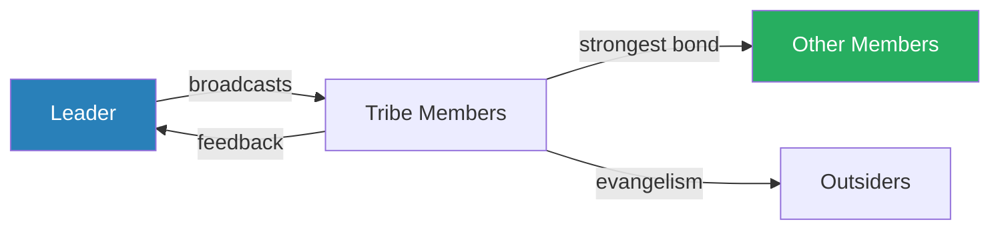
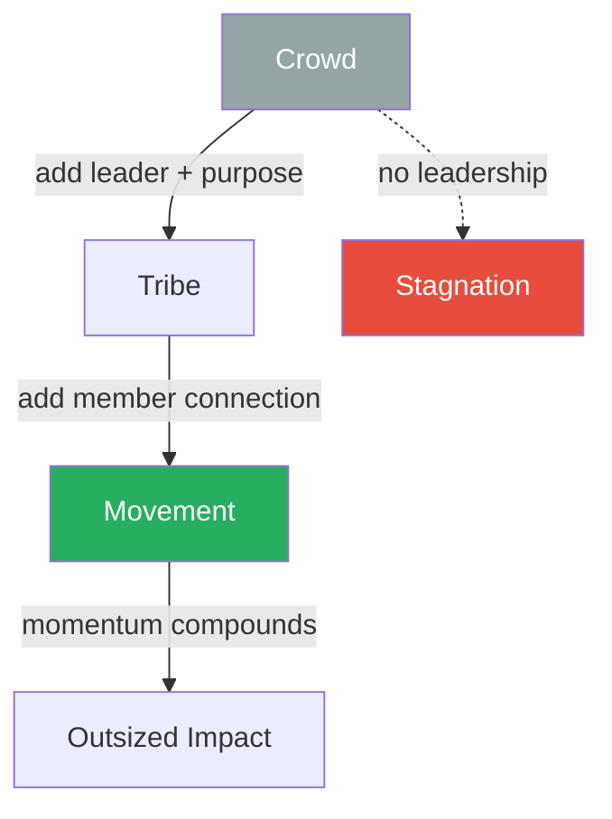
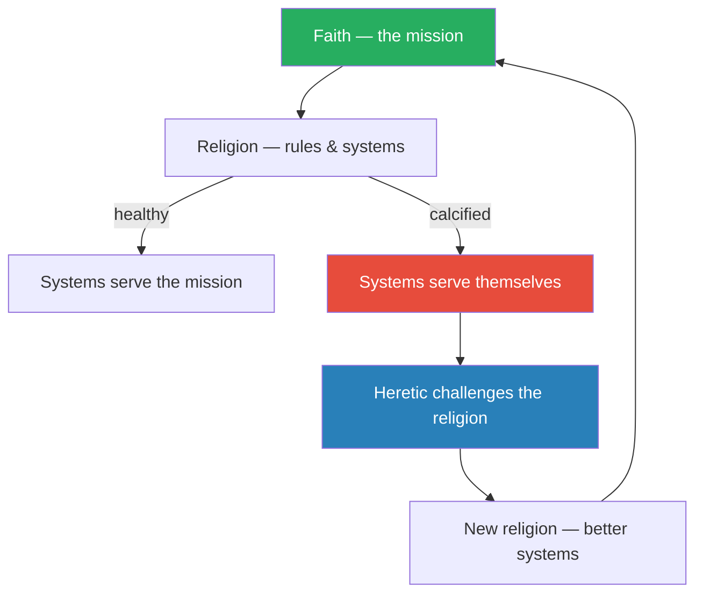
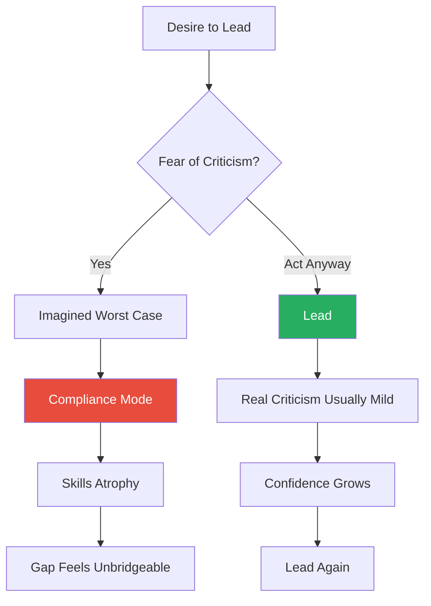
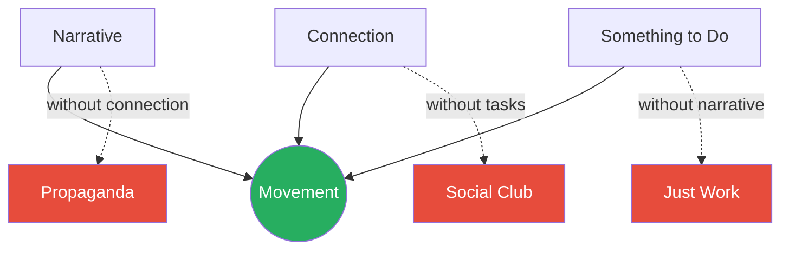
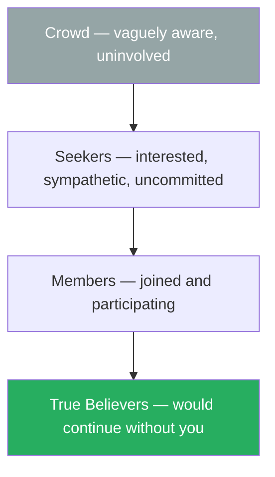

# Tribes: We Need You to Lead Us — Seth Godin

> Seth Godin's *Tribes* is a short, punchy manifesto built on a single provocation: the world is full of people waiting for permission to lead, and no one is coming to give it to them.
> A tribe is any group of people connected to one another, to a leader, and to an idea.
> The Internet has made assembling tribes trivially easy — the bottleneck is no longer technology or resources but the willingness of someone to step forward and say "follow me."
> Godin argues that the factory era rewarded compliance and punished deviation, but that the market has flipped: it now rewards heretics who challenge the status quo and create movements.
> The only thing standing between you and leadership is fear — specifically, the fear of being criticised.
> The book is part argument, part motivational push, and entirely a call to stop waiting.

---

## About the Author

Seth Godin is a marketing entrepreneur, blogger, and author of more than twenty books on marketing, change, and ideas that spread. He built his career during the digital marketing revolution, founding companies like Yoyodyne — one of the first online direct-marketing firms, later acquired by Yahoo — and Squidoo, a user-generated content platform. His daily blog, which he has maintained without interruption for over two decades, is one of the most popular in the world and consistently returns to a single theme: the old industrial model is dying, and the people who thrive are the ones who choose to lead, create, and connect. His writing style is deliberately aphoristic — short chapters, punchy sentences, heavy repetition of core ideas from multiple angles — designed for impact over comprehensiveness. His perspective is shaped by Silicon Valley optimism and a deep conviction that individuals have more power than institutions want them to believe, which makes his work both energising and occasionally naive about structural realities.

---

## The Big Idea

*Godin strips leadership down to its barest components and argues that the only thing separating leaders from everyone else is the decision to act.*

- Godin's central argument is that <b style="color: #27ae60">leadership is not a title — it is a decision</b>
- A <b style="color: #2980b9">tribe</b> needs only two things to exist: a shared interest and a way to communicate
- Every workplace, every community, every industry has groups of people who want change but lack someone willing to stand up and lead them toward it
- The person who steps forward — not the person with the biggest budget, the most impressive credentials, or the highest position on the org chart — is the one who creates change

---

- The <b style="color: #2980b9">factory model</b> — built on compliance, hierarchy, and risk avoidance — trained generations of workers to keep their heads down and do what they were told
- That model is dying, Godin argues, and the evidence is everywhere:
  - The companies that thrive are the ones that embrace change
  - The individuals who rise are the ones who create it
- The market used to reward predictability and punish deviation
- Now it rewards <b style="color: #2980b9">heretics</b>: people who believe deeply in a mission while rejecting the systems that have calcified around it
- The heretic is not a rebel without a cause — the heretic is someone so committed to the underlying faith that they are willing to tear down the religion that has grown up to smother it

---

- The book draws a sharp line between **management** and **leadership**:
  - Management is about manipulating resources to deliver a known outcome efficiently — it relies on authority granted by the organisation and maintains the status quo
  - Leadership is about creating change you believe in — it relies on passion, ideas, and the willingness to be uncomfortable
- Both are necessary, but in a world drowning in managers, leaders are the scarce resource
- Godin's provocation is that most organisations do not lack people capable of leading — <b style="color: #e74c3c">they lack people willing to do it</b>

- The book's deepest claim is that <b style="color: #27ae60">fear of criticism — not fear of failure — is what stops most people from leading</b>
- Organisations absorb failure costs: projects get cancelled, budgets get redirected, and life goes on
- But criticism is personal and social — it threatens belonging, status, and identity
- The anticipation of criticism is often worse than the reality, creating a phantom barrier that keeps talented people in compliance mode for entire careers
- Godin's prescription is blunt: feel the fear, acknowledge it, and lead anyway
- <b style="color: #e74c3c">The alternative — a life of quiet compliance — is the greater risk</b>, because it guarantees that you will never create anything that matters

---

## Key Concepts at a Glance

| Concept | One-line summary |
|---------|-----------------|
| **Tribe** | A group connected to one another, to a leader, and to an idea — the fundamental unit of change |
| **Heretic** | Someone who challenges the established system while believing deeply in the underlying mission |
| **Faith vs Religion** | Faith powers action; religion is the rules and rituals that either amplify or suppress that drive |
| **Positive Deviance** | Find the people already succeeding differently within a system and amplify their work |
| **Micromovement** | A small group built around a manifesto, member connection, public progress, and a mission bigger than any individual |
| **Thermostat vs Thermometer** | Thermometers report problems; thermostats change the environment in response |
| **The Factory** | Any system optimised for compliance, predictability, and cost reduction — the dying model |
| **The Balloon Factory** | An organisation so fragile and risk-averse that any disruption must be eliminated |
| **Crowd vs Tribe** | A crowd is a tribe without leadership or communication — attention without commitment |
| **Lean In / Back Off** | The two active leadership postures; doing nothing by default is the only unacceptable option |
| **Sheepwalking** | Going through the motions of work without engagement — the product of fear-driven cultures |
| **Settling** | Accepting a lesser version of your potential in exchange for the comfort of not being criticised |

---

## The Tribe Model

### What a Tribe Is

*The anatomy of a tribe is deliberately simple — so simple that Godin's definition removes every excuse for not building one.*

- Godin defines a <b style="color: #2980b9">tribe</b> as any group of people connected to one another, to a leader, and to an idea
- That is the entire definition
- You do not need formal authority, a budget, a strategic plan, or organisational sponsorship
- You need a shared interest, a way for people to communicate, and someone willing to step forward and channel the group's energy toward change
- The simplicity is deliberate — Godin is stripping away the elaborate prerequisites that most leadership books impose, which function as excuses for inaction
- If a tribe requires only an idea and a communication channel, then the only missing ingredient is a person willing to lead

---

- Communication flows in four directions within a healthy tribe:
  - **Leader to tribe** — top-down broadcast
  - **Tribe to leader** — feedback and challenge
  - **Member to member** — the most powerful channel
  - **Member to outsider** — evangelism and recruitment
- Most traditional organisations only have the first channel and wonder why they struggle to create engagement
- <b style="color: #27ae60">The most powerful channel is member-to-member communication</b>
- When members of a tribe talk to each other, they create bonds that are independent of the leader, which makes the tribe more resilient and self-sustaining
- A tribe that depends entirely on leader-to-tribe broadcast is fragile — remove the leader and the tribe collapses
- A tribe with rich member-to-member communication persists even when the leader steps back, because the connections are distributed rather than centralised

The four communication channels show why member-to-member connection — not top-down broadcast — is the true engine of tribal resilience.

### The Three Levers of Tribal Improvement

*Most leaders instinctively reach for growth, but Godin argues they are pulling the wrong lever.*

- A leader improves the tribe through three levers, listed in Godin's order of impact:
  1. <b style="color: #27ae60">Intensify purpose</b> — transform a vague shared interest into a passionate desire for change
  2. **Tighten communication** — provide tools and forums for members to connect with each other, not just with the leader
  3. **Grow the tribe** — attract new members
- Most leaders instinctively reach for the third lever — growth — because it is the easiest to measure and the most flattering to the ego
- But <b style="color: #e74c3c">tightening and intensifying produce far more impact than growing</b>
- A small group of deeply committed people will outperform a large group of casual participants every time
- The mechanism is straightforward:
  - Growth without purpose creates a crowd — lots of people, no direction
  - Growth without communication creates isolation — lots of people, no connection
  - Purpose without communication creates frustration — people care but cannot coordinate
  - Only when purpose and communication are both strong does growth actually amplify the tribe's power

The force graph shows why member-to-member connections (the thickest lines) are the tribe's true engine: they create a dense, resilient network that persists even if the leader steps back, while evangelism links (thin lines to outsiders) drive organic growth.

> [!tip] Core Insight
> Tribal strength comes from purpose intensity and communication density — not from headcount. Tighten before you grow.

### Tight Tribes Beat Big Crowds

*A comparison between a motoring club, a conference, and a lobbying group reveals why size is the wrong metric for tribal power.*

| Organisation | Size | Communication density | Shared purpose | Cultural influence |
|-------------|------|----------------------|----------------|-------------------|
| **AAA** | Millions of members | Minimal | Practical convenience | Low |
| **TED** | ~2,000 attendees (at time of writing) | Intense, constant | Passionate belief in ideas | Enormous |
| **NRA** | Proportionally modest | Very high — members reinforce each other | Deep ideological commitment | Vastly disproportionate |

The pattern across all three is consistent: influence scales with commitment density, not with raw numbers.

The doughnut reveals Godin's hierarchy: purpose and communication together account for over half of tribal influence, while raw growth — the lever most leaders reach for first — contributes the least.

> [!example] AAA vs TED — The Tight-Tribe Principle
> - The AAA has millions of members and minimal cultural influence — it is a services organisation, not a movement
> - Members join for roadside assistance, not for a shared vision of the future
> - There is no meaningful member-to-member communication and no passionate shared purpose beyond practical convenience
> - TED, by contrast, had roughly 2,000 attendees and yet wielded enormous cultural influence
> - TED attendees talk to each other constantly — at the conference, online, through local TEDx events
> - They share a passionate belief in the power of ideas
> - The purpose is intense, the communication is tight, and the tribe punches wildly above its weight
> **The lesson:** A tighter tribe beats a bigger crowd — every time.

> [!example] The NRA's Disproportionate Influence
> - The NRA's membership is a fraction of the American population, yet it has shaped gun policy for decades
> - The reason is not the size of its membership but the intensity of its communication and commitment
> - Members reinforce each other's beliefs through constant internal communication
> - They vote as a bloc, donate as a bloc, and advocate as a bloc
> - Politicians respond not to how many NRA members exist but to how reliably those members will act
> **The lesson:** A small tribe of deeply committed people will outweigh a large, passive majority every time — because commitment, not numbers, drives action.

### Crowds Are Not Tribes

*A crowd is just a tribe waiting for leadership — the raw material, not the finished product.*

- A <b style="color: #2980b9">crowd</b> is a tribe without leadership or communication — a mass of people who happen to share an interest but have no connection and no direction
- Crowds can generate attention, but they lack loyalty, durability, and momentum
- The difference is not gradual — it is categorical:
  - A crowd watches; a tribe participates
  - A crowd consumes; a tribe creates
  - A crowd forgets; a tribe remembers and acts

---

- Godin contrasts two fundamentally different logics:
  - **Marketing-to-crowds** — advertising, mass reach, eyeball counts; buys transient attention
  - **Assembling-tribes** — connection, shared purpose, leadership; earns lasting commitment
- The difference matters because attention is transient while commitment compounds
- <b style="color: #e74c3c">A crowd will watch your advertisement and forget it</b>
- A tribe will spread your idea and defend it
- The strategic question for any aspiring leader is not "How do I reach more people?" but "How do I convert a passive crowd into an active tribe?"
- The answer is always the same: give them a leader, a shared purpose, and a way to talk to each other

The progression from crowd to movement shows why leadership and connection — not just shared interest — are what transform passive groups into forces for change.

---

## The Heretic Framework

### Religion and Faith

*Godin redefines heresy as the highest form of commitment — and in doing so, gives frustrated insiders a vocabulary for what they already feel.*

- Godin's most provocative concept is the <b style="color: #2980b9">heretic</b> as the engine of progress, and to understand it you have to understand his distinction between **faith** and **religion**

- **Faith** is the underlying drive:
  - The belief in a mission
  - The commitment to a cause
  - The energy that makes people care about something enough to act
- **Religion** is the set of rules, processes, rituals, and norms that an organisation builds to sustain and channel that faith

---

- Every organisation starts with faith:
  - Someone has a vision, gathers people around it, and begins creating change
  - But as the organisation grows, it builds systems: governance processes, reporting structures, approval workflows, style guides, compliance requirements
  - These systems are the religion
  - Religion is not inherently bad — it is how faith scales beyond a single charismatic founder
- <b style="color: #e74c3c">The problem comes when the religion starts to serve itself rather than the faith</b>:
  - The governance process exists to generate governance reports rather than to enable delivery
  - The approval workflow exists to distribute blame rather than to improve decisions
  - The style guide exists to prevent change rather than to enable clarity
  - At this point, the religion has become self-perpetuating — the original faith is being suffocated by the very structures built to support it
- The pattern is universal and Godin argues it is almost inevitable:
  - Systems accumulate complexity over time
  - Each rule was added for a reason, but the sum of all reasonable rules becomes unreasonable
  - No one person added the killing blow — it was death by a thousand reasonable policies

> [!example] Woolworth's and the Five-and-Dime Religion
> - Woolworth's built a retailing religion around a specific format — the five-and-dime store
> - They clung to it long after the market had evolved past it
> - The faith (affordable retailing for ordinary people) was still viable
> - But the religion (this specific store format, these specific price points, this specific supply chain) had calcified
> - The company could not separate what it believed in from how it had always done things
> - Competitors who shared Woolworth's faith but adopted different formats — discount chains, big-box stores — thrived while Woolworth's declined
> **The lesson:** When the format becomes more sacred than the mission, the organisation is dying.

> [!example] IBM's Corporate Religion in the 1960s
> - IBM developed such a rigid corporate religion — the dress code, the sales methodology, the mainframe-first product strategy — that it nearly destroyed the company when the market shifted
> - Every employee wore a white shirt and dark suit; the uniformity was supposed to signal professionalism but actually signalled rigidity
> - When personal computing emerged, IBM's religion could not accommodate it — the mainframe was doctrine, and PCs were heresy
> - The religion that had once made IBM dominant became the very thing preventing it from adapting
> - It took a near-death experience in the early 1990s for IBM to begin separating faith from religion
> **The lesson:** The systems that create success in one era can become the prison that prevents success in the next.

- The **MBA** as an institution, Godin argues, became its own religion: people pursue the degree not because it serves their purpose but because "that is what you do" to signal seriousness
- The faith behind the MBA — deep business knowledge and analytical skill — is legitimate
- But the religion — two years, specific schools, specific networks, specific career paths — has become self-referential
- People pursue it because others pursued it, not because it serves their specific mission

### The Heretic's Role

*The heretic is not the person who has lost faith — they are the person who has too much of it to accept a broken religion.*

- The heretic is the person who notices that the religion has stopped serving the faith and refuses to accept it
- <b style="color: #27ae60">Heresy is not loss of faith — it is the opposite</b>
- The heretic believes so deeply in the mission that they are willing to challenge the system built around it
- This is what distinguishes the heretic from the mere complainer:
  - Complainers object to the inconveniences of the religion but offer no alternative
  - Heretics break the religion because they have a clearer vision of how to serve the faith
  - The complainer says "this process is annoying"
  - The heretic says "this process is betraying our mission, and here is a better way"

---

- Successful heretics do not just tear down the old religion — they create a new one that better serves the underlying purpose
- <b style="color: #e74c3c">Destruction without construction is vandalism, not heresy</b>
- The heretic must be a builder
- This is a critical distinction that separates productive heretics from mere contrarians:
  - The contrarian opposes for the sake of opposing — it is an identity, not a strategy
  - The heretic opposes because they see a better way and are compelled to build it

> "Heretics are the new leaders. The ones who challenge the status quo."

- Godin uses the word "religion" broadly and intentionally — it applies to:
  - Corporate governance that has become busywork
  - Industry norms that no longer reflect market reality
  - Team habits that persist because "that is how we do things here"
  - Personal routines that once served growth but now serve comfort
- The <b style="color: #2980b9">faith vs religion</b> distinction is the book's sharpest diagnostic tool
- When you feel frustrated with a process, a system, or an institution, the question to ask is: is this serving the mission, or is it serving itself?

> [!tip] Core Insight
> The faith vs religion distinction is a universal diagnostic. Any time frustration mounts, ask: is this process serving the mission, or is it serving itself?

The faith-religion cycle shows how healthy organisations continuously reform their systems to serve the mission — and how heretics are the mechanism of that reformation.

---

## The Factory and the Balloon Factory

### The Factory as Metaphor

*Godin uses the factory as shorthand for any system that has traded the capacity for change for the comfort of predictability.*

- <b style="color: #2980b9">The factory</b> is Godin's shorthand for any system optimised for compliance, predictability, and cost reduction
- The literal factory of the Industrial Revolution trained workers to:
  - Show up on time
  - Follow instructions
  - Avoid deviation
  - Produce consistent output
- The factory did not want initiative or creativity
- It wanted reliable, obedient, interchangeable parts — and it built an entire educational and cultural system to produce them
- Godin traces a direct line from the factory floor to the modern school system:
  - Schools were designed to produce factory workers — punctual, compliant, comfortable with repetitive tasks
  - The bell schedule, the rows of desks, the emphasis on following directions — all of this is factory training
  - The legacy persists even though the factories themselves are largely gone

---

- The metaphorical factory persists in most modern organisations:
  - Meetings that exist to report status rather than make decisions are factory work
  - Performance reviews that measure compliance with process rather than creation of value are factory work
  - Any system that rewards people for following the rules and punishes them for breaking them — regardless of whether the rules serve the mission — is a factory
- <b style="color: #27ae60">The factory model is dying because the market no longer rewards what the factory produces</b>
- Consistent, predictable, commodity output is being automated, outsourced, or competed away
- What the market rewards now is change — new ideas, new approaches, new connections
- The factory cannot produce change because change is, by definition, a deviation from the factory's instructions
- The irony is that most organisations recognise this intellectually while continuing to operate as factories:
  - They say they want innovation
  - They punish anyone who deviates from process
  - <b style="color: #e74c3c">The gap between rhetoric and reality is the factory's final defence mechanism</b>

### The Balloon Factory

*The balloon factory makes the abstract concrete — and reveals why organisations that claim to want innovation actively destroy it.*

- The <b style="color: #2980b9">balloon factory</b> is Godin's more vivid elaboration of the same metaphor
- Imagine a factory that makes balloons:
  - The entire operation is optimised for fragile products
  - No sharp objects, no sudden movements, no disruptions of any kind
  - Everyone walks carefully, speaks softly, follows the rules
  - The consequences of breaking them are immediate and visible — pop

> [!example] The Unicorn in the Balloon Factory
> - Imagine a unicorn walks into the balloon factory
> - The unicorn is magnificent — unusual, creative, potentially transformative
> - But the unicorn also has a horn
> - The factory's first instinct is not to celebrate the unicorn's arrival but to panic about the damage it might do
> - The factory will try to file down the horn, contain the unicorn, or expel it entirely
> - The system itself cannot tolerate the unicorn's existence
> - It does not matter that the unicorn might be exactly what the factory needs to evolve
> - The immediate threat to existing operations overrides any potential long-term benefit
> **The lesson:** Organisations so fragile that any disruption is terrifying will systematically destroy the very people who could save them.

- <b style="color: #e74c3c">These organisations may say they want innovation, but their systems are designed to prevent it</b>
- The person who tries to create change in a balloon factory is not fighting bad ideas — they are fighting structural fragility
- The distinction matters because it changes the diagnosis:
  - If the problem were bad ideas, the solution would be better arguments
  - But the problem is structural fragility, and the solution is either changing the structure or leaving the factory entirely
- Godin does not spend much time on the first option — his instinct is always toward exit and creation rather than internal reform
- This is both the strength and the limit of his perspective

---

## Leadership vs Management

### The Dichotomy

*Godin draws a deliberately provocative binary — not because it is perfectly accurate, but because the world's default is so overwhelmingly tilted toward management that the overcorrection is useful.*

- Godin draws a deliberate and provocative binary between **leadership** and **management**

| Dimension | Management | Leadership |
|-----------|-----------|------------|
| **Source of authority** | Granted by the organisation | Created through vision and action |
| **Relationship to status quo** | Maintains it | Challenges it |
| **Relationship to variance** | Reduces it | Increases it intentionally |
| **Core activity** | Optimising existing systems | Creating change you believe in |
| **Feels** | Safe — sanctioned by the organisation | Dangerous — unsanctioned, chosen |
| **Accountability** | To the hierarchy above | To the tribe around |
| **Default reward** | Predictability | Impact |

The radar reveals why Godin frames leadership and management as complementary opposites: management excels at scalability and formal authority, while leadership dominates in innovation, risk tolerance, and challenging the status quo.

> "Managers manage by using the authority the factory gives them. Leaders lead by creating change."

- Godin is forthright about this being a simplification
- But he argues the simplification is useful because the default in most organisations is overwhelmingly toward management:
  - Most people manage
  - Most promotions reward management
  - Most training programmes teach management
- The result is <b style="color: #e74c3c">a world drowning in managers and starving for leaders</b>
- He does not claim that management is unimportant — he claims it is abundant
- The scarce resource is not someone who can run the system but someone who will change it

### Why the Distinction Matters

*The distinction reframes what "doing your job" means — and reveals why leadership always feels like a risk.*

- A manager's job is to maintain the system
- A leader's job is to change it
- Both are necessary, but they are different activities requiring different courage

---

- Management feels safe because it is sanctioned:
  - The organisation explicitly asks you to manage — hit targets, follow processes, deliver on time
  - The implicit message is: do what you are told and you will be safe
- Leadership feels dangerous because it is unsanctioned:
  - No one asks you to lead
  - No one gives you permission to challenge the way things work
  - The decision to lead is inherently a decision to step outside the safety of your job description
- Godin acknowledges that pure leadership without any management is impractical — things need to run
- But his argument is that <b style="color: #27ae60">the dangerous deficit in most organisations is not management capability but leadership willingness</b>
- There are plenty of people who can run the system
- There are vanishingly few who will change it
- The practical implication: if you can do both, the leadership component is what makes you irreplaceable, not the management component

> [!tip] Core Insight
> The scarce resource is not management capability — it is leadership willingness. The world has enough people who can run the system. It needs people who will change it.

---

## Fear: The Central Obstacle

### Fear of Criticism, Not Fear of Failure

*Godin identifies the specific flavour of fear that keeps people in compliance mode — and it is not the one most people expect.*

- The book's psychological core is the argument that <b style="color: #27ae60">fear of criticism — not fear of failure — is what prevents most people from leading</b>

- Godin distinguishes the two carefully:
  - **Fear of failure** is about outcomes:
    - The project might not work, the product might flop, the initiative might waste resources
    - This fear is often manageable because organisations absorb most failure costs
    - Projects get cancelled, budgets get redirected, and the organisation moves on
    - The individual rarely bears the full weight of a failed initiative
  - **Fear of criticism** is about identity:
    - People might judge me, mock my ideas, question my competence, or reject me socially
    - This fear is harder to manage because it is personal
    - Criticism threatens belonging — the primal human need to be accepted by the group
    - The brain processes social rejection using many of the same neural pathways as physical pain
    - Unlike failure, which is about what happened, criticism is about who you are

---

- <b style="color: #e74c3c">The fear does not even require actual criticism</b>
- The anticipation alone is enough
- Most people who avoid leading are not responding to real criticism they have received — they are avoiding imagined criticism they have constructed
- They have built a vivid mental model of what would happen if they stepped forward, and that model is almost always worse than reality
- The imagined criticism is weightless but feels solid — a phantom wall that shapes behaviour as effectively as a real one

The fear cycle shows how imagined criticism creates a self-reinforcing trap — while acting through the fear creates a self-reinforcing virtuous cycle.

### The Paradox of Settling

*By avoiding the discomfort of leading, you guarantee the discomfort of an unlived potential.*

- Godin frames the choice not to lead as a form of <b style="color: #2980b9">settling</b> — accepting a lesser version of what your life could be in exchange for the comfort of not being criticised
- He calls this paradox the greatest risk of all
- The person who avoids the risk of leading takes on a different risk — the risk of looking back and realising they never tried

---

- He describes a specific thought experiment:
  - Imagine that you knew with certainty that your bold initiative would succeed — no criticism, no pushback, no risk
  - Would you do it?
  - Almost everyone says yes
  - Which means the initiative itself is not the problem
  - <b style="color: #27ae60">The fear surrounding the initiative is the problem</b>
  - If you would do it without the fear, then the fear is the only thing in your way — and fear, unlike structural barriers, is something you can choose to act through
- The logic is clarifying even if the conclusion is simpler than reality:
  - Not everyone who says yes in the thought experiment would actually succeed
  - And some fears are legitimate warnings, not phantom barriers
  - But the thought experiment reveals how much agency people surrender to imagined consequences

### Sheepwalking

*Compliance without engagement is not laziness — it is a rational survival strategy in systems that punish initiative.*

- Godin coins the term <b style="color: #2980b9">sheepwalking</b> to describe the state of compliance-without-engagement that the factory model produces
- A sheepwalker goes through the motions — shows up, does what is expected, avoids making waves — without any genuine commitment to the work or its purpose
- Sheepwalking is not laziness
- It is a rational response to an environment that punishes initiative and rewards compliance
- People sheepwalk because they have learned, often through bitter experience, that sticking your neck out gets it cut off

---

- The tragedy, Godin argues, is that sheepwalking is self-reinforcing:
  - The longer you do it, the harder it becomes to stop
  - Skills atrophy — the muscles of initiative weaken from disuse
  - Ambition fades — the goals that once felt urgent now feel unrealistic
  - The gap between "where I am" and "where I could be" grows until it feels unbridgeable
  - Each year of compliance adds another layer of inertia
- <b style="color: #e74c3c">Godin's prescription is not to suddenly leap across the gap</b> but to start leading in small ways — to demonstrate to yourself that initiative is survivable
- This incremental approach is one of the book's more practical suggestions:
  - Do not try to revolutionise the entire organisation tomorrow
  - Try leading a single meeting differently
  - Try proposing one change you believe in
  - Try building one small thing without asking permission
  - Each successful act of initiative builds evidence that the fear was overblown

> [!tip] Core Insight
> Fear of criticism — not fear of failure — is the real barrier. The anticipation of criticism is almost always worse than the reality. Start small to prove to yourself that initiative is survivable.

---

## Positive Deviance

### The Sternin Story

*The most empirically grounded idea in the book comes not from Godin but from two aid workers who asked a question no one else thought to ask.*

- The concept of <b style="color: #2980b9">positive deviance</b> was pioneered by **Jerry and Monique Sternin** in their work on childhood malnutrition in Vietnam in the 1990s

> [!example]- The Sternins in Vietnam (1990s)
> - The Sternins arrived in Vietnam to find that millions of children were malnourished despite decades of international aid programmes
> - The standard approach — importing nutrition solutions designed by Western experts — had failed repeatedly
> - The solutions were technically sound but culturally foreign, and they evaporated the moment the aid workers left
> - Instead of prescribing another external solution, the Sternins asked a different question: are there any children in this village who are already well-nourished?
> - In every village they visited, they found a small number of families whose children were thriving despite facing identical poverty, identical food availability, and identical constraints
> - When they investigated what these families were doing differently, they found simple but non-obvious practices:
>   - Some mothers were adding sweet potato greens and tiny shrimp to the rice — foods that were locally available but not traditionally considered appropriate for children
>   - Some were feeding their children smaller portions more frequently throughout the day rather than in two large meals
> - These were not exotic interventions — they were modest deviations from local norms, practised by people living under exactly the same constraints as everyone else
> **The lesson:** Before importing solutions from outside, look for the people already succeeding differently inside.

### Why It Works

*The genius was not in discovering the deviant practices — it was in how the Sternins spread them.*

- The Sternins did not write a nutrition manual based on the deviants' practices and distribute it from the outside
- They gave the deviant mothers a platform — cooking classes where other mothers could learn directly from their neighbours
- The approach was radically different from conventional aid:
  - No foreign experts lecturing
  - No manuals written in a language of theory
  - Just neighbours teaching neighbours, in their own kitchens, with their own food

---

- This worked for two specific reasons:

- **Reason 1: Immunity to the "it wouldn't work here" objection**
  - External solutions can always be dismissed
  - When an expert from another country tells you to change your child-feeding practices, you can reasonably argue that their advice does not apply — different culture, different resources, different constraints
  - But when your neighbour, who shares every single one of your constraints, is producing healthier children with practices you could adopt tomorrow, that argument collapses
  - <b style="color: #27ae60">Internal success stories are immune to the "it wouldn't work here" objection because they are already working here</b>

- **Reason 2: Social proof**
  - People are far more likely to adopt a behaviour when they see it modelled by someone they identify with than when they are told to adopt it by an authority figure they do not identify with
  - The deviant mother is "one of us"
  - The international nutrition expert is "one of them"
  - Humans are wired to learn from their in-group
  - This is not a flaw in human reasoning — it is an adaptive response to the fact that local context matters, and the person who shares your context is more likely to have a solution that works in your context

### The General Principle

*Godin generalises positive deviance beyond nutrition into a universal leadership strategy.*

- Godin calls positive deviance potentially the most important practical idea in the book, and he generalises it beyond nutrition into any domain where change is needed
- In any system — a company, an industry, a community — there are people already succeeding differently
- They have found workarounds, alternative approaches, and unconventional practices that produce better results within the same constraints that everyone else faces

---

- The leader's job is not to invent solutions from scratch but to <b style="color: #27ae60">find these deviants, amplify their work, and give them a stage</b>
- This is both more effective and more efficient than top-down prescription:
  - More effective because the solutions are pre-validated in the local context
  - More efficient because the leader does not need to solve the problem themselves — they need to find the people who have already solved it and help the solution spread

> [!abstract] The Positive Deviance Method
> 1. Identify the desired outcome (e.g. well-nourished children, high-performing teams)
> 2. Find people already achieving it within the same constraints as everyone else
> 3. Study what they are doing differently
> 4. Give them a platform to teach others directly — peer to peer, not top down
> 5. Let the solution spread through social proof rather than mandate

- The approach does have limits:
  - It requires that positive deviants actually exist within the system — in a completely broken system where no one is succeeding, there are no internal models to amplify
  - It can also be slow — organic spread through social proof takes time, and sometimes speed matters more than cultural fit
  - And it works best for behavioural change rather than structural change — you can spread better practices, but you cannot spread better infrastructure through cooking classes
- But as a default strategy for creating change from the inside, positive deviance is remarkably powerful

> [!tip] Core Insight
> Do not import solutions — find the people already succeeding differently within the system and amplify their work. Internal success stories are immune to the "it wouldn't work here" objection.

---

## The Micromovement Blueprint

### Five Actions

*Godin offers a practical blueprint for anyone who wants to build a movement, not just lead a team.*

> [!abstract] Five Actions for Building a Micromovement
> 1. **Publish a manifesto** — a clear statement of what you believe and what change you seek; not a business plan but a declaration of faith that gives people something to rally around and forward to others
> 2. **Make it easy for followers to connect with you** — lower every possible barrier between the tribe and its leader; blog, email, social media, office hours, open-door policies
> 3. **Make it easy for followers to connect with each other** — the step most leaders skip, and the most important; forums, meetups, shared channels, collaborative projects
> 4. **Realise that money is not the point** — movements run on meaning, not on funding; money enables logistics, but meaning enables commitment
> 5. **Track progress publicly** — let the tribe see momentum; public progress creates a feeling of forward motion, which attracts new members and sustains existing ones

- <b style="color: #e74c3c">Most leaders skip step 3</b> — making it easy for followers to connect with each other — and it is the most important
- Member-to-member connection is what transforms a following into a tribe
- The moment a movement becomes primarily about economic exchange, it loses the quality that made it a movement in the first place
- Public progress tracking serves a specific psychological function:
  - Humans are motivated by a sense of momentum — the feeling that things are moving forward
  - When a tribe can see its own progress, each milestone reinforces the decision to participate
  - When progress is invisible, energy dissipates because members cannot tell whether their effort is making a difference

### Six Principles

*Alongside the five actions, Godin articulates six principles that successful micromovements share.*

| Principle | Core idea |
|-----------|----------|
| **Transparency** | Movements cannot survive secrecy — shared commitment requires shared information |
| **Bigger than you** | The movement must outlive the founder; if it depends on one person's energy, it is a performance |
| **Growth or death** | Movements that stagnate die — not in membership, but in energy, ambition, and impact |
| **Define against the status quo** | Direct tribal energy at the shared enemy, not at competing tribes |
| **Exclude outsiders** | A tribe that includes everyone stands for nothing; boundaries create identity |
| **Build up** | Sustainable movements are defined by what they are building, not what they oppose |

The gap between successful and failed movements is widest in member-to-member connection and mission durability — confirming Godin's claim that the most commonly skipped step (connecting members to each other) is the most critical.

- <b style="color: #27ae60">Defining who is *not* in the tribe is as important as defining who is</b> — boundaries create identity, and identity creates commitment
- This is counterintuitive for leaders who want to be inclusive:
  - Inclusion feels generous, and it is
  - But a movement that includes everyone stands for nothing, because standing for something always means standing against something else
  - The exclusion does not need to be cruel — it simply needs to be clear: "we believe this, and if you do not, there are other groups that might suit you better"
- Protest movements defined entirely by what they oppose eventually exhaust themselves
- Movements defined by what they are building sustain themselves because the building creates its own momentum

### Bradley's Three-Element Framework

*Senator Bill Bradley's framework reveals why most organisations generate tasks without movements.*

- Godin supplements his own blueprint with a framework attributed to Senator <b style="color: #2980b9">Bill Bradley</b>, who argued that a movement requires three elements:
  1. **A narrative** — a story of who we are and where we are going; not a mission statement produced by committee, but a living story that gives people a sense of identity and direction
  2. **A connection** — between leader and tribe, and among members; connection is not communication — you can communicate to someone without connecting with them; connection requires emotional resonance, shared vulnerability, and mutual investment
  3. **Something to do** — with as few limits as possible on how; people need a way to contribute, and they need autonomy in how they contribute; over-specifying the "how" kills initiative

---

- Most organisations, Godin observes, provide only the third element — tasks and activities — without the narrative or the connection
- This is why they fail to generate movements:
  - Tasks without narrative feel like work
  - Narrative without connection feels like propaganda
  - Connection without tasks feels like a social club
- <b style="color: #27ae60">All three must be present and reinforcing</b>

Bradley's framework shows that a real movement requires all three elements — remove any one and you get something weaker.

> [!example] Political Campaigns vs Corporate Off-Sites
> - Political campaigns naturally combine all three of Bradley's elements: a narrative ("we are fighting for a better future"), a connection (shared identity as supporters), and something to do (canvass, donate, vote)
> - Corporate off-sites typically provide connection (team bonding activities) and tasks (action items) but lack narrative — there is no story of why this work matters beyond quarterly targets
> - The result is that campaign volunteers work harder for free than corporate employees work for a salary
> - The difference is not compensation — it is meaning
> **The lesson:** People work hardest when they have a story to believe in, people to believe in it with, and a way to contribute. Money alone cannot substitute for narrative and connection.

> [!tip] Core Insight
> Most organisations provide tasks without narrative or connection. That is why they generate work, not movements. All three of Bradley's elements must be present and reinforcing.

---

## Initiative and the Vacuum

### Why Initiative Is Disproportionately Powerful

*Initiative is powerful not because it is difficult, but because almost nobody does it.*

- Godin makes a strong case that <b style="color: #27ae60">initiative is disproportionately powerful because it is disproportionately rare</b>
- Most people default to waiting, managing, or following
- The person who acts first — who shows up with something built rather than something proposed — defines the space and sets the terms that everyone else responds to
- The rarity of initiative means that even modest acts of it stand out:
  - In a room of twenty people waiting for direction, the one person who proposes a plan becomes the leader by default
  - Not because they are the most qualified, not because they have the best plan, but because they are the only one willing to act

---

- Organisations create vacuums constantly through indecision, bureaucracy, and fear:
  - A decision that should take a day takes a month
  - A project that everyone agrees is important sits in limbo because no one wants to own it
  - A problem that everyone can see goes unaddressed because solving it is not in anyone's job description
- These vacuums are opportunities for anyone willing to step in
- Godin argues that vacuum-filling is the purest form of leadership:
  - No one asked you to do it
  - No one gave you permission
  - You simply saw an empty space and occupied it

> [!example] Barbara Barry's Fait Accompli
> - Barbara Barry, a furniture designer, wanted to collaborate with a fabric manufacturer
> - Instead of sending a proposal, scheduling a meeting, and waiting for approval, she showed up to the manufacturer's office with finished furniture already built using the manufacturer's own fabric
> - She did not pitch an idea — she presented a fait accompli
> - The furniture existed, it was beautiful, and it was made with their fabric
> - The manufacturer's only options were to say yes or to say no to something that was already real — and saying no to something real is much harder than saying no to something theoretical
> **The lesson:** The best way to get permission is to not need it. Build the thing, demonstrate its value, and let people respond to reality rather than speculation.

> [!example] The Spinnaker Newsletter — Godin's Own Early Career
> - At Spinnaker Software, Godin wanted engineers from other departments to collaborate on his project, but he had no authority over them and no budget to incentivise them
> - Instead, he created an internal newsletter about his project — part updates, part vision casting, part celebration of small wins
> - The newsletter did not ask anyone to do anything
> - It simply made the project visible and interesting
> - Engineers started gravitating toward the project on their own time, not because they were assigned to it but because the newsletter made it feel like the most exciting thing happening in the company
> - Initiative — in this case, the simple initiative of writing and distributing a newsletter — created gravity that formal authority could not
> **The lesson:** You do not need authority to attract people. Make the work visible and compelling, and talent gravitates toward it.

### "Not Yet" Is More Dangerous Than "No"

*Outright rejection is at least honest — deferral preserves the appearance of openness while preventing action.*

- The companion principle to initiative is Godin's warning about the danger of deferral

> "Not now, not yet. It seems like the safest and most responsible thing to say."

- <b style="color: #e74c3c">Deferral — "let's wait," "the timing isn't right," "we're not ready" — preserves the appearance of openness while preventing action</b>
- Outright rejection is at least honest — when someone says "no," the conversation is over and you can move on
- But deferral gives the status quo time to regroup and harden
- It is the bureaucratic immune system's most effective weapon:
  - It does not openly oppose change (which would create a visible conflict)
  - It simply delays change until the energy behind it dissipates naturally

---

- Godin presents a timing curve that illustrates his argument:
  - If you wait until the context is obviously ready — until every stakeholder agrees, every risk has been mitigated, every dependency has been resolved — you have waited too long
  - The early-mover penalty is small: you invest effort and some of it is wasted
  - The late-mover penalty is devastating: the opportunity has closed, the market has shifted, and someone else has filled the vacuum
- <b style="color: #27ae60">Change almost never fails because it is too early — it almost always fails because it is too late</b>
- "Not yet" feels responsible, but it is usually the most irresponsible response available
- The subtle danger is that "not yet" feels like wisdom — it wears the disguise of caution, prudence, and strategic patience
- But genuine strategic patience is active and intentional — it involves preparing, building, and watching for the right moment
- "Not yet" as a default is not patience — it is paralysis dressed as responsibility

---

## Leadership as Decision, Not Trait

### The Anti-Great-Man Theory

*Godin rejects the idea that leaders are born special and replaces it with a claim that is both more democratic and more demanding.*

- The book's philosophical core is the claim that <b style="color: #27ae60">leadership is a decision, not a trait</b>
- Godin rejects the "great man" theory of leadership entirely — the idea that leaders are born with special qualities that set them apart from ordinary people
- He claims to have met leaders across every continent, every gender, every income level, and every profession, and they share nothing in common except the choice to lead

> "The secret of leadership is simple: Do what you believe in."

- <b style="color: #2980b9">Charisma</b>, Godin argues, does not create leadership — leadership creates charisma:
  - The person who steps forward, connects people, articulates a vision, and challenges the status quo develops presence and credibility over time
  - Others perceive this presence as an innate quality — "she's a natural leader"
  - But it is actually the result of accumulated acts of leadership
  - The charisma is a consequence, not a cause
- This is an important psychological reframe:
  - If leadership requires innate traits, then most people are permanently excluded
  - If leadership requires a decision, then everyone is permanently included
  - <b style="color: #27ae60">The barrier is not capability but willingness</b>
- The reframe is also more demanding than it appears:
  - If anyone can lead, then no one has an excuse not to
  - The trait-based model lets most people off the hook — "I am not a natural leader"
  - The decision-based model puts everyone on the hook — "I have chosen not to lead"

### The Posture of Responsibility

*Godin proposes a deliberately extreme stance: if the tribe does not follow, that is the leader's failure, not the tribe's.*

- Godin pairs the leadership-as-decision concept with what he calls the <b style="color: #2980b9">posture of responsibility</b>: a radical internalisation of accountability for the tribe's response

- If the tribe does not follow, that is the leader's failure, not the tribe's:
  - If they do not believe the idea, the leader has not made it compelling enough
  - If they are bored, the leader is boring
  - If they leave, the leader failed to give them a reason to stay
  - If they do not act, the leader has not made the action clear enough

---

- This stance is deliberately extreme, and Godin acknowledges that it oversimplifies
- But he argues the alternative — blaming the audience — is catastrophically more harmful:
  - Externalising blame ("they don't get it," "they're resistant to change," "they lack vision") prevents learning and adaptation
  - Internalising responsibility ("I haven't made this compelling enough," "I need a different approach," "I'm missing something about their perspective") drives continuous improvement
- The posture of responsibility is not about self-flagellation — it is about agency:
  - <b style="color: #e74c3c">If the failure is theirs, you are powerless</b>
  - If the failure is yours, you can fix it
  - Blaming the audience guarantees that nothing changes, because the audience is not going to change on your behalf
  - Taking responsibility guarantees that you keep iterating until something works

### Two Postures: Lean In and Back Off

*At any given moment, a leader has two active choices — and one unacceptable default.*

- Godin identifies two active leadership postures:

- <b style="color: #2980b9">Lean in</b> — step forward, fill the vacuum, create momentum:
  - When no one is acting, act
  - When the tribe needs direction, provide it
  - When energy is flagging, inject it

- <b style="color: #2980b9">Back off</b> — step aside, let the tribe self-organise, empower microleaders within the group:
  - When the tribe has its own energy, do not suffocate it with your presence
  - When members are emerging as leaders in their own right, give them space
  - When the best thing you can do is nothing, do nothing deliberately

- The one unacceptable posture is <b style="color: #e74c3c">doing nothing by default</b> — which often disguises itself as prudence, patience, or strategic waiting but is actually hiding
- The difference between "backing off" and "doing nothing" is intentionality:
  - Backing off is a deliberate choice to empower the tribe
  - Doing nothing is a failure to choose

> [!example] Godin's Facebook Group Experiment
> - Godin created a Facebook group for sixty internship applicants and then deliberately said nothing
> - Within hours, a few people started leading discussions, proposing projects, and organising the group
> - These were not formally appointed leaders — they were people who chose to lean in when a vacuum appeared
> - The rest waited — some for hours, some for days, some indefinitely
> - The experiment neatly separated the initiators from the followers
> **The lesson:** Vacuums reveal who leads and who follows. The leader is whoever chooses to act first.

> [!example] Jimmy Wales and Wikipedia
> - Jimmy Wales's greatest leadership act was stepping back, letting the community self-organise, and resisting the urge to control every editorial decision
> - By backing off deliberately, he empowered thousands of microleaders to emerge
> - Wikipedia scaled because Wales chose the "back off" posture at exactly the right moment
> - Had he tried to maintain editorial control, the project would have been bottlenecked by his personal bandwidth
> - The genius was knowing when to lean in (founding the project, setting the vision) and when to back off (letting the community govern itself)
> **The lesson:** Sometimes the most powerful leadership move is creating space for others to lead.

> [!tip] Core Insight
> Leadership has two active postures — lean in or back off. The only unacceptable stance is doing nothing by default while calling it patience.

---

## The Thermostat and the Thermometer

*Godin introduces a simple metaphor that cuts through the corporate confusion between measuring problems and actually solving them.*

- <b style="color: #2980b9">Thermometers</b> measure and report:
  - They can tell you the temperature — what is going wrong, what the metrics say, what the risks are
  - Thermometers are useful because accurate diagnosis is a prerequisite for effective action
  - But thermometers do not change anything — they observe and report
- <b style="color: #2980b9">Thermostats</b> change the environment in response to what they observe:
  - When the temperature drops, a thermostat does not just report that it is cold — it turns on the heat
  - When conditions change, a thermostat adjusts
  - The thermostat has agency — it does not wait for someone else to act on its observations

---

- Every organisation has far more thermometers than thermostats:
  - Status reports, dashboards, risk registers, audit findings — these are all thermometer work
  - They are necessary but insufficient
  - <b style="color: #27ae60">The scarce and valuable work is thermostat work: seeing a problem and actually changing conditions in response</b>
- The distinction is not about seniority — anyone at any level can be a thermostat:
  - The intern who notices that new hires are confused by the onboarding process and creates a better one is a thermostat
  - The senior executive who presents a quarterly risk report without proposing any changes is a thermometer
  - The question is not "What is your title?" but "Do you change the environment, or do you just report on it?"

---

- What makes the metaphor powerful is that it cuts through the common corporate confusion between activity and impact:
  - Measuring problems feels productive
  - Creating dashboards feels like work
  - Presenting analysis feels like contribution
  - <b style="color: #e74c3c">But unless something changes as a result, all of that activity is thermometer work — measuring without adjusting</b>
- Many careers are built entirely on thermometer work:
  - Analysts who produce reports that no one acts on
  - Consultants who diagnose problems without implementing solutions
  - Advisors who identify risks without proposing mitigations
  - This work is not valueless, but it is dramatically less valuable than the thermostat work that follows it

> [!tip] Core Insight
> The question is not "What is your title?" but "Do you change the environment, or do you just report on it?" Be a thermostat, not a thermometer.

---

## Generosity as Leadership Strategy

*One of the book's less-discussed but important arguments: tribes can detect self-interest with remarkable accuracy, and they punish it.*

- Godin argues that <b style="color: #27ae60">generosity beats self-interest as a leadership strategy</b>
- Tribes can detect self-interest with remarkable accuracy
- When a leader's primary motivation is personal advancement — more money, more status, more power — the tribe senses it, even when the leader is skilled at disguising it
- Self-interested leadership creates transactional relationships:
  - "I will follow you as long as it benefits me"
  - Transactional relationships collapse the moment the calculus changes
  - The tribe is always computing the ratio of what the leader gives versus what the leader takes

---

- Generous leadership — leading because you genuinely want to create value for the tribe, not because you want to extract value from it — builds a different chain:
  - Trust builds loyalty
  - Loyalty builds resilience
  - A tribe led by a generous leader will endure setbacks, forgive mistakes, and fight for the mission even when the personal cost is high
  - <b style="color: #e74c3c">A tribe led by a self-interested leader will abandon ship at the first sign of trouble</b>
- The mechanism is simple: generosity creates a credit balance
  - When a leader has invested in the tribe without expecting return, the tribe reciprocates by extending trust during difficult moments
  - When a leader has only extracted, there is no credit to draw on

> [!example] Jimmy Carter and Habitat for Humanity
> - After leaving the presidency, Carter spent years building houses with Habitat for Humanity
> - No cameras required, no political gain possible
> - The generosity was authentic — not strategic, not performed
> - He showed up, swung a hammer, and worked alongside volunteers who had nothing to offer his career
> - The result was a moral authority that his presidency alone had not conferred
> **The lesson:** Generosity that cannot be explained by self-interest builds the deepest trust.

> [!example] Fidel Castro's Six-Hour Speeches
> - Castro gave mandatory six-hour speeches — a leader so consumed by his own voice that the tribe became a captive audience rather than a willing following
> - The self-indulgence was visible to everyone, even if no one could say so
> - The speeches were not for the tribe — they were for Castro
> - They were performance disguised as leadership
> **The lesson:** When leadership becomes self-serving performance, the tribe endures it rather than embracing it.

- The nuance Godin does not fully explore is the distinction between genuine generosity and strategic generosity:
  - Generous leadership that is visibly calculated — "I am giving you this so you will owe me" — erodes trust faster than open self-interest
  - The generosity must be authentic, or at least must be genuinely experienced as authentic by the tribe
  - This is not a technique to be deployed — it is a posture to be inhabited
  - The distinction matters because generosity-as-technique has a shelf life — eventually the tribe sees through it

---

## Growing Tribes from the Fringes

### Do Not Convert the Opposition

*The highest-return investment is not arguing with critics — it is reaching people who are already sympathetic but unaffiliated.*

- Godin offers an important strategic insight about how tribes grow: <b style="color: #e74c3c">do not try to win over the most loyal members of competing tribes</b>
- Instead, recruit <b style="color: #2980b9">seekers</b> — people on the fringes who want to belong to something but have not yet found the right movement

---

- The reasoning is psychological:
  - Committed partisans of a competing approach have identity investment in their current position
  - They have publicly stated their beliefs, built relationships around them, and staked their reputation on them
  - Switching feels like admitting a mistake, and humans will go to extraordinary lengths to avoid admitting mistakes
  - The more effort you invest in trying to convert a committed partisan, the more likely they are to dig in — the backfire effect makes direct persuasion counterproductive
- Seekers, by contrast, have no such investment:
  - They are looking for something to join
  - They are open to persuasion not because they are weaker but because they have not yet committed
  - <b style="color: #27ae60">Winning a seeker costs a fraction of the energy that losing to a partisan does</b>

---

- This principle has implications for how movements allocate their energy:
  - Most movements waste enormous effort arguing with their critics — the people least likely to ever join
  - The highest-return investment is reaching the people who are already sympathetic but unaffiliated
  - Find the people who are frustrated with the status quo but have not yet found an alternative, and give them one
  - These seekers are the movement's natural growth engine

### The Funnel of Engagement

*Godin describes an implicit funnel that maps how passive awareness becomes tribal commitment.*

The funnel shows that the leader's job is to move people inward — not by pushing but by making each ring of commitment more attractive than the last.

- The leader moves people inward through the funnel by making each ring more attractive:
  - The crowd becomes seekers when they encounter the tribe's manifesto
  - Seekers become members when they connect with other members
  - Members become true believers when they experience the tribe's impact firsthand
- Each transition requires something different:
  - Crowd to seeker requires visibility — the tribe's message must reach them
  - Seeker to member requires connection — the tribe must welcome them into the conversation
  - Member to true believer requires impact — the tribe's work must produce results they can feel
- The leader's role shifts at each stage: broadcaster at the outer ring, connector in the middle, and steward of impact at the core

---

## The Permission Problem

### Nobody Is Coming to Give You Permission

*The very act of waiting for permission is a form of abdication — you are asking someone else to validate your readiness, which transfers your agency to them.*

- One of the book's most insistent themes is that <b style="color: #27ae60">no one will give you permission to lead</b>
- Not your manager, not your organisation, not the market
- The very act of waiting for permission is a form of abdication
- You are asking someone else to validate your readiness, and that act of asking transfers your agency to them

> [!example] Jim Delligatti Invents the Big Mac
> - Jim Delligatti, a McDonald's franchisee in Uniontown, Pennsylvania, invented the Big Mac
> - McDonald's corporate did not ask him to create a new sandwich and did not give him permission
> - He simply did it — experimenting in his franchise, testing it with customers, presenting the corporation with a product that was already proven
> - McDonald's could have punished him for deviating from the standard menu
> - Instead, they rolled out his invention worldwide — it became the chain's signature product
> - The Big Mac exists because one franchisee decided not to wait for permission
> **The lesson:** Permission was never granted. Permission was made unnecessary by the existence of results.

> [!example] Percy Spencer and the Microwave Oven
> - Percy Spencer at Raytheon noticed that a microwave-emitting magnetron had melted a chocolate bar in his pocket
> - Instead of writing a memo proposing that Raytheon explore microwave cooking technology, he brought popcorn kernels to the lab the next day and started experimenting
> - The microwave oven was born from an act of initiative, not an act of authorisation
> - Spencer did not ask whether it was in his job description to explore kitchen appliances — he followed his curiosity and built something
> **The lesson:** Do not propose experiments — run them. Results speak louder than proposals.

> [!example] Thomas Barnett Changes Pentagon Doctrine
> - Thomas Barnett, a military strategist, changed Pentagon doctrine on post-conflict reconstruction not by going through official channels but by giving a presentation so compelling that it spread virally through the military establishment
> - He did not wait for a general to invite him to rethink doctrine
> - He rethought it and presented his conclusions with such force that the institution had to respond
> - His briefing, "The Pentagon's New Map," became one of the most influential strategic presentations in modern military history
> **The lesson:** If your idea is strong enough, the institution will respond to it — you do not need to wait for an invitation.

- The pattern across all these examples is the same: the leader acted first and sought validation second
- Permission was never granted — permission was made unnecessary by the existence of results

### Forgiveness Over Permission

> "Change is made by asking forgiveness, not permission."

- Godin's version of this familiar aphorism carries a specific mechanism:
  - **Permission-seeking** is a form of fear management that transfers responsibility:
    - If someone says yes, blame is shared — "I only did this because they approved it"
    - If someone says no, the responsibility for inaction is theirs, not yours
    - Permission-seeking preserves comfort at the expense of agency
  - **Permission-seeking also transfers momentum**:
    - When you ask for permission, you hand the initiative to the person you are asking
    - They now control the timeline, the scope, and whether you act at all
    - By the time they say yes — if they ever do — the moment may have passed

---

- <b style="color: #27ae60">The cost of waiting for permission almost always exceeds the cost of acting and being wrong</b>, because delay erodes momentum and lets others claim the space
- The caveat, which Godin acknowledges only briefly, is that this principle applies primarily to reversible decisions with manageable downside
- <b style="color: #e74c3c">For irreversible decisions with catastrophic potential, permission exists for good reasons</b>
- The question is not "should I ever seek permission?" but "is my default to seek permission when I should be acting?"
- For most people, the answer is yes — the default is too cautious, not too bold

> [!tip] Core Insight
> The best way to get permission is to not need it. Act, demonstrate results, and let people respond to reality rather than speculation.

---

## What Makes This Book Different from a Business Manual

### Structure and Style

*Tribes is not structured like a conventional business book — it is structured like a sermon, building emotional momentum rather than logical argument.*

- *Tribes* has no numbered chapters with clear topic sentences and neat conclusions
- Instead, Godin writes in short bursts — many sections are less than a page — each approaching the same central thesis from a different angle
- The effect is more like a sermon than a textbook: repetitive by design, building cumulative emotional momentum rather than logical argument

---

- This style is both the book's greatest strength and its greatest weakness:
  - **As a motivational experience, it works**:
    - Godin builds energy across the book, layering story upon story, reframe upon reframe
    - By the end, the reader is not thinking "what an interesting argument" but "what am I going to do about it?"
    - The repetition is not accidental — it mirrors the cadence of a good speech, where the same idea hits differently each time because the audience's emotional state has shifted
  - **As an analytical work, it is thin**:
    - There is no systematic evidence
    - There is no engagement with counter-arguments
    - There is no framework for calibrating risk
    - The stories are uniformly positive — every heretic succeeds, every initiative is rewarded, every tribe thrives
    - <b style="color: #e74c3c">The reader who wants to understand when and how tribal leadership fails will find nothing here</b>

### The Emotional Architecture

*The book follows a specific emotional arc designed to move the reader from recognition to action.*

The emotional arc moves from "you know this feeling" to "start now, today" — addressing the reader's emotional state, not just their intellectual understanding.

- The book follows a specific emotional arc:
  1. **Identification** — "You know this feeling. You know the frustration of working in a factory."
  2. **Diagnosis** — "The reason you feel stuck is not because you lack ability. It is because you are afraid."
  3. **Permission** — "You do not need anyone's approval. You need your own decision."
  4. **Urgency** — "The world needs you to lead. The cost of not leading is higher than the cost of leading."
  5. **Call to action** — "Start now. Today. With the tribe you already have."
- This arc is effective because it addresses the reader's emotional state, not just their intellectual understanding
- Most people who pick up *Tribes* already know, intellectually, that they should take more initiative
- What they lack is not knowledge but nerve
- Godin's book is designed to supply the nerve

---

## Key Quotes

> "The secret of leadership is simple: Do what you believe in."

> "Managers manage by using the authority the factory gives them."

> "A crowd is a tribe without a leader."

> "Heretics are the new leaders."

> "Not now, not yet. It seems like the safest and most responsible thing to say."

> "The one path that never works is the most common one: doing nothing at all."

> "Tribes are about faith — about belief in an idea and in a community."

---

## The Verdict

*Tribes* is a manifesto, not a manual, and it should be read accordingly. Its greatest contribution is a **vocabulary** — tribe, heretic, faith versus religion, positive deviance, thermostat versus thermometer — that gives precise language to dynamics most people feel but cannot name. The reframe from "I manage a team" to "I lead a movement" is genuinely powerful for anyone who builds communities, leads cross-functional initiatives, or struggles to articulate why their connecting-and-enabling work matters. The distinction between faith and religion is a diagnostic tool that can be applied in any organisation, and the positive deviance model (find internal success stories and amplify them) is one of the most practical ideas in any leadership book.

The book's greatest weakness is that it is **almost entirely motivational**. Godin hammers the same thesis from dozens of angles with anecdotes and aphorisms but provides no framework for calibrating heresy — knowing when to push, when to build quietly, and when to wait. The leadership/management dichotomy is deliberately provocative but ultimately false: the best leaders are also excellent managers, because good management creates the credibility platform that gives leadership permission to exist. You need both, simultaneously, and the suggestion that management is inherently inferior to leadership oversimplifies a complex reality.

**Survivorship bias** pervades the book. Every example is of a heretic who succeeded — the Big Mac inventor, the microwave discoverer, the TED community builder. There is no examination of the talented people who challenged the status quo and lost everything: careers destroyed, reputations shattered, initiatives killed. Godin provides no tools for distinguishing good heresy from reckless disruption, and no framework for assessing when the risk of leading outweighs the risk of following. The claim that fear is the *only* barrier to leadership is reductive — structural barriers like budget, authority, institutional inertia, and cultural resistance are real and are not addressed.

Despite these limitations, the core ideas are sound: tribes are real, movements create outsized impact, and the world has more people willing to follow than willing to lead. The book is best read as an emotional catalyst — a jolt to the system for people who know they should be doing more but are held back by the anticipation of criticism that may never come. Read it for the mindset shift and the vocabulary, then supplement it with something that addresses the political, structural, and tactical realities that Godin cheerfully ignores. It pairs well with books on organisational power dynamics and strategic career navigation, which provide the "how to survive your heresy" manual that *Tribes* conspicuously lacks.

---

## Related Reading

- [[The 48 Laws of Power - Robert Greene|The 48 Laws of Power]] — where Godin sees the world through movements and meaning, Greene sees it through power and perception; the two are essential complements, and reading them together produces a more complete picture than either alone
- [[Power - Jeffrey Pfeffer|Power: Why Some People Have It and Others Don't]] — Jeffrey Pfeffer's research-grounded treatment of organisational power, covering the structural barriers to leadership that Godin ignores entirely
- [[The First 90 Days - Michael D. Watkins|The First 90 Days]] — Michael Watkins on building momentum in new roles, a more tactical approach to the "initiative fills vacuums" principle with actual frameworks for execution
- [[So Good They Can't Ignore You - Cal Newport|So Good They Can't Ignore You]] — Cal Newport's counter-argument to the passion-first model; skill and career capital precede following your passion, not the other way around; a useful corrective to Godin's "just lead" enthusiasm
- [[The Four Obsessions of an Extraordinary Executive - Patrick M. Lencioni|The Four Obsessions of an Extraordinary Executive]] — Patrick Lencioni on organisational health and clarity, providing the management substance that Godin's leadership-only model lacks
- [[The Culture Code - Daniel Coyle|The Culture Code]] — Daniel Coyle on how groups build safety, share vulnerability, and establish purpose; the research-backed mechanics behind the tribal dynamics Godin describes intuitively
