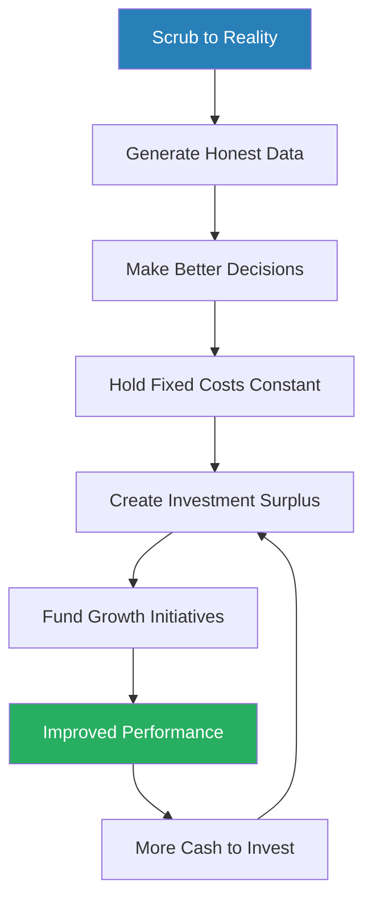
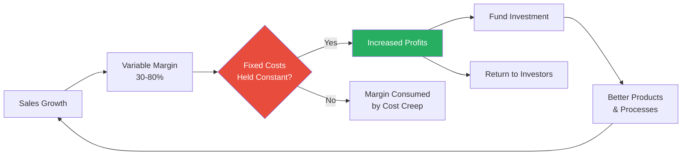
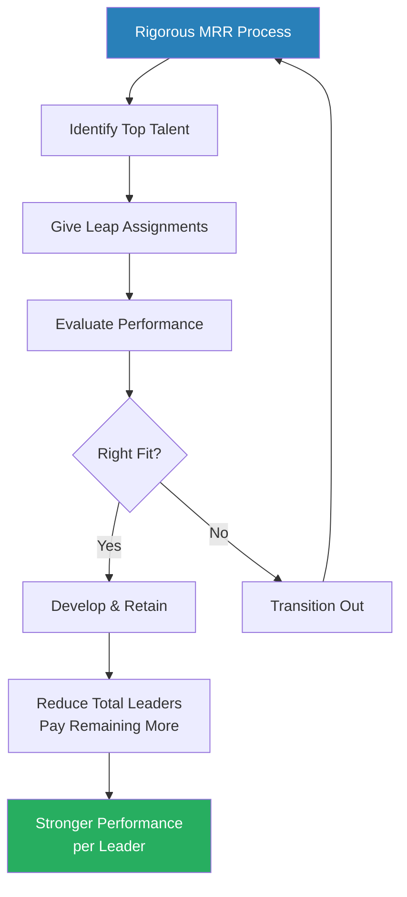
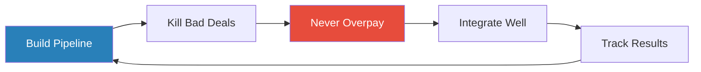
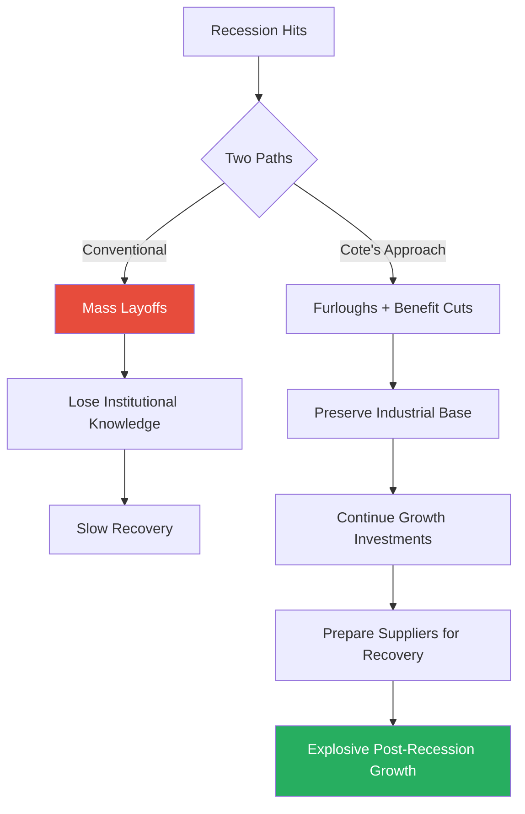
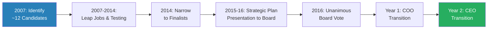

# Winning Now, Winning Later — David M. Cote

> David Cote took over a failing Honeywell in 2002 and spent sixteen years proving that short-term results and long-term investment are not mutually exclusive. This book is his playbook for how he grew Honeywell's market cap from $20 billion to $120 billion — delivering 800% returns that beat the S&P 500 by two and a half times — while simultaneously tackling billions in legacy liabilities, rebuilding a broken culture, and investing relentlessly in growth. His core argument: the belief that you must sacrifice the future to hit quarterly numbers is the most destructive myth in business. Leaders who demand intellectual rigour, hold fixed costs constant while growing, and refuse to accept false trade-offs can do both. The trick, as Cote likes to say, is in the doing.

---

## About the Author

David M. Cote served as Chairman and CEO of Honeywell from 2002 to 2018. Before Honeywell, he held various finance and general management roles at General Electric over a twenty-five-year career, and briefly served as CEO of TRW. A self-described late bloomer who grew up working-class in New Hampshire, Cote dropped out of university twice and worked as a factory punch-press operator, carpenter, and commercial fisherman before the birth of his son terrified him into getting serious about his career. Under his leadership, Honeywell transformed from a near-failing, culturally fractured conglomerate into one of America's most successful industrial companies, creating 2,500 employee 401(k) millionaires in the process.

---

## The Big Idea

- Most leaders treat short-term performance and long-term investment as an either/or choice — and almost always choose the short term
- Cote argues this is a false dichotomy rooted in intellectual laziness
  - A McKinsey study found long-term-oriented firms generated 47% more revenue growth and 36% more earnings growth than short-term-focused peers between 2001 and 2014
  - Yet two-thirds of executives report that pressure for short-term results has increased
- The solution is not regulation or relaxing reporting requirements — it is a comprehensive mind-set shift among leaders at every level
- Cote distilled his approach into <b style="color: #2980b9">Three Principles of Short- and Long-Term Performance</b>:
  1. Scrub accounting and business practices down to what is real
  2. Invest in the future, but not excessively
  3. Grow while keeping fixed costs constant
- These principles create a virtuous cycle: improved operations generate more cash, which funds additional investments, which generate better performance, which creates more cash to invest
- The proof: Honeywell's market cap grew from $20 billion to $120 billion, operating margins doubled from 8% to 16%, sales nearly doubled, and the company won dozens of awards for financial and environmental stewardship

> [!tip] Core Insight
> Short- and long-term goals only seem mutually exclusive. When leaders demand intellectual rigour and refuse to accept false trade-offs, they discover creative solutions that serve both horizons simultaneously.

---

## Key Concepts at a Glance

| Concept | One-line summary |
|---------|-----------------|
| **Three Principles** | Scrub to reality, invest but not excessively, grow while holding fixed costs constant |
| **"Any Ninny" Theory** | Any fool can improve one metric — great leaders achieve two conflicting things at once |
| **Perpetual Restructuring** | Small, continuous improvements instead of massive one-time upheavals |
| **X Days & Blue Notebooks** | Block 2-3 days monthly for unstructured thinking and strategic reflection |
| **Five Initiatives** | Growth, Productivity, Cash, People, and Enablers — Honeywell's strategic pillars |
| **Twelve Behaviours** | Detailed behavioural definitions underpinning the One Honeywell culture |
| **One Honeywell** | Cultural unification after the toxic "colour wars" between legacy companies |
| **Honeywell Operating System** | Adapted Toyota Production System for continuous process improvement |
| **Functional Transformation** | Applying process improvement to back-office functions, not just factories |
| **Velocity Product Development** | Streamlined R&D process to get products to market faster |
| **"Becoming the Chinese Competitor"** | Globalisation strategy: operate as a genuine local competitor, not a Western export |
| **CEO Within** | Succession philosophy: find an insider with an outsider's perspective |

---

The virtuous cycle Cote describes: honest accounting and fixed-cost discipline create surplus cash that funds growth, which improves performance, which creates more cash for investment — and the flywheel accelerates over time.

---

# Part I: Lay the Foundation

## Chapter 1 — Banish Intellectual Laziness

*Cote argues that managing for both the short and long term is fundamentally an intellectual challenge, and most leaders fail not because they lack resources but because they refuse to think hard enough.*

- <b style="color: #27ae60">Leadership is, at its core, an intellectual activity</b> — the best leaders probe deeper to resolve tensions rather than accept false trade-offs
- Most executives want a single "best practice" they can copy — but the real answer is a mind-set of rigorous thinking, which is harder and less transferable
- Cote's framework for leadership has three parts:
  - Mobilising people (only ~5% of the job)
  - Picking the right direction (strategic decision-making)
  - Getting the organisation moving in that direction (execution)
- Most people associate leadership disproportionately with inspiration — the charismatic Steve Jobs speech
- In reality, the best leaders dedicate almost all their time to the latter two: <b style="color: #2980b9">making great decisions and executing consistently</b>

> [!example] The Aerospace Division Review with "Rich" (2003)
> - Cote visited Honeywell's Aerospace HQ in Phoenix for a strategic review
> - The team had prepared a 150-page presentation full of charts and tables — classic overwhelm-the-audience approach
> - On page five, Cote stopped to ask about the Primus Epic avionics project; on page fourteen, he asked about $800 million in overruns
> - The division head, "Rich," objected: "We put a lot of time into crafting this pitch. Please show us the courtesy of listening through"
> - Cote's response: "If the point is for me to learn about your business, I need to ask questions right away"
> - When they finally dug in, they discovered Aerospace had been "lying to itself," hiding costs throughout the budget
> **The lesson:** Long presentations designed to preempt questions are a symptom of intellectual laziness, not thoroughness.

---

### The "Any Ninny" Theory

- <b style="color: #2980b9">Any ninny can improve a single metric</b> — that doesn't take much thought or creativity
- Great leaders challenge themselves and others to achieve <b style="color: #27ae60">two seemingly conflicting things at the same time</b>
- Conventional wisdom says you can have high margins OR high volume, empowered employees OR good controls, low inventory OR good delivery
- But when you probe the underlying processes, you often discover creative solutions that achieve both

> [!example] GE Inventory Reduction (Early 1990s)
> - As CFO at GE's appliance business, Cote was tasked with reducing $1 billion in inventory
> - Previous attempts had always failed: reduce inventory → customer delivery suffers → sales force pressures to restock → inventory creeps back up
> - Conventional wisdom: you could have low inventory OR high customer satisfaction, but not both
> - Cote's team spent a day analysing the entire process end-to-end and found it took 18 weeks from warehouse shipment to replenishment
> - By shortening the cycle time to 2 weeks through process improvements, they cut inventory in half while improving on-time delivery from the low 80s to above 90%
> - The key insight: by striving for two conflicting goals, they were forced to think more carefully about the whole business
> **The lesson:** False trade-offs persist because nobody examines the underlying process closely enough to find the real constraint.

---

### X Days and Blue Notebooks

- Cote blocked 2-3 days each month as <b style="color: #2980b9">"X Days"</b> — no meetings scheduled
  - Used for unstructured thinking about the business
  - Also used for impromptu trips, surprise facility visits, or reading
  - Designated 12 additional "growth days" for intensive sessions with leadership teams
- Kept a <b style="color: #2980b9">"blue notebook"</b> (named for its blue cover) for capturing ideas and questions during X days
  - Every six months, reviewed previous entries: Were ideas implemented? Did new evidence emerge?
  - Major initiatives like HOS and Functional Transformation originated from blue notebook sessions
- <b style="color: #e74c3c">If you are a victim of your calendar, you cannot lead effectively</b> — leaders must create space for thinking

> [!abstract] Cote's Approach to Meetings
> 1. Require a summary page at the beginning, not just a hundred-slide deck
> 2. End every meeting by establishing the who, what, and when of follow-up
> 3. Never accept "the team" as the who — name a specific person
> 4. Create tight timelines — use watches, not calendars
> 5. Use "bring-up notes": write each deliverable on paper, filed by due date, reviewed daily

---

### Mind Your Meetings

- <b style="color: #27ae60">Be right at the end of a meeting, not at the beginning</b> — if you reveal your opinion early, people echo it
- Start with the most junior people when soliciting opinions, then work up to the most senior — prevents junior staff from parroting their bosses
- Listen all the way through and wait three seconds before responding — dramatically improves comprehension
- Reward results, not effort — "If there is no result, there is no story"
- Require data to back arguments; when HR kept saying "I feel," Cote ended the meeting by saying if it came down to feelings, his would win
- <b style="color: #e74c3c">Never change your decision based on what someone says after the meeting</b> — if they lacked the guts to speak in the room, reconvene so everyone hears the new input

> [!example] Controlling Your Ego — A Lesson from Cote's Dad
> - Cote's father, a WWII Navy veteran, ran a service station
> - One slow day, a customer came screaming in and berated his father for five minutes
> - Young Cote was sure his tough father would punch the man — instead, he apologised repeatedly
> - Afterwards, his father said: "Dave, sometimes in life and in business, you have to put your pride in your back pocket"
> **The lesson:** Effective leadership requires setting ego aside, no matter how tough or strong you are.

---

### Special Techniques for Breaking Intellectual Logjams

| Technique | When to Use | How It Works |
|-----------|------------|--------------|
| **White Sheet of Paper** | Teams stuck in incremental thinking | Reimagine the business from scratch — what would you build if starting over? |
| **Lock Them in the Room** | Teams procrastinating on a deliverable | Cancel all meetings; stay until the analysis is complete |
| **Top Ten / Bottom Ten** | Any change initiative stalling | Publicly rank performers; nobody wants to be in the bottom ten |
| **"Take Your Three Minutes"** | Major decisions being rushed | Pause before deciding — inspired by Panama Canal engineer's math teacher |

The traditional approach scores high only on cost discipline (through blunt cuts) but collapses on every dimension that matters for sustained performance — Cote's method demands leaders achieve seemingly conflicting goals simultaneously.

> [!example] Tim Mahoney Takes His Three Minutes
> - Leaders were evaluating a potential acquisition and most said yes immediately
> - Tim Mahoney, head of Aerospace, said: "I'd like to take my three minutes. Can I get back to you Monday?"
> - He pored through the details over the weekend, identified additional opportunities, and decided to proceed
> - Honeywell spent $600 million on the acquisition; five months later, Mahoney's team landed a $2.4 billion order nobody had anticipated
> **The lesson:** The extra time spent thinking almost always pays off.

---

## Chapter 2 — Plan for Today and Tomorrow

*Cote reveals just how rotten Honeywell's planning process was — leaders picked ambitious targets to please their bosses, papered over reality with thick presentations, then scrambled to make the quarter through accounting tricks.*

- When Cote became chairman in July 2002, he asked for an updated earnings estimate
  - Finance said $2.27-$2.32 per share; he conservatively guided to $2.25
  - Three weeks later, finance admitted actual earnings would be just $2.05 — a 26% decline in second-half projections
  - <b style="color: #e74c3c">The "make the quarter" culture had completely severed planning from reality</b>
- When Cote asked business leaders what had happened, they said: "The financial goals were never realistic to begin with"
  - Targets had been generated by an unknown process; business leaders complained they were excessive, but finance had brushed them off
  - The instruction was simply: "Just get it done. Do whatever you need to make the numbers."
- For every dollar in earnings during the previous decade, Honeywell generated only sixty-nine cents in cash — a glaring sign of aggressive bookkeeping
- Strategic planning presentations were, in Cote's words, "bullshit":
  - Leaders picked ambitious targets to please bosses without regard for whether the business could achieve them
  - They included the benefits of cost-saving initiatives but didn't include the expenses required to fund them
  - "Strategy had no relevance. Operational considerations and making the quarter became daily concerns."

---

### The "Make the Quarter" Transactions

- Honeywell had regular "make the quarter meetings" — leaders approved lists of one-time transactions to inflate numbers:
  - <b style="color: #e74c3c">Distributor loading</b>: special end-of-quarter discounts that trained distributors to pile all purchases into the last week — in some businesses, 25% of quarterly sales occurred in the final week
  - <b style="color: #e74c3c">Free "ship sets"</b>: packaging free product into deals and capitalising the cost over 10-20 years — cash went out the door today, but no expense was recorded
  - <b style="color: #e74c3c">Capitalising R&D expenses</b>: spreading costs over years so leaders didn't scrutinise spending quality
  - <b style="color: #e74c3c">Front-loaded vendor contracts</b>: vendors paid fees up front; Honeywell booked as income now, locked into higher costs for years
  - <b style="color: #e74c3c">Selling businesses for one-time gains</b> regardless of strategic value
  - Stretching payments to suppliers beyond agreed terms at quarter's end
  - Selling receivables at quarter's end to make cash flow look better
- Cote eliminated all of these practices at a global finance meeting, effective immediately
  - It took 18 months to purge them all; some leaders couldn't stomach the change and left
  - In 2003, hired Dave Anderson from ITT as new CFO to reinforce the message

> [!example] The Louisiana Plant Manager Who Cut Down Trees
> - On an X day, Cote paid a surprise visit to a chemical plant in Louisiana
> - He asked the plant manager if operational changes had occurred since eliminating "make the quarter" meetings
> - The manager pointed to vast treeless fields: "Those all used to be trees — hundreds of acres worth"
> - He had cut them down and sold the timber to make his quarterly numbers
> - He received an award for creativity, and other plants were asked to see if they could do the same
> - Now freed from that pressure, he could actually focus on running the plant
> **The lesson:** Short-termism forces talented people to waste time on absurdities instead of real work.

---

### Perpetual Restructuring

- <b style="color: #2980b9">Perpetual restructuring</b> replaces dramatic one-time cost cuts with gradual, sustained improvement:
  - Keep fixed costs steady while growing sales year over year
  - Deploy a variety of smaller restructuring programmes that support ongoing process improvement
  - Return part of added profits to investors; set aside a portion to fund investments in R&D, globalisation, process improvement
- Why it works mathematically:
  - Variable margins typically run 30-80% in most businesses
  - For every dollar of sales growth, 30-80 cents goes to income — if you hold fixed costs constant
  - Labour is 70-80% of fixed costs; even 3% annual wage increases eat margin unless offset by productivity gains
- <b style="color: #e74c3c">Never use one-time gains to inflate short-term profits</b> — reinvest them instead

Perpetual restructuring only works if you hold fixed costs constant — otherwise, cost creep consumes the margin that should fund your future.

> [!example] Sensors Business Transformation (2005-2015)
> - After acquisitions, the sensors business had 37 small plants worldwide — uncoordinated, high fixed costs
> - Cote asked leaders to imagine their ideal footprint: they realised 12 plants would suffice
> - Instead of closing 25 plants at once (massive disruption), they spread closures over a decade
> - Meanwhile, leaders reallocated R&D from electronic sensors (all R&D, no income) to profitable electromechanical sensors
> - Result: margins improved from 5% to over 20%
> **The lesson:** Perpetual restructuring is slow, unglamorous — and devastatingly effective over time.

---

### Connect Operations with Long-Term Goals

- Traditionally, strategy happened in July presentations; operational budgets were set in November — six months of drift
  - In the intervening months, costs ran higher or sales didn't materialise
  - Businesses then made emergency short-term adjustments that wrecked long-term goals
  - At GE, this cycle led to hiring 1,000 people during good months, then laying off 1,000 in November when next year's budget looked tight
- Cote began consulting with business leaders about next year's plan months before July
  - Informal phone calls sharing strategic questions, getting initial thoughts, giving preliminary financial targets
  - By July, operational plans were more substantive and financial forecasts more realistic
  - The November budget process became easier — no more "emergency" decisions
- Required leaders to show a comparison of their previous five-year forecasts vs. actual performance — exposing serial over-promisers
- Set aside "growth days" every six weeks — one-to-two-hour meetings with business leaders, presentations capped at ten pages with up-to-date data
- Required monthly reports on the Five Initiatives from every business — strategy was no longer a once-a-year event
- <b style="color: #27ae60">Business is 1% strategy and 99% execution</b> — get the strategy right, then spend nearly all your time executing

> [!example] The Fluorines Breakthrough — Long-Term R&D That Paid Off
> - In the 1990s, Honeywell invented hydrofluorocarbon (HFC) to replace ozone-depleting chemicals
> - Problem: HFCs were 1,300 times more potent than CO2 for global warming
> - Honeywell needed to invent a replacement that didn't harm the ozone layer or the climate — a massive multi-year R&D challenge requiring hundreds of millions of dollars
> - Regular strategic update meetings ensured leaders didn't cut R&D funding and kept their best people assigned
> - After five years: invented hydrofluoroolefin (HFO), which had a global warming effect 20% lower than CO2
> - The fluorines business is now thriving with over $1 billion in sales
> **The lesson:** Strategic oversight meetings — boring, repetitive, seemingly unnecessary — are what prevent organisations from abandoning long-term bets.

---

# Part II: Optimise the Organisation

## Chapter 3 — Resolve Serious Threats to the Business

*Cote inherited billions in environmental, asbestos, pension, and safety liabilities that previous leaders had kicked down the road. He argues that you cannot build a great company on a crumbling foundation.*

- Legacy issues Cote discovered upon taking over:
  - Billions in environmental liabilities from decades of industrial contamination
  - $1 billion+ in asbestos liabilities from old Bendix brake linings and NARCO smokestacks
  - A woefully underfunded pension
  - Safety culture so bad that an employee was killed at a Baton Rouge plant, and leaders called it "unlucky"

> [!example] "We Were Just Unlucky" — Baton Rouge (2003)
> - An employee died after opening a mislabelled chemical cylinder and being overcome by fumes
> - Cote flew to the plant unannounced — the receptionist didn't know who he was
> - Plant leaders made excuses: "Chemical plants are dangerous." "Accidents can happen anywhere." "We were just unlucky."
> - Cote erupted: "A man died and it could have been prevented. You've got an abysmal safety culture — get your butts in gear and fix it!"
> - Investigation revealed safety hazards were systemic across Honeywell's facilities worldwide
> **The lesson:** Leaders who normalise preventable harm are not managing risk — they are creating time bombs.

---

### The Strategic Approach to Legacy Issues

- Cote set aside $1.5 billion for asbestos claims, boosted annual environmental spending from $80M to $250M, and poured $4.5 billion into the pension during the recession
- <b style="color: #27ae60">Over-resource problem resolution at the beginning</b> — it always costs less to resolve problems early
  - If you underestimate and go back to investors for more money, you lose credibility
  - If you overestimate and it costs less, you look even better later on
- Built a completely new Health, Safety, and Environmental (HSE) team:
  - Hired Kate Adams (father founded Natural Resources Defense Council) — sent a message to regulators
  - Hired Evan van Hook, a former regulator — commanded trust on both sides
  - Replaced HSE leaders in every major business unit from top to bottom
- Shifted from adversarial litigation to collaborative problem-solving with communities:
  - Went above legal requirements to develop new uses for cleaned-up sites
  - Baltimore's Harbor Point: $100 million cleanup became a "sustainable waterfront neighbourhood" with offices, parks, and residences
  - Dundalk Marine Terminal: over $100 million cleanup with community partnership
- In 2005, chose to fight one environmental claim (Jersey City chromium contamination) instead of settling — lost, and paid $400 million
  - Had to restate earnings — a devastating blow to credibility they'd been carefully building
  - Probably could have settled for $100-200 million if they had negotiated
  - <b style="color: #e74c3c">The lesson: collaborative settlements are almost always cheaper than litigation</b>
- Total environmental spending: $3.5 billion over fifteen years (vs. original $2 billion estimate)
- Annual spending on liabilities remained constant even as revenues doubled — dropping as a percentage of sales, freeing resources for growth
- Result: environmental incidents down 93%, energy efficiency up 70%, safety 80% better than industry average, pension overfunded by 10%

> [!example] Onondaga Lake — "America's Most Polluted Lake"
> - For over a century, companies including Allied Chemical (now Honeywell) dumped 165,000 pounds of mercury and other contaminants into Onondaga Lake near Syracuse, New York
> - Swimming was banned by the 1940s; fishing by the 1970s
> - In 2006, Honeywell agreed to a $451 million cleanup: removing millions of cubic yards of contaminated sediment, rehabilitating shorelines, restoring wetlands
> - By 2015, people could swim in the lake for the first time in decades
> - Honeywell completed its work in 2017; authorities began exploring building a new beach
> **The lesson:** Confronting legacy issues head-on is expensive — but far cheaper than letting them compound, and it builds genuine goodwill.

---

## Chapter 4 — Focus on Process

*Cote describes how he adapted Toyota's Production System into the Honeywell Operating System — and why going slow was essential to making change stick permanently.*

- <b style="color: #2980b9">Businesses are little more than collections of processes</b>, and in most businesses, all processes are highly inefficient
- Leaders should assume any process can be made more efficient and effective
- The inspiration came from a blue notebook session in 2003: Cote noticed half of Honeywell's 115,000 employees worked in manufacturing — if he could improve their productivity, profitability would leap
- He sent 60 senior manufacturing leaders to Toyota's training facility in Georgetown, Kentucky
  - They saw standardised work, engaged employees, clean facilities, team-based problem-solving
  - They came back wanting to implement Toyota's system everywhere, immediately
  - Cote said: "Whoa. Slow down."

### Why "Go Slow to Go Fast"

- <b style="color: #e74c3c">Toyota built its system with new plants and newly hired employees predisposed to TPS</b> — Honeywell had 80-year-old factories with decades-long employees
- Previous change efforts (including Six Sigma) had failed because they were rolled out too fast without changing mind-sets
- Workers and managers would view any new initiative as "another programme of the month" unless it became a permanent feature of how they worked

> [!example] Six Sigma's Underperformance — The Malaysia Wake-Up Call
> - Cote rolled out Six Sigma training company-wide in 2002, reaching a huge percentage of employees
> - But plants didn't see appreciable quality improvements — people viewed it as a training exercise, not a new way of working
> - Visiting the Aerospace facility in Malaysia, Cote found producibility had improved from 72% to 85% — not the 99%+ Six Sigma should deliver
> - The root cause: Aerospace had shifted production of poorly designed products to the cheaper Malaysia plant rather than fix the designs
> - They weren't doing Six Sigma at all — just manufacturing poor designs more cheaply
> **The lesson:** Roll out change too fast and you get compliance with words, not compliance with intent.

---

### The Honeywell Operating System (HOS)

- Phased rollout over a decade:
  1. Piloted in 10 plants for 6 months; analysed what worked
  2. Refined and tested in 5 more plants
  3. Further tweaked and tested in 2 more plants
  4. Full rollout to 30 plants out of ~250, with dedicated full-time HOS experts in each
  5. Gradually expanded to all plants; integrated into M&A strategy

| HOS Element | What It Delivered |
|-------------|-------------------|
| **Daily stand-up meetings** | Immediate escalation of issues up the chain |
| **Kaizen events** | Employee-driven process improvements in real-time |
| **Standardised work** | Consistent processes across all facilities |
| **Visual management** | Work boards tracking performance transparently |
| **HSE integration** | Every meeting started with safety and environmental review |

- Typical plant results:
  - Costs dropped 15-20%
  - Safety, inventory, delivery, and quality all improved by similar margins
  - 20-30% less floor space needed
  - Gas detection equipment delivery: 42 days reduced to 10 days
- Bronze/silver/gold certification system — with audited results and public top-10/bottom-10 rankings
- Plants that backslid had their certification revoked — a powerful motivator

> [!tip] Core Insight
> Revolutionary change sounds good, but constant evolution is safer and more effective. If your market changes 4% per year and you don't keep pace, a decade later you face an enormous gap — and then you really do need a risky revolution.

---

### Functional Transformation

- In 2004, Cote realised Honeywell's back-office functions (IT, legal, finance, HR) were twice as expensive as world-class peers
- Created a financial goal: reduce functional costs by 50% as a percent of sales — while improving service quality
- Functions were required to submit five-year strategic plans, just like business units
- Used anonymous internal customer surveys to ensure service quality improved even as costs fell
- Result: between 2004 and 2018, Honeywell doubled in size but functional budgets declined ~30% in real dollars — about $1 billion in savings, or ~$1 per share

> [!abstract] Four Steps to Better Functional Organisations
> 1. Create a financial goal for each business function
> 2. Demand that functions hold costs flat (no inflation adjustments) while improving service
> 3. Have functions develop annual strategic plans
> 4. Establish service metrics and use surveys to confirm improvement

---

## Chapter 5 — Build a High-Performance Culture

*Cote walked into a company at war with itself — "reds" (legacy AlliedSignal) vs. "blues" (legacy Honeywell) vs. ignored Pittway employees — and spent over a decade forging a unified culture he branded One Honeywell.*

> [!example] "Are You Blue or Red?" (2002)
> - At a town hall in Phoenix, a woman asked Cote: "Dave, are you blue or red?"
> - At first he thought she meant Kentucky vs. Louisville basketball
> - She meant: "Are you AlliedSignal or Honeywell?"
> - Legacy AlliedSignal employees ("blues") focused on making quarterly numbers at all costs
> - Legacy Honeywell employees ("reds") focused on technology and "customer delight" — but weren't actually delighting anyone
> - Legacy Pittway employees ignored everyone and ran their business as they always had
> **The lesson:** Without a unified culture, no amount of strategic brilliance will produce results.

---

### The Five Initiatives and Twelve Behaviours

- <b style="color: #2980b9">Five Initiatives</b> (never changed in 16 years):
  1. Growth (customer service, globalisation, technology)
  2. Productivity (hand-in-hand with growth)
  3. Cash (working capital, high-quality earnings)
  4. People (best talent, right structure, motivated)
  5. Enablers (Six Sigma, HOS, Functional Transformation)

- <b style="color: #2980b9">Twelve Behaviours</b> (defined in detail, not just named):
  - Customer focus and growth
  - Lead impactfully
  - Get results
  - Make people better
  - Champion change
  - Foster teamwork and diversity
  - Global mind-set
  - Intelligent risk-taking
  - Self-awareness
  - Effective communication
  - Integrative thinking
  - Technical/functional excellence

- Each behaviour was fleshed out in detail — e.g., "teamwork" explicitly included:
  - Everyone must speak up freely
  - Leaders must ensure every team member can contribute
  - Leaders make decisions — consensus is not the goal
  - Leaders explain their rationale
  - Team members support the decision even when they disagree

The Five Initiatives formed the unchanging strategic pillars of Cote's sixteen-year tenure — Growth, Productivity, Cash, People, and Enablers each broke down into specific, actionable sub-components that reinforced one another.

---

### How Culture Was Embedded

- Incorporated into performance evaluations, compensation, hiring, and training
- Changed leadership hiring from 65% external to 85% internal
- Personally attended 2-3 training sessions per month to reinforce the culture
- Revamped the annual senior leadership meeting from a one-day cafeteria event to a three-day, carefully curated gathering of 300 selected leaders
- Devoted approximately 25% of CEO time to culture-building activities
- <b style="color: #27ae60">Organisations need consistency, predictability, and repetition</b> — the Five Initiatives and Twelve Behaviours never changed in sixteen years

> [!example] The Day Culture Saved $25 Million — Friction Materials (2014)
> - Honeywell was set to sell underperforming Friction Materials at a $50 million loss
> - After a long meeting, Cote gave preliminary approval
> - But knowing his own tendency to decide too quickly, he called a second meeting on the decision deadline — from China, late at night via conference call
> - The second review revealed the deal was actually $75 million in losses, not $50 million
> - Cote backed out; a few months later, they sold to the same buyer at the original $50 million loss
> - Self-awareness — one of the Twelve Behaviours — saved $25 million
> **The lesson:** Culture isn't soft stuff — it directly protects the bottom line.

---

> [!example] When the Staff Volunteered Zero Bonuses (2009)
> - In the depths of the Great Recession, Cote proposed cutting the 401(k) match by 50%
> - He had already decided to recommend a zero bonus for himself
> - He broke his leadership team into three groups to independently brainstorm alternatives
> - All three groups independently concluded: cutting the 401(k) match was the best of bad options
> - Then, unprompted, every leader on the team volunteered to take a zero bonus too
> - Cote's reaction: "When I heard that, I knew One Honeywell was real. In the old Honeywell, nobody would have volunteered. It just wouldn't have happened."
> **The lesson:** When people believe in the culture, they will sacrifice for it.

---

### One Honeywell in Action — Callidus Gas Flares

> [!example] Performance Materials vs. Callidus — The "Not Very One Honeywell" Episode
> - Performance Materials was building a big plant and refused to use gas flares from Callidus, a Honeywell business
> - They claimed a contract with a competitor prevented it and that Callidus products didn't meet their needs
> - Cote called the lawyer who'd been advising them: "Do they actually have a contract preventing this?"
> - "Well, not really. The business manager asked me to find an excuse."
> - Cote put both teams in a conference room first thing the next morning to work through every aspect
> - By afternoon, everyone was smiling: Callidus equipment was perfect for the job, and the competitor contract posed no issue
> - Tens of millions of dollars in additional sales for Callidus — and a powerful cultural teaching moment
> **The lesson:** Culture requires enforcement. If you walk away from anti-collaborative behaviour, no cultural change occurs.

---

## Chapter 6 — Get and Keep the Right Leaders — But Not Too Many of Them

*Cote argues that leadership quality is the single most important determinant of performance, and that most organisations have too many mediocre leaders rather than fewer excellent ones.*

Every leadership vacancy was an opportunity to ask: do we really need this position, or can we redistribute the work?

---

### Tighten Up Talent Management

- Made MRRs (Management Resource Reviews) rigorous — previously a rote exercise
  - Held twice annually with each business, plus one comprehensive annual meeting covering top 400 leaders
  - Cross-functional feedback: business leaders commented on functional leaders and vice versa
  - Required real succession answers: "Would you really put this person in the job today?"
- Made performance reviews meaningful:
  - Bosses now wrote the actual appraisals (previously, employees wrote their own)
  - One-over-one approval required (boss's boss reviewed each appraisal)
  - Timing aligned with salary decisions for maximum impact
  - Cote personally reviewed appraisals for his staff's reports (~125 people)

### The "Patron Saint of Bad Performers"

- <b style="color: #e74c3c">Never become the "Patron Saint of Bad Performers"</b> — tolerating underperformers punishes the other nine people on the team
- Removed the conventional wisdom that bosses should coach underperformers:
  - Instead, put the onus on underperformers to fix themselves
  - If they can't improve in a short period, transition them out
  - Freed bosses to work with the nine strong performers and serve customers
- For strong performers who undermined values, used "two-by-four" conversations:
  - Flat-out stated the behaviour must change
  - Gave 2-3 days to decide whether to stay and change or leave
  - Always had a backup candidate ready

---

### Compensation Philosophy

- <b style="color: #27ae60">Pay the best people what they would command elsewhere for a bigger job</b> — don't wait until someone tries to steal them
- Short-term compensation: 50th-70th percentile (roughly average)
- Long-term compensation (options + restricted stock): 90th percentile — to align leaders with long-term growth
- Rejected formulaic compensation tied solely to stock price movements:
  - A football player running 4.3 seconds vs. 4.4 seconds in the 40-yard dash is only 2% faster — but that difference wins or loses Super Bowls
  - Small performance differences have enormous impact; compensation must reflect that
- Found that employees valued restricted stock far more than options (10:1 vs. Black-Scholes' 4:1) — adjusted accordingly, saving money while improving retention

### Keep Fewer Leaders

- <b style="color: #2980b9">Leadership bloat</b> creates hidden costs that go far beyond salary:
  - More leaders = more meetings, sign-offs, projects, procedures, and priorities
  - Others spend more time responding to leaders and less time doing their work
  - Each leader has their own staff, adding yet more cost and complexity
  - More vacancies to fill when people depart
- Over 14 years: sales rose 83%, earnings per share by 371%, market cap by 400% — while number of senior leaders eligible for incentive compensation declined 14% (101 fewer people)
- Total cost of the bonus pool rose only 14% despite massive performance gains
- When leaders departed, first question was always: "Do we really need someone in that position?"
  - Roughly 2-3 times out of ten, the answer was no — responsibilities could be absorbed
- Tracked employee census monthly by business function and geographic region — no hiring constraints in high-growth regions, but tight control in developed countries
- <b style="color: #27ae60">"HR is too important to be left to HR people"</b> — personally interviewed final candidates for the top 200 jobs, reviewed compensation for the top 600, personally knew 300-500 leaders across the company
- Created a special RSU award programme for ~60 key lower-level executives each year
  - Personally called every recipient to discuss their performance and what the award meant
  - In an organisation of 100,000+, a call from the CEO left a lasting impression
  - Contributed to significantly higher retention rates in this group

> [!example] Finding the Tom Brady Within
> - Tom Brady sat on the bench his entire first season; nobody knew who he was
> - When the starter got injured, Brady led the Patriots to their first Super Bowl victory — and went on to win six total
> - A Hall of Fame talent was invisible because the organisation stereotyped him
> - Cote applied this lesson to Honeywell: "Could this person in our ranks be the next Tom Brady?"
> - His successor, Darius Adamczyk, was exactly this — an acquired leader from a small company (Metrologic) nobody initially considered for CEO
> **The lesson:** Experience is overrated. A little experience combined with a lot of raw talent is worth far more.

---

# Part III: Invest to Grow

## Chapter 7 — Go Big on Growth

*Cote describes three major growth levers — customer experience, R&D reform, and globalisation — arguing that each requires deep, patient investment rather than quick wins.*

### Customer Experience

- Cote first learned customer service from his father's garage at age twelve:
  - Clean windshields differentiated the shop; clean bathrooms signalled pride in work
  - "The higher up the flagpole you climb, the more people can see your ass" — be nice to everyone, especially customers
- At Honeywell, customer service was terrible despite constant talk of "customer delight"
  - Plant metrics showed near-perfect delivery — because they excluded orders placed outside lead times or with data-entry errors
  - <b style="color: #e74c3c">If you measure something, the metric will get better — but the underlying performance might not improve at all</b>
  - People redefine and game metrics to show compliance with words, not intent
- Fix: audited every plant's performance, created robust metrics, made customer focus a core behaviour and initiative

> [!example] The Air Show Lawsuit Surprise
> - Early in his tenure, Cote visited a customer at an air show, accompanied by his business unit leader, product manager, and salesperson
> - He opened with his standard question: "Are we meeting your expectations?"
> - The customer CEO responded: "I'm glad you stopped by, because we have just about finalised the lawsuit we are filing against you"
> - None of Cote's three colleagues had any idea the customer was this angry
> - They had "lacked the slightest bit of insight into how customers were experiencing their relationship with us"
> **The lesson:** If your leaders don't know their customers are about to sue you, your customer metrics are worthless.

---

### R&D Reform

- Three initiatives transformed Honeywell's product development:

| Initiative | Purpose | Result |
|-----------|---------|--------|
| **Velocity Product Development (VPD)** | Streamline product development process end-to-end | Dramatically reduced engineering cycle times |
| **CMMI Level 5** | Mature software engineering processes | Moved from chaotic, error-prone code to disciplined, documented development |
| **Honeywell User Experience (HUE)** | Design for the user, installer, and maintainer | Created the Experion Orion Console — "control room of the future" |

- R&D spending tripled over 15 years (3.3% to 5.5% of sales, with sales doubling)
- Expanded R&D in India, China, Czech Republic — lower cost, high quality, plus local market knowledge
  - Honeywell Technology Solutions in India: grew from 500 to ~10,000 employees doing world-class work
- Balanced "long-cycle" R&D (revolutionary products, 6-8 year payoff) with "short-cycle" R&D (incremental enhancements, months to payoff)
  - Short-cycle products became a highly profitable $1 billion business
- Won 75% of new aerospace programmes pursued (up from ~50%)

> [!example] The Advantium Oven — When Marketing and Engineering Don't Talk
> - At GE in 1997, Cote's team developed a microwave-speed oven that could also brown food using "light wave" heat lamp technology
> - Marketing proposed an appliance with two separate doors — one for microwave, one for light wave
> - Cote asked the technologist to explain exactly how light wave worked and if both technologies could share one cavity with a button toggle
> - The technologist thought for 30 seconds: "Yeah, we can do that"
> - The marketing leader almost jumped at him: "Why the hell didn't you say that months ago?"
> - "You never asked!"
> **The lesson:** R&D failures often stem not from lack of talent but from lack of communication between technology and marketing.

---

### Globalisation — "Becoming the Chinese Competitor"

- In 2004, China generated only $350 million in Honeywell revenue, growing at 4% — while Chinese GDP grew at 11% and industry at 17%
- <b style="color: #e74c3c">Most Western companies enter developing markets with products designed for Western customers at Western prices</b> — they win the high end but lose the vast middle market to local copycats
- Cote hired Shane Tedjarati, an expatriate fluent in Chinese, to run China operations
- Strategy: <b style="color: #2980b9">"Becoming the Chinese Competitor"</b>
  - Everything done locally: marketing, general management, design authority, manufacturing, sourcing, staffing
  - Hired Chinese locals for leadership (not expatriates)
  - Designed products to Chinese specifications, not Western ones
  - Gave local teams progressively more autonomy as they proved capable
- Quantitative self-assessment against toughest Chinese competitors — scores often initially deteriorated meeting to meeting as leaders learned more about their actual deficiencies
- Results: China became Honeywell's biggest country outside the US — ~$3 billion in sales, ~13,000 employees, only ~75 expatriates
- Beginning in 2010, expanded the approach to other high-growth regions
- Non-US sales grew from 42% (2003) to 55% (2017); high-growth regions from 10% to 23%

### Organising for Global Flexibility

- Cote rejected the classic either/or question: should we organise by global business unit or by country?
- Instead, pursued both:
  - Global business units retained ultimate ownership of results
  - Country leaders had superior local knowledge and a voice in decisions
  - Annual agreement between country leader and each business on key priorities
- When the model needed modification, they modified it:
  - Li Ning, a standout local leader in Fire Detection in China, was given authority over all ACS businesses in the country
  - Annual sales growth immediately jumped from 10% to 20%
  - <b style="color: #27ae60">If you need to modify your model to get results, do it</b>

> [!example] 100 Lost Bids — Then Designing to Chinese Standards
> - One business had lost over 100 consecutive bids in China for hydrogen purification units
> - The problem: they were designing to Western standards, insisting they were "correct" and Chinese customers were "wrong"
> - Chinese quality standards were equally high — but customers didn't require the same longevity given their rapid technological development
> - Once the business started designing to Chinese specifications, it won over one-third of all bids
> **The lesson:** "Being right" about product specifications doesn't matter if customers won't buy from you.

---

## Chapter 8 — Upgrade Your Portfolio

*Cote describes how Honeywell went from a company that routinely overpaid for acquisitions to one that developed a disciplined, four-step M&A process — and why price must always be fundamental to strategy.*

Honeywell's four-step M&A process: constantly build the pipeline, rigorously kill bad deals in due diligence, never overpay, and integrate acquired companies with dedicated teams before the deal closes.

---

### The Four-Step M&A Process

**1. Build a Robust Pipeline (Identification)**
- Don't wait for bankers to knock on your door — proactively scour the market
- Seek <b style="color: #2980b9">"great positions in good industries"</b>
- "Kiss a hundred frogs to find your prince" — maintain a broad pipeline so no single deal feels like a must-have
- Nurture relationships with targets for years before they're ready to sell

**2. Kill Bad Deals (Due Diligence)**
- Created a corporate handbook standardising due diligence across all business units
- Required corporate functional experts (legal, accounting, IT, HR) to weigh in
- Eliminated bonuses for completing deals — incentivise good deals, not any deals
- Focus on disproving assumptions to avoid confirmation bias

**3. Never Overpay (Valuation)**
- Created own valuation model based on projected cash flows and earnings impact
- Used Honeywell's own estimates of sales and margins, not the seller's numbers
- Included anticipated cost synergies but excluded sales synergies (only 10% of projected sales synergies had materialised historically)
- Three financial requirements:
  - Accretive to EPS by year two
  - IRR above 10%
  - Fifth-year ROI above 10%
- <b style="color: #e74c3c">Separated dealmakers from deal-negotiators</b> — business leaders who cultivated the target handed off to corporate M&A for negotiations

**4. Integrate Well**
- Integration plan required before deal closes
- Dedicated full-time integration teams staffed with top people
- New signs and business cards on day one — signal that change is real
- Retained best people from both companies (not just Honeywell insiders)
- Monthly reviews for first three months, quarterly for at least a year

> [!example] The UOP Texas Shoot-out ($865M That Became $5B)
> - Honeywell and Dow Chemical each owned 50% of UOP, a developer of refinery process technologies
> - Neither partner had invested adequately because they couldn't agree on strategy
> - In 2004, Dow initiated a "Texas Shoot-out" clause, offering $865 million for Honeywell's half
> - Honeywell's Specialty Materials team was against buying Dow's half
> - But Cote's acquisitions team had done its homework: UOP had a great position, good technology, credentialed workforce, and was cheap at ~5x EBITDA
> - Cote overruled his business leader for the only time in his tenure and bought Dow's half for $865 million
> - A year later, a private equity firm offered $2.2 billion for UOP — Dow had been planning to flip it for a quick profit
> - Over the next decade, UOP invented breakthrough fluorine molecules and expanded technology capabilities
> - The $865 million investment became worth $5 billion
> **The lesson:** A disciplined process for identifying undervalued assets, combined with the courage to overrule conventional wisdom, can produce extraordinary returns.

---

### Portfolio Analysis and Divestitures

- Classified every business as A, B, or C:
  - **A:** Great position in a good industry with strong ROI
  - **B:** Doesn't meet A criteria but has potential to get there
  - **C:** No potential to become an A business
- ~80% were A or B; gradually sold off C businesses
- Later added a fourth criterion: does the business have exciting technology? (Businesses without it required disproportionate leadership attention)
- Applied private equity logic to divestitures: improve the business before selling it, develop multiple buyers, take time

> [!example] Autolite Spark Plugs
> - Autolite was losing $5 million per year; investors wanted to sell quickly
> - Instead, Honeywell spent nearly a year improving manufacturing operations until the business was earning $20 million
> - Simultaneously knocked on doors to develop multiple potential buyers
> - Sale price ran $200 million higher than a quick sale would have achieved
> **The lesson:** Spend time preparing a business for sale the way private equity firms do — the extra effort translates directly into higher proceeds.

---

### M&A by the Numbers (2002-2018)

| Metric | Value |
|--------|-------|
| Companies acquired | ~100 |
| Companies divested | ~70 |
| Total sales transacted | $23.5 billion (on a $22 billion base) |
| Biggest single deal | $5 billion (Elster, 2015) |
| Significant deal failures | Only very small acquisitions |

Honeywell's market cap grew sixfold from $20B to $120B while operating margins doubled and EPS rose nearly fivefold — proof that short-term discipline and long-term investment are not mutually exclusive.

---

# Part IV: Protect Your Investments

## Chapter 9 — Take Control of the Downturns

*Cote describes how Honeywell navigated the 2008-2009 Great Recession by making unorthodox choices — furloughs instead of layoffs, continued investment in R&D, and preparation for recovery while competitors were still panicking.*

- In 2011, Cote wrote a nine-page letter to unknown future CEOs of Honeywell capturing his recession lessons — an institutional knowledge document
- Two basic strategies for recessions:
  1. <b style="color: #27ae60">Prepare before the recession hits hard</b> — cut costs proactively while keeping growth projects intact
  2. <b style="color: #27ae60">Even as you cut costs, anticipate the recovery</b> — remember that good times always return

### Early Warning and Preparation

- In late 2007, an investor friend predicted a recession; Cote took it more seriously after reading Bob Rubin's *In an Uncertain World*
  - Rubin argued: many outcomes are possible; prepare for unlikely but devastating scenarios
- In July 2008 (while sales were still strong): sold Consumable Solutions for $1.05 billion, booked $623M gain, used $200M for proactive restructuring
- Told business leaders to base 2009 plans on assumption of significant sales declines — even when Aerospace insisted their order book was strong
- Result: when Q4 2008 sales fell 8.4%, earnings still increased year-over-year because the $600M in cost reductions had already been executed

---

### Furloughs vs. Layoffs

- <b style="color: #e74c3c">Research shows layoffs lead to lower innovation, lower morale, poorer performance, diminished reputations, and higher customer defection</b>
- Cote's cost-benefit analysis of layoffs:
  - 6 months to execute the layoffs
  - 6 months to recover severance and transition costs
  - 6 months of actual savings before the recovery begins
  - Then you have to rehire and retrain
  - "If someone told you a factory would take 6 months to build, 6 months to recover investment, give returns for 6 months, then shut down — you'd never build it"
- Mandated up to four weeks of furloughs spread over 12 months instead
  - Saved $200 million and avoided 2,000 layoffs
  - Preserved the industrial base — all institutional knowledge stayed in the organisation
  - Employees initially appreciated it; got harder with repeated rounds
  - Received anonymous notes urging 10% layoffs instead; held firm
- Also cut bonus pool by two-thirds, reduced benefits, and Cote and his entire leadership team took zero bonuses

Conventional layoffs win on short-term cost savings alone, but Cote's furlough strategy dominates on every dimension that determines long-term recovery — which is why Honeywell outgrew competitor industrials by 78% in EPS from 2006 to 2012.

---

### Protecting Customers and Preparing for Recovery

- <b style="color: #27ae60">Never cut in ways that hurt customers</b> — once they leave, they're hard to get back
  - Continued all customer-facing staffing and materials
  - Maintained all R&D commitments
  - Kept the global technology summit
  - Continued Honeywell Operating System implementation
- Prepared for recovery by working with suppliers in the depths of the recession:
  - Locked in first-priority access to supplies ahead of competitors
  - Negotiated better prices, terms, and long-term deals (easier during recessions)
  - Result: Aerospace commercial spare parts business outgrew competitors by ~50% in 2011-2012

The conventional approach destroys exactly what you need most when recovery comes; Cote's approach preserves it.

---

### Four Additional Ways to Take Control

| Strategy | How Cote Applied It |
|----------|-------------------|
| **Manage investor expectations** | Set earnings conservatively; only revise down once — multiple revisions destroy credibility |
| **Build leadership consensus** | Break teams into breakout groups to independently evaluate options — avoids groupthink |
| **Communicate honestly with employees** | Acknowledge pain, explain necessity, provide hope for recovery — but never predict how bad it will get |
| **Maximise available cash** | Conservative cash/debt planning provides flexibility for acquisitions during downturns |

- Cote continued making acquisitions during the recession when prices were low:
  - $1.4 billion acquisition of Sperian (protective equipment)
  - $720 million acquisition of Metrologic (barcode scanning) — which brought Darius Adamczyk
- Kept the annual senior leadership meeting and all training programmes intact despite pressure to cut them
- One regret: furloughing Indian software engineers when India's economy was strong and local competitors weren't — led to higher attrition that hurt the business

### Post-Recession Results

- From 2006-2012: EPS rose 78% — more than doubling the average of competitor industrials
- Performance continued to outpace S&P 500 for the next decade
- Employee turnover in 2009 was only slightly higher than 2008
- Leadership bonuses were eventually made whole through restricted stock appreciation
- 401(k) match was restored to near-original levels
- All growth investments (HOS, R&D, globalisation, M&A) continued uninterrupted — creating explosive post-recession growth
- <b style="color: #27ae60">Every prior investment in culture, process, and talent paid dividends during the recession</b>:
  - Strong culture meant leaders volunteered zero bonuses
  - HOS-driven productivity gave more income flexibility
  - Eliminated distributor loading meant smaller sales drops
  - High-quality leadership communicated effectively, sustaining morale

---

## Chapter 10 — Manage the Leadership Transition

*Cote describes the decade-long process of selecting his successor, Darius Adamczyk, and the two-year transition designed to ensure continuity and a strong start.*

The decade-long CEO succession timeline: start early, test rigorously, transition slowly.

### The Selection Process

- Started identifying potential successors in 2007 — ten years before planned retirement
- Looked for leaders ~40 years old who could serve 10+ years as CEO
- Initial list: ~12 candidates, gradually narrowed over years of progressively bigger "leap" assignments
- Six criteria for the next CEO:
  1. **Intense desire to win** — can figure out how to succeed despite unexpected problems
  2. **Intelligence** — smart and analytical enough to avoid problems before they arise
  3. **Independent thinking** — not a fad surfer
  4. **Courage** — capable of bold decisions, then checking if they were right
  5. **Curiosity** — stays fresh through exposure to novel ideas; self-aware
  6. **Ability to motivate and build culture** — can hire great people and mobilise the company

### The Final Test

- In late 2015, finalists were asked to prepare a full strategic plan for Honeywell and present it to the board
  - No input or direction from Cote
  - Worked over Christmas; Darius spent ~50 hours per week for two months, producing a 240-page document
  - Other candidates asked Cote for advice; Darius didn't — a sign of independent thinking
- External consultants conducted 360-degree assessments and six weekends of personality and cognitive testing — independently reached the same conclusion as the board
- Board unanimously selected Darius

### The Two-Year Transition

- **Year 1, First Half:** Darius as COO, learning all businesses in depth, meeting leaders; Cote still at the head of the table
- **Year 1, Second Half:** Darius leading formal meetings; both seated at the head; all decisions made jointly
- **Year 2:** Darius as CEO; Cote as executive chairman in a smaller office, available for advice but publicly affirming Darius was in charge

- <b style="color: #27ae60">Leave the place clean</b> — Cote proactively:
  - Took a $500M expense hit in 2016 rather than pass it to Darius
  - Refinanced debt in Q4 2016 (making himself look bad to investors but lowering future interest expense)
  - Addressed the work-from-home policy overshoot before departing
  - Deliberately missed consensus by 2 cents in Q3 2016 to ensure adequate restructuring spending

> [!example] Darius Adamczyk — The CEO Within
> - Came to Honeywell through the 2008 Metrologic acquisition; initially intended to leave after one year
> - Discovered One Honeywell was real: "Performance was recognised. It wasn't who you were friends with."
> - Stayed and rose through increasingly bigger roles
> - Wasn't on the original list of CEO candidates — added after exceptional performance
> - Native of Poland, came to the US at age eleven knowing no English
> - During Q1 2017, an activist investor (Third Point) demanded Honeywell spin off Aerospace
> - Darius had already done deep portfolio analysis; proposed spinning off Homes/Buildings and Turbochargers instead
> - His logic won over investors; stock rose 32% in twelve months — proving the transition had succeeded
> **The lesson:** The best successor may not be the obvious candidate — but a rigorous, patient process will surface them.

---

# Epilogue — Do the Seemingly Impossible

*Cote closes with his personal story of transformation — from lazy dropout to Fortune 100 CEO — and challenges every leader to demand more of themselves and their organisations.*

> [!example] Cote's Personal Transformation
> - Lazy, directionless high school graduate in 1970
> - Dropped out of university twice; spent time drinking, smoking, and playing cards
> - Tried commercial fishing in Maine — "had more empty beer cans in our boat than any other boat in the harbour"
> - In April 1975: married, wife became pregnant, couldn't work; $100 in savings
> - Calculated they were spending $2 more per week than his income
> - Lay awake terrified his baby would die because he "was a screw-off and couldn't provide"
> - Overnight transformation: quit smoking, started exercising, mapped every study hour in advance
> - Went from 3.1 GPA (including a 1.8 semester) to straight As
> - Graduated May 1976; six weeks later, first salaried job at GE
> **The lesson:** People are capable of far more than they think — they just need sufficient motivation and a refusal to accept excuses.

> [!example] GE Silicones Turnaround (1994) — "Performance Totally Sucked"
> - Cote inherited a silicones business that had underperformed for a decade; three of the last four GMs had been fired
> - Sales were stuck at $500 million in an industry growing 5% annually
> - The plant was essentially a hazardous waste site — an underground landfill fire had been burning for four months
> - At a two-day meeting, every speaker made the business sound great; a union leader pointed out the disconnect
> - Cote delivered a passionate speech declaring that "performance totally sucked"
> - A dozen lower-level employees thanked him afterward: "We know there's a problem. We want to help"
> - The manufacturing leader said they'd have to shut down siloxane production (required for everything) due to an air permit issue
> - Cote refused to accept it; told the leader to find a different answer by 5 PM the next day
> - By 7:30 AM the next morning, the team had solved the permit issue, kept production running, and saved $100,000/year
> - "Nobody ever asked us to before"
> **The lesson:** Frontline staff often know how to fix problems — but leaders never push them hard enough to find solutions.

- Cote's summary of what mattered most:
  - <b style="color: #27ae60">The virtuous cycle works</b>: the seed planting done five years ago explains today's outperformance
  - Most of the specific changes were not revolutionary — they were well-known best practices executed with relentless discipline
  - The greatest risk is losing hunger: "Investors asked what would cause us to miss our numbers. I always gave the same answer: 'If we ever lose our hunger.'"
  - <b style="color: #e74c3c">Often it isn't frontline staff who impede great performance — it's the leaders</b>
  - You can request the seemingly impossible — just put it to people kindly, with thought starters and suggestions
  - "It is possible to overdo it, as I have on occasion. On balance, though, organisations would do well to be much more demanding of themselves than they are."

---

## Verdict

Cote's greatest contribution is demonstrating through sixteen years of real-world evidence that the long-term vs. short-term trade-off is a false binary. Most leadership books state this idea in the abstract; Cote backs it up with a detailed operating manual — covering everything from how to run meetings to how to negotiate acquisitions to how to handle recessions — along with verifiable financial results. The book is strongest when Cote tells specific stories with names, dates, and dollar amounts, making abstract principles tangible. His "Three Principles" framework, "Any Ninny" theory, and perpetual restructuring philosophy are genuinely useful thinking tools for any leader grappling with quarterly pressure.

The book's weaknesses are predictable for a memoir-style work: Cote is consistently the hero of every story, and while he occasionally admits mistakes (the Six Sigma rollout, the Baker Electronics acquisition, the stock buyback before the recession), the self-criticism is always mild and quickly followed by a correction that worked brilliantly. The employee perspective on furloughs, for instance, gets only brief acknowledgement. And the book's advice is heavily shaped by Cote's specific context — a diversified industrial conglomerate with significant manufacturing operations. Leaders of tech companies, services businesses, or early-stage organisations will need to translate considerably.

Readers who will benefit most are senior leaders and general managers at industrial, manufacturing, or diversified companies — especially those inheriting organisations beset by short-termism, broken planning processes, or cultural dysfunction. Mid-level managers will find the chapters on process improvement, meetings, and culture directly applicable. The M&A chapter is among the best practical guides to disciplined dealmaking available in any mainstream business book.

Compared to similar books: Cote's work sits alongside [[The Effective Executive - Peter Drucker]] for intellectual discipline, [[The Lean Startup - Eric Ries]] for iterative improvement philosophy, and [[The Culture Code - Daniel Coyle]] for culture-building. It lacks the theoretical sophistication of those works but compensates with an extraordinary depth of real-world operating detail that most leadership books never approach.

---

## Related Reading

- [[The Effective Executive - Peter Drucker]] — Intellectual discipline, time management, decision-making
- [[The Culture Code - Daniel Coyle]] — Building high-performance team cultures
- [[The Lean Startup - Eric Ries]] — Iterative development and validated learning
- [[The Phoenix Project - Gene Kim]] — Process improvement and systems thinking
- [[The Checklist Manifesto - Atul Gawande]] — Standardised processes to prevent failure
- [[Antifragile - Nassim Nicholas Taleb]] — Benefiting from disorder and preparing for downside scenarios
- [[Thinking in Bets - Annie Duke]] — Decision quality vs. outcome quality
- [[The Psychology of Money - Morgan Housel]] — Long-term thinking and compounding
- [[Measure What Matters - John Doerr]] — OKRs and execution tracking
