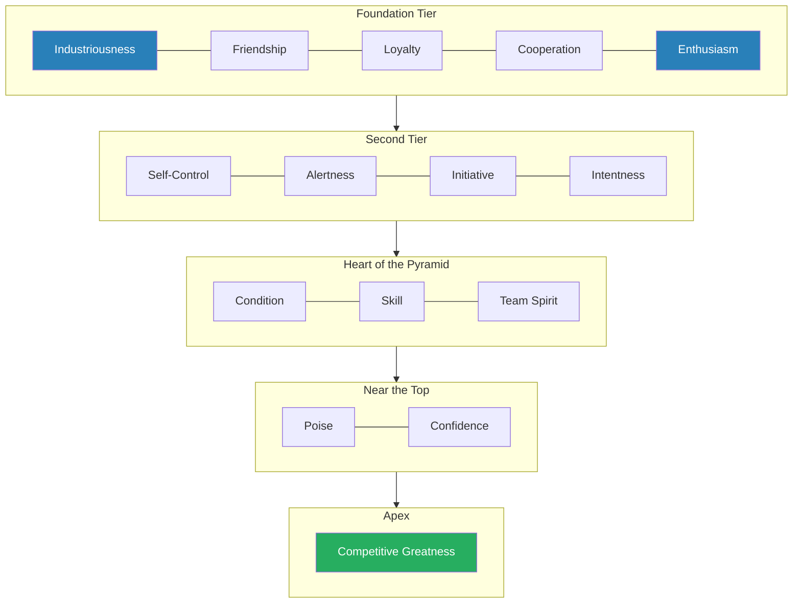
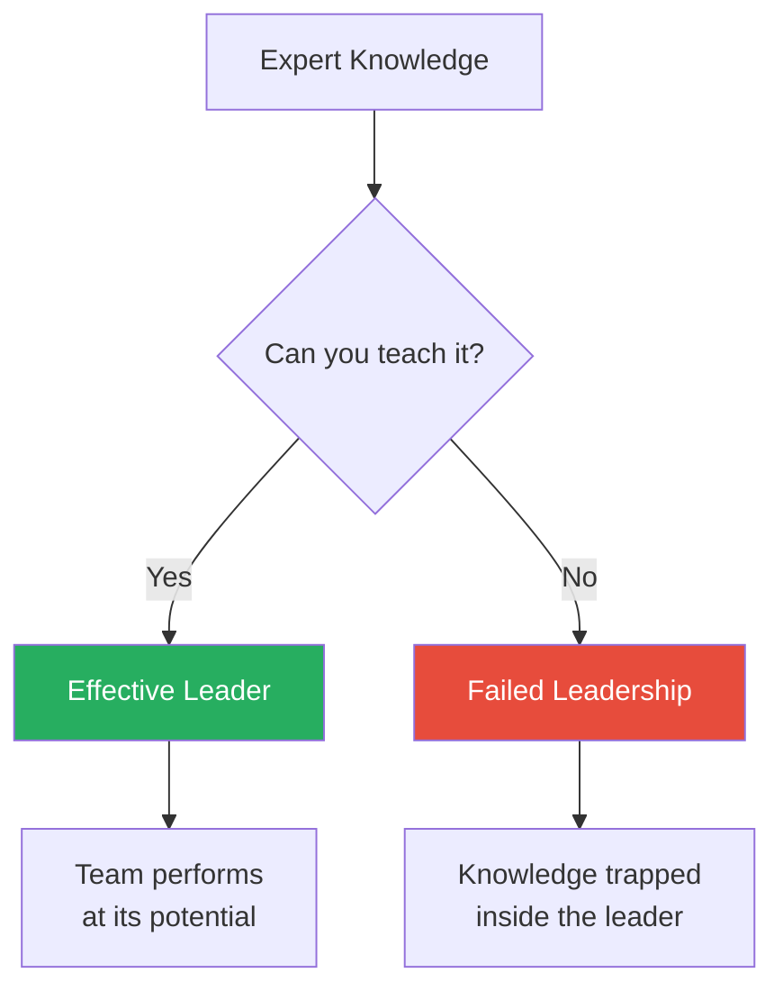
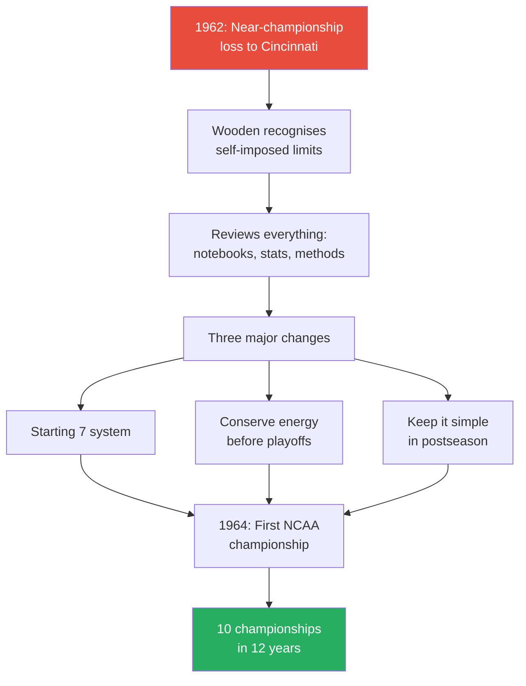
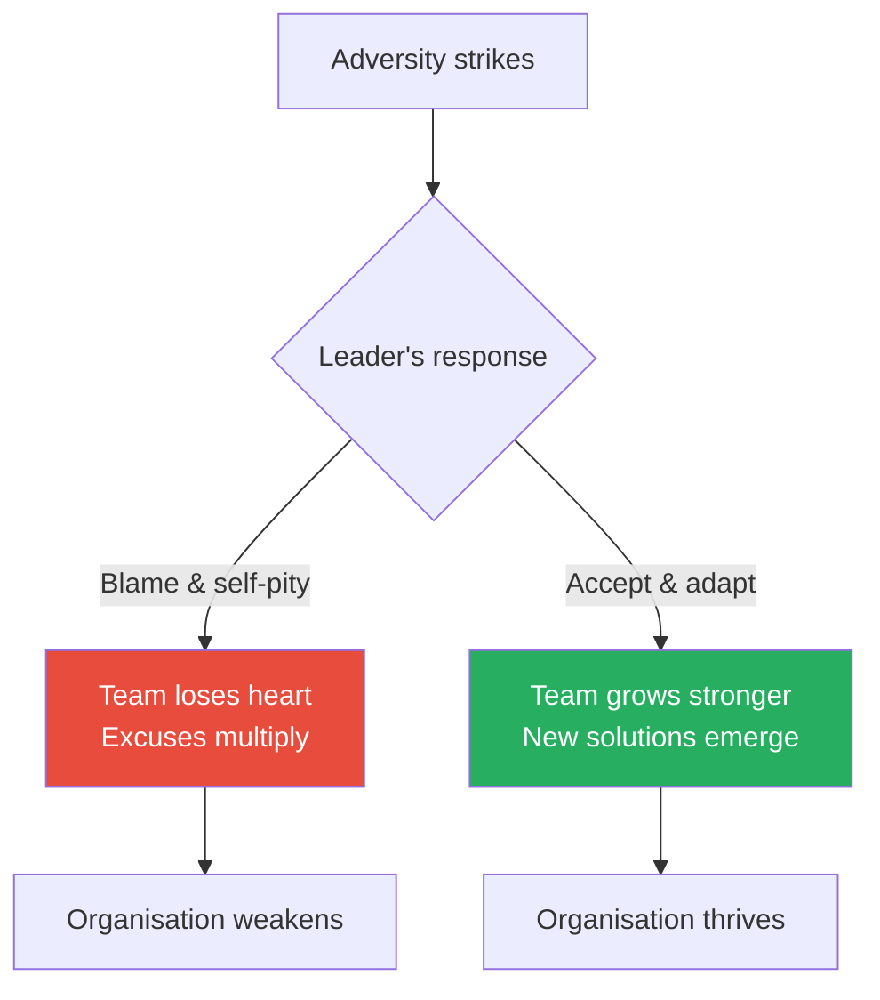

# Wooden on Leadership — John Wooden with Steve Jamison

> **In 30 seconds:** John Wooden, the legendary UCLA basketball coach who won ten national championships in twelve years, distils a lifetime of leadership philosophy into a single framework: the Pyramid of Success. His central claim is radical — success is not winning, but the peace of mind that comes from knowing you gave your absolute best. Built on his father's farm wisdom, Wooden's leadership model prizes character over talent, teaching over commanding, emotional discipline over rah-rah motivation, and relentless attention to small details over grand strategy. This is not an abstract treatise; it is the lived playbook of someone who built the most dominant dynasty in American sports history while refusing to even mention the word "winning" to his players.

---

## About the Author

John Robert Wooden (1910–2010) coached basketball at UCLA from 1948 to 1975, compiling a record that remains unmatched: ten NCAA national championships, seven of them consecutive, an 88-game winning streak, four perfect 30–0 seasons, and 38 straight tournament wins. Before UCLA, he was a three-time All-American guard at Purdue and coached high school and college teams in Indiana. Co-author Steve Jamison worked with Wooden for years across multiple books, helping translate the coach's philosophy into a framework accessible beyond basketball. Wooden always described himself first as a teacher, not a coach — a distinction that shapes every page of this book.

---

## The Big Idea

- Wooden's entire leadership philosophy rests on a single redefinition: <b style="color: #27ae60">success is not about winning, but about the effort you give to become the best you are capable of being</b>
- This definition, coined in 1934 at his first coaching job, never changed in over seventy years — "Success is peace of mind which is a direct result of self-satisfaction in knowing you made the effort to become the best of which you are capable"
- The practical vehicle for this philosophy is the <b style="color: #2980b9">Pyramid of Success</b> — fifteen personal qualities arranged in a pyramid structure, from foundational cornerstones (Industriousness, Enthusiasm) through intermediate tiers (Self-Control, Alertness, Initiative, Intentness) and the heart (Condition, Skill, Team Spirit) to the pinnacle (Competitive Greatness)
- Wooden never gave pep talks about winning, never mentioned beating opponents, never focused on scoreboards — instead, he relentlessly taught fundamentals, demanded full effort, modelled emotional consistency, and treated his teams as family
- The result was not just championships but something Wooden valued even more: players who left UCLA knowing how to give their best in all areas of life

---

## Key Concepts at a Glance

| Concept | One-line summary |
|---------|-----------------|
| **Pyramid of Success** | Fifteen building blocks arranged in tiers that define the qualities needed for true success |
| **Success as effort** | Winning is a by-product; the real measure is whether you gave everything you had |
| **Two Sets of Three** | Joshua Wooden's moral code: never lie/cheat/steal; don't whine/complain/make excuses |
| **Industriousness + Enthusiasm** | The twin cornerstones — real work powered by genuine joy for what you do |
| **Team Spirit** | Not just willingness but *eagerness* to sacrifice personal glory for the group |
| **Competitive Greatness** | A love for the hard battle itself, not just the prize at the end |
| **Emotion is your enemy** | Intensity is strength; emotionalism is weakness — consistency requires control |
| **Ten hands make a basket** | No individual scores alone; every contribution matters |
| **Little things make big things happen** | Relevant details, perfected relentlessly, are the foundation of excellence |
| **The carrot over the stick** | Pride is a more durable motivator than fear; approval from someone respected is the greatest carrot |
| **Make each day your masterpiece** | Time is your most valuable asset — plan every minute, waste none |
| **Don't look at the scoreboard** | Focus on process and preparation, not outcomes and standings |
| **Leader as teacher** | Your primary job is education — knowing is not enough, you must know how to teach |
| **Love as leadership** | A leader without love in their heart for those they lead will find nobody following |
| **Adversity is your asset** | Setbacks strengthen you if you refuse self-pity and keep working |

---

## Part 1: The Foundation for My Leadership

### Prologue — The Joys of My Journey

*Wooden opens with a confession: it was not defeats but the overwhelming attention of victory that ultimately drove him from coaching.*

- On March 29, 1975, after UCLA defeated Louisville in the NCAA semifinals, Wooden experienced something he had never felt in 41 years of coaching — "almost revulsion" at the prospect of one more press conference, one more round of speculation
- UCLA's success had created a celebrity he never wanted — at a coaches' conference, he was asked to stand outside the meeting hall so as not to distract from other speakers
  - "I had become a distraction, a disruption — a coach separate from other coaches. I was a celebrity who genuinely had never wanted to be one. I only wanted to be a coach among other coaches, a teacher among teachers"
- He told the team that their upcoming game — the 1975 national championship final — would be his last
- If a magical genie had granted him wishes, his first would be a championship for every coach he respected; his second, many championships for the few coaches he liked less (because he wasn't sure he'd wish the burdens of fame on anybody)
- A third wish: that the attention would disappear but the practices remain — "Those practices were where my teaching, coaching, and leadership existed in a wonderful and pure form, free from folderol"
- <b style="color: #27ae60">The joy of leadership is in the journey — teaching others to bring forth the best of which they are capable</b>

---

### Introduction — The Secret of Success

*Wooden traces his philosophy of success back to an Indiana farm, where his father's simple wisdom became the compass for a lifetime of leadership.*

- Wooden officially became "Coach" on September 5, 1932, at Dayton High School in Kentucky — he was 21, married a month, and hired primarily for coaching despite being trained as an English teacher
- He was paid $1,500 annually: $1,200 for teaching English, $300 for coaching football, basketball, and baseball
- Two weeks into his first coaching job, he quit coaching football — he didn't yet know how to teach the game
- His father, <b style="color: #2980b9">Joshua Hugh Wooden</b>, was a self-educated farmer who passed down the philosophical core of everything Wooden would later teach:
  - "Don't worry about whether you're better than somebody else, but never cease trying to be the best you can become. You have control over that; the other you don't"
  - Time spent comparing yourself to others is time wasted
  - If you've done your best, you may call yourself a success — do less and you've fallen short

> [!tip] Core Insight
> Winning is a by-product. Focus on the product: effort. The score takes care of itself when you take care of the effort that precedes it.

- Wooden coined his definition of success in 1934, at Dayton High School, in response to parents who howled about their children's grades or bench roles when the child had done their best:
  - "Success is peace of mind which is a direct result of self-satisfaction in knowing you made the effort to become the best of which you are capable"
- This definition never changed in over seventy years of teaching

> [!example] The 1959–60 UCLA Season — Success at 14–12
> - UCLA finished 14–12, the worst win-loss record of Wooden's tenure as head coach
> - Sports broadcaster Sam Balter had predicted UCLA wouldn't even reach .500
> - Four of five starters from the previous year were gone, including future Olympic medalist Rafer Johnson and future Louisville coach Denny Crum
> - UCLA was also ineligible for postseason play due to football programme penalties
> - Despite all this, Wooden believed the team came as close to reaching 100% of their potential as some of his later championship squads
> - He considered it among his best coaching years — but nobody outside the team understood this
> **The lesson:** Only you know whether you truly succeeded, because only you know whether you gave your best.

---

- <b style="color: #e74c3c">Never let others define your success</b> — whether critics, media, or fans, their standard (win-loss records, championships) is neither the most demanding nor the most productive
- Wooden's standard was internal and absolute: Did I make the full effort to reach my potential? Did my team?
- Before every game, his final words were always the same: "When it's over, I want your heads up. And there's only one way your heads can be up — that's to give it your best out there, everything you have"

---

### Chapter 1: The Pyramid of Success — The Foundation Tier

*Wooden reveals how an Egyptian pyramid, a high school coach's ladder, and fourteen years of reflection produced the framework that defined his leadership for four decades.*

- Wooden needed more than a definition of success — he needed a tangible teaching tool, something visible and memorable, like a map
- Inspired by his high school coach Glenn Curtis's motivational ladder and the Great Pyramid of Giza, he adopted a pyramid structure
- It took from 1934 to 1948 to finalise the fifteen building blocks and their positions
- He introduced the completed Pyramid at UCLA by handing out mimeographed copies and posting a large version behind his desk

The Pyramid of Success arranges fifteen qualities in five tiers, each tier supported by what comes before — you cannot reach the apex without first building a solid foundation.

---

#### Cornerstone 1: Industriousness

- Raised on a farm where a healthy mule was the only "modern convenience," Wooden learned early that nothing happens without hard work
- <b style="color: #2980b9">Industriousness</b> is not just "work" — most people's work is going through the motions, putting in time, enduring boredom
- True Industriousness means being fully engaged, totally focused, completely absorbed — no clock-watching, no punching in and out
- This was the very first block Wooden chose for the Pyramid — a cornerstone he never considered moving

#### Cornerstone 2: Enthusiasm

- Work without joy is drudgery, and drudgery does not produce champions
- <b style="color: #2980b9">Enthusiasm</b> transforms mere work into Industriousness — it is the catalyst that makes hard work sustainable
- Enthusiasm must be genuine — false enthusiasm is easily detected and breeds the same in others
- Different leaders express it differently: Glenn Curtis was demonstrative; Piggy Lambert was intensely controlled — both were authentically enthusiastic
- Wooden cites Jack Welch, GE's "Manager of the Century," as a business parallel — Welch's infectious Enthusiasm ignited those around him

> [!tip] Core Insight
> Industriousness and Enthusiasm are the twin cornerstones of success. Hard work without joy burns out; joy without hard work accomplishes nothing. Combined, they are an irreplaceable leadership force.

---

#### Foundation Blocks: Friendship, Loyalty, Cooperation

- Between the cornerstones, Wooden placed three qualities that involve working with others:
- **Friendship** — not buddy-buddy affection, but <b style="color: #27ae60">mutual respect and camaraderie</b>
  - People give everything they have when asked by someone they respect
  - Wooden distinguished friendship from favouritism — he never wanted personal feelings to be apparent
  - John Ecker, one of Wooden's favourite players, later told him he thought Wooden disliked him — proof the coach successfully avoided showing favouritism

- **Loyalty** — placed at the centre of the foundation for a reason
  - Impossible to lead without loyalty to your team, just as it's impossible to be a good citizen without loyalty to your country
  - Loyalty is earned, not demanded — people give it when they see that you care about their welfare beyond what they can do for you
  - "First, do not betray yourself. Second, do not betray those you lead. This is Loyalty"

- **Cooperation** — being committed to what's right rather than who's right
  - <b style="color: #e74c3c">A dictator-style leader has all the answers and no questions</b> — this can work, but incorporating others' ideas works better
  - The only similarity between a leader and a prison guard: both have the final word
  - A strong leader accepts blame and gives credit; a weak leader gives blame and accepts credit
  - The basketball assist epitomises Cooperation — helping a teammate score

---

### Chapter 2: The Pyramid's Second Tier

*Wooden shifts from heart qualities to head qualities — the mental disciplines that separate good leaders from great ones.*

#### Self-Control

- <b style="color: #2980b9">Self-Control</b> is essential for the consistency that marks true competitors and effective leaders
- "Control of your organization begins with control of yourself"
- Wooden prohibited profanity during practice — not because swearing is terrible, but because it signals loss of control
  - A player who can't control his language when frustrated will lose control in more damaging ways during competition
- Wooden viewed Self-Control as "a sixth Bruin on the court" — a tangible competitive advantage
- A well-disciplined team is simply a reflection of a self-disciplined leader

#### Alertness

- UCLA's championship teams were not defined by height but by quickness — both physical and mental
- <b style="color: #2980b9">Alertness</b> means constantly observing, absorbing, and learning from what's going on around you
- "It's what you learn after you know it all that counts"
- Leaders who prevail are those who see things coming when their counterparts aren't even looking
- A driver asleep at the wheel crashes — so does an organisation whose leader fails to exhibit Alertness

#### Initiative

- "The team that makes the most mistakes usually wins" — Coach Piggy Lambert
- The mistakes Lambert meant are not careless ones but the result of assertive action based on proper assessment of risk
- <b style="color: #27ae60">"Be quick, but don't hurry"</b> — make a decision and act, but don't rush carelessly
- "Failure to act is often the biggest failure of all"
- Wooden distinguished between mistakes of commission (calculated to make things happen) and mistakes of omission (resulting from fear and hesitation)
- He rarely criticised a player who tried intelligently to make things happen, even when the attempt failed

#### Intentness

- <b style="color: #2980b9">Intentness</b> conveys diligence, determination, fortitude, resolve — persistence
- Without it, you falter, fade, and quit
- Intentness implies staying the course over the long term rather than meandering in bursts of short-lived activity
- Wooden had Intentness for 28 years of coaching before UCLA won its first championship in his twenty-ninth year
- "Be sure you are wrong before you quit"

---

### Chapter 3: The Heart of the Pyramid

*The Pyramid's middle tier houses Coach Piggy Lambert's essential formula — condition, fundamentals, unity — expanded into a comprehensive leadership model.*

#### Condition

- Goes beyond physical fitness to include <b style="color: #2980b9">mental and moral Condition</b>
- You cannot attain proper physical fitness unless it's preceded by mental and moral conditioning
- Wooden's prescription for moral Condition: "Practice moderation and balance in all that you do"
- Workaholics lack balance, and imbalance is a weakness that causes inconsistency
- "All we've worked so hard to accomplish on the court today can be torn down quickly, in a matter of minutes, if you make the wrong choices between now and our next practice"

#### Skill

- You must know all facets of your job — not just parts of it
- "When I am through learning, I am through"
- Wooden saw many coaches who could teach offence but were limited on defence, and players who could shoot but couldn't get open
- Whether in basketball or business, you must be able to both "get open" and "shoot"
- The best leaders are lifelong learners who create organisations that foster learning throughout

#### Team Spirit

- Coach Lambert called it "unity," but Wooden wanted something with more heart and soul
- Initially defined as "a willingness to sacrifice personal interest or glory for the welfare of all" — but one word bothered him
- He changed "willingness" to <b style="color: #27ae60">"eagerness"</b> — the difference between grudging compliance and wholehearted commitment
- "What can I do to help our team today?" replaces "How can I get ahead?"
- Team Spirit has the potential to make your team greater than the sum of its parts — exponential, not additive

> [!tip] Core Insight
> If you only remember one thing from this book: the star of every successful team is the team. Individuals don't win; teams do.

---

#### The Harvest: Poise and Confidence

- <b style="color: #2980b9">Poise</b> — being true to yourself, not getting rattled regardless of circumstance
  - "If you can meet with Triumph and Disaster / And treat those two impostors just the same" — Kipling
  - You don't acquire Poise; Poise acquires you — it arrives as a harvest when you've built the lower tiers
- <b style="color: #2980b9">Confidence</b> — the knowledge that your preparation is complete
  - "You must earn the right to be confident"
  - Must be monitored so it doesn't rot into arrogance — the assumption that past success will repeat without the same effort
  - Wooden never went into a game assuming victory — all opponents respected, none feared

The Pyramid's blocks are not isolated qualities but a deeply interconnected network — Industriousness feeds into both Condition and Skill, Friendship and Loyalty converge on Team Spirit, and Self-Control is the essential precursor to Poise, which along with Confidence supports the apex of Competitive Greatness.

#### The Apex: Competitive Greatness

- "A real love for the hard battle, knowing it offers the opportunity to be at your best when your best is required"
- <b style="color: #27ae60">Competitive Greatness is not defined by victory nor denied by defeat</b>
- The great competitors Wooden admired shared a joy derived from the struggle itself
- The hard struggle is to be welcomed, never feared — the only thing to fear is your own unwillingness to give full effort

#### The Mortar: Faith and Patience

- Faith that things will work out as they should — a boundless belief in the future
- Patience — if difficult goals could be achieved quickly, more people would be achievers
- These qualities hold all the other blocks firmly in place

Faith and Patience serve as the mortar binding every block of the Pyramid — without them, the structure crumbles under the pressure of competition.

---

## Part 2: Lessons in Leadership

### Chapter 4: Good Values Attract Good People

*Wooden demonstrates that character is not a luxury but a competitive advantage — organisations built on strong values attract talent that organisations built on winning alone never will.*

> [!example] Frank Kautsky vs the Cleveland Owner
> - Wooden played weekend semipro basketball for Frank Kautsky's team at $50 a game
> - After sinking 100 consecutive free throws, Kautsky stopped the game and rewarded him with a $100 bill — no obligation, just generosity
> - Later, Wooden switched to a team closer to home for the same $50 per game
> - Driving through a blizzard to reach a game in Cleveland, he and a teammate nearly died — the owner told them two others who tried the drive were in the morgue
> - They arrived at halftime, Wooden played brilliantly and helped win the game
> - The owner paid him $25 — half the agreed amount — because he'd "missed the first half"
> - Wooden collected his remaining pay, played one more game, then quit and returned to Kautsky's team
> **The lesson:** A leader's values are revealed in how they treat people when it matters. Good values attract good people; bad values drive them away.

---

> [!example] Lewis Alcindor Jr. Choosing UCLA
> - The most recruited high school player in America narrowed his choices to five schools
> - Wooden's policy: he would never initiate contact with a recruit — if they weren't eager to join, perhaps another school was better
> - Alcindor's family chose UCLA for four value-driven reasons:
>   - **Evidence of equality:** Seeing Rafer Johnson introduced on the Ed Sullivan Show as UCLA's student body president — a Black student elected by a predominantly white student body
>   - **Scholastic merit:** UCLA's high academic standards and graduation rates
>   - **Heartfelt testimonials:** Unsolicited letters from Nobel Peace Prize winner Dr. Ralph Bunche and Jackie Robinson
>   - **Blind to colour:** Former player Willie Naulls told Alcindor that Wooden was "colour-blind when it came to race"
> - Good values are like a magnet — they attract good people
> **The lesson:** Make your values visible. What is your version of the Ed Sullivan Show and Ralph Bunche's letter?

- **Character counts in hiring:** Wooden once prepared to offer a scholarship to a talented player, but during the interview the young man snapped at his own mother: "How can you be so ignorant? Just keep your mouth shut." Wooden ended the meeting and never offered the scholarship
  - The player went on to play for another school and even beat UCLA — but Wooden was delighted to have discovered the character flaw before it could contaminate his team
- <b style="color: #e74c3c">A person who values winning above anything will do anything to win — and such people are threats to their organisations</b>
- Wooden's code of conduct came from his father's <b style="color: #2980b9">Two Sets of Three</b>: "Never lie; never cheat; never steal. Don't whine; don't complain; don't make excuses"
- Character is more than honesty — a person can be honest but selfish, honest but undisciplined, honest but disrespectful

---

### Chapter 5: Use the Most Powerful Four-Letter Word

*Wooden makes the case that love — genuine care for the people under your leadership — is not sentimental weakness but the foundation of extraordinary team performance.*

- The most productive model for leadership is a good parent — character, consistency, dependability, knowledge, courage, discipline, and above all, <b style="color: #27ae60">love</b>
- Early in his career, Wooden told players he would like them all the same — this turned out to be false
- Then he read a statement from legendary football coach Amos Alonzo Stagg: "I loved all my players the same, I just didn't like them all the same"
- At UCLA, Wooden's opening-season message became: "I will not like you all the same, but I will love you all the same. And whether I like you or not, my feelings will not interfere with my judgment"

> [!example] Andy Hill's 27-Year Silence
> - Andy Hill, a reserve on three national championship teams, didn't speak to Wooden for 27 years after graduating
> - Hill was bitter that Wooden wouldn't make him a starter — he had been a good high school player and couldn't accept a bench role at UCLA
> - After 27 years, Hill called: "Coach Wooden, this is Andy Hill. Remember me?"
> - Wooden replied: "Andy, where have you been?"
> - Hill had come to understand that his old coach had been right all along
> **The lesson:** Like a parent, a leader must make decisions that some will hate. The strong family survives because love is present.

---

- **Firm and flexible:** Wooden evolved his understanding of fairness over time
  - He once told players he'd treat them all the same — then realised this was neither fair nor impartial
  - A player working hard shouldn't receive the same treatment as one offering less
  - Some roles are filled by people harder to replace — small accommodations for top performers are facts of life, not double standards
  - But accommodations must never apply to basic principles and values

> [!example] Bill Walton and the Team Bus
> - Walton arrived at the team bus looking unkempt before an important game at USC
> - Wooden's dress rule had evolved from coat-and-tie to simply "clean and neat appearance"
> - Walton did not look clean and neat — Wooden sent him home, refusing to let him on the bus
> - Allowing it would have sent the message: "Bill can break the rules, but you can't"
> - However, when Walton became vegetarian and asked to skip the mandatory team steak dinner, Wooden granted the request
> - The dress violation had ramifications for team discipline; the diet choice did not
> **The lesson:** Knowing when to be firm and when to be flexible is one of leadership's greatest challenges.

- "Nobody cares how much you know until they know how much you care" — small acts of concern matter enormously
  - Wooden and his wife Nell invited players for Thanksgiving and Christmas dinner when they couldn't go home — a technical NCAA violation he was willing to commit
  - He bailed players out of jail for minor traffic violations
  - He sent Eddie Sheldrake home to care for his sick wife instead of travelling with the team

- **Apartness is part of the job:** While love is essential, so is objectivity
  - The aim is not to make new friends but to do what is best for the team
  - When Wooden understood that objectivity and love could coexist, decision-making became much easier
  - Especially for decisions that would cause hard feelings and resentment — a leader must make them anyway

> [!example] Jim Powers — Nobody in the Family Gets Left Behind
> - Jim Powers, a former South Bend Central player, followed Wooden to Indiana State Teachers College after World War II
> - Powers had been shot down in a B-24 raid over Italy and refused to fly — when the Sycamores were supposed to fly to Madison Square Garden, he told Wooden he wouldn't get on a plane
> - Wooden refused to leave him behind — got station wagons and drove the entire team to New York
> - In 1947, the Sycamores were invited to a national tournament that prohibited Black players — teammate Clarence Walker was Black
> - Wooden turned down the invitation — he wouldn't leave Clarence behind
> - The same thing happened in 1948 — this time the tournament changed its rules, and only then did Wooden accept
> - The Sycamores reached the finals with Clarence playing alongside everyone else
> **The lesson:** A true family doesn't leave anyone behind. A leader's values are tested not when it's easy to uphold them, but when upholding them costs something.

---

### Chapter 6: Call Yourself a Teacher

*Wooden reveals that his greatest asset was not basketball knowledge but the ability to teach it — and that leadership without teaching skill is leadership without power.*

- "Whatever the title on your business card, call yourself a teacher"
- Wooden arrived at Dayton as a three-time All-American who understood basketball perfectly — but couldn't teach it to save his soul
- His first season was a losing one; he even lost to his own alma mater, coached by Glenn Curtis
- The difference: Curtis knew how to teach basketball; Wooden didn't

> [!abstract] The Laws of Learning
> 1. Explanation — tell them what to do
> 2. Demonstration — show them how to do it
> 3. Imitation — let them try it
> 4. Correction — fix what's wrong (and it usually is)
> 5. Repetition — do it again and again until it's habit

- <b style="color: #e74c3c">The most common leadership failure: confusing expertise with the ability to teach it</b>
- As a naturally gifted athlete, Wooden assumed teaching meant telling someone to do something and watching them do it — that's not how teaching works
- He had to learn patience — his initial teaching technique was "harder and louder"
- During his second week as Dayton's football coach, his impatience was so extreme he got into a physical fight with a player

---

- **Demonstration trumps description:** "No written word nor spoken plea / Can teach your team what they should be / Nor all the books on all the shelves / It's what the leader is himself"
  - Wooden taught the Pyramid primarily by his own example
  - He quit smoking because he realised he was setting a bad example in the off-season even though he stopped during basketball season

- **Wear many hats:** An effective leader is teacher, disciplinarian, demonstrator, counsellor, role model, psychologist, motivator, timekeeper, quality control expert, talent judge, referee, and organiser
  - When Wooden first arrived at UCLA, he also wore the custodian's hat — washing the court before practice, sprinkling water from a bucket while assistant coach Eddie Powell followed behind with a mop
  - In 40 years of coaching, Wooden never scored a point or blocked a shot — his job was to teach others how to do it

- **Don't cause indigestion:** Wooden learned not to overwhelm players with information
  - His early approach was to hand out a hefty UCLA handbook with everything at once
  - He evolved to dispensing information in bite-sized pieces throughout the season
  - "The greatest holiday feast is eaten one bite at a time. Gulp it down all at once and you get indigestion"

- **Understanding human nature:** "How can I learn about human nature?" someone asked Wooden. He replied: "Get old"
  - No two people are alike — some need a push, others you lead
  - Recognising the difference requires experience, which can be accelerated by asking people who already have it
  - This is what Wooden was doing in reaching out to other coaches throughout his career

- **Never stop learning:** After each season, Wooden picked one aspect of basketball to study intensively
  - He called coaches who excelled at that specific element — including Adolph Rupp, who had beaten UCLA both times they played
  - "It's extremely difficult to stay at the top — because once you get there, it is so easy to stop listening and learning"

Knowing your craft is necessary but insufficient — effective leadership requires the ability to transfer that knowledge to others.

---

### Chapter 7: Emotion Is Your Enemy

*Wooden draws a sharp line between intensity and emotionalism, arguing that the leader who controls emotions creates consistency — and consistency is the hallmark of greatness.*

- "The Swiss Alps have majestic peaks and scenic valleys. Peaks and valleys belong in the Alps, not in the temperament of a leader"
- <b style="color: #27ae60">Intensity makes you stronger. Emotionalism makes you weaker</b>
- Wooden never gave rah-rah speeches, never ranted before or after games, never made theatrical displays
- His performance goal was steady, tangible progress — drawn on a graph, the line would rise every day through the season with no sharp spikes or drop-offs
- "If you let your emotions take over, you'll be outplayed"

> [!example] The Father Who Threatened Wooden's Job
> - At South Bend Central, a school board member's son hadn't technically qualified for a varsity letter
> - Wooden was 99% sure he would recommend the boy anyway, recognising his hard work
> - The father stormed into Wooden's office, poked him in the chest, and threatened: "He'd better get a letter or I'll have your job"
> - Enraged, Wooden challenged the man to a fight
> - The father left, but the real damage came next: Wooden decided not to recommend the boy for the letter — punishing the son for the father's behaviour
> - After cooling off, Wooden tried to add the name back, but it was too late
> - Seventy years later, he still regrets the decision
> **The lesson:** Emotion hijacks judgment. The boy was hurt because Wooden let anger replace common sense.

> [!example] The Post-Game Fight at South Bend
> - After South Bend Central beat an archrival for the second straight time that season, Wooden crossed the court to congratulate the losing coach
> - The opposing coach unleashed a string of expletives, accused Wooden of bribing referees
> - Wooden "saw red" and knocked him to the floor as players and fans rushed in
> - Both coaches demonstrated how losing control can be destructive
> **The lesson:** Both getting angry and acting on it are choices. Wooden spent decades learning to prevent emotions from getting out of hand.

---

- Wooden became so controlled that a play-by-play announcer once joked: "Coach Wooden just raised his eyebrow. He must be very upset about something"
- In ten national championship games, during final timeouts with victory in hand, Wooden's message was: "Don't make fools of yourselves when this is over"
- He recalled only one technical foul in his entire coaching career
- His wife Nellie said she usually couldn't tell from his expression whether UCLA had won or lost

| Intensity | Emotionalism |
|-----------|-------------|
| Controlled, directed energy | Uncontrolled mood swings |
| Produces consistency | Produces roller-coaster performance |
| Focuses the team | Distracts the team |
| Earns respect | Creates fear and uncertainty |
| Leaders who model it get it from the team | Leaders who display it see it mirrored back destructively |

A volatile leader is like a bottle of nitroglycerine — those around it spend all their time tiptoeing instead of doing their jobs.

> [!example] Fred Slaughter — A Cool Leader Prevents Overheating
> - In four or five games during Slaughter's career, UCLA started behind something like 18–2 — "just getting killed"
> - Slaughter would look over at Wooden on the bench: "There he'd sit with his programme rolled up in his hand — totally unaffected, almost like we were ahead"
> - Slaughter's reaction: "If he's not worried, why should I be worried? Let's just do what the guy told us to do"
> - UCLA won all those games except one, and even that was close
> - In three years on the UCLA varsity, Slaughter never once saw Wooden rattled
> **The lesson:** The leader's composure becomes the team's composure. Confidence and strength flow downward.

- When UCLA lost to Cincinnati in the 1962 semifinals on a phantom charging call in the final minute, Wooden's reaction in the locker room was the same as if they had won
  - No complaining — he told them to keep their heads up: "Adversity makes us stronger"
  - Then: "Remember, you've still got one another"
  - Two years later, UCLA won its first national championship

---

### Chapter 8: It Takes 10 Hands to Score a Basket

*Wooden turns the cult of individual stardom on its head, arguing that managing egos and building genuine team-first culture is the leader's most important — and most difficult — task.*

- When the USA Basketball team lost at the 2004 Olympics, every player was an NBA All-Star — but they lost because "we sent great players; they sent great teams"
- Wooden's official team photograph was a study in equality — no individual got more space because of talent, seniority, or fame
- <b style="color: #27ae60">"The star of the team is the team"</b>
- Teaching selflessness is hard because it runs counter to human nature — the instinct to take rather than give, to withhold rather than share
- In basketball, the "ball" that must be shared is literal; in business, it's knowledge, experience, information, contacts, and ideas

> [!example] Gail Goodrich and the 35 Minutes
> - Goodrich arrived at UCLA thinking like a guard: "Give me the ball so I can shoot"
> - Wooden needed him to embrace the full-court Press — a defensive system where you don't have the ball
> - Wooden told him: "The game is 40 minutes long. The opponent has the ball approximately half the time. That leaves us 20 minutes. We have five players, so you'll have the basketball about four minutes per game. Gail, what are you going to do for the team during those other 35 minutes?"
> - It took fifteen seconds to transform Goodrich's understanding of his role
> **The lesson:** Help each person understand their full contribution, not just the part they enjoy most.

---

- **The Indianapolis 500 analogy:** The driver gets all the attention, but is helpless without the pit crew — the man putting fuel in the car, the one removing lug nuts, the one holding the fire extinguisher
  - Every member of the team is there for a reason — if they're not contributing, why are they on the team?

- **Private and public praise:** An independent study found Wooden gave less visible players far more on-court compliments than superstars
  - This wasn't because he ignored top performers — he praised them amply in private
  - Superstars get enough public attention; adding more creates envy
  - Players in lesser roles receive maximum impact from public recognition

> [!example] Sidney Wicks' Transformation
> - Sidney Wicks arrived at UCLA focused on his personal statistics
> - Wooden's stats showed that regardless of which players scrimmaged with Wicks, his numbers stayed high while everyone else's dropped — he was playing for himself
> - Despite being more talented than those ahead of him, Wooden kept him out of the starting rotation
> - When Wicks finally embraced the team-first philosophy, he became the best college forward in America
> - Wooden enforced his decision without personal attacks or ridicule — businesslike and professional
> **The lesson:** The best players don't necessarily make the best teams. Individual statistics matter only to the degree they enhance overall team performance.

- Wooden periodically checked scoring balance: over 20 seasons, guards scored 16,131 baskets, forwards 15,355, centres 7,649 — guards took just 1.5 fewer shots per game than forwards
- This balance meant no opponent could stop UCLA by defending against just one player
- He insisted the player who scores give a nod or "thumbs up" to the teammate who made the assist — so it was more likely to happen again

Over twenty seasons, UCLA's guards and forwards scored nearly equally (16,131 vs 15,355 baskets) — a remarkable balance that made the Bruins impossible to defend by shutting down any single position, vindicating Wooden's insistence that "the star of the team is the team."

> [!example] Coach Nikolic's Fist — The 1964 Championship
> - In 1964, UCLA advanced to the NCAA finals for the first time — undefeated but discounted by most critics
> - Duke was taller and had great individual talent
> - On the morning of the championship game, a visiting Yugoslavian coach named Aleksandar Nikolic boldly predicted UCLA would win
> - When reporters asked why, Nikolic held up his right hand with five fingers outstretched, then curled them into a tight fist: "UCLA is team! UCLA is team!"
> - That night, the Bruins proved him right — a group of individuals who understood it takes 10 hands to score a basket defeated the favourites
> **The lesson:** When leadership creates genuine sharing and selflessness, the team becomes more than the sum of its parts. Duke had better players; UCLA had a better team.

- A player who thumps his chest after making a basket is acknowledging the wrong person
- Sharing credit is a surefire way to improve performance results — everyone starts helping everyone
- Wooden's basketball was designed for balance: no single position or player with a disproportionate role
  - This meant no opponent could stop UCLA by defending against just one player

---

### Chapter 9: Little Things Make Big Things Happen

*Wooden's legendary obsession with details — from socks to shoestrings to orange rinds — reveals a philosophy where there are no big things, only a logical accumulation of little things done at a high standard.*

- "If you collect enough pennies you'll eventually be rich. Each perfected detail was another penny in our bank"
- <b style="color: #2980b9">Mother Teresa's formulation:</b> "There are no big things. Only little things done with love"

> [!abstract] Wooden's Details — From the Ground Up
> 1. **Socks:** Personally demonstrated how to eliminate wrinkles and folds in sweat socks, one pair at a time, smoothed all the way up the calves
> 2. **Shoes:** Didn't ask players what size they wore — had the trainer measure each foot (right and left) to ensure proper fit
> 3. **Shoestrings:** Sat down and showed players how to lace and tie sneakers so they wouldn't come undone
> 4. **Jerseys:** Always tucked in — created unity and signalled that sloppiness was not tolerated
> 5. **Practice uniforms:** Ordered new ones immediately upon arriving at UCLA — no rag-tag collection of outfits
> 6. **Opponent-colour vests:** Bought inexpensive cloth vests in the opposing team's uniform colour for pre-game scrimmages
> 7. **Halftime refreshments:** Switched from chocolate to orange slices because chocolate left phlegm in windpipes
> 8. **Orange rinds:** Must be deposited in the wastebasket, not tossed on the floor near it
> 9. **Water temperature:** Room temperature, no ice, to avoid stomach cramps
> 10. **Beards and long hair:** Forbidden — sweat-soaked hair makes fingers slippery, leading to turnovers

- **The rivet and the wing:** Each detail is like a rivet on an airplane wing — remove one and it remains intact; remove enough and the wing falls off
- <b style="color: #e74c3c">Sloppiness breeds sloppiness</b> — a casual approach to one detail ensures other details will also be done poorly

> [!example] Lynn Shackleford's First Team Meeting
> - Shackleford sat next to Lewis Alcindor Jr., surrounded by returning national champions
> - When Coach Wooden walked in, his first words were: "Gentlemen, let's get down to business. Number one: keep your fingernails trimmed. Number two: keep your hair short. Number three: keep your jersey tucked in at all times"
> - Shackleford wondered if it was a joke — but no varsity player was laughing
> - Over three seasons and three more championships, he came to recognise that "stuff like that" was genius — hundreds of small things done right, all related to everything else
> **The lesson:** Everything is connected to everything. Details of fingernails and jerseys lead to details for running plays and handling the ball.

---

- **Not a perfectionist:** Wooden strove for perfection but didn't consider himself a perfectionist — perfection is unattainable, but striving for it is very attainable
- **Allow exceptions for exceptional results:** Keith Wilkes shot free throws from behind his head — the most unorthodox style imaginable — but never started missing (87.2% in his best season, missing only 12 of 94 attempts)
  - Wooden's rule: wait until they start missing, then teach the correct method — Wilkes never started missing
- **Balance matters:** A coach once devoted disproportionate practice time to free throws — his team became the finest free throw shooters in America but couldn't win basketball games because everything else had suffered

---

### Chapter 10: Make Each Day Your Masterpiece

*Wooden reveals how meticulous time management — planning every minute on 3x5 cards — became perhaps his greatest competitive advantage.*

- "Make each day your masterpiece" — Joshua Wooden's favourite refrain
- <b style="color: #27ae60">Time, used correctly, is among your most potent assets</b> — unlike gold, it cannot be recovered once lost
- UCLA practices averaged two hours, five days a week, over 21 weeks — roughly 12,600 minutes of practice time per season
- Wooden treated each minute like a gold coin — wasting even one was painful

> [!abstract] The 3x5 Card System
> 1. Each morning, Wooden met with assistant coaches — absolutely no outside distractions, no phone calls, no visitors
> 2. They reviewed the previous day's practice and planned the afternoon's session
> 3. Everything was written on 3x5 index cards: exact minute-to-minute timetable — who, what, when, where
> 4. Even the number of basketballs at specific court locations at specific times was specified
> 5. After practice, cards were transferred to notebooks for future reference
> 6. Before each season, Wooden reviewed notebooks from previous years — sometimes going back 10, 15, even 25 years
> 7. The system enabled him to identify what worked, what didn't, and how to avoid wasting time

- "Don't mistake activity for achievement" — bustling bodies making noise doesn't mean anything is being accomplished
- "Give me 100 percent. You can't make up for a poor effort today by giving 110 percent tomorrow. You don't have 110 percent"
- **Punctuality was sacred:** Being late showed disrespect for time itself — one of the very few rules Wooden never altered from Dayton to UCLA

> [!example] Eddie Powell and the Mishawaka Bus
> - The team bus was scheduled to leave at exactly 6 p.m. for a game against archrivals Mishawaka
> - All players were seated except the two co-captains
> - Wooden asked the driver the time, confirmed it was 6 p.m., and said: "Let's go"
> - The bus left without the two most important players — one of whom was the son of a vice principal who could create job problems for Wooden
> - The co-captains had skipped the game to go to a dance
> - That story was told for years to new players: Coach Wooden meant what he said
> **The lesson:** Rules about time are non-negotiable. No exceptions, regardless of status or consequences.

Wooden devoted the largest share of practice time — 35% — to fundamentals drilling rather than scrimmaging, reflecting his conviction that perfecting "little things" creates the foundation for big-game performance, with every remaining minute meticulously planned on his famous 3x5 cards.

A well-organised leader can get more done in two hours than a poorly organised coach gets done in two days — this compounds over weeks and months into the difference between champions and also-rans.

---

### Chapter 11: The Carrot Is Mightier Than a Stick

*Wooden traces his evolution from rigid rule-maker to sophisticated motivator, discovering that pride is more durable than fear and that approval from someone respected is the most powerful carrot of all.*

- <b style="color: #27ae60">Punishment invokes fear. Pride is the superior motivator</b>
- The most powerful carrot: sincere approval from someone the individual truly respects
  - But it only works if praise is genuine — frequent, gratuitous praise destroys the value of a sincere compliment
  - Wooden avoided "That's great!" — instead: "Good, very good. That's getting better" or "That's the idea. Now you're getting it"

- **Evolution from rules to suggestions:**
  - Early career: lots of rules, few suggestions, automatic penalties
  - Later career: lots of suggestions, fewer rules, unspecified consequences
  - The shift gave Wooden far more discretion and more productive responses

| Early Wooden | Mature Wooden |
|-------------|---------------|
| Rigid rules with fixed penalties | Strong suggestions with unspecified consequences |
| Smoking = immediate dismissal | "I strongly suggest you don't smoke; if your behaviour brings discredit on the team, action will be taken" |
| No room for context | Room for judgment and common sense |
| Risk: player calculates if violation is worth the penalty | Unknown penalty keeps people from testing boundaries |
| Cost a player his college scholarship | Preserved options to respond appropriately |

> [!example] The Cowboy and the Horse
> - A cowboy returns from a saloon to find his horse stolen
> - He storms back in and announces: "When I finish my next beer, I'd better find my horse outside. Otherwise, I'm gonna do what I did down in Texas"
> - When he emerges, the horse is there — the bartender asks what he did in Texas
> - The cowboy replies: "I walked home"
> - People fear the unknown more than the known — unspecified consequences can be more effective than rigid penalties
> **The lesson:** Preserve your options as a leader. Don't lock yourself into rigid penalties that remove your judgment from the equation.

---

- **Criticism protocol:**
  - Criticise in private, not in front of others
  - Be stern but not personal — no insults, no berating, no anger
  - When it's over, it's over — move on without lingering animosity
  - Never open wounds that are slow to heal
  - <b style="color: #e74c3c">Only the leader gives criticism</b> — Wooden absolutely would not tolerate players criticising teammates
  - He would remind them how the Roman Empire crumbled from within: "Opponents are working very hard to defeat us. Let's not do it for them"
- **Combine compliment with criticism:** "I like your aggressiveness on defence. Can I see some of that when you drive to the basket?"

---

### Chapter 12: Make Greatness Attainable by All

*Wooden redefines greatness as performing your specific job to the highest level of your ability — making it available to every member of the team, not just the stars.*

- Wooden has never answered the question "Who is the greatest player you ever coached?" — because the question itself contradicts his philosophy
- <b style="color: #27ae60">Personal greatness is measured against your own potential, not someone else's</b>
- He wanted every member of the team — players, assistant coaches, managers, the trainer — to know that greatness was available to each of them
- He never used the term "substitutes" — players were starters or nonstarters, never substitutes

> [!example] Swen Nater's Greatness in Practice
> - Swen Nater served as backup centre behind Bill Walton — he could have started on almost any other team in the country
> - Wooden clearly explained Nater's role: sharpening Walton's abilities in practice by providing strong opposition
> - Nater eagerly accepted his role and helped UCLA win two national championships
> - Was Walton greater than Nater? Wooden considers the question irrelevant — both achieved personal greatness in their specific roles
> **The lesson:** Personal greatness is not determined by the size of the job, but by the size of the effort one puts into the job.

> [!example] Doug McIntosh — From "Hopeless" to Championship Hero
> - When Wooden first saw McIntosh scrimmage as a freshman, he thought: "This fellow will never play a meaningful minute on the UCLA varsity"
> - McIntosh worked relentlessly, came off the bench in the 1964 national championship game, and played 30 crucial minutes in beating Duke
> - He never played in the NBA, was never declared "the greatest" by anyone — but Wooden considers him as successful as any player he ever coached
> - McIntosh wore number 32, just as Walton did eight years later
> **The lesson:** When you create an environment that rewards effort and improvement, unexpected talent emerges from unexpected places.

- **Against retiring numbers:** When UCLA retired Walton's #32 and Alcindor's #33, Wooden strongly objected
  - Steve Patterson played centre on two championship teams wearing #32 before Walton got it
  - Willie Naulls was an All-American wearing #33 before Alcindor
  - "The number on a uniform always belongs to the team, never to an individual"
- **Awards that matter:** Wooden encouraged awards for "mental attitude," "most unselfish team player," and "improvement" — never just top scorer
- **Manage ambition wisely:** Before advancing, players must first master their current role — before calculus comes geometry; before geometry comes addition
  - "Be ready when your opportunity arrives, or it may not arrive again"
  - Ambition, properly controlled and directed, is vital — but never let future aspirations distract from present responsibilities

> [!example] Conrad Burke — The "Hopeless" Player Who Became a Starter
> - When Wooden first saw Conrad Burke scrimmage as a freshman, he thought: "My, he's hopeless. If this young man makes the varsity, it'll mean the varsity is pretty terrible"
> - The next season, Burke became a starter on a team that won the conference title with a 16–0 record
> - Burke couldn't jump well and was short for a centre, but he learned through constant practice how to gain position under the basket
> - He "worked relentlessly to bring out all he had, and he came very close to doing that"
> - Neither Burke nor McIntosh received much attention or played in the NBA — but Wooden considers both as successful as any player he ever coached
> **The lesson:** When you create an environment that values effort and improvement, people discover potential they never knew they had. As Joshua Wooden said: "Don't worry about being better than someone else, but never cease trying to be the best you can become."

---

### Chapter 13: Seek Significant Change

*The 1962 season that almost produced a championship shook Wooden out of complacency and launched the dynasty — a case study in recognising and removing self-imposed limitations.*

- For 13 years at UCLA, Wooden accepted that the Men's Gym — cramped, poorly ventilated, shared with other sports — made a national championship virtually impossible
- <b style="color: #e74c3c">He was unconsciously giving himself an excuse for the status quo</b>
- Then the 1962 UCLA team reached the Final Four for the first time in history and nearly won — losing to Cincinnati 72–70 on a last-second shot by a player who hadn't scored all game

> [!example] The 1962 Revelation
> - UCLA's unheralded 1962 team nearly won the national championship despite the terrible Men's Gym
> - The near-victory shattered Wooden's subconscious belief that facilities precluded a championship
> - He stopped saying "no" and started asking "how?"
> - He conducted an intense review of everything: notebooks, 3x5 cards, practice and game statistics going back to day one
> - Three critical changes emerged:
>   - **Starting seven system:** Instead of democratically sharing playing time, he concentrated on seven main players — improving cohesion
>   - **Conserving energy:** Stopped intensifying practices before the NCAA tournament, which had been leaving players physically spent
>   - **Keeping it simple:** Stopped adding new plays before postseason — stayed with what worked during the regular season
> **The lesson:** The biggest obstacle to reaching the next level may be you. Identify and eliminate the excuses you've made for accepting the status quo.

---

- **The Press:** On the flight home from the 1962 Final Four, assistant coach Jerry Norman advocated for installing the full-court Press
  - Wooden had used it at Indiana State but abandoned it during his first season at UCLA — it was difficult to teach and he lost patience
  - Norman argued that incoming players Keith Erickson and Gail Goodrich were perfectly suited to the system
  - This time, Wooden listened — the Press became UCLA's trademark and contributed to the championship run
- <b style="color: #27ae60">Surround yourself with people strong enough to change your mind</b>
  - Denny Crum asked more questions than anyone Wooden had ever met — always probing the logic behind decisions
  - His questions made Wooden a better coach because they forced deeper thinking
  - "Failure is not fatal, but failure to change might be"

The 1962 near-miss forced Wooden to stop accepting limitations and start seeking solutions — the result was the most dominant dynasty in college sports history.

---

### Chapter 14: Don't Look at the Scoreboard

*Wooden explains why he sealed his season predictions in an envelope, never mentioned winning to his players, and compared the basketball season to a Shakespeare play.*

- Each year, Wooden made predictions for every game — then sealed them in an envelope and forgot about them
- This ritual was done for fun, like a crossword puzzle — not for motivation or goal-setting
- "If you want to extend a winning streak — forget about it. If you want to break a losing streak — forget about it"
- <b style="color: #27ae60">The best way to achieve dreams is to ignore them. The best way to attain long-term goals is to put them in an envelope</b>

- **The Broadway metaphor:**
  - Off-season = assembling a cast of actors
  - October practices = tryouts and role assignments
  - Preseason games = off-Broadway dress rehearsals
  - Conference season = opening night on Broadway
  - NCAA tournament = the encore — earned only by great rehearsals
  - "Forget about the encore, forget about Broadway. Let's have a good practice today"

- Wooden never scouted other teams — his belief was that UCLA would be stronger executing their own system at the highest level than adjusting to opponents each week
  - "Let them adjust to us"
  - He had four undefeated seasons but only predicted one of them (1973) — the other three, he always expected to lose at least one game

> [!example] The Game of the Century — 1968
> - Number-one ranked UCLA played number-two ranked Houston in the Astrodome
> - First regular-season game on national television, first in the Astrodome, first with attendance over 50,000
> - UCLA had a 47-game winning streak; Houston was undefeated
> - UCLA lost in the final seconds, 71–69 — the streak was over
> - When Wooden walked into the locker room, his players watched for his reaction — as UCLA players, they had never seen him lose
> - He was even-keeled, with a slight smile: "It's not the end of the world. We'll do better next time"
> - He was pleased with the effort; the score was secondary
> **The lesson:** When the leader treats defeat the same as victory — calm, measured, focused on effort — the team learns that the scoreboard is not what defines them.

> [!example] Dave Meyers — Win, Win, Win? No, No, No
> - As a pro with the Milwaukee Bucks, Meyers heard the F-word 150 times on his first day
> - In the NBA, nothing mattered but winning — "We've gotta win this game" was the only conversation
> - At UCLA under Wooden, winning was never mentioned — only effort, preparation, giving your best
> - With only one returning starter in 1974–75, nobody expected the Bruins to contend — but Wooden went to work: fundamentals, drills, teamwork, self-sacrifice
> - UCLA won the national championship that year, and Wooden never said the word "winning" once
> **The lesson:** The surest path to winning is to stop talking about winning and focus entirely on the process.

---

### Chapter 15: Adversity Is Your Asset

*Through stories of fate, loss, and resilience, Wooden demonstrates that a leader's response to adversity — not the adversity itself — determines outcomes.*

- "Things turn out best for those who make the best of the way things turn out"
- We cannot control fate — only our response to it

> [!example] The Minnesota Blizzard
> - Wooden wanted the Minnesota job desperately — Big 10 conference, close to family, hundreds of high school coaching contacts
> - He visited UCLA only as a favour to a former teammate
> - Minnesota agreed to all contract terms except one: keeping the previous head coach as assistant
> - They agreed to call with their final decision at exactly 6 p.m. on Saturday
> - At 6 p.m., no call came — nor at 6:30
> - At 7 p.m., the phone rang — it was UCLA athletic director Wilbur Johns asking for Wooden's decision
> - Wooden accepted, not knowing that Minnesota had agreed to his terms and tried to call at exactly 6 p.m. — but a spring blizzard had knocked out all phone lines in the Twin Cities
> - By the time Minnesota got through at 7:30 p.m., Wooden had already given his word to UCLA
> - He wouldn't go back on it: "If your word is nothing, you're not much better"
> **The lesson:** You must play the hand you're dealt, even when you don't like the cards. A leader whose word means something is trusted. Trust counts for everything.

> [!example] Freddie Stalcup and the U.S.S. Franklin
> - Wooden was due to ship out on the U.S.S. Franklin during World War II
> - Emergency appendicitis surgery put him in hospital — his friend Freddie Stalcup took his place
> - A kamikaze crashed directly into the battle station Wooden would have been manning — Freddie was killed instantly
> - The tragedy drove home that our destiny often lies beyond our control
> - We can't control fate, but we must do everything possible to control our response to it
> **The lesson:** Fate plays a profound role in life and leadership. The leader who blames fate for failure is choosing weakness over resilience.

---

- Joshua Wooden lost his farm when contaminated hog vaccine killed his animals — he never complained, never compared himself to those better off, never expressed anger or bitterness
- He moved to Martinsville, found work in a sanitarium, and made the best of what life offered
- <b style="color: #27ae60">Adversity can make us stronger, smarter, better, tougher — but only if we resist self-pity</b>
- When officials outlawed the dunk (ostensibly to prevent backboard damage, but clearly targeting Alcindor), Wooden told him: "This will make you a better player because you'll have to develop additional aspects of your game"
  - Alcindor subsequently developed the sky hook — possibly the greatest offensive weapon in NBA history

- **Making the best of bad facilities:** When the fire marshal forced UCLA out of the Men's Gym, the Bruins played "home" games at Venice High School, Long Beach Municipal Auditorium, Santa Monica City College, and even Bakersfield Junior College — 100 miles from Los Angeles
  - For years UCLA had no home court advantage
  - Wooden told players: "This will make you stronger when you play on opponents' courts, because we'll be conditioned to the disruption of travelling"
  - And it did — the players made fate their friend

- **The 1965–66 injury crisis:** Wooden believed the defending champions would be even stronger — but injuries decimated the team
  - Edgar Lacey broke a kneecap; Freddie Goss went down with a mysterious illness; Kenny Washington pulled a groin muscle he never fully recovered from
  - UCLA didn't win the conference title — 10–4 record, not even eligible for the NCAA tournament
  - Through all the misfortune, not a single complaint or excuse from Wooden
  - He kept telling them to keep working, never give up, do their best

> [!example] Ken Washington — The Fickle Finger of Fate
> - Washington believed the 1966 team could have been the first to win three consecutive championships
> - But the "fickle finger of fate" pointed at them — injuries, sickness, everything going wrong
> - Through it all, Wooden was the same as during championship seasons — no complaining, no "woe is me"
> - Washington later reflected: "It was probably fantastic for me as a person that we didn't win that third title. It showed me what life is really like — why you can't base your success just on results"
> - "Lots of people preach that, but come crunch time — oops, not so easy to do. Coach practised what he preached"
> **The lesson:** The true test of a philosophy is not during victories but during defeats. Wooden's consistency through adversity proved his principles were real, not performative.

The leader's response to adversity determines whether it breaks the team or forges it into something stronger — and that response will be mirrored throughout the organisation.

---

## Part 3: Lessons from My Notebook — Key Takeaways

*Wooden's notebooks, 3x5 cards, and practice schedules reveal the operational machinery behind the philosophy — every minute planned, every detail recorded.*

- **Diagrams don't win championships:** Plans are a starting point — the harder task is creating an environment that gets everyone working eagerly to execute them
- **First speech to the team:** Each season began with a classroom meeting covering expectations, values, success philosophy — Rafer Johnson said these remarks gave him confidence he could succeed as a Bruin
- **Coaching Methods list:** 27 instructions for effective coaching/leadership, including:
  - Never be sarcastic
  - Be genuinely concerned about each individual
  - Don't become emotionally involved to the point of making poor decisions
  - Study and respect the rights of all
  - Analyse yourself before criticising others
- **Team captains:** Wooden appointed captains on a game-by-game basis rather than for the entire season
  - Season-long captains are often popularity contests
  - Game-by-game selection was a powerful motivational carrot — rewarding hustle, attitude, and unsung contributions

> [!abstract] Wooden's Normal Expectations for Players
> 1. Never be late
> 2. Keep your uniform neat and clean
> 3. No profanity at any time
> 4. Never criticise a teammate
> 5. Always acknowledge teammates who assist you
> 6. No showboating or flamboyant play
> 7. Be a gentleman at all times
> 8. Play at game speed during practice
> 9. Never question the officials

- **"Handle" vs "Work with":** Hearing Wilt Chamberlain say "You handle farm animals; you work with people" caused Wooden to immediately change his coaching book's section title from "Handling of Players" to "Working with Players"
- **The imaginary ball:** Wooden occasionally practised plays without a basketball — removing the "catnip" forced players to focus on footwork, timing, and positioning rather than scoring
- **Inoculating against the infection of success:** At the start of the 1966 season (defending two championships), Wooden wrote himself urgent reminders: "Don't assume that past success will happen again. These championships belonged to previous teams — not you"
- **Rewards that matter:** Wooden encouraged awards for "service to team and university," "mental attitude," "most unselfish team player," "scholastic attainment," and "competitive spirit" — not just scoring
- **Replacement planning:** When Wooden had heart problems during the 1972 season and went to hospital for two weeks, the team didn't miss a beat
  - Assistant coach Gary Cunningham stepped in as temporary head coach
  - The practice schedules he produced had different handwriting but the same content and substance
  - A leader dedicated to the team's welfare doesn't make himself irreplaceable
  - Cunningham was later appointed UCLA's head basketball coach in 1977
- **Most Valuable Player voting:** Wooden let the entire team vote for MVP rather than selecting one himself
  - This brought teammates into the process, reducing envy
  - It gave the squad the power to identify and honour their own most valuable contributor
  - The vote consistently produced appropriate choices: Alcindor, Wicks, Walton, Meyers

> [!example] Denny Crum — The 3x5 Cards and the Open Mind
> - Crum's first observation about Wooden's coaching: everything was written on 3x5 cards and in notebooks — what was happening from 3:07 to 3:11, what they'd do from 3:11 to 3:17
> - Nothing was left to chance; every minute was accounted for
> - On Crum's first day of practice as a player, Wooden sat everyone down and demonstrated how to put on sweat socks — eliminating wrinkles and creases, tucking from the toe, smoothing all the way up the calves
> - Despite winning four or five championships when Crum arrived as assistant coach, Wooden still wanted to keep learning and improving
> - When Crum brought ideas from his junior college coaching experience, Wooden welcomed them — tried them in practice, kept what worked, discarded what didn't
> - "He never thought his way was the only way. He continued like that right up to his final game"
> - In daily coaches' meetings, there was never an outside interruption — notebooks out, evaluating, adjusting, refining
> - But through it all, a wide-open flow of ideas: "He was open to suggestion and contrary thoughts, but he was tough. You had to know your stuff to convince him to change"
> **The lesson:** The best leaders combine meticulous preparation with genuine openness to new ideas — and they never stop seeking improvement, even at the height of success.

---

## Joshua Wooden's Seven Point Creed

Given to John Wooden on a card at his elementary school graduation:

| # | Creed |
|---|-------|
| 1 | Be true to yourself |
| 2 | Make each day your masterpiece |
| 3 | Help others |
| 4 | Drink deeply from good books, including the Good Book |
| 5 | Make friendship a fine art |
| 6 | Build a shelter against a rainy day |
| 7 | Pray for guidance and give thanks for your blessings every day |

Joshua told his son: "Try and follow this advice and you'll do fine." Wooden tried for over ninety years. These seven points thread invisibly through every chapter of the book.

---

## The Pyramid of Success — Complete Block Reference

| Tier | Block | Core Meaning |
|------|-------|-------------|
| Foundation (Cornerstone) | **Industriousness** | True, fully-engaged work — not going through the motions |
| Foundation | **Friendship** | Mutual respect and camaraderie, not buddy-buddy affection |
| Foundation (Centre) | **Loyalty** | Be true to yourself first, then to those you lead |
| Foundation | **Cooperation** | Committed to what's right, not who's right |
| Foundation (Cornerstone) | **Enthusiasm** | Genuine joy for the work — transforms labour into Industriousness |
| Second Tier | **Self-Control** | Emotional discipline creates consistency — the hallmark of great leaders |
| Second Tier | **Alertness** | Constantly observing, absorbing, learning — seeing what others miss |
| Second Tier | **Initiative** | Courage to act, willingness to risk failure — be quick but don't hurry |
| Second Tier | **Intentness** | Persistence, resolve, determination — the refusal to quit |
| Heart | **Condition** | Physical, mental, and moral fitness — moderation and balance |
| Heart | **Skill** | Complete knowledge of your job — lifelong learning |
| Heart | **Team Spirit** | Eagerness (not mere willingness) to sacrifice for the group |
| Near Top | **Poise** | Being true to yourself regardless of circumstance — not getting rattled |
| Near Top | **Confidence** | Earned certainty that your preparation is complete |
| Apex | **Competitive Greatness** | A love for the hard battle — being at your best when your best is needed |

Wooden invested most heavily in character at the Foundation level (Industriousness, Loyalty, Friendship) while competitive performance emphasis intensified toward the Apex — his genius was recognising that character development at the base is what makes Competitive Greatness at the top possible.

---

## Verdict

Wooden on Leadership is that rare leadership book built not on theory but on five decades of practice with measurable, record-breaking results. Its greatest contribution is the insistence that success and winning are fundamentally different things — and that paradoxically, the teams that care least about winning (and most about effort, preparation, and team-first culture) end up winning most often. The Pyramid of Success is not a clever framework invented for a book deal; it was refined over fourteen years and used daily for another forty. That alone makes it worth serious attention.

The book's weaknesses are largely those of its era and context. Wooden's world was basketball — a relatively simple domain with clear boundaries, short seasons, and a single leader with near-total authority. Translating his principles to complex, matrixed organisations with multiple stakeholders requires work the book doesn't do for you. Some readers may also find Wooden's modesty performative or his moral certainty exhausting. His stories are almost uniformly triumphal — even his failures become lessons that produced later victories. The book lacks the rigorous evidence base of academic leadership research; it runs on stories and conviction.

The reader who benefits most is anyone in a leadership position who suspects that relentless focus on outcomes (sales targets, KPIs, quarterly results) may actually be undermining the process that produces those outcomes. Wooden's message — define success as maximum effort, model what you teach, attend to every detail, and treat your team as family — is simple enough to remember and difficult enough to implement that most leaders will spend a lifetime working at it. That was precisely Wooden's point.

Among leadership books, Wooden on Leadership sits comfortably alongside [[The Effective Executive - Peter Drucker]] for its emphasis on self-management and results through process, [[The Culture Code - Daniel Coyle]] for its treatment of group dynamics and belonging, and [[The Lean Startup - Eric Ries]] for its insistence that success comes from disciplined iteration rather than grand strategy. Where it stands alone is in the moral weight of its author — a man who lived his philosophy for ninety-nine years without contradiction and whose players, decades later, still called him "Coach" with undiminished reverence.

---

## Related Reading

- [[The Culture Code - Daniel Coyle]] — how group culture creates belonging and safety
- [[The Effective Executive - Peter Drucker]] — self-discipline and contribution as the foundation of executive effectiveness
- [[The Lean Startup - Eric Ries]] — disciplined iteration and learning from failure
- [[7 Rules of Power - Jeffrey Pfeffer]] — a contrasting, more Machiavellian view of organisational power
- [[The Phoenix Project - Gene Kim]] — systems thinking and team performance in technology leadership
- [[Tribes - Seth Godin]] — leadership as creating movements and shared purpose
- [[12 Rules for Life - Jordan Peterson]] — personal responsibility and meaning as foundations for living
- [[Deep Work - Cal Newport]] — intensity, focus, and eliminating distraction to produce your best work
