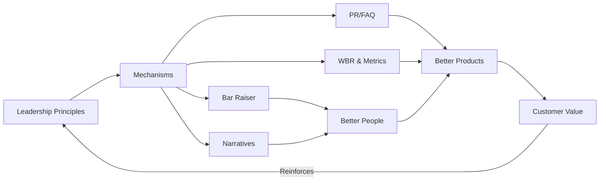
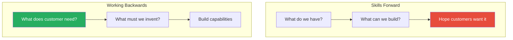
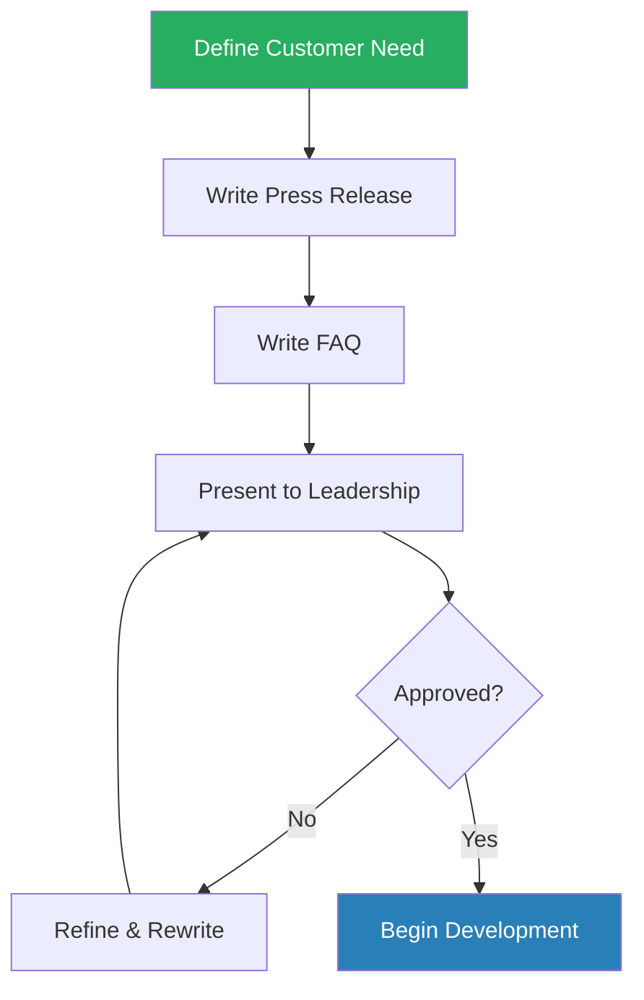
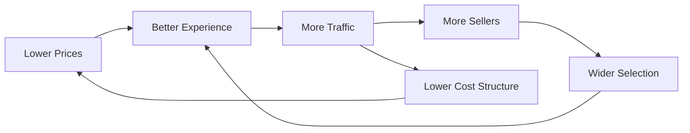
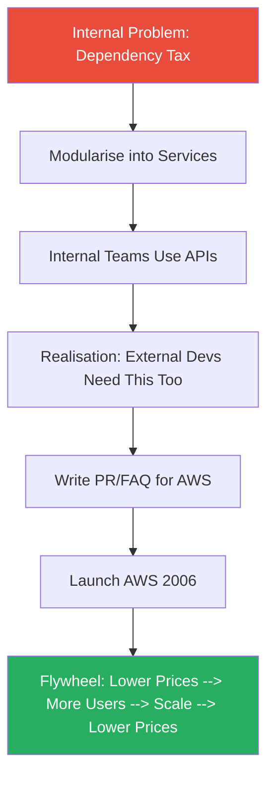
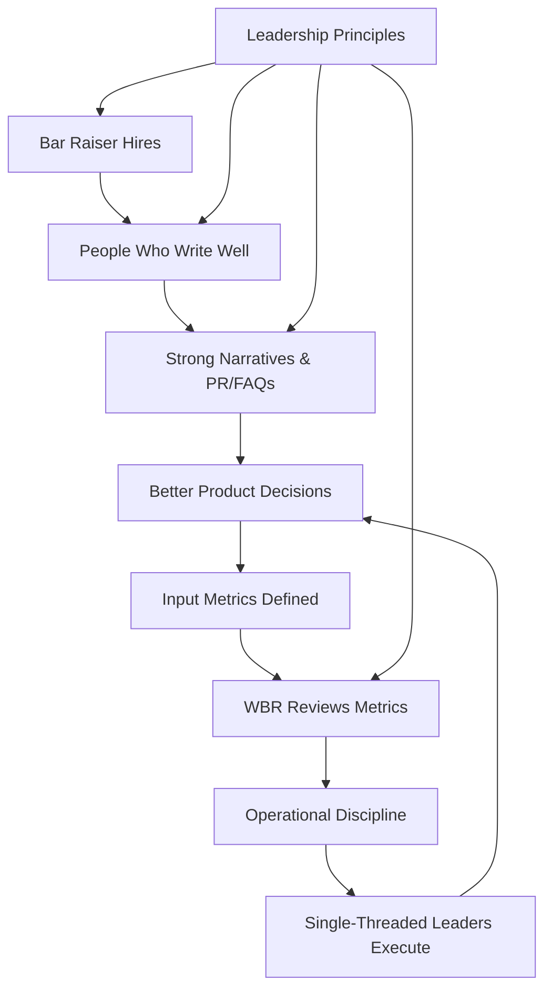

# Working Backwards — Colin Bryar & Bill Carr

> Two Amazon veterans with a combined twenty-seven years at the company pull back the curtain on the interlocking system of principles and processes that powered Amazon's rise from online bookstore to global behemoth. Colin Bryar spent twelve years at Amazon, including two as Jeff Bezos's "shadow" — a chief of staff role with a front-row seat to every major strategic decision. Bill Carr spent fifteen years leading the digital media business that launched Prime Video, Amazon Music, and Amazon Studios. Their thesis is that Amazon's competitive advantage is not any single innovation but a **mutually reinforcing operating system** — customer-backwards product development, narrative-driven communication, single-threaded leadership, structured hiring, and obsessive input metrics — designed so that each element strengthens every other. The system, they argue, is transferable to any organisation willing to commit to it. The book is part management manual, part institutional memoir, and part argument that culture is not what you say on the wall — it is what your processes force people to do every day.

---

## About the Authors

Colin Bryar joined Amazon in 1998, when the company had roughly 600 employees, and spent twelve years there. His most formative role was as Jeff Bezos's **Technical Advisor**, colloquially known as "Jeff's shadow" — a rotating chief of staff position where the occupant attends every meeting Bezos attends, works on his most important problems, and serves as a sounding board for his thinking. Bryar held this role for roughly two years during a pivotal period when Amazon was transitioning from an online retailer into a technology platform company.

Bill Carr joined Amazon in 1999 and spent fifteen years there. He rose to Vice President of Digital Media, where he built and led the teams that created Amazon's digital content ecosystem: Prime Video, Amazon Music, Amazon Studios, and the Kindle content store. He experienced both spectacular success and painful failure — his Amazon Unbox video download service was a commercial disaster, and the experience of failing at Amazon, and then being entrusted with the next attempt, shaped his understanding of how Amazon treats innovation risk.

Between them, Bryar and Carr witnessed the creation of nearly every process the book describes, from the earliest experiments with two-pizza teams to the launches of Kindle, Prime, Prime Video, and AWS.

---

## The Big Idea

- Amazon's sustained dominance is not the product of a visionary CEO acting alone
- It is the product of a <b style="color: #2980b9">system</b> — a set of principles embedded into repeatable processes that shape behaviour at scale
- The 14 Leadership Principles are not aspirational posters
  - They are wired into every interview question, every document review, every performance evaluation, and every product decision
  - The result is an organisation where customer obsession, long-term thinking, willingness to invent, and operational excellence are not values people *talk about* but habits people *cannot avoid practising*

---

- The book's deepest insight is the distinction between <b style="color: #2980b9">principles</b> and <b style="color: #2980b9">mechanisms</b>
  - Principles tell you what matters
  - Mechanisms are the processes that ensure people actually act on what matters
  - <b style="color: #e74c3c">Without mechanisms, principles are decoration</b>
  - With them, principles become culture
- Every major chapter is an argument for a specific mechanism:
  - Bar Raiser for hiring
  - Six-page narratives for communication
  - The PR/FAQ for product development
  - The Weekly Business Review for metrics discipline
- Each mechanism is designed to reinforce the others

> [!tip] Core Insight
> Culture is not shaped by what you tell people to do — it is shaped by what your systems make them do. Good intentions don't work. Mechanisms do.

- What makes this argument more convincing than most corporate-culture books is the authors' willingness to show the failures and false starts
  - Amazon did not arrive at these processes through genius
  - It arrived at them through painful iteration — processes that did not work, metrics that drove the wrong behaviour, team structures that collapsed under their own coordination overhead
  - The system is the result of a decade of learning, not a moment of inspiration
- The ambition of the book is transferability
  - Bryar and Carr argue explicitly that these practices do not require Amazon's capital, Amazon's talent density, or Jeff Bezos
  - They require leadership commitment and a willingness to endure the transition cost
  - Whether this claim holds up is debatable — but the practices themselves are described with enough specificity that any leader could attempt to implement them

---

## Key Concepts at a Glance

| Concept | One-line summary |
|---------|-----------------|
| **Leadership Principles as Operating System** | Amazon's 14 principles function as active evaluation criteria wired into every process, not wall decorations |
| **Bar Raiser Hiring** | An independent interviewer with veto power ensures every hire raises the team's average capability |
| **Single-Threaded Leadership** | One leader, one initiative, one dedicated team — focus matters more than headcount |
| **The Dependency Tax** | Cross-team dependencies create exponentially scaling coordination overhead; eliminate, don't manage |
| **Six-Page Narratives** | Written documents replace slides, forcing deeper thinking and delivering 7-9x the information density |
| **Working Backwards (PR/FAQ)** | Write the press release first — define the customer experience before writing a line of code |
| **Input Metrics** | Measure the controllable activities that drive results, not just the results themselves |
| **The Flywheel** | Amazon's closed-loop growth model where each element accelerates the others |
| **Disagree and Commit** | Challenge vigorously before the decision; execute fully after it |
| **The Institutional No** | Well-meaning risk aversion silently kills innovation through inaction and delay |

Amazon's structural mechanisms — Bar Raiser, narratives, PR/FAQ, WBR, single-threaded leadership, and Door 1/Door 2 — create a compounding advantage across every operational dimension, far exceeding the informal approaches of typical large companies.

---

Amazon's operating system is circular: principles drive mechanisms, mechanisms produce better people and better products, and the resulting customer value reinforces commitment to the principles.

---

## Part One: Being Amazonian

### Chapter 1 — Leadership Principles and Mechanisms

*The book opens with a deceptively simple claim: Amazon's Leadership Principles are the foundation of everything that follows — but what makes them powerful is not the principles themselves, it is the structural mechanisms that embed them into daily work.*

- Amazon has 14 Leadership Principles, and the book walks through several to demonstrate how they function:
  - <b style="color: #2980b9">Customer Obsession</b> — leaders start with the customer and work backwards
  - <b style="color: #2980b9">Ownership</b> — leaders act on behalf of the entire company, not just their team
  - <b style="color: #2980b9">Bias for Action</b> — speed matters; most decisions are reversible, and the cost of inaction usually exceeds the cost of a wrong but correctable decision
  - <b style="color: #2980b9">Have Backbone; Disagree and Commit</b> — leaders are obligated to challenge decisions they believe are wrong, but once decided, they must commit fully
- The principles are not static beliefs hanging on a poster — they are living evaluation tools:
  - Every job interview is structured around them
  - Every performance review uses them as criteria
  - Every decision debate references them as a shared vocabulary
  - When two leaders disagree, they appeal to the principles as a common court of arbitration

---

- <b style="color: #27ae60">The critical point is that Amazon does not rely on people remembering principles — the principles are embedded in mechanisms</b>
- Mechanisms are structural processes that force principle-aligned behaviour automatically:
  - The Bar Raiser process enforces "Hire and Develop the Best"
  - The six-page narrative enforces "Dive Deep" and "Are Right, A Lot"
  - The PR/FAQ enforces "Customer Obsession" and "Invent and Simplify"
  - The Weekly Business Review enforces "Insist on the Highest Standards" and "Dive Deep"
- Bryar and Carr draw a sharp distinction between <b style="color: #e74c3c">good intentions</b> and <b style="color: #27ae60">good mechanisms</b>
  - Most companies have values; few companies have mechanisms that make those values unavoidable
  - A well-designed mechanism produces the desired behaviour regardless of individual willpower
  - It removes the dependence on heroic individual effort and replaces it with systemic pressure

> [!example] Amazon's Compensation as Mechanism
> - Bezos made a deliberate decision to cap base salaries, eliminate cash bonuses, and weight compensation heavily toward equity vesting over eighteen to twenty-four months
> - The mechanism was designed to solve a specific problem: if you want leaders to make decisions that pay off in years rather than quarters, you must align their compensation to the same time horizon
> - Short-term bonuses produce short-term thinking — equity-heavy structure produces long-term thinking
> - The approach was not popular with everyone — some talented candidates were lost because they wanted higher base pay or annual cash bonuses
> - But the structural effect was profound: every leader's personal financial interests were automatically aligned with the company's multi-year strategic horizon
> **The lesson:** Compensation design is not an HR decision — it is a strategy decision that shapes every choice leaders make.

- Bill Carr saw this dynamic play out starkly when negotiating digital content deals with Hollywood studios
  - Studio executives consistently made decisions that protected short-term revenue — maintaining pay-TV blackout windows, resisting streaming, pricing digital content to protect physical DVD sales
  - Their compensation was tied to quarterly and annual financial targets, so naturally they optimised for those horizons
  - Amazon's equity-heavy structure produced the opposite behaviour: leaders could afford to invest in things that would not pay off for years
  - The contrast was not about intelligence or vision — the studio executives were smart people — it was about which behaviours the compensation structure rewarded

---

- The chapter also introduces the <b style="color: #2980b9">Door 1 / Door 2</b> framework for decision velocity:

| Decision Type | Characteristics | Approach |
|--------------|-----------------|----------|
| **Door 1** | Irreversible, high-consequence | Thorough analysis, broad input, caution |
| **Door 2** | Reversible, correctable | Decide quickly — deliberation costs more than correction |

The vast majority of Amazon's decisions are treated as reversible Door 2 choices — made quickly and corrected if wrong — which explains the company's exceptional speed relative to competitors who over-deliberate on everything.

- Amazon's bias for action means treating most decisions as Door 2 unless there is strong reason to classify them as Door 1
- The mechanism is cultural: leaders are expected to identify which type of decision they face and calibrate their process accordingly
- <b style="color: #e74c3c">The most common error is treating Door 2 decisions as Door 1</b> — slowing down on decisions that could easily be reversed
  - This produces organisational paralysis
  - It feels responsible — "we need more data" — but the cost of delay is real and often exceeds the cost of a mistake
  - Bezos would frequently challenge teams that were over-deliberating on reversible choices

> [!example] The Door 2 Speed Advantage
> - A retail team spent weeks debating the optimal layout for a new product category page
> - Multiple rounds of analysis, stakeholder reviews, and committee meetings
> - Bezos asked a simple question: could the change be reverted if it did not work?
> - The answer was yes — in minutes
> - The team launched the change within days, measured the result, and iterated from real data rather than theoretical debate
> **The lesson:** When a decision is easily reversible, the cost of deliberation almost always exceeds the cost of being wrong.

---

### Chapter 2 — Hiring: The Bar Raiser Process

*Amazon's hiring process is built around a single dangerous truth: the universal temptation to lower standards when understaffed is the greatest long-term threat to organisational quality.*

- <b style="color: #e74c3c">Urgency bias</b> — the tendency to lower standards when overwhelmed — is the enemy:
  - A team is understaffed, work is piling up
  - The hiring manager interviews someone adequate but not exceptional
  - The temptation to say "good enough" is enormous because the pain of the open role is immediate and the cost of a mediocre hire is deferred
  - Over time, this pattern degrades the entire organisation
  - Each mediocre hire makes it harder to attract and retain excellent people, and the average quality ratchets downward
- The problem is structural, not personal:
  - Even excellent managers succumb to urgency bias because the incentives are misaligned
  - The person who fills the role quickly gets relief now
  - The consequences of a mediocre hire manifest months or years later, often attributed to other causes
  - You need a mechanism that makes it structurally impossible to lower the bar

> [!tip] Core Insight
> The cost of a bad hire — measured in team morale, management time, and work that must be redone — vastly exceeds the cost of a slower hiring process. Better an empty seat than the wrong person.

- Amazon's structural solution is the <b style="color: #2980b9">Bar Raiser</b> — an independent, specially trained interviewer from outside the hiring team who participates in every hiring loop and holds veto power:
  - The Bar Raiser has no stake in whether the role gets filled
  - They have no reporting relationship to the hiring manager
  - Their sole job is to ensure the candidate genuinely raises the team's average capability
  - <b style="color: #27ae60">The hiring manager cannot overrule the Bar Raiser's veto</b>
  - This structural independence is what makes the mechanism work — it removes the urgency bias from the person with authority

---

> [!abstract] The Bar Raiser Interview Process
> 1. Each interviewer in the loop is assigned specific Leadership Principles to evaluate — not general impressions, not "culture fit"
> 2. Written feedback must include **verbatim question-and-answer exchanges**, not vague assessments like "seemed smart"
> 3. Every interviewer submits written feedback **before** the debrief meeting — preventing anchoring bias
> 4. The Bar Raiser (independent, outside the hiring team) participates and holds veto power
> 5. The debrief meeting discusses evidence-based assessments, not gut feelings
> 6. The candidate must raise the team's average — "good enough" is not good enough
> 7. The Bar Raiser ensures the process was fair, rigorous, and principle-aligned

- The requirement for verbatim exchanges forces interviewers to ground evaluations in evidence rather than intuition
- Submitting feedback before the debrief prevents the most senior or vocal person's opinion from influencing everyone else — each interviewer commits to their assessment independently
- This addresses the well-documented anchoring effect from behavioural psychology:
  - Once someone hears a senior person's opinion, they unconsciously adjust their own
  - Written, pre-submitted feedback eliminates this dynamic

---

- The <b style="color: #2980b9">flywheel effect on hiring</b> is one of the book's most compelling arguments:
  - As each hire raises the bar, the next generation of hires is stronger
  - Over time, the average quality of the team compounds
  - This compounding effect is nearly impossible for a competitor to replicate quickly — it takes years of disciplined hiring
  - Bryar and Carr argue this is one of Amazon's most durable competitive advantages
  - Better people write better narratives, make better product decisions, build better metrics — the hiring flywheel feeds every other mechanism

The Bar Raiser creates a compounding cycle: each strong hire raises the average, which raises the bar for the next hire, which produces an ever-stronger team over time.

- The chapter addresses the common objection: does this slow hiring too much?
  - The authors acknowledge it does slow individual hires
  - But the cost of a bad hire vastly exceeds the cost of a slower process
  - As the saying goes within Amazon: <b style="color: #e74c3c">it is better to have an empty seat than to fill it with the wrong person</b>

---

- Bar Raisers themselves are carefully selected and trained:
  - Not every senior person qualifies — Bar Raisers must demonstrate consistent judgement over many hiring loops
  - They go through a shadowing and apprenticeship process before earning the role
  - They are expected to maintain calibration across the organisation — a Bar Raiser on a retail team and a Bar Raiser on an engineering team should apply the same standard
  - The role carries significant social capital within Amazon — it signals trust and judgement

> [!example] The Bar Raiser Saving a Team from Itself
> - A fast-growing team was desperate to fill three open engineering roles
> - The hiring manager found a candidate who was technically competent but showed weak signals on "Ownership" and "Disagree and Commit" — passive in the face of problems, unlikely to challenge bad decisions
> - The team wanted to hire — the technical skills were good enough, and they were drowning in work
> - The Bar Raiser vetoed the hire, citing specific interview evidence
> - The hiring manager was frustrated in the short term
> - Six months later, the team filled the roles with stronger candidates who brought both technical skill and leadership behaviour
> - The hiring manager later acknowledged the Bar Raiser had been right
> **The lesson:** The mechanism works precisely because it overrides the emotional urgency that compromises judgement.

---

### Chapter 3 — Organisation: Two-Pizza Teams and Single-Threaded Leadership

*This chapter traces the evolution of Amazon's team structure through two phases — the second learning directly from the limitations of the first.*

**Phase 1: Two-Pizza Teams**

- In the early 2000s, Amazon was growing rapidly and experiencing classic scaling symptoms:
  - Slower decision-making
  - More meetings and coordination overhead
  - Less innovation
  - More time spent talking about work than doing work
- Bezos proposed a radical restructuring: break the organisation into small, autonomous teams of no more than ten people — small enough that two pizzas could feed the team
- Each team would operate as a self-contained unit with a clear mission, its own metrics (called <b style="color: #2980b9">fitness functions</b>), and minimal dependencies on other teams

---

- The concept was partially inspired by <b style="color: #2980b9">Metcalfe's Law</b> about communication overhead:

| Team Size | Communication Paths |
|-----------|-------------------|
| 6 people | 15 paths |
| 12 people | 66 paths |
| 60 people | 1,770 paths |

The exponential growth in communication paths illustrates why Amazon broke into small, autonomous teams: a 60-person group has 118x more coordination overhead than a 6-person team, consuming energy that could otherwise go toward building products.

- As an organisation adds people, the number of possible communication lines grows exponentially — not linearly
- The formula is n(n-1)/2, where n is the number of people
- Small, autonomous teams reduce this overhead by limiting the scope of coordination
- The insight is mathematical, not managerial: beyond a certain team size, the coordination cost consumes more energy than the additional capacity provides

---

- The two-pizza team experiment revealed an important truth and an important limitation:
  - **The truth:** small teams with clear ownership genuinely do move faster and make better decisions
  - **The limitation:** team **size** was not the critical variable — what mattered more was having a <b style="color: #27ae60">dedicated leader</b> with the right skills, the right authority, and no competing responsibilities
  - Some two-pizza teams thrived; others floundered
  - The difference was not size but focus — specifically, whether the leader had other responsibilities competing for their attention

**Phase 2: Single-Threaded Leadership**

- The evolution from two-pizza teams to <b style="color: #2980b9">single-threaded leadership</b> was Amazon's recognition that focus matters more than headcount
- A **single-threaded leader** is a person whose sole focus is one initiative, leading a **separable team** — a team that can design, build, and deploy its work without needing approval or resources from other teams

> "The best way to fail at inventing something is by making it somebody's part-time job."

- The logic is straightforward:
  - When an initiative is one of five responsibilities for a leader, it will always lose priority to the urgent demands of the existing business
  - Urgent tasks crowd out important ones — this is not a character flaw, it is a structural inevitability
  - A single-threaded leader can move at full velocity because they have no competing claims on their attention
  - The separable team ensures that the leader's focus is not undermined by dependency on other teams' timelines and priorities

> [!example] Fulfilment by Amazon (FBA) — From Stalled to Transformative
> - The idea for FBA — allowing third-party sellers to store inventory in Amazon's warehouses and use Amazon's logistics network — existed for over a year as a multi-threaded initiative
> - It was split across multiple teams with competing priorities, and progress was glacial
> - The concept was compelling on paper, but no single person owned its success
> - Each contributing team had their own roadmap, their own priorities, and their own manager pulling them in different directions
> - Once Tom Taylor was assigned as its sole owner with a dedicated team, FBA launched within a year
> - FBA became one of Amazon's most transformative services, fundamentally reshaping the e-commerce ecosystem
> **The lesson:** The difference between a stalled idea and a shipped product is often just one dedicated leader.

> [!example] Amazon Echo — Single-Threaded Leadership in Hardware
> - A voice-controlled smart speaker required hardware engineering, speech recognition software, cloud services, and content partnerships
> - Under a traditional multi-threaded structure, these components would have been owned by different leaders with different priorities
> - The product would have been pulled in multiple directions or died from coordination overhead
> - Greg Hart was assigned as the single-threaded leader with a separable team, and the Echo went from concept to shipping product
> - Hart could make trade-off decisions across hardware and software without negotiating with other team leaders
> **The lesson:** Breakthrough products require one leader whose entire job is that product.

---

- The chapter introduces the <b style="color: #2980b9">Dependency Tax</b> — a concept that pervades Amazon's organisational thinking:
  - Dependencies are anything one team needs but cannot supply itself: an API, a design resource, a shared testing environment, a legal review
  - Each dependency introduces coordination overhead — meetings, emails, status checks, escalations, waiting
  - <b style="color: #e74c3c">This overhead scales exponentially as more teams are involved</b>
  - A project with three dependencies might have manageable overhead; a project with ten becomes unshippable

> [!example] The NPI Disaster
> - NPI (New Project Initiatives) was a coordination mechanism that allocated shared engineering resources across teams
> - It was universally despised — teams competed for scarce resources, productive engineers were pulled off their projects, and the process consumed enormous management attention
> - The quarterly NPI planning cycle became a political exercise in resource allocation rather than a strategic exercise in prioritisation
> - Teams would game the process, overstating their needs to ensure they received adequate resources
> - Replacing NPI with autonomous teams that owned their own resources — even with some duplication — dramatically increased innovation velocity
> **The lesson:** The cost of duplication is almost always lower than the cost of coordination.

- Amazon's solution to the Dependency Tax is not better coordination but <b style="color: #27ae60">elimination of coordination</b>:
  - **Technical side:** service-oriented architecture — every team exposes capabilities as services with published APIs; other teams consume those services without coordination
  - **Organisational side:** separable teams — each team owns its full technology stack and can build and deploy independently
  - **Cultural side:** leaders are expected to identify and eliminate dependencies proactively, not accept them as inevitable

> "The best way to coordinate is not to coordinate at all."

---

| Approach | How Dependencies Are Handled | Result |
|----------|------------------------------|--------|
| **Traditional** | Add project managers, create coordination meetings | Slower as complexity grows |
| **Amazon** | Eliminate dependencies via APIs and separable teams | Speed remains constant as complexity grows |

This table captures Amazon's fundamental organisational insight: the solution to coordination problems is not better coordination but structural elimination of the need to coordinate.

---

### Chapter 4 — Communication: The Six-Page Narrative

*In 2004, Bezos banned PowerPoint from Amazon's executive meetings and replaced it with something far more demanding — and far more effective.*

- In its place, he mandated written narratives — maximum six pages, read silently for twenty minutes at the start of every meeting, followed by discussion
- The reasoning was both practical and philosophical

**The practical case:**

- A written page contains roughly <b style="color: #27ae60">seven to nine times the information density</b> of a typical PowerPoint slide
- People read approximately three times faster than a presenter can speak
- A six-page narrative delivers in twenty minutes of silent reading what would take an hour of slide presentation — with far greater precision
- There is no ambiguity about what the presenter "meant" by a bullet point, no reliance on verbal improvisation, no variance based on whether the presenter is having a good day

---

**The philosophical case:**

- The narrative format forces the writer to think deeply
- <b style="color: #e74c3c">PowerPoint rewards charisma and visual design over rigorous thinking</b>
  - Bullet points allow presenters to gloss over complexity, skip causal reasoning, and substitute confident delivery for rigour
  - A narrative demands that every sentence connect logically to the next
  - Assumptions must be stated, objections anticipated, causal chains made explicit
  - Half-baked thinking is harder to disguise in prose than in bullet points
- The written format also democratises participation:
  - In a slide presentation, the charismatic presenter dominates
  - In a narrative discussion, the quality of the ideas dominates
  - Introverts contribute equally because they have read the same document
  - Non-native speakers compete on reasoning, not verbal fluency

> "The reason writing a good four-page memo is harder than writing a 20-page PowerPoint is because the narrative structure forces better thought."

> [!tip] Core Insight
> The narrative format levels the playing field: the most persuasive speaker no longer wins by default. Introverts, non-native speakers, and rigorous-but-not-charismatic thinkers compete on the merits of their ideas, not their presentation skills.

---

- The authors are candid about the **transition cost**:
  - The shift was painful — writers had spent years honing PowerPoint skills and had to learn an entirely different mode of communication
  - Some teams resented the mandate
  - Early narratives were often poor — rambling, unfocused, or just PowerPoint bullets strung into sentences
  - The organisation needed months to develop writing as a core competency
  - But once the culture shifted, decision-making quality improved measurably
  - Meetings became shorter: twenty minutes of silent reading replaced forty minutes of presentation, leaving more time for substantive discussion

- The <b style="color: #2980b9">study hall format</b> enforced genuine engagement:
  - At the start of every S-Team meeting, printed copies were distributed and read in silence
  - No pre-reading was expected or allowed
  - This ensured everyone had actually absorbed the document — unlike the common corporate practice of distributing "pre-reads" that nobody reads
  - The twenty minutes of silence seemed strange to visitors, but it was the only reliable way to ensure an informed discussion

> [!example] The "Pre-Read" Problem at Other Companies
> - Before joining Amazon, Bryar had worked at companies that distributed materials in advance of meetings
> - The assumption was that attendees would read the material before arriving
> - In practice, perhaps 10-20% of attendees actually read the pre-read
> - Meetings devolved into the presenter re-explaining the material while everyone else pretended they had read it
> - At Amazon, the study hall format eliminated this pretence entirely — everyone read the document simultaneously, in the room, before discussion began
> - The result was that every participant was genuinely prepared, and the discussion quality was dramatically higher
> **The lesson:** Do not design processes around what people should do — design them around what people actually do.

---

- One subtle but important feature: the narrative format forces <b style="color: #27ae60">the right people to do the thinking</b>
  - In a PowerPoint culture, a senior leader can delegate slide creation to a junior analyst, review the deck quickly, and present it as their own thinking
  - In a narrative culture, the quality of the prose reveals the quality of the thought
  - It is very difficult to present someone else's written reasoning as your own in a live discussion where you will be questioned on every paragraph
  - The format essentially ensures that the person presenting has done the intellectual work

- When Bezos received a narrative that was unclear or poorly reasoned, he challenged it line by line — occasionally uncomfortable for the author but consistently producing better outcomes
- The narrative process also created a natural quality gradient:
  - Weak thinkers produced weak narratives that were exposed in discussion
  - Strong thinkers produced strong narratives that advanced through the process
  - Over time, the best writers and thinkers rose to prominence, reinforcing the culture of intellectual rigour

---

### Chapter 5 — The Working Backwards Process

*The centrepiece of Amazon's product development philosophy inverts the default: instead of asking "what can we build with what we have?", it asks "what does the customer need, and what must we invent to deliver it?"*

- Most organisations work forwards:
  - They survey their existing assets — technology, talent, infrastructure — and ask, "What can we build with what we have?"
  - This is natural and efficient, but structurally flawed: it confines innovation to the neighbourhood of what already exists
  - <b style="color: #e74c3c">You optimise locally rather than discovering what customers actually need</b>
- Amazon inverts this — the question is: "What does the customer need?" followed by "What must we build or invent to deliver it?"
- This is the <b style="color: #2980b9">Working Backwards</b> process

The fundamental difference between two product development philosophies: skills-forward starts from existing capabilities and hopes for customer fit; working backwards starts from customer need and builds whatever is required.

---

- The primary tool is the <b style="color: #2980b9">PR/FAQ</b> — a mock press release (one page) announcing the product as if it were already finished, plus a Frequently Asked Questions section (up to five pages):

> [!abstract] The PR/FAQ Structure
> **Press Release (1 page)** must answer five questions:
> 1. Who is the customer?
> 2. What is the customer problem or opportunity?
> 3. What is the most important customer benefit?
> 4. How do you know what customers need?
> 5. What does the customer experience look like?
>
> **External FAQ** — questions a customer would ask:
> - How does it work? How much does it cost? How is it different from what exists?
>
> **Internal FAQ** — questions the business must answer:
> - How big is the market? What are the economics? What are the dependencies? What are the risks? What talent do we need?

- The press release must be written in <b style="color: #27ae60">plain language</b> — the language a customer would use, not the language an engineer or product manager would use
- This forces the team to translate technical complexity into human benefit
- If you cannot explain the product in one page of plain language, you do not yet understand what you are building

---

The PR/FAQ process is iterative by design — teams typically write ten or more drafts and present five or more times before approval, surfacing assumptions and sharpening thinking at each round.

- The process is <b style="color: #2980b9">iterative</b>:
  - Teams typically write ten or more drafts and present five or more times to leadership
  - Each presentation generates questions and objections addressed in the next draft
  - This iterative refinement surfaces assumptions, identifies risks, and sharpens thinking
  - The PR/FAQ evolves from a rough concept to a rigorously stress-tested proposal

- Most PR/FAQs never become products — and this is a feature, not a bug:
  - The process is designed to <b style="color: #27ae60">kill bad ideas cheaply</b>, before development resources are committed
  - A PR/FAQ costs weeks of a small team's time
  - A failed product costs months or years of a large team's time plus capital investment
  - The ones that survive have been stress-tested from every angle
  - The process produces a 5:1 or 10:1 kill ratio — and every killed idea saves the organisation enormous resources

---

> [!example] The Kindle PR/FAQ — From Skills-Forward to Customer-Backward
> - When Amazon first considered entering digital reading, the initial concept was driven by existing capabilities — essentially an iPod for books, leveraging the existing catalogue infrastructure
> - This was a skills-forward approach: we have a digital content platform, so let us add books to it
> - When the team was forced to write the press release describing the desired customer experience, the product transformed
> - The customer did not want "an iPod for books" — the customer wanted to buy any book and start reading it in sixty seconds, without needing a computer
> - This led to wireless delivery, a selection exceeding any physical bookstore, and low prices — features that defined the Kindle
> - None of these features would have emerged from a capabilities-forward analysis
> **The lesson:** Starting from customer need rather than existing capability produces fundamentally different — and better — products.

> [!example] PR/FAQ as Early Warning System
> - A team proposed a new feature for Amazon's website that would display personalised recommendations in a new format
> - The press release sounded compelling — but when they wrote the FAQ, they could not answer basic questions about how the recommendation engine would handle cold-start users (new customers with no purchase history)
> - The FAQ process exposed a fundamental technical gap that would have taken months to discover if development had started immediately
> - The team paused, solved the cold-start problem first, then rewrote the PR/FAQ with a viable solution
> **The lesson:** The PR/FAQ catches problems in weeks that development would catch in months — at a fraction of the cost.

---

### Chapter 6 — Metrics: Input Metrics, Output Metrics, and the Weekly Business Review

*Most organisations measure the wrong things — or rather, they measure the right things too late. Amazon's metrics framework shifts attention from lagging outputs to the controllable inputs that drive them.*

- Most organisations fixate on <b style="color: #e74c3c">output metrics</b> — revenue, profit, customer satisfaction, market share:
  - These are important but fundamentally lagging: by the time an output metric moves, the underlying cause happened weeks or months ago
  - Worse, output metrics cannot be directly manipulated in a sustainable way
  - You cannot will revenue to increase — you can only do things that, over time, produce more revenue
  - Output metrics tell you what happened; they do not tell you what to do

- Amazon's approach is to identify the <b style="color: #2980b9">controllable input metrics</b> — the activities you can directly influence that, done well, produce the desired outputs — and measure those obsessively

| Metric Type | Examples | Actionability | Timing |
|------------|---------|---------------|--------|
| **Output** | Revenue, profit, customer satisfaction | Cannot be directly controlled | Lagging |
| **Input** | Pages in stock, delivery speed, selection breadth | Directly controllable | Leading |

The distinction is not about which metrics matter — both do. The distinction is about which metrics a team can actually act on today to influence tomorrow's results.

---

Amazon's flywheel, adapted from Jim Collins: each element accelerates the others, and each has corresponding input metrics that teams can directly control.

- The <b style="color: #2980b9">flywheel</b>, borrowed from Jim Collins and adapted by Bezos:
  - Better customer experience -> more traffic -> more sellers -> wider selection -> better customer experience
  - Lower cost structure -> lower prices -> better customer experience -> faster flywheel
  - Each element has corresponding input metrics that teams can directly control
  - The flywheel is not just a metaphor — it is a map of the causal relationships that teams use to identify which inputs to measure and improve

---

- The <b style="color: #2980b9">Weekly Business Review (WBR)</b> is the mechanism that enforces this discipline:
  - Every week, teams review their input and output metrics, looking for anomalies
  - The WBR is not a status meeting — it is a diagnostic session
  - When an input metric improves but the expected output does not follow, the input metric is wrong and must be refined
  - When an output metric deteriorates despite healthy inputs, there is a missing variable to be discovered
  - The WBR creates a tight feedback loop between action and measurement

> [!abstract] Weekly Business Review Format
> 1. Review the metrics deck — pre-distributed, read in silence (study hall format again)
> 2. Identify anomalies — metrics that moved unexpectedly, trends that deviated from forecast
> 3. Diagnose root causes — not "what happened" but "why did it happen"
> 4. Assign corrective actions with owners and deadlines
> 5. Review last week's corrective actions — did they work?
> 6. Update the metrics set if any metric is no longer driving the right behaviour

- The WBR is weekly because monthly or quarterly reviews are too slow:
  - A problem that appears in January and is not reviewed until March has been compounding for ten weeks
  - Weekly cadence catches problems early, when they are small and correctable
  - <b style="color: #27ae60">The discipline is not in holding the meeting — it is in never missing the meeting</b>

---

> [!example] The Detail Pages Metric — Getting It Wrong First
> - Early on, a team tracked "number of detail pages created" as an input metric for selection growth
> - The logic seemed sound: more detail pages meant more products available
> - But teams responded by creating pages for low-demand, obscure items — padding the metric without improving customer experience
> - The metric was driving behaviour, but the wrong behaviour
> - It was refined to "percentage of detail page views where products were in stock and ready for two-day shipping" — a metric Amazon called **Fast Track In Stock (FTIS)**
> - FTIS aligned team behaviour with actual customer demand: it did not matter how many pages existed if customers could not buy what they were actually looking for
> - The refinement took months of iteration, but once in place, it drove meaningful improvement
> **The lesson:** Input metrics will be optimised — if the metric does not accurately represent the customer outcome, teams will optimise the metric at the expense of the customer.

> [!tip] Core Insight
> Finding the right input metric is iterative and can take months. Premature commitment to the wrong one can be worse than no metric at all.

---

- <b style="color: #e74c3c">Input metrics are powerful but dangerous</b>:
  - Powerful because they give teams something actionable to focus on
  - Dangerous because they **will** be optimised — and if the metric does not accurately represent the customer outcome, teams will optimise the metric at the expense of the customer
  - The discipline is not just in choosing input metrics but in continuously questioning whether they are still the right ones
  - This is Goodhart's Law in action: when a measure becomes a target, it ceases to be a good measure

- The authors discuss the complementary relationship between <b style="color: #27ae60">quantitative metrics and qualitative anecdotes</b>:
  - Amazon's **Dive Deep** leadership principle requires leaders to be sceptical when numbers and customer stories diverge
  - The <b style="color: #2980b9">Voice of the Customer</b> programme surfaces individual customer pain points in the WBR, even when aggregate metrics look healthy
  - A single vivid customer complaint can reveal a systemic problem that the metrics have not yet captured

---

> [!example] The Andon Cord — Frontline Authority to Act
> - Borrowed from Toyota's manufacturing system, the Andon Cord at Amazon empowers frontline customer service agents to remove a product listing from the entire site if they identify a systemic quality problem
> - The name comes from a cord on Toyota's assembly line that any worker can pull to stop the entire production line
> - A customer service agent noticed that a particular lawn chair was generating repeated complaints about broken parts on arrival
> - The aggregate return rate metric had not yet flagged it as significant — the lawn chair was one product among millions
> - But the agent could see the pattern in the individual complaints and used the Andon Cord to pull the listing until the packaging issue was resolved
> - Bezos immediately recognised its value: individual frontline knowledge, combined with the authority to act, catches problems that aggregate data smooths over
> **The lesson:** Anecdotes and data are not competing — they are complementary. Use one to audit the other.

> [!example] The DPMO Revolution
> - Amazon adapted the concept of Defects Per Million Opportunities (DPMO) from Six Sigma manufacturing to its fulfilment operations
> - Every step in the order-fulfilment process — picking, packing, shipping, delivery — was measured for defect rate
> - The team initially measured overall defect rate, but this masked where problems were concentrated
> - Breaking DPMO into stage-specific input metrics revealed that the packing step had a disproportionate defect rate
> - Focused intervention on packing processes reduced overall defects more than broad quality initiatives ever had
> **The lesson:** Aggregate metrics hide the specific interventions that would actually improve the outcome — decompose ruthlessly.

---

## Part Two: The Invention Machine at Work

*The second half of the book applies the principles and processes from Part One to four major Amazon initiatives, each demonstrating the system in action — and each revealing how the pieces reinforced one another.*

---

### Chapter 7 — Kindle

*The Kindle story is the book's primary illustration of the Working Backwards process — and proof that starting from the customer, rather than from existing capabilities, can lead a software company to build hardware it has no experience making.*

- Amazon's entry into hardware was a radical departure:
  - The company had no hardware engineering capability, no supply chain for physical devices, no experience with manufacturing
  - A skills-forward analysis would never have produced the Kindle — Amazon was a software and logistics company
  - But the Working Backwards process does not ask what you can build — it asks what the customer needs
- The Working Backwards process forced the team to define the customer experience first:
  - Buy any book and start reading it in sixty seconds
  - Wirelessly, without needing a computer
  - With a selection larger than any physical bookstore
  - At a lower price than the physical edition
- These four requirements were <b style="color: #27ae60">non-negotiable once defined in the press release</b>
- Each requirement forced the team to build capabilities Amazon did not possess — and this was exactly the point

---

> [!example] The Wireless Decision — Customer Need vs Engineering Convenience
> - Early concepts assumed the device would sync content via USB cable, like an iPod
> - When the team wrote the press release describing the customer experience, they realised requiring a computer and cable to download a book was terrible for someone sitting in a park or on an aeroplane
> - The customer wanted to browse, buy, and read without ever touching a computer
> - This led to the decision to include free cellular wireless — an expensive and technically difficult choice that no skills-forward analysis would have recommended
> - The team negotiated a deal with a cellular carrier for always-on connectivity, with Amazon absorbing the data costs
> - This was the defining feature that made Kindle feel magical to early users
> **The lesson:** The PR/FAQ process surfaces requirements that capabilities-forward thinking would never discover.

- The selection requirement drove another critical decision:
  - For Kindle to offer more books than any physical store, Amazon needed publishers to digitise their catalogues
  - At the time, most publishers had not done so and had little incentive to
  - Amazon had to simultaneously build the hardware, build the digital content platform, and convince an entire industry to digitise their products
  - Each challenge was individually daunting; together, they looked nearly impossible
  - But the PR/FAQ had defined them as requirements, and the team worked backwards from the customer experience rather than forward from what was easy

---

- The Kindle also illustrates Amazon's willingness to <b style="color: #27ae60">cannibalise its own business</b>:
  - Amazon was the world's largest online bookstore
  - A successful e-reader would shift purchasing from physical books (high margin) to digital books (lower margin, at least initially)
  - <b style="color: #e74c3c">Many companies would have resisted this self-cannibalisation</b>
  - Amazon's long-term orientation — reinforced by the equity-heavy compensation structure — allowed leaders to accept the short-term margin hit for long-term market position
  - Bezos's reasoning was explicit: if digital reading was inevitable, Amazon should lead the transition rather than be disrupted by it

> [!example] The $9.99 Pricing War
> - Amazon set the Kindle e-book price at $9.99 for bestsellers — significantly below the typical hardcover price
> - Publishers were furious — they saw it as devaluing their products and training customers to expect lower prices
> - Amazon's reasoning was customer-backward: the customer benefit of instant digital delivery should come with a lower price, not a higher one
> - The pricing decision created years of industry tension but established the price point that drove e-book adoption
> - The conflict eventually led to a major antitrust lawsuit involving Apple and several publishers
> **The lesson:** Customer-backward decisions sometimes create industry conflict — but the customer wins, which is the point.

- The Kindle launched in November 2007 and sold out in five and a half hours
- Within five years, e-book sales surpassed physical book sales on Amazon

---

### Chapter 8 — Prime

*Amazon Prime is the book's most dramatic illustration of overcoming the institutional no — and proof that the most dangerous form of organisational risk is the initiative that never gets attempted.*

- The idea was simple: for a fixed annual fee, customers would get unlimited free two-day shipping
- The economics were terrifying:
  - Free shipping on every order, with no minimum purchase requirement, would cost hundreds of millions per year
  - Multiple senior leaders argued passionately against it
  - The finance team modelled the costs and concluded it was unaffordable
  - The logistics team worried about capacity
  - Some argued it would cannibalise existing shipping revenue without creating enough incremental purchases

---

- The opposition was not irrational — it was the <b style="color: #2980b9">institutional no</b> in its most respectable form:
  - Thoughtful, data-informed risk aversion from intelligent people who genuinely believed the economics were unfavourable
  - The problem: their analysis measured the visible costs of action (shipping subsidies) without measuring the <b style="color: #e74c3c">invisible costs of inaction</b> (slower growth, weaker customer loyalty, vulnerability to competitors)
  - The institutional no is asymmetric: blocking an initiative carries no visible consequences, while championing a failed one carries visible consequences

> [!tip] Core Insight
> The institutional no is one of the most dangerous and invisible forms of organisational risk. The person who blocks an initiative faces no consequences if it would have succeeded — the counterfactual is invisible.

- Bezos personally overrode the institutional resistance:
  - He applied <b style="color: #2980b9">disagree and commit</b> in reverse: acknowledged the legitimate concerns, then made the decision and demanded full commitment
  - If he had not, Amazon would have missed the most important growth driver in its history
  - The fact that it required the CEO's personal intervention reveals both the strength and the weakness of the system: the institutional no can only be overcome by sufficient authority

---

- The mechanism at work was the <b style="color: #e74c3c">asymmetry of consequences</b>:
  - The person who blocks an initiative faces no consequences if it would have succeeded — the counterfactual is invisible
  - The person who champions a failed initiative faces visible consequences — the money was spent and the product failed
  - This asymmetry produces a systematic bias toward saying no
  - It becomes stronger as organisations grow, because more people have the ability to say no and fewer have the authority or willingness to override them

> [!example] Prime's First Year — Pain Before Vindication
> - Prime launched in February 2005 at $79 per year
> - The initial economics were indeed unfavourable — shipping costs exceeded membership revenue
> - But the behavioural effect was transformative: Prime members dramatically increased their purchase frequency
> - The psychology was powerful — having already paid for shipping, members felt the marginal cost of each order was zero, which removed the friction that previously caused them to hesitate
> - The lifetime value of a Prime member was multiples higher than a non-member
> - Within a few years, Prime had become the gravitational centre of Amazon's consumer business
> - The economics that had seemed unfavourable were overwhelmingly positive when measured over a multi-year horizon
> **The lesson:** Some investments only make sense on a multi-year horizon — and only a long-term compensation structure lets leaders make those bets.

- The Prime story illustrates <b style="color: #27ae60">long-term thinking</b> in action:
  - The decision to absorb short-term losses for long-term customer loyalty required compensation structures and corporate culture supporting multi-year time horizons
  - A company where executives were compensated on quarterly results would never have launched Prime — or would have killed it after the first year when the losses materialised
  - Prime also demonstrated the flywheel in action: free shipping drove more purchases, more purchases drove higher volume, higher volume drove lower per-unit shipping costs, lower costs made the economics more favourable

---

### Chapter 9 — Prime Video

*The Prime Video chapter is the book's most personal narrative — including Bill Carr's most painful professional failure and the Amazonian response to it that reveals more about the culture than any success story could.*

- <b style="color: #2980b9">Amazon Unbox</b> was Carr's first attempt at a digital video service:
  - Launched in 2006 as a download-to-own service
  - Required customers to install proprietary software, wait for lengthy downloads, and cope with restrictive DRM
  - The customer experience was terrible — the opposite of what a Working Backwards process would have produced
  - Unbox was a commercial failure

> [!example] Carr's "D" Review — Amazon's Approach to Failure
> - Carr gave himself a "D" in his annual performance review after the Unbox disaster
> - He expected to be fired or reassigned — that would be the norm at most companies
> - Instead, Bezos told him: "Why would I fire you now? I just made a million-dollar investment in you."
> - The logic was characteristically Amazonian: the cost of the failure was a sunk cost, but the learning was an asset
> - Firing Carr would mean losing the person who best understood why Unbox failed and was therefore best positioned to succeed on the next attempt
> - The expectation was not that leaders would never fail — but that they would document the failure, share the lessons, and ensure the same mistakes were not repeated
> - Carr went on to lead the team that built Prime Video, Amazon Music, and Amazon Studios
> **The lesson:** In an innovation culture, failure is statistically inevitable. The question is not whether you fail but whether the organisation captures the learning.

---

- The Unbox failure taught Carr several critical lessons that directly informed what came next:
  - The product had been built through a <b style="color: #e74c3c">skills-forward process</b> — Amazon had the digital content platform, so they added video to it; the customer experience was an afterthought
  - The DRM restrictions were driven by content owner demands rather than customer needs — a violation of Customer Obsession
  - The team had been too focused on matching competitors (Apple's iTunes video store) rather than defining a genuinely superior customer experience
  - The download model itself was wrong — customers did not want to download and store files; they wanted instant access

- These lessons directly informed the development of <b style="color: #2980b9">Prime Video</b>:
  - The Working Backwards process was applied rigorously this time
  - The press release defined a streaming experience requiring no downloads, no special software, no restrictive DRM
  - Crucially, it was included free with Prime membership — another instance of absorbing short-term costs for long-term customer value
  - The content licensing costs were enormous, but the Prime membership flywheel justified them: video content drove Prime subscriptions, which drove purchase frequency, which drove overall revenue

---

- The Prime Video story illustrates <b style="color: #27ae60">single-threaded leadership</b> in action:
  - Carr was given sole ownership of the digital media business and authority to build a dedicated team
  - He was not splitting his attention across multiple initiatives
  - This focused ownership, combined with the Unbox lessons, enabled bold decisions — including creating original content through Amazon Studios, requiring capabilities Amazon had never built before

> [!example] Hollywood vs Amazon — Competing Compensation Structures
> - Carr observed that studio executives consistently made short-term decisions that destroyed long-term value
> - They protected pay-TV blackout windows (which generated near-term revenue) at the expense of building streaming businesses (which would generate long-term value)
> - Their quarterly compensation structure made this behaviour rational at the individual level but catastrophic at the corporate level
> - When Carr proposed streaming deals that would cannibalise studios' existing revenue streams, executives could not say yes — their bonuses depended on protecting those revenue streams
> - Amazon, with its equity-heavy compensation, could afford to lose money on streaming for years while building the subscriber base
> **The lesson:** Compensation structure does not just affect motivation — it determines which strategic options are even possible.

---

### Chapter 10 — AWS

*The AWS chapter is the book's most ambitious case study — an application of Working Backwards so radical that it created an entirely new industry from an internal productivity problem.*

- In the early 2000s, Amazon's engineering teams were spending an enormous fraction of their time on <b style="color: #2980b9">undifferentiated heavy lifting</b>:
  - Building and maintaining infrastructure — databases, storage, compute capacity, networking — that was necessary for every project but did not differentiate Amazon's products
  - Every new team that wanted to build a feature had to first build (or negotiate access to) the underlying infrastructure
  - This was the Dependency Tax at its most extreme
  - Engineers were spending 70% of their time on infrastructure and 30% on the features that actually served customers

---

AWS evolved from an internal productivity initiative into a product strategy — the Working Backwards insight came when the team realised external developers faced the same infrastructure burden Amazon's own teams did.

- The first step was an internal initiative to modularise Amazon's own infrastructure into <b style="color: #2980b9">services</b>:
  - Self-contained, API-accessible components that any internal team could use without coordination
  - Originally a productivity initiative, not a product strategy
  - The goal was to reduce the dependency overhead slowing Amazon's own development

- The Working Backwards insight came when the team realised that if Amazon's internal teams needed these infrastructure services, external developers probably did too:
  - The PR/FAQ described a world where any developer, anywhere, could access enterprise-grade computing infrastructure on demand
  - Paying only for what they used, without buying servers or hiring systems administrators
  - This was a genuinely radical idea in 2003-2004

---

- At the time, computing infrastructure was a capital-intensive, long-lead-time investment:
  - Companies bought servers, built data centres, hired operations teams, and amortised cost over years
  - A startup needed months and significant capital just to get infrastructure in place before writing a line of product code
  - The idea that infrastructure could be consumed as a utility — like electricity or water — was conceptually obvious once stated but operationally unprecedented

> [!example] AWS and the Innovator's Dilemma
> - AWS launched in 2006 with a handful of services — S3 for storage, EC2 for compute
> - It was initially dismissed by established enterprise computing companies — Microsoft, IBM, Oracle — as a toy for startups that could not afford "real" infrastructure
> - This dismissal gave Amazon years to iterate and improve without competitive pressure from incumbents
> - The pattern closely mirrors Clayton Christensen's theory of disruptive innovation: incumbents ignore the low end until it is too late
> - By the time incumbents responded, AWS had built an enormous lead in both technology and customer trust
> - By the time the book was published, AWS was generating over $40 billion in annual revenue and was Amazon's primary profit engine — more profitable than the entire retail business
> **The lesson:** The most dangerous competitors are the ones incumbents dismiss as irrelevant.

> [!example] Andy Jassy's Single-Threaded Focus
> - Andy Jassy was assigned as the single-threaded leader for AWS when it was still a vague internal services initiative
> - He spent years building the team, defining the product, and iterating on the PR/FAQ before AWS launched publicly
> - His exclusive focus meant he could make fast decisions about service design, pricing, and go-to-market strategy without competing priorities
> - Under a multi-threaded structure, AWS might have remained an internal tool — or been deprioritised in favour of more immediately profitable retail initiatives
> - Jassy eventually became Amazon's CEO, in part because of the strategic importance of what single-threaded leadership allowed him to build
> **The lesson:** Single-threaded leadership does not just produce better products — it develops better leaders.

---

- The AWS story illustrates several of the book's principles working in concert:
  - **Working Backwards** defined the customer experience (infrastructure as a utility) before the technology was built
  - **Single-threaded leadership** (Andy Jassy as the dedicated leader) ensured focused execution
  - **The flywheel** (lower prices -> more customers -> economies of scale -> lower prices) drove sustained growth
  - **Long-term thinking** (equity-heavy compensation, Bezos's personal commitment) allowed years of investment before profitability
  - The **institutional no** was overcome through Bezos's personal conviction and authority
  - **Input metrics** tracked service reliability, latency, and adoption rates — controllable inputs rather than revenue (which came later)
- <b style="color: #27ae60">AWS is the ultimate proof of the system: no single element would have produced it — only the reinforcing combination could</b>

---

## Cross-Cutting Themes

### The System Is the Strategy

*The book's most important argument is not about any single practice — it is about the reinforcing system, the way the practices interact to produce something greater than the sum of their parts.*

The system is circular and self-reinforcing: better hiring produces better writing, which produces better product decisions, tracked by better metrics, reviewed by better-hired leaders — all held together by the Leadership Principles.

This sankey diagram traces how Amazon's interlocking mechanisms channel effort into customer value through two parallel streams — a people-and-narrative pipeline and a metrics-and-discipline pipeline — both converging on better products and ultimately the customer.

- The Bar Raiser hires people who can write strong narratives
- The narrative process surfaces the thinking that the PR/FAQ demands
- The PR/FAQ defines the customer experience that input metrics must track
- The input metrics are reviewed in the WBR, which drives the operational discipline that single-threaded leaders need to execute
- The leadership principles — embedded in every one of these mechanisms — provide the common language and shared values that hold the system together

---

- <b style="color: #e74c3c">Remove any single element and the system degrades</b>:
  - Hire poorly and the narratives will be weak
  - Skip the narratives and bad ideas will slip through
  - Ignore input metrics and teams will optimise for the wrong things
  - Split leadership attention and initiatives will stall
- This interlocking quality is both the system's greatest strength and its greatest adoption challenge:
  - You cannot simply borrow one practice and expect it to work as it does at Amazon, because at Amazon it is reinforced by everything around it
  - The authors acknowledge this but argue that even partial adoption produces meaningful improvement — and that the practices can be introduced sequentially, each building on the last

---

### The Taxonomy of Decisions

*Throughout the book, there is an implicit taxonomy of decisions that shapes how Amazon operates — not just the famous Door 1/Door 2 framework, but a subtler distinction between structural and tactical choices.*

- <b style="color: #2980b9">Door 1 vs Door 2</b> is the most explicit framework:
  - Door 1 decisions are irreversible and high-consequence — they deserve thorough analysis, broad input, and caution
  - Door 2 decisions are reversible — they should be made quickly, because the cost of deliberation exceeds the cost of correcting a mistake

| Decision Type | Examples | Process |
|--------------|----------|---------|
| **Structural** | Switching to narratives, creating Bar Raiser | Invest enormous care — compounds over every future decision |
| **Tactical** | Which product to build, which metric to track | Decide faster — the system constrains the decision space |
| **Door 1** | Entering hardware, launching AWS | Thorough analysis, irreversible commitment |
| **Door 2** | Feature design, pricing experiments | Move quickly, correct as needed |

- Some decisions are **structural** — they change the system within which future decisions are made:
  - Structural decisions deserve enormous care because they compound
  - A bad structural decision degrades every subsequent decision made within that structure
  - A good structural decision improves every subsequent decision
- Other decisions are **tactical** — they operate within the existing system:
  - Tactical decisions can be made faster because the system constrains the decision space
- <b style="color: #27ae60">Amazon's genius is investing disproportionately in structural decisions — the mechanisms — and then trusting the mechanisms to handle the tactical ones</b>

---

### Writing as Institutional Memory

*A theme that runs quietly through the book but deserves explicit attention: written documents are not just communication tools — they are the organisation's long-term memory.*

- PowerPoint presentations are ephemeral:
  - Once the meeting is over, the slides sit in a folder, rarely revisited
  - The verbal context — the discussion, the caveats, the decisions — is lost
  - Three months later, nobody remembers why a decision was made or what alternatives were considered
- Six-page narratives and PR/FAQs are durable:
  - They capture not just what was decided but *why* it was decided — the reasoning, the alternatives considered, the risks acknowledged
  - New team members can read the original PR/FAQ and understand the intent behind a product
  - Post-mortems can compare original assumptions with actual outcomes
  - The documents become the connective tissue of institutional learning
- <b style="color: #27ae60">One of the most common failure modes in large organisations is the loss of context</b> — decisions are made, the people who made them leave, and their successors have no idea why things are the way they are
- Amazon's writing culture mitigates this by creating a permanent record of reasoning
- The PR/FAQ for Kindle, written in 2004, could still be read in 2020 and provide full context for why the product was designed the way it was

---

### The Transferability Question

*The book's most ambitious claim — that these practices work outside Amazon — deserves honest scrutiny.*

- Bryar and Carr argue that the system is transferable to any organisation willing to commit:
  - The mechanisms do not require Amazon's scale, capital, or talent
  - They require leadership commitment and willingness to endure the transition cost
  - Individual practices can be adopted incrementally
- The honest counter-arguments:
  - Amazon's practices were developed inside a company with extraordinary resources, a famously demanding culture, and a founder-CEO with unchallenged authority
  - The Bar Raiser works partly because Amazon attracts enough candidates to be highly selective — smaller companies may not have that luxury
  - The narrative culture works partly because Amazon hires strong writers — not every organisation can reach that baseline quickly
  - Single-threaded leadership requires the willingness to dedicate scarce senior talent to single initiatives — many organisations cannot afford this
  - The institutional no was overcome at Amazon by Bezos personally — most companies do not have a founder with that authority and conviction
- <b style="color: #e74c3c">The honest answer is probably that partial adoption produces partial benefit</b> — and that some practices (narratives, input metrics) are more portable than others (single-threaded leadership at scale, Bar Raiser with Amazon's candidate flow)

---

## Key Quotes

> "The best way to fail at inventing something is by making it somebody's part-time job." — Bryar & Carr

> "The narrative structure of a good memo forces better thought and better understanding of what's more important than what." — Jeff Bezos (as quoted)

> "Why would I fire you now? I just made a million-dollar investment in you." — Jeff Bezos to Bill Carr (as quoted)

> "There is no compression algorithm for experience." — Bryar & Carr

> "Good intentions don't work. Mechanisms do." — Jeff Bezos (as quoted)

> "Start with the customer and work backwards." — Amazon Leadership Principle, as described by Bryar & Carr

> "If you want people to make long-term decisions, pay them on a long-term basis." — paraphrased from Bryar & Carr

---

## The Verdict

*Working Backwards* is one of the best books on operational leadership published in the last decade, and it earns that distinction through specificity. Unlike most corporate culture books, which traffic in abstractions ("be customer-centric," "hire great people," "move fast"), Bryar and Carr describe the actual mechanisms — the written processes, the structural incentives, the meeting formats — that translate aspirational values into daily behaviour. The six-page narrative is not a vague recommendation to "communicate better." It is a specific format, with specific rules, enforced through specific social norms, producing specific and measurable improvements in decision quality. This level of operational detail is rare and valuable.

The book's greatest contribution is the **system-level thinking** — the demonstration that leadership principles, communication formats, hiring processes, metric frameworks, and organisational structures must reinforce each other to produce a functioning culture. Any one element adopted in isolation will underperform. The power is in the reinforcing loops: better hiring produces better writing, which produces better product decisions, which are tracked by better metrics, which are reviewed by better-hired leaders. This insight — that culture is an engineered system, not an emergent property — is the book's most transferable idea.

The book has real limitations, however. It suffers from **survivorship bias**: the evidence is drawn exclusively from one of the most successful companies in history, and the failures discussed (Unbox, Fire Phone) are always framed as stepping stones to eventual success. We hear nothing about teams that followed these processes faithfully and still failed, nothing about the human cost of Amazon's famously demanding culture, and nothing about whether these practices work in organisations without Amazon's capital reserves, talent density, or tolerance for multi-year payback periods. The narrative process assumes a culture of intellectual honesty that many organisations lack. Single-threaded leadership requires senior buy-in to dedicate scarce talent to single initiatives — a luxury many companies cannot afford. And the input metrics framework, while powerful, carries a real risk of becoming performative if teams learn to optimise the metric rather than the outcome it represents, as Amazon's own "detail pages created" example demonstrates.

The reader who benefits most from this book is a leader at an organisation that has outgrown its informal operating practices and is looking for structural solutions to scaling problems — communication breakdowns, diluted decision quality, mediocre hiring, stalled innovation. The practices described are modular: even organisations that will never adopt the full Amazon operating system can extract significant value from individual elements. Where the book sits relative to its peers, it is more operational than Patrick Lencioni's team-dynamics work, more systematic than John Doerr's OKR framework, and more grounded in institutional reality than most Silicon Valley management literature. It pairs well with [[The Lean Startup - Eric Ries]], which shares the customer-backwards and rapid-iteration philosophy but approaches it from a startup perspective rather than a large-company perspective. It is a practitioner's book, written by practitioners, for practitioners.

---

## Related Reading

- [[The Lean Startup - Eric Ries]] — shares the customer-backwards philosophy and rapid iteration; Working Backwards is the large-company version of the same insight
- [[The Effective Executive - Peter Drucker]] — Drucker's emphasis on contribution, focus, and decision-making discipline complements the structural mechanisms Bryar and Carr describe
- [[The Culture Code - Daniel Coyle]] — explores how culture is built through specific behaviours and group dynamics; a psychological complement to Amazon's structural approach
- [[Measure What Matters - John Doerr]] — John Doerr's OKR framework is a different approach to the same problem Amazon solves with input metrics and the WBR
- [[The Phoenix Project - Gene Kim]] — the DevOps novel that illustrates many of the same principles (flow, feedback, continuous improvement) in a systems-thinking framework
- [[Essentialism - Greg McKeown]] — the philosophy of single-threaded focus applied at the individual level; complements Amazon's organisational approach to the same principle
