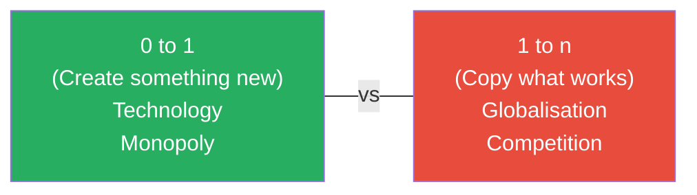
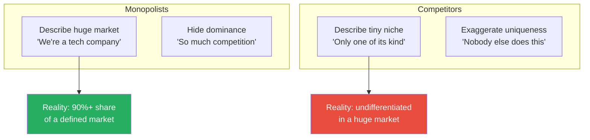
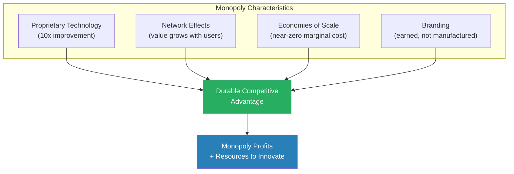
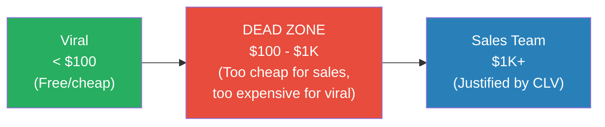
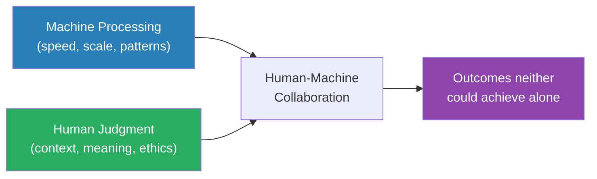
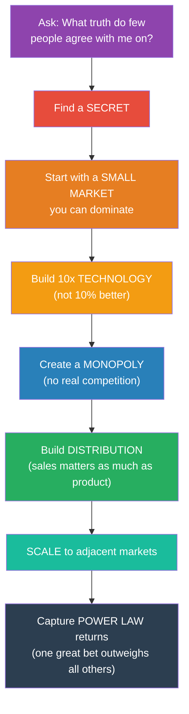

# Zero to One — Peter Thiel

> Peter Thiel's contrarian thesis: the next great company won't come from copying Facebook or Google — it will come from doing something no one has done before. That's going from zero to one. Copying what works is going from one to n. The first creates a monopoly; the second creates competition. And competition, Thiel argues, is for losers. Based on notes from Thiel's Stanford lecture series on startups, the book is a manifesto for contrarian thinking — for finding and acting on truths that most people don't believe, and for building businesses so good that they have no meaningful competition. It is the most intellectually ambitious startup book ever written, because it's not really about startups. It's about how progress happens.

---

## About the Author

Peter Thiel is a co-founder of PayPal, the first outside investor in Facebook ($500,000 for 10.2% in 2004 — which became worth over $1 billion), and a co-founder of Palantir Technologies. He is a partner at Founders Fund, a venture capital firm that has invested in SpaceX, Airbnb, Stripe, and dozens of other companies. Before tech, Thiel studied philosophy at Stanford and law at Stanford Law School, clerked for a federal judge, and briefly worked at a New York law firm before leaving to start a hedge fund. His most important intellectual influence is the philosopher Rene Girard, whose theory of mimetic desire — that we want things because others want them — underpins Thiel's entire argument about competition. This book originated from a course he taught at Stanford in 2012, where student Blake Masters took detailed notes that went viral online and became the skeleton of the book.

---

## The Big Idea

- <b style="color: #2980b9">Going from 0 to 1</b> means creating something entirely new — technology, vertical progress, a leap from nothing to something
- Going from 1 to n means copying what already works — globalisation, horizontal progress, spreading existing solutions to new places
- <b style="color: #27ae60">Every great company is built on a secret — an important truth that most people don't agree with</b>
- The contrarian question that opens the book: "What important truth do very few people agree with you on?"

Thiel argues that globalisation (spreading existing solutions to more places) and technology (creating new solutions) are fundamentally different kinds of progress — and that technology is the one that matters more:

- **Globalisation without technology** is unsustainable — if every person in China consumes as much oil as every American, the planet collapses before the model can be copied
- **Technology without globalisation** is fine — one breakthrough like cheap solar energy or desalination can change the game for everyone
- The world has had enormous progress in bits (the digital world) and almost none in atoms (the physical world) since the 1970s
- <b style="color: #e74c3c">The world needs more people creating the future (0 to 1), not more people copying the present (1 to n)</b>

The distinction between 0 to 1 and 1 to n is the most important framework in the book. It shapes every subsequent argument — about monopoly, competition, secrets, the power law, and the nature of progress itself.



This diagram captures the book's central either/or: every business, every project, every decision is either creating something new or copying something old.

---

## Key Concepts at a Glance

| Concept | One-line summary |
|---------|-----------------|
| **0 to 1 vs 1 to n** | Creating new things vs copying existing things |
| **The Contrarian Question** | "What important truth do very few people agree with you on?" |
| **Competition Is for Losers** | Monopolies drive profits and progress; competition destroys both |
| **The Power Law** | A small number of companies produce the vast majority of returns |
| **Definite Optimism** | Having a specific plan for a better future — not just vague hope |
| **Secrets** | Important truths not yet widely known — every great business is built on one |
| **Last Mover Advantage** | Better to be the last great development in a market than the first |
| **The Seven Questions** | Engineering, timing, monopoly, people, distribution, durability, secret |
| **Man and Machine** | The best technology complements humans rather than replacing them |
| **The Founder's Paradox** | Great founders are simultaneously insiders and outsiders |
| **Startup as Cult** | The best startups share intensity of belief with cults — but about something true |
| **Distribution** | Sales and delivery matter as much as the product itself |
| **The Stagnation Thesis** | Technology has stagnated outside of computers since the 1970s |

---

## Chapter 1: The Challenge of the Future

*Thiel opens with the question that defines the entire book — and reveals why most people give the wrong answer.*

The book begins with Thiel's favourite interview question: <b style="color: #2980b9">"What important truth do very few people agree with you on?"</b>

- This question is deceptively hard — most people answer with something that is either popular (not actually contrarian) or controversial but useless (not actionable)
- A good answer takes the form: "Most people believe X, but the truth is the opposite of X"
- Thiel's own answer: "Most people think competition makes companies better. The truth is that competition makes companies worse."

The question matters because <b style="color: #27ae60">every great business is built on a contrarian truth — something the founder believed that almost nobody else did</b>:

- If everyone agreed with the truth, someone else would have already built the business
- If the truth were actually false, the business would fail
- The sweet spot is a truth that is genuinely true AND genuinely unpopular — and those are extraordinarily rare

> [!tip] Core Insight
> The contrarian question is not about being different for its own sake. It is about finding truths that the crowd has missed — and those truths are where all the value is hiding.

### 0 to 1 vs 1 to n

Thiel introduces his central framework:

- **0 to 1** = vertical progress = technology = creating something that has never existed before
  - The typewriter to the word processor was 0 to 1
  - The first smartphone was 0 to 1
  - PayPal inventing instant peer-to-peer digital payments was 0 to 1
- **1 to n** = horizontal progress = globalisation = copying something that already works
  - Opening the 1,000th Starbucks in a new city is 1 to n
  - The 50th smartphone manufacturer entering the market is 1 to n
  - Dozens of competitors entering the payment space after PayPal proved it worked is 1 to n

> [!example] PayPal as 0 to 1
> - Before PayPal, sending money online was either impossible or required a bank wire — slow, expensive, and relationship-dependent
> - PayPal created something that did not exist: instant, free, peer-to-peer digital payments
> - That was going from 0 to 1 — a genuine invention
> - After PayPal proved the model, dozens of competitors emerged: Google Wallet, Venmo, Square, Stripe — all variations on a proven concept
> - The 0-to-1 company captured the monopoly and defined the category; the 1-to-n companies competed for what was left
> **The lesson:** The creator defines the market. The copiers fight over scraps.

### Why Most People Go from 1 to n

- Going from 0 to 1 is frightening — it means believing something that most people think is wrong, and investing in something with no proof of concept
- Going from 1 to n is comfortable — someone else has already proven the concept, the market exists, the demand is visible
- <b style="color: #e74c3c">The paradox: 1 to n feels safer but IS riskier, because you compete against everyone else who chose the safe path. 0 to 1 feels riskier but IS safer, because if you are right, you have no competition.</b>

Thiel uses a business-school analogy to make this concrete:

- Most MBA graduates enter industries with proven demand — consulting, banking, tech companies
- They compete with thousands of equally qualified candidates for incrementally better positions
- The few who create entirely new companies or categories face less competition by definition
- <b style="color: #27ae60">The safest bet is the one nobody else is making</b>

---

## Chapter 2: Party Like It's 1999

*Thiel argues that the conventional lessons everyone drew from the dot-com crash were exactly backwards — and that the resulting timidity has cost us decades of progress.*

The late 1990s saw an explosion of internet companies built on hype rather than substance. When the bubble burst in March 2000, Silicon Valley collectively adopted four defensive rules:

1. Make incremental advances (don't be too ambitious)
2. Stay lean and flexible (don't plan too far ahead)
3. Improve on the competition (don't try to create new markets)
4. Focus on product, not sales (if you build it, they will come)

### What Thiel Says They Should Have Learned

Thiel argues the opposite of every one of those lessons is true:

1. <b style="color: #e74c3c">It is better to risk boldness than triviality</b> — timid incrementalism produces nothing memorable
2. A bad plan is better than no plan — indefinite fumbling wastes more resources than a flawed blueprint
3. Competitive markets destroy profits — creating a new market is how you build something lasting
4. Sales matter just as much as product — the best product in the world dies without distribution

| Post-Crash Consensus | Thiel's Contrarian Position |
|----------------------|----------------------------|
| Be incremental | Be bold — boldness beats triviality |
| Stay lean and flexible | Have a definite plan — bad plans beat no plan |
| Improve on competitors | Create new markets — competition destroys profits |
| Focus on product only | Sales matters equally — distribution IS strategy |

This table captures the core of Thiel's revisionism: every lesson the Valley learned was precisely wrong.

> [!example] The Dot-Com Mania and Its Aftermath
> - In September 1998, the average internet stock had quadrupled in value. Companies with no revenue, no product, and no plan commanded billion-dollar valuations
> - The crash wiped out $5 trillion in market value between March 2000 and October 2002
> - But Thiel points out that the biggest successes of the internet era — Google, Amazon, Facebook, PayPal — were all founded during or just after the bubble
> - These companies succeeded not because they were timid but because they combined bold ambition with rigorous execution
> - The lesson the Valley learned — "be less ambitious" — was exactly wrong
> **The lesson:** The crash was caused not by too much ambition but by ambition without substance.

### The Mania's Real Cause

- The 1990s mania was not caused by insane optimism about technology — most of the big tech bets (internet commerce, social networking, mobile computing) turned out to be correct
- The mania was caused by <b style="color: #2980b9">indefinite optimism</b> — the vague belief that "something good will happen" without any specific plan for what or how
- Companies raised enormous rounds of funding without knowing what they would build
- The problem was not vision — it was the absence of vision masquerading as vision

### The 1990s Context

Thiel places the mania in its wider historical context, explaining why people were so eager to believe:

- The fall of the Berlin Wall (1989) and the end of the Cold War created a wave of optimism
- The internet felt like the beginning of a new era — a "new economy" with new rules
- The old economy (manufacturing, physical infrastructure) was already stagnating
- Technology seemed like the only domain where real progress was still happening
- Into this vacuum rushed thousands of entrepreneurs who had the optimism but not the plan
- <b style="color: #e74c3c">The bubble was not irrational exuberance about the future — it was rational exuberance paired with irrational vagueness about HOW to get there</b>

> [!example] Thiel's PayPal Experience During the Bubble
> - PayPal was founded in December 1998, near the peak of the mania
> - Thiel and his co-founders knew the environment was insane — but they also knew their idea was real
> - PayPal survived the crash because it had what most dot-coms lacked: a specific product (digital payments), a specific market (eBay power sellers), and a specific plan for making money
> - When the bubble burst, PayPal had substance; most competitors had only hype
> - The company went public in February 2002 and was acquired by eBay for $1.5 billion in October 2002
> **The lesson:** You can build a great company during a mania — as long as you have a definite plan and not just indefinite enthusiasm.

---

## Chapter 3: All Happy Companies Are Different

*This is Thiel's most provocative argument: competition is not the engine of capitalism. It is the enemy of it.*

### The Competition Myth

Business schools teach that competition is healthy — it keeps companies sharp, drives innovation, and benefits consumers. Thiel says this is mostly wrong:

- <b style="color: #e74c3c">Competition and capitalism are opposites.</b> Under perfect competition, no firm makes economic profit — it all gets competed away
- Monopolies generate massive profits because they are so much better than the alternative that no one else comes close
- The standard economic model treats monopoly as an aberration and competition as the ideal — Thiel argues this is backwards
- <b style="color: #27ae60">The goal of every business should be to become a monopoly — so good at what it does that no substitute exists</b>

### The Lying Game

Thiel makes a sharp observation about how monopolists and competitors describe themselves:

- **Monopolists downplay their dominance** to avoid regulatory scrutiny — Google describes itself as an "advertising company" (competing with TV, radio, billboards) or a "technology company" (competing with Apple, Microsoft, Amazon), never as a "search engine company" (where it has 90%+ market share)
- **Competitors exaggerate their uniqueness** to attract investors — the British restaurant on the corner of a particular street in Palo Alto claims to be the "only British restaurant in Palo Alto," which is technically true but commercially meaningless



Both monopolists and competitors lie about their market position — but in opposite directions.

> [!example] Google vs the Airlines
> - Google captures about 21% of search revenue as profit
> - US airlines, despite generating far more total revenue, operate on margins of about 0.2%
> - Google is a monopoly — over 90% of search — and it is one of the most profitable companies in history
> - Airlines are in brutal competition with each other and collectively barely break even
> - In 2012, Google made $50 billion in revenue and kept about $10 billion as profit; the entire US airline industry made $160 billion in revenue and kept about $300 million
> - Competition destroys profits; monopoly creates them
> **The lesson:** A small slice of a monopoly market is worth more than a large slice of a competitive one.

> [!example] The Restaurant Industry as Perfect Competition
> - A new restaurant opens in San Francisco and announces itself as the "only Pakistani-Portuguese fusion tapas in the Bay Area"
> - This hyper-specific description makes it sound unique — but it competes with every other restaurant for customers' dining budgets
> - It has no proprietary technology, no network effects, no economies of scale, no real brand
> - Most restaurants fail within two years — the industry is the textbook case of a competitive market where nobody makes economic profit
> - The owner defines the market as "Pakistani-Portuguese fusion" to feel special — but the customer defines it as "restaurants near me for dinner"
> **The lesson:** Defining your market narrowly to sound unique does not create a monopoly — it just disguises competition.

### Why Monopolies Are Good for Society

Thiel goes further than simply arguing that monopolies are good for the company — he argues they are good for society:

- Monopoly profits fund future innovation — Google can invest in self-driving cars, AI, and biotech because search profits fund everything
- Competitive industries have no slack for experimentation — airlines cannot afford moonshot research
- The greatest periods of scientific and technological progress have been funded by monopoly profits — Bell Labs (AT&T's monopoly), Xerox PARC (Xerox's monopoly), and Google X (Google's monopoly)
- <b style="color: #2980b9">Creative monopolies</b> — Thiel's term for monopolies that create genuine new value — are different from government-protected monopolies that simply extract rent

---

## Chapter 4: The Ideology of Competition

*Thiel draws on Rene Girard's philosophy to explain why competition is so seductive despite being destructive — and why the smartest people often get trapped in it.*

### Girard's Mimetic Theory

<b style="color: #2980b9">Mimetic desire</b> — the idea that humans want things because other people want them, not because they independently value them — is Thiel's most important intellectual building block:

- Girard argued that we are fundamentally imitative creatures
- We do not choose our desires independently — we copy them from people around us
- This creates a cycle of escalating competition:
  - You see someone succeeding in investment banking -> you want to be an investment banker
  - You enter the field -> now you compete with everyone else who imitated the same desire
  - The competition intensifies -> you work harder for diminishing returns
  - By the time you "win" (if you ever do), you have spent years pursuing a goal you never independently chose

- <b style="color: #e74c3c">Thiel calls this "mimetic competition" — the most insidious form of 1-to-n thinking. You are not building something new. You are fighting over something old because everyone else wants it.</b>

> [!example] The Ivy League Trap
> - Students at Harvard and Stanford compete fiercely for the same consulting and banking jobs — not because they independently value those careers, but because their peers value them
> - The most talented people in the world end up in the most competitive fields, destroying each other's margins
> - Instead of creating something new, they fight over prestigious positions in existing institutions
> - The 0-to-1 opportunity is to step outside the competition entirely and build in a space nobody else is looking at
> - A graduate who starts a company in an "unfashionable" area faces less talent competition than someone who joins McKinsey
> **The lesson:** The crowd is not a compass. Following it guarantees competition, not success.

### Competition as Warfare

Thiel points to real-world examples of destructive competitive dynamics:

- **Microsoft vs Google:** These two companies spent years fighting over search, browsers, operating systems, and office suites
  - Microsoft launched Bing to compete with Google Search
  - Google launched Chrome to compete with Internet Explorer
  - Google launched Google Docs to compete with Microsoft Office
  - Microsoft launched Surface to compete with Google's hardware
  - While they fought each other, Apple surged past both in market capitalisation
- <b style="color: #27ae60">Competition narrows your vision. Monopoly expands it. When you have no competitors, you can focus entirely on creating value instead of capturing it.</b>

> [!example] Thiel's Own Experience with Competition
> - At Stanford Law School, Thiel competed intensely for a Supreme Court clerkship
> - He made it to the final round — and lost
> - Looking back, he considers this one of the best things that ever happened to him
> - If he had won the clerkship, he would have spent his career as a lawyer — successful, prestigious, and completely on the 1-to-n track
> - Instead, he went to Silicon Valley and co-founded PayPal
> - The failure to win a competitive prize freed him to create something new
> **The lesson:** Losing a competition can be the best outcome — it forces you off the crowded path and onto the empty one.

### Why We Love Competition

- Competition feels virtuous — it aligns with deeply held beliefs about meritocracy and fairness
- Schools train us to compete from childhood: grades, rankings, admissions, awards
- The educational system is a twelve-year training programme in mimetic competition
- By the time talented people reach adulthood, competition feels natural and inevitable — when in reality it is learned behaviour that often serves no purpose
- The word "competition" shares a Latin root with "petere" — to seek — suggesting that competitors are seeking the same thing, not creating different things

> [!tip] Core Insight
> The most contrarian move is not to compete harder, but to refuse to compete at all — to find or create a field where you are the only player.

---

## Chapter 5: Last Mover Advantage

*Thiel dismantles the cult of the "first mover" and argues that what matters is not being first but being so good that no one needs to come after you.*

### Why Being First Is Overrated

- First movers get attention but often get the model wrong
  - Friendster preceded Facebook
  - AltaVista preceded Google
  - Palm preceded iPhone
  - Netscape preceded Chrome
- <b style="color: #2980b9">The last mover advantage</b>: the last significant company to enter a market studies what first movers got wrong, builds something dramatically better, and captures the market permanently
- The goal is not to be first — it is to generate the last great development in a specific market and enjoy years or decades of monopoly profits
- "It's much better to be the last mover"

### The Four Characteristics of a Durable Monopoly

Thiel identifies four structural features that allow monopolies to persist:

| Characteristic | What It Means | Example |
|---------------|---------------|---------|
| **Proprietary Technology** | At least 10x better than the next best alternative | Google's search algorithm was an order of magnitude better than anything else |
| **Network Effects** | Product gets more valuable as more people use it | Facebook — every new user makes the platform more useful for everyone |
| **Economies of Scale** | Marginal cost of one more customer approaches zero | Software companies — one more user costs almost nothing to serve |
| **Branding** | Genuine brand earned by product quality, not manufactured by marketing | Apple's brand reflects real product superiority, not just advertising |


Each monopoly has a distinct shape: Google's moat is proprietary technology and scale, Facebook's is network effects, Amazon's is economies of scale, Apple's is branding, and Tesla's is proprietary technology plus brand — confirming Thiel's point that durable monopolies need strength across multiple characteristics simultaneously.

Each characteristic reinforces the others:

- **Proprietary technology** creates the initial advantage that attracts early users
- **Network effects** lock those users in and attract more, creating a growing moat
- **Economies of scale** mean the cost per user drops as the network grows, funding further investment in technology
- **Branding** becomes the shorthand for all three — a recognisable signal that this product is the dominant one



All four characteristics work together — a monopoly with only one is vulnerable, but a monopoly with all four is nearly indestructible.

---

### The Monopoly Playbook: Start Small, Dominate, Expand

Thiel outlines a four-step sequence for building a monopoly:

> [!abstract] Building a Monopoly — The Sequence
> 1. **Start with a niche** — Find a small market with unserved or underserved needs
> 2. **Dominate it** — Capture 50-80% of that small market; be so much better that switching is unthinkable
> 3. **Scale up** — Expand to adjacent markets one at a time, leveraging your existing advantage
> 4. **Don't disrupt** — Build quietly in a niche incumbents don't notice or care about; by the time they notice, you own the market

- <b style="color: #27ae60">Start with a very small market you can dominate completely</b>
- Amazon started with books online — not "e-commerce"
- Facebook started at Harvard — not "social networking"
- PayPal started with eBay power sellers — not "digital payments"
- Once you dominate the small market, expand to adjacent markets

> [!example] Amazon's Monopoly Sequence
> - **Niche (1994):** Online bookstore — small market, clear need (bookstores had limited selection), Amazon dominated by offering every book in print
> - **Dominate (2000):** Amazon owned online book sales — no competitor came close
> - **Scale (2001-2010):** Expanded to CDs, DVDs, electronics, clothing — using the same logistics infrastructure each time
> - **Moat (2010+):** Network effects (sellers and buyers reinforce each other), economies of scale (massive fulfilment centres), and proprietary technology (recommendation engine, AWS) made competing with Amazon in e-commerce nearly impossible
> **The lesson:** Monopoly is not seized in a single stroke. It is built market by market, each expansion funded by the profits of the last.

> [!example] Facebook's Monopoly Sequence
> - **Niche (2004):** Harvard students only — a tiny market where the product could achieve 100% penetration
> - **Dominate:** Within weeks, most Harvard students were on Facebook — not as a choice among many social networks but as THE social network at Harvard
> - **Scale:** Expanded to other Ivy League schools, then all US universities, then high schools, then everyone
> - **Moat:** By the time Facebook opened to the public, network effects were so strong that no competing social network could gain traction — all your friends were already on Facebook
> **The lesson:** A social network that starts by trying to serve everyone will serve no one well. Start with one dense community and let network effects carry you.

### The Big Market Trap

- "We're targeting a $50 billion market" sounds impressive in a pitch deck
- Thiel says it is actually a red flag — if the market is that big and you are entering it, you are competing against established players
- <b style="color: #e74c3c">Better: "We're targeting a $10 million niche that nobody else is serving, and we're going to capture 80% of it."</b>
- The difference between a $50 billion market and a $10 million niche:
  - In the big market, you are a rounding error — 0.001% of revenue, invisible to customers and incumbents alike
  - In the small niche, you are the dominant player — every customer knows you, every competitor fears you

| | Monopoly | Competition |
|--|---------|------------|
| **Profits** | High and sustainable | Competed away to zero |
| **Innovation** | Has resources and incentive to innovate | Too busy surviving to innovate |
| **PR story** | "We're in a huge competitive market" (to avoid regulation) | "We're totally unique" (to attract investors) |
| **Reality** | So good that no substitute exists | Interchangeable with rivals |
| **Founder mindset** | Long-term value creation | Short-term survival |

---

## Chapter 6: You Are Not a Lottery Ticket

*Thiel attacks the dominant modern worldview — that success is mostly luck — and argues that the most important achievements in history came from people with specific, definite plans.*

### The Four Quadrants

Thiel maps attitudes about the future along two axes: optimism vs pessimism, and definite (having a plan) vs indefinite (relying on luck or drift):

| | Optimistic | Pessimistic |
|--|-----------|------------|
| **Definite** | USA 1950s-60s: big plans, moon landings, infrastructure | China today: copies what works, plans for a known future |
| **Indefinite** | USA today: "things will get better somehow" but no specific plan | Europe today: vague decline, no plan |

```mermaid
quadrantChart
    title Definite vs Indefinite x Optimistic vs Pessimistic
    x-axis Pessimistic --> Optimistic
    y-axis Indefinite --> Definite
    quadrant-1 Definite Optimism (Build the future)
    quadrant-2 Definite Pessimism (Copy and catch up)
    quadrant-3 Indefinite Pessimism (Managed decline)
    quadrant-4 Indefinite Optimism (Hope without plans)
```

Each quadrant represents a different civilisational posture toward the future.

### The Four Quadrants in History

**Definite Optimism (USA 1950s-1960s):**
- Americans believed in specific plans for a better future and built them
- The Interstate Highway System, the Apollo programme, the Golden Gate Bridge, the Hoover Dam
- Engineers and visionaries drew blueprints and then constructed what they imagined
- Robert Moses reshaped New York; NASA put men on the moon
- The question was not "will the future be better?" but "what specifically will we build?"

**Indefinite Optimism (USA today):**
- Americans still believe the future will be better — but nobody has a plan for how
- Instead of engineers, the economy is run by financiers, consultants, and lawyers — people who rearrange what already exists rather than creating anything new
- The dominant strategy is optionality: keep your options open, don't commit, diversify
- <b style="color: #e74c3c">The result is a society that expects progress without doing the work of progress</b>

> [!example] The Optionality Trap
> - A Stanford graduate gets a finance degree, works at McKinsey, goes to law school, then joins a VC firm
> - They have kept their options open for 15 years — and built nothing
> - They have accumulated credentials, not capabilities
> - They can evaluate what others build, but they cannot build anything themselves
> - Thiel sees this as the tragedy of indefinite thinking: an entire generation of talented people trained to be critics rather than creators
> **The lesson:** Optionality is not a strategy. It is the absence of a strategy disguised as sophistication.

**Definite Pessimism (China today):**
- China believes the future is knowable and plans accordingly — but the plans are copies
- Build the factories, copy the technology, industrialise
- Extremely effective at catching up to the frontier — but cannot create the frontier
- That requires going from 0 to 1, which requires definite optimism

**Indefinite Pessimism (Europe today):**
- Europe expects decline and has no plan to reverse it
- The default response is regulation: if you cannot build a better future, at least prevent the present from getting worse
- This produces managed decline — comfortable but stagnant

---

### Indefinite Thinking Corrupts Everything

Thiel traces how <b style="color: #2980b9">indefinite optimism</b> has infected every domain of American life:

- **Finance:** Instead of funding specific projects, money flows into index funds, derivatives, and secondary instruments — bets on bets on bets, with no underlying plan to create anything
- **Politics:** Instead of proposing bold programmes, politicians poll-test incremental positions and promise vague improvement
- **Philosophy:** Instead of seeking truth, academia produces ironic detachment and "studies" that deconstruct everything and construct nothing
- **Biotech:** Instead of curing diseases through definite research programmes, the pharmaceutical industry runs thousands of randomised trials hoping to stumble on something useful — indefinite by design
- **Education:** Instead of mastering a specific craft, students collect credentials across many fields — hedging against the future rather than shaping it
- <b style="color: #27ae60">Definite optimism — having a concrete vision and a plan — is what built the modern world and what will build the next one</b>

> [!example] Malcolm Gladwell vs Definite Thinking
> - Thiel uses Malcolm Gladwell as a symbol of indefinite thinking
> - Gladwell's books argue that success is largely a product of luck, timing, and circumstance — the 10,000-hour rule, the birthday effect, cultural legacies
> - Thiel's objection: if success is random, then planning is pointless, and the only rational strategy is to diversify and hope
> - But the great builders — Ford, Edison, Jobs, Musk — did not diversify; they committed to a specific vision and executed it with obsessive focus
> - The "success is luck" narrative is comfortable because it absolves us of the responsibility to plan
> **The lesson:** If you treat the future as fundamentally random, you will never build anything. Definite optimists treat the future as something they can shape — and they are the ones who do.

> [!tip] Core Insight
> The choice between definite and indefinite thinking is the most consequential decision anyone can make. Definite thinking says: I will imagine a specific future and build it. Indefinite thinking says: something good will happen eventually. Only one of these creates progress.

---

## Chapter 7: Follow the Money

*Thiel reveals the mathematical law that governs venture capital — and argues it governs everything else too.*

### The Power Law in Venture Capital

<b style="color: #2980b9">The power law</b> is the single most important pattern in venture capital — and Thiel argues it applies far beyond investing:

- In a typical venture fund, the single best investment outperforms all others combined
- The second-best investment outperforms everything except the first
- The third-best outperforms everything from #4 to the last
- This is not an anomaly — it is the defining pattern of the industry

Thiel provides data from his own experience at Founders Fund:

- Facebook alone returned more than every other investment in the fund combined
- The second-best investment returned more than every other investment (except Facebook) combined
- The industry's entire return comes from a tiny number of massive winners — everything else is effectively a loss

> [!example] Founders Fund and the Power Law
> - Founders Fund invested in many companies across multiple sectors
> - Facebook's return dwarfed everything else — the single investment justified the entire fund
> - If Founders Fund had spread its Facebook investment across ten mediocre companies instead, the fund would have underperformed dramatically
> - The power law is not about being right more often — it is about being spectacularly right on a few bets that matter
> **The lesson:** In a power law world, the quality of your best bet matters infinitely more than the quantity of your bets.

### The Power Law in Life

The power law is not just about venture capital. Thiel argues it applies to every domain:

| Domain | Power Law Implication |
|--------|---------------------|
| **Companies** | One dominant company captures most of the value in any market |
| **Products** | One product line generates most of the revenue |
| **Decisions** | One career decision matters more than all others combined |
| **Relationships** | A few relationships produce the vast majority of meaning |
| **Skills** | One exceptional skill is worth more than ten mediocre ones |
| **Time** | A few hours of focused work produce more value than 40 hours of scattered work |


The treemap makes the power law viscerally visible: in every domain — companies, products, decisions, skills, and time — a tiny fraction of inputs generates the vast majority of value, which is why Thiel argues concentration beats diversification.

### The Anti-Diversification Argument

Conventional wisdom says: diversify your investments, diversify your skills, keep your options open. Thiel says the opposite:

- <b style="color: #e74c3c">Diversification is a hedge against ignorance. If you knew which bet was going to win, you would put everything on it.</b>
- The people who change the world — Jobs, Musk, Bezos — did not diversify; they bet everything on one vision
- For most people, the practical version: instead of being mediocre at five things, become world-class at one thing and let the power law work in your favour

> [!example] The Power Law at Work — Venture Capital Data
> - Andreessen Horowitz's 2010 fund invested in many companies
> - Instagram's return (acquired by Facebook for $1 billion) dwarfed the rest
> - The pattern repeats across every major fund: Y Combinator's return is dominated by Airbnb, Stripe, and Dropbox; the remaining thousands of companies are rounding errors
> - This is not an exception — it IS the rule; the power law is the fundamental law of venture capital
> **The lesson:** If you are spreading your effort or investment evenly, you are fighting the most powerful law in business.

### Why the Power Law Is Hard to Accept

- The power law is deeply counterintuitive — we are trained to think in terms of normal distributions (bell curves) where most outcomes cluster around the average
- In a power-law world, there IS no average — a tiny number of outcomes dominate everything
- This means most conventional strategies (diversify, hedge, spread your bets) are exactly wrong
- <b style="color: #27ae60">The correct strategy in a power-law world: find the one thing that can compound exponentially and concentrate your effort there</b>

---

## Chapter 8: Secrets

*Thiel argues that every great business is built on a secret — an important truth that can be known but isn't widely known — and that our culture has lost the habit of looking for them.*

### Types of Knowledge

<b style="color: #2980b9">Secrets</b> sit between two other types of knowledge:

| Type | Definition | Example |
|------|-----------|---------|
| **Conventions** | Things most people know and agree on | "The earth orbits the sun" |
| **Mysteries** | Things that may be unknowable | "Is there a God?" |
| **Secrets** | Important truths that CAN be known but AREN'T widely known | "Ride-sharing could replace car ownership" (Uber's secret in 2009) |

- The existence of secrets means the world still has hidden truths waiting to be discovered
- Most people have stopped looking — they believe everything important has already been found
- <b style="color: #e74c3c">The best business opportunities are in areas where most people think there is nothing left to find</b>

### Why People Stop Looking for Secrets

Thiel identifies four social forces that discourage secret-seeking:

- **Incrementalism:** From childhood, we are taught to advance in small, measured steps — grades, ranks, degrees — never to leap
- **Risk aversion:** If a secret is genuine, acting on it is risky — and our society increasingly penalises risk-takers who fail
- **Complacency:** The comfortable modern world makes it easy to believe that everything important has already been discovered
- **Flatness:** In a globalised world, the assumption is that if a genuine secret existed, someone among seven billion people would have already found it
- <b style="color: #27ae60">All four forces push in the same direction: stop looking. Settle for what is known. And that is exactly why so many secrets remain undiscovered.</b>

> [!example] Airbnb's Secret
> - In 2008, the secret behind Airbnb was: "People will rent their spare rooms to strangers, and strangers will pay to stay in them"
> - This sounds obvious now — at the time, virtually everyone thought it was absurd
> - Every major hotel chain, every travel company, every real estate investor had the data to see this opportunity — none of them did
> - The founders saw a truth that most people denied
> - That gap between truth and consensus is where monopoly-building opportunity lives
> **The lesson:** The most valuable secrets are not hidden in labs or databases. They are hiding in plain sight, disguised as things "everyone knows" aren't true.

> [!example] Uber's Secret in Three Steps
> - **Look where others aren't:** Transportation was considered a "solved" industry — taxi companies existed, what was there to discover?
> - **Find the overlooked truth:** Millions of people had cars they weren't using most of the time; millions of others needed rides and couldn't get them efficiently; GPS and smartphones had just made real-time matching possible
> - **Act on it:** Uber connected idle car capacity with unmet demand through a smartphone app
> - The secret was not complex — it was hiding in plain sight, in an industry nobody in Silicon Valley was looking at
> **The lesson:** Secrets favour the curious, not the credentialed.

### Natural Secrets vs Human Secrets

| Type | Definition | Where to Look | Example |
|------|-----------|---------------|---------|
| **Natural secrets** | Undiscovered truths about the physical world | Science, biology, physics, chemistry | CRISPR gene editing — a natural secret about how bacteria defend against viruses |
| **Human secrets** | Undiscovered truths about people and organisations | Psychology, economics, culture, institutions | "People will rent their homes to strangers" — a human secret |

- <b style="color: #2980b9">Human secrets are often easier to find because they require social insight, not laboratory equipment — and they are more commercially valuable because they can be acted on immediately</b>

### How to Find Secrets

Thiel offers practical guidance:

> [!abstract] Finding Secrets — Thiel's Method
> 1. **Look where others aren't looking** — the most valuable secrets are in areas that most people consider boring, solved, or impossible
> 2. **Ask: "What are people not allowed to talk about?"** — social taboos often protect secrets; if an important question cannot be asked publicly, there is probably a secret hidden underneath
> 3. **Look for overlooked industries** — technology attracts the most talent and investment, while agriculture, construction, education, and government are often decades behind
> 4. **Study what is considered "natural" or "inevitable"** — when people say "that's just how things are," they are often protecting a convention, not describing a truth

### The Secret-Keeping Problem

- Once you find a secret, share it with as few people as possible — a secret shared widely ceases to be a competitive advantage
- Tell only the people who need to know: your co-founders and core team
- The company itself is the mechanism for exploiting the secret — you build a monopoly around it before the rest of the world catches on
- <b style="color: #e74c3c">A secret shared with the wrong people becomes a competition — a secret shared with the right people becomes a company</b>

---

## Chapter 9: Foundations

*Thiel argues that the founding moment of a company is like the constitutional convention of a country — decisions made at the start determine everything that follows, and they are nearly impossible to change later.*

### Why Beginnings Matter

- <b style="color: #2980b9">The founding moment determines the trajectory of the company</b> — get the founding wrong (wrong co-founder, wrong equity split, wrong culture), and no amount of execution can fix it
- Thiel compares it to the US Constitution: the framers' decisions in 1787 still govern American life centuries later
- Bad decisions at a startup's founding compound over time, while good decisions compound in the opposite direction
- "Thiel's law": a startup messed up at its foundation cannot be fixed

### Thiel's Rules for Founding

> [!abstract] Founding Principles
> 1. **Co-founders should have a pre-existing relationship** — cold co-founder matches are like arranged marriages; the odds are against them
> 2. **Everyone should be full-time** — part-time commitment produces part-time results
> 3. **Keep the board small** — three to five people; large boards debate everything and decide nothing
> 4. **Equity over salary in early stages** — salary creates employees; equity creates owners
> 5. **CEO salary should be low** — if a CEO makes more than $150K in an early-stage startup, the company has a problem; low CEO pay sets the standard for mission-driven culture

### Ownership, Possession, and Control

Thiel draws a crucial distinction that most people miss:

- **Ownership** (who owns equity) is different from **possession** (who runs the company day to day) which is different from **control** (who governs long-term decisions)
- In a healthy startup, these three overlap significantly — founders own equity, run operations, and sit on the board
- In a dysfunctional organisation, they diverge — shareholders own the company but have no power, managers run it but have no ownership, and the board governs but understands nothing
- <b style="color: #e74c3c">Misalignment between ownership, possession, and control is the root cause of most corporate dysfunction</b>

| Element | Definition | Healthy Startup | Dysfunctional Company |
|---------|-----------|-----------------|----------------------|
| **Ownership** | Who holds equity | Founders and early employees | Dispersed shareholders with no voice |
| **Possession** | Who runs operations daily | Founders and core team | Professional managers with no ownership |
| **Control** | Who governs long-term direction | Small board of insiders | Large board of outsiders who don't understand the business |

When all three align, the company moves fast and makes coherent decisions. When they diverge, every decision becomes a negotiation between parties with different incentives.

> [!example] The Agency Problem in Action
> - When managers do not own equity, they optimise for their own compensation and security, not for the company's long-term value
> - When boards do not understand operations, they make governance decisions that damage the business
> - When shareholders have no voice, they cannot correct either problem
> - PayPal aligned all three by giving every early employee significant equity and keeping the board small enough to make real decisions
> - This alignment is why PayPal moved fast and made bold decisions that larger, more bureaucratic companies could not
> **The lesson:** Alignment between who owns, who runs, and who governs is not a nice-to-have — it is a structural requirement for building anything from 0 to 1.

---

## Chapter 10: The Mechanics of Mafia

*Thiel makes an intentionally provocative argument: the best startups look like cults from the outside — and that is not a flaw but a feature.*

### The PayPal Mafia

After PayPal was sold to eBay in 2002, its alumni went on to found or lead an extraordinary collection of companies:

- **Tesla and SpaceX** (Elon Musk)
- **LinkedIn** (Reid Hoffman)
- **YouTube** (Steve Chen, Chad Hurley, Jawed Karim)
- **Yelp** (Jeremy Stoppelman, Russel Simmons)
- **Palantir** (Peter Thiel)
- **Yammer** (David Sacks)
- **Founders Fund** (Peter Thiel, Ken Howery, Luke Nosek)

This is not coincidence. Thiel argues that PayPal's founding culture — contrarian, technical, ambitious — attracted people with 0-to-1 mindsets. When the company ended, those people carried that mindset into new ventures.

> [!example] The PayPal Mafia Photo
> - In 2007, Fortune magazine ran a now-famous photograph of the PayPal alumni posed as mafia bosses
> - The image was meant to be ironic — but it captured something real about the intensity of the group
> - These were people who had worked together during an insane period (the dot-com crash), shared a contrarian worldview (digital payments when most people thought it was fraud-bait), and bonded over the experience
> - That shared intensity is exactly what Thiel means by "cult-like" — and it is why they went on to create so many transformative companies
> **The lesson:** The bonds formed in intense shared creation outlast the company itself — they become the seeds of future creation.

### Why Cults and Startups Share Traits

| Trait | Cult | Great Startup |
|-------|------|---------------|
| Intense shared belief | Belief in a leader's vision | Belief in a product/mission |
| Tight social bonds | Members spend all their time together | Team works, eats, and socialises together |
| Hostility to outsiders | "The world doesn't understand us" | "The market doesn't see what we see" |
| Missionary zeal | Convert the unbelievers | Convert the market |
| Rejection of convention | Reject mainstream society | Reject conventional business wisdom |

- <b style="color: #e74c3c">Thiel's point is not that startups should BE cults. It is that the intensity of shared belief required to create something from nothing looks cult-like from the outside — and that is a sign of strength, not weakness.</b>
- The alternative — a team of mercenaries who are there for the paycheck — will never produce 0-to-1 innovation
- Mercenaries leave when things get hard; true believers stay

> [!tip] Core Insight
> The difference between a cult and a great startup is whether the shared belief is true. A cult believes something false with total conviction. A great startup believes something true — that the world has not yet recognised — with total conviction. The belief looks the same from the outside. The outcome is completely different.

### Hiring for Mission, Not Resume

Thiel's hiring philosophy follows from his culture thesis:

- Do not ask: "Who is the most talented person for this role?"
- Ask: "Who believes most deeply in what we are building?"
- <b style="color: #27ae60">The 20th talented person you interview will be good. The person who has been waiting for THIS company to exist will be extraordinary.</b>
- Every new hire should be able to answer: "Why do you want to work HERE, specifically, rather than anywhere else in the world?"
- If the answer is generic — "great opportunity," "interesting technology," "good team" — it is the wrong person
- The right answer is specific: "I believe in THIS mission, THIS product, THIS vision — and no other company is working on it"

### One Thing Per Person

- Thiel assigns every employee one unique responsibility — and only one
- This eliminates internal competition for the same tasks, reduces conflict, and creates clear ownership
- <b style="color: #2980b9">Internal peace</b> is the precondition for external war — a company tearing itself apart internally cannot fight effectively in the market
- At PayPal, every person knew exactly what their one thing was — and knew that no one else was doing it
- This created accountability without bureaucracy: if something failed, everyone knew whose responsibility it was

---

## Chapter 11: If You Build It, Will They Come?

*Thiel addresses the blind spot that kills more startups than bad products: the inability to sell.*

### The Engineer's Fallacy

- Engineers and technical founders systematically undervalue distribution
- They believe in meritocracy: the best product wins
- <b style="color: #e74c3c">In reality, the best-distributed product wins — a mediocre product with great distribution beats a great product with no distribution, every time</b>
- This is uncomfortable for builders — but ignoring it is fatal

> [!example] Why Nerds Hate Sales
> - Thiel observes that engineers resist the idea that sales matters because they pride themselves on building things that "speak for themselves"
> - But the reason salespeople are effective is precisely that their techniques are invisible — the best sales does not look like sales at all
> - Google's search page looks clean and organic, but the entire company is built on selling ads — the world's most sophisticated sales machine disguised as a utility
> - Facebook's feed looks like a social experience, but it is a carefully engineered advertising delivery system
> - The invisibility of good sales is what makes engineers distrust it — they cannot see it working, so they conclude it does not work
> **The lesson:** If you think sales does not matter, you are already being sold to — you just do not see it.

### The Distribution Spectrum

Thiel maps the entire landscape of distribution methods by customer lifetime value:

| Customer Lifetime Value | Distribution Method | Example | Key Dynamic |
|------------------------|-------------------|---------|-------------|
| $1M+ | **Complex sales** (CEO-led) | Enterprise software, government contracts, aerospace | CEO personally closes deals; relationships and trust are everything |
| $10K-$100K | **Inside sales team** | SaaS products, B2B services | Sales cycle: weeks to months; requires trained salespeople |
| $1K-$10K | **Marketing + sales hybrid** | Mid-market software, professional services | Lead generation plus sales qualification plus closing |
| $100-$1K | **Marketing and advertising** | Consumer products, subscription services | Cost per acquisition must be lower than lifetime value |
| <$100 | **Viral distribution** | Social networks, messaging apps, tools | Product must have a built-in sharing mechanism |


The polar area chart reveals why distribution strategy must match customer lifetime value: each tier demands a fundamentally different approach, and the dead zone between $100 and $1K destroys products that lack a clear channel on either side.

### The Dead Zone

<b style="color: #2980b9">The distribution dead zone</b> sits between roughly $100 and $1,000 in customer value:

- Products in this range are too expensive for viral adoption but too cheap to justify a sales team
- Many otherwise good products fail here — the product works, the customers exist, but there is no cost-effective way to reach them
- The solution is either to make the product cheap enough for viral distribution or expensive enough to justify direct sales
- <b style="color: #e74c3c">There is no middle path — the dead zone destroys products that fall into it</b>



Products must land clearly on one side of the dead zone or the other — falling in the middle is fatal.

### Why the Best Salespeople Are Invisible

- "Customers will never buy from someone who looks like a salesperson"
- The best salespeople look like friends, advisors, or trusted partners
- <b style="color: #27ae60">The most effective distribution is invisible — when the product "sells itself," that is actually the most sophisticated sales engineering, embedding the selling mechanism so deeply that customers do not notice it</b>

> [!example] PayPal's Distribution Hack
> - PayPal's early growth came from a counterintuitive strategy: paying customers to sign up
> - PayPal literally gave $10 to every new user and $10 for every referral
> - This cost $60-70 million — but it produced exponential growth
> - The logic: customer acquisition cost ($20) was lower than the expected lifetime value of a PayPal user
> - By the time competitors arrived, PayPal's network effects were too strong to overcome
> - This was not a marketing gimmick — it was a calculated distribution strategy that traded short-term cash for long-term monopoly
> **The lesson:** Distribution is not an afterthought to be figured out after the product ships. It IS the product strategy.

### The Power Law of Distribution

- Most businesses never find even one distribution channel that works
- <b style="color: #27ae60">If you can find just one channel that works, you have a great business — trying to use many channels simultaneously usually means none of them work well</b>
- The power law applies here too: one great distribution channel is worth more than five mediocre ones
- PayPal's one channel was eBay power sellers; Facebook's was Harvard; Salesforce's was enterprise direct sales
- Each company found ONE channel that worked and rode it to dominance

---

## Chapter 12: Man and Machine

*Written in 2014, before the current AI revolution, this chapter makes arguments about human-computer collaboration that have become even more relevant since.*

### Substitution vs Complementarity

Thiel rejects the dominant framing of technology as a substitute for human labour:

- The popular fear — "robots will replace us" — misunderstands how technology works
- <b style="color: #27ae60">The best technology does not replace humans; it complements them</b>
- Computers are good at processing vast amounts of data but bad at making judgments
- Humans are good at making judgments but bad at processing vast amounts of data
- The most valuable companies combine human judgment with machine processing — they do not replace one with the other

| Task | Computers Excel | Humans Excel |
|------|----------------|--------------|
| Processing millions of data points | Yes | No |
| Pattern recognition in structured data | Yes | No |
| Moral and ethical judgment | No | Yes |
| Creative problem-solving | No | Yes |
| Understanding context and nuance | No | Yes |
| Empathy and persuasion | No | Yes |

### Why Substitution Misses the Point

Thiel argues that the substitution framing is not just wrong — it leads to bad business thinking:

- If you think technology replaces humans, you build fully automated systems that miss the edge cases only humans can catch
- If you think technology complements humans, you build tools that make humans vastly more productive
- <b style="color: #2980b9">Complementary businesses</b> are harder to build — but they are also harder to replicate, creating deeper moats
- The value of complementarity is that it creates outcomes neither humans nor machines could achieve alone

### PayPal and Palantir as Proof

> [!example] PayPal's Fraud Detection
> - In PayPal's early days, the company faced a massive fraud problem — criminals were creating fake accounts to steal money
> - Automated systems alone could not catch sophisticated fraudsters — the patterns were too novel and adaptive
> - Human reviewers alone were too slow — millions of transactions per day overwhelmed any human team
> - PayPal's breakthrough was combining both: the algorithm flagged suspicious transactions, and humans made the final judgment
> - This hybrid approach was dramatically more effective than either approach alone
> - The insight became the founding idea for Palantir Technologies
> **The lesson:** Do not ask "human or machine?" Ask "human AND machine — doing what each does best."

> [!example] Palantir's Founding Insight
> - Palantir was founded on the same principle that solved PayPal's fraud problem: human-computer collaboration
> - The company builds software that helps intelligence analysts find patterns in enormous data sets — not by replacing analysts but by augmenting them
> - The software identifies potential connections and anomalies; human analysts interpret what those patterns mean and decide what to do about them
> - Neither the software alone nor the analysts alone could do what the combination achieves
> - This is why Palantir's contracts are worth billions — the combination produces insights that no fully automated system or fully human team could generate
> **The lesson:** The most valuable technology does not eliminate humans from the loop. It makes humans dramatically more capable.



The most valuable technology sits at the intersection — neither pure automation nor pure human effort, but a combination that multiplies the capabilities of both.

---

## Chapter 13: Seeing Green

*Thiel dissects the clean tech bubble of the 2000s as a cautionary tale about what happens when an industry fails every one of his tests for building a great company.*

### The Seven Questions Every Business Must Answer

This chapter introduces <b style="color: #2980b9">Thiel's seven questions</b> — a diagnostic framework for whether a business will succeed or fail:

1. **Engineering:** Can you create breakthrough technology, not just incremental improvement?
2. **Timing:** Is now the right time to start this?
3. **Monopoly:** Are you starting with a big share of a small market?
4. **People:** Do you have the right team?
5. **Distribution:** Can you actually deliver the product?
6. **Durability:** Will your market position be defensible in 10-20 years?
7. **Secret:** Have you identified a unique opportunity others haven't seen?

> [!abstract] The Seven Questions Diagnostic
> 1. **Engineering** — Is your technology 10x better than the next best? (Not 10% — 10x)
> 2. **Timing** — Has the technology just become possible while others haven't noticed?
> 3. **Monopoly** — Do you own 50-80% of a small market? (Not 0.1% of a huge one)
> 4. **People** — Has your team built and sold companies in this domain?
> 5. **Distribution** — Do you have a clear, scalable sales channel that costs less than customer lifetime value?
> 6. **Durability** — Do network effects, proprietary tech, and switching costs protect you for 20 years?
> 7. **Secret** — Do you know something specific, testable, and defensible that others do not?


Tesla's consistent strength across all seven questions — versus the typical clean tech company's weakness on nearly every dimension — explains why Tesla succeeded while over $50 billion in clean tech investment was lost, and why Thiel calls it the definitive counterexample.

### The Clean Tech Disaster

Thiel uses the clean tech bubble as his central case study because virtually every clean tech company failed every question:

> [!example]- The Clean Tech Bubble (2005-2011)
> - Over $50 billion in clean tech investment between 2005 and 2011 — most of it lost
> - **Engineering failure:** Most solar companies produced panels that were only marginally better (or worse) than existing technology — nowhere near the 10x improvement needed to displace fossil fuels
> - **Timing failure:** The timing was wrong — natural gas became dramatically cheaper due to fracking, undercutting clean tech's cost advantage before it existed
> - **Monopoly failure:** Companies entered enormous markets ("the global energy market") with no niche dominance — a recipe for brutal competition
> - **People failure:** Many clean tech startups were led by MBAs and financiers rather than engineers — they could pitch but could not build
> - **Distribution failure:** Selling solar panels to homeowners requires door-to-door sales — expensive, slow, and not scalable
> - **Durability failure:** China's cheap solar panels undercut American companies before they could establish themselves
> - **Secret failure:** "The world needs clean energy" is not a secret — it is the consensus; a secret must be something most people don't believe
> **The lesson:** A great cause does not make a great business. If the business fundamentals are wrong, idealism will not save it.

> [!example] Solyndra — The Poster Child of Failure
> - Solyndra received $535 million in government loan guarantees and was held up as a model clean tech company
> - Its cylindrical solar panels were a marginal engineering improvement — not the 10x breakthrough needed to justify an entirely new manufacturing process
> - Solyndra targeted the massive commercial rooftop market rather than a defensible niche
> - When Chinese flat-panel manufacturers dropped prices dramatically, Solyndra had no cost advantage and no moat
> - The company filed for bankruptcy in 2011, becoming a symbol of the clean tech bust
> **The lesson:** Government backing and good intentions cannot substitute for answering the seven questions honestly.

### Tesla as the Exception

Thiel holds up Tesla as the one clean tech company that answered all seven questions correctly:

| Question | Tesla's Answer |
|----------|---------------|
| **Engineering** | The Roadster was genuinely 10x better than any other electric car — it performed like a sports car |
| **Timing** | 2008 was the right moment — battery technology had just become good enough, and the financial crisis created appetite for alternatives to oil |
| **Monopoly** | Tesla started in the tiny market of high-end electric sports cars — a niche no one else was serving |
| **People** | Elon Musk was an engineer and entrepreneur, not a financier |
| **Distribution** | Tesla owned its showrooms, controlling the entire customer experience |
| **Durability** | Tesla's brand, Supercharger network, and battery technology created lasting advantages |
| **Secret** | Tesla's secret was that the next generation of car would be electric AND desirable — most people assumed electric cars would always be ugly, slow compromises |

> [!tip] Core Insight
> Tesla succeeded not because it was in clean tech but because it was a great company that happened to be in clean tech. The lesson is not about energy — it is about rigour. Answer all seven questions well, or do not start.

---

## Chapter 14: The Founder's Paradox

*The book's final chapter addresses the strange pattern that the very qualities enabling founders to create something from nothing are the qualities that make them most vulnerable to self-destruction.*

### The Paradox of Great Founders

- Great founders are often contrarian, obsessive, and eccentric — because creating something new requires disagreeing with the consensus
- But those same qualities make them difficult to work with, prone to overreach, and vulnerable to spectacular downfall
- <b style="color: #2980b9">The founder's paradox</b>: the qualities that create great companies are often incompatible with running them smoothly

| Founder Quality | 0-to-1 Advantage | Risk |
|----------------|------------------|------|
| **Contrarianism** | Sees opportunities others miss | Can also miss real dangers others see |
| **Obsession** | Relentless focus on the vision | Inability to adapt when the vision is wrong |
| **Eccentricity** | Unique perspective that drives innovation | Alienates people; creates culture problems |
| **Conviction** | Persists when everyone says quit | Persists when everyone is right to say quit |
| **Risk tolerance** | Willing to bet everything | Sometimes loses everything |


The heatmap reveals the founder's paradox in data: every quality that drives 0-to-1 advantage (green) also carries high management risk (amber/red) — confirming Thiel's argument that the traits enabling creation and the traits threatening destruction are inseparable.

### Founders as Mythical Figures

Thiel argues that society treats founders like ancient cultures treated their kings — oscillating between worship and sacrifice:

- We build founders up as godlike visionaries when things go well (Jobs, Musk, Zuckerberg in their ascendant phases)
- We tear them down with equal ferocity when things go wrong (the same people during their scandals and failures)
- This cycle is not rational — it reflects deep psychological patterns about how societies process the tension between individual greatness and collective norms
- <b style="color: #2980b9">The scapegoat mechanism</b> — drawn from Girard — explains why: societies need someone to embody both their hopes and their fears, and founders serve that function

> [!example] The Steve Jobs Paradox
> - Jobs was fired from Apple in 1985 — the company he founded — because his intensity, perfectionism, and abrasive management style alienated the board
> - Apple declined for over a decade without him, nearly going bankrupt in 1997
> - He was invited back because Apple was dying and needed the very intensity that had gotten him fired
> - The same qualities that made him unbearable as a colleague made him irreplaceable as a visionary
> - Under his return, Apple created the iMac, iPod, iPhone, and iPad — the greatest product streak in business history
> - Jobs did not become easier to work with — the company simply learned to channel his intensity instead of fighting it
> **The lesson:** The traits that make founders difficult are not bugs to be fixed. They are features that enable creation.

> [!example] Howard Hughes — Rise and Fall
> - Hughes was the archetypal paradoxical founder: billionaire, aviator, filmmaker, innovator
> - He set world speed records, built the largest aircraft ever constructed (the Spruce Goose), and built TWA into a major airline
> - His eccentricity — which drove his early successes — eventually consumed him
> - He became a recluse, obsessed with germs, addicted to codeine, living in sealed hotel rooms
> - The same intensity that powered his achievements powered his self-destruction
> **The lesson:** The founder archetype contains both creation and destruction — the two cannot be separated.

> [!example] Bill Gates — The Managed Paradox
> - Gates was as obsessive and difficult as Jobs — famous for screaming "That's the stupidest thing I've ever heard" at employees
> - But Gates managed the paradox differently: he built Microsoft into a monopoly, then deliberately transitioned out of the CEO role before the paradox consumed him
> - His second act — the Gates Foundation — channelled the same intensity into global health rather than technology
> - Gates is one of the rare founders who navigated the paradox without being destroyed by it
> **The lesson:** The founder's paradox can be managed — but only by founders who recognise it exists.

### Why Founders Matter

Thiel argues that society needs to be more tolerant of eccentric founders — not because eccentricity is inherently good, but because:

- <b style="color: #27ae60">The kind of person willing to go from 0 to 1 is, by definition, someone who disagrees with the majority</b>
- That disagreement will manifest as eccentricity, stubbornness, and difficulty
- The cost of suppressing it is stagnation — a world run by committees and consensus-builders will never create anything fundamentally new
- <b style="color: #e74c3c">The biggest danger is not that we produce too many eccentric founders but that we produce too few — that we stamp out the very qualities needed for 0-to-1 progress</b>

---

## The Stagnation Thesis

*Running beneath the entire book is one of Thiel's most controversial claims: that outside of computers and the internet, technology has stagnated since the 1970s.*

### The Evidence for Stagnation

- "We wanted flying cars, instead we got 140 characters"
- The average American today flies no faster than in 1970 — the Concorde was retired, not replaced
- Nuclear energy, which could have transformed the world, was abandoned after Three Mile Island
- Healthcare costs have skyrocketed while life expectancy gains have slowed
- <b style="color: #2980b9">Thiel's diagnosis: we have had enormous progress in bits (the digital world) and almost none in atoms (the physical world)</b>

### Why Progress Slowed

Thiel traces stagnation to several forces:

- **Regulation:** The regulatory burden on physical-world innovation (drugs, energy, construction, transportation) has become so heavy that bold projects are effectively impossible
- **Risk aversion:** After the upheavals of the 1960s and 1970s, society became deeply risk-averse — preferring managed stability over ambitious projects
- **Indefinite thinking:** Without definite plans for the future, society defaults to incremental improvement rather than fundamental breakthroughs
- **Financial engineering:** The best minds gravitated toward finance rather than engineering — rearranging existing wealth rather than creating new wealth
- **Litigation culture:** The threat of lawsuits makes ambitious physical-world projects prohibitively risky — it is safer to build an app than a nuclear reactor

### The Implications

- If Thiel is right, the world is much poorer than it should be — decades of lost progress in energy, transportation, medicine, and infrastructure
- The digital world's progress masks the physical world's stagnation — smartphones get better every year, but bridges, trains, and hospitals do not
- <b style="color: #27ae60">The opportunity is enormous: anyone who can bring 0-to-1 thinking to the physical world — energy, biotech, transportation, construction — will build the most valuable companies of the next generation</b>

---

### The Singularity Question

The book's conclusion asks: will we create technology that surpasses human capability? Thiel frames this in characteristically contrarian terms:

- Most people either deny the possibility (too science-fiction) or fear it (Terminator scenarios)
- Thiel's position: the question is not whether transformative technology is possible, but whether we will create it in time to solve the civilisational problems we face
- <b style="color: #27ae60">The real risk is not that machines become too smart. It is that humans become too complacent to build anything truly new.</b>

Thiel envisions four possible futures:

| Future | Description |
|--------|-------------|
| **Recurrent collapse** | History cycles — civilisations rise and fall with no net progress |
| **Plateau** | The world reaches a stable level and stays there — comfortable stagnation |
| **Extinction** | Technology or environmental catastrophe ends human civilisation |
| **Takeoff** | Accelerating technology creates a radically better future |

- Thiel believes the choice is between plateau and takeoff — and that the choice depends on whether enough people choose to go from 0 to 1
- The book ends with a call to action: the future is not a destination we arrive at; it is something we build

---

## Thiel's Philosophy of History

*Running beneath the entire book is an implicit philosophy of history that Thiel never fully articulates but that shapes every argument.*

Thiel believes:

- **Progress is not automatic** — it requires specific people making specific decisions; left to itself, the world stagnates
- **The Enlightenment was a 0-to-1 moment** — the scientific revolution, the industrial revolution, and the technology revolution were all produced by definite optimists who believed they could understand and improve the world
- **We are in danger of losing that spirit** — indefinite thinking, excessive regulation, and risk aversion are producing a society that manages decline rather than creating progress
- **The antidote is founders** — people willing to believe something the world does not believe, build something the world has not seen, and persist when the world tells them to stop

> [!tip] The Question Behind the Book
> *Zero to One* is ultimately asking one question: are we still capable of building the future? Thiel's answer is yes — but only if we choose to. The future does not happen by default. It happens because specific people imagine specific things and build them.

---

## The Complete Thiel Framework



This is the complete sequence Thiel describes: from contrarian question to monopoly returns, each step building on the one before it.

---

## The Verdict

*Zero to One* is the most intellectually stimulating book on entrepreneurship and innovation available. Thiel's contrarian framing — competition is bad, monopoly is good, secrets exist, definite plans beat indefinite hope — challenges nearly every assumption taught in business schools. What makes the book exceptional is not just its conclusions but its reasoning: Thiel builds each argument from first principles, drawing on philosophy (Girard's mimetic desire), economics (monopoly theory), mathematics (the power law), and history (the stagnation of physical-world technology). The result is a book that changes how you think, not just what you think about.

The book's weakness is its perspective. Thiel writes as a billionaire who succeeded spectacularly, and survivorship bias pervades the argument. His advice — "aim for monopoly," "find a secret," "go from 0 to 1" — sounds obvious in retrospect, but for every PayPal there are thousands of contrarian bets that failed silently. The book does not adequately address what to do when your contrarian thesis is wrong — when your "secret" is actually a delusion and your "definite plan" is a mistake. Similarly, Thiel's positive framing of monopoly ignores legitimate concerns: monopolies also raise prices, reduce consumer choice, and use market power to crush potential competitors. Google and Facebook are monopolies — and they have also faced justified antitrust scrutiny. The argument that monopolies are universally good for society is the book's weakest claim.

The reader who benefits most is anyone who feels trapped in competitive thinking — competing for the same positions, the same markets, the same metrics as everyone else. Thiel's most powerful message is permission: permission to stop competing on someone else's terms and start building something genuinely new. The book is also invaluable for investors, who will recognise the power law logic immediately, and for anyone who senses that the world has become too cautious, too incremental, and too focused on managing the present at the expense of creating the future. The book is less useful for people already running businesses in competitive markets — Thiel offers no advice for that situation beyond "you should have built a monopoly."

How does it compare? *Zero to One* sits alongside [[Antifragile - Nassim Nicholas Taleb|Antifragile]] as one of the great contrarian frameworks of the 2010s — both authors see what the crowd misses and build systems of thought around that insight. But where Taleb focuses on surviving and benefiting from disorder, Thiel focuses on creating order from nothing. Among startup books, it is the philosophical counterweight to [[The Lean Startup - Eric Ries|The Lean Startup]]: Ries says iterate, test, pivot; Thiel says plan, commit, build. The truth likely lies in a synthesis of both — bold vision (Thiel) combined with rigorous validation (Ries). For the psychology of why people follow the crowd rather than thinking independently, pair it with [[Thinking in Bets - Annie Duke|Thinking in Bets]]. Read both and decide for yourself.

---

## Related Reading

- [[The Effective Executive - Peter Drucker|The Effective Executive]] — Drucker's concentration principle applied to business strategy; both authors agree: do fewer things, do them better
- [[Antifragile - Nassim Nicholas Taleb|Antifragile]] — Taleb's barbell strategy echoes Thiel's power law thinking: most bets should be safe, but upside bets should be asymmetric
- [[The Lean Startup - Eric Ries|The Lean Startup]] — Thiel explicitly disagrees with the lean approach — he believes in bold plans, not iterative testing; read both and decide
- [[Essentialism - Greg McKeown|Essentialism]] — McKeown's "less but better" maps to Thiel's power law: focus effort on the one thing that matters most
- [[The Checklist Manifesto - Atul Gawande|The Checklist Manifesto]] — Thiel's seven questions are a startup checklist for avoiding category errors before you build
- [[Seeking Wisdom - Peter Bevelin|Seeking Wisdom]] — Bevelin's mental models approach complements Thiel's framework: both are about having better cognitive tools for seeing what others miss
- [[Thinking in Bets - Annie Duke|Thinking in Bets]] — Duke's probabilistic thinking pairs with Thiel's power law: most bets don't matter; a few matter enormously
- [[The Culture Code - Daniel Coyle|The Culture Code]] — Coyle's insights on team culture pair with Thiel's emphasis on founding culture: the shared beliefs that make a startup function
- [[The Phoenix Project - Gene Kim|The Phoenix Project]] — Kim's DevOps principles show what happens when engineering teams go from 1 to n (copying processes) vs 0 to 1 (reimagining delivery)
- [[Deep Work - Cal Newport|Deep Work]] — Newport's argument for concentrated focus mirrors Thiel's power law: one deeply focused effort beats many shallow ones
