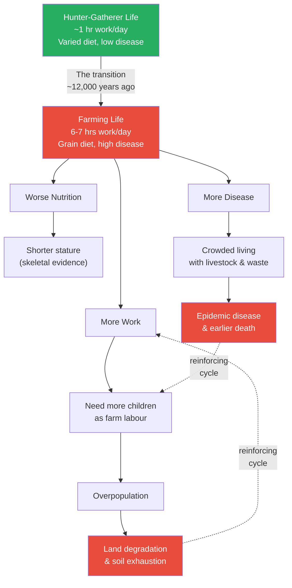
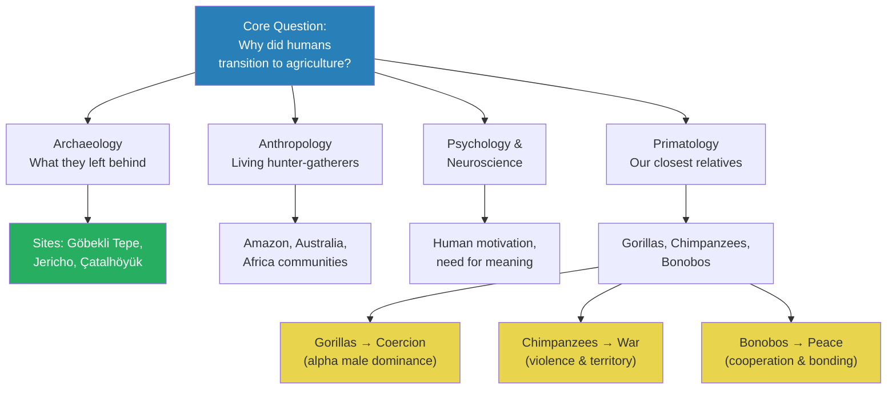
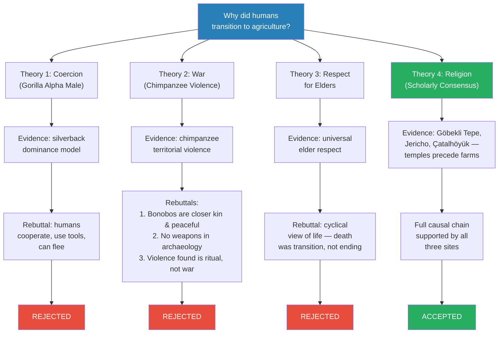
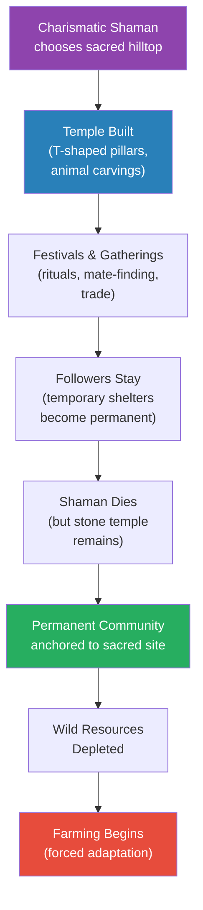
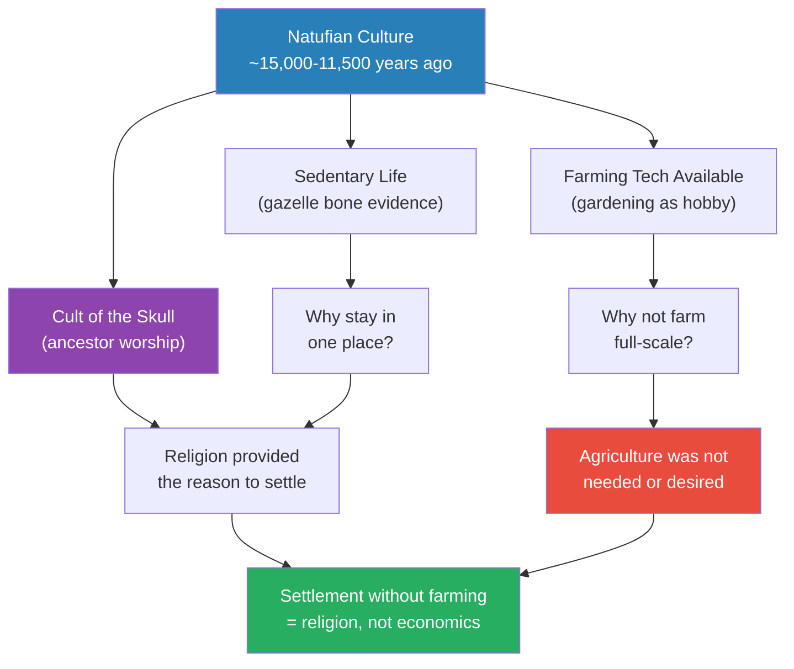
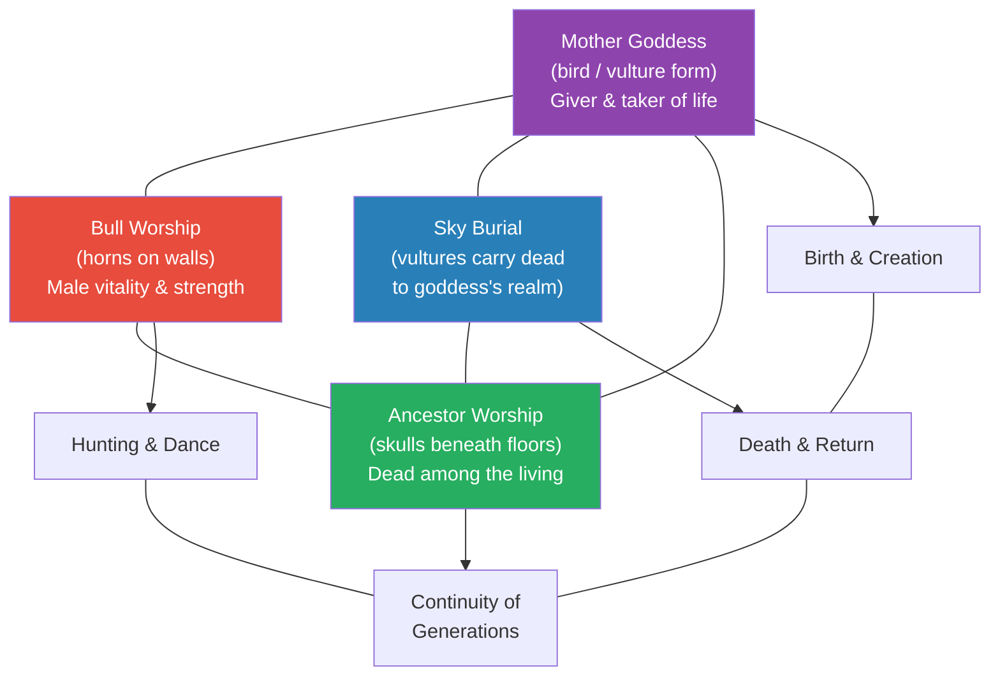
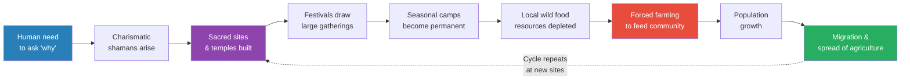

# Explaining Humanity's Transition to Agriculture

> Prof. Jiang opens the Civilization series with a deceptively simple question: why did humans switch from hunting and gathering to farming? The traditional story — agriculture enabled surplus, which enabled civilisation — turns out to have no evidence. In fact, farming made us shorter, sicker, and harder-working. After evaluating four competing theories using evidence from archaeology, anthropology, psychology, and primatology, Prof. Jiang arrives at the scholarly consensus: religion, not material advantage, drove humanity to settle down. Three archaeological sites — Göbekli Tepe, Jericho, and Çatalhöyük — provide the evidence.

---

## Overview: Key Highlights

- <b style="color: #27ae60">Religion drove the transition to agriculture</b> — the scholarly consensus is that humans settled for spiritual reasons, not material ones
- <b style="color: #e74c3c">Farming made life objectively worse</b> — more work, worse nutrition, more disease, and earlier death compared to hunter-gatherers
- <b style="color: #2980b9">Paradigm</b> — the traditional story (agriculture → surplus → civilisation) has no evidence and is demolished in this lecture
- <b style="color: #27ae60">"We did not domesticate wheat — wheat domesticated us"</b> — Harari's inversion captures the paradox of the agricultural revolution
- <b style="color: #2980b9">Charismatic shamans</b> — visionary religious leaders who attracted followers and built the first permanent communities
- <b style="color: #e74c3c">Coercion, war, and elder care all fail</b> — three competing theories are tested against evidence and rejected
- <b style="color: #2980b9">Göbekli Tepe (9500 BC)</b> — the temple is older than the houses, proving religion preceded settlement
- <b style="color: #27ae60">The Natufians had farming technology and chose not to use it</b> — religion, not economics, held Jericho together
- <b style="color: #2980b9">Cult of the skull</b> — ancestor worship through plastered skulls, a method of communicating with the spirit world
- <b style="color: #2980b9">Çatalhöyük's mother goddess system</b> — a comprehensive religion covering birth, death, gender, nature, and the cosmos
- <b style="color: #27ae60">Ancient intelligence equals modern intelligence</b> — their religion was their science, no less sophisticated than ours
- <b style="color: #e74c3c">The entire traditional narrative runs backward</b> — the real chain is religion → settlement → resource depletion → forced agriculture

| Concept | One-line summary |
|---------|-----------------|
| **Paradigm** | A story or model for understanding the world — the traditional one about agriculture is wrong |
| **Domestication (inverted)** | Wheat domesticated us, not the other way around — farming enslaved humans |
| **Surplus** | Producing more food than needed — the traditional (but debunked) explanation for civilisation |
| **Sedentary** | Staying in one place — achieved before farming, not because of it |
| **Charismatic leaders / Shamans** | Individuals with religious visions who attract followers and build communities |
| **Cult of the skull** | Ancestor worship through preserved skulls — communicating with the spirit world |
| **Sky burial** | Exposing dead bodies for vultures — tribute to the mother goddess at Çatalhöyük |
| **Cosmological alignment** | Temples designed to interact with celestial events — ancient "science" as religion |
| **Mother goddess** | The giver of life at Çatalhöyük, represented by birds and vultures — the sky belongs to them |
| **Natufian culture** | Hunter-gatherers who settled 13,000–15,000 years ago in the Levant — had farming tech, chose not to use it |
| **Cyclical view of life** | Born → die → reborn — death was a transition, not an ending, which undermines the elder-care theory |

---

# The Lecture

## The Traditional Paradigm — and Its Destruction [0:00–9:00]

*Prof. Jiang opens the very first lecture of the Civilization series by presenting the textbook story everyone already believes — agriculture enabled surplus, which enabled specialisation, which enabled civilisation — and then systematically destroys it with three categories of evidence showing that farming made life measurably worse.*

> [!tip] Core Insight
> The transition to agriculture was not progress. On every measurable dimension — work hours, nutrition, height, disease, lifespan — hunter-gatherers had it better. Something extraordinarily powerful must have driven people to accept this terrible bargain.

*The triple penalty of farming — more work, worse nutrition, more disease — created reinforcing feedback loops that trapped communities once they committed. The green node is the hunter-gatherer baseline; everything below it is deterioration.*

> [!note]- Expand: Full Lecture Detail
> Prof. Jiang opens by telling the class he wants to ask a question — and the question is deceptively simple: why did humanity transition from hunter-gatherer society to agriculture? He introduces the first vocabulary word of the series: <b style="color: #2980b9">paradigm</b> — "a very sophisticated English word, and all it means is story or model or understanding." A paradigm is the story a society tells itself about how the world works, and the very first paradigm to fall in this course will be the one about agriculture.
>
> He walks the class through the traditional story step by step, almost casually. Hunter-gatherers lived in groups of twenty to fifty, roaming the land. Then there was a revolution: farming. Farming provided a stable food source we could control — the word is <b style="color: #2980b9">domestication</b>. Farming created <b style="color: #2980b9">surplus</b> — more food than needed — which freed people to specialise. Leaders emerged (politics). Priests emerged (religion). Artists emerged (the arts). Villages grew into cities. Literature, science, and technology followed. Modernity arrived.
>
> He pauses. "Unfortunately, there's no evidence for this." He says it flatly, letting the silence land. The more evidence scholars collect, the more it points in the opposite direction. Switching to farming, he tells them, was "actually pretty stupid."
>
> He proceeds to demolish the paradigm with three blows:
>
> **Problem 1 — More work:** Prof. Jiang delivers the number with relish: a hunter-gatherer worked roughly one hour a day. Food was everywhere — fruit on trees, game in meadows, nuts and roots in forests. A farmer worked six to seven hours a day, every day, in backbreaking labour. He invokes Yuval Harari's famous line from *Sapiens*: <b style="color: #e74c3c">"We did not domesticate wheat. Wheat domesticated us."</b> Out in nature, wheat has to compete for survival. On a farm, it just sits there while humans clear the land, remove weeds, water it, and harvest it. Agriculture was a great deal for wheat and a catastrophic deal for humans. Worse, farming creates a vicious cycle: more work requires more children as labourers, more children require more food, more food requires more land, more land degrades the soil, and the treadmill accelerates.
>
> > [!example] The Wheat Reversal — Harari's Thought Experiment
> > - Imagine you are a wild wheat plant 15,000 years ago in the Middle East
> > - You compete fiercely with other grasses for sunlight, water, and soil
> > - You rely on animals eating your seeds and depositing them elsewhere to reproduce
> > - Now a species of large-brained primates starts clearing land just for you
> > - They remove every competing plant, till the soil, and plant you in neat rows
> > - They water you during droughts, protect you from pests, and pull weeds
> > - Your only job is to grow — everything else is handled by your servants
> > - You have gone from a struggling wild grass to the most successful plant on Earth
> > - Meanwhile, your "masters" are working seven hours a day, getting shorter, sicker, and dying younger
> > **The lesson:** What looks like human mastery over nature may be nature's mastery over humans. The species that "won" the agricultural revolution was wheat, not *Homo sapiens*.
>
> **Problem 2 — Worse nutrition:** Prof. Jiang turns to the skeletal evidence. When bioarchaeologists compare hunter-gatherer and farmer skeletons, the hunter-gatherers are significantly taller. The reason: dietary diversity. A hunter-gatherer ate meat, fruits, nuts, roots, and dozens of seasonal plants. A farmer ate mainly wheat and some vegetables — calorically dense but nutritionally narrow. Human bodies evolved over hundreds of thousands of years for variety. Farming replaced variety with monotony, and height collapsed as a result.
>
> **Problem 3 — More disease and earlier death:** Dense, permanent settlements with livestock, waste, and poor sanitation created ideal conditions for epidemic disease. Hunter-gatherers lived in small, mobile groups — natural disease containment. Farmers lived crammed together with pigs, cattle, and accumulated waste. Many great epidemic diseases — measles, smallpox, influenza, tuberculosis — originated in domesticated animals and jumped to humans only after farming brought the two species into constant contact.
>
> Prof. Jiang pauses to let the picture crystallise:
>
> | Dimension | Hunter-Gatherer | Farmer |
> |-----------|----------------|--------|
> | **Daily work** | ~1 hour foraging | 6-7 hours of labour |
> | **Diet** | Varied: meat, fish, fruits, nuts, roots | Narrow: wheat, barley, limited vegetables |
> | **Height** | Taller (skeletal evidence) | Significantly shorter |
> | **Disease** | Low — small, mobile groups | High — crowded, sedentary, with livestock |
> | **Lifespan** | Longer on average | Shorter on average |
> | **Freedom** | Mobile, autonomous | Tied to land, dependent on harvest |
>
> The question is now urgent: if farming was worse in every measurable way, what force was powerful enough to make people adopt it — and not just once, but independently across every continent?

---

## Four Disciplines of Evidence [9:00–10:00]

*Prof. Jiang pauses the argument to explain how scholars investigate a 12,000-year-old mystery without written records. He introduces four fields of evidence — archaeology, anthropology, psychology, and primatology — and three primate species that will map onto his theories.*

*No single discipline owns the answer. Prof. Jiang's method — triangulating across four independent fields — is itself one of the lecture's most important lessons.*

> [!note]- Expand: Full Lecture Detail
> Prof. Jiang transitions from the mystery to the method. He tells the class that since we cannot go back in time and ask why, we can collect evidence from four disciplines and construct theories.
>
> He introduces them one by one:
>
> - <b style="color: #2980b9">Archaeology</b> — "the study of the past." You dig things up — houses, skeletons, clothing, tools — and figure out what happened. The three sites they will examine today are Göbekli Tepe, Jericho, and Çatalhöyük. These are places where scholars have recovered physical evidence of how people actually lived.
>   - A skeleton's height reveals childhood nutrition
>   - A seed's species reveals what they ate and whether they cultivated it
>   - A temple's orientation reveals what they believed about the cosmos
>   - The absence of weapons is as revealing as their presence
>
> - <b style="color: #2980b9">Anthropology</b> — "the study of other cultures." There are still people living as hunter-gatherers today — in the Amazon, in Australia, in Africa. By studying them, scholars can understand how hunter-gatherer societies function: how they make decisions, treat elders, handle conflict, and practise religion. The caveat: modern hunter-gatherers are not frozen relics, but convergent patterns across independent cultures reveal deep human instincts.
>
> - <b style="color: #2980b9">Psychology and neuroscience</b> — how the brain works, what motivates us, why we behave as we do. This discipline addresses the "why" behind the "what" — why humans seek meaning, why we form communities, why some individuals become charismatic leaders.
>
> - <b style="color: #2980b9">Primatology</b> — the study of primates. "We're monkeys," Prof. Jiang says bluntly. "99% of our DNA are monkey DNA." Three species matter: gorillas (alpha male dominance), chimpanzees (territorial violence), and bonobos (peaceful cooperation). Chimpanzees and bonobos are the closest to us genetically, and their contrasting behaviours will prove crucial in the theory evaluation.
>
> The message beneath the content: when the question is big enough and old enough, no single discipline owns the answer. You need all four, working together, checking each other.

---

## Four Theories Tested [10:00–18:00]

*Prof. Jiang presents four competing theories for why humans abandoned hunting and gathering — coercion, war, respect for elders, and religion — and evaluates each against the evidence. Three fall. One survives.*

*Three theories turn red; one turns green. Prof. Jiang's method is not to assert his preferred theory but to test all four with equal rigour and let three fail under the weight of evidence.*

> [!note]- Expand: Full Lecture Detail
> Prof. Jiang moves from method to suspects. He reminds the class: "What's really important to understand is we don't know what happened. We can only guess about what happened." Then he introduces the four theories.
>
> ### Theory 1: Coercion — The Gorilla Alpha Male
>
> - **The claim:** An elite group of people forced everyone else to work and farm for them
> - **The evidence for:** Gorillas do this. The alpha silverback male is huge — much bigger than everyone else — and controls all the food and all the females. He sits and naps all day while everyone else works.
> - **Prof. Jiang's rebuttal:** He runs a vivid thought experiment. Imagine a nine-foot giant walks into this classroom and demands: "I'm now your boss. You have to grow food for me. You have to give me all your women." What would the class do? "Beat the crap out of him," the students answer, laughing.
>   - Humans have big brains that enable cooperation
>   - The class could make weapons, set traps, poison his food
>   - Twenty cooperating humans can overwhelm any single individual
>   - Worst case: just run away — nomadic humans had no fixed property to defend
> - <b style="color: #e74c3c">Coercion among humans is very, very hard to do</b> — the gorilla model requires extreme physical size differences that do not exist in our species
> - **Verdict:** Rejected
>
> > [!example] The Classroom Rebellion — Prof. Jiang's Thought Experiment
> > - A nine-foot giant walks into the classroom and towers over every student
> > - He is far stronger than any individual — no one-on-one challenge is possible
> > - The giant demands: farm for me, hand over your food, give me your women
> > - Prof. Jiang asks: "What would you do?"
> > - The students answer immediately: "Beat the crap out of him"
> > - Someone could fashion a weapon, someone could poison his food while he sleeps
> > - Someone could dig a pit and lure him into it
> > - Even without weapons: twenty humans rushing one giant simultaneously will overwhelm him
> > - The simplest option: just run away
> > **The lesson:** No single individual, no matter how large, can coerce an entire group of cooperating, intelligent humans.
>
> ### Theory 2: War — The Chimpanzee Model
>
> - **The claim:** Farming settlements provide defensive advantages — walls, fortifications, stored food behind defences
> - **The evidence for:** Chimpanzees are naturally violent and territorial. They form raiding parties, patrol borders, and kill rivals. If our closest relatives are warlike, perhaps we are too.
> - **Prof. Jiang's three rebuttals:**
>   - <b style="color: #27ae60">Bonobos are actually closer to us genetically than chimpanzees — and they are peaceful</b>. They don't fight. They cooperate. If we cite primate behaviour, we cannot cherry-pick the violent species and ignore the peaceful one.
>   - Archaeology finds no weapons from early humans. No spearheads designed for human combat, no shields, no mass graves bearing marks of violence.
>   - The violence that does appear in the archaeological record is intra-group — human sacrifice, ritual burials — not inter-group warfare. The skull cult at Jericho involved careful ancestor worship, not battlefield trophy-taking.
> - Prof. Jiang leaves the door ajar: "It's possible that in the future, we'll find evidence" — but right now, in archaeology and anthropology, there is none.
> - **Verdict:** Rejected
>
> ### Theory 3: Respect for Elders
>
> - **The claim:** Settling down allowed care for elderly who could not survive nomadic life
> - **The evidence for:** Anthropology shows every culture respects its elders — it appears to be a universal human instinct
> - **Prof. Jiang's rebuttal:** He draws on what scholars understand about pre-agricultural views of death. Early humans held a <b style="color: #2980b9">cyclical view of life</b>: "You're born, you die, then you're reborn, then you die again." The seasons cycle — summer to fall to winter to spring — and human life cycles the same way.
>   - Death was not feared as an ending but understood as a transition to the spirit world or rebirth
>   - An old person might welcome death rather than resist it
>   - Without the terror of death-as-ending, the motivation to revolutionise an entire way of life simply to extend elderly lives evaporates
> - **Verdict:** Rejected
>
> ### Theory 4: Religion — The Scholarly Consensus
>
> - **The claim:** Humans settled to practise religion communally
> - Prof. Jiang tells the class: "There's evidence and arguments for all four theories, and there are scholars who argue for different theories. But the consensus — what most people agree on today, most scholars, not every scholar, but most scholars — is religion."
> - He does not fully develop the religion theory here — instead, he says "let me explain why we think the answer has to be religion slowly" and transitions to the three archaeological sites that provide the evidence
> - <b style="color: #27ae60">All three sites show religious structures predating or co-existing with the earliest settlements</b>
> - **Verdict:** Accepted — the rest of the lecture will build the case

---

## Göbekli Tepe — The Temple Before the Town [18:00–31:00]

*Prof. Jiang takes the class to a hilltop in central Turkey where enormous carved pillars, erected by hunter-gatherers around 9500 BC, prove that religion preceded agriculture. He reconstructs how charismatic shamans attracted followers, built sacred sites, and inadvertently created the first permanent settlements.*

> [!tip] Core Insight
> The temple is older than the houses. People built a monument to their gods before they built homes for themselves. The traditional narrative — people settled, then built temples — is exactly backward.

*From shaman's vision to forced farming — every step connected by evidence, not speculation. The purple node is the human catalyst; the red node at bottom is the unintended consequence.*

> [!note]- Expand: Full Lecture Detail
> Prof. Jiang shows the class a picture of Göbekli Tepe and sets the scene. This site in central Turkey dates to about 9500 BC — over 11,000 years old. It was discovered only in the past few decades, and only about 5% has been excavated. "We're only starting to understand these places."
>
> He describes what has been found: enormous <b style="color: #2980b9">T-shaped pillars</b>, far taller than a person, arranged in precise circles. The T-shapes represent stylised human figures — the horizontal top is the head, the vertical shaft is the body. Within and around these pillars are elaborate animal carvings. The site was a place of religious worship, led by people Prof. Jiang calls <b style="color: #2980b9">shamans</b> — "religious leaders that help us bridge our world with the animal world and the spirit world."
>
> He then reconstructs the probable sequence at Göbekli Tepe:
>
> - Hunter-gatherers came periodically to practise religion — "we have a yearning, or we have a need, to understand why, and religion solves this problem for us"
> - These gatherings also served as opportunities for mate-finding — "a great time to feast and to meet someone you can marry and have children with"
> - The leaders were <b style="color: #2980b9">charismatic leaders</b> — "people like Mao Zedong, Barack Obama, Bill Clinton — people who, for their reason, people just love them and want to follow them"
> - These leaders "became like celebrities," drawing people from far away
> - Some followers chose to stay and build houses near the leader
> - When the leader died, the site became a permanent temple — worship continued in death
>
> The single most important discovery: <b style="color: #27ae60">the religious site is the oldest structure, but houses were built later</b>. The temple came first. Settlement followed.
>
> **The animal carvings:** Prof. Jiang shows pictures of animals carved in motion — a fox in mid-leap, captured in the act of hunting. He asks the class why. His answer reveals the worldview of the builders:
>
> - "Back then, we human beings did not see us as separate from the other world. Animals, trees, humans — all equal."
> - **Purpose 1 — Propitiation:** Before killing an animal, you must ask forgiveness. "Otherwise, their spirit, their soul, will haunt you. They'll take revenge on you."
> - **Purpose 2 — Invocation:** Channelling the animal's hunting energy and wisdom. "They're the best hunters in the world. Before we go on a hunting trip, we might have a ceremony to channel their energy and power and wisdom."
> - **Purpose 3 — Friendship:** Maintaining a respectful relationship with predators. "We want to be friends with the lion. We don't be enemies. So it's a sign of respect."
>
> > [!example] Göbekli Tepe — Key Evidence
> > - Located in central Turkey, dated to approximately 9500 BC — older than agriculture in the region
> > - Only ~5% excavated; 95% of the site remains underground
> > - T-shaped pillars (some over 10 tonnes) represent stylised human figures
> > - Animal carvings depict creatures in motion and power, not as prey
> > - Three purposes of carvings: propitiation (asking forgiveness), invocation (channelling power), friendship (maintaining respect)
> > - Underlying worldview: animals, trees, humans are all equal participants in the spirit world
> > - The temple complex is older than surrounding domestic structures — religion before settlement
> > - Cosmological alignment with celestial events ("like a clock" for connecting to the outer world)
> > - Construction required enormous coordinated labour — no metal tools, no wheels, no draft animals
> > - Charismatic shamans attracted followers like "celebrities," drawing people from distant bands
> > **The lesson:** The temple came before the town, the shaman before the farmer, the sacred before the domestic. Göbekli Tepe is proof, carved in stone, that meaning preceded economics.
>
> **Student Q&A — Cosmological alignment:** A student asks why the temple is structured the way it is. Prof. Jiang explains it has <b style="color: #2980b9">cosmological significance</b> — "on a certain time of the year, the sun will hit this place in a certain way, so it's almost like a clock." But the intention was not timekeeping: "Their intention was to connect with the outer world." He insists on their sophistication: "They knew a lot about the way the stars worked. Basically, for them, this is science. We today, we say this is a religion, but their science back then is no different from our science today."
>
> **Student Q&A — Where does religion come from?** Prof. Jiang addresses this directly: "Even though we all have the need for religion, we don't all have the ability to produce religion." These charismatic leaders are people who have visions or dreams of God or the spirit world. "Think of Jesus, think of Mohammed, think of Buddha, think of Confucius." Some use psychedelics; others fast or meditate to achieve altered states. "From their perspective, they actually saw this thing, even though we don't think it actually happened. For them, it's true."
>
> **Student Q&A — Did shamans really see God?** Prof. Jiang does not reduce this to a simple real/fake dichotomy. He notes that psychedelics, prolonged fasting, and extended meditation all reliably produce altered states of consciousness — vivid hallucinations, a feeling of contact with non-human intelligences. "If you talk to any religious people, they saw it. They talked to God." Whether this constitutes "real" contact with a supernatural realm is beyond science — but the functional reality of the vision matters more than the metaphysical question. The experience was real enough to move ten-tonne stones.

---

## Jericho and the Natufian Culture [31:00–39:00]

*Prof. Jiang moves to the Levant, where the Natufians — sedentary hunter-gatherers from 13,000–15,000 years ago — had farming technology and chose not to use it. Their cult of the skull and the cosmological Tower of Jericho reveal a community held together by religion, not economics.*

*The Natufians are the control experiment: all conditions for agriculture existed, but religion — not economics — determined how they lived.*

> [!note]- Expand: Full Lecture Detail
> Prof. Jiang shows pictures of Jericho and introduces the <b style="color: #2980b9">Natufian culture</b>. They appeared about 13,000 to 15,000 years ago in the Levant — modern-day Israel, Syria, the broader Middle East. He identifies three things that made them special:
>
> **1. They were sedentary but not farmers.** Prof. Jiang introduces the word <b style="color: #2980b9">sedentary</b> — "they basically stayed in one place." The evidence is precise and elegant: archaeologists studied gazelle bones found at Natufian sites. "The thing about gazelles is their teeth colour is different according to the season — in the summer and in the winter, because they eat different foods." By analysing the teeth, scholars confirmed the Natufians hunted gazelle at the same location in both seasons. They were not migrating. They were staying put.
>
> **2. They had farming technology and chose not to use it.** Archaeologists dug up seeds of domesticated crops — wheat, barley, vegetables — proving the Natufians had the knowledge and capacity to farm. "But they chose not to farm." Prof. Jiang explains that they developed the technology as a hobby: "Some of them, for fun, for pleasure, had their own garden, and that's how they developed the technology." <b style="color: #e74c3c">Farming was available and they said no</b> — one of the strongest pieces of evidence against the idea that agriculture was adopted because it was obviously better.
>
> **3. The cult of the skull.** The Natufians worshipped ancestors. "They basically took someone's head skull and put clay on it to protect it, and they put it in their houses to worship it." This is the beginning of ancestor worship — preserving the dead to maintain a connection between the living world and the spirit world. Prof. Jiang frames it as epistemology: "Having a skull around allows you to communicate with that world and learn its secrets."
>
> > [!example] The Tower of Jericho — From Military to Cosmological
> > - When scholars first discovered the tower, they assumed it was a military fortification
> > - Walls and a watchtower — classic defensive architecture to see enemies coming
> > - Further research revealed the truth: the tower has cosmological, not military, significance
> > - On the longest day of the year, the nearby mountain casts a shadow through the tower
> > - The shadow covers the entire village in darkness
> > - "When you cover your village in darkness, you feel as though you are in connection with the sky"
> > - Darkness = collapsing the distance between space and the village
> > - Making the village dark was "magic" — proof that the charismatic leader spoke to God
> > - "Only by performing magic can you show that this charismatic leader speaks to God"
> > **The lesson:** The Tower of Jericho was not built to repel invaders. It was built to frame a moment of cosmic significance — a stage for shamanic performance demonstrating supernatural authority.
>
> Prof. Jiang shows pictures of plastered skulls and explains: the ancestor is in the spirit world, "and therefore having a skull around allows you to communicate with that world and learn its secrets." Some of those secrets might be practical — "like how to construct the tower in a way that you're able to cast a shadow over the village." He insists: "their method of scientific discovery" was communicating with ancestors. And he draws the analogy that will echo through the series: <b style="color: #27ae60">"Their level of intelligence, or their understanding of the world, is just as sophisticated as ours."</b> We think our science is facts and knowledge. "But guess what? Maybe 1,000 years from now, people will look at our science and be like, oh, that was religion too."

---

## Çatalhöyük — The First Religious Community [39:00–48:00]

*Prof. Jiang arrives at the largest and most complex site — a settlement of 8,000 people in Turkey around 7500 BC where every house was a temple, the mother goddess ruled through vultures, bulls represented male vitality, and the dead were buried beneath bedroom floors. Religion did not merely accompany daily life — it was daily life.*

*Çatalhöyük's four religious elements form a closed system with no gaps — birth, death, gender, nature, and the cosmos all explained. The system's completeness is what made the community stable for 2,000 years.*

> [!note]- Expand: Full Lecture Detail
> Prof. Jiang shows a picture of the site and gives the key facts: <b style="color: #2980b9">Çatalhöyük</b> is in Turkey, dates to about 7500 BC, existed for about 2,000 years, and at its peak housed around 8,000 people. "That's a lot of people, guys."
>
> He identifies what makes Çatalhöyük distinctive:
>
> - **It was huge** — one of the largest Neolithic settlements known
> - **Radically egalitarian** — "They didn't have a place of worship or government. All the houses were the same. It was a very egalitarian society. Everyone was the same."
> - **Every house was a temple** — "If you go to every house, the living room is basically a temple unto itself. It was a place of worship and religion." <b style="color: #27ae60">Religion permeated every place, from birth to death.</b>
> - **One of the first true religious communities** — "Before, religious sites were places you went to maybe once in your lifetime or once a year. But in Çatalhöyük, religion was in your life from birth to death."
> - **Their religion was "extremely comprehensive"** — "They can explain everything using their religion. Their everyday life and the religion was completely aligned together."
>
> Prof. Jiang then walks through the elements of the religious system, using paintings and artefacts found in houses:
>
> **The Mother Goddess:** "They worshipped a mother goddess, because the mother goddess is what gives life to everything. Think of Mother Nature." The goddess is represented by birds — "the bird flies all around the sky, the sky belongs to the bird." The bird can take different forms, including the vulture. Some scholars say she is merely a fertility goddess; others believe she is the comprehensive <b style="color: #2980b9">mother goddess</b>. Prof. Jiang notes: "If you are a place like Çatalhöyük, you're most concerned about giving birth, because giving birth is what rejuvenates your society."
>
> **Bull Worship:** "If the mother goddess represents life, giving life, the bull represents vitality, energy." <b style="color: #2980b9">Bull and mother goddess = male and female = life.</b> Many houses contain depictions and mounted horns of bulls. "Only the male and the female can join — they come together — will you have life."
>
> **Sky Burial:** Prof. Jiang explains the vulture painting found in many houses — headless human figures surrounded by vultures. "When a person dies, they'll put that person's dead body out in the open. It's a sky burial. The vultures will come and eat all the flesh, and that is the tribute, or the sacrifice, made to the mother goddess." The goddess's birds carry the dead back to her realm. Then: "You take the bones, you bury it back in your house, and you take the skull, and you keep the skull in your living room to worship your ancestors."
>
> **The Hunting Dance:** A second painting shows humans and animals moving together. Some scholars believe it shows humans "mocking or taunting" animals to domesticate them. Prof. Jiang favours the alternative: "What they're really doing is dancing because they are worshipping or paying tribute to these animals they're about to kill." This connects back to Göbekli Tepe — "they're trying to respect the animals. Dance with you. We're friends. I'm sorry I have to kill you, but we're only taking your meat — your soul is still going to be reborn or go to the spirit world." It is about maintaining <b style="color: #27ae60">the harmony of nature and their relationship with nature</b>.
>
> > [!example] Çatalhöyük — A Civilisation Built on Faith
> > - Located in southern Turkey, ~7500 BC, population ~8,000 at peak
> > - Endured for approximately 2,000 years — extraordinary stability
> > - Radically egalitarian: no central temple, no palace, no ruling class, all houses identical
> > - Every house was a temple — religion permeated every aspect of daily life
> > - Mother Goddess in bird/vulture form: giver and taker of life, ruler of the sky
> > - Bull worship: horns mounted on interior walls as symbols of male vitality
> > - Sky burial: bodies exposed for vultures, returning the dead to the goddess
> > - Ancestor worship: skulls buried beneath sleeping platforms — the dead literally underfoot
> > - Hunting paintings show dancing with animals, not killing them — tribute before the hunt
> > - No evidence of warfare, weapons manufacture, or class hierarchy for the site's duration
> > **The lesson:** Eight thousand people, organised without government, held together for two millennia by a shared faith so comprehensive that it needed no temple — because every home was already one.

---

## The Synthesis — How Religion Became Agriculture [48:00–51:00]

*Prof. Jiang pulls the threads together into a single causal chain: religion drew people together, settlement depleted wild resources, depletion forced farming, farming drove population growth, and population growth forced migration — carrying religion with it. The process took thousands of years.*

> [!tip] Core Insight
> The traditional narrative says: agriculture → surplus → settlement → religion. The evidence reverses every arrow: religion → settlement → resource depletion → agriculture. The temple came before the farm. The shaman came before the farmer. Meaning came before bread.

*The full causal chain — from a feature of the human brain (the compulsion to ask "why") to the global spread of agriculture. The dotted arrow shows why the pattern repeated independently across the world: each new settlement carried religion with it, founding the cycle anew.*

> [!note]- Expand: Full Lecture Detail
> Prof. Jiang returns to the original question and lays out the complete theory:
>
> - Humans have a religious need — a compulsion to understand "why" that is wired into the brain
> - This need drew people together to have religious festivals, led by charismatic shamans
> - Some shamans were "so brilliant that people chose to settle down with them"
> - The community became sedentary and "developed a religion around the centre of lifestyle, which included ancestor worship"
> - "But over time, because you're in one place, you're going to deplete the resources of the area around you — the forest — which means that you must go to farming"
> - Population growth from farming eventually forced migration: "When you move somewhere else, you actually put your religion with you"
> - <b style="color: #27ae60">"There was no one spark or one moment when this happened. We think it took thousands of years."</b>
> - The hunter-gatherer lifestyle "was so much more attractive to people, so much easier and attractive" than farming
> - "But the benefit of the farming lifestyle is that you had a religion, and that's why people chose, ultimately, to farm"
>
> > [!abstract] Theory Evaluation — Summary
> >
> > | Theory | Evidence For | Evidence Against | Verdict |
> > |--------|-------------|-----------------|---------|
> > | **1. Coercion** | Gorilla alpha male model | Humans cooperate, use tools/traps, can flee; physical dominance alone cannot sustain control | Rejected |
> > | **2. War** | Chimpanzee territorial violence | Bonobos (closer kin) are peaceful; no weapons in archaeology; violence found is intra-group ritual | Rejected |
> > | **3. Elder Care** | Universal elder respect across cultures | Cyclical view of life: death was transition, not catastrophe; no urgency to extend life at all costs | Rejected |
> > | **4. Religion** | Göbekli Tepe temples predate agriculture; Jericho skull cult; Çatalhöyük mother-goddess worship | No strong counter-evidence; all three major sites support the theory | Accepted |
>
> Prof. Jiang closes by previewing Lecture 2: "Next class, we'll look at ice cave paintings that go back 40,000 years, meaning that they practised this sort of religion, or something like this religion, 40 to 50,000 years ago." He reminds the class that Göbekli Tepe, Jericho, and Çatalhöyük will recur throughout the semester: "These places are very famous. We'll be discussing these places throughout the semester."
>
> He ends with a note of intellectual humility: Göbekli Tepe is only 5% excavated. "Over the next few decades, we'll know more." The story of human origins is still being written, one shovelful at a time.

---

## Connections

**Builds on:** This is Lecture 1 — the foundational argument of the entire Civilization series. Every subsequent lecture rests on the claim established here: that religion, not material self-interest, is the primary engine of human civilisation. The paradigm inversion — religion → settlement → agriculture, rather than the reverse — becomes the interpretive lens through which Prof. Jiang examines every civilisation from Sumer to America.

**Sets up:** [[02 - Religion and the Dawn of Society]] pushes the question further back in time — if religion drove the transition starting ~12,000 years ago, where did religion itself come from? Prof. Jiang traces religious experience to ice cave paintings going back 40,000–50,000 years. [[03 - The Shamanic Mind and Altered States]] explores the neurological and psychological origins of shamanic vision in greater depth. Göbekli Tepe, Jericho, and Çatalhöyük will all be revisited in greater detail throughout the semester.

**Recurring themes established:**
- Religion as the engine of civilisation — the foundational thesis of this lecture and the series
- Charismatic leaders — individuals who shape history through vision and personal magnetism
- Debunking traditional narratives — Prof. Jiang's method: present the standard story, then show why it's wrong
- Theory evaluation method — present multiple theories, evaluate evidence, reach a verdict
- Humans and nature as equal — pre-agricultural worldview where animals, trees, humans are not hierarchically separated

**Related books in vault:**
- [[Sapiens - Yuval Noah Harari]] — directly cited; the "wheat domesticated us" argument. Prof. Jiang draws explicitly on Harari but pushes further by centring religion rather than cognitive or economic explanations. The Göbekli Tepe evidence takes the argument to a place Harari only gestures toward.
- [[Antifragile - Nassim Nicholas Taleb]] — the agricultural transition as a fragility trade-off: hunter-gatherers were antifragile (mobile, diverse, adaptable); farmers were fragile (fixed, monocultural, dependent on harvest). Not cited in the lecture but conceptually resonant.
