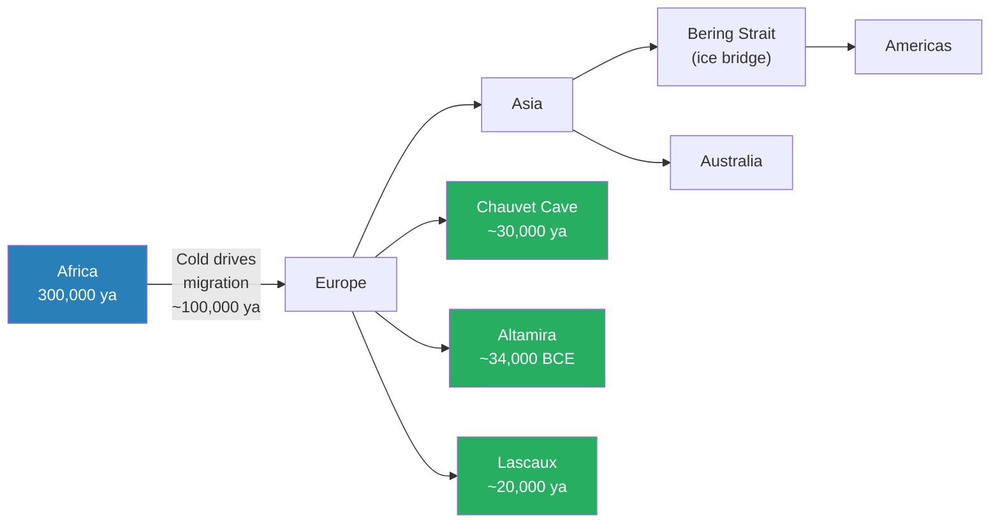
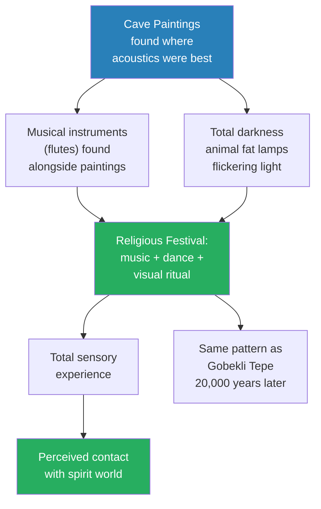
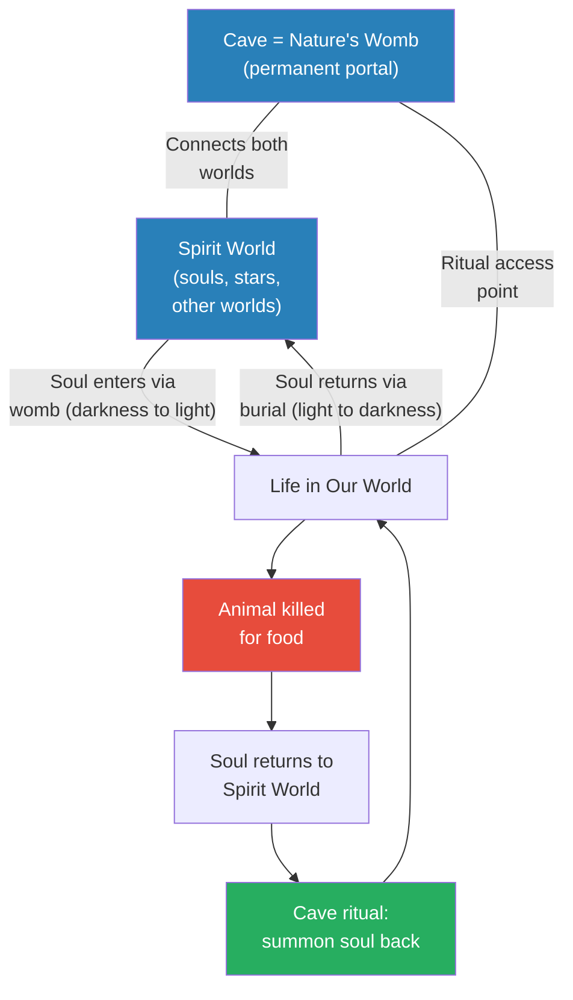
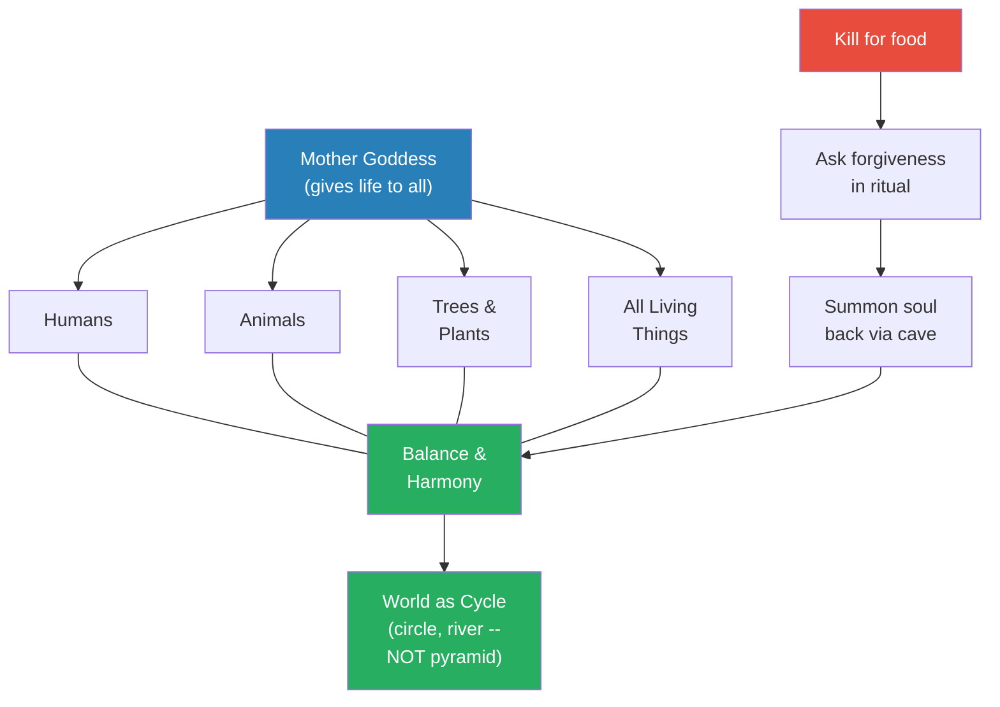
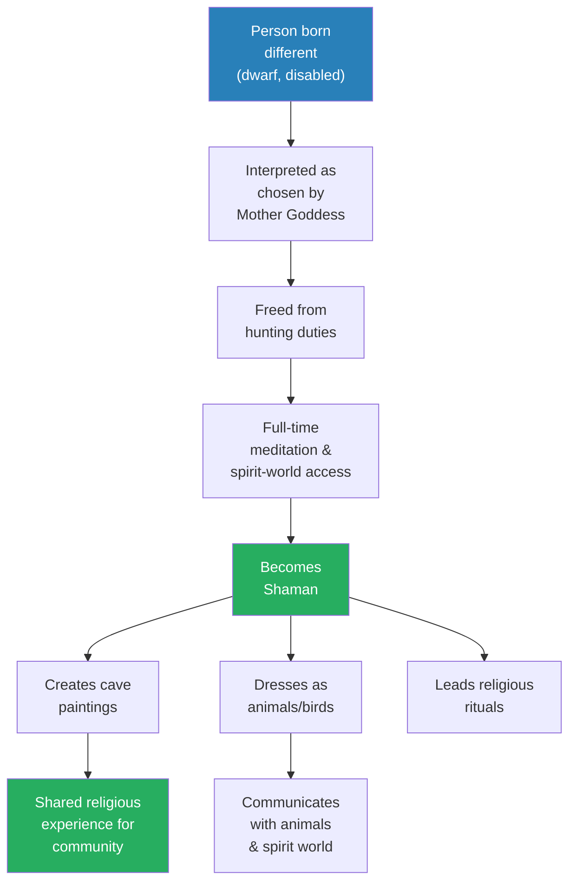
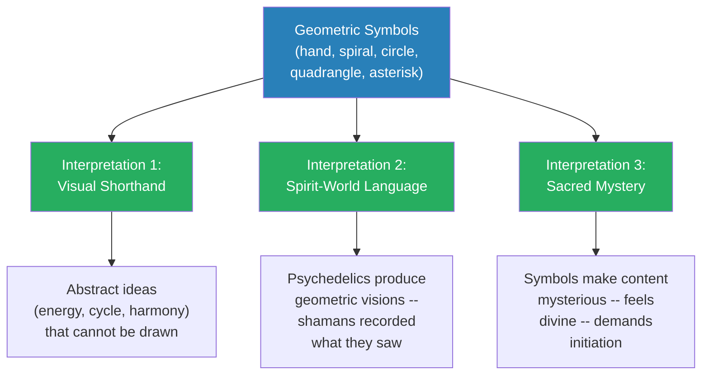
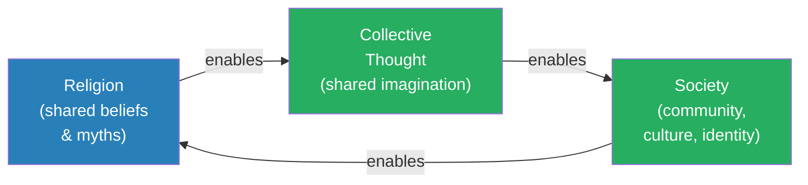
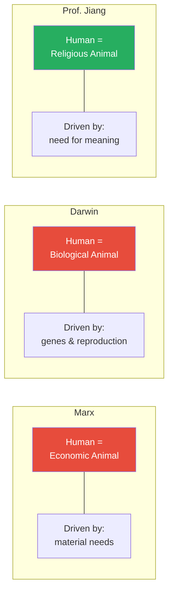

# Religion and the Dawn of Society

> Prof. Jiang pushes the argument from Lecture 1 deeper into the past. If religion drove the agricultural transition 12,000 years ago, has it always been there? Using Ice Age cave paintings dating back 30,000-40,000 years, he reconstructs humanity's first religion -- animism: the belief that every living thing has a soul and that nature is an interconnected whole governed by a Mother Goddess. He builds the theology interactively with his students, introduces Immanuel Kant's claim that reality is constructed by the mind, and closes with Emile Durkheim's devastating insight: religion IS society -- collective thought is impossible without shared belief, and shared belief is impossible without community. We are, first and foremost, religious animals.

---

## Overview: Key Highlights

- <b style="color: #27ae60">Religion has been with humanity since the dawn of consciousness</b> -- cave paintings dating back 30,000-40,000 years are evidence of religious belief, not art for art's sake
- <b style="color: #2980b9">Animism</b> -- probably the first religion: every living thing has a soul, all are interconnected through the Mother Goddess, and balance must be maintained through ritual
- <b style="color: #2980b9">The portal logic</b> -- the womb is a portal from the spirit world to ours; burial is the return portal; the cave is nature's permanent portal between worlds
- <b style="color: #27ae60">Cave paintings were found where acoustics were best</b> -- alongside flutes and musical instruments, proving they were part of religious rituals, not aesthetic displays
- <b style="color: #e74c3c">There is absolutely no agreement on any of these questions</b> -- Prof. Jiang models intellectual honesty: hold a theory passionately while acknowledging the evidence is incomplete
- <b style="color: #2980b9">Shamans</b> -- often physically different people (dwarfs, disabled) interpreted as chosen by the Mother Goddess to communicate with the spirit world
- <b style="color: #27ae60">Women were equal or superior to men</b> -- childbirth is the most sacred act, the supreme deity is female, and male dominance is a recent historical aberration
- <b style="color: #2980b9">Immanuel Kant's constructivism</b> -- reality is not passively perceived but actively imagined by the mind; neuroscience has confirmed this
- <b style="color: #2980b9">Emile Durkheim's sociology of religion</b> -- religion is "a system of ideas by which men imagine the Society of which they are members"; religion creates society and society creates religion
- <b style="color: #27ae60">We are religious animals, not economic or biological ones</b> -- the need for meaning is primary; Marx's economic animal and Darwin's biological animal are secondary, though all three interplay
- <b style="color: #2980b9">Cyclical worldview</b> -- early humans imagined the world as a river or circle, not a pyramid; hierarchy is a product of monotheism, which is a very recent innovation
- <b style="color: #e74c3c">Without religion, there could be no society; without society, there could be no religion</b> -- Durkheim's circular dependency is the lecture's philosophical capstone

| Concept | One-line summary |
|---------|-----------------|
| **Animism** | Probably the first religion -- every living thing has a soul; nature is interconnected and must remain balanced |
| **Mother Goddess** | The force that gives life to everything -- all living things are her children and therefore equal |
| **Cave as portal** | Caves resemble the womb -- portals between the spirit world and our world, used for religious ritual |
| **Shamans** | Often physically different people (dwarfs, disabled) chosen to communicate with the spirit world |
| **Portal logic** | Womb = entry from spirit world; burial = return to spirit world; cave = permanent access point |
| **Immanuel Kant's constructivism** | Reality is not passively perceived but actively imagined by the mind |
| **Emile Durkheim's sociology of religion** | Religion is collective thought -- it creates society, and society creates it |
| **Three views of human nature** | Marx: economic animal. Darwin: biological animal. Prof. Jiang: religious animal. All interplay. |
| **Cyclical worldview** | Early humanity imagined the world as a river or circle, not a pyramid -- no hierarchy among gods or creatures |
| **Gender equality in early society** | Women were equal or superior -- childbirth was sacred, the supreme deity was female |
| **Psychedelics** | Plants that alter brain structure -- shamans may have used them to access the spirit world and its symbolic language |
| **Symbols in cave paintings** | Recurring geometric marks worldwide -- may be visual shorthand, spirit-world language, or sacred mystery |

---

# The Lecture

## Review and the Big Claim [0:00 - 1:00]

*Prof. Jiang opens by reviewing Lecture 1's conclusion -- that religion drove the transition to agriculture -- and immediately raises the stakes. Today's argument is bigger: religion has ALWAYS been there. It is what makes us fundamentally human.*

> [!note]- Expand: Full Detail
> Prof. Jiang begins by recapping the three archaeological sites from Lecture 1 -- Gobekli Tepe, Jericho, and Catalhoyuk -- and the conclusion they supported: "What drove, what compelled the transition to agriculture was the religious beliefs of the people at that time."
>
> He then announces the lecture's central claim, and it is a significant escalation: "What I will show you today is that this religious impulse, this need for religion, this need to understand why we are here today and what we must be doing and where we're going -- it's always been there. In fact, religion is what makes us fundamentally human."
>
> - Lecture 1 established that religion drove agriculture (a 12,000-year-old event)
> - Lecture 2 will push the timeline back to 30,000-40,000 years ago
> - The evidence: Ice Age cave paintings found "all around the world"
> - The implications: religion is not a late cultural invention but a defining feature of what it means to be human
>
> This is a dramatic shift in scale. Lecture 1 made a historical argument -- religion preceded farming. Lecture 2 makes an anthropological one -- religion preceded everything. It is not something humans do. It is something humans are.

---

## The Ice Age and Human Migration [1:00 - 5:00]

*Prof. Jiang sets the scene for the cave paintings by plunging his students into the Ice Age -- a period spanning most of human existence. Roughly one million people scattered across a frozen planet, migrating out of Africa, encountering other human species, and surviving conditions of extraordinary harshness.*

*Humans migrated from Africa across the planet as the Ice Age worsened, leaving cave paintings in Europe that span roughly 14,000 years of continuous artistic and spiritual practice -- the oldest surviving evidence of religious belief.*

> [!note]- Expand: Full Detail
> Prof. Jiang wants the students to feel the weight of the Ice Age before any interpretation begins. The key facts he establishes:
>
> - Humans originated in Africa roughly 300,000 years ago
> - Around 100,000 years ago, extreme cold caused scarcity of resources, forcing migration outward
> - The route: Africa to Europe to Asia, then across the frozen Bering Strait to the Americas, and from Asia down to Australia
> - By 20,000 years ago, humans had colonised every continent -- but there were only about one million people worldwide
> - Along the way, humans encountered and interbred with other human species -- Neanderthals, Denisovans -- "until we became the dominant human species"
> - The Ice Age ended only about 12,000 years ago -- before that, the planet was fundamentally different
>
> The background is essential for what follows. For the overwhelming majority of our existence as a species, life was harsh, cold, and governed by forces no one could explain. The warmth and stability we take for granted is a recent anomaly. Understanding what humans believed during that vast stretch of cold and darkness is, Prof. Jiang will argue, the key to understanding what we are.

---

## Cave Paintings: How, Why, and What They Mean [5:00 - 9:00]

*Prof. Jiang introduces the Ice Age cave paintings -- Chauvet, Lascaux, Altamira -- and frames the investigation around three questions: how were they painted, why were they painted, and what do they represent? The key discovery: paintings were found where acoustics were best, alongside musical instruments. These were not galleries. They were ritual spaces.*

> [!tip] The Key Shift
> Cave paintings are not art. They are religion. The location (best acoustics), the instruments found alongside them (flutes), and the ritual context (periodic gatherings) all point to the same conclusion: the oldest surviving human creative works are evidence of the oldest surviving human belief system.

*The evidence from the caves points to a multi-sensory religious experience far richer than "looking at pictures." Acoustic optimisation, musical instruments, flickering lamplight, and the physical discomfort of the cave environment combined to create an immersive ritual designed to dissolve the boundary between the everyday world and the spirit world.*

> [!note]- Expand: Full Detail
> Prof. Jiang opens with a caveat he will repeat throughout -- modelling the intellectual honesty he wants his students to learn: "There is absolutely no agreement on any of these questions. The case that I will present to you today is my own personal interpretation based on my research and my understanding of the evidence."
>
> He then walks through the physical evidence:
>
> - **Chauvet Cave** (France, ~30,000 years ago): stunning depictions of bison and rhinoceros. Different people at different times painted different pictures -- a continuous process spanning millennia, not a single artistic session
> - **Lascaux Cave** (France, ~20,000 years ago): lions rendered with power and dynamism
> - **Altamira** (Spain, ~34,000 BCE): horses depicted imaginatively, not realistically -- "They're not looking for a realistic depiction of animals. They're trying to imagine the natural world in their own way"
> - Cave paintings have been found "all around the world" -- this is not a local European phenomenon but a global one
>
> **How they painted:**
> - Two colours only: red from ochre (clay) and black from charcoal
> - Total darkness inside the caves -- they used animal fat lamps that illuminated only small sections at a time
> - The flickering light would have made the painted animals seem to move, breathe, and run
>
> **A key observation about composition:** there is no focal hierarchy among the animals. Lions, horses, bison, and rhinos share the same wall space equally. "It's almost like nature is one interconnected picture." This will become crucial evidence when Prof. Jiang introduces animism -- the paintings have no hierarchy because the worldview had no hierarchy.
>
> > [!example] Picasso in the Cave
> > - Pablo Picasso, arguably the most famous artist of the twentieth century, was invited to view Ice Age cave paintings in person
> > - After emerging from the cave, he declared: "We learned nothing in 10,000 years"
> > - The artistic sophistication of Palaeolithic cave painters matched or exceeded anything the modern world had produced
> > - If our ancestors' artistic ability was equal to ours, their intellectual and spiritual sophistication was likely equal too
> > **The lesson:** These were not primitive minds producing primitive work. These were fully modern human beings, grappling with the same questions we grapple with -- and the cave was their cathedral.
>
> **Why they painted -- the critical clue:**
> - Paintings were not scattered randomly through the caves -- they were concentrated in the sections with the best acoustics
> - Musical instruments (flutes) were found alongside the paintings -- among the oldest manufactured objects ever discovered
> - The implication: these caves were not galleries but ritual spaces -- "performance venues" for sacred rather than entertaining purposes
> - The cave was the cathedral, the paintings were the icons, the flutes provided the hymns, and the acoustically optimised chamber was the nave
> - The parallels with Gobekli Tepe from Lecture 1 are striking -- both are spaces where nomadic people gathered for religious purposes long before farming
>
> Prof. Jiang's conclusion: "These paintings are not about art. It's really about religion. It's expressing the religious beliefs of the people at that time." If that is true, then religion is not 12,000 years old. It is at least 30,000-40,000 years old -- and possibly older.
>
> > [!example] The Evidence Chain: Cave Paintings as Religious Ritual
> > - **Location:** paintings consistently found in sections with the best acoustics -- optimised for sound, not viewing
> > - **Instruments:** bone flutes found alongside paintings -- among the oldest manufactured objects ever discovered
> > - **Darkness:** caves are totally dark; painters used animal fat lamps illuminating only a few square feet
> > - **Conditions:** caves are cold, wet, and oxygen-poor -- painting in them is physically arduous
> > - **Duration:** paintings at a single site span thousands of years -- a continuous tradition lasting longer than all of recorded history
> > - **Global distribution:** similar themes found on multiple continents, suggesting a universal human impulse
> > - **Composition:** no focal hierarchy -- all animals share wall space equally, as if nature is one interconnected whole
> > **The lesson:** No single piece of evidence proves cave paintings are religious. Taken together, however, the combination points overwhelmingly toward organised ritual -- religion, not art.

---

## Constructing Belief from First Principles [9:00 - 17:00]

*This is the intellectual centrepiece of the lecture. Prof. Jiang stops presenting evidence and starts asking students to think. He poses a deceptively simple challenge: imagine you are in the Ice Age with no modern knowledge. What fills you with awe? From their answers -- childbirth, stars, healing, nature -- he builds an entire theology step by step, culminating in the portal logic that explains why people painted in caves.*

*The portal logic of animism is built on a single spatial metaphor: darkness is the passage between worlds. Souls enter through the womb and leave through burial. Caves are nature's permanent portals. When an animal is killed, its soul must be summoned back through cave ritual to maintain the cycle of life.*

> [!note]- Expand: Full Detail
> Prof. Jiang uses the Socratic method at full power here. He does not tell the students what Ice Age humans believed -- he asks them to become Ice Age humans and discover the beliefs for themselves. "Let's imagine that we go back in time. It's very cold and our memories have been wiped out. We've lost science. We've lost what we learned in biology class. What are things that amaze us?"
>
> **The four sources of awe:**
>
> - **Childbirth:** "I'm a father. I have three kids, and I can tell you, when I first saw my child being born, I was amazed. You have this life come out of nothing." Without biology, childbirth is simply miraculous -- sacred, divine, inexplicable. This is why women were considered sacred: they could do the one thing that most clearly demonstrated divine power.
> - **The stars:** On a night with no light pollution, the sky is overwhelming -- "All stars glowing." Perhaps souls, perhaps other worlds. "The first thing that you recognise is that our world is just one of many worlds out there." The recognition that visible reality is not all there is -- behind our world lie other worlds.
> - **Healing:** Someone falls ill and then, inexplicably, recovers. The explanation: you have a body and a soul, and disease is the two falling out of alignment. Prof. Jiang draws a parallel to traditional Chinese medicine -- the same principle of body-soul harmony. This body-soul duality introduces the idea of an invisible dimension to reality.
> - **Nature itself:** the animals, the trees, the vastness of the natural world. An interconnected whole that seems to speak of design, intention, intelligence.
>
> **Building the portal logic:**
>
> From these four sources of awe, Prof. Jiang guides the students to construct a complete theology:
>
> - **Step 1 -- The womb as portal:** A new life emerges from darkness into light. The womb is a doorway through which a soul travels from the spirit world into ours. "What is the womb?" A student answers: "A portal. A door." Exactly.
> - **Step 2 -- Burial as return portal:** If the womb brings souls from the spirit world into our world (darkness to light), then burial returns them (light to darkness). "The soul comes into our world from the mother's womb, from darkness, and then for us to return the soul back into the original world, we bury this person in darkness." Birth and death are mirror images -- two doors in the same corridor.
> - **Step 3 -- The cave as nature's womb:** What in nature most resembles a mother's womb? A cave -- a dark tunnel leading into the earth, a permanent portal between worlds. Unlike a mother's womb, which opens for one birth, the cave is always there, always accessible, always sacred.
> - **Step 4 -- The summoning ritual:** Hunter-gatherers killed animals to survive. When an animal died, its soul returned to the spirit world. But the community still needed the animal. So they went to the cave -- nature's portal -- and performed rituals to summon the animal's soul back. The paintings are not pictures. They are prayers. They are invocations.
>
> Prof. Jiang pauses to let the logic sink in: "So in other words, what this religion is really saying is that we are all interconnected, and for every action that we make, we have to have something else to compensate for action."
>
> The genius of the exercise is that by the time he names the religion, the students have already built it themselves. They understand it not as a fact to memorise but as a logic to inhabit. Each step follows inevitably from the one before, and the whole system feels not invented but discovered.
>
> There is also a profound emotional logic at work. These people killed animals every day to survive. They experienced killing intimately -- the blood, the struggle, the moment of death. If you believe that animal has a soul -- that it is your sibling, a child of the same Mother who gave you life -- then killing is not a neutral act. It requires acknowledgment, grief, and reparation. The cave ritual provides all three: the painting honours the animal, the music mourns it, and the ceremony asks forgiveness and summons it back. It is a moral framework for living with the violence that survival demands.

---

## Animism: The First Religion [17:00 - 25:00]

*From the portal logic, Prof. Jiang names and describes the complete theological system: animism. Every living thing has a soul, all are children of the Mother Goddess, the world operates as a balanced cycle, and killing requires ritual compensation. He also makes a striking claim about gender: for most of human history, women were equal or superior to men.*

> [!tip] Core Insight
> Animism is not primitive. It is a coherent, ecologically sophisticated worldview: every living thing is connected, the health of the whole depends on the balance of its parts, and taking from nature requires giving back. Ice Age humans arrived at this insight through awe and intuition. Modern ecology arrived at it through electron microscopes and mycorrhizal network research. The destination is the same.

*The Mother Goddess sits at the centre of the animistic worldview -- not as a ruler above creation but as the source flowing through it. Every living thing is her child and therefore equal. The world is imagined as a cycle, not a pyramid. Balance is maintained through ritual: when you take a life, you must give something back.*

> [!note]- Expand: Full Detail
> Prof. Jiang names the belief system: "We have a word for this religion, and this word is animism." He defines it precisely: "It's a belief that each living thing, whether it's a tree, a mosquito, a person, or anything that's living, has a soul. And we're all interconnected, because we all have souls, and so we must maintain balance and harmony."
>
> **The complete animistic system:**
>
> - The Mother Goddess gives life to everything -- she is the force behind all creation
> - All living things -- humans, animals, trees -- are her children and therefore equal
> - Each creature has a function in maintaining balance and harmony
> - Killing is permitted because it is part of the cycle: "If we do not kill the other animals, we will die. But also, if you don't kill the other animals, there'll be too many of them"
> - But killing requires compensation: prayer, ritual, summoning the soul back from the spirit world
> - Things go wrong when people violate the cycle -- incest, killing without proper sacrifice
> - The world is a circle, not a pyramid. There is no hierarchy. "We're all part of the river. It just goes in circles"
>
> **Animism's global presence:**
> - Found among indigenous peoples in North America, South America, and Australia
> - Buddhism carries animistic elements -- the interconnection of all living things, the sanctity of every life
> - This global distribution suggests animism was not a local invention but an expression of something fundamental to human nature
>
> **Gender equality:**
> - Childbirth is the most sacred event in the animistic world -- mysterious, awe-inspiring, inexplicable without divine intervention
> - Only women can give birth. Men cannot perform the most important act in the spiritual economy
> - The supreme deity is the Mother Goddess -- female
> - Therefore: "Back then there was no separation of sexes. If anything, women were considered superior to men"
> - Male dominance is a recent historical development -- "Only in recent history do men have more power"
> - Prof. Jiang promises to explain how this reversal happened: "How this happened, I'll explain to you next week"
>
> **From this religion, Prof. Jiang draws a moral inference:** "We can guess that the people back then were extremely compassionate. They believe that every thing has a soul, and every life is precious." If every living thing is sacred, then the moral universe of animism demands radical compassion -- you cannot discard a person because they are different, exploit nature without consequence, or take without giving back.

---

## Evidence for Animism: Trees, Shamans, and the Romito Dwarf [25:00 - 33:00]

*Prof. Jiang presents three lines of evidence for the animistic worldview: modern science showing trees communicate through fungal networks, cave paintings depicting shamans as human-animal hybrids, and the remarkable story of the Romito dwarf -- a disabled person given equal food and an elaborate burial, suggesting that physical difference was interpreted as divine election.*

> [!note]- Expand: Full Detail
> **Trees that talk:**
>
> Prof. Jiang shares a piece of modern science that would have delighted the animists: trees communicate through underground fungal networks.
>
> - Trees in a forest are connected through mushroom/fungi networks at their roots
> - If one tree lacks nutrients or water, other trees send resources to it through the network
> - If pests attack one tree, it communicates the threat -- other trees begin preparing defences
> - Mother trees recognise their own offspring and send them nutrients preferentially
> - "It's almost like the forest is one big brain or one big living organism"
> - Prof. Jiang's connection: "If you're living back then, you can sense -- you can see, sense almost how trees communicate, because you're always in touch with nature"
>
> The animistic belief that "every living thing has a soul and all are connected" anticipated by millennia what ecology now calls ecosystem interdependence.
>
> > [!example] Trees That Talk -- The Mycorrhizal Network
> > - Scientists discovered that trees communicate through underground fungal networks (mycorrhizal fungi)
> > - Thousands of trees in a forest are linked through mushroom networks at their roots
> > - If one tree lacks water or nutrients, other trees send resources through the network
> > - If pests attack a single tree, it sends a chemical signal -- other trees begin preparing defences immediately
> > - Mother trees recognise their own seedlings and send them nutrients preferentially
> > - The forest functions as a single interconnected organism
> > - Hunter-gatherers living in constant contact with nature could intuit this interconnection without understanding the mechanism
> > **The lesson:** The first religion was not a fantasy. It was an intuitive theory of ecology -- imprecise in its mechanism but correct in its central claim that the natural world is a web of interconnected, communicating life.
>
> **Shamans as human-animal hybrids:**
>
> Prof. Jiang shows the class cave paintings depicting figures that are unmistakably human in body but dressed or depicted as animals:
>
> - Two bird-like beings herding gazelles -- interpreted as the Mother Goddess (bird = sky = Mother Goddess's domain)
> - "It's almost like the Mother Goddess is channelling or herding the animals from the spirit world back into our world"
> - Shamans dressed as birds to channel the Mother Goddess's energy and control animals
> - Shamans also dressed as other animals to communicate with those species and with the spirit world
> - "These are human being shamans who dress up like animals in order to better communicate with animals, but also to better communicate with the spirit world"
>
> **The Romito dwarf:**
>
> This is the lecture's most emotionally powerful story. Prof. Jiang shows a skeleton identified as a dwarf from approximately 10,000 years ago.
>
> - A dwarf cannot contribute much to hunting -- the primary survival activity of hunter-gatherers
> - "In theory, because it's such a harsh life being a hunter gatherer, you would think that they would discard the dwarf, kill the dwarf, or maybe leave the dwarf behind"
> - But DNA and bone analysis reveal: "This person had the same amount of food, the same quality of food, as everyone else"
> - At the end of life, the dwarf received an elaborate burial -- a mark of high status, not pity
>
> Prof. Jiang then puts the question to the class: "Let's make the assumption that he was, in fact, contributing to the community. How could he contribute?" He pushes past obvious answers until a student arrives at the conclusion the religion predicts: the dwarf was a shaman.
>
> - "Maybe the religion back then is that everyone is special. You're different -- it doesn't mean you're less special. It means you're more special"
> - "The Mother Goddess has given you a special power, and maybe this power is to communicate with the spirit world"
> - Being unable to hunt freed the dwarf for full-time religious practice -- meditation, ritual, and the creation of cave paintings
> - "If you look at the cave paintings, they were done by a special mind, and if you are a dwarf, you clearly see the world in a different way"
>
> He then cites David Graeber and David Wengrow's *The Dawn of Everything*: "Neither is [Romito] an isolated case. When archaeologists undertake balanced appraisals of hunter-gatherer burials from the Palaeolithic, they find high frequencies of health-related disabilities" with "high levels of care until the time of death. Sometimes their funerals were remarkably lavish."
>
> > [!example] The Romito Dwarf -- Compassion as Evidence of Belief
> > - Archaeologists found a skeleton from approximately 10,000 years ago -- a person with dwarfism, known as Romito 2
> > - As a dwarf, this person could not have contributed much to hunting -- the primary survival activity
> > - In a harsh survival environment, one might expect disabled individuals to be abandoned or left behind
> > - But DNA and bone analysis reveal this person ate exactly the same food, of the same quality, as everyone else
> > - At the end of life, the dwarf received an elaborate, lavish burial -- a mark of high status
> > - Graeber and Wengrow document that this is not isolated -- Palaeolithic burials show high frequencies of individuals with disabilities, all given extensive care
> > - The best explanation: physically different people were interpreted as specially chosen by the Mother Goddess
> > - Their difference was not a deficit but a divine gift -- marking them for a special purpose as shamans
> > **The lesson:** Early human societies were not brutal or indifferent to weakness. Their religion demanded compassion -- every soul was precious because every living thing was a child of the Mother Goddess. Difference was not disability but divine election.

*The path from physical difference to spiritual authority follows a logic that is internally consistent and deeply humane. Disability was reinterpreted as divine selection, freeing the individual for full-time devotion to the spiritual work that held the community together.*

---

## Symbols in Cave Paintings [33:00 - 40:00]

*Prof. Jiang turns to the mysterious geometric symbols found alongside the animal paintings -- hand, spiral, quadrangle, circle, asterisk -- documented by Canadian anthropologist Genevieve von Petzinger worldwide. He and the students explore three possible explanations, each revealing something different about the nature of early religion.*

*The three interpretations are not mutually exclusive. As narrative aids, the symbols transformed pictures into mythologies. As records of psychedelic experience, they grounded the shaman's authority in direct contact with the spirit world. And as generators of mystery, they ensured the cave's meaning could never be fully exhausted.*

> [!note]- Expand: Full Detail
> Prof. Jiang introduces Genevieve von Petzinger, a Canadian anthropologist who travelled the world documenting symbols in Ice Age cave paintings. She found the same recurring symbols across geographically distant sites -- hand, spiral, quadrangle, circle, asterisk. This global consistency is remarkable: it suggests either a shared symbolic vocabulary carried out of Africa or patterns hardwired into the human brain.
>
> He poses the question to the class: "Why would paintings have symbols? Why can't you just draw the thing?"
>
> **Three explanations emerge through dialogue with the students:**
>
> - **Interpretation 1 -- Visual shorthand for abstract ideas:** A student suggests it is a written language. Prof. Jiang expands: "There are some things you can't draw -- love, energy, repetition, balance, harmony, cycle. You have to represent them using symbols." This means each painting is not just a picture but a mythology -- a story about the world. "The pictures aren't trying to show you a picture. They're trying to tell you a story about the world."
>
> - **Interpretation 2 -- Language of the spirit world:** A student suggests the symbols keep the content mysterious. Prof. Jiang pushes further: "Where do these symbols come from?" The answer: psychedelics. "There are certain plants that, if you drink, it makes you see things, and the things they see are, in fact, the symbols, the geometric signs." Shamans accessed the spirit world through drugs and recorded what they saw there. The symbols are not abstractions -- they are observations from an altered state of consciousness.
>
> - **Interpretation 3 -- Sacred mystery:** "These symbols are mysterious. And mystery makes things sacred and divine." Just as childbirth was sacred because it was inexplicable, the symbols make the cave paintings sacred by making them partially incomprehensible. Mystery creates the sense of depth and revelation that all religions depend on.
>
> **Prof. Jiang summarises the three functions of art in the caves:**
> - First: visualising mythology -- taking ideas about how the world works and making them visible
> - Second: revealing underlying reality -- showing that beneath the physical surface lies a dimension of soul and spirit
> - Third: creating common memory and imagination -- a shared language, mythology, and consciousness. "This is what we call society."
>
> This three-step progression -- from art to religion to society -- is the lecture's central thesis about why art exists.

---

## Immanuel Kant and the Construction of Reality [40:00 - 45:00]

*Prof. Jiang introduces "the greatest philosopher who ever lived" -- Immanuel Kant -- and his revolutionary claim that reality is not something we see but something we imagine. Neuroscience has confirmed this: the brain projects reality rather than passively recording it. The connection to cave paintings is electric: shamans were not deluded. They were constructing reality using different tools.*

> [!note]- Expand: Full Detail
> Prof. Jiang makes the philosophical turn that elevates the lecture from archaeology to epistemology. He introduces Immanuel Kant with unmistakable reverence: "He is considered the greatest philosopher who ever lived."
>
> **Kant's core idea:**
> - "Reality is not something that we experience or we see. Reality is something that we imagine, that we create with our mind"
> - The example he uses: time and space. "The idea of time, like 1, 2, 3, 4 -- it does not exist in nature. It's something that our minds made up"
> - Everything we experience is a construction of the mind, not a passive recording of what is "out there"
>
> **The neuroscience confirmation:**
> - Prof. Jiang notes that Kant was writing over 200 years ago, but today neuroscience has confirmed his central claim
> - "We now know that the brain imagines reality. It projects reality"
> - The brain does not function like a camera -- it functions like a projector
>
> **The connection to psychedelics and the caves:**
> - "What drugs do is they change the structure of your brain so you see a different reality"
> - If reality is always a construction of the mind, then the shamans who consumed psychedelic plants and reported encounters with the spirit world were not hallucinating in the dismissive sense
> - They were constructing reality using altered brain chemistry -- a different construction, but a construction nonetheless
> - The shaman's reality and the scientist's reality are both constructions -- different tools, but the same fundamental act: the human mind building a world and inhabiting it
>
> This is where the connection to the cave paintings becomes electric. The shamans who entered dark caves, consumed psychedelics, and saw geometric symbols were not deluded primitives. They were fully modern human brains doing what all human brains do -- imagining a world and living inside it. The only thing that has changed in 30,000 years is the materials used for construction.
>
> Prof. Jiang does not push this to relativism -- he is not arguing the spirit world exists as a physical place. He is arguing something subtler: that the distinction between "real" reality and "imagined" reality is not as clean as we assume. Every generation constructs its reality using the best available tools and calls the result "truth." The animists used ritual and psychedelics. We use microscopes and particle accelerators. Both are acts of construction. Both are acts of imagination.

---

## Emile Durkheim: Religion IS Society [45:00 - 48:00]

*Everything Prof. Jiang has built converges on a single thinker: Emile Durkheim, the founder of sociology. His definition of religion -- "a system of ideas by which men imagine the Society of which they are members" -- is the lecture's intellectual capstone. Religion is not about God. It is about us. Without religion, no society. Without society, no religion.*

> [!tip] Durkheim's Circular Dependency
> Religion needs collective thought (you cannot believe alone). Collective thought needs society (you cannot think together without being together). Society needs religion (you cannot be together without shared beliefs). The three are inseparable -- not a causal chain but a single, self-sustaining loop. This is why Prof. Jiang argues that religion is not something humans invented. It is something humans are.

*Religion, collective thought, and society are not a sequence where one causes the next. They are three names for the same phenomenon. You cannot have any one without the other two, because they are three aspects of a single thing: human beings constructing a shared reality and living inside it together.*

> [!note]- Expand: Full Detail
> Prof. Jiang introduces Durkheim with the same weight he gave Kant: "I want you to remember the name. Emile Durkheim. He's just as famous as Immanuel Kant. He is considered the founder of sociology."
>
> **Durkheim's definition of religion:**
> - "Religion is above all a system of ideas by which men imagine the Society of which they are members"
> - Religion is not about God in Durkheim's analysis -- it is about us. It is the shared ideas through which individual humans imagine themselves into a collective
>
> **The chain of reasoning Prof. Jiang draws from Durkheim:**
>
> - Religion constructs our understanding of the world -- "the first representation of the relations of kinship between things"
> - Religion involves guessing and hypothesising -- "a lot of these ideas are not going to work out. That doesn't matter"
> - Our curiosity forces us to constantly reimagine our religion
> - What was essential was "not to let the mind be dominated by what appears to the senses, but instead, to teach the mind to dominate it"
> - From religion came philosophy. From philosophy came science. "In fact, you can say that science today is our religion. There's really no difference. It's just an understanding of the world based on our imagination and some evidence"
> - Religion is collective consciousness -- "whatever allows society to come into being"
> - "It's only because we are together are we inspired to come up with religion"
>
> **The circular dependency:**
> - Without religion, there could be no society
> - Without society, there could be no religion
> - The three -- religion, collective thought, society -- emerge together or not at all
>
> **Durkheim's most generous insight about early humanity:**
> - He does not condescend to the animists. He treats them as pioneers
> - "It was less important to succeed than to dare" -- the attempt to understand the world, however imperfect, is what matters
> - The animists dared to construct a theory of everything, and that daring made everything that followed possible: philosophy, science, civilisation itself
> - Science did not replace religion -- science grew out of religion. The animistic impulse to see invisible connections between visible things is the same impulse that drives a physicist to search for unified field theories
>
> Prof. Jiang delivers the synthesis that ties the entire lecture together: "The cave paintings is what started it. Cave paintings is expression of a religion. Then when the Ice Age ended, we had the chance to settle down. We created communities to celebrate our religion. That's what gave rise to agriculture."

---

## Q&A: Monotheism, Portals, and What Kind of Animal Are We [48:38 - end]

*The Q&A session produces three significant exchanges: a student asks about monotheism (it is a very recent innovation -- early humans thought in circles, not pyramids), another asks about living in caves (you cannot -- but the portal logic extends to mountaintops and rivers, explaining where settlements formed), and a final question triggers Prof. Jiang's closing argument about whether we are economic, biological, or religious animals.*

*Marx says we are driven by economics. Darwin says we are driven by genes. Prof. Jiang says we are driven by the need for meaning. All three interplay -- but the religious dimension is primary because it organises the other two.*

> [!note]- Expand: Full Detail
> **Q&A 1 -- Monotheism [48:38]:**
>
> A student asks about the relationship between animism and monotheism. Prof. Jiang's answer is illuminating:
>
> - Monotheism (Christianity, Islam, Judaism) is "a very recent innovation"
> - "Back then, they wouldn't have a concept of power hierarchy"
> - The Mother Goddess gives birth to our world, but perhaps another god gives birth to another world -- like the stars, scattered without hierarchy
> - "Maybe today, you can think of a pyramid. There's people at the top. But back then, they would think like it's a river. We're all part of the river. It just goes in circles"
> - Things go wrong not from hierarchical punishment but from violating the cycle -- incest, killing without proper sacrifice
> - Monotheism will be examined closely in future lectures -- "It's very important because it's a basis for our society"
>
> > [!example] Animism vs. Monotheism -- The Structural Contrast
> > | Feature | Animism (Ice Age) | Monotheism (later) |
> > |---------|------------------|-------------------|
> > | **Gods** | Many -- no hierarchy among them | One supreme God |
> > | **World structure** | Cycle (river, circle) | Hierarchy (pyramid) |
> > | **Human-nature relationship** | Equals -- all creatures have souls | Humans given dominion over nature |
> > | **Gender** | Women equal or superior -- deity is female | Men dominant -- deity is male |
> > | **What constitutes sin** | Disrupting balance (incest, killing without ritual) | Defying God's law |
> > | **Moral framework** | Ecological -- maintain the web around you | Authoritarian -- obey the power above you |
> > **The lesson:** The shift from circle to pyramid -- from animism to monotheism -- is one of the most consequential revolutions in human history. Prof. Jiang flags it as a major topic for future lectures.
>
> **Q&A 2 -- Can you live in a cave? [51:36]:**
>
> A student asks about caves and settlement. Prof. Jiang clarifies:
>
> - "You can't live in a cave. There's no oxygen. It's too dark, it's too cold. You can only go there now and then"
> - But the portal logic extends beyond caves -- other places in nature also feel like boundaries between worlds
> - **Mountaintops:** reaching up toward the sky, the domain of the Mother Goddess
> - **Rivers:** continuously flowing, as if carrying invisible energy between worlds
> - Key evidence: "Guess what Gobekli Tepe was on? A mountaintop!"
> - When humans settled down and built agriculture, they did so on mountaintops and around rivers -- locations their religion had already identified as spiritually significant
> - The religion determined where civilisation would be built
>
> **Q&A 3 -- What kind of animal are we? [53:36]:**
>
> A student's question triggers Prof. Jiang's closing argument -- the provocation that reframes the entire lecture:
>
> - **Karl Marx:** we are economic animals -- "driven by our need to have money." School leads to university leads to a job. History is the story of who controls resources.
> - **Charles Darwin** (evolutionary biology): we are biological animals -- "motivated by our desire to spread our genes." Men want to sleep with as many women as possible; women want a loyal partner because the cost of childbearing is high.
> - **Prof. Jiang:** "We are, first and foremost, a religious animal. We have the fundamental need to understand why we are here. We have a fundamental need to connect with everyone."
>
> But he is careful not to dismiss Marx or Darwin entirely: "That does not mean that we are not economic and biological animals. They all interplay together."
>
> - If a religion fails to meet economic and biological needs, "you have to either abandon the religion or change the religion"
> - But the economic need alone is not enough -- "You also need religion"
> - "There is an interplay between economics, biology and religion. And that's what drives human history"
>
> The evidence from the cave paintings supports Prof. Jiang's ordering. Nobody painted bison on a freezing cave wall because it was economically rational. Nobody crawled into total darkness with a lump of burning fat because their genes told them to. They did it because the need for meaning was so powerful that it overrode both economic calculation and biological self-preservation.
>
> The interplay is real: a religion that forbids eating in a world of scarcity will not survive. A religion that forbids reproduction will die out in a generation. But the direction of causation runs primarily from meaning to economics and biology, not the other way around. Consider the Romito dwarf: the animists had every economic incentive to abandon their disabled members. A dwarf who cannot hunt is a pure cost. Yet they revered him -- because their religion told them every soul was sacred. The economic calculation was overridden by the religious one.

---

## Connections

**Builds on:** [[01 - Explaining Humanity's Transition to Agriculture]]

Lecture 1 argued that religion, not rational self-interest, drove the transition to agriculture. This lecture pushes that claim back 20,000 years by demonstrating that religion was already fully developed during the Ice Age -- the cave paintings are its proof. The Mother Goddess concept introduced briefly through Catalhoyuk receives here its full theological context: she is not merely a fertility symbol but the source of all life, the force connecting every soul in the animistic web. The bird symbolism of Catalhoyuk's vulture shrines also finds its explanation: birds are the Mother Goddess's emissaries because they alone can fly through her domain -- the sky. The "sacred geography" argument strengthens: Gobekli Tepe was built on a mountaintop because the portal logic of animism had already identified mountaintops as spiritually significant.

**Sets up:** [[03 - The Religious Imagination]]

The next lecture will examine how religion operates in practice -- as ritual, habit, and embodied action rather than abstract belief. Prof. Jiang has already hinted at this distinction: animism is fundamentally about doing (performing the sacrifice, singing the songs, painting the animals) rather than believing (holding certain propositions to be true). Lecture 3 will also confront the question this lecture raises but does not answer: if the animistic world was egalitarian and the Mother Goddess elevated women, how did men come to dominate?

**Related books in vault:**
- [[Sapiens - Yuval Noah Harari]] -- Harari's Cognitive Revolution covers similar ground: the ability to create shared myths is what allowed Homo sapiens to cooperate at scale. Prof. Jiang's argument is compatible but frames it specifically as religion rather than Harari's broader "fictional realities"
- *The Dawn of Everything* by David Graeber and David Wengrow -- directly cited in this lecture for the Romito dwarf burial and Palaeolithic care for disabled individuals

**Later in the series:**
- [[55 - Kant, Hegel, and the Theory of Everything]] -- the Kant introduced briefly here will return in full force
- [[56 - What Marx Got Wrong]] -- Marx's "economic animal" thesis will be challenged directly using the framework established in this lecture
- Durkheim's circular dependency (religion-society-collective thought) will thread through the entire series, surfacing whenever Prof. Jiang analyses why a civilisation held together or fell apart

---

## The Takeaway

This lecture transforms the argument of the series from a historical claim into an anthropological one. Lecture 1 said that religion drove the transition to agriculture. Lecture 2 says that religion is what makes us human -- that it has been with us for as long as we have evidence of being human, embedded in our cave paintings, our rituals, our burial practices, and our art. The shift in scale is enormous. We are no longer talking about a 12,000-year-old innovation. We are talking about a 30,000-to-40,000-year-old constant -- a feature of human life so deep that calling it "cultural" feels inadequate. It is constitutional. It is who we are.

The most counterintuitive insight is Prof. Jiang's closing claim: that we are religious animals before we are economic or biological ones. This runs against the two most powerful intellectual frameworks of the modern world -- Marxism and Darwinism -- both of which treat religion as secondary. Prof. Jiang inverts the hierarchy. The need for meaning is not a luxury that appears after material needs are met. It is the force that organises how those needs are met in the first place. Without shared stories about why life matters, humans cannot cooperate at scale -- and without cooperation at scale, neither economics nor reproduction succeeds. Religion is not the superstructure. It is the foundation.

The Romito dwarf is this lecture's emotional core. Here is a person who, by every cold calculus of survival, should have been abandoned. A dwarf in a hunter-gatherer band contributes nothing to the hunt. Resources are scarce. And yet this person ate the same food as everyone else, received care throughout life, and was honoured with a lavish burial at death. The only explanation that accounts for all the evidence is that the community's religion demanded it -- every soul was precious, every difference was divine. Compassion was not a sentimental luxury. It was a theological obligation. The skeleton tells us, with a clarity that no written document could match, exactly how this person was treated. And what it says is: these people practised radical compassion as a daily reality, for the entire duration of a human life. That is extraordinary. And it was religion that made it possible.

The lecture closes with open questions the series will spend many episodes answering. If the animistic world was egalitarian -- if it honoured women, revered the disabled, and imagined all life as interconnected -- then what happened? How did hierarchy replace equality? How did the pyramid replace the circle? How did male gods replace the Mother Goddess, and male priests replace female shamans? Something went catastrophically wrong between the Ice Age and the rise of the great civilisations, and the next several lectures will trace the mechanisms of that transformation.

And perhaps the deepest question is one that Durkheim's logic makes inescapable: if religion is what makes society possible, and if the modern world is losing its religion, then what will hold us together?
