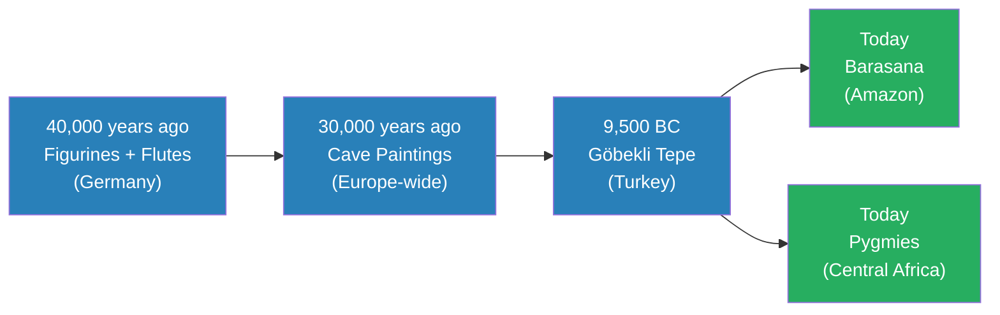
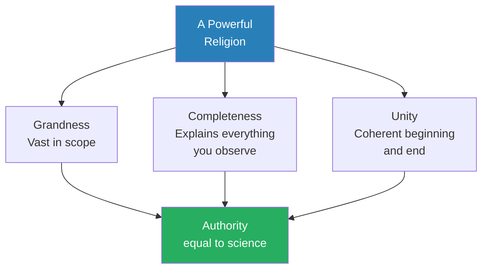
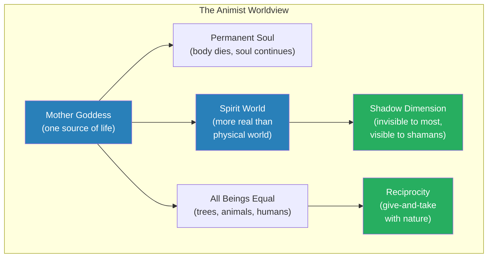
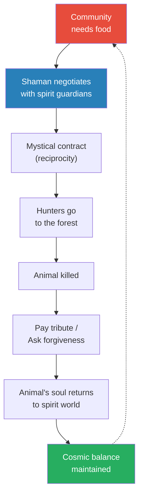
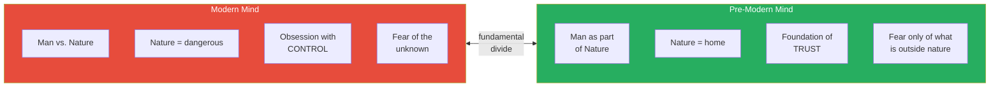
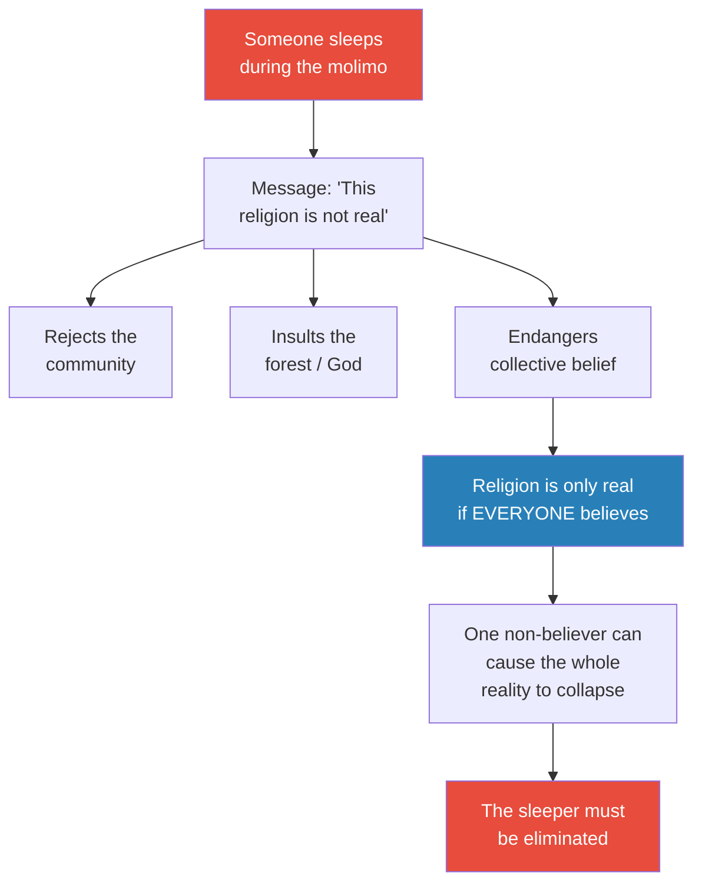
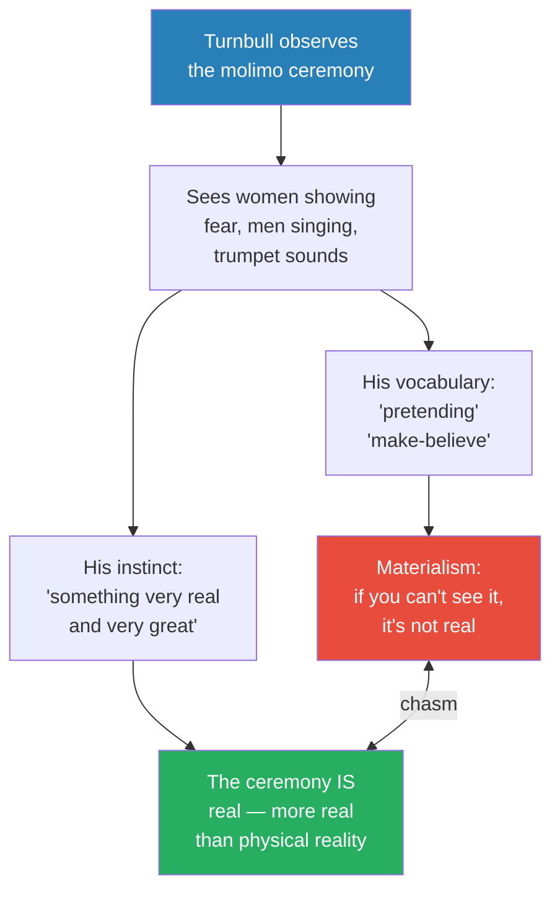
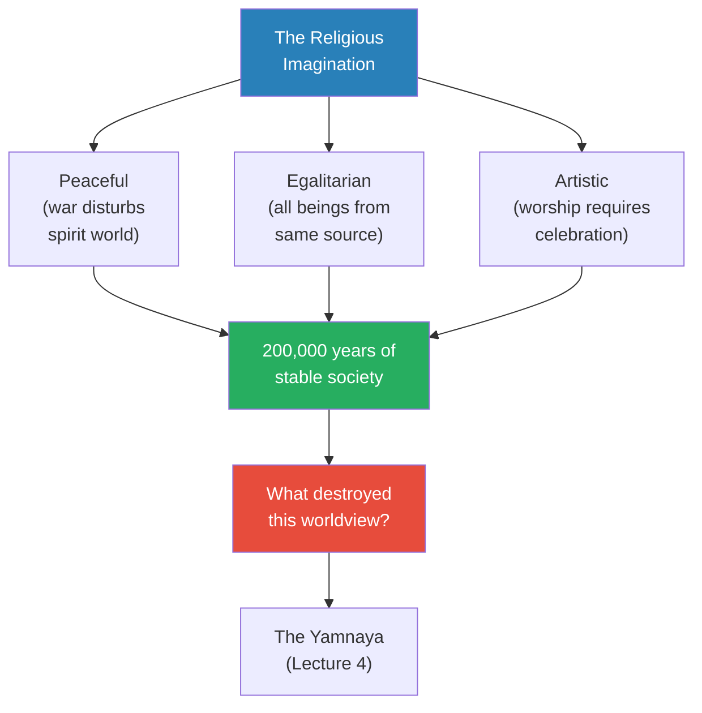
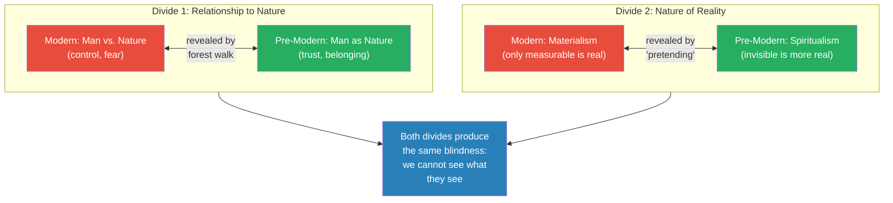

# The Religious Imagination

> For most of human history, humans lived inside a religious imagination that treated the spirit world as more real than physical reality, treated all living things as equal, and structured every moment of daily life through ritual. Prof. Jiang uses two contemporary indigenous cultures -- the Barasana of the Amazon and the Pygmies of Central Africa -- to reconstruct this lost worldview. The lecture's deepest claim: a collectively shared imagination, when believed by everyone, becomes more real and more powerful than the world we can see and touch. Two cognitive divides separate us from our ancestors: control versus trust, and materialism versus spirituality. Next lecture will explain what destroyed this worldview.

---

## Overview: Key Highlights

- <b style="color: #27ae60">The religious imagination creates things more real than reality</b> -- a shared imagination, when believed by everyone, becomes more powerful than the physical world
- <b style="color: #2980b9">Anthropology as time travel</b> -- living indigenous cultures serve as windows into the prehistoric mind, because they still practise the same religion found in 40,000-year-old archaeological evidence
- <b style="color: #27ae60">Creation myths encode legal systems</b> -- the Barasana myth of Romi Kumu simultaneously explains the world's origin and establishes why incest, cannibalism, and killing the young are forbidden
- <b style="color: #2980b9">Grandness, completeness, unity</b> -- recurring framework: these three properties give a religion the authority of science; will reappear when studying Judaism and Christianity
- <b style="color: #2980b9">The shadow dimension</b> -- behind every physical form is an invisible spirit world, more real than our world, accessible only to the shaman
- <b style="color: #27ae60">Reciprocity governs hunting</b> -- meat is not a right but a gift from the spirit world; killing without permission risks vengeance from spirit guardians
- <b style="color: #e74c3c">Control vs. trust</b> -- the first cognitive divide: we fear nature because we need to control it; pre-modern humans trusted nature because they were part of it
- <b style="color: #e74c3c">Materialism vs. spirituality</b> -- the second cognitive divide: we believe only the measurable is real; they believed the invisible spirit world was more real
- <b style="color: #27ae60">Collective belief as reality</b> -- the worst crime among the Pygmies is sleeping during the molimo ceremony, because one non-believer threatens the entire community's shared reality
- <b style="color: #e74c3c">"Pretending" reveals the chasm</b> -- Turnbull's vocabulary exposes the unbridgeable gap between the modern and pre-modern mind; the Pygmies would find the word deeply insulting
- <b style="color: #27ae60">This religion produced 200,000 years of peace, equality, and art</b> -- animism's logical consequences: no war (it disrupts the spirit world), no hierarchy (all beings are equal), art as sacred duty (worship requires celebration)
- <b style="color: #2980b9">The Yamnaya preview</b> -- next lecture introduces the people whose religion of warfare, patriarchy, and wealth conquered everyone and destroyed the old worldview

| Concept | One-line summary |
|---------|-----------------|
| **The religious imagination** | The collective human capacity to imagine a world that becomes more real than physical reality |
| **Animism (reviewed)** | All living beings share one spiritual essence; body and soul are separate; the spirit world is the true reality |
| **Creation myths as law** | Creation myths encode the legal and moral structure of society, making rules feel cosmic rather than arbitrary |
| **Grandness, completeness, unity** | Three properties a religion needs to achieve the authority of science -- flagged as recurring framework |
| **The shadow dimension** | The invisible spirit world behind every physical form, accessible only to shamans |
| **Reciprocity** | The foundational moral principle -- hunting requires give-and-take negotiation with spirit guardians |
| **Ritual** | The expression of religion in everyday practice -- every action carries religious meaning |
| **Control vs. trust** | Moderns fear nature because they need to control it; pre-moderns trust nature because they are part of it |
| **Materialism vs. spirituality** | The modern belief that only the measurable is real vs. the pre-modern belief that the invisible is more real |
| **Collective belief as reality** | A shared imagination, when believed by everyone, becomes more real than the physical world |
| **The molimo** | A trumpet-like instrument the Pygmies use to communicate with the forest and spirit world |

---

# The Conversation

## Review: Peaceful, Egalitarian, and Artistic for 200,000 Years [0:00 -- 9:25]

*Prof. Jiang opens with a substantial review of Lectures 1 and 2, establishing the baseline against which everything in this lecture will be measured: for most of human history, humans were peaceful, egalitarian, and artistic. He previews next week's lecture -- the Yamnaya and their religion of warfare, patriarchy, and wealth -- transforming the review from a recap into a before-and-after frame. He then introduces anthropology as the method for this lecture: if animism was the universal religion, living indigenous cultures should still practise it.*

*The same animist religion stretches from 40,000-year-old German caves to living cultures in the Amazon and Africa today -- anthropology bridges the gap between ancient archaeology and living practice.*

> [!note]- Expand: Full Detail
> Prof. Jiang opens by establishing the series' central baseline: "For most of human history, we have been peaceful, egalitarian and artistic." He takes each characteristic in turn, being careful about what each does and does not mean.
>
> - **Peaceful** does not mean non-violent -- skull fractures found in burials prove intra-group conflict -- but there is no evidence of organised warfare; that comes much later
> - **Egalitarian** means no difference in status and power between men and women; no evidence of hierarchy -- no larger houses, no groups with special privileges
>   - Individuals of higher status did exist -- shamans were buried more elaborately -- but this reflected religious authority, not wealth or conquest
> - **Artistic** -- cave paintings, monuments, music, figurines -- all expressions of religious worship, not decoration
>
> He then poses the driving question: "Today, we are not peaceful, we are not egalitarian. We are not that artistic. So what changed?" And he gives the preview that will haunt the rest of the lecture: "Next week, I'll explain to you what changed. Basically a new group of people called the Yamnaya came into being, and they had a different religion that celebrated warfare, patriarchy and wealth. And eventually spread all around Europe and Asia, and they conquered everyone, and they created a new history of humanity."
>
> This preview transforms the review section from a simple recap into a before-and-after frame: here is what we had, and next week you will learn what destroyed it.
>
> Prof. Jiang then reviews the religion of early humans -- <b style="color: #2980b9">animism and shamanism</b>:
> - All living beings come from the mother goddess -- one source of life, including trees, animals, and humans
> - Every being has a permanent soul -- the body dies but the soul continues, so death was not a big deal
> - A spirit world exists that is more real than the physical world -- our world is merely a manifestation of it
> - The universe has an order -- humans must maintain balance through tribute and respect
>
> He walks through the archaeological evidence: Göbekli Tepe's T-pillars ("the T pillar represents the manifestation of the animal spirit in us"), the 40,000-year-old figurine and flute from Germany ("at the beginning of humanity, we were religious. We celebrated our religion through music and through art"), and the cave paintings that celebrate animals rather than humans.
>
> He then introduces the lecture's method: "If we cannot go back in time and observe their religion, how do we know what their religion is? And the answer is, we have a field of study called <b style="color: #2980b9">anthropology</b>." If the theory of universal animism is correct, living cultures in the Amazon, Africa, and Australia should still practise this religion -- and they do. This is the bridge from archaeology to ethnography that the rest of the lecture will cross.

---

## The Barasana Creation Myth: Law Disguised as Story [9:25 -- 13:51]

*Prof. Jiang reads the Barasana creation myth from Wade Davis's The Wayfinders and presses students to look past the surface story for its real function -- which turns out to be legal, not literary. He then introduces a recurring analytical framework: grandness, completeness, and unity -- the three properties a religion needs to achieve the authority of science.*

> [!tip] Recurring Framework
> Prof. Jiang explicitly flags grandness, completeness, and unity as a lens he will return to when studying Judaism and Christianity later in the series. Watch for it in Lectures 21-28 -- every powerful religion scores high on all three.

*These three criteria explain why the Barasana cosmology is so elaborate -- a religion that is grand, complete, and unified produces unquestioned belief. Prof. Jiang will reapply this framework to Judaism, Christianity, and every major religion the series examines.*

> [!note]- Expand: Full Detail
> Prof. Jiang introduces the first source: "The first passage we're going to look at is from a book called The Wayfinders by Wade Davis. This is a great book. If you guys ever have a chance, please read this book. It's extremely well written." Davis is a Canadian anthropologist who spent years travelling the world to understand indigenous peoples.
>
> He reads the Barasana creation myth aloud -- the act of reading forces students to slow down and absorb the imagery rather than skimming it as they might a textbook.
>
> > [!example] The Romi Kumu Creation Myth (Barasana, Amazon)
> > - In the beginning, before the creation of seasons, before the ancestral mother opened her womb, there was only chaos in the universe
> > - Spirits and demons known as He preyed on their own kindred, bred without thought, committed incest without consequence, devoured their own young
> > - Romi Kumu, the woman shaman, responded by destroying the world with fire and floods
> > - "Just as a mother turns over a warm slab of manioc bread on the griddle," she turned the charred and inundated world upside down
> > - From this empty template, she gave birth to a new world -- land, water, forest, and animals
> > - Her blood and breast milk gave rise to rivers; her ribs became the mountain ridges of the world
> > - The new world came with rules: incest, cannibalism, and killing the young are evil because those are what the demons of the before-time did
> > - The Barasana also have an elaborate cosmological visualisation -- highly complex and sophisticated -- that maps the entire structure of creation
> > **The lesson:** Creation myths don't just explain origins. They encode the legal and moral structure of society -- the rules feel cosmic and inevitable, not arbitrary or imposed by a human authority.
>
> Prof. Jiang pushes students past the obvious answers. When they say "it explains how the world was formed," he acknowledges this but insists there is something "much more important." When they say "it tells us who we are and where we come from," he agrees but keeps pressing. The answer he drives toward: <b style="color: #27ae60">creation myths are legal documents disguised as stories</b>. They don't merely describe the past -- they prescribe the present. By attributing evil behaviours to demons in the before-time, the myth makes those behaviours feel cosmically forbidden rather than merely socially inconvenient.
>
> - "So what this creation myth is doing is explaining to you the legal structure of your society, why you can't do certain things"
> - Why can't you commit incest? Because that's what evil spirits did before creation
> - Why can't you kill the young? Because the demons devoured their own offspring
> - Every civilisation has a creation myth because every society needs to explain who we are, where we come from, and what the rules are
> - The "why" is always: because violating the rules aligns you with the forces of chaos and evil
> - The woman shaman as creator figure connects to the mother goddess from Lecture 2 -- the source of all life is female, reinforcing egalitarianism
>
> Prof. Jiang then pauses over the extraordinary complexity of the Barasana cosmological visualisation: "As you can understand, it's very complicated." He asks students: why is it so complicated? The answer introduces the recurring framework:
>
> - **Grandness** -- the religion must be vast, covering the entire scope of existence
> - **Completeness** -- everything you encounter in the world must be explained; no unexplained phenomena
> - **Unity** -- a coherent beginning and end; the story holds together as a single narrative arc
>
> He is explicit that this extends beyond the Barasana: "This is something that we will learn in this class as we explore other religions, including Judaism and Christianity. For religion to be powerful, for it to be authoritative, you need these three ideas: grandness, completeness and unity."

---

## The Barasana Spirit World: Sophistication Without Technology [13:51 -- 23:48]

*Prof. Jiang continues reading from Davis, demonstrating the sophistication of the Barasana cosmology -- a world where every rock, waterfall, and plant is simultaneously a physical object and a spiritual being. He introduces the shadow dimension, dismantles the prejudice that indigenous people without technology must be "stupid," and defines ritual through a classroom analogy that makes the concept personal for students.*

*The animist worldview forms an interconnected system rather than a list of separate beliefs -- everything flows from the mother goddess, and every element reinforces every other. The shadow dimension is the realm the shaman must navigate to maintain cosmic order.*

> [!note]- Expand: Full Detail
> Prof. Jiang reads from Davis: "Thus for the people living today in the forest of the Parana, the entire natural world is saturated with meaning and cosmological significance." He pauses to let the key phrases land:
>
> - Every rock embodies a story -- not metaphorically, but literally in the Barasana understanding
> - Every waterfall carries religious meaning -- sap and blood are "the bodily fluids of the primordial river of the Anaconda"
> - Plants and animals are "distinct physical manifestations of the same essential spiritual essence" -- all beings come from the woman shaman, all carry the spark of life
> - The visible world is only one level of perception: behind every physical form is a <b style="color: #2980b9">shadow dimension</b> -- "invisible to ordinary people, but visible to the shaman"
> - This is the "realm of the He spirit" -- a world where rocks and rivers are alive, plants and animals are human beings
> - In the very centre of stones are "the great malocas of the He spirit, where everything is beautiful, the shining feathers, the coca, the calabash of tobacco powder, which is, in itself, the skull and brain of the sun"
>
> Prof. Jiang highlights what this reveals about indigenous intelligence: "One major prejudice that we might have about these people is, well, they don't drive cars, they don't have cell phones, therefore they must be stupid. But clearly, from our understanding of their religious beliefs, they're actually <b style="color: #27ae60">extremely imaginative and extremely sophisticated</b>." This is a theme he will return to throughout the series: technological simplicity is not the same as intellectual simplicity.
>
> He then shows photographs of Barasana shamans in religious practice and asks students what they notice. They observe:
> - The sophistication of the clothing -- a lot of care and thought put into what they wear
> - The hierarchy -- the elder stands in the middle
> - The symmetry and structured bodily relationships between the three figures
>
> Prof. Jiang synthesises their observations: "If this is a tribe and all they're trying to do is hunt and eat food, none of this makes any sense, right? But the main argument that I've been trying to tell you is: no, their first priority is their religion. Everything they do has a religious significance to it."
>
> He introduces the concept of <b style="color: #2980b9">ritual</b> -- the expression of religion in everyday practice -- through a direct classroom analogy: "You come to school and you think your life is very ordered, right? Because maybe at eight o'clock you start class, and then when class starts, the teacher takes attendance. If you want to go to the restroom, you have to raise your hand. This is all what we call ritual. Your lives are extremely ritualised. And the thing about ritual is behind the ritual, there has to be a belief system."
>
> The school's belief system says this structure helps you learn, be on time, respect authority, and read books. The Barasana live exactly the same way -- "every minute of their lives there's order and structure to what they do that has meaning and purpose" -- except their belief system is religious, and it governs every single second.

---

## The Shaman as Nuclear Engineer [23:48 -- 30:00]

*Prof. Jiang reads Davis's redefinition of the shaman's role -- not a herbalist or folk healer, but a cosmic engineer who enters the spirit world to maintain the invisible infrastructure the entire community depends on. He then connects the hunting ritual to the reciprocity principle, finally explaining why cave paintings and Göbekli Tepe celebrate animals rather than humans.*

> [!tip] Core Insight
> The physical world doesn't matter -- the spirit world controls everything. When plants are dying, the cause is spiritual. When hunting is poor, the shaman must enter the invisible world and fix the root cause. The shaman is the community's most vital technology.

> [!note]- Expand: Full Detail
> Prof. Jiang reads a key passage from Davis that destroys the common misconception of shamans as herbalists: "Contrary to popular lore in the West, the shaman of the Barasana never uses or manipulates medicinal plants. His duty and sacred path is to move in the timeless realm of the He, embrace the primordial powers, and harness and restore the energy of all creation."
>
> He offers his striking analogy: the shaman is like <b style="color: #2980b9">"a modern engineer who enters the depths of a nuclear reactor to renew the entire cosmic order"</b>. The comparison translates a spiritual role into a technical one -- the shaman maintains invisible infrastructure that the rest of society depends on but cannot see.
>
> He builds the logic through Socratic questioning: "If plants are dying outside, what does this mean?" Students grasp the answer: "The spirits are unhappy." "And therefore?" "You must go into the spirit world and understand why they're unhappy and fix it."
>
> - <b style="color: #e74c3c">The implication is radical: our physical world doesn't matter</b> -- what matters is the spirit world, because the spirit world controls everything
> - Human beings, plants, and animals share the same cosmic origins and are "essentially identical, responsive to the same principles, obligated by the same duties, responsible for the collective well-being of creation"
> - "Without the forests and rivers, humans would perish; without people, the natural world would have no order or meaning -- all would be chaos"
>
> Prof. Jiang then turns to the hunting ritual, connecting it to evidence from Lectures 1 and 2:
>
> > [!example] Barasana Hunting as Sacred Courtship
> > - When men go to the forest to hunt, "it is never a trivial passage" -- you cannot simply go and hunt
> > - The shaman must first travel in trance to negotiate with the "masters of the animals"
> > - He forges a "mystical contract with the spirit guardians" -- always based on reciprocity
> > - The Barasana compared hunting to marriage -- "a form of courtship in which one seeks the blessings of a greater authority for the honour of taking into one's family a precious being"
> > - Meat is "not the right of a hunter, but a gift from the spirit world"
> > - Killing without permission risks death from a spirit guardian -- in the form of a jaguar, anaconda, tapir, or harpy eagle
> > - The ritual is elaborate: the shaman "changes from fish to animal to human being and back again, transcending every form, becoming pure energy"
> > - His chants "name every point of geography met on the ancestral journey of the Anaconda"
> > - The ritual spans two series of dances separated by the liminal moments of dawn, dusk, and midnight
> > - Its main purpose: celebrate the unity of life, ask permission, ask forgiveness
> > **The lesson:** Hunting is not predation -- it is a negotiated exchange between equals, mediated by the shaman and governed by reciprocity. This explains why shamans dressed as animals in the 40,000-year-old figurines.
>
> He makes the connection to earlier lectures explicit: "Why did they spend so much time painting these animals? Because they're trying to pay tribute to the animals. If I kill you, I must thank you for taking your meat to replenish myself, but I also must ask for your forgiveness, otherwise the animal soul may seek vengeance."
>
> - **Cave paintings** celebrate animals, not humans -- because animals give humans life and nourishment, and tribute must be paid
> - **Göbekli Tepe's T-pillars** were sites for pre-hunt religious ceremonies -- animal bones found at the site confirm the ritual-hunting connection
> - **The 40,000-year-old figurines** of shamans dressed as animals -- the shaman transforms into animal form to communicate with the spirit world during the pre-hunt ritual

*Hunting is a cycle of negotiation, gratitude, and return -- not a one-way extraction. The dotted arrow shows this is an ongoing relationship renewed with every hunt. This cyclical logic explains cave paintings (tribute), Göbekli Tepe's animal carvings (pre-hunt festivals), and the 40,000-year-old shaman figurines (transformation for spirit communication).*

---

## The Pygmies and the Forest at Night: Control vs. Trust [30:00 -- 40:00]

*Prof. Jiang shifts from South America to Africa, reading Turnbull's account of following a group of Pygmies through a leopard-infested forest at night -- unarmed, unafraid, completely silent. Through close reading, he identifies the word "shock" as proof that even a trained anthropologist cannot escape the modern assumption that nature is dangerous. He builds the first great cognitive divide of the lecture: the modern mind needs to control nature; the pre-modern mind trusts nature.*

*The modern mind treats nature as an enemy to be controlled; the pre-modern mind treats nature as a parent to be trusted. This single difference explains most of what separates us from our ancestors.*

> [!note]- Expand: Full Detail
> Prof. Jiang transitions: "Now let's move to Africa. And in Africa, there's a group of people called the Pygmies." He introduces Colin Turnbull's ethnography and the <b style="color: #2980b9">molimo</b> -- a trumpet-like instrument at the centre of Pygmy religion that allows them to communicate with the forest and spirit world. Despite being on a different continent, the Pygmies practise "essentially the same religion" as the Barasana: interconnection with nature, spirit world as the real world, harmony maintenance through communication.
>
> He then announces the analytical purpose of this section: "What I'll do now is compare and contrast the way we think today and how they thought before."
>
> > [!example] The Pygmies Walk Through the Forest Unarmed
> > - Turnbull follows a group of Pygmies through the forest at night -- the time when leopards prowl in search of food
> > - He has no idea how far they have come or in what direction, but knows they have left the camp far behind
> > - He notices they are completely silent -- unusual, since Pygmies are normally deliberately noisy
> > - Just at the time leopards would be hunting, they seem "unwilling to disturb the forest or the animals it concealed"
> > - It is as if "they were a part of the silence and the darkness of the forest itself"
> > - They are fearful only "lest any sound might betray their presence to some person or thing not of the forest"
> > - Then Turnbull realises with "sudden shock" that not one of them carries a spear or bow and arrow
> > - They peer into the dusk, cock their heads, and satisfy themselves they are "really alone" -- meaning alone from outsiders, not from animals
> > - "They felt themselves so much a part of the forest and of all the living things in it, they had no need to fear anything except that which was not of the forest"
> > - One Pygmy later tells Turnbull: "When we are the children of the forest, what need have we to be afraid of it? We are only afraid of that which is outside the forest"
> > **The lesson:** The Pygmies don't fear leopards because they don't experience nature as "other." They are the forest's children. Fear comes only from what is outside the forest -- the unfamiliar human world.
>
> Prof. Jiang structures the analysis as a close-reading exercise, noting "this is actually a great SAT question." He asks: "What is the word that tells us he doesn't really understand how these people think and behave?" After students work through the passage, one identifies it: **shock**. Turnbull's surprise reveals that his modern mind cannot imagine walking through a leopard-infested forest unarmed and unafraid.
>
> He then builds the cognitive divide through a sequence of Socratic questions:
> - "Why do we think that nature is dangerous? Why do they not think nature is dangerous?"
> - Students: "Leopards. Predators." Prof. Jiang: "But they don't think nature is dangerous. What's the difference?"
> - "The first major difference is this: our minds think that we are separate from nature -- man versus nature -- but they think they are part of nature"
> - "Why do we fear nature? What makes us fear nature?" Students: "The unknown."
> - "Why are you afraid of the unknown?" He pushes further: "What is it that we are obsessed with?"
> - Answer: <b style="color: #e74c3c">"We're obsessed with control. We have to control everything"</b>
> - "We like animals in the zoo, right? We do not like animals in the forest. We can control animals in the zoo. We cannot control animals in the forest"
> - "Why aren't they afraid? What's their attitude?" The word is <b style="color: #27ae60">trust</b>: "They don't have to control nature because they trust nature. They believe the leopards know them, and they know the leopards"
>
> The passage also reveals something subtle about Pygmy fear -- they are not fearless. They fear "that which is not of the forest" -- the human world outside. For a modern reader this reversal is almost incomprehensible: we fear nature and feel safe in cities; they fear human civilisation and feel safe in the wild.

---

## The Molimo Ceremony: Why Sleeping Is the Worst Crime [40:00 -- 48:12]

*Prof. Jiang reads Turnbull's account of the molimo ceremony and its most extreme punishment -- death for sleeping during the singing. Through a classroom analogy, he walks students step by step through the logic that makes this punishment not just comprehensible but inevitable within the Pygmy worldview. This section contains the lecture's most radical claim: a collectively shared imagination, when believed by everyone, becomes more real than physical reality itself.*

> [!tip] Core Insight
> "This religion is only possible if everyone believes that it is true." A collectively shared imagination, when maintained by universal participation, becomes more real than the physical world. One non-believer is not rude -- he is an existential threat to everything the community has built.

*The punishment seems extreme only to moderns who separate belief from reality. In a world where shared belief IS reality, a non-believer is an existential threat to everything the community has built.*

> [!note]- Expand: Full Detail
> Prof. Jiang reads Turnbull's description of the molimo ceremony and its enforcement:
>
> > [!example] The Punishment for Sleeping During the Molimo
> > - Everyone at the ceremony must eat, and no adult male is allowed to sleep while the molimo is singing
> > - If a sleeping man is found during the ceremony, he is speared in the stomach with two spears -- one under each arm
> > - He is "killed completely and forever" -- a phrase Prof. Jiang emphasises for its totality
> > - His body is buried under the communal fire (the komala molimo) where the religious practice takes place
> > - No one is allowed to mention his death, even to remark on his absence
> > - The women are told that the molimo itself -- "the great animal of the forest" -- carried him off
> > - No questions are asked by anyone -- neither men nor women
> > - The missing man is never spoken of again; he is erased from collective memory
> > - One older Pygmy demonstrated the search-and-kill method to Turnbull with miming and obvious relish
> > **The lesson:** The sleeping man is not just disrespecting a ritual. He is threatening the existence of the collective reality that holds the entire community together.
>
> Prof. Jiang builds the logic step by step using a classroom analogy:
>
> - "Let's just say we're having a class and one of you is sleeping, and I get so angry that I want to kill that person. Why would I want to do that?"
> - First student answer: "It's disrespectful of my authority." Prof. Jiang: "That is true, but then I just ask a person to leave my class, right? But I want to *kill* that person. Why?"
> - "What is a classroom? What allows a classroom to exist?" Students struggle until one grasps it: a classroom is a collective experience that happens when everyone participates
> - "If you're sleeping, what are you telling me? Yeah -- it's not a classroom. It's not real. This discussion is not real. It's pointless"
> - Now scale that up: "Their molimo singing, the ritual -- it's meant for everyone to recognise that the religion is real. It's more real than reality. But if you're sleeping, you're saying: no, guys, this doesn't matter"
> - "What you're doing is you're not committing violence on one person, you're committing violence on the community, you're committing violence on the religion. You're insulting the forest, you're insulting the God"
>
> He states the principle directly: <b style="color: #27ae60">"This religion is only possible if everyone believes that it is true. If you're sleeping, it means you don't think it's true, and therefore you are, first of all, rejecting the community -- you're telling everyone 'you're all idiots.' Secondly, you might endanger the community because you're insulting the forest."</b>
>
> The erasure is as important as the killing: the body is buried under the sacred fire, no one mentions his death, women are told the molimo carried him off. If the community cannot even remember the non-believer, his threat is neutralised completely.
>
> Prof. Jiang draws out the general principle: "For most of human history, people take their religion extremely seriously, so seriously that they think it's more real than reality. As long as everyone believes in it, it's true. But if someone doesn't believe in it, then we have to kill that person, because if he doesn't believe in it, then it might cause our religion to die."
>
> This principle -- collective belief sustaining collective reality -- will recur throughout the course. When Judaism requires observance of 613 commandments, the logic is the same: deviance threatens the community's covenant with God. When Christianity persecutes heretics, when Islam requires five daily prayers -- all are versions of the same logic the molimo sleeping punishment embodies.

---

## The Word "Pretending": Materialism vs. Spirituality [48:12 -- 52:45]

*Prof. Jiang reads a second passage from Turnbull and conducts a close-reading exercise, asking students to find a single word that reveals the unbridgeable gap between the modern and pre-modern mind. When a student identifies "pretending," the lecture's second great cognitive divide crystallises: the modern worldview has no vocabulary for genuine spiritual experience except "make-believe."*

*Turnbull can feel that something profound is happening -- "something very real and very great" -- but his modern vocabulary gives him only "pretending" and "make-believe" to describe it. The chasm between his instinct and his language is the chasm between the modern and pre-modern mind.*

> [!note]- Expand: Full Detail
> Prof. Jiang reads the passage where Turnbull describes sitting at the communal fire for a month, watching the ceremony night after night: "pretending that they were afraid to see the animal of the forest... pretending they thought that the woman thought that the drainpipes were animals... every evening when all this make-believe was going on, I felt that something very real and very great was going on beneath it, something that everyone else took for granted and about which only I was ignorant."
>
> He asks: "Clearly he doesn't understand these people. What word tells us he doesn't understand these people?" He waits through several wrong answers, then offers a hint through analogy: "If another teacher comes into my class and he says, 'Wow, your class is a lot of fun -- you play a lot,' I'd be insulted. Why? Because it implies what we're doing is not serious academic work. It's playing. It has no significance, no meaning."
>
> A student identifies it: <b style="color: #e74c3c">"pretending"</b>. The word repeats throughout the passage and captures the unbridgeable gap between worldviews.
>
> Prof. Jiang drives it home: "We think they're pretending. We think they're playing. What do they think? They think it's all true. For them, their religion is more true than this world."
>
> He then names the second cognitive divide:
> - The modern worldview is <b style="color: #2980b9">materialistic</b>: "If we cannot see it, it's not real. God can't be real because we can't find it. The soul can't be real because we can't measure it. Imagination can't be real because we don't know where it comes from"
> - The pre-modern worldview is **spiritual**: the invisible world is at least as real as the visible one, and probably more so
> - Prof. Jiang takes an explicit position: "Obviously, this idea of materialism is wrong. How can you say the imagination doesn't exist?"
> - He acknowledges the tension: "When you go to science class, they teach you this -- if it's real, you can measure it, you can see it, you can feel it. But for most of human history, we didn't believe that"
>
> Turnbull's tragedy is that he can *feel* the truth -- "something very real and very great" -- but his modern vocabulary gives him only "pretending" and "make-believe" to describe it. He is "ignorant" by his own admission, and "only I was ignorant" -- the entire community understands what is happening, and the trained anthropologist is the only one who does not.
>
> Prof. Jiang captures the lecture's central idea: "You can imagine a world, and this world, as long as many of you are imagining it together, it's more true, more powerful, more real than this world. That's the power of religion -- what we call <b style="color: #27ae60">the religious imagination</b>. And we'll see this over and over again in human history."

---

## Waking the Forest: The Complete Worldview [52:45 -- end]

*Prof. Jiang reads the final passage -- a Pygmy elder explaining that when things go wrong, the forest must be sleeping, and the community sings to wake it. He shows how this mirrors the Barasana system exactly, then closes by connecting the entire lecture back to the three characteristics of early humanity: peaceful, egalitarian, and artistic. He poses the question that will drive Lecture 4: if this worldview lasted 200,000 years, what destroyed it?*

*The religion is not just a set of beliefs -- it is the mechanism that produces and sustains peace, equality, and art for 200,000 years. Because all three depend on the same foundation, attacking the religion attacks all three simultaneously.*

> [!note]- Expand: Full Detail
> Prof. Jiang reads the Pygmy elder's explanation with evident admiration:
>
> - "Normally everything goes well in our world, in our forest"
> - "But at night, when we are sleeping, sometimes things go wrong, because we are not awake to stop them from going wrong"
> - Army ants may invade the camp; leopards may steal a hunting dog or even a child
> - "If we were awake, these things would not happen"
> - Therefore when something big goes wrong -- illness, bad hunting, death -- "it must be because the forest is sleeping and not looking after its children"
> - The solution: <b style="color: #27ae60">"We wake it up. We wake it up by singing to it. And we do this because we want it to awaken happy"</b>
> - And when the world is going well, they also sing -- "because we want it to share our happiness"
>
> The elder's reasoning is transparent and beautiful: suffering is not punishment or divine wrath. The forest simply fell asleep, the way a parent might fall asleep and let a child wander into danger. The remedy is communication -- wake the forest up and make sure it wakes happy. The contrast with later religions is striking: Christianity explains suffering through original sin, Buddhism through attachment, Stoicism through resistance to fate. The Pygmy explanation is simpler, kinder, and in some ways more psychologically healthy.
>
> Prof. Jiang draws the parallel to the Barasana system explicitly: "It's almost the same religion. Maybe the details are different, but the idea is the same. The idea is that we're all interconnected -- animals, plants, humans, all the same. This is not the real world; the spirit world, the forest, they're the real world. And for us to maintain our health and our happiness and our safety, we must always communicate with this other world and make sure they're happy."
>
> He then ties the entire lecture back to the opening review, connecting the religion to its social consequences:
> - "Because of all this belief, it means we should not go to war with other people, because that causes mayhem and chaos in the spirit world"
> - "Our job is to maintain harmony and balance in this world. We're caretakers"
> - "We should be egalitarian. We should be equal because we're all from the same mother goddess, we're all from the same forest"
> - "We have to be artistic, because we have to celebrate and worship the spirit world"
>
> The logic is elegant: <b style="color: #27ae60">the religion doesn't merely coexist with peace, equality, and art -- it produces them as logical necessities</b>. If you believe all beings share one spiritual essence, you must treat them as equals. If you believe your job is to maintain cosmic balance, you must avoid war. If you believe the spirit world requires worship, you must create art.
>
> Prof. Jiang's closing words set up the series' driving tension: "So now the question is, what changed? Why do we have war? Why do we have hierarchy? Why do we have patriarchy? Why are men superior to women? Why do some rich people have all the power? This clearly goes against this religion, and what I will show you starting next class is the beginning of a new religion, and how this new religion that worships wealth, power, and war conquered everyone."

---

## The Two Cognitive Divides: A Summary

*The first divide -- control versus trust -- was revealed through the forest walk, where Turnbull's "shock" exposed his assumption that nature is dangerous. The second divide -- materialism versus spirituality -- was revealed through the "pretending" passage, where Turnbull's vocabulary exposed his inability to describe genuine spiritual experience. Both produce the same result: modern people are structurally incapable of seeing what pre-modern people see.*

---

## Evidence and Sources

| Source | Type | What it shows |
|--------|------|---------------|
| Wade Davis, *The Wayfinders* | Anthropological book | Detailed ethnography of the Amazonian Barasana -- creation myths, cosmology, hunting rituals, shamanic practice, the shadow dimension |
| Colin Turnbull (likely *The Forest People*) | Anthropological book | Pygmy religion -- molimo ceremony, relationship with the forest, sleeping punishment, the "pretending" passage |
| Göbekli Tepe (reviewed) | Archaeological site | Pre-hunt religious festivals -- T-pillars with animal carvings representing "the manifestation of the animal spirit in us" |
| Cave paintings (reviewed) | Archaeological evidence | Tribute to animals before hunting -- explained by the reciprocity principle |
| 40,000-year-old figurine (Germany) | Archaeological artefact | Shaman dressed as animal -- religious art at the dawn of human expansion from Africa |
| 40,000-year-old flute (Germany) | Archaeological artefact | Music as religious expression from the earliest period of human history |

---

## Connections

**Builds on:** [[01 - Explaining Humanity's Transition to Agriculture]] -- Prof. Jiang explicitly reconnects Göbekli Tepe's T-pillars, the cave paintings, and the four disciplines of evidence. This lecture provides the anthropological evidence that Lecture 1 promised: living cultures that practise the religion archaeologists find traces of in ancient sites. The reciprocity principle finally explains *why* cave paintings celebrate animals rather than humans -- they are acts of tribute, not decoration.

**Builds on:** [[02 - Religion and the Dawn of Society]] -- The animist framework from Lecture 2 (mother goddess, permanent soul, spirit world, cosmic order) is given full ethnographic flesh through the Barasana and Pygmy material. The 40,000-year-old figurines and flutes, introduced in Lecture 2, are reinterpreted as shamanic ritual objects. Where Lecture 2 defined animism abstractly, Lecture 3 shows what it looks and feels like from the inside.

**Sets up:** [[04 - The Paradise Lost of Marija Gimbutas]] -- Prof. Jiang explicitly previews: the Yamnaya emerged with a religion of warfare, patriarchy, and wealth, and "conquered everyone." Understanding what was lost -- the trust, the reciprocity, the completeness of the animist worldview -- makes the Yamnaya conquest feel like a civilisational catastrophe rather than a neutral historical event.

**Related books in vault:** [[Sapiens - Yuval Noah Harari]] (Harari's concept of "imagined orders" parallels Prof. Jiang's "religious imagination" directly), [[Humankind - Rutger Bregman]] (humans as fundamentally cooperative, not selfish or violent), [[The Culture Code - Daniel Coyle]] (belonging cues and group identity connect to collective belief), [[Man's Search for Meaning - Viktor Frankl]] (meaning sustains life under extreme conditions, paralleling the pre-modern worldview)

**Recurring frameworks introduced:** Grandness, completeness, and unity as criteria for religious authority -- flagged for reuse when studying Judaism (Lectures 21-22) and Christianity (Lectures 24-27). The control-versus-trust divide and materialism-versus-spirituality divide will recur throughout the series.

---

## The Takeaway

This lecture does something none of the previous lectures attempted: it asks students to inhabit a radically different way of seeing the world. Where Lecture 1 evaluated theories and Lecture 2 surveyed evidence, Lecture 3 demands empathy. Prof. Jiang reads extended ethnographic passages not to prove a point but to create an experience -- the experience of understanding, even briefly, what it feels like to be a "child of the forest" who trusts nature the way we trust gravity. The shift from analysis to immersion is deliberate: you cannot understand the religious imagination from outside it, because the entire point of the religious imagination is that it is experienced from within.

The most important intellectual tool introduced here is the contrast between control and trust, between materialism and spirituality, between "pretending" and genuine belief. These are not just historical distinctions -- they are alive today. When Turnbull calls the Pygmy ceremony "make-believe," he is doing exactly what most modern people do when they encounter unfamiliar worldviews: dismissing what they cannot measure. Prof. Jiang's challenge is direct: "How can you say the imagination doesn't exist?" The materialism trap -- the assumption that only the measurable is real -- blinds us to entire dimensions of human experience that our ancestors took for granted.

The reciprocity principle deserves special attention because it solves a problem modern ethics has never satisfactorily answered: what is our moral obligation to the natural world? The modern answer -- environmental regulation, carbon credits, sustainability targets -- is transactional and bureaucratic. The Barasana answer is relational: you negotiate with the spirits of the animals you kill, you give thanks, you ask forgiveness, you maintain a personal relationship with every living thing you depend on. Whether or not one believes in spirit guardians, the principle of reciprocity produces a relationship with nature that is fundamentally healthier than the modern relationship of extraction and control.

The lecture ends with a question that will drive the rest of the course: if this peaceful, egalitarian, artistic worldview lasted for 200,000 years, what could possibly have been powerful enough to destroy it? The answer -- the Yamnaya and their religion of war, wealth, and patriarchy -- begins next class. But the question lingers: if the religious imagination produced 200,000 years of relative peace and ecological balance, and modernity has produced 200 years of accelerating warfare and environmental destruction, which worldview should we consider "primitive"?
