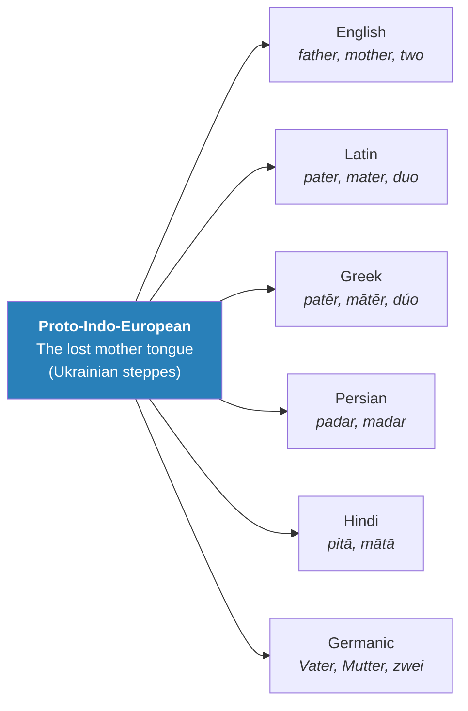
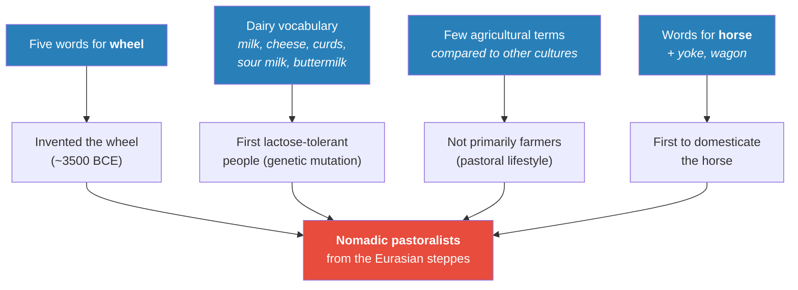
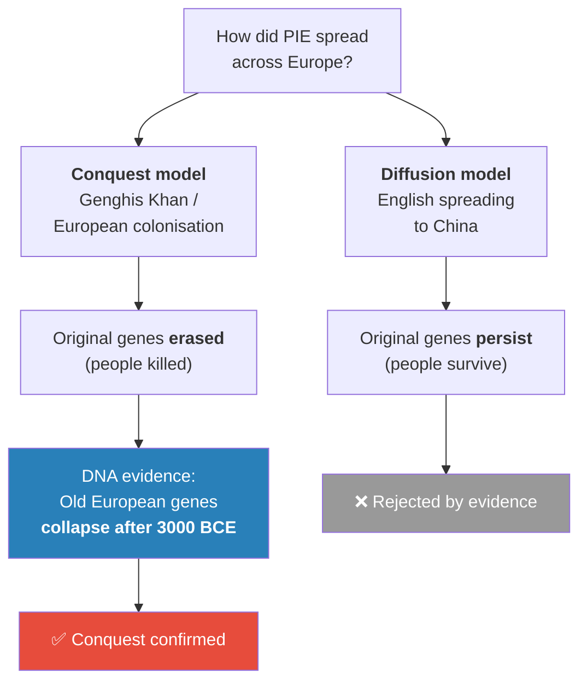
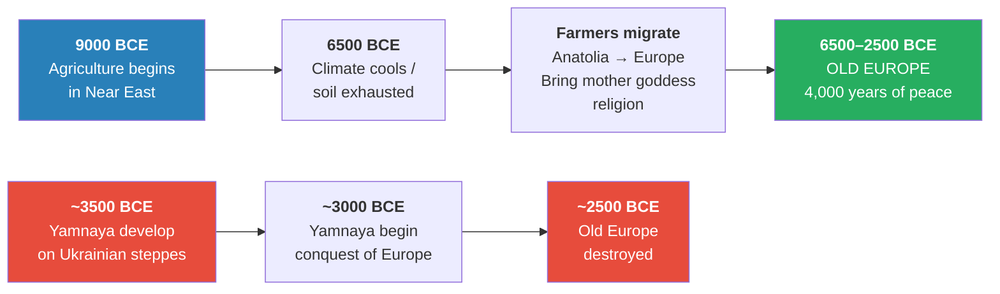
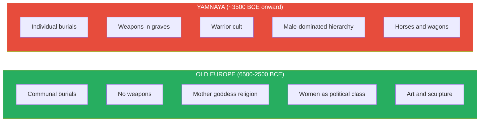
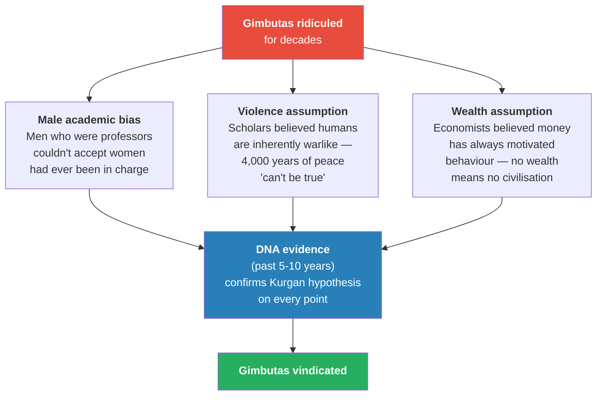
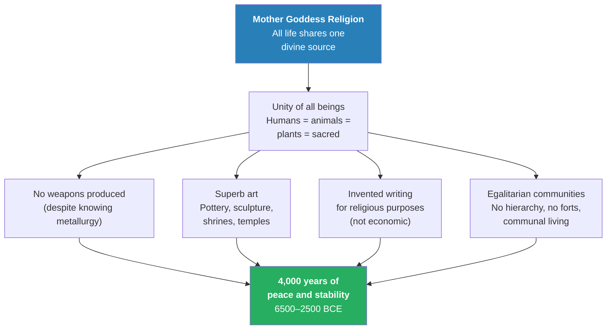
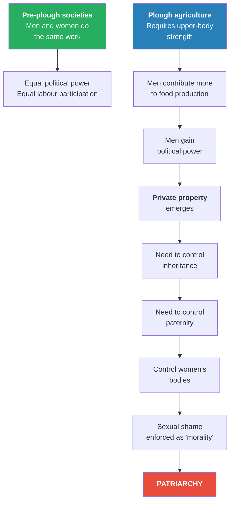
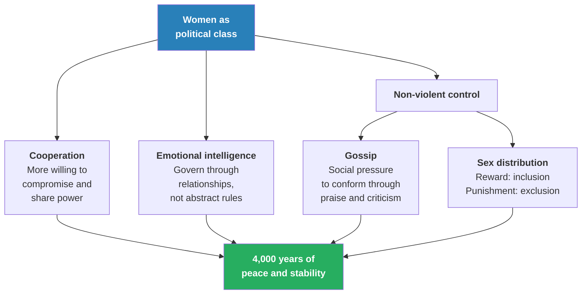

# The Paradise Lost of Marija Gimbutas

> If humans were peaceful, egalitarian, and artistic for most of their history, what did civilisation look like before war, private property, and patriarchy took over? Prof. Jiang reconstructs "Old Europe" — the 4,000-year matriarchal civilisation documented by anthropologist Marija Gimbutas — using three converging lines of evidence: linguistics, archaeology, and DNA. The lecture's deepest claim: everything we assume is natural about gender, violence, and ownership is a recent cultural invention, and the proof is now written in our genes.

---

## The Question

*If we know from Ice Age caves, Göbekli Tepe, and Çatalhöyük that early humans were peaceful, egalitarian, and artistic under the mother goddess religion, then what happened? How did war, patriarchy, and private property replace a world that worked for 200,000 years?*

Prof. Jiang opens by recapping the story so far. Three hundred thousand years ago, Homo sapiens were born in Africa. About 50,000 years ago, driven by climate change, we spread around the world — into Europe, across Asia, over the Bering Strait into the Americas, down to Australia. By that point there were roughly a million of us, scattered across every habitable continent.

And from the very beginning, we were religious. The evidence for this early religion is everywhere, once you know where to look. The Ice Age cave paintings of Europe (Lecture 1) were not decoration — they were rituals of worship. Göbekli Tepe in Turkey, built 11,500 years ago, was not a settlement but a temple. Çatalhöyük was a city organised around the worship of the mother goddess.

In every case, the religion was <b style="color: #2980b9">animistic</b>: the belief that all living things — humans, animals, plants, rivers, stones — come from one source, the mother goddess, and are all her children equally. Because of this belief, early humans were compassionate, egalitarian (no difference in status between men and women), peaceful (some violence but no organised warfare), and artistic (celebrating the goddess through paintings, sculpture, and music).

This is the world Prof. Jiang has been building across three lectures. Now he asks the question that will drive the rest of the course: if this was the norm for 200,000 years, how did we get from there to here? How did we end up with war, private property, and patriarchy — a world where men make all the rules and women have little agency or power?

Prof. Jiang frames this as the central puzzle of the entire Civilization series. His course has spent three lectures building the case that for most of human history — from the Ice Age cave paintings to Göbekli Tepe to Çatalhöyük — humans were peaceful, egalitarian, and artistic, bound together by the mother goddess religion.

If that was the default state of humanity, then war, patriarchy, and private property are the anomalies that need explaining, not the other way around. The question is not "why were early humans peaceful?" — that was the norm. The question is "what broke the norm?" And the answer, Prof. Jiang promises, will unfold across the next two lectures.

The answer, he argues, begins with a lost language. By reconstructing <b style="color: #2980b9">proto-Indo-European</b> — the mother tongue of nearly every language spoken in Europe and much of Asia — linguists accidentally assembled a profile of the people who destroyed Old Europe. Archaeology dug up their bones.

And in the last decade, DNA technology has confirmed the darkest version of the story: it was not cultural exchange — it was genocide.

But before telling that story in [[05 - The Yamnaya Conquest of Europe|Lecture 5]], Prof. Jiang spends this lecture painting a portrait of the world that was lost. The structure is deliberate: you need to understand what Old Europe was before you can understand what it means that it was destroyed.

## Key Concepts at a Glance

| Concept | One-line summary |
|---------|-----------------|
| **Proto-Indo-European (PIE)** | The reconstructed ancestor language of most European and South Asian languages, traced through shared vocabulary |
| **The Yamnaya** | Steppe pastoralists from Ukraine (~3500–2500 BCE) who spoke PIE and later conquered Old Europe |
| **Old Europe** | Gimbutas's term for the pre-Yamnaya matriarchal, egalitarian civilisation (6500–2500 BCE) |
| **Kurgan hypothesis** | Gimbutas's theory that Yamnaya burial-mound culture violently replaced Old Europe — now confirmed by DNA |
| **Conquest vs. cultural diffusion** | Two models for how languages spread — DNA evidence decisively favours conquest |
| **Cultural construct vs. biological fact** | Gender roles, sexual shame, race, and violence are cultural inventions, not natural inevitabilities |
| **Private property → patriarchy** | The causal chain: accumulated wealth → need to control inheritance → control of women → patriarchy |
| **Non-violent social control** | Gossip and sex distribution as governance tools — how women maintained order without violence |

---

## How a Lost Language Revealed a Lost People

*Three independent lines of evidence — linguistics, archaeology, and genetics — converge on the same conclusion, and Prof. Jiang walks students through each one to show how science builds certainty.*

For centuries, scholars noticed something strange: the word for "father" in English is *father*, in Latin *pater*, in Greek *patēr*, in Persian *padar*, in Hindi *pitā*. The word for "mother" follows the same ghostly pattern — *mother*, *mater*, *mātēr*, *mādar*, *mātā*. Even the number "two" traces back through dozens of languages to a single root: *dua*.

The implication was radical — all these languages, stretched across thousands of miles and thousands of years, descended from <b style="color: #2980b9">one lost mother tongue</b> that nobody alive has ever spoken. Linguists call it proto-Indo-European, and after decades of painstaking reconstruction, they were able to do something remarkable: they built a vocabulary list of a dead language, and from that vocabulary list, they deduced who its speakers were. Prof. Jiang presents this as one of the most remarkable intellectual achievements in the history of the human sciences — reconstructing an entire culture from nothing but the echoes it left in the languages of its descendants.

The scope of this language family is staggering. From English to German to Greek to Latin to Persian to Hindi — all of these derive from a single source. Prof. Jiang draws the map for his students: virtually every language spoken across Europe today, plus the major languages of Iran and northern India, traces back to one ancestral tongue.

Two hypotheses competed for where that source was located: Anatolia (modern Turkey) or the steppes of Ukraine and southern Russia. The debate raged for decades — the Anatolian hypothesis had the advantage of placing the origin near the earliest farming communities, while the steppe hypothesis placed it among pastoral nomads far to the northeast. Prof. Jiang notes that the linguistic evidence eventually pointed firmly to the steppes, a conclusion that archaeology and genetics would confirm decades later.

The method itself is worth pausing on, because it reveals something beautiful about how knowledge is built. Nobody has ever heard proto-Indo-European spoken. No recordings exist, no native speakers survive, and the language was never written down. Yet by comparing the vocabularies of its descendant languages — finding the words that sound eerily similar across dozens of tongues — linguists were able to work backwards, reconstructing not just the sounds of the lost language but the *culture* of the people who spoke it.

Every shared word is a fossil. And when you assemble enough fossils, a skeleton emerges. Prof. Jiang lists the raw vocabulary for his students: bo, cow, ox, ram, eel, lamb, pig, piglet, sour milk, curds, field, dog, sheer, wool, textiles, scratch, plough, oxen, yoke, grain, shaft, furrow — and then asks them to look for patterns.

This is one of Prof. Jiang's most effective pedagogical moments in the lecture. Rather than simply telling students who the proto-Indo-Europeans were, he hands them the evidence and asks them to become detectives.

The vocabulary list sits on the screen and the students are invited to notice that there are many animal words, many dairy words, very few crop words, and multiple words related to wheels and wagons. From these patterns alone — before any archaeology, before any DNA — a portrait begins to emerge of a people whose lives revolved around livestock rather than fields, around movement rather than settlement, around animal products rather than grain harvests. The students are doing, in miniature, what generations of linguists did over decades.

The family tree of Indo-European languages spans from Iceland to India, covering virtually every major European language and several major Asian ones. Every branch carries the fingerprints of the same ancestral vocabulary — shared words for "father," "mother," and basic numbers that are too similar across too many languages to be coincidental.

The sheer geographic scale of this language family tells us that the people who originally spoke it must have possessed some extraordinary advantage that allowed them to spread across such a vast area. No language family spreads this far by accident — something had to drive it. That vocabulary is the first clue to their identity, and the pattern it reveals is unmistakable. The question Prof. Jiang now asks is: what can we deduce about these people from nothing more than the words they left behind?

---

## What Does a Dead Vocabulary Tell Us?

*Prof. Jiang shows how linguists turned a word list into a cultural profile — and how archaeology and DNA then confirmed every prediction.*

The PIE vocabulary contains some very specific patterns that, to a trained eye, read like a cultural autobiography. These people had five different words for "wheel" — more than any other culture of their time. They had words for cow, milk, sour milk, buttermilk, cheese, and curds — an entire lexicon of dairy production. They had words for horse, dog, ram, ox, and pig.

They had words for yoke, plough, and wagon. But they had remarkably few agricultural terms compared to other early cultures — the vocabulary of a people who lived alongside farmers but were not themselves primarily farmers.

From this vocabulary alone, linguists hypothesised four things about the proto-Indo-Europeans. Prof. Jiang presents each deduction as a chain of reasoning that students can follow — evidence leading to conclusion, conclusion building on conclusion. The method is forensic: like detectives reconstructing a crime scene from trace evidence, linguists are reconstructing a civilisation from trace vocabulary.

The first deduction: five words for wheel means these people invented the wheel. Other cultures of the same period had at most one or two words for wheel, if any. Having five suggests not just familiarity but obsessive engagement — these were people for whom the wheel was central to daily life, important enough to warrant fine distinctions the way modern car enthusiasts distinguish between sedans, coupes, convertibles, SUVs, and trucks.

Archaeological evidence confirms: the wheel was invented around 3500 BCE in the steppe region of what is now Ukraine and southern Russia. The timeline is significant because it gives us a floor date for the language itself: whoever first spoke proto-Indo-European must have been speaking it after 3500 BCE, because the language contains words for a technology that did not exist before then. This is a beautiful example of how linguistic evidence can be dated — the vocabulary itself carries a timestamp.

The second deduction: the dairy vocabulary — milk, cheese, curds, buttermilk, sour milk — means these people were the first to be lactose tolerant. For most of human history, humans were lactose intolerant. We simply could not digest cow's milk.

Drinking it would cause nausea, bloating, and cramping — hardly the basis for a diet. The ability to digest milk as adults required a specific genetic mutation that kept the lactase enzyme active past childhood. This mutation is not universal even today; much of the world's population remains lactose intolerant.

The third deduction: few agricultural terms, relative to their enormous vocabulary for animals and animal products, means they were not primarily farmers. They kept livestock. They may have farmed on the side. But their identity, their economy, and their daily life centred on animals, not crops.

This distinction matters because it shapes everything about how a society organises itself — farmers are rooted to one place, investing years of labour in a single patch of soil, while pastoralists move constantly, following grass and seasons. A pastoral people sees the world differently from a farming people: the horizon is not a boundary but an invitation. Distance is not an obstacle but a daily reality. And the skills required to manage large herds of moving animals — coordination, spatial awareness, the ability to make rapid decisions under pressure — are very different from the patience and repetitive discipline that farming demands.

The fourth deduction: words for horse, and specifically words that suggest an intimate relationship with horses, means they were the first people in history to domesticate the horse. Prof. Jiang emphasises the sheer patience involved: horses carry a gene for excitability — a survival instinct that makes them bolt from perceived threats.

It took roughly 3,000 years, from about 5500 BCE to 2200 BCE, to breed horses docile enough to ride. Three thousand years of choosing the calmest horses, breeding them together, and slowly — generation by generation — dialling down the flight instinct that evolution had spent millions of years perfecting. The archaeological evidence of this achievement is written directly into the riders' bodies — Yamnaya skeletons show distinctive spinal curvature from a lifetime spent on horseback, a physical signature as unmistakable as a modern office worker's hunched shoulders or a pianist's elongated fingers.

Four vocabulary clues point to one cultural profile: nomadic pastoralists from the Eurasian steppes who invented the wheel, drank milk, rode horses, and lived by moving herds from pasture to pasture rather than tilling fields. Prof. Jiang compares them to modern Mongolians — families loading their belongings into wagons and following their livestock across the grasslands. The diagram makes visible how four apparently unrelated vocabulary patterns converge on a single, coherent identity. Each deduction is independently supported by a different type of evidence, and together they paint a portrait so specific that when archaeologists and geneticists later went looking for these people, they knew exactly what to look for.

DNA evidence now shows the lactose tolerance mutation spreading through the steppe population between roughly 4500 and 3500 BCE. At 4500 BCE, very few people in the steppe region could drink milk; by 3500 BCE, essentially all of them could. In evolutionary terms, this is breathtakingly fast — just a thousand years for a genetic trait to go from rare to universal. The speed suggests enormous selective pressure: the people who could drink milk had such a survival advantage over those who couldn't that the gene spread through the entire population in barely forty generations.

Because these people could drink milk while others could not, they consumed far more protein and calcium than any farming culture. The Yamnaya were, on average, <b style="color: #27ae60">twenty centimetres taller</b> than the farmers they would eventually encounter — the difference between looking someone in the eye and looking up at their chin. Imagine an entire population of people who tower over their neighbours, fuelled by a diet their neighbours' bodies literally cannot process. That is the Yamnaya.

A student asks about the quality of ancient milk versus modern milk, and Prof. Jiang pauses to explain: the milk the Yamnaya drank came from cows raised on natural grassland, completely different from the factory-farmed, chemical-laden milk of today. Modern milk comes from cows raised in factories, injected with drugs and hormones to increase production and reduce cost. If you really want to be healthy, he jokes, go buy a cow and drink from that cow. The aside is humorous but makes a serious point — the biological advantage the Yamnaya enjoyed from their dairy diet was far greater than anything modern milk-drinking provides, because the source was fundamentally different.

What makes the dairy vocabulary particularly revealing is a biological fact that most people take for granted: for most of human history, humans were lactose intolerant. The ability to digest milk as adults was not a default feature of the human body — it was an anomaly, a mutation, a genetic accident that happened to confer enormous survival advantages in a specific ecological context. The Yamnaya did not choose to become lactose tolerant; natural selection chose for them, ruthlessly favouring those who could extract nutrition from an abundant resource that surrounded them on the steppe. The result was a population whose biological capabilities — height, bone density, physical endurance — set them apart from every neighbouring culture.

The archaeological evidence of horse domestication is written directly into the riders' bodies — Yamnaya skeletons show distinctive spinal curvature from a lifetime spent on horseback, a physical signature as unmistakable as a modern office worker's hunched shoulders. This skeletal deformation is found across hundreds of Yamnaya burial sites and is entirely absent from contemporary farming populations, providing independent physical confirmation of what the vocabulary already suggested.

> [!example] Three Lines of Evidence Converge on One People
> - Linguists reconstructed PIE vocabulary and predicted: wheel-inventors, dairy-dependent pastoralists, horse-riders from the steppes
> - They worked with nothing but shared words across living languages — no recordings, no written texts, no native speakers
> - Archaeologists dug up skeletons that were 20cm taller than contemporary farmers, confirming the protein-rich dairy diet
> - The same skeletons showed distinctive spinal curvature from horseback riding, confirming horse domestication
> - Burial goods included weapons and horse remains — a warrior culture built around animal mastery
> - Geneticists (in just the past 5-10 years) confirmed the lactose tolerance mutation spreading ~4500-3500 BCE
> - Ancient DNA analysis pinpointed the steppe origin and traced Yamnaya genetic signatures flooding across Europe after 3000 BCE
> - Each field worked independently with entirely different methods and data sets
> - Yet all three converged on the same profile: a tall, milk-drinking, horse-riding pastoral people from the Ukrainian steppes
> - The convergence itself is methodologically significant: when three independent disciplines agree, the result is as close to certainty as the human sciences can achieve
> - Prof. Jiang uses this as a teaching moment about how scientific knowledge accumulates — not through any single breakthrough but through independent confirmation
> **The lesson:** when three independent scientific disciplines, working with completely different evidence, arrive at the same conclusion — the evidence is as close to certainty as the human sciences can achieve.

Eventually, the Yamnaya put the pieces together: horse plus wheel equals wagon. This sounds simple, but it was one of the most consequential technological syntheses in human history. The wagon turned the Yamnaya into <b style="color: #2980b9">nomadic pastoralists</b> — mobile, protein-fuelled, and physically imposing — capable of moving entire families, herds, and belongings across vast distances with ease.

Prof. Jiang draws a comparison to modern Mongolia that makes the lifestyle concrete for his students: have you been to Mongolia? he asks.

The way Mongolians live today — moving their cows and sheep from pasture to pasture, loading their belongings into wagons, following the grass — is a direct echo of how the Yamnaya lived five thousand years ago. Imagine a culture where everything you own travels with you, where your wealth walks on four legs and eats grass, where home is not a building but wherever you stop for the season. That is nomadic pastoralism. And it produced a people fundamentally different from the farmers who tilled the same field year after year.

The difference between farmers and pastoralists was not just economic — it was psychological. Farmers are rooted. Their identity is tied to a specific piece of land, a specific community, a specific set of neighbours. They invest in their soil, their irrigation, their buildings. Destruction costs them everything.

Pastoralists, by contrast, are mobile. Their wealth moves with them. If one pasture fails, they move to another. If conflict threatens, they can relocate. This mobility gave the Yamnaya an enormous strategic advantage: they could project force across distances that farming communities could barely imagine, strike where they chose, and retreat to the vast steppe if the situation turned against them.

The question that would now define European history — and, Prof. Jiang implies, all of subsequent human history — was simple and terrifying: when these tall, mobile, horse-riding warriors encountered the settled, peaceful farming communities of Europe, what happened? The answer, Prof. Jiang promises, will come in Lecture 5. But first, we need to understand how scholars have debated this question — and how DNA finally settled the debate.

---

## Conquest or Conversation?

*Prof. Jiang presents two competing theories for how PIE spread across the world — and shows how DNA settled the debate with devastating finality.*

For decades, scholars fought over two models for how the Indo-European languages spread so far and so completely. The first model was <b style="color: #e74c3c">conquest</b> — think Genghis Khan's Mongols sweeping across the Asian steppe, or the Spanish and English decimation of indigenous peoples in the Americas. In these cases, the invaders arrived, killed the local population, took their land, imposed their language, and left behind a world that bore no resemblance to what came before. The second model was <b style="color: #2980b9">cultural diffusion</b> — think of English spreading to China today, not through invasion but through the promise of economic opportunity. Nobody conquered China to make it learn English; Chinese families choose to send their children to English classes because they believe the language will open doors.

For most of the debate's history, the academic consensus favoured diffusion. It seemed more civilised, more consistent with the gradualist instincts of scholarly life. The diffusion hypothesis was comfortable — it allowed scholars to tell a story about language that did not require them to imagine a continent drenched in blood.

Prof. Jiang notes that this comfortable consensus held for a long time — the idea that language spreads through prestige rather than bloodshed appealed to scholars who preferred to imagine the past as a gentler place than the present. But in the past five to ten years, overwhelming DNA evidence has arrived, and the comfortable story collapsed entirely.

A student asks what the difference between conquest and diffusion actually is, and Prof. Jiang's answer is one of the lecture's most elegant moments — a test so simple that even his high school students can follow the logic. If language spread through diffusion, the original inhabitants' genes would persist — people adopt a new language but keep their biology. You learn English, but your children still carry your DNA. Your great-great-grandchildren speak a different tongue, but they still have your eyes, your bone structure, your genetic inheritance.

If, however, language spread through conquest, the original genes get erased — because the original people were killed. Their genetic lineage ends. Their DNA vanishes from the population. This difference — persistence versus erasure — is the test. And it is a test that DNA technology can now definitively run.

The DNA test is decisive and elegant in its simplicity: if the original population's genes vanish after contact, the spread was violent; if they persist, it was peaceful. European DNA tells exactly one story — before 4500 BCE, most Europeans carry a mix of Anatolian farmer and local hunter-gatherer genes; after 3000 BCE, a massive new genetic signature floods in while the older signatures collapse. In some regions, the Yamnaya genetic signature replaces 75% or more of the pre-existing DNA within just a few centuries. The diffusion hypothesis does not survive the evidence — it is not merely weakened but decisively eliminated.

<b style="color: #e74c3c">The genes were erased. The people were killed. It was genocide.</b>

Prof. Jiang is careful to note that this lecture is not about the conquest itself — that horrifying story comes in [[05 - The Yamnaya Conquest of Europe|Lecture 5]]. This lecture is about what was destroyed. Before we can understand the magnitude of the loss, we need to understand what was lost. And to understand what was lost, we need to understand how Old Europe was built in the first place — who the people were, what they believed, how they organised their communities, what they created, and why their civilisation endured for forty centuries while its successors would struggle to manage forty years.

> [!tip] The Decisive DNA Test
> The conquest-versus-diffusion debate was not settled by argument, rhetoric, or shifting academic fashion. It was settled by a test so simple a high school student can understand it: if the original population's genes persist after contact, the spread was peaceful; if they vanish, it was violent. European DNA shows the older genetic signatures collapsing after 3000 BCE. The test is definitive.

---

## Two Migrations That Made Europe

*Before the Yamnaya arrived, Europe was shaped by an earlier migration — farmers from Anatolia who brought the mother goddess religion with them — and Prof. Jiang traces the climate forces that drove both movements.*

Around 9000 BCE, agriculture was born in the Near East — in the fertile crescent stretching from Turkey and Anatolia through Syria, Jordan, and into Mesopotamia. This region warmed first after the Ice Age and had the richest soils on earth — soils that had accumulated nutrients over millennia under glacial conditions. For roughly 2,500 years, farming communities flourished there, developing increasingly sophisticated techniques for cultivating grain, raising livestock, and building permanent settlements. But by about 6500 BCE, two pressures were building simultaneously — pressures that would reshape the entire continent of Europe.

First, the climate cooled again in the Near East, making farming harder and harvests less reliable. Second — and this is a pattern that will recur throughout the Civilization series — thousands of years of continuous cultivation had exhausted the soil. The land that had given so generously was giving less and less each year. This is one of the fundamental dynamics of agricultural civilisation: the very practice that feeds you eventually depletes the resource that sustains you. At the same time, Europe was warming up, and its untouched, virgin soils were rich with millennia of accumulated potential.

Prof. Jiang asks his students what would propel a migration, and one student guesses war. Prof. Jiang notes that there is no evidence of warfare in this period — which is itself evidence for the peaceful character of these farming communities.

Another student correctly identifies climate change, and Prof. Jiang confirms: it was the push of deteriorating conditions at home combined with the pull of promising conditions elsewhere. The absence of war as a driver is significant — it tells us that these people migrated not because they were fleeing enemies but because they were following opportunity. They moved as families, not as armies.

The result was a massive migration of farming families from Anatolia into Europe — not an army, not a conquering force, but families. They brought their seeds, their livestock, their pottery techniques, their building methods — and, crucially, their religion. The mother goddess who had watched over Göbekli Tepe and Çatalhöyük now watched over a new continent. And because these migrants carried the same animist worldview that had sustained humans for 200,000 years, the civilisation they built in Europe reflected those values.

It was egalitarian — no one person or family had more than any other. It was peaceful — they built no fortifications and carried no weapons. It was artistic — the pottery, sculpture, and temple architecture they produced was extraordinary in both quantity and quality. And it lasted for 4,000 years — longer than the Roman Empire, longer than the entire history of Christianity, longer than any subsequent European civilisation by a factor of several.

This is a point that bears emphasis, because the sheer duration of Old Europe is almost impossible to grasp within our normal historical frame of reference. Four thousand years. The Roman Empire, from founding to fall, lasted roughly a thousand years. Christianity is about two thousand years old.

The entire span of recorded human history — from the first Sumerian clay tablets to the present day — is about five thousand years. Old Europe lasted for four-fifths of that entire span. When we talk about European civilisation, we typically mean the last three thousand years: Greece, Rome, the Middle Ages, the Renaissance, the modern era. But before all of that, there was a civilisation that lasted longer than all of those combined. And it was peaceful the entire time.

Two great migrations shaped Europe's prehistory, and this timeline makes the contrast starkly visible. The first, driven by climate change and soil exhaustion, brought peaceful Anatolian farmers who built 4,000 years of egalitarian civilisation — represented in green as a period of flourishing and stability. The second, driven by the Yamnaya's military advantages, destroyed it — represented in red as catastrophic replacement. The gap between these two events — roughly 3,500 years of unbroken peace — is one of the most remarkable periods in all of human history, and it is the period that Marija Gimbutas spent her life excavating and documenting. The timeline also reveals a crucial asymmetry: it took thousands of years to build Old Europe and only a few centuries to destroy it.

Prof. Jiang pauses to show students what European DNA looks like at different time periods, and this is one of the most visually powerful moments in the lecture. Before about 4500 BCE, most Europeans carry a genetic mixture of Anatolian farmer DNA and indigenous hunter-gatherer DNA — the legacy of the first migration blending with the people who were already there.

The two populations merged peacefully over centuries, intermarrying and producing the hybrid culture that Gimbutas would later call Old Europe. The DNA at this stage tells a story of *mixing*, of *blending*, of two peoples becoming one. It is a genetic record of peaceful coexistence.

Then, after 3000 BCE, the picture changes dramatically. A new genetic component explodes onto the map — Yamnaya steppe DNA — and the older components don't just shrink; they collapse. In some regions of Europe, the Yamnaya genetic signature replaces 75% or more of the pre-existing population's DNA within just a few centuries.

The story written in the double helix is stark: two peaceful populations blended, flourished together for millennia, and then a third population arrived and *replaced* them. Not absorbed them. Not blended with them. Replaced them.

Prof. Jiang will unpack the full horror of that replacement in [[05 - The Yamnaya Conquest of Europe|Lecture 5]]. For now, he wants his students to sit with the contrast: 4,000 years of peaceful coexistence, followed by a few centuries of genetic annihilation.

The timeline is designed to produce an emotional response — and it does. Once you see the DNA evidence laid out, it becomes impossible to maintain the comfortable fiction that PIE spread through peaceful cultural exchange. The evidence points to something far darker: the systematic destruction of an entire civilisation and the physical elimination of its people.

Prof. Jiang connects this to the broader argument he has been building since Lecture 1. If religion is the engine of civilisation — if it was the mother goddess who built Göbekli Tepe, who organised Çatalhöyük, who sustained Old Europe for forty centuries — then the destruction of Old Europe was not merely a political or military event.

It was a spiritual catastrophe. The mother goddess religion that had guided humanity for 200,000 years was ripped out by the roots and replaced by something fundamentally different: a worldview built on individual power, male dominance, private property, and organised violence. The world we live in today is the product of that replacement.

But before we tell the story of that replacement, we need to meet the woman who first understood what had been lost.

The contrast between the two civilisations could not be more stark. Every dimension of social life — from how the dead were honoured to who held political power to what objects were considered valuable enough to carry into the afterlife — was precisely inverted between Old Europe and the Yamnaya. Communal versus individual, peace versus war, goddess versus warrior, art versus weapons, women versus men. This is not a difference of degree but a difference of kind — two entirely incompatible visions of what human civilisation should look like. When these two worlds collided, only one could survive.

---

## Marija Gimbutas and the World She Unearthed

*Prof. Jiang introduces the anthropologist whose life's work defined "Old Europe" — and the three reasons the academic establishment tried to bury her findings along with the civilisation she excavated.*

Marija Gimbutas is one of those figures in the history of science who was too far ahead of her time for her contemporaries to handle. Born in Lithuania in 1921, she lived through the Soviet occupation, fled to the West, trained at some of Europe's finest universities, and eventually built her career at Harvard and UCLA — two of the most prestigious institutions in the world. Despite this impeccable pedigree, the theory she spent her life developing was treated as a fantasy by most of her male colleagues. She proposed that before the warrior cultures of Bronze Age Europe, before the patriarchies of Greece and Rome, before everything we think of as "civilisation," there had been something else entirely — something gentler, more creative, and more just. She called it Old Europe, and she spent decades digging it out of the ground.

Over years of meticulous excavation across southeastern Europe — Romania, Bulgaria, Greece, the former Yugoslavia — Gimbutas assembled an extraordinary body of evidence. She studied burial practices, pottery, sculpture, temple architecture, and settlement patterns. From all of this, she developed what became known as the <b style="color: #2980b9">Kurgan hypothesis</b> — named after the distinctive burial mounds (*kurgans*) that the steppe peoples left behind everywhere they went. Her argument rested on a simple but devastating comparison: the way two cultures buried their dead revealed everything about how they lived. The comparison was so clear, so visually striking, and so rich in implications that it became the centrepiece of her life's work — and the point on which she was most aggressively attacked.

The brilliance of Gimbutas's method was its simplicity. She did not need to speculate about the inner lives of people who died five thousand years ago. She did not need to reconstruct their thoughts or motivations. She simply looked at what they chose to take into the grave with them — and what was absent.

The presence of weapons tells you one thing. The absence of weapons tells you another. The presence of communal burial tells you one thing about how a society organises itself. The presence of individual burial mounds — each one a monument to a single person's importance — tells you something very different. From these physical facts, the entire social structure of two civilisations can be reconstructed without guesswork.

> [!example] Two Burial Practices, Two Civilisations
> - Old European farmer burials were communal graves where bodies were placed together, sometimes dozens in the same site
> - No weapons anywhere in the burial — not a single sword, spear, or arrowhead across thousands of excavated sites
> - Graves were surrounded by pottery, sculptures, figurines, and art objects celebrating the mother goddess
> - No individual was elevated above any other — the dead were equals, just as the living had been
> - Yamnaya burials were radically different: single individuals buried alone in raised mound graves (kurgans)
> - The body was surrounded by weapons — daggers, maces, spearheads — markers of a warrior identity
> - Accompanied by cattle bones and horse remains, indicating personal wealth that followed the owner into death
> - The mound itself was a monument to individual status — the bigger the mound, the more important the person
> - From the farmer burials, Gimbutas deduced: no private property, egalitarian structure, no organised warfare
> - From the Yamnaya burials, she deduced: strong private property, warrior culture, male-dominated hierarchy
> - Her conclusion: a matriarchal, peaceful, artistic Old Europe was violently replaced by a patriarchal, warlike Yamnaya culture
> **The lesson:** how a culture treats its dead reveals how it treats its living — communal burial means communal life; individual burial means individual power.

Gimbutas published two landmark books that crystallised her vision — *The Language of the Goddess* (1989) and *The Civilization of the Goddess* (1991). These were not speculative works but the product of decades of meticulous field research — thousands of burial sites examined, tens of thousands of artefacts catalogued, patterns identified across vast stretches of southeastern Europe. Her central argument was extraordinary in its scope: for 4,000 years, from roughly 6500 to 2500 BCE, Europe was a continent where women held political authority under the mother goddess religion.

This society was peaceful — not a single weapon has been found in Old European burial sites. It was egalitarian — no individual was buried with more status markers than any other. It was artistic — the pottery, sculpture, and temple architecture that survived rivals anything the ancient Greeks would later produce. And it invented religious writing centuries before the Sumerians invented economic writing — a discovery that challenged the conventional timeline of one of humanity's greatest inventions.

She was laughed at, dismissed, patronised, and professionally marginalised. Prof. Jiang asks his students why — and this is one of those moments in the lecture where the question is as important as the answer, because the reasons Gimbutas was ridiculed tell us more about the people doing the ridiculing than about the theory they rejected.

Three biases kept the academic establishment from accepting Gimbutas's life's work, and Prof. Jiang walks students through each one with characteristic bluntness.

The first was the most nakedly personal. In the mid-twentieth century, the overwhelming majority of university professors — especially in archaeology, anthropology, and history — were men. These were men who had grown up in patriarchal societies, been educated by patriarchal institutions, and built their careers within patriarchal power structures. For them, male dominance was not a theory — it was the air they breathed. The idea that women had once been the political class of an entire continent was not merely surprising — it was threatening.

If Gimbutas was right, male dominance was not natural, not biological, not inevitable — it was a historical accident. It had a start date. And if it had a start date, it could have an end date. Prof. Jiang is characteristically blunt: they called her theory impossible because accepting it would have meant accepting that their own privilege was contingent, not deserved.

The second bias ran deeper into Western culture itself. The idea that Europe could have been peaceful for 4,000 consecutive years struck scholars raised on narratives of perpetual human conflict as simply, obviously, self-evidently absurd. People are violent.

Humans fight wars. Competition and conflict are the engines of history. That is what the textbooks say, and that is what every male scholar from Thucydides to Clausewitz has affirmed. What they failed to notice was that their worldview had been built on evidence drawn exclusively from the period *after* the Yamnaya conquest — the period of patriarchy, warfare, and hierarchy that Gimbutas was arguing was the aberration, not the norm.

The third bias was economic. Modern Western society assumes that material self-interest is the fundamental driver of human behaviour. If there was no money, no private property, and no wealth accumulation in Old Europe, what possible incentive could people have had to work, to build, to create? The entire framework of modern economics — from Adam Smith to the present — assumes that rational self-interest drives all human effort. Gimbutas was saying the model was wrong — that people had been motivated for millennia by religion, community, and artistic expression rather than profit.

All three assumptions turned out to be false. And the woman who challenged them first — who published her evidence, endured the ridicule, and refused to recant — was vindicated by a technology she never lived to see applied to her question. Marija Gimbutas died in 1994.

The ancient DNA revolution that confirmed her Kurgan hypothesis began in the 2010s. She was right. The men who laughed at her were wrong. And the proof came from a scientific method that neither side could have imagined.

---

## What Old Europe Actually Looked Like

*Prof. Jiang reads from Gimbutas's own work and then walks students through three cultural inversions that reveal just how radically different that world was from ours.*

Having introduced Gimbutas and her Kurgan hypothesis, Prof. Jiang now turns to the positive vision — not what destroyed Old Europe, but what Old Europe actually was. This section of the lecture shifts from detective work (who were the Yamnaya?) to portraiture (what did the civilisation they destroyed look like?).

Prof. Jiang signals this shift deliberately: before he tells the story of destruction in [[05 - The Yamnaya Conquest of Europe|Lecture 5]], he wants his students to understand what was lost. You cannot mourn what you never knew existed. And the portrait he paints is, by any measure, extraordinary — a civilisation that modern scholars would struggle to imagine if the archaeological evidence did not force them to accept it.

Prof. Jiang reads a key passage from *The Civilization of the Goddess* aloud to the class, and the effect is clearly intended to be emotional as much as informational. He wants his students to *feel* the loss — to understand that what was destroyed was not a primitive backwater but a sophisticated, beautiful, and deeply humane civilisation.

Gimbutas writes that the goddess, in all her manifestations, was "a symbol of the unity of all life in nature." Her power was in water and stone, in tomb and cave, in animals and birds, snakes and fish, hills, trees, and flowers.

Hence the holistic and mythopoeic perception of the sacredness and mystery of all there is on earth. Prof. Jiang pauses on this and translates it into everyday language for his students. If there is a mosquito buzzing around your head, you do not swat it — because it carries divine energy, the same energy that flows through you.

If you find an injured bird on the ground, you pick it up and heal it — because that bird is a child of the goddess, just as you are a child of the goddess. Every creature, every plant, every stone in a riverbed is part of one continuous web of sacred life. To harm any part of it is to harm the whole. To harm the whole is to harm yourself. This is the worldview that produced four thousand years of peace — not a legal code, not a police force, not a prison system, but a vision of reality in which violence against any living thing is literally violence against the divine.

Gimbutas continues: this culture "took deep delight in the natural wonders of this world." Its people "did not produce lethal weapons or build forts in inexorable places as their successors did, even when they were acquainted with metallurgy." Instead, they built magnificent tomb shrines and temples, comfortable houses in moderately sized villages, and created superb pottery and sculptures. Gimbutas calls the entire four-millennium period <b style="color: #27ae60">"a long lasting period of remarkable creativity and stability, an age free of strife."</b>

The critical detail — the one Prof. Jiang returns to repeatedly — is the phrase "even when they were acquainted with metallurgy." These people *knew how to forge metal*. They had the technological capacity to make swords, spears, arrowheads, and armour. They could have built fortified walls and watchtowers.

They chose not to. This demolishes the argument that peace is simply a sign of technological incapacity. "Of course they were peaceful," the cynics say. "They didn't know how to make weapons." But Old Europe did. They had metallurgy.

They had the raw materials. They had the knowledge. They had everything they needed to build an arsenal and arm a military class. They chose peace anyway.

This was not a failure of knowledge or a limitation of resources — it was a deliberate cultural and religious decision, made collectively and sustained across forty centuries by every generation that inherited it. If every living thing carries the energy of the goddess, then violence against any creature is violence against the divine source of all life. You cannot forge a sword without admitting, at least implicitly, that some lives are worth ending. And Old Europe refused to make that admission. <b style="color: #27ae60">Peace was not their default condition — it was their active, daily choice.</b> And that makes it more impressive, not less.

Old Europe's stability flowed from one source: the mother goddess religion that bound all life into a sacred unity. This single belief system produced art instead of weapons, communal shrines instead of forts, religious writing instead of economic ledgers, and 4,000 consecutive years of peace. The diagram traces the causal chain from belief to practice to outcome, showing how a single foundational conviction — that all life is sacred because all life comes from the goddess — cascaded through every dimension of daily existence. No subsequent civilisation has approached this record of sustained stability.

Gimbutas also discovered that Old Europeans had developed a form of symbolic writing *before* the Sumerians, for an entirely different purpose. For decades, scholars had believed that writing was invented by the Sumerians in Mesopotamia around 3400 BCE, and that it emerged for purely economic purposes. Prof.

Jiang acts out the Sumerian scenario for his students with characteristic theatrical flair: imagine you are building a temple and you need to pay your workers. You take a piece of wet clay and press marks into it — two stick figures for a family of two, two hash marks for two bushels of wheat, two circles for two baskets of bread. That is writing: a technology born from the need to keep economic records, to track debts and wages, to run an increasingly complex economy.

But Old European inscriptions were found on sculptures, pottery, and sacred objects — not on accounting tablets. Their function was religious: marks that blessed objects with divine energy, prayers inscribed into the physical world, messages to the mother goddess carved into clay and stone. Prof. Jiang gives an example: an inscription on a sculpture might read, in effect, "The Mother Goddess blesses this sculpture with her life and with the abundance of water in nature." <b style="color: #27ae60">Writing, in its earliest form, was not a technology of commerce but a technology of worship</b> — a way of making the sacred permanent, of fixing the divine into matter.

This is a significant challenge to the conventional narrative that economics drives all human innovation. Old Europeans invented writing not to count their wealth but to communicate with their goddess. The Sumerians invented it later, for money.

Which came first tells us something important about what humans care about most deeply — and the answer is not what our economics textbooks assume. The discovery also undermines the widespread belief that the Sumerians were the sole inventors of writing. If Gimbutas is correct, the technology emerged independently in Old Europe — not once but multiple times, in different communities, always for the same purpose: to make the sacred permanent, to inscribe the divine into physical matter.

Prof. Jiang then walks students through three cultural inversions — beliefs so fundamentally different from our own that they force us to recognise just how thoroughly the world has been remade since Old Europe fell. These are not minor differences of taste or emphasis. They are complete reversals of meaning — symbols that meant one thing for thousands of years flipped to mean the opposite within a few generations of conquest.

> [!abstract] Three Cultural Inversions: Old Europe vs. the Modern World
>
> | Symbol | Old Europe believed | We believe today |
> |--------|-------------------|-----------------|
> | **The snake** | Symbol of life, energy, and regeneration — snakes shed their skin and are reborn; "a most benevolent, not an evil creature" | Symbol of danger, poison, and evil — the serpent who tempted Eve in the Garden of Eden |
> | **Black and white** | Black = fertility, the colour of damp caves, rich soil, the womb of the goddess. White = death, the colour of bleached bones | White = purity, goodness, innocence. Black = death, evil, darkness |
> | **A woman's body** | Belonged to the woman herself — she chose her own sexual partners and had full agency | Belongs (implicitly or explicitly) to her husband — sexual "purity" enforced through shame |

Prof. Jiang pauses on the black/white inversion to make a larger historical point. The modern association of white with goodness and black with evil is not ancient or universal — it is roughly 200 years old, invented during the age of European imperialism.

The concept of race was manufactured to justify colonising other peoples: "our race is superior" was the argument that justified the subjugation of Africa, Asia, and the Americas. But in Old Europe, black was the colour of the goddess's womb, of fertile soil after rain, of possibility. White was the colour of dry, bleached bones. The complete reversal tells us something profound: the Yamnaya conquest and its successor civilisations did not merely change who held power — they rewrote the entire symbolic vocabulary through which humans understood their world.

The snake inversion is equally instructive. In our world — shaped by the Genesis story of the serpent tempting Eve in the Garden of Eden — the snake is the original villain, a symbol of evil, deception, and corruption. It is the creature that brought sin and death into the world. But in Old Europe, the snake was one of the most sacred symbols in the entire religious vocabulary.

Why? Because snakes shed their skin. They appear to die and then emerge renewed, reborn from their own body. For a culture built on the mother goddess and the eternal cycle of death and rebirth, the snake was a perfect embodiment of <b style="color: #2980b9">regeneration, life energy, and eternal renewal</b>. Gimbutas calls it "a most benevolent, not an evil creature." The transformation of the snake from the most sacred animal to the most reviled is one of the clearest markers of the cultural revolution that followed the Yamnaya conquest — and, later, the rise of monotheistic religions that demonised the old symbols.

These inversions are not minor curiosities — they are evidence of a wholesale cultural replacement. When every major symbol in a civilisation's vocabulary is flipped to its opposite, what has happened is not evolution but revolution. Someone deliberately redefined the meaning of snakes, the meaning of colours, the meaning of women's bodies.

These redefinitions served the interests of the new ruling class — male, warrior, property-owning — and they were so thoroughly enforced that within a few generations, people forgot that the symbols had ever meant anything different. Prof. Jiang's point is that we are still living inside those redefinitions. We still fear snakes, still associate white with purity, still shame women for sexual agency — and we believe these associations are natural because we have forgotten they were invented.

> [!abstract] The Scope of Cultural Replacement
>
> | Dimension | Old Europe (6500-2500 BCE) | Post-Conquest Europe |
> |-----------|--------------------------|---------------------|
> | **Political class** | Women — governed through cooperation and social mechanisms | Men — governed through hierarchy, violence, and law |
> | **Economy** | Communal — no private property, shared resources | Private property — individual accumulation, inheritance |
> | **Religion** | Mother goddess — all life sacred, unity of nature | Warrior gods — hierarchy of divine and human, sacrifice |
> | **Conflict resolution** | Gossip, social inclusion/exclusion, compromise | Violence, law, punishment, warfare |
> | **Writing** | Religious — inscriptions on sacred objects to honour the goddess | Economic — accounting tablets to track debts and wages |
> | **Burial** | Communal graves with art, no weapons | Individual mounds with weapons and wealth |
> | **Sexual norms** | Female agency, multiple partners, community-based child-rearing | Male control, monogamy enforced through shame, patrilineal inheritance |
> | **The snake** | Sacred symbol of regeneration and life energy | Evil symbol of temptation and corruption |
> | **Black / white** | Black = fertility, life; white = death, bones | White = purity, good; black = evil, death |

---

## Sex, Community, and the Origin of Shame

*Prof. Jiang's most provocative section argues that sexual agency was the norm for most of human history — and that the shame we feel about sex was deliberately manufactured to protect private property.*

The third cultural inversion — women's sexual agency — receives the longest and most challenging treatment in the lecture, and it is clearly the section where Prof. Jiang most wants to shake his students out of their assumptions. He opens with a rhetorical question: if a man sleeps with a thousand women, we call him a stud — tall, good-looking, rich, successful. If a woman sleeps with a thousand men, we call her a slut — someone without ethics, without morality.

Why does this make any logical sense? The behaviour is identical — the only difference is the sex of the person doing it. Prof. Jiang lets the contradiction hang in the air for his students.

It doesn't make sense, he argues, *because it was never meant to make sense*. It was meant to control. There is no biological basis for the distinction whatsoever — no gene that makes promiscuity virtuous in men and shameful in women. It is a cultural prejudice, designed by men to control women's bodies, and it serves exactly one purpose: to protect the system of private property and male inheritance that the Yamnaya conquest introduced to Europe five thousand years ago.

The evidence that female sexual agency is the biological norm comes from multiple independent sources. Among rhesus monkeys, females aggressively seek out males for sex — the female is proactive. Among bonobos, humanity's closest primate relatives, females are the dominant sex: they initiate sexual encounters with males, and they have sex with each other as a deliberate social mechanism. Sex among female bonobos is not reproduction — it is politics, alliance-building, cooperation.

Prof. Jiang then cites a study from Harvard and UCLA that identified the precise historical moment when gender equality began to erode: <b style="color: #2980b9">the invention of plough agriculture</b>. Before the plough, men and women performed the same agricultural work and held the same political power.

The plough required upper-body strength, so men could operate it more effectively. For the first time in human history, men contributed more to food production than women — and from that single technological imbalance, a cascade of consequences followed. Societies that adopted the plough consistently showed lower levels of female participation in politics, in the workforce, and in public life. The correlation held across cultures and continents.

The implication is profound. Gender inequality is not a biological inevitability — it is a technological accident. It began when one specific tool happened to favour male bodies, and everything we call "natural" about gender roles traces back to that contingent moment.

Prof. Jiang states it directly: <b style="color: #27ae60">differences between men and women are not biological constructs — they are cultural constructs</b>. For most of human history, men and women were equal. The inequality we see today has a birthday, a specific cause, and — by implication — a potential cure.

The causal chain from plough to patriarchy runs through six links, and Prof. Jiang wants students to see each one clearly. The plough gave men disproportionate economic value — for the first time, men produced more food than women. That economic advantage created private property — surplus food could be stored, accumulated, and owned.

Private property created the problem of inheritance — when you die, who gets your stored grain, your livestock, your land? Inheritance required controlling paternity — you needed to know which children were yours so your wealth went to *your* bloodline. Controlling paternity required controlling women's bodies — if your wife could sleep with anyone, you could never be certain the children were yours. And controlling women's bodies required sexual shame — a moral system that punished women for exercising the sexual freedom they had enjoyed for 200,000 years.

Remove any link in this chain and the entire structure collapses. Remove private property, and there is no reason to control inheritance. Remove the inheritance problem, and there is no reason to monitor paternity. Remove paternity anxiety, and there is no reason to control women's bodies. Remove the control of women's bodies, and there is no need for sexual shame.

The chain is cultural all the way down — not a single link is biological. And every link was forged after the plough, which means every link was forged after thousands of years of human civilisation had already passed without any of them.

Prof. Jiang walks through the chain explicitly for his students, making sure each link is clear. Private property requires inheritance — when the old man dies, someone gets his goats, his grain store, his house.

Inheritance requires certainty of paternity — you need to know which children are biologically yours so your wealth goes to *your* bloodline and not a stranger's. Certainty of paternity requires controlling who a woman sleeps with — if she has multiple partners, you can never be sure. And controlling who she sleeps with requires shaming her for sleeping with anyone other than her husband — the shame has to be so intense, so socially devastating, that it overrides her natural desire for sexual freedom. And so what began as an economic arrangement — who gets the goats when the old man dies — became a moral system in which women's bodies are not their own.

Prof. Jiang's argument is not simply that patriarchy is bad — it is that patriarchy is *new*.

It is an invention. And inventions, unlike biological facts, can be uninvented. <b style="color: #e74c3c">Private property is the root cause of patriarchy; everything else is a symptom.</b>

Under the mother goddess religion, the logic worked completely differently. Since everyone came from the same divine source, there was no concept of individual ownership — including ownership of children. A child was not "mine" or "yours" but a child of the community, a child of the goddess.

Prof. Jiang draws out the implications patiently: if I believe that my friend's son and my own son are equally children of the mother goddess, then I have exactly the same obligation to protect, feed, and raise both of them. Parentage is irrelevant because the community is the family. This is a worldview so alien to modern assumptions that it takes deliberate effort to inhabit — but for most of human history, it was simply obvious.

Prof. Jiang explains that pre-modern peoples understood reproduction differently: the woman gives life, the man gives energy. If the man's role is to provide energy — transmitted through sex — then more men means more energy for the child. A woman with multiple sexual partners was not doing something shameful; she was doing something generous — ensuring her child received the maximum possible energy from the community. This is why women with multiple sexual partners were not stigmatised in these cultures but actively valued.

The logic extends further than most modern audiences are comfortable with. Prof. Jiang describes Melanesian cultures where semen was understood as a source of energy.

When a woman married, the husband's male family members would have sex with her on the wedding night — because the family wanted to invest their collective energy in the union. He tells the story of a French Christian missionary who entered a village where people had no marriage institution and slept freely with multiple partners. Scandalised, the priest declared: "You people are shameless." A villager replied with devastating simplicity: "You have no sense. You French people love only your own children, but we all love all the children of our tribe." The missionary saw immorality; the villager saw a society where every adult was responsible for every child, and thought the French system was the truly barbaric one.

Prof. Jiang then introduces Christopher Ryan's book *Sex at Dawn*, which assembles additional evidence for the thesis that female sexual agency is the biological norm and monogamy the cultural exception. Ryan offers a provocative anatomical argument: gorillas, the largest primates, have penises only four centimetres long when fully erect.

Human males are nearly four times larger. One theory for this disparity is evolutionary: in species where females have multiple sexual partners, the males with larger reproductive organs spread their genes forward more successfully. If this theory holds, then human anatomy itself is evidence of a long evolutionary history of female sexual choice across multiple partners — our very bodies are records of a past in which monogamy was not the rule.

Prof. Jiang also tells the story of WWII American bomber pilots — the servicemen with the highest mortality rate of any soldiers in the war. These men developed a practice of sleeping with each other's wives, not from immorality or recklessness but from a cold-eyed survival calculation: if you died tomorrow, you needed to know that your closest comrades would protect your widow and raise your children. The most reliable way to build that depth of commitment was through the intimacy of sexual sharing. Under the pressure of imminent death, educated, modern, twentieth-century Americans spontaneously returned to the logic of communal sexuality — because it is the logic that humans default to when survival depends on community rather than individual effort.

> [!example] Stories That Reframe Sexual Morality
> - In some Melanesian cultures, when a woman married, the husband's male family members would have sex with her on the wedding night — semen was understood as energy, and the family wanted to give her as much collective energy as possible
> - A French Christian missionary enters a village where people sleep freely with multiple partners. Scandalised, the priest declares: "You people are shameless"
> - A villager replies with quiet dignity: "You have no sense. You French people love only your own children, but we all love all the children of our tribe"
> - The missionary saw immorality; the villager saw a society where every adult was responsible for every child
> - WWII American bomber pilots had the highest mortality rate of any soldiers in the war
> - They developed a practice of sleeping with each other's wives — not from immorality but from survival logic
> - If you died tomorrow, you needed to know your closest comrades would protect your widow and raise your children
> - Sexual sharing built the bonds that made that promise credible — these were educated, modern Americans defaulting to communal logic under extreme pressure
> - Christopher Ryan's *Sex at Dawn* offers an anatomical argument: gorillas, the largest primates, have penises only four centimetres long when fully erect. Human males are nearly four times larger
> - One theory: in species where females have multiple sexual partners, males with larger reproductive organs spread their genes forward more successfully
> - Human anatomy itself may be evidence of a long evolutionary history of female sexual choice across multiple partners
> **The lesson:** sexual sharing across these examples is not shameful but deeply functional — it builds community solidarity, ensures collective responsibility for all children, and reflects a worldview in which no person belongs to any other person.

A student asks whether these practices are "backwards" or "primitive." Prof. Jiang's answer is emphatic: <b style="color: #27ae60">there is no such concept as backwards or primitive</b>. The very words are products of the cultural system he is dismantling — they assume that history moves in one direction, from worse to better, and that whatever we do now must be the pinnacle. Our obsession with sexual exclusivity exists because we live in a society organised around private property.

The logic is straightforward once you see it: if I have a wife and three children, I want those children — and only those children — to inherit my wealth. So I need certainty that they are biologically mine. That need for genetic certainty is the engine that drives jealousy, possessiveness, and the entire architecture of sexual shame. Remove private property from the equation and the entire structure of sexual morality as we know it loses its foundation. The word "slut" is not a moral category — it is an economic enforcement mechanism dressed up as ethics.

The WWII American pilot example deserves particular attention because it shows that even within modern Western culture — the very culture that invented sexual shame as a moral system — the logic of community-building through sexual sharing reasserts itself under extreme conditions. These were not primitive people. They were educated, modern, twentieth-century Americans.

But they faced a situation where the normal rules of property-based sexual morality actively endangered their families. A pilot who died in combat leaving behind a wife and children needed assurance that his comrades would step in.

The most reliable way to build that depth of commitment — the kind where a man would raise another man's children as his own — was through the intimacy of sexual sharing. Under the pressure of imminent death, the logic of Old Europe returned unbidden, because it is the logic that humans default to when survival depends on community rather than individual effort. The pilots did not read Gimbutas. They did not study Old Europe. They simply did what humans have always done when the stakes are high enough and the community is small enough: they built bonds through intimacy, and those bonds saved lives.

The community-building cycle of sex under the mother goddess religion forms a self-reinforcing loop: shared intimacy bonds all adults, collective bonds ensure all children are protected, community stability reinforces the worldview that makes it all possible, and the worldview in turn encourages the shared intimacy that keeps the cycle turning.

Each element strengthens the others. This is why the system was so stable for so long — it was not maintained by rules or enforcement but by a virtuous cycle where every practice reinforced every other practice. Breaking any single element would weaken the whole, which is precisely what the introduction of private property eventually accomplished.

Once wealth became individual rather than communal, the logic of shared sexuality collapsed — not because the biology changed, but because the incentive structure did. A man with private property needed to know which children were his. And from that single need, the entire edifice of sexual shame, monogamy enforcement, and female subjugation was constructed.

---

## Why Women Made Better Rulers

*Prof. Jiang concludes with a structural argument: women as a political class produced more stable societies because they governed through cooperation and subtlety rather than coercion and violence.*

Having established that Old Europe was governed by women for 4,000 years and that this period was the longest stretch of peace and stability in European history, Prof. Jiang asks the question his students are inevitably thinking: why? Why would female political leadership produce peace and stability where male leadership produces war, hierarchy, and collapse? Is this not just a gender stereotype in reverse — replacing "men are naturally dominant" with "women are naturally better"?

Prof. Jiang argues it is not a stereotype — that there are structural reasons why female governance, in the specific context of small-scale agrarian communities under the mother goddess religion, produced different outcomes than male governance. He is careful to frame this as a structural argument rather than a biological one: it is not that women are inherently superior to men, but that the combination of female political leadership with the mother goddess worldview created a set of incentives and governance mechanisms that systematically favoured peace over conflict, cooperation over competition, and community over individual ambition. He offers three mechanisms, each grounded in observable differences between how men and women tend to exercise power in social groups.

Is this not just a gender stereotype in reverse? Prof. Jiang argues it is not — that there are structural reasons why female governance, in the specific context of small-scale agrarian communities under the mother goddess religion, produced different outcomes. He offers three mechanisms, each grounded in observable differences between how men and women tend to exercise power.

First, <b style="color: #2980b9">women cooperate and compromise more readily than men</b>. Men are socialised toward competition — they want status, dominance, and victory, and they interpret compromise as weakness. When two male-led communities enter into a territorial dispute, negotiation easily escalates into violence because neither leader can afford to appear weak. Backing down means losing face, losing status, losing the respect of his followers.

The incentive structure of male leadership pushes toward confrontation. Women, Prof. Jiang argues, are socialised toward relationship maintenance, toward inclusion, toward finding solutions that preserve the group's cohesion rather than elevating one individual's status.

When conflict arose between two Old European communities, the women leaders of each side could meet and negotiate a genuine compromise because their goal was resolution, not victory. Neither needed to "win" because winning was not how female political authority was maintained. This single difference in incentive structure — resolution versus domination — could explain why Old Europe avoided organised warfare for four thousand years.

Second, <b style="color: #2980b9">women have greater emotional intelligence</b>. This is not a sentimental claim — it is a structural observation about different modes of governance. Where men tend to govern through rules, through systems, through abstract structures that treat individuals as interchangeable units within a hierarchy, women tend to govern through relationships. They pay attention to the specific person in front of them — their mood, their needs, their grievances, their strengths. They read emotional states with precision and respond to individuals as individuals, not as categories.

In practical terms, this means female-led communities are more responsive and more adaptive. When someone is struggling, the leadership notices before the struggle becomes a crisis. When tensions are building between two members of the group, the leadership intervenes through quiet conversation rather than waiting for the conflict to erupt into violence. When the community faces a decision, the leadership considers not just the logical merits of each option but the emotional impact on the people who will have to live with the consequences. This mode of governance is slower than autocratic command, but it produces far fewer explosions — which is why Old Europe could sustain peace for forty centuries while subsequent male-led civilisations could barely manage forty years without a war.

Third, and most fascinatingly, <b style="color: #2980b9">women developed non-violent mechanisms of social control</b> that were remarkably effective. Because women are generally not as physically strong as men, they could not rely on violence or the threat of violence to enforce social norms. This constraint, paradoxically, was their greatest advantage. It meant they had to be more creative, more psychologically sophisticated, and ultimately more effective than any system based on brute force.

They developed two subtle but powerful tools that operated through social pressure rather than physical coercion. The first was gossip — not the trivial cattiness that modern culture associates with the word, but a sophisticated governance mechanism with real consequences. In a small community where everyone knows everyone, reputation is everything.

If the community's women talk approvingly about your contributions, your generosity, your reliability, your doors are open everywhere — you are invited to gatherings, included in decisions, welcomed at meals. If they talk disapprovingly about your selfishness, your aggression, your unwillingness to share, you find yourself gradually excluded — not through any formal decree, but through a thousand small signals. Nobody sits next to you.

Nobody shares food with you. Nobody makes eye contact. The social temperature around you drops until conforming to community values becomes the only rational choice.

The second tool was the strategic distribution of sexual access. In a society where sex built community bonds and where women controlled their own bodies, the ability to include or exclude a man from the sexual and social life of the community was an extraordinarily powerful lever.

If a man behaved well — if he contributed, cooperated, and followed community norms — he was fully included in the social and sexual life of the group. If he acted against community interests — if he was violent, hoarded resources, or tried to dominate others — women could collectively withhold sexual and social access. The punishment was not physical but social: the man would find himself isolated, excluded from the intimate bonds that held the community together.

No prison was needed. No weapons. No formal legal system. Just the most powerful punishment any social animal can face: exclusion from the group. The genius of this system is that it leveraged a fundamental feature of human psychology — the desperate need to belong — and turned it into a governance mechanism more effective than any police force.

Three mechanisms of female governance produced Old Europe's extraordinary stability. Cooperation replaced competition in inter-community relations, meaning disputes could be resolved without either side needing to "win." Emotional intelligence replaced rigid rule-making in daily management, creating a responsive, adaptive leadership style that addressed problems before they became crises. And gossip plus sex distribution replaced violence as the primary tools of social control, leveraging the most powerful force in human psychology — the need to belong — rather than the crudest one — the fear of pain. Together, these three mechanisms sustained a continent at peace for forty centuries.

Prof. Jiang illustrates the power of non-violent social control with a wonderfully simple classroom thought experiment. Imagine, he tells his students, that every time you walk through the hallways and see a girl wearing red, you tell her: "You look fantastic." He guarantees that within two weeks, every girl in the school will be wearing red.

No violence, no commands, no punishments — just flattery, attention, and the human desire to be praised. The experiment is so simple that every student in the room immediately grasps how it would work — and that is exactly the point. If a teenager can reshape the fashion choices of an entire school using nothing but well-placed compliments, imagine what a community of women — skilled in the arts of social influence, practised over generations, embedded in dense networks of relationship — could accomplish with the same tools applied to every dimension of social life. <b style="color: #27ae60">That is how Old Europe was governed.</b> Not through force, but through the subtle, pervasive power of social approval and disapproval. And it worked for four thousand years — until something stronger came along.

A student asks a pointed question: if the society is not violent, how do you control people at all? How do you prevent antisocial behaviour without the threat of punishment? Prof. Jiang's answer goes deeper than the thought experiment.

In a community where everyone knows everyone, where relationships are dense and intimate, where your standing in the group determines your access to companionship, food, sex, and support, the threat of social exclusion is far more terrifying than the threat of physical violence. A bruise heals in a week. Being shunned by your entire community lasts forever. The genius of Old European governance was that it leveraged this truth — it used the most powerful force in human psychology (the need to belong) rather than the crudest one (the fear of pain).

This insight has implications that extend far beyond ancient history. Prof. Jiang is implicitly arguing that our modern reliance on police, prisons, courts, and formal legal systems — the entire apparatus of state-backed violence — is not the only way to maintain social order. It is not even the most effective way.

It is simply the way that emerged after private property created the need for a new kind of enforcement — one that could operate at scale, across communities of strangers who did not know each other personally. When the community was small enough for everyone to know everyone, gossip and social inclusion were sufficient. When private property created cities, hierarchies, and anonymous populations, the old tools stopped working, and violence stepped in to fill the gap. The irony is that we now believe violence-backed enforcement is the natural order, when it is in fact the emergency replacement for a system that worked better but could not survive the world that private property created.

> [!tip] The Core Insight
> Old Europe demonstrates that you do not need violence to build civilisation. You do not need hierarchy or private property. You need a shared belief system (the mother goddess religion), a political class that governs through relationships rather than force (women), and social mechanisms that make belonging more rewarding than domination. These three elements sustained a peaceful continent for forty centuries.

---

## Student Questions That Shaped the Lecture

Several student questions during this lecture reveal how deeply the material challenges modern assumptions — and how Prof. Jiang uses those challenges as teaching opportunities.

**"What's the difference between conquest and diffusion?"** This seemingly simple question receives one of the lecture's most elegant answers. Prof. Jiang reduces the entire debate to a single test: if the original population's genes persist, it was diffusion; if they vanish, it was conquest. The beauty of this formulation is that it transforms an abstract historical debate into a concrete, falsifiable prediction. It also models good scientific thinking for students — the best theories are the ones that can be tested, and the best tests are the ones with only two possible outcomes.

**"What propelled the migration from Anatolia?"** A student guesses war, and Prof. Jiang's correction is revealing — not because war is a bad guess (it is reasonable) but because the absence of evidence for warfare in this period is itself evidence for the peaceful character of these farming communities. The correct answer, climate change plus soil exhaustion, introduces a recurring theme in the Civilization series: environmental pressures, not human ambition, drive the great movements of history.

**"Is this backwards or primitive?"** This is perhaps the most important question in the entire lecture, because it reveals the cultural conditioning that Prof. Jiang is trying to dismantle. The student unconsciously assumes a linear model of history where "earlier" means "worse" and "later" means "better." Prof. Jiang's response — that there is no such concept as backward or primitive — is not relativism. It is a factual claim: the things we assume are marks of progress (property, hierarchy, sexual exclusivity) are not advances but consequences of a specific technological change (the plough) that happened to favour male bodies. Remove the plough and the consequences disappear.

**"If people are not violent, how do you control society?"** The student's phrasing reveals a deep assumption: that "control" requires force. Prof. Jiang's answer — the hallway thought experiment about flattery and red clothing — demonstrates that social influence can be more powerful than coercion. The genius of the answer is its simplicity: the student can immediately imagine how it would work in their own school, which makes the principle of non-violent social control tangible rather than abstract. But it also reveals something deeper about modern political philosophy: we have so thoroughly internalised the idea that order requires violence that a student genuinely cannot imagine any alternative — even though the alternative worked for 4,000 years.

**"Why is the milk question relevant?"** A student's question about modern versus ancient milk draws out an important nutritional distinction. Prof. Jiang explains that the milk the Yamnaya drank came from grass-fed cows on open steppe — no hormones, no antibiotics, no factory farming. The protein and calcium content was dramatically higher than modern commercial milk. This matters because the 20-centimetre height advantage the Yamnaya enjoyed over European farmers was not incidental — it was the physical manifestation of a dietary revolution that gave one population an overwhelming biological advantage over its neighbours. The student's question, seemingly trivial, illuminates a crucial point about how biology and culture interact.

---

## Connections

**Builds on [[01 - Explaining Humanity's Transition to Agriculture]]:** The first lecture established that religion — not economics — drove the transition to settled life, with Göbekli Tepe as the decisive evidence. This lecture extends that argument by showing that religion also sustained the civilisation that followed. Old Europe's 4,000 years of peace were not maintained by economic incentives or military power but by the mother goddess religion that made violence against any living thing unthinkable. The first lecture asked why humans settled; this lecture shows what they built once they did. The continuity between the two lectures reinforces one of the series' central claims: religion is the engine of civilisation, not its ornament.

**Builds on [[02 - Religion and the Dawn of Society]]:** Lecture 2 introduced the mother goddess as the central figure of early religion — the divine source from which all life flows. It established the animist framework: humans, animals, plants, and stones all carry the goddess's energy and are therefore sacred. This lecture shows what a civilisation built on that framework actually looked like at scale. The mother goddess was not an abstract belief in Lecture 2; she was a living presence that shaped daily life. In this lecture, she becomes the foundation of an entire continental civilisation — the principle that made Old Europe egalitarian, peaceful, and artistic for forty centuries.

**Builds on [[03 - The Religious Imagination]]:** Lecture 3 established that the animist worldview treated all beings as equal and the spirit world as more real than physical reality. It showed, through the Barasana and Pygmy cultures, what daily life looked like inside the religious imagination — every hunt a negotiation with spirit guardians, every meal an act of reciprocity. This lecture reveals the *political* consequences of that worldview at continental scale. The Barasana and Pygmy cultures described in Lecture 3 are living echoes of the Old Europe that Gimbutas spent her life excavating. The principle of reciprocity from Lecture 3 extends here into sexual and social reciprocity — just as the hunter owes a debt to the spirit of the animal, every member of Old European society owed a debt to every other member.

**Sets up [[05 - The Yamnaya Conquest of Europe]]:** Prof. Jiang explicitly promises that Lecture 5 will tell the other half of this story — who the Yamnaya were, what their origin story looks like, why they were so violent, and how they managed to destroy a 4,000-year civilisation in a matter of centuries. The DNA evidence previewed in this lecture — Yamnaya genes flooding European populations after 3000 BCE while older genetic signatures collapse — will become the centrepiece of that devastating argument. Every detail of Old Europe documented in this lecture — the communal burials, the absence of weapons, the mother goddess religion, the sexual agency, the non-violent governance — exists to make the contrast with the Yamnaya as stark as possible. What comes next is a horror story, and this lecture is the paradise that precedes the fall.

**Related works:** Marija Gimbutas's *The Civilization of the Goddess* and *The Language of the Goddess* are the foundational texts for understanding Old Europe — their arguments, once ridiculed, now form the backbone of mainstream scholarship. Christopher Ryan's *Sex at Dawn* provides the anthropological and biological evidence for female sexual agency as the human norm, drawing on primate research, ethnographic evidence, and anatomical analysis to argue that monogamy is the exception, not the rule. The Harvard/UCLA plough-agriculture study connects a single technological innovation to the collapse of gender equality — a link that will recur throughout the Civilization series as Prof. Jiang traces how each new technology (the plough, the wheel, the wagon, metallurgy, gunpowder, the printing press) reshapes the distribution of power between men and women, rich and poor, rulers and ruled.

---

## The Takeaway

This lecture is, at its core, a defamiliarisation exercise — a systematic effort to make the familiar strange and the "natural" historical. Prof. Jiang takes everything his students assume to be the permanent furniture of the human condition — that men lead, that war is inevitable, that sexual jealousy is biological, that white symbolises purity and black symbolises evil — and demonstrates that each of these beliefs has a specific origin point, a specific set of inventors, and a specific political function it was designed to serve. The lecture does not merely present information — it actively rewires the listener's assumptions about what is natural and what is constructed.

None of them are timeless truths. All of them are recent inventions. And all of them replaced something older, gentler, and more equitable. The power of this argument lies not in any single piece of evidence but in the cumulative weight of evidence from multiple independent sources — linguistics, archaeology, genetics, primatology, anthropology, and comparative cultural analysis — all pointing in the same direction.

The proto-Indo-European evidence is important not just for what it reveals about the Yamnaya, but for the methodological lesson it teaches about how knowledge accumulates. Linguists guessed from vocabulary patterns. Archaeologists confirmed from bone analysis and burial practices. Geneticists proved from DNA sequences.

When three independent fields — working with completely different methods, different data sets, and different analytical frameworks — all converge on the same conclusion, the result is as close to certainty as the human sciences can achieve. This convergence principle is one of the most important methodological lessons in the entire Civilization series, and Prof. Jiang returns to it repeatedly across subsequent lectures.

This is also how Gimbutas was ultimately vindicated: not by persuasion or rhetoric, but by evidence from a scientific field that did not even exist when she first proposed the Kurgan hypothesis in the 1950s. She was right. The men who laughed at her were wrong. And the proof came from a technology that neither side could have imagined. Her vindication is itself a lesson about how paradigm shifts work in science: the old guard does not change its mind — it retires, and the next generation accepts what the evidence demands.

The portrait of Old Europe matters because it proves that a radically different kind of civilisation is not a utopian fantasy — it is a historical fact with archaeological, linguistic, and genetic evidence behind it. For 4,000 years, millions of people across an entire continent lived without war, without patriarchy, and without private property.

Not because they lacked the capability for these things, but because their religion and their worldview made them unnecessary. They had metallurgy and chose not to make weapons. They had the knowledge to build fortifications and chose to build shrines.

They invented writing not to track debts but to speak to their goddess. The lesson is not that we should return to the Stone Age — Prof. Jiang is not a primitivist — but that the things we assume are permanent features of civilisation are in fact choices. And choices, by definition, can be made differently.

This is perhaps the most radical claim in the entire Civilization series so far: that the world as we know it — hierarchical, violent, property-obsessed, patriarchal — is an aberration, not a destiny. The evidence is not ambiguous.

Three independent scientific disciplines have confirmed it. The question is no longer whether Old Europe existed (it did) or whether it was peaceful (it was) or whether women governed it (they did). The question is what we do with that knowledge now — whether we continue to treat the last 5,000 years as the inevitable culmination of human nature, or whether we recognise them for what they are: a violent interruption of a much longer, much more peaceful story.

The sexual-agency section is the most provocative part of the lecture, and Prof. Jiang knows it. But his argument is precise and structurally sound: sexual shame is not morality — it is a tool of property protection. The moment you remove private property from the equation, the entire logic of patriarchal sexual control dissolves.

The Christian missionary who called the villagers "shameless" was not describing a moral failing — he was describing a community that had no concept of ownership, including ownership of other people's bodies. The villager's reply — "You French people love only your own children, but we all love all the children of our tribe" — is not a primitive sentiment. It is a moral philosophy. And for most of human history, it was the dominant one. The fact that it sounds radical to modern ears is itself evidence of how thoroughly the Yamnaya revolution rewired human culture.

Prof. Jiang's method in this lecture is worth noting separately, because it models a particular kind of intellectual courage. He does not shy away from conclusions that will make his students uncomfortable. He does not soften the sexual-agency material with qualifiers or disclaimers.

He does not pretend that the evidence is ambiguous when it is not. He tells his students directly: this is controversial, this is hard to understand, but here is the evidence, and here is what it shows. The method is Socratic — he asks questions, elicits guesses, corrects misunderstandings, and builds the argument step by step so that students arrive at the conclusion themselves rather than having it imposed on them. This approach is itself a form of non-violent intellectual governance: persuasion through evidence rather than coercion through authority.

The lecture's deepest provocation is temporal. Everything Prof. Jiang describes — the patriarchy, the warfare, the private property, the sexual shame — is roughly 5,000 years old. Humanity itself is 300,000 years old.

That means the world we live in today represents less than 2% of our species' history. The other 98% looked like Old Europe, or something very like it. If you want to know what is "natural" for human beings, do not look at the last five millennia — look at the first 295,000 years. The things we call civilisation — war, hierarchy, property, patriarchy — are not the culmination of human progress but a recent, radical, and violent departure from the way humans lived for almost all of their existence.

The lecture leaves one question deliberately unanswered, and it is the question that will drive the next lecture: if Old Europe was so stable, so peaceful, so well-adapted to human needs — why did it fall? Four thousand years of peace, forty centuries of stability, an entire continent governed by cooperation rather than coercion — and then, in a matter of centuries, all of it was swept away by horse-riding warriors from the steppe.

The Yamnaya did not merely conquer Old Europe — they erased it so thoroughly that it took modern science to rediscover it had ever existed. The mother goddess religion was replaced by warrior cults. Communal living was replaced by hierarchical settlement.

The sexual agency women had enjoyed for millennia was replaced by patriarchal control. The symbols of life were redefined as symbols of evil. The question of how all this happened — and why it happened so quickly — is the central mystery of Lecture 5.

What made them so unstoppable? What was it about their culture, their technology, their psychology that allowed a relatively small population of nomadic pastoralists to destroy a civilisation that had endured for four millennia? And what does it mean that the world we live in today — our politics, our economics, our gender roles, our relationship to violence — is the direct product of that destruction? These are the questions [[05 - The Yamnaya Conquest of Europe|Lecture 5]] will answer.

And that is the world the Yamnaya destroyed.

For 4,000 years, an entire continent chose peace over war, community over property, cooperation over domination. They had the means to do otherwise and chose not to. That choice — sustained across four hundred generations — is the most impressive achievement in the history of human civilisation. And it was erased so completely that it took modern science to prove it had ever existed.

Next lecture will show us how.
