# The Yamnaya Conquest of Europe

> For most of human history, Europe was egalitarian, peaceful, and artistic — governed by women under the mother goddess religion. Then the Yamnaya arrived. Forged on the vast Eurasian steppe through thousands of years of open competition, they had built a culture perfectly aligned for conquest: a pastoral economy of private property, a patriarchal society that sent young men to raid, and a sky-father religion that commanded war. When plague and climate change decimated Europe's farming population, the Yamnaya swept across the continent, killed the men, took the women, and created the patriarchal, competitive world we still live in today. This lecture is the pivot of the Origins arc — four lectures of peaceful civilisation-building, destroyed in a single hour.

---

## The Question

*Who were the Yamnaya, where did they come from, and how did a culture born on the grasslands conquer all of Europe — replacing an egalitarian civilisation with patriarchy, war, and money?*

This lecture is the pivot of the Origins arc. Lectures 1-4 built the world of Old Europe — religion driving settlement, the mother goddess uniting all life, Gimbutas's peaceful egalitarian civilisation. Lecture 5 destroys it. Prof. Jiang traces a single causal chain from geography to economy to society to religion to conquest, showing how the harsh steppe environment produced a culture that would overwrite everything that came before. He frames the lecture around three deceptively simple questions — who are the Yamnaya, where do they come from, and how do they conquer Europe — but the answers reveal something far more unsettling: that the entire structure of Western civilisation, from private property to patriarchy to competitive religion, emerged from a single set of pressures on a specific grassland thousands of years ago.

The lecture also introduces what will become the series' master framework: <b style="color: #2980b9">open cooperative competition</b> as the engine of all major human innovation. This concept will reappear with the Greek city-states, the Sumerian city-states, and China's Warring States period. For Prof. Jiang, the Yamnaya are not an anomaly — they are the first instance of a pattern that repeats throughout human history. Understanding this pattern is essential to understanding every civilisational clash that follows in the series.

Prof. Jiang's teaching method in this lecture is notably systematic. He moves through the three questions in order — who, where, how — building each answer from the previous one. The "who" question reveals not a people but a culture. The "where" question reveals not a homeland but a process of environmental adaptation. The "how" question reveals not a military strategy but a triple catastrophe. Each answer reframes the question, pushing students to think in terms of systems and structures rather than individual actors and decisions.

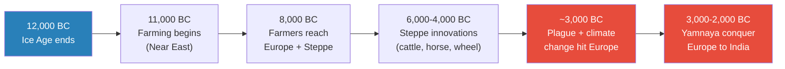

The timeline from the end of the Ice Age to the Yamnaya conquest spans roughly 10,000 years — with the critical innovations emerging in the middle millennia. What appears compressed in a diagram actually unfolded across hundreds of generations, each building incrementally on the last. The key acceleration point comes around 6,000-4,000 BC when steppe peoples began combining pastoral economy with horse domestication and the wheel — innovations that had been developing independently for centuries. By the time plague and climate change struck Europe around 3,000 BC, the Yamnaya had already assembled the complete toolkit for conquest.

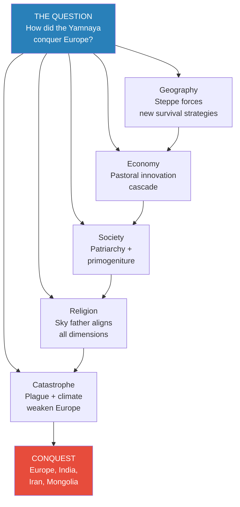

This concept map captures the lecture's entire argument structure in a single view. Prof. Jiang's explanation is not a list of factors but a causal chain — each step creating the conditions for the next. Geography creates the economic problem, which forces innovation, which restructures society, which demands a new religion, which produces a conquest culture. The catastrophes of plague and climate change are the catalysts that turn a powerful steppe culture into an irresistible force. Remove any link in the chain and the conquest might never have happened.

## Key Concepts at a Glance

| Concept | One-line summary |
|---------|-----------------|
| **Social evolution** | Open cooperative competition among many groups — the greatest engine of innovation in human history |
| **The ruthless adopter** | The group that wins is the one that adopts ALL innovations to destroy others — not just some |
| **Pastoral economy** | Cattle herding on grassland — animals eat grass, humans eat animals — the foundational shift |
| **Lactose tolerance** | Genetic mutation enabling milk consumption — gave steppe peoples a 20cm height advantage over farmers |
| **Primogeniture** | Eldest son inherits everything — forces younger sons to raid, creating a war culture |
| **Sky father** | Male supreme deity replacing the mother goddess — source of Zeus and Jupiter |
| **Proto-Indo-European** | Common ancestral language from Europe to India — the linguistic evidence of Yamnaya conquest |
| **Civilisational alignment** | When economy, society, and religion all point in the same direction, a culture becomes unstoppable |

---

## The World Before: Old Europe Under the Mother Goddess

*Before the Yamnaya can destroy Old Europe, Prof. Jiang reminds students what they are about to lose — a civilisation fundamentally unlike anything that came after it, and one that endured for far longer than the patriarchal order that replaced it.*

Prof. Jiang opens the lecture with a deliberate recap of Lectures 3 and 4, not merely for continuity but to establish the emotional and intellectual stakes of what follows. He wants students to understand the full weight of what the Yamnaya conquest destroyed. Old Europe — the civilisation built by Near East farmers who migrated to the continent after the Ice Age — was not simply a different society. It was a different kind of society, operating on principles that would become almost unthinkable after the Yamnaya arrived.

The farmers who settled Europe brought with them the <b style="color: #2980b9">mother goddess religion</b> that had flourished in the Near East. This religion rested on several core beliefs that Prof. Jiang summarises clearly:

- A female supreme deity who gave life to all things — plants, animals, humans
- The unity of all living beings — humans are not above nature but part of it
- A responsibility to protect the natural world — nature is a gift from the goddess
- The pursuit of harmony and balance — conflict disrupts the sacred order
- The belief that every living thing possesses a soul that persists after death

Prof. Jiang connects this to indigenous religions that survive today in Africa, Australia, and the Amazon — peoples who maintained the mother goddess worldview while Europe transformed around them. The survival of this religious framework in isolated communities across the globe suggests that it was once universal — the default human spiritual orientation before the Yamnaya replaced it with the sky father tradition in the Western world.

Because of this religion, Old Europe was <b style="color: #27ae60">egalitarian</b> — no meaningful hierarchy between men and women, with women often occupying positions of social and political leadership because their ability to give birth made them closer to the mother goddess's life-giving power. The civilisation was peaceful — communities felt their resources were sufficient and saw no reason for warfare. And it was artistic — intellectual energies were directed toward creating art that celebrated the mother goddess and the sacred unity of all life. There were no weapons in the archaeological record, no fortifications, no signs of organized violence. This was the world Marija Gimbutas documented and the Yamnaya would annihilate.

The critical detail for understanding what follows is that Old Europe had no concept of private property, no tradition of organised violence, and no social structures designed for warfare. These were not weaknesses in the context of the mother goddess civilisation — they were features of a society that did not need them. But they would prove fatal when a culture that had spent thousands of years perfecting all three arrived at Europe's doorstep. The Yamnaya conquest was not a clash of equals; it was a collision between a civilisation designed for peace and one designed for war.

---

## The Engine of Innovation: Open Cooperative Competition

*Prof. Jiang introduces the master framework that will recur throughout the entire Civilization series — the process that produces humanity's greatest breakthroughs and, paradoxically, its most devastating conquerors.*

After the Ice Age ended around 12,000 years ago, the world began to change rapidly. The warming climate opened up new territories for human settlement, and the farming technology that had developed in the Near East began to spread. Prof. Jiang traces the migration of Near East farmers in two directions, and the difference between those two paths is the engine that drives this entire lecture.

Those who went to Europe were lucky — similar geography meant they could transplant their religion, technology, and way of life with minimal adaptation. As Prof. Jiang explains, these migrants carried the mother goddess religion to Europe, where it took root and flourished: egalitarian communities, artistic expression, and a deep reverence for nature and the feminine principle of life-giving. The geography of Europe was not dramatically different from the Near East — temperate climate, arable land, rivers for irrigation. The farmers could do in Europe exactly what they had done in the Near East, and the civilisation they built reflected that continuity.

But those who ventured onto the <b style="color: #2980b9">Eurasian steppe</b> — the vast ocean of grassland stretching from the edge of Europe all the way to Mongolia — faced an existential crisis. The Chinese word for the steppe, Prof. Jiang notes, is *caoyuan* (草原) — grass plain. And that is precisely the problem. Humans cannot eat grass. Crops barely grow on grassland. The survival strategies that had sustained communities in the Near East and Europe were useless here. Everything had to be reinvented from scratch.

This pressure triggered what Prof. Jiang calls <b style="color: #2980b9">social evolution</b> — and he defines it precisely as a three-part process that would become the most important analytical concept in the entire series.

The definition has three components, each essential:

- **Open:** No central authority, no great power, no hegemon — many groups all competing independently with no one dictating terms.
  - This is crucial because centralised systems tend to suppress experimentation
  - Only decentralised systems allow multiple strategies to be tested simultaneously
- **Cooperative:** The competing groups are still communicating, still trading, still exchanging wives and ideas across tribal boundaries.
  - Competition does not mean isolation
  - The groups learn from each other even as they compete
- **Competitive:** All groups are trying different strategies to survive with desperately scarce resources.
  - The steppe offers no easy path
  - Every group must innovate or die

The combination of these three forces, Prof. Jiang argues, is the single greatest engine of innovation in human history — more powerful than any individual genius or centralised programme. No empire, no matter how wealthy or well-organised, has ever matched the creative output of many independent groups all experimenting simultaneously while communicating freely. The reason is structural: centralised systems can only pursue one strategy at a time, while decentralised systems pursue dozens. When one strategy succeeds, everyone learns from it. When one fails, only one group pays the cost. The result is an extraordinarily efficient form of collective experimentation.

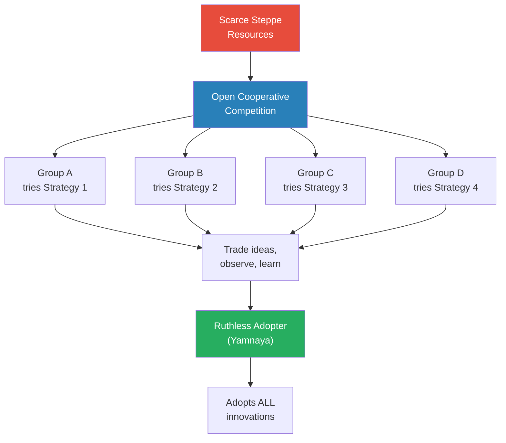

The steppe's scarcity forced many groups into simultaneous competition, each experimenting with different survival strategies while still communicating and trading with one another. Innovation flourished precisely because no single authority could dictate which approach was correct — the environment itself served as the judge. But the winner was not the most creative group or the one that invented the most. It was the group positioned on the margins, watching all the others, that adopted every innovation simultaneously and turned them toward a single purpose: the destruction of competitors. This is the paradox at the heart of social evolution — the innovators create the tools, but the ruthless synthesiser wields them.

Prof. Jiang states <b style="color: #e74c3c">two principles he wants students to remember</b> for the rest of the course. He is explicit that these are not observations about one historical period but laws that apply across all of human history:

1. **Whenever there is open cooperative competition, tremendous innovation happens** — no central authority can match the creative output of many independent groups all experimenting simultaneously
2. **The group that triumphs is the most ruthless at adopting ALL innovations for the sole purpose of destroying others** — not the group that invents the most, but the group that synthesises most ruthlessly

These two principles are the analytical foundation of the entire Civilization series. Prof. Jiang will invoke them repeatedly — when explaining Alexander the Great's conquest of the Greek world, Sargon's conquest of the Sumerian cities, and even the rise of European colonial empires. The first principle explains where innovation comes from (decentralised competition). The second explains who benefits from it (the ruthless synthesiser, not the original innovator). Together, they constitute Prof. Jiang's theory of civilisational change: innovation is a collective process, but conquest is an act of ruthless individual synthesis.

He draws an explicit parallel to Chinese history, asking students to identify the period most resembling the steppe's open competition. The answer — the <b style="color: #2980b9">Spring and Autumn period and the Warring States period</b> — is where most of China's greatest intellectual breakthroughs emerged: Confucius, Laozi, and the foundations of Chinese philosophy. The parallel is precise: many competing states, none dominant, all learning from one another, producing extraordinary innovation — until one state adopted everything and conquered the rest.

The framework also extends to the two other major civilisational explosions that Prof. Jiang will cover in detail later in the series. The <b style="color: #2980b9">Greek city-states</b> — Athens, Sparta, Thebes, Corinth — spent over a century in open cooperative competition, generating philosophy, democracy, theatre, and military innovation that remain foundational to Western civilisation. Then the Macedonians, marginal outsiders whom the Greeks barely considered civilised, adopted all those innovations and conquered everyone. The <b style="color: #2980b9">Sumerian city-states</b> followed the same pattern: a century of competitive innovation among rival cities, then the neighbouring Akkadians — led by Sargon the Great, the world's first empire builder — absorbed everything and established the first world empire. Prof. Jiang is explicit that these are not analogies but instances of the same underlying process.

> [!example] The Macedonian Outsider (c. 500-330 BC)
> - The Greek city-states — Athens, Sparta, Thebes, Corinth, and dozens more — competed intensely for over a century
> - This competition produced extraordinary innovation in every domain: philosophy, democracy, theatre, military tactics, rhetoric, mathematics
> - Athens pioneered democracy and funded the Parthenon; Sparta created history's most formidable ground army; Thebes developed the oblique battle formation
> - None of the city-states could conquer the others; the competition remained stubbornly open, with shifting alliances preventing any hegemon
> - On the periphery, the kingdom of Macedon observed everything — especially the military innovations that each city-state was developing
> - The Greeks did not consider Macedonians truly Greek; they were marginal outsiders, sometimes mocked as barely civilised
> - Philip II of Macedon systematically adopted every Greek military innovation — the phalanx from Thebes, naval power from Athens, discipline from Sparta
> - He then added his own innovation: the sarissa (an 18-foot spear) and the combined arms approach that integrated cavalry, infantry, and siege warfare
> - His son Alexander then conquered all the Greek city-states, then Persia, then Egypt, reaching India before his army refused to go further
> - Alexander the Great — the most famous "Greek" in history — was actually Macedonian, proving that the outsider can become the defining figure of the very civilisation it conquered
> - The city-states that produced all the innovation were conquered by the outsider who adopted it — and the conqueror got the credit
> **The lesson:** Being on the margins of a competitive system is not a disadvantage — it is the optimal position for observation and synthesis. The outsider who watches everyone and adopts everything is more dangerous than any insider, because insiders are invested in their own approach while outsiders are free to take the best from each.

> [!tip] Recurring Pattern
> This exact structure — many groups competing, then one outsider adopting all innovations and conquering everyone — repeats three times in the course: the Yamnaya on the steppe, the Macedonians with the Greek city-states, and the Akkadians with the Sumerian city-states. Prof. Jiang also compares it to China's Spring and Autumn / Warring States period. Each time, the winner is a marginal outsider, not an insider.

---

## The Five Innovations That Changed Everything

*Each innovation on the steppe enabled the next — a cascade that eventually restructured all of human civilisation. No single breakthrough was sufficient; it was their combination and compounding effect that proved unstoppable.*

This section contains the lecture's most detailed analytical contribution: the step-by-step reconstruction of how five innovations, each building on the last, transformed scattered groups of struggling migrants into the most effective conquest culture in ancient history. Prof. Jiang's presentation is deliberately sequential — he wants students to see not just the innovations themselves but the causal logic connecting each one to the next.

The steppe peoples didn't produce one breakthrough. They produced a chain of five, each compounding the last over thousands of years. Prof. Jiang walks through them in sequence, showing how each innovation solved one problem but created new pressures that demanded the next innovation. The result was not a linear improvement but an accelerating cascade — each step making the next both possible and necessary. By the time the fifth innovation locked into place, the steppe peoples had assembled a way of life that no agricultural civilisation could resist.

What makes this cascade remarkable is that it was not planned or directed. No single leader or culture decided to build a war machine. Instead, the harsh logic of steppe survival — the inability to eat grass, the vast distances between groups, the constant threat of cattle theft — pushed innovation in a direction that happened to produce the most effective conquest culture in human history. Prof. Jiang's point is structural: given the geography, this outcome was close to inevitable. The steppe did not merely permit these innovations — it demanded them, one after another, in a sequence that could only end with a war culture.

Each innovation also had social and psychological consequences that compounded the physical ones. The pastoral economy created the concept of personal wealth that could be stolen. Dairy created physical superiority that made violence more rewarding. Horse domestication created mobility that made raiding practical. The wheel created true nomadism that made territorial boundaries fluid. And nomadic pastoral life created the permanent competition over grazing rights that normalised violence as a way of life. By the time all five innovations were in place, the steppe had produced not just a different economy but a different kind of human society — one where aggression, competition, and expansion were not occasional necessities but permanent features of daily existence.

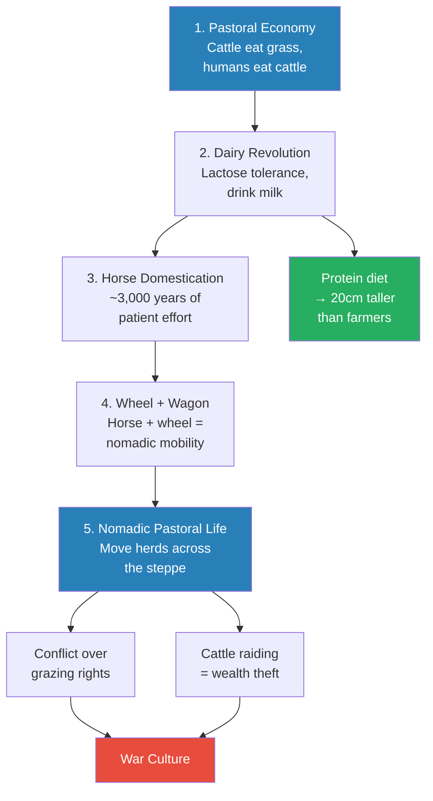

Five innovations cascaded into a war culture — each enabling the next, none sufficient alone. The pastoral economy solved the fundamental problem of eating on a grassland. Dairy unlocked a nutritional advantage that made steppe peoples physically larger and stronger. Horse domestication conquered the vast distances of the steppe. The wheel and wagon gave families true mobility. And nomadic pastoral life — the full package — created the grazing conflicts and cattle-raiding incentives that forged a permanent war culture.

Notice that the cascade branches at the second step: the dairy revolution simultaneously produced physical superiority (the height advantage) while feeding into horse domestication as the next technological step. This branching is significant because it means the innovations were not merely sequential but mutually reinforcing — dairy made steppe peoples physically capable of the demanding life of horse riding, while horse domestication gave them the mobility to find new grazing land for the dairy herds that sustained them. The innovations formed a web, not just a chain.

The cascade also had a built-in acceleration mechanism. Each innovation made the steppe more liveable, which increased population, which increased competition for resources, which created more pressure to innovate. The pastoral economy supported more people than hunting alone. Dairy supported even more. Horse domestication allowed larger territories to be exploited. Wagons allowed entire communities to follow their herds across vast distances. At each step, the carrying capacity of the steppe increased — and with it, the intensity of competition.

### Innovation 1: The Pastoral Economy

The foundational insight was deceptively simple — humans cannot eat grass, but cattle, sheep, and goats can. What the steppe peoples realised was that they could take herd animals from the farming communities they traded with, raise them on the unlimited steppe grassland, and build an entirely new economy around animal products. Prof. Jiang emphasises that this was not a refinement of farming but a <b style="color: #2980b9">complete economic reinvention</b> — the creation of a new relationship between humans, animals, and landscape. Where farmers transformed land into food directly, pastoralists inserted animals as intermediaries, converting the steppe's one abundant resource (grass) into the protein and calories humans needed. The brilliance of this system was its scalability — the steppe has essentially unlimited grassland, so the only limit on herd size was the ability to manage and protect the animals.

### Innovation 2: The Dairy Revolution

The second breakthrough was the realisation that animals provide not just meat but milk — a renewable resource that doesn't require slaughtering the animal. For most of human history, adults were <b style="color: #e74c3c">lactose intolerant</b>; they could not digest milk after infancy. Steppe peoples developed the enzymes and peptides necessary to consume dairy products, giving them access to a high-protein food source that no other population on earth possessed at this scale. The result was dramatic: a protein-rich diet of meat and milk made steppe peoples on average <b style="color: #27ae60">20 centimetres taller</b> than European farmers, who ate mostly wheat and vegetables. Twenty centimetres is an enormous physical advantage — combined with a lifetime of physical labour on horseback, it produced a population of warriors who were dramatically stronger than any farming community they might encounter. Prof. Jiang makes this concrete for his students: imagine a raiding party of men who tower over every farmer in the village, who have spent their lives in physical combat training on horseback, riding into a community of smaller, weaker people who have spent their lives bent over crops.

### Innovation 3: Horse Domestication

The steppe is vast — enormous distances separate one group from another. Trade, communication, and cooperation all required the ability to travel quickly across open grassland. But horses are hardwired to flee from humans; their survival instinct makes them among the most difficult animals to domesticate. Prof. Jiang notes that this process took approximately <b style="color: #2980b9">3,000 years</b> of patient, persistent effort — generation after generation working to tame an animal that evolution had designed to escape. The payoff, however, was transformative: mounted riders could cover distances that were impossible on foot, enabling the communication networks that kept open cooperative competition alive across the steppe. The horse also became the ultimate military technology — a mounted warrior could strike faster, retreat more easily, and cover more ground than any foot soldier, an advantage that would persist for thousands of years until the invention of firearms.

### Innovation 4: The Wheel and Wagon

Horse plus wheel equals wagon — and the wagon equals freedom. Prof. Jiang presents this as the critical enabling technology for true nomadic life. With wagons, entire families and their possessions could move across the grassland, following herds to fresh pasture. This was not merely convenient — it was existential. Cattle eat all the grass in one area, then the entire community must move to find more. Without wagons, families were stuck; with them, the steppe became an infinite resource, limited only by the willingness to keep moving. The wagon also had military implications: it could carry supplies, weapons, and wounded warriors over long distances, enabling sustained campaigns of conquest rather than brief raids.

### Innovation 5: Nomadic Pastoral Life

The full package — mobile herding across the steppe — was the culmination of all four previous innovations working together as a single integrated system. But mobility created new and dangerous problems. Whose grass is this? If your herds eat all the grass in a particular area, you are destroying another group's livelihood. <b style="color: #e74c3c">Grazing rights</b> became a source of violent conflict — the first territorial disputes in human history driven by moveable rather than fixed wealth. And if you cannot find fresh grass, there is always another option: steal someone else's cattle. Prof. Jiang emphasises that the pastoral economy made cattle raiding not just possible but rational — in a world where cattle are private wealth, the fastest path to prosperity is theft. This created the structural incentives for a permanent war culture, one where violence was not an aberration but the normal mode of interaction between groups.

> [!example] The Height Advantage (c. 4000-3000 BC)
> - European farmers ate mostly wheat, barley, and vegetables — a diet with limited protein and poor nutritional balance
> - Their nutrition was actually worse than that of hunter-gatherers, who had more varied diets — agriculture made people smaller, not larger
> - Farming communities showed evidence of nutritional deficiency: dental decay from grain-heavy diets, shorter stature, weaker bones
> - Steppe peoples ate meat daily and drank milk in large quantities — a high-protein diet previously unavailable to any settled human population
> - The genetic mutation for lactose tolerance spread rapidly through steppe populations because it conferred such a dramatic survival advantage
> - Those who could digest milk had access to a renewable, high-protein food source; those who couldn't were at a permanent disadvantage
> - Skeletal evidence from archaeological sites shows steppe peoples averaged 20cm taller than contemporary European farmers
> - Twenty centimetres is not a marginal difference — it is the difference between an average man and a tall man, visible immediately in any encounter
> - Combined with a lifetime of horseback riding, cattle herding, and physical labour in harsh steppe conditions, they were dramatically stronger and more physically resilient
> - Their bodies were conditioned by a lifestyle that demanded constant physical activity — riding, wrestling, fighting, moving camps
> - When a raiding party of these men — mounted on horses, armed with weapons, and 20cm taller — rode into a European farming village, the physical mismatch was overwhelming
> - The farmers had never seen anything like it; their tallest men would barely reach the shoulders of an average steppe warrior
> - This was not genetic superiority but dietary superiority — the same human species, fed differently, produced radically different bodies over generations
> **The lesson:** Diet is destiny — the pastoral economy didn't just feed people differently, it built a physically superior warrior class that no agricultural community could match in combat. The advantage was not innate but structural.

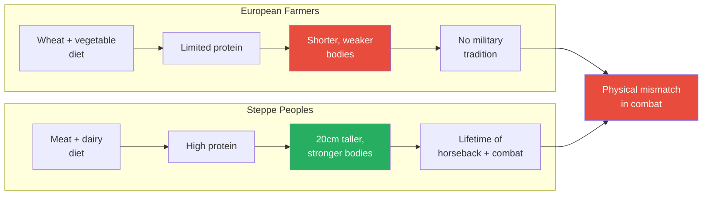

This comparison diagram illustrates the divergent paths that diet and lifestyle created between two populations that were, genetically, essentially the same species. The European farmers' grain-based diet produced smaller, weaker bodies with no military tradition — people optimised for agricultural labour, not combat. The steppe peoples' protein-rich diet of meat and dairy — combined with the physical demands of nomadic herding and constant horseback riding — produced taller, stronger warriors trained in combat from childhood. When these two populations met on the same field, the outcome was not determined by numbers, strategy, or courage but by the accumulated biological consequences of thousands of years of radically different eating habits. The farmers could be brave; they could not be tall.

---

## From Economy to Religion: The Great Transformation

*Private property led to patriarchy, patriarchy to primogeniture, primogeniture to war culture — and religion adapted at every step to justify the new order. Prof. Jiang shows how three dimensions of civilisation locked into a self-reinforcing loop that, once closed, could never be opened from within.*

The five innovations didn't just change how people survived on the steppe. They restructured <b style="color: #e74c3c">everything</b> — economy, society, and religion — into a single system aligned for conquest. Prof. Jiang walks through this transformation step by step, emphasising that no single change was decisive on its own. It was the alignment of all three dimensions — economic incentives, social structures, and religious justification — that made the Yamnaya culture unstoppable. A group that adopted the pastoral economy but kept the mother goddess religion would have lacked the ideological drive for conquest. A group that embraced patriarchy but split inheritance equally would have fragmented its wealth. Only the complete package — private property, patriarchy, primogeniture, war culture, and sky father religion — produced the ruthless expansion machine that overran an entire continent.

This is what Prof. Jiang calls <b style="color: #2980b9">civilisational alignment</b> — when every aspect of a culture points in the same direction. He will return to this concept repeatedly throughout the series, using it to explain why some civilisations triumph over others despite apparent disadvantages in population, technology, or geography. The Yamnaya are the first and clearest example: a culture where the economy rewarded aggression, the social structure produced aggressive young men, and the religion commanded them to fight.

The concept of alignment also explains why partial adoption failed. Prof. Jiang notes that many steppe groups adopted some of these innovations — perhaps the pastoral economy and horse domestication but not primogeniture, or the patriarchal social structure but not the sky father religion. These partially-adopted groups were defeated by the Yamnaya precisely because their culture contained internal contradictions. A group that herded cattle but shared property communally lacked the competitive drive that primogeniture produced. A group that practiced patriarchy but worshipped the mother goddess faced a moral framework at odds with its social structure. Only complete alignment — every economic incentive, every social mechanism, every religious commandment pointing toward the same goal — produced the irresistible force that conquered a continent.

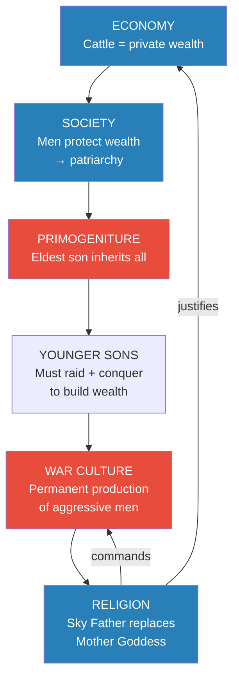

Economy, society, and religion locked into a self-reinforcing loop — each justifying and strengthening the others. Private property created the need for male protectors, which created patriarchy, which created primogeniture, which created surplus aggressive young men, which created a war culture, which demanded a religion that celebrated conquest — and that religion, in turn, legitimised private property and war. Once this loop was closed, there was no internal mechanism to stop it. Each element reinforced every other element, making the system extraordinarily stable and extraordinarily dangerous to anyone outside it. Prof. Jiang's key analytical point is that the Yamnaya didn't choose to become conquerors — the logic of their system made conquest the only rational behaviour for the younger sons it produced in every generation.

### The Economic Shift: Private Property

Prof. Jiang identifies the concept of private property as the foundational rupture between Old Europe and the steppe world. In Old Europe, there was <b style="color: #27ae60">no concept of private property</b> — everything belonged to the community and ultimately to the mother goddess. Land was shared. Food was shared. Shelter was communal. The very idea that something could belong to one person and not to others would have been incomprehensible within the mother goddess framework, where all things are connected and all beings are children of the same deity.

On the steppe, cattle changed everything. Cattle are private wealth. You raised them, you fed them, you protect them — they belong to you and only you. Prof. Jiang stresses how revolutionary this single idea was: <b style="color: #e74c3c">"this belongs to you and only you, not to society or to the mother goddess."</b> This was not merely an economic innovation but a philosophical revolution — the notion that an individual could own something separate from the community, that wealth could be accumulated by one person and defended against all others by force. Every subsequent transformation — patriarchy, primogeniture, war culture, the sky father religion — flows from this single conceptual shift. Without private property, none of the rest makes sense. With it, all of it becomes inevitable.

### The Social Shift: Patriarchy and Primogeniture

Old Europe was governed primarily by women — because the power to give life made women superior in a religion centred on the mother goddess. Women held social authority, directed community activities, and served as the primary connection to the divine. Men played important roles in hunting and physical labour, but the governing principle of the society placed life-giving — and therefore women — at the centre.

On the steppe, the constant violence over grazing rights and cattle raiding elevated men — the fighters and protectors — to dominance. When your wealth walks on four legs and can be stolen by a raiding party at any time, the people who fight off the raiders become the most important members of the community. Society became a <b style="color: #e74c3c">patriarchy</b>: men in control, men making decisions, men holding wealth. This was not an ideological choice but a practical one — in a world of constant violent competition, physical strength and fighting ability determined who survived and who didn't.

But patriarchy alone does not produce a war culture. The critical mechanism was the inheritance problem, and Prof. Jiang illustrates it with a vivid arithmetic example that makes the logic inescapable.

A patriarch has 100 cattle and 10 sons. If he splits the wealth equally, each son gets 10 cattle. Those 10 sons each have 10 sons — now 100 grandsons share 100 cattle, one each. Within two generations, a wealthy family has been reduced to poverty. The maths are ruthless: equal division of finite wealth across expanding generations leads inevitably to impoverishment. The only solution is <b style="color: #2980b9">primogeniture</b> — the eldest son inherits everything. This preserves the family's wealth and power intact across generations. But the consequence is devastating for the other nine sons: they have nothing. No cattle, no wealth, no wives (since wives must be won or purchased with wealth in a patriarchal society). Their only option is to build their own wealth by <b style="color: #e74c3c">stealing cattle and raiding other peoples</b>.

This created a permanent, structural war machine — a society that in every generation produced waves of aggressive young men with nothing to lose and everything to gain from violence. These were not criminals or outcasts; they were the normal product of a rational inheritance system. The society did not need propaganda or ideology to motivate them — the economic logic of primogeniture compelled them to fight. It was not that the Yamnaya chose war; their inheritance system guaranteed it.

> [!example] The Primogeniture Engine (c. 4000-3000 BC)
> - A patriarch accumulates 100 cattle over a lifetime of herding and raiding — representing enormous wealth in the pastoral economy
> - He has 10 sons — common in a society that values male offspring as warriors, protectors, and future raiders
> - If wealth is divided equally, each son receives only 10 cattle — insufficient to sustain a family, let alone a dynasty
> - Within one generation, a powerful family becomes ten poor families; by the third generation, each family has one cow
> - The mathematics are merciless: equal division + population growth = guaranteed impoverishment within two generations
> - The solution: primogeniture — the eldest son inherits everything, preserving the family's wealth and power intact
> - The eldest son maintains the family's social position, political influence, and economic viability
> - Nine younger sons are left with nothing — no cattle, no wealth, no wives, no social standing
> - In a patriarchal society, a man without wealth cannot attract a wife — so these nine men are also denied families
> - These nine men must now acquire wealth through the only means available to them: raiding other groups, stealing cattle, and taking women
> - They ride into neighbouring territories in bands, kill rival men, seize their cattle, and take their women as wives
> - This process repeats every generation — each prosperous family producing eight or nine surplus aggressive young men
> - Across the entire steppe culture, this means hundreds of young men every generation with no choice but to raid
> - The society does not need to motivate young men to fight; the system structurally compels them to violence
> **The lesson:** Primogeniture was not just an inheritance rule — it was a war engine that converted family succession into permanent territorial expansion, producing a never-ending supply of warriors with nothing to lose.

### The Religious Shift: Sky Father Replaces Mother Goddess

The religion transformed to match the new economy and society. Prof. Jiang presents this not as a gradual drift but as a comprehensive replacement — every aspect of the old religion was inverted to serve the new order. Where the mother goddess celebrated life, unity, and harmony with nature, the <b style="color: #2980b9">sky father</b> celebrated wealth, competition, and dominance over others. This was the third and final transformation: once the economy had shifted to private property and society had shifted to patriarchy and primogeniture, the religion had to change to legitimise both. A community of cattle-raiding warriors could not worship a goddess who commanded them to love all living things and protect nature — they needed a god who commanded them to fight for wealth and rewarded the strongest.

Prof. Jiang identifies three specific changes in the religious system. First, the supreme deity shifted from female to male — the sky father replaced the mother goddess. This was not merely symbolic: it reflected and legitimised the shift from a society where women's life-giving power was the highest value to one where men's wealth-protecting and war-fighting power was supreme. Second, the divine gift shifted from life and nature to cattle, wealth, and property — god no longer gave birth to all living things but instead bestowed material wealth on the deserving. This transformed the relationship between humans and the divine from one of gratitude and stewardship to one of competition and entitlement. Third, the divine commandment shifted from "love everything and protect nature" to "fight each other for the right to have wealth." This sanctified violence as a religious duty, not merely a practical necessity — making war holy rather than merely inevitable.

These are not minor theological adjustments; they represent a complete inversion of the moral universe. The mother goddess religion said: all life is sacred, all beings are connected, violence is forbidden, nature must be protected. The sky father religion said: wealth is sacred, individuals compete, violence is commanded, nature is a resource. Every fundamental moral principle was reversed.

| | Mother Goddess (Old Europe) | Sky Father (Yamnaya) |
|---|---|---|
| **Supreme deity** | Female — giver of life | Male — giver of wealth |
| **What god provides** | Nature, harmony, unity | Cattle, money, property |
| **What god commands** | Love everything, protect nature | Fight each other for wealth |
| **Social order** | Egalitarian, women-led | Patriarchal, warrior-led |
| **View of nature** | Sacred — all life connected | Resource — to be exploited |
| **Relationship to violence** | Forbidden — no weapons in archaeology | Celebrated — war is sacred duty |
| **Descendants** | Indigenous religions worldwide | Zeus (Greek), Jupiter (Roman) |

The sky father was the direct ancestor of the gods we know from classical antiquity — <b style="color: #2980b9">Zeus</b> in the Greek tradition and <b style="color: #2980b9">Jupiter</b> in the Roman. The Vedic Indian tradition preserves an even closer echo: <b style="color: #2980b9">Dyaus Pitar</b>, literally "sky father," is linguistically identical to Jupiter — proof that these traditions descended from the same Yamnaya religious root. Where the mother goddess asked humanity to love and protect all life, the sky father asked humanity to compete, conquer, and accumulate. Where the mother goddess united all living things into a single sacred web, the sky father divided the world into winners and losers. This was not merely a change in mythology — it was a change in the fundamental moral framework that would govern Western civilisation for the next five thousand years.

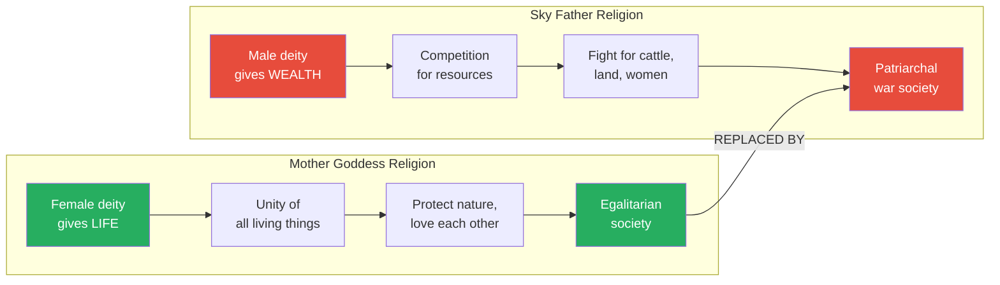

This diagram captures the totality of the religious transformation — not a partial reform but a complete inversion of values. The mother goddess religion placed life-giving at the centre of sacred meaning and derived an egalitarian, nature-protecting social order from it. The sky father religion placed wealth-accumulation at the centre and derived a patriarchal, war-driven social order from it. Prof. Jiang's point is not that one religion was "better" than the other in moral terms, but that the sky father religion was perfectly aligned with the steppe economy and social structure, creating a civilisation where every dimension — economic, social, spiritual — pointed toward expansion and conquest.

> [!tip] Core Insight
> Prof. Jiang's key point: the Yamnaya won because their economy, society, and religion were all aligned. Groups that adopted some innovations but not others lost to the group that adopted ALL of them and brought every dimension — economic, social, religious — into alignment for conquest. Partial adoption was worse than no adoption at all.

> [!abstract] Why the Yamnaya Won: Five Factors
> | Factor | Mechanism | Importance |
> |--------|-----------|------------|
> | **Civilisational alignment** | Economy + society + religion all pointed toward conquest | Primary — this is what made them different from other steppe groups |
> | **Physical superiority** | 20cm taller, stronger from dairy/meat diet + horseback life | Enabled military dominance in individual combat |
> | **Plague asymmetry** | Dense farming = plague incubator; nomadic = plague-resistant | Destroyed Europe's numerical advantage before invasion |
> | **Climate change** | Mini ice age destroyed crops, pushed Yamnaya westward | Weakened survivors and created push factor for expansion |
> | **Primogeniture war engine** | Every generation produced surplus aggressive young men | Created permanent structural pressure for expansion |

The five factors listed above are not independent — they interact and amplify each other. Civilisational alignment made the Yamnaya culturally unified. Physical superiority made their warriors individually dominant. The plague destroyed the opposition's numbers. Climate change weakened the survivors. And the primogeniture war engine ensured a permanent supply of motivated raiders. Any one of these factors alone might have been insufficient. Together, they made the conquest not just possible but, in Prof. Jiang's framing, structurally inevitable.

---

## How the Yamnaya Conquered Europe

*Europe had more people — but plague, climate change, and military superiority shattered its ability to resist. The numerical advantage of settled farmers counted for nothing against the triple catastrophe that Prof. Jiang ranks in order of importance.*

Prof. Jiang poses a puzzle that should trouble any student of history. The Yamnaya were stronger and more militaristic, yes — but Europe had a <b style="color: #27ae60">larger population</b>. Farming communities could number 10,000 people or more. The Yamnaya, spread thinly across the steppe in small nomadic bands, were vastly outnumbered. In theory, sheer numbers should have held the line. Agricultural civilisations had successfully resisted nomadic raiders many times throughout history. So what went wrong? Why did Europe's numerical advantage count for nothing?

Prof. Jiang's answer reveals one of the most important dynamics in all of human history: the interaction between disease, climate, and military conquest. He argues that the Yamnaya did not conquer Europe through military superiority alone — they could not have. Instead, two prior catastrophes (plague and climate change) destroyed Europe's population and economy, reducing what should have been an overwhelming numerical advantage to a weakened remnant. The Yamnaya military assault was real and devastating, but it was the final blow delivered to a civilisation already on its knees. Understanding this triple catastrophe — and the asymmetric way plague affected dense farming communities versus dispersed nomadic ones — is essential to understanding how a numerically inferior force conquered an entire continent.

The answer, Prof. Jiang explains, lies in three forces converging within a short historical window, each one devastating on its own, and together absolutely annihilating Europe's capacity to resist. He is careful to rank them in order of importance: the plague was the most critical factor, climate change the second, and the Yamnaya military assault was the final blow.

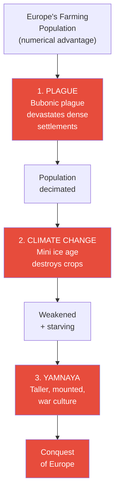

Three forces converged in sequence to neutralise Europe's numerical advantage. Plague struck first and hardest, killing the majority of Europe's dense farming population. Climate change followed, destroying crops and collapsing the agricultural economy that sustained the survivors. Finally, the Yamnaya warriors — physically larger, mounted on horses, and culturally programmed for conquest — swept into a continent that had already lost most of its population and all of its economic stability. The order matters: without the plague, Europe might have had enough people to resist; without climate change, the survivors might have rebuilt; the Yamnaya military assault was devastating but delivered the final blow to a civilisation already on its knees.

### Factor 1: The Plague (Most Important)

The <b style="color: #e74c3c">bubonic plague</b> spread everywhere — Europe, the Near East, and the steppe — confirmed by DNA evidence recovered from ancient burial sites. But it devastated farming communities while barely touching steppe peoples. Prof. Jiang identifies three reasons for this catastrophic asymmetry, and he is explicit that understanding this asymmetry is the key to understanding the entire conquest:

- **Density:** Farmers lived 10,000 to a settlement, packed together alongside pigs, rats, and accumulated waste — ideal conditions for disease transmission. Every infected person could spread the plague to hundreds of neighbours within days. Steppe peoples lived far apart in small, mobile bands — the disease simply could not spread efficiently
- **Hygiene:** Farm life meant permanent cohabitation with animals and their waste. Settlements accumulated filth over decades — human waste, animal waste, rotting food, vermin. Nomadic life was inherently cleaner — no permanent accumulation of refuse, constant movement to fresh ground, fewer animals living in close proximity to sleeping areas
- **Physical health:** Steppe peoples were stronger from protein-rich dairy and meat diets, constant physical exercise from horseback riding and herding, and exposure to a harsher environment that selected for physical resilience. Their immune systems, supported by better nutrition, were better equipped to survive infection. European farmers, eating grain-heavy diets with limited protein, had weaker constitutions

The plague's asymmetry was not about different diseases or different exposures — it was the same plague, the same pathogen, spreading through the same trade networks. The difference was entirely in how the two populations lived. Dense, sedentary, poorly-nourished farming communities were plague incubators. Dispersed, mobile, well-nourished nomadic communities were plague-resistant. The same living conditions that made farming communities productive (density, settlement, animal husbandry) made them catastrophically vulnerable to epidemic disease.

> [!example] The Plague Parallel: Europe and the Americas (c. 3000 BC / 1500 AD)
> - When Europeans colonised North and South America beginning in the late 1400s, they brought diseases the indigenous population had never encountered
> - Smallpox, measles, influenza, and typhus killed the vast majority of indigenous peoples — estimates range from 50% to 90% of the total population
> - The great civilisations of the Americas — Aztec, Inca, Maya — were not primarily defeated by European military technology
> - Military conquest was secondary; disease did the real work of destruction, hollowing out populations before armies even arrived
> - The exact same pattern had played out 4,500 years earlier on the Eurasian landmass
> - The bubonic plague spread through trade networks connecting the steppe, Near East, and Europe
> - Dense farming settlements of up to 10,000 people became incubators for epidemic disease — the plague spread faster than any warning could travel
> - Mobile steppe communities of a few dozen families were barely touched — there simply weren't enough people in close proximity to sustain an epidemic
> - The plague destroyed most of Europe's population before the Yamnaya even arrived in force — the conquest was largely a mopping-up operation
> - In both cases — the Americas in 1500 AD and Europe in 3000 BC — disease, not warfare, was the primary agent of demographic collapse
> - The conquerors in both cases walked into a landscape already emptied by epidemic, facing scattered survivors rather than organised resistance
> - Prof. Jiang draws this parallel explicitly, using the better-documented American example to illuminate the less-documented European one
> **The lesson:** The most devastating weapon in human history has never been a sword, a horse, or a gun — it has been disease transmitted between populations with different immunities. Conquest is usually a mopping-up operation after biology has done the real work.

### Factor 2: Climate Change

About 5,000-6,000 years ago, a <b style="color: #e74c3c">mini ice age</b> struck Europe. For farmers, this was catastrophic — crops failed, the agricultural economy that sustained dense populations collapsed, and communities that had survived the plague now faced starvation. The timing was devastating: plague had already killed most of the population, and now the survivors could not grow food. Prof. Jiang notes that climate change also affected steppe peoples, but far less severely. The pastoral economy was inherently more resilient than agriculture because it did not depend on a single crop cycle — cattle can forage on dried grass and survive cold far better than wheat crops can survive frost. A bad winter might kill some cattle, but it would not destroy the entire economic foundation of a pastoral community the way a failed harvest destroyed a farming village.

Climate change also created a powerful push factor. As temperatures dropped, steppe peoples faced increasing pressure to expand their territory westward into Europe, searching for resources and fresh grazing land that their own cold-damaged pastures could no longer provide. Climate change thus served a dual function in the conquest narrative: it weakened European resistance by destroying the agricultural economy while simultaneously driving the Yamnaya toward European territory. The two forces — European collapse and Yamnaya expansion — converged at exactly the wrong moment for Europe's surviving farmers.

### Factor 3: The Conquest Itself

The actual conquest unfolded over hundreds of years and was carried out not by a single nation but by a <b style="color: #2980b9">single culture</b> — many different Yamnaya groups, all sharing the same beliefs, economy, and social structure. This is a crucial distinction that Prof. Jiang returns to several times: the Yamnaya were not an army or an empire. They were a set of ideas — about property, gender, religion, and violence — that spread through many different groups simultaneously. There was no Yamnaya capital, no Yamnaya king, no Yamnaya army. There was only a Yamnaya way of life, and every group that adopted it fully became part of the conquest.

Prof. Jiang describes the mechanism of conquest with stark clarity: young Yamnaya men — the younger sons left with no wealth and no wives by primogeniture — rode into European farming villages. <b style="color: #e74c3c">They killed the men and married the women.</b> Some groups experimented with different approaches — taking the women while letting the men survive. But the surviving men would return with their neighbours, forming larger groups to fight back. This taught the Yamnaya that leaving enemy men alive was strategically foolish — an early and brutal lesson in the logic of total warfare. Violence escalated on both sides over centuries, but the outcome was never in doubt: a plague-decimated, climate-weakened farming population could not resist a physically superior, militarily organised, and ideologically driven conquest culture.

DNA evidence confirms the result with devastating clarity: nearly all modern Europeans carry significant Yamnaya ancestry. The genetic record shows a near-complete replacement of the male lineages in Europe — Yamnaya Y-chromosomes dominate the continent — while female lineages show more continuity with pre-Yamnaya populations. This is exactly the genetic signature you would expect from a conquest where men were killed and women were taken as wives. The DNA tells the same story that Prof. Jiang narrates: Yamnaya men married European women, and the children inherited their fathers' culture. Within a few generations, the genetic and cultural identity of Old Europe was effectively erased from the male line.

Prof. Jiang notes that the DNA evidence is "pretty stark" — his understated description of one of the most dramatic genetic transitions in human history. The replacement was not total (Sardinia and other island refuges preserved some pre-Yamnaya genetics), but on the mainland it was overwhelming. Modern Europeans are, genetically, predominantly Yamnaya descendants. The egalitarian, peaceful, artistic civilisation of Old Europe left almost no genetic trace in the male lineage — only in the female line, the silent testimony of the women who were taken.

### The Evidence: What We Know and How

Prof. Jiang draws on multiple lines of evidence throughout this lecture, weaving them together into a single narrative. The strength of his argument comes from the convergence of independent evidence types — each one supporting the same story from a different angle.

| Evidence Type | Specific Evidence | What It Proves |
|--------------|-------------------|----------------|
| **DNA (plague)** | Bubonic plague DNA found in burial sites across Europe, Near East, steppe | Plague was universal but asymmetrically lethal |
| **DNA (ancestry)** | Nearly all Europeans carry Yamnaya Y-chromosomes | Male lineage replacement — men killed, women taken |
| **DNA (exception)** | Sardinians carry less Yamnaya DNA | Island refuges confirm the conquest pattern |
| **Skeletal** | Steppe peoples averaged 20cm taller than farmers | Diet-driven physical advantage |
| **Genetic** | Lactose tolerance mutation in steppe populations | Dairy revolution was real, not theoretical |
| **Archaeological** | Forest burning in Norway | Yamnaya tried to recreate steppe conditions |
| **Linguistic** | Proto-Indo-European language family | Single culture spread from Europe to India |
| **Comparative** | Same pattern in Greek and Sumerian city-states | Open competition → ruthless adopter is structural |

The convergence of these independent evidence types — genetic, archaeological, linguistic, skeletal, and comparative — makes the Yamnaya conquest one of the best-documented civilisational transformations in ancient history. No single line of evidence would be conclusive on its own, but together they tell a consistent story from every angle.

---

## The Reach of the Conquest — and Its One Limit

*The Yamnaya culture spread from Ireland to India — creating a single civilisational zone we now call "the West." Only the Himalayas stopped them reaching China, and that geographic accident shaped the next five thousand years of world history and explains why East and West developed along fundamentally different civilisational paths.*

The conquest did not stop at Europe's borders. As different Yamnaya groups adapted to local geography and absorbed local technologies, they continued spreading in every direction. They reached <b style="color: #2980b9">England</b> by conquering coastal peoples who had shipbuilding technology, learning to build boats, and sailing across the channel. They spread to <b style="color: #2980b9">India</b>, where their descendants became the Vedic civilisation that would produce Hinduism and the caste system. They reached <b style="color: #2980b9">Iran</b>, where Zoroastrianism would later emerge from the sky father tradition. And they spread to <b style="color: #2980b9">Mongolia</b>, where the pastoral nomadic tradition would persist for thousands of years until Genghis Khan carried it to its ultimate expression. A common language emerged across this vast territory: <b style="color: #2980b9">Proto-Indo-European</b>, the ancestral language from which Greek, Latin, Sanskrit, Persian, Germanic, Celtic, Slavic, and most modern European languages descend. This linguistic evidence is among the strongest proof of the Yamnaya conquest — the fact that languages spoken from Ireland to India share a common ancestor demonstrates that a single culture once spread across this entire territory.

A common religion — the sky father tradition — and constant trade and communication linked this zone into what Prof. Jiang calls "the West." From this point forward in history, peoples from Europe to India were in continuous contact, trading ideas, technologies, and religious concepts. The sky father who began as the Yamnaya's supreme deity evolved into Zeus for the Greeks, Jupiter for the Romans, and Dyaus Pitar in Vedic Indian tradition — the same deity wearing different cultural clothing across thousands of miles. This was not coincidence but inheritance: these civilisations all descended from the same Yamnaya cultural root. Prof. Jiang's point is that "the West" is not a modern concept but a five-thousand-year-old one — a cultural zone created by the Yamnaya conquest and defined by a shared language family, shared religious tradition, and shared set of social structures (patriarchy, private property, competitive individualism).

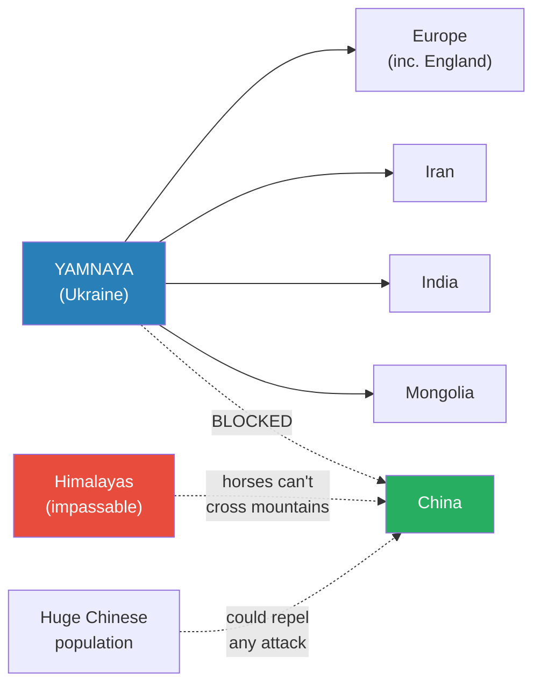

The Yamnaya culture spread in every direction from its origin in what is now Ukraine — west to the Atlantic, south to Iran, east to Mongolia, and southeast to India. Only China remained outside this cultural zone, protected by a double shield of geography and demography. The Himalayas are impassable on horseback — the primary military technology of the steppe peoples — and China's large population meant that even if some raiders penetrated the mountain barrier, they would face resistance on a scale the depleted European farmers could never muster.

This geographic accident would prove one of the most consequential in human history. It meant that China developed its civilisation independently, creating a parallel but fundamentally different cultural stream that would only intersect with "the West" thousands of years later. While Europe, the Near East, India, and Iran shared a common Yamnaya heritage — the same language family, the same sky father religion, the same structures of patriarchy and private property — China evolved its own answers to the fundamental questions of human social organisation. Prof. Jiang's point is that the East-West divide we see in the modern world is not a product of recent history or political ideology; it is a five-thousand-year-old geographic consequence of the Himalayan mountain range blocking the spread of steppe horses.

### Adaptation and Absorption

The conquest was not a simple replacement but a slow cultural absorption over hundreds of years. Each conquering group adapted to local geography while maintaining the core Yamnaya culture of patriarchy, private property, and the sky father religion. Prof. Jiang emphasises that the Yamnaya were not one nation or one people — they were one culture, practiced by many different groups who adapted the core principles to local conditions while keeping the essential values intact. This flexibility was itself a decisive strength: unlike a centralised empire that might shatter if its centre fell, the Yamnaya cultural expansion had no centre to attack. Each local group was independently viable, carrying the full cultural toolkit wherever it went. The culture was the army, and the army was everywhere.

> [!example] Yamnaya Adaptation in Norway and Coastal Europe
> - Early Yamnaya settlers in Norway attempted to recreate their homeland on the steppe
> - They burned down entire forests to create open grassland — the only landscape they knew how to live on
> - Archaeological evidence of deliberate forest burning has been found at multiple Norwegian sites
> - The experiment failed — Norway's climate, soil, and geography could not sustain steppe-style nomadic pastoralism
> - The forests grew back, the grassland wouldn't hold, and the cattle couldn't thrive as they had on the steppe
> - Gradually, over generations, these settlers adopted agriculture, blending their Yamnaya culture with local farming techniques
> - They kept the core values — patriarchy, private property, sky father worship — but changed their economic practice
> - Coastal conquests followed a different pattern of technological absorption entirely
> - The Yamnaya had no shipbuilding technology — they were grassland people who had never needed boats and had never seen the open sea
> - When they conquered coastal peoples, they killed the men but preserved the knowledge of how to build ships
> - They learned the technology from captives or by observing construction techniques before killing the builders
> - They built their own vessels and sailed to new territories — this is how the Yamnaya reached England
> - The pattern repeated across the continent: conquer a people, absorb their local technology, use it to conquer further
> - Each adaptation made the Yamnaya cultural package more versatile while its core values remained unchanged
> **The lesson:** The Yamnaya succeeded not just through military force but through a remarkable capacity for technological absorption — they could conquer a people, learn their skills, and turn those skills toward further conquest. This adaptability meant that no geographic barrier except the Himalayas could ultimately stop them.

### Three European Responses

The farming communities of Europe responded to the Yamnaya onslaught in three ways, each with its own outcome. Prof. Jiang presents these not as strategic choices but as the only options available to a population that was already depleted by plague and weakened by famine:

- **Fight:** Communities that resisted militarily were destroyed. They lacked the physical size, weapons technology, horse-mounted mobility, and warrior culture of the Yamnaya. A farming village of a hundred people, weakened by plague and starvation, had no realistic chance against mounted warriors who were 20cm taller, armed, and trained for combat from childhood. Military resistance was brave but futile
- **Cooperate:** Communities that tried coexistence were generally exploited and eventually absorbed. The Yamnaya took what they wanted — women, cattle, land — and offered little in return. Cooperation was not a partnership between equals but a relationship between a conquering culture and a subjugated one. Over time, the cooperating communities lost their identity entirely, absorbed into the Yamnaya cultural system
- **Flee:** Communities that escaped to islands survived. <b style="color: #27ae60">Sardinia</b> is the best-documented example — its island population carries measurably less Yamnaya DNA than mainland Europeans, providing genetic evidence that confirms both the conquest pattern and the effectiveness of geographic isolation as the only reliable defence. But islands were the only refuge; on the mainland, there was nowhere the Yamnaya could not reach on horseback

### Before and After: Two Civilisations Compared

The Yamnaya conquest was not a gradual transition but a civilisational replacement. Prof. Jiang frames the contrast in the starkest possible terms — every fundamental aspect of human social organisation was inverted.

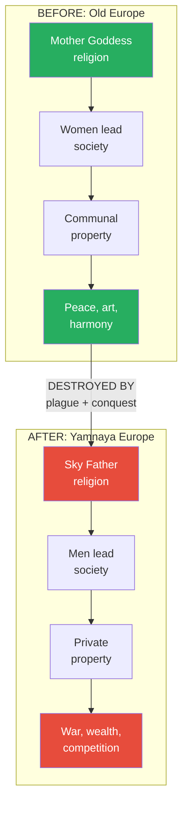

This before-and-after comparison captures the totality of what the Yamnaya conquest meant for human civilisation. Every foundational structure was replaced: the governing religion shifted from female to male deity, social leadership shifted from women to men, property shifted from communal to private, and the dominant cultural activity shifted from artistic creation to military conquest. The arrows flow in one direction — from the old world to the new — because the transformation was irreversible. Once the Yamnaya cultural system was installed, its self-reinforcing logic (economy drives society, society drives religion, religion legitimises economy) made it extraordinarily resistant to change.

Prof. Jiang pauses here to let the full weight of this transformation settle. His formulation is deliberately stark: "Before the Yamnaya, humans were egalitarian, peaceful and artistic. Now with the Yamnaya, you have patriarchy, war, money. But before we didn't have these concepts." The words "we didn't have these concepts" are the key — not just that the practices changed, but that the very ideas of patriarchy, warfare, and monetary wealth did not exist in human civilisation before this moment. The Yamnaya didn't just conquer territory; they invented a new way of being human and imposed it on everyone they reached. Prof. Jiang's point is not that Old Europe was perfect or that the Yamnaya world was entirely negative — it is that the transformation was complete. Nothing from the old world survived intact. The structures the Yamnaya installed — patriarchy, private property, competitive religion, war culture — remain the foundations of Western civilisation to this day.

> [!abstract] Summary: The Complete Yamnaya Transformation
> | Dimension | Before (Old Europe) | After (Yamnaya) |
> |-----------|-------------------|-----------------|
> | **Economy** | Communal property, shared resources | Private property, individual wealth |
> | **Social structure** | Egalitarian, women-led | Patriarchal, warrior-led |
> | **Inheritance** | Communal (no concept of inheritance) | Primogeniture (eldest son takes all) |
> | **Religion** | Mother goddess, life-giving | Sky father, wealth-giving |
> | **Attitude to violence** | No weapons, no warfare | War culture, raiding normalised |
> | **Attitude to nature** | Sacred, must be protected | Resource, to be exploited |
> | **Young men's role** | Art, farming, community service | Raiding, conquest, wealth accumulation |
> | **Gender relations** | Women superior (give life) | Men superior (protect wealth) |

---

## The Recurring Pattern: Three Civilisations, One Structure

*The steppe wasn't unique — the same open-competition-then-conquest pattern played out with the Greeks and the Sumerians. Prof. Jiang presents this as a law of history, not a coincidence — and the implications for any society that values innovation are deeply unsettling.*

Prof. Jiang does not present the Yamnaya conquest as a one-time event. He places it alongside two other instances of the identical pattern — the Greek city-states and the Sumerian city-states — to argue that open cooperative competition always ends the same way. Many groups innovate in parallel, trading and learning from one another, producing extraordinary breakthroughs — and then a marginal outsider adopts all those innovations and conquers everyone. The pattern is so consistent across such different times and geographies that Prof. Jiang treats it as something close to a historical law.

The three instances span thousands of years and thousands of miles, yet they follow the same script with eerie precision:

1. First, many small groups compete in a decentralised system with no hegemon
2. Second, this competition produces extraordinary innovation — military, technological, cultural, intellectual
3. Third, a group on the periphery — close enough to observe but marginal enough to avoid being invested in any single innovation — synthesises everything into a single system
4. Fourth, this synthesiser conquers everyone, including the original innovators

Prof. Jiang asks students to consider whether this pattern is coincidence or structure. His answer is clearly the latter.

What makes this pattern intellectually disturbing is its implication for the innovators themselves. The Greek city-states generated philosophy, democracy, theatre, and military tactics — the foundations of Western intellectual life. The Sumerian city-states invented writing, mathematics, and urban planning. In both cases, the civilisations that produced the most were not the ones that survived. They created the tools; an outsider wielded them. Innovation, in Prof. Jiang's framework, is a gift to the ruthless. The most creative civilisations in history were also the most vulnerable, precisely because their openness to experimentation and exchange also exposed their innovations to observation by peripheral competitors.

This raises an uncomfortable question that Prof. Jiang leaves largely implicit but that hangs over the entire series: is there any way to enjoy the benefits of open cooperative competition — the extraordinary innovation it produces — without also producing the ruthless adopter who will eventually destroy the system? The historical record, at least as Prof. Jiang presents it, suggests not. Every instance of open competition he examines ends the same way: innovation, synthesis by an outsider, conquest. The engine that produces humanity's greatest breakthroughs also produces its greatest destroyers.

```mermaid
flowchart TB
    subgraph Steppe ["Steppe (c. 4000-3000 BC)"]
        S1["Many tribes in<br/>open competition"] --> S2["Yamnaya adopt<br/>ALL innovations"] --> S3["Conquer Europe,<br/>India, Iran"]
    end
    subgraph Greece ["Greece (c. 500-330 BC)"]
        G1["City-states in<br/>open competition"] --> G2["Macedonians adopt<br/>ALL innovations"] --> G3["Alexander conquers<br/>Greece, Persia, Egypt"]
    end
    subgraph Sumer ["Sumer (c. 2500-2300 BC)"]
        SU1["City-states in<br/>open competition"] --> SU2["Akkadians adopt<br/>ALL innovations"] --> SU3["Sargon builds<br/>first world empire"]
    end
    style S2 fill:#e74c3c,color:#fff
    style G2 fill:#e74c3c,color:#fff
    style SU2 fill:#e74c3c,color:#fff
```

The same three-act structure — open competition, ruthless adoption, total conquest — plays out across three separate civilisations separated by thousands of years and thousands of miles. In each case, the first act produces extraordinary innovation as multiple groups compete while still communicating and learning from one another. The second act sees a marginal outsider — not a central participant in the competition but an observer on the periphery — synthesise all innovations into a single system. The third act is conquest. The consistency of this pattern across such different contexts is what makes Prof. Jiang treat it as structural rather than accidental.

In every case, the <b style="color: #e74c3c">winner was not an insider</b> but a marginal outsider — a group positioned on the edge of the competitive system, close enough to observe everything but not invested enough in any single approach to be blinded by it:

- **The Yamnaya** originated in what is now Ukraine — peripheral to both the Near East farming heartland and the main steppe cultures. They were not the most innovative group on the steppe; they were the most ruthless at combining everyone else's innovations. Their marginal position gave them the perspective to see the full range of innovations being produced, without the commitment to any single approach that might have prevented synthesis
- **The Macedonians** were considered barbarians by Athens and Sparta — "not really Greek" — but Alexander the Great turned out to be the most famous "Greek" of all time. Prof. Jiang notes the irony: the greatest figure in Greek history was Macedonian. Philip II and Alexander observed Greek innovations — especially military ones — with the detachment of outsiders and the ambition of conquerors
- **The Akkadians** were neighbours of the Sumerians, not Sumerians themselves — yet Sargon the Great became the world's first empire builder, conquering the very city-states whose technology he had absorbed. The Akkadians' proximity to the Sumerian world gave them access to its innovations; their outsider status gave them the willingness to use those innovations for purposes the Sumerians never intended

> [!example] Sargon the Great and the Akkadian Conquest (c. 2500-2300 BC)
> - The Sumerian city-states — Ur, Uruk, Lagash, Eridu, and others — competed with each other for over a century
> - This competition produced extraordinary innovation: the invention of writing (cuneiform), mathematics, irrigation engineering, urban planning, and legal codes
> - Each city developed its own patron god, its own military tactics, and its own administrative systems
> - No single city could conquer the others; alliances shifted constantly, preventing any hegemon from emerging
> - The neighbouring Akkadians observed this century of innovation from the northern periphery of the Sumerian world
> - They spoke a different language (Akkadian, a Semitic language, vs. Sumerian, a language isolate) but traded extensively with the Sumerian cities
> - The Akkadians systematically adopted every Sumerian technological and military innovation while maintaining their own cultural identity
> - Sargon rose from obscure origins — legend says he was a cupbearer to a king — to conquer all the Sumerian city-states in rapid succession
> - He established the Akkadian Empire — the world's first true empire, stretching from the Persian Gulf to the Mediterranean
> - The Sumerians had invented civilisation itself; the Akkadians inherited and wielded it
> - Prof. Jiang calls Sargon "the world's very first empire builder" — emphasising that empire was not invented by insiders but by an outsider
> - The pattern is identical to the Yamnaya and the Macedonians: outsider observes, adopts everything, conquers everyone
> **The lesson:** Empire-building is not an act of creation but of synthesis — the first empire builder in history succeeded not by inventing but by adopting every innovation his neighbours had produced and turning it toward conquest.

> [!tip] The Innovation Paradox
> The societies that produce the most innovation are not the ones that survive. The Greek city-states generated philosophy, democracy, and theatre — then were conquered by people who barely participated in that culture. Innovation creates the tools; the ruthless adopter wields them.

---

## What the Students Asked

*Several student questions during the lecture revealed important nuances about the mechanics of plague, the limits of conquest, the genetic evidence for population replacement, and the Mongol parallels that Prof. Jiang will explore thirty-four lectures later in the series.*

The Q&A section of this lecture is unusually substantive, with students pressing Prof. Jiang on the mechanisms of the plague, the genetic evidence for conquest, and the connections to later historical events. His answers add important detail that the main lecture only sketches. What emerges from these exchanges is a more nuanced picture of the conquest — not a single event but a centuries-long process of adaptation, absorption, and violence that played out differently in each region.

The students also push Prof. Jiang to address the moral dimension, and his response is characteristically analytical: the Yamnaya were not evil, they were structurally inevitable. He does not celebrate or condemn — he explains.

**Are Mongolians descended from the Yamnaya?**

Yes, culturally and genetically. Prof. Jiang emphasises that the Mongolian pastoral nomadic culture is directly continuous with the Yamnaya tradition — the same economy (herding on grassland), the same social structure (patriarchal, warrior-led), and the same conquest strategy (mounted warriors overwhelming settled populations). He flags that Genghis Khan's conquest strategy will mirror the Yamnaya pattern almost exactly, and promises to explore this parallel in detail in [[39 - Genghis Khan, World Shatterer]]. The implication is striking: the Yamnaya conquest pattern was so successful that it persisted essentially unchanged for four thousand years.

**Why didn't the plague kill steppe peoples too?**

It did, but far less. Prof. Jiang returns to the three factors with added detail: steppe peoples lived far apart (making transmission difficult), their nomadic lifestyle was more hygienic than permanent settlements surrounded by animal waste and vermin, and their protein-rich dairy and meat diet produced stronger bodies better able to survive infection. He specifically names the <b style="color: #e74c3c">bubonic plague</b> and notes that DNA evidence confirms its presence across the entire Eurasian landmass. Dense farming settlements of 10,000 people were incubators for epidemic disease; nomadic bands of a few dozen families were not. The asymmetry was not about immunity but about living conditions.

**Could Europeans have fled?**

Some did. Islanders on Sardinia survived by being unreachable, and they carry measurably less Yamnaya DNA than mainland Europeans today — genetic proof of the conquest pattern. But for mainland populations, there was nowhere to go. The Yamnaya were expanding from east to west across the entire continent simultaneously, with different groups pushing in different directions.

**How did the Yamnaya reach England without boats?**

They didn't have boats. They conquered coastal peoples who did, learned shipbuilding technology from the survivors or from observation, then sailed across the channel. This is a perfect example of the Yamnaya's defining characteristic: innovation through absorption rather than invention. They didn't need to be creative; they needed to be ruthless at acquiring other people's creativity. Prof. Jiang presents this as a miniature version of the larger pattern — the same "adopt all innovations" principle that operated at civilisational scale also operated at the tactical level of individual technologies.

**How long did the conquest take?**

Hundreds of years. Prof. Jiang stresses that this was not one people or one nation but a single culture spreading across the continent through many different groups, each adapting to local geography. In Norway, they burned forests trying to recreate the steppe; in coastal areas, they stole shipbuilding technology; in agricultural regions, they eventually blended pastoral and farming economies. The core Yamnaya values — patriarchy, private property, sky father religion, war culture — remained constant even as the specific way of life adapted to each new territory. This adaptability was itself a crucial advantage: the Yamnaya cultural package could be installed in any geography because its core principles were about social organisation, not about any specific technology or landscape.

The Q&A section reveals something important about Prof. Jiang's teaching method: he uses student questions not just to clarify but to deepen. Each answer adds a layer of nuance that the main lecture did not have time to develop. The plague question leads to a detailed discussion of population density and hygiene. The England question illustrates the principle of technological absorption. The Sardinia question provides genetic proof of the conquest pattern. And the Mongolia question opens the door to the Genghis Khan lectures that will come thirty-four episodes later. For students who attend these lectures, the Q&A is not supplementary material — it is where many of the most important details emerge.

---

## Connections

Prof. Jiang's lectures build on each other in a carefully structured sequence. This lecture sits at the exact pivot point of the Origins arc — everything before it constructed a world; everything after it explores the consequences of that world's destruction.

**Builds on:**
- [[03 - The Religious Imagination]] — Prof. Jiang built the mother goddess religion and the animist worldview across two lectures, establishing the egalitarian, peaceful, nature-worshipping civilisation of Old Europe. The mother goddess religion was not just a set of beliefs but a complete social operating system — it determined how property was shared, how genders related to each other, how communities governed themselves, and what counted as a meaningful life. This lecture destroys that world by introducing its antithesis: the sky father religion that commands competition and wealth accumulation rather than harmony and protection of nature. The contrast between these two religious systems is the emotional and intellectual core of the lecture.
- [[04 - The Paradise Lost of Marija Gimbutas]] — Gimbutas's thesis of egalitarian Old Europe is the direct setup for this lecture's destruction narrative. Everything she documented — the absence of weapons in archaeological sites, the female figurines, the artistic ceramics, the communal architecture without fortifications — represents the world the Yamnaya annihilated. Without Gimbutas's work, the scale of what was lost would be invisible to modern observers who might assume that patriarchy, warfare, and private property have always existed. Her research proves they have not — and this lecture explains exactly how and why they were imposed.

**Sets up:**
- [[06 - Elite Overproduction and the Bronze Age Collapse]] — This lecture explains what happens when the Yamnaya-founded civilisation faces its own internal contradiction. Primogeniture produces too many ambitious young men competing for too few resources — the same dynamic that made the Yamnaya powerful eventually threatens to tear their successor civilisations apart. Elite overproduction is the time bomb built into the Yamnaya inheritance system, and the next lecture explores what happens when it detonates. The concept of primogeniture introduced here becomes the key to understanding the Bronze Age Collapse.
- Greek city-states arc (Lectures 7-13) — The second major instance of open cooperative competition, where the pattern Prof. Jiang introduces here will play out in full historical detail over seven lectures. The city-states innovate spectacularly — producing philosophy, democracy, tragedy, comedy, rhetoric, and military strategy — then the Macedonians, marginal outsiders whom the Greeks barely considered civilised, adopt everything and conquer everyone. Students who understand the Yamnaya pattern will recognise the same structure immediately when they encounter Alexander the Great.
- [[39 - Genghis Khan, World Shatterer]] — Prof. Jiang explicitly flags the Mongol-Yamnaya parallel: nomadic pastoral peoples with the same economy, the same social structure, and the same conquest strategies, separated by four thousand years. The Mongols are the Yamnaya's direct cultural descendants, and Genghis Khan's campaigns will mirror the Yamnaya conquest of Europe in almost every particular — mounted warriors overwhelming settled agricultural civilisations, absorbing their technology, and creating vast empires. The fact that the same pattern worked four thousand years later testifies to its structural power.

**Thematic thread:** The lecture introduces the concept of <b style="color: #2980b9">civilisational alignment</b> — when economy, society, and religion all point in the same direction, a culture becomes unstoppable. This will recur whenever Prof. Jiang explains why one civilisation triumphs over another throughout the series. The Yamnaya are the purest example: every dimension of their culture — how they made money, how they structured families, how they worshipped — pointed toward expansion and conquest. No internal contradiction weakened them; no element of their system resisted the others.

**Parallel:** China's Spring and Autumn / Warring States period — Prof. Jiang draws an explicit comparison to the steppe's open cooperative competition as the source of China's greatest intellectual breakthroughs (Confucius, Laozi, Sun Tzu). The parallel reinforces his claim that this pattern is universal, not geographically specific. Wherever many groups compete openly while still communicating, extraordinary innovation results — and wherever that innovation accumulates, a ruthless synthesiser eventually emerges to wield it.

**Related books in vault:** [[Sapiens - Yuval Noah Harari]] explores the agricultural revolution and its consequences for human societies, covering much of the same ground as Lectures 1-5 from a different analytical angle. Harari's argument that agriculture was "history's biggest fraud" — making life worse for individual humans while enabling population growth — complements Prof. Jiang's focus on how farming communities' density made them vulnerable to plague. Where Harari emphasises the individual cost of agriculture, Jiang emphasises its civilisational vulnerability.

---

## The Takeaway

This lecture marks the moment human history pivots — the single most dramatic civilisational transformation in the entire sixty-lecture series. Everything Prof. Jiang built in Lectures 1-4 — the mother goddess, the egalitarian society, the peaceful artistic communities of Old Europe — is destroyed in a single lecture by a culture that emerged from scarcity, competition, and ruthless innovation. The Yamnaya didn't just conquer territory; they replaced an entire way of being human. Before them, the dominant civilisation in Europe celebrated life, protected nature, and placed women at the centre of social and spiritual power. After them, civilisation celebrated wealth, exploited nature, and placed warrior men at the centre of everything. Prof. Jiang's formulation is stark: "Before the Yamnaya, humans were egalitarian, peaceful and artistic. Now with the Yamnaya, you have patriarchy, war, money."

The deepest lesson is structural, not moral. Prof. Jiang does not frame the Yamnaya as evil — he frames them as inevitable. When the steppe forced open competition, innovation cascaded. When one group aligned economy, society, and religion into a single system optimised for expansion, they became unstoppable. The same pattern repeated with the Macedonians conquering the Greek city-states and the Akkadians conquering the Sumerian city-states. This is not coincidence but structure: open cooperative competition always produces extraordinary innovation, and that innovation always ends up in the hands of the most ruthless synthesiser, not the most creative participant.

The moral ambiguity is deliberate. Prof. Jiang does not ask students to condemn the Yamnaya or mourn Old Europe — he asks them to understand the structural forces that produced both civilisations and determined the outcome of their collision. The Yamnaya were not more intelligent, more creative, or more virtuous than the peoples they conquered. They were more aligned. Their entire civilisation pointed in one direction, and that direction happened to be conquest. The peoples of Old Europe were equally human, equally intelligent, and by many measures more admirable in their values — but their civilisation was not designed for warfare, and when warfare arrived, they had no answer.

The analytical method Prof. Jiang models here is worth noting explicitly because it will serve as the template for every subsequent lecture in the series. He traces a single causal chain — geography to economy to society to religion to conquest — showing how each step creates the conditions for the next. This is not a story of great men or divine intervention but of systems and incentives. The steppe couldn't support farming, so people herded cattle. Cattle became private property, so men became protectors. Eldest sons inherited everything, so younger sons became raiders. Religion adapted to justify what the economy demanded. No single decision or leader created the Yamnaya conquest culture; it emerged from the accumulated logic of thousands of years of environmental pressure.

This systems-thinking approach — tracing how geography shapes economy, economy shapes society, and society shapes religion — is the analytical lens Prof. Jiang will apply throughout the rest of the series. It is simultaneously his greatest strength as a teacher and his most provocative claim: that the structures of human civilisation are not chosen freely but emerge from the material conditions of geography, climate, and survival. If this is true, then understanding where civilisational structures came from is the first step toward understanding which ones might be changed — and which ones are genuinely inevitable consequences of the physical world we inhabit.

What remains after this lecture is a haunting question: was the world of the mother goddess always doomed? Or did it take a specific combination of plague, climate change, and geographic pressure to tip the balance? Prof. Jiang's framing suggests the former — that open competitive systems, given enough time, always produce a conqueror. The engine of social evolution does not stop; it keeps running until one group has adopted everything and conquered everyone. But the evidence also shows that Europe's population might have resisted if not for the plague's devastating asymmetry. Without the plague, the Yamnaya might have remained a steppe culture, powerful but contained. Without climate change, they might have had no reason to push westward.

The contingency of the conquest — the fact that it required three separate catastrophes to converge within a narrow historical window — is as important as its structural inevitability. Structure created the Yamnaya culture; contingency gave it the opportunity to conquer. Both were necessary; neither was sufficient alone. This interplay between structural forces and contingent events is one of the most important analytical themes that Prof. Jiang will develop throughout the rest of the series.

The Yamnaya conquest is not just ancient history. The structures it created — private property, patriarchy, primogeniture, competitive religion — remain the foundations of Western civilisation five thousand years later. Understanding where they came from is the first step toward understanding whether they are permanent features of human society or contingent products of a specific set of pressures on a specific grassland. The next lecture tests this question by examining what happens when the Yamnaya's own system turns against itself — when elite overproduction, the inevitable byproduct of primogeniture, generates more ambitious young men than any civilisation can absorb.

Perhaps the most quietly radical implication of this lecture is its challenge to the idea that Western civilisation's defining features — individualism, competition, patriarchy, the accumulation of private wealth — are natural or universal expressions of human nature. Prof. Jiang's evidence suggests otherwise: for most of human history, across most of the planet, humans lived under a fundamentally different set of assumptions about property, gender, and the relationship between humanity and nature.

The Yamnaya didn't reveal human nature; they replaced one expression of it with another. The mother goddess civilisation lasted far longer than the Yamnaya-derived patriarchal order has lasted so far — tens of thousands of years versus five thousand. The question that lingers is whether the replacement was permanent — or whether, beneath five thousand years of patriarchy and competition, the older pattern still survives, waiting in cultures and communities that the Yamnaya never reached. It is a question that Prof. Jiang leaves deliberately open, inviting students to carry it with them through the remaining fifty-five lectures.