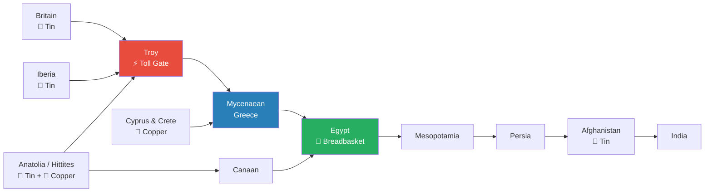
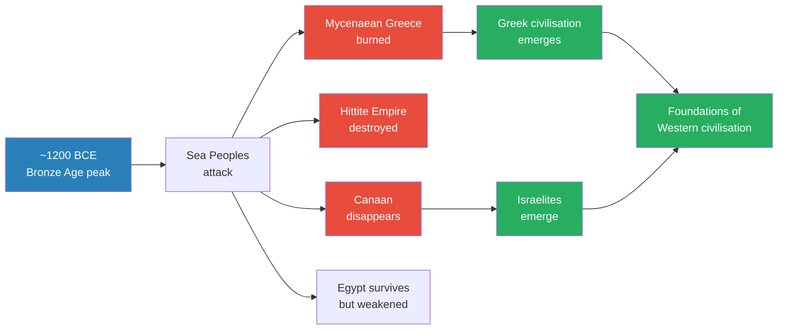
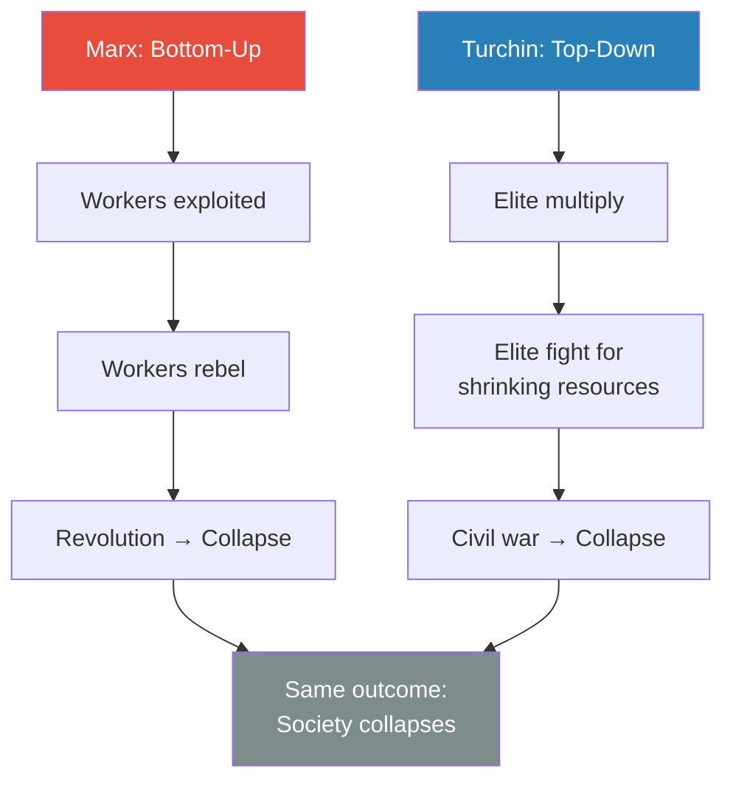
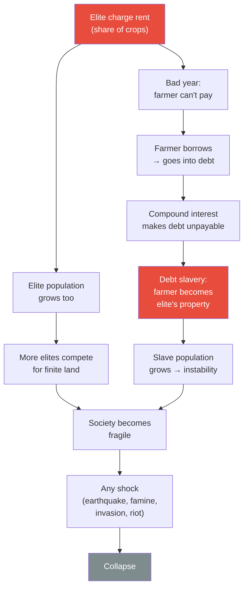
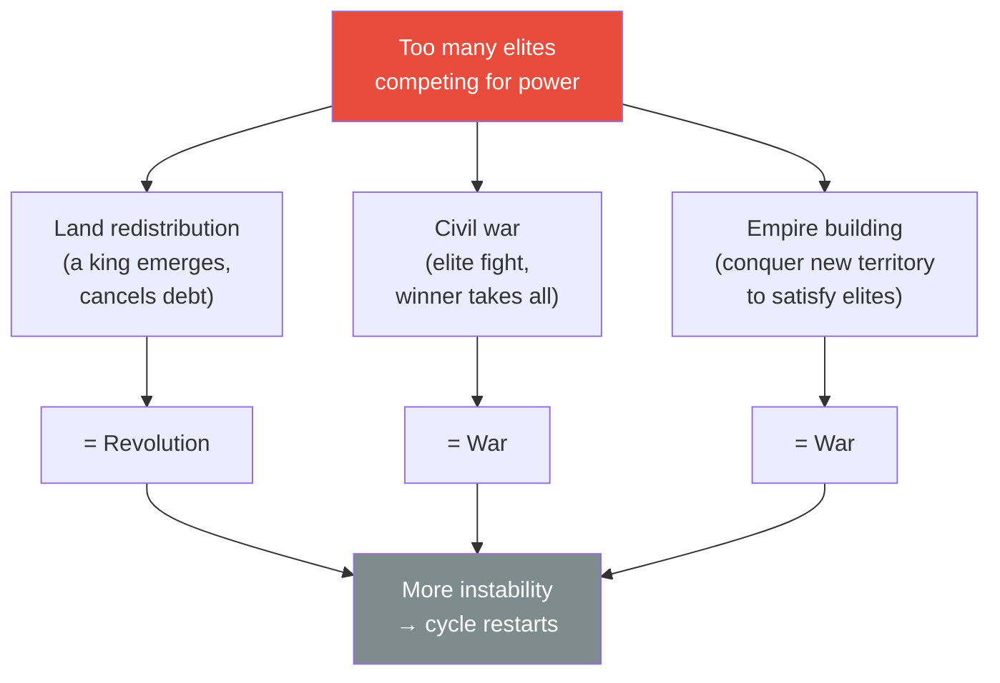
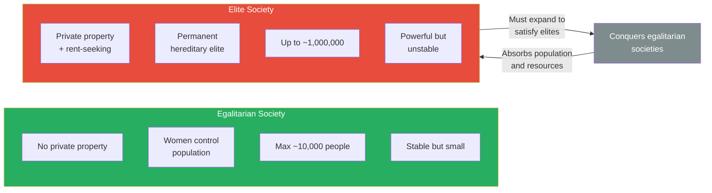

# Elite Overproduction and the Bronze Age Collapse

> In 1200 BCE the Bronze Age world was a globalised trading network stretching from Britain to India — wealthy, interconnected, and seemingly invincible. A few decades later it was gone. Mycenaean Greece burned, the Hittite Empire vanished, and Egypt never recovered its power. Scholars call this a "perfect storm" of earthquakes, climate change, and revolt. Prof. Jiang disagrees. Drawing on Peter Turchin's theory of elite overproduction, he argues the collapse was not a freak accident but an inevitable consequence of too many rich people competing for too little power. Every complex society carries the seeds of its own destruction — and that destruction, like a forest fire, is what makes renewal possible.

---

## The Question

*Why did the interconnected Bronze Age world collapse around 1200 BCE — and is there a general law that explains why all complex societies eventually fall?*

Prof. Jiang uses the Bronze Age collapse as a case study to introduce <b style="color: #2980b9">elite overproduction</b> — the theory he considers the single most important framework for understanding civilisational decline. This concept recurs throughout the entire Civilization series.

## Key Concepts at a Glance

| Concept | One-line summary |
|---------|-----------------|
| **Elite overproduction** | Societies collapse not because the poor rebel, but because too many rich people fight each other |
| **Rent-seeking behaviour** | Extracting value through ownership rather than productive work — the mechanism of elite instability |
| **Permanent hereditary elite** | A ruling class that passes wealth and status to its children — new in human history around this period |
| **Social contract** | The agreement that elites may charge rent if they give back through public works and feasts |
| **Debt slavery** | When compound interest makes debts unpayable, debtors become property — the natural endpoint of rent-seeking |
| **Palace economy** | Mycenaean system where all wealth flows to the palace for redistribution — centralised rent extraction |
| **Sea Peoples** | Mixed pirates and refugees who destroyed Mycenaean Greece and the Hittites around 1200 BCE |

---

## The Bronze Age World — A Globalised Economy Built on Bronze

*Prof. Jiang opens by painting a picture of the interconnected world of 1200 BCE — a trading network as complex as anything before the modern era.*

- <b style="color: #2980b9">Bronze</b> was the oil of the ancient world — the commodity that structured the entire economy
- Bronze is an alloy of **copper** (found in Cyprus, Crete, Anatolia) and **tin** (found in Britain, Iberia, Anatolia, Afghanistan)
- Making bronze required trading across the entire known world — from India to Britain
- This created a genuinely globalised economy where every region depended on others

*The Bronze Age trading network stretched from Britain to India, with Troy controlling the critical chokepoint between East and West.*

There were four ways to profit in this world:
- **Mining** — extracting tin and copper from the earth
- **Manufacturing** — smelting bronze and forging it into weapons and goods
- **Trading** — moving goods between regions, with central locations profiting most
- **Piracy** — stealing wealth by force from traders and cities

<b style="color: #e74c3c">Troy</b> occupied the most lucrative position: it sat at the chokepoint between East and West, collecting tolls from everyone who passed through. This made it fabulously wealthy — and a target. When Prof. Jiang covers Homer's *Iliad* in the next lecture, the Greeks who attacked Troy were essentially pirates raiding the world's richest toll booth.

> [!tip] Core Insight
> The Bronze Age world was not primitive or isolated. It was a sophisticated globalised economy where making a single tool required raw materials from multiple continents. This interconnection created enormous wealth — and enormous fragility.

---

## The Collapse — and Three Theories That Don't Explain It

*Within a few decades of 1200 BCE, this entire world disappeared. Prof. Jiang surveys what we know, then rejects the scholarly consensus.*

*The Bronze Age collapse destroyed the old order but created the conditions for Greek civilisation and the Israelites — the two pillars of the Western tradition.*

The destruction was swift and devastating:
- <b style="color: #e74c3c">Mycenaean Greece</b> — completely burned, lost a quarter of its population
- <b style="color: #e74c3c">The Hittite Empire</b> — destroyed entirely
- <b style="color: #e74c3c">Canaan</b> — disappeared as a political entity
- <b style="color: #e74c3c">Egypt</b> — survived but ceased to be a great power, conquered by outsiders within decades

The agents of destruction were the <b style="color: #2980b9">Sea Peoples</b> — waves of pirates and refugees attacking from the west over several decades. Egyptian records describe battling them repeatedly. They were hungry, desperate, and headed for Egypt because it was "the breadbasket of the world."

> [!abstract] Three Scholarly Theories — and Why Prof. Jiang Rejects Them
> | Theory | Evidence | Prof. Jiang's Verdict |
> |--------|----------|----------------------|
> | **Northern invasion** drove populations southward | None found | ❌ No evidence |
> | **Volcanic eruption** caused climate disruption | Some evidence | ❌ Insufficient |
> | **Perfect storm** — earthquakes + climate change + revolt | Archaeological evidence for all three | ❌ Describes symptoms, not cause |

The scholarly consensus — the "perfect storm" or systems collapse theory — holds that multiple simultaneous crises overwhelmed these societies. Prof. Jiang accepts that earthquakes, cooling climate, and internal revolt all happened, but argues these were **triggers, not causes**. A healthy society can absorb such shocks. The real question is: why were these societies so fragile that any shock could destroy them?

---

## Peter Turchin's Elite Overproduction — The Real Cause

*Prof. Jiang introduces the theory he considers the most powerful tool for understanding why civilisations fall — and he will return to it throughout the entire course.*

<b style="color: #2980b9">Peter Turchin</b>, a Russian-American historian, challenges the way we traditionally understand societal collapse:

- **Karl Marx** argued that societies collapse <b style="color: #e74c3c">bottom-up</b> — workers are exploited until they revolt
- **Peter Turchin** argues that societies collapse <b style="color: #e74c3c">top-down</b> — the elite fight each other until the system breaks
- The problem is not too many poor people. <b style="color: #e74c3c">The problem is too many rich people.</b>

*Marx and Turchin agree that societies collapse — they disagree about the mechanism. Marx blames the bottom; Turchin blames the top.*

### How a Permanent Hereditary Elite Works

Around 1200 BCE, a new kind of elite emerged — <b style="color: #2980b9">permanent and hereditary</b>. Unlike earlier societies where leaders earned their position and couldn't pass it to children, this new elite held power indefinitely across generations.

This brought three genuine benefits:
- **Organisation** — the elite coordinate resources for war, irrigation, and public works (pyramids, Great Wall)
- **Wealth** — better organisation and inequality drive harder work, producing more total wealth
- **Scale** — population can grow from ~10,000 (egalitarian max) to ~1,000,000+

But these benefits come with a fatal flaw: <b style="color: #e74c3c">rent-seeking behaviour</b>.

### Rent-Seeking — The Engine of Collapse

- A **landlord** doesn't produce anything — they own land and charge others to use it
- A **university** doesn't need to teach well — students need the degree (the rent ticket) regardless
- The elite's primary income source is not productive work but **ownership that can be rented**

Prof. Jiang's analogy cuts close to home for his students:

> [!example] The University as Rent-Seeker
> - You go to university not to learn but to get the degree — "your ticket to success"
> - The degree is rent: you pay for access to social mobility, not for knowledge
> - Universities don't have to teach well because you're trapped — you need the degree either way
> - High school works the same way: you pay tuition (rent) to access university
> - "All you're doing is paying rent" — at every stage, from school to career
> **The lesson:** Rent-seeking is not ancient history. It structures modern education, real estate, and finance. Recognising it is the first step to understanding why systems become fragile.

### The Social Contract — and How It Breaks

What prevents people from simply leaving a rent-seeking society?

- The <b style="color: #27ae60">social contract</b>: the elite acknowledge they charge rent, but promise to give back — public feasts, temples, irrigation, public works
- Cities competed for people (people = labour = wealth), so elites who didn't honour the contract lost population to rival cities
- This kept the system in equilibrium — for a while

But over time, the system degrades through a predictable sequence:

*The cycle of rent-seeking, debt, and elite multiplication that makes every complex society progressively more fragile until any shock can destroy it.*

The two pressure points reinforce each other:
- **From below:** debt slavery creates an angry, desperate underclass
- **From above:** elite overproduction means more people compete for the right to charge rent on finite resources
- Eventually the system snaps — either the people revolt or the elite go to war with each other

---

## Three Solutions — All Unstable

*If elite overproduction is inevitable, what can a society do about it? Prof. Jiang presents three historical remedies — and shows why none of them work permanently.*

*All three solutions to elite overproduction generate further instability — the cycle has no permanent exit.*

- **Land redistribution** — one elite member seizes power, cancels debts, redistributes land. This is how **kings** first emerged. But redistribution is itself a revolution.
- **Civil war** — the elite fight among themselves; the winner consolidates power. But war destroys wealth and population.
- **Empire building** — instead of fighting each other, elites agree to conquer new territory. But empire requires constant expansion and generates new instability.

<b style="color: #e74c3c">No matter which path a society takes, the result is more instability.</b> The cycle has no permanent solution — only temporary resets.

### Piketty's Modern Proof

Prof. Jiang anchors the ancient theory in a modern finding. <b style="color: #2980b9">Thomas Piketty</b>, in *Capital in the 21st Century*, showed that over the past 100 years:

- Financial capital grows at ~5% per year
- The real economy (manufacturing, services) grows at ~2% per year
- Rational investors put money in the **stock market**, not factories — because rent-seeking pays better than productive work
- Result: nobody creates real wealth; everyone speculates; the economy becomes a bubble

This is elite overproduction in modern dress. When the smartest course of action is to extract rent rather than build something, society is already on the path to collapse.

---

## Case Study: Mycenaean Greece's Palace Economy

*Prof. Jiang applies the theory to the best-documented Bronze Age civilisation — showing exactly how rent-seeking destroyed a real society.*

The Mycenaeans (direct descendants of the [[05 - The Yamnaya Conquest of Europe|Yamnaya]]) ran a <b style="color: #2980b9">palace economy</b>:
- All farmers brought their produce to the central palace
- The king redistributed everything — keeping a cut for the elite
- This is rent-seeking with the palace as landlord

The system worked when harvests were good. When the weather turned bad:
- Farmers couldn't meet their quotas, but <b style="color: #e74c3c">the elite still demanded their full cut</b>
- "It's not like, 'oh, this year the weather's bad, let's suffer together.' No — 'you still have to pay your taxes.'"
- Farmers went into debt → debt slavery → resentment → revolt

> [!example] Archaeological Evidence of Internal Revolt
> - Excavations of Mycenaean palaces show the **palace was burned down, but surrounding houses were intact**
> - This is the signature of an internal uprising — the people targeted the seat of elite power specifically
> - Written records (Linear B tablets) confirm the palace economy's redistribution system
> - Royal graves show **progressively more expensive burial goods** over time — the elite were getting richer while the people suffered
> **The lesson:** The physical evidence matches the theory exactly. The palace was the target because it was the symbol and instrument of rent extraction.

---

## Why Collapse Is Not a Tragedy

*A student asks: "Can we avoid the cycle in today's society?" Prof. Jiang's answer is the lecture's most provocative moment.*

<b style="color: #27ae60">No — and we shouldn't try.</b>

- It is impossible to build a society that is permanently stable
- Collapse is not a system failure — it is the system working as intended
- **Innovation requires death** — just as forest fires are necessary for ecosystem health

The Bronze Age collapse produced the two foundations of Western civilisation:
- From the ashes of Mycenaean Greece came a new society that gave us <b style="color: #27ae60">Greek civilisation</b>
- From the collapse of Canaan came the <b style="color: #27ae60">Israelites</b>, who gave us the Bible
- "We would not have Western civilisation if these societies did not collapse"

> [!example] The Forest Fire Analogy
> - A forest that never burns becomes less resilient — fewer animals, weaker trees, less biodiversity
> - Periodic fires clear dead wood and allow new growth — the ecosystem becomes stronger
> - A forest where you suppress all fires will eventually face one catastrophic fire that destroys everything
> - Societies work the same way: periodic collapse clears away rent-seeking elites and allows innovation
> **The lesson:** Trying to prevent collapse doesn't make a society safer — it makes the eventual collapse worse.

---

## Egalitarian Societies — Stable but Doomed

*Prof. Jiang contrasts elite societies with the egalitarian societies from [[04 - The Paradise Lost of Marija Gimbutas|Lecture 4]] — showing why egalitarianism cannot survive once hierarchies exist.*

*Once elite societies emerge, egalitarian societies are doomed — they lack the organisation, wealth, and scale to resist conquest.*

Egalitarian societies had genuine strengths:
- Women controlled population growth (choosing fewer children)
- No private property meant nothing to fight over
- They were remarkably stable and peaceful

But they had fatal weaknesses:
- Less organised — couldn't build large-scale infrastructure
- Less wealthy — inequality drives competitive effort
- Max population ~10,000 — they were simply outnumbered

<b style="color: #e74c3c">Elite societies must expand</b> — either to satisfy elite demand for new rent sources or to redirect civil war energy outward. This expansion inevitably consumes egalitarian neighbours. Once the first elite society emerged, egalitarianism was on borrowed time.

---

## Connections

**Builds on:**
- [[04 - The Paradise Lost of Marija Gimbutas]] — The egalitarian Old Europe that elite overproduction theory explains was doomed
- [[05 - The Yamnaya Conquest of Europe]] — The Yamnaya warrior culture became Mycenaean Greece and the Hittites — the very societies that collapsed

**Sets up:**
- [[07 - Homer's Iliad and the Birth of Greek Civilization]] — The Greeks who attacked Troy were pirates in the Bronze Age trade network; Greek civilisation was born from the collapse
- Lecture 19 (Mesopotamia) — Sumerian palace economies and city-state competition follow the same pattern
- Lecture 56 (What Marx Got Wrong) — Marx's bottom-up theory is directly challenged by Turchin's top-down elite overproduction

**Recurring theme introduced:** Elite overproduction and rent-seeking behaviour will reappear as explanatory frameworks for the rise and fall of Rome, the Islamic golden age, European empires, and America's decline.

---

## The Takeaway

This lecture is the capstone of the Origins arc (Lectures 1-6) and the foundation for everything that follows. Where earlier lectures traced humanity's path from hunter-gatherers to settled civilisations, this one introduces the mechanism that will tear those civilisations apart — again and again, across every culture and era.

The core insight is counterintuitive: **the very thing that makes societies powerful — a permanent elite that organises, accumulates wealth, and enables scale — is the same thing that guarantees their destruction.** There is no stable equilibrium. The elite multiply, rent-seeking intensifies, resilience erodes, and eventually any shock is enough to bring the whole system down. The three available remedies (redistribution, civil war, empire) all feed the cycle rather than breaking it.

What makes Prof. Jiang's framing distinctive is his refusal to mourn the collapse. Forest fires don't destroy forests — they regenerate them. The Bronze Age collapse didn't end civilisation — it created the conditions for Greek philosophy and the Hebrew Bible, the twin pillars of the Western tradition. The question for every subsequent lecture is not *whether* a civilisation will fall, but *what it will leave behind when it does*.
