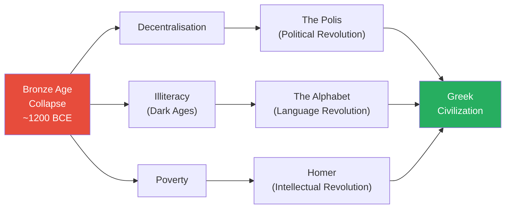
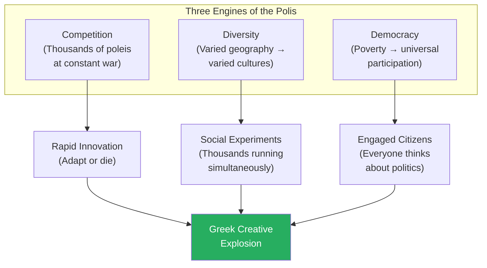
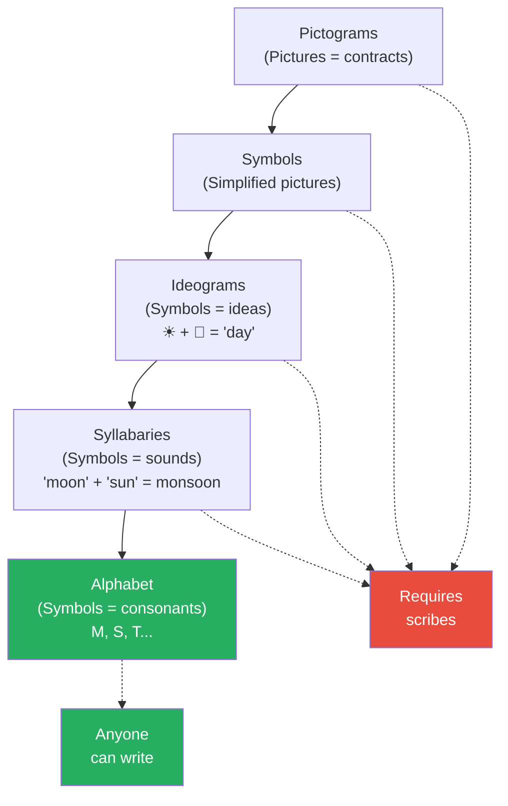
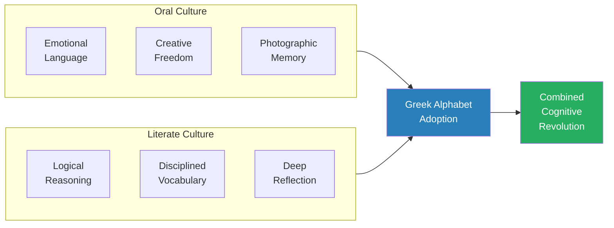
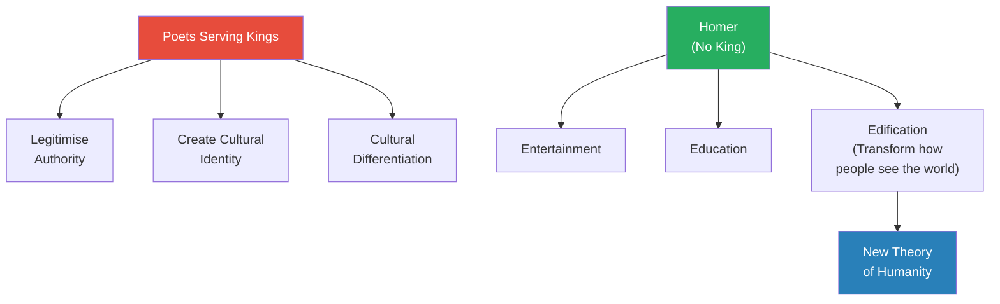
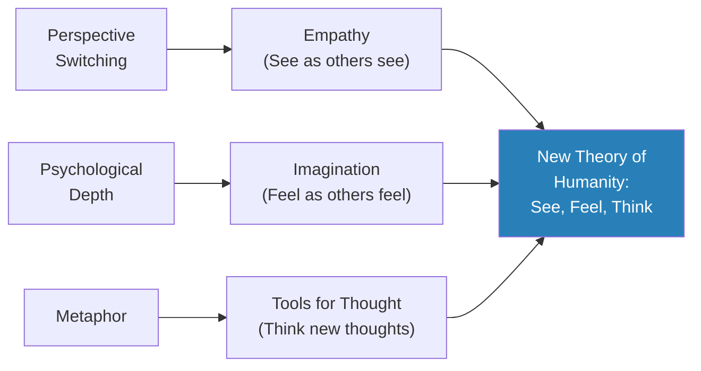
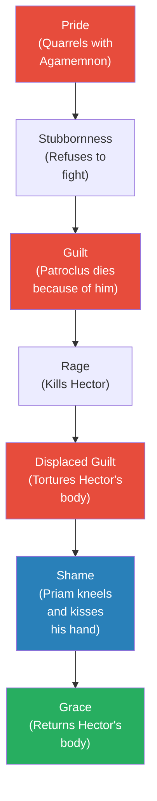
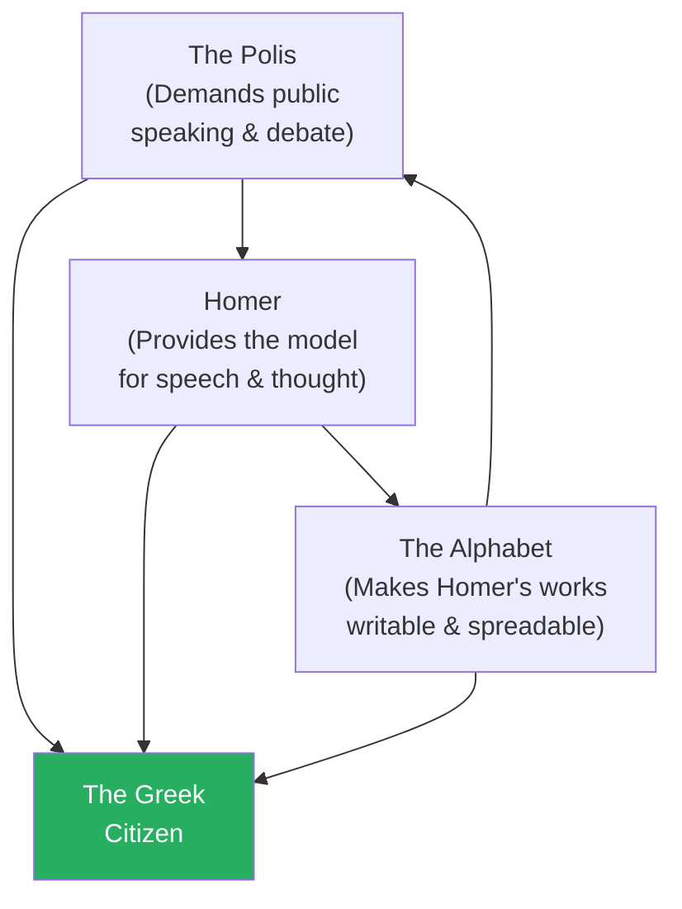
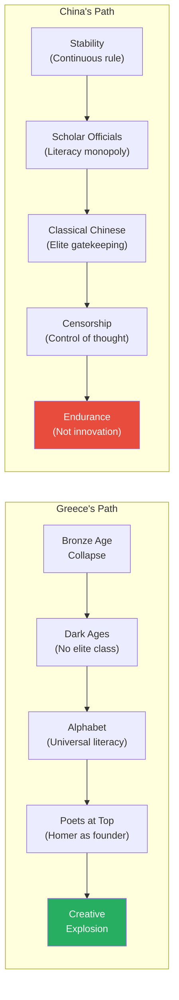
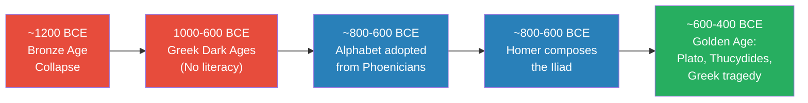

# Homer's Iliad and the Birth of Greek Civilization

> Greek civilization is the greatest, most creative, most significant civilization in human history — and it was born from total destruction. When the Bronze Age collapse destroyed Mycenaean Greece around 1200 BCE, the Greeks lost their centralised government, their literacy, and their wealth. For 400 years they lived in a Dark Age. But it was precisely this catastrophe that cleared the ground for three revolutions — the polis, the alphabet, and Homer — that produced the most extraordinary burst of creativity the world has ever seen. Prof. Jiang traces how chaos became democracy, illiteracy became a cognitive revolution, and a wandering poet gave humanity its first theory of what it means to be human.

---

## The Question

*How did Greek civilization — the most creative in human history — emerge from the destruction of the Bronze Age collapse in only about 200 years?*

The paradox at the heart of this lecture is stark: the very forces that should have destroyed Greece forever — decentralisation, illiteracy, poverty — were the conditions that made its greatness possible.

Prof. Jiang opens with a bold assertion that invites scepticism and then spends the entire lecture earning it. His answer rests on three revolutions, each enabled by a different dimension of collapse.

The political revolution of the polis emerged from the shattering of centralised authority. The linguistic revolution of the alphabet emerged from the total loss of literacy. And the intellectual revolution of Homer emerged from the poverty that freed poets from royal patronage.

Each revolution alone would have been remarkable; together, they produced something unprecedented in human history.

This is not just a claim about Greece. It is a claim about how civilization works: <b style="color: #2980b9">innovation emerges from destruction, not from comfort</b>. The most creative societies are born in crisis. The most stagnant are those that achieve stability too early. Prof. Jiang frames this as "the main message of human history" — a thesis he will return to again and again across the series.

### The Evidence for Greek Supremacy

Before explaining how Greek civilization achieved greatness, Prof. Jiang first establishes *that* it achieved greatness — and he does so with evidence that spans 3,000 years. His claims are bold, but he grounds them in specific, testable assertions rather than vague generalisations.

In literature, Homer wrote the *Iliad* and the *Odyssey* roughly 3,000 years ago. Prof. Jiang taught a "great books" course to his students in China, and "by far the favourite book was the Iliad." He asks his students to consider the implications: "a Greek writer writing 3,000 years ago for a Greek audience, his book still resonates, still impresses students in China today." The staying power of Homer's work across millennia, languages, and cultures is itself evidence of something extraordinary.

In philosophy, Plato is still considered by many to be the greatest philosopher who ever lived. People read the *Republic* and say "it transforms their lives. It makes them think very differently about the world." In history, Thucydides's *Peloponnesian War* is still required reading for military leaders. "There are still many generals today in America, in Russia, in Europe, who believe reading Thucydides will help them win wars." These are not ancient relics preserved out of reverence — they are living texts that people still use to solve real problems.

The question that animates the entire lecture follows naturally from this evidence: how did one civilisation, in roughly 200 years, produce works of such enduring power that they still shape how people think, govern, and fight three millennia later? The Greeks "really were not dominant for a long time" — their creative explosion lasted about 200 years, a blink in civilizational terms. What made that compression possible?

## Key Concepts at a Glance

| Concept | One-line summary |
|---------|-----------------|
| **Polis** | City-state community where every citizen discusses politics — origin of the word "politics" |
| **Greek Dark Ages** | 400 years (1000–600 BCE) of illiteracy after the Bronze Age collapse |
| **The Alphabet** | Writing system that made literacy available to everyone, not just professional scribes |
| **Oral culture** | Society based on speech — emotional, innovative, and memory-intensive |
| **Literate culture** | Society based on writing — logical, disciplined, and reflective |
| **Empathy** | Seeing the world from another's perspective — Homer's first invention |
| **Edification** | Being elevated to a better, higher version of yourself through art |
| **Metaphor** | Connecting two unconnected ideas — Homer's tool for teaching people how to think |
| **Scholar officials** | Confucian bureaucratic class whose power rested on monopolising literacy — explains China's divergence |

---

## From Destruction to Creation

*The Bronze Age collapse didn't just damage Greece — it destroyed everything. And that destruction was the best thing that ever happened.*

Prof. Jiang begins by establishing the sheer scale of what was lost. Before 1200 BCE, Mycenaean Greece was a unified monarchy — a society with centralised power, professional scribes, regional trade networks stretching to Egypt and Mesopotamia.

It was, as Prof. Jiang puts it, "no different from any other place in the world." There was nothing exceptional about it, nothing to suggest it would produce anything the world would remember. It was just another Bronze Age kingdom, prosperous and unremarkable.

Then the Bronze Age collapse swept it all away, and three catastrophic changes transformed the Greek world entirely.

- <b style="color: #e74c3c">Decentralisation</b> — the unified monarchy shattered, leaving Greece chaotic and fragmented into thousands of tiny communities with no central authority. There was no king, no palace bureaucracy, no unifying political structure of any kind
- <b style="color: #e74c3c">Illiteracy</b> — the Greeks lost the ability to read and write entirely, plunging into the Dark Ages (1000–600 BCE). We call it "dark" because no written records survive — the period is invisible to historians. For 400 years, Greek society left no textual trace
- <b style="color: #e74c3c">Poverty</b> — trade networks with Egypt, the Near East, and beyond collapsed entirely, isolating Greece and making it dramatically poorer than it had been under Mycenaean rule. The wealth that had connected Greece to the wider world simply evaporated

The lecture's master argument is that <b style="color: #27ae60">it was precisely because Greece became chaotic, illiterate, and poor that it eventually became the greatest civilization in human history</b>.

Innovation does not come from stability and wealth. It comes from crisis, fragmentation, and the desperate need to reinvent. A society that has everything has no reason to change. A society that has lost everything must create or perish.

This is the paradox that Prof. Jiang will trace through three separate revolutions — political, linguistic, and intellectual — each born from a different dimension of collapse.

Each dimension of destruction enabled a specific revolution. Decentralisation cleared space for the polis — a radically new political structure based on community participation rather than royal authority. Illiteracy created the need for a new writing system, and what the Greeks adopted — the alphabet — turned out to be a cognitive revolution that merged the strengths of oral and literate culture.

Poverty freed poets like Homer from royal patronage, allowing them to serve ordinary people rather than power. Together, these three revolutions produced the most concentrated burst of creative output in human history.

Prof. Jiang is careful to emphasise the causal logic here. It was not that Greece happened to experience destruction and happened to produce greatness. The destruction *caused* the greatness.

Each revolution was a direct response to a specific problem created by the collapse, and in each case the solution turned out to be more powerful than the system it replaced. A centralized monarchy could never have produced the diversity and competition of the polis. A professional scribe class could never have produced universal literacy. A court poet could never have produced the Iliad.

The old system had to die completely for the new one to emerge.

This is the pattern Prof. Jiang has been building toward since Lecture 1: the recognition that human progress is not linear and not comfortable. It is not a smooth upward curve from primitive to sophisticated.

It is a series of catastrophes, each one destroying the existing order and clearing the ground for something new. The agricultural revolution was a catastrophe that produced civilization. The Yamnaya conquest was a catastrophe that produced Indo-European culture. The Bronze Age collapse was a catastrophe that produced Greece.

In every case, the catastrophe was necessary — not merely coincidental — for the innovation that followed.

---

## Revolution 1: The Polis — A New Kind of Politics

*When the monarchy collapsed, something had to take its place. What emerged was radically unlike anything the world had seen.*

The collapse of Mycenaean centralisation left Greece without any overarching political structure. There was no emperor, no bureaucracy, no apparatus of royal government to organise society.

Into this vacuum emerged something entirely new: the <b style="color: #2980b9">polis</b>. Usually translated as "city-state," the polis is better understood as a political community — a group of roughly 1,000 people who governed themselves through collective discussion. The word "politics" itself comes from polis.

Thousands of these tiny communities scattered across the Greek landscape, each one independent, each one self-governing. Prof. Jiang identifies three features that made this structure uniquely powerful — and uniquely creative.

**Competition.** With no central authority to impose order, the poleis were in constant rivalry with each other for resources, territory, and survival. They were, as Prof. Jiang puts it, "constantly at war with each other."

This relentless competitive pressure forced every community to innovate or face destruction. A polis that fell behind militarily, economically, or politically would be absorbed or annihilated by its neighbours. There was no safety net, no higher authority to appeal to, no international order to maintain the peace.

The result was a kind of evolutionary arms race in which new ideas — military tactics, political systems, economic arrangements — spread rapidly across the Greek world. A polis that invented a better form of governance would thrive; its neighbours would notice and adopt or adapt the innovation; the laggards would decline and eventually disappear. The competitive environment was brutal, but it was also astonishingly productive.

**Diversity.** Greece's varied geography — mountains, plains, coastland, farmland — ensured that each polis developed a different economy, culture, and society depending on its physical location.

A coastal polis became a trading hub with a mercantile economy and an outward-looking culture. A mountain polis became a fortress community built around defence and self-sufficiency. A plains polis became an agricultural centre with a culture oriented toward the seasons and the land. An island polis developed naval expertise and a cosmopolitan worldview shaped by contact with foreign traders.

This geographic diversity produced cultural diversity, and cultural diversity produced an extraordinary range of social experiments. The Greeks were not running one experiment in how to organise society — they were running thousands simultaneously. Each polis was a laboratory, and the results of each experiment were visible to every other polis.

**Democracy.** Poverty forced universal participation. When everyone is poor, you need every person to contribute to the community's defence. And when every person fights to defend the polis, every person earns the right to speak — regardless of wealth, birth, or status.

You could be the poorest farmer in the community, but if you put your life on the line in battle, you had the same political voice as the polis's wealthiest citizen. You could be the leader of the polis, and your word carried no more weight than any other defender's. Prof. Jiang explains: "you can be rich or poor, but if you fought for us, you had the right to speak."

This was not democracy as an abstract ideal. It was democracy as a survival strategy — the only way a poor, isolated community could muster enough defenders to survive in a world of constant warfare.

> [!tip] Why Poverty Created Democracy
> When everyone is poor, you need every person to fight. When every person fights, every person earns political voice. Greek democracy was not an abstract ideal — it was a survival strategy born from scarcity. A farmer who defended the polis had just as much right to speak as its wealthiest citizen.

The democratic requirement didn't just redistribute political power — it <b style="color: #27ae60">transformed the culture from the ground up</b>. A farmer now had to think about political life, had to form opinions about governance and strategy, had to learn to speak persuasively in front of peers who would judge the quality of his argument. This created a society where ordinary people were engaged with ideas in a way no monarchy could produce.

In a monarchy, only the court thinks; in a polis, everyone thinks. The cognitive demands of democratic participation — forming arguments, evaluating evidence, speaking publicly — became the daily practice of every citizen, not just a privileged elite.

This is why Greek culture valued rhetoric so highly: not as ornamental skill but as survival necessity. A citizen who could not argue his case effectively in front of the assembly was a citizen who could not participate in his own governance.

The link between democratic politics and intellectual culture was not accidental — it was structural. Democracy did not just permit free thought; it required it.

Prof. Jiang's point is worth lingering on because it overturns the intuitive assumption that democracy is a luxury — something wealthy, stable societies can afford once they have solved the problem of survival.

The Greek experience suggests the opposite: democracy emerged precisely because survival demanded it. When a community of 1,000 people faces constant military threats from neighbouring communities, it cannot afford to exclude anyone from the fight, and it cannot afford to ignore anyone's ideas.

The democratic polis was not a philosophical experiment. It was the only political system that could sustain a poor, fragmented, embattled community.

The implications are profound: the political system that would eventually become the foundation of Western governance was born not from Enlightenment ideals but from Bronze Age desperation. This is another instance of Prof. Jiang's master theme: that humanity's greatest achievements emerge not from comfort and prosperity but from crisis and necessity.

This echoes the <b style="color: #2980b9">"open cooperative competition"</b> framework from [[05 - The Yamnaya Conquest of Europe]] — many small groups competing while communicating, producing more innovation than any single empire could. The Yamnaya steppe, the Sumerian city-states, the Greek poleis, and later the Warring States of China all demonstrate the same pattern: fragmentation drives creativity, centralisation breeds stagnation. Prof. Jiang is building a general theory of civilizational innovation across the series, and the polis is one of his strongest examples.

The polis diagram reveals the interconnected nature of these three engines. Competition alone would have produced only military innovation. Diversity alone would have produced only cultural variety. Democracy alone would have produced only political participation. But the three forces working together created a feedback loop: democratic citizens debated diverse approaches to shared competitive pressures, and the best ideas spread rapidly across the Greek world. No single polis had to invent everything — collectively, they invented more than any empire could.

---

## Revolution 2: The Alphabet — A Cognitive Revolution

*When the Greeks lost literacy, they had to reinvent it. What they adopted changed not just how they wrote but how they thought.*

Prof. Jiang devotes significant time to the evolution of writing systems, and for good reason: understanding why the alphabet was revolutionary requires understanding what came before it. Writing did not begin as literature or philosophy — it began as something far more mundane.

It began as economics. Farmers in Egypt and Sumeria needed contracts to prove they would be paid for their labour. If you worked on the pharaoh's irrigation network, you needed documentation that promised you two bushels of wheat in return. Writing was bookkeeping before it was anything else.

From these humble origins as pictographic receipts, writing systems grew steadily more abstract and flexible over thousands of years. Prof. Jiang walks through each stage carefully, showing how each step increased the communicative power of written language while reducing the number of symbols needed to master it. The progression is remarkably logical — each innovation solves a problem created by the previous stage — but only the final step, the alphabet, crosses the critical threshold from elite technology to universal tool.

This diagram captures the critical threshold that the alphabet crossed. Every previous writing system — pictograms, symbols, ideograms, syllabaries — required a professional class of scribes to manage and transmit. Writing was a separate language from speech, and mastering it took years of specialised training.

The alphabet shattered this barrier entirely. By reducing written language to its simplest possible units — individual consonant sounds — the alphabet made writing equivalent to speaking. Anyone who could talk could learn to write. Literacy was no longer a monopoly; it was a universal capability.

- **Pictograms** — pictures representing things, used in earliest Egyptian and Sumerian economies as contracts. A drawing of two people and two bushels of wheat meant: "If you work for me, I will give you two bushels of wheat"
- **Symbols** — simplified, standardised versions of pictograms that everyone recognised. The pictures became abstract enough to be written quickly
- **Ideograms** — symbols representing ideas, not things. Sun + moon = "day." <b style="color: #2980b9">Chinese is an ideogrammic language</b> — each character represents a concept rather than a sound
- **Syllabaries** — symbols representing sounds and syllables rather than meanings. "Moon" + "sun" = "monsoon" (the sound, not the meaning)
- **Alphabet** — symbols representing individual consonant sounds — the simplest, most flexible possible units of language. With roughly two dozen symbols, you can represent any word in any language

> [!example] Prof. Jiang's Demonstration of Writing Evolution
> - He draws a pictogram on the board: two stick figures and two V-shapes representing bushels of wheat
> - The pictogram functions as a contract: "If you work for me, I will give you two bushels of wheat"
> - He then simplifies it: "maybe just two faces and then two V's" — symbols everyone recognised
> - Next, he combines symbols: sun + moon = the concept of "day" — an ideogram representing an idea, not a thing
> - He shows how sounds replace meanings: "moon" + "sun" = "monsoon" (the sound, not the meaning) — a syllabary
> - Finally, individual consonants: M and S, which can be combined to spell "sum" or any other word
> - At each step, the system becomes more flexible and requires fewer symbols to master
> - The critical question: at which step does writing stop requiring professional scribes? Only at the final step — the alphabet
> **The lesson:** The alphabet was not just another writing system — it was the first writing system that eliminated the gatekeepers. Every previous system required years of training; the alphabet required weeks.

The critical breakthrough: before the alphabet, writing was a separate language from speech, requiring years of training by professional scribes. <b style="color: #27ae60">With the alphabet, writing became speaking.</b> Anyone could learn to read and write.

The entire professional scribe class — the gatekeepers of literacy in every previous civilisation — became unnecessary overnight. Prof. Jiang makes this point explicit: "Before these different stages of writing required a professional class of people to manage the writing system. We call these scribes. The reason why is that writing is not speaking. Speaking is one language, but writing is a different language."

The alphabet collapsed that distinction. For the first time in human history, the written word and the spoken word were the same language.

### The Best of Both Worlds

Prof. Jiang identifies distinct cognitive advantages in oral and literate cultures, and argues that the Greeks — by a unique accident of history — captured both simultaneously. This is the heart of the alphabet's revolutionary significance: not just that it made writing easier, but that it allowed the Greeks to combine two entirely different modes of thought that had never coexisted before.

The distinction is worth understanding in detail, because it explains why the Greek cognitive revolution was so much more than just "learning to read." Each mode of culture produced a fundamentally different kind of mind, with different strengths and different weaknesses.

| | Oral Culture | Literate Culture |
|---|---|---|
| **Strength 1** | Emotional — speakers rouse audiences through rhetoric and passion | Logical — writing must persuade by reason alone, since the reader controls the pace |
| **Strength 2** | Innovative — speakers can invent words freely, creating new terms on the fly | Disciplined — writing requires shared vocabulary and agreed-upon meanings |
| **Strength 3** | Memory-intensive — everyone had near-photographic recall of hours-long speeches | Reflective — frees brain space for deep analysis and systematic critique |

Before the alphabet, societies had one set of advantages or the other. Oral cultures were emotionally powerful, creatively flexible, and possessed extraordinary memories — but they could not build on previous arguments systematically or subject ideas to the kind of sustained logical scrutiny that writing enables. Literate cultures gained logic, discipline, and reflection — but lost the emotional immediacy, creative spontaneity, and prodigious memory of oral societies. No civilisation had ever possessed both simultaneously.

The trade-off between oral and literate cognition is not just a historical curiosity — it is a deep pattern in human development that Prof. Jiang returns to throughout the series.

Every new technology enhances some capacities while atrophying others. Agriculture made humans less healthy but more numerous. Writing made humans less prodigious in memory but more capable of sustained reasoning. The internet has made us less attentive but more connected.

The question is always: what do you gain, and what do you lose? The Greeks' unique advantage was that they gained the benefits of literacy before losing the benefits of orality.

<b style="color: #27ae60">The Greeks, by adopting the alphabet while still living primarily in oral culture, combined the advantages of both</b> — emotional power and logical discipline, creative freedom and reflective depth, strong memory and analytical thinking.

This was a unique historical moment. The Greeks were close enough to their oral past to retain its cognitive strengths, but now had a tool that added entirely new capabilities. No civilisation before had occupied this position — and no civilisation since has experienced the same fusion, because literate culture eventually dominates and the oral advantages atrophy.

Writing, like agriculture before it, was a technology that strengthened some capacities while weakening others. The Greeks caught it at the perfect moment, before the transition was complete. They lived in the overlap — the brief window when both oral and literate capabilities coexisted in the same minds.

Prof. Jiang's analogy to physical fitness makes the point vivid. Hunter-gatherers were stronger, faster, and healthier than modern humans because their survival depended on physical capability every single day. Agricultural humans lost that physical edge because they no longer needed it.

In exactly the same way, oral cultures possessed cognitive capabilities — especially memory — that literate cultures lost because they no longer needed them. The alphabet was to the mind what agriculture was to the body: a technology that enhanced productivity while reducing raw capability.

The Greeks adopted it early enough that both capabilities coexisted. They had the memory of an oral people and the analytical power of a literate one. This combination was, as Prof. Jiang tells his students, "an incredible revolution in the capacity for human beings to think."

> [!example] The Oral Culture Memory
> - Prof. Jiang's claim: people in oral cultures were "a lot smarter than we are today"
> - With no writing, every speech — lasting hours — had to be memorised by both speaker and audience
> - This required near-photographic memory as a baseline cognitive skill for everyone
> - The Greeks memorised the entire Iliad — thousands of lines of poetry — and could recite it from memory
> - This is the same principle as hunter-gatherers being physically superior: you develop what you must use daily
> - Just as agriculture weakened our bodies by removing the need for constant physical exertion, writing weakened our memories by removing the need for constant memorisation
> - Prof. Jiang draws a direct parallel: "Back then, they were a lot stronger, faster and healthier than we are today, because today all we do is sit around"
> - The same logic applies to cognition: "Back then, they were a lot smarter than us"
> **The lesson:** Every technological advance comes at a cognitive cost. The Greeks caught the alphabet at the perfect moment — before it replaced their oral strengths but after it could add literate capabilities.

The merger diagram illustrates why the Greek moment was unrepeatable. The alphabet did not simply replace oral culture — it supplemented it. For a brief historical window, the Greeks possessed the emotional power and creative flexibility of speakers alongside the logical precision and reflective depth of writers.

This dual cognitive toolkit — feeling and reasoning, creating and critiquing, remembering and analysing — gave Greek thinkers capabilities that no previous civilisation had enjoyed. It is no accident that the explosion of Greek philosophy, science, and literature coincided with this unique cognitive fusion.

---

## Revolution 3: Homer — A New Theory of What It Means to Be Human

*Before Homer, poets served kings. Homer had no king. That freedom changed everything.*

The third revolution is the one Prof. Jiang clearly considers the most important. The polis provided the political structure. The alphabet provided the cognitive tools. But it was Homer who provided the vision — a new theory of what it means to be human that became the foundation of Greek civilization and, through Greece, the foundation of Western civilization.

Prof. Jiang's discussion of Homer is the emotional and intellectual centrepiece of the lecture, and he builds toward it carefully, first explaining what poets normally did in ancient societies, then showing why Homer's situation was radically different.

### Why Homer Was Free

In most ancient societies, poets were hired by kings to solve three specific problems. This was not art for art's sake — it was propaganda, and the poet was an instrument of royal power.

1. **Legitimise authority** — the poet sings a "divinely inspired" song proving the king was chosen by the gods. As Prof. Jiang explains: most kings got power by killing a lot of people, so they needed to "clean up their image." A poem so beautiful it seemed divine served as proof that the gods themselves endorsed the king's rule
2. **Create cultural identity** — common stories (like China's *Romance of the Three Kingdoms* or the Bible) unify people under a shared identity, which in turn unifies them under the king who commissions the stories
3. **Cultural differentiation** — define "us" by defining who we are not. "We're Chinese, so therefore we are not Japanese, we're not Korean, we're not American." Literary works draw boundaries around a people, and those boundaries serve the ruler who draws them

Prof. Jiang emphasises that virtually every major literary work in human history was "designed to serve the powers that exist at that time." The Aeneid served Rome. The Bible served the Church. The *Romance of the Three Kingdoms* served Chinese dynastic ideology. Literature was power's handmaiden. This is not cynicism — it is simply how most societies organised cultural production. The poet was a craftsman in the service of authority, and his art served political ends.

Understanding this norm is essential to understanding why Homer was revolutionary. He was not merely a good poet — there were many good poets in the ancient world. What made Homer unique was his freedom from the constraints that shaped every other poet's work.

When a poet serves a king, there are things he cannot say — perspectives he cannot explore, truths he cannot tell, complexities he cannot acknowledge — because doing so would undermine the king's authority. Homer had no such constraints. He could follow his material wherever it led, even when it led to conclusions that would have been unthinkable in a court setting.

Homer lived during the Dark Ages — <b style="color: #27ae60">there was no king to pay him</b>. No palace, no court, no patron. He was a wandering poet in a fragmented, impoverished world where the only audience was ordinary people. We don't know exactly when Homer lived — Prof. Jiang places him roughly between 800 and 600 BCE — but we know the conditions of his world: no central authority, no wealth, no institutional support for artists.

This constraint — which looked like a disadvantage — turned out to be the most liberating force in the history of literature. If Homer could only survive by appealing to ordinary people, he had to deliver what they actually wanted, not what a king needed them to hear. The difference is enormous. A court poet must always serve the interests of power, even when those interests conflict with truth or beauty or human understanding. A poet who answers to ordinary people must deliver genuine value — or starve.

Homer's audiences paid him for three things, each progressively more ambitious:

- **Entertainment** — the primary source of fun in a world without any other media. People paid Homer to sing songs for them because it was, as Prof. Jiang says, "what they thought was fun to do." In a world without books, without theatre, without any form of recorded entertainment, a travelling poet was the closest thing to a movie, a concert, and a Netflix binge all rolled into one
- **Education** — with no schools, people learned to speak publicly by imitating Homer's rhetoric. In a polis where every citizen had to argue in front of peers, Homer was the master class in persuasive speaking. You listened to Homer not just for pleasure but to learn his techniques — his cadences, his argument structures, his way of building a case — so you could use them in your own political speeches
- **Edification** — making his audience better, higher versions of themselves by transforming how they saw, felt, and imagined the world around them. This is the most ambitious of the three, and the one that made Homer unique

The contrast between the two columns of this diagram captures the revolutionary nature of Homer's freedom. Poets serving kings produce propaganda — legitimisation, identity, differentiation — all in service of power. Homer, serving ordinary people, produced something entirely different: entertainment that became education that became transformation.

The distinction between edification and mere entertainment is crucial. Entertainment leaves you the same person afterward. Education teaches you skills. But <b style="color: #2980b9">edification</b> transforms who you are — it changes the way you see, feel, and imagine the world around you.

This is what made Homer unique among all the poets of his era, and it was only possible because he answered to no king.

---

### The Iliad: Three Innovations That Invented Literature

The most popular story of Homer's time was the Trojan War — a tale of Greek heroes winning a glorious victory over the Trojans. Every Greek knew the story, and every Greek loved it because it was a story about Greeks being heroic. It was, in modern terms, a crowd-pleaser — the ancient equivalent of an action movie where the home team wins.

But Homer didn't simply retell this crowd-pleasing narrative. He took the most popular story in the Greek world and transformed it through three innovations that had never been attempted before — innovations so radical that they constituted the invention of literature itself. What Homer did with the Trojan War story is comparable to what a filmmaker might do if they took the most popular superhero franchise and turned it into a meditation on guilt, love, and the meaning of human existence. The audience came for entertainment. What they got was edification.

> [!example] The Story of the Trojan War
> - Nemesis, the Greek goddess of retribution, creates a golden apple inscribed "to the most beautiful goddess in the world" and places it on Mount Olympus
> - Three goddesses claim it: Hera (queen of the gods), Athena (goddess of wisdom), and Aphrodite (goddess of love)
> - Zeus, tired of their fighting, finds a human named Paris to judge — "stupid enough to want to piss off two goddesses"
> - Each goddess bribes Paris: Hera offers kingship of the world, Athena offers all the knowledge of the world, Aphrodite offers the most beautiful woman in the world
> - Paris chooses Aphrodite's offer — but the most beautiful woman, Helen, is already Queen of Sparta, married to a Greek king
> - Paris steals Helen and takes her back to Troy. The Greeks raise a massive army and besiege Troy for 10 years
> - The war ends when the Greek general Odysseus devises the wooden horse: the Greeks pretend to leave, the Trojans bring the horse inside, and at night the Greeks jump out and slaughter the city
> - This was the story the Greeks loved — a tale of Greek heroism and victory
> **The lesson:** Homer took this crowd-pleasing victory narrative and did something no one expected — he told it from the enemy's side, making the Trojans more heroic than the Greeks.

> [!example] The Story of the Iliad
> - Achilles, the greatest Greek warrior, quarrels with King Agamemnon at the siege of Troy and curses him: "You're a dog, Agamemnon. I'm never going to fight for you again"
> - Without Achilles, the Trojans — led by Hector, son of King Priam — see their opportunity and begin crushing the Greek army
> - Greek generals beg Agamemnon to ask Achilles to return; Achilles tells them to "screw off"
> - Achilles's beloved friend Patroclus, feeling sorry for the Greeks, pretends to be Achilles and goes to fight Hector
> - Hector kills Patroclus — Achilles is consumed by rage, leaps into battle, and kills Hector
> - Instead of returning Hector's body for ransom (the custom, so the dead can find peace in the afterlife), Achilles tortures Hector's corpse — which tortures Priam
> - But Achilles cannot sleep. Deep down, he knows his own stubborn pride caused Patroclus's death — if he hadn't quarrelled with Agamemnon, Patroclus would never have fought Hector
> - His guilt redirects into hatred of Hector — he tortures the body to avoid facing his own responsibility
> - King Priam sneaks into the Greek camp and stands behind Achilles. He could take a knife and stab Achilles in the neck. Instead, he kneels and kisses the hand of the man who killed his son
> - Overwhelmed by Priam's courage and love, Achilles feels tremendous shame and remorse, and returns Hector's body
> **The lesson:** "It is not war that creates civilization. It is love that creates civilization." Priam's love for his son gave him the courage to defeat Achilles — not with a weapon, but with an act of grace that shattered Achilles's rage and guilt.

**Innovation 1: Perspective-Switching → <b style="color: #2980b9">Empathy</b>**

Homer tells the Trojan War from both Greek and Trojan sides — not just the Greek victory story everyone wanted to hear. When you read the Iliad, Prof. Jiang tells his students, "you'll discover that the Trojans are actually more heroic, more courageous and more brave than the Greeks." This was unprecedented. Every other storyteller in the ancient world told the Trojan War from the winning side, celebrating Greek triumph. Homer deliberately chose to make the losers more admirable than the winners.

By switching perspectives — forcing a Greek audience to see the world through the eyes of their enemy — Homer creates a capacity that barely existed before in human civilization: <b style="color: #27ae60">empathy, the ability to see the world from the perspective of other people</b>. Before Homer, this concept had no name and almost no presence in human thought. After Homer, it became the foundation of Greek moral philosophy and, eventually, of Western ethics.

For Greek audiences, this was transformative — they could now imagine what it felt like to be the people they fought against, to see their own heroes through hostile eyes, to feel the grief of the defeated.

This was not a comfortable experience. Homer did not flatter his audience. He showed them that their enemies were braver, more loving, and more honourable than they were. He asked them to admire the people they had destroyed.

This kind of moral challenge — forcing the victors to see themselves through the eyes of their victims — is what makes the Iliad a work of edification rather than mere entertainment.

The implications extend far beyond literature. In a polis where citizens must debate with each other, argue their positions, and evaluate competing claims, the ability to see from another's perspective is not just a moral virtue — it is a practical skill. A citizen who can imagine how his opponent sees the issue can construct a more persuasive argument. A general who can imagine how the enemy thinks can devise a better strategy. Homer's empathy was not just ethical training — it was cognitive training for democratic life.

**Innovation 2: Psychological Depth → <b style="color: #2980b9">Imagination</b>**

For the first time in literature, a storyteller explores *why* characters behave as they do — their inner motivations, contradictions, and self-deceptions. This is what Prof. Jiang calls "extremely complicated psychology." Achilles's rage isn't simple hatred — it is guilt redirected. He knows his pride killed Patroclus, so he channels his self-loathing into hatred of Hector. He tortures Hector's body not because he hates Hector but because he cannot face his own responsibility.

Priam's courage isn't recklessness — it is love so powerful it overrides survival instinct. Standing behind Achilles with a knife, he could have avenged his son with a single thrust. Instead he chose the more dangerous, more courageous path: to kneel and kiss the hand of his son's killer, appealing not to Achilles's fear but to his humanity. This is the kind of psychological complexity that forces readers to think deeply about who we are as humans — what drives us, what we hide from ourselves, how guilt and love and pride interact in ways we cannot fully control.

Prof. Jiang describes this as "extremely complicated psychology," and the phrase is apt. Before the Iliad, characters in stories were simple: they wanted power, they wanted glory, they wanted revenge. Their motivations were transparent and their emotions were uncomplicated.

Homer introduced the revolutionary idea that human beings are *not* transparent to themselves — that we can feel one thing while believing we feel another, that our stated reasons for acting often conceal deeper, more painful truths.

This is the foundation of all psychological literature, and Homer invented it.

**Innovation 3: Metaphor → <b style="color: #2980b9">Tools for Thought</b>**

Metaphors connect two things that were previously unconnected — "the sky is a snail," for example, creates a connection between concepts that had never been linked before.

Prof. Jiang's point is that each metaphor is literally a new thought — a neural pathway that didn't exist before the metaphor created it. The Iliad is dense with metaphors, and their cumulative effect is to teach readers not just what to think but *how* to think.

In Prof. Jiang's framing, metaphors are "the tools for thought" — the mechanism by which human beings generate original ideas. A mind trained on metaphor is a mind that habitually connects unrelated concepts, and that habit of connection is the engine of all creative thought.

The significance of metaphor as a cognitive tool cannot be overstated. In a world before formal education, before schools, before textbooks, Homer's metaphors were the primary mechanism by which the Greeks learned to think abstractly.

Every metaphor in the Iliad is an exercise in creative connection — it forces the listener to hold two unrelated concepts in mind simultaneously and find the hidden relationship between them. Repeated thousands of times across the poem's vast length, this exercise trained an entire civilisation to think in a particular way: associatively, creatively, always looking for connections that others had missed.

This is the cognitive skill that would later produce Greek philosophy, Greek science, and Greek mathematics. Plato's theory of Forms is, at its root, a metaphorical operation — connecting the visible world to an invisible world of ideal concepts. Euclid's geometry is a metaphorical operation — connecting physical shapes to abstract mathematical relationships. Homer did not invent philosophy or mathematics, but he trained the minds that did.

Homer's three innovations are not isolated literary techniques — they form a unified theory of what it means to be human. Empathy teaches you to *see* from other perspectives. Psychological depth teaches you to *feel* the inner lives of others. Metaphor teaches you to *think* by connecting previously unrelated ideas. Together, they constitute Homer's revolutionary claim: to be human is to see, feel, and think. Only if you are willing to do all three are you truly human.

Before Homer, greatness meant conquering land, winning wars, or accumulating wealth. Power was the measure of a person.

Homer redefined greatness as the capacity for empathy, the depth of imagination, and the courage to think new thoughts. This was not merely a literary innovation — it was a philosophical revolution.

It redefined what human beings should aspire to, and in doing so, it redirected an entire civilisation's energies from conquest toward understanding.

The implications for Greek culture were immediate and lasting. If Homer's definition of humanity was correct — if to be truly human is to see, feel, and think — then the most admirable person in society is not the strongest warrior or the wealthiest king but the person with the deepest empathy, the most powerful imagination, and the most original thoughts.

This is why the Greeks placed poets at the top of their hierarchy: because Homer had redefined what it meant to be great, and the poet embodied that new definition more fully than anyone else.

> [!tip] Homer's Redefinition of Greatness
> Before Homer, greatness was measured by what you conquered. After Homer, greatness was measured by how deeply you could see, feel, and think. This single redefinition explains why Greece — alone among ancient civilisations — placed a poet at the summit of its culture.

### Homer as the Foundation of Greek Civilization

This new theory of humanity did not remain an abstract idea — it became the living foundation of Greek civilization in a way that has no parallel in any other culture. The Greeks believed their civilization was founded not by a king or a general but by a poet. This was an extraordinary claim, and it shaped everything that followed. Everyone memorised the Iliad, because this was an oral culture where people had near-photographic memories, and the act of memorising it further transformed them. To carry the Iliad in your memory was to carry Homer's theory of humanity in your mind — to be constantly reminded that empathy, imagination, and thought were the highest human capacities.

The process of memorisation itself was transformative. In an oral culture, memorising a text is not passive storage — it is active inhabitation. You don't just know the words; you experience the perspectives, feel the emotions, and practise the cognitive habits embedded in the text.

A Greek who had memorised the Iliad had practised empathy thousands of times through Homer's perspective-switching. They had explored psychological complexity thousands of times through Homer's character portraits. They had exercised creative thinking thousands of times through Homer's metaphors.

The poem was not just a story — it was a cognitive training programme embedded in narrative form. To memorise it was to be transformed by it.

Every subsequent Greek thinker tried to continue Homer's legacy. Prof. Jiang makes this point with striking specificity:

- **Plato** writing the *Republic* "was trying to become Homer" — a teacher of civilization, an inspirer of civilization, a "big god of civilization"
- **Thucydides** writing the *Peloponnesian War* "was trying to do the same thing" — to inspire new ideas, to transform how people understood human behaviour
- This aspiration — "I want to be the next Homer" — drove every major Greek thinker, and is why Greek civilization produced more innovation in 200 years than most civilizations produce in millennia
- <b style="color: #27ae60">No other civilization in history made a poet the highest aspiration of its greatest minds</b>

The speed of Greek achievement, once it began, is staggering. Homer's works still resonate 3,000 years later — Prof. Jiang's own students voted the Iliad their favourite book. Plato's *Republic* still transforms people's worldviews. Military generals in America, Russia, and Europe still read Thucydides to help them win wars. No other 200-year period in human history has produced works with this kind of staying power.

---

## Achilles's Journey: From Pride to Grace

Achilles's emotional arc — from destructive pride to redemptive grace — is the engine of the Iliad, and Prof. Jiang traces it with careful attention to the psychological logic at each stage.

The journey begins with pride: Achilles quarrels with Agamemnon over a personal slight and refuses to fight. That pride hardens into stubbornness when the Greek generals beg him to return. Stubbornness produces guilt when Patroclus — the person Achilles loves most — dies in the battle Achilles refused to join.

Guilt transforms into rage directed at Hector, and rage becomes displaced guilt expressed through the desecration of Hector's body. The turning point comes when Priam's act of love — kneeling, kissing the killer's hand — shatters Achilles's psychological defences and replaces rage with shame. Shame, finally, yields to grace: Achilles returns Hector's body and, in doing so, forgives himself.

What makes this arc revolutionary is not just its emotional range but its psychological honesty. Homer does not present Achilles as simply angry or simply grieving. He presents a character whose emotions are layered, contradictory, and self-deceiving.

Achilles thinks he hates Hector, but what he actually feels is guilt about Patroclus. He thinks he is punishing his enemy, but what he is actually doing is punishing himself. This kind of psychological insight — the recognition that people's stated motivations often mask deeper, more painful truths — was genuinely new in human storytelling.

It is the beginning of what we now call literary psychology, and it would take millennia before any other writer matched Homer's sophistication in depicting the inner life.

The resolution through Priam's act is equally revolutionary. In every other war narrative of the ancient world, conflicts end through violence — the stronger warrior kills the weaker one. Homer proposes something radically different: that the deepest conflicts are resolved not through force but through an act of vulnerable courage that speaks to the enemy's humanity.

Priam does not appeal to Achilles's fear or his greed. He appeals to his capacity for empathy — exactly the capacity that Homer has been training his audience to develop throughout the poem. In this sense, the climax of the Iliad is not just a narrative event — it is a demonstration of the poem's own thesis. Homer has spent the entire poem teaching his audience to see from other perspectives, to feel deeply about inner lives, to think in new ways. And then, at the climax, he shows them what those capacities look like in action: a father's love overcoming the greatest warrior in the world.

The message — "it is not war that creates civilization. It is love that creates civilization" — is not a sentimental aside. It is the logical conclusion of everything Homer has argued through the structure of the poem itself.

---

## How the Three Revolutions Reinforced Each Other

*The polis, the alphabet, and Homer were not independent developments — each amplified the others in a self-reinforcing cycle of innovation.*

Prof. Jiang presents the three revolutions as separate responses to separate dimensions of collapse, but the deeper pattern is that they formed a mutually reinforcing system. The polis required citizens who could speak persuasively — and Homer provided the model for persuasive speech. Homer's works could spread across Greece because the alphabet made them writable and memorisable — and the polis system provided thousands of independent audiences eager for his stories. The alphabet's cognitive revolution — combining oral and literate strengths — was most powerful in a society that valued both public speaking (the polis demanded it) and deep reflection (Homer modelled it).

Consider the feedback loop from the perspective of a single Greek citizen around 700 BCE. He lives in a polis where he must speak publicly to participate in governance. He memorises Homer's Iliad to learn how to speak well — and in doing so, absorbs Homer's theory of empathy, imagination, and thought.

He uses the alphabet to write down his own arguments, gaining the reflective depth of literate culture while retaining the emotional power of oral culture. He debates his peers in the polis, testing ideas against competing perspectives — exactly the kind of perspective-switching that Homer taught him to value.

Each revolution makes the others more powerful. The polis creates the demand for Homeric skills. Homer's works create the cognitive toolkit that the alphabet preserves. The alphabet enables the systematic refinement of ideas that the polis requires.

This reinforcement diagram shows why the Greek creative explosion was not just additive but multiplicative. Each revolution made the others more effective, creating a feedback loop that accelerated innovation far beyond what any single revolution could have produced alone.

The polis provided the demand for good thinking. Homer provided the content and the method. The alphabet provided the medium. Together, they produced a civilisation whose intellectual output in 200 years exceeded what most civilisations produce in millennia.

The lesson is that revolutionary change rarely comes from a single innovation — it comes from multiple innovations that happen to reinforce each other in the same time and place. Greece was not lucky once. It was lucky three times — and the three strokes of luck amplified each other.

---

## Why Greece and China Diverged

*The same question from two angles: why did Greece get the alphabet and Homer — and China got neither?*

Prof. Jiang consistently helps his Chinese students understand Western civilization by contrasting it with their own. This section is one of his most distinctive analytical contributions — a comparative framework that illuminates both civilizations by showing what each lacked.

The divergence between Greece and China is not a story of superiority and inferiority. It is a story of two different responses to the fundamental question of how to organise a society, with radically different consequences for creativity and stability.

Both responses were rational given each society's circumstances. Both had enormous costs and enormous benefits. But understanding the divergence helps explain why Western civilization took the shape it did — and why Chinese civilization took a very different shape.

The comparison operates on two levels. First, there is the question of technology: why did Greece adopt the alphabet while China retained ideogrammic writing? Second, there is the question of culture: why did Greece place poets at the top of its social hierarchy while China placed them at the bottom? Prof. Jiang argues that both questions have the same root cause: the distribution of power between elites and ordinary citizens, and whether the ruling class had an interest in expanding or restricting access to knowledge.

### The Alphabet Question

The alphabet was not a Greek invention — it was developed by the Egyptians, who were in constant contact with diverse cultures (Sumerians, Greeks, and others). Egypt's position at the crossroads of multiple civilisations meant it was constantly exposed to new ideas and new ways of doing things.

The Phoenicians — Mediterranean traders who connected Egyptian culture to the wider world — carried the alphabet to Greece. The Greeks, freshly illiterate after the Dark Ages and actively searching for a new writing system, eagerly adopted it.

The key conditions were openness and need: Greece was connected to other cultures through trade, and the Dark Ages had created an urgent demand for a new way to read and write.

The contrast with China is illuminating. <b style="color: #e74c3c">China, for most of its history, was isolated from the rest of the world</b> — geographically separated from other major civilisations by deserts, mountains, and oceans.

But isolation alone does not explain why China never developed or adopted an alphabetic writing system. The deeper reason is political: the scholar official class (Confucian bureaucrats) derived their entire power from their monopoly on literacy.

"What was their power?" Prof. Jiang asks his students. "It was the ability to read and write. That's what differentiated them from everyone else. That's what made them indispensable to the Emperor."

If anyone could read and write, anyone could become a bureaucrat, and the scholar officials would lose their privileged position. Their response was not to simplify writing but to make it harder — creating Classical Chinese, a literary language so complex and divorced from spoken Chinese that only years of specialised training could master it.

As Prof. Jiang puts it, "when you have a monopoly over literacy, you don't want to give it up. You want to increase it." The monopoly over reading and writing was the monopoly over power itself.

This is a pattern that recurs throughout human history: elites who control access to knowledge will always work to maintain and strengthen that control, because knowledge is the foundation of their authority. The scholar officials did not oppose the alphabet out of ignorance — they opposed it out of rational self-interest. Making literacy universal would have destroyed the basis of their power just as surely as the Bronze Age collapse destroyed the Mycenaean monarchy.

### The Homer Question

The Confucian hierarchy tells the whole story — and Prof. Jiang presents it with the directness of someone who has lived in both civilisations and understands their deepest structural differences.

In China, the social order placed scholar officials — the bureaucrats who could read and write — at the very top. They were "the most virtuous, the most well educated, the most cultivated." Below them were farmers and artisans (who produced wealth), below them merchants, and at the very bottom: artists and poets.

This hierarchy was not accidental. It reflected a fundamental choice about what a society values most: order and administration, or creativity and imagination. In Greece, this hierarchy was the exact opposite.

This parallel-path diagram makes visible the deep structural logic behind each civilisation's trajectory.

Greece's path begins with catastrophic destruction that eliminated the elite class entirely, creating conditions for universal literacy and cultural openness. China's path begins with continuity and stability that preserved the elite class, giving them every incentive to restrict literacy and control thought.

Neither path is inherently better — Greece burned bright for 200 years but could not sustain itself, while China endured for millennia — but the creative consequences were dramatically different. The diagram shows that the divergence was not a single decision but a cascading series of choices, each one flowing logically from the one before it.

The consequences were profound and far-reaching:

- In China, scholar officials' greatest fear was <b style="color: #e74c3c">independent thinking</b> — "censorship was their main role," Prof. Jiang says, "controlling how people thought through censorship"
- In Greece, the highest aspiration was to become a poet-thinker like Homer — someone who transforms how an entire civilization sees the world
- The result: Greece produced Homer, Plato, Thucydides, Aeschylus, and Sophocles in 200 years. China, for all its sophistication, "never really produced a Homer or a great thinker" in the Homeric sense — someone who fundamentally redefined what it means to be human

The hierarchy was not merely social — it determined what kind of minds a civilisation produced.

When a society's highest-status role is "bureaucrat who manages information," the most talented people in that society will devote their energies to mastering bureaucratic skills: memorising texts, following precedent, administering systems.

When a society's highest-status role is "poet who transforms how people see the world," the most talented people will devote their energies to creative thinking: questioning assumptions, imagining alternatives, generating new ideas.

This is perhaps Prof. Jiang's most provocative claim in the lecture: that the social hierarchy of a civilisation is not just a reflection of its values but a *cause* of its intellectual output.

Place poets at the top, and you get an explosion of creativity. Place bureaucrats at the top, and you get an explosion of administration. Both are rational responses to different circumstances — but only one produces the kind of radical innovation that transforms human understanding.

The implication for our own time is worth considering: what sits at the top of our social hierarchy today, and what kind of minds does that hierarchy produce?

> [!warning] The Price of Stability
> Prof. Jiang's argument is not that China was inferior — it is that China's stability and isolation, the very things that made it endure for millennia, also prevented the kind of radical creative destruction that gave Greece its 200-year explosion. Greece burned bright because it was born from fire. China endured because it avoided the flames. Both paths had costs and benefits — but only one produced the cognitive revolution that became the foundation of Western civilization.

---

## Timeline: From Collapse to Civilization

The timeline reveals a pattern that would be hard to believe if the evidence did not support it so clearly. Four hundred years of darkness — no writing, no central government, no wealth, no contact with the wider world — preceded 200 years of the most concentrated creative output in human history. The gap is not coincidence. It was the Dark Ages that made the Golden Age possible, because only total destruction could have cleared the ground for the polis, the alphabet, and Homer.

A society that had merely declined would have clung to its old institutions — reformed the monarchy, retrained the scribes, rebuilt the trade networks. A society that had lost everything was free to invent entirely new ones. The Dark Ages were not wasted time. They were the incubation period during which the old habits of thought died out and new possibilities became thinkable.

By the time the Greeks emerged from the Dark Ages around 800-600 BCE, they had forgotten how to be a monarchy. They had forgotten the scribe class. They had forgotten what it meant to be wealthy. And precisely because they had forgotten all of these things, they were free to create the polis, adopt the alphabet, and listen to Homer — three innovations that would have been impossible in a society that still remembered how things were "supposed to be done."

The speed of Greek achievement, once it began, is staggering. Homer's works still resonate 3,000 years later. Plato's *Republic* still transforms people's worldviews. Military generals still read Thucydides. The Greek tragedians still fill theatres around the world. No other 200-year period in human history has produced works with this kind of staying power. The question that Prof. Jiang poses at the beginning of the lecture — how did Greece produce so much in so little time? — is answered by the convergence of the three revolutions in a single historical moment.

---

## Connections

**Builds on:** [[05 - The Yamnaya Conquest of Europe]] — the polis echoes the "open cooperative competition" framework that Prof. Jiang introduced with the Yamnaya steppe. Small competing groups produce more innovation than empires in both cases. The Yamnaya created the violent, patriarchal Indo-European world; the Greeks, through Homer, began to imagine a way beyond violence — a civilization founded on empathy rather than conquest.

**Builds on:** [[06 - Elite Overproduction and the Bronze Age Collapse]] — the collapse of Mycenaean Greece is the direct cause of everything in this lecture. Without the destruction of the old order — the monarchy, the scribes, the trade networks — none of the three revolutions could have occurred. The Bronze Age collapse was not just an ending but a clearing, and what grew in the cleared ground was unprecedented.

**Sets up:** [[08 - Rat Utopia and the Peloponnesian War]] — the polis system that produced such extraordinary creativity also contained the seeds of its own destruction. When competition between city-states turned from innovation to annihilation, Greek civilization began devouring itself. The same competitive pressure that drove creativity could also drive mutual destruction — a pattern that Prof. Jiang will explain through John B. Calhoun's behavioural experiments and the catastrophe of Athens versus Sparta.

**Sets up:** [[09 - Aeschylus, Sophocles, and Euripides as Prophets of Democracy]] — Greek tragedy is the direct continuation of Homer's literary tradition. The tragedians inherited Homer's commitment to empathy, psychological depth, and the exploration of what it means to be human — and applied it to the political crises of democratic Athens. Where Homer explored the psychology of individual warriors, the tragedians explored the psychology of democratic citizens facing impossible moral choices.

**Sets up:** [[10 - Socrates and Plato's Cave]] — Plato's ambition to become "the next Homer" — a teacher and inspirer of civilization — is the direct consequence of the cultural hierarchy established in this lecture. Plato's *Republic* is an attempt to do for philosophy what Homer did for literature: provide a new theory of what it means to be human and how society should be organised around that theory.

**Recurring theme:** Destruction as prerequisite for innovation — this same pattern appears in the agricultural revolution (Lecture 1: religion, not comfort, drove change), in the Yamnaya conquest (Lecture 5: scarcity on the steppe forced innovation), and will continue through the series as Prof. Jiang traces how empires rise from crisis and decay in comfort.

The Greek case is the series' most dramatic example so far: not partial disruption but total civilizational collapse, followed by the most extraordinary creative recovery in human history. Prof. Jiang is building toward a general theory: that the relationship between destruction and innovation is not accidental but structural. Comfort breeds complacency; crisis breeds creativity. This is, as he puts it, "the main message of human history."

**Theme introduced:** The poet as civilizational founder — Greece's radical inversion of social hierarchy, placing artists above warriors and bureaucrats. This is a theme without parallel in any other civilisation Prof. Jiang discusses in the series.

It will recur when Rome attempts to replicate it with Vergil in [[17 - Homer, Vergil, and the War for the Soul of Rome]], when Dante revives it in [[29 - Dante's Divine Comedy and the Liberation of the Human Imagination]], and when Shakespeare carries it forward in [[51 - Shakespeare's Language of Empire]]. Each case tests whether Homer's model — the poet as the highest aspiration of a civilization — can be recreated under different historical conditions.

---

## The Takeaway

This lecture delivers a single counterintuitive thesis with extraordinary force: the most creative civilization in human history was made possible by total catastrophe.

The Bronze Age collapse destroyed Greece's monarchy, literacy, and prosperity — and in doing so cleared the ground for democratic politics, cognitive revolution, and humanity's first great poet. Prof. Jiang frames this as "the main message of human history": that innovation requires the destruction of the old order, that creativity is born from crisis rather than comfort, and that the societies most likely to produce transformative ideas are those that have been forced to reinvent themselves from nothing.

This thesis adds a crucial piece to the series' emerging picture of how civilizations work: Lectures 1-6 established that human progress is driven by religion, violence, and crisis; Lecture 7 shows how all three forces converged in Greece to produce something unprecedented.

The most radical claim is about Homer's place in society. Every other civilization in human history puts warriors, kings, or bureaucrats at the top of its social hierarchy. Only Greece placed a poet there — and made "continue Homer's legacy" the highest aspiration of its greatest minds.

That single cultural decision, Prof. Jiang argues, explains why Greek civilization produced Plato, Thucydides, and the tragedians in a 200-year burst that no other society has matched. When the top of your hierarchy is a thinker who teaches empathy, imagination, and thought, the entire society orients itself toward those capacities. When the top of your hierarchy is a bureaucrat who maintains order through censorship, the entire society orients itself toward compliance.

The contrast with China is not a moral judgment — it is a structural analysis of how social hierarchies shape civilizational outputs. Both Greece and China produced extraordinary civilizations. But they were extraordinary in fundamentally different ways, and the difference traces back to who sat at the top of the pyramid.

The Iliad's central message — that love, not war, creates civilization — is as counterintuitive today as it was 3,000 years ago.

Priam defeated Achilles not with a weapon but with an act of self-abasement so courageous that it shattered Achilles's rage and guilt. In Prof. Jiang's reading, this is the founding insight of Western civilization: the human capacity for empathy, imagination, and thought is more powerful than any army.

Achilles, the greatest warrior in the Greek world, was not defeated by a stronger warrior. He was defeated by a father's love — and in that defeat, he became a better human being. That paradox — that surrender can be stronger than conquest, that vulnerability can overcome violence — is what Prof. Jiang considers Homer's most revolutionary idea. It is an idea that challenged every assumption about power in the ancient world, and it continues to challenge those assumptions today.

The methodological lesson of this lecture is equally important. Prof. Jiang demonstrates how comparative analysis — Greece versus China — illuminates both civilizations more clearly than studying either in isolation.

The Greek adoption of the alphabet and the Chinese maintenance of ideogrammic writing are not just linguistic facts; they are political facts, reflecting different distributions of power between elites and ordinary citizens. The Confucian hierarchy and the Greek hierarchy are not just social facts; they are causal explanations for why each civilisation produced what it produced.

By consistently placing Greek history alongside Chinese history, Prof. Jiang allows his students to see their own civilization's choices as choices — contingent decisions with specific consequences — rather than as natural or inevitable. This comparative method will become increasingly important as the series progresses through Rome, Islam, and the modern West.

What remains to explore: the polis system that produced such creativity also contained the seeds of its own destruction. The same competitive dynamics that drove innovation could, under different conditions, drive mutual annihilation.

When competition between city-states turned from innovation to war, Greek civilization began to devour itself — the subject of the next lecture, where Prof. Jiang will draw on John B. Calhoun's "Rat Utopia" experiments to explain why the Peloponnesian War destroyed the world that Homer built.

The open question hovering over this lecture is whether the Greek model — creative brilliance born from destruction — is sustainable, or whether societies that burn this bright are always destined to burn themselves out. Prof. Jiang has shown us the birth of the flame. What remains is to watch it consume itself.