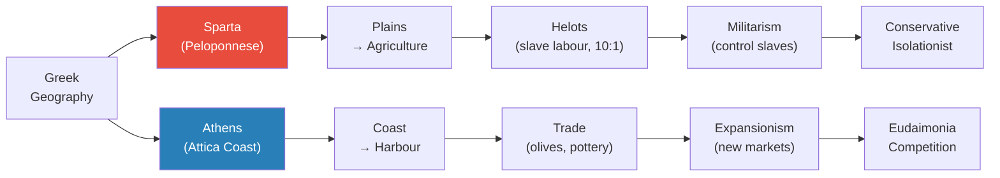
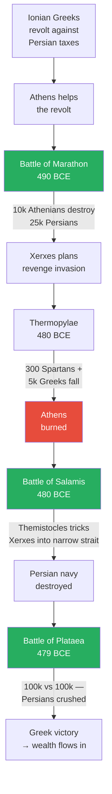
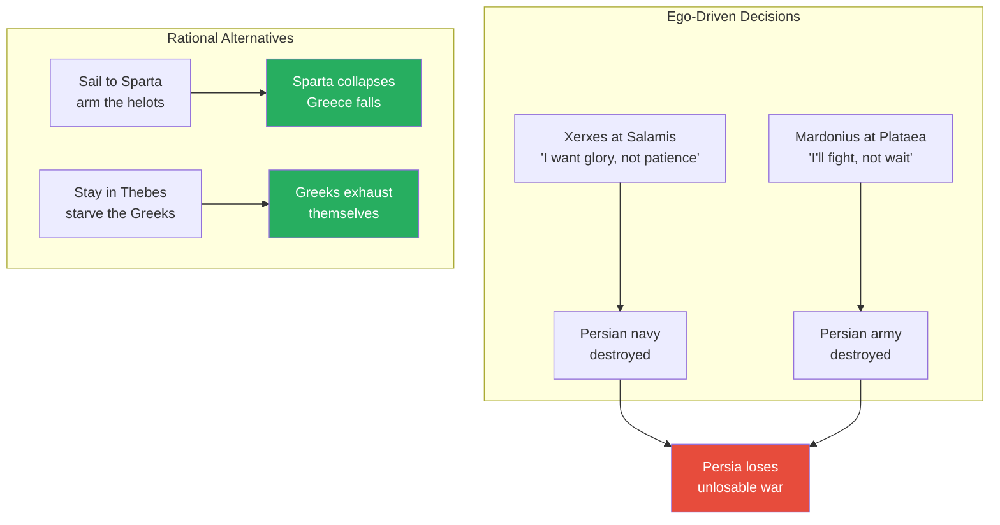
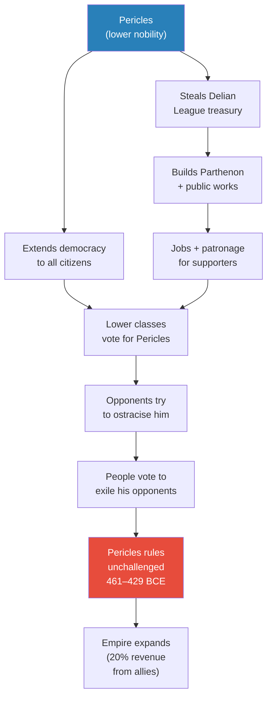
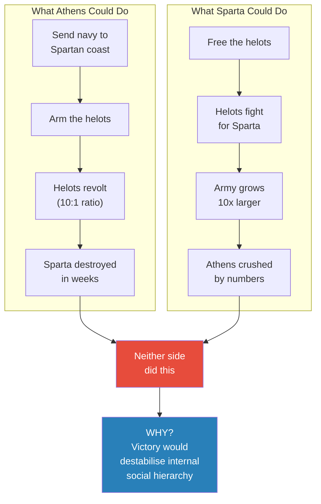
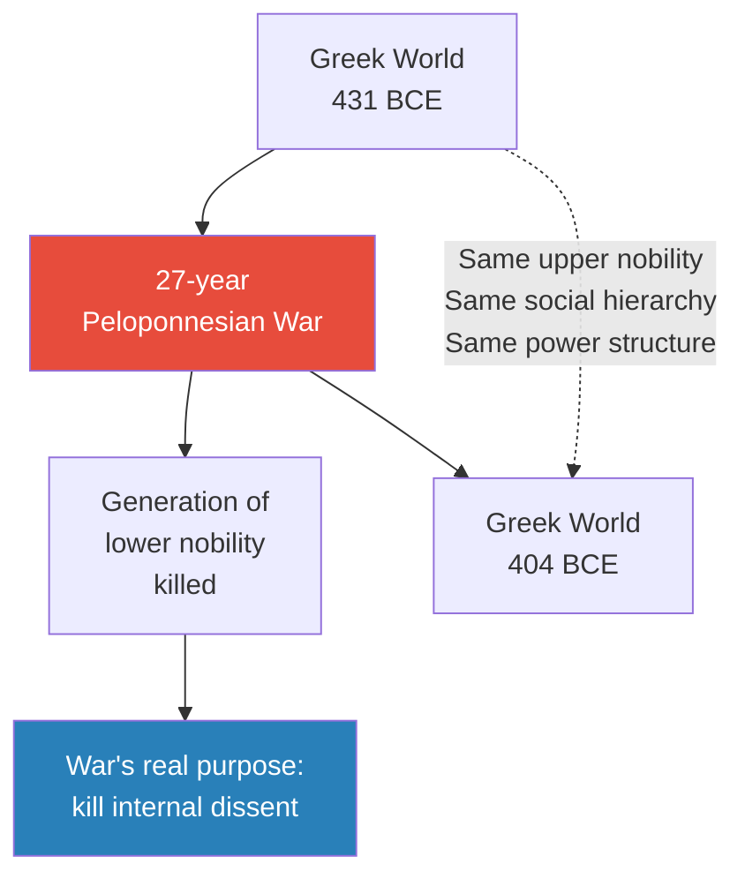
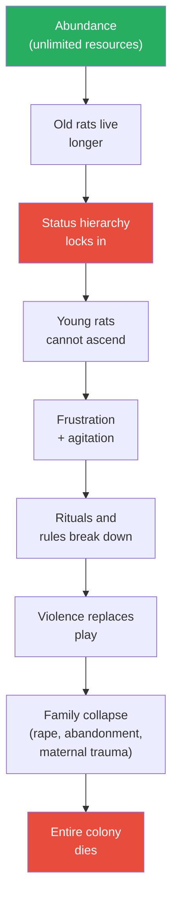
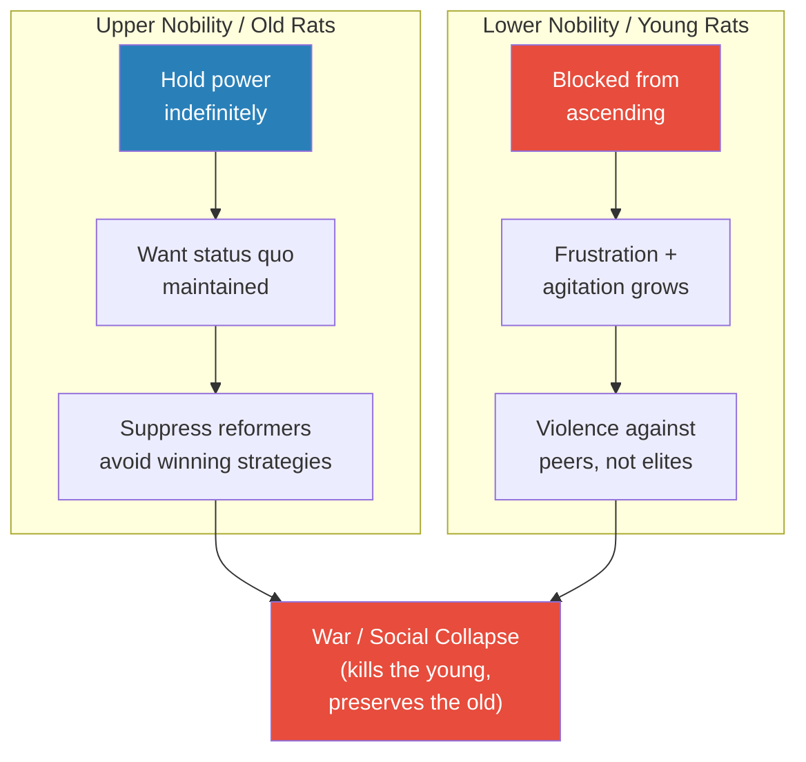
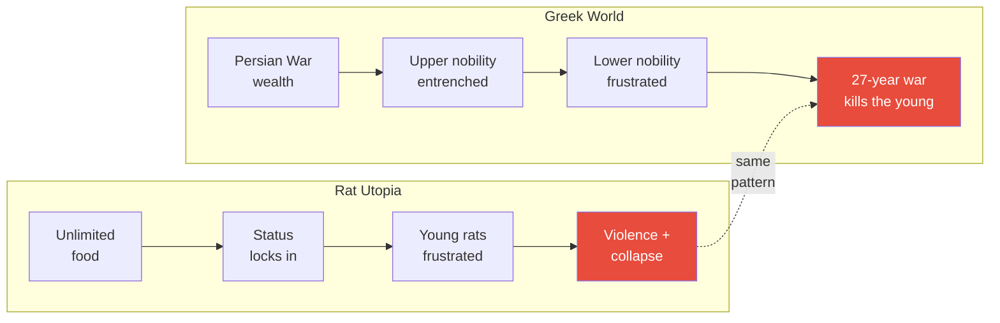
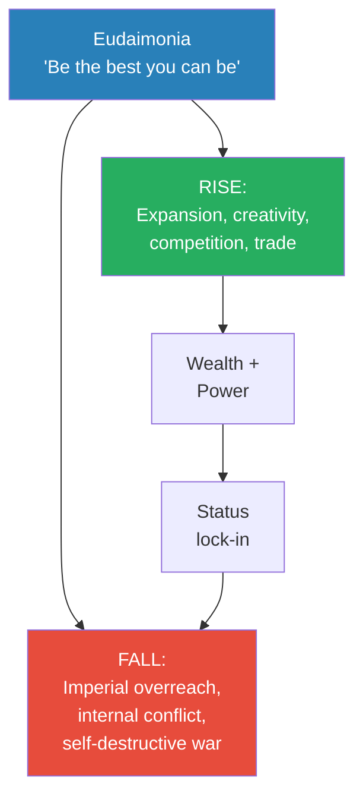

# Rat Utopia and the Peloponnesian War

> Prof. Jiang delivers a sweeping overview of Greek history — from Sparta and Athens as geographical mirror images, through the Persian Wars' pivotal battles, to the 27-year Peloponnesian War that destroyed Athens. But the lecture's real argument is hidden beneath the narrative: the Peloponnesian War made no military sense. Both sides avoided obvious winning strategies. The real conflict was never between Sparta and Athens — it was between upper and lower nobility within each society. A 1960s experiment on rats in paradise provides the explanatory key: when societies grow too wealthy, status locks in, the young cannot rise, and the resulting frustration produces self-destructive violence that ends in total collapse.

---

## The Question

*Why did the Peloponnesian War — a 27-year conflict that both sides could have won quickly — drag on with seemingly irrational military decisions? And what does a colony of rats in utopia reveal about the real cause?*

Prof. Jiang's answer reframes the entire war: the enemy was never across the battlefield — it was at home. Wealthy societies destroy themselves not from external threats but from internal status conflicts that make self-destructive war preferable to social change. This is a pattern he has been building since Lecture 6 on elite overproduction and the Bronze Age collapse, and it reaches its fullest expression here. The Peloponnesian War becomes not a story of great-power rivalry but a case study in how ruling classes sacrifice their own young to preserve a social hierarchy that benefits them. The rats in Calhoun's experiment — given everything they could ever need — destroyed themselves for exactly the same reason.

## Key Concepts at a Glance

| Concept | One-line summary |
|---------|-----------------|
| **Geography is destiny** | Physical landscape determines a society's culture, economy, and politics |
| **Eudaimonia** | Greek for "human flourishing" — Athenian drive to be the best, even at the cost of death |
| **Helots** | Sparta's slave class outnumbering citizens 10:1 — the source of both military strength and fatal vulnerability |
| **Hoplites / Phalanx** | Armoured infantry in shield-wall formation — the military innovation that defeated Persia |
| **Ostracism** | 10-year banishment from the polis — worse than death in a citizenship-based world |
| **Delian League** | Defensive alliance Athens converted into an empire under Pericles |
| **Rat Utopia** | Calhoun's experiment: unlimited resources → social collapse → extinction |
| **Status lock-in** | When abundance lets the old hold power indefinitely, blocking the young from rising |
| **Upper vs. lower nobility** | The real axis of conflict — not rich vs. poor, but established elite vs. aspiring elite |

---

## Geography Is Destiny — Two Opposite Worlds

Around 500 BCE, two Greek poleis dominated the political landscape of the Aegean world, and they could hardly have been more different. Sparta and Athens were products of the same Greek civilisation — sharing language, religion, and the memory of Homer — yet they developed cultures so radically opposed that they might have belonged to different planets. Prof. Jiang opens the lecture by insisting that this divergence was not accidental, not a matter of different leaders or philosophies, but the inevitable consequence of a single variable: geography. The physical land beneath each city dictated what its people ate, how they made money, who they feared, and ultimately what they believed about how life should be lived. This is the principle he calls <b style="color: #2980b9">"geography is destiny"</b> — an analytical tool he will return to throughout the entire Civilization series.

The diagram above traces the causal chain from geography to political culture for both poleis. Sparta's flat plains made agriculture the obvious economic base, which demanded a conquered labour force — the helots — whose sheer numbers then required permanent military vigilance. Athens's coastal position with its excellent harbour made trade the natural livelihood, which demanded exploration, new markets, and a competitive culture that rewarded individual ambition. The same Greek world, the same set of gods and myths, produced two civilisations that were structural mirror images of each other — one turned inward by fear, the other turned outward by ambition.

### Sparta — The Military Machine

Sparta occupies the Peloponnese — a broad peninsula of flat plains ideal for large-scale agriculture. But farming at that scale required labour, and Sparta's solution was conquest. The peoples it defeated became <b style="color: #e74c3c">helots</b> — a permanent slave class who worked the land, generation after generation, with no hope of freedom. Over time, the helot population grew to outnumber Spartan citizens by roughly ten to one. This terrifying demographic imbalance became the central fact of Spartan life — every institution, every custom, every policy was ultimately shaped by the need to keep ten slaves under control for every free citizen.

> [!example] Sparta's Education System — Manufacturing Soldiers from Childhood
> - At age seven, boys were removed from their families and placed in boarding schools
> - These schools were supervised not by adults but by older children — eleven- and twelve-year-olds — who routinely beat the younger boys
> - The purpose was to instil emotional discipline: learning to endure pain, humiliation, and fear without breaking
> - As teenagers, boys were paired with adult mentors aged 25-30 who became their lovers
> - Spartans did not consider this homosexuality — they saw it as building emotional cohesion and loyalty among soldiers who would fight and die together
> - At age 18 or 19, graduates married and started families, but soldiers were required to eat and train together daily — family was secondary to the military unit
> - Sparta had no private property and no money — everything, including the helots, belonged to everyone (a system Prof. Jiang calls "proto-communism")
> - Young soldiers patrolled the fields at night; any helot caught outside after curfew was stabbed to death on the spot
> - This was not random cruelty — it was a deliberate, institutionalised campaign of terror designed to prevent helot uprisings
> **The lesson:** Sparta's entire social system — from childhood education to adult life — was engineered for one purpose: maintaining military control over a slave population that vastly outnumbered its masters. Every aspect of Spartan culture flows from this single structural fact.

The consequence of this arrangement was a society utterly consumed by internal control. Sparta was conservative to its core — any citizen who proposed changing the social order was killed. It was isolationist by necessity — all political energy went to suppressing the helots, leaving nothing for foreign adventures. And it was conformist by design — individuality was dangerous in a society that depended on absolute military cohesion.

> [!tip] Core Insight
> Prof. Jiang draws a direct parallel to China: "China throughout its history has been very conservative and very isolationist — not interested in the outside world. Why? Because it's focused on maintaining control over its peasantry." Sparta and China share the same structural logic — geography creates an internal control problem that consumes all political energy.

This parallel between Sparta and China is not a throwaway comparison. Prof. Jiang uses it as a recurring analytical tool: when a society's geography creates a large, subordinated population that must be controlled, that society will inevitably become conservative (resisting change that might destabilise the hierarchy) and isolationist (having no surplus energy for foreign engagement). The pattern repeats across civilisations and millennia, driven not by cultural choice but by structural necessity.

### Athens — The Competitive Crucible

Athens occupied a fundamentally different landscape. Located in Attica on the coast, its terrain was hilly — poor for growing grain crops but excellent for olive trees. Combined with skilled pottery production and a superb natural harbour, Athens became a <b style="color: #2980b9">trading nation</b> almost by default. Where Sparta looked inward at its fields and slaves, Athens looked outward at the sea and the markets beyond it. Trade demanded exploration, new colonies, new customers — and it rewarded the bold, the innovative, and the ambitious. Athens planted colonies throughout the Aegean and the wider Mediterranean, and it encouraged its citizens to venture out, find new markets, and bring goods and ideas back home.

This outward-facing economy produced a cultural value system that Prof. Jiang identifies as the engine of everything Athens accomplished and everything it ultimately destroyed: <b style="color: #2980b9">eudaimonia</b> — a Greek word meaning "human flourishing," the drive to be the absolute best you can be.

> [!example] Achilles's Choice — The Spirit of Eudaimonia
> - In Homer's Iliad, the hero Achilles reveals that before sailing to Troy, he consulted a fortune teller
> - The prophet gave him a stark choice between two fates
> - Option A: Stay home, live a long and healthy life, but die as a nobody — forgotten by history
> - Option B: Go to Troy, die young on the battlefield, but be remembered forever as a hero — songs of glory sung for eternity
> - Achilles responds: "For me, that's not a choice. To be alive means to achieve eudaimonia"
> - He chose Troy, chose death, chose glory — because in the Athenian worldview, a life without greatness is not truly a life at all
> - In Athens, it is better to die young as a hero than to live a long time as a nobody
> - In Sparta, the opposite is true — it is better to be a nobody and get along with everyone
> - This single cultural difference — the value placed on individual glory versus collective conformity — explains the entire divergence between the two civilisations
> **The lesson:** Eudaimonia made Athens the most creative, competitive, and dangerous society in the Greek world. It drove Athenians to explore, to build, to conquer — but it also made them willing to commit treason, backstab allies, and pursue personal glory at any cost to the collective.

Prof. Jiang illustrates eudaimonia's darker side with a scene from the Iliad itself. When Achilles quarrels with Agamemnon, he goes to his goddess-mother Thetis and asks her to convince the gods to help the Trojans — essentially committing treason against his own army — so that Agamemnon will be forced to come begging for Achilles's help. In the Greek world, this was acceptable behaviour, because eudaimonia ranked above loyalty. The pursuit of personal greatness justified almost anything.

Because eudaimonia made Athens ferociously competitive, the city needed a safety valve. It invented <b style="color: #2980b9">ostracism</b>: citizens could vote to banish any person from the polis for ten years. This punishment was considered worse than death. In the polis system, only citizens had rights — and citizenship was by birth, not merit. You could not earn it through hard work or achievement. If banished, you became a legal non-person with no standing anywhere in the Greek world. Prof. Jiang emphasises this point because it reveals just how high the stakes of political competition were: exile was social death, and every ambitious Athenian lived under its shadow.

Athens was nominally a democracy — every citizen could speak and vote in the assembly. But Prof. Jiang insists that Athenian democracy was not what modern readers imagine. Real political power was contested exclusively among the nobility, and the true axis of conflict was between the upper nobility and the lower nobility.

<b style="color: #e74c3c">Prof. Jiang's key reframe:</b> "We think the conflict in societies is between the haves and the have-nots — the rich and the poor. That is not true. The conflicts are between the have-a-lot and the have-some-but-want-more." The poor riot; the lower nobility revolt. This distinction — which Prof. Jiang traces through Athens, the French Revolution (the petite bourgeoisie), and the modern middle class — becomes the analytical key to understanding not just Athenian politics but the entire Peloponnesian War.

---

## The Persian Wars — When Ego Defeats Strategy

Before the Peloponnesian War tore the Greek world apart from within, it faced an existential threat from without. The Persian Empire — one of the largest and most sophisticated empires in human history, encompassing Egypt, Mesopotamia, and modern Iran — turned its attention to the Greek colonies on its western border. What followed was a series of battles that decided the fate of Western civilisation. Prof. Jiang narrates these battles in vivid detail, but his analytical focus is not on Greek heroism — it is on Persian irrationality. At every turning point, Persian commanders chose personal glory over sound strategy, throwing away a war they had already won. This pattern of ego overriding rationality foreshadows the identical pattern Prof. Jiang will identify in the Peloponnesian War itself.

The conflict began when Greek colonists living in Persian-controlled Anatolia (Asia Minor) revolted against Persian taxes. They appealed to their fellow Greeks for help. Sparta's response was predictable: "Your problem, not our problem." Athens, driven by eudaimonia, eagerly joined the fight — and in doing so, drew the wrath of the greatest empire on earth.

Four battles decided the fate of the Greek world, and at every turning point, Persian commanders chose ego over strategy. The flowchart above traces the escalating sequence from a colonial tax revolt to the total destruction of the Persian expeditionary force. Each green node marks a decisive Greek victory; the red node marks Athens's burning — a catastrophe that paradoxically led to Greece's salvation. The pattern Prof. Jiang wants students to notice is not Greek brilliance but Persian self-sabotage: at Marathon, Salamis, and Plataea, the Persians had winning positions and threw them away because individual commanders prioritised personal glory over rational strategy.

### Marathon — The First Shock (490 BCE)

The Battle of Marathon was the first major engagement between Greece and Persia, and it stunned the ancient world. The numbers were heavily skewed: roughly 10,000 Athenians faced 25,000 Persians — a two-and-a-half-to-one disadvantage that should have meant certain defeat. Instead, the Athenians won decisively, losing only 192 men while killing approximately 5,000 Persians. Prof. Jiang attributes this stunning outcome to a military innovation that the Greeks had developed over roughly a century: the <b style="color: #2980b9">hoplite/phalanx</b> system.

The word "hoplite" comes from hoplon, Greek for shield. Hoplites were heavily armoured infantry carrying large round shields and long spears who fought in phalanx formation — men standing shoulder to shoulder, shields overlapping, forming a moving wall of bronze and iron. The Persian Empire, accustomed to flat terrain stretching across Mesopotamia and Iran, relied on horse-mounted archers — cavalry that could manoeuvre on open plains. But the hilly terrain of Marathon negated cavalry entirely, and the Persians had no answer for armoured men in close formation. When armour met no armour on ground that favoured infantry, the result was a slaughter. Marathon humiliated Persia, proved the hoplite system's superiority, and set the stage for a far larger reckoning ten years later.

### Xerxes's Invasion and the Fall of Athens (480 BCE)

A decade later, King Xerxes assembled what Prof. Jiang describes as one of the largest invasion forces in ancient history — perhaps 500,000 soldiers plus a massive navy, drawing on every nation of the Persian Empire including Egypt, Phoenicia, and even Greeks from Ionian territories. Sparta and Athens allied to resist, though some Greek poleis — notably Thebes and Macedonia — sided with Persia. The Greek stand at Thermopylae, made famous by the film 300, saw roughly 300 Spartans and 5,000 other Greeks hold a narrow mountain pass before being overwhelmed. The Persians then marched south and burned Athens to the ground.

But here Prof. Jiang introduces a concept critical to understanding Greek civilisation: <b style="color: #27ae60">the polis is a community, not a place</b>. When the Persians burned Athens, the Athenians simply boarded their ships and sailed away. The city was destroyed, but the polis — the community of citizens — survived intact. This distinction between physical space and political community is what made Greek civilisation so resilient and so different from the territorial empires it faced.

> [!example] Themistocles's Gambit at Salamis — How Ego Lost the War for Persia
> - After Athens burned, the Greek navy was trapped near the island of Salamis
> - The Spartans wanted to retreat south and defend their own coastline — with Persian ships in the Aegean, the Persians could land on the Spartan coast, arm the helots, and destroy Sparta in days
> - Themistocles, the Athenian general, issued a threat: "We either fight the Persians now, or Athens takes its ships and sails west to Sicily — leaving Sparta to face Persia alone"
> - Then Themistocles sent a spy to King Xerxes with a false message: "The Greek navy wants to run — attack now and you can destroy them all in one blow"
> - Xerxes's own generals begged him not to take the bait — "We've won the war, just starve them out, or sail around and arm the helots"
> - Xerxes refused: "My father King Darius lost at Marathon. I will prove I am a greater king by destroying the Greeks in one glorious battle. History will remember me forever"
> - He sent roughly 1,000 ships into the narrow strait at Salamis — where the heavier Greek ships had the advantage in close quarters
> - The Greek navy destroyed the Persian fleet — the most decisive naval battle of the ancient world
> - Xerxes had won the war on land; his ego lost it at sea
> **The lesson:** The Persian Empire lost a war it had already won because its king chose personal glory over rational strategy. Ego is the most dangerous weapon in geopolitics — more lethal than any army, because it makes commanders fight battles they do not need to fight.

### Plataea — The Final Blow (479 BCE)

With the Persian navy destroyed at Salamis, supply lines collapsed. Greece was too poor to feed half a million foreign soldiers — all supplies had to come by sea from Persia, and the sea route was now closed. Xerxes retreated home, leaving his cousin General Mardonius with the land army. Mardonius was based in Thebes, a Greek city allied with Persia, and he had a simple winning strategy available: sit in Thebes, wait, and let the Greeks exhaust themselves. Athens was already burned; Sparta was still under threat. Time was on Persia's side.

Instead, Mardonius chose to fight at the Battle of Plataea — roughly 100,000 Greeks against 100,000 Persians on open ground. The Greeks destroyed the Persian army, killing five times more men than they lost. Mardonius himself was killed. Prof. Jiang's point is blunt: Mardonius, like Xerxes at Salamis, chose personal glory over patient strategy. The Persians lost a war that geography, numbers, and logistics all said they should have won — because at every critical decision point, ego overruled reason.

This diagram contrasts the decisions Persian commanders actually made with the rational alternatives available to them. The left column shows ego-driven choices that led to catastrophic defeats; the right column shows the patient strategies that would have won the war easily. Prof. Jiang uses this contrast to establish a theme that will recur throughout the lecture: when leaders prioritise personal status over strategic rationality, they make decisions that destroy their own side. The Persians did it at Salamis and Plataea. The Greeks will do the same thing to each other in the Peloponnesian War — for twenty-seven years.

---

## Pericles — Democracy as a Weapon

After the Persian Wars, Greece became extraordinarily wealthy. Persian territories in Asia Minor fell to Greek control, and treasure flowed into the Aegean world. Athens emerged as the dominant power — its navy had saved Greece at Salamis, and it now led a coalition of island poleis called the <b style="color: #2980b9">Delian League</b>. Into this moment of ascendancy stepped Pericles, the man historians celebrate as the father of Athenian democracy. Prof. Jiang's treatment of Pericles is deliberately contrarian: he does not dispute that Pericles did great things for Athens, but he insists that every one of those achievements was first and foremost an instrument of personal power consolidation. Democracy, empire, and monumental building projects — all served the same function: making Pericles effectively king of Athens for thirty-two years.

Pericles's power cycle was self-reinforcing and nearly impossible to break from within. Democracy empowered the masses who voted for him; the stolen Delian League treasury funded public works that created jobs and patronage; grateful beneficiaries defended him against opponents; and opponents who protested were ostracised by popular vote. The diagram shows how each element fed the next in a closed loop. Prof. Jiang presents this not as corruption in the modern sense but as an archetype of how democratic systems can be captured by a single faction — democracy becomes the instrument of one-man rule precisely because it appears to be the opposite.

Pericles's two great innovations were democracy and empire, and Prof. Jiang argues that both served the same strategic purpose. By extending voting rights to all citizens, Pericles allied the common people against the upper nobility — the faction that opposed him. The lower classes, grateful for political rights they had never before enjoyed, voted consistently for Pericles and against his elite critics. This was not idealism; it was faction warfare conducted through constitutional reform.

By moving the Delian League treasury from the island of Delos to Athens (on the pretext that Persia might steal it), Pericles gained access to enormous wealth that he spent on monuments like the Parthenon — a gold-laden temple to Athena that cost, in Prof. Jiang's words, "billions and billions of dollars." The real purpose was not religious devotion but economic patronage: construction projects created jobs, and the money flowed to Pericles's supporters, making <b style="color: #e74c3c">official corruption</b> the economic engine of Athenian politics. The Parthenon was not just a temple — it was a jobs programme designed to buy loyalty.

When the upper nobility accused Pericles of corruption and moved to ostracise him, the people voted to exile his accusers instead. With no political opponents left standing, Pericles ruled Athens unchallenged from 461 to 429 BCE — thirty-two years of effective one-man rule under the banner of democracy. Meanwhile, the Delian League — originally a voluntary defensive alliance against Persia — became the Athenian Empire. Any member city that tried to leave was invaded. Athens extracted roughly 20% of its revenue from these subject "allies," running what Prof. Jiang describes as essentially a protection racket: pay tribute or be conquered.

<b style="color: #e74c3c">The great irony of eudaimonia:</b> Empire made everyone rich, but the wealthy became even richer. The lower nobility, driven by eudaimonia's competitive spirit but blocked from rising within Athens's locked-in hierarchy, launched overseas expeditions to conquer new territory for personal enrichment. Some succeeded; many failed spectacularly (like the disastrous campaign in Egypt). This aggressive expansion terrified other Greek poleis, who saw Athens not as a protector but as a bully — an imperial power forcing islands and cities to pay tribute under threat of invasion. One by one, the Greek world united around Sparta to resist. Eudaimonia — the culture that had built Athens into the most creative and powerful polis in the Greek world — was now provoking a war that would destroy it.

---

## The Peloponnesian War — A War Nobody Tried to Win

In 431 BCE, the Greek poleis united around Sparta and went to war against Athens. The conflict would last twenty-seven years, devastate the Greek world, and kill a generation of young men on both sides. But the most remarkable thing about the Peloponnesian War is not its length or its brutality — it is that neither side tried to win. Prof. Jiang builds his case methodically: both Athens and Sparta had simple, obvious strategies that would have ended the war quickly and decisively. Neither used them. The military decisions both sides actually made — from Pericles's suicidal wall strategy to Sparta's refusal to promote winning commanders — only make sense if you abandon the assumption that the war was about defeating the external enemy. The real war, Prof. Jiang argues, was internal: upper nobility against lower nobility, in both cities simultaneously.

### The Obvious Strategies Nobody Used

This diagram is the centrepiece of Prof. Jiang's argument. Both sides had clear paths to quick victory, and both refused to take them. Athens could have landed its navy on the Spartan coast and armed the helots — exactly what Persia could have done at Salamis but didn't. With helots outnumbering Spartans ten to one, Sparta would have collapsed in weeks. Sparta could have freed the helots and offered them citizenship for military service, multiplying its army tenfold — enough to overwhelm Athens on any battlefield. Neither strategy was attempted, and the reason, Prof. Jiang insists, is that <b style="color: #2980b9">both ruling classes feared social change more than military defeat</b>. Arming the helots would have destroyed Sparta's social order; freeing them would have done the same. Victory in the war would have been more dangerous to the people in power than losing it.

### Pericles's Suicidal Defence

When the war began, Pericles — representing the upper nobility and their conservative interests — chose a purely defensive strategy. Athens would hide behind its famous Long Walls (connecting the city to its harbour at Piraeus) and let the navy protect supply lines by sea. The Spartan army marched into Attica and systematically destroyed all the farmland while the Athenians stood on their walls and watched.

The consequences were catastrophic. Tens of thousands of citizens from the Athenian countryside crowded behind the walls, and the overcrowding triggered a <b style="color: #e74c3c">plague that killed one-third of the Athenian population</b> — including Pericles himself and both his sons. Prof. Jiang delivers the arithmetic with devastating clarity: if Athens had fought the Spartans in open battle and lost badly, it would have lost perhaps 10% of its population. The "safe" defensive strategy killed three times more people than the "dangerous" offensive one. The farmland was destroyed, the population decimated, and the leader who chose the strategy died of the very plague his overcrowding caused.

This catastrophic outcome only makes sense if you understand Pericles's real priority: <b style="color: #2980b9">maintaining the status quo within Athens</b>. An aggressive war might produce new military heroes from the lower nobility — men who could challenge Pericles's faction through battlefield glory. The eudaimonia-driven culture meant that a victorious general would gain enormous prestige and political power, potentially displacing the upper nobility that Pericles represented. Better to lose a third of the population to plague than to empower rivals through military success. The defensive strategy was not a miscalculation — it was a rational choice by a ruling class that feared internal disruption more than external defeat. The war's purpose, for the upper nobility, was not victory but stasis.

### The Convenient Deaths of Cleon and Brasidas

After Pericles died of the plague, the political balance in Athens shifted. The lower nobility, no longer held in check, became ascendant and proposed aggressive strategies against Sparta. Prof. Jiang tells the story of two men — one from each side — who figured out how to actually win the war, and what happened to them.

> [!example] Two Men Who Knew How to Win — And Died for It
> - After Pericles's death, Cleon rose to lead Athens — a man of the lower nobility whom historians label a "demagogue"
> - Prof. Jiang reframes Cleon: "Really what he is, he's lower nobility who's trying to achieve eudaimonia — he's basically like Themistocles"
> - Cleon proposed an aggressive military strategy against Sparta — and Athens started winning
> - Meanwhile, Sparta promoted Brasidas, a general who went north and began winning victories against Athenian interests
> - Brasidas's key innovation: he told the helots, "If you fight for me, I'll give you your freedom"
> - Helots flocked to Brasidas's banner, and he won battle after battle
> - The Spartan leadership was horrified — not because Brasidas was losing, but because he was winning in a way that changed the social structure
> - Cleon empowered Athens's lower classes; Brasidas freed Sparta's slaves — both men threatened the status quo more than any foreign enemy
> - The two men met in battle against each other — and both died in the same engagement
> - Prof. Jiang: "That's extremely convenient, guys. I'd be very surprised if they actually both died in battle. My guess is they were both assassinated"
> - After their deaths, both cities reverted to conservative leadership and the war dragged on for years with no decisive action
> **The lesson:** The greatest threat to any ruling class is not the external enemy — it is the internal reformer who might actually win the war and change the social hierarchy in the process. Victory is more dangerous than defeat when it empowers the wrong people.

### The End — and the Non-Punishment

The final phase of the war saw Persia re-enter the picture — not as an invader but as a banker. Persia gave Sparta a blank check to build a navy, hoping to weaken Greece through prolonged internal conflict. But even with unlimited Persian funding, Sparta kept sabotaging its own war effort by refusing to promote commanders who were winning.

Prof. Jiang describes the Persians' exasperation: their advice to Sparta was simply, "If a general is winning against the Athenians, promote him." The Spartans would not do even this, because military success would disrupt the internal social hierarchy. A winning commander would gain status, prestige, and political leverage — exactly what the upper nobility was fighting to prevent.

Eventually Persia forced Sparta to promote <b style="color: #2980b9">Lysander</b> — a half-citizen looked down upon by full Spartans because only his father was a citizen, not his mother. Lysander, once given authority, single-handedly won the naval war. He besieged Athens in 404 BCE, cutting off food supplies, and Athens surrendered.

What happened next is, for Prof. Jiang, the most revealing moment of the entire war. After twenty-seven years of slaughter, <b style="color: #27ae60">Sparta did nothing to Athens</b>. No massacre, no enslavement, no destruction. In the ancient Greek world, the standard outcome of defeat was total annihilation — all men killed, all women and children sold into slavery. Other Greek poleis and Persia wanted exactly this for Athens. Sparta refused.

The official explanation was strategic: Sparta needed Athens as a counterweight to Persia. Prof. Jiang offers a different reading: "The upper nobility of Sparta and the upper nobility of Athens are good friends with each other. Rich people tend to marry each other." The war had served its purpose. It had killed a generation of young, ambitious lower nobility on both sides. The political world of 404 BCE was identical to 431 BCE — the same families in power, the same hierarchies intact. That was the point.

This diagram captures Prof. Jiang's most provocative claim about the Peloponnesian War. The dotted line connecting 431 BCE to 404 BCE represents the war's true outcome: nothing changed except a generation of young people who might have challenged the hierarchy were now dead. The war was not a failure of strategy but a success of social engineering — a twenty-seven-year mechanism for eliminating internal dissent while preserving the status quo. The upper nobility of both cities emerged with their positions intact, their friendships undamaged, and their most dangerous domestic rivals buried.

---

## Rat Utopia — The Key to Everything

In the 1960s and 70s, an American researcher named John B. Calhoun asked a deceptively simple question: what happens when a society has everything it needs? What does utopia actually look like — not in theory, but in practice? He could not experiment on humans, so he built paradise for rats instead. The results were so disturbing that they have been replicated many times since, and the outcome is always the same: total social collapse followed by extinction. Prof. Jiang presents Calhoun's experiment not as a curiosity but as the explanatory key to the entire Peloponnesian War — and, by extension, to a recurring pattern in human civilisation. When abundance removes the struggle for survival, it does not produce happiness. It produces a locked hierarchy, frustrated youth, and violence that escalates until the society destroys itself.

### How Normal Rat Society Works

Before explaining the collapse, Prof. Jiang takes care to establish what healthy rat society looks like — because the experiment's horror depends on understanding what was lost. His central point is that animals do not live in chaos. They live in heavily ritualised, rules-based worlds that are far more structured than humans typically imagine.

> [!example] The Rat Courtship Ritual — Structure Before the Storm
> - A female rat signals she is ready to mate by going out where males can see her
> - A male rat spots her and climbs to a visible mound — a raised position where she can observe him
> - He begins to dance — a display ritual designed to attract her attention and demonstrate fitness
> - She watches with interest; he comes down from the mound and they begin chasing each other playfully
> - She runs home and hides in her burrow; he waits patiently outside, making no attempt to force entry
> - After some time, she emerges and they chase again — this cycle repeats many times
> - Finally, after multiple rounds of this courtship ritual, she allows him to catch her
> - They mate and begin a family together, sharing the burrow
> - All fighting between rats in normal conditions is playful and governed by strict rules — no rat is seriously injured
> - The entire social order depends on these rituals being observed: patience, display, consent, play
> **The lesson:** Rat society, like human society, runs on ritual, patience, and shared rules. It is not chaotic — it is deeply structured. The rituals are what make coexistence possible, and when they break down, everything breaks down with them.

### The Collapse

Prof. Jiang describes the breakdown of Calhoun's rat utopia with unflinching specificity, because the details are what make the parallel to human societies so unsettling. In conditions of unlimited food, unlimited water, and ample space, every ritual that held rat society together shattered:

- Male rats stopped performing the courtship dance — when they saw a female, they attacked her in <b style="color: #e74c3c">gang rape</b> instead of courting her
- Male-on-male fighting escalated from playful sparring to genuinely lethal violence — rats tried to kill each other rather than establishing dominance through display
- Gangs of males broke into burrows to assault the females inside
- Husbands initially fought off the intruders, but eventually grew exhausted and <b style="color: #e74c3c">abandoned their families entirely</b> — simply running away
- Mothers, now sole defenders of the burrow with no mate and constant attacks, became so traumatised that they could no longer distinguish between threats and non-threats
- Traumatised mothers attacked everything and everyone — including their own children — and kicked them out of the burrow
- Within months, the entire colony died. Every single rat

Prof. Jiang emphasises two critical facts about the experiment. First, the researchers never interfered with rat behaviour — they only provided food. Abundance alone was sufficient to destroy the entire social order. Second, the experiment has been repeated many times with different colony sizes and configurations, and the result is always the same: total social collapse followed by extinction. This is not an anomaly. It is a pattern.

### Why Did It Happen?

The path from paradise to extinction follows a single causal chain, and Prof. Jiang traces each link carefully. The green node at the top — abundance — is the trigger, not overpopulation as Calhoun himself originally believed. The colony never ran out of space; there was room for everyone. The critical mechanism is the red node in the middle: status lock-in. When resources are unlimited, the old live longer, and because they live longer, they hold their positions at the top of the social hierarchy indefinitely. The young, who in normal conditions would gradually ascend as the old weakened and died, find themselves stuck with no prospect of advancement.

<b style="color: #e74c3c">Calhoun's own explanation — overpopulation — was wrong.</b> The colony never became overcrowded. Prof. Jiang's alternative explanation focuses on <b style="color: #2980b9">status lock-in</b>: abundance allows incumbents to hold power forever, which blocks the advancement of the young. He offers a vivid metaphor to make the mechanism concrete:

Imagine rats waiting in a queue to climb a mountain. The line is moving slowly, but it is moving — every rat knows that eventually its turn will come. There is frustration, but there is also hope. Then the line stops. The rats at the top will not leave. The rats in the middle are stuck in place with no prospect of reaching the summit. At first there is anxiety, then agitation, then outright fury: "When is it my turn?" The frustration does not flow upward — the young do not challenge the old directly, because the old are too entrenched, too powerful. Instead, they turn on each other: "kicking the people behind them," as Prof. Jiang puts it. The violence flows downward and sideways, never upward.

The rules that held society together — courtship rituals, playful fighting, family structures, respect for burrow boundaries — all collapse under the pressure of a generation with nowhere to go and no hope of getting there. What makes Rat Utopia so disturbing is not that the rats became violent — it is that the violence was structurally inevitable. No individual rat chose to destroy the society. The destruction emerged automatically from the interaction between abundance and hierarchy, without any external intervention at all.

This diagram maps the upper-vs-lower nobility conflict model that Prof. Jiang treats as universal across civilisations. The upper group — whether old rats at the top of Calhoun's hierarchy or Athenian upper nobility — benefits from the status quo and will suppress anyone who threatens it, even if suppression means losing a war. The lower group — young rats or lower nobility — is blocked from advancement and channels its frustration into lateral violence rather than upward revolution. The result is war or social collapse that eliminates the frustrated young while preserving the entrenched old. This is the model Prof. Jiang will apply not just to Athens and Sparta but to the French Revolution, modern class conflict, and the recurring pattern of civilisational decline throughout the series.

---

## The Peloponnesian War as Rat Utopia

Prof. Jiang's final analytical move is the lecture's culminating insight: the Greek world after the Persian Wars was a rat utopia — wealthy, status-locked, and heading for self-destruction through exactly the same mechanism Calhoun observed in his laboratory. The parallel is not metaphorical. Prof. Jiang presents it as structural: the same causal chain (abundance → status lock-in → frustrated youth → collapsed rules → self-destructive violence) operated in fifth-century Greece just as it operated in Calhoun's enclosed habitat. The scale was different; the mechanism was identical.

The parallel structure in this diagram is deliberately stark. On the left, Calhoun's rats in abundance; on the right, the Greek world after Persian War wealth flooded in. Both follow the same four-step sequence: resources flow in, the hierarchy ossifies, the young become frustrated, and the resulting violence destroys the society. The dotted arrow connecting the two outcomes is Prof. Jiang's thesis made visual — these are not merely similar stories but instances of the same underlying pattern.

After defeating Persia, Greece became extraordinarily wealthy. Treasure from captured Persian territories flooded the Aegean world, enriching everyone — but enriching the upper nobility most of all. The wealthy bought land, accumulated influence, and entrenched themselves in positions that their children and grandchildren would inherit. The lower nobility, driven by eudaimonia's competitive spirit, found every avenue of advancement blocked. They could not outcompete the upper nobility in politics because the upper nobility controlled the patronage networks. They could not outcompete in commerce because the upper nobility had first claim on the most profitable trade routes and territories.

The Peloponnesian War became their outlet — not a rational strategic conflict but a mechanism for channelling the frustration of a blocked generation. For twenty-seven years, young men from both sides fought and died in battles that neither ruling class wanted to win. The upper nobility of Athens and the upper nobility of Sparta shared more interests with each other than with their own lower classes. They intermarried. They socialised. They understood, perhaps not consciously but certainly structurally, that the war served their interests by killing precisely the people who might otherwise have challenged them.

This diagram captures what Prof. Jiang calls the paradox of eudaimonia — and flags as a recurring pattern throughout history. The same cultural value that drives a civilisation to greatness is the one that ultimately destroys it. Eudaimonia built Athens into the most creative, competitive, and wealthy polis in the Greek world. That same eudaimonia, turned inward when external expansion could no longer absorb the ambition, produced imperial overreach and internal competition so fierce that the only relief was a generation-long war of mutual destruction. The cycle is self-reinforcing: eudaimonia creates wealth, wealth creates status lock-in, status lock-in frustrates the eudaimonia-driven young, and their frustration produces the violence that tears the society apart.

<b style="color: #e74c3c">The political world of 404 BCE was identical to 431 BCE</b> — the same families in power, the same social hierarchies intact. The only difference was a generation of young people dead. Both sides avoided winning strategies because victory would have changed the social order. Both sides' upper nobility remained friends throughout — and after Athens surrendered, Sparta left it untouched. The rats in Calhoun's experiment had everything they needed and destroyed themselves anyway. So did Athens.

---

## Student Q&A — Why Do Mothers Attack Their Own Children?

The student questions at the end of the lecture focus on the most disturbing detail of the Rat Utopia experiment: why do traumatised rat mothers turn on their own offspring? Prof. Jiang's answer draws a clear distinction between rat cognition and human cognition that is important for understanding the limits of the analogy.

Humans, he explains, have the ability to reason and adapt to new circumstances. When the rules change, humans can — at least potentially — recognise the change and adjust their behaviour. Rats cannot. They operate within a fixed set of instinctual rules: the husband protects the family from strangers; if something is violent toward you, you must be violent back. When the husband abandons the family, the mother's instinctual framework collapses. She becomes, in Prof. Jiang's word, "traumatised" — unable to distinguish between threats and non-threats, she attacks everything that approaches, including her own children.

Students also asked whether the experimenters interfered with rat behaviour. Prof. Jiang confirmed they did not — the only intervention was providing food daily. The rats were left entirely to their own social dynamics. Abundance alone, without any external disruption, was sufficient to produce total social collapse.

---

## Connections

**Builds on:** [[06 - Elite Overproduction and the Bronze Age Collapse]] — The "have-a-lot vs. have-some-but-want-more" framework from this lecture is a direct extension of elite overproduction theory. In Lecture 6, Prof. Jiang showed how surplus elites destabilised Bronze Age civilisations through rent-seeking and internal competition. Here, the same mechanism appears in fifth-century Greece: the lower nobility, frustrated by status lock-in, drives the Peloponnesian War not to defeat Sparta but to find an outlet for ambition that has no other channel. Rat Utopia is the same pattern viewed through a behavioural rather than economic lens — status lock-in rather than rent extraction, but the structural logic is identical.

**Builds on:** [[07 - Homer's Iliad and the Birth of Greek Civilization]] — Eudaimonia and Achilles's choice, introduced through the Iliad in Lecture 7, now become the driving force of both Athens's rise and its destruction. The competitive culture born in the Greek Dark Ages — where Homer gave Greeks a shared identity and a model of heroic individualism — reaches its self-destructive peak in the Peloponnesian War. The polis system, the concept of citizenship, and the eudaimonia-driven culture all originated in the post-Bronze-Age reconstruction that Lecture 7 described. Here, those same institutions produce the conditions for civilisational collapse.

**Parallel:** Sparta's relationship to its helots mirrors China's historical relationship to its peasantry — both are conservative, isolationist societies consumed by internal control rather than external engagement. Prof. Jiang uses this comparison not as a passing remark but as a structural analytical tool: when a society's geography creates a large subordinated population, that society will inevitably become conservative and isolationist regardless of its other cultural characteristics. He promises to return to this China parallel throughout the series.

**Sets up:** [[09 - Aeschylus, Sophocles, and Euripides as Prophets of Democracy]] — The internal tensions and democratic decay described in this lecture will be dramatised by the Greek tragedians, who used theatre as political commentary on exactly these problems. Next class covers Greek theatre, followed by Greek philosophy (Socrates, Plato, Aristotle) — all of which emerge from the post-war Athenian world this lecture describes. The philosophical response to civilisational crisis is, in Prof. Jiang's framing, a direct consequence of the destruction the Peloponnesian War wrought on Greek society.

---

## The Takeaway

This lecture executes a remarkable intellectual manoeuvre. It presents what looks like a straightforward overview of Greek history — Sparta vs. Athens, the Persian Wars, the Peloponnesian War — and then, in the final act, reinterprets the entire narrative through a 1960s rat experiment. The effect is to transform the Peloponnesian War from a familiar story of great-power rivalry into something much more disturbing: a mechanism by which ruling classes slaughter their own youth to prevent social change. The war was not a tragedy of miscalculation. It was a success of social engineering.

The most powerful analytical contribution is the "unused strategies" argument. Athens could have armed Sparta's helots; Sparta could have freed them. Neither did. This absence of obvious action is the evidence that the war's purpose was never victory over the external enemy but suppression of the internal one. The upper nobility of both cities — who were friends, who intermarried, who shared more in common with each other than with their own lower classes — needed the war to continue, not to end. Every "irrational" military decision becomes rational once you understand whose interests it served.

The "convenient deaths" of Cleon and Brasidas reinforce the point with chilling specificity. Two commanders — one Athenian, one Spartan — who each found ways to actually win the war both died in the same battle. Prof. Jiang reads this as likely assassination, and whether or not his suspicion is historically provable, it illuminates the structural logic perfectly: both men were more dangerous to their own ruling classes than to each other. Cleon empowered the Athenian lower classes through aggressive strategy; Brasidas freed helots and won battles with them. Victory in war would have empowered precisely the people the upper nobility needed to keep subordinate. From the ruling class's perspective, assassination was not murder — it was self-preservation.

Prof. Jiang flags eudaimonia as an instance of a recurring pattern he will trace throughout the series: "The culture that allows a nation to rise will also cause it to decline." Eudaimonia built Athens into the most creative, competitive, wealthy polis in the Greek world. That same eudaimonia turned inward when the hierarchy locked, producing imperial overreach and internal competition so fierce that the only relief was a generation-long war of mutual destruction. This is not unique to Athens — Prof. Jiang promises to show the same pattern in Rome, in the Islamic Golden Age, in the European empires.

The Rat Utopia model provides the behavioural mechanism for what elite overproduction theory describes in economic terms. Calhoun's rats had everything they needed — unlimited food, unlimited space, no predators — and destroyed themselves because abundance ossified the social hierarchy, blocked the young from rising, and shattered the rituals that made coexistence possible. The rats could not reason their way out of the trap; they could only act on instinct, and when the instinctual framework collapsed, violence consumed everything. Humans, Prof. Jiang implies, have the capacity to reason — but whether they use it is another question entirely. The political world of 404 BCE, identical to 431 BCE after twenty-seven years of war, suggests that the Greek upper nobility was no more capable of self-correction than Calhoun's rats. The capacity for self-destruction scales with the capacity for abundance.