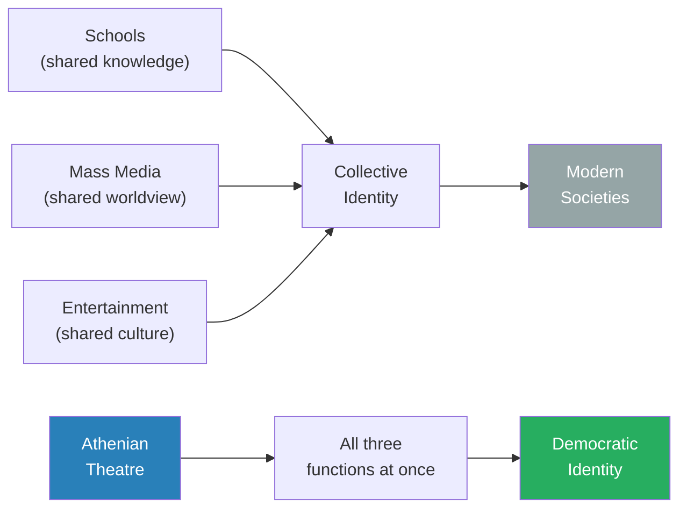
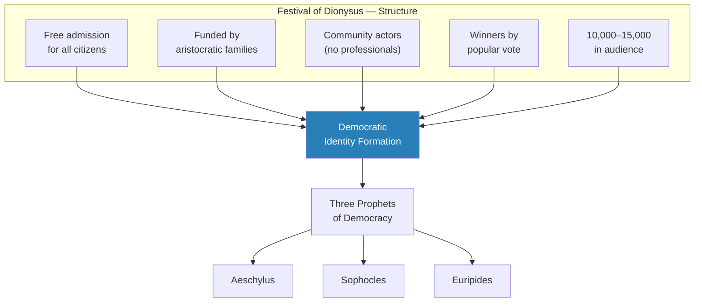
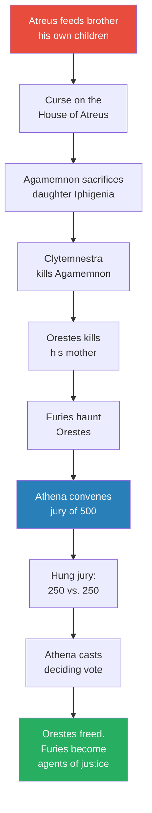
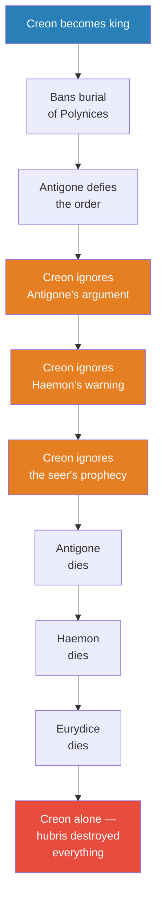
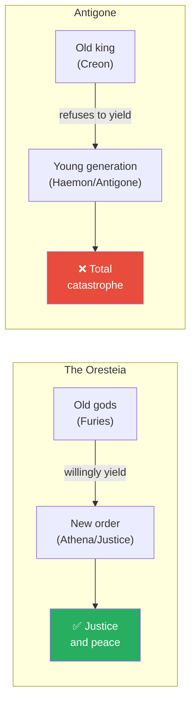
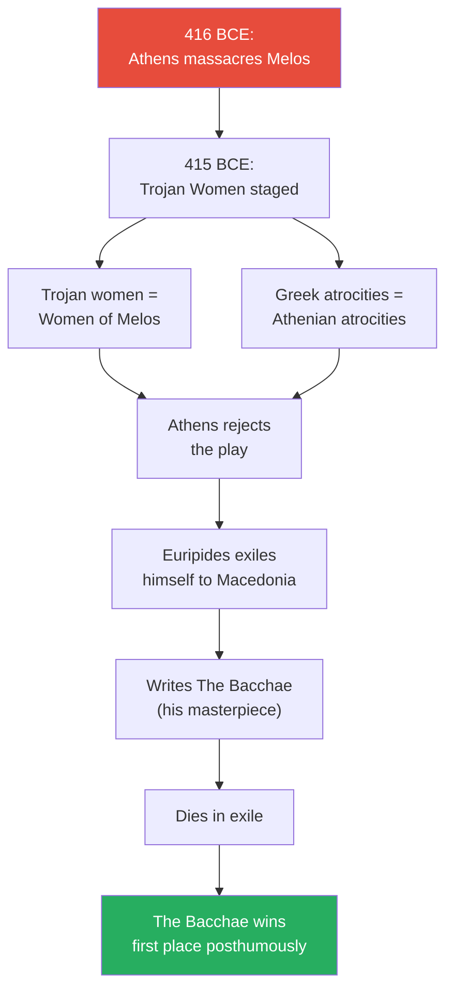
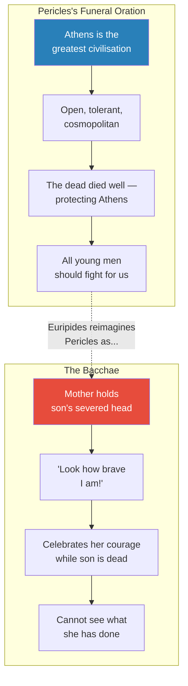
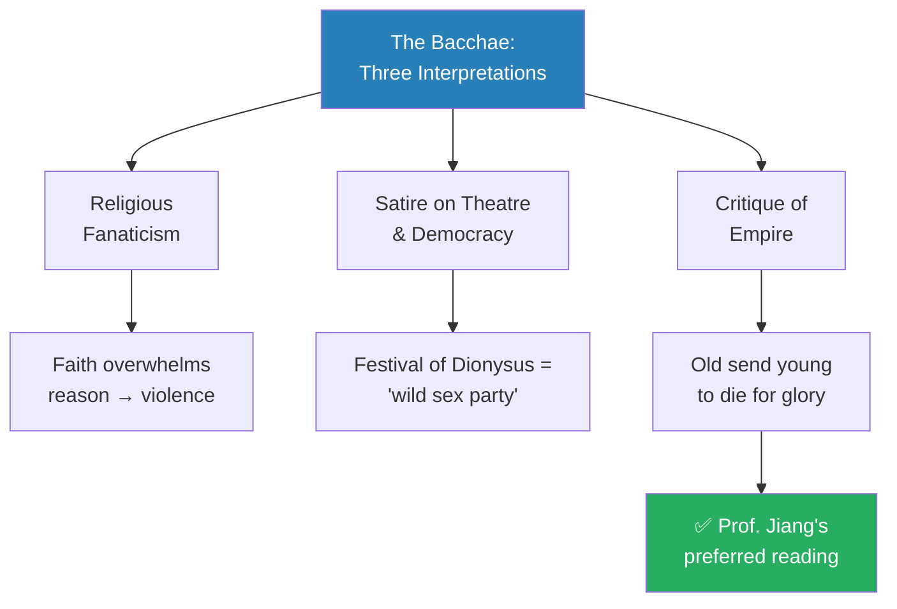
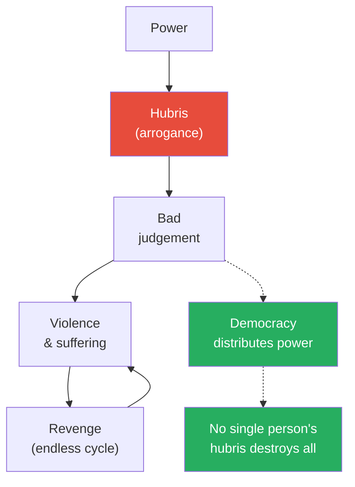
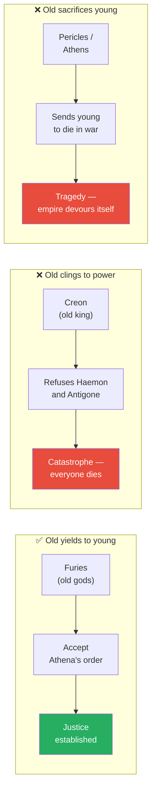

# Aeschylus, Sophocles, and Euripides as Prophets of Democracy

> Every society needs institutions to shape how its citizens think. Modern nations use schools, mass media, and entertainment. Athens had something more powerful — two months of free theatre every year where the entire city gathered to watch plays, vote on winners, and absorb a single message: this is what democracy means, this is why it matters, and this is how you protect it. Three playwrights — Aeschylus, Sophocles, and Euripides — served as prophets of that democracy, each delivering a different lesson: democracy is a divine gift, kingship breeds catastrophe, and genuine democracy demands honest self-criticism even when it hurts.

---

## The Question

*How did Athenian theatre create democratic citizens — and what did three playwrights reveal about the promises, dangers, and responsibilities of democracy?*

Prof. Jiang's answer unfolds across three plays: Aeschylus's *Oresteia* teaches where democracy comes from, Sophocles's *Antigone* teaches why democracy is necessary, and Euripides's *Bacchae* teaches what democracy must never become. Together, these three "prophets of democracy" gave Athens its political soul. The lecture traces a deliberate arc — from celebration through defence to self-examination — that mirrors the lifecycle of democratic societies themselves. What makes the argument distinctive is Prof. Jiang's insistence that these playwrights were not merely artists producing entertainment but political teachers whose plays functioned as the primary mechanism through which Athenian citizens learned what democracy demanded of them.

## Key Concepts at a Glance

| Concept | One-line summary |
|---------|-----------------|
| **Festival of Dionysus** | Two annual month-long theatre festivals — free, democratic, communal — that formed Athenian identity |
| **Protagonist / Antagonist** | Originally just "first competitor" and "second competitor" at the festival — not hero and villain |
| **Hubris** | Violent, excessive arrogance — the central theme of Greek tragedy and the core argument against kingship |
| **Divine / unwritten laws** | Antigone's claim: universal moral laws exist above human legislation |
| **The Furies** | Ancient gods of cosmic order — transformed by Athena into servants of democratic justice |
| **Pericles's Funeral Oration** | Celebrated Athens and justified war — Euripides reimagined it as imperial self-delusion |

---

## Theatre as the Institution of Democracy

Prof. Jiang opens the lecture not with the playwrights themselves but with a structural question that frames everything that follows: how does any society create a shared identity among its citizens? He identifies three institutions that perform this function in modern societies — schools transmit shared knowledge, mass media transmit a shared worldview, and entertainment transmits shared culture. In America, these institutions create an individualistic identity; in China, a collectivist one. The question is universal: every society, from ancient Athens to modern China, must solve the problem of making millions of individuals think of themselves as one community. What made Athens extraordinary, Prof. Jiang argues, is that a single institution — theatre — performed all three functions simultaneously. The Festival of Dionysus was school, newspaper, and cinema rolled into one, and its explicit purpose was to teach Athenians what it meant to live in a democracy.

This framing establishes the lecture's central claim: Greek tragedy was not art that happened to contain political messages. It was a political institution that happened to use art as its medium. The three playwrights were not entertainers who occasionally commented on public affairs; they were, in Prof. Jiang's memorable phrase, <b style="color: #2980b9">prophets of democracy</b> — teachers, preachers, and political theorists whose medium happened to be dramatic poetry rather than philosophical treatise. Understanding this reframes everything about Greek theatre: the plots, the characters, the myths — all are vehicles for political education.

This diagram captures the lecture's foundational claim: modern societies require three separate institutions to accomplish what Athens achieved through one. The implication is not merely efficiency but integration — because theatre combined education, information, and culture into a single communal experience, the identity it created was unusually cohesive. Every Athenian absorbed the same political values through the same stories at the same time, producing a democratic consciousness that separate modern institutions struggle to replicate.

The <b style="color: #2980b9">Festival of Dionysus</b> was the beating heart of Athenian civic life:

- Held **twice a year** — once in winter, once in summer — each lasting a full month
- **Free for everyone** — the wealthy aristocratic families funded all performances to win popular favour
- **No professional actors** — citizens were selected from the community to perform
- **Winners chosen by popular vote** — the entire process was democratic
- The largest amphitheatre held **10,000–15,000 people** out of a total population of roughly 50,000
- Going to the theatre was considered <b style="color: #27ae60">the greatest birthright of being an Athenian</b>
- Winning first place was the highest honour in Athens — equivalent to winning the Nobel Prize today
- The terms **protagonist** and **antagonist** originally just meant "first competitor" and "second competitor" — not hero and villain

The plays drew on **Greek mythology everyone already knew** — audiences had memorised the lines and could recite along with the performers. The power lay not in surprise but in interpretation: playwrights took familiar stories and repackaged them to explore contemporary questions about power, justice, and democracy.

Prof. Jiang stresses that the amphitheatre itself was designed for this communal experience — built as an oval cavern so that sound resonated naturally, allowing actors who shouted their lines slowly to be heard by thousands. The communal dimension mattered more than perfect acoustics; what the audience came for was participation in a shared democratic ritual. In this sense, Athenian theatre had more in common with religious worship than with modern entertainment — it was a collective act of civic devotion in which the entire community participated simultaneously.

The three most famous playwrights — <b style="color: #2980b9">Aeschylus, Sophocles, and Euripides</b> — were, in Prof. Jiang's framing, "first and foremost prophets of democracy." They were poets and playwrights, yes, but their primary function was political: they told the Athenian people why they had democracy, why democracy was good, and how they should protect and promote their democratic system. Every other playwright in Athens aspired to this role, because winning first place at the Festival of Dionysus was the highest honour available to an Athenian citizen.

Every element of the festival was deliberately democratic in design. Free admission ensured that wealth could not gatekeep participation — this was a right of Athenian citizenship, not a luxury.
Community actors meant that citizens were not passive consumers but active participants in the dramatic ritual.
Popular voting meant that artistic merit was judged by the same democratic process that governed Athenian politics.
The rich funded the productions not out of generosity but to win favour with the people — transforming aristocratic wealth into democratic cultural capital.

Prof. Jiang's point is that none of this was accidental: the festival was engineered to reinforce democratic values at every level of its operation.
The same citizens who voted on policy in the Assembly voted on plays at the festival.
The same communal participation that made democracy function made theatre function.
The two systems were not parallel — they were the same system, expressed in different registers.

---

## Aeschylus — Democracy as Divine Gift

The first and oldest of the great playwrights, Aeschylus addressed the most fundamental question a new democracy must answer: where does our system come from, and why should we trust it? His answer, delivered through the <b style="color: #2980b9">Oresteia</b>, was breathtaking in its ambition — democracy is not a human invention but a gift from the goddess Athena herself, and every citizen who casts a vote exercises the same authority as a god. Prof. Jiang presents Aeschylus as the founding prophet, the playwright who gave Athens a creation myth for its political system. Without this mythological grounding, democracy would have been merely a practical arrangement; with it, democracy became sacred.

All three playwrights drew their material from Greek mythology — stories everyone already knew — and repackaged them to explore contemporary themes. What made Aeschylus's choice of the House of Atreus so brilliant was that the myth contained the perfect problem for democracy to solve: an unbreakable cycle of revenge where every act of justice produces a new injustice. If democracy could solve *that*, it could solve anything. The myth also carried emotional weight that no abstract political argument could match — by the time Athena convenes her jury, the audience has lived through generations of murder, betrayal, and suffering, and they desperately want a resolution. The democratic jury arrives not as a logical conclusion but as an emotional rescue.

### The Oresteia: A Cycle of Violence Broken by Democracy

The story begins with the **curse on the House of Atreus** — one of Greek mythology's darkest tales. Prof. Jiang retells it in full, and the detail matters because the cycle of revenge is precisely what democracy must break.

> [!example] The House of Atreus — From Feast to Fury
> - King Atreus of Argos defeats his rebellious younger brother in a war for the throne
> - He pretends to forgive his brother and hosts a "reconciliation feast" — a sacred contract before the gods
> - At the feast, Atreus feeds his brother **the cooked flesh of his own sons**
> - When the brother discovers what he has eaten, he curses Atreus before dying: "You violated the sacred contract of the feast — curse upon your house"
> - The brother's one surviving son, **Aegisthus**, escapes and is now honour-bound to avenge his family
> - Atreus's son **Agamemnon** becomes King of Kings and launches the Trojan War
> - To gain favourable winds for the fleet, Agamemnon **sacrifices his daughter Iphigenia** — a choice Prof. Jiang emphasises he should never have made, since the war was not even his quarrel
> - His wife **Clytemnestra**, consumed by grief and rage, spends ten years plotting revenge while Agamemnon besieges Troy
> - She takes Aegisthus as her lover — the surviving son of the man Atreus betrayed
> - When Agamemnon returns victorious, Clytemnestra and Aegisthus kill him and seize the throne
> - Agamemnon's son **Orestes** is now honour-bound to avenge his father — by killing his own mother
> **The lesson:** Each act of revenge creates a new obligation for revenge — violence is self-perpetuating without a mechanism to break the cycle.

The Oresteia's plot traces a cycle of revenge that can only be broken by one thing — democratic process. Each node in this chain represents a morally comprehensible act of vengeance that nevertheless produces the next act of violence. Atreus had reason to punish his brother; Clytemnestra had reason to kill the man who murdered her daughter; Orestes had reason to avenge his father. The genius of the Oresteia is showing that even when every individual act of revenge is justified, the cycle as a whole is catastrophic. Only Athena's jury — collective democratic judgement replacing individual vengeance — can break the pattern.

Orestes, tormented by his impossible choice, consults Apollo, who confirms he is right to avenge his father.
He kills Clytemnestra.
But now the <b style="color: #e74c3c">Furies</b> — ancient demons who enforce cosmic order — rise from the underworld to haunt him.
Their logic is absolute: "We don't care about justice. We don't care about the laws of man. We care about the laws of the universe. You killed your mother. We will haunt you for eternity."
The Furies represent a pre-democratic concept of justice — cosmic, impersonal, and merciless.
They are older than the Olympian gods and answer to no authority.

Apollo cannot help.
When he intercedes on Orestes's behalf, the Furies dismiss him: "You are a young god. We are old gods, much older and wiser than you. You have no authority over us."
This confrontation between old gods and new gods becomes central to the play's meaning — and to the lecture's broader theme about generational transfer of power.
The Furies' contempt for Apollo mirrors Creon's contempt for Haemon in Antigone: in both cases, the old refuse to acknowledge the legitimacy of the new.

In desperation, Orestes flees to Athens and begs <b style="color: #2980b9">Athena</b>, goddess of wisdom.
Her solution is revolutionary: she convenes a **jury of 500 Athenian citizens**.
Both sides make their case — and Prof. Jiang stresses that both are morally compelling.
The Furies are not wrong that killing one's mother violates cosmic order.
Orestes is not wrong that avenging his father was just.
The vote splits evenly — 250 guilty, 250 innocent.
Athena casts the deciding vote for Orestes.

When the Furies protest, Athena offers them a deal that transforms the world: instead of being feared demons, they will become symbols of **justice, truth, and righteousness** — worshipped and admired by the Athenian people.
The Furies accept.
The old gods do not disappear — they are incorporated into the new democratic order, their power redirected toward constructive ends.
This is the play's most optimistic moment and its most important political message: the transition from the old order to the new does not require destroying the old — it requires transforming it.

### What the Oresteia Teaches Athens

Prof. Jiang distils four political lessons that Aeschylus's audience would have absorbed, each of which reinforced the sacred character of democratic participation. These are not subtle implications that scholars extracted centuries later — they are the explicit, unmissable messages that 15,000 Athenians understood as they watched the play unfold:

- <b style="color: #27ae60">Democracy is a gift from the gods themselves</b> — Athena personally established the jury system in Athens. This is not a metaphor: within the world of the play, a goddess literally creates democratic governance as the solution to a problem that neither cosmic law (the Furies) nor divine authority (Apollo) could solve. The Athenian audience walked away understanding that their political system had divine sanction
- Each citizen's vote carries **the same authority as a goddess** — Athena could only cast one vote, just like every juror. This is a radical claim about the dignity of ordinary citizens: in the moment of voting, a potter or a fisherman holds the same power as the patron goddess of Athens
- When you vote thoughtfully and seriously, you bring **justice and truth into the world** — the play explicitly connects good-faith civic participation to cosmic justice. Voting is not a bureaucratic act but a sacred one
- The old order (Furies, blood vengeance) must give way to the new order (democratic judgement) — but the transition works only when the old willingly accepts the new. The Furies are not destroyed; they are transformed. Their ancient power is preserved but redirected

The brilliance of Aeschylus's political strategy lies in making democracy feel inevitable — not a fragile human experiment but the culmination of cosmic history. The old gods (Furies) tried to maintain order through terror, and it did not work; the cycle of violence continued. The new god (Apollo) tried to resolve the conflict through divine decree, and that did not work either; the Furies rejected his authority. Only when Athena introduced collective human judgement — democracy — was the cycle finally broken. The implication for the Athenian audience was clear: democracy is not merely one option among many. It is the only system that actually solves the fundamental problem of human justice.

> [!tip] Core Insight
> Aeschylus does not merely argue that democracy is useful — he argues that it is sacred. By making Athena the founder of the jury system, he gives every citizen reason to treat their vote as an act of divine significance.

---

## Sophocles — Why Kingship Destroys

If Aeschylus told Athens where democracy came from, Sophocles showed them what happens without it. His plays are case studies in the catastrophe of concentrated power — not abstract arguments against monarchy but emotionally devastating demonstrations of what happens when a single person holds unchecked authority. Prof. Jiang frames Sophocles as the second prophet because his message is defensive: he does not celebrate democracy so much as demonstrate why every alternative is worse. The vehicle for this demonstration is <b style="color: #e74c3c">hubris</b> — the violent, excessive arrogance that power inevitably produces. Where Aeschylus made democracy feel sacred, Sophocles makes monarchy feel terrifying.

### The Riddle of the Sphinx and the Tragedy of Oedipus

The Oedipus story provides the backdrop for Sophocles's political argument, and Prof. Jiang summarises it with characteristic narrative energy. The story itself is not the political message — that lies in Antigone — but the Oedipus myth establishes the themes of fate, prophecy, and the limits of human knowledge that make Antigone's confrontation with Creon so resonant. Sophocles chose one of the most famous myths in Greek culture precisely because everyone in the audience already knew the outcome; the question was not what happens, but what it means for democratic Athens.

> [!example] The Curse of Oedipus — Prophecy, Fate, and Self-Destruction
> - A prophecy declares the king of Thebes's son will kill his father and marry his mother
> - The king orders the baby killed, but the soldier abandons it in the woods — he considers it dishonourable to kill an infant
> - A shepherd from another city finds the baby; a childless king adopts him and names him **Oedipus**
> - Oedipus grows into a strong, noble young man — then hears the prophecy and flees, trying to escape his fate
> - On the road to Thebes, he kills an old man in an argument — unknowingly, his real father
> - At Thebes, he solves the **Sphinx's riddle** ("What walks on four legs in the morning, two at noon, three in the evening?" — answer: man) and is made king
> - As king, he marries the queen — his real mother — and they have children
> - Twenty years later, a plague strikes; a seer reveals the gods are angry because Oedipus killed his father and married his mother
> - Oedipus **blinds himself** and goes into exile, leaving Thebes without a ruler
> - His two sons fight for the throne and kill each other in battle
> **The lesson:** Even the noblest person cannot escape fate — but the political question is what happens to the city after the king falls.

The Oedipus myth is Greek tragedy's most famous story, but Prof. Jiang moves through it quickly because his argument lies elsewhere. The myth demonstrates that even the wisest, most capable individual — Oedipus, who solved the Sphinx's riddle that defeated everyone else — cannot escape the consequences of concentrated power. His personal virtues are irrelevant; the system of monarchy puts him in an impossible position where his authority depends on ignorance of his own crimes. The moment truth emerges, the system collapses. This sets up the argument Sophocles makes explicit through Antigone: it is not that kings are bad people, but that kingship is a bad system. Even the best king — noble, intelligent, courageous — will be destroyed by the structural contradictions of monarchy. Oedipus's blinding is not a punishment for moral failure; it is the inevitable consequence of a system that concentrates too much power in too few hands.

### Antigone: The Hubris of King Creon

The political heart of Sophocles's message lies in the confrontation between **Antigone** and **King Creon**. After Oedipus's two sons kill each other, Creon (the queen's brother) inherits power. He decrees that the loyal son receives a state funeral, but the rebel **Polynices** will be left unburied — a devastating punishment, since Greeks believed only burial allowed the dead to find peace. What follows is a study in how power corrupts not through villainy but through deafness — Creon is not evil, merely unable to hear what everyone around him is trying to tell him. Prof. Jiang presents the confrontation in three escalating stages, each one giving Creon a chance to reverse course, and each one refused.

> [!example] Antigone vs. Creon — Justice Against Authority
> - **Antigone**, daughter of Oedipus and sister of Polynices, secretly buries her brother
> - Creon demands: "How dare you defy my laws?"
> - Antigone responds: "Your laws are unjust. Human laws must conform to divine, unwritten, immutable laws of justice"
> - Creon insists: "The laws are the laws. Without laws, there will be complete chaos"
> - Creon's son **Haemon**, Antigone's fiancé, pleads — not for Antigone's sake but for his father's
> - Haemon warns: "Father, I'm not doing this for Antigone — I'm doing this for you. The people of Thebes fully support her. They think you are a tyrant"
> - Creon: "Should I, the king, listen to the mob?"
> - Haemon: "No — you should listen to what is right and just"
> - Creon, enraged, throws his son out — then consults a seer who confirms Antigone is right
> - Creon rushes to save Antigone but arrives too late: she has killed herself rather than face execution
> - Haemon, weeping over her body, lunges at his father with a sword, misses, and kills himself
> - When Haemon's mother learns of her son's death, she kills herself too
> - **Creon is left entirely alone** — his hubris has destroyed every person he loved
> **The lesson:** Power produces arrogance. Arrogance produces deafness. Deafness produces catastrophe. This is why Athens has democracy — not a king.

Prof. Jiang pauses after recounting the Antigone story to let its emotional weight settle before drawing the political conclusions. The brilliance of Sophocles's construction is that Creon is not a monster — he is a man who believes he is doing the right thing. He believes that law and order require obedience, that a king must be firm, that showing weakness invites chaos. These are not irrational beliefs. They are the beliefs that any person in a position of absolute authority would develop — and that is precisely Sophocles's point. The problem is not Creon's character but his position. Monarchy concentrates power so completely that even a well-intentioned ruler becomes deaf to reality, because everyone who disagrees with the king risks punishment.

What makes this diagram so revealing is the cascading pattern of orange nodes — three consecutive refusals to listen, each escalating the stakes.
Creon's tragedy is not a single bad decision but a structural feature of monarchy itself.
He ignores Antigone's philosophical argument about divine law.
He ignores his own son's political intelligence about public opinion.
He ignores a seer speaking on behalf of the gods.
Each refusal narrows the space for correction until catastrophe becomes inevitable.

Prof. Jiang's point is that any human being in Creon's position would behave the same way — hubris is not a character flaw but an inevitable consequence of unchecked power.
The orange nodes are not choices Creon makes badly; they are choices the system forces him to make badly, because monarchy concentrates all decision-making in one person and removes every mechanism for correction.
In a democracy, Antigone's argument would have been debated publicly.
Haemon's warning would have been heard by the Assembly.
The seer's prophecy would have been weighed by the entire community.
Only under monarchy does one man's deafness become everyone's catastrophe.

The confrontation between Antigone and Creon is not merely dramatic — it articulates a philosophical idea that would shape Western political thought for millennia. When Antigone invokes "divine, unwritten, and immutable laws," she is making the first recorded argument for what later thinkers would call natural law: the principle that there exists a moral order above and prior to any legislation a human ruler can create. Creon represents the counter-position — legal positivism, the idea that law derives its authority from the sovereign and that without obedience there is only chaos. The audience already knows who is right, because they live in a democracy where citizens, not kings, are the ultimate authority. But the play does not merely assert Antigone's position — it dramatises the catastrophic consequences of Creon's, making the abstract argument viscerally real.

The confrontation between these two positions — Antigone's natural law and Creon's legal positivism — would reverberate through Western thought for over two thousand years. From the Stoics through Thomas Aquinas through Martin Luther King Jr.'s "Letter from Birmingham Jail," the idea that unjust laws must yield to a higher moral standard traces its lineage directly back to this scene. Prof. Jiang does not pursue this intellectual genealogy, but the implication is clear: Sophocles did not merely write a play about a political conflict in Thebes. He articulated the fundamental tension in every legal system between the authority of the sovereign and the authority of justice — a tension that remains unresolved in democratic theory to this day.

Prof. Jiang notes that the student asking about fortune tellers reveals something essential about the Greek worldview. People trusted seers and prophets because Greek society was deeply, genuinely religious — the fortune tellers spoke on behalf of the gods, and their pronouncements carried cosmic authority. Kings listened because ignoring a prophet meant defying the gods themselves. This explains why Creon's terror is so real when the seer warns him, and why his tragedy is so complete when he acts too late. For most of human history, humans were "extremely religious people, including the Greeks — the Greeks were especially incredibly religious." The plays could not have worked in a secular society; their moral authority depended on the audience sharing the characters' belief that divine law was real and enforceable. When Antigone invokes "divine, unwritten, and immutable laws," she is not making an abstract philosophical claim — she is appealing to a power that every single person in the audience genuinely feared and respected.

### Sophocles's Two Messages for Athens

The confrontation between Antigone and Creon introduces one of the most important political concepts in Western history: the idea of <b style="color: #2980b9">divine, unwritten, immutable laws</b> that stand above human legislation. Antigone does not merely disobey Creon — she articulates a philosophical principle: that human laws must conform to a higher standard of justice, and when they do not, citizens have a duty to resist. This idea would echo through the centuries, from natural law theory in Roman jurisprudence to modern concepts of human rights and civil disobedience. For the Athenian audience, Antigone's argument carried the authority of common religious belief: the gods had established certain fundamental laws that no human king could override.

<b style="color: #e74c3c">Message 1: Kingship is inherently dangerous.</b> Kings do stupid things because power breeds hubris — "violent, excessive arrogance" that makes leaders refuse to listen to what is right and good and just. Prof. Jiang frames this as a structural argument: the problem is the system, not the person. Put anyone in Creon's position and they will develop the same deafness. This is why Athens has democracy, not a king — not because democratic citizens are wiser, but because distributed power prevents any single person's hubris from destroying the whole society.

<b style="color: #27ae60">Message 2: The old must give way to the young.</b> In the Oresteia, the play ends well because the old gods (Furies) accept the new order. In Antigone, the play ends in catastrophe because the old king refuses to yield to young people — Antigone's moral clarity and Haemon's political wisdom are both dismissed. Society works only when the old give way to the young. When they cling to power, everyone suffers.

The parallel between Aeschylus and Sophocles emerges with striking clarity when placed side by side.
Both plays present the same structural choice — old yielding to new versus old clinging to power — and show opposite outcomes.
The Oresteia's Furies accept Athena's offer and become agents of justice; Creon refuses Haemon's plea and becomes an agent of destruction.
The green and red outcomes are not accidents of character but consequences of structure: the system that allows the old to yield produces peace; the system that gives the old absolute power to refuse produces ruin.
For Athenian audiences, the implication was direct — monarchy is the system that locks the old into power and the young out of it.

---

## Euripides — The Mirror Athens Didn't Want to See

If Aeschylus celebrated democracy and Sophocles defended it by attacking monarchy, Euripides did something far more dangerous: he criticised democracy itself. Not to destroy it, but to save it. Prof. Jiang presents Euripides as the most talented and most despised of the three playwrights — a genius whose poetry, metaphor, and imagery surpassed his predecessors, but whose willingness to confront Athenian audiences with their own atrocities made him deeply unpopular during his lifetime. Where Aeschylus made audiences feel proud and Sophocles made them feel vigilant, Euripides made them feel ashamed — and shame is the one emotion democratic audiences refuse to tolerate. His two key plays — <b style="color: #2980b9">Trojan Women</b> and <b style="color: #2980b9">The Bacchae</b> — represent the most radical argument of all: that a democracy which refuses to examine its own violence is no democracy at all. Euripides is the youngest of the three prophets, and his message is the hardest to hear — which is precisely why Prof. Jiang gives it the most space in the lecture.

### Trojan Women — The Massacre Athens Didn't Want to Remember

The historical context is essential. In 416 BCE, at the height of the Peloponnesian War, Athens attacked the island of Melos — a neutral state that refused to join the Athenian empire. When Melos fell, Athens killed every man and enslaved every woman and child. One year later, in 415 BCE, Euripides staged Trojan Women — a play about the aftermath of the Trojan War depicting the suffering of enslaved Trojan women. The parallel was unmistakable and deliberate. Every person in the audience knew what had happened at Melos. Every person in the audience could see themselves reflected in the Greeks on stage.

> [!example] Trojan Women — A Mirror Held Up to Athens (Euripides, 415 BCE)
> - The play opens in the aftermath of Troy's destruction — every Trojan man is dead
> - Hecuba, queen of Troy, has watched all her sons die in the war
> - Her daughter has been sacrificed at the tomb of Achilles — killed to accompany the dead hero in the afterworld
> - Her remaining daughters are divided among Greek generals as slaves and concubines
> - Andromache, wife of the slain prince Hector, watches helplessly as the Greeks seize her infant son
> - The Greeks decree all Trojan boys must be killed — any son of Hector might grow up to seek revenge
> - Andromache witnesses her baby — only months old — murdered by Greek soldiers
> - Hecuba is dragged away to become the slave and concubine of the Greek general Odysseus
> - Before being taken, Hecuba must personally bury the dead child
> - The play made every Athenian in the audience weep
> - Written exactly one year after Athens massacred every man on Melos and enslaved every woman
> **The lesson:** Euripides used mythology as a mirror — the Trojan women were the women of Melos, and the Greeks committing atrocities in the play were the Athenians in the audience.

The power of Trojan Women lies in its refusal to let Athens look away from what it had done. Prof. Jiang stresses that Euripides was telling the Athenian people directly: "Do you see how terrible we are? We are a terrible people. Do you see all the hurt and suffering we brought onto the world because of our empire?" There is no subtlety here, no clever indirection — Euripides names the atrocity and dares his audience to recognise themselves in it. The courage required to do this at the Festival of Dionysus — the defining communal event of Athenian civic life — cannot be overstated. Euripides was using the very institution designed to celebrate democracy to indict the democracy it celebrated.

The play's power lies in its total commitment to the perspective of the defeated. There are no Greek heroes in Trojan Women — no Achilles, no Odysseus performing noble deeds. There is only suffering: a queen who has lost everything, a mother watching her baby murdered, daughters dragged away as sexual property. By stripping the Trojan War of its heroic mythology and showing only its human cost, Euripides accomplished something that no political speech could achieve: he made 15,000 Athenians feel what their empire felt like from the other side. This empathy technique — forcing the audience to inhabit the perspective of the enemy's victims — descends directly from Homer's innovation in the Iliad, where the Trojan Hector was portrayed as noble and sympathetic. But where Homer balanced Greek and Trojan perspectives, Euripides eliminates the Greek perspective entirely, leaving the audience with nothing but the suffering they themselves caused.

The Athenian audience understood exactly what Euripides was doing — and they punished him for it.
Trojan Women lost the festival competition to an obscure playwright whose name survives only because he beat Euripides.
<b style="color: #e74c3c">The rejection was not about artistic quality; it was about what the audience wanted to hear versus what they needed to hear.</b>

The play's power lies in its total commitment to the perspective of the defeated. There are no Greek heroes in Trojan Women — no Achilles, no Odysseus performing noble deeds. There is only suffering: a queen who has lost everything, a mother watching her baby murdered, daughters dragged away as sexual property. By stripping the Trojan War of its heroic mythology and showing only its human cost, Euripides accomplished something that no political speech could achieve: he made 15,000 Athenians feel what their empire felt like from the other side.

Euripides, bitter and angry at his rejection, exiled himself to Macedonia, where he would die far from the city he had tried to save from itself. The exile was voluntary but also inevitable — a playwright who insists on telling uncomfortable truths will eventually find his audience unwilling to listen. The irony is devastating: the very quality that made Euripides the most important of the three prophets — his willingness to tell Athens the truth about itself — was the quality that ensured Athens would not listen. Prof. Jiang sees this pattern as structurally identical to the fate of Socrates in the next lecture. Both men were punished for holding up a mirror; the only difference was the severity of punishment (exile for the playwright, execution for the philosopher). A democracy that silences its truth-tellers is a democracy in the process of destroying itself.

This timeline captures the tragic arc of Euripides's life and the irony of his legacy.
The red node marks the historical atrocity that inspired his most courageous work; the progression from Melos to exile to death in a foreign land is the personal cost of democratic truth-telling.
The green node marks his posthumous vindication — the Bacchae winning the very competition he lost throughout his career.
Between the red and the green lies an entire lifetime of rejection.
The pattern Prof. Jiang identifies recurs throughout literary history: controversial writers who challenge their audiences are despised in life and revered after death.
The question the pattern raises is uncomfortable: if we know this happens, why do democratic societies keep making the same mistake?

### The Bacchae — Empire as a Mother Holding Her Son's Head

Euripides wrote The Bacchae in exile in Macedonia — his final play, completed before his death and brought back to Athens by friends. Prof. Jiang considers it Euripides's masterpiece and spends the longest portion of the lecture on its plot and interpretation, because the play contains what he regards as the most powerful image in all of Greek theatre: <b style="color: #e74c3c">a mother parading her son's severed head, believing it is a lion's</b>.

> [!example]- The Bacchae — The God of Theatre Takes His Revenge (Euripides, performed posthumously)
> - Dionysus — god of theatre, wine, music, and sex — was born in Thebes to a princess impregnated by Zeus
> - When the princess announced her divine pregnancy, no one believed her — the Thebans laughed and refused to worship Dionysus
> - Dionysus is worshipped everywhere in the world, as far as India, but Thebes denies him
> - Bitter about the insult to his mother, Dionysus disguises himself as a wandering stranger
> - He drives the women of Thebes mad — they abandon the city for orgies and wild worship in the mountains
> - King Pentheus decides to take his army and kill the Bacchae (followers of Dionysus)
> - Disguised Dionysus offers Pentheus a deal: come secretly watch the women instead
> - Pentheus agrees and climbs a tree for a better view of the rituals
> - Dionysus lowers the branch, placing Pentheus in the circle of frenzied women
> - He commands the women to tear Pentheus apart — they rip the king's body to pieces
> - Pentheus's own mother tears off his head with her bare hands
> - She returns to Thebes shouting: "Look how brave I am! I killed a lion with my bare hands!"
> - She holds her son's severed head aloft, believing it is a lion's head
> - It takes the horrified citizens a long time to convince her that she holds her own son's head
> **The lesson:** The image of a mother celebrating while holding her murdered son's head is Euripides's metaphor for empire — old people sending young people to die for their glory, then celebrating the sacrifice as heroism.

Prof. Jiang's interpretation centres on one image and one historical speech.
The image is the celebrating mother.
The speech is <b style="color: #2980b9">Pericles's Funeral Oration</b>, delivered in 431 BCE after the first year of the Peloponnesian War.

Everyone in Athens attended the state funeral for the war dead, and everyone heard Pericles declare: Athens is the greatest civilisation — open, tolerant, cosmopolitan, excellent.
These men who are dead before us died well, because they died protecting Athens.
All young men should fight for our democracy.
Prof. Jiang quotes Pericles at length: "Athens is the greatest place ever. We celebrate excellence. Athens is a place where anyone can come and through hard work, through talent, can achieve greatness. We are an open, tolerant, cosmopolitan people. We have a democracy where everyone can participate."
And then the turn: "Therefore, we must protect our democracy through war. It is good that the young go out and fight for our empire."

Euripides was almost certainly in the audience when Pericles spoke — everyone was.
And what he heard was the Bacchae's mother avant la lettre.
The celebration of Athens's greatness, the praise for the war dead, the call for more young men to fight — all of it is a mother holding her son's head and telling the world how brave she is.

The self-deception is the crucial element.
Pentheus's mother genuinely believes she holds a lion's head.
She genuinely celebrates her courage.
She cannot see what she has done.
And that is exactly how imperial rhetoric operates: Pericles's speech is beautiful, eloquent, and powerful.
It is also — in Euripides's savage reading — a celebration of child sacrifice disguised as patriotism.

What makes Prof. Jiang's interpretation so compelling is the structural parallel between the two scenes.
In both, an older figure celebrates an act of violence against a younger one.
In both, the celebration is wrapped in the language of glory and courage.
In both, the celebrant is blind to the reality of what has happened — Pentheus's mother thinks she killed a lion, and Pericles thinks his young men "died well."
The difference is only one of scale: one mother's delusion versus an entire city's.
Euripides is suggesting that imperial propaganda works on exactly the same psychological mechanism as Dionysus's madness — it makes people unable to see what they are actually doing to their own children.

This is the intellectual heart of the lecture.
Euripides was almost certainly in the audience when Pericles spoke.
He reimagines the funeral oration as the mother holding her son's head — what Pericles is really saying, stripped of eloquence, is that empire brings glory to old people, and the young must protect that glory by dying.
<b style="color: #27ae60">War and empire happen when old people send their children to fight and die for the glory of the old.</b>
The mother's self-deception is total — she genuinely believes the head is a lion's — and that is exactly how imperial rhetoric works.
Pericles's speech is beautiful.
It is also a mother celebrating while her children bleed.

### Three Interpretations of The Bacchae

Prof. Jiang acknowledges that scholars read The Bacchae in at least three ways, and he presents all three with intellectual honesty — a methodological habit that characterises his teaching throughout the series. He does not dismiss competing interpretations but explains why he prefers his own, leaving his students free to draw their own conclusions.

The most common scholarly interpretation reads The Bacchae as a play about <b style="color: #2980b9">religious fanaticism</b> — the power and danger of faith pushed to its extremes.
Dionysus drives the women of Thebes into ecstatic worship so total that a mother tears her own son apart without recognising him.
Under this reading, the play is a warning about what happens when religious devotion overwhelms reason and decency.
The women are not evil — they are possessed, overcome by a force they cannot resist.
The play asks: what is the boundary between genuine religious experience and destructive madness?
This interpretation has obvious resonance across all of human history, from ancient mystery cults to modern fundamentalism.

A second interpretation reads the play as a bitter satire on the Festival of Dionysus itself — and by extension, on Athenian democracy.
For most of his career, Euripides competed at the festival and lost, because audiences found his honest criticism offensive.
The play's central figure is Dionysus — the very god in whose honour the festival was held — and this Dionysus is manipulative, vindictive, and destructive.
Under this reading, Euripides is settling a personal score: the Festival of Dionysus is not really about art, reflection, and democratic education.
It is, in his caustic metaphor, "just a wild sex party that's trying to please everyone."
If the festival is democracy's primary institution, and the festival is a sham, then democracy itself is called into question.

Prof. Jiang prefers the empire interpretation because it connects most powerfully to the historical context — the Massacre of Melos, the Peloponnesian War, and Pericles's Funeral Oration provide concrete referents the other readings lack.
The play was written in exile by a man driven from Athens for criticising imperial violence.
The central image — old celebrating while young die — maps precisely onto the relationship between Pericles's rhetoric and Athens's military reality.
But Prof. Jiang notes with characteristic openness: "You can believe whatever you want, and that's the power of Athenian theatre."
The play sustains all three readings simultaneously — a testament to the imaginative depth that makes Euripides, by scholarly consensus, the most talented of the three playwrights.

Each reading is legitimate and supported by textual evidence, but the empire interpretation gains its power from historical specificity. Prof. Jiang's choice is characteristic of his method throughout the Civilization series: he favours the interpretation that connects literature most directly to political reality. The play's enduring genius is that it sustains all three readings simultaneously — a testament to Euripides's imaginative power.

> [!tip] Core Insight
> Even in criticising democracy, Euripides was defending it. Democracy only works when citizens engage in honest argumentation, debate, and self-reflection. What Euripides tried to do was hold a mirror before the Athenian people and say: "Look how awful we are. We can do better." That honest confrontation with failure is what democracy really is.

The Bacchae's posthumous victory — winning first place at the festival after its author's death — adds a final layer of meaning to the play and to Euripides's entire career. Throughout his life, Euripides told Athens truths it did not want to hear and was punished for it. He lost competitions. He was mocked. He was ultimately driven into exile. But after he died, Athenians could finally hear what he had been saying all along. The same city that rejected Trojan Women gave The Bacchae its highest honour. The implication is that democratic self-criticism works — but on a delay. Societies resist uncomfortable truths in the moment and accept them only when the crisis they warned about has already arrived. This pattern — rejection in life, vindication in death — is one of the most consistent patterns in the history of democratic discourse.

---

## Hubris, Revenge, and the Heart of Greek Tragedy

In the lecture's Q&A, a student asks about revenge as a common theme, and Prof. Jiang uses the question to articulate the master framework unifying all three playwrights.
Revenge, he explains, is the primary <b style="color: #2980b9">plot device</b> — the engine that drives action forward in every play.
But <b style="color: #e74c3c">hubris</b> is the primary <b style="color: #2980b9">theme</b> — the deeper truth that the playwrights are trying to uncover about human nature.
The distinction is critical: revenge explains *what* happens, but hubris explains *why*.

The logic runs as follows.
If you ask what really drives humans to violence, the answer is revenge — the desire to respond to a wrong with another wrong.
That is why revenge is the common plot device across all these plays: Clytemnestra murders Agamemnon because he killed their daughter, Orestes murders Clytemnestra because she killed his father, the Furies haunt Orestes because he killed his mother, Dionysus destroys Thebes because the Thebans insulted his mother.
Every killing demands another killing, creating an infinite regress of violence that the playwrights portray as the natural state of human affairs without democratic intervention.

But the playwrights are not merely cataloguing violence. They are asking a deeper question: what produces the arrogance that makes humans believe they are above consequences? And their answer is hubris — the violent, excessive arrogance that power inevitably produces. Agamemnon's hubris leads him to sacrifice his daughter for a war that was not his problem. Creon's hubris makes him ignore everyone who tries to save him. Athens's collective hubris drives the massacre of Melos and the imperial overreach of the Peloponnesian War. What the Greek tragedians discovered, Prof. Jiang argues, is that hubris is not a personal failing — it is a structural feature of power. "If you put someone in a position of power, he or she will always develop hubris." The question is not whether power corrupts, but whether the political system constrains the corruption.

This concept map shows why the Greeks ultimately chose democracy — not because it eliminates hubris (they knew it doesn't) but because it distributes power so that no single person's arrogance can destroy the entire society. The solid arrows show the natural cycle: power produces hubris, hubris produces bad judgement, bad judgement produces violence, violence produces revenge, and revenge produces more violence. The dashed arrows show democracy's intervention — not breaking the cycle at any particular point but preventing it from concentrating enough force to be catastrophic.

Prof. Jiang emphasises that these playwrights were doing something unprecedented: they were "trying to explore what it means to be human — trying to decipher the essence of being human, trying to look into the human heart." The plays were not political propaganda but genuine philosophical investigations into human nature, and their conclusions — that power corrupts, that revenge perpetuates itself, that only collective judgement can break the cycle — remain as relevant today as they were in fifth-century Athens.

| Play | Who Has Hubris | How It Manifests | Consequence |
|------|---------------|------------------|-------------|
| **Oresteia** | Agamemnon | Sacrifices his daughter for a war that is not his quarrel | Murdered by his wife; curse continues |
| **Antigone** | Creon | Refuses counsel from Antigone, Haemon, and the seer | Loses every person he loves; alone |
| **Trojan Women** | Athens (collective) | Massacres Melos — kills all men, enslaves all women | Euripides forces Athens to see itself as the villain |
| **The Bacchae** | Pentheus / Athens | King's curiosity and empire's self-deception | Mother holds son's head — empire devours its young |

This table reveals that hubris escalates across the three playwrights: from an individual king (Agamemnon) to a stubborn ruler (Creon) to an entire city-state (Athens). The progression mirrors the lecture's larger argument about why democracy needs all three prophets. Individual hubris can be corrected by a jury (Aeschylus). Institutional hubris can be prevented by choosing democracy over monarchy (Sophocles). But collective hubris — the arrogance of an entire democratic society convinced of its own virtue — can only be addressed by the most painful form of self-criticism (Euripides).

---

## The Old Must Yield to the Young

A second master theme runs through all three playwrights, inseparable from the argument about hubris: the question of whether the old will yield to the young.
Prof. Jiang identifies this as a recurring structural pattern that appears in every major play discussed in the lecture, and he argues it is fundamental to the case for democracy.

Democracy requires generational transfer — the willingness of those who hold power to release it when the time comes.
When that transfer happens willingly, the result is justice and renewal.
When it is refused, the result is catastrophe and death.
The three playwrights present three variations on this single pattern, and the outcomes speak for themselves.

The visual contrast between the three subgraphs is immediate and stark: one green outcome against two red.
In the Oresteia, the Furies — the oldest and most powerful beings in the Greek cosmos — accept Athena's new democratic order, and justice is established.
They do not disappear; they are transformed, their ancient power redirected toward constructive ends.
In Antigone, old King Creon refuses to listen to the young — to Antigone's moral clarity and Haemon's political intelligence — and the result is the death of everyone he loves.
In the Bacchae, the old generation (represented by Pericles and the Athenian establishment) sacrifices the young generation on the altar of imperial glory, and tragedy follows.
Prof. Jiang's point is that the Greek playwrights identified generational stubbornness as one of the primary mechanisms through which societies destroy themselves.

| Play | Old | Young | Outcome |
|------|-----|-------|---------|
| **Oresteia** | The Furies (old gods) | Athena (new goddess) | Old gods accept the new order → **justice** |
| **Antigone** | Creon (old king) | Haemon and Antigone (young) | Old king refuses to yield → **catastrophe** |
| **The Bacchae** | Athens / Pericles (old empire) | Young soldiers dying in war | Old glory sustained by young blood → **tragedy** |

<b style="color: #27ae60">When the old give way to the young, there is justice.</b> <b style="color: #e74c3c">When the old cling to power, there is catastrophe.</b> This pattern connects directly to the course's largest concern: societies collapse not because external enemies grow stronger, but because internal rigidity — the refusal of entrenched elites to adapt, share power, or listen to new voices — makes them brittle and fragile. The Greek playwrights arrived at this same insight 2,400 years ago, and they embedded it in stories so powerful that audiences are still watching them today.

The theme also illuminates why democracy is structurally superior to monarchy — not because democratic leaders are wiser, but because democracy institutionalises the transfer of power.
In a monarchy, the old king has no mechanism to yield gracefully; his identity is fused with his authority, and any challenge feels like annihilation.
In a democracy, the transfer of power is built into the system — terms end, votes are cast, new leaders emerge.
The Furies' transformation in the Oresteia is the mythological version of this institutional wisdom: the old order is not destroyed but given a new role, its power preserved but redirected.
Creon's catastrophe is what happens when no such mechanism exists.

---

## The Paradox of Democratic Self-Criticism

Prof. Jiang closes the lecture with what may be its most sophisticated argument — one that resolves the apparent contradiction of Euripides's position.
If Euripides criticised Athenian democracy, was he an enemy of democracy?
No, Prof. Jiang argues — he was its most faithful defender.
The logic runs as follows: democracy only functions when citizens engage in genuine argumentation, debate, and self-reflection.
A democracy that silences its critics — that refuses to look in the mirror — has already ceased to be a democracy in any meaningful sense.

What Euripides tried to do was "put a mirror before the Athenian people" and say: "Look how awful we are. We can do better." That confrontation with uncomfortable truth is not a betrayal of democracy — it is the very essence of what democracy demands. The three playwrights together form a complete democratic education: Aeschylus teaches reverence (democracy is sacred — treat your vote as divine), Sophocles teaches vigilance (concentrated power destroys — never allow a king), and Euripides teaches honesty (democracy must criticise itself or die).

This progression — celebration to defence to critique — mirrors the lifecycle of any healthy democracy.
A society must first believe in its own founding principles (Aeschylus), then actively defend them against authoritarian alternatives (Sophocles), and finally turn that critical energy inward to prevent its own corruption (Euripides).
Prof. Jiang's three playwrights are not just historical figures — they are archetypes for the three capacities every democracy needs to survive.
Remove any one of the three, and the system fails: celebration without critique becomes propaganda; critique without celebration becomes nihilism; defence without either becomes empty institutional maintenance.

The fact that all three plays are still performed today — the Oresteia, Oedipus Rex, and The Bacchae on stages around the world — testifies to the enduring power of their political messages.
These are not museum pieces; they are living arguments about what democracy requires from its citizens.
That they continue to resonate twenty-five centuries later suggests that the problems they identified — hubris, imperial self-deception, the tension between law and justice — are not historical curiosities but permanent features of democratic life.

---

## Student Q&A — Acoustics, Fortune Tellers, and Euripides's Reputation

In the lecture's Q&A sections — scattered throughout rather than grouped at the end — students raise questions that allow Prof. Jiang to deepen several key arguments. These exchanges contain some of the most direct articulations of ideas that the narrative sections present more obliquely.

**On acoustics and communal participation:** A student asks how audiences in a 15,000-seat open-air amphitheatre could actually hear the dialogue.
Prof. Jiang explains that the theatres were designed as oval caverns that amplified sound through natural resonance — the architecture itself was engineered for the democratic purpose of ensuring everyone could participate.
Actors shouted their lines slowly and clearly.
But he adds a more important point: the audiences already knew the plays by heart.
Everyone had memorised the lines from previous performances.
The experience of attending theatre was not about hearing new information — it was about participating in a communal ritual, experiencing familiar stories together as a collective democratic act.
The communal dimension mattered more than perfect acoustics.

**On fortune tellers and seers:** When a student asks why characters in these plays trust fortune tellers, Prof. Jiang explains that ancient Greek society was deeply religious.
Seers and prophets were believed to interpret the will of the gods directly — their authority came not from personal wisdom but from their role as divine intermediaries.
This is why Creon's refusal to listen to the seer in Antigone is so damning: he is not merely ignoring human advice but defying the gods themselves, compounding political hubris with religious sacrilege.
For most of human history, Prof. Jiang notes, people were extremely religious — "the Greeks were especially incredibly religious" — a fact modern secular audiences sometimes forget when reading these plays.
The religious framework is not incidental to these dramas; it is the source of their moral authority.

**On revenge as plot device vs. hubris as theme:** A student observes that revenge appears in every play, and Prof. Jiang uses the question to make one of the lecture's most important distinctions.
Revenge is the plot device — it drives action and creates dramatic tension.
But hubris is the theme — the deeper insight the playwrights are reaching for.
They discovered that "things go awry in society when the leaders develop hubris," and that "hubris is just a part of human nature — if you put someone in a position of power, he or she will always develop hubris."
The playwrights were "trying to explore what it means to be human, trying to decipher the essence of being human, trying to look into the human heart."
Their project was anthropological as much as political.

**On Euripides's genius and unpopularity:** By modern scholarly consensus, Euripides was the most talented of the three — his poetry, metaphors, and imagery were the most imaginative and visually powerful.
He was also the most arrogant, believing that theatre should be about awakening people and challenging their sense of reality, not pleasing them.
This made him deeply unpopular during his lifetime.
He lost festival competitions repeatedly because audiences found his work offensive.
He was eventually driven to exile in Macedonia, where he died.

But after his death, the pattern reversed: The Bacchae won first place at the festival, and later generations recognised his genius far more readily than his contemporaries had.
Prof. Jiang sees this as a recurring pattern throughout human history: controversial writers who refuse to tell comfortable lies are hated by contemporaries but admired by posterity.
The pattern holds from Euripides through Socrates (executed by Athens) to modern dissenters.
The implication is unsettling: the most valuable voices in a democracy are precisely the ones the democracy is most likely to silence.

---

## Connections

**Builds on:**
- [[07 - Homer's Iliad and the Birth of Greek Civilization]] — Homer's Iliad provides the mythological source material for both Aeschylus (the Trojan War backstory drives the entire Oresteia, from Agamemnon's departure to his murder upon return) and Euripides (Trojan Women is effectively a sequel to the Iliad told from the losers' perspective).
Homer pioneered the empathy-through-perspective-switching technique — showing the Trojan Hector as noble and sympathetic rather than simply an enemy — that the tragedians continued through dramatic performance.
Where Homer created empathy on the page, the playwrights created it in a communal setting, making 15,000 Athenians simultaneously feel compassion for characters representing their enemies.
- [[08 - Rat Utopia and the Peloponnesian War]] — The Peloponnesian War is the essential political context for Euripides's critique, and this lecture cannot be fully understood without the previous one's account of Athens's imperial overreach.
The massacre of Melos in 416 BCE, discussed in Lecture 8, directly inspired Trojan Women the following year — the tightest connection between history and art in the entire Greek arc.
Athens's imperial decay under the pressures of war is the backdrop against which all three playwrights must be read, but Euripides engages with it most directly, transforming contemporary atrocities into mythological drama.
- [[06 - Elite Overproduction and the Bronze Age Collapse]] — The hubris that the tragedians identify in kings and empires echoes the elite overproduction pattern from Lecture 6.
In both cases, the powerful become so arrogant and entrenched that they destroy the system that elevated them.
Creon's deafness to his own son mirrors the Bronze Age palace elites who extracted ever more resources from their populations without adapting to changing conditions.

**Sets up:**
- [[10 - The Trial of Socrates and Plato's Allegory of the Cave]] — Athens's rejection of Euripides foreshadows its execution of Socrates with devastating precision.
Both men were punished for demanding that democracy confront uncomfortable truths — Euripides through art, Socrates through philosophy.
The progression from exile (Euripides) to execution (Socrates) suggests that Athens's intolerance for self-criticism deepened over time.
Prof. Jiang's question — what happens when a democracy refuses to listen to its critics? — receives its answer in the next lecture, and the answer is fatal.

**Thematic links:**
- [[01 - Explaining Humanity's Transition to Agriculture]] — Theatre as identity-forming institution parallels religion's role in creating communal identity, explored in Lecture 1. Both serve as mechanisms for binding individuals into a collective — religion through shared belief, theatre through shared narrative. The Festival of Dionysus explicitly combined both: it was a religious festival in honour of a god and a political institution in service of democracy.
- Pericles's Funeral Oration, which Prof. Jiang reads through the lens of The Bacchae in this lecture, encapsulates the gap between democratic rhetoric and imperial reality — a tension that runs through the entire Greek arc from Lecture 7 through Lecture 13. The oration celebrates everything Athens believes about itself; the Bacchae shows what Athens actually does. This gap between self-image and reality becomes a recurring diagnostic tool in later lectures on Rome, the British Empire, and America.

---

## The Takeaway

This lecture repositions Greek theatre from an artistic tradition to a political institution — arguably the most important political institution in the ancient world.
Prof. Jiang's central claim is that Aeschylus, Sophocles, and Euripides were not playwrights who happened to comment on politics.
They were democracy's primary teachers, and the Festival of Dionysus was the mechanism through which Athens created and renewed its democratic identity.
The plays were not performed for aesthetic pleasure; they were performed to answer the most urgent question any democracy faces: why do we govern ourselves, and how do we do it well?

The most counterintuitive insight is that Euripides — the playwright who criticised democracy — was actually its most faithful defender.
This paradox dissolves once you understand Prof. Jiang's argument: democracy is not a set of institutions but a practice of honest self-examination.
A democracy that refuses to hear criticism has already failed, even if its institutions remain intact.
The Bacchae's image of a mother celebrating while holding her murdered son's head is not just a critique of Athens — it is a warning to every democracy that mistakes imperial rhetoric for democratic values.
What makes Euripides's critique so devastating is that the mother does not know what she holds.
The self-deception is total, and that is exactly the point: imperial rhetoric works by making atrocities invisible to the people who commit them.

Prof. Jiang's analytical method in this lecture is literary-political: he reads each play not as a self-contained artwork but as a political intervention in a specific historical moment.
The Oresteia is Aeschylus's response to the founding of Athenian democracy.
Antigone is Sophocles's case against monarchy during Athens's golden age.
Trojan Women is Euripides's response to the Massacre of Melos.
The Bacchae is Euripides's final reckoning with Pericles's imperial rhetoric.
This method — reading literature as political speech addressed to a specific audience at a specific moment — runs throughout the Civilization series and becomes central in later lectures on Dante, Shakespeare, and Dostoevsky.

The theme of generational transfer — the old yielding to the young — adds a dimension that connects this lecture to the course's broadest concerns about why civilisations rise and fall.
The Greek playwrights discovered that societies collapse not when enemies attack from outside but when those who hold power refuse to release it.
The Furies' acceptance of the new democratic order is a model for healthy transition; Creon's refusal is a model for catastrophe; Pericles's funeral oration is a model for how democratic rhetoric can disguise the sacrifice of the young for the glory of the old.
These patterns recur in every civilisation Prof. Jiang examines, from Rome to the British Empire.
The hubris theme introduced here becomes perhaps the single most important recurring concept in the entire Civilization series — the structural explanation for why power, left unchecked, inevitably destroys itself.

The lecture leaves one question hauntingly open: what happens when a democracy punishes the very voices trying to save it?
Euripides was exiled.
The next lecture reveals that Athens went further — executing Socrates for the same crime of demanding honest self-examination.
The trajectory from exile to execution suggests that democracies under stress do not just fail to listen; they actively destroy the capacity for self-criticism that keeps them alive.
Prof. Jiang does not spell out the modern parallel, but it hangs in the air: how many democracies today are holding their sons' heads and calling them lions?
