# The Trial of Socrates and Plato's Allegory of the Cave

> Prof. Jiang tells the story of Western philosophy's foundational crisis: democratic Athens executed Socrates, the philosopher who spent his life exposing the inability of ordinary citizens to reason. But the execution backfired. Socrates, seventy years old with nothing to lose, turned his trial into performance art — proving his own thesis by provoking a democratic jury into an irrational verdict. His student Plato, devastated at twenty-eight, spent the rest of his life crafting a response: the Allegory of the Cave, the most famous metaphor in Western thought. That allegory accomplished three civilisation-shaping things — it redeemed Socrates as the greatest philosopher, it created the archetype later mapped onto Jesus Christ, and it supplied the cosmological framework that Christianity would adopt wholesale.

---

## The Question

*Why did the world's first democracy execute its greatest philosopher — and how did one student's response to that execution reshape the entire trajectory of Western civilisation?*

This lecture sits at the hinge between Greek democracy and the philosophical tradition that will outlast it. In the previous lecture, the [[09 - Aeschylus, Sophocles, and Euripides as Prophets of Democracy|playwrights of Lecture 9]] defended democracy through theatre, teaching citizens that hubris destroys kings, that democratic justice is a divine gift, and that citizens deliberating in good faith produce truth. Now Socrates arrives with the opposite message: democracy is built on a lie, because the citizens it depends on are incapable of the reasoning it requires. Athens will reveal its own limits by killing the critic it cannot answer — and that killing will produce, through Plato, the intellectual architecture that Christianity later inherits wholesale.

## Key Concepts at a Glance

| Concept | One-line summary |
|---------|-----------------|
| **Socratic dialogue** | Systematic questioning to expose ignorance — the foundation of Western critical thinking |
| **Gadfly** | Socrates's self-image: a pest that bites the sluggish horse of Athens to keep it awake |
| **The Clouds** | Aristophanes's satirical play portraying Socrates as a fraud who worships clouds and corrupts youth |
| **30 Tyrants** | Spartan-installed dictatorship whose members included Socrates's students — the link that doomed him |
| **Allegory of the Cave** | Prisoners see only shadows; one escapes to sunlight (truth), returns, and is killed |
| **Form of the Good** | The highest reality in Plato's philosophy — the source of truth, beauty, justice, and reason |
| **Theory of Forms** | Our world is an imperfect imitation of a higher, eternal, perfect reality |
| **Philosopher kings** | Plato's ideal rulers — only philosophers can access truth, so only they should govern |
| **The Republic** | Plato's masterwork (~375 BCE) — asks "what is a good society?" and answers with philosopher kings |

---

## Socrates: Democracy's Most Dangerous Critic

*Prof. Jiang opens by recalling Lecture 9's argument — the playwrights defended democracy as divine, just, and capable of self-correction. Then he introduces the man who disagreed with every word of it.*

The playwrights had offered Athens three reasons to believe in democracy: kings suffer from hubris and make catastrophic decisions, democracy is a gift from the goddess Athena designed to promote justice and truth, and citizens who deliberate in good faith will always produce a better outcome than a single ruler. Socrates rejected all three premises. He lived during the Golden Age of Pericles, at the height of Athenian power and prosperity, and he was democracy's most vocal and persistent opponent. His reasoning cut straight to the foundation of the democratic project, and it was deceptively simple — so simple that it was almost impossible to refute without proving his point.

What made Socrates so dangerous was not that he attacked democracy from outside — foreign enemies and rival city-states did that constantly. He attacked from inside, using democracy's own language of truth and reason against it.

His argument was not that democracy was evil or that Athenians were wicked. It was that democracy's foundational assumption — that ordinary citizens, deliberating together, can arrive at truth — was factually incorrect. If people cannot reason, then the entire democratic project is built on sand. And Socrates spent every day proving, one citizen at a time, that they could not reason.

Socrates's anti-democratic argument ran like this:

- Democracy requires citizens to deliberate and reach truth
- Reaching truth requires the ability to reason
- <b style="color: #e74c3c">Most people are not capable of exercising reason</b>
- Therefore democracy cannot work

To prove this, Socrates sat outside the agora — Athens's marketplace and public square, where all civic life converged — every single day, engaging anyone who passed in what he called a <b style="color: #2980b9">Socratic dialogue</b>. The method was elegant and devastating: take a statement someone believes is fundamentally true, then systematically dismantle it through questions until the person realises they don't actually understand what they're claiming.

Each question peeled back another layer of unexamined assumption, and the process could continue indefinitely. The reason it could continue forever is that language itself is not a perfect mirror of reality — it is a convention for communication. Every word is an approximation, every definition contains further terms that need defining, and every certainty rests on assumptions that have never been tested. Socrates was exposing the gap between what people say and what they actually know — a gap so wide that no one who entered a Socratic dialogue ever emerged with their original certainty intact.

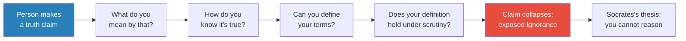

The Socratic method operates through a chain of increasingly precise questions, each one forcing the interlocutor to define terms they previously took for granted. By the time the person reaches the end of the chain, they discover that what they thought was certain knowledge was actually a structure of assumptions resting on other assumptions.

The method doesn't just expose ignorance about a particular topic; it reveals that the entire framework through which people claim to "know" things is riddled with gaps they have never noticed. Every "truth" turns out to rest on a definition that cannot be defined, an observation that cannot be verified, or a consensus that has never been questioned.

This is why the technique is still used in American law schools today: the ability to systematically dismantle a seemingly airtight argument is foundational to legal reasoning. A first-year law student who encounters the Socratic method for the first time experiences exactly what Athenian citizens experienced in the agora — the disorienting realisation that confident assertion is not the same as genuine understanding.

Prof. Jiang demonstrated this live in class. A student offered "the earth is a sphere" as a fundamentally true statement. Socrates would ask: what is a sphere? A three-dimensional round shape. Like a ball? Yes. But you can hold a ball — you can't hold the earth. So how do you *know* it's a sphere?

The questioning could continue indefinitely, and with each round the student's certainty erodes. The point was never to prove the earth isn't a sphere — it was to prove that the student's confidence in the statement far exceeded the reasoning behind it.

### How Athens Saw Socrates

The average Athenian walking through the agora did not see a noble philosopher seeking truth. Prof. Jiang emphasises that Socrates's public reputation was far from the reverent image we have today — that reverence is entirely Plato's creation. Ordinary citizens saw one of three things, none of them flattering:

- **A bully** — an intellectual who humiliated people for sport, targeting anyone foolish enough to engage him
- **A clown** — an eccentric who talked nonsense and wasted everyone's time with circular arguments
- **A trickster** — someone who exploited the gap between language and reality to make people look foolish

Prof. Jiang's key point here is structural: <b style="color: #2980b9">language is a convention for communication, not a mirror of reality</b>. Socrates was exposing the mismatch between the confidence with which people speak and the fragility of the knowledge underlying their words. But to ordinary Athenians who lacked the inclination to appreciate the philosophical point, this looked like intellectual cheating — a man who could make anyone look stupid, not because he was wiser, but because he was craftier.

The distinction matters because it explains the intensity of Athenian hostility toward Socrates. If he had simply been wrong — a madman spouting nonsense — they could have ignored him. But he was *right* in a way that was impossible to answer. Every Socratic dialogue ended with the same result: the citizen's certainty collapsed. The only defence against Socrates was to refuse to engage — or to silence him permanently.

---

## Aristophanes's The Clouds — How Athens Mocked Socrates

*Prof. Jiang retells the satirical comedy that reveals exactly what ordinary Athenians thought of Socrates — produced twenty-four years before they killed him. The Clouds is not great literature by the standards of Greek theatre, but it is an invaluable historical document: it shows that before Plato rehabilitated his image, Socrates was a figure of contempt and ridicule, not the reverent sage we know today.*

Aristophanes was Athens's most famous satirist, a playwright who spared nobody — he mocked Pericles, his successor Cleon, and Socrates with equal relish.

His play *The Clouds* captures the popular imagination of Socrates as fraud, manipulator, and corrupter of the young — precisely the charges that would be levelled against him in court two decades later. Prof. Jiang treats it as essential evidence for understanding why Athens eventually turned on its philosopher.

> [!example] The Clouds by Aristophanes (423 BCE)
> - An Athenian farmer is drowning in debt because his wife spends lavishly — creditors are banging on his door
> - He hears about a school called "the Thinkery," run by a man named Socrates, that teaches you logic and reason so you can deceive jurors and escape your debts
> - He tries to send his playboy son, who refuses — "Socrates is a cheat, a liar, a fraud"
> - The farmer goes himself and finds Socrates hanging from a basket on the ceiling
> - Socrates explains: from up here he has a "higher vision of the world" and draws inspiration from the clouds, who are the true gods — not Zeus
> - The farmer is convinced Socrates is a genius and forces his son to enrol
> - When creditors come demanding money, the farmer says: "I swore by Zeus to repay you, but Zeus doesn't exist, so I owe you nothing"
> - The son returns from the Thinkery and immediately starts beating his father
> - Father: "Why are you beating me?" Son: "Socrates taught me justice. You beat me as a child because I was naughty. You're naughty for not paying creditors. Therefore I can beat you."
> - The logic is absurd but internally consistent — exactly what Athenians feared about Socratic reasoning
> - Enraged, the farmer burns down the Thinkery with Socrates inside
> **The lesson:** Before Plato rehabilitated him, Socrates was a joke — a man who "makes things out of thin air," worships nothing (clouds), and teaches the young to disrespect everything their parents hold sacred. The trial charges of 399 BCE — impiety and corrupting the youth — are lifted almost word for word from this comedy.

The play reveals something crucial about the cultural environment Socrates operated in. Aristophanes was not writing an obscure intellectual critique — this was popular entertainment performed before thousands. The laughter in the theatre was the laughter of a society that had already made up its mind about who Socrates was.

When the formal charges came twenty-four years later, they landed on soil prepared by decades of cultural contempt. The Clouds also demonstrates a bitter irony: the very openness that allowed Aristophanes to mock Socrates on stage was the same openness that allowed Socrates to continue his work — until the city could no longer afford tolerance.

### Socrates's Real Followers

Despite public contempt, Socrates had devoted followers — specifically, <b style="color: #e74c3c">the children of the rich</b>. These were aristocrats born into Athens's wealthiest and most noble families, young men who hated democracy because it treated commoners as their equals.

Democracy offended their sense of natural hierarchy: why should a potter's son have the same vote as the heir to one of Athens's great houses? Socrates gave them what Prof. Jiang calls "mental kung fu" — the linguistic and logical techniques to intellectually demolish ordinary citizens who dared claim equality. In a society where public debate was the currency of political power, Socratic training was a weapon.

His most famous students included:
- **Plato** — who would become the most influential philosopher in history
- **Alcibiades** — one of Athens's wealthiest citizens, who would become its political leader

The dynamic between Socrates and his aristocratic students is essential for understanding what comes next. These young men did not come to Socrates for abstract wisdom — they came for practical power. In a democracy where public debate determined policy, the ability to demolish an opponent's argument was the most valuable skill a politician could possess.

Socrates provided that skill, and his students used it not to pursue truth but to dominate the political arena. The irony is bitter: Socrates claimed to teach people how to *think*, but his students learned how to *win* — and when they won control of Athens under the 30 Tyrants, they used their training to terrorise the very citizens Socrates had spent decades humiliating.

Because Athens was wealthy, open, and tolerant, it allowed Socrates to do whatever he wanted — <b style="color: #e74c3c">until 404 BCE</b>, when everything changed.

---

## The 30 Tyrants — The Crisis That Changed Everything

*The Peloponnesian War's aftermath transforms Athens's relationship with its philosopher. Prof. Jiang traces the chain of events that turned Socrates from a tolerated eccentric into an existential threat — not because Socrates changed, but because the political context around him changed catastrophically.*

The sequence of events between 404 and 399 BCE is essential for understanding why Athens killed Socrates. It was not a sudden burst of irrationality — it was the culmination of a political trauma that made the city unable to distinguish between the philosopher and the students who had betrayed it. Athens lost the Peloponnesian War to Sparta, the most devastating military defeat in its history, and Sparta had the right to burn Athens to the ground. Instead, it installed a puppet dictatorship of thirty wealthy Athenians. This is where Socrates's story takes its fatal turn.

The choice of the thirty was not random. Sparta selected from Athens's wealthiest and most anti-democratic families — the very class that had been sending its sons to study with Socrates.

The overlap between Socrates's student body and the tyrant class was not a coincidence; it was a direct consequence of his role in Athenian society. He had spent decades training the aristocratic youth in techniques of intellectual domination, and now those youth were dominating Athens through violence rather than argument.

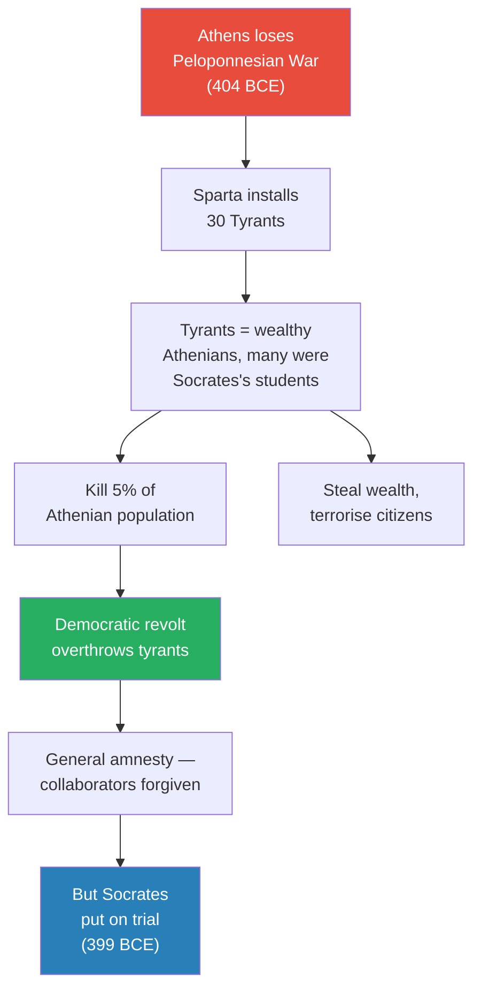

This flowchart traces the political sequence that made Socrates's trial possible. The critical link is in the middle: the 30 Tyrants were drawn from Athens's wealthiest families — the same families whose children Socrates had trained.

The connection between teacher and tyrants was not theoretical; it was personal and widely known. When Athenian citizens remembered the terror — the murders, the confiscations, the five percent of the population killed — they remembered that many of these men had sat at Socrates's feet. The philosopher became guilty by association. It did not matter that he had refused to participate in the tyranny — what mattered was that the men who had terrorised Athens spoke the language of Socratic reasoning, used the logical techniques he had taught them, and came from the aristocratic circles he had cultivated.

The <b style="color: #e74c3c">30 Tyrants</b> were terrible rulers. They killed at least 5% of the Athenian population, stole enormous wealth, and terrorised the citizenry. Socrates himself refused to participate in the tyranny — an important fact that Prof. Jiang notes but does not dwell on, because it ultimately made no difference.

The political damage was already done. In the minds of ordinary Athenians, the connection was straightforward: Socrates taught these men, these men destroyed our city, therefore Socrates bears responsibility. The distinction between a teacher and his students' actions is a philosophical nicety that people who have lost family members to political violence are unlikely to appreciate.

The Athenian people eventually revolted, overthrew the tyrants, and restored democracy. In a remarkable act of civic maturity, they declared a general amnesty — forgiving those who had participated in the regime.

This was democracy at its most generous: the people who had been murdered, robbed, and terrorised chose reconciliation over revenge. The amnesty was not naivety — it was a calculated political act. The restored democracy understood that pursuing retribution against every collaborator would tear the city apart for a second time. Better to forgive and rebuild than to extend the cycle of violence. The magnanimity of the amnesty makes what happened next all the more striking.

Then, five years later, something strange happened.

---

## The Trial of Socrates — Performance Art in the Court of Law

*Prof. Jiang argues that Socrates's trial was not a miscarriage of justice but a calculated act of self-martyrdom by a seventy-year-old man who understood exactly what he was doing. What makes Prof. Jiang's reading distinctive is his insistence that Socrates was not a victim but a strategist: every provocation was calibrated to produce the verdict he wanted.*

In 399 BCE — five years after democracy was restored and the general amnesty declared — Socrates was charged with two crimes. The timing is important: the amnesty was supposed to draw a line under the tyranny and allow Athens to heal. By putting Socrates on trial, the city was effectively reopening wounds it had just sworn to close.

The charges are revealing because of where they come from: they are essentially the plot of Aristophanes's *The Clouds*, restaged as a legal proceeding. This was not a coincidence — the Athenians were telling Socrates that the joke had gone on long enough.

The two charges were:
1. **Impiety** — insulting the gods of Athens (exactly what he did in *The Clouds*)
2. **Corrupting the youth** — miseducating young Athenians (also from *The Clouds*)

Prof. Jiang's interpretation: <b style="color: #2980b9">the charges were essentially a cruel joke</b>. The Athenians expected Socrates to apologise, make some self-deprecating remarks, and be forgiven — a ritual humiliation, a way of teaching him a lesson without real consequences.

Socrates refused to play along. What followed was, in Prof. Jiang's framing, a masterpiece of calculated provocation — a three-act drama in which the defendant systematically transformed his trial from a ritual humiliation into a proof of concept.

The structure of the trial matters. Athenian trials worked differently from modern ones: there was no professional judge, no lawyers, no rules of evidence. A jury of 500 ordinary citizens heard both sides, voted on guilt, and then — if the verdict was guilty — heard proposed punishments from both the prosecution and the defence before voting again.

The system was designed for reconciliation, not retribution. The expectation was clear: Socrates would acknowledge his eccentricity, express regret for any unintended harm, and the city would forgive him as it had forgiven the tyrants' actual collaborators.

Socrates turned every one of these expectations against the system.

> [!example] The Trial of Socrates (399 BCE) — Three Acts of Provocation
> - **Act 1 — The Defence:** Socrates told the jury of 500: "I am not a good speaker. I'm bad with words. I'm just a poor person who spends every day seeking truth."
> - He added: "I should not have to defend myself — you're all capable of reason. Think for yourselves and you'll see I'm not guilty."
> - The sting: "If you're stupid, you'll vote me guilty. If you're stupid, there's nothing I can do about it."
> - **Act 2 — The Guilty Verdict:** The jury voted 280 to 220 — guilty. Despite Socrates calling them stupid, it was still a remarkably close vote.
> - **Act 3 — The Punishment:** Athenian law required the convicted man to propose his own sentence.
> - Socrates declared: "You found me guilty because I speak truth. I'm a gadfly — I hold a mirror to Athens and show you your warts, your pimples, your ugliness. I am the most selfless public servant."
> - His proposed punishment: "A just sentence would be a pension. But I'm generous — I'll accept a small fine."
> - **The Verdict:** Outraged jurors sentenced him to death by hemlock.
> - **The Twist:** Athens tried to back down. Socrates was left alone — he had to *demand* his hemlock and administer the poison himself.
> **The lesson:** At seventy, Socrates turned his trial into the ultimate proof of his thesis. If democracy could reason, it would acquit. It convicted — therefore it cannot reason. His death was his greatest argument.

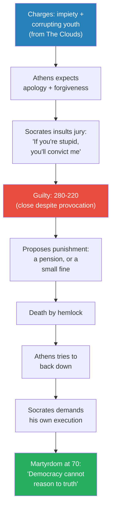

The trial diagram reveals the trap Socrates laid for Athenian democracy. At every stage, he chose the option most likely to provoke an irrational response: insult during defence, demand reward during sentencing, insist on execution when the city tried to relent.

The close vote — 280 to 220, a margin of just sixty — suggests nearly half the jury saw what Socrates was doing. But the slim majority gave Socrates exactly what he needed: proof that democratic deliberation collapses into unreason under emotional pressure. The trap was self-proving — the angrier the jury became, the more they validated his argument.

Prof. Jiang calls this <b style="color: #2980b9">performance art</b>. Socrates was seventy — ancient by the standards of his time. He had little to live for and everything to die for. The hemlock was not a punishment imposed on him — it was a weapon he wielded against the system that administered it.

> [!tip] Core Insight
> Prof. Jiang: "This trial was a type of performance art. The people of Athens realised they were probably tricked — but by then it was too late."

---

## Plato's Mission — Redeeming a Dead Teacher

*Socrates's most devoted student was twenty-eight when his mentor drank hemlock. He would spend the rest of his life making sure the world saw Socrates not as a clown, but as the greatest philosopher who ever lived.*

Plato loved Socrates. That love was not abstract admiration — it was the bond of a young aristocrat who had found the only person in Athens genuinely committed to truth. When democracy killed his teacher, Plato committed himself to two things: restoring Socrates's reputation by transforming him from a figure of ridicule into a figure of reverence, and building a philosophical system grand enough to vindicate everything Socrates stood for.

After Socrates's death, Plato spent twelve years travelling — absorbing philosophy from across the ancient world. Prof. Jiang emphasises that Athens was not intellectually isolated. Egypt was the epicentre of learning at this time, with philosophical and mathematical traditions far older than anything in Greece. Mesopotamia had rich traditions of its own, and the broader Greek world produced thinkers like Pythagoras and Democritus whose ideas circulated freely among educated Greeks.

We've lost most Egyptian sources — a fact Prof. Jiang returns to repeatedly throughout the course as evidence that the history of ideas is shaped by the same forces of power and survival that shape political history — but we know the Egyptians heavily influenced Greek thought. The point corrects a common misconception: Plato did not create his system from nothing. He synthesised traditions from across the ancient world into a framework that proved uniquely durable.

What Plato absorbed during those twelve years of travel is largely a matter of speculation, because the sources have not survived. But the sophistication of his mature philosophy — the Theory of Forms, the cosmology, the mathematical precision of his metaphysics — suggests exposure to intellectual traditions far more developed than what Athens alone could have provided. The Republic, when it finally appeared, was not just an Athenian book. It was a synthesis of the ancient world's accumulated wisdom, filtered through one man's grief and genius.

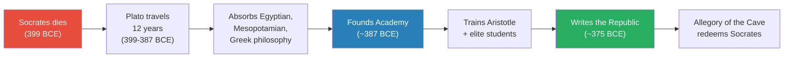

This timeline reveals the long incubation between Socrates's death and Plato's masterwork. The Republic was not written in grief — it was written by a man who had spent over two decades processing his teacher's death, travelling the ancient world, founding an institution, and synthesising everything he had learned. The twelve-year gap between execution and Academy is crucial: Plato did not rush to respond. He prepared, absorbed, and waited until he had something worthy of his teacher's sacrifice.

At forty, Plato founded the <b style="color: #2980b9">Academy</b> — a school that functioned like Harvard or Oxford today, attracting the children of the most powerful families in the Greek world. The Academy was not just a school — it was an institution that would shape the transmission of Western thought for centuries.

Its most famous student was Aristotle, who would later, as Prof. Jiang discusses in future lectures, become the single most important figure in packaging and promoting Greek culture across the known world. Around 375 BCE, Plato wrote <b style="color: #2980b9">the Republic</b> — arguably the greatest work of Western philosophy, and the book many consider the greatest ever written. Prof. Jiang tells his students that reading the Republic is "a life-transforming event" — a claim he makes about very few texts in this course.

---

## The Allegory of the Cave — The Most Famous Metaphor in Western Thought

*Prof. Jiang tells the allegory in full, then unpacks its three civilisation-shaping consequences. He prefaces it with a striking claim: "You will remember this allegory for the rest of your life. Fifty years from now, you will still remember the Allegory of the Cave." The allegory's power lies not just in its philosophical content but in its narrative structure — it is a story, and stories lodge in memory far more deeply than arguments.*

The Allegory of the Cave appears in Book VII of the Republic. It is not the book's thesis — it is a supporting illustration within a larger argument about justice, truth, and the ideal society.

But the illustration has far outlived the argument. Almost no one outside philosophy departments reads the Republic cover to cover, but almost every educated person in the Western world has encountered the Allegory of the Cave in some form. It has been adapted, referenced, and reinterpreted in every century since Plato wrote it. Prof. Jiang considers it "by far" the most famous metaphor in Western thought, and he says nothing comes second.

Imagine a cave deep under the earth. At the back, a large fire casts light forward. Prisoners are chained to the floor, their necks immobilised so they can only stare at the wall in front of them. Behind the prisoners, puppeteers hold up cardboard cutouts — rats, birds, objects — and the fire projects their shadows onto the wall.

The prisoners have never seen anything else. <b style="color: #e74c3c">They believe the shadows are reality.</b> They name the shadows, create language around them, play games to see who can best describe what they see.

They give awards to the most eloquent — and here Plato takes a direct shot at the playwrights, poets, and artists of Athens. These are the people democracy celebrates: the master describers of shadows. But everything they celebrate is a lie.

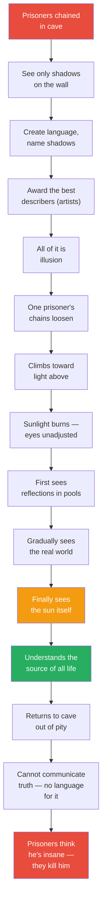

The allegory's visual structure maps the entire human condition as Plato understood it. The cave represents the world of appearances — the only reality most people will ever know. The fire and puppeteers represent the forces that create illusion: culture, convention, received wisdom.

The painful ascent represents the philosopher's journey from ignorance to knowledge — and the pain is deliberate, because Plato insists that truth *hurts*. The sun at the top represents the Form of the Good, the ultimate source of all truth. And the return to the cave represents the philosopher's impossible obligation: to share what cannot be shared, using language designed to describe shadows, not sunlight.

One day, a prisoner's chains loosen. He stands, turns around, and sees a light coming from above. Curious, he climbs toward it. When he emerges into the open world, the sunlight is agonising — his eyes have never seen real light.

At first he can only stare at the ground, seeing reflections in pools of water. Slowly, painfully, he acclimatises. He begins to see the world around him — and Prof. Jiang emphasises this detail — it is beautiful beyond anything language can describe. The freed prisoner discovers that truth is not just more accurate than illusion — it is more *beautiful*. But that beauty exists beyond the reach of the words he learned in the cave.

Finally, he develops the courage to look up at the sky and sees <b style="color: #f39c12">the sun</b> — the source of all life, all light, all truth. For the first time, he fully understands reality. He sees how the sun makes everything possible — growth, warmth, sight itself — and he grasps, in a flash of total comprehension, the structure of the universe.

But then regret seizes him. He remembers his friends still chained in darkness. He pities them. So despite loving the world of light, despite knowing what will happen when he returns, he descends back into the cave — a voluntary act of sacrifice driven by compassion, not obligation.

His eyes, now accustomed to sunlight, cannot adjust to the darkness. He stumbles, falls, hurts himself. He tries to tell the prisoners what he has seen — but <b style="color: #e74c3c">he has no language for it</b>.

The words he learned in the cave were designed to describe shadows. Truth exists beyond those words. When they ask him to describe the shadows on the wall, he cannot do that either — he has been too transformed by reality to describe illusion. He has lost the ability to speak the language of the cave without gaining the ability to speak the language of the sun.

The prisoners are certain he is an idiot, a madman, a clown — the same words Athenians used to describe Socrates. When he persists in trying to show them the truth, they kill him.

The allegory ends where Socrates's life ended: with the murder of the truth-teller by the people he was trying to help. But Plato has done something extraordinary with the retelling. In the historical record, Socrates was a controversial figure who was convicted by a democratic jury for impiety and corrupting youth. In the allegory, he is recast as the only free man in a world of prisoners — the only person brave enough to face the pain of truth and compassionate enough to return to share it. The facts have not changed, but the story wrapped around them has transformed their meaning completely.

> [!tip] Core Insight
> Prof. Jiang: "You will remember this allegory for the rest of your life. Maybe you'll forget the trial of Socrates or anything else from this class. But fifty years from now, you will still remember the Allegory of the Cave."

---

## Three Powers of the Allegory

*Prof. Jiang explains why this single metaphor transformed Western civilisation — it accomplished three things simultaneously, each sufficient on its own to guarantee immortality.*

Prof. Jiang structures this section around a clear claim: the Allegory of the Cave is not merely a beautiful story. It is a machine that does three distinct kinds of civilisational work simultaneously.

Each of these three functions operates on a different scale — personal (redeeming Socrates), narrative (creating the Christ archetype), and structural (providing Christianity's cosmology). Together, they explain why the allegory has been retold, reinterpreted, and reimagined in every century since Plato wrote it.

### Power 1: It Redeems Socrates

The man who escapes the cave, sees truth, returns, and is killed — that is obviously Socrates. The allegory performs a complete inversion of his public image.

Before the allegory, Socrates was despised: a bully, a clown, a trickster. After the allegory, he becomes <b style="color: #27ae60">the greatest philosopher who ever lived</b> — the one person brave enough to see truth and try to share it, even knowing it would cost him his life.

Prof. Jiang: "That's why today we celebrate Socrates as the greatest philosopher who ever lived, and we consider him the first philosopher — even though he was not the first philosopher." Plato did not just defend his teacher — he made Socrates into the archetype of the truth-seeker, the model against which every subsequent philosopher would be measured. The image of the freed prisoner stumbling back into darkness is so powerful that it overwrites everything we know about the historical Socrates.

The transformation is worth pausing on, because it illustrates a theme that runs through the entire course: the power of narrative to reshape historical reality. The "real" Socrates — whoever he was — is irrecoverable. All we have is Plato's Socrates, a character in a series of dialogues written by a devoted student with an explicit agenda.

Before the allegory, the dominant narrative about Socrates was Aristophanes's: a fraud, a cloud-worshipper, a corrupter of youth. After the allegory, the dominant narrative is Plato's: the bravest truth-seeker who ever lived. The historical facts did not change — what changed was the story told about them.

### Power 2: It Creates the Christ Archetype

The allegory's narrative structure maps precisely onto the story of Jesus, which would not be told for another four centuries:

- A being who exists in a higher realm of truth
- Descends voluntarily to a world of ignorance and suffering
- Tries to share truth with people who cannot receive it
- Is killed by the very people he was trying to save

<b style="color: #2980b9">For early Christians, Socrates *became* Jesus</b> — or rather, Jesus became the fulfilment of the pattern Plato had identified. A martyr for truth, killed by the very people he was trying to save.

The allegory gave Christianity a philosophical precedent: the idea that God might descend to the human world, speak truth, and be murdered for it was not new to the Christians. Plato had already told that story, and the Allegory of the Cave had already embedded it in the Western imagination. When the Gospel writers narrated the life of Jesus, they were working within a narrative template that Plato had established centuries earlier — the structure of descent, truth-telling, rejection, and martyrdom was already culturally available, and the Christ story fit it perfectly.

### Power 3: It Provides Christianity's Intellectual Framework

Behind the allegory lies a complete cosmology that Christianity would adopt as its own intellectual architecture.

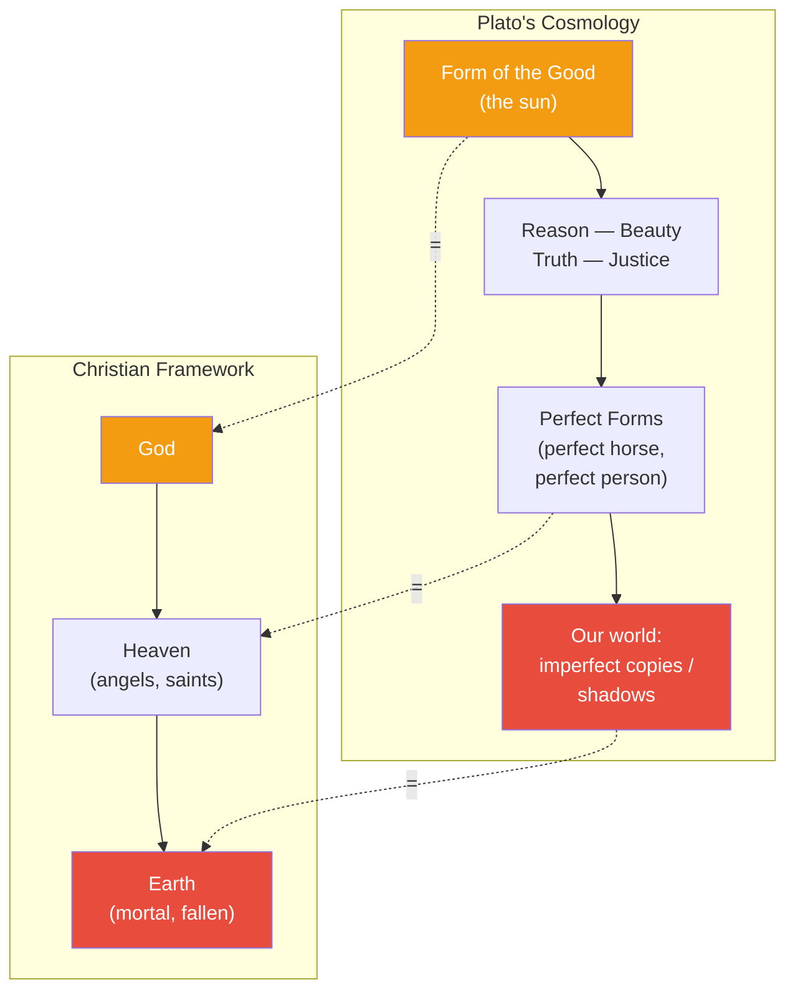

This diagram makes explicit the mapping Prof. Jiang considers the lecture's most important intellectual claim. Plato's Form of the Good — eternal, unchanging, the source of all truth — maps directly onto God. The realm of perfect Forms maps onto Heaven. And our imperfect world maps onto the fallen Earth of Christian theology. The structural parallel is not approximate; it is almost exact.

Plato's <b style="color: #2980b9">Theory of Forms</b> works like this:

- At the top: the **Form of the Good** — the source of everything, represented by the sun in the allegory. It is the ultimate reality, from which all other realities emanate.
- Emanating from it: the great concepts — Reason, Beauty, Truth, Justice — the fundamental categories that structure the universe. These are not human inventions; they are eternal truths that exist independently of human minds.
- Below those: **perfect Forms** — the ideal horse, the ideal person, perfect and unchanging. Every horse you see in the world is an imperfect copy of the perfect horse that exists in the realm of Forms.
- At the bottom: **our world** — where everything is an imperfect imitation, a shadow of the perfect world above. We live among copies of copies, and most of us never even suspect that the originals exist.

The upper world has three defining qualities: it is <b style="color: #27ae60">eternal, immutable, and perfect</b>. It has always existed, it will never change, and nothing in it falls short of its ideal. Our world is the exact opposite: mortal, changeable, and full of suffering. We will all die. We all feel pain. We all fall short. But up there — in the realm of Forms — no one dies, no one suffers, everything is exactly as it should be.

The hierarchy is crucial for understanding why this maps so cleanly onto Christianity. The Form of the Good is not just one truth among many — it is the *source* of all truth, just as the Christian God is not one being among many but the source of all being.

The relationship between the upper and lower worlds is not horizontal (two equal realms) but vertical (one perfect realm from which the other derives its degraded existence). This vertical cosmology — perfect above, imperfect below, with the possibility of ascending from one to the other through knowledge or grace — is the structural spine of Christian theology.

Prof. Jiang makes the connection explicit: "What is this? This is a Christian universe. This is God, this is Heaven, this is Earth."

His provocative conclusion: <b style="color: #e74c3c">"Plato is the real founder of the Christian religion, not Jesus."</b> Jesus provided the narrative — the life, death, and resurrection. But the intellectual framework — a perfect upper world and an imperfect lower world — is Plato's invention. Future lectures on Christianity (Lectures 24-28) will develop this argument.

> [!abstract] Three Powers of the Allegory — Summary
> | Power | What It Does | Scale |
> |-------|-------------|-------|
> | **Redeems Socrates** | Transforms him from clown to greatest philosopher | Personal / biographical |
> | **Creates Christ archetype** | Establishes the narrative template of a truth-bearer killed by the ignorant | Narrative / cultural |
> | **Provides Christian cosmology** | Form of the Good = God, perfect Forms = Heaven, our world = Earth | Structural / civilisational |

---

## The Republic — What Is a Good Society?

*A student asks what the Republic is actually about. Prof. Jiang explains that the Allegory of the Cave appears within a much larger argument — one that starts with a question about justice and ends with a radical proposal for how society should be organised.*

The Republic is not primarily about the Allegory of the Cave — the allegory appears *within* a larger argument. The driving question is: **what is a good society?** Plato begins from personal trauma: democracy killed Socrates, therefore democracy cannot be the answer. But he does not stop at critique. He builds, step by logical step, toward a positive vision of what a just society would look like — and the Allegory of the Cave serves as the most powerful illustration within that larger argument.

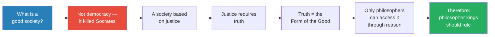

Plato's logical chain has the force of mathematical deduction: each step follows necessarily from the one before. If you grant that a good society must be based on justice, and that justice requires truth, and that truth is the Form of the Good, and that only philosophers can access the Form of the Good — then the conclusion is inescapable: only philosophers should rule.

The beauty of the argument is that every step sounds reasonable in isolation. The radicalism only becomes apparent at the end, when you realise you have committed yourself to abolishing democracy and installing philosopher kings.

Democracy cannot be the answer — it killed Socrates. A good society must be based on justice. Justice requires truth. Truth is the Form of the Good. Only philosophers can access it. Therefore: <b style="color: #2980b9">philosopher kings</b> should rule. This is the **Republic**.

Prof. Jiang emphasises that the Republic is not a utopian fantasy — it is an argument born from trauma. Every step in the chain is motivated by the death of Socrates.

Democracy killed the truth-seeker, so the ideal society must be designed to protect truth-seekers by putting them in charge. The emotional core of the Republic is not abstract justice — it is the grief of a student who lost his teacher to the irrationality of a mob.

The Republic would also serve as a textbook for every authoritarian ruler who wanted intellectual justification for denying power to ordinary citizens. For two millennia, kings and emperors would cite Plato's argument that only the wisest should rule — conveniently identifying themselves as the wisest.

The book that began as a response to democratic injustice became, ironically, the most influential argument against democracy ever written.

---

## Why Plato Is the Most Influential Philosopher in History

*Prof. Jiang argues that Plato's dominance is not because he was the best thinker — "it's not because he's the best," he says bluntly — but because of three structural advantages.*

| Factor | Explanation |
|--------|-------------|
| **Readability** | Plato trained as a playwright — he wanted to be Aeschylus or Sophocles. He transferred dialogue from stage to page. Reading Plato is enjoyable; reading Kant or Hegel (Lecture 55) is not. |
| **Anti-democratic politics** | Plato passionately hated democracy because it killed his mentor. Kings who ruled for 2,000 years loved a philosopher who justified their power. |
| **The Academy** | His school attracted the most powerful families. His students — especially Aristotle — packaged and spread Greek culture worldwide. |

The first factor is often overlooked but may be the most important. Plato originally wanted to be a playwright — he dreamed of being Aeschylus or Sophocles, because in Athens, being a playwright was the highest honour a citizen could aspire to. He studied dramatic dialogue, and when he turned to philosophy, he brought that training with him.

His works read like scripts, not treatises — Socrates is the main character, arguing with interlocutors who push back, challenge, and sometimes win points. The result is philosophy that anyone can read and enjoy, a quality that later philosophers like Immanuel Kant and Georg Wilhelm Friedrich Hegel conspicuously lack.

The second factor explains *who* kept Plato in circulation. For most of human history, the world was ruled by kings, emperors, and aristocrats. Plato gave them philosophical legitimacy: philosopher kings should rule, democracy is a failure, the masses cannot reason.

Every monarch who wanted intellectual justification for his power had reason to ensure Plato was read, taught, and celebrated. This created a 2,000-year patronage system that no other philosopher enjoyed.

The third factor explains *how* his ideas spread. The Academy attracted the children of the ancient world's most powerful families. His students went on to positions of enormous influence, and Aristotle became the single most important figure in transmitting Greek culture to the wider world.

What is remarkable about these three factors is that they are entirely independent of the *quality* of Plato's philosophy. A more brilliant philosopher who wrote in dense, inaccessible prose, who supported democracy, and who had no institutional base would have been forgotten. A mediocre philosopher who wrote engagingly, opposed democracy, and trained elite students might have endured just as long. This is Prof. Jiang's point: influence is determined by structure, not merit.

One extraordinary fact: <b style="color: #27ae60">Plato is the only writer in human history who has been read continuously for 2,000 years.</b> Homer was lost for centuries. The tragedians disappeared and were rediscovered. But Plato was never lost — because kings always had reason to keep him in circulation.

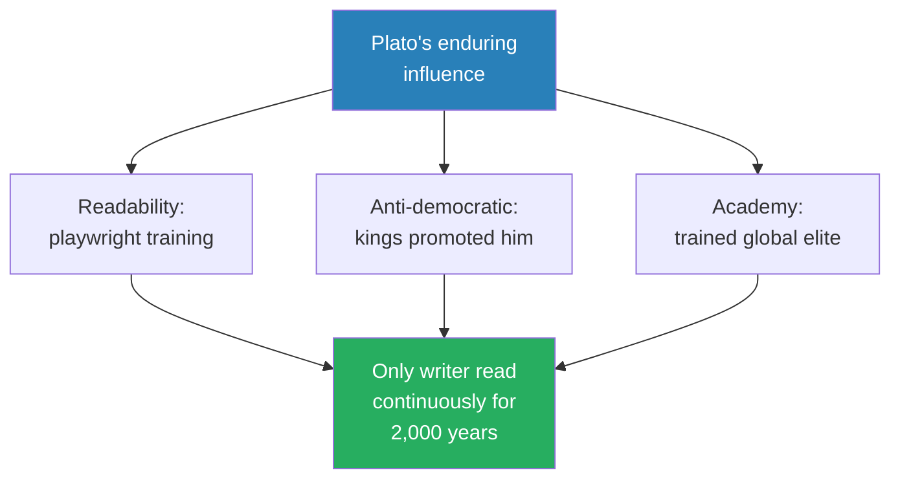

This diagram captures Prof. Jiang's structural explanation for Plato's dominance. Each factor would have been sufficient on its own to ensure some influence. Together, they created a self-reinforcing system: kings promoted Plato because he justified their power, his accessible writing style ensured new readers in every generation, and the Academy's alumni carried his ideas everywhere. No other ancient writer had all three advantages simultaneously.

---

## Plato as Failed Politician

*A brief but revealing anecdote shows the gap between philosophical theory and political practice. Prof. Jiang tells it with evident relish — it is the punchline to the entire lecture's argument about philosopher kings.*

> [!example] Plato in Syracuse
> - The king of Syracuse — a prosperous city on the island of Sicily — invited Plato to advise him on how to be a "good tyrant," essentially a philosopher king
> - It was common in this era for Greeks to think they should rule the world — the idea of philosopher-advisors to kings was not unusual
> - Plato arrived and told the king: "You should let *me* be the king — then you'll have a philosopher king"
> - The king was not amused and nearly had Plato killed
> - Plato escaped only because he had very wealthy friends who ransomed him out
> - He was himself extremely rich, which helped — a reminder that ancient philosophy was an aristocratic pursuit
> - The episode proved that the qualities making a great philosopher — relentless honesty, indifference to social convention, absolute commitment to abstract truth — are precisely those making a catastrophic politician
> - The king of Syracuse wanted practical advice on governance; Plato offered a demand for total power
> **The lesson:** Prof. Jiang's verdict — "As a practitioner of his philosophy, he's terrible." Socrates proved the gap between theory and practice at his trial; Plato proved it in Syracuse. The philosopher king remains one of the most compelling ideas in political thought and one of the least practical.

The Syracuse episode is more than an amusing footnote. It reveals the fundamental problem at the heart of the Republic's political vision: Plato's ideal ruler is someone who has transcended the cave, who has seen the Form of the Good, and who can therefore govern with perfect wisdom.

But the allegory itself shows why this cannot work — the man who returns to the cave *cannot communicate what he has seen*. He stumbles, he falls, he speaks a language no one understands. If the philosopher cannot even explain truth to the prisoners, how can he govern them?

---

## Athens's Arc: From Tolerance to Execution

*The full trajectory of how a wealthy, open society turned on its own thinker — a pattern Prof. Jiang identifies as universal and recurring throughout the course.*

Before moving to the lecture's intellectual connections, it is worth stepping back to see the complete arc of Athens's relationship with Socrates. The story spans nearly half a century: from the Golden Age, when a confident and prosperous democracy tolerated its most vocal critic without concern, through the catastrophe of war and tyranny, to the trial and execution that would define Western philosophy. The arc is not just a historical sequence — it is a template that Prof. Jiang will apply to civilisation after civilisation throughout the course.

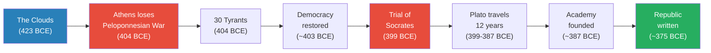

This timeline covers nearly fifty years — from the first public mockery of Socrates on the Athenian stage to the publication of the work that would redeem him. The gaps between events are as revealing as the events themselves.

Twenty-four years separate *The Clouds* from the trial — two decades during which Athenian hostility to Socrates simmered without boiling over. Only five years separate the restoration of democracy from the trial — a remarkably short time for a society that had just declared a general amnesty. And twenty-four years separate Socrates's death from the Republic's publication — the long gestation of Plato's response.

```mermaid
flowchart LR
    GA["Golden Age:<br/>Athens tolerates<br/>Socrates"] --> PW["Peloponnesian<br/>War: stress<br/>and defeat"]
    PW --> TY["30 Tyrants:<br/>Socrates's students<br/>in power"]
    TY --> DR["Democracy<br/>restored +<br/>amnesty"]
    DR --> TR["Trial: expected<br/>apology, got<br/>provocation"]
    TR --> EX["Execution:<br/>Socrates at 70<br/>drinks hemlock"]
    EX --> PL["Plato's response:<br/>Allegory of<br/>the Cave"]
    PL --> LEG["Legacy: Socrates<br/>redeemed as<br/>greatest philosopher"]
    style GA fill:#27ae60,color:#fff
    style PW fill:#e74c3c,color:#fff
    style EX fill:#e74c3c,color:#fff
    style LEG fill:#27ae60,color:#fff
```

The arc diagram tells a complete story in seven nodes: prosperity enables tolerance, crisis destroys it, trauma produces injustice, and a single student's genius transforms martyrdom into civilisational legacy. The symmetry is striking — the diagram begins and ends in green, with red in the middle.

Athens starts by tolerating its critic and ends by celebrating him, but only after killing him and having a student rewrite the story. The pattern is not unique to Athens: Prof. Jiang implies that wealthy, open societies always tolerate dissent during good times and turn on their critics when under pressure — a cycle that repeats throughout the course.

This pattern echoes the [[08 - Rat Utopia and the Peloponnesian War|Rat Utopia]] insight from Lecture 8: wealthy societies tolerate dissent during good times but turn on their critics when under pressure. Athens tolerated Socrates for decades of peace and prosperity.

It took the trauma of military defeat, tyranny, and civil war to make the city turn on its gadfly. The amnesty that forgave the tyrants' collaborators could not, in the end, extend to the man whose teaching had produced those collaborators. The trial was not about what Socrates had done — it was about what his students had done with what he taught them.

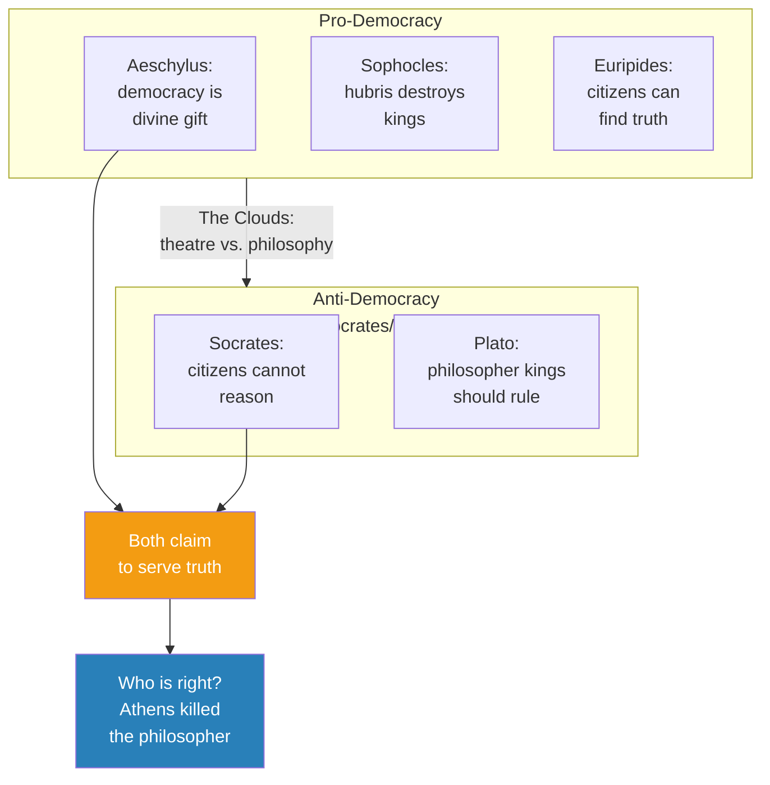

This diagram captures the intellectual tension at the heart of the lecture. The playwrights of Lecture 9 and the philosophers of Lecture 10 both claim to serve truth — but disagree fundamentally about whether ordinary citizens can access it.

The Clouds sits at the intersection: theatre attacking philosophy. The question of who is right remains unresolved — Athens killed the philosopher, which might prove Socrates right about democracy's irrationality, or might prove the playwrights right that democracy can correct its own excesses.

---

## Student Q&A — Plato's Influences and the Lost Philosophers

*The Q&A portion of the lecture produces one of Prof. Jiang's most important methodological points: the history of ideas is shaped by the same forces of power, patronage, and survival that shape the history of empires.*

A student asks a brilliant question: who influenced Plato? Prof. Jiang's answer reframes the entire lecture. Socrates was not much of an intellectual influence on Plato — he questioned other people's wisdom but never proposed theories of his own.

The real influences came from Plato's twelve years of travel after Socrates's death. During this period, the Golden Age of Greek philosophy was producing thinkers across the Greek world — Pythagoras, Democritus, and others — and Plato had access to all of them.

But the deeper point is about what we have lost. Prof. Jiang emphasises that the Greek intellectual world was heavily influenced by Egypt, which was "really the epicentre of learning and philosophy at this time," and by Mesopotamia and Persia.

We do not have access to Egyptian philosophical sources — they have been lost. We can make the assumption that the Egyptians heavily influenced Plato, just as they influenced other Greek thinkers, but we cannot prove it because the evidence has not survived. The same is true of Mesopotamian philosophy.

Prof. Jiang's conclusion is characteristically sharp: "I'm sure there were philosophers at this time who are the equal of Plato in terms of originality — but we don't know who these people were." The reason is censorship — not in the modern sense of deliberate suppression, but in the broader sense that most of the past has simply been eliminated by the passage of time.

What survives is not what was best but what was preserved by the institutions, patrons, and political systems that had reason to keep it alive. Plato survived because kings needed him. The Egyptian philosophers who may have inspired him did not survive, because no comparable institutional mechanism protected their work.

This insight connects to the lecture's larger theme: the mechanisms of intellectual survival are not neutral. They favour ideas that serve power, and they destroy ideas that don't — regardless of quality. The same dynamic that made Plato the most-read philosopher in history — his usefulness to anti-democratic rulers — is the dynamic that erased the Egyptian and Mesopotamian thinkers who may have been equally brilliant.

Prof. Jiang invites his students to argue with him: "If you feel I've said anything controversial or you disagree with, let me know, and I will rebut. We can have a Socratic dialogue."

The invitation is itself a Socratic move — modelling the very method the lecture has been describing. Throughout the Q&A, Prof. Jiang demonstrates the pedagogical style he attributes to Socrates: meeting each question not with a lecture but with a counter-question or a reframing that forces the student to think more deeply about their own assumptions.

---

## Connections

**Builds on:**

- [[08 - Rat Utopia and the Peloponnesian War]] — This lecture provides the essential political context for Socrates's trial: Athens's devastating loss to Sparta, the installation of the 30 Tyrants, and the trauma of civil war. Without the Peloponnesian War, Athens would likely have continued tolerating Socrates indefinitely. The "Rat Utopia" pattern — prosperous societies tolerate dissent until crisis strikes — explains the timing of the trial perfectly.

- [[09 - Aeschylus, Sophocles, and Euripides as Prophets of Democracy]] — The playwrights defended democracy as divine, just, and capable of self-correction. Socrates represents the philosophical counter-argument: democracy is built on the false assumption that citizens can reason. The Clouds sits at the intersection of theatre and philosophy, using the playwrights' medium to attack the philosopher's project.

**Sets up:**

- [[11 - The Greatness of Philip II of Macedon]] — Philip and Alexander will create the Hellenistic Empire that spreads Greek culture — including Plato's philosophy — across the known world. The ideas incubated in Athens's Academy will become the intellectual foundation of an empire stretching from Egypt to India. Without Macedonia's military machine, Plato might have remained a local Athenian tradition.

**Thematic links:**

- **Hubris** (Lecture 9) — The playwrights warned about hubris in kings; Socrates argued that democratic citizens are equally subject to hubris — the hubris of believing they can reason when they cannot. The trial is itself an act of democratic hubris: 500 citizens believing they can judge a philosopher whose life was devoted to exposing their inability to judge.

- **Religion as civilisation driver** (Lecture 1) — Just as religion drove the transition from nomadism to settlement in Lecture 1, Plato's cosmology provides the intellectual scaffolding on which Christianity will build its entire worldview. His philosophy becomes a quasi-religious framework structuring Western thought for 2,000 years.

- **Christianity** (Lectures 24-28) — The Allegory of the Cave provides both the narrative template (a truth-bearer descends to the world of ignorance and is killed) and the cosmological framework (a perfect realm above an imperfect world below) for the Christian religion. Prof. Jiang's claim that Plato is the "real founder" of Christianity will be developed across these later lectures. The argument is not that early Christians consciously borrowed from Plato — it is that the intellectual framework within which the Christ story made sense was already Platonic.

- **Censorship and the survival of ideas** (recurring theme) — Prof. Jiang's observation that most ancient philosophy has been lost — Egyptian, Mesopotamian, and even some Greek — connects to a theme he develops throughout the course: the history of ideas is shaped by the same forces of power that shape the history of empires. What survives is not what was best but what was protected by institutions and patrons with reason to preserve it. Plato survived because kings needed him. The philosophers who may have been his equals did not survive, because they lacked comparable institutional protection.

---

## The Takeaway

This lecture captures one of history's most consequential sequences: a democracy kills its critic, the critic's student writes the most influential metaphor in Western thought, and that metaphor reshapes religion, philosophy, and civilisation for the next two millennia. The chain from Socrates's hemlock to Christianity's cosmology runs through a single text — Plato's Republic — and a single image: prisoners watching shadows on a cave wall. What makes the sequence extraordinary is not just its reach but its improbability: a twenty-eight-year-old's grief at his teacher's execution produced the intellectual architecture that a world religion would adopt four centuries later.

Prof. Jiang's most provocative insight is that Plato's influence was structural, not purely intellectual. Plato endured because he was readable, because kings needed him, and because the Academy produced elites who carried his ideas everywhere. The greatest philosopher in history owes his status partly to being anti-democratic in a world ruled by kings.

This is a distinctly Prof. Jiang argument: he is less interested in whether Plato was *right* than in why Plato *won*. The answer has less to do with the quality of his ideas than with the political economy of intellectual survival. Ideas that serve power get promoted; ideas that threaten power get lost. Plato served power, and power repaid him with 2,000 years of continuous readership.

The deepest irony is double-edged. Socrates argued democracy cannot reason to truth, and the democratic jury proved him right by convicting him. Plato argued philosophers should rule, and his one attempt to practise what he preached ended in near-assassination in Syracuse. Neither the democrat nor the philosopher could make his system work in practice.

The tension between philosophical ideals and political reality is one the course will revisit throughout its arc — from Alexander's empire through Rome to Christianity's own confrontation with power. Prof. Jiang's method here is characteristic: he tells a story that seems to have a clear moral (democracy is irrational, philosophers should rule), then quietly undermines it with a counter-example (Plato in Syracuse), leaving the student to sit with the unresolved tension.

The lecture also models a crucial analytical habit: distinguishing between what someone *said* and why what they said *survived*. The historical Socrates is irrecoverable — all we have is Plato's Socrates, shaped by love, grief, and a philosophical agenda.

Similarly, we have lost the Egyptian and Mesopotamian philosophers who almost certainly influenced Plato, because the mechanisms of intellectual survival — patronage, institutions, political utility — did not favour their preservation. The world of ideas, like the world of empires, is shaped by power. That insight, more than any particular claim about the Form of the Good, is what this lecture teaches.

Finally, the lecture raises a question it does not fully answer: was Socrates right? Is democracy fundamentally unable to reason to truth? The trial seems to prove his case — but Prof. Jiang also notes that the vote was remarkably close (280 to 220) despite Socrates's provocations, and that the restored democracy allowed Plato to write, teach, and found the Academy without interference for decades.

Democracy killed the philosopher, but it also allowed the philosopher's student to build the institution that would spread his ideas across the world. Whether this represents democracy's failure or its self-correcting capacity is a question the course leaves open — and one that becomes increasingly urgent as the series moves from Greek city-states to world empires.

What comes next: Greek ideas are about to escape Athens. In Lecture 11, Philip II of Macedon builds the military and political machine that will carry Plato, Aristotle, and the entire Greek intellectual tradition to every corner of the known world. The philosophy incubated in one school in Athens will become the cultural foundation of an empire — and, through that empire, of Western civilisation itself.
