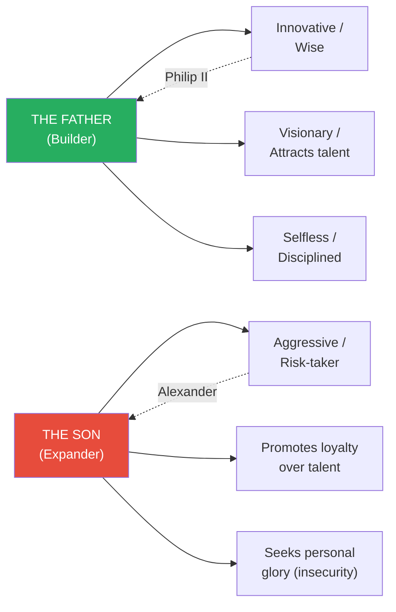
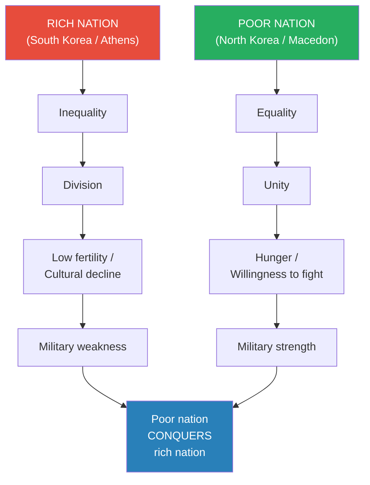
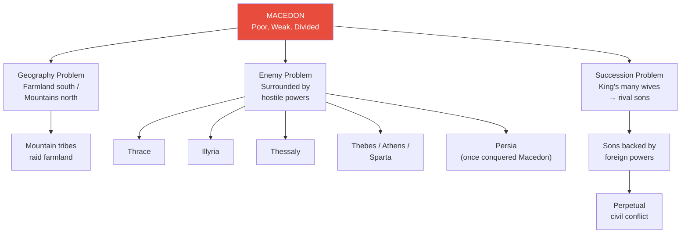
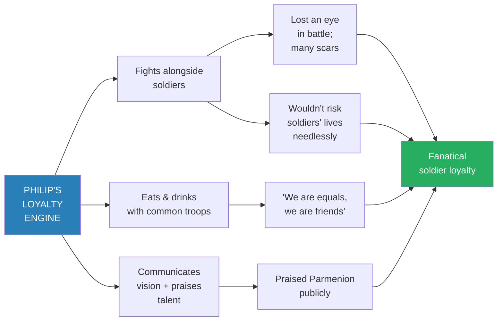
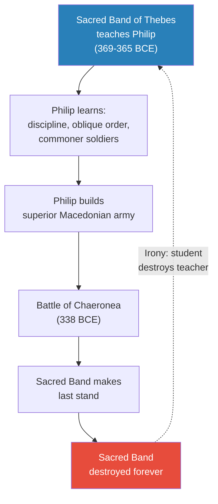
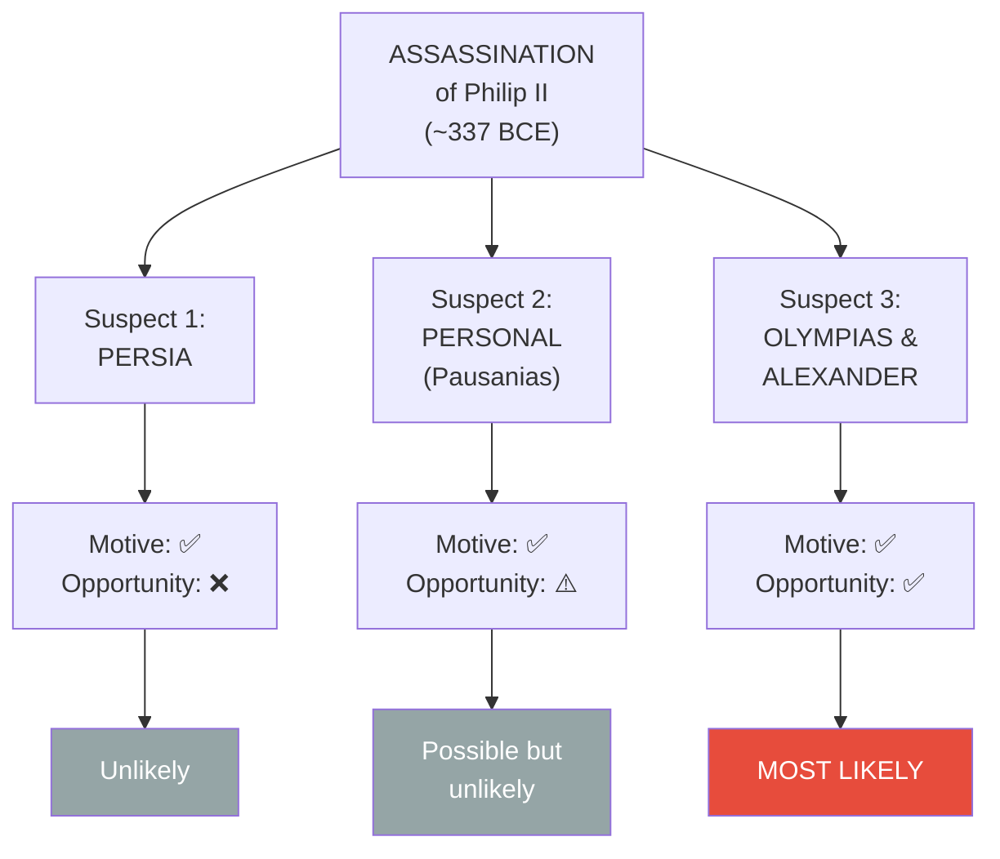

# The Greatness of Philip II of Macedon

> Prof. Jiang reframes the story of Greek civilisation's spread across the world. The standard account credits Alexander the Great — but Alexander inherited the world's most disciplined army from his father, Philip II of Macedon. Philip took a kingdom that was poor, weak, and perpetually divided, and through military innovation, institutional meritocracy, and diplomatic cunning transformed it into the dominant power in Greece. Two thought experiments set the stage: why do we celebrate sons who expand empires over fathers who build them? And why do poor, hungry nations keep conquering rich, complacent ones? Philip's life answers both questions — and his assassination on the eve of his greatest campaign raises a mystery that points directly at his own family.

---

## The Question

*How did Philip II transform Macedon — one of the poorest, weakest, most divided kingdoms in the Greek world — into the supreme military power that conquered all of Greece? And why does history celebrate his son Alexander instead?*

Prof. Jiang's answer: Philip was the true genius — a builder of institutions, a military revolutionary, and a selfless leader who put vision above personal glory. History's preference for Alexander reflects a recurring bias toward dramatic expansion over quiet construction.

## Key Concepts at a Glance

| Concept | One-line summary |
|---------|-----------------|
| **Father-Son archetype** | Builders (fathers) are more impressive than expanders (sons) — but sons get the credit |
| **Three qualities of great leaders** | Strategic/visionary, innovative/revolutionary, disciplined/selfless |
| **Poor-conquers-rich dynamic** | Hungry, united nations overwhelm wealthy, divided ones |
| **Sacred Band of Thebes** | 300 volunteer elite soldiers whose methods Philip learned — then destroyed |
| **Meritocracy** | Promoting by talent, not birth — Philip's institutional revolution |
| **Parmenion** | Philip's greatest general, risen from lower nobility — exemplar of meritocracy |
| **Anvil and hammer** | Phalanx pins the enemy; cavalry strikes from behind |
| **Sarissa (pike)** | Extended spear replacing shorter Greek spears — longer reach, lighter load |

---

## Thought Experiment 1: The Father and the Son

*Prof. Jiang opens with a business analogy that becomes the lecture's central analytical framework — and a lens for the entire course.*

A father starts with nothing and builds a business worth $10 million. His son inherits that business and expands it to $10 billion. Society celebrates the son because $10 billion is spectacular — but the father's achievement is far more impressive. <b style="color: #e74c3c">Building from nothing requires genius. Expanding an inheritance requires aggression.</b>

*The father-son archetype maps directly onto Philip II (builder) and Alexander the Great (expander). The same pattern recurs with Muhammad, Genghis Khan, Napoleon, and Julius Caesar.*

The father succeeds because he possesses three qualities that define all <b style="color: #2980b9">great men of history</b>:

- **Strategic to the point of visionary** — they have a vision of what the world should be and a long-term plan to achieve it
- **Innovative to the point of revolutionary** — they understand that changing the world means destroying the status quo, even through bloody wars
- **Disciplined to the point of selfless** — they are fanatically obsessed with achieving the vision; personal happiness is irrelevant

The son succeeds differently: he takes risks nobody else will, he promotes friends and loyalists rather than talent, and he is driven by <b style="color: #e74c3c">insecurity</b> — the need to prove he is greater than his father, because everyone says he only succeeded because of what his father built.

> [!tip] Course-Level Framework
> This father-son pattern will reappear throughout the Civilization series. Every world-changing conqueror Prof. Jiang examines — Genghis Khan, Muhammad, Napoleon, Julius Caesar — shares the father's three qualities. And every successor who inherits and expands exhibits the son's personality: aggressive, loyalty-driven, glory-seeking.

---

## Thought Experiment 2: Why Poor Nations Conquer Rich Ones

*The second framework explains a historical paradox: Macedon was the weakest power in Greece, yet it conquered everyone.*

Prof. Jiang compares North Korea and South Korea. On paper, South Korea should dominate forever — it is rich, technologically advanced, and democratic. But South Korea has the world's lowest fertility rate (0.8), deepening inequality, and an increasingly anti-family culture. North Korea is poor — but its people are <b style="color: #27ae60">hungry, united, and obedient</b>.

*The same dynamic that could allow North Korea to overtake South Korea explains how Macedon conquered Athens, Sparta, and Thebes — all of which had exhausted themselves through the Peloponnesian War.*

North Korea doesn't even need to invade — it just needs to threaten invasion, and South Korea will pay to avoid war. Meanwhile, North Korean soldiers gain combat experience in places like Ukraine, and the military gap narrows. <b style="color: #2980b9">This is exactly how Macedon operated:</b> a hungry, united nation exploiting the divisions and complacency of wealthy Greek city-states that had decimated each other during the Peloponnesian War.

---

## Macedon's Three Structural Problems

*Before Philip, Macedon was trapped by geography, enemies, and internal division.*

Philip was born in 383 BCE into a kingdom defined by weakness. At this time, the Greek world had three major powers — Athens (still wealthy with the best navy despite losing the Peloponnesian War), Sparta (historically the best land army), and Thebes (now the dominant military power because Sparta and Athens had bled each other dry). Macedon, far to the north, was nobody's concern.

*Macedon was a kingdom under siege from every direction — geography, neighbours, and its own royal family all worked against stability.*

- **Geography:** The kingdom was split between agricultural lowlands in the south and ungovernable mountains in the north. Mountain tribes raided the farms; when pursued, they retreated to their hills where nobody could follow
- **Hostile neighbours everywhere:** Thrace to the east, Illyria to the west (warlike mountain people in fortresses), Thessaly to the south (famous cavalry), and the three Greek powers — plus Persia across the sea, which had once subjugated Macedon as a province
- **Succession crises:** The king had many wives, producing many sons. Each son was backed by a different foreign power that wanted Macedon weak and divided

---

## Philip's Education in Thebes (369–365 BCE)

*A teenage hostage learns the secrets of the world's best army — from people who never imagined he would use them against everyone.*

After Macedon lost a war to Thebes, Philip was sent as a hostage — standard practice to ensure the defeated kingdom didn't rebel. But as a prince, he was treated well. He could do whatever he wanted. What he wanted was to understand why Thebes was the dominant military power in Greece.

> [!example] The Sacred Band of Thebes — Special Forces of the Ancient World
> - 300 soldiers who spent every day training to be the best fighters alive — essentially ancient Special Forces
> - Unlike Sparta, where only aristocrats could be soldiers, these were **volunteers from common families** — anyone with talent could join
> - First lesson Philip learned: <b style="color: #27ae60">with proper training, anyone can become a great soldier — not just the rich</b>
> - The Thebans used the Sacred Band in an **oblique order** — slanting their formation to place the 300 against the enemy's best troops
> - In a fair fight, the Sacred Band always destroyed the opposing elite. The psychological shock broke the entire enemy formation
> - Philip would eventually destroy the Sacred Band at Chaeronea — the student killing the teacher
> **The lesson:** The most dangerous knowledge transfer in history. Thebes educated Philip because nobody believed Macedon could ever become a threat — the same reason nobody takes North Korea seriously today.

From the Theban generals, Philip extracted three military principles that would form the foundation of his revolution:

| Principle | What it means | Why it mattered |
|-----------|--------------|-----------------|
| **Mobility** | Army marches faster than any opponent | Reach a city before reinforcements arrive; siege and destroy before help comes |
| **Coordination** | Different unit types work together | Enables the **anvil and hammer** — phalanx locks enemy in place, cavalry strikes from behind |
| **Flexibility** | Strategy adapts to the specific enemy | Different combinations of archers, shield bearers, phalanx, and cavalry for each situation |

No army in Greece had all three. Philip resolved to build one that did.

---

## Philip's Military Revolution

*Becoming regent in 359 BCE, Philip inherited a military that was, in his words, a complete joke. He rebuilt it from nothing.*

### Building a Meritocracy

Philip's first and most controversial reform was institutional: he made the cavalry — traditionally reserved for nobility — equal in status to the infantry, made up of common peasants. In this new system, <b style="color: #27ae60">performance in battle determined promotion, not birth</b>.

The exemplar was **Parmenion** — born into the lower nobility, he became Philip's greatest general and trusted partner. Philip allowed Parmenion to lead armies independently, something unheard of when kings jealously guarded military command. Philip trusted Parmenion because Philip had extraordinary judgement of character — he knew whom to trust, and he knew how to deploy people where they would be most effective.

### Building Fanatical Loyalty

Philip understood that a professional army (soldiers who train full-time rather than farm part-time) requires a different kind of loyalty. He built it through three methods:

*Philip's loyalty was earned, not demanded — he fought harder, risked more, and suffered more than any of his soldiers.*

- **He fought in the front lines.** Philip was not watching battles from behind — he was leading charges. He lost an eye. He carried many battle wounds and scars. His soldiers saw their king bleed alongside them.
- **He ate and drank with common soldiers.** This told them they were equals and friends. It gave ordinary troops a chance to voice complaints directly — an open channel to power that inspired deep trust.
- **He communicated his vision and praised talent.** Philip gave speeches explaining his dream: make Macedon great, conquer Greece, conquer Persia. He used those speeches to publicly praise exemplary soldiers like Parmenion — making them feel valued and inspiring others to earn the same recognition.

Because Philip fought alongside his men, he also refused to waste their lives on reckless strategies. <b style="color: #2980b9">He was as strategic as he was brave</b> — every engagement was calculated, every risk weighed. This made his soldiers even more loyal: they knew their king valued their lives.

### Reinventing the Phalanx

The traditional Greek phalanx was powerful but slow — heavily armoured soldiers locked together in a wall. Philip made three changes that transformed it:

| Innovation | Problem it solved | Effect |
|-----------|-------------------|--------|
| **Lighter armour** | Phalanx too slow; couldn't march fast or manoeuvre | Greater mobility — faster marches, quicker battlefield repositioning |
| **Sarissa (long pike)** | Without heavy armour, soldiers are vulnerable | Enemies can't reach the phalanx — the pike wall keeps them at distance |
| **Shield bearers (hypaspists)** | Flanks exposed without heavy armour | Mobile units on the flanks protect the phalanx and adapt to threats in real time |

The result: the Macedonian phalanx was lighter, faster, longer-reaching, and more adaptable than any Greek army. When it met traditional Greek phalanxes, it destroyed them.

> [!abstract] Philip's Combined Arms Doctrine
> Philip's real genius was not any single innovation but the **combination**: a lighter phalanx that pins the enemy in place (the **anvil**) while disciplined cavalry sweeps around to strike from behind (the **hammer**). Shield bearers on the flanks provide adaptive protection. Archers soften targets before contact. Different enemies require different combinations of these units — and Philip adjusted his approach for every battle. No army in the Greek world had ever coordinated multiple unit types this effectively.

---

## The Strategist-Diplomat

*While building his army, Philip needed to survive — and he did it through diplomacy as much as warfare.*

Philip understood that <b style="color: #2980b9">smart diplomacy is just as powerful as the world's best military</b>. The Greek world at this time was Game of Thrones — every city-state at every other's throat. Sparta hated Thebes. Thebes hated Athens. None of them could cooperate against an outside threat. Philip exploited this brilliantly:

- **Alliance-building:** He played enemies against each other, forming alliances with one power to neutralise another — buying time while his army trained
- **Marriage diplomacy:** He married the princesses of other nations, binding kingdoms to him through family ties
- **Bribery:** Once he had resources, he bribed the aristocracies of Athens and other cities to support him — or at least to stay neutral
- **Strategic patience:** He secured his northern frontier first (defeating Thrace and Illyria) before moving south, ensuring no enemy could strike from behind

### The Gold of Amphipolis

In 347 BCE, Philip conquered the city of Amphipolis — and with it, its gold mines. This was the turning point. With gold, Philip could:

- **Pay professional soldiers** who trained full-time instead of farming
- **Buy aristocratic loyalty** within Macedon's fractious nobility
- **Build national infrastructure** — roads, projects that improved the economy and stirred national pride
- **Bribe foreign elites** to support Macedon's expansion

Gold transformed diplomacy from survival tactic to offensive weapon.

---

## The Battle of Chaeronea (338 BCE) — The Student Destroys the Teacher

*The decisive battle that united Greece under Macedon — and featured the most poignant irony of Philip's career.*

By 338 BCE, Philip was ready to move south. The only forces opposing him were Thebes and Athens — and both were weakened. Thebes's great generals had all died. Athens's aristocracy had largely been bribed to support Philip, so Athens didn't field its best army.

At the Battle of Chaeronea, Philip's modern, disciplined, loyal army crushed both opponents. He destroyed the entire Athenian army and nearly destroyed Thebes. But when it was clear Thebes was losing, <b style="color: #e74c3c">the Sacred Band of Thebes — the 300 elite soldiers who had once taught Philip everything he knew — made their last stand</b>. They sacrificed themselves so the rest of the Theban army could escape.

The Sacred Band was destroyed forever. The institution that had created Philip's military education was annihilated by the army it had inspired.

*The most poignant arc of Philip's career: the force that educated him became the force he destroyed. The Sacred Band's sacrifice was both heroic and tragic — they faced an army built on their own principles.*

Philip now controlled all of Greece. His next target was Persia.

---

## The Assassination — A Murder Mystery

*On the eve of his greatest campaign, Philip was killed by his own bodyguard. Three suspects, but only one with both motive and opportunity.*

Philip sent his trusted general Parmenion into Persian-controlled Anatolia (modern Turkey) with a 10,000-man vanguard to begin liberating the Greek colonies there. Philip was about to follow and lead the full invasion — but his daughter's wedding came first.

At the wedding, Philip brought only one bodyguard. He wanted to appear approachable before the assembled diplomats and dignitaries. That bodyguard — **Pausanias** — drew his sword and stabbed Philip in the ribs, killing him. The other bodyguards immediately killed Pausanias.

Philip died around 337 BCE, in the prime of his life, with perhaps thirty or forty years of conquest ahead of him. His son Alexander, barely eighteen or nineteen, became king.

> [!example] The Three Suspects — Evaluated by Motive and Opportunity
> - **Persia:** Motive — yes (Philip was about to invade). Opportunity — no. How could Persia infiltrate Philip's inner court? Philip was an excellent judge of character. And if Persia feared Philip, the easier move was funding Sparta or Athens to attack him. **Verdict: unlikely.**
> - **Personal grudge (Pausanias):** The story is that Philip and Pausanias were lovers, Philip found someone else, Pausanias became jealous. Possible — but Philip was famously perceptive about the people around him. **Verdict: possible but unlikely.**
> - **Olympias and Alexander:** Both had motive — if Philip died, Alexander became king at the height of Macedon's power, with the world's greatest army and Persia as an easy target. Philip had many wives and could produce new heirs; Alexander's violent temperament may have made Philip doubt him as successor. Both had opportunity — they were family, in constant contact with the bodyguard corps. **Corroboration:** After Pausanias was killed, Olympias built a monument to him.
> **The lesson:** When evaluating a murder, look at motive and opportunity. Only Olympias and Alexander had both. The next lecture will present further evidence that Alexander wanted his father dead.

*Prof. Jiang's detective-story evaluation: only Alexander and Olympias satisfy both criteria for a murder — the motive to benefit and the access to execute.*

---

## Philip's Conquest Timeline

```mermaid
flowchart LR
    A["383 BCE<br/>Philip born"] --> B["369-365 BCE<br/>Hostage in Thebes<br/>(learns military secrets)"]
    B --> C["359 BCE<br/>Becomes regent<br/>(brother dies)"]
    C --> D["359-350s<br/>Army reforms +<br/>Northern frontier secured"]
    D --> E["347 BCE<br/>Conquers Amphipolis<br/>(gold mines)"]
    E --> F["356 BCE<br/>Alexander born<br/>(son by Olympias)"]
    F --> G["338 BCE<br/>Battle of Chaeronea<br/>(conquers all Greece)"]
    G --> H["~337 BCE<br/>Assassinated at<br/>daughter's wedding"]
    style A fill:#2980b9,color:#fff
    style G fill:#27ae60,color:#fff
    style H fill:#e74c3c,color:#fff
```

*Philip's life compressed: from royal hostage to master of the Greek world in just over two decades — cut short by assassination on the verge of his greatest campaign.*

---

## Connections

**Builds on:**
- [[08 - Rat Utopia and the Peloponnesian War]] — The Peloponnesian War bled Athens, Sparta, and Thebes dry, creating the power vacuum Philip exploited. The Rat Utopia dynamic (wealthy societies decaying from within) explains why these once-great powers couldn't resist a hungry, unified Macedon
- [[10 - The Trial of Socrates and Plato's Allegory of the Cave]] — Greek intellectual culture continued flourishing even as political power shifted north to Macedon; the tension between philosophy and power persists

**Sets up:**
- [[12 - The Tyranny of Alexander the Great]] — Alexander is the "son" archetype personified: aggressive, glory-seeking, promoting loyalty over talent, driven by insecurity about proving himself greater than Philip. The disciplined army Philip built will compensate for Alexander's strategic recklessness — but the institution cannot survive the leader's ego forever

---

## The Takeaway

This lecture establishes two analytical frameworks that recur throughout the Civilization series. The father-son archetype — builders vs. expanders, institution-creators vs. inheritors — will reappear with Genghis Khan, Muhammad, Napoleon, and Julius Caesar. The poor-conquers-rich dynamic, grounded in the North Korea/South Korea thought experiment, explains a pattern visible across millennia: wealthy societies grow unequal, divided, and complacent, while poor societies remain hungry, unified, and dangerous.

Philip II himself is the lecture's argument made flesh. He learned from the best (the Sacred Band of Thebes), built a meritocratic institution that promoted talent over birth (Parmenion), invented a combined-arms military doctrine decades ahead of his time (the sarissa phalanx, shield bearers, anvil-and-hammer cavalry), and held it all together through personal sacrifice — fighting in the front, eating with common soldiers, losing an eye for his kingdom. He was a strategist, an innovator, and a diplomat simultaneously.

The deepest irony: the very army Philip built to conquer Persia would do so — but under his son's name. Alexander would ride Philip's institutional achievement to glory, and history would remember the son while forgetting the father. Prof. Jiang's challenge to the class is to recognise the pattern: the person who builds the system rarely gets the credit. The person who inherits and expands it does.
