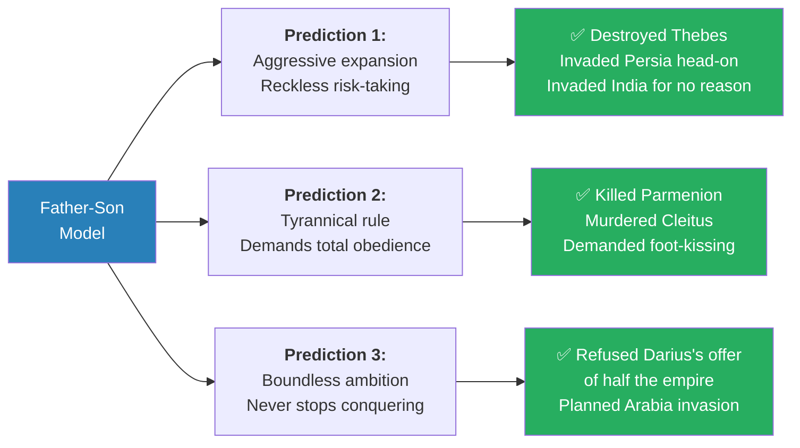
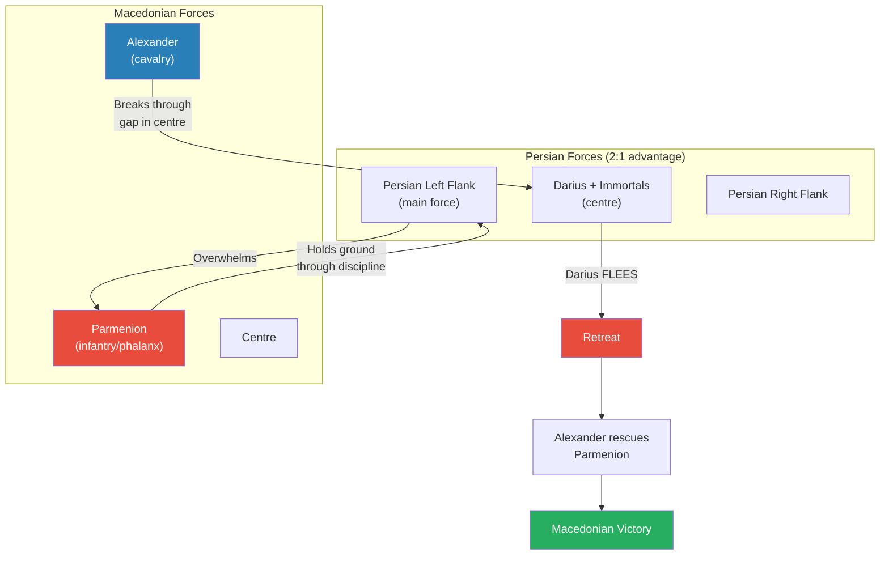
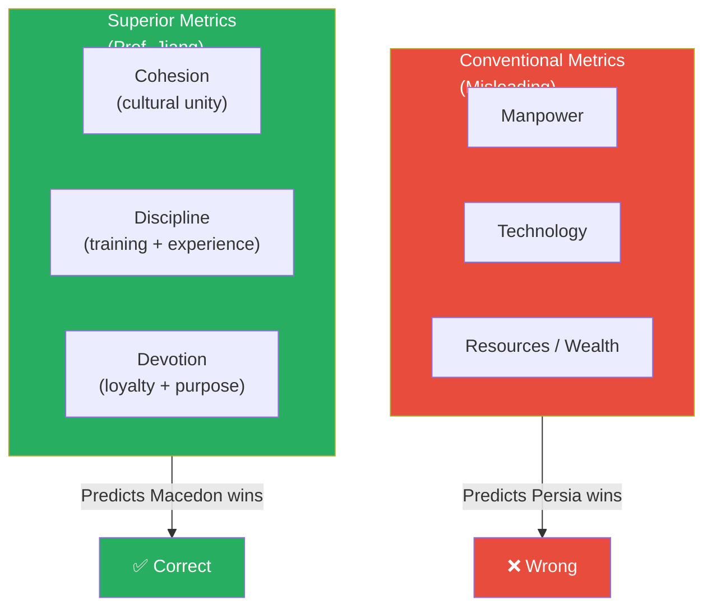
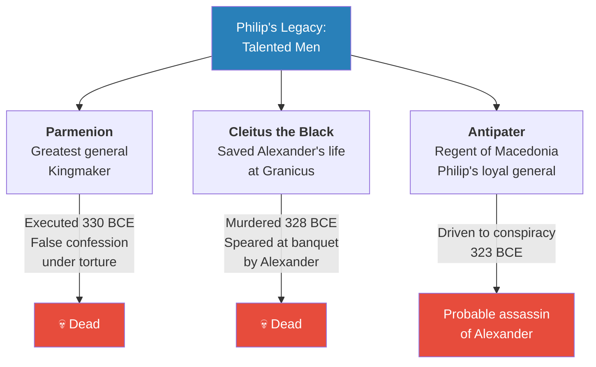
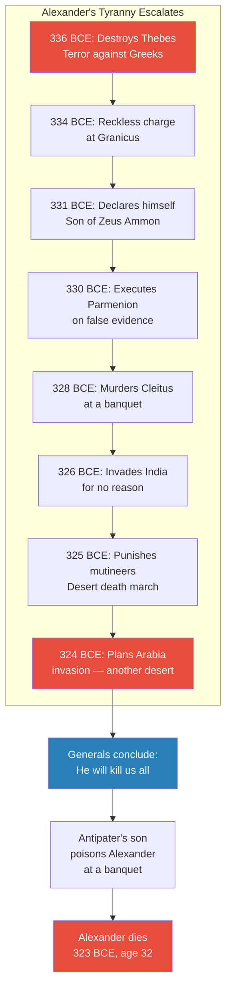

# The Tyranny of Alexander the Great

> Prof. Jiang takes the Father-Son analytical model from Lecture 11 and turns it into a prediction engine. If the model is correct, Alexander should exhibit three traits: reckless expansion, tyrannical demand for obedience, and boundless ambition. The historical record confirms all three — Alexander destroyed Thebes to terrorise Greece, conquered Persia through personally brave but strategically reckless battles, declared himself son of Zeus Ammon, systematically eliminated every talented man his father promoted, and forced his exhausted army into India for no strategic reason. He was probably poisoned by his own generals at age 32. Yet his conquests accidentally created the Hellenistic world, which merged Greek culture with Judaism and gave birth to Christianity. The Son's tyranny changed the world — but not in the way the Son intended.

---

## The Question

*Can an analytical model predict the life of a historical figure — and if it can, what does that tell us about how power works?*

Prof. Jiang's answer: the Father-Son archetype from Lecture 11 generates three predictions about Alexander that map precisely onto his reign. This is both a historical argument and a lesson in how to build and test explanatory models.

## Key Concepts at a Glance

| Concept | One-line summary |
|---------|-----------------|
| **Three predictions** | Aggressive expansion, tyrannical obedience, boundless ambition — all confirmed |
| **Cohesion-discipline-devotion** | The real metrics for military superiority — not manpower, technology, or wealth |
| **Tribal vs. Imperial armies** | United tribal forces (Macedon, Mongols, Arabs) consistently defeat fragmented empires |
| **Temple of Zeus Ammon** | Alexander declares himself son of God — renouncing Philip as father |
| **Elimination of talent** | Parmenion executed, Cleitus murdered, Antipater driven to conspiracy |
| **The accidental legacy** | Ungovernable conquests forced generals to invent and spread Greek culture → Christianity |

---

## The Prediction Model

*Prof. Jiang doesn't just narrate Alexander's life — he predicts it before telling it, using the Father-Son model from Lecture 11.*

The Father (Philip) was a builder: good judgment, promoted talent, selfless discipline. The Son (Alexander) inherits the enterprise and should exhibit the mirror-opposite traits:

*All three predictions generated by the Father-Son model are confirmed by Alexander's historical record — the model both explains and predicts.*

- <b style="color: #2980b9">Prediction 1 — Aggressive expansion:</b> Alexander will take risks Philip never would. He'll fight head-on battles against numerically superior forces on enemy terrain with no retreat option
- <b style="color: #2980b9">Prediction 2 — Tyrannical obedience:</b> Alexander will demand total loyalty. He'll purge talented men promoted by his father because they counter his authority and remind everyone who really built the machine
- <b style="color: #2980b9">Prediction 3 — Boundless ambition:</b> Alexander will never stop. No conquest will satisfy him because his insecurity — the whisper that *everything you've achieved was your father's work* — can never be silenced

> [!abstract] Testing the Model
> | Criterion | Application |
> |-----------|-------------|
> | **Does it explain?** | Yes — the model illuminates Alexander's motivations (insecurity, glory-seeking) and behaviour (purging talent, self-deification) |
> | **Does it predict?** | Yes — all three predictions match the historical record precisely |
> | **Should we be sceptical?** | Yes — Prof. Jiang warns against confirmation bias: "Is it possible that we are blinded by our prejudice and maybe we are being unfair to Alexander?" |

---

## The Bloody Succession

*Philip's assassination in 336 BCE triggers a crisis that reveals Alexander's and Olympias's ruthlessness — and the loyalty of Philip's men.*

### [0:08] Philip's Controversial Remarriage

Two years before his death, Philip married Cleopatra Eurydice — and this was political dynamite for two reasons:

- **She was Macedonian.** Philip's previous wives were foreign marriages for diplomacy. If Eurydice bore a son, that son would be considered more legitimate than Alexander (whose mother Olympias was Epirote)
- **Her connection to the military leadership.** Eurydice's relative was Attalus, a powerful general, whose father-in-law was Parmenion — the greatest general in Macedonia and effective partner to Philip

At the wedding, Attalus gave a toast: *"I pray that Macedon will soon have a legitimate heir."* A direct insult to Alexander — implying he was not truly legitimate.

> [!example] The Succession Crisis of 336 BCE
> - Philip is assassinated by his own bodyguard — the motive is never established
> - Olympias immediately kills Cleopatra Eurydice, her daughter, and her infant son — eliminating all rival claimants
> - Attalus, fearing for his life, prepares to rebel
> - Parmenion faces a choice: support his son-in-law Attalus, or support Alexander
> - Parmenion chooses Alexander out of loyalty to Philip's memory — and kills Attalus himself
> - Alexander becomes king at age 20
> **The lesson:** Parmenion's loyalty was to the institution Philip built, not to any individual. He sacrificed his own son-in-law to maintain stability. This makes Alexander's later betrayal of Parmenion all the more damning.

<b style="color: #e74c3c">Two things become clear from this event:</b>
- Olympias and Alexander are willing to kill anyone — including possibly Philip himself — to secure power
- Parmenion is completely loyal to Alexander, having proved it by killing his own family member

---

## The Destruction of Thebes

*Alexander pacifies Greece not through diplomacy but through terror — setting a pattern for his entire reign.*

When Philip died, rebellions erupted across Greece: Athens, Thebes, Sparta, and the Illyrians in the north all saw opportunity. Alexander's response:

- Destroyed the Illyrian opposition with a lightning campaign in the north
- Marched against Thebes before Athens or Sparta could send promised reinforcements
- Laid siege to Thebes and destroyed the city completely
- <b style="color: #e74c3c">Massacred all the men and enslaved all the women</b>

This was unprecedented. Greeks did not do this to Greek cities. When Sparta defeated Athens in the Peloponnesian War in 404 BCE, Sparta simply asked Athens to promise not to cause trouble again. What Alexander did to Thebes was, in Prof. Jiang's words, "like basically setting off a nuclear bomb."

The result: the Greeks were pacified by fear, but permanently committed to overthrowing Alexander when opportunity arose. <b style="color: #e74c3c">Alexander chose terror over loyalty</b> — exactly as the Son archetype predicts.

---

## The Persian Campaign

*Alexander launches the invasion of Persia — completing his father's dream but with a recklessness Philip would never have tolerated.*

### [0:16] Memnon of Rhodes and the Road Not Taken

The Persian Empire was a confederation: provincial governors (satraps) were responsible for their own defence. Darius III, the King of Kings, initially dismissed Alexander as a 20-year-old upstart.

But Darius had one brilliant advisor: <b style="color: #2980b9">Memnon of Rhodes</b>, a Greek mercenary who understood Greek warfare. Memnon proposed a war of attrition:

- Don't fight Alexander's army directly — it's the best in the world
- Burn the crops and starve his troops
- Bribe Athens and Sparta to rebel in Alexander's rear
- Once he's overextended, he must retreat — war over, at minimal cost

The satraps refused because this strategy required destroying their own property. They chose direct confrontation instead.

> [!tip] The Pattern of Luck
> Memnon of Rhodes set sail for Greece to unite Athens and Sparta against Alexander — and then died of illness. With his death, Persia lost its only strategist who understood the enemy. Alexander's career was marked by extraordinary luck at critical moments.

### [0:18] The Battle of Granicus (334 BCE)

The first major engagement. Alexander charged the front lines personally, was knocked down by a satrap, and was about to be killed when <b style="color: #27ae60">Cleitus the Black</b> rushed in and cut off the attacker's arm, saving Alexander's life.

Two men now had the greatest claim on Alexander's gratitude:
- **Parmenion** — who made him king by killing Attalus
- **Cleitus the Black** — who saved his life in battle

Both were Philip's men, promoted for talent. Alexander would kill them both.

### [0:21] Issus (333 BCE) and Gaugamela (331 BCE)

Both battles followed the same pattern:

*In both Issus and Gaugamela, Parmenion absorbed the main Persian assault through sheer discipline while Alexander's cavalry punched through to Darius — who fled both times.*

- Darius committed his main force against Parmenion on the left
- Parmenion, outnumbered and nearly overwhelmed, held his ground through extraordinary discipline
- Alexander's cavalry found a gap in the centre and charged toward Darius
- <b style="color: #e74c3c">Darius fled — in both battles</b> — and the Persian army collapsed
- Alexander then rescued Parmenion and routed the remaining forces

Before Gaugamela, Darius offered Alexander half the Persian Empire as a peace settlement. Alexander refused. He wanted everything.

### [0:25] Rethinking Military Analysis

Prof. Jiang argues historians use the wrong metrics to evaluate military campaigns:

*Conventional metrics predicted Persian victory; Prof. Jiang's framework of cohesion, discipline, and devotion correctly predicts Macedonian dominance.*

| Metric | Persia | Macedon |
|--------|--------|---------|
| **Cohesion** | Multicultural empire, troops don't share language, units fight independently | Shared Macedonian culture, coordinated units |
| **Discipline** | Expensive armour but few recent battles — empires don't fight often | 30 years of continuous warfare under Philip — battle-hardened |
| **Devotion** | Loyalty based on payment — mercenary motivation | Loyalty based on love — soldiers fought alongside leaders who'd won them countless victories |

This framework applies beyond Alexander. Prof. Jiang notes the same pattern recurs with Muhammad, Genghis Khan, and Tamerlane — <b style="color: #2980b9">tribal armies with cohesion, discipline, and devotion consistently conquer imperial armies</b>, then devolve into civil war once they become empires themselves.

> [!abstract] Alexander as Strategist — An Evaluation
> | Dimension | Assessment |
> |-----------|-----------|
> | **Personal courage** | Extraordinary — charged front lines, fought hand-to-hand |
> | **Battle tactics** | Effective cavalry charges, but relied on Parmenion's infantry discipline for survival |
> | **Strategic judgment** | Poor — outnumbered on enemy terrain with no retreat; Philip would have negotiated |
> | **Risk management** | Reckless — sacrificed men for personal glory rather than strategic gain |
> | **Verdict** | Great soldier, poor strategist. His army's superiority (built by Philip) won despite his strategy, not because of it |

---

## The God-King Transformation

*In Egypt, Alexander crosses a psychological threshold — he renounces Philip as his father and declares himself the son of God.*

### [0:32] The Temple of Zeus Ammon

After conquering Egypt without resistance — the Egyptians hated Persian rule and welcomed Alexander as a liberator — Alexander did something that alarmed his soldiers:

- He disappeared into the desert for weeks, travelling to the **Temple of Zeus Ammon** at the Siwa Oasis
- Zeus Ammon was a synthesis of the highest Greek god (Zeus) and the highest Egyptian god (Ammon) — the supreme deity of the known world
- At the temple, Alexander was told that <b style="color: #e74c3c">Philip was not his real father — his true father was Zeus Ammon</b>
- Alexander returned to his army and demanded they acknowledge him as the son of God — like Heracles and Dionysus

The practical consequence: Alexander now required anyone entering his presence to **kiss his feet** — the Persian custom of prostration (proskynesis). The Macedonian army, with its tradition of equality between soldiers and officers, recoiled.

<b style="color: #e74c3c">This was the pivot point.</b> By renouncing Philip, Alexander struck at the very foundation of his legitimacy. His soldiers followed him because of Philip's legacy — and now Alexander was telling them Philip didn't matter. Growing discontent rippled through the ranks, particularly among Philip's old guard: Parmenion, Cleitus the Black, and others who remembered a different kind of leadership.

---

## The Elimination of Philip's Men

*Alexander systematically destroyed every talented figure his father promoted — confirming the Son archetype's darkest prediction.*

*Every man Philip promoted for talent — the very men who made Alexander's conquests possible — was eliminated by the Son who owed them everything.*

### [0:36] The Execution of Parmenion (330 BCE)

After Gaugamela, with Darius dead and the Persian Empire conquered, Alexander turned on the man most responsible for his victories.

The chain of events:
- A minor conspiracy against Alexander was discovered among officers
- An officer informed Parmenion's son **Philotas** about the plot, expecting him to warn Alexander
- Philotas, drunk and dismissive, forgot to pass on the warning
- When the plot was uncovered, Philotas was arrested and tortured — not for participating, but for failing to report it
- Under torture, Philotas confessed that his father Parmenion was involved — despite no evidence whatsoever

> [!example] Two Interpretations of Parmenion's Death
> - **The generous interpretation:** Alexander didn't want Parmenion dead but felt he had no choice — having killed the son, the father might seek revenge. It was tragic but pragmatic
> - **The likely interpretation:** Alexander had always been jealous of Parmenion's legitimacy and popularity. Younger officers who wanted to climb the ranks needed the old guard removed. The "conspiracy" may have been fabricated specifically to implicate Philotas and thereby justify killing Parmenion
> - Regardless of motive, the result was the same: an assassin was sent, and Parmenion was killed
> - With Parmenion dead, no one in the army had the authority or moral standing to restrain Alexander
> **The lesson:** When the last person who can say "no" to a leader is eliminated, tyranny becomes absolute. Parmenion's death was the point of no return.

### [0:40] The Murder of Cleitus the Black (328 BCE)

With Parmenion gone, Cleitus the Black inherited the role of most senior Philip-era officer — and therefore the most dangerous man to Alexander.

Alexander's move: exile Cleitus by assigning him to a distant posting with a small force. Everyone understood this was political banishment. Before Cleitus was due to leave, a banquet was held:

- Both men got drunk
- Cleitus accused Alexander of betraying the Macedonians — adopting Persian customs, promoting Persian officers, turning his back on the culture that made him great
- Then Cleitus said the one thing Alexander could not bear: *"Everything you've achieved, Alexander — it's because of your father. This is not you."*
- Alexander lunged at Cleitus, but bodyguards restrained him and removed his sword
- Prof. Jiang notes the bodyguards' preparedness: *"This makes us think he's been doing this a lot"* — Alexander regularly got drunk and turned violent
- Cleitus was dragged from the room but forced his way back in to continue the argument
- Alexander grabbed a spear and hurled it at Cleitus, killing him instantly

<b style="color: #e74c3c">The two men most responsible for Alexander's victories — the man who made him king and the man who saved his life — were now both dead by his order.</b>

### The Pages' Conspiracy

Shortly after Cleitus's murder, a real assassination plot emerged. During a boar hunt, a young page killed the boar before Alexander — violating the Persian custom that the king takes the first kill. Alexander beat the page severely. That night, the pages conspired to stab Alexander in his sleep.

The plan failed because Alexander went out drinking and didn't return until after the pages' shift ended. The conspiracy was discovered, the pages were executed — but at their trial, they publicly accused Alexander of being a tyrant.

---

## The Indian Campaign and the Breaking Point

*Alexander pushes his army into territory with no strategic value — and finally, his soldiers refuse.*

### [0:44] The Invasion of India (326 BCE)

Prof. Jiang contrasts the reasons for invading Persia with the reasons for invading India:

| | Persia | India |
|---|--------|-------|
| **Wealth** | Enormously wealthy | Unknown |
| **Threat** | Had invaded Greece — existential threat | Had never threatened anyone in the Greek world |
| **Revenge** | Possibly responsible for Philip's assassination | No grievance |
| **Knowledge** | Well-known territory | Completely unknown geography and climate |
| **Strategic value** | Enormous | None |

There was no rational reason to invade India. Alexander forced his army into modern-day Pakistan, won victories there, but his soldiers had had enough. They were far from home, exhausted, drenched by monsoon weather, and saw no end to the wars.

<b style="color: #e74c3c">The army mutinied.</b> They refused to fight. For the first time, Alexander had to yield.

But he punished them:
- Killed all the leaders of the mutiny — every soldier who spoke up on behalf of their comrades
- Forced the army to march home through a desert rather than the safer original route — many died of dehydration and starvation

---

## The Death of Alexander (323 BCE)

*The tyrant's generals conclude he must die — because eventually, he will kill them all.*

*A timeline of Alexander's escalating tyranny — each step eliminated restraint, until the generals had no choice but to act first.*

Back in Babylon, Alexander was already planning his next campaign: the invasion of Arabia — a desert with nothing worth conquering, but Alexander needed to be first. Meanwhile:

- He was replacing Macedonian soldiers with more obedient Persians — "persianizing" the army
- Antipater, the general governing Macedonia, had a falling out with Olympias
- Alexander summoned Antipater to Babylon to settle matters — and Antipater knew what had happened to Parmenion and Cleitus

The probable sequence:
- Antipater and the senior generals concluded Alexander would eventually kill them all
- At a banquet, Antipater's son — who served as Alexander's cupbearer — put poison in his drink
- Alexander began vomiting and left the room
- The cupbearer brought a feather laced with more poison to "help" Alexander vomit
- Alexander was so physically tough he survived for several more weeks before dying in bed

Alexander died in 323 BCE, age 32, having conquered Egypt, Mesopotamia, Iran, Afghanistan, and Pakistan in just ten years.

---

## The Accidental Legacy

*Alexander's conquests were never meant to create a new civilisation — but they did, because his generals had to govern what he'd conquered.*

> [!example] From Tyranny to Christianity — The Unintended Chain
> - Alexander's boundless ambition created an ungovernable empire spanning multiple civilisations
> - His generals, inheriting this territory, needed a way to legitimise their rule
> - Their solution: invent and spread **Greek culture** (Hellenism) as a unifying force
> - Greek culture spread across the Mediterranean, the Near East, and Central Asia
> - In the Levant, Greek culture encountered and merged with **Judaism**
> - From this fusion, a new idea emerged: **Christianity**
> - Christians came to see Alexander as part of God's plan — a tyrant, yes, but a necessary instrument
> **The lesson:** The most consequential outcomes of power are often the ones no one intended. Alexander wanted personal glory; he accidentally created the cultural conditions for the world's largest religion.

*The causal chain from Alexander's tyranny to Christianity — entirely unintended, entirely consequential.*

---

## Connections

**Builds on:** [[11 - The Greatness of Philip II of Macedon]] — the Father-Son model is now tested as a prediction engine; every quality Philip embodied (judgment, meritocracy, selflessness) is inverted by Alexander (recklessness, tyranny, vanity)

**Sets up:** [[13 - Aristotle and the Greek Legacy]] — the next lecture examines what Alexander's generals did with the territory they inherited: the spread of Greek culture, the birth of the Hellenistic world, and the intellectual legacy that shaped Western civilisation

**Recurring themes:**
- **Father-Son archetype** ([[11 - The Greatness of Philip II of Macedon]]) — Alexander as the definitive Son: aggressive, insecure, glory-driven
- **Hubris** ([[09 - Aeschylus, Sophocles, and Euripides as Prophets of Democracy]]) — Alexander's self-deification as the ultimate expression of hubris
- **Tribal vs. Imperial armies** — the cohesion-discipline-devotion framework will recur with Muhammad, Genghis Khan, and Tamerlane
- **Poor-conquers-rich dynamic** ([[11 - The Greatness of Philip II of Macedon]]) — Macedon's tribal army defeating Persia's imperial forces

---

## The Takeaway

This lecture is as much about analytical method as about Alexander. Prof. Jiang demonstrates that a good model doesn't just explain the past — it predicts the future. The Father-Son archetype, constructed abstractly in Lecture 11, generates three specific predictions about Alexander's reign, and all three are confirmed by the historical record. That's the hallmark of a powerful analytical framework.

The deeper lesson is about the mechanics of tyranny. Alexander didn't wake up one morning and decide to be a tyrant. The process was incremental: first terror (Thebes), then self-deification (Zeus Ammon), then the elimination of anyone who could say no (Parmenion, Cleitus), then escalating demands (India, Arabia). Each step removed a restraint, making the next step easier. By the end, the only option left was assassination.

Yet the greatest irony remains: Alexander's tyranny — his boundless, irrational ambition to conquer everything — accidentally created the conditions for the Hellenistic world and, through it, Christianity. The Son wanted glory. He got something far larger and stranger than glory. He got a legacy he would never have understood.
