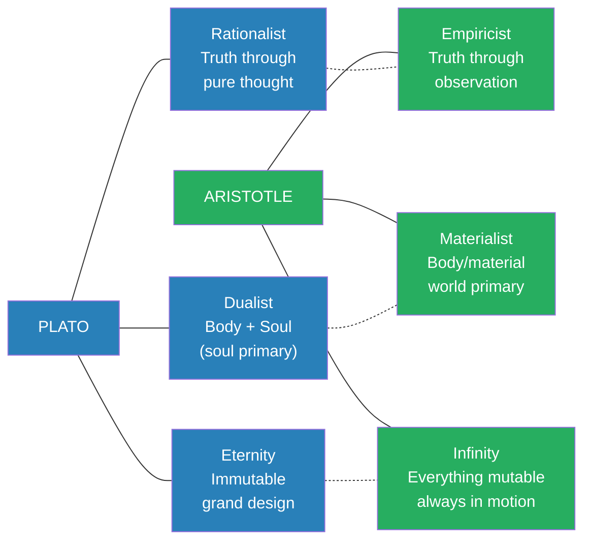
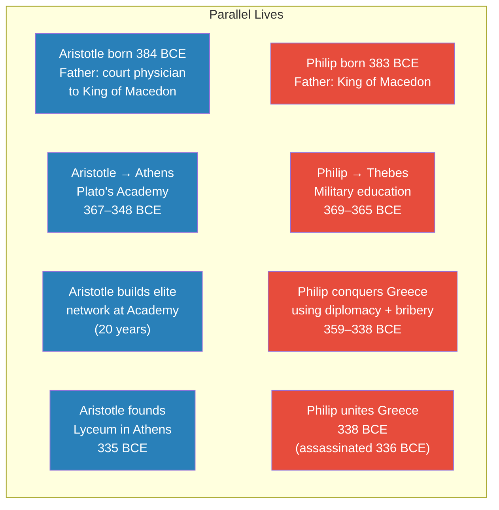
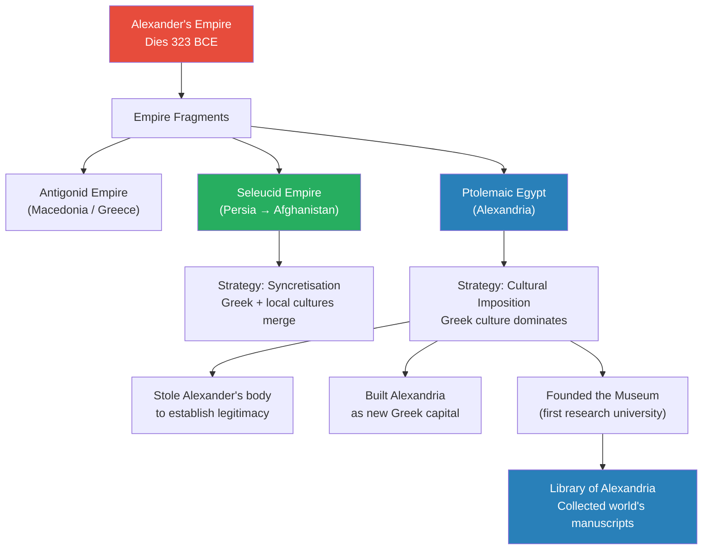
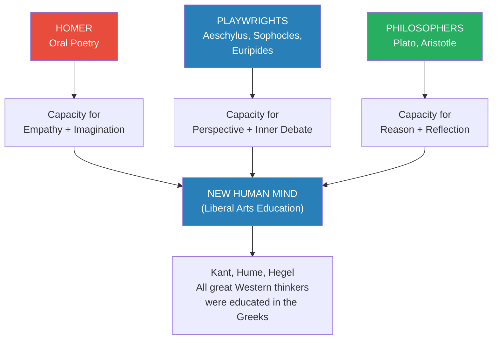
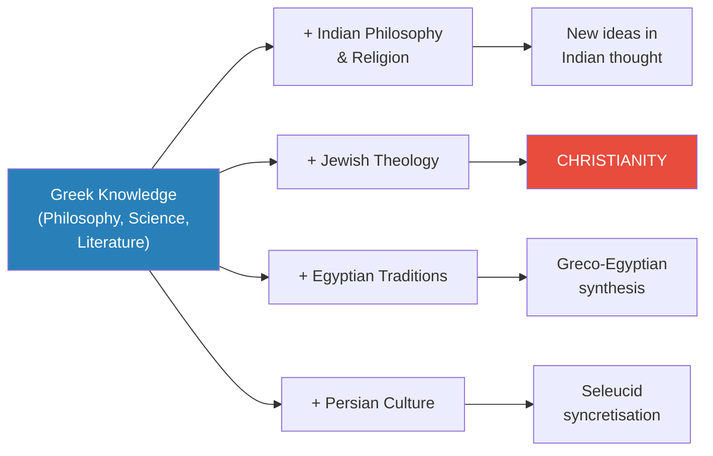

# Aristotle and the Greek Legacy

> Prof. Jiang closes the Greek arc of the Civilization series with a provocative reinterpretation of Aristotle — not as an original philosopher, but as a political censor who standardised Greek knowledge for the Macedonian empire-building project. Three paradoxes (no original texts, impossibly broad range, worldview opposed to his teacher Plato) are resolved through this lens. The lecture then synthesises the entire Greek intellectual legacy: a new human mind, the standardisation of knowledge, and the syncretisation that would produce Christianity.

---

## Timeline: From Macedon to the Hellenistic World

*The key dates connecting Aristotle, Philip, Alexander, and the Hellenistic project — from their shared childhood through the fragmentation that spread Greek culture across the known world.*

---

## The Three Paradoxes

*Prof. Jiang opens by framing Aristotle as one of history's most mysterious figures — famous, yet deeply paradoxical.*

Aristotle is universally ranked alongside Plato as one of the greatest philosophers in human history. Yet three things about him don't add up:

| Paradox | The Problem |
|---------|------------|
| **No original texts** | We have no text we believe Aristotle personally wrote — unique for a figure of his stature |
| **Impossible range** | ~200 works attributed to him spanning politics, poetics, ethics, rhetoric, physics, metaphysics, biology — no analogue in history |
| **Opposed his teacher** | After 20 years studying under Plato, Aristotle developed a worldview in direct conflict with Plato's |

The conventional explanation for the missing texts — that Aristotle wrote his own works but they were lost, and students reconstructed them from memory — has long been accepted. But Prof. Jiang pushes further: the paradoxes point to something more fundamental about who Aristotle really was.

---

## Plato vs. Aristotle — The Great Divide

*Two worldviews that cannot harmonise. Prof. Jiang deliberately oversimplifies to illuminate the structural conflict that defined Western philosophy for 2,000 years.*

### Plato's Universe

For Plato, God is the <b style="color: #2980b9">Form of the Good</b> — eternal, perfect, immutable. The Form of the Good emanates ideal concepts (justice, beauty, reason), which manifest as ideal Forms (the perfect horse, the perfect woman). Everything in our world is a <b style="color: #e74c3c">shadow copy</b> of these perfect Forms.

- Our reality is an imitation — not truly real
- Art and poetry are imitations of imitations — the most distant from truth
- Only through <b style="color: #2980b9">pure thought and mathematics</b> can you approach the Form of the Good
- The circle example: you can never draw a perfect circle in the material world (edges always remain at microscopic level) — but you can imagine one, because imagination accesses the realm of Forms

### Aristotle's Universe

For Aristotle, God is the <b style="color: #2980b9">Prime Mover</b> — like the Big Bang, an initial force that set everything in motion. Everything is change, everything is movement.

- What is <b style="color: #27ae60">good</b> is moving toward your purpose (<b style="color: #2980b9">telos</b>)
- What is <b style="color: #e74c3c">bad</b> is moving away from your purpose
- A soldier's purpose is to fight and win wars — fighting well is good, running away is bad
- When you achieve your purpose with excellence (<b style="color: #2980b9">arete</b>), you achieve flourishing (<b style="color: #2980b9">eudaimonia</b>)

### The Three Key Differences

*These three oppositions — rationalist/empiricist, dualist/materialist, eternity/infinity — define the fundamental divide in Western philosophy.*

- <b style="color: #2980b9">Rationalist vs. Empiricist:</b> Plato believes truth is accessed through pure thought and mathematics. Aristotle believes truth is accessed through observation and inductive logic — "I see one woman wearing a dress, then another, then a third, so I induce that dresses distinguish women from men"
- <b style="color: #2980b9">Dualist vs. Materialist:</b> Plato separates body and soul, with the eternal soul being what truly matters. Aristotle focuses on the body — there may or may not be a soul, but it doesn't matter; what happens to the body matters
- <b style="color: #2980b9">Eternity vs. Infinity:</b> For Plato, there is a grand design and nothing that changes affects it. For Aristotle, almost nothing is immutable — everything will change, and there is no stopping the motion

This conflict between Plato and Aristotle will inform the philosophical debate for all of Western civilisation. The rationalist camp (Descartes) and the empiricist camp (David Hume) will go back and forth between these two extremes for millennia.

> [!abstract] Theory Evaluation: Plato vs. Aristotle for Empire-Builders
> | Dimension | Plato | Aristotle | Political Utility |
> |-----------|-------|-----------|-------------------|
> | **On conquest** | Conquering the material world is pointless — it's all shadow | Fulfilling your purpose through conquest is the highest good | Aristotle wins |
> | **On hard work** | Working in the material world is imitating an imitation | Working hard toward your purpose produces arete and eudaimonia | Aristotle wins |
> | **On soldiers** | A soldier's body is irrelevant; cultivate the soul through math | A soldier who fights with excellence achieves flourishing | Aristotle wins |
> | **On art/culture** | Art is evil — imitation of imitation, furthest from truth | Art captures and transmits knowledge of the world | Aristotle wins |

---

## Aristotle as Censor — The Controversial Thesis

*Prof. Jiang's central argument: Aristotle was not an original philosopher but a political partner of Philip II, working to create a Greek identity for the Macedonian empire.*

### The Biographical Evidence

*When you place Aristotle's and Philip's lives side by side, the parallels are striking — same age, same court, simultaneous education abroad, and converging timelines.*

The circumstantial evidence:

- **Same age, same court:** Aristotle (384 BCE) and Philip (383 BCE) grew up together — Aristotle's father was the king's personal physician, Philip was the king's son
- **Simultaneous education abroad:** Both sent away as teenagers to acquire knowledge — Aristotle to Athens for philosophy, Philip to Thebes for military innovation. Like 1980s China sending its brightest to America for science
- **20-year network:** Plato's Academy was the Harvard/Oxford of the ancient world. For 20 years, Aristotle befriended the most powerful people in Athens — the perfect middleman for Philip's diplomatic campaigns
- **The bribery connection:** Demosthenes, the great Athenian statesman who most opposed Philip, publicly accused Philip of bribing Athenian aristocrats. If Philip was bribing Athenians, who was the go-between? Aristotle — the man connected to every powerful Athenian family
- **The Lyceum's timing:** Philip united Greece in 338 BCE. Aristotle founded the Lyceum in Athens in 335 BCE — three years later. Coincidence, or the next phase of a political project?

> [!example] The Anecdote of Demosthenes
> - Demosthenes was the most vocal opponent of Macedonian expansion in Athens
> - In public speeches, he warned: "Philip tried to bribe me — and I know he's bribing all my opponents"
> - He argued Philip was "a menace to democracy" and Athens must resist
> - Yet Athens offered surprisingly little resistance to Philip's conquests
> - One explanation: Philip's gold, distributed through someone with 20 years of relationships in Athens's most powerful circles
> **The lesson:** The most effective form of conquest is not military — it's buying the enemy's elite. And for that, you need a trusted intermediary embedded in their world.

### The Pan-Hellenic Project

Philip's vision was to unite all Greeks under a common identity — the <b style="color: #2980b9">Pan-Hellenic project</b>. The problem: this common Greek identity didn't actually exist. Greeks in Asia Minor were more Persian than Greek. A Spartan had little in common with an Ionian.

Someone needed to define what "being Greek" meant by standardising and systemising Greek knowledge into an encyclopaedia — a series of textbooks covering politics, ethics, rhetoric, science, biology, and philosophy. <b style="color: #27ae60">This is what the Lyceum was for.</b> Aristotle, with his students, was building the intellectual infrastructure of a Greek identity.

This wasn't unusual — conquerors throughout history have done the same. Standardising knowledge was the best way to co-opt intellectual elites and demonstrate legitimacy. Without it, the conquered would see you as a barbarian conqueror with no right to rule.

### Why Aristotle's Philosophy Had to Oppose Plato's

The political logic is straightforward:

- **If you're Alexander and you go to Plato:** "I want to conquer the world." Plato says: "What's the point? It's all shadow. You're conquering an illusion. Do more math. Stop killing people."
- **If you're Alexander and you go to Aristotle:** "I want to conquer the world." Aristotle says: "Everything is in motion toward its purpose. Your purpose is to unite the world. The more you conquer, the more good you bring. Your soldiers achieve arete through fighting. Excellence leads to eudaimonia."

<b style="color: #e74c3c">Plato's philosophy is anti-imperial.</b> It tells conquerors their work is meaningless. <b style="color: #27ae60">Aristotle's philosophy is a governing ideology.</b> It tells conquerors their work has cosmic purpose.

> [!tip] The Core Reframe
> Prof. Jiang isn't saying Aristotle's ideas are wrong — he's saying they weren't Aristotle's. The ideas were synthesised from across the Greek intellectual world and packaged into a coherent system that happened to serve Macedonian political interests perfectly. The question isn't whether Aristotelian philosophy is valuable (it clearly is), but whether it should be attributed to one man's genius or to a political project's needs.

---

## The Hellenistic World After Alexander

*Alexander's unexpected conquests transformed the Pan-Hellenic project into something far larger — and the successor kingdoms each handled the challenge differently.*

### The Successor Kingdoms

*The three successor kingdoms adopted different strategies for governing their vast territories — but all relied on Greek knowledge as the basis of cultural authority.*

Alexander's empire was never supposed to be this big. Philip's Pan-Hellenic project envisioned uniting the Greek world — mainland Greece, the Aegean islands, and Greek settlements in Asia Minor. Alexander went far beyond, conquering Egypt, Persia, Afghanistan, and reaching Pakistan. This was unplanned and unexpected — and it created a governance crisis. How do you impose a coherent identity on territories stretching from the Mediterranean to the Hindu Kush?

After Alexander's death, the empire split into three major successor states, each with distinct cultural challenges:

- **Antigonid Empire** (Macedonia/Greece): The Greek homeland
- **Ptolemaic Egypt**: Founded by Ptolemy, one of Alexander's generals
- **Seleucid Empire**: Founded by Seleucus, stretching from Mesopotamia to Central Asia

### Two Strategies for Governing

The **Seleucid** approach was <b style="color: #27ae60">syncretisation</b> — Greek culture merged with deeply established local Persian cultures. The Persians had thousands of years of sophisticated civilisation; Greek rulers couldn't simply erase it. Instead, Greeks adapted to local customs while maintaining their identity through Aristotle's standardised Greek knowledge. Two different cultures came together and coalesced into something new.

The **Ptolemaic** approach was <b style="color: #2980b9">cultural imposition</b>. Egypt had thousands of years of proud civilisation — and unlike Persia, had a history of rebelling against foreign rulers. The Persians had tried tolerance and cultural openness with Egypt, and the Egyptians rebelled against them repeatedly. Ptolemy decided not to repeat that mistake — he would impose Greek cultural superiority to demonstrate that the new rulers were more divine than the Egyptians themselves:

1. **Stole Alexander's body** from Babylon and brought it to Egypt — Egyptians saw Alexander as a god, so possessing his body established divine legitimacy
2. **Built Alexandria** as a new Greek capital city — housing Alexander's body and serving as the centre of Greek power
3. **Founded the Museum** (Mouseion) — the world's first research university, bringing together the greatest Greek scholars to continue Aristotle's project of standardising Greek knowledge

> [!example] How the Library of Alexandria Acquired the Great Plays
> - Ptolemaic representatives went to Athens requesting the original manuscripts of Aeschylus, Sophocles, and Euripides
> - The Athenians refused — these playwrights were like gods, their manuscripts sacred
> - The Egyptians offered a deal: "We'll borrow them, have our scribes copy them, and return the originals. As guarantee, here's 15 talents of silver" — roughly a billion dollars in modern terms
> - The Athenians, who had never seen such wealth, agreed
> - The Egyptians took the manuscripts, placed them in the Library of Alexandria, and told Athens: "Keep the money"
> - The goal was to make Alexandria — not Athens — the intellectual capital of the Greek world
> **The lesson:** Knowledge is power, and the control of original sources is the ultimate form of cultural authority. Ptolemy understood that whoever owns the texts owns the civilisation.

The Pan-Hellenic project (uniting Greeks) now became the <b style="color: #2980b9">Pan-Hellenistic project</b> (spreading Greek culture globally). This is why Greek culture is still with us today — not because of Athens or Sparta, but because Macedonian generals needed a governing ideology for territories stretching from Egypt to Afghanistan.

---

## Resolving the Three Paradoxes

*Prof. Jiang returns to the opening paradoxes and shows how the "censor" thesis dissolves each one.*

| Paradox | Resolution (Censor Thesis) |
|---------|--------------------------|
| **No original texts** | Aristotle didn't write anything original — he synthesised other thinkers' work and had students copy it into manuscript form |
| **Impossible range** | He was capturing the essence of Greek knowledge for an encyclopaedia meant for global dissemination — not expressing personal curiosity |
| **Opposed his teacher** | Plato's philosophy was politically useless for conquerors; Aristotle's framework was engineered to serve empire |

Prof. Jiang acknowledges three alternative possibilities:

1. **The partner theory** (Prof. Jiang's preferred): Aristotle actively worked with Philip, supervising students to create the Greek identity encyclopaedia — like a modern professor whose students do the research while he directs the project
2. **The co-option theory**: Aristotle was genuinely an independent philosopher, but after Alexander's death, the successor generals adopted him as a symbol of Macedonian cultural superiority because it was politically convenient
3. **The fiction theory**: Aristotle is partly or wholly a construction of Library of Alexandria scholars who synthesised diverse Greek works and attributed them to a single legendary figure to enhance the library's prestige

A student raises the question of Aristotle's father being a physician — wouldn't that naturally produce a materialist worldview? Prof. Jiang agrees it's possible, but notes: if Aristotle was so fundamentally opposed to Plato's dualism because of his materialist upbringing, why did he study under Plato for 20 years?

---

## The Three Legacies of the Greeks

*Whether or not Aristotle was original, the influence of Greek civilisation is not debatable. Prof. Jiang synthesises three lasting legacies that close the Greek arc of the series.*

### Legacy 1: A New Way of Being Human

*Three successive Greek innovations — oral poetry, theatre, and philosophy — each added a new cognitive capacity, together producing the liberal arts mind that shaped all subsequent Western thought.*

The Greeks created a progression of mental capabilities:

- **Homer** was an oral bard reciting epic poetry for hours at a time. When you listened, you entered his world — you *became* Achilles or Odysseus. You felt their rage, their grief, their glory. This created the capacity for <b style="color: #2980b9">empathy and imagination</b>
- **The playwrights** (Aeschylus, Sophocles, Euripides) changed the format: instead of one narrator speaking to the audience, characters faced each other in dialogue and debate. Now you had to step back and *judge* the story — switching perspectives to understand different characters, weighing competing claims. This created the capacity for <b style="color: #2980b9">perspective and inner debate</b> — and, critically, an inner monologue
- **The philosophers** (Plato, Aristotle) took the dialogue from the stage and put it on the page. Now you read it alone, with the benefit of time — you could reason through the arguments without the influence of crowds or actors' emotions. You could return to the same words across your lifetime, judging them purely on their own merit. This created the capacity for <b style="color: #2980b9">reason and reflection</b>

When you combine all three — empathy, perspective, and reason — you get what we call <b style="color: #27ae60">a liberal arts education</b>. Every major Western thinker (Kant, Hume, Hegel) shared one thing in common: they all read the Greeks. That was their education.

### Legacy 2: The Standardisation of Knowledge

The Library of Alexandria didn't just collect texts — it made them teachable and accessible to the entire world:

- **Standardised texts:** Different versions of Homer existed across the Greek world. The version we read today was established by Library of Alexandria scholars who chose one authoritative text
- **Created commentaries:** Teacher handbooks explaining how to teach the material — like annotated editions with pedagogical guidance
- **Added apparatus:** Footnotes, chapter divisions, page numbers, codices, indexes — the entire infrastructure of scholarship that we take for granted today
- **Translated and disseminated:** Made Greek education exportable beyond native Greek speakers
- **Result:** Anyone, anywhere — including us in China today — can read Homer, Aeschylus, and Plato, even though we are not culturally Greek. The texts are not just preserved but *comprehensible* across cultures and centuries

This was the lasting contribution of the Pan-Hellenistic project: making Greek education <b style="color: #27ae60">available and accessible to anyone in the world</b>. The Library of Alexandria was not merely a storehouse of scrolls — it was a factory for producing a universal education system.

### Legacy 3: A Global Revolution Through Syncretisation

*Greek knowledge didn't just survive — it transformed every culture it touched. The most consequential syncretisation was with Jewish theology in the Levant, producing Christianity.*

As Greek knowledge spread through the Hellenistic world, it interacted with powerful local cultures. Through <b style="color: #2980b9">syncretisation</b>, entirely new forms of knowledge emerged:

- Greek philosophy + Indian religion → new developments in Indian thought
- Greek philosophy + Egyptian traditions → Greco-Egyptian cultural synthesis
- Greek philosophy + Persian culture → the Seleucid hybrid civilisation
- <b style="color: #e74c3c">Greek philosophy + Jewish theology → Christianity</b>

The most world-changing syncretisation happened in the Levant. When Greek concepts (logos, universal reason, the immortal soul) met Jewish monotheism (one God, covenant, messianic expectation), the result was Christianity — the idea that would "forever revolutionise human history." Christianity would not have been possible without the work attributed to Aristotle and the Pan-Hellenistic spread of Greek knowledge.

> [!tip] The Greeks as History's Most Creative Civilisation
> Prof. Jiang concludes that it is "perfectly fair to say the Greeks were the most influential and consequential civilisation of all time. They're certainly the most creative. No other civilisation even comes close to their creativity." Whether Aristotle was an original thinker or a political synthesiser, the Greek intellectual tradition he helped codify and spread remains the foundation of Western — and arguably global — civilisation.

---

## Connections

**Builds on:**
- [[11 - The Greatness of Philip II of Macedon]] — Philip's life directly parallels Aristotle's; the Pan-Hellenic project required an intellectual partner to create a Greek identity
- [[12 - The Tyranny of Alexander the Great]] — Alexander's unexpected conquests transformed the Pan-Hellenic project into the Pan-Hellenistic project, requiring a global cultural strategy

**Sets up:**
- [[14 - Hannibal Barca, Lucius Brutus, and the Triumph of Rome]] — the Greek legacy now passes to Rome, which will absorb Hellenistic culture and transmit it through its own empire

**Connects to earlier lectures:**
- [[07 - Homer's Iliad and the Birth of Greek Civilization]] — Homer as the first step in creating the Greek mind (empathy + imagination)
- [[09 - Aeschylus, Sophocles, and Euripides as Prophets of Democracy]] — the playwrights as the second step (perspective + inner debate)
- [[10 - The Trial of Socrates and Plato's Allegory of the Cave]] — Plato's Form of the Good and Allegory of the Cave are directly contrasted with Aristotle's Prime Mover
- [[08 - Rat Utopia and the Peloponnesian War]] — the internal Greek conflicts that weakened city-states and enabled Macedon's rise

---

## The Takeaway

This lecture accomplishes two things at once: it offers a provocative reinterpretation of Aristotle, and it synthesises the entire Greek arc of the Civilization series into a coherent legacy statement.

The Aristotle-as-censor thesis is deliberately controversial — Prof. Jiang is transparent about that, and he discusses multiple alternative explanations fairly. But its real value isn't whether it's historically "correct." The value is in the analytical habit it teaches: when you encounter a figure universally praised as a genius, ask who benefits from that reputation. Aristotle's philosophy perfectly served Macedonian imperial interests. That doesn't make the philosophy wrong, but it does reframe how we think about the relationship between ideas and power. Ideas don't exist in a vacuum — they are selected, promoted, and standardised by people with political needs.

The synthesis of the Greek legacy is the lecture's most enduring contribution. The three-step progression — Homer (empathy) → playwrights (perspective) → philosophers (reason) — is an elegant model for understanding how the liberal arts tradition was born and why it remains the foundation of higher education. And the claim that Christianity itself was a product of Greek-Jewish syncretisation places the entire Hellenistic project in world-historical context: the Greeks didn't just create philosophy; they created the conditions for the most influential religion in human history.

What remains open: Prof. Jiang claims the Greeks were "the most influential and consequential civilisation of all time" and "certainly the most creative." The coming lectures on Rome will test that claim — Rome may have been the greater transmitter and institutionaliser of Greek ideas, even if it was less original. The question of whether the builder or the spreader deserves more credit echoes the father-son archetype from Lecture 11.

With this lecture, Prof. Jiang closes the Greek arc and turns toward Rome — a civilisation that would inherit, transform, and transmit the Greek legacy to the modern world.
