# Iran's Strategy Matrix

> Prof. Jiang opens the Geo-Strategy series with a provocation: if Israel and the United States have overwhelming military dominance over Iran — superior technology, superior intelligence, superior firepower — why might Iran still win a war? The answer lies in asymmetrical warfare, a strategy where the inferior force wins by controlling the terms of engagement rather than matching the enemy's conventional power. Prof. Jiang builds a four-pronged framework he calls the Iran Strategy Matrix — unite the population, build alliances, win global opinion, weaken the enemy — and demonstrates through Operation True Promise how a seemingly "failed" military operation can accomplish all four strategic goals simultaneously.

---

## The Question

*If the most powerful military in human history cannot guarantee victory, what determines who wins a war — and what must Iran do from now until an invasion to survive?*

Prof. Jiang opens the first Geo-Strategy lecture not with a theory or a historical overview but with a provocation drawn from current events. On April 1, Israeli jets executed a precision strike on the Iranian embassy in Damascus, Syria, killing seven people including two commanders. The Canadian embassy sits right next to the Iranian embassy — and was untouched. That level of precision tells you something about the technology the Americans and Israelis possess. But technology alone does not explain how they knew those commanders would be there at that moment. That requires <b style="color: #2980b9">intelligence</b> — and intelligence comes in two forms:

- <b style="color: #2980b9">HUMINT (human intelligence)</b> — spies inside the embassy who reported the meeting would take place
- <b style="color: #2980b9">SIGINT (signals intelligence)</b> — electronic surveillance: listening to cell phones, tracking cars, monitoring locations

The Damascus strike was not an isolated event. In 2020, the United States assassinated General Qassem Soleimani — one of Iran's top military commanders — with a drone strike in Baghdad, Iraq. The Americans knew where he was, when he would be there, and how to reach him. The precision of the Soleimani assassination and the Damascus embassy strike together tell the same story: <b style="color: #e74c3c">the US-Israel alliance has complete military dominance over Iran</b>, in both technology and intelligence.

> [!example] The Damascus Embassy Strike (April 1)
> - Israeli jets launched a precision strike on the Iranian embassy in Damascus, Syria
> - Seven people killed, including two senior Iranian commanders
> - The Canadian embassy is immediately adjacent — it was completely untouched
> - The strike demonstrated extreme technological precision: the ability to hit one building while leaving its neighbour unscathed
> - It also demonstrated intelligence superiority: someone knew these commanders would be there at that exact time
> - The strike constituted an act of war — embassies are considered sovereign territory under international law
> - This followed the 2020 assassination of General Qassem Soleimani by American drone in Baghdad
> **The lesson:** The US-Israel alliance can reach Iranian targets anywhere, anytime. By every conventional measure, Iran is outmatched.

But here is the question that drives the entire lecture: does military dominance mean you will win the war?

Prof. Jiang's answer, developed over the next fifty minutes, is a resounding no. Military dominance is necessary but not sufficient. What determines victory is not who has the biggest guns but who controls how the war is fought — and whether the dominant power has the strategic flexibility to adapt when the inferior force refuses to play by conventional rules. Prof. Jiang believes Iran and Israel are committed to a war — possibly a ground invasion of Iran within two years — and his purpose in this lecture is to explain why Iran might survive it.

The lecture unfolds in three movements:

- **First**, Prof. Jiang establishes the principle of asymmetrical warfare and proves it works through the 2002 Millennium Challenge
- **Second**, he introduces the Iran Strategy Matrix — the four-pronged framework that governs everything Iran must do before an invasion
- **Third**, he demonstrates the framework in action by analysing Operation True Promise through all four strategic goals

The Q&A session then expands into discussions of rules of engagement, Israel as a regional empire, the role of Russia and China, and the three causes of imperial collapse.

---

## Key Concepts at a Glance

| Concept | One-line summary |
|---------|-----------------|
| **Asymmetrical warfare** | The inferior force wins by controlling the terms of engagement, not matching the enemy's firepower |
| **Iran Strategy Matrix** | Four goals Iran must accomplish simultaneously: unite population, build alliances, win global opinion, weaken enemy |
| **Hubris** | The fatal flaw of empires — refusing to adapt because acknowledging vulnerability feels like weakness |
| **Cost asymmetry** | Using cheap weapons ($20M drone swarm) to force the enemy to spend vastly more ($1B aircraft carrier) |
| **Military dominance** | Superiority in technology + intelligence (HUMINT and SIGINT) — necessary but not sufficient for victory |
| **Axis of Resistance** | Iran's first alliance layer: Shia militias, Hezbollah, Hamas, Houthis — shared interests, not controlled by Iran |
| **Strategic ambiguity** | Russia and China's deliberate refusal to openly support or oppose Iran — maintaining flexibility |
| **Rules of engagement** | Pre-war agreements among major powers about permissible weapons, tactics, and involvement levels |
| **Disproportionality** | Israel's doctrine of responding to any attack with vastly greater force — deterrence through fear |
| **Three causes of imperial collapse** | Overextension, debt, and civil unrest — all three happening simultaneously for the US |
| **Regional power hierarchy** | Without American empire: Germany dominates Europe, Israel dominates Middle East, Japan dominates East Asia |

---

## Why Does Asymmetrical Warfare Defeat Military Dominance?

*Prof. Jiang introduces the foundational principle of the entire Geo-Strategy series: the weaker side wins not by matching the stronger side's power but by refusing to fight on the stronger side's terms. This concept — <b style="color: #2980b9">asymmetrical warfare</b> — is the lens through which every subsequent lecture in the series must be understood.*

The concept is deceptively simple, and Prof. Jiang knows it. He begins not with a definition but with an analogy — one vivid enough that a classroom of high school students will remember it months later.

### The Dark Forest Analogy

Prof. Jiang turns to his student Jack and constructs an analogy that will recur throughout the series. Imagine Jack and Prof. Jiang are enemies who want to kill each other. Jack has armour and a machine gun. Prof. Jiang has nothing.

- In an open field, Jack wins every time — there is no contest
- But Prof. Jiang has lived in a dark forest for decades — he knows every tree, every path, every shadow
- If Jack follows him into that forest, the advantages reverse:
  - Prof. Jiang can set traps because he knows the terrain
  - He can play tricks because he understands the environment
  - He can choose when and where to engage — and when to disappear
- <b style="color: #27ae60">The inferior force wins by controlling the terms of engagement</b>
- Jack's armour and machine gun become liabilities in terrain they were not designed for
- The key principle: being forced to be inferior makes you more strategic, more creative, more adaptive — because you have no other choice

And here is the critical extension: Jack walks into the forest anyway. Everyone tells him not to. His advisors warn him. The terrain is wrong for his equipment, wrong for his doctrine, wrong for everything he has trained for. But Jack has a machine gun. Jack has armour. Jack does not care. <b style="color: #e74c3c">That is hubris</b> — and it is the reason empires lose to inferior forces again and again throughout history.

The analogy maps directly onto the Iran-US situation:

- **Jack** = the United States — overwhelming military hardware, unmatched technology, the most powerful armed forces in human history
- **The dark forest** = asymmetrical warfare — the terrain where Iran's knowledge, creativity, and willingness to fight unconventionally give it the advantage
- **Jack walking into the forest anyway** = the United States insisting on invasion despite evidence that asymmetrical tactics will be used against it

This is not a hypothetical. Prof. Jiang grounds the analogy in a real military exercise that proves asymmetrical warfare works — and proves that empires are too rigid to learn from it.

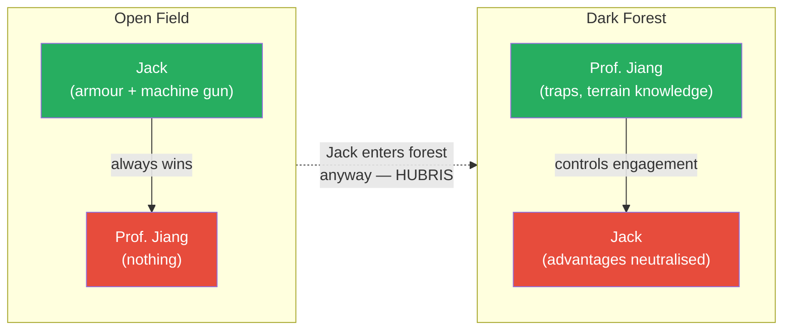

*In the open field, conventional superiority decides the outcome. In the dark forest — on terrain the inferior force controls — the equation reverses. Hubris is what makes the empire walk into the forest despite every warning.*

---

### The 2002 Millennium Challenge — Proof That Asymmetrical Warfare Works

Prof. Jiang's most important historical example in this lecture is not a war. It is a war game — and what it reveals about the American military's psychology is more damning than any battlefield defeat.

> [!example] The 2002 Millennium Challenge
> - In 2002, the US military ran a massive war simulation of a hypothetical invasion of Iran
> - They divided into two teams: Team USA and Team Iran
> - The American military is, in Prof. Jiang's words, "the most dominant, powerful military ever to exist in human history"
> - Iran is a comparatively poor country with vastly inferior conventional forces
> - In the first simulation, the Iran team used asymmetrical tactics: drone swarms, suicide boats charging aircraft carriers
> - The key insight: if you send a thousand boats at an aircraft carrier, you cannot stop all of them — and if one hits, the carrier sinks
> - Iran won the first simulation
> - The US military's response: they declared asymmetrical tactics "cheating" and banned them
> - In the second simulation — with asymmetrical warfare forbidden — the US won
> **The lesson:** The US military would rather change the rules of the game than change its doctrine. This is the defining example of imperial hubris.

This story is not just an anecdote for Prof. Jiang — it is the structural proof of his entire argument, and he returns to it repeatedly throughout the lecture. The Millennium Challenge is devastating because it is the US military testing *itself* and discovering its own weakness — and then choosing to ignore the discovery rather than fix it.

The exercise demonstrates two things simultaneously:

- <b style="color: #27ae60">Asymmetrical warfare defeats conventional military superiority</b> — even the most powerful military in human history lost when the inferior force controlled the terms of engagement
- <b style="color: #e74c3c">Empires are too inflexible to adapt</b> — when confronted with a strategy that defeats them, they do not learn from it; they ban it and pretend it does not exist

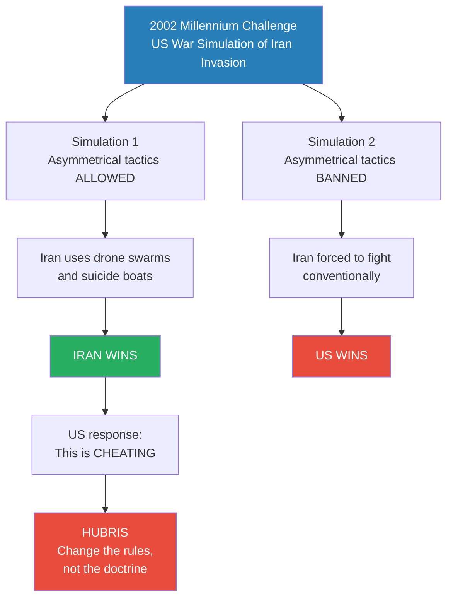

*The Millennium Challenge is Prof. Jiang's most important piece of evidence. It proves not only that asymmetrical warfare works, but that the American military's response to being defeated is to deny reality rather than adapt — the textbook definition of hubris.*

A student asks the obvious follow-up question: if the Americans know Iran will use asymmetrical warfare, should they not prepare for it and respond more strategically? Prof. Jiang's answer is blunt: they would not do that, and this is precisely why asymmetrical warfare is so effective against empires.

- The fatal flaw is not ignorance — it is psychology
- Empires cannot admit vulnerability
- They cannot acknowledge that an inferior force poses a genuine threat
- When asymmetrical tactics won the Millennium Challenge, the Americans did not study those tactics and develop counters
- They called it cheating — they changed the rules — they chose hubris over adaptation
- This is the same pattern that doomed the Americans in Vietnam, and the same pattern Prof. Jiang argues will doom them in Iran
- <b style="color: #e74c3c">Hubris is not stupidity — it is an inability to acknowledge vulnerability</b>
- The empire would rather change reality than change its doctrine

> [!tip] Core Insight
> Empires do not lose wars because their enemies grow stronger. They lose because hubris makes them inflexible. The dominant power refuses to adapt to asymmetrical tactics — and that refusal, not the challenger's military strength, is what determines the outcome.

---

### The Economics of Asymmetrical Warfare

Prof. Jiang extends the principle from tactics to economics, introducing <b style="color: #2980b9">cost asymmetry</b> — the financial dimension that makes asymmetrical warfare sustainable even for a poor country like Iran. The Dark Forest analogy explains *why* asymmetrical warfare works psychologically. Cost asymmetry explains why it works *economically* — and why a poor country can fight a rich one indefinitely.

The numbers are stark:

| Asset | Cost | Outcome |
|-------|------|---------|
| US aircraft carrier | ~$1 billion | One of the most powerful weapons on Earth |
| Drone swarm (1,000 real drones at $1,000 each) | ~$1 million | Can potentially sink the carrier |
| Decoy swarm (10,000 fake drones at $100 each) | ~$1 million | Overwhelms carrier's defences |
| **Total drone swarm cost** | **~$20 million** | **Destroys a $1 billion asset** |

- In <b style="color: #e74c3c">symmetrical warfare</b>, Iran sends its navy against an American aircraft carrier — the US destroys the entire Iranian navy instantly
- In <b style="color: #27ae60">asymmetrical warfare</b>, Iran sends a swarm of thousands of drones — real ones that explode and decoys that do not
- The carrier's defence systems cannot distinguish real from fake and cannot stop all of them
- If even one real drone gets through, the carrier sinks
- A $20 million investment destroys a $1 billion asset — a 50:1 cost ratio in Iran's favour
- This is why Iran can sustain a long war despite being a comparatively poor country — the economics of asymmetrical warfare favour the defender, not the attacker
- Every engagement drains the empire's resources faster than it drains the resistance's

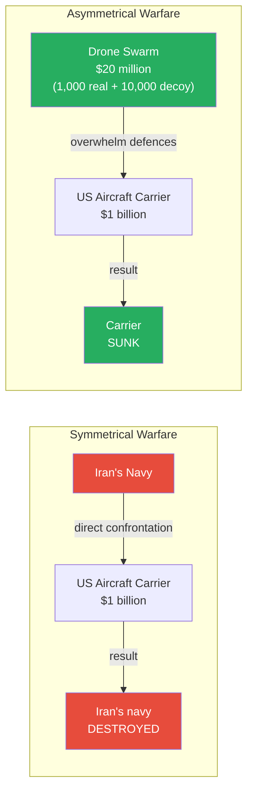

*In symmetrical warfare, the inferior force is annihilated. In asymmetrical warfare, a $20 million drone swarm sinks a $1 billion aircraft carrier. The economics make the strategy sustainable — even a poor country can afford to fight this way indefinitely.*

The genius of cost asymmetry, Prof. Jiang suggests, is that it turns the empire's greatest strength — its massive military budget, its expensive weapons systems, its technological sophistication — into a vulnerability. The more expensive your defences, the more it costs you every time the inferior force attacks. The cheaper the attack, the more often the inferior force can afford to launch one. Over time, the economics grind the empire down, even if every individual engagement looks like a defensive "success."

### The Full Cost Picture

Prof. Jiang walks through the specific dollar figures in detail, and the numbers are worth examining closely because they reveal why asymmetrical warfare is not merely a tactic but an economic strategy — one that makes prolonged conflict financially unsustainable for the dominant power:

| Weapon System | Cost | Role in Conflict | Who Benefits |
|---------------|------|-----------------|--------------|
| US aircraft carrier | ~$1 billion | Most powerful conventional naval weapon | US (in symmetrical war) |
| Real attack drone | ~$1,000 each | Explodes on impact — the actual threat | Iran |
| Decoy drone | ~$100 each | Does not explode — overwhelms defences by forcing interception of every target | Iran |
| Drone swarm (1,000 real + 10,000 decoy) | ~$20 million total | Can sink a $1 billion carrier — 50:1 cost ratio | Iran |
| Iran's Operation True Promise strike | $10-30 million | 300 drones and missiles launched at Israel | Iran |
| Israel's Iron Dome defence | $1 billion+ | Intercepted 99% of incoming projectiles | Debatable — Israel "won" the engagement but lost the economics |

- The critical insight is that <b style="color: #27ae60">even a "successful" defence is an economic defeat</b> for the dominant power
- Israel intercepted 99% of Iran's drones — and spent thirty to one hundred times more money doing so
- Every Iron Dome interceptor missile costs far more than the drone it destroys
- Iran can launch drone swarms repeatedly; Israel cannot afford to defend against them indefinitely
- The economics compound over time: ten drone swarms cost Iran $200-300 million but cost Israel $10 billion+ in defence
- <b style="color: #e74c3c">The defender bleeds money faster than the attacker</b> — the exact opposite of conventional warfare economics, where attacking is expensive and defending is cheap
- This is why Prof. Jiang calls cost asymmetry the economic engine of asymmetrical warfare — it makes the strategy financially sustainable for even a poor country like Iran

---

### Operation True Promise — The Theory in Action

Prof. Jiang now turns to a real-world event that demonstrates these principles are not theoretical. After the Damascus embassy strike, Iran responded with <b style="color: #2980b9">Operation True Promise</b> — a strike package of 300 drones and missiles fired at Israel.

Two competing narratives emerged immediately — and understanding which one is correct is the key to understanding everything that follows in the lecture.

- **Israel's claim:** 99% of drones and missiles were intercepted by the Iron Dome system — proof of Israeli technological superiority. The message: Iran cannot touch us
- **Iran's claim:** the attack was intentionally designed to be harmless — the goal was never to cause damage. The message: we chose restraint

Prof. Jiang argues that Iran's claim is more credible — and the cost data is the first piece of evidence for why:

- Iran's strike package cost an estimated $10-30 million
- Israel's defence against the strike cost at least $1 billion
- That is a <b style="color: #27ae60">cost ratio of 30:1 to 100:1 in Iran's favour</b>

> [!example] Operation True Promise — Cost Asymmetry in Action (2024)
> - After the Damascus embassy strike killed two Iranian commanders, Iran had to respond
> - Iran launched 300 drones and missiles at Israel
> - Israel claims 99% interception — celebrating Iron Dome's success
> - Iran claims the attack was designed to cause no casualties
> - Iran spent $10-30 million on the strike package
> - Israel spent at least $1 billion defending against it
> - Even if Israel intercepted everything, Iran forced its enemy to spend 30-100x more on defence than Iran spent on offence
> **The lesson:** From a military dominance perspective, the operation accomplished nothing. From an asymmetrical warfare perspective, it demonstrated that Iran can drain Israel's resources at a fraction of the cost.

But the cost asymmetry is only one dimension of why Operation True Promise matters. Prof. Jiang will demonstrate in the next section that the operation accomplished something far more important — it advanced all four goals of the Iran Strategy Matrix simultaneously. What looked like a military failure through the lens of conventional warfare was, through the lens of asymmetrical strategy, a comprehensive success.

The difference between the two assessments — military failure versus strategic success — is precisely the difference between symmetrical and asymmetrical thinking. An analyst who measures success by damage inflicted sees a failed operation. An analyst who measures success by strategic positioning sees an operation that advanced every one of Iran's pre-war objectives. Prof. Jiang's argument is that Iran is playing the second game, not the first — and that the Americans, trapped by hubris, cannot even see the second game exists.

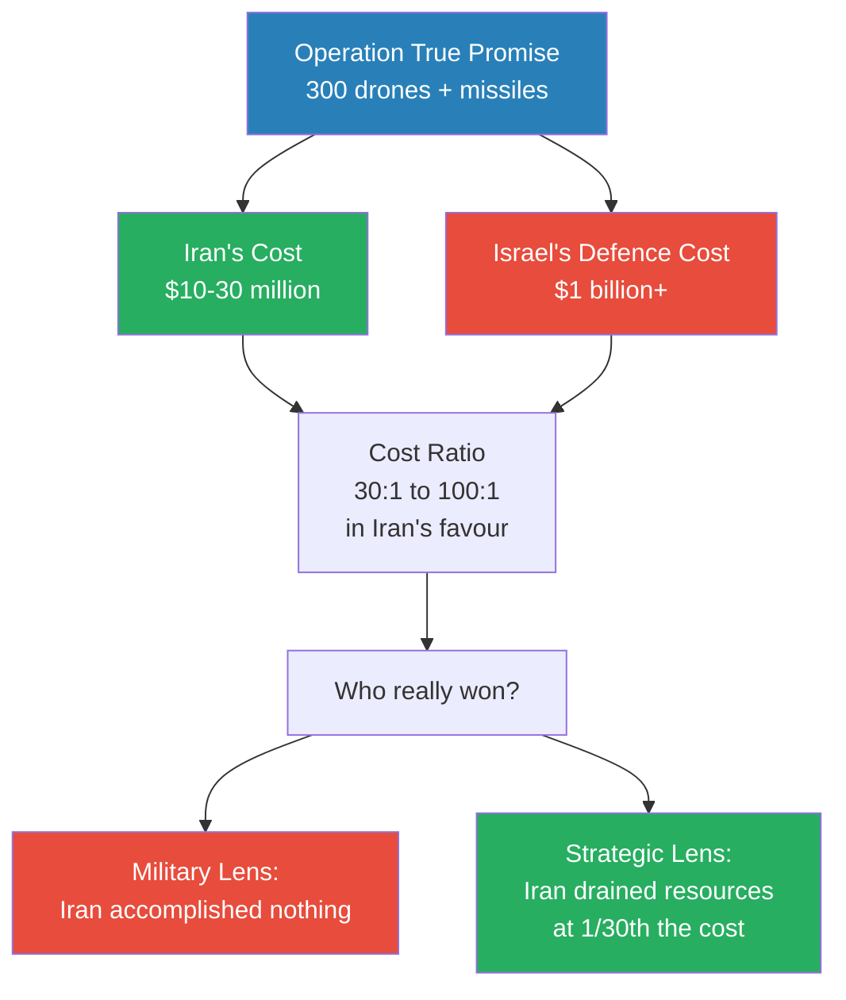

*Operation True Promise cost Iran a fraction of what it cost Israel to defend against — and this is the fundamental economics of asymmetrical warfare. The inferior force does not need to win battles; it needs to make battles ruinously expensive for the superior force.*

---

## The Vietnam Parallel

*Prof. Jiang does not mention Vietnam casually — he treats it as the single most important historical precedent for what will happen if the United States invades Iran. Every element of the Vietnam failure maps onto the projected Iran war: asymmetrical resistance, hubris-driven inflexibility, escalating costs, and domestic collapse.*

### Why Vietnam Matters for Iran

Prof. Jiang references the Vietnam War as the classic example of everything he has been describing — asymmetrical warfare defeating conventional superiority, hubris preventing adaptation, and the domestic consequences that follow.

- The Vietnamese were "clearly dominated" by the Americans in conventional military terms
- But the Vietnamese used extremely creative and flexible tactics — guerrilla warfare, tunnel systems, ambushes, and a willingness to absorb enormous casualties while wearing down the enemy's will
- The Americans insisted on their main military doctrine — refusing to adapt
- The result: massive protests, civil unrest in America, and ultimately a war that Prof. Jiang describes as pointless — "America accomplished nothing"

Vietnam matters to this lecture not just as a historical parallel but as a preview of what Prof. Jiang believes will happen if the United States invades Iran. The same pattern — hubris, inflexibility, asymmetrical resistance, domestic backlash — has played out before, and the professor argues it will play out again. The cycle is predictable because the psychology is predictable: empires behave the same way because dominance produces the same hubris regardless of the century or the continent.

### The Asymmetrical Warfare Spiral

The connection between asymmetrical warfare and domestic consequences is critical. When an empire fights an asymmetrical war, a predictable spiral unfolds:

- The war lasts longer than expected because the enemy refuses to fight on the empire's terms
- Costs escalate because conventional weapons are expensive and asymmetrical attacks are cheap
- Casualties mount without any visible progress toward "winning"
- The public back home turns against the war — protests, civil unrest, political fractures
- This domestic opposition becomes another front the empire must fight on — and it weakens the coalition from within
- The empire faces a choice: escalate further (deepening overextension and debt) or withdraw (admitting defeat)
- <b style="color: #e74c3c">Either choice is a loss</b> — escalation accelerates collapse, withdrawal confirms it

> [!example] The Vietnam War — Asymmetrical Warfare's Classic Case
> - The United States had overwhelming military superiority over Vietnam
> - Vietnamese forces used creative, flexible guerrilla tactics — the dark forest in practice
> - American military insisted on its conventional doctrine — refused to adapt
> - Despite technological dominance, the US could not win on terms it did not control
> - The war produced massive anti-war protests and civil unrest back home
> - America ultimately withdrew, having accomplished nothing strategically
> **The lesson:** When the inferior force is creative and the superior force is rigid, creativity wins. Vietnam is the template for what could happen in Iran.

### Vietnam vs. Iran — The Structural Comparison

Prof. Jiang's invocation of Vietnam is not casual. He sees the structural parallels as precise enough to be predictive. The same forces that damaged America in the 1960s and 1970s are building again today, and a war in Iran would accelerate all three simultaneously:

| Dimension | Vietnam | Projected Iran War |
|-----------|---------|-------------------|
| **US military superiority** | Overwhelming — air power, naval dominance, superior firepower | Overwhelming — technology, intelligence, aircraft carriers, precision weapons |
| **Enemy strategy** | Guerrilla warfare — tunnels, ambushes, controlling the jungle | Asymmetrical warfare — drone swarms, suicide boats, controlling the terrain |
| **US adaptation** | Refused to abandon conventional doctrine | Millennium Challenge proves same inflexibility persists |
| **Cost dynamics** | Expensive conventional warfare vs. cheap guerrilla resistance | $1B carriers vs. $20M drone swarms; $1B defence vs. $10-30M attacks |
| **Domestic backlash** | Massive anti-war protests, civil unrest, political fractures | Already building — university protests over Gaza; anti-war sentiment growing |
| **Alliance strain** | NATO reluctance, allied scepticism about the war's purpose | France and Germany have no interest in fighting Iran; NATO coalition would fracture |
| **Outcome** | US withdrawal, accomplished nothing | Prof. Jiang predicts the same pattern — overextension, debt, civil unrest |

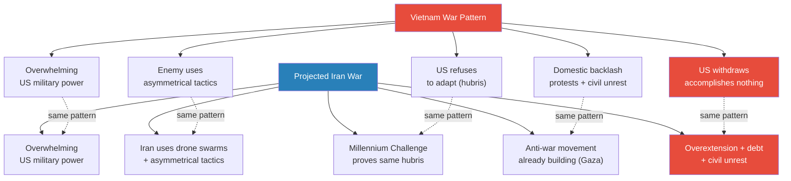

*The Vietnam-Iran parallel is not merely analogical — Prof. Jiang argues the structural conditions are identical. The same psychology (hubris), the same economics (cost asymmetry favouring the defender), and the same domestic dynamics (civil unrest) will produce the same outcome. The only question is whether the United States has learned from Vietnam. The Millennium Challenge suggests it has not.*

- <b style="color: #27ae60">The key difference that makes Iran potentially worse for the United States than Vietnam</b>: in the 1960s, America was not simultaneously fighting multiple wars, carrying enormous national debt, and facing pre-existing civil unrest — all three causes of imperial collapse were not yet converging. Today, all three are already in motion before the war even begins

With asymmetrical warfare established as the foundational principle — proven by the Millennium Challenge, demonstrated by the economics of drone swarms versus aircraft carriers, illustrated by Operation True Promise, and historically validated by Vietnam — Prof. Jiang now turns to the question that occupies the second half of the lecture: if Iran is going to use asymmetrical warfare, what must it do *before* the invasion begins to ensure it can survive?

The answer is the <b style="color: #2980b9">Iran Strategy Matrix</b> — a four-pronged framework that governs every action Iran takes from now until the day the first American soldier crosses its border.

## What Is the Iran Strategy Matrix?

*Prof. Jiang now introduces the lecture's central framework — the four things Iran must accomplish simultaneously, starting now and continuing through any future invasion, if it is to survive a full-scale American assault. Every Iranian action from this point forward must serve all four goals at once.*

The <b style="color: #2980b9">Iran Strategy Matrix</b> is not a sequence of steps — it is a set of four simultaneous constraints. Every action Iran takes must advance all four goals at the same time. An operation that achieves three out of four is a partial failure, because the missing goal creates a vulnerability the enemy can exploit:

1. **Unite the population** — ensure the Iranian people will resist an invasion, despite internal divisions
2. **Build alliances** — secure military, financial, and political support from both regional proxies and major powers
3. **Win global opinion** — make the world sympathetic to Iran so that an invasion carries enormous political cost
4. **Weaken the enemy** — fracture the coalition that would invade, creating dissent between the US and Israel, between the US and NATO, and within American domestic politics

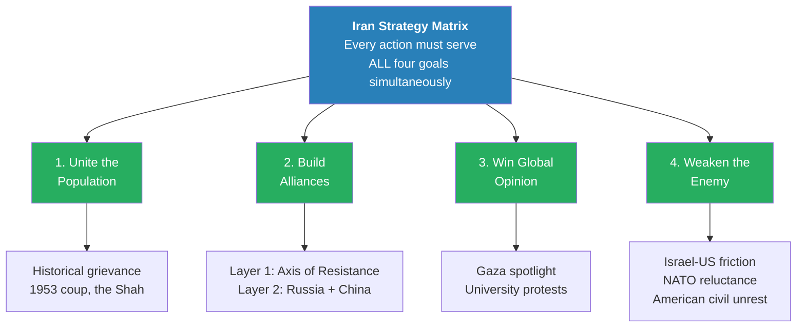

*The four goals of the Iran Strategy Matrix are not independent objectives — they are interconnected constraints. An action that unites the population but alienates global opinion (like a brutal retaliatory strike) would fail the matrix. The genius of the framework is that it forces Iran to think in four dimensions simultaneously.*

> [!abstract] The Iran Strategy Matrix — Central Framework
> | Goal | What It Means | Key Mechanism | Metric of Success |
> |------|--------------|---------------|-------------------|
> | Unite the population | Overcome internal divisions; build will to resist | Historical grievance (1953 coup, the Shah) | Population coalesces against invasion |
> | Build alliances | Secure support from proxies and major powers | Axis of Resistance + prove to Russia/China that Iran will fight and can win | Military and financial backing secured |
> | Win global opinion | Make invasion politically costly for the West | Keep world spotlight on Gaza; show restraint | International sympathy for Iran grows |
> | Weaken the enemy | Fracture the invasion coalition from within | Create Israel-US friction, US-NATO friction, American civil unrest | Coalition cannot form or hold together |

---

### Goal 1: Unite the Population

*Iran is not a monolith. The population is divided — women protesting for rights, opposition to the current government, internal dissent. Prof. Jiang explains why historical grievance against the West will override these divisions when invasion comes.*

- Iran's ability to resist an invasion depends on how much its population is willing to fight
- Right now, the Iranian population is divided — there have been protests, particularly by women demanding more rights
- But Prof. Jiang argues that most Iranians would resist a foreign invasion, despite their frustrations with their own government
- The reason is deep <b style="color: #e74c3c">historical grievance against Western intervention</b> — a grievance that goes back over a century
- The critical narrative is the <b style="color: #2980b9">1953 coup d'etat</b>, which Prof. Jiang recounts in detail as the foundational story of Iranian resistance

> [!example] The 1953 Iranian Coup d'Etat
> - In 1909, the British discovered oil in Persia (now Iran) and created the Anglo-Iranian Petroleum Company — known today as British Petroleum (BP)
> - The deal gave Iran only 16% of the profits from its own oil — the British took the rest
> - For decades, the Iranians tried to renegotiate this exploitative arrangement
> - In 1953, the democratically elected government of Iran proposed a fair deal: a 50-50 split of oil revenues
> - Instead of accepting, the British went to the Americans — and together, the CIA and MI6 launched a coup
> - They overthrew the democratic government and installed the Shah — a brutal monarchy that ruled as a police state
> - The Shah's brutality eventually provoked the 1979 Iranian Revolution that overthrew him
> **The lesson:** This is why Iranians resist Western intervention. The narrative is simple and powerful: the last time the West intervened, they destroyed Iran's democracy and stole its resources.

*The 1953 coup created a grievance that transcends internal Iranian politics. Whatever disagreements Iranians have with their own government, the memory of Western intervention — destroying democracy, installing a dictator, stealing oil — unites them against foreign invasion.*

- The strategic implication is that as Israel and America continue to be aggressive toward Iran, the population will start to coalesce
- Internal divisions over women's rights, government policy, and domestic governance fade when the alternative is foreign occupation
- <b style="color: #27ae60">Time works in Iran's favour on this goal</b> — every act of Western aggression (the Soleimani assassination, the Damascus embassy strike) reinforces the grievance narrative and pushes more Iranians toward resistance

---

### Goal 2: Build Alliances

*Iran cannot fight the United States alone. Prof. Jiang explains the two-layer alliance structure that Iran is building — and what Iran must prove before the second layer will commit.*

Iran's alliance strategy operates on two distinct layers, each with different dynamics:

- <b style="color: #2980b9">Layer 1: The Axis of Resistance</b> — a loose coalition of groups that share a common interest in remaining independent of American influence
  - Shia militias in Iraq and Syria
  - Hezbollah in Lebanon
  - Hamas
  - The Houthis in Yemen
- <b style="color: #2980b9">Layer 2: Russia and China</b> — major powers who want the United States weakened but will not commit until Iran proves it is worth the investment

The critical nuance about the Axis of Resistance — and Prof. Jiang emphasises this repeatedly — is that these groups are **not controlled by Iran**:

- Iran provides military and financial support to all of them
- They share a common interest: resisting American and Israeli influence in the region
- But Iran cannot dictate their behaviour — they are allies, not subordinates
- The proof: Iran claims it was not involved in the October 7 Hamas attack on Israel, while Israel insists Iran must have controlled it
- Prof. Jiang's position: the truth is more nuanced — shared interests, yes; direct control, no

> [!example] The Axis of Resistance — Alliance, Not Control
> - Iran supports Hezbollah, Hamas, the Houthis, and Shia militias across Iraq and Syria
> - These groups share Iran's goal of resisting American and Israeli dominance in the region
> - But they operate with their own agendas and their own decision-making
> - When Hamas launched the October 7 attack on Israel, Iran said it was not involved
> - Israel insisted Iran must have orchestrated the attack because it "controls" Hamas
> - Prof. Jiang argues the reality is more complex: common interests do not mean direct control
> **The lesson:** The Axis of Resistance is an alliance of shared interests, not a hierarchy of command. Iran supports but does not direct its partners.

The second layer — Russia and China — is where the strategic calculation becomes more demanding. Both nations want the United States weakened, but neither will invest in Iran without proof:

- **Russia's interest:** A US war in Iran diverts American resources away from Ukraine, where Russia is winning. Russia would also limit American military options — most critically, preventing the use of tactical nuclear weapons
- **China's interest:** Iran has oil that China's economy desperately needs. If the US takes control of both Iraq and Iran, it controls China's energy supply — an existential threat
- **What Iran must prove to both:** Two things — first, that Iran is willing to fight (not just posture); second, that Iran can win (not just survive)
- The more Iran demonstrates both willingness and capability, the more Russia and China will invest — militarily, financially, and politically
- <b style="color: #27ae60">This is a gradual process</b> — each Iranian action that demonstrates resolve and competence draws the second-layer allies deeper into commitment

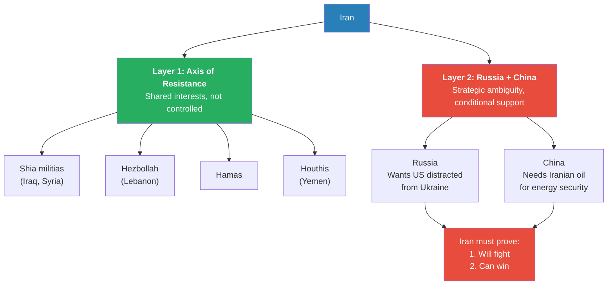

*Iran's alliance structure has two fundamentally different layers. The Axis of Resistance is already committed — they share common enemies and common interests. Russia and China are conditional — they will invest only as Iran demonstrates it is a worthwhile bet. Every Iranian action must build the case for Layer 2 commitment.*

---

### Goal 3: Win Global Opinion

*The court of world opinion is a battlefield in itself. Prof. Jiang explains how the situation in Gaza is handing Iran a strategic gift — and why maintaining that spotlight is a core Iranian objective.*

- Iran's third goal is to make any potential invasion politically costly for the West by building international sympathy
- The mechanism is straightforward: keep the world's attention on what Israel is doing in Gaza
- Prof. Jiang describes the situation in Gaza bluntly — Israel is committed to removing the Palestinian population from Gaza entirely
- As long as this continues, global opinion shifts toward sympathy for Iran and against Israel
- The university protests at Yale, Columbia, and other American campuses are evidence that this strategy is working — <b style="color: #27ae60">organic international outrage is building without Iran needing to manufacture it</b>
- The key word is "organic" — Iran does not need to create propaganda when the reality in Gaza generates its own opposition
- This dynamic is self-reinforcing: the longer Gaza continues, the more the world sympathises with Iran; the more the world sympathises with Iran, the harder it becomes for the US to build a coalition for invasion

The connection to asymmetrical warfare is direct:

- In conventional strategy, you win by destroying the enemy's forces
- In asymmetrical strategy, you win by making it impossible for the enemy to justify the fight
- Global opinion is one of the tools that makes invasion politically unsustainable — even if militarily feasible

---

### Goal 4: Weaken the Enemy

*The most counterintuitive goal: Iran's objective is not to match the enemy's strength but to fracture the coalition that would carry out the invasion, creating dissent at every level — between Israel and America, between the US and NATO, and within American domestic politics.*

- When the US eventually invades Iran, it will want to build a large coalition to give the invasion legitimacy
- This coalition would include NATO, Middle Eastern allies like Saudi Arabia, the UAE, and Jordan, and of course Israel
- Iran's objective is to create conflict and dissent within this coalition so that it either never forms or cannot hold together
- The fractures Iran needs to exploit operate on three levels:

**Level 1: Israel-US friction**
- Israel's doctrine of <b style="color: #2980b9">disproportionality</b> creates natural tension with the US
- Israel is committed to responding to any attack with vastly greater force — if you kill one Israeli, they kill a hundred; if you throw one rocket, they throw a thousand
- The purpose is deterrence through fear — making enemies too afraid to attack
- But this doctrine creates friction with America, which cannot afford escalation and needs to manage the broader coalition
- <b style="color: #e74c3c">Every time the US restrains Israel, the alliance weakens from within</b>

**Level 2: US-NATO friction**
- America will want NATO involved in any invasion of Iran
- But France and Germany have no strategic interest in fighting Iran — the question "why would we involve ourselves?" has no compelling answer for European nations
- The longer the lead-up to invasion, the more NATO allies can be peeled away from the coalition

**Level 3: American civil unrest**
- Most Americans do not support a war against Iran
- Iran needs to encourage and amplify this internal dissent — not through propaganda, but by ensuring that the conditions for anti-war sentiment continue to build
- The Vietnam parallel is explicit: massive protests, civil unrest, a war that the public increasingly sees as pointless
- This connects directly to the three causes of imperial collapse: overextension, debt, and civil unrest are all building simultaneously

> [!tip] Core Insight
> The Iran Strategy Matrix does not require Iran to match American military power. It requires Iran to make invasion politically unsustainable — by ensuring the Iranian people will resist, allies will support, the world will condemn, and the enemy coalition will fracture from within. Military victory is not the goal. Strategic survival is.

---

## How Did Operation True Promise Accomplish All Four Goals?

*Prof. Jiang now returns to Operation True Promise — the strike he introduced at the beginning of the lecture — and demonstrates that what looked like a military failure was in fact a comprehensive strategic success when viewed through the Iran Strategy Matrix.*

This is the payoff of the entire lecture. Operation True Promise — the 300 drones and missiles Iran launched at Israel after the Damascus embassy strike — was not designed to cause military damage. It was designed to advance all four goals of the Strategy Matrix simultaneously. Prof. Jiang walks through each one:

### Goal 1 — Unite the Population: "Iran can strike back"

- The Iranian population needed to see that their country could respond to Israeli aggression
- After the Damascus embassy strike killed two commanders on Iranian sovereign territory, doing nothing would have been humiliating
- By launching a visible strike against Israel — the first time Iran had ever directly attacked Israel — the government showed its population that it will not be passive
- <b style="color: #27ae60">The message to Iranians: we are not helpless, and we will fight</b>

### Goal 2 — Build Alliances: "Iran is willing to fight"

- Russia and China need proof that Iran will actually fight before they commit deeper support
- By striking Israel directly, Iran demonstrated willingness to escalate — the first and most important thing the second-layer allies needed to see
- Every drone that flew toward Israel was a signal to Moscow and Beijing: invest in us, because we are serious

### Goal 3 — Win Global Opinion: "Iran showed restraint"

- This is where the design of the operation becomes strategically brilliant
- Iran claimed the strike was intentionally designed to cause no casualties — and the evidence supports this claim
- The world's reaction: Iran's response was restrained and measured, especially compared to the Israeli embassy strike that provoked it
- The narrative of proportionality and justice worked in Iran's favour — Israel attacked an embassy (illegal under international law), and Iran responded with a strike that caused no deaths
- <b style="color: #27ae60">If Iran had killed civilians, global opinion would have shifted against it</b> — by designing the operation for zero casualties, Iran preserved the moral high ground

### Goal 4 — Weaken the Enemy: "Israel was restrained by America"

- After Operation True Promise, Israel wanted to launch a disproportionate response — this is its stated doctrine
- The United States stopped Israel — because the US could not afford a wider war, and because NATO and Middle Eastern allies would not participate
- This US restraint of Israel created exactly the friction the Strategy Matrix requires
- <b style="color: #e74c3c">Israel wanted to hit back hard; America said no</b> — and that disagreement weakened the alliance from within

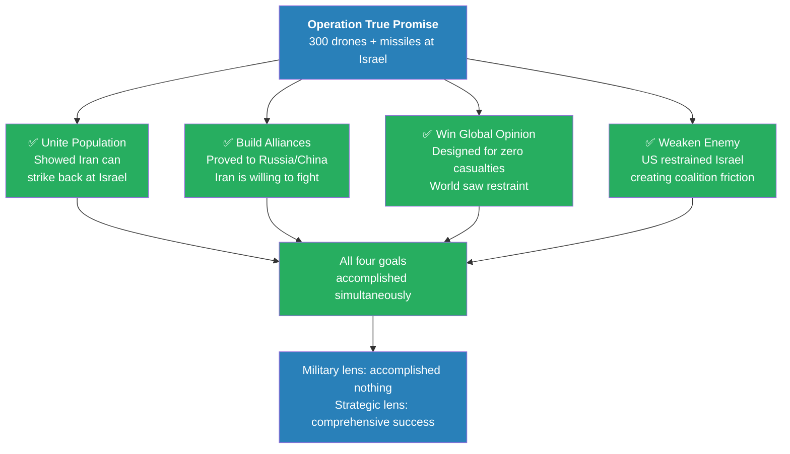

*Operation True Promise is the proof that the Iran Strategy Matrix works in practice. A single operation — dismissed by Western analysts as a military failure — advanced every one of Iran's pre-war strategic objectives. The difference between the two assessments is the difference between symmetrical thinking and asymmetrical thinking.*

Prof. Jiang's summary of the operation is pointed: from a military dominance perspective, Operation True Promise accomplished nothing — no buildings destroyed, no casualties inflicted. But from an asymmetrical warfare perspective, it accomplished all four major goals simultaneously. The Iranian claim of success is not propaganda. It is an accurate assessment — if you understand the strategic framework they are operating within.

> [!tip] Core Insight
> The analysts who call Operation True Promise a failure are measuring success by damage inflicted — the metric of symmetrical warfare. The analysts who call it a success are measuring by strategic positioning — the metric of asymmetrical warfare. Iran is playing the second game. The Americans, trapped by hubris, cannot even see the second game exists.

---

## What Are the Rules of Engagement?

*A student's question about the practical impact of a potential Iran war on Chinese students studying in America opens up one of the lecture's most important digressions — how major powers agree on the rules of war before fighting begins, and why these invisible agreements prevent regional conflicts from escalating into world wars.*

Peter, a student heading to the United States for college, asks the question that many in the room are thinking: if this war happens, how does it affect us? Prof. Jiang's answer unfolds in three parts — and the first part introduces a concept that will recur throughout the Geo-Strategy series.

### What Rules of Engagement Mean

- <b style="color: #2980b9">Rules of engagement</b> are pre-war agreements among major parties about what weapons, tactics, and levels of involvement are permissible in a conflict
- These are not formal treaties published in newspapers — they are understood agreements, negotiated through back channels, that define the boundaries of a war before it begins
- The purpose: prevent a regional conflict from escalating into a global war by establishing what every major power will and will not do
- Prof. Jiang treats this concept as fundamental — without rules of engagement, every conflict risks nuclear escalation

### Ukraine as the Working Example

- Prof. Jiang uses the war in Ukraine as the precedent for how rules of engagement function in practice
- The United States and NATO are openly supplying weapons, financing, and intelligence to Ukraine
- From Russia's perspective: they allow this — they will not retaliate against NATO for providing weapons
- But there is a red line: NATO is not allowed to send troops to fight alongside the Ukrainians
- Russia allows material support but forbids direct military participation
- <b style="color: #27ae60">Both sides understand the rules, and both sides observe them</b> — this is why a war between Russia and Ukraine has not become a war between Russia and NATO

> [!example] Ukraine — Rules of Engagement in Action
> - NATO openly provides weapons, financing, and intelligence to Ukraine
> - Russia allows this material support without retaliating against NATO countries
> - The understood red line: NATO must not send combat troops to fight alongside Ukraine
> - Russia tolerates NATO's indirect involvement because direct confrontation risks nuclear escalation
> - Both sides observe the rules — NATO stays below the troop threshold, Russia does not strike NATO territory
> - The result: a contained regional war rather than a global conflict
> **The lesson:** Rules of engagement are invisible but enforceable — both sides observe them because the alternative is mutual destruction.

### Projected Rules for a US-Iran War

- Prof. Jiang projects similar rules of engagement for a hypothetical US invasion of Iran
- **Rule 1: No tactical nuclear weapons** — Iran may have nuclear weapons; the US and Israel certainly do. None may be used in this conflict
  - Russia would enforce this rule by threatening nuclear retaliation if the US uses nuclear weapons against Iran
  - This is perhaps Russia's most important contribution to Iran's survival — it removes the US's most devastating weapon from the table
- **Rule 2: Russia and China provide limited assistance** — weapons, material, financing, but not troops
  - China will probably provide weapons and material to Iran
  - But this assistance will be limited to what the United States can accept — crossing the threshold would risk direct US-China confrontation
  - <b style="color: #2980b9">Strategic ambiguity</b> governs everything: neither Russia nor China will publicly declare support for Iran
  - They will not sign a mutual defence treaty with Iran — doing so would eliminate their flexibility
  - Russia and China do not want to be dragged into a direct war with the United States
- **Rule 3: Strategic ambiguity is maintained** — no public declarations of alliance
  - China will not say "we support Iran"
  - Russia will not say "we support Iran"
  - Both will provide assistance quietly, on terms the United States can tolerate
  - This preserves everyone's ability to negotiate, de-escalate, or adjust without losing face

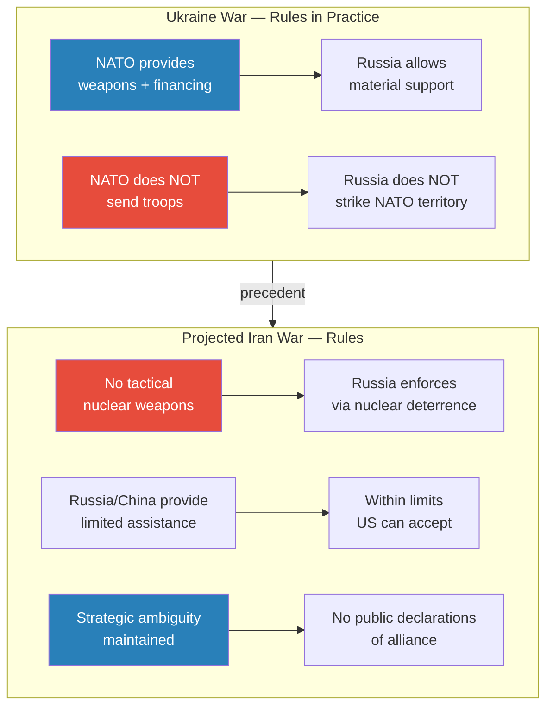

*The Ukraine war provides a working template for how rules of engagement function. NATO supports Ukraine without sending troops; Russia allows this without retaliating against NATO. Prof. Jiang projects a similar framework for an Iran war — no nuclear weapons, limited Russian and Chinese assistance, and strategic ambiguity maintained by all parties.*

### Peter's Question and the Practical Answer

- Prof. Jiang then addresses Peter's concern directly, with characteristic bluntness
- First: the rules of engagement will limit the war's scope — China will maintain strategic ambiguity and provide limited assistance on terms the US can accept, so the war will not become a US-China conflict
- Second: Prof. Jiang reminds the class that this is all theory and conjecture — he is a high school teacher making predictions, not a decision-maker
- Third — and this is where the class laughs — when Peter actually arrives in the United States, he will find that nobody cares about Chinese students because the campus will be consumed by anti-war anger
  - The parallel to Vietnam is explicit: massive protests, civil unrest, a generation of students furious about a war they consider unjust
  - The Gaza university protests at Yale and Columbia are already a preview of this dynamic
  - <b style="color: #27ae60">The practical answer: the biggest issue facing a Chinese student in America during an Iran war will not be geopolitics — it will be living on a campus engulfed in anti-war protest</b>

---

## What Happens If America Loses?

*Prof. Jiang expands the frame dramatically — from Iran's strategy to the fate of the American empire itself. He introduces three causes of imperial collapse that are all happening simultaneously, and maps the world that would emerge if American hegemony ends.*

### Three Causes of Imperial Collapse

- Prof. Jiang presents a framework for why empires fall — and argues that all three causes are converging on the United States right now
- <b style="color: #2980b9">Cause 1: Overextension</b> — fighting too many wars at once
  - The US is involved in Ukraine, potentially Iran, and maintains military commitments across the globe
  - Every new conflict stretches resources thinner — money, troops, attention, political will
  - Overextension is the most visible cause: the empire simply tries to do too much
- <b style="color: #2980b9">Cause 2: Debt</b> — running out of money because of overextension
  - Wars are extraordinarily expensive, and asymmetrical wars are worse because the cost ratio favours the defender
  - Overextension produces debt, and debt limits the empire's ability to sustain further overextension
  - This is a self-reinforcing cycle: more wars produce more debt, which weakens the capacity to fight more wars
- <b style="color: #2980b9">Cause 3: Civil unrest</b> — domestic opposition to foreign wars
  - The Vietnam parallel is explicit — a war the public considers unjust produces massive protests, political fragmentation, and erosion of social cohesion
  - Civil unrest is the final stage: when the public turns against the empire's wars, the political consensus that sustains those wars collapses
  - <b style="color: #e74c3c">All three are happening at once for the United States</b> — overextension across multiple theatres, mounting national debt, and growing domestic anger over foreign entanglements

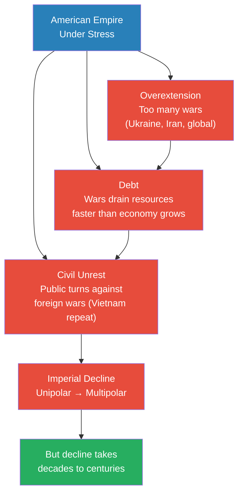

*The three causes of imperial collapse are sequential and self-reinforcing: overextension produces debt, debt produces civil unrest, and civil unrest makes further overextension politically impossible. Prof. Jiang argues all three are converging on the United States simultaneously.*

### The Regional Power Hierarchy

- Prof. Jiang is careful to qualify his prediction: even if America loses a war in Iran, there is still no peer competitor to the United States
- The American empire is extremely wealthy and extremely powerful — its decline will take decades, possibly centuries
- But the trajectory is clear: the world would transition from a <b style="color: #2980b9">unipolar world</b> (one superpower controls everything) to a <b style="color: #2980b9">multipolar world</b> (regional blocs controlled by dominant regional powers)
- Prof. Jiang identifies the three nations that would dominate their respective regions if American empire withdraws:

| Region | Dominant Power | Current Status |
|--------|---------------|----------------|
| Europe | Germany | Constrained by American empire; would dominate if US withdraws |
| Middle East | Israel | Already the strongest military in the region "by far"; US restrains it |
| East Asia | Japan | Constrained by American presence; would rise to regional dominance |

- The key insight: American empire is not just projecting power outward — it is also constraining these three nations from exercising full regional dominance
- If the US retreats into isolation, these three nations "rise to the top"
- This is not necessarily a better world — it is simply a differently ordered one, with multiple power centres instead of one

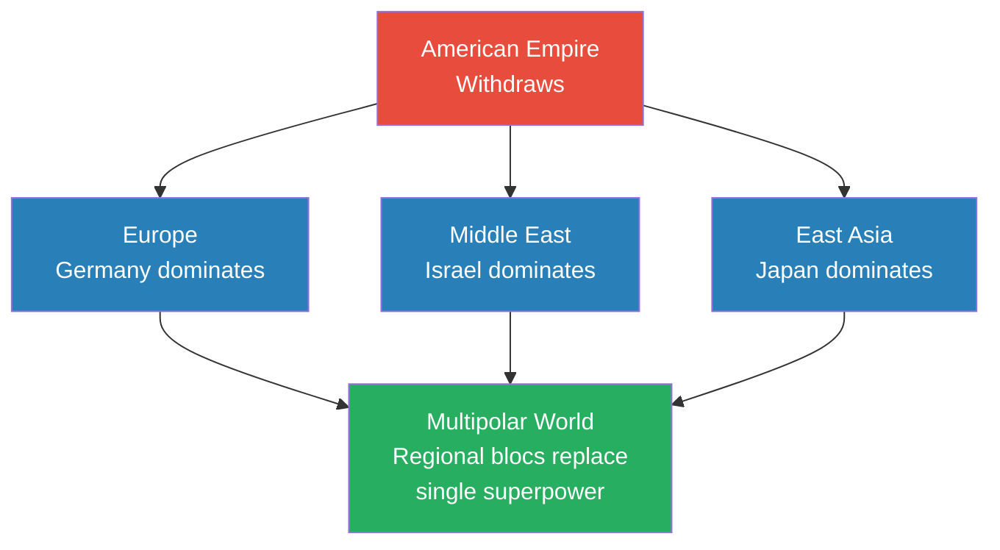

*Without American empire, three nations fill the vacuum in their respective regions. The transition from unipolar to multipolar is not a collapse into chaos — it is a reordering of the international system around regional dominance rather than global hegemony.*

---

## Is America Constraining Israel — or Is Israel Using America?

*A student named David asks one of the lecture's sharpest questions: is the US-Israel relationship one of constraint or exploitation? Prof. Jiang's answer reveals the complexity of imperial alliances — and sets up an entire future lecture on the Israel lobby.*

### Israel as a Regional Empire

- A student challenges Prof. Jiang's use of "hubris" to describe Israel — pointing out that Israel is a small nation of only 8-9 million people, not an empire in the conventional sense
- Prof. Jiang's response redefines empire around military dominance rather than geographic size:
  - Israel is the strongest military power in the Middle East "by far"
  - Israel has defeated the entire Middle East coalition twice before — in the Yom Kippur War and the Six-Day War
  - If the United States were to retreat from the Middle East, Israel would dominate the region
  - <b style="color: #27ae60">Empire is defined by military dominance, not population size</b> — Israel may be small, but it functions as a regional empire
- And because it functions as an empire, it suffers from the same fatal flaw: hubris
  - It does not need to be strategic, flexible, or creative — because it has military dominance over everyone in the region
  - This inflexibility is the same pattern Prof. Jiang identified in the Millennium Challenge: the dominant power refuses to adapt because it does not believe it needs to

> [!tip] Core Insight
> Empire is not about size — it is about military dominance relative to your neighbours. Israel, with 8-9 million people, is an empire because no combination of Middle Eastern nations can defeat it. And because it is an empire, it suffers from hubris — the fatal refusal to adapt that has destroyed every empire in history.

### The Complicated Relationship

- David then asks the deeper question: is America constraining Israel, or is Israel using America?
- Prof. Jiang acknowledges the question is genuinely complicated — "you can make the argument both ways"
- **The constraint argument:** American presence prevents Israel from starting a regional war
  - Israel needs American support — military aid, diplomatic cover, intelligence sharing
  - That dependence constrains Israel's actions — it cannot simply do whatever it wants
  - After Operation True Promise, the US stopped Israel from launching a disproportionate response — proof of the constraint in action
- **The exploitation argument:** Israel uses America to pursue its own geopolitical interests
  - The Israel lobby in American politics gives Israel enormous influence over US foreign policy
  - America provides billions in military aid, diplomatic protection at the United Nations, and intelligence cooperation
  - The question of who benefits more from the relationship is not straightforward
- Prof. Jiang offers his personal assessment: he thinks America is currently constraining Israel
  - "Because Israel needs American support, and that constrains the actions of Israel"
  - But without America, Israel would "unleash the full might of its military"
  - The constraint is real — but so is the leverage Israel exercises through the lobby
- He then promises an entire future class on <b style="color: #2980b9">the Israel lobby</b> — because understanding the US-Israel relationship requires understanding how the lobby shapes American foreign policy

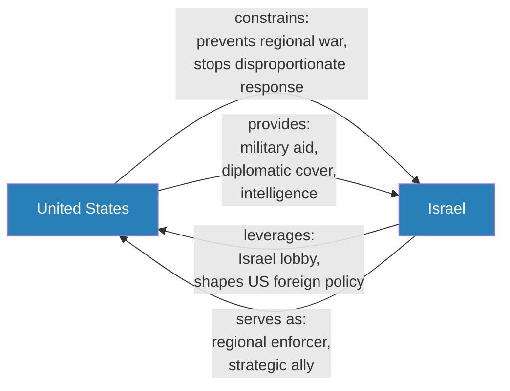

*The US-Israel relationship is simultaneously one of constraint and exploitation. America restrains Israel from unleashing its full military power, while Israel leverages the Israel lobby to shape American foreign policy in its favour. Prof. Jiang promises an entire future lecture to untangle this complexity.*

### What Would Provoke a Ground Invasion?

- A student asks what would trigger the actual invasion of Iran
- Prof. Jiang's response is characteristically blunt: America does not need a real reason to fight a war — "it can just make up a reason"
- He makes a specific prediction: if Trump wins the presidency, he will initiate a war against Iran — possibly within two years
- The invasion trigger matters less than the consequences, which Prof. Jiang has already outlined through the three causes of imperial collapse
- He promises future classes on what the war would actually look like and what happens to America if it loses

---

## Student Questions That Reshaped the Argument

*The Q&A session in this lecture is unusually substantive. Several student questions do not merely clarify Prof. Jiang's argument — they extend it into territory the lecture itself did not cover, forcing the professor to articulate ideas he might otherwise have left implicit.*

### "Shouldn't the Americans Respond More Strategically?"

This is the question that elicits Prof. Jiang's most important psychological insight. A student asks the obvious follow-up to the Millennium Challenge: if the Americans know Iran will use asymmetrical warfare, should they not prepare for it and respond more strategically?

- Prof. Jiang's answer is blunt and immediate: they would not do that
- The fatal flaw is not ignorance — the Americans are not stupid
- <b style="color: #e74c3c">The flaw is psychological: empires cannot admit vulnerability</b>
- They cannot acknowledge that an inferior force poses a genuine threat to the most powerful military in human history
- When asymmetrical tactics won the Millennium Challenge, the Americans did not study those tactics and develop counters
- They called it cheating — they changed the rules — they chose hubris over adaptation
- This response — denying reality rather than learning from it — is what makes asymmetrical warfare so effective against empires
- The empire would rather change the rules of the game than change its doctrine
- Prof. Jiang explicitly connects this to Vietnam: the same inflexibility, the same refusal to adapt, the same ultimate failure

This question matters because it forces Prof. Jiang to make a critical distinction: <b style="color: #27ae60">hubris is not stupidity — it is an inability to acknowledge vulnerability</b>. The Americans are brilliant at conventional warfare. They are psychologically incapable of accepting that conventional warfare might not work. These are not contradictory statements.

### Peter's Question: "How Will This Affect Chinese Students in America?"

Peter, who is heading to the United States for college, asks the question that grounds the entire geopolitical analysis in personal reality. Prof. Jiang's three-part answer introduces one of the lecture's most important concepts — rules of engagement — while also providing the class's biggest laugh.

- **Part 1 — Rules of engagement:** Before any war begins, all major parties agree on what is and is not permissible. China will maintain strategic ambiguity and provide limited assistance to Iran on terms the United States can accept. The war will not become a US-China conflict because both sides will observe the agreed boundaries — just as NATO and Russia observe boundaries in Ukraine
- **Part 2 — Epistemic humility:** Prof. Jiang reminds the class that everything he is saying is theory and conjecture. He is a high school teacher making predictions, not a decision-maker. This disclaimer is characteristic — he always qualifies his geopolitical projections
- **Part 3 — The practical reality:** When Peter actually arrives on an American campus, he will discover that nobody cares about Chinese students — because the entire campus will be consumed by anti-war anger. The Gaza university protests at Yale and Columbia are already a preview. The biggest issue Peter will face is not geopolitics but living on a campus engulfed in anti-war protest

> [!tip] Core Insight
> Peter's question reveals how rules of engagement function as the invisible architecture of modern warfare. They prevent regional conflicts from becoming global ones — not through goodwill, but through mutual recognition that crossing certain thresholds risks nuclear escalation. The system works because all parties understand the cost of breaking it.

### "What Would Provoke the Ground Invasion?"

A student presses Prof. Jiang on the specific trigger for the invasion he has been predicting. The answer reveals something about the nature of imperial war-making:

- Prof. Jiang is characteristically blunt: America does not need a real reason to fight a war — "it can just make up a reason"
- The invasion trigger is less important than the strategic conditions that make it possible or impossible
- His specific prediction: if Trump wins the presidency, he will initiate a war against Iran, possibly within two years
- The three causes of imperial collapse — overextension, debt, civil unrest — are already converging, making the timing both more likely and more dangerous
- The question of what provokes the invasion matters less than the question of whether the empire can survive it — and that is what the Strategy Matrix addresses

### "Could Israel Fight Against America?"

Speaker 1 (likely David) asks perhaps the sharpest question of the session: if the United States constrains Israel and the two disagree, is there a possibility that Israel would fight against America?

- Prof. Jiang calls this "a very complicated question" — his standard signal that the student has touched something genuinely difficult
- The answer hinges on the <b style="color: #2980b9">Israel lobby</b> — a topic so complex that Prof. Jiang will dedicate an entire future lecture to it
- The lobby makes the US-Israel relationship fundamentally different from other alliances — it is not simply a strategic partnership between two nations
- The lobby gives Israel influence over American foreign policy that goes beyond anything a small nation of 8-9 million people would normally possess
- Prof. Jiang does not answer the question directly — instead, he defers it, promising that the class will understand the relationship only after studying the lobby in depth
- He also promises future classes on: what the war would actually look like (Jack's question), what happens to America if it loses, and the rise of Japan and Germany as regional powers

The deferral itself is instructive. Prof. Jiang treats the Israel lobby as a topic that cannot be summarised in a quick answer — it requires its own analytical framework, its own evidence base, and its own lecture. This signals that the US-Israel relationship is one of the series' central puzzles, not a side topic.

---

## Connections

**Builds on:** [[06 - Elite Overproduction and the Bronze Age Collapse]] (the pattern of empires collapsing from internal structural flaws rather than external enemies), [[08 - Rat Utopia and the Peloponnesian War]] (hubris and the inability to adapt as a recurring civilisational theme)
**Sets up:** [[02 - Christian Zionism and the Middle East Conflict]] (the Israel lobby and why the US-Israel alliance exists), [[04 - Saudi Arabia's Trump Card Against Iran]] (Saudi strategy in the Iran conflict), [[06 - America's Imperial Hubris]] (hubris theme continues with American-specific analysis), [[08 - The Iran Trap]] (the war scenario in detail)
**Related books in vault:** [[The 33 Strategies of War - Robert Greene]] (asymmetrical warfare, guerrilla tactics, and controlling terms of engagement), [[The Art of War - Sun Tzu]] (deception, terrain control, and knowing the enemy), [[The 48 Laws of Power - Robert Greene]] (hubris, never outshining the master, power dynamics), [[The Laws of Human Nature - Robert Greene]] (grandiosity and hubris as psychological patterns), [[Sapiens - Yuval Noah Harari]] (how narratives and imagined orders shape collective behaviour — relevant to the 1953 grievance narrative)

---

## The Takeaway

This lecture establishes the intellectual architecture for the entire Geo-Strategy series. Prof. Jiang does not simply analyse Iran's military options — he builds a framework for understanding how all asymmetrical conflicts work, why empires repeatedly lose to inferior forces, and what determines the outcome of wars that conventional military analysis cannot predict. The Iran Strategy Matrix — unite the population, build alliances, win global opinion, weaken the enemy — is not just a description of Iranian strategy. It is a template for how any inferior force survives a confrontation with a dominant power. Every subsequent lecture in the series applies these principles to different actors: Saudi Arabia's strategy, Russia's positioning, America's internal fragmentation, and the Israel lobby's influence on US foreign policy.

The most counterintuitive insight is the one Prof. Jiang hammers home with the Millennium Challenge and Operation True Promise: <b style="color: #27ae60">military dominance does not determine who wins a war</b>. The Americans possess the most powerful military in human history and have complete technological and intelligence superiority over Iran. None of that matters if the war is fought on asymmetrical terms — terms Iran controls. The superior force's greatest weakness is not a lack of weapons but a surplus of hubris: the psychological inability to adapt, to acknowledge vulnerability, to take the inferior force seriously. The Americans proved this about themselves in their own war simulation — and then chose to ban the lesson rather than learn it. That single decision — calling asymmetrical warfare "cheating" — encapsulates everything Prof. Jiang believes about why empires fall.

The questions that remain open are the ones that drive the rest of the series. Will Trump start the war, and what would it actually look like on the ground? Can Iran hold its coalition together — the Axis of Resistance, Russia, China — through a long conflict, or will the alliances fracture under pressure? Is the US-Israel relationship one of genuine strategic alliance or mutual exploitation, and how does the Israel lobby distort American foreign policy? And the biggest question of all: if the United States loses in Iran, what does the multipolar world that emerges actually look like — and is it better or worse than the one we have now? Prof. Jiang promises answers in the lectures ahead.
