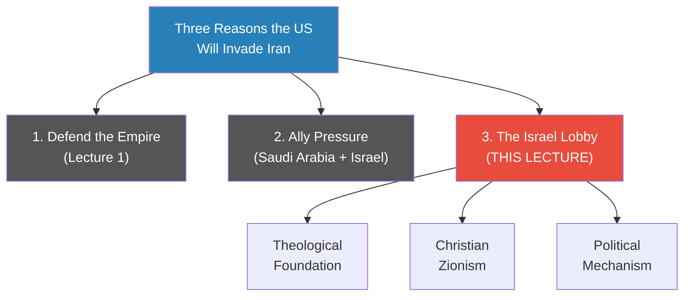
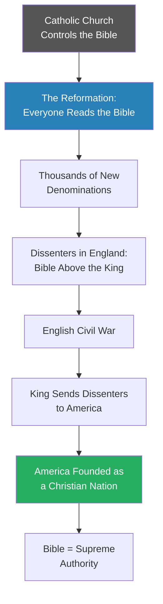
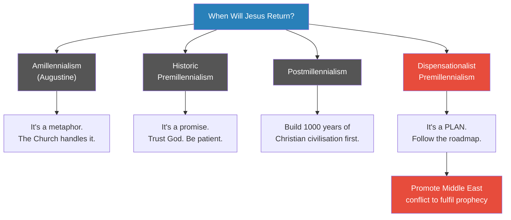
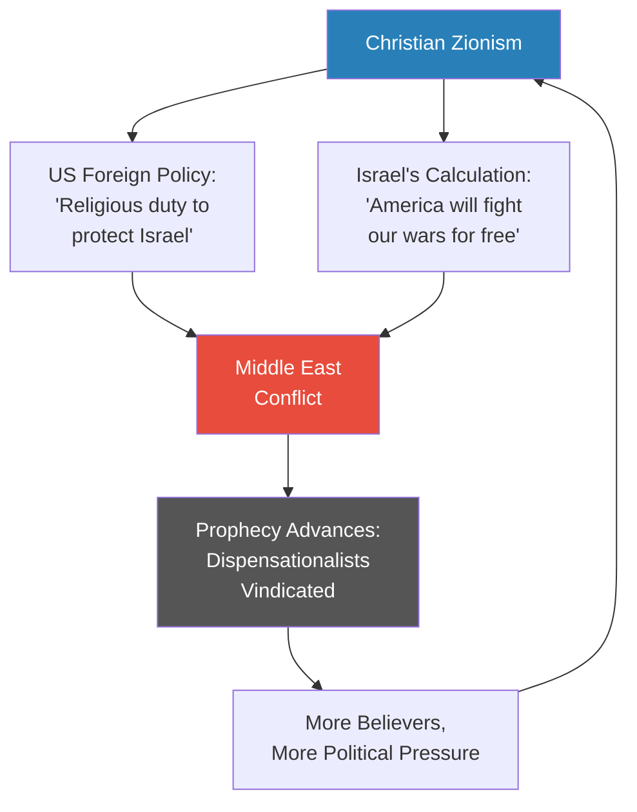
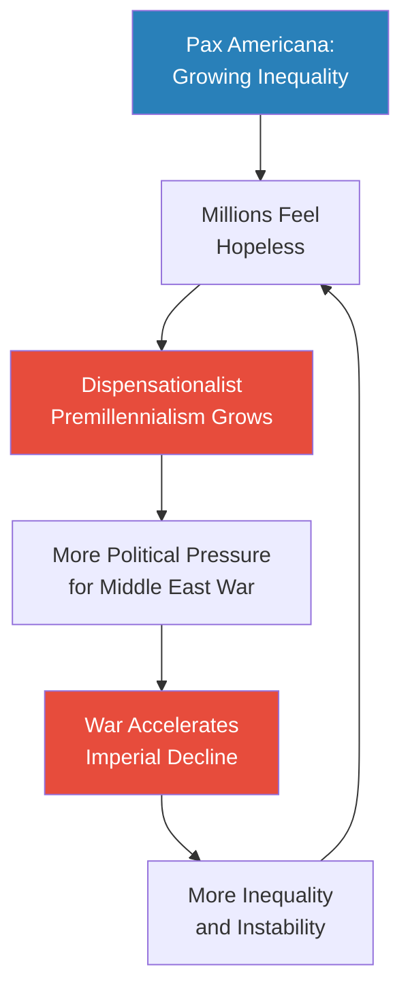
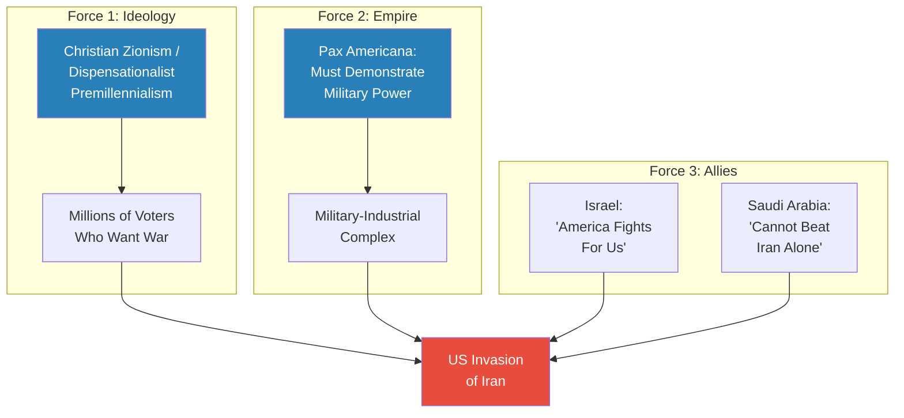
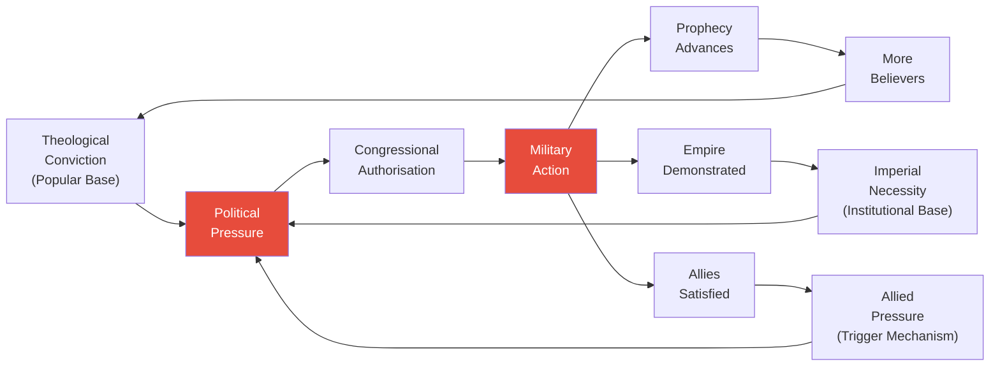
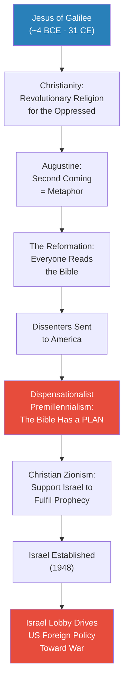
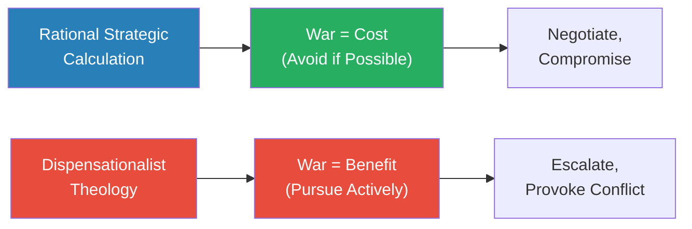
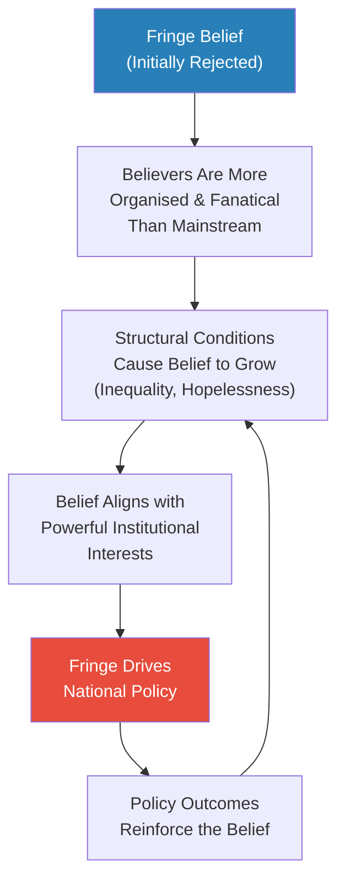

# Christian Zionism and the Middle East Conflict

> Prof. Jiang turns from military strategy to theology to answer a deceptively simple question: why does a significant group of American Christians actively want war in the Middle East? The answer lies in a chain that runs from Augustine's reinterpretation of the Second Coming, through the Reformation and England's religious dissenters, to the founding of America as an explicitly Christian nation, and finally to a radical theology called dispensationalist premillennialism -- the belief that the Bible contains a literal roadmap for forcing Jesus's return. Prof. Jiang argues that this theology, expressed politically as Christian Zionism, is the engine behind America's unconditional support for Israel and the driving force that will push the United States into war with Iran -- not as a strategic miscalculation but as a religious obligation.

---

## The Question

*In [[01 - Iran's Strategy Matrix|Lecture 1]], Prof. Jiang demonstrated that Israel and the United States possess overwhelming military dominance over Iran -- yet argued Iran might still win a war through asymmetrical strategy. Now he turns to the other side: why is the United States determined to fight this war in the first place?*

Prof. Jiang opens by framing three reasons the United States will eventually invade Iran:

1. <b style="color: #2980b9">Defending the empire</b> -- the US must protect its global hegemony (covered in [[01 - Iran's Strategy Matrix|Lecture 1]])
2. <b style="color: #2980b9">Ally pressure</b> -- Saudi Arabia and Israel will push the US into it (covered in [[04 - Saudi Arabia's Trump Card Against Iran|Lecture 4]])
3. <b style="color: #2980b9">The Israel lobby</b> -- the deep religious-ideological mechanism that makes US support for Israel unconditional

This lecture tackles reason number three. But to explain the Israel lobby, Prof. Jiang does something unexpected: he builds the entire theological architecture behind it. The lecture is not about lobbying tactics, campaign donations, or Congressional votes. It is about why millions of American Christians believe they have a sacred duty to support Israel and promote conflict in the Middle East -- and why that belief will only grow stronger as inequality worsens.

The explanatory chain runs through eight links: the origins of Christianity as a revolutionary religion for the oppressed, Augustine's reinterpretation of the Second Coming, the Reformation, England's religious dissenters, the founding of America as a Christian nation, the emergence of dispensationalist premillennialism, the invention of Christian Zionism, and finally the self-reinforcing cycle that connects all of these to the Israel-Iran conflict.

*This lecture focuses on reason three -- and argues it is not merely political but theological. The Israel lobby's power derives not from money or organisation alone but from a religious worldview woven into America's founding DNA.*

---

## Key Concepts at a Glance

| Concept | One-line summary |
|---------|-----------------|
| **Dispensationalist premillennialism** | The Bible contains a literal plan -- a roadmap -- for bringing Jesus back through specific steps including the reconstitution of Israel |
| **Christian Zionism** | The belief that Christians have a religious duty to support Jews returning to and controlling Israel |
| **Zionism** | The belief that Jews are a chosen people and Israel is their promised land -- reframes Jewish identity from religion to race |
| **The four views of the End Times** | Amillennialism, historic premillennialism, postmillennialism, and dispensationalist premillennialism -- four competing Christian positions on the Second Coming |
| **Augustine's theological innovation** | Reinterpreted the Second Coming as metaphorical, transforming Christianity from a revolutionary religion into an establishment one |
| **The "free lottery ticket" model** | Prof. Jiang's analogy for why the oppressed adopt radical religion: it costs nothing to believe, and the payoff is infinite |
| **Pax Americana parallel** | The same conditions that made Christianity explosive under the Pax Romana are recurring under American hegemony -- peace produces inequality, inequality produces radical belief |
| **The three reasons for US invasion** | Defending empire, ally pressure, and the Israel lobby -- three complementary and mutually reinforcing causes |

---

## Christianity's Revolutionary Origins and the Second Coming Problem

*Prof. Jiang begins not with geopolitics but with the story of a man from Galilee -- because to understand why America will go to war with Iran, you first need to understand what Christianity promised the world's outcasts and what happened when that promise became politically inconvenient.*

### The Revolutionary Religion

- <b style="color: #2980b9">Jesus of Galilee</b> -- born approximately 4 BCE, crucified approximately 31 CE by the Romans
  - Prof. Jiang emphasises how little is actually known about him: birthplace, death, and crucifixion -- that is about it
  - Believers say he was God on earth, preaching that the kingdom of heaven was coming
  - After crucifixion, he was resurrected, ascended to heaven, and promised to return
- The <b style="color: #2980b9">Second Coming</b> is the central promise: Jesus will return, bring heaven onto earth, and usher in 1000 years of peace
- Christianity's early followers were not the powerful or the educated -- they were slaves, peasants, and women
  - Marginalised people with no status, no hope, and nothing to lose
  - Christianity offered them something no one else did: <b style="color: #27ae60">hope, salvation, and redemption</b>
- The religion's core characteristics in its early phase were:
  - **Revolutionary** -- it challenged the existing order
  - **Egalitarian** -- the meek shall inherit the earth
  - **Anti-authority** -- no earthly power was supreme; only God
- For outcasts and criminals, Jesus offered something unprecedented: a path to redemption that did not require the approval of the powerful

> [!tip] Core Insight
> Christianity became the most powerful religion in human history not because its theology was superior but because it was, in Prof. Jiang's words, "a free lottery ticket" -- it cost nothing to believe, and if it was right, the payoff was infinite. This economic logic of belief is the same mechanism that drives dispensationalist premillennialism today.

### The Establishment Problem

- Christianity became so popular that it became the official religion of the Roman Empire
- This created a fundamental contradiction: <b style="color: #e74c3c">a revolutionary, egalitarian, anti-authority religion was now the establishment</b>
  - The religion that promised to overthrow the powerful was now run by the powerful
  - The Church needed new theology to make Christianity compatible with imperial rule

> [!example] Augustine's Solution (5th Century CE)
> - Augustine faced two dangerous problems with the literal Second Coming
> - Problem one: if the world is ending, why should anyone work? Why not just drink, party, and wait?
> - Problem two: Jesus returns because the world is bad -- but who is running the world? The Catholic Church
> - A literal Second Coming was therefore an indictment of the Church's authority
> - Augustine's answer: the 1000 years of peace is "just a metaphor" -- it is already being fulfilled through the Catholic Church
> - Do not worry about when Jesus returns; the Church will take care of everything until he does
> - His works *City of God* and *Confessions* (studied in Prof. Jiang's Civilization series) made this reinterpretation the official position
> **The lesson:** When a revolutionary religion becomes the establishment, its most radical promises must be reinterpreted -- or they will destroy the institution from within.

- <b style="color: #2980b9">Amillennialism</b> -- this is the name for Augustine's position
  - "A-" meaning "no" -- the 1000 years is not literal
  - The millennium is a metaphor for the Church's ongoing stewardship of the world
  - This became the official Catholic position and remains mainstream Christianity's dominant view

*Augustine solved the Church's political problem by neutralising Christianity's most dangerous promise. But from this moment forward, the question of when and how Jesus will return became the most contested issue in Christian theology.*

---

## The Four Views of the End Times

*Prof. Jiang presents a taxonomy of four Christian positions on the Second Coming -- and argues that while three of them are relatively harmless, the fourth is actively driving the world toward war.*

### The Reformation Unlocks the Debate

- Before the Reformation, the Catholic Church controlled access to the Bible
  - Ordinary Catholics did not read the Bible -- priests interpreted it for them
  - Augustine's amillennialism was the unchallenged official position
- The <b style="color: #2980b9">Reformation</b> changed everything: Protestants were required to read the Bible themselves
  - Each person sought meaning and guidance from their own interpretation
  - This spawned thousands, then tens of thousands, of new denominations
  - Each group believed something different about the Second Coming

> [!example] The English Dissenters and the Road to America
> - In England, the king initially supported the Reformation to escape Catholic authority
> - He created the Anglican Church -- replacing the Pope's authority with the king's
> - But once people started reading the Bible, thousands of new dissenter religions emerged
> - All dissenters shared one conviction: the Bible is the supreme authority -- above the king
> - This led to constant conflict, culminating in the English Civil War
> - The Puritans killed the king -- but the monarchy was eventually restored
> - After decades of fighting, the king's solution: send the dissenters to America
> - The message was clear -- if you truly believe these things, go build your own kingdom of heaven where no one will stop you
> **The lesson:** America was not founded as a secular nation. It was founded by religious dissenters who placed the Bible above all earthly authority and were dedicated to building the kingdom of God on earth.

- <b style="color: #27ae60">America's founding was explicitly Christian</b> -- the Bible as supreme authority and guide
  - Prof. Jiang acknowledges this contradicts how most people see the US from the outside
  - From the outside: secular, multicultural, science-driven
  - From the inside, in its soul and history: a Christian nation dedicated to achieving the kingdom of God on earth
  - The descendants of these founding dissenters now control the military and foreign policy apparatus

*The pipeline from the Reformation to the founding of America explains why a question about biblical prophecy -- when will Jesus return? -- has direct consequences for 21st-century foreign policy.*

### The Four Positions

Once in America, the dissenters kept asking one question: **why is Jesus not back yet?** From this question, four distinct positions emerged:

> [!abstract] Theory Evaluation: The Four Views of the End Times
> | Position | Core Belief | Political Implication | Danger Level |
> |----------|-------------|----------------------|-------------|
> | **Amillennialism** | The 1000 years is a metaphor -- already fulfilled by the Church | None -- defer to the Church | Low |
> | **Historic premillennialism** | Jesus promised to return -- be patient, be a good person, trust God | None -- passive waiting | Low |
> | **Postmillennialism** | Humans must first build 1000 years of Christian civilisation, then Jesus returns | Positive action (build a good world) | Low |
> | **Dispensationalist premillennialism** | The Bible contains a literal plan -- a roadmap -- for forcing Jesus's return through specific steps | Active promotion of war in the Middle East | Extreme |

Let me break down each position:

- <b style="color: #2980b9">Amillennialism</b> (Augustine's position)
  - The 1000 years of peace is a metaphor -- do not take it literally
  - The Catholic Church is already fulfilling this promise
  - No political urgency -- the Church will handle everything

- <b style="color: #2980b9">Historic premillennialism</b>
  - Jesus promised to return -- this is literal, not metaphorical
  - But the timing is God's business, not ours
  - Be patient, be a good person, and trust that Jesus will keep His promise
  - Prof. Jiang characterises this as: "He's God. He's probably very busy right now with other things, so don't worry about it"

- <b style="color: #2980b9">Postmillennialism</b>
  - Jesus will return after humans establish 1000 years of Christian civilisation
  - The burden is on humanity to prove itself worthy
  - God is not going to build paradise for us -- we must build it ourselves, and then Jesus will return

- <b style="color: #e74c3c">Dispensationalist premillennialism</b> -- the dangerous outlier
  - The Bible contains not just a promise but a **plan** -- a specific sequence of steps that must be completed
  - The roadmap: Israel reconstituted as a Jewish nation, the Temple rebuilt, the Antichrist appears, all nations attack Israel, Jesus returns and destroys the Antichrist, 1000 years of peace, then the Last Judgement
  - Believers see themselves as active participants who must work to fulfil the prophecy
  - The critical distinction: historic premillennialism treats the Second Coming as a **promise** (trust God); dispensationalist premillennialism treats it as a **plan** (make it happen)

*Three of the four positions lead to either passivity or positive action. Only dispensationalist premillennialism translates directly into support for war -- because war is a necessary step in the divine plan.*

---

## Why Dispensationalist Premillennialism Is Dangerous

*Most Christians reject dispensationalism as blasphemous. But Prof. Jiang argues that theological rejection is irrelevant -- what matters is that dispensationalists are the most organised, the most fanatical, and operating in conditions that guarantee their numbers will grow.*

### The Theological Objection

- Most Christians consider dispensationalist premillennialism evil or blasphemous
- The reason is simple: <b style="color: #e74c3c">you are trying to manipulate God</b>
  - If you truly believe in God, you trust God and focus on being a good person
  - Trying to force God's return through a human plan puts human agency above divine sovereignty
  - It is, from within Christian theology, an insult to God
- Prof. Jiang poses this as a question to his students: why would Christians consider this evil?
  - His answer: "You are trying to force God to return, and you shouldn't do that"

### Why Theological Rejection Does Not Matter

- Despite being rejected by mainstream Christianity, dispensationalists have three structural advantages:
  - They are <b style="color: #e74c3c">the most organised</b> of all Christian eschatological groups
  - They are <b style="color: #e74c3c">the most fanatical</b> -- they genuinely believe they are executing God's plan
  - History consistently shows that the most united and fanatical groups achieve their objectives, regardless of whether the majority agrees with them
- The belief thrives in conditions of massive uncertainty and inequality -- conditions that are worsening, not improving

### The Dispensationalist Prophecy Roadmap

The plan that dispensationalists believe the Bible lays out is a specific sequence:

*Step one -- Israel's reconstitution as a nation in 1948 -- has already been achieved. Dispensationalists celebrated this as confirmation that the plan is real and in motion. Every subsequent step requires conflict in the Middle East.*

- This is why dispensationalist Christians actively encourage the Israel-Palestine conflict
- This is why they want an Iran-Israel war -- it advances the prophecy
- The political consequence is direct and explicit:
  - Support America, support Israel, support war in the Middle East
  - Conflict in the Middle East drives the prophecy forward
  - <b style="color: #e74c3c">War is not a failure of policy -- it is the goal</b>

> [!example] The Destruction of the Temple (70 CE)
> - The Romans burned down the Jewish Temple in Jerusalem around 70 CE
> - Jews lost control of Israel for approximately 2000 years
> - In dispensationalist theology, the Temple must be rebuilt as a prerequisite for Jesus's return
> - This makes the Temple Mount in Jerusalem one of the most politically explosive sites on earth
> - It is not merely an archaeological or religious site -- it is a step in a prophecy that millions of people are actively trying to fulfil
> - The current Al-Aqsa Mosque sits on the Temple Mount, making "rebuilding the Temple" a trigger for conflict with the entire Muslim world
> **The lesson:** What looks like an ancient religious dispute over a piece of land is actually a live political issue with direct implications for war and peace in the Middle East.

> [!tip] Core Insight
> The distinction between "promise" and "plan" is the most important distinction in this entire lecture. Historic premillennialists wait for God. Dispensationalist premillennialists work to force God's hand. That single theological difference is what turns a private religious belief into a driver of foreign policy and war.

## How Did Dispensationalism Become a Political Force?

*Having established that dispensationalist premillennialism treats the Second Coming as a plan rather than a promise, Prof. Jiang now traces how this fringe theology became one of the most powerful forces in American foreign policy -- through Christian Zionism, the instrumental use of Jewish people, and the founding DNA of the United States.*

### Christian Zionism: The Political Bridge

- After the Reformation, a new theology emerged: <b style="color: #2980b9">Christian Zionism</b>
  - The belief that Christians have a religious duty to support Jews in returning to and controlling Israel
  - Emerged roughly 200 years ago, directly linked to dispensationalist premillennialism
  - The logic: if Israel's reconstitution is step one of the prophecy, then helping Jews return to Israel is a religious obligation
- Christian Zionism intersects with dispensationalist premillennialism in a critical way:
  - Some Christian Zionists believe the Bible simply says God promised Israel to the Jews
  - Others explicitly believe that Israel's existence and its conflicts are necessary prerequisites for the Second Coming
  - Both groups arrive at the same political conclusion: <b style="color: #27ae60">unconditional American support for Israel</b>

- Prof. Jiang argues Christian Zionism is fundamentally cynical -- it uses Jewish people as instruments in a Christian eschatological plan:
  - Christianity's own prophecy predicts that two-thirds of all Jews will die in the final battle
  - The remaining third will immediately convert to Christianity
  - Judaism as a religion ceases to exist
  - <b style="color: #e74c3c">Jews are tools in this framework, not beneficiaries</b>

> [!example] Christian Zionism's Cynical Bargain
> - Christian Zionists support Israel with passionate intensity -- lobbying, donating, voting
> - But the theology they follow predicts that two-thirds of the Jewish people will die in the final battle
> - The surviving third will convert to Christianity -- Judaism will cease to exist
> - Prof. Jiang calls this "a pretty cynical and a pretty evil idea"
> - The people Christian Zionists claim to support are, in their own theology, destined for destruction or conversion
> - The support is not about Jewish wellbeing -- it is about advancing a Christian prophecy
> **The lesson:** Political alliances built on eschatological theology can appear supportive while being fundamentally exploitative -- the beneficiary and the instrument are not the same thing.

### From Christian Zionism to Zionism

- <b style="color: #2980b9">Zionism</b> -- the belief that Jews are a chosen people, Israel is their promised land, and Jews must return to Israel
- Prof. Jiang makes a critical historical point: Christian Zionism preceded and enabled Zionism
  - Before Christian Zionism, most Jews did not think of themselves as a separate race
  - An Iraqi Jew was Iraqi; a Chinese Jew was Chinese -- religion did not override nationality
  - Zionism reframed Jewish identity from a religion to a race -- claiming direct descent from the biblical Hebrews
  - Prof. Jiang is blunt: this racial claim "is complete nonsense. This is not true."
- Zionism was extremely unpopular among Jews for most of its history
  - It could not convince significant numbers of Jews to migrate to Palestine
  - The catalyst was the Holocaust -- mass Jewish migration to Palestine followed
  - In 1948, the State of Israel was established
  - Dispensationalist premillennialists celebrated: step one of the prophecy was fulfilled

*Christian Zionism created the ideological framework, the Holocaust provided the catalyst, and Israel's establishment in 1948 gave dispensationalists confirmation that the prophecy was real and in motion.*

---

### The Three-Part Mechanism

- Prof. Jiang summarises the political mechanism in three parts:
  1. **Many Christians believe Israel and the Jews must be used as a tool to bring Jesus back**
     - This is not a metaphor -- dispensationalists genuinely believe Middle East conflict advances the prophecy
  2. **America was founded as a Christian nation; its soul is Christian**
     - Its first leaders were Christians who believed in Christian Zionism
     - Their descendants now control the military and foreign policy apparatus
     - The people making decisions about Iran, Israel, and the Middle East are shaped by this worldview
  3. **Israel believes it can exploit Christian Zionism to advance its geopolitical interests**
     - Israel's calculation: if America will fight for us because of religious conviction, why not push for war?
     - War costs Israel nothing -- America bears the burden
     - Israel gains everything -- expanded control over the Middle East

*The system is self-reinforcing: Christian Zionism drives US support for Israel, Israel exploits that support, conflict advances the prophecy, fulfilled prophecy generates more believers, and more believers generate more political pressure for conflict.*

> [!tip] Core Insight
> The Israel-Iran conflict is not driven by rational strategic calculation alone. At its foundation lies a religious worldview woven into America's founding DNA -- the belief that Middle East war is not a policy failure but a step toward the Second Coming. Israel recognises this and exploits it: if America will fight for religious reasons, war costs Israel nothing and gains it everything.

---

## What Is the Pax Americana -- and Why Does It Need War?

*Prof. Jiang now answers the question a student poses: why will dispensationalist premillennialism become more popular over time? His answer reaches back to the Roman Empire and forward to delivery drivers in Beijing -- because the same structural conditions that made Christianity explosive 2000 years ago are recurring today.*

### The Pax Romana Parallel

- Prof. Jiang draws a direct structural parallel between two empires:
  - <b style="color: #2980b9">Pax Romana</b> -- the Roman peace
    - Rome controlled everything, so there were no wars
    - No wars meant no social mobility -- war had been the mechanism by which the poor could rise
    - Peace produced massive inequality: the rich got richer, the poor got poorer
    - For the poor, life was hopeless and pointless -- no future, no path upward
    - Into this hopelessness, Christianity arrived as a free lottery ticket: it cost nothing to believe, and if it was right, the payoff was infinite
  - <b style="color: #2980b9">Pax Americana</b> -- the American peace
    - For 70 years, relative global peace under American hegemony
    - Same consequence: inequality has exploded
    - Billionaires accumulate wealth that serves no productive purpose -- "money is meant as a mechanism of exchange and transaction; if it's all in the bank, what's the point?"
    - Millions of young people in America (and globally) feel that life is pointless
    - Dispensationalist premillennialism offers the same free lottery ticket: a new world is coming through prophecy

*The structural pattern is identical: imperial peace eliminates war as a mechanism of social mobility, inequality compounds without interruption, hopelessness spreads, and radical religious belief becomes rational for people with nothing to lose.*

### Why War Becomes Attractive

- For people trapped in permanent poverty, peace is not a positive condition -- it is a prison:
  - Peace means tomorrow you will still be poor and hopeless
  - War means the possibility of a new world -- destruction of the existing order that keeps you at the bottom
  - <b style="color: #e74c3c">When peace offers nothing, war offers everything</b>
- Prof. Jiang uses a vivid analogy to drive this home:

> [!example] The Delivery Person in Beijing
> - Imagine you are a delivery driver in Beijing -- one of millions
> - You have no hope of marriage, because you cannot afford it
> - Even if you marry, you cannot have children, because you cannot afford their education
> - You cannot buy a house, you cannot save, you cannot escape
> - You are stuck as a delivery person for the rest of your life
> - Millions of young men across China (and America) share this condition
> - For these people, the promise that Jesus is coming to destroy this world and build a new one is not irrational -- it is the only hope available
> **The lesson:** Radical religious belief is not a failure of education or intelligence. It is a rational response to structural hopelessness -- when the existing order offers nothing, the promise of its destruction becomes the most attractive option available.

### Why the Government Cannot Fix This

- A student asks: could the government provide social welfare to reduce hopelessness?
- Prof. Jiang's response is deeply pessimistic:
  - Where does the money come from? From rich people
  - But rich people are far more dangerous than poor people -- because they are organised and united
  - Poor people do not know how to unite -- that is precisely why they are poor
  - <b style="color: #e74c3c">In the real world, the poor will always lose and the rich will always win</b>
- Religion fills the gap that government cannot:
  - It gives hopeless people hope
  - It costs nothing
  - And for dispensationalists specifically, it gives them something to do -- support Israel, support war, advance the prophecy
- The implication is structural: inequality under the Pax Americana will continue to worsen, and as it worsens, dispensationalist premillennialism will grow -- not because people are foolish but because they are desperate

*This is a feedback loop with no obvious exit. Inequality feeds radical belief, radical belief feeds pressure for war, war feeds imperial decline, decline feeds more inequality. Prof. Jiang sees no structural mechanism that will break this cycle -- the rich are too powerful, the poor too disorganised, and the theology too deeply embedded in America's founding identity.*

---

## Student Q&A: Clarifying the Mechanism

*The Q&A section clarifies several points that sharpen the lecture's argument -- particularly on Zionism's racial claims, the current dominance of Zionist ideology, and the economic logic of religious radicalisation.*

### Is Being Jewish a Race or a Religion?

- A student asks why Jewish people historically placed nationality above religion
- Prof. Jiang's answer is emphatic:
  - Both Judaism and Christianity are religions, not races
  - You can be Chinese and Jewish, American and Jewish -- religion does not determine nationality
  - Zionism invented the idea that being Jewish is a racial identity -- direct descent from the biblical Hebrews
  - Prof. Jiang: this is "complete nonsense"
  - The racial framing was an innovation of Zionism, not a recovery of ancient identity

### Is Zionism Still Unpopular?

- A student asks whether Zionism remains unpopular
- Prof. Jiang: Zionism is now the dominant political ideology of Israel
  - Israel exists because "Israel is the promised land that God gave to His chosen people, and this was a promise that dates back at least 3000 years to the time of Abraham, and it's written in the Bible, therefore it must be true"
  - The irony is stark: an idea that was originally unpopular and historically unfounded became the foundational ideology of a nation-state

### What Does Believing in Dispensationalism Lead You to Do?

- Prof. Jiang makes the political consequences explicit:
  - You support America
  - You support Israel
  - You support war in the Middle East
  - You want more conflict, because conflict drives the prophecy toward the Second Coming
  - This is not abstract theology -- it is a direct pipeline from belief to foreign policy

### Why Do People Believe in Something That Might Never Come True?

- Prof. Jiang acknowledges the difficulty: as non-religious people, it is hard to understand how religious people think
- But he reminds his students:
  - Most people on earth are religious and take their religion very seriously
  - They are willing to die for their beliefs because death means heaven
  - For people with nothing, belief costs nothing and promises everything
  - This is the "free lottery ticket" logic -- and it is structurally rational for the hopeless

---

## The Three Forces Driving America Toward War with Iran

*Prof. Jiang opened the lecture by naming three reasons the United States will invade Iran. Having spent the bulk of the lecture building the theological architecture behind reason three, he now pulls back to show how all three forces converge -- and why their convergence makes war nearly inevitable.*

### Force 1: The Israel Lobby and Christian Zionism (This Lecture)

- <b style="color: #2980b9">The Israel lobby</b> is not simply a political organisation -- it is the surface expression of a theological worldview woven into America's founding DNA
- Dispensationalist premillennialists believe Middle East war is a step toward the Second Coming
- Christian Zionists believe they have a religious duty to support Israel unconditionally
- The descendants of America's founding dissenters now control the military and foreign policy apparatus
- This force provides the **ideological engine**: America does not merely support Israel out of strategic interest -- it supports Israel because millions of its citizens believe it is a sacred obligation
- The force is self-reinforcing: war advances the prophecy, fulfilled prophecy generates more believers, more believers generate more political pressure for war

### Force 2: Imperial Necessity -- Pax Americana Needs War

- The US must defend its global hegemony -- the <b style="color: #2980b9">Pax Americana</b> requires periodic demonstrations of military dominance
- As established in [[01 - Iran's Strategy Matrix|Lecture 1]], Iran represents the most significant challenge to US dominance in the Middle East
- The military-industrial complex profits from war -- peace is bad for the defence economy
- Imperial credibility depends on the willingness to use force:
  - If the US is seen as unwilling to fight, its alliance network weakens
  - If allies doubt American resolve, they seek alternative security arrangements
  - Iran's defiance, if unpunished, signals to every other potential challenger that the US can be resisted
- The paradox of imperial peace: the Pax Americana creates the very conditions that demand war
  - Peace produces inequality (as Prof. Jiang demonstrated with the Pax Romana parallel)
  - Inequality produces domestic instability
  - Domestic instability can be channelled outward through foreign wars
  - Foreign wars justify military spending, which sustains the empire's economic base
- This force provides the **strategic engine**: even without theology, the logic of empire demands military action against challengers

> [!example] The Self-Consuming Logic of Empire
> - Rome needed wars to maintain social mobility and prevent internal revolt
> - When it stopped expanding, inequality grew and Christianity spread among the hopeless
> - The United States faces the same dilemma: 70 years of relative peace have produced billionaires and delivery drivers, but no path between them
> - War offers the empire a release valve -- channelling domestic frustration outward while demonstrating the military power that sustains the alliance network
> - But each war accelerates imperial decline through debt, overextension, and the creation of new enemies
> - The empire needs war to survive, but war is also what kills it
> **The lesson:** Empires do not choose war out of strength -- they choose war because the alternative (confronting domestic inequality) is politically impossible.

### Force 3: Saudi Arabia's Strategic Interest (Preview of Lecture 4)

- Saudi Arabia, the US's other major Middle East ally, has its own reasons for wanting Iran destroyed
- The Saudi-Iranian rivalry is sectarian (Sunni vs. Shia), geopolitical (regional dominance), and economic (oil market control)
- Saudi Arabia will pressure the US into war with Iran because:
  - Saudi Arabia cannot defeat Iran alone -- it needs America to do its fighting
  - The Saudi strategy mirrors Israel's: if America will fight for you, why not push for war?
- This force provides the **diplomatic engine**: America's closest Middle East allies both want the same thing -- war with Iran -- and both have leverage over Washington
- Prof. Jiang will develop this argument fully in [[04 - Saudi Arabia's Trump Card Against Iran|Lecture 4]]

### Why Convergence Makes War Nearly Inevitable

- <b style="color: #e74c3c">The three forces are complementary and mutually reinforcing</b> -- each one independently pushes toward war, and together they create overwhelming momentum:
  - The theological force (Christian Zionism) provides the **popular base** -- millions of voters who support war as a religious duty
  - The imperial force (Pax Americana) provides the **institutional base** -- the military, intelligence, and foreign policy establishments that plan and execute wars
  - The diplomatic force (Saudi Arabia + Israel) provides the **trigger** -- the specific crises, provocations, and requests for intervention that make war politically actionable
- No single force could produce a war on its own:
  - Theology without military capability is impotent
  - Military capability without popular support is politically unsustainable
  - Allied pressure without theological legitimacy can be resisted
- But all three together create what Prof. Jiang considers an overdetermined outcome -- the war will happen because too many powerful forces want it and none of the countervailing forces are strong enough to stop it
- The convergence also explains why opposition to war is structurally weak:
  - Anti-war voices lack theological conviction -- they argue from pragmatism, not prophecy
  - They lack institutional support -- the military-industrial complex benefits from war
  - They lack allied backing -- no major US ally in the Middle East is pushing for peace with Iran
  - <b style="color: #e74c3c">The forces for war are united in purpose; the forces against war are fragmented and lack intensity</b>

*Each force independently pushes toward war, but convergence makes the outcome overdetermined. The theological force provides popular legitimacy, imperial logic provides institutional support, and allied pressure provides the trigger mechanism.*

*War does not merely satisfy one force -- it reinforces all three simultaneously. Theological conviction is vindicated, imperial credibility is restored, and allies are satisfied. This creates a system where war is not a failure to be avoided but a solution that serves every major constituency.*

> [!tip] Core Insight
> The invasion of Iran is overdetermined -- not because one force is irresistible but because three independent forces all point to the same outcome. Theological conviction provides popular legitimacy, imperial logic provides institutional support, and allied pressure provides the diplomatic trigger. No structural mechanism exists to break this convergence.

### Who Benefits from War -- and Who Pays

- The asymmetry of interests is one of the most disturbing aspects of Prof. Jiang's analysis:

| Actor | What They Gain from War | What They Pay |
|-------|------------------------|---------------|
| **Dispensationalist Christians** | Prophecy advances toward the Second Coming | Nothing -- they do not fight the war |
| **Israel** | America fights its war; expanded regional control | Minimal -- America bears the military burden |
| **Saudi Arabia** | Iran weakened; regional rival eliminated | Minimal -- America bears the military burden |
| **Military-industrial complex** | Defence contracts, revenue, institutional relevance | Nothing -- they profit from war |
| **American poor** | Nothing | They fight and die in the war |
| **Iranian people** | Nothing | Destruction of their country |
| **Jewish people** (per dispensationalist theology) | Nothing | Two-thirds die; the rest lose their religion |

- The pattern is stark: <b style="color: #e74c3c">those who want war most pay the least, and those who pay the most have the least say</b>
- The American soldiers who will fight in Iran are disproportionately drawn from the same hopeless communities that dispensationalism recruits from -- the poor, the desperate, the people with no other options
- This creates a grim irony: the theology that promises salvation to the hopeless will send the hopeless to die in the war it demands

---

## The Historical Pattern -- From Jesus to the Israel Lobby

*The deepest insight of this lecture is not any single argument but the full arc Prof. Jiang traces: a 2000-year pipeline that runs from a revolutionary religion for outcasts to the most powerful foreign policy lobby in the world's most powerful country.*

### The Eight-Link Chain

- Prof. Jiang's argument is not that religion influences politics -- that is obvious and uncontroversial
- His argument is that <b style="color: #27ae60">there is a direct, traceable, structural pipeline running from Jesus of Galilee to the decision to invade Iran</b>
- Each link in the chain follows logically from the one before it:

1. **Christianity as revolution** (~4 BCE - 4th century CE)
   - A religion for the oppressed -- slaves, peasants, women
   - The core promise: Jesus will return and bring heaven to earth
   - Appeal: a free lottery ticket for people with nothing to lose

2. **Augustine's establishment compromise** (~5th century CE)
   - Christianity becomes the official religion of the Roman Empire
   - Augustine reinterprets the Second Coming as metaphorical to neutralise its revolutionary power
   - The Church controls the narrative -- do not ask when Jesus returns

3. **The Reformation unlocks the Bible** (~16th century)
   - Protestants read the Bible for themselves
   - Thousands of new interpretations emerge
   - The question of when Jesus returns is no longer controlled by the Church

4. **English dissenters and the founding of America** (~17th century)
   - Dissenters place the Bible above the king
   - After decades of conflict, they are sent to America
   - America is founded as a Christian nation dedicated to achieving the kingdom of God on earth

5. **Dispensationalist premillennialism emerges** (~19th century)
   - American Christians read the Bible and find a plan -- not just a promise
   - The plan requires specific steps: Israel reconstituted, Temple rebuilt, war, Jesus returns
   - Believers see themselves as active participants in fulfilling the prophecy

6. **Christian Zionism bridges theology to politics** (~19th century onward)
   - Christians have a religious duty to support Jews returning to Israel
   - This precedes and enables Jewish Zionism
   - The support is instrumental: Jews are tools in a Christian eschatological plan

7. **Israel is established** (1948)
   - Dispensationalists celebrate: step one of the prophecy is complete
   - From this moment, every subsequent step requires Middle East conflict
   - The theological imperative and the geopolitical reality merge

8. **The Israel lobby drives US foreign policy** (present)
   - Christian Zionists, now numbering in the tens of millions, form the political base for unconditional US support of Israel
   - Israel exploits this religious commitment for geopolitical gain
   - The result: a push toward war with Iran that serves theology, empire, and allied interests simultaneously

### What Changes at Each Stage

- The remarkable thing about this chain is how the core content transforms while the structure remains the same:
  - **The promise never changes**: at every stage, the message is "a better world is coming"
  - **The audience never changes**: at every stage, the believers are the desperate and the hopeless
  - **What changes is the political implication**: from passive hope to active foreign policy
- At each critical junction, a transformation occurs:

| Stage | What Changes | Political Consequence |
|-------|-------------|----------------------|
| Jesus to Augustine | Promise becomes metaphor | Revolutionary religion becomes establishment |
| Augustine to Reformation | Metaphor challenged by individual reading | Thousands of competing interpretations |
| Reformation to America | Dissenters gain their own nation | Bible as supreme national authority |
| America to Dispensationalism | Promise becomes plan | Believers become active agents |
| Dispensationalism to Christian Zionism | Plan becomes foreign policy | Theology drives military alliances |
| Christian Zionism to Israel lobby | Foreign policy becomes lobby | Religious conviction becomes political power |

- <b style="color: #27ae60">The deepest pattern: each transformation moves the Second Coming from a spiritual concept to a political programme</b>
  - Jesus: spiritual hope for the afterlife
  - Augustine: institutional mandate for the Church
  - Dispensationalism: operational plan with concrete steps
  - Christian Zionism: foreign policy with specific military objectives
  - Israel lobby: political power with Congressional votes and appropriations
- By the end of the chain, a promise made to first-century slaves has become a line item in the US defence budget

*This is not a metaphorical chain -- it is a direct historical sequence where each link creates the conditions for the next. The pipeline runs from a first-century promise of salvation to a twenty-first-century drive toward war, and every step is traceable.*

- The critical insight is that <b style="color: #27ae60">religion is not a background factor in American foreign policy -- it is the primary driver</b>
- Most analysts focus on oil, strategy, or alliance management
- Prof. Jiang argues these are secondary -- the fundamental engine is eschatological theology embedded in America's national identity since its founding
- This is why the pressure for war with Iran cannot be explained by rational strategic calculation alone:
  - Rational actors would negotiate, compromise, or find alternatives to war
  - But dispensationalists do not want alternatives -- <b style="color: #e74c3c">war is the objective, not a failure to achieve peace</b>
  - The theological framework transforms war from a cost to be minimised into a benefit to be pursued

*For rational strategic actors, war is a cost to be minimised through diplomacy. For dispensationalist believers, war is a benefit to be pursued through provocation. This fundamental divergence explains why American Middle East policy often appears irrational from the outside -- it is operating on theological logic, not strategic logic.*

- This distinction also explains why diplomacy with Iran is structurally difficult:
  - For a rational actor, Iran's compliance with demands would resolve the conflict
  - But for dispensationalists, Iran's compliance would remove a step toward the prophecy
  - The theology requires conflict -- any resolution short of war is a theological failure
  - This is why, as Prof. Jiang implies, every diplomatic effort with Iran will ultimately be sabotaged by the theological constituency that does not want peace

---

## Why This Matters Beyond the Middle East

*Prof. Jiang's lecture is about Christian Zionism and the Israel-Iran conflict, but the underlying principle has implications far beyond the Middle East: fringe beliefs become mainstream policy when they align with structural power.*

### The General Principle

- The mechanism Prof. Jiang describes is not unique to Christianity or America:
  - A fringe belief emerges among a marginalised group
  - The belief is initially rejected by the mainstream as extreme or blasphemous
  - But the believers are more organised and more fanatical than the mainstream
  - Structural conditions (inequality, hopelessness) cause the belief to grow
  - The belief aligns with the interests of powerful actors (empire, allied states)
  - The fringe becomes the mainstream driver of policy -- not through persuading the majority but through intensity, organisation, and alignment with power
- <b style="color: #27ae60">The lesson is not about theology -- it is about how democratic systems are vulnerable to organised, fanatical minorities</b>
  - Democracies respond to intensity, not numbers
  - A million passive voters are less influential than a hundred thousand fanatical ones
  - When the fanatical minority's goals align with institutional interests (military, economic, diplomatic), the minority effectively drives national policy

### The Democratic Vulnerability

- Prof. Jiang's argument exposes a structural weakness in democratic governance:
  - Dispensationalist premillennialists are a minority of American Christians
  - Most Christians reject their theology as blasphemous
  - Yet dispensationalists shape Middle East policy because they are the most organised, the most fanatical, and their goals align with imperial and allied interests
- This pattern recurs wherever:
  - A passionate minority controls the terms of debate on a specific issue
  - The majority is indifferent or distracted by other concerns
  - Institutional actors benefit from the minority's preferred outcome
  - No countervailing organised force opposes the minority with equal intensity
- <b style="color: #e74c3c">The warning is clear: in a democracy, the most dangerous force is not a hostile majority but an organised minority whose goals align with power</b>

*This is the general model: a fringe belief captures policy not by winning a majority but by being more intense than the opposition and aligning with institutional power. The feedback loop between policy outcomes and belief reinforcement makes the process self-sustaining.*

### What Makes Dispensationalism Uniquely Dangerous

- Many fringe groups are fanatical but fail to shape policy because they lack alignment with institutional power
- Dispensationalist premillennialism succeeds because its goals happen to coincide with what the empire and its allies already want:
  - The empire needs demonstrations of military power -- dispensationalists want war
  - Israel needs American military support -- dispensationalists want to protect Israel
  - Saudi Arabia needs Iran weakened -- dispensationalists want Middle East conflict
  - The military-industrial complex needs contracts -- dispensationalists want increased defence spending
- This alignment is not planned or conspiratorial -- it is <b style="color: #27ae60">structural coincidence</b>
  - The theology was developed centuries before the modern Middle East conflict existed
  - But the theology's requirements (conflict in the Middle East, Israel as a powerful nation) happen to match what powerful institutions want
  - This makes dispensationalism uniquely dangerous: it is not just intense, it is useful to the powerful

### The Growing Danger

- The conditions that feed dispensationalist premillennialism are worsening, not improving:
  - Inequality under the Pax Americana continues to grow -- billionaires multiply while millions cannot afford housing, marriage, or children
  - Hopelessness among young people is spreading globally -- from delivery drivers in Beijing to gig workers in American cities
  - The "free lottery ticket" logic means the belief system will attract more followers as conditions deteriorate
  - Government cannot easily counteract this: the rich are too organised, the poor too fragmented
  - As Prof. Jiang bluntly puts it: the poor do not know how to unite -- that is precisely why they are poor
- Prof. Jiang sees no structural mechanism that will break the cycle:
  - The feedback loop (inequality -> hopelessness -> radical belief -> pressure for war -> war accelerates decline -> more inequality) has no obvious exit
  - Each turn of the cycle strengthens the forces driving toward conflict
  - The rich benefit from the status quo and will not fund their own displacement
  - Religion fills the gap that government cannot -- it gives hopeless people purpose, community, and a vision of the future
  - For dispensationalists specifically, it also gives them something concrete to do: support Israel, support war, advance the prophecy
- The implication for the Middle East is direct:
  - As American inequality worsens, more Americans will adopt dispensationalist beliefs
  - As more Americans adopt dispensationalist beliefs, political pressure for war with Iran will intensify
  - As political pressure intensifies, the threshold for military action drops
  - <b style="color: #e74c3c">The question is not whether the US will go to war with Iran but when -- because the theological, imperial, and diplomatic forces all point to the same destination</b>

> [!tip] Core Insight
> The mechanism Prof. Jiang describes -- a fringe belief becoming policy through fanaticism, organisation, and alignment with power -- is not unique to Christian Zionism. It is a general vulnerability of democratic systems. Wherever a passionate minority's goals align with institutional interests and no countervailing force opposes them with equal intensity, the minority will drive policy regardless of what the majority believes.

---

## Connections

### Builds On

- [[01 - Iran's Strategy Matrix]] -- Prof. Jiang opened that lecture by naming three reasons the US will invade Iran; this lecture develops reason three (the Israel lobby / Christian Zionism) in full
  - Lecture 1's concept of **hubris** -- the US's refusal to see its own weaknesses -- is extended here: the deepest form of American hubris may be the inability to recognise that its Middle East policy is driven by theology, not rational strategy
  - Lecture 1's concept of **asymmetrical warfare** remains relevant background: Iran's strategic response to the forces described in this lecture
  - The **three causes of imperial collapse** (overextension, debt, civil unrest) from Lecture 1 connect directly to the Pax Americana inequality argument developed here

### Sets Up

- [[03 - How Empire is Destroying America]] -- the Pax Americana inequality argument developed here leads directly into imperial overextension and American decline; the theological forces pushing for war will accelerate the very imperial collapse they fail to anticipate
- [[04 - Saudi Arabia's Trump Card Against Iran]] -- the third force (Saudi strategic interest) was previewed in this lecture but not developed; Lecture 4 completes the three-force framework
- [[05 - Why Trump Will Win]] -- the political dynamics within the American system, shaped by the religious forces described here, create conditions for populist leadership that channels evangelical energy into foreign policy
- The **Temple Mount** issue -- dispensationalist prophecy requires rebuilding the Jewish Temple in Jerusalem, where the Al-Aqsa Mosque currently stands; this is a live trigger for conflict that will likely recur in later lectures about Israeli expansionism

### Related Civilization Lectures

- [[01 - Explaining Humanity's Transition to Agriculture]] -- Prof. Jiang argued that religion (not agriculture) drove the transition to permanent settlement at Gobekli Tepe; the same principle appears here: religion drives foreign policy, not the other way around
- [[02 - Religion and the Dawn of Society]] -- the role of ancestor worship and religion in creating and sustaining the first civilisations; the pattern of religion as a civilisation-shaping force continues across millennia
- [[03 - The Religious Imagination]] -- how religious belief systems shape collective action and create shared meaning; directly applicable to how dispensationalism creates a shared political programme among millions of believers
- [[06 - Elite Overproduction and the Bronze Age Collapse]] -- the theme of imperial collapse driven by internal contradictions (too many elites, too few resources) mirrors the Pax Americana argument about inequality breeding radical movements
- [[08 - Rat Utopia and the Peloponnesian War]] -- elite overproduction and the consequences of structural inequality; the "rat utopia" metaphor (a society that collapses from abundance, not scarcity) parallels the Pax Americana argument

### Related Books in Vault

- [[Sapiens - Yuval Noah Harari]] -- Harari's concept of "imagined orders" (shared myths that enable large-scale cooperation) parallels Prof. Jiang's treatment of dispensationalism as a shared myth that coordinates millions of people toward a common political goal; also relevant for Harari's treatment of the agricultural revolution and the role of religion
- [[The 48 Laws of Power - Robert Greene]] -- Law 27 (Create a Cultlike Following) describes exactly the mechanism dispensationalism uses: a belief system that gives followers purpose, identity, and a sense of being part of something larger; the principle that fanatics are the most effective political actors runs through both texts
- [[The Laws of Human Nature - Robert Greene]] -- Greene's treatment of group identity, tribalism, and the human need for purpose connects directly to why dispensationalism appeals to the hopeless; the chapter on grandiosity also applies to the US's imperial self-image
- [[The 33 Strategies of War - Robert Greene]] -- asymmetrical warfare concepts from Lecture 1 continue as background; the principle that wars are often decided before they begin (by controlling the narrative) applies to how Christian Zionism shapes the terms of debate
- [[Antifragile - Nassim Nicholas Taleb]] -- Taleb's concept of systems that gain from disorder is directly relevant: dispensationalists and the military-industrial complex both benefit from Middle East instability; the more chaotic the region becomes, the stronger their position grows

---

## The Takeaway

This lecture reveals something that most analyses of the Middle East conflict miss entirely. The conventional explanation for American support of Israel focuses on strategic interest, oil, or lobbying money. Prof. Jiang argues that these are secondary factors. The primary driver is a theological worldview -- dispensationalist premillennialism and its political expression, Christian Zionism -- that is woven into the founding DNA of the United States. The chain runs unbroken from Jesus of Galilee through Augustine, the Reformation, the English dissenters, the founding of America, and the emergence of dispensationalist theology to the present-day push for war with Iran. This is not a peripheral influence on American policy. It is the engine. And it is an engine that most foreign policy analysts, because they are secular and think in strategic terms, systematically fail to see.

The most counterintuitive insight is that <b style="color: #27ae60">the most powerful force in US Middle East policy is not oil, security, or even the conventional Israel lobby -- it is eschatological theology</b>. Millions of American Christians do not merely tolerate war in the Middle East as a strategic necessity. They actively want it because they believe it advances a divine plan for the Second Coming of Jesus. For these believers, war is not a failure of diplomacy but a step toward salvation. This transforms the standard calculus of foreign policy: where rational actors seek to minimise the cost of war, dispensationalists seek to maximise the occurrence of war. The result is a policy apparatus that appears irrational from the outside but is perfectly logical within its own theological framework. Prof. Jiang forces his students -- and by extension, anyone trying to understand the Middle East -- to take theology seriously as a geopolitical force, not dismiss it as a quaint cultural artefact.

The lecture also introduces a structural argument that will echo through the rest of the series: the Pax Americana, like the Pax Romana, creates the conditions for its own destruction. Imperial peace produces inequality, inequality produces hopelessness, hopelessness produces radical belief, and radical belief produces pressure for the very wars that will accelerate imperial decline. This is not a bug in the system -- it is the system. The rich are too powerful to be taxed, the poor are too disorganised to revolt, and religion fills the gap by offering the hopeless a free lottery ticket. The only question is how many turns of the cycle remain before the consequences become irreversible.

The questions that remain open are significant. Prof. Jiang has established the theological and imperial forces driving war, but the third force -- Saudi Arabia's strategic interest -- remains to be developed in [[04 - Saudi Arabia's Trump Card Against Iran|Lecture 4]]. The specific mechanics of how the Israel lobby translates religious conviction into Congressional votes and military appropriations have been implied but not fully explored. And the deepest question of all remains: if the structural conditions (inequality under the Pax Americana) that feed dispensationalism are worsening, and if no countervailing force can match the intensity and organisation of the true believers, is there any structural mechanism that can prevent the war Prof. Jiang considers inevitable? His answer, implicit throughout the lecture, appears to be no -- and the next lecture, on how empire is destroying America, will make that pessimism explicit.
