# How Empire is Destroying America

> Prof. Jiang shifts from theology to economics to answer the second of three questions framing the series: why will the United States invade Iran? The answer is not ideology or lobbying -- it is structural. America transitioned from the wealthiest manufacturing economy in human history to a financialised empire addicted to speculation and easy money. That addiction depends on a single perception -- that America is militarily invincible and the US dollar is therefore safe. With Russia's invasion of Ukraine cracking that perception, and reindustrialisation politically impossible, invading Iran becomes the path of least resistance: prove military dominance, seize oil, and control global shipping lanes. Empire does not make war out of strength. It makes war because it cannot imagine any other way to survive.

---

## The Question

*[[01 - Iran's Strategy Matrix|Lecture 1]] showed how Iran could win a war against the world's most powerful military through asymmetrical strategy. [[02 - Christian Zionism and the Middle East Conflict|Lecture 2]] revealed the theological engine pushing millions of American Christians to demand war with Iran. Now Prof. Jiang asks: what is the economic machine behind it all -- and why does the structure of the American empire make war not just likely but inevitable?*

Prof. Jiang opens with the semester's three big predictions:

1. Trump will win in November
2. The United States will go to war against Iran
3. The United States will lose the war -- forever changing the global order

Lecture 2 covered the third reason for invasion -- the Israel lobby and Christian Zionism. This lecture tackles what Prof. Jiang considers the first and most structural reason: <b style="color: #e74c3c">the defence of empire itself</b>. America is not merely a country with a large military. It is an empire -- the most powerful in human history, more dominant than Rome because Rome never controlled the entire world. And this empire is built on a financial system that requires global confidence to survive. When that confidence cracks, the empire must act -- not out of strategic calculation, but out of structural necessity.

The argument builds in a single causal chain:

- Empire status gives America control of the global reserve currency
- Reserve currency status causes all global wealth to flow into America
- Wealth concentration creates financialisation -- the shift from producing goods to gambling with money
- Financialisation creates addiction to easy money and a speculative culture
- Russia's invasion of Ukraine cracks the perception of American invincibility
- America cannot reindustrialise because the financial sector controls politics, nobody wants to work in factories, and the investment required is enormous
- <b style="color: #27ae60">Invading Iran becomes the politically easiest option to restore confidence, control oil, and protect the financial empire</b>

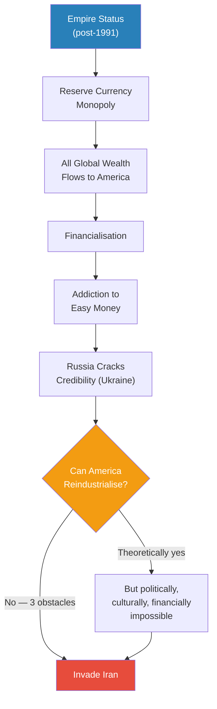

*The lecture's central argument compressed into a single chain: empire creates the financial system, the financial system creates addiction, addiction makes war inevitable when credibility is threatened.*

---

## Key Concepts at a Glance

| Concept | One-line summary |
|---------|-----------------|
| **Financialisation** | The shift from manufacturing goods (40% GDP) to speculating with money (22% GDP, 40% profits) |
| **Petrodollar system** | Oil is bought in US dollars -- giving the dollar value after gold backing was abandoned in 1971 |
| **Elite capture** | Trade profits are seized by a small elite, not shared with workers -- debunking trickle-down theory |
| **Professional-managerial elite** | The coastal, Ivy League class that replaced factory workers as America's dominant political force |
| **Rentier economy** | Young people can only rent, never own -- social mobility is permanently destroyed |
| **Speculative mindset** | The financial economy makes Bitcoin more rational than factory work -- killing the work ethic needed for reindustrialisation |
| **Imperial hubris** | Empires cannot imagine defeat: they impose reality (no feedback loop) and prefer arrogance (feels good) over strategy (feels bad) |
| **Paper tiger** | A power whose dominance is perception, not substance -- what Russia is trying to prove America has become |
| **Three pillars of the dollar** | Petrodollar + military invincibility + no alternative = why creditors keep buying US debt they know can never be repaid |

---

## The Golden Age and the Great Transition

*From 1950 to 1980, an American factory worker lived a life that would be the envy of any rich person in the developing world. After 1980, that life was systematically dismantled -- and the numbers tell the story of how.*

### The Best Life in Human History (1950-1980)

Prof. Jiang paints the 1950-1980 period in vivid, personal terms. This was not an abstract era of GDP growth -- it was a specific, tangible quality of life that a regular factory worker could expect:

- Worked 40 hours a week -- no more
- Had full health insurance through the employer
- Could buy a house on a single income
- Wife did not have to work
- Could afford 3-4 children
- Owned two cars
- Went on vacation once a year to someplace nice
- Ate out once a week
- Retired with a good pension

The numbers behind this lifestyle were equally striking:

- <b style="color: #2980b9">Manufacturing</b> accounted for **40% of GDP**
- Manufacturing employed **30% of the workforce**
- Factories that had produced weapons during WWII pivoted to consumer goods -- cars, electronics -- and sold them to the world

> [!tip] Core Insight
> Prof. Jiang's claim is stark: you were better off being born into the American middle class during 1950-1980 than being born rich in Africa, Asia, or South America. This was the wealthiest, most well-educated working class in human history.

The political implications were equally significant:

- Workers had real political power because they were confident, middle-class, and organised
- Unions gave workers a collective voice in governance
- Government policies reflected workers' interests, not just elite preferences
- There was a critical reason America treated its workers so well: <b style="color: #e74c3c">fear of communism</b>
  - The real threat was not the Soviet Union as a military power
  - The real threat was communism as an *ideology* -- a competing vision of how society should be organised
  - If American workers felt exploited, they might embrace communism
  - So the system had a built-in check: treat workers well, or risk internal revolt

> [!example] The Golden Age Factory Worker
> - A typical American factory worker in the 1960s earned enough on one salary to support a family of five or six
> - He worked a standard 40-hour week with health insurance, paid vacation, and a guaranteed pension
> - His family owned a house and two cars, ate out weekly, and took annual vacations
> - This standard of living was better than what wealthy families in most of Africa, Asia, and South America could expect
> - The system worked because WWII factories had retooled for consumer production, and America sold to the world
> **The lesson:** The American middle class was not a natural state -- it was a product of manufacturing dominance and the political pressure of competing with communism.

---

### The Reagan Revolution and the Shift to Finance

After 1980, something broke. Prof. Jiang identifies the <b style="color: #2980b9">Reagan Revolution</b> and the introduction of <b style="color: #2980b9">neoliberalism</b> -- an economic philosophy that believes in the primacy of free markets and deregulation -- as the turning point. But he will argue later that neoliberalism is the mechanism, not the root cause. The root cause is empire.

The numbers tell the story of a radical transformation:

| Metric | Manufacturing Era (1950-1980) | Financial Era (Today) |
|--------|------------------------------|----------------------|
| **Share of GDP** | 40% (manufacturing) | 22% (financial services); 10% (manufacturing) |
| **Share of profits** | Distributed across sectors | 40% (financial services alone) |
| **Share of workforce** | 30% (manufacturing) | 5% (financial services) |
| **Political power** | Workers and unions | Wall Street and coastal elite |
| **Career aspiration** | Professor, scientist, entrepreneur | Wall Street |
| **Economic character** | Productive / creative | Speculative |

The contrast is staggering. Financial services now generate **twice the GDP** of manufacturing, capture **40% of all profits**, yet employ only **5% of the workforce**. This means a tiny fraction of Americans capture a disproportionate share of the nation's wealth -- while the remaining 95% fight over what is left.

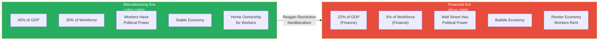

*The shift from manufacturing to finance transferred wealth and power from 30% of the population to 5% -- while making the economy fundamentally unstable.*

---

### The Four Consequences of Financialisation

Prof. Jiang traces four cascading consequences of this transition, each reinforcing the others:

**1. Political power shifted from workers to Wall Street**

- The <b style="color: #2980b9">professional-managerial elite</b> -- people who live on the coasts (San Francisco, New York, Washington DC, Boston), attended Ivy League schools, and are multicultural -- replaced factory workers as the most powerful political group
- Government policy now favours this elite at the expense of workers
- This has produced <b style="color: #e74c3c">massive political divisions</b> within the country -- the cultural and economic interests of the coastal financial class are fundamentally different from those of the working class

**2. Education was redirected from productive work to speculation**

- In the 1950s and 1960s, graduates of top universities aspired to be professors, scientists, entrepreneurs, or corporate executives
- Today, the overwhelming majority want one thing: <b style="color: #e74c3c">Wall Street</b>
- PhDs in statistics and artificial intelligence -- people who should be at IBM developing technology -- instead work for hedge funds gambling with other people's money
- The economy has shifted from one that is **productive and creative** to one that is **entirely speculative**

**3. The economy became chronically unstable**

- 2001: the dot-com crash
- 2008: the financial crisis (subprime mortgage collapse)
- 2023: three banks went bankrupt in a single week [Note: likely Silicon Valley Bank, Signature Bank, and First Republic Bank]
- All caused by the same mechanism: assets are overpriced, people gamble that prices will only rise, this creates bubbles, and when bubbles burst, the economy convulses
- <b style="color: #e74c3c">This instability is not accidental -- it is structural</b>. A speculative economy produces bubbles by design.

**4. Inequality became extreme and permanent**

- The top 1% capture a disproportionate and growing share of all wealth
- A <b style="color: #2980b9">rentier economy</b> emerged: young people can never afford to buy a house, they can only rent
- Without home ownership, there is no wealth accumulation, which means no social mobility
- The wealth gap becomes permanent and self-reinforcing

> [!example] PhDs on Wall Street
> - In the 1950s, a brilliant statistics graduate would aspire to work at a company like IBM, building technology that would change the world
> - Today, that same PhD goes straight to a hedge fund, designing algorithms to gamble with other people's money
> - The pay on Wall Street dwarfs anything available in science, technology, or education
> - Prof. Jiang presents this as the clearest symptom of a financialised economy: the smartest people in the country are engaged in speculation, not creation
> **The lesson:** When the financial sector captures 40% of profits with 5% of the workforce, it distorts every incentive in the economy -- including where the nation's best minds direct their talent.

> [!tip] Core Insight
> Financialisation is not just an economic problem -- it is destroying the fabric of American society. Politics becomes more divisive, the economy more volatile, talent is misdirected to speculation, and young people lose all hope of social mobility. Prof. Jiang's argument is that all of this traces back to a single root cause: empire.

---

### Why Empire -- Not Neoliberalism -- Is the Root Cause

Prof. Jiang acknowledges two competing explanations for why America became financialised, then rejects both as incomplete:

- **Late-stage capitalism theory:** Financialisation is the natural evolution of capitalism -- every capitalist economy eventually shifts from production to speculation. Prof. Jiang considers this a partial truth but not a complete explanation.
- **Neoliberalism / Reagan Revolution theory:** Cutting back the role of government and emphasising free markets directly caused over-financialisation. Prof. Jiang also considers this a partial truth -- neoliberalism was the mechanism but not the underlying driver.

His alternative: <b style="color: #27ae60">the real reason is the transition to empire</b>. After the Cold War ended in 1991 and the Soviet Union collapsed, America became the world's sole superpower -- a global empire. And an empire, by definition, sets the rules of the game. America set the rules so that it would always win, and so that all money would flow to America. That structural fact -- not ideology, not deregulation -- is the master cause.

To build this argument, Prof. Jiang traces the chain from America's founding all the way to the present.

---

### From the Declaration of Independence to Bretton Woods

The philosophical foundation begins in 1776. The founding fathers were Christians, but a specific type: <b style="color: #2980b9">deists</b> -- they believed God created the world but does not manage human affairs, leaving humans empowered to create the world they want. The Declaration of Independence enshrined three fundamental rights: life, liberty, and the pursuit of happiness.

Prof. Jiang emphasises that Thomas Jefferson wrote "pursuit of happiness" with a very specific meaning:

- **Life** = security, protection from enemies
- **Liberty** = freedom of speech and belief, tolerance of all creeds
- **Pursuit of happiness** = <b style="color: #27ae60">the right to amass as much wealth as possible</b>

The founding idea was that if every American is free to pursue wealth creation, the nation itself will become powerful. And it worked. America industrialised with extraordinary speed, and by the end of World War II it was the most powerful country on earth.

> [!example] The Bretton Woods Conference (1944)
> - By 1944, Nazi Germany's defeat was certain and Japan's was imminent
> - America gathered its European allies at Bretton Woods, New Hampshire, to design the post-war financial system
> - The core decision: the US dollar would become the global reserve currency -- meaning you could buy anything in the world with US dollars
> - Some economists at the conference warned this was dangerous -- giving one government control of the reserve currency would make it "God," able to print unlimited money like King Midas
> - The compromise: the **gold standard** -- every US dollar was essentially a receipt for gold
> - If you had a million dollars, you could walk into any American bank and receive a million dollars' worth of gold
> - This system produced tremendous prosperity in America, Europe, and Japan for decades
> **The lesson:** Bretton Woods gave the United States structural financial dominance over the world -- but the gold standard was the constraint that kept the system honest. Removing that constraint would change everything.

---

### Nixon, the Petrodollar, and the Birth of Financial Empire

The pivotal moment came in 1971. President Richard Nixon made a decision that would reshape the global economy: <b style="color: #e74c3c">America was going off the gold standard</b>.

The reason was straightforward: America had overspent. The space race, the Vietnam War, and domestic programs had drained the gold reserves. The country could no longer honour the promise that every dollar was convertible to gold.

But this created an existential problem: if the dollar was no longer backed by gold, what gave it value?

The answer was oil. Middle Eastern countries -- mainly Saudi Arabia -- agreed that oil could be purchased using US dollars. Since every economy on earth needs oil to function, every economy on earth now needed US dollars. This was the birth of the <b style="color: #2980b9">petrodollar system</b>.

- Before 1971: a million dollars = a million dollars' worth of gold
- After 1971: a million dollars = a million dollars' worth of oil
- The dollar's value shifted from a commodity guarantee (gold) to a utility guarantee (you need oil, oil costs dollars)

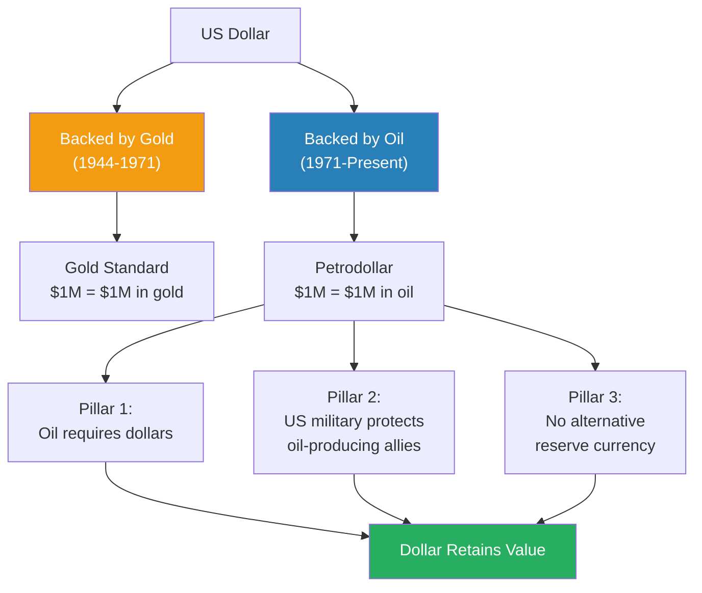

*The dollar's value rests on three pillars -- all ultimately dependent on the perception of American power. If military credibility cracks, the entire structure is threatened.*

> [!example] Nixon Ends the Gold Standard (1971)
> - By 1971, America had overspent on the space race, the Vietnam War, and domestic programs
> - The gold reserves could no longer back every dollar in circulation
> - President Nixon announced America would leave the gold standard -- the dollar would no longer be convertible to gold
> - The question became: if not gold, what gives the dollar value?
> - The answer: Saudi Arabia and other Middle Eastern nations agreed that oil would be sold exclusively in US dollars
> - Since every economy needs oil, every economy now needed dollars -- giving the currency a new foundation
> **The lesson:** The petrodollar replaced one anchor (gold) with another (oil) -- but oil-backed currency depends on controlling oil-producing regions, which is why the Middle East became existentially important to American power.

---

### 1991: The Soviet Union Falls and Empire Begins

The final piece fell into place in 1991. The Soviet Union collapsed, and America became the sole ruler of the global economy. At that point, America told the world: let us focus on trade, because trade will make everyone rich.

```mermaid
flowchart LR
    A["1776<br/>Declaration of<br/>Independence"] --> B["1944<br/>Bretton Woods<br/>Gold Standard"]
    B --> C["1950-1980<br/>Manufacturing<br/>Golden Age"]
    C --> D["1971<br/>Nixon Ends<br/>Gold Standard"]
    D --> E["1971+<br/>Petrodollar<br/>System"]
    E --> F["1980<br/>Reagan Revolution<br/>Neoliberalism"]
    F --> G["1991<br/>Soviet Collapse<br/>Empire Begins"]
    G --> H["2001<br/>Dot-com<br/>Crash"]
    H --> I["2008<br/>Financial<br/>Crisis"]
    I --> J["2022<br/>Russia Invades<br/>Ukraine"]
    J --> K["Present<br/>Empire in<br/>Crisis"]
    style A fill:#2980b9,color:#fff
    style C fill:#27ae60,color:#fff
    style G fill:#f39c12,color:#fff
    style K fill:#e74c3c,color:#fff
```

*Two and a half centuries compressed: from founding philosophy to financial empire to crisis -- each stage building on the structural choices of the previous one.*

The theory behind globalised trade sounded reasonable. Prof. Jiang lays out two mainstream economic theories that every university teaches:

**Theory 1: Trade makes everyone rich (comparative advantage)**

- Each country focuses on its competitive advantage -- what it is best at
- China is good at cheap labour, America is good at technology
- China makes cheap goods for American consumers
- In theory, the profits trickle down to Chinese workers, raising their wages
- When Chinese workers earn more, they buy American products (iPhones, etc.)
- Over time, trade balances out and both countries get richer

**Theory 2: Capital flows to where it grows the most**

- In a globalised world, investors should move money to where returns are highest
- A million dollars buys one house in America but ten houses in China
- So capital should flow from rich countries (US) to developing countries (China)
- This investment accelerates growth in poorer countries, eventually balancing the global economy

Prof. Jiang's verdict on both theories: <b style="color: #e74c3c">they are false</b>.

---

### Trade Theory vs. Reality: Elite Capture and the Safety Trap

The gap between economic theory and imperial reality is where Prof. Jiang's argument becomes most powerful.

**Why Theory 1 fails -- elite capture:**

- Trade profits do not trickle down to Chinese workers
- Workers' wages have stagnated [Note: scholars debate this; nominal wages have risen, but Prof. Jiang's point is about the distribution of gains]
- Instead, all profits are captured by a small elite -- a phenomenon Prof. Jiang calls <b style="color: #2980b9">elite capture</b>
- These elites cannot spend the money domestically fast enough
- Their only option is to invest it -- but where?

**Why Theory 2 fails -- safety over growth:**

- Capital does not flow to where it grows the most
- Capital flows to where it is <b style="color: #27ae60">the safest</b>
- Because the United States controls the reserve currency and has the world's most powerful military, America is the safest place to park money
- So Chinese elites, Russian oligarchs, Middle Eastern royals, and wealthy people everywhere do the same thing: send their money to America
- Not because American returns are highest, but because the money is protected there

> [!abstract] Theory vs. Reality: Where Does Global Wealth Go?
> | | Theory | Reality |
> |---|--------|---------|
> | **Trade profits** | Trickle down to workers, raising wages and purchasing power | Captured by elites who invest abroad |
> | **Capital flows** | Move to highest-growth economies (developing countries) | Move to safest economy (America) |
> | **Net result** | Global wealth distributes evenly over time | All wealth concentrates in America |
> | **Root cause of distortion** | -- | Empire: the US controls the reserve currency and the military, making it the only "safe" destination |

The result is that regardless of where wealth is generated in the world, it all ends up in one place: the United States. And Prof. Jiang has the numbers to prove it.

---

### The Stock Market Evidence: 1900 vs. 2024

This is the lecture's most striking piece of evidence -- a single comparison that makes the empire thesis visceral:

**Global stock market share in 1900:**
- UK: 24-25% (the world's most powerful country at the time)
- United States: 14.5%
- Germany: ~13%
- France: ~11%

This distribution makes sense -- it reflects the actual industrial power of the world's four strongest economies, roughly balanced.

**Global stock market share in 2024:**
- <b style="color: #e74c3c">United States: 60%</b>
- Japan: 6% (second place)
- China: 3%

The number one economy holds **ten times** the stock wealth of the number two economy. The world's second-largest economy by GDP (China) holds only **3%** of global stock wealth. This is not a market outcome -- it is an imperial one.

> [!tip] Core Insight
> The shift from 14.5% to 60% of global stock wealth is not explained by American productivity, innovation, or market efficiency. It is explained by the structural design of the global financial system under American empire: all wealth flows to the imperial centre because the dollar is the reserve currency, oil is priced in dollars, and there is nowhere else safe to put money.

This concentration is what drives financialisation. When all the world's wealth flows into America, someone has to manage it -- and that someone is Wall Street. The financial services sector exists and dominates because it manages the world's capital. And the way Wall Street makes money reveals another layer of the problem.

Wall Street professionals earn their income through <b style="color: #2980b9">management fees</b> -- a percentage of all assets under management:

- They are **not** incentivised to grow client wealth conservatively
- They **are** incentivised to design riskier and riskier assets and investment opportunities
- Riskier assets attract more capital from global investors looking for higher returns
- More capital under management means more management fees
- This creates a structural drive toward speculation and instability -- not as a bug, but as the business model

> [!example] Wall Street's Perverse Incentive Structure
> - Wall Street makes money from management fees -- a cut of all money they manage
> - Whether the investments gain or lose value, the fee is collected
> - This creates a perverse incentive: the goal is not to make money grow safely, but to attract as much money as possible
> - To attract more capital, firms design increasingly risky and exotic investment products
> - Riskier products offer higher potential returns, which draws in more global investors
> - More investors means more assets under management, which means more fees
> - The result: Wall Street profits from making the economy riskier, not safer
> **The lesson:** The people managing the global financial system are structurally incentivised to make it more unstable -- because instability is more profitable than stability.

---

## Why Can't America Simply Reindustrialise?

*The obvious solution to America's financial addiction is to go back to what worked: manufacturing. Prof. Jiang explains why this is theoretically correct but practically impossible -- and why that impossibility makes war the only remaining option.*

### The Theoretical Fix

Prof. Jiang concedes the point clearly: if America transitioned from a financial economy back to a manufacturing economy, the crisis would disappear. America is a <b style="color: #27ae60">self-sufficient economy</b> -- it has the natural resources, the land, and the population to sustain itself without trading with the rest of the world. A manufacturing America would not need to worry about the national debt, about Russia, or about maintaining global confidence in the dollar. It would simply be invincible on its own terms.

But the question is not whether reindustrialisation would work. The question is whether it can happen.

---

### Three Obstacles That Block the Way Back

Prof. Jiang identifies three barriers, each independently sufficient to kill reindustrialisation -- and together, they make it structurally impossible.

**Obstacle 1: The financial elite will fight it**

- The financial sector now controls American politics
- Wall Street and the <b style="color: #2980b9">professional-managerial elite</b> are the most powerful political force in the country
- Their wealth, influence, and career interests are all tied to financialisation continuing
- Reindustrialisation would transfer power back to workers and manufacturing -- the financial elite will block this at every turn
- Student Jack articulates this point in class, and Prof. Jiang affirms it as the most important obstacle: "That's exactly right, Jack"

**Obstacle 2: The speculative mindset has destroyed the work ethic**

- <b style="color: #e74c3c">The financial economy creates a psychology where nobody wants to work hard</b>
- If you are a young person, you would much rather invest in Bitcoin than work in a factory
- Bitcoin offers the possibility of becoming rich quickly; factory work means 40 years of hard labour just to buy a house
- The rational choice in a financialised economy is speculation, not production
- This is not laziness -- it is the logical response to an economy that rewards gambling over labour
- You cannot build a manufacturing workforce when the culture tells everyone that speculation is smarter than production

**Obstacle 3: The investment required is enormous**

- Reindustrialisation does not mean simply building factories
- You also need to rebuild entire <b style="color: #2980b9">logistics networks</b> -- the infrastructure to move goods from production to market
- The capital required is staggering, and the timeline would be at least 50 years
- Where would this money come from when the financial system is designed to reward speculation, not long-term industrial investment?

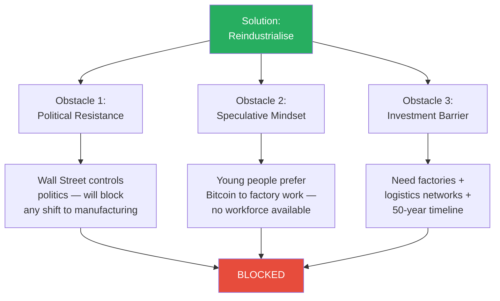

*All three obstacles are independently fatal. Even if the political resistance were overcome, the cultural and investment barriers would remain. Reindustrialisation is theoretically the right answer -- but practically impossible.*

> [!example] Jack's Question and the Bitcoin Generation
> - Prof. Jiang asks the class: can America reindustrialise?
> - Student Jack immediately identifies the core obstacle: the politics will not allow it -- the financial sector has too much power and wants to perpetuate financialisation
> - Prof. Jiang affirms Jack's answer, then pushes further
> - Even if you solved the political problem, who would work in these factories?
> - A young person today faces a clear choice: spend 40 years working hard in a factory to buy a house, or invest in Bitcoin for the chance to get rich now
> - The financial economy has created a generation that sees speculation as rational and factory work as irrational
> - And even if you found the workers, where does the money come from to build the factories and the logistics networks?
> **The lesson:** The financial economy has not just changed who holds power -- it has changed how people think. You cannot rebuild a manufacturing culture in a society that has learned to view hard work as a sucker's game.

---

### The Debt Problem: A Ticking Clock

The urgency behind all of this is the national debt. Prof. Jiang lays out the numbers:

- US national debt: approximately <b style="color: #e74c3c">$34 trillion</b>
- Half of this is owned by foreigners -- Japan holds roughly $1 trillion, China roughly $800 billion in US Treasuries
- The other half the government owes to its own citizens, primarily through the military budget and the pension system
- The debt is growing by roughly $1-2 trillion every two to three months [Note: this likely refers to total debt growth, not interest payments alone]
- There is <b style="color: #e74c3c">absolutely no way America can repay this debt</b>

So why do Japan and China keep buying US Treasuries, knowing they will never be repaid? Prof. Jiang identifies <b style="color: #2980b9">three pillars</b> holding up the system:

1. **The petrodollar** -- creditors can always use US debt to buy oil, so the debt has functional value
2. **Military power** -- America is still the greatest military power in the world, so the money feels safe
3. **No alternative** -- there is literally nowhere else to put the money; no other economy offers the same combination of size and perceived stability

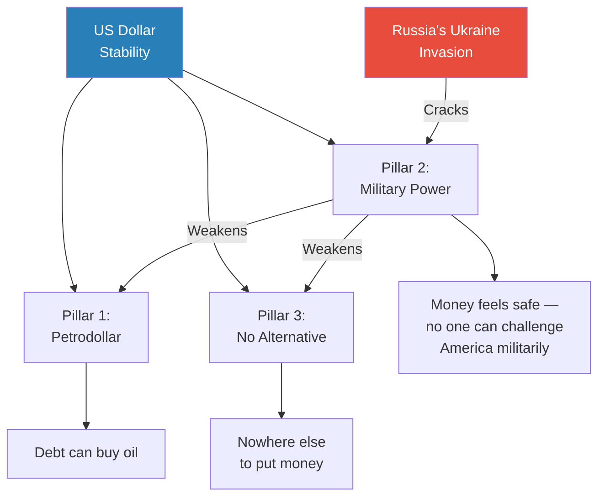

*The three pillars are interdependent. Military credibility is the keystone -- if it cracks, the petrodollar weakens and alternatives suddenly become thinkable.*

> [!tip] Core Insight
> In theory, the system could continue forever: creditors keep buying debt they know will never be repaid because there is nowhere else to go. But this depends entirely on one perception -- that America is militarily invincible. The moment that perception breaks, all three pillars tremble simultaneously.

---

### Why War Becomes the Only Option

Prof. Jiang's logic arrives at its conclusion through elimination:

- America cannot reindustrialise -- three structural obstacles block it
- America cannot beat Russia in Ukraine -- the war is going badly
- America cannot sit back and let the empire collapse -- the financial system would implode, triggering a sovereign debt crisis and the loss of easy money
- <b style="color: #27ae60">The only remaining option: a dramatic military demonstration that restores global confidence</b>

And invading Iran accomplishes exactly this. Prof. Jiang identifies three benefits:

1. **Prove military invincibility** -- show the world that America is still the top dog, that its military cannot be defeated, and therefore that the US dollar is safe
2. **Control oil** -- Iran is the world's fourth-largest oil exporter, and the Middle East produces 40% of the world's oil. Controlling Iran also means controlling Iraq and the surrounding region. This protects the petrodollar directly.
3. **Control shipping lanes** -- most of the world's trade passes through the Middle East. Controlling Iran gives America control over global trade routes.

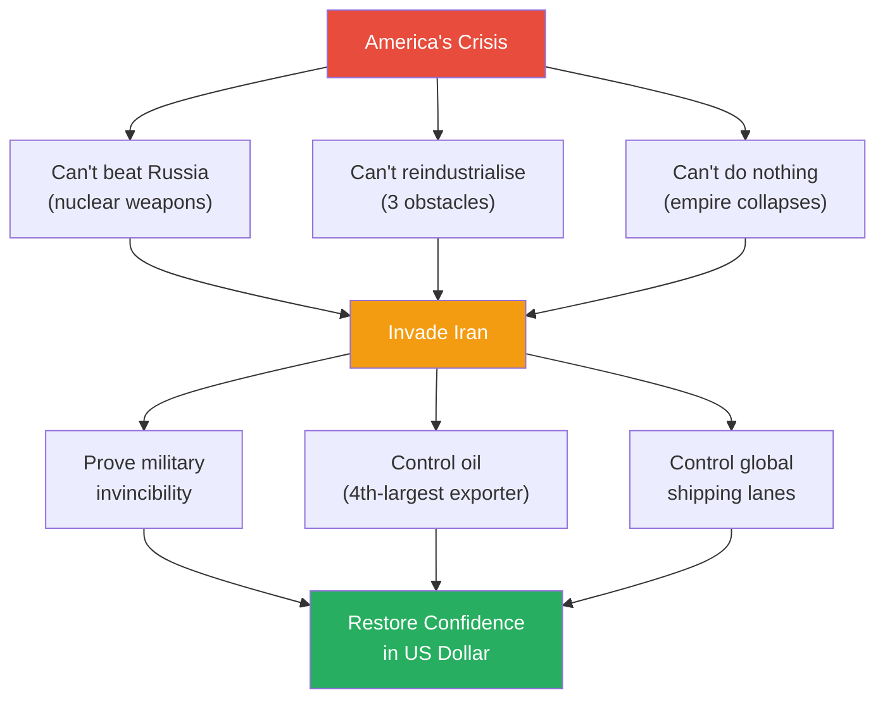

*Invading Iran is not a strategic masterstroke -- it is the path of least resistance when every other path is blocked. The motivation is not ideology or revenge. It is the structural imperative of a financial empire that must prove its dominance or die.*

> [!example] The Elimination of Alternatives
> - America cannot fight Russia directly -- Russia has nuclear weapons
> - America cannot reindustrialise -- Wall Street controls politics, nobody wants to work in factories, and the investment would take 50 years
> - America cannot sit still -- if the empire looks weak, creditors pull out, the dollar collapses, and the financial system implodes
> - But if America invades Iran, it proves military dominance, seizes oil, and controls trade routes -- all in one stroke
> - Prof. Jiang's point is not that this is a good idea; it is that empire has eliminated every other option
> **The lesson:** When an empire's financial survival depends on the perception of military invincibility, and that perception is cracking, war becomes not a choice but a structural necessity.

---

## How Does Russia's Challenge Accelerate the Crisis?

*Two to three years ago, something happened that shattered the careful illusion holding the entire system together: Russia invaded Ukraine. Prof. Jiang explains why this was not just a territorial war -- it was a direct challenge to the foundation of American financial hegemony.*

### Putin's Real Message

Prof. Jiang reframes the Ukraine war as something far larger than a regional conflict. What Putin is really saying to America, in Prof. Jiang's words, is: "I think your empire is based on nothing. Your empire is based on the perception that you are invincible in war. Well, I'm going to prove everyone wrong."

- Russia's invasion is a test of the <b style="color: #2980b9">paper tiger</b> thesis -- the claim that American military dominance is perception, not reality
- If Putin succeeds in Ukraine, the foundational assumption on which the entire global financial system rests -- <b style="color: #e74c3c">that America is militarily invincible and therefore the US dollar is safe</b> -- will be destroyed
- And the war is going badly for America: Prof. Jiang bluntly says "the war is almost over" [Note: delivered during the 2023-2024 academic year]

### The Cascading Effect

The damage does not stop at Ukraine. Prof. Jiang traces a cascade of challenges that followed Russia's demonstration:

- African nations are rebelling against Western powers (particularly France and America) -- because they believe the power balance has shifted and Putin is now ascendant
- <b style="color: #e74c3c">Hamas attacked Israel on October 7, 2023</b> -- Prof. Jiang argues this would not have happened without the Ukraine war
  - Before Ukraine, no power or group would have dared to challenge the United States or its allies so directly
  - The invasion of Ukraine shattered the perception of American invincibility
  - Once that perception broke, challengers emerged everywhere

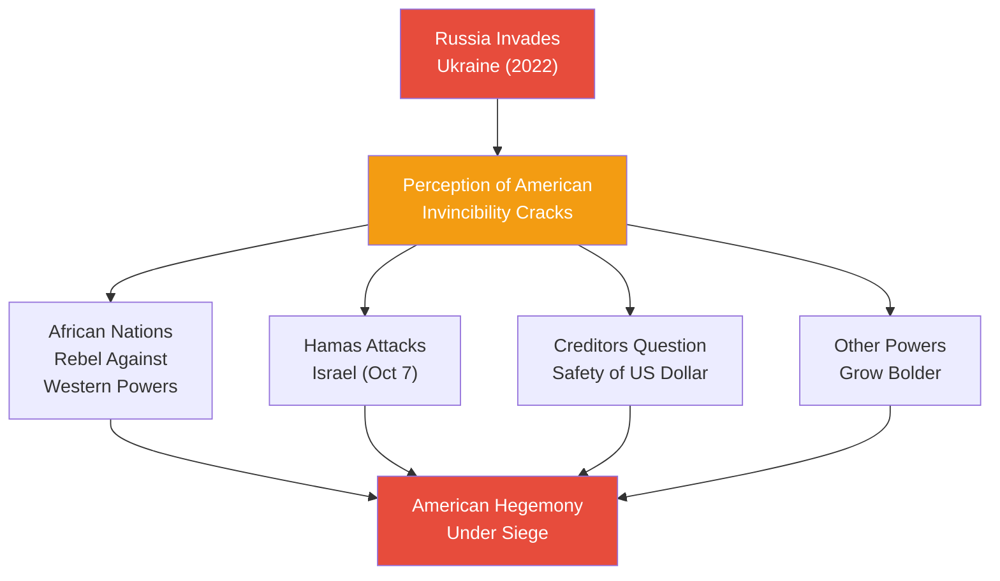

*Once imperial credibility cracks, challenges do not arrive one at a time -- they cascade. Each successful defiance emboldens the next challenger.*

> [!example] The October 7 Connection
> - Before Russia's invasion of Ukraine, there was a global perception that America was militarily invincible
> - No country and no armed group would dare challenge the United States or its closest allies directly
> - Russia's invasion proved that America could be defied -- and that the consequences were survivable
> - Prof. Jiang argues that Hamas's attack on Israel on October 7, 2023 was a direct consequence of this perception shift
> - Without Ukraine demonstrating that America can be challenged, Hamas would not have attempted such an attack
> - The logic extends further: every nation and group watching Ukraine is recalculating whether American power is real
> **The lesson:** Imperial power depends on the belief that the empire is invincible. Once that belief cracks, the empire faces not one challenge but many -- simultaneously.

### Why Iran Becomes the Answer

The connection between Ukraine and Iran is direct in Prof. Jiang's framework:

- America is losing in Ukraine and cannot escalate against a nuclear power
- But America must demonstrate military dominance somewhere to restore global confidence
- The financial consequences of inaction are existential: if China, Japan, and other creditors sell their US Treasuries, America faces a <b style="color: #e74c3c">sovereign debt crisis</b> and loses access to the easy money that sustains the entire system
- Iran is the target that solves all three problems at once -- military demonstration, oil control, and trade route dominance

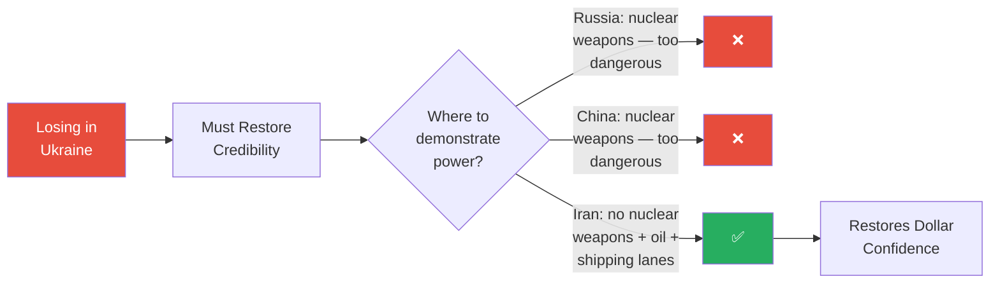

*Iran is the only target that is militarily feasible (no nuclear weapons), economically rewarding (oil + trade routes), and strategically sufficient (demonstrates global dominance). It is not the best option -- it is the only one left.*

---

## Prof. Jiang's Three Predictions

*The lecture culminates in the framework that structures the entire Geo-Strategy series: three predictions about what will happen next -- and why each follows logically from the structural analysis.*

### Prediction 1: America Will Invade Iran

The entire lecture has built toward this conclusion:

- The financial empire depends on global confidence in the US dollar
- That confidence rests on three pillars: petrodollar, military power, no alternative
- Russia's Ukraine invasion has cracked the military power pillar
- Reindustrialisation is blocked by political, cultural, and investment barriers
- <b style="color: #27ae60">Invading Iran is the politically easiest option</b> that simultaneously demonstrates military invincibility, secures oil, and controls shipping lanes
- The Israel lobby and Christian Zionism (Lecture 2) provide the political cover
- The structural economic imperative (this lecture) provides the underlying motive

### Prediction 2: America Will Lose

This connects directly to [[01 - Iran's Strategy Matrix|Lecture 1]], where Prof. Jiang analysed Iran's asymmetrical warfare strategy:

- Iran has studied every American weakness and designed its strategy around <b style="color: #2980b9">asymmetrical warfare</b> -- never fighting the war America wants to fight
- America's military is built for conventional dominance; Iran's strategy is designed to make conventional dominance irrelevant
- But the deeper reason America will lose is <b style="color: #e74c3c">imperial hubris</b>

Student Jack asks the critical question: if invading Iran is about restoring confidence, what happens if America loses? Won't that destroy confidence even further?

Prof. Jiang acknowledges this is exactly the problem -- and then explains why empires cannot factor this risk into their calculations. Imperial hubris operates through two mechanisms:

1. **Empires impose reality** -- they force others to see the world as the empire sees it. This means there is no feedback loop. The empire cannot receive the information that would warn it. If it could imagine collapse, it would never collapse in the first place.
2. **People prefer arrogance over strategy** -- Prof. Jiang poses a thought experiment: would you rather be smart and strategic, or stupid and arrogant? The answer, he argues, is stupid and arrogant -- because it feels good. Smart people doubt themselves, question themselves, and feel bad. Empires, being made of people, naturally gravitate toward the option that feels better.

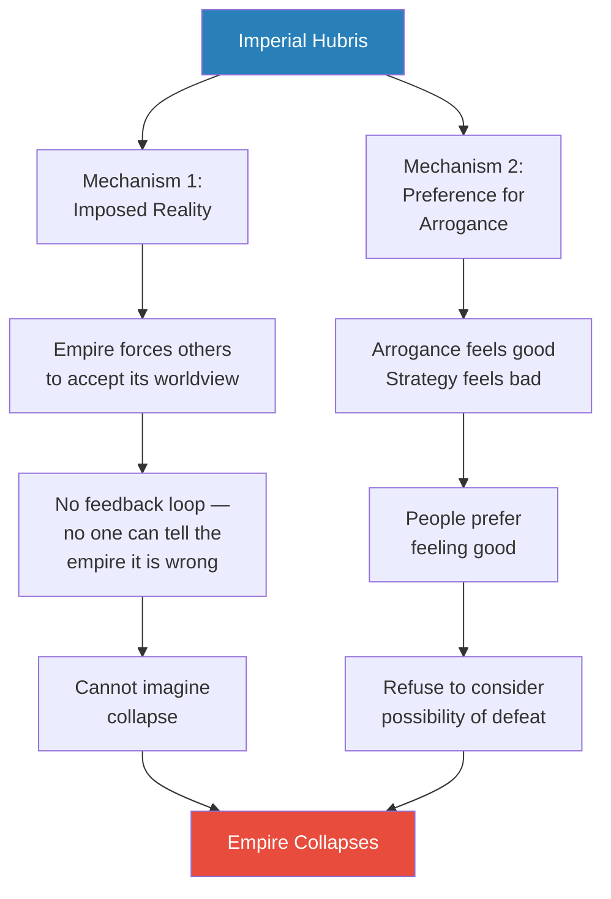

*Imperial hubris is not a personality flaw -- it is a structural feature. Empires are systems designed to impose reality, which means they are structurally incapable of receiving the feedback that would save them.*

### Prediction 3: This Will Accelerate Imperial Decline

If America invades Iran and loses, the consequences cascade:

- Global confidence in American military invincibility collapses permanently
- Creditors (China, Japan, others) begin pulling out of US Treasuries
- The US dollar loses its status as the unquestioned reserve currency
- The financial system that depends on easy money implodes
- Domestically, the addiction to easy money means Americans cannot tolerate the transition to a harder life
- The empire enters a terminal decline spiral: military failure reinforces financial failure, which reinforces political instability

> [!tip] Core Insight
> Prof. Jiang's most devastating argument is this: America is an empire addicted to easy money. People are so accustomed to making millions by sitting around speculating that they cannot imagine or tolerate a world where they have to work hard. This addiction -- not any external enemy -- is what will ultimately destroy the empire. The invasion of Iran is the addict's last desperate attempt to sustain the high.

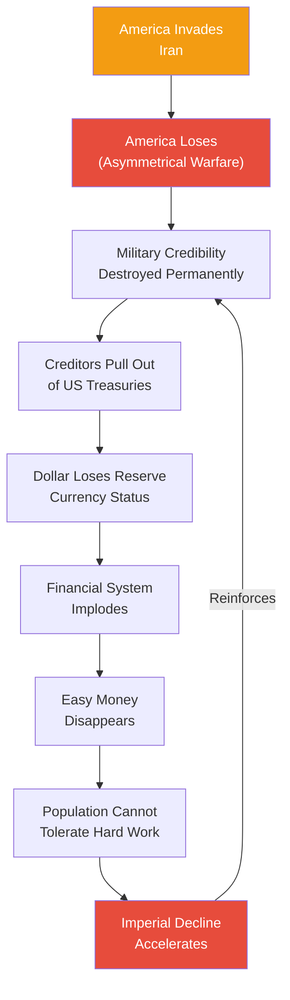

*The decline spiral is self-reinforcing: military failure destroys financial confidence, financial collapse makes military recovery impossible, and a population addicted to easy money cannot endure the transition. Each element accelerates the others.*

---

## Student Questions That Shaped the Argument

*Some of the lecture's most important insights emerge not from the prepared material but from the Q&A -- where student Jack's probing questions force Prof. Jiang to confront the logical consequences of his own argument.*

### Jack on Reindustrialisation: The Political Lock

The first major Q&A moment comes when Prof. Jiang asks the class whether America can reindustrialise. Student Jack immediately identifies the structural barrier:

- The financial sector has captured American politics
- Wall Street and the professional-managerial elite will resist any shift that transfers power back to manufacturing
- They are not going to voluntarily surrender the system that makes them rich
- Prof. Jiang affirms this as the most important obstacle: the politics will not allow it

But Prof. Jiang then pushes the class beyond Jack's answer. Even if the political resistance were magically overcome, two deeper problems remain:

- <b style="color: #e74c3c">The speculative mindset has destroyed the willingness to do hard work</b> -- young people would rather gamble on Bitcoin than work in a factory for 40 years
- The sheer investment required to rebuild factories *and* the logistics networks to move goods is staggering -- Prof. Jiang estimates at least 50 years

> [!tip] Core Insight
> Jack's question reveals the structural lock: the system that needs to be dismantled is the same system that controls the levers of power. Reindustrialisation would require the financial elite to vote against their own interests -- something no ruling class in history has done voluntarily.

---

### Jack on What Happens If America Loses: The Hubris Trap

The lecture's single most important exchange comes when Jack asks the devastating follow-up: if invading Iran is about restoring confidence, what happens if America *loses*?

- Jack's logic is airtight: losing a war you launched to prove invincibility would destroy confidence even faster than not fighting at all
- Prof. Jiang acknowledges this is exactly the problem
- But then he explains why empires cannot factor this risk into their calculations

This is where Prof. Jiang introduces the two-mechanism model of <b style="color: #2980b9">imperial hubris</b>:

1. **Empires impose reality** -- they force others to see the world the way the empire wants. This destroys the feedback loop. No one can tell the empire it is wrong, and the empire has no mechanism to hear it even if they could.
2. **People prefer arrogance over awareness** -- Prof. Jiang poses the thought experiment directly: would you rather be smart and strategic, or stupid and arrogant? The answer is stupid and arrogant -- because it feels good. Smart people doubt themselves, question themselves, and feel miserable. Empires, being composed of people, naturally gravitate toward the option that provides psychological comfort.

> [!example] Jack's Devastating Question
> - Jack asks: if America invades Iran to restore confidence, but then loses, won't that destroy confidence even further?
> - Prof. Jiang confirms this is exactly the paradox
> - But empires cannot reason about this possibility because they are structurally unable to imagine defeat
> - The feedback loop is broken: the empire imposes its reality onto others, so no dissenting information reaches the decision-makers
> - And even if it did, the natural human preference for feeling good over being right means leaders would dismiss it
> **The lesson:** The same hubris that makes war feel necessary also makes defeat unimaginable -- which is why empires march into wars they cannot win.

---

### The Money Management Question: Bubbles All the Way Down

A third Q&A moment reveals the self-defeating nature of the system. When the question arises of how all this money flowing into America is actually managed, Prof. Jiang's answer is bleak:

- You can invest in the stock market or in housing -- but both are bubbles now
- There are too many rich people in the world, and all their money ends up in America
- This pushes up asset prices beyond any rational valuation
- The irony: investing in America feels like the only option, but the act of investing *creates* the very bubbles that will eventually destroy wealth
- <b style="color: #e74c3c">The system is not sustainable</b> -- everyone investing in America pushes up prices, but in the long term, those prices collapse

This exchange reveals a cruel paradox at the heart of the financial empire: the mechanism that sustains it (global capital flowing in) is also the mechanism that will eventually destroy it. Every dollar that flows into American markets inflates the bubble further, bringing the inevitable crash closer.

---

### The Closing Insight: Why No Opposing Ideology Matters

Prof. Jiang closes with a point that connects this lecture back to the broader series. The American Empire has been building since World War II and became dominant after 1991 -- but before the Cold War ended, America had to behave itself:

- The real threat was never the Soviet Union as a military power
- The real threat was <b style="color: #27ae60">communism as an opposing ideology</b>
- From 1950 to 1980, America treated its workers well because it feared a worker revolt inspired by communist ideas
- Today, with no opposing ideology, there is no internal check on imperial behaviour
- America can do what it wants, fearing neither external enemies nor internal revolt

This is why the golden age ended: not because capitalism evolved, but because the ideological competitor that forced capitalism to be humane disappeared.

---

## The Empire Trap -- Why There Is No Way Out

*The lecture's individual arguments -- financialisation, debt, Russia's challenge, reindustrialisation's impossibility -- are devastating on their own. But their true force emerges when synthesised into a single structural trap: a no-win scenario from which the American empire cannot escape.*

### The Core Dilemma

Prof. Jiang's argument, taken to its logical conclusion, reveals a tragic paradox:

- <b style="color: #e74c3c">America needs empire to sustain its financial system</b> -- without the perception of military invincibility and dollar supremacy, creditors pull out, the debt becomes unserviceable, and the easy money disappears
- Empire requires periodic military demonstrations to maintain credibility -- especially after Russia's Ukraine invasion cracked the illusion
- But military demonstrations risk defeat -- and defeat against Iran (as Lecture 1 established) would accelerate the very collapse the invasion was meant to prevent
- Meanwhile, *not* acting also leads to collapse -- doing nothing lets the perception of weakness solidify, encouraging more challengers and eroding creditor confidence

The trap is that every available path leads to the same destination. The only question is the speed and manner of arrival.

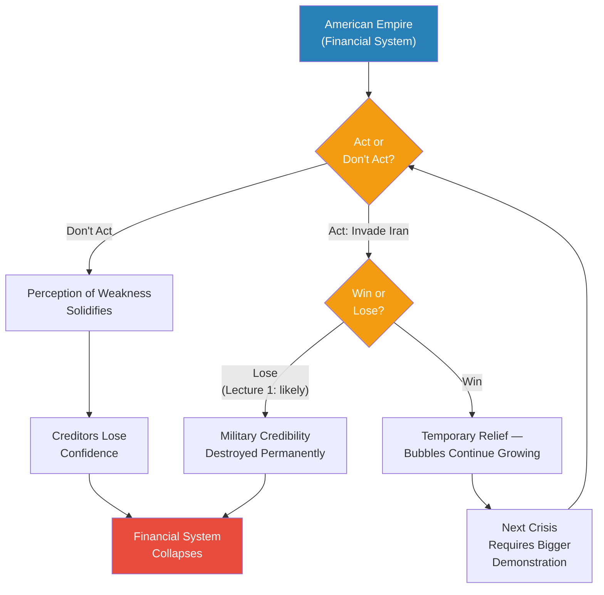

*The empire trap is a no-win decision tree. Inaction leads to slow collapse. Action risks accelerated collapse. Even victory only buys time before the next crisis demands an even larger demonstration -- because the underlying addiction to easy money remains unaddressed.*

---

### Why Even Victory Cannot Save the Empire

The trap's deepest layer is that winning a war against Iran would not solve the structural problem -- it would only delay it:

- A military victory restores confidence *temporarily*
- But the financial addiction remains: Wall Street still controls politics, the speculative mindset still dominates culture, and the bubble economy still grows
- The next crisis -- whether another challenger, another financial crash, or another creditor scare -- would demand yet another military demonstration
- Each cycle requires a bigger demonstration to achieve the same effect, because each previous demonstration has raised the threshold of what counts as proof of invincibility
- <b style="color: #e74c3c">The empire is on a treadmill that only accelerates</b>

*The empire treadmill: each crisis demands a military demonstration, each demonstration provides only temporary relief, each temporary relief allows the underlying addiction to deepen, which guarantees a larger crisis will follow.*

> [!abstract] The Empire Trap -- Summary
> | Path | Outcome | Timeline |
> |------|---------|----------|
> | **Do nothing** | Perception of weakness solidifies, creditors pull out, dollar collapses | Years |
> | **Invade Iran and lose** | Military credibility destroyed permanently, financial system implodes | Months |
> | **Invade Iran and win** | Temporary confidence restored, but bubbles keep growing, next crisis demands bigger demonstration | Decade at most |
> | **Reindustrialise** | Would solve everything -- but politically, culturally, and financially impossible | 50+ years (if ever) |

The tragedy is not that America chose empire. The tragedy is that empire chose a path from which there is no exit -- only different speeds of decline.

---

## Connections

**Builds on:**
- [[01 - Iran's Strategy Matrix]] -- Lecture 1 established *how* Iran would fight (asymmetrical warfare) and *why* it might win. This lecture establishes *why* America will invade in the first place: the structural imperatives of a financial empire. Imperial hubris, introduced briefly in Lecture 1, is expanded here into a two-mechanism structural model.
- [[02 - Christian Zionism and the Middle East Conflict]] -- Lecture 2 established the third reason for invasion (Israel lobby and Christian Zionism) and the Pax Americana inequality framework. This lecture provides the first reason (defence of empire) and shows how financialisation is the mechanism through which imperial peace produces the inequality Lecture 2 described.

**Sets up:**
- [[04 - Saudi Arabia's Trump Card Against Iran]] -- the second reason for invasion (ally pressure from Saudi Arabia and Israel) is flagged but deferred. The petrodollar relationship with Saudi Arabia introduced here will become central.
- [[05 - Why Trump Will Win]] -- the political dynamics described here (Wall Street vs. workers, financial elite vs. working class, the speculative mindset destroying the work ethic) directly set up the analysis of why Trump's populist appeal succeeds.
- [[06 - America's Imperial Hubris]] -- imperial hubris is given its two-mechanism explanation here but positioned for much deeper treatment. Lecture 6 will explore why hubris is not a personal failing but a structural feature of all empires.

**Related Civilization lectures:**
- [[06 - Elite Overproduction and the Bronze Age Collapse]] -- elite overproduction and the collapse of complex systems when elites capture too much wealth mirrors the financialisation argument directly
- [[08 - Rat Utopia and the Peloponnesian War]] -- the theme of civilisational decline driven by internal decadence rather than external threat parallels the "addiction to easy money" argument
- [[12 - The Tyranny of Alexander the Great]] -- Alexander's imperial overextension and inability to recognise limits mirrors the hubris framework

**Related books in vault:**
- [[The Changing World Order - Ray Dalio]] -- Dalio's framework of empire rise-and-decline cycles, debt crises, and reserve currency shifts directly parallels Prof. Jiang's argument about financialisation and imperial decline
- [[Sapiens - Yuval Noah Harari]] -- the agricultural revolution and the "luxury trap" (humanity's inability to reverse comfortable-but-destructive choices) mirrors the empire trap: America cannot go back to manufacturing even though it would be better off
- [[Antifragile - Nassim Nicholas Taleb]] -- the concept of fragility increasing with complexity applies directly: the financial system's complexity makes it more vulnerable, not more resilient
- [[The 48 Laws of Power - Robert Greene]] -- Law 1 (Never Outshine the Master) and the recurring theme of overreach and hubris connect to the imperial hubris framework
- [[The Psychology of Money - Morgan Housel]] -- the speculative mindset, the difficulty of long-term thinking in a culture of easy money, and the gap between rational behaviour and actual behaviour
- [[Thinking Fast and Slow - Daniel Kahneman]] -- the no-feedback-loop explanation of hubris connects to System 1 thinking, overconfidence bias, and narrative fallacy

---

## The Takeaway

This lecture's greatest contribution is reframing the potential American invasion of Iran as an economic necessity rather than a geopolitical choice. Prof. Jiang strips away the narratives of ideology, security, and moral mission to reveal the structural machinery underneath: an empire that transitioned from producing goods to gambling with money, that became addicted to the easy wealth flowing in from every corner of the world, and that now faces a crisis of credibility it cannot resolve through any means other than war. The invasion of Iran is not about Iran at all. It is about proving to Japan, China, and every other creditor holding US Treasuries that the American military is still invincible -- and therefore that their money is still safe.

The most counterintuitive insight is that America's greatest vulnerability is not military but psychological. The speculative mindset -- the cultural transformation that makes Bitcoin more rational than factory work, that makes gambling smarter than production -- is what makes reindustrialisation impossible. Even if every political obstacle were removed, you cannot build a manufacturing workforce in a society that has learned to view hard work as irrational. The addiction to easy money is not just an economic condition; it is a civilisational one. And like all addictions, it demands ever-larger doses to achieve the same effect, while making the addict increasingly incapable of imagining life without the substance.

The question Prof. Jiang leaves unresolved -- and which the series will continue to explore -- is whether the empire trap is unique to America or whether it is the inevitable fate of all empires that achieve financial dominance. If the pattern is universal, then the decline of American hegemony is not a policy failure that could have been avoided but a structural feature of empire itself: the same mechanisms that create dominance also create the addiction, the hubris, and the blindness that guarantee its end. The remaining lectures will test this thesis against Saudi strategy, Trump's political dynamics, and the deeper psychology of imperial hubris.
