# Saudi Arabia's Trump Card Against Iran

> Most people assume Iran's greatest enemy is Israel. Prof. Jiang argues they are wrong — Iran's real enemy is Saudi Arabia. Before 1979, the two nations were close allies: both monarchies, both secular, both oil-rich, both sheltered by American power. Then the Islamic Revolution detonated like a political earthquake, turning allies into ideological enemies competing across three dimensions — religion, economics, and geopolitical influence. Saudi Arabia has lost every proxy war it has fought against Iran, discovered that its entire economy can be destroyed by cheap drones, and concluded that only America can save it. This lecture completes the three-force model driving the United States toward war with Iran: the Israel lobby (Lecture 2), empire economics (Lecture 3), and now the Saudi-Iran rivalry — the force that comes with a face, a name, and a $2 billion financial trail.

---

## The Question

*What is the third and final force driving the United States toward war with Iran — and how did Saudi Arabia transform from Iran's closest ally into the country most aggressively pushing America into a conflict that could trigger World War Three?*

Prof. Jiang opens with a review of the two forces already established in the series:

- <b style="color: #2980b9">Force 1 — The Israel Lobby (Lecture 2):</b> Millions of Christian Zionists believe a war in the Middle East — specifically between Israel and Iran — will bring Jesus back to Earth. This is not a metaphor. They want their God to return, and they believe war is the mechanism that forces it.
- <b style="color: #2980b9">Force 2 — Empire Economics (Lecture 3):</b> America is $34 trillion in debt, growing by a trillion every two months. It can sustain this only as long as the world fears American military power. Putin's invasion of Ukraine is eroding that fear. America must demonstrate it is still the military hegemon — and invading Iran is how you demonstrate that.

Today, Prof. Jiang introduces the third and final force:

- <b style="color: #2980b9">Force 3 — The Saudi-Iran Rivalry (This Lecture):</b> Saudi Arabia cannot defeat Iran alone. It has tried — and lost — three proxy wars. Its economy is fatally vulnerable to Iranian missiles and drones. Its only path to survival is getting America to fight Iran on its behalf.

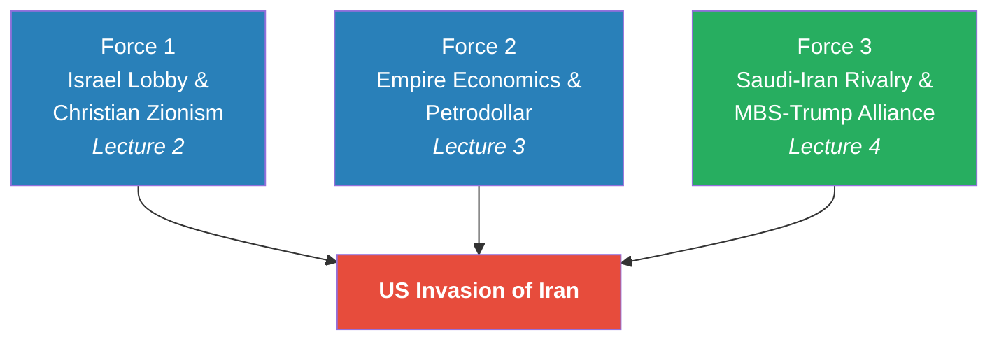

*Each force is independently sufficient to push the United States toward war. Together, they create a convergence of theological, economic, and geopolitical pressure that no president can easily resist — completing the three-force model developed across Lectures 2-4.*

The central argument of this lecture: <b style="color: #27ae60">Iran's real enemy is not Israel but Saudi Arabia</b>. Understanding why requires tracing the story back to a single year — 1979 — when a political earthquake transformed two close allies into irreconcilable enemies, and then following the consequences of that earthquake through religion, economics, three proxy wars, and one fateful friendship between a young Saudi crown prince and an American president's son-in-law.

---

## Key Concepts at a Glance

| Concept | One-line summary |
|---------|-----------------|
| **The 1979 Islamic Revolution** | A bottom-up revolution replaced Iran's secular monarchy with an Islamic Republic, turning Saudi Arabia's closest ally into its most dangerous ideological enemy |
| **The Sunni-Shia split** | A 7th-century succession dispute after Muhammad's death became the theological fault line of 21st-century Middle East geopolitics |
| **Wahhabism** | The most extreme form of Sunni Islam — Saudi Arabia's national religion since 1744, and the source of both its authority and its most dangerous internal problem |
| **Three dimensions of rivalry** | Saudi Arabia and Iran compete across religious (Sunni vs. Shia), economic (oil production), and geopolitical (proxy wars) dimensions simultaneously |
| **Proxy wars** | Saudi Arabia lost three indirect wars against Iran — in Iraq, Syria, and Yemen — proving it cannot defeat Iran alone |
| **Shock and awe** | Saudi Arabia's strategy in Yemen: overwhelm with force for quick victory — failed for the same reasons the Millennium Challenge predicted |
| **Saudi Arabia's triple vulnerability** | Oil dependence + coastal infrastructure exposure + no fresh water = an economy that Iran can destroy at will |
| **The MBS-Kushner-Trump triangle** | The alliance through which Saudi Arabia purchased American foreign policy and pushed the US toward confrontation with Iran |
| **The Soleimani assassination** | Trump killed Iran's second most powerful man — an act both Bush and Obama refused, believing it would start World War Three |
| **Vision 2030** | MBS's plan to diversify Saudi Arabia's economy before the oil runs out |

---

## The 1979 Earthquake: How Allies Became Enemies

*The story of the Saudi-Iran rivalry begins not with centuries of theological hatred but with a single year that transformed the entire Middle East — and the speed of the transformation is what makes it so remarkable.*

### Before 1979: Mirror Images

Prof. Jiang starts with a geography lesson. He draws the map: Iran is here, next to Iraq. Saudi Arabia is down here. Egypt is over there. Yemen, Oman. The Strait of Hormuz. The Suez Canal. The Red Sea.

And in 1979, Saudi Arabia and Iran were very good friends. Prof. Jiang lists the similarities — and the list is striking because of how completely it would be reversed within months:

- Both were <b style="color: #2980b9">monarchies</b> — ruled by kings
- Both were <b style="color: #2980b9">secular</b> — religion and politics were separated
- Both <b style="color: #2980b9">relied on American power</b> to defend themselves
- Both were <b style="color: #2980b9">prosperous oil exporters</b>

There was, Prof. Jiang notes, a general consensus across the Middle East that religion and politics would remain separate. That consensus held for decades. Then it shattered in a matter of months.

### The Islamic Revolution

In 1979, a bottom-up revolution — <b style="color: #2980b9">the Islamic Revolution</b> — transformed Iran from a secular monarchy into an Islamic Republic. The people of Iran demanded three things:

- <b style="color: #e74c3c">No monarchy</b> — they would not be ruled by a king
- <b style="color: #e74c3c">No American interference</b> — the Shah had been supported by the US military, and the people wanted that foreign influence gone
- <b style="color: #e74c3c">Islamic law</b> — as Muslims, they demanded that the government be focused on Islamic governance

In a referendum, 98% of the Iranian people voted to replace their monarchy with an Islamic Republic. The result was, in Prof. Jiang's words, "completely unexpected." Before 1979, there was a general consensus throughout the Middle East that religion and politics would be separated. Every major state operated on this assumption. The revolution obliterated that consensus in a matter of weeks.

What made it so destabilising was not just that Iran changed — it was what Iran changed into. The revolution's three demands were not abstract ideological preferences. They were a direct inversion of the pre-1979 order:

- The old order said: monarchies are legitimate. The revolution said: <b style="color: #e74c3c">monarchy is tyranny</b>
- The old order said: American protection keeps the peace. The revolution said: <b style="color: #e74c3c">American interference is occupation</b>
- The old order said: religion and politics are separate domains. The revolution said: <b style="color: #e74c3c">Islamic law must govern the state</b>

> [!tip] Core Insight
> The 1979 Islamic Revolution did not merely change Iran's government — it reversed every feature that had made Saudi Arabia and Iran allies. Where both had been monarchies, Iran now rejected monarchy. Where both had accepted American protection, Iran now rejected American interference. Where both had been secular, Iran now demanded Islamic law. Every pillar of the alliance was demolished in a single year.

The significance of the revolution was not just what it demanded but what it implied. Each of the three demands was a direct threat to Saudi Arabia's existence:

- If monarchy is illegitimate in Iran, why is it legitimate in Saudi Arabia?
- If American interference is unacceptable in Iran, why is it acceptable in Saudi Arabia?
- If Islamic law should govern Iran, why does Saudi Arabia's government serve Western secular interests?

The revolution was, in effect, a template that could be applied to Saudi Arabia itself — a blueprint for overthrowing any Middle Eastern monarchy that relied on American power and secular governance. And within months, someone tried to use that template on Saudi soil.

### The Siege of Mecca

> [!example] The Siege of Mecca (November 1979)
> - In November 1979 — just months after the Islamic Revolution in Iran — 600 religious extremists besieged Mecca, the holiest city in Islam
> - Mecca is the birthplace of the Prophet Muhammad and the destination of the Hajj — the pilgrimage every Muslim must make once in their lifetime
> - The 600 extremists were Wahhabis — adherents of the most extreme form of Sunni Islam
> - They made the same three demands as the Iranian revolution: the Saudi monarchy must abdicate, the United States must remove itself from Saudi Arabian affairs, and Saudi Arabia must be governed by Islamic law
> - The revolt was crushed by the Saudi military
> - But the message was unmistakable: the revolution could spread
> **The lesson:** From that day on, Iran and Saudi Arabia became bitter enemies — both trying to impose their vision of Islam on the Middle East.

*The 1979 revolution transformed every dimension of the Saudi-Iran relationship. What had been a stable, US-aligned partnership became an ideological rivalry that would reshape the entire Middle East for the next half-century.*

Prof. Jiang frames 1979 as the single most important year in modern Middle Eastern history — not because of the revolution alone, but because of the chain reaction it triggered:

- The revolution created the **ideological rivalry** — two incompatible visions of Islam competing for the same region
- The rivalry created the **proxy wars** — Iraq, Syria, Yemen, each a battlefield for Saudi-Iranian competition
- The proxy wars exposed **Saudi Arabia's vulnerability** — military superiority could not compensate for structural weakness
- The vulnerability created **Saudi Arabia's desperation** — the realisation that only America could save it
- And the desperation created the **MBS-Trump alliance** — the relationship that is now pushing the United States toward war with Iran

Every link in this chain traces back to 1979. But to understand the full depth of the rivalry, Prof. Jiang now turns to the religious fault line that predates the revolution by more than a thousand years.

---

## The Religious Fault Line: Sunni vs. Shia

*The rivalry between Saudi Arabia and Iran is not just political — it is theological. And the theological dimension reaches back not decades but centuries, to a dispute over who should lead Islam after the Prophet Muhammad died.*

### The Succession Crisis

Prof. Jiang traces the split to its origins. In 610 AD, the Prophet Muhammad had a vision in the city of Medina to found a new religion called Islam. He spread this religion throughout the Arab world, forever transforming the Middle East. But when Muhammad died, a problem arose: <b style="color: #2980b9">who would succeed the Prophet as the leader of the religion?</b>

Two answers emerged, and they split Islam in half:

- <b style="color: #2980b9">The Shia position:</b> Only people of Muhammad's bloodline can be the leaders of the religion — leadership is hereditary, tied to the Prophet's family
- <b style="color: #2980b9">The Sunni position:</b> Anyone who proves himself competent and faithful to the religion can be the leader — leadership is earned, not inherited

For hundreds of years, Sunnis and Shia fought wars over the succession. The rivalry has lasted to this day. Prof. Jiang acknowledges the complexity — "no one actually knows" the full extent of the differences, he tells his students — but the succession question is the root from which everything else grew.

What makes the split so potent is that it is not merely theological but structural. The Shia model of leadership (hereditary, bloodline-based) and the Sunni model (meritocratic, consensus-based) produce fundamentally different kinds of religious institutions, different kinds of clerical authority, and different kinds of relationships between religion and state power.

Prof. Jiang provides the demographics: approximately 88% of the world's Muslims are Sunni, and roughly 10% are Shia. This matters because <b style="color: #27ae60">Saudi Arabia is a Sunni country, and Iran is a Shia country</b> — and after the 1979 revolution, Iran committed itself to spreading the Shia revolution throughout the world.

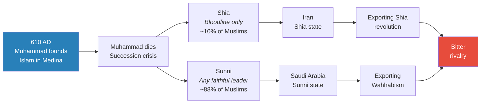

*A 7th-century theological dispute about succession became the fault line for a 21st-century geopolitical rivalry — with Saudi Arabia and Iran each claiming to represent the true version of Islam.*

### The Battle for Islamic Authority

Saudi Arabia considers itself the leader of the Islamic world — and it has a powerful claim:

- Saudi Arabia is home to both <b style="color: #2980b9">Mecca</b> and <b style="color: #2980b9">Medina</b>, the two holiest cities in the entire Islamic religion
- Every Muslim is required to make a <b style="color: #2980b9">Hajj</b> — a pilgrimage to Mecca and Medina — once in their lifetime
- Because Saudi Arabia controls these two cities, it controls the physical centre of Islamic religious life
- This is the source of Saudi Arabia's authority over the Islamic world

Iran's counter-argument is devastating in its simplicity:

- Saudi Arabia is ruled by a king — and <b style="color: #e74c3c">monarchy is anti-Muslim</b> (the Islamic revolution rejected monarchy as a form of governance)
- Saudi Arabia is defended by the US military — and <b style="color: #e74c3c">dependence on a non-Muslim power is anti-Muslim</b>
- Therefore Saudi Arabia is a <b style="color: #e74c3c">heresy</b> — it claims to lead Islam while violating Islam's principles

Iran has dedicated itself to subverting Saudi Arabia's authority over the Islamic world. And Saudi Arabia, in turn, has dedicated itself to countering Iran's influence. Each country is trying to impose its vision of Islam on the Middle East — and neither can tolerate the other's existence.

> [!abstract] The Battle for Islamic Leadership
> | Claim | Saudi Arabia (Sunni) | Iran (Shia) |
> |-------|---------------------|-------------|
> | **Basis of authority** | Controls Mecca and Medina — Islam's holiest cities | Led a popular Islamic revolution — government by Islamic law |
> | **Theological position** | Any faithful Muslim can lead (Sunni) | Only the Prophet's bloodline can lead (Shia) |
> | **Accusation against rival** | Iran is spreading a heretical minority sect | Saudi Arabia is a Western puppet ruled by illegitimate kings |
> | **Global strategy** | Export Wahhabism through schools, mosques, militants | Export Shia revolution through proxy groups and alliances |
> | **Percentage of global Muslims** | ~88% Sunni | ~10% Shia |

The religious dimension alone would be enough to sustain a rivalry. But it is not the only dimension — and it is the combination of religious, economic, and geopolitical competition that makes the Saudi-Iran conflict so intractable.

---

## Wahhabism: Saudi Arabia's Most Dangerous Export

*Prof. Jiang now introduces the element that makes Saudi Arabia's situation uniquely paradoxical: the most extreme form of its own religion is simultaneously the source of its legitimacy, the cause of its greatest internal threat, and the spark that ignited its worst foreign policy disaster.*

### The 1744 Alliance

In 1744, an alliance was forged that would shape the Middle East for centuries. The <b style="color: #2980b9">Wahhabis</b> — the most extreme Islamic group — made a deal with the <b style="color: #2980b9">Al Saud family</b> of Saudi Arabia:

- Wahhabism would become the national religion of Saudi Arabia
- In exchange, the Wahhabis would swear political allegiance to the Al Saud monarchy

This arrangement worked — until the 1930s, when oil was discovered. Saudi Arabia turned out to have the most valuable oil resources in the world. As oil money poured in, Saudi Arabia tried to modernise:

- More Western
- More secular
- More progressive

This brought the government into direct conflict with the Wahhabis. Prof. Jiang provides the key numbers:

- Wahhabis account for <b style="color: #e74c3c">20 to 40% of all the people in Saudi Arabia</b> — a very significant group
- Wahhabi people tend to be <b style="color: #e74c3c">extremely fanatical</b>
- The 1979 Mecca siege was carried out by Wahhabis
- Wahhabis were also responsible for terrorist attacks against tourists and foreigners inside Saudi Arabia

### The Export Strategy

Saudi Arabia's solution to its Wahhabi problem was a strategy that would have catastrophic unintended consequences: <b style="color: #e74c3c">export Wahhabism throughout the world</b>.

Rather than confronting its own extremists domestically, Saudi Arabia redirected their energy outward — funding Wahhabi religious schools, mosques, and militant organisations across the Muslim world. The logic was simple: if the fanatics are busy spreading the faith abroad, they are not overthrowing the monarchy at home.

> [!example] Osama bin Laden and the Export of Wahhabism (1980s-2001)
> - Osama bin Laden was a Saudi citizen — not an outsider, but a product of the Saudi system
> - He was responsible for spreading Wahhabism in Afghanistan
> - This is what started al-Qaeda — the Wahhabi export strategy given organisational form
> - Saudi Arabia's strategy of exporting extremism to manage its domestic problem created the most dangerous terrorist organisation in the world
> - The strategy would backfire catastrophically: 15 of the 19 hijackers on 9/11 were Saudi citizens
> - This devastated US-Saudi relations — Americans turned against Saudi Arabia
> **The lesson:** Saudi Arabia's attempt to solve its Wahhabi problem by exporting it did not eliminate the threat — it globalised it.

So now both countries are exporting their version of Islam: Iran is exporting the Shia revolution, and Saudi Arabia is exporting Wahhabism. They are competing for the soul of the Islamic world — and this religious rivalry is the first of three dimensions along which the Saudi-Iran conflict operates.

The irony is sharp and Prof. Jiang makes sure his students feel it: Saudi Arabia's strategy of exporting religious extremism to protect the monarchy at home eventually produced the single event — 9/11 — that nearly destroyed the US-Saudi alliance, the very alliance on which the monarchy's survival depends. The internal problem became an external catastrophe, which became a diplomatic crisis, which would eventually drive Saudi Arabia into the arms of Donald Trump. Every thread in this lecture connects back to this paradox.

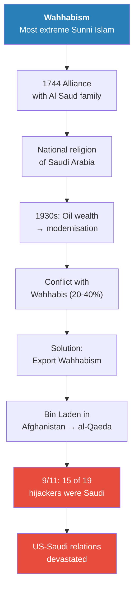

*Saudi Arabia's Wahhabi problem is a trap with no good exit: suppress them domestically and risk revolution; export them globally and risk blowback. The 1744 alliance that gave the Al Saud family religious legitimacy also gave them a population of fanatics they can neither control nor ignore.*

> [!tip] Core Insight
> The religious dimension of the Saudi-Iran rivalry is not a relic of ancient theology — it is an active, ongoing competition for leadership of the Islamic world. Saudi Arabia claims authority through Mecca and Medina. Iran claims authority by arguing that Saudi Arabia's monarchy and American dependence make it a heresy. Each side is exporting its version of Islam globally — and the consequences of that export (al-Qaeda, 9/11, Hezbollah, Hamas) have reshaped the entire world.

---

## Connections So Far

The religious dimension of the Saudi-Iran rivalry connects directly to themes from earlier lectures in the series:

- **Asymmetrical warfare ([[01 - Iran's Strategy Matrix]]):** Iran's Shia proxies — Hezbollah, Hamas, the Houthis — are the foot soldiers of the Shia revolution. They are also the asymmetrical network that makes Iran strategically effective despite its conventional military inferiority. The religious export strategy and the military strategy are the same strategy viewed from different angles.
- **Christian Zionism ([[02 - Christian Zionism and the Middle East Conflict]]):** Just as Christian Zionists represent an organised minority driving US policy toward Israel, the Wahhabis represent an organised minority driving Saudi policy toward extremism. Both are cases of fanatical minorities shaping the behaviour of powerful states — and both demonstrate Prof. Jiang's recurring theme that organised minorities defeat passive majorities.
- **Empire economics ([[03 - How Empire is Destroying America]]):** Saudi Arabia's oil wealth is the foundation of the petrodollar system that sustains American empire. Saudi Arabia needs the petrodollar to survive, and the petrodollar needs Saudi Arabia's oil. The religious and economic dimensions of the rivalry are inseparable — and both connect directly to the structural pressures on American empire that Lecture 3 described.
- **The "free lottery ticket" model ([[02 - Christian Zionism and the Middle East Conflict]]):** Wahhabism's appeal to Saudi Arabia's poor and marginalised mirrors the dynamic Prof. Jiang identified with Christian Zionism — radical belief is rational for people who have nothing to lose, which is why the Saudi government cannot simply suppress Wahhabism and must instead redirect it outward.

## The Three Dimensions of Saudi-Iran Rivalry

*The rivalry between Saudi Arabia and Iran is not a single conflict but a war fought simultaneously across three dimensions — religious, economic, and geopolitical. Each dimension intensifies the others, making the rivalry virtually impossible to resolve by addressing only one.*

Prof. Jiang has already established the religious dimension — Sunni versus Shia, Wahhabism versus the Shia revolution, the battle for Islamic authority. But the rivalry does not stop at theology. It extends into economics and geopolitics, and it is the combination of all three that makes the Saudi-Iran conflict the most intractable rivalry in the modern Middle East.

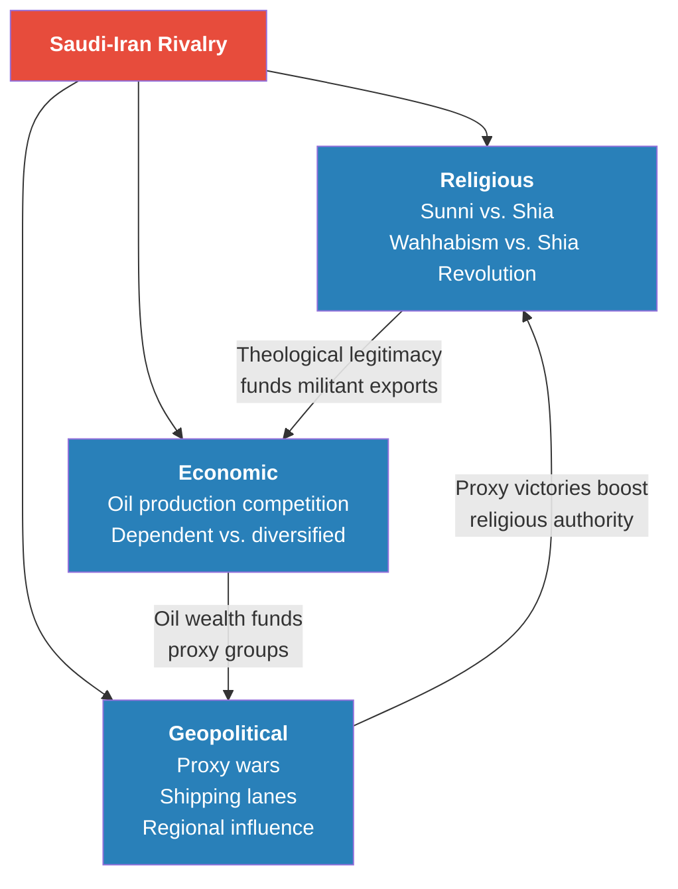

*Each dimension feeds the others: religious authority justifies economic competition, oil wealth funds proxy wars, and proxy victories reinforce claims to religious leadership. This is why no single diplomatic effort — nuclear deals, oil agreements, ceasefires — can resolve the rivalry.*

### The Economic Dimension: Oil as Weapon and Vulnerability

Prof. Jiang provides the economic data, and the asymmetry is striking:

- <b style="color: #2980b9">Saudi Arabia</b> is completely reliant on oil for its economy:
  - 40% of GDP comes from oil exports
  - 75% of government revenue comes from oil
  - Saudi Arabia does not collect taxes from its citizens — it simply sells oil
  - It is the number one oil exporter in the world
- <b style="color: #2980b9">Iran</b> is the number four oil exporter in the world, but far less vulnerable:
  - Iran has a <b style="color: #27ae60">diversified economy</b> — strong human capital, a well-educated population engaged in science, art, education, and industry
  - Oil matters to Iran, but losing it would not destroy the country the way it would destroy Saudi Arabia

The economic conflict between the two countries is structural:

- Saudi Arabia wants to <b style="color: #e74c3c">cut production</b> to increase the price of oil and maximise profits — this is the logic behind its influence within OPEC
- Iran wants to <b style="color: #e74c3c">sell as much oil as possible</b> to boost its economy, especially when sanctions are lifted
- They cannot cooperate because their economic incentives are fundamentally opposed

| Factor | Saudi Arabia | Iran |
|--------|-------------|------|
| **Oil ranking** | #1 exporter worldwide | #4 exporter worldwide |
| **GDP from oil** | ~40% | Lower — diversified |
| **Government revenue from oil** | ~75% | Significant but not sole source |
| **Citizen taxation** | None — oil funds everything | Standard taxation exists |
| **Human capital** | Limited diversification | Strong — science, education, industry |
| **Economic strategy** | Cut production, raise prices | Maximise production, boost economy |
| **Vulnerability if oil disappears** | Total economic collapse | Painful but survivable |

This economic asymmetry is what makes Saudi Arabia so desperate. Iran can survive without oil — it has done so under crippling sanctions. Saudi Arabia cannot. And the timeline for Saudi Arabia's oil-based economy is grim:

- Optimistic estimates: Saudi Arabia has 70-80 years of oil remaining
- Pessimistic estimates: as few as 10 years
- Global warming and the transition to renewable energy are reducing demand for oil
- The global economic slowdown is reducing demand further

> [!tip] Core Insight
> Saudi Arabia's economy is a one-legged stool. It has one commodity, one source of revenue, and one model of governance — all of which depend on oil remaining valuable and accessible. Iran's diversified economy makes it resilient under pressure; Saudi Arabia's concentrated economy makes it fragile under pressure. This asymmetry explains why Saudi Arabia is the desperate party in this rivalry.

### The Geopolitical Dimension: Influence, Shipping Lanes, and Proxy Wars

The third dimension is geopolitical — both countries are trying to exert maximum influence over the Middle East, but for different reasons.

<b style="color: #2980b9">Iran's motivation</b> traces directly back to the devastating <b style="color: #2980b9">Iran-Iraq War of 1980-1988</b>:

- After the 1979 revolution, many countries — including Saudi Arabia and the United States — actively encouraged Iraq to invade Iran. Prof. Jiang is explicit: this was not passive indifference. Saudi Arabia and the US wanted the revolution crushed before it could spread
- The Iran-Iraq War lasted eight years and cost the lives of millions of Iranians — one of the deadliest conflicts since World War Two
- The trauma of that war is foundational to modern Iranian strategy. Iran learned a lesson that shapes every decision it makes today: <b style="color: #e74c3c">when you are isolated, your neighbours will try to destroy you</b>. The lesson Iran drew was that it must never again be caught without allies and without the ability to project power beyond its own borders
- From that point on, Iran adopted a policy of <b style="color: #e74c3c">aggressive intervention</b> in the Middle East — not to conquer territory but to distract its enemies and create strategic depth. Every proxy group Iran supports, every alliance it builds, every missile it develops traces back to the eight-year war that nearly destroyed it
- Iran finances <b style="color: #2980b9">Hamas</b> and <b style="color: #2980b9">Hezbollah</b> — both to distract Israel and to project Shia influence
- This network of proxy groups — what Prof. Jiang introduced in Lecture 1 as Iran's <b style="color: #2980b9">Axis of Resistance</b> — is simultaneously a religious export strategy, a military strategy, and a geopolitical strategy

<b style="color: #2980b9">Saudi Arabia's motivation</b> is economic survival:

- As the world's number one oil exporter, Saudi Arabia needs to control the shipping lanes through which its oil reaches global markets
- Two chokepoints matter above all others: the <b style="color: #2980b9">Strait of Hormuz</b> and the <b style="color: #2980b9">Suez Canal</b>
- 40% of all the world's oil passes through these two straits
- The oil flows mainly to East Asia — China, South Korea, and Japan
- If either strait is blocked or contested, Saudi Arabia's entire economic model collapses

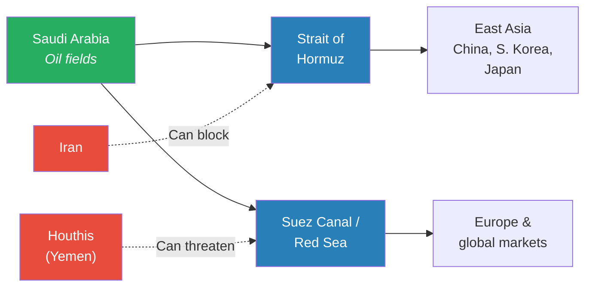

*Saudi Arabia's oil wealth is meaningless if it cannot reach buyers. Iran sits directly on the Strait of Hormuz; Iran's Houthi allies threaten the Red Sea and Suez Canal. Saudi Arabia's two economic lifelines are both within reach of Iranian power.*

Because of these three dimensions of tension — religious, economic, and geopolitical — Iran and Saudi Arabia have fought three <b style="color: #2980b9">proxy wars</b> — indirect conflicts where each side backs different local forces rather than fighting each other directly. And Saudi Arabia lost all three.

---

## Three Proxy Wars — And Why Saudi Arabia Lost All of Them

*Prof. Jiang now turns to the evidence that transformed Saudi Arabia from a confident regional power into a desperate supplicant seeking American protection. The evidence is three proxy wars — in Iraq, Syria, and Yemen — and the lesson is the same in every case: Saudi Arabia cannot defeat Iran, no matter how much money or military hardware it brings to the fight.*

### Proxy War 1: Iraq — Iran Fills the Vacuum

*The first proxy war began the moment the United States destroyed Iraq in 2003 — and it ended with Iran in effective control of the country Saudi Arabia tried to dominate.*

After the 2003 American invasion destroyed Iraq's government, a power vacuum emerged. Prof. Jiang explains what happened next:

- Iran moved in to fill the vacuum — and it had a decisive demographic advantage: <b style="color: #27ae60">two-thirds of Iraq's population were Shiite</b>, giving Iran a natural base of support among the majority
- The remaining one-third were Sunni — and Saudi Arabia began financing Sunni groups against the Shia to counter Iranian influence
- The result was a violent civil war fought between Saudi-backed Sunni militias and Iranian-backed Shia forces
- Many people believe Saudi Arabia was responsible for financing <b style="color: #e74c3c">ISIS</b> — the Islamic State — because ISIS specifically targets and hates the Shia religion
- Over time, Iran proved far more effective at projecting power into Iraq than Saudi Arabia

> [!example] The Iraq Proxy War (2003 onwards)
> - The US invasion destroyed Iraq's government, creating a power vacuum that both Iran and Saudi Arabia rushed to fill
> - Iran leveraged the two-thirds Shiite population — a natural demographic advantage that Saudi Arabia could not overcome with money alone
> - Saudi Arabia financed the one-third Sunni population, fuelling a violent sectarian civil war
> - Many analysts believe Saudi Arabia also financed ISIS because of its extreme anti-Shia ideology
> - Iran proved far more effective at projecting power — using the same asymmetrical proxy methods that define its entire strategic approach
> - Iran now effectively controls much of Iraq
> **The lesson:** Demographic reality defeats financial intervention. Saudi Arabia could fund Sunni militias, but it could not change the fact that two-thirds of Iraqis are Shia.

Result: <b style="color: #e74c3c">Iran won the first proxy war</b>. The pattern that would repeat in Syria and Yemen was already established: Iran's approach of leveraging local populations and committing to long-term proxy relationships proved more effective than Saudi Arabia's approach of financing opposition groups from a distance.

The Iraq disaster also confirmed something Saudi Arabia had predicted before the invasion. Saudi Arabia had tried to stop the 2003 war precisely because it foresaw that destroying Iraq would create a power vacuum Iran would fill. The kingdom used every diplomatic channel it had in Washington to prevent the invasion. It failed. And the consequence it predicted — Iran's expansion into Iraq — came to pass exactly as Saudi Arabia had warned. This failure was doubly devastating: Saudi Arabia lost the proxy war in Iraq, and it learned that its influence in Washington was insufficient to prevent strategic catastrophes that directly threatened its interests.

### Proxy War 2: Syria — Assad Survives

*The second proxy war raised the stakes — Saudi Arabia now had American and Israeli partners, and still lost.*

- Syria's leader Bashar al-Assad faced a rebellion against his government
- Saudi Arabia, America, and Israel all supported the rebels against Assad — an extraordinary coalition of the region's wealthiest and most powerful actors
- Iran came in to support Assad, joined by Russia
- The war was prolonged and devastating, but the result was unambiguous: Assad crushed the rebellion
- Iran's model of support — embedding advisors on the ground, providing weapons, and committing fully to its ally — proved more effective than the Saudi-American-Israeli model of remote support

> [!example] The Syria Proxy War (2011 onwards)
> - Assad's government faced a serious rebellion that seemed likely to succeed
> - Saudi Arabia, the United States, and Israel all backed the rebels — an extraordinary coalition of money, weapons, and intelligence
> - Iran and Russia backed Assad — providing military advisors, weapons, and in Russia's case, air power
> - Despite the weight of opposition, Assad crushed the rebellion
> - The key difference: Iran was willing to commit fully to its ally, while the Saudi-American coalition treated Syria as one theatre among many
> - The Syrian civil war demonstrated that Iran's proxy model — committed ground-level support backed by a state willing to absorb costs — outperformed Saudi Arabia's model of remote financing
> **The lesson:** Saudi Arabia cannot buy victory. Even with American and Israeli partners, its side lost to Iran's more committed, more effective proxy strategy.

Result: <b style="color: #e74c3c">Iran won the second proxy war</b>. The Syria outcome was arguably more humiliating than Iraq. In Iraq, at least Saudi Arabia was operating alone against Iran. In Syria, Saudi Arabia had the backing of the United States and Israel — two of the most powerful military and intelligence operations on earth — and still could not unseat an Iranian ally. The coalition's failure demonstrated something troubling: Iran's model of deep, committed, ground-level engagement with local allies consistently outperformed the Saudi-American model of remote financing and arms transfers. Money and technology were not enough. Commitment was what mattered.

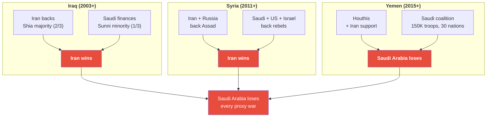

*Three proxy wars, three Iranian victories — each one escalating in severity and proximity to Saudi Arabia. Iraq was a distant loss. Syria was a humiliating loss. Yemen was an existential loss.*

Prof. Jiang notes that these first two wars — Iraq and Syria — were important to Saudi Arabia, but they did not directly threaten Saudi Arabia's survival. Iraq was a distant battlefield. Syria was someone else's civil war. Neither war brought the fighting to Saudi territory.

The third proxy war did — and it changed everything Saudi Arabia believed about its own security.

### Proxy War 3: Yemen — The War That Changed Everything

*Yemen is where the theory became personal. This was not a distant proxy conflict in someone else's country — this was a war on Saudi Arabia's border that exposed every vulnerability the kingdom had been trying to hide. Yemen is where Saudi Arabia learned what it means to be the target.*

---

Prof. Jiang provides the context:

- For a long time, Saudi Arabia supported Yemen's political leadership — maintaining a friendly, stable neighbour on its southern border
- Then the <b style="color: #2980b9">Houthis</b> — Shia villagers who lived in the mountains — launched a rebellion to overthrow the government
- Saudi Arabia feared the Houthis would become allies of Iran, creating an Iranian proxy directly on the Saudi border
- Saudi Arabia decided on a massive military response

The scale of Saudi Arabia's intervention was extraordinary:

- <b style="color: #2980b9">150,000 Saudi Arabian troops</b>
- Warplanes with the most advanced American weapons and technology
- A coalition of over 30 nations, including Egypt and the UAE
- Saudi Arabia named it <b style="color: #2980b9">Operation Decisive Storm</b> — a name Prof. Jiang notes with dry amusement. The name itself reveals the assumption: that the war would be decisive, that it would be a storm — fast, overwhelming, irresistible. The name tells you everything about Saudi Arabia's expectation going in

The strategy was <b style="color: #2980b9">shock and awe</b> — the same doctrine the United States used in Iraq:

- Go in fast
- Go in hard
- Use overwhelming force to destroy the enemy in about a week
- The assumption was that the sheer weight of military hardware would make resistance impossible
- This assumption was wrong for the same reason it was wrong in the Millennium Challenge: it assumed that the opponent would fight on your terms

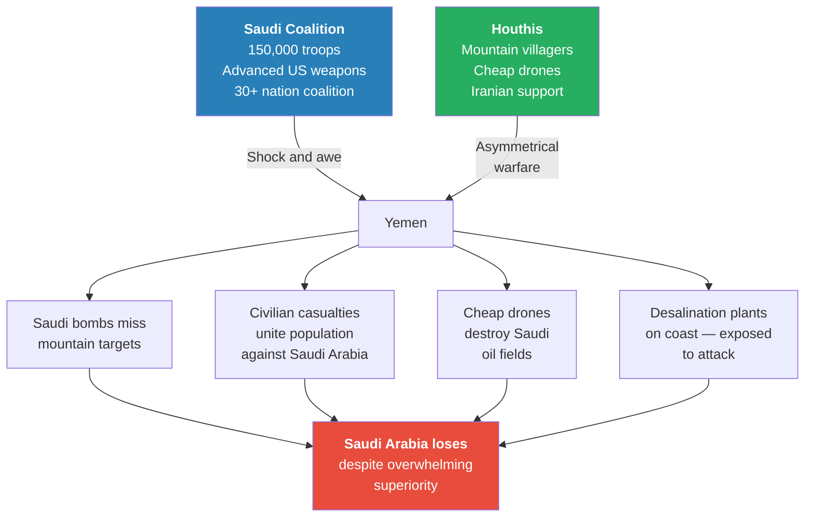

*Operation Decisive Storm was designed to replicate American "shock and awe" — overwhelming force for rapid victory. It failed for the same reason the Millennium Challenge simulation failed in Lecture 1: conventional superiority cannot defeat an asymmetrical opponent who controls the terms of engagement.*

Prof. Jiang explains why Saudi Arabia's overwhelming advantage collapsed into defeat:

**Problem 1 — The mountains swallowed the bombs:**
- The Houthis were in the mountains — and bombs could not reach them
- What the bombs did instead was kill civilians, which united the entire Yemeni population against Saudi Arabia
- Saudi Arabia's air power, designed for conventional warfare, was useless against an enemy embedded in terrain that neutralised it
- The more Saudi Arabia bombed, the stronger the Houthi resistance became — every dead civilian created ten new fighters motivated by grief and rage
- This is the same dynamic Prof. Jiang identified in Lecture 1: asymmetrical opponents grow stronger under bombardment because the violence validates their cause and rallies the population

**Problem 2 — The asymmetry of cost:**
- The Houthis responded with cheap drones — costing perhaps $1,000 to $10,000 each
- These drones targeted Saudi Arabia's <b style="color: #e74c3c">oil fields and ports</b> — infrastructure worth billions
- A $10,000 drone could destroy a $10 million facility — a cost ratio of 1:1,000
- The economics of the war were catastrophically asymmetric: Saudi Arabia was spending billions on advanced American weapons systems to fight an enemy that could inflict disproportionate damage for almost nothing
- This is the Millennium Challenge from Lecture 1 playing out in the real world: the "Iran" team in that simulation won by using unconventional tactics that neutralised American technological superiority. The Houthis were doing the same thing — not against a simulation, but against real Saudi infrastructure

**Problem 3 — The water vulnerability:**
- Saudi Arabia has <b style="color: #e74c3c">no fresh water</b> — it is a desert with no rivers
- The entire country relies on <b style="color: #2980b9">desalination plants</b> that convert sea water into fresh water
- These plants are on the coast — and the coast is exposed to Iranian missiles and Houthi drones
- If the desalination plants are destroyed, Saudi Arabia has no drinking water — not in weeks, not in months, but immediately
- Prof. Jiang makes sure his students understand the gravity: Saudi Arabia's population depends entirely on engineered infrastructure for the most basic human need. Every other country in the region has rivers, aquifers, or rainfall. Saudi Arabia has machines on the coastline — and those machines are within range of anyone with a missile or a drone

> [!example] Operation Decisive Storm: How 150,000 Troops Lost to Mountain Villagers (2015-present)
> - Saudi Arabia launched its largest military operation: 150,000 troops, coalition of 30+ nations, advanced American weapons
> - The strategy was shock and awe — overwhelming force for rapid, decisive victory
> - The Houthis retreated to the mountains, where Saudi bombs could not reach them
> - Saudi air strikes killed civilians instead, turning the population against Saudi Arabia
> - The Houthis retaliated with cheap drones ($1,000-$10,000) that destroyed Saudi oil fields and ports worth billions
> - Saudi Arabia's desalination plants — its only source of fresh water — sit exposed on the coastline, easily targeted
> - Saudi Arabia discovered it could spend billions on advanced weapons and still lose to an enemy spending thousands on drones
> **The lesson:** Military superiority is meaningless when the enemy can destroy your economy faster than you can destroy their fighters. This is the Millennium Challenge from Lecture 1 playing out in the real world.

> [!abstract] Saudi Arabia's Triple Vulnerability — Exposed by Yemen
> | Vulnerability | What it means | Why it's fatal |
> |--------------|---------------|---------------|
> | **Oil dependence** | 40% GDP, 75% revenue, no taxation | One commodity funds the entire state — destroy the fields, destroy the state |
> | **Coastal infrastructure** | Oil fields, export ports, desalination plants all on the coast | Every critical asset is within range of cheap drones and Iranian missiles |
> | **No fresh water** | Desert with no rivers — 100% reliant on desalination | Destroy the coastal plants and Saudi Arabia has no drinking water |

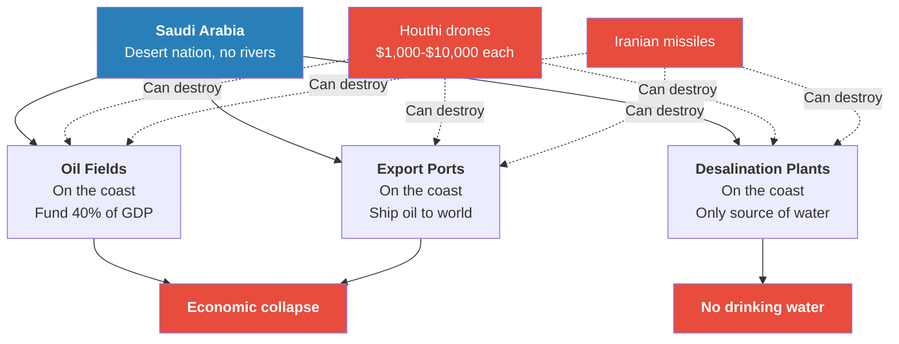

*Every piece of critical infrastructure Saudi Arabia possesses sits on the coastline — and every piece of it is within range of cheap weapons that Iran and its proxies have already demonstrated they can deploy. Prof. Jiang makes sure his students grasp the absurdity: Saudi Arabia spent billions on the world's most advanced weapons, and its entire civilisation can be dismantled by drones that cost less than a used car.*

The Yemen war revealed something Saudi Arabia had been able to ignore during the Iraq and Syria proxy wars: those were distant conflicts in other people's countries. Yemen was on Saudi Arabia's border, and the Houthis could reach Saudi territory. For the first time, Saudi Arabia experienced what it meant to be the target of asymmetrical warfare rather than the spectator. The lesson was devastating.

### What Saudi Arabia Learned from Three Defeats

Prof. Jiang identifies three lessons that Saudi Arabia drew from its proxy war record — and these lessons are what drive everything that happens next in the lecture:

1. <b style="color: #27ae60">To defeat the Houthis, the Syrians, and the Iraqis, Saudi Arabia must first defeat Iran</b> — all three proxy enemies are Iranian-backed, and eliminating the proxies without eliminating the patron is futile. Every time Saudi Arabia crushes one group, Iran funds another. The proxy war approach is a hydra — cut off one head and two more appear
2. <b style="color: #e74c3c">Saudi Arabia's economy is extremely vulnerable</b> — at any point, Iran could destroy the oil fields and desalination plants with missiles and drones, ending Saudi Arabia as a functioning state. The Yemen war proved this was not a theoretical risk but an operational reality — the Houthis had already demonstrated the capability with cheap drones
3. <b style="color: #27ae60">Saudi Arabia cannot defeat Iran alone — it needs America to fight Iran for it</b> — this is the fundamental conclusion that drives the MBS-Trump alliance and everything that follows. Saudi Arabia's military, despite being equipped with the most advanced American weapons money can buy, proved unable to defeat Shia mountain villagers. It has no chance against Iran itself

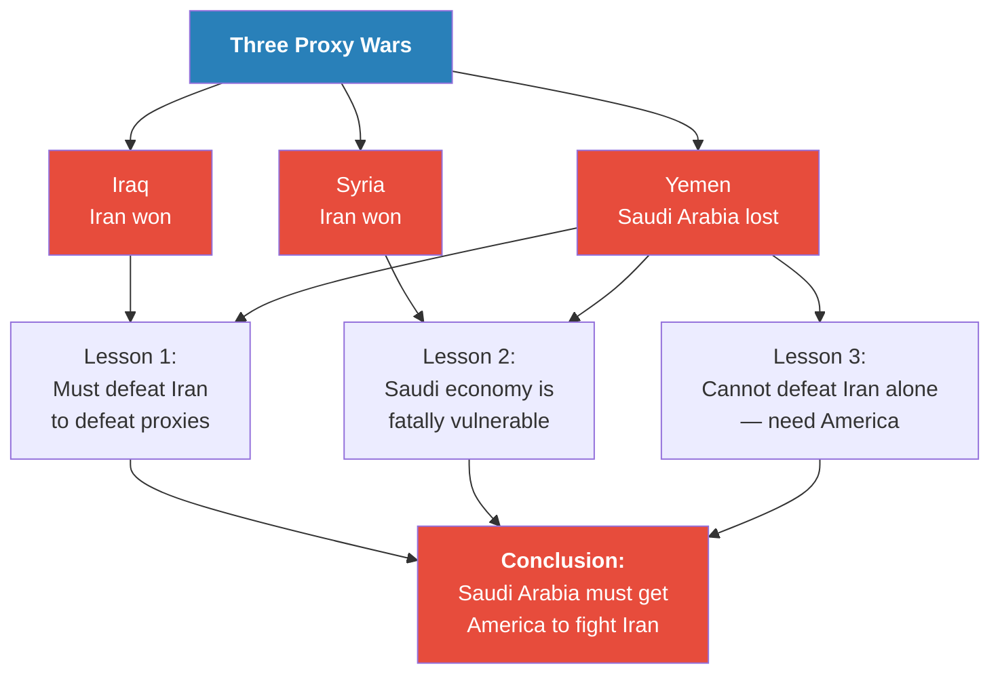

*Three wars, three defeats, one conclusion: Saudi Arabia's survival depends on convincing America to go to war with Iran. This is the strategic reality that creates Force 3 — the Saudi pressure on the United States to invade Iran.*

The connection to the series' broader argument is now complete. In Lecture 1, Prof. Jiang introduced Iran's <b style="color: #2980b9">asymmetrical warfare</b> doctrine — the strategy of using cheap, distributed, unconventional methods to neutralise a superior conventional force. In Yemen, Saudi Arabia experienced that doctrine firsthand. The Houthis did to Saudi Arabia exactly what the "Iran" team did to the US military in the Millennium Challenge simulation: they used $10,000 drones to destroy billion-dollar infrastructure, turning the opponent's wealth from an advantage into a target. And just as the US military restarted the simulation with new rules to guarantee its own victory, Saudi Arabia concluded that the only way to win was to bring in a force so overwhelming that asymmetry cannot compensate — the United States military.

---

## The MBS-Trump Alliance — Saudi Arabia's Trump Card

*Having lost every proxy war and discovered that its entire economy can be destroyed by cheap drones, Saudi Arabia arrived at a single conclusion: only America can fight Iran on its behalf. The problem was that America no longer wanted to be Saudi Arabia's friend. What followed is the story of how a young crown prince bought his way back into Washington — and found a president willing to be bought.*

### The Collapse of the US-Saudi Relationship

Before MBS could reset the relationship, he had to reckon with the damage Saudi Arabia had done to itself. Prof. Jiang traces the deterioration:

- <b style="color: #e74c3c">9/11 — the Wahhabi export backfires:</b> 15 of the 19 hijackers on September 11, 2001 were Saudi citizens. Americans were furious. The carefully cultivated US-Saudi alliance — decades of oil-for-protection arrangements — was shattered in a single morning. Americans did not just blame al-Qaeda; they blamed Saudi Arabia itself, its human rights record, its role in funding extremism. Prof. Jiang makes the causal chain explicit: Saudi Arabia's strategy of exporting Wahhabism to manage its domestic extremist problem had produced the single worst terrorist attack on American soil. The Wahhabi export created al-Qaeda, al-Qaeda recruited Saudi citizens, and those Saudi citizens flew planes into American buildings. The kingdom's internal problem had become America's national trauma
- <b style="color: #e74c3c">The Iraq invasion (2003):</b> Saudi Arabia tried to exert every ounce of influence it had in Washington to stop the Iraq invasion. It knew — correctly — that destroying Iraq would create a power vacuum that Iran would fill. Saudi Arabia failed. The invasion happened. Iran took control of much of Iraq. Saudi Arabia's worst prediction came true, and it had been powerless to prevent it
- <b style="color: #e74c3c">Obama's Asia Pivot (2008-2015):</b> When Barack Obama came into office, he made a strategic calculation that Prof. Jiang summarises bluntly: the Middle East is a complete mess, and it is hopeless. China is rising. The real threat to American power is in East Asia. Obama proposed the <b style="color: #2980b9">Asia Pivot</b> — transferring American military resources from the Middle East to East Asia to counter China

But to pivot away from the Middle East, Obama needed to reduce tensions there. And so in 2015, he made the deal that terrified Saudi Arabia more than anything else.

### The Iran Nuclear Deal — Obama's Logic and Saudi Arabia's Panic

Prof. Jiang explains Obama's reasoning with characteristic bluntness: the Middle East is a complete mess, and it is hopeless. Obama's strategic calculation had three layers:

- <b style="color: #2980b9">Layer 1 — The China threat:</b> China was rising. The real long-term threat to American power was not in the Middle East but in East Asia. Every dollar spent on Middle East deployments was a dollar not spent on countering China's naval expansion in the South China Sea
- <b style="color: #2980b9">Layer 2 — The Asia Pivot:</b> Obama proposed transferring American military resources from the Middle East to East Asia. But you cannot pivot away from a region that is actively burning — you need to reduce the temperature first
- <b style="color: #2980b9">Layer 3 — The nuclear deal as exit strategy:</b> The <b style="color: #2980b9">Iran Nuclear Deal (2015)</b> was the mechanism for reducing that temperature. The terms were straightforward — Obama told Iran: if you promise to stop developing nuclear weapons, we will lift economic sanctions so you can prosper. Iran agreed

The deal made strategic sense from Washington's perspective — it de-escalated the most dangerous flashpoint in the Middle East and freed up military capacity for the Pacific. But from Riyadh, the deal looked like a death sentence:

- <b style="color: #e74c3c">If America leaves the Middle East, Saudi Arabia loses its protector</b> — the one military force capable of deterring Iran
- <b style="color: #e74c3c">If America makes peace with Iran, Saudi Arabia's entire strategy collapses</b> — the kingdom's plan to use America as a weapon against Iran becomes impossible
- <b style="color: #e74c3c">If sanctions are lifted, Iran's economy strengthens</b> — Iran gains resources to fund even more proxy operations against Saudi interests in Iraq, Syria, and Yemen
- The deal essentially told Saudi Arabia: you are on your own against an enemy you have lost to three times in a row

Saudi Arabia became, in Prof. Jiang's words, "very, very desperate — its very existence was threatened." The deal was not just a policy disagreement — it was an existential crisis. Every assumption on which Saudi Arabia had built its post-1979 strategy was suddenly invalid. The US alliance that was supposed to protect the kingdom was being traded for peace with the kingdom's worst enemy.

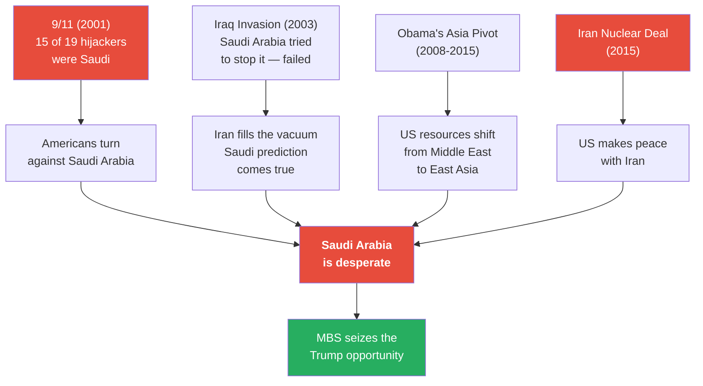

*Four successive blows — 9/11, the Iraq disaster, the Asia pivot, the Iran deal — left Saudi Arabia more isolated and more vulnerable than at any point since the 1979 revolution. It was in this moment of maximum desperation that MBS saw his opportunity.*

### The Saudi Economy's Ticking Clock

On top of the diplomatic catastrophe, the economic outlook was dire. Saudi Arabia's entire economy depends on oil — and oil is a finite resource being attacked from multiple directions simultaneously:

- <b style="color: #e74c3c">Supply-side threat — depletion:</b> Optimistic estimates give Saudi Arabia 70-80 years of oil remaining. Pessimistic estimates say as few as 10 years. The range itself is alarming — the difference between a manageable transition and an imminent collapse is a matter of whose model you believe
- <b style="color: #e74c3c">Demand-side threat — climate change:</b> The global transition to renewable energy is reducing demand for oil. Every solar panel installed, every electric vehicle sold, every carbon tax imposed chips away at the commodity on which Saudi Arabia's entire civilisation depends
- <b style="color: #e74c3c">Demand-side threat — economic slowdown:</b> The global economy is slowing, reducing demand further. Less economic activity means less energy consumption means less oil purchased
- <b style="color: #e74c3c">Structural threat — no diversification:</b> If Saudi Arabia runs out of oil — or if oil becomes worthless — its entire economy collapses. It has no other significant industry, no citizen taxation, no diversified human capital base. Unlike Iran, which has a well-educated population engaged in science, education, and industry, Saudi Arabia has spent decades relying on a single commodity rather than developing its people

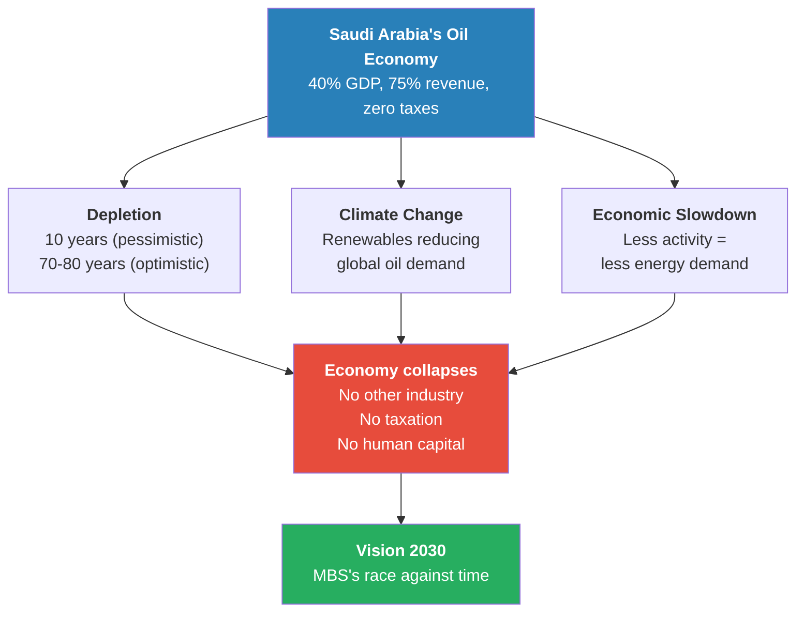

*Saudi Arabia faces a triple convergence: the oil is running out, the world is moving away from oil, and the economy is too dependent on oil to survive the transition. Vision 2030 is not a luxury reform programme — it is a desperate race against a ticking clock.*

This economic reality is what made <b style="color: #2980b9">Vision 2030</b> not just desirable but existentially necessary — and it is what made the MBS-Trump alliance so urgent. Saudi Arabia does not have the luxury of decades to solve its problems. It needs American protection now, while the oil still flows, while the economy still functions, while there is still something worth protecting.

### The Rise of MBS

In 2017, Saudi Arabia appointed a new Crown Prince: <b style="color: #2980b9">Mohammed bin Salman (MBS)</b>. He promised to be a new kind of Saudi leader:

- He was young — energetic and media-savvy in a way the old Saudi monarchy was not
- He was progressive — he wanted women to be allowed to drive, young people to go to the cinema, entertainment and tourism industries to develop
- He proposed <b style="color: #2980b9">Vision 2030</b> — a plan to diversify Saudi Arabia's economy away from oil dependence before the oil ran out
- Vision 2030 was the domestic answer to the ticking clock described above — if Saudi Arabia could build a post-oil economy in time, the existential vulnerability that made it dependent on American protection might eventually be reduced

Prof. Jiang presents MBS as a figure of contradictions: a moderniser who was also a tyrant, a visionary who was also reckless, a strategist who understood Saudi Arabia's vulnerabilities better than anyone but who would also make decisions that horrified the world. This duality — progressive reformer and authoritarian ruler in the same person — is what made MBS both Saudi Arabia's best hope and its greatest risk.

But MBS's most important achievement was not domestic reform. It was a relationship.

### The Trump-MBS-Kushner Triangle

In 2016, Donald Trump became president of the United States. MBS recognised this as Saudi Arabia's opportunity to reset the relationship that 9/11 had nearly destroyed. Prof. Jiang traces the key milestones:

- <b style="color: #27ae60">Trump's first foreign trip was to Saudi Arabia</b> — a symbolic signal that Saudi Arabia was back in favour. The first trip a president makes abroad is a deliberate statement of priority, and Trump's choice told the world that the US-Saudi relationship was being restored
- MBS became best friends with <b style="color: #2980b9">Jared Kushner</b>, Trump's son-in-law and Middle East advisor
- Kushner's job was to bring peace to the Middle East — primarily between Israel and the Arab countries
- MBS helped Kushner achieve this through the <b style="color: #2980b9">Abraham Accords</b> — a series of agreements establishing peace between Israel and several Arab states, designed to build a united front against Iran
- The logic was clear: if Israel and the Sunni Arab states stop fighting each other, they can all focus on their common enemy — Iran
- The Abraham Accords were not about peace in the traditional sense — they were about building a military coalition. By normalising relations between Israel and Arab nations, the accords created the diplomatic infrastructure for a coordinated campaign against Iran
- For MBS, the accords served a dual purpose: they gave Kushner a "win" he could present to Trump (peace in the Middle East), while simultaneously advancing Saudi Arabia's strategic goal of isolating Iran. MBS was helping Kushner's career while Kushner was helping MBS's survival

> [!example] The MBS-Kushner Alliance: How Saudi Arabia Bought American Foreign Policy
> - MBS cultivated Jared Kushner — Trump's son-in-law, who had no diplomatic experience but controlled Middle East policy
> - Trump's first trip abroad as president was to Saudi Arabia — a deliberate signal that the 9/11-era rift was over
> - Kushner and MBS collaborated on the Abraham Accords — normalising relations between Israel and Arab states to build a united anti-Iran coalition
> - MBS privately bragged to a friend that Kushner was "in my pocket" — meaning he owned the man who controlled American Middle East policy
> - After Trump left office, Kushner set up a private equity fund
> - MBS and the Saudi government invested $2 billion into Kushner's fund
> - The $2 billion investment is the financial evidence of what MBS had been bragging about — a relationship in which Saudi money shaped American foreign policy
> **The lesson:** Saudi Arabia did not merely lobby America — it purchased a direct line to the president through his family. The MBS-Kushner relationship was not diplomacy but investment, with American foreign policy as the return.

MBS was looking very good. Young, progressive, friendly with the most powerful country on earth, building a coalition against Iran, modernising his kingdom. And then he did something that revealed the other side of his character.

### The Khashoggi Assassination

> [!example] The Assassination of Jamal Khashoggi (2018)
> - Jamal Khashoggi was a Saudi journalist who worked for the Washington Post and was a permanent resident of the United States
> - Khashoggi had been critical of MBS's leadership — and MBS was a visionary but also a tyrant who did not tolerate criticism
> - In 2018, MBS had Khashoggi killed — an assassination that caused an international uproar
> - The CIA and the US government conducted an investigation and determined that MBS personally ordered the assassination
> - Under normal circumstances, this would have destroyed the US-Saudi relationship
> - But Trump protected MBS — refusing to hold the crown prince accountable despite the CIA's findings
> **The lesson:** Trump's willingness to protect MBS even after a brazen assassination — of a journalist employed by an American newspaper, with permanent US residency — demonstrated the depth of the MBS-Trump alliance. Saudi Arabia had purchased not just access but impunity.

The Khashoggi assassination was a test of the relationship — perhaps the most revealing test possible:

- Under any previous president, the murder of a US-resident journalist by a foreign leader, confirmed by the CIA, would have triggered serious diplomatic consequences
- Trump chose to protect MBS — refusing to hold the crown prince accountable despite his own intelligence agency's findings
- This proved that the alliance was stronger than any single outrage
- Saudi Arabia's investment in the Trump-Kushner relationship was paying off — not just in policy terms but in impunity

### The Assassination of Qasem Soleimani — Trump Chooses "Option Three"

The most consequential product of the MBS-Trump alliance was not the Abraham Accords or the Khashoggi cover-up. It was what happened in January 2020.

Prof. Jiang tells the story through his "three options" framework — a model of how the Pentagon typically manages presidential decisions:

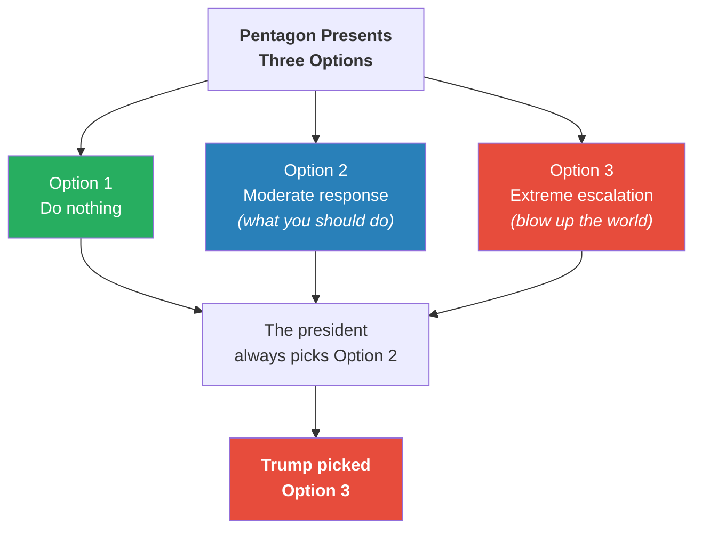

*The Pentagon designs its options so that the president will always pick the moderate one. Option 1 is too passive, Option 3 is too extreme — Option 2 is the "Goldilocks" choice. Every rational president picks Option 2. Trump picked Option 3.*

> [!example] The Assassination of Qasem Soleimani (January 2020)
> - <b style="color: #2980b9">Qasem Soleimani</b> was considered the second most powerful man in Iran, after the Ayatollah — the supreme religious leader
> - Soleimani was responsible for all of Iran's policies in the Iraq War, the Syrian War, and the Yemen War
> - From Saudi Arabia's perspective, Soleimani was public enemy number one — the architect of every Iranian victory that had humiliated Saudi Arabia
> - George W. Bush had the opportunity to kill Soleimani — he refused, believing it would start World War Three
> - Barack Obama had the opportunity — he also refused, for the same reason
> - When conflict between US soldiers and Shia militiamen in Iraq created a crisis, the Pentagon presented Trump with three options
> - Option 1: do nothing. Option 2: a proportional military response. Option 3: assassinate Qasem Soleimani
> - The Pentagon designed Option 3 to be the extreme outlier that no rational president would choose — it was there to make Option 2 look reasonable
> - Trump chose Option 3
> - The entire military was stunned — they could not believe the president had chosen the option designed to be unchosen
> **The lesson:** Two previous presidents refused to kill Soleimani because they believed it would start a world war. Trump treated the most extreme option as the obvious choice — and in doing so, served Saudi Arabia's interests more effectively than any previous president had.

What makes this story so revealing is not just Trump's choice but the context of the two presidents who refused. Prof. Jiang emphasises that both Bush and Obama had intelligence on Soleimani's location and the operational capability to strike:

- <b style="color: #2980b9">George W. Bush</b> — a president who invaded two countries, launched the War on Terror, and authorised extraordinary rendition — looked at the option of killing Soleimani and said no. He believed killing the second most powerful man in Iran would leave Iran with no choice but full-scale retaliation, potentially triggering a regional war that would dwarf Iraq and Afghanistan combined
- <b style="color: #2980b9">Barack Obama</b> — despite the Iran Nuclear Deal giving him more diplomatic leverage than any previous president had over Iran — also refused. The calculation was the same: Soleimani's death would close every diplomatic channel and make war inevitable
- When Trump chose Option 3, Prof. Jiang says, "the entire military was stunned." This was not a figure of speech. The Pentagon had designed the Soleimani option as the anchor — the extreme choice that exists to make the moderate option look reasonable. No one in the military command structure expected it to be selected. The option was included precisely because it was supposed to be rejected

Prof. Jiang makes the implication explicit: <b style="color: #e74c3c">if Trump had stayed for a second term, the United States would very likely have gone to war with Iran</b>, given the trajectory of escalation. The Soleimani assassination was not an endpoint — it was a step on a path toward full-scale conflict. A president who chose the "unchosen" option once had demonstrated that no escalation was off the table.

The financial evidence of what was happening behind the scenes:

- MBS privately bragged that Kushner was "in my pocket"
- After Trump left office, after Kushner left office, Kushner established a private equity fund
- MBS and the Saudi government invested <b style="color: #e74c3c">$2 billion</b> into Kushner's fund
- Prof. Jiang is careful: "We don't know this for sure" — but the pattern suggests that Trump was doing exactly what the Saudis wanted, which was to inflame tensions with Iran

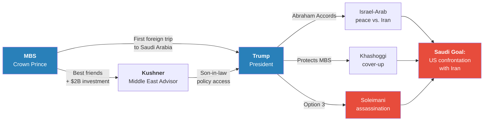

*The MBS-Trump-Kushner triangle operated as a single system: Saudi money purchased access (Kushner), access shaped policy (Trump), and policy served Saudi Arabia's strategic goal — pushing America toward confrontation with Iran. The Abraham Accords, the Khashoggi cover-up, and the Soleimani assassination were all outputs of the same machine.*

> [!tip] Core Insight
> The title of this lecture — "Saudi Arabia's Trump Card Against Iran" — is a double meaning. The "trump card" is not just a metaphor for an ace up the sleeve. It is literally Donald Trump — the president whose alliance with MBS, mediated by Kushner and cemented by $2 billion, makes American war with Iran more probable than at any point since the 1979 revolution.

---

## The November Election as the Trigger

*Prof. Jiang has now completed the three-force model. The Israel lobby provides the theological pressure. Empire economics provides the structural pressure. Saudi Arabia provides the geopolitical pressure and the personal relationships that translate pressure into action. There is one remaining variable: whether the man at the centre of the MBS alliance returns to power.*

Prof. Jiang's argument is direct:

- If Trump wins a second term in November, it is very possible that Trump will declare war on Iran — or at the very least, continue to escalate tensions with Iran in ways that make war virtually inevitable
- The Soleimani assassination demonstrated Trump's willingness to choose the most extreme option available
- The MBS-Kushner relationship means Saudi Arabia will have a direct channel to the president, pushing for confrontation
- The Abraham Accords created the coalition structure — Israel and the Sunni Arab states aligned against Iran — that would form the basis for a military campaign
- All three forces — theological, economic, geopolitical — converge on the same outcome

Prof. Jiang frames this as one of the most consequential elections in history — not because of domestic policy but because of what it means for the Middle East and the possibility of a conflict that could escalate into a world war. The stakes are not about tax policy or immigration. They are about whether the convergence of three independent forces — each one powerful enough on its own — will find the political conditions necessary to produce an outcome no rational actor would choose but that all three forces are pushing toward.

> [!tip] Core Insight
> The three-force model is powerful precisely because the forces are independent. Christian Zionists do not coordinate with Saudi intelligence. Empire economists do not share a strategy room with MBS. Yet all three forces push in the same direction — toward American confrontation with Iran. When three independent forces converge on the same outcome, the probability of that outcome increases not linearly but exponentially. No president can resist all three simultaneously — especially one who has already shown he will choose the most extreme option on the table.

He closes with a preview: <b style="color: #27ae60">next class, he will make the argument that Trump is almost certainly going to win in November</b>. If he is right, then the three-force model predicts not just the possibility but the probability of war with Iran. The election is the final variable — and Prof. Jiang intends to show that this variable, too, is trending toward the outcome the model predicts.

---

## Connections

**Builds on:**
- [[01 - Iran's Strategy Matrix]] — Iran's asymmetrical warfare doctrine is the reason Saudi Arabia cannot win. The Houthis in Yemen applied the same tactics as the "Iran" team in the Millennium Challenge: cheap drones destroying billion-dollar infrastructure. Saudi Arabia's defeat in Yemen is Lecture 1's theory confirmed by real-world evidence
- [[02 - Christian Zionism and the Middle East Conflict]] — The Wahhabi minority in Saudi Arabia mirrors the Christian Zionist minority in the US: both are organised fanatics who drive the foreign policy of a powerful state. Both demonstrate Prof. Jiang's theme that organised minorities defeat passive majorities. And both are forces pushing the same direction — toward war with Iran
- [[03 - How Empire is Destroying America]] — Saudi oil is the foundation of the petrodollar system. Saudi Arabia's oil dependence and America's financial empire are two sides of the same coin — the petrodollar needs Saudi oil priced in dollars, and Saudi Arabia needs American military protection. The economic interdependence makes the alliance structural, not merely diplomatic. Obama's Asia Pivot directly threatened this arrangement

**Sets up:**
- [[05 - Why Trump Will Win]] — Prof. Jiang promises to explain why Trump is almost certain to win the November election. If he does, the three-force model predicts war with Iran becomes highly probable
- [[06 - America's Imperial Hubris]] — The willingness to choose "Option 3" — to assassinate a foreign leader both predecessors considered untouchable — is a manifestation of the imperial hubris Prof. Jiang will explore in Lecture 6
- [[08 - The Iran Trap]] — This lecture establishes why the US will be pushed toward war; Lecture 8 will explore what happens when it gets there — the strategic trap that Iran has prepared

**Related books in vault:**
- [[The 48 Laws of Power - Robert Greene]] — Law 1 ("Never Outshine the Master") and Law 7 ("Get Others to Do the Work for You") both apply to MBS's strategy: cultivating Trump while ensuring America does the fighting against Iran
- [[The 33 Strategies of War - Robert Greene]] — Saudi Arabia's shock-and-awe failure in Yemen illustrates Greene's warnings about attrition warfare and the dangers of fighting an enemy on terrain they control
- [[The Art of War - Sun Tzu]] — Iran's asymmetrical approach embodies Sun Tzu's principle that the supreme art of war is subduing the enemy without fighting. Iran's proxy network achieves strategic objectives without direct confrontation
- [[Sapiens - Yuval Noah Harari]] — Prof. Jiang's framing of the Sunni-Shia split echoes Harari's argument that shared myths and narratives create large-scale human cooperation — and that competing narratives create large-scale human conflict
- [[Antifragile - Nassim Nicholas Taleb]] — Saudi Arabia's economy is the opposite of antifragile: a single shock (oil disruption, drone attack, desalination plant destruction) can collapse the entire system. Iran's diversified economy is more resilient under stress — it gains from disorder while Saudi Arabia breaks

---

## The Takeaway

This lecture completes the three-force model that Prof. Jiang has been building across Lectures 2-4. What makes the model so powerful is not any single force but the convergence. The Israel lobby provides millions of voters who believe war fulfils biblical prophecy. Empire economics means America must demonstrate military dominance to sustain its financial system. And now Saudi Arabia provides the geopolitical pressure, the personal relationships, and the financial incentives that translate abstract structural forces into concrete presidential decisions. Each force is independently sufficient to push toward war. Together, they create a pressure that no president — especially one who has already chosen "Option 3" — can easily resist.

The lecture also reveals the deep irony of Saudi Arabia's position. The 1744 Wahhabi alliance gave the Al Saud family religious legitimacy — but it also created the extremist population that Saudi Arabia must perpetually manage. The Wahhabi export strategy was supposed to solve the problem — but it created al-Qaeda and 9/11, which nearly destroyed the American alliance. The proxy wars were supposed to contain Iran — but they exposed Saudi Arabia's military impotence and economic fragility. And the MBS-Trump alliance is supposed to be the solution to all of these failures — but it depends on a single individual who has already shown he will make the most extreme choice available, with consequences no one can predict.

The most striking feature of this lecture is the contrast between Saudi Arabia's apparent strength and its actual fragility. Saudi Arabia has the world's largest oil reserves, the most expensive American weapons, and a coalition of 30 nations. It should be the dominant power in the Middle East. Instead, it has lost every proxy war it has fought, discovered that its entire economy can be destroyed by $10,000 drones, and concluded that it cannot survive without convincing another country to fight its wars. The kingdom's apparent wealth is its deepest vulnerability — an economy built on a single commodity, with all critical infrastructure exposed on a coastline, defended by conventional forces that cannot adapt to asymmetrical threats. Saudi Arabia is not a powerful state deploying a clever strategy. It is a desperate state that has run out of options.

Prof. Jiang leaves the class with a question rather than a conclusion. If Trump wins in November — and he promises to argue next class that Trump almost certainly will — then all three forces align on the same outcome. The theology says war brings Jesus back. The economics say war preserves the empire. The Saudis say war eliminates their existential enemy. And the man at the centre of it all has already shown he will choose the most extreme option available. The only variable remaining is the election itself — and that is the subject of Lecture 5.
