# Why Trump Will Win

> Lectures 1-4 established three forces pushing the United States toward war with Iran: Christian Zionism, empire economics, and Saudi Arabia's desperation. But one variable remained unsettled — who wins the 2024 presidential election? Prof. Jiang answers that question here with a detailed electoral analysis. Biden's 2020 victory was built on an unusually broad coalition — black voters, young people, college graduates, women, and suburban families — held together by two unrepeatable events: the George Floyd protests and the pandemic. Every element of that coalition is now weaker. The decisive battleground is the suburbs, where Biden flipped two million voters in 2020 by picking Kamala Harris — a former rival who had publicly called him a racist. That act of reconciliation signalled empathy, growth, and magnanimity — exactly what suburban women prize. Trump can replicate this strategy identically by picking Nikki Haley, whose financial backers — an anti-Iran lobbying group funded by Netanyahu's patron Sheldon Adelson, Boeing, and Christians United for Israel — reveal that her role in the White House would be to push for war against Iran. The electoral analysis connects directly to the series' driving question: Trump's victory, combined with Haley's hawkish connections, makes that war highly probable.

---

## The Question

*Lectures 1-4 have established three forces converging on war with Iran. This lecture answers the remaining question: will the president who takes office in January 2025 actually pull the trigger — and what does his choice of vice president reveal about whether war is coming?*

Prof. Jiang opens with a direct prediction: <b style="color: #27ae60">Trump will win in November, and he will pick Nikki Haley as his vice president</b>. He frames this not as punditry but as an exercise in analytical model-building — a testable prediction that can be measured against reality and refined.

The argument has two parts:

- **Electoral analysis:** Why Biden's 2020 coalition is falling apart, and what strategic move Trump can make to seal the victory
- **Foreign policy implication:** If Nikki Haley becomes VP, she becomes the person inside the White House agitating for war against Iran — connecting the electoral question directly to the series' central thesis

This is the fifth lecture in a cumulative argument:

- [[01 - Iran's Strategy Matrix|Lecture 1]] established that Iran fights asymmetrically and America's military superiority does not guarantee victory
- [[02 - Christian Zionism and the Middle East Conflict|Lecture 2]] identified Christian Zionism as Force 1 pushing toward war
- [[03 - How Empire is Destroying America|Lecture 3]] identified empire economics as Force 2 — the petrodollar, financialisation, and the debt spiral
- [[04 - Saudi Arabia's Trump Card Against Iran|Lecture 4]] identified Saudi Arabia as Force 3 — three lost proxy wars, a vulnerable economy, and the MBS-Kushner-Trump triangle that purchased American foreign policy

Now: who will be president when these three forces converge?

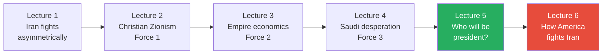

*This lecture is the bridge between "why war is coming" (Lectures 1-4) and "how war will be fought" (Lecture 6). The electoral analysis is not a detour — it identifies the specific personnel who will make the decision.*

---

## Key Concepts at a Glance

| Concept | One-line summary |
|---------|-----------------|
| **The 65,000-vote margin** | Biden's 81M-to-74M popular vote advantage masked a razor-thin margin — just 65,000 votes in battleground states separated the candidates |
| **Biden's five-group coalition** | Black voters, young people, college-educated, women, and suburban voters — each held together by events that no longer exist |
| **The suburban swing** | The suburbs — between solidly Democratic cities and solidly Republican rural areas — are the only variable that decides American elections |
| **The redemption narrative** | Picking a former rival as VP signals personal growth and empathy — the precise qualities suburban voters prize above all else |
| **Kamala Harris effect** | Biden's 2020 VP pick was the decisive suburban mechanism — she attacked him as a racist on national television, he picked her anyway, and the suburbs interpreted this as proof of character |
| **Nikki Haley parallel** | Trump can replicate the Biden-Harris strategy identically — Haley's suburban appeal, their public feud, and the dramatic reconciliation follow the same template |
| **Politics as theatre** | The Haley-Trump feud is a staged performance, not genuine animosity — their reconciliation is designed for maximum narrative impact |
| **Haley's anti-Iran network** | Haley's wealth ($0 to $10M after leaving office) came from anti-Iran organisations, Boeing, and evangelical war advocates — revealing her likely policy role as VP |
| **Analytical model-building** | Prof. Jiang frames his prediction as a testable hypothesis to be measured against reality and refined — the epistemological purpose of the lecture |

---

## A Fragile Victory: Biden's 65,000-Vote Margin

*The 2020 election looked like a decisive victory for Biden. It was not. Strip away the headline numbers and you find the most precarious coalition in modern American politics — one that a shift of 65,000 voters could have reversed.*

### The Numbers Behind the Numbers

The 2020 presidential election produced the largest voter turnout in American history since 1900:

- <b style="color: #2980b9">81 million</b> people voted for Biden
- <b style="color: #2980b9">74 million</b> people voted for Trump
- Two out of every three American adults came out to vote

The headline looks like a comfortable victory — a seven-million-vote margin. But America does not elect presidents by popular vote. It uses the <b style="color: #2980b9">electoral college system</b>, an indirect mechanism where state-by-state results determine who wins. And under that system, the actual margin of victory was <b style="color: #e74c3c">just 65,000 votes in key battleground states</b>. If 65,000 people had flipped, Trump would have won a second term.

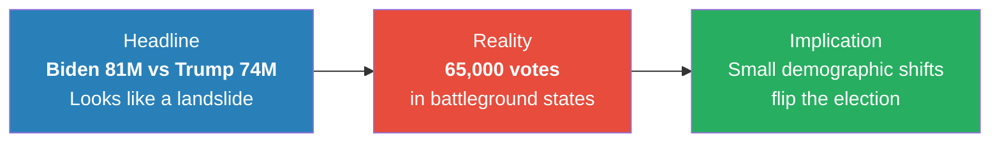

*The gap between perception and reality in American elections is enormous. The popular vote is a headline; the electoral college margin is what matters — and that margin was razor-thin.*

This is why coalition analysis matters. Biden's victory was not built on a broad, durable majority. It was assembled from five demographic groups, each motivated by specific events — and each of those events has either faded or reversed.

---

## Biden's Collapsing Coalition

*Prof. Jiang breaks down the five pillars of Biden's 2020 victory and shows how each one is cracking. The structure is methodical: who voted for Biden, why they did, and why they will not do so again.*

### The Five Pillars

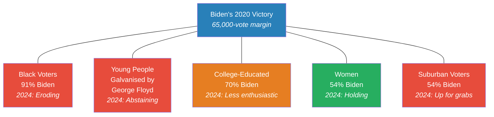

*Every pillar except women is weakening. And with a margin of just 65,000 votes, even modest erosion in any single group could be fatal.*

---

### Pillar 1: Black Voters — The Debt Is Paid

In 2020, <b style="color: #2980b9">91% of black voters chose Biden</b>. Only 8% voted for Trump. That is an overwhelming margin — and it was driven by two specific forces:

- **Loyalty to Obama's VP:** Biden served as Barack Obama's vice president for eight years. Many older black voters felt a personal debt — this man served loyally under our president, now we must bring him into the White House
- **The George Floyd protests:** In May 2020, George Floyd was killed by a white police officer in Minneapolis. The video went viral. Riots and protests swept the country. Trump refused to acknowledge the pain black Americans felt. Black voters were galvanised against him

In 2024, both forces have evaporated:

- <b style="color: #e74c3c">The debt is paid off</b> — Biden won. The one-time obligation to Obama's VP has been fulfilled. There is no reason to feel loyalty a second time
- There is no George Floyd moment — no single galvanising event to drive turnout
- Biden's record has actively hurt black Americans:
  - **Inflation** has risen sharply — and inflation disproportionately hurts poor people, eroding their standard of living
  - **Illegal immigration** has roughly doubled under Biden's watch (from approximately 10 million to 20 million) — immigrants compete for the same low-wage jobs, pushing wages down
  - **Tens of billions of dollars** have been sent to Ukraine to fight a war that black Americans see as having nothing to do with their lives — while their own standard of living declines

> [!example] The Black Voter Question (2024)
> - In 2020, black voters gave Biden the largest demographic margin of any group — 91% to 8%
> - The loyalty was personal (Obama's VP) and event-driven (George Floyd)
> - Four years later, black voters are asking a simple question: what has Biden done for us?
> - Inflation has risen, wages have stagnated, immigration has increased job competition at the bottom
> - Meanwhile, America sends billions to Ukraine — a war that feels irrelevant to black communities
> - Polls show Biden's lead with black voters shrinking — not because they love Trump, but because they no longer see a reason to turn out for Biden
> **The lesson:** Coalition loyalty built on a one-time event and a personal debt has a shelf life. When the event fades and the debt is repaid, the question becomes: what have you done for me lately?

---

### Pillar 2: Young People — Gaza, Not George Floyd

Young voters tend to lean Democratic in all elections, but in 2020 they were exceptionally motivated. The George Floyd protests made Trump appear to be a hateful, racist figure that they had a moral obligation to remove from office. Turnout among young people was unusually high.

In 2024, the motivation has not just faded — it has reversed:

- <b style="color: #e74c3c">Gaza has replaced George Floyd</b> as the defining moral issue for young Americans
- On college campuses across the country, students are protesting America's support for Israel's war in Gaza
- These young voters will not switch to Trump — but many will <b style="color: #e74c3c">refuse to vote for Biden as a protest</b> against American policy on Israel
- The result is not a vote flip but a turnout collapse — exactly the kind of small shift that matters in a 65,000-vote-margin election

---

### Pillar 3: College-Educated Voters — Still Democratic, Less Enthusiastic

In 2020, <b style="color: #2980b9">70% of people with college degrees voted for Biden</b>. These are the coastal professional-managerial elite — the core of the Democratic base. They will still vote Democratic in 2024.

But there is a difference between voting for someone and voting enthusiastically:

- Under Biden's watch, two major geopolitical crises have erupted — Ukraine and Gaza
- Many college-educated voters see Biden as <b style="color: #e74c3c">too old, too weak, and too feeble to stand against Putin</b>
- They perceive poor global leadership — not outright betrayal, but disappointing competence
- In 2024, they will vote "primarily against Trump" rather than "for Biden" — a subtle but significant difference in motivation that translates into lower enthusiasm, fewer donations, and less volunteer energy

---

### Pillar 4: Women — The One Pillar That Holds

In 2020, 54% of women voted for Biden and 44% for Trump. Prof. Jiang treats this as the one group that will remain consistent:

- Trump is still perceived as a hateful figure by women voters
- <b style="color: #27ae60">Abortion rights</b> have become an even more powerful motivator since the Supreme Court overturned Roe v. Wade
- Women will continue to vote Democratic — and they may be more motivated than in 2020

But women alone cannot hold the coalition together if every other pillar is weakening.

---

### Pillar 5: Suburban Voters — Where the Election Will Be Won or Lost

This is where Prof. Jiang's analysis reaches its sharpest point. The suburbs — located between the solidly Democratic cities and the solidly Republican rural areas — are where American elections are decided.

- **Urban areas** overwhelmingly support the Democratic Party — this does not change
- **Rural areas** overwhelmingly support the Republican Party — this does not change
- <b style="color: #27ae60">The suburbs are the only variable</b>

The evidence is stark:

| Election | Suburban vote | Result |
|----------|-------------|--------|
| **2016** | 45% voted for Clinton | Trump won |
| **2020** | 54% voted for Biden | Biden won |

That nine-point swing — a flip of roughly <b style="color: #2980b9">two million voters</b> — was the entire election. Everything else was noise.

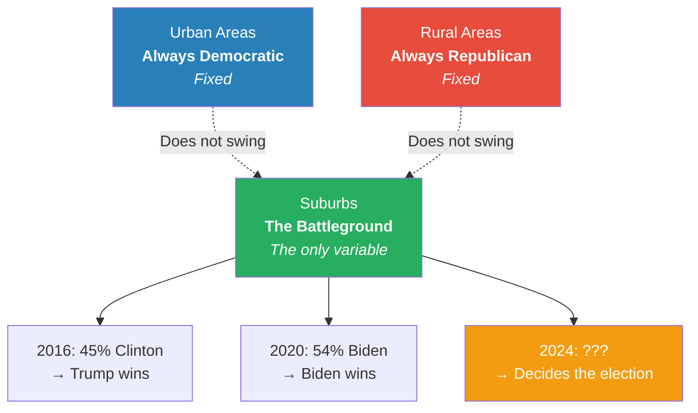

*American elections are not decided by cities or by rural counties. They are decided by the suburbs — and the suburbs can swing either way. For Trump to win in 2024, he must win the suburban vote. He won it in 2016. He lost it in 2020. Everything that follows in this lecture is about how he can win it back.*

> [!tip] Core Insight
> The American presidential election is not a national popularity contest. It is a suburban referendum. Everything else — the popular vote, the pundit analysis, the campaign rallies — is theatre. The suburbs decide. Whoever wins the suburbs wins the presidency.

---

## How Biden Won the Suburbs: Three Mechanisms

*Biden did not win the suburbs by accident. Three specific forces swung two million suburban voters to him in 2020 — and all three can be understood, and potentially replicated or neutralised, in 2024.*

Prof. Jiang identifies three reasons the suburbs flipped from Trump (2016) to Biden (2020):

### Mechanism 1: The Media Narrative — Trump as Divider

Throughout Trump's presidency, the mainstream media constructed a sustained case against him:

- First came <b style="color: #2980b9">Russiagate</b> — the claim that Trump was a paid Russian asset, a Putin puppet. Prof. Jiang calls this "a complete lie," but it shaped perception
- Then the narrative shifted to Trump as a <b style="color: #e74c3c">divisive figure</b> — and this idea caught the imagination of suburban voters

Why? Because suburban voters have a specific psychology:

- They tend to be middle class, relatively wealthy, well-educated
- They <b style="color: #27ae60">like the status quo</b> — they have something to protect
- They want a leader who is conservative in temperament and who unifies rather than divides
- The growing polarisation — left and right attacking each other constantly — alarmed them

The George Floyd protests crystallised this fear:

- Protesters rioted in the streets
- Trump threatened to send in the military to crush the protesters
- Suburban families — with children, with property, with a stake in social stability — were terrified
- Biden appeared as the opposite: <b style="color: #27ae60">steady, establishment, a man who could unite both parties</b>

### Mechanism 2: The Pandemic — Incompetence in Crisis

COVID-19 hit the United States, and suburban voters were among the most anxious:

- They tend to have children in school
- They tend to be older
- They saw Trump's pandemic response as <b style="color: #e74c3c">deeply incompetent</b>
- As a political outsider, Trump could not get things done in Washington — the very quality that had attracted voters in 2016 became a liability when crisis demanded institutional competence

### Mechanism 3: Kamala Harris — The Decisive Factor

Prof. Jiang devotes the most time to this mechanism — and for good reason. The media narrative and the pandemic were circumstantial events that Biden could not have planned. The VP pick was a <b style="color: #27ae60">deliberate strategic choice</b> — and it was the most replicable mechanism of the three.

Biden picked Kamala Harris as his running mate. Her background resonated deeply with suburban voters:

- Her father was Jamaican, her mother was Indian
- Her father left the family when she was young — her mother raised two daughters alone
- She attended Stanford, became Attorney General of California, then a US Senator
- She was accomplished, articulate, and had a compelling personal story

Three reasons the suburbs loved her:

- **"Like us"** — Harris spoke and thought like suburban voters: well-educated, articulate, smart, moderate in presentation
- **Establishment credentials** — as Attorney General of California, she was famously tough on crime, sending as many people to jail as possible. This was controversial — some of those convicted may have been innocent. But suburban voters value safety and security above abstract principle. They have children. They want law and order
- **The redemption narrative** — and this is the key to the entire lecture

> [!example] The June 2019 Democratic Debate — The Moment That Won the Suburbs
> - The first Democratic primary debate brought together the major contenders, including Joe Biden and Kamala Harris — both considered heavy favourites
> - On national television, Harris turned directly to Biden and launched a devastating personal attack
> - She said: Joe, you have been in Washington for fifty years, and some of your policies I cannot support. You opposed the integration of black and white students in schools
> - Then she made it personal: I am a black woman. I was a little black girl growing up in the 1970s in California. I got my opportunity to succeed in America because of integration — because I could go to a white school. And you opposed my opportunity to succeed
> - She was calling Biden a racist on national television. Biden was visibly shell-shocked — old, unable to confront her directly
> - Everyone watching assumed the same thing: there is no way Biden picks this woman as his running mate. She just humiliated him in front of the entire country
> - Then he picked her
> **The lesson:** When Biden chose Harris despite her public attack, it sent a signal more powerful than any policy position: this man does not hold grudges. He listens. He is a team player. He has empathy. These four qualities — forgiveness, listening, teamwork, empathy — are the exact opposite of Trump's public persona.

Prof. Jiang identifies precisely why this worked with suburban women:

- <b style="color: #27ae60">Women want compassionate, empathetic leadership that is decisive and bold but also tolerant</b>
- The Biden-Harris pick embodied all of these qualities simultaneously
- It was not Harris's policy positions that mattered — it was the narrative of reconciliation

This also explains a historical puzzle: why did Hillary Clinton lose the suburbs in 2016 despite being a woman?

- Clinton did not come across as compassionate, forgiving, or tolerant
- Being a woman was not enough — suburban voters were looking for a specific emotional signal, and Clinton did not provide it

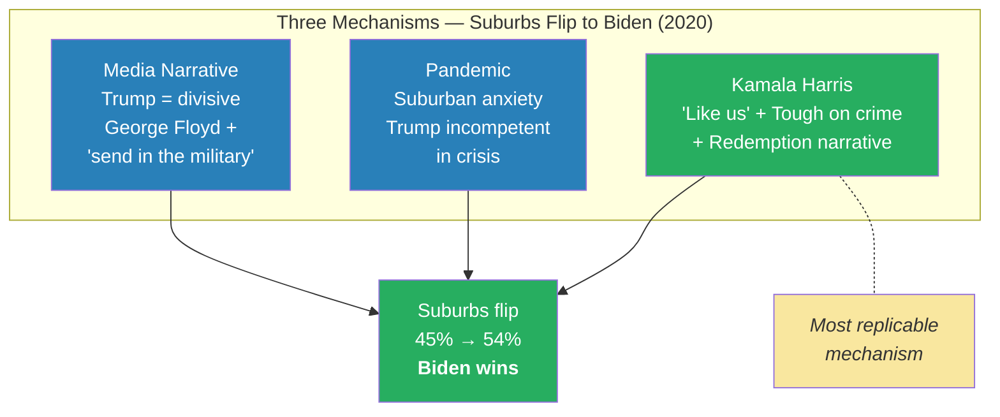

*The media narrative and the pandemic were gifts of circumstance. The Kamala Harris pick was a deliberate strategic choice — and it was the mechanism that mattered most, because it spoke directly to what suburban voters care about: character, empathy, and the ability to forgive.*

> [!abstract] The Redemption Narrative — A Replicable Template
> The Biden-Harris VP selection follows a five-step template:
> 1. **Public conflict** — the candidate and future VP fight bitterly during the primary
> 2. **Perceived impossibility** — the future VP says things so harsh that everyone assumes they can never be paired
> 3. **The surprise pick** — the candidate chooses their attacker anyway
> 4. **Character signal** — media and voters interpret this as: doesn't hold grudges, listens, team player, has empathy
> 5. **Suburban response** — these are precisely the qualities suburban voters (especially women) prize, and they switch their vote
>
> This template is not specific to Biden and Harris. It is a general political strategy — and it can be copied.

---

## Why Trump Will Pick Nikki Haley

*If the redemption narrative is a replicable template, who is Trump's Kamala Harris? Prof. Jiang argues the answer is sitting right in front of us — a former UN ambassador who ran against Trump, lost, and is now being positioned by anti-Iran donors to become the most consequential vice president in a generation.*

### The Template: Pick Your Weakness

The Biden-Harris playbook reduced to a formula: <b style="color: #27ae60">identify your greatest weakness, then pick a VP who is the living antidote to that weakness</b>.

Biden's weakness was clear — he was an old white man perceived as out of touch with a diversifying America. Harris was his opposite:

- Black and Indian — demographic representation Biden could not provide
- A woman — when Biden could not credibly speak to women's concerns
- Young and sharp — when Biden appeared slow and confused
- A former attacker — her very hostility made the pick dramatic

Trump's weakness is equally clear — he is seen as <b style="color: #e74c3c">divisive, immature, incapable of growth, hostile to women, and threatening to suburban families</b>. He needs a VP who is the living antidote to every one of those perceptions.

Enter <b style="color: #2980b9">Nikki Haley</b>:

- **A woman and a minority** — Indian immigrant parents, South Asian descent
- **Suburban and moderate in presentation** — well-educated, articulate, the kind of person suburban families recognise as "one of us"
- **A centrist unifier** — ran on the message that America needs to "move on from Trump" and elect a leader who unites rather than divides
- **A former attacker** — publicly called Trump divisive and unfit during the Republican primary
- **Proven suburban appeal** — during the primary, the demographic group that loved Haley most was college-educated suburban women, who voted for her in droves

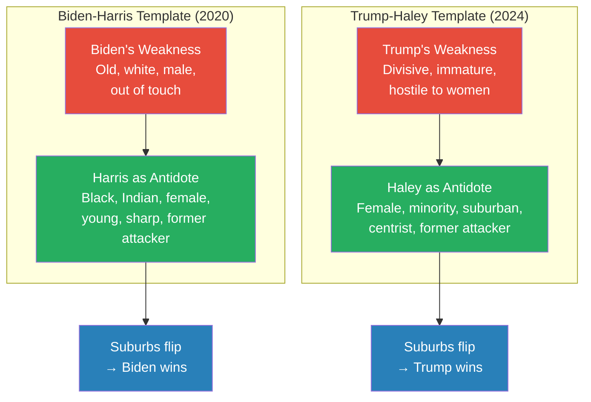

*The structure is identical. Biden picked the woman who called him a racist. If Trump picks the woman who called him a divider, the same narrative mechanism activates — and the same suburban voters respond.*

---

### Haley's Political Journey: Never-Trump to VP Contender

Nikki Haley's background mirrors Kamala Harris's in the details that matter to suburban voters:

- Her parents were Indian immigrants — not wealthy, but hardworking
- She became governor of South Carolina for two terms — a serious executive credential
- In 2016, Trump brought her into his administration as <b style="color: #2980b9">UN Ambassador</b> — a prestigious foreign policy role she held until 2018
- Everyone who worked with them said the two got along well — Trump even considered dropping Mike Pence and putting Haley on the ticket for 2020

Then came the Republican primary. Haley ran against Trump, positioning herself as the anti-Trump:

- She said: "I served under Trump, and I think he's a divisive figure. Right now our country needs a unifier. That's why I'm running for president"
- Trump, being Trump, responded by calling her "a bird brain"
- She lost the primary — but she was loved by exactly the voters Trump needs: <b style="color: #27ae60">college-educated suburban women</b>
- Even after dropping out, she continued receiving 25-33% of all Republican primary votes — a remarkable figure for a defeated candidate

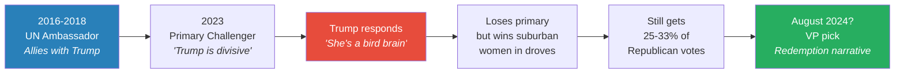

*Haley's journey — from Trump ally to Trump critic to potential Trump running mate — follows the exact arc needed to trigger the redemption narrative. Each phase was necessary: the alliance establishes a real relationship, the conflict creates the drama, and the reunion signals growth.*

### The Dramatic Reveal

Prof. Jiang walks the class through the moment that would matter:

- News reports have already surfaced that Haley is "in consideration" for VP
- Trump publicly denied it: "I am not considering Nikki Haley"
- But imagine it is August, the Republican convention — and Trump announces: "I was wrong. Nikki Haley is the best person to be my VP. She'll be my running mate in November"

How would people react? Prof. Jiang asks the class. The answer comes immediately:

- <b style="color: #27ae60">He's a changed man</b> — Trump has grown
- The narrative about Trump has always been that he is a "five-year-old child" — immature, incapable of growth, unable to let go of grudges
- Picking Haley — after publicly feuding with her, after calling her a bird brain, after denying he would ever consider her — would destroy that narrative overnight
- The media would report: he listens, he has empathy, he has learned his lessons
- The suburbs would switch — and Trump would win

> [!example] The Strategic Denial (2024)
> - News reports surfaced that Nikki Haley was being considered for Trump's VP slot
> - Trump publicly denied it: "I am not considering Nikki Haley"
> - Prof. Jiang argues this denial is itself part of the strategy — the louder the denial, the more dramatic the eventual pick
> - If Trump picks Haley after publicly rejecting her, it amplifies the redemption narrative: not only did he overcome their feud, he overcame his own stated position
> - The denial raises the stakes of the reconciliation — making the "changed man" story even more compelling
> **The lesson:** In political theatre, the public denial is not a mistake — it is a setup. The more impossible the reconciliation appears, the more powerful the narrative when it happens.

---

### Politics as Theatre: The WWE Framework

A student asks the obvious question: what if Haley holds a grudge and says no? She has publicly said Trump is divisive and that she would not serve as his VP. What if she means it?

Prof. Jiang's answer reveals his deepest conviction about how politics works. He references a previous class where they studied Trump's personality through his WWE appearances:

- In the WWE, Vince McMahon — the billionaire owner — "challenges Trump to a fight"
- Everyone watching knows it is staged entertainment
- <b style="color: #27ae60">Politics is the same thing — it is all theatre</b>

What Nikki Haley and Donald Trump are doing is <b style="color: #e74c3c">pretending to be bitter enemies so that their reconciliation will be so dramatic</b>. The feud is not real. The public hostility is a performance designed to maximise the narrative impact of the eventual reunion.

The evidence that the feud is staged:

- Haley served under Trump for two years as UN Ambassador — everyone says they got along well
- Trump was considering her for VP as far back as 2020
- The two respect each other and have a genuine rapport behind the scenes

And even if the feud were real, it would not matter — because <b style="color: #2980b9">politicians are pure opportunists</b>:

- "They have no ideas, they have no principles. All they care about is political power"
- Why would Haley accept? Because VP is one step from the presidency
  - If anything happens to Trump, she becomes president
  - In four years, she can run as the Republican nominee
- Prof. Jiang extends this to a general law of motivation: politicians will do anything for power, rich people will do anything for money, celebrities will do anything for fame — all will "sell their own mother" for their primary currency

> [!example] Trump in the WWE — The Analogy That Explains Everything
> - In a previous class, Prof. Jiang studied Trump's appearances in the WWE — the professional wrestling entertainment company
> - Vince McMahon, the billionaire owner of the WWE, challenged Trump to a fight on live television
> - The audience knows it is scripted. The "enemies" are friends behind the curtain. The drama is manufactured for maximum entertainment
> - Prof. Jiang's point: political feuds work identically — the Haley-Trump conflict is scripted, the reconciliation is planned, and the audience (voters) respond to the dramatic arc without realising it is manufactured
> - Trump, more than any modern politician, understands this — he literally came from the world of staged entertainment
> **The lesson:** The most powerful political narratives are often the most artificial. The candidate who understands that voters respond to stories — not policies — wins.

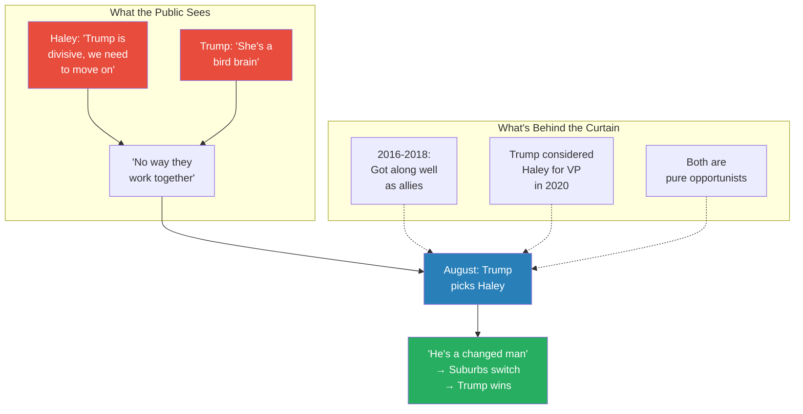

*The gap between the public performance and the private reality is the entire mechanism. Voters see the drama; they do not see the script. The more bitter the feud appears, the more powerful the reconciliation — and the more effectively the suburbs are won.*

---

## The Iran Connection: Why Haley's VP Pick Means War

*The electoral analysis is not a detour from the series' driving question — it is the answer. If Trump wins with Haley, the three forces identified in Lectures 1-4 (Christian Zionism, empire economics, Saudi desperation) gain the one thing they lacked: a person inside the White House whose job is to push for war with Iran.*

### Follow the Money

Prof. Jiang turns from electoral strategy to foreign policy with a single question: who is Nikki Haley, and where did her money come from?

The facts are striking. When Haley left office as UN Ambassador in 2018, <b style="color: #e74c3c">she had nothing in her bank account</b>. By 2024, she has $10 million in cash and lives in a $5 million mansion. The transformation came from three sources — and all three point in the same direction:

**Source 1: <b style="color: #2980b9">United Against a Nuclear Iran</b>**
- An organisation whose stated purpose is to create conflict between the United States and Iran
- Targets companies and individuals who do business with Iran
- Hired Haley after she left office and paid her substantial sums
- A major donor: <b style="color: #2980b9">Sheldon Adelson</b> — the billionaire casino magnate who was the primary political patron and financial backer of Benjamin Netanyahu
- Adelson funded both Netanyahu and this anti-Iran organisation — and the organisation hired Haley

**Source 2: <b style="color: #2980b9">Boeing</b>**
- A weapons manufacturer — "they make aeroplanes, but they mainly make bombs and missiles"
- Haley was given a seat on Boeing's board of directors — an extremely prestigious position
- She was paid $300,000 "just to sit on the board and do nothing"
- Boeing, as a weapons manufacturer, profits directly from war

**Source 3: <b style="color: #2980b9">Christians United for Israel (CUFI)</b>**
- The 7-million-strong evangelical organisation introduced in [[02 - Christian Zionism and the Middle East Conflict|Lecture 2]]
- Dispensationalist premillennialists who believe war between Israel and Iran will bring Jesus back to Earth and establish the Kingdom of Heaven
- They want as much conflict in the Middle East as possible
- Haley has given speeches for them — accepting their platform and their money

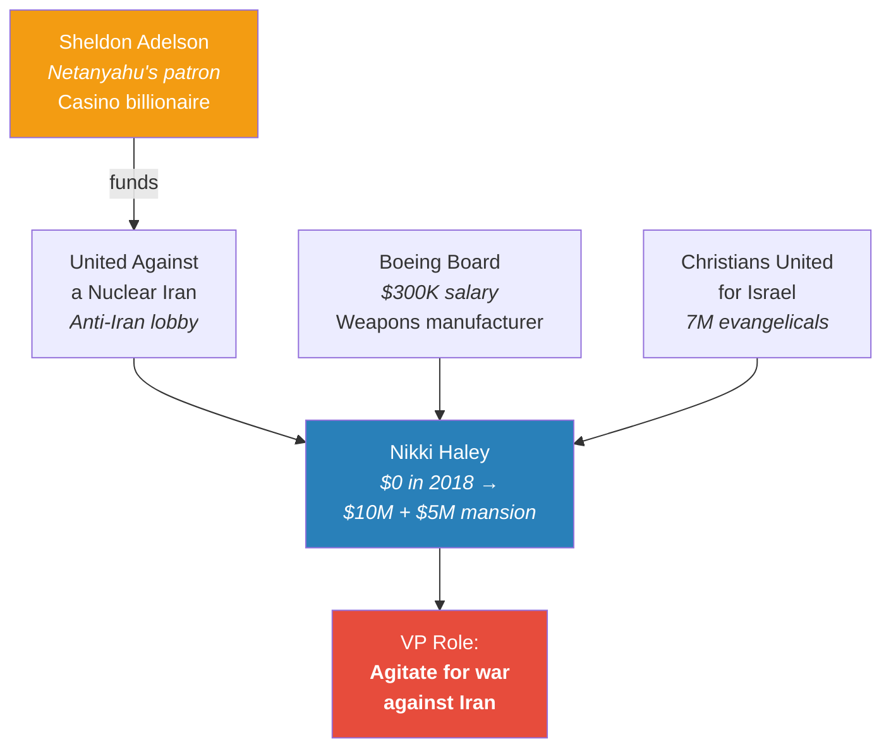

*Every dollar that made Haley wealthy came from organisations and individuals whose primary objective is confrontation with Iran. The money trail is not subtle — it is a straight line from anti-Iran donors to the person who would sit one heartbeat from the presidency.*

### The Fundraising Anomaly

One piece of evidence seals Prof. Jiang's argument. In January 2024, after the Republican primary was effectively over and Trump had won everything, <b style="color: #27ae60">Haley raised more money than Trump</b> — $12 million to Trump's $11 million.

Why would donors pour money into a candidate who had already lost?

- They knew Haley could not beat Trump for the nomination
- They were not funding a presidential campaign — they were <b style="color: #27ae60">positioning her to be vice president</b>
- By keeping Haley in the race, they kept her visible, kept her popular, and kept her name in the news
- Even after she dropped out, she continued receiving 25-33% of all Republican primary votes — proof that a significant portion of the Republican electorate preferred her to Trump
- This makes her an irresistible VP pick: she brings voters Trump cannot reach on his own

> [!example] The $12 Million Signal (January 2024)
> - By January 2024, Trump had effectively won the Republican primary — Haley had no realistic path to the nomination
> - Yet in that month, Haley raised $12 million from donors — more than Trump's $11 million
> - No rational donor would invest in a lost cause unless the investment served a different purpose
> - Prof. Jiang's interpretation: the donors were buying Haley a VP position, not a presidential campaign
> - By funding her continued presence in the race, they ensured she remained visible, popular, and associated with the suburban voters Trump needs
> - The same donors — from the anti-Iran network — would then have their representative inside the White House
> **The lesson:** In American politics, follow the money. When the funding pattern defies electoral logic, it is serving a different strategic purpose.

### The Analytical Chain: From Election to War

Prof. Jiang draws the full connection — the chain of reasoning that links a domestic election to a foreign war:

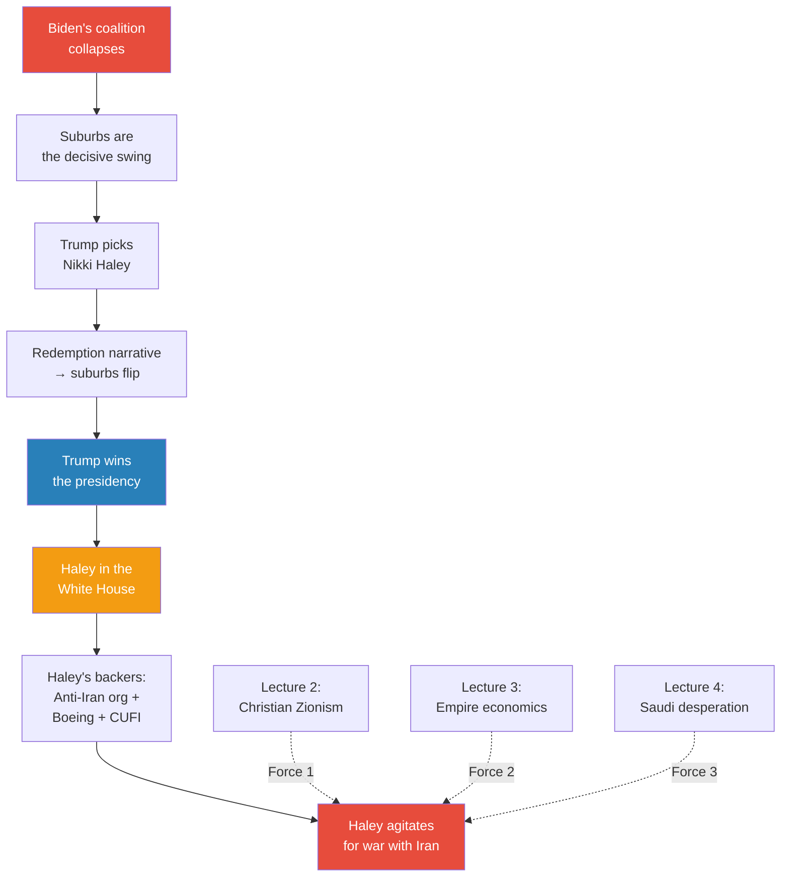

*This is the capstone of the lecture — and of the first five lectures in the series. Three forces have been pushing toward war with Iran (Christian Zionism, empire economics, Saudi desperation). The electoral analysis identifies the specific person who will translate those forces into White House policy. Haley is not just a VP pick — she is the mechanism through which the war becomes probable.*

> [!tip] Core Insight
> The question "who will Trump pick as VP?" is not an electoral curiosity — it is a foreign policy question. If Haley becomes vice president, her financial backers (an anti-Iran lobby funded by Netanyahu's patron, a weapons manufacturer, and 7 million evangelical war advocates) gain a representative inside the White House. The VP pick does not just decide the election — it decides whether America goes to war.

---

## Biden's Non-Strategy

*A student asks the obvious counter-question: Biden has an army of experienced strategists. They can see all of this. What can Biden do? Prof. Jiang's answer is devastating — Biden has no strategy, has never had a strategy, and is constitutionally incapable of developing one.*

Jack raises a sharp point: if a professor teaching a class of students can figure out Trump's optimal strategy, surely Biden's well-paid professional strategists can see it too. So what is Biden's counter-move?

Prof. Jiang demolishes the premise:

- Biden ran for president twice before 2020 — and lost both times
- He lacks charisma: "When Biden goes to speak, there's no one there to listen to him. He's boring and he has no ideas. And he's old"
- His 2020 "strategy" was simply: "I'm gonna win" — with no elaboration on how
- In April-May 2020, Prof. Jiang says he would have predicted Biden had no chance — Trump gave speeches to 100,000 people; Biden's audiences fell asleep

Then two events saved Biden by accident:

- The George Floyd protests galvanised young people, black voters, and suburban families against Trump
- The pandemic shut down Trump's ability to campaign — Biden could "sit in his basement and do nothing" while his surrogates did the work

<b style="color: #e74c3c">Biden learned the wrong lesson from this accidental victory.</b> The lesson he took: "If I just sit in my basement all day and make no mistakes, my surrogates — Hillary Clinton, Bill Clinton, Barack Obama — will fire up the base, and I'll win because I'm not Trump." His entire strategy for 2024 is three words: <b style="color: #e74c3c">"I'm not Trump."</b>

Why it fails in 2024:

- In 2020, the American people had four years of Trump and knew he was a problem
- Now the American people have had four years of Biden — and Biden is a problem too
- The question becomes: "who sucks more — Biden or Trump?"
- When both candidates are perceived as failures, voters do not come out — and <b style="color: #27ae60">the party whose base feels more passionately will win</b>
- The Republican coalition — rural voters, conservatives, Christians, white voters — feels far more passionately about Trump than the Democratic coalition feels about Biden

Biden cannot adapt because he is 81 years old and lacks the energy to reinvent himself. "It's much easier for him to sit around and pray that 'I'm not Trump' will deliver another election than it is for him to go out and change who he is. He can't change who he is."

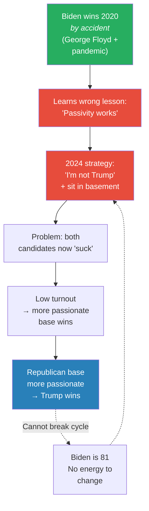

*Biden's non-strategy is a structural trap. He won by accident, drew the wrong conclusion, and is now too old and too set in his ways to adapt. The lesson of 2020 — that events can rescue a passive candidate — became the very belief that prevents him from developing a real strategy for 2024.*

---

## The Analytical Method — How Prof. Jiang Thinks About Elections

*This lecture is not just a prediction — it is a demonstration of how to think about the world. Prof. Jiang closes by pulling back from the specific claim and explaining the epistemological framework that produced it: build a model, make testable predictions, observe reality, refine.*

### The Model, Not the Pundit

Prof. Jiang is explicit about what distinguishes his approach from cable-news commentary. He is not saying "I have a gut feeling Trump will win." He is saying: <b style="color: #27ae60">I have built an analytical model of how American elections work, and that model produces a specific, falsifiable prediction</b>.

The model has clear components:

- **Structural forces:** Coalition data, suburban voting patterns, demographic erosion, the electoral college's 65,000-vote margin
- **Behavioural logic:** The redemption narrative template — how VP picks signal character traits that suburban voters respond to
- **Financial evidence:** Donor money flowing from anti-Iran organisations to a specific VP candidate
- **A prediction:** Trump wins and picks Nikki Haley

The prediction is not the point — the model is. If the prediction fails, the model can be examined and improved. If the prediction succeeds, the model gains credibility and can be applied to the next question.

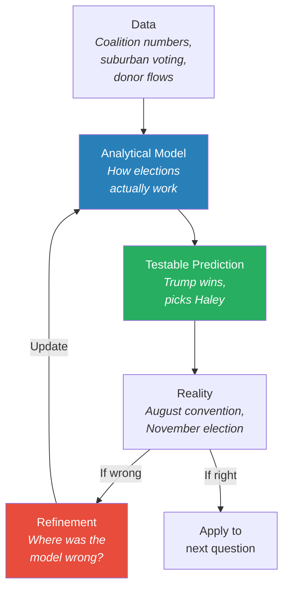

*The analytical method is cyclical: data produces a model, the model produces a prediction, reality tests the prediction, and failure feeds back into a better model. This is what Prof. Jiang wants his students to learn — not the specific prediction, but the habit of building and testing models.*

### The Falsifiability Condition

Prof. Jiang acknowledges uncertainty with striking honesty:

- "I am not sure who will win this year. I think it's Trump"
- "I'm not sure that Nikki Haley will be his Vice President. I'm just making a guess"
- He names <b style="color: #2980b9">JD Vance</b> as the most likely alternative VP pick — noting that "the only thing you need to know about JD Vance is he's very loyal to Trump"
- If Trump picks Vance instead of Haley, the model is partially wrong — Vance does not carry the suburban appeal or the anti-Iran financial network, which means the prediction chain (election → VP → war) would need different wiring

This is the critical difference between analysis and punditry:

- A pundit says: "I believe Trump will win" — and if wrong, moves on to the next take without examining why
- An analyst says: "My model predicts Trump will win via this specific mechanism — and if the mechanism fails, here is where to look for the error"

The JD Vance scenario is illuminating precisely because it tests a different part of the model. Vance is loyal to Trump — that is his defining characteristic. But loyalty does not win suburbs. If Trump picks Vance, it means he has chosen base consolidation over coalition expansion:

- **Haley pick** = coalition expansion strategy: concede the base is already secured, reach for the suburban swing voters who decided 2016 and 2020
- **Vance pick** = base consolidation strategy: maximise turnout among existing supporters, bet that passion advantage overcomes the suburban deficit
- The two strategies imply different theories of how elections work — one says the swing voter decides, the other says base turnout decides

Prof. Jiang's model favours the coalition expansion theory (the suburban swing data from 2016 and 2020 supports it). But if Trump wins with Vance, the model needs to account for a different mechanism — perhaps Biden's weakness is so extreme that the passion gap alone is sufficient, or perhaps some other suburban mechanism activates that the model did not anticipate.

Either way, the result produces information. A right prediction confirms the model. A wrong prediction reveals which assumption failed. Both outcomes advance understanding.

> [!tip] Core Insight
> The purpose of making predictions is not to be right — it is to build and refine models. A failed prediction that reveals a flaw in the model is more valuable than a lucky guess that teaches nothing. This is how Prof. Jiang wants his students to think about geopolitics: not as a series of hot takes, but as a cumulative process of model-building and reality-testing.

---

### The Student Question: Why Would Haley Accept?

The Q&A reveals one of the lecture's sharpest insights. When a student asks whether Haley might refuse the VP slot — she has, after all, publicly called Trump divisive and said she would not serve under him — Prof. Jiang does not just answer the question. He uses it to teach a <b style="color: #2980b9">general law of political motivation</b>:

- **Politicians** will do anything for political power — it is their primary currency
- **Rich people** will do anything for money
- **Celebrities** will do anything for fame
- All three categories will, as Prof. Jiang puts it, "sell their own mother" to get what they want

Why would Haley accept?

- VP is <b style="color: #27ae60">one step from the presidency</b> — if anything happens to Trump, she becomes president
- In four years, she can run as the Republican nominee with the built-in advantage of incumbency
- The "refusal" is part of the performance — the louder she denies interest, the more dramatic the eventual acceptance

This is not cynicism for its own sake. It is a framework for reading political behaviour: <b style="color: #e74c3c">never listen to what politicians say about their principles — look at their incentive structure</b>. The incentives always explain the behaviour.

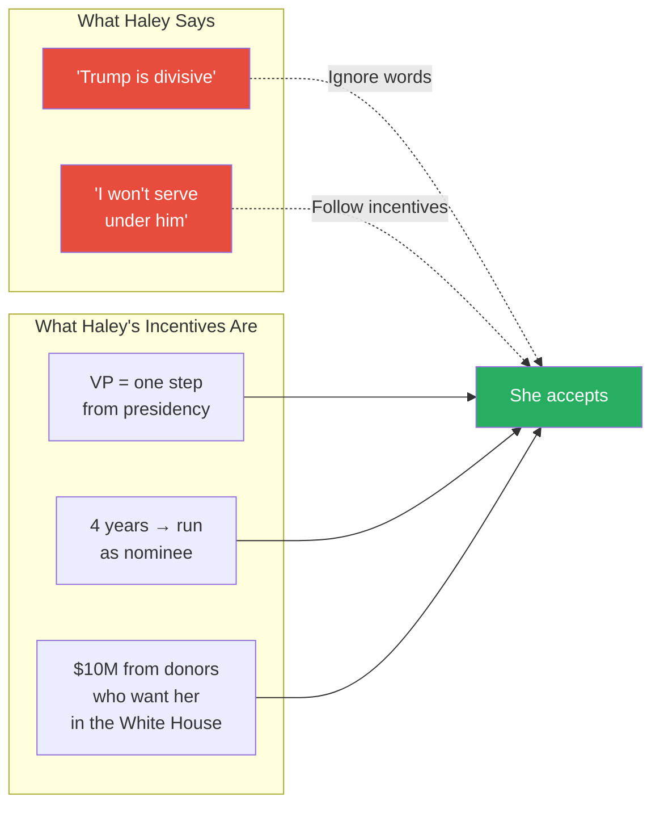

*Prof. Jiang's framework for reading political behaviour: ignore the words, follow the incentive structure. Politicians' stated principles are theatre; their incentives are the script.*

### What This Teaches Students

The analytical method section is not a footnote — it is the pedagogical purpose of the entire lecture. Prof. Jiang is not training pundits. He is training analysts. The distinction matters:

- **Pundits** start from conclusions and work backward to find supporting evidence
- **Analysts** start from data and work forward to testable predictions
- Pundits are rewarded for confidence; analysts are rewarded for accuracy over time
- Pundits never admit error; analysts treat error as information

The lecture itself models the analytical process in real time. Prof. Jiang begins with data (coalition numbers, suburban voting patterns, financial flows), constructs a framework (the redemption narrative template), generates a prediction (Trump wins with Haley), and explicitly identifies the conditions under which the prediction fails. This is not just a lecture about elections — it is a lecture about how to think.

> [!example] The Analyst vs. The Pundit — A Comparison
> - A television pundit in 2024 says: "I think Trump will win because he has momentum and Biden is old"
> - No mechanism is specified. No falsification condition is offered. If Trump loses, the pundit says "nobody could have predicted this" and moves on
> - Prof. Jiang says: "Trump will win because Biden's coalition is collapsing across five specific demographics, and Trump can replicate the Biden-Harris suburban strategy by picking Nikki Haley"
> - The mechanism is specific. The falsification conditions are clear: if Trump does not pick Haley, if the suburbs do not respond, if Biden's coalition holds in one unexpected group — each failure points to a specific flaw in the model
> - The analyst's prediction may be wrong, but the process produces cumulative insight. The pundit's prediction may be right, but by accident
> **The lesson:** The value of a prediction lies not in whether it comes true, but in whether the model that produced it can be tested, refined, and applied to the next question.

---

## What This Means for the Series

*Five lectures in, the architecture of the argument is now complete. Lectures 1-4 explained WHY war with Iran is coming — the forces, the money, the theology, the economics. This lecture identified the LAST VARIABLE: who will be president when those forces converge.*

### The Complete Chain

Every element is now in place:

- **Lecture 1** established that <b style="color: #2980b9">Iran fights asymmetrically</b> — America's military superiority does not guarantee victory
- **Lecture 2** identified <b style="color: #e74c3c">Force 1: Christian Zionism</b> — 70 million evangelicals who believe war in the Middle East will bring Jesus back
- **Lecture 3** identified <b style="color: #e74c3c">Force 2: Empire economics</b> — the petrodollar, financialisation, and the debt spiral that makes imperial expansion structurally inevitable
- **Lecture 4** identified <b style="color: #e74c3c">Force 3: Saudi Arabia's desperation</b> — three lost proxy wars, a vulnerable economy, and the MBS-Kushner-Trump triangle that purchased American foreign policy
- **Lecture 5** identified <b style="color: #27ae60">the last variable: Trump wins, Haley enters the White House</b> — and her financial backers (anti-Iran lobby, Boeing, Christians United for Israel) ensure she will agitate for war

The question now shifts from "will war happen?" to "how will war be fought?"

Notice the structure of the argument. Each lecture did not simply add a new piece of information — each lecture closed off an escape route:

- After **Lecture 2**, you might say: "Christian Zionism is powerful, but America's economic interests will restrain it"
  - **Lecture 3** closed that escape — economic interests also push toward war (petrodollar, financialisation, debt spiral)
- After **Lecture 3**, you might say: "But without a regional ally demanding action, the forces remain latent"
  - **Lecture 4** closed that escape — Saudi Arabia is desperate (three lost proxy wars, a vulnerable economy, and MBS purchased American foreign policy through Kushner)
- After **Lecture 4**, you might say: "But who cares about forces if the president is not willing to act?"
  - **Lecture 5** closes that final escape — Trump wins, Haley enters the White House, and her entire financial existence was built by anti-Iran donors

Each objection is addressed not by dismissing it but by showing that the next structural layer makes it irrelevant. The cumulative effect is an argument that feels progressively harder to escape — not because Prof. Jiang is being dogmatic, but because each new piece of evidence closes another exit.

This is also why the analytical model framework matters. Prof. Jiang is not claiming inevitability — he is claiming that every plausible counter-argument has been addressed. If someone can identify an escape route he has missed, the model needs revision. The invitation to disprove is genuine.

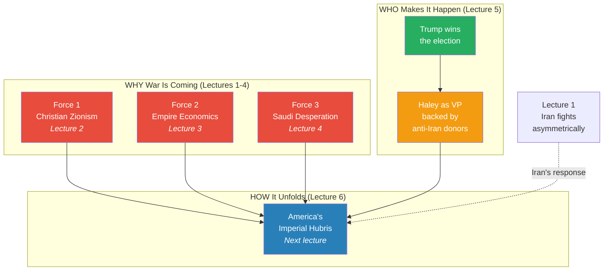

*The series' first five lectures answer three different questions: WHY (forces), WHO (personnel), and — starting next week — HOW (the war itself). This lecture is the bridge between the structural analysis and the operational analysis.*

### What Comes Next

Prof. Jiang closes with an explicit preview: "Next week we discuss the war in Iran." The question is no longer whether war will happen but how America will fight and how Iran will respond.

Lecture 6 — <b style="color: #2980b9">America's Imperial Hubris</b> — will examine the most dangerous pattern in the series' framework: the tendency of empires to believe their own superiority so completely that they refuse to adapt when reality contradicts their assumptions. This is the pattern that destroyed the US in the 2002 Millennium Challenge (Lecture 1), that turned the petrodollar from a strength into a trap (Lecture 3), and that led Saudi Arabia to lose three consecutive proxy wars against opponents it outnumbered and outspent (Lecture 4).

The promise is that hubris — not Iran's strategy — will determine the outcome.

> [!abstract] The Series Architecture — Five Lectures, Three Questions
> | Question | Lectures | What It Establishes |
> |----------|----------|-------------------|
> | **WHY is war coming?** | 1-4 | Three converging forces: Christian Zionism (theological), empire economics (structural), Saudi desperation (geopolitical) |
> | **WHO will start it?** | 5 | Trump wins, Haley enters the White House with anti-Iran financial backers |
> | **HOW will it be fought?** | 6+ | America's imperial hubris vs. Iran's asymmetric strategy |

---

## Connections

**Builds on:**
- [[01 - Iran's Strategy Matrix]] — asymmetrical warfare framework; war with Iran as the series' driving question. This lecture provides the electoral mechanism that makes that war probable by identifying the specific personnel (Haley) who will push for it
- [[02 - Christian Zionism and the Middle East Conflict]] — Christians United for Israel reappears here as one of Haley's three financial backers; the dispensationalist premillennialist belief system is the ideological fuel behind her evangelical support
- [[03 - How Empire is Destroying America]] — the "I'm not Trump" vs. "who sucks more?" dynamic connects to the broader theme of American decline; neither candidate offers a path out of imperial decay
- [[04 - Saudi Arabia's Trump Card Against Iran]] — direct continuation (Lecture 4 concluded with "next class we will figure out if Trump will win"); Haley's anti-Iran financial network mirrors the MBS-Kushner-Trump triangle that purchased American foreign policy
- Previous class on Trump's personality and WWE — the politics-as-theatre framework (Vince McMahon fight analogy) is directly referenced to explain the Haley-Trump public feud

**Sets up:**
- [[06 - America's Imperial Hubris]] — if Trump wins (as predicted here), the question becomes what his hubris will produce. The hubris framework from Lectures 1, 3, and 4 will be applied to the war itself
- The war in Iran (explicitly promised for "next week") — "If Nikki Haley becomes the Vice President, it is very likely she will agitate for war against Iran and Trump will go along. And if that's the case, then we need to understand how America will fight the war and how Iran will respond"

**Related books in vault:**
- [[The 48 Laws of Power - Robert Greene]] — Law 25 (Re-Create Yourself): Trump potentially re-creating himself as a "changed man" through the Haley pick; Law 4 (Always Say Less Than Necessary): Biden's "sit in the basement" strategy worked once but fails when repeated
- [[Made to Stick - Chip Heath & Dan Heath]] — the redemption narrative as a "sticky" story: unexpected (picking your attacker), concrete (specific people, specific feud), emotional (forgiveness, growth) — exactly the formula that makes ideas memorable
- [[The Laws of Human Nature - Robert Greene]] — the pattern of character as destiny: Biden cannot change at 81; people's fundamental nature constrains their strategic options
- [[Influence - Robert Cialdini]] — the principle of contrast: Haley's public attacks make Trump's magnanimity appear more dramatic; the liking principle: Haley is "like us" for suburban voters
- [[The 33 Strategies of War - Robert Greene]] — the strategy of controlled conflict: the Haley-Trump feud as a deliberate strategy of creating tension that can be resolved for maximum narrative impact; the principle that what appears to be a setback can be engineered into an advantage

---

## The Takeaway

This lecture completes the structural argument of the series' first half. Lectures 1-4 assembled three forces pushing the United States toward war with Iran — Christian Zionism, empire economics, and Saudi desperation. But structural forces do not start wars by themselves; they need specific people in specific positions to translate pressure into policy. This lecture identifies those people. If Trump wins the presidency and Haley enters the White House, the three forces gain what they lacked: a representative inside the West Wing whose entire financial existence was built by anti-Iran donors, a weapons manufacturer, and evangelical war advocates. The money trail is not ambiguous — it runs in a straight line from organisations whose stated purpose is confrontation with Iran to the person who would sit one heartbeat from the presidency.

The most surprising insight is not the prediction itself but the mechanism behind it. Prof. Jiang demonstrates that American elections are not decided by policy debates, media coverage, or even the candidates' records. They are decided by the suburbs — a single demographic that swings between parties based on character narratives, not platforms. The redemption narrative (picking a former rival as VP to signal growth and empathy) is a repeatable template that both parties can deploy. Biden used it with Harris in 2020. Trump could use it with Haley in 2024. The content of the narrative matters less than its emotional structure: conflict, surprise, reconciliation, perceived growth. This is what wins two million suburban votes — not infrastructure plans or foreign policy positions, but a story about a candidate who has changed.

This has a darker implication that Prof. Jiang makes explicit through his WWE analogy: if elections are decided by narratives rather than policies, then democracy is not a mechanism for choosing the best leader — it is a mechanism for choosing the best storyteller. The candidate who understands that voters respond to character arcs, not position papers, will always defeat the candidate who believes substance should speak for itself. Biden's "I'm not Trump" is a non-narrative — it tells voters nothing about who Biden is, only who he is not. Trump's potential Haley pick, by contrast, constructs a complete narrative arc: a man who was seen as incapable of growth demonstrates growth in the most dramatic way possible. Whether the growth is real is irrelevant — what matters is whether the story is compelling. And the suburbs, more than any other demographic, vote on the basis of story.

The question that remains open is the one Prof. Jiang deliberately leaves unresolved: what if Trump does not pick Haley? He names JD Vance as the alternative and frames his prediction as explicitly testable — if wrong, go back and find the flaw. This intellectual honesty is the lecture's meta-lesson. The habit of building models, making specific predictions, and revising when reality contradicts them is more valuable than any single prediction. A pundit who is right by accident learns nothing. An analyst who is wrong for identifiable reasons learns everything.

The broader lesson for the series is structural. Five lectures have now established that war with Iran is not a policy choice — it is the product of converging forces (theological, economic, geopolitical) channelled through specific personnel (Trump, Haley, the anti-Iran donor network) into a specific institutional setting (the White House). The remaining lectures will examine what happens when those forces are unleashed — and whether imperial hubris will prove as fatal for America as it has for every empire before it. Next week, the series moves from "who will decide" to "what will happen."
