# America's Imperial Hubris

> Lectures 1-5 answered the question of whether America will go to war with Iran. Three forces are converging — Christian Zionism, empire economics, and Saudi desperation — and Trump's presidency makes conflict almost certain. But one question remains: will the US military actually agree to fight? Prof. Jiang argues that the answer is yes, and the reason traces back to 2003. The Iraq War's spectacular three-week victory — 130,000 American troops destroying an army of 370,000 with fewer than 200 casualties — created a military doctrine called shock and awe that became something far more dangerous: a theory of empire. Born from the trauma of Vietnam, where democracy proved incompatible with imperial warfare, shock and awe promised wars that were quick, cheap, invisible, and free from democratic accountability. But its success in Iraq depended on three unrepeatable conditions: no air defence, desert terrain, and surprise. The American military mistook a one-off anomaly for a universal revolution in warfare, restructured the entire institution around it, and now suffers from three fatal weaknesses — overcommitment, lack of strategic focus, and hubris. The current generation of military leaders has never experienced real war. They inherited an empire and want to enjoy it, not manage it. When Trump pushes for Iran, they will go along.

---

## The Question

*Lectures 1-5 established that war with Iran is coming. This lecture answers the next question in the chain: will the Pentagon agree to fight it?*

Prof. Jiang opens with a direct answer: <b style="color: #27ae60">the military will go along with the war, and the reason is what happened in 2003</b>. The Iraq War's extraordinary success created a doctrine — shock and awe — that psychologically captured the entire institution. The same generals who should know that asymmetric warfare defeats conventional superiority (the lesson of the Millennium Challenge from [[01 - Iran's Strategy Matrix|Lecture 1]]) have been blinded by one anomalous victory in a desert.

The argument has three parts:

- **The Iraq War and shock and awe:** How a theory that professional soldiers called "insane" produced the most lopsided military victory in modern history — and why that victory was a one-off
- **Shock and awe as theory of empire:** How the doctrine born from Vietnam's trauma allowed America to wage war without democratic accountability
- **Three fatal weaknesses:** Overcommitment, lack of strategic focus, and hubris — the structural conditions that guarantee the military will agree to a war it cannot win

This is the sixth lecture in a cumulative argument:

- [[01 - Iran's Strategy Matrix|Lecture 1]] established that Iran fights asymmetrically — conventional superiority does not guarantee victory
- [[02 - Christian Zionism and the Middle East Conflict|Lecture 2]] identified Christian Zionism as Force 1 pushing toward war
- [[03 - How Empire is Destroying America|Lecture 3]] identified empire economics as Force 2 — financialisation, the petrodollar, and the empire trap
- [[04 - Saudi Arabia's Trump Card Against Iran|Lecture 4]] identified Saudi Arabia as Force 3 — three lost proxy wars and the MBS-Kushner-Trump triangle
- [[05 - Why Trump Will Win|Lecture 5]] confirmed Trump will be president when the three forces converge

Now: will the military that must implement this war agree to fight it?

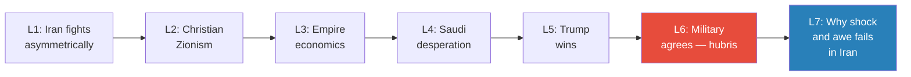

*Lectures 1-5 explained why war is coming. Lecture 6 explains why the military will not resist. Lecture 7 will explain why America loses.*

---

## Key Concepts at a Glance

| Concept | One-line summary |
|---------|-----------------|
| **Three principles of conventional warfare** | Mass forces (3:1 advantage), avoid encirclement, protect supply lines — thousands of years of experience |
| **Shock and awe** | Doctrine claiming air supremacy + technological omniscience + special forces can replace traditional mass-force warfare |
| **Technological omniscience** | Satellite surveillance and electronic eavesdropping give the military "the power of God" — total information dominance |
| **Thunder runs** | Armoured vehicles driving through Baghdad unchallenged — pure intimidation, the clearest symbol of hubris |
| **Three unique conditions** | Iraq had no air defence, was a desert (ideal for air power), and no one had ever fought this way before — none are replicable |
| **Empire-democracy incompatibility** | Post-Vietnam military conclusion: democracy is the enemy of empire — shock and awe was designed to escape democratic oversight |
| **Pentagon Papers** | Secret history of the Vietnam War proving the government lied, the war was unwinnable, and America stayed only to save face |
| **Two theories of empire** | 1991 model (limited goals, coalition, UN authority, restraint) vs. 2003 model (unlimited goals, unilateral, American rules, hubris) |
| **The billionaire father analogy** | The generation that built the empire understood restraint; the generation that inherited it only wants to enjoy it |
| **Three fatal weaknesses** | Overcommitment (everywhere at once), no strategic focus (destroy but never rebuild), hubris (refuse to invest in sustainability) |

---

## The 2003 Iraq War: Shock and Awe's Origin Story

*The last time America fought a major war, a theory that professional soldiers called insane produced the most lopsided victory in modern history. That victory captured the entire military institution — and set America on the path to disaster.*

### The Pentagon vs. Rumsfeld: A Fight Over Troop Numbers

Prof. Jiang takes the class back to the lead-up to the 2003 Iraq invasion — <b style="color: #2980b9">Operation Iraqi Freedom</b>. President George W. Bush, Vice President Dick Cheney, Secretary of Defence Donald Rumsfeld, and his deputy Paul Wolfowitz wanted this war. They went to the Pentagon and said: give us a plan.

The Pentagon generals were experienced, conservative professionals. They applied the <b style="color: #2980b9">three principles of conventional warfare</b> — principles that have governed military strategy for thousands of years:

- **Mass forces:** When you invade a country, you want to overwhelm your enemy
  - The Iraqi army had approximately 370,000 soldiers
  - The standard rule of thumb for invasion is a <b style="color: #27ae60">3:1 force advantage</b> — you need three soldiers for every one of the enemy's
  - The reason: you must simultaneously advance, hold captured territory, resupply your troops, and maintain reserves
  - For Iraq, this meant roughly 1 million US troops
- **Avoid encirclement:** The worst thing that can happen is your forces becoming surrounded by the enemy — it becomes impossible to defend
- **Protect supply lines:** Most of war is actually logistics — getting oil, fuel, weapons, and supplies from point A to point B

The Pentagon went to the drawing board and came back with an answer: to invade Iraq properly, we need about a million soldiers.

What followed was a negotiation that the generals considered absurd.

> [!example] Rumsfeld and Wolfowitz vs. the Pentagon (2002-2003)
> - Pentagon presented standard doctrine: Iraq has 370,000 soldiers, we need roughly 1 million
> - Rumsfeld and Wolfowitz — neither of whom had ever fought a war — rejected the number outright
> - Pentagon tried to compromise: "The absolute minimum is about 900,000"
> - Wolfowitz: "Lower."
> - Back and forth, the number kept dropping
> - Rumsfeld and Wolfowitz landed on their demand: fight this war with 130,000 troops
> - Pentagon's response: "This is insane. We will be outnumbered three to one. How do we mass forces? How do we avoid encirclement? How do we protect supply lines?"
> - Rumsfeld and Wolfowitz: "We have a new theory of war."
> **The lesson:** The civilians who had never fought a war overruled the professionals who had spent their careers studying it — and the civilians turned out to be right. That anomalous vindication captured the institution.

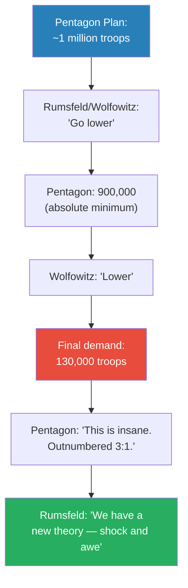

*The Pentagon applied thousands of years of military experience. Rumsfeld and Wolfowitz applied an untested theory. The theory won.*

---

### The Shock and Awe Doctrine

Rumsfeld and Wolfowitz presented their alternative to the horrified generals. The core idea: <b style="color: #2980b9">all militaries are hierarchies</b> — they have a head (command and control), a body, and limbs. If you cut off the head, the entire army collapses. And America could cut off the head because the nature of war had changed.

Three capabilities gave the US military an unprecedented advantage:

- **Air supremacy:** America had the greatest air force in the world — total control of the skies
  - A single <b style="color: #2980b9">cluster bomb</b> could wipe out an entire tank division
  - Each cluster bomb carried approximately 40 GPS-guided submunitions
  - Each submunition could independently find and latch onto a tank, then destroy it
  - One bomb — not particularly expensive — could eliminate an entire armoured formation
- **Technological omniscience:** The ability to know everything — "the power of God"
  - Satellites that could see everything on the ground
  - Technology to eavesdrop on all electronic communications
  - When the enemy talked on the phone, America could hear every word
  - Total information dominance over the battlefield
- **Special forces:** Elite soldiers who could operate deep in enemy territory
  - Small teams that could drive around independently, locating military installations
  - They would then call in precision airstrikes
  - America had the best special forces in the world

The promise was irresistible: <b style="color: #e74c3c">quick, cheap, and decisive</b>. War would be over before anyone could object.

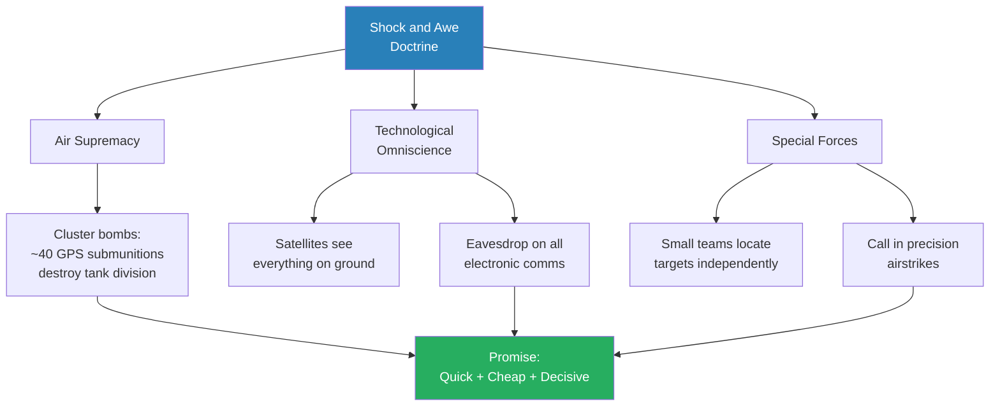

*Shock and awe proposed to replace the three principles of conventional warfare — mass forces, avoid encirclement, protect supply lines — with three technological capabilities that had never been tested at this scale.*

The logic was seductive: target the head, and the body dies. You don't need a million soldiers if you can see everything, hit anything, and have elite operators on the ground directing the destruction. The entire doctrine rested on the idea that <b style="color: #2980b9">information dominance</b> could substitute for numerical superiority.

The Pentagon's objection was simple and blunt: "This is a theory, guys. Mass forces, avoid encirclement, protect supply lines — we've been doing this for thousands of years. That's experience. That's history. That's reality. This is just a fantasy."

Prof. Jiang emphasises the crucial detail: Rumsfeld and Wolfowitz were not professional soldiers. They had never fought a war. They were civilians with a theory, overruling an institution with centuries of accumulated experience. And they insisted. The generals were overruled.

---

### The Three-Week War

The plan that the Pentagon had called insane, unrealistic, and absurd worked 100% as intended.

> [!tip] Core Insight
> The 2003 Iraq War lasted exactly three weeks. 130,000 US troops destroyed an army of 370,000. Fewer than 200 Americans died — most from friendly fire. Tens of thousands of Iraqi soldiers were killed. It was the most lopsided major military victory in modern history.

Three results demonstrated the doctrine's extraordinary effectiveness:

- **Speed:** The entire war lasted three weeks — from invasion to the fall of Baghdad
  - The Iraqi army simply disintegrated under the combination of air power and special forces
  - Command and control was severed almost immediately — the head was cut off and the body collapsed
- **Casualties:** America lost approximately 200 soldiers, most from friendly fire — accidental deaths, not enemy action
  - Iraqi casualties numbered in the tens of thousands
  - The ratio was so extreme that it had no precedent in modern warfare
- **Thunder runs:** The single most dramatic demonstration of dominance

> [!example] Thunder Runs Through Baghdad (2003)
> - American soldiers in armoured vehicles drove into Baghdad — the capital of the country they were invading
> - They simply drove around the city in circles, unchallenged
> - No one could stop them
> - They conducted three of these drives — purely as intimidation
> - Prof. Jiang's analogy: "You're in a fight, and you decide — you know what, I'm so much stronger than this guy, I'm gonna do a backflip. I'm so bored by this guy, I'm gonna do a backflip."
> **The lesson:** Thunder runs were not military operations. They were acts of showing off — demonstrations that American dominance was so total that the enemy's capital city was a playground.

The special forces performed exactly as the doctrine predicted — small teams drove around western Iraq independently, destroying missile bases to prevent Saddam from launching Scud missiles at Israel. They called in airstrikes with devastating precision.

The cluster bombs performed exactly as advertised — single munitions eliminating entire armoured formations.

<b style="color: #e74c3c">The vindication was total</b>. Every element of the theory worked. The Pentagon had called it insane, and the Pentagon had been wrong.

---

### Why Iraq Was a One-Off

Prof. Jiang's critical analytical move is what follows the success story. He argues that <b style="color: #27ae60">what happened in Iraq in 2003 was not a revolution in military doctrine — it was a unique incident that depended on three conditions that cannot be replicated</b>.

The question nobody asked was: what did Saddam Hussein do wrong? Why was shock and awe so effective against him specifically?

**Condition 1: No Air Defence**

> [!example] Saddam's Fatal Miscalculation (1991-2003)
> - In the 1991 Gulf War (Operation Desert Storm), Saddam's army was devastated by American air power
> - America could have invaded Iraq and overthrown him — but chose not to
> - Saddam drew two conclusions from this experience:
>   - "I can never beat America militarily — there's no point in trying"
>   - "America does not want to overthrow me — it would destabilise the country, the region, empower terrorists, and strengthen Iran"
> - Based on these conclusions, he redirected all resources toward suppressing internal dissent
> - He built no air defences whatsoever
> - Even when the 2003 invasion was clearly imminent, he had nothing to counter US air supremacy
> **The lesson:** Saddam's conclusions from 1991 were both rational — and both fatal. He was right that he could never beat America. He was wrong that America would never overthrow him.

**Condition 2: Desert Terrain**

Iraq is a desert. This made it the ideal environment for every element of shock and awe:

- Air power could operate anywhere with total visibility — no mountains, no forests, no jungle canopy to hide under
- Satellites could see everything on the ground — a flat, open landscape where every vehicle, every troop movement, every installation was visible from space
- Special forces could drive around freely — no terrain obstacles, no natural ambush points, no difficult approaches
- Prof. Jiang notes that America's wars for the past twenty years have all been in Middle Eastern deserts — Iraq, Libya, Syria — and shock and awe has had "tremendous success" in every one of them
- From the American military's perspective, this confirmed the doctrine further: we keep winning, so the doctrine must be right
- <b style="color: #e74c3c">But Iran is not a desert — it is mountains</b> — and that changes everything (next lecture)

A student asked Prof. Jiang directly whether shock and awe would work outside desert environments. His answer was unequivocal: next class will show why shock and awe will fail in Iran's mountains. The desert was not incidental to the victory — it was essential.

**Condition 3: Surprise**

No one in human history had ever fought a war like this before. No commander knew what to expect.

> [!example] Saddam's Western Iraq Misdirection (2003)
> - US special forces were operating in western Iraq, destroying missile bases that could threaten Israel
> - So much destruction was inflicted in the west that Saddam became convinced the main American force was there
> - He redeployed his army westward to meet the perceived threat
> - This left Baghdad completely exposed from the east
> - The main US force attacked from the east — into an undefended capital
> **The lesson:** You can only do this once. The next opponent will know exactly how shock and awe works — and will prepare accordingly.

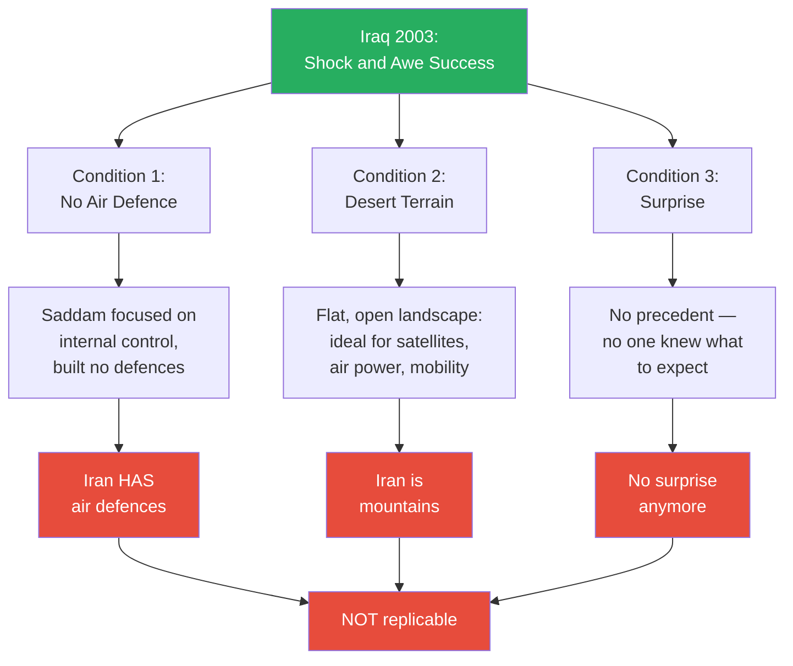

*Three conditions made Iraq uniquely vulnerable to shock and awe. None of them exist in Iran. But the American military — intoxicated by the most lopsided victory in modern history — does not see this.*

> [!tip] Core Insight
> Prof. Jiang's central argument is not that shock and awe failed in Iraq — it succeeded spectacularly. The argument is that the military mistook a one-off anomaly for a universal revolution in warfare, and restructured the entire institution around it. That is the definition of hubris.

A student — Jack — raised an important objection: most people say America lost the Iraq War because of the insurgency that followed the invasion. Doesn't that prove shock and awe failed?

Prof. Jiang's reframing is one of the lecture's sharpest analytical moves:

- Shock and awe was never designed to stabilise countries — <b style="color: #27ae60">it was designed to topple and destroy them</b>
- The question is not "did America bring democracy to Iraq?" — the question is "what was the empire's real intention?"
- Is shock and awe meant to replace regimes, or to destroy countries?
- Look at the results: Iraq is not a functional state. Libya is not a functional state. Syria is in civil war
- If the real goal was to ensure no Middle Eastern power could challenge American supremacy — and to teach others the lesson "don't mess with us" — then shock and awe has succeeded perfectly
- The evidence for this reading: immediately after the invasion, America destroyed all the infrastructure needed for society (water supply, electricity grid), fired everyone who had governed the country (<b style="color: #2980b9">de-Ba'athification</b>), and disbanded the entire Iraqi military
- Prof. Jiang asks: if your goal was to bring democracy, why would you destroy every institution needed for governance?

This reframing matters because it changes what "success" means. If shock and awe is a doctrine of destruction rather than reconstruction, then the military has no reason to doubt it. Every war they have fought has successfully destroyed its target. That is why they will agree to destroy Iran.

---

## Shock and Awe as a Theory of Empire

*Shock and awe did not stay a military doctrine. It became the operating system of the American empire — a way to project power globally without anyone noticing, objecting, or making sacrifices.*

### From Doctrine to Empire Management

Prof. Jiang's pivotal analytical move is to redefine what shock and awe actually is. The discussion so far treated it as a theory of war — air supremacy, technological omniscience, special forces. But its deeper function is something else entirely:

- <b style="color: #27ae60">Shock and awe is a theory of empire, not a theory of war</b>
- America is an empire, but most Americans do not want to admit it — "being an empire means doing bad things to innocent people"
- What shock and awe provides is the ability to maintain the empire without the guilt of maintaining it
- Special forces do the work necessary to sustain global dominance, and the public never knows
- The 2011 overthrow of Gaddafi in Libya was a special forces operation — they directed air power from the background while the public barely registered American involvement
- This is the model: invisible wars fought by invisible soldiers, with invisible casualties, requiring no public sacrifice and no democratic consent

The institutional data confirms the shift. After 2003, the US military restructured itself around this doctrine:

- Special forces before 2001: approximately 30,000 personnel
- Special forces today: 73,000 — out of a total army of 1.3 million
- Official budget: approximately $2 billion in 2001, rising to $13.7 billion today — a sevenfold increase
- But special forces are <b style="color: #2980b9">black ops</b> — they operate outside normal military supervision
- Their actual budget is estimated at 10 to 100 times the official figure, hidden by classification

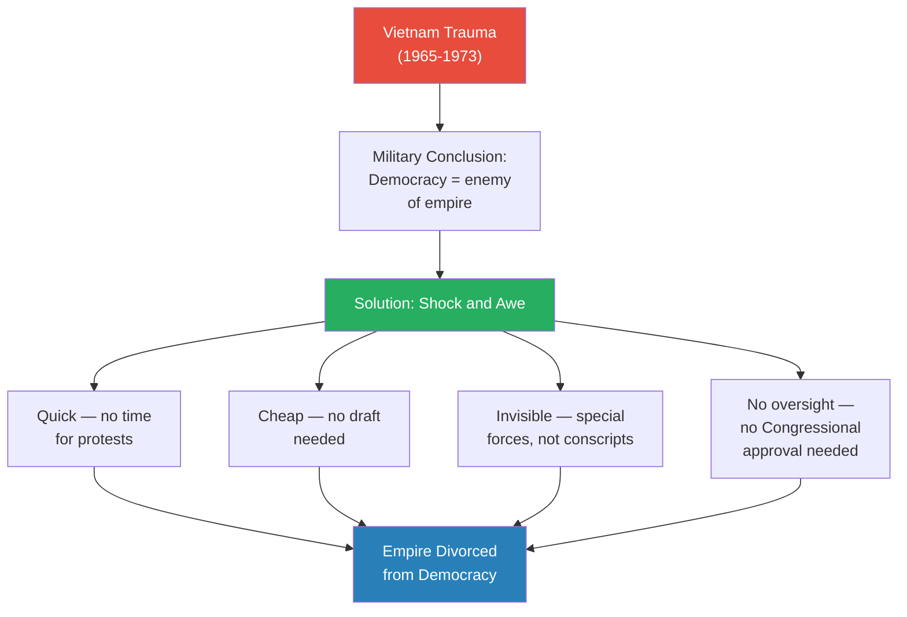

*The entire design of shock and awe is a response to Vietnam. Every feature — speed, cost, invisibility, independence from oversight — was engineered to solve the specific problem of democratic accountability undermining imperial warfare.*

### The Psychology of Special Forces

The shift toward special forces is not just a budget line — it changes the nature of the institution. Prof. Jiang makes a pointed observation: the people who volunteer for special forces are psychologically different from ordinary soldiers.

> [!example] SAS Selection — What It Takes to Join the World's Elite (British Special Air Service)
> - The SAS is one of the two most elite special forces in the world (alongside Delta Force)
> - First test: run six marathons in five days, carrying a backpack of bricks, on a mountain
> - Some candidates go insane during this first test alone — they have to be hospitalised
> - Final test: endure torture — candidates must resist interrogation under genuine physical duress
> - In the French special services, one test requires wearing a bulletproof vest while a comrade shoots at you with a live round — you must hold a clay disc as a target
> - A reporter once asked a special forces soldier why he chose this career
> - His answer: "It's either special forces or I rob banks — one of the two"
> **The lesson:** Special forces personnel are individuals addicted to risk and violence. America now has 73,000 of them operating around the world with minimal oversight — that is the operational reality of the empire.

The institutional implications are significant:

- Traditional militaries are strict hierarchies for good reasons — you need discipline, and you need to prevent the military from overthrowing the government
- But strict hierarchies are slow — they cannot respond to hostage crises, terrorist attacks, or hijackings (a common problem in the 1970s)
- Special forces exist to fill that gap: soldiers outside immediate control who can respond instantly
- The problem arises when special forces become the core of the military rather than a supplement
- <b style="color: #e74c3c">73,000 psychologically atypical individuals operating globally with minimal democratic oversight</b> — this is not a supplement, it is the engine of empire

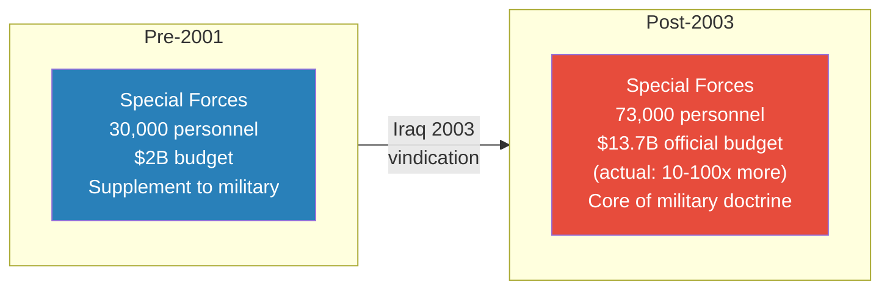

*Shock and awe transformed special forces from a small, specialised supplement into the centrepiece of American military strategy — and the invisible workforce of American empire.*

---

## Two Theories of Empire — Can Democracy and Empire Coexist?

*Before shock and awe, America had a different theory of how to run its empire — one built on restraint, coalition, and international law. Prof. Jiang asks: why did the world's greatest power abandon what was working?*

### The First Theory: The 1991 Gulf War Model

Prof. Jiang takes the class back to 1991. The Soviet Union had just collapsed. America was the sole superpower — militarily unchallengeable. When Saddam Hussein invaded Kuwait, America had to decide: how does a hegemon respond?

The answer was a theory of empire built on three principles:

- **Limited strategic objectives:** The goal was to remove Saddam from Kuwait — nothing more
  - No invasion of Iraq, no regime change, no attempt to reshape the region
  - Compare this to 2003, where the stated goal was to bring democracy to Iraq and the Middle East — essentially unlimited objectives
- **Coalition warfare:** Dozens of countries participated, and America deferred to its partners
  - Saudi Arabia, for instance, insisted there would be no regime change — and America accepted
  - The US played a leading role but did not act unilaterally
- **UN authority:** America made its case to the United Nations and received authorisation
  - The military action was presented as a UN action, not a US action
  - The principle: maintain the <b style="color: #2980b9">rules-based international order</b>

The underlying philosophy was profound: with great power comes great responsibility. America said: we are the greatest power in the world. No one can challenge us. But we will demonstrate <b style="color: #27ae60">humility, discipline, and restraint</b>. We will use military force only as a last resort, only for limited objectives, only with partners, and only under international authority. This will bring prosperity, freedom, and stability to everyone.

> [!tip] Core Insight
> Prof. Jiang frames the 1991 Gulf War as evidence that America had a responsible theory of empire — one that could have sustained American leadership indefinitely. The tragedy is not that America became an empire. It is that America abandoned the only approach that could have made empire sustainable.

### The Second Theory: The 2003 Shock-and-Awe Model

The 2003 model was the mirror opposite:

| Dimension | 1991 Model | 2003 Model |
|-----------|-----------|-----------|
| **Strategic goals** | Limited — remove Saddam from Kuwait only | Unlimited — bring democracy to Iraq and the Middle East |
| **Allies** | Coalition of dozens; deferred to partners | Unilateral — America acts alone |
| **Authority** | UN authorisation; rules-based order | American rules — no UN needed |
| **Core principle** | Humility, discipline, restraint | We make the rules; we have the greatest military |
| **Generation** | WWII and Cold War veterans — knew war's horror | Post-2003 inheritors — war looked like a video game |
| **Outcome** | Sustainable empire | Overextension and decline |

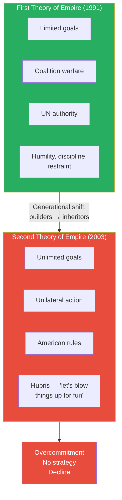

*Two theories, separated by one generation. The builders understood restraint. The inheritors wanted to have fun.*

### The Billionaire Father Analogy

Prof. Jiang's most vivid explanatory device for the generational shift is a parable. He casts Jack (a student) as the son:

> [!example] The Billionaire Father's Dying Wish
> - A billionaire father has $10 billion, built through intelligence, hard work, and bribing politicians
> - He is 95 years old and about to die
> - He has 100 experienced advisors who manage the empire and generate 10% annual returns — $1 billion per year
> - He invites his son to dinner and says: "When I die, you will inherit everything. My advisors will manage the empire and give you $100 million a year. Buy a plane, buy an island, party with movie stars — do whatever you want. My only dying wish: promise me you will listen to my advisors."
> - The son promises
> - The father dies
> - First thing the son does: fires all 100 advisors
> - Second thing: hires all his friends to replace them
> - Third thing: invests in Bitcoin, AI, Chinese real estate — reckless speculation
> - He loses everything
> **The lesson:** This happens all the time. Inherited power always destroys discipline. The people who built the empire understood what it cost. The people who inherited it only know what it feels like.

The analogy maps precisely onto American military leadership:

- The **father** is the WWII and Cold War generation — they fought real wars, saw real horror, and concluded that military force must be a last resort
- The **100 advisors** are the institutions and principles of the rules-based order — limited objectives, coalitions, UN authority
- The **son** is the post-2003 generation — they have never experienced real war
  - Iraq 2003 looked like a video game — you watched explosions on a screen
  - You never saw the images from Vietnam: soldiers crying, soldiers losing limbs
  - Only approximately 200 Americans died — most from friendly fire
- The son's question is not "how do I sustain this?" but <b style="color: #e74c3c">"what is the point of having an empire if you cannot blow things up for no reason?"</b>

Prof. Jiang delivers this line with deliberate bluntness: the second generation abandoned the responsible theory because it was boring. The first theory was wise, sustainable, and dull. The second theory was reckless, exciting, and fun. The son chose fun.

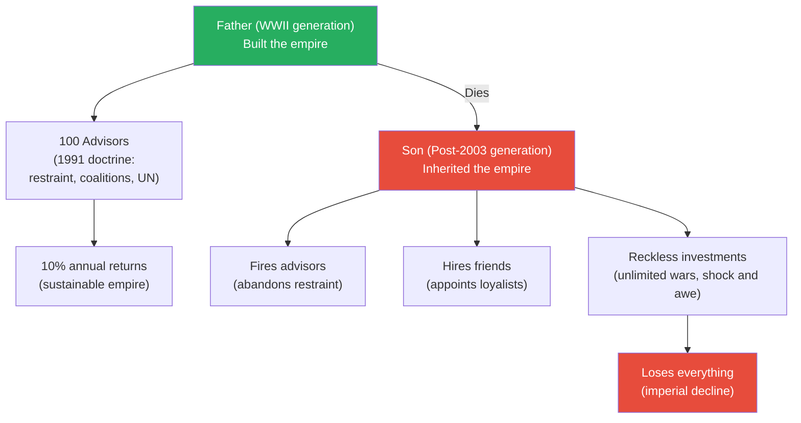

*The responsible 1991 model was the peak of American empire. The reckless 2003 model is the descent.*

---

## Three Fatal Weaknesses of the American Military

*The military that will fight Iran suffers from three structural weaknesses — all products of shock and awe's success. Together, they guarantee the military will agree to a war it cannot win.*

### The Vietnam Origin: Why Shock and Awe Exists

To understand why the American military is structurally broken, Prof. Jiang traces the damage back to its source: the Vietnam War.

> [!example] The Vietnam War — Empire's Worst Nightmare (1965-1973)
> - From 1965 to 1973, America fought a civil war in Vietnam — North Vietnam (communist) against South Vietnam (a US-controlled puppet state)
> - At its height, 3 million US soldiers were deployed; 500,000 were in-country simultaneously in 1969
> - 58,000 Americans died; over 300,000 were wounded — many came home without limbs
> - At least 3 million Vietnamese died; 2 million were civilians
> - America dropped more bombs on Vietnam than in all of World War II combined
> - Approximately 20% of those bombs did not explode — the Vietnamese converted them into landmines that killed more Americans than any other weapon
> - The Vietnamese dug tunnels and could appear, attack, and vanish underground — they were effectively invisible
> - Corrupt South Vietnamese officers sold American weapons directly to the rebels
> - The My Lai Massacre — American soldiers entering a village and killing 300-400 civilians — was just one publicised incident; it "was happening actually quite a lot"
> **The lesson:** Vietnam proved that a technologically inferior enemy using asymmetric tactics can defeat the world's greatest military — the same pattern Prof. Jiang predicts for Iran.

The war was unwinnable, and American leaders knew it was unwinnable. The proof came in 1971.

> [!example] The Pentagon Papers — America's Secret History of Failure (1971)
> - A group of military analysts secretly compiled a classified history of the Vietnam War
> - Daniel Ellsberg, one of the analysts, leaked the document to the Washington Post and New York Times
> - The Pentagon Papers revealed three devastating truths:
>   - Presidents Eisenhower, Kennedy, and Johnson had secretly expanded the war without public or Congressional approval — massive deception
>   - American leaders knew the war was unwinnable — the Vietnamese could not be defeated
>   - The only reason America continued fighting was credibility: "We don't want to be laughed at by the Soviet Union and China"
> - There was no strategic purpose. No strategic objective. Just saving face
> - When the public learned this, the anger was so overwhelming that America had no choice but to withdraw
> **The lesson:** The Pentagon Papers proved that the empire had been lying to democracy — and democracy punished the empire by ending the war. The military learned the wrong lesson: not that the war was wrong, but that democracy was the enemy.

The military's conclusion after Vietnam shaped everything that followed:

- Politicians cared more about winning elections than winning wars
- The public could protest and defy the military
- The media could insult and undermine the military — journalists reporting from the front made the war politically unsustainable
- The draft forced ordinary Americans into a war they did not understand — and they revolted
- <b style="color: #e74c3c">The military felt betrayed by democracy itself</b>

The conclusion was stark: if we are to maintain the empire, we must divorce the empire from democracy. And that is exactly what shock and awe was designed to do.

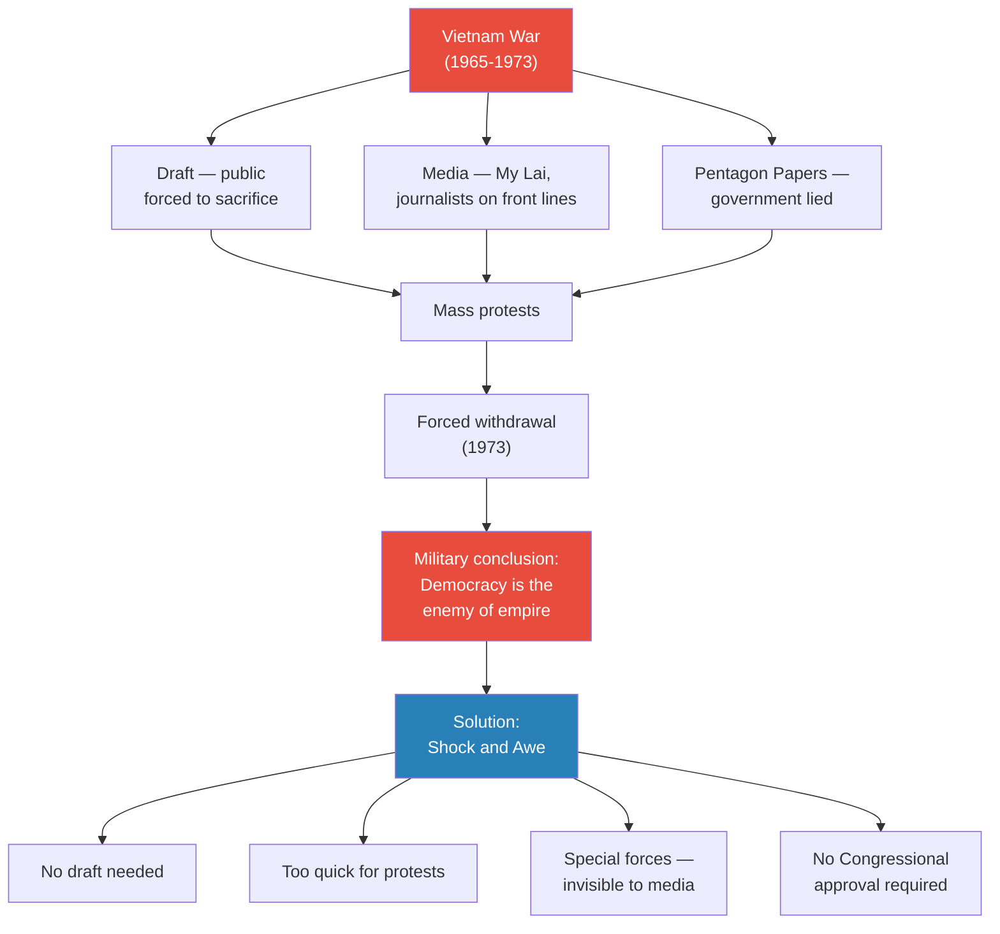

*Vietnam was the trauma. Shock and awe was the response. The military designed a way to fight wars that democracy could not stop.*

---

### Weakness 1: Overcommitment

Shock and awe creates the illusion of omnipotence. If you can be everywhere at once — special forces in 70+ countries, invisible wars from Libya to Syria — then you believe you can fight every war simultaneously.

- America now runs a global empire through 73,000 special forces personnel "running around the world"
- The doctrine says: you don't need mass forces, you don't need coalitions, you just need small teams with air support
- This leads to fighting everywhere with no prioritisation
- <b style="color: #e74c3c">The belief that you can be everywhere at once means you are nowhere in depth</b>

### Weakness 2: Lack of Strategic Focus

The second theory of empire has no plan beyond destruction. Prof. Jiang returns to the evidence:

- Iraq is not a functional state — shock and awe destroyed it and left it destroyed
- Libya is not a functional state — shock and awe toppled Gaddafi with no plan for what comes after
- Syria remains in civil war — American involvement destroyed without rebuilding
- The only strategic question shock and awe answers is: "how do we blow things up?"
- It has no answer to: "what do we do after the blowing up is done?"
- <b style="color: #2980b9">Shock and awe is designed to destroy countries, not to replace regimes</b> — and the military has no doctrine for anything else

### Weakness 3: Hubris

The most dangerous weakness. The military does not believe anyone can challenge American supremacy — and is not investing the resources needed to sustain the empire:

- **US Navy:** 7,600 ships in 1945, down to 475 today — these 475 ships must patrol every shipping lane on the planet
- **US Army:** 2 million soldiers in 1991, down to 1.3 million today
- **Manufacturing:** For every one ship America builds, China can build 300
  - America no longer has the factory capacity it had during World War II
  - If a major war breaks out, America cannot produce weapons fast enough to sustain it
- The current generation of military leaders has never experienced real war
  - They watched Iraq 2003 on screens — it looked like a video game
  - They never saw what Vietnam looked like: soldiers screaming, soldiers without arms, images that were hard for people to watch
  - They inherited an empire and want to enjoy it, not manage it responsibly

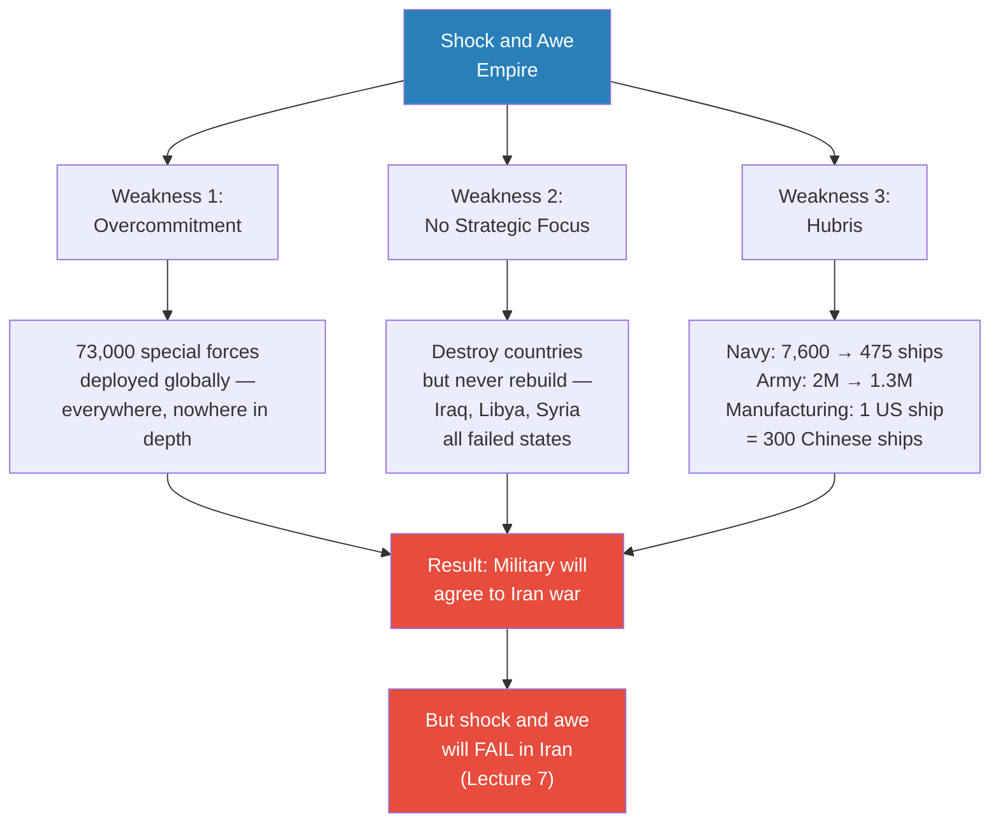

*Three weaknesses, all products of one anomalous victory. The military is overcommitted because it believes it can be everywhere. It has no strategy because it only knows how to destroy. And it is arrogant because the generation in charge has never lost. When Trump pushes for Iran, this military will say yes.*

> [!tip] Core Insight
> The American military will agree to a war it cannot win for the same reason the billionaire's son makes reckless investments: inherited power without experience produces confidence without competence. The generals who should know better have never experienced the consequences of being wrong.

---

## Student Questions That Deepened the Argument

*Prof. Jiang's lectures are shaped by student questions — and the quality of those questions determines how deep the argument goes. Four exchanges in this session pushed the argument into territory the lecture alone might not have reached: the strategic logic behind special forces growth, the terrain limitation that invalidates the doctrine, the reframing of "failure" that makes the doctrine appear invincible, and the generational psychology that makes hubris feel like confidence.*

### Celine: Why Did Special Forces Grow So Fast?

Celine asked a deceptively simple question: are there more special forces because more people want to join, or because America needs them?

Prof. Jiang's answer: both — and the demand side reveals the strategic logic.

- After the Soviet Union collapsed, America no longer had a <b style="color: #2980b9">peer competitor</b> — no other superpower could challenge it militarily
- The new threat model was not great-power war but **rogue regimes** — small nations that defied American authority
- The examples were explicit: Iraq, Iran, North Korea — Bush's <b style="color: #2980b9">axis of evil</b>
- These regimes needed to be toppled quickly and invisibly — the public would not support a major war against a country most Americans could not find on a map
- The doctrine shifted to **shadow wars** — regime changes executed by special forces directing air power, with the public barely aware
- This created institutional demand: more shadow wars required more special forces, and the budget followed
- The growth was not institutional drift — it was a deliberate doctrinal choice linked to the post-Cold War unipolar moment
- The supply side followed: as special forces became the military's prestige branch, more high-calibre recruits were attracted to the adrenaline, the autonomy, and the elite status
- The result is a self-reinforcing cycle: more shadow wars create demand for more special forces, more special forces enable more shadow wars

> [!tip] Core Insight
> Celine's question reveals something Prof. Jiang had only implied: shock and awe is not merely a way to fight wars. It is the operational architecture of an invisible empire — one designed so that American citizens never have to confront the reality of what their country does around the world.

---

### A Student's Desert Question: Will Shock and Awe Work Elsewhere?

A student asked the obvious follow-up: if shock and awe only worked in Iraq because of desert terrain, what happens in other environments?

Prof. Jiang's response was direct:

- For the past twenty years, America has mainly fought wars in the Middle East — and the entire Middle East is desert
- Shock and awe has had "tremendous success" in three desert wars: Iraq, Libya, and Syria
- From the American military's perspective, this is a string of victories that further confirms the doctrine
- <b style="color: #e74c3c">The problem: Iran is not a desert — it is mountains</b>
- Next lecture (Lecture 7) will show in detail why shock and awe cannot work in Iranian terrain
- Satellites cannot see through mountain cover; air power loses its precision advantage; special forces cannot drive freely through mountain passes
- The military's twenty years of desert success has blinded it to the terrain variable — it has only ever fought in the one environment where the doctrine works

This exchange sets up the central argument of Lecture 7: the American military has optimised for a single environmental condition (desert) and has no doctrine for anything else. The doctrine's three pillars — air supremacy, technological omniscience, and special forces mobility — all assume flat, open terrain where everything is visible from above and vehicles can move freely. Mountains invert every assumption: air power is degraded by terrain masking, satellites cannot see into valleys and caves, and special forces on foot in mountain passes are vulnerable rather than dominant. Prof. Jiang will argue that Iran's geography alone renders the entire doctrine obsolete — but the military cannot see this because it has never tested shock and awe outside a desert.

---

### Jack: Didn't America Lose Iraq Because of the Insurgency?

Jack raised the strongest possible objection to Prof. Jiang's argument: most people would say that America lost the Iraq War — and the Afghanistan War — because of the insurgency that followed the conventional victory. If shock and awe produces countries that immediately collapse into chaos, doesn't that prove the doctrine failed? This is the standard critique, and Prof. Jiang does not dismiss it — he inverts it.

His reframing is one of the lecture's sharpest analytical moves:

- The objection assumes shock and awe was designed to stabilise countries and build democracy — <b style="color: #27ae60">but shock and awe was never designed to do that</b>
- Shock and awe was designed to topple and destroy countries — and on those terms, it has succeeded perfectly
- The real question is: what is the empire's actual intention? Is it to replace regimes, or to destroy countries?
- Look at the results:
  - Iraq is not a functional state
  - Libya is not a functional state
  - Syria remains in civil war
- If the real goal was to ensure no Middle Eastern power could arise to challenge American supremacy — and to teach a lesson ("don't mess with us, or we will destroy your country") — then the doctrine has been flawless
- The evidence for this reading is what happened immediately after the 2003 invasion:
  - Too few troops to maintain order — the country collapsed into looting
  - The air campaign destroyed all civilian infrastructure: water supply, electricity grid
  - <b style="color: #2980b9">De-Ba'athification</b> fired everyone who had governed the country
  - The Iraqi military was disbanded entirely
- Prof. Jiang asks: if your goal was to bring democracy, why would you destroy every institution needed for governance?

> [!abstract] Reframing: What "Success" Means for Shock and Awe
> | Stated Goal | Evidence | Verdict |
> |-------------|----------|---------|
> | Bring democracy to Iraq | Infrastructure destroyed, government disbanded, no peacekeeping force | Failed — if this was the goal |
> | Destroy Iraq as a regional power | Country reduced to failed state, no military, no governance | Succeeded — perfectly |
> | Teach a lesson to other regimes | Libya and Syria subsequently destroyed on the same model | Succeeded — the lesson was learned |

This reframing matters enormously for the Iran argument. If the military defines success as destruction rather than reconstruction, then it has no reason to doubt its doctrine. Every war it has fought has successfully destroyed its target. And because there is no institutional memory of failure — only a series of successful destructions — the military has no framework for imagining that the next destruction might go differently. Iraq was destroyed. Libya was destroyed. Syria was destroyed. Iran will be destroyed. That is the logic. The possibility that Iran might destroy back — that an asymmetric opponent in mountainous terrain with air defences and twenty years of preparation might actually defeat the doctrine — does not register because the institution has never experienced it.

---

### Celine: What's the Difference Between the Two Generations?

Celine asked the question that unlocked the lecture's emotional core: who are the people who believed in the responsible 1991 theory, and who are the people who believe in the reckless 2003 version? What separates them?

Prof. Jiang's answer turns on psychology, not strategy. The divide is not ideological — it is experiential:

- The **first generation** (1991 theory) fought in World War II and the Cold War
  - They had personally experienced what war looks like — "really bloody and terrible"
  - They had seen friends die, seen cities destroyed, seen the cost of miscalculation
  - Their conclusion: we must do our best to avoid war — military force is the last resort
- The **second generation** (2003 theory) has never experienced real war
  - Iraq 2003 "looked like a video game" — you watched explosions on a screen
  - You never saw what Vietnam looked like: soldiers losing their arms, soldiers crying, images that were hard for people to watch
  - Only approximately 200 American soldiers died, and most from friendly fire — war seemed costless and consequence-free
  - This generation "inherited a lot of money and wants to enjoy it"
  - Their understanding of war is mediated entirely by technology — drones, screens, satellite feeds — never by direct human suffering
- <b style="color: #e74c3c">America is headed towards disaster because the people in charge have no experience — they don't know what war is, they don't know the horrors of war</b>
- The gap between perceived competence and actual competence is the gap between watching a video game and being in a firefight — it is not a difference of degree but a difference of kind

This connects directly to the billionaire father analogy: the father who built the fortune through intelligence, hard work, and some corruption understands what it cost. The son who inherits it knows only what it feels like. The son fires the advisors, hires his friends, and makes reckless bets — because he has never experienced losing.

Prof. Jiang's final words on this exchange carry a warning: "America is headed towards disaster, because the people in charge have no experience. They don't know what war is, and they don't know what the horrors of war is." This is not a moral judgment. It is a structural observation. Caution is not a personality trait — it is the product of experience. When an institution is led by people who have never experienced the consequences of being wrong, confidence becomes indistinguishable from competence. And the institution cannot tell the difference until it is too late.

The generational divide is not about intelligence or values. It is about experience. People who have suffered learn caution. People who have only known victory learn arrogance. And arrogance is what will send America into Iran.

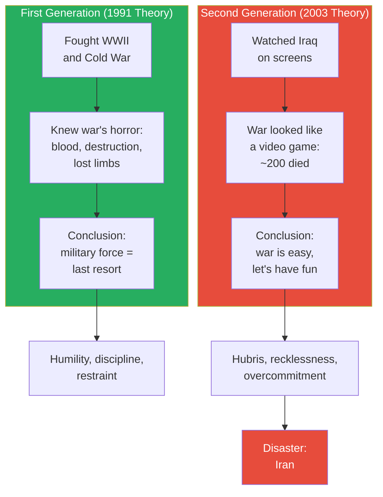

*Two generations, two psychologies. The first knew what war cost. The second knows only what victory feels like. The second generation is now in charge.*

---

## Why the Military Will Say Yes to Iran

*Every thread in this lecture converges on a single prediction: despite knowing better — despite the Millennium Challenge, despite Vietnam, despite twenty years of failed state-building — the US military will agree to fight a war with Iran. Prof. Jiang's question is not whether this will happen, but why. The answer synthesises every argument in the lecture: institutional capture, civilian override, generational psychology, and the three fatal weaknesses.*

### The Convergence: Hubris Meets Political Pressure

Prof. Jiang's argument is structural, not personal. No individual general is stupid. No one in the Pentagon is unaware of the Millennium Challenge result from 2002, or of the difficulties in Iraq and Afghanistan, or of Iran's mountainous terrain. The problem is not a lack of information — it is an institutional psychology that makes it impossible to act on that information. The break traces a clear causal chain:

- **Iraq 2003's anomalous success** vindicated a theory that the military's own professionals called insane
  - The theory worked — three weeks, fewer than 200 casualties, total victory
  - The professionals who objected were proven wrong
  - The civilians (Rumsfeld, Wolfowitz) who overruled them were proven right
  - This inverted the normal power dynamic: military expertise lost credibility, and political ambition gained it
- **The Rumsfeld effect:** Civilian leadership now believes it knows better than the generals
  - Trump, like Bush, is a president who wants war and will push the military to provide it
  - The precedent is clear: when Rumsfeld and Wolfowitz demanded 130,000 troops against the Pentagon's recommendation of a million, they were right
  - Any general who objects to Iran can be dismissed with: "You guys said Iraq was insane too — and you were wrong"
  - <b style="color: #e74c3c">The military's ability to resist political pressure was destroyed by its own anomalous success</b>
- **Shock and awe's institutional capture:** The military has restructured itself around the doctrine
  - 73,000 special forces, budgets in the tens of billions (possibly hundreds of billions including black ops)
  - The entire promotion structure, training pipeline, and strategic planning apparatus assumes shock and awe works
  - To question the doctrine is to question everything the institution has invested in for twenty years
  - The military cannot admit shock and awe might fail without admitting that its entire post-2003 transformation was a mistake
- **The generational psychology:** The generals in charge have never experienced failure
  - They watched Iraq on screens — it looked like a video game
  - They have never seen the images from Vietnam — the soldiers without arms, the villages burned, the body bags arriving at airports
  - They inherited an empire and want to enjoy it — not manage it with the caution of people who know what losing looks like
  - This is the billionaire's son at the institutional level: confident without competence, decisive without experience, bold without wisdom

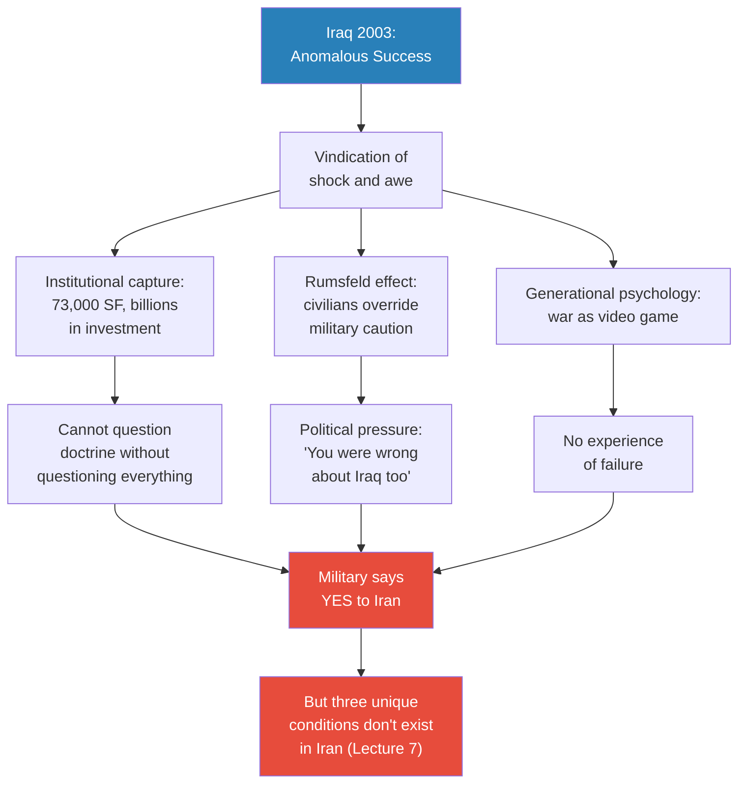

*Iraq's success captured the institution. Civilian override captured the chain of command. Generational inexperience captured the psychology. All three converge on the same outcome: the military will agree to fight Iran — not because it wants war, but because it cannot question a doctrine that defines its identity.*

### The Three Weaknesses Will Not Stop Them

Prof. Jiang has already established the three fatal weaknesses — overcommitment, lack of strategic focus, and hubris. The cruel irony is that <b style="color: #e74c3c">these same weaknesses are what prevent the military from recognising the danger</b>. Each weakness feeds the delusion that the next war will go as smoothly as the last:

- **Overcommitment** means the military already believes it can fight everywhere at once — adding Iran to the list feels like a manageable expansion, not a catastrophic overreach
  - Special forces are already deployed in 70+ countries
  - The doctrine's entire premise is that you do not need mass forces — just small teams with air support
  - From inside the institution, Iran looks like another entry on the same list, not a fundamentally different challenge
- **Lack of strategic focus** means the military does not ask "what happens after we destroy Iran?" — because it never asks that question about any war
  - Iraq was destroyed and left as a failed state — no one was fired for that
  - Libya was destroyed and left in civil war — no one was fired for that
  - The institutional incentive is to destroy, not to plan for what comes after
- **Hubris** means the military does not believe Iran can mount a serious defence — because it does not believe anyone can challenge American supremacy
  - The Millennium Challenge showed what would happen — and the result was banned
  - Yemen showed what happens when shock and awe meets asymmetric mountain fighters — and the lesson was not internalised
  - The military has a twenty-year track record of ignoring evidence that contradicts its doctrine

> [!abstract] Why the Military Will Agree — Despite Knowing the Three Fatal Weaknesses
> | Fatal Weakness | What the Military Should Conclude | What the Military Actually Concludes |
> |---------------|-----------------------------------|-------------------------------------|
> | Overcommitment | We cannot add another war | We can be everywhere at once — shock and awe makes it possible |
> | No strategic focus | We have no plan for post-war Iran | We don't need one — shock and awe is about destruction, not rebuilding |
> | Hubris | Iran has air defences, mountains, and knows our playbook | No one can challenge us — Iraq proved it |

### Preview: What Comes Next

Prof. Jiang closes with a promise and a guarantee: next class will examine what the Iran war actually looks like. He is unequivocal — "I guarantee you that shock and awe is not going to work in Iran." The key points he previews:

- **Iran is not a desert — it is mountains**
  - Shock and awe's three pillars (air power, satellite surveillance, special forces mobility) all depend on open terrain
  - Mountain terrain provides natural concealment, restricts vehicle movement, and degrades satellite coverage
  - This is not a minor tactical difference — it invalidates the doctrine's fundamental assumptions
- **Iran has air defences** — unlike Saddam, who had none
  - Iran has invested heavily in anti-aircraft capabilities precisely because it watched what happened to Iraq
  - The assumption of uncontested air supremacy — the first pillar of shock and awe — cannot be taken for granted
- **There is no element of surprise** — Iran has spent twenty years studying exactly how shock and awe works
  - Every country in the world watched the 2003 Iraq War unfold on television
  - Iran has had two decades to develop specific countermeasures to every element of the doctrine
- <b style="color: #27ae60">Shock and awe will not work in Iran</b> — but the military will discover this only after the war has begun

Lectures 7 and 8 will show the collision between an institution that cannot question its doctrine and an opponent that has specifically prepared to defeat it. The American military will walk into the same trap that Prof. Jiang has been describing since Lecture 1: a superior force that controls the battlefield but not the terms of engagement, facing an inferior force that controls the terms of engagement but not the battlefield.

This is the central pattern of the entire Geo-Strategy series: conventional superiority does not guarantee victory. The Millennium Challenge predicted this outcome in 2002 — the "Iran" team used asymmetric tactics (drone swarms, suicide boats) and defeated the US force. The military banned those tactics and re-ran the simulation until America won. That response — banning reality rather than adapting to it — is the purest expression of hubris. It is also the clearest evidence that the institution has been captured by its own doctrine: when the simulation produced the wrong answer, they changed the simulation, not the doctrine. Now the real war approaches, and reality cannot be banned.

Prof. Jiang's series arc is now positioned for its climax. Six lectures of structural analysis have explained why war is coming and why the military will cooperate. The remaining question — what happens when the war begins — is the subject of Lectures 7 and 8. The collision between American hubris and Iranian preparation will test whether Prof. Jiang's analytical framework holds.

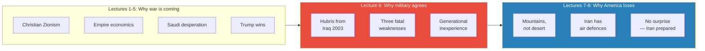

*The series arc is now complete through its middle section. Lectures 1-5 explained why war is coming. Lecture 6 explains why the military will not resist. Lectures 7-8 will explain what happens when an overcommitted, strategically unfocused, hubristic military meets an opponent that has been preparing for this exact war for twenty years.*

---

## Connections

**Builds on:**
- [[01 - Iran's Strategy Matrix]] — the Millennium Challenge (2002) predicted that asymmetric tactics would defeat shock and awe; this lecture explains why the military ignored that prediction (hubris from Iraq 2003). Vietnamese tunnel warfare is the historical precedent for Iran's asymmetric strategy
- [[02 - Christian Zionism and the Middle East Conflict]] — Christian Zionism as Force 1 pushing toward war; this lecture explains why the military will not serve as a check on that political pressure
- [[03 - How Empire is Destroying America]] — manufacturing decline (financialisation destroyed factory capacity) has a military consequence: for every 1 ship America builds, China builds 300. The speculative mindset from Lecture 3 has a military parallel: shock and awe is the military equivalent of high-risk speculation
- [[04 - Saudi Arabia's Trump Card Against Iran]] — the shock and awe failure pattern confirmed in Yemen (Saudis lost despite overwhelming conventional superiority); Trump choosing "Option 3" (the Soleimani assassination) reflects the same hubris Prof. Jiang describes at the institutional level here
- [[05 - Why Trump Will Win]] — Trump's presidency makes war inevitable; this lecture answers the follow-up: will the military cooperate? The answer is yes

**Sets up:**
- [[07 - Who Killed Iranian President Ebrahim Raisi]] / [[08 - The Iran Trap]] — Prof. Jiang explicitly promises Lectures 7-8 will show the actual Iran war scenario: why shock and awe fails in mountains (not desert), against an enemy with air defences (unlike Saddam), who has had twenty years to study the doctrine (no surprise). The three unique conditions that made Iraq vulnerable (no air defence, desert terrain, surprise) are each inverted in Iran — this is the collision the entire series has been building toward
- Later lectures — whether shock and awe was truly designed to destroy countries rather than rebuild them (Prof. Jiang says "we will discuss later"); how the pattern of state destruction (Iraq, Libya, Syria) shapes what will happen after an Iran war

**Related books in vault:**
- [[The 33 Strategies of War - Robert Greene]] — the danger of fighting the last war, the psychology of overextension
- [[Sapiens - Yuval Noah Harari]] — imperial justification myths and the agricultural revolution parallel (Lecture 1's foundation)
- [[Antifragile - Nassim Nicholas Taleb]] — shock and awe makes the empire fragile: optimised for one scenario (desert), catastrophically vulnerable to anything else; the 1991 model was more antifragile (limited goals, institutional restraint, feedback loops)

**Recurring themes expanded in this lecture:**

- **Imperial hubris** — now the definitive treatment: not just arrogance but a structural condition produced by one anomalous victory that captured an entire institution. The billionaire father analogy makes it psychological as well as strategic. This is the mechanism behind the hubris that Lecture 1 identified as a concept and Lecture 3 expanded into a two-mechanism model (imposed reality + preference for arrogance). Lecture 6 adds the third mechanism: generational inexperience
- **Empire-democracy tension** — new theme introduced in this lecture: the military concluded after Vietnam that democracy is the enemy of empire; shock and awe was specifically designed to escape democratic oversight. The Pentagon Papers crystallised this conviction — the leak itself was seen as proof that democratic institutions undermine imperial power
- **Asymmetrical warfare** — Vietnamese tunnel warfare as the historical precedent for Iran's mountain strategy; the self-supplying weapons cycle (enemy arms you through abandoned ammunition, unexploded bombs, and corrupt allies) is a pattern that may recur. The series' central claim — that asymmetric tactics defeat conventional superiority — is reinforced by Vietnam's evidence alongside the Millennium Challenge (Lecture 1) and Yemen (Lecture 4)
- **Empire cycles** — the two theories of empire represent the generational cycle: builders vs. inheritors; the responsible 1991 model was the peak, the reckless 2003 model is the descent. This mirrors the Pax Romana / Pax Americana parallel from Lecture 2: empires follow predictable arcs of discipline, success, complacency, and collapse
- **Overcommitment and decline** — new data points: Navy from 7,600 ships to 475; army from 2 million to 1.3 million; manufacturing ratio of 1:300 against China. The empire is shrinking its capabilities while expanding its ambitions — the classic overextension pattern

---

## The Takeaway

This lecture completes the middle section of Prof. Jiang's cumulative argument. Lectures 1-5 answered the question of whether America will go to war with Iran — the answer is yes, driven by three converging forces (Christian Zionism, empire economics, Saudi desperation) and enabled by Trump's presidency. Lecture 6 answers the next question: will the military that must implement this war agree to fight it? The answer is again yes, and the reason is not stupidity or warmongering but something more insidious — institutional capture by one anomalous victory. The Iraq War's spectacular three-week success vindicated a theory that the military's own professionals had called insane. That vindication destroyed the institution's ability to question the doctrine, to resist civilian override, or to learn from subsequent failures. The generals who should know better have never experienced the consequences of being wrong.

The most counterintuitive insight is Prof. Jiang's reframing of shock and awe's "failures." The standard argument is that America lost in Iraq and Afghanistan because the insurgency proved shock and awe inadequate. Prof. Jiang inverts this: shock and awe was never designed to stabilise or rebuild. It was designed to destroy — and it has destroyed perfectly. Iraq, Libya, and Syria are all failed states, which is exactly what the doctrine produces. If the empire's goal is to prevent any regional power from challenging American supremacy, then shock and awe has a perfect record. The military has no reason to doubt it. That is the trap: a doctrine that succeeds at destruction will always recommend more destruction, even when destruction is not the answer. And the people making the recommendation have never experienced the consequences of being wrong — they inherited an empire, watched war on screens, and concluded that war is easy. The billionaire's son is about to make his reckless investment.

The deeper structural point connects back to Lecture 3's empire trap: America cannot stop fighting wars because the empire requires them, but it cannot fight them wisely because the institution that fights them has been captured by a doctrine born from one anomalous success in a desert. The military is not making a free choice to go to war with Iran. It is following the logic of an institution that has invested twenty years and hundreds of billions of dollars into a theory that only works under conditions that will not exist in Iran. To question the theory is to question everything. And institutions do not question everything — they march forward until reality stops them.

The question that remains open is what Lectures 7-8 will address: what happens when this overcommitted, strategically unfocused, hubristic military meets Iran — an opponent in mountains rather than desert, with air defences rather than none, who has spent twenty years preparing for exactly this war? The Millennium Challenge of 2002 simulated this collision and the US military lost. It then banned the tactics that defeated it and re-ran the simulation. That response — rewriting reality rather than adapting to it — is the single most revealing data point in the entire series. It tells you everything about what will happen when the simulation becomes real. Prof. Jiang has spent six lectures building to this collision. The next two will describe the collision itself.
