# Who Killed Iranian President Ebrahim Raisi

> Lectures 1-6 answered the question of whether America will go to war with Iran, and whether the military will agree to fight. But the Iran side of the equation was missing: does Iran actually want this war? On May 19, 2024, Iranian President Ebrahim Raisi died in a helicopter crash along with eight others. The official story is bad weather and an ageing helicopter. Prof. Jiang accepts this as the most probable explanation — but then applies game theory to ask the dangerous question: who benefits? The answer leads deep into Iranian internal politics, where the Islamic Revolutionary Guard Corps (IRGC) — a parallel military founded in 1979 as the Ayatollah's private army — has accumulated control over the navy, the missile programme, foreign policy, and up to half the national economy. Raisi was widely expected to become the next Supreme Leader, and any new Supreme Leader would need to reduce IRGC power to build his own authority. With Raisi gone, the path clears for Mojtaba Khamenei — the current leader's deeply unpopular son, who would owe his position entirely to the IRGC and could never challenge them. If the IRGC engineered this, the political class is finished and the military class takes over — accelerating Iran toward the confrontation with America that the series has been building toward since Lecture 1.

---

## The Question

*On May 19, 2024, the President of Iran died in a helicopter crash. Probably an accident. But game theory demands that we ask: what if it wasn't?*

Prof. Jiang opens with a confession that applies to the entire lecture — and, he suggests, to all analysis of current events: <b style="color: #e74c3c">we are working with almost nothing</b>. He identifies three epistemological problems that confront anyone trying to understand what actually happened:

- **Very limited information** — the Iranian government controls what the public knows
- **Misinformation** — the information that does exist may not be true
- **Official narratives** — a widely accepted story may have no relationship to reality

The challenge is to use <b style="color: #2980b9">game theory analysis</b> — evaluating opportunity and motive for each possible actor — to reason through possibilities when direct evidence is unavailable. This is not a factual investigation. It is an exercise in structured speculation — asking not "what happened?" (which we may never know) but "who benefits?" (which reveals the structural forces shaping Iran's future regardless of the answer).

The lecture fits into the series arc as the missing Iranian piece:

- [[01 - Iran's Strategy Matrix|Lecture 1]] established that Iran fights asymmetrically and can control the terms of engagement
- [[02 - Christian Zionism and the Middle East Conflict|Lecture 2]] identified Christian Zionism as Force 1 pushing the US toward war
- [[03 - How Empire is Destroying America|Lecture 3]] identified empire economics as Force 2 making war structurally inevitable
- [[04 - Saudi Arabia's Trump Card Against Iran|Lecture 4]] identified Saudi desperation as Force 3
- [[05 - Why Trump Will Win|Lecture 5]] confirmed Trump will be president when these forces converge
- [[06 - America's Imperial Hubris|Lecture 6]] explained why the US military will agree to fight due to institutional hubris

All of that was the American side — six lectures building the case that war is coming and the US military will go along with it.

Now Prof. Jiang turns the lens around: <b style="color: #27ae60">is the Iranian military pushing just as hard toward the same war — and did they just eliminate the one man who stood in their way?</b>

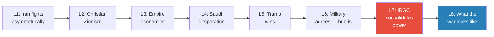

*Lectures 1-6 built the American case for war. Lecture 7 reveals the Iranian side is pushing toward the same collision — from the inside.*

---

## Key Concepts at a Glance

| Concept | One-line summary |
|---------|-----------------|
| **Game theory under information constraints** | Evaluate all possibilities by examining opportunity and motive when direct evidence is unavailable |
| **Three problems of analysis** | Limited information, misinformation, and official narratives — the three obstacles to understanding current events |
| **Islamic Revolutionary Guard Corps (IRGC)** | Parallel military founded in 1979 as the Ayatollah's private army — controls navy, missiles, foreign policy, and 10-50% of the economy |
| **The Basij** | Volunteer militia of poor, religious Iranians who ran across minefields with rifles and keys to heaven during the Iran-Iraq War |
| **The succession dilemma** | Any new Supreme Leader must reduce IRGC power to build his own base — creating inherent conflict between the IRGC and any strong successor |
| **Political class vs. military class** | Iran's internal divide: pragmatists (Raisi, judiciary) counsel restraint; the IRGC demands confrontation and revolution export |
| **The provocation strategy** | Four paths to lure America into invading Iran: nuclear acceleration, proxy escalation, shipping disruption, terror campaigns |
| **The IRGC paradox** | The more people protest against the IRGC, the more the regime depends on the IRGC to crack down — each protest makes them stronger |

---

## The Three Suspects: Game Theory Applied to a Helicopter Crash

*Prof. Jiang presents the facts, then systematically evaluates three possibilities — testing each against the twin criteria of opportunity and motive.*

### The Established Facts

On May 19, 2024, Iranian President Ebrahim Raisi was in Azerbaijan for a dam opening ceremony. He boarded his helicopter to fly back to Iran. During the flight, the helicopter crashed in mountainous Iranian terrain near the Azerbaijan border, killing all nine people on board:

- The President, Ebrahim Raisi
- The Foreign Minister
- Three crew members
- The governor of a province
- A local religious leader
- The President's bodyguard
- The head of the President's security detail

One detail stands out: <b style="color: #e74c3c">three helicopters were flying together — only Raisi's crashed</b>. The other two, likely military escorts, landed safely. The official explanation is simple: bad weather. Fog rolled in over the mountains, the pilot lost visibility, and the helicopter struck a mountainside.

Prof. Jiang accepts these facts as the starting point. But then he frames the investigation around a question the official narrative does not ask: <b style="color: #2980b9">who had the opportunity, and who had the motive?</b>

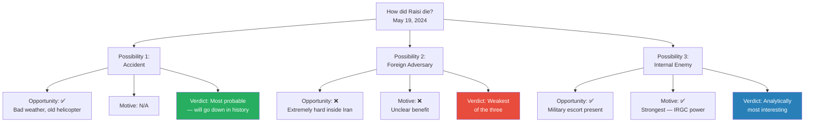

*Prof. Jiang evaluates three possibilities using game theory's opportunity-motive framework. The accident is most probable; the internal enemy theory is most analytically revealing.*

The framework is simple but powerful: for each suspect, ask two questions. Did they have the opportunity to do it? And did they have a reason to want it done? A theory that fails on either criterion is weak. A theory that passes both demands attention.

---

### Possibility 1: It Was an Accident

*The simplest explanation: fog, mountains, and a helicopter that should have been retired decades ago.*

This is the explanation most people accept, and Prof. Jiang agrees it is probably what happened. Two pieces of evidence make it compelling.

**First: helicopter crashes happen more often than people think.** Prof. Jiang draws a parallel that makes the point immediately accessible:

> [!example] The Kobe Bryant Helicopter Crash (January 2020)
> - In January 2020, basketball legend Kobe Bryant boarded a helicopter with his daughter and several others in southern California
> - Fog and low clouds reduced visibility to near zero
> - The pilot became disoriented and crashed into a hillside, killing all nine people on board
> - Bryant was one of the most famous athletes in the world — and he died in exactly the same way Raisi did: fog, mountains, a pilot who could not see
> **The lesson:** Helicopter crashes under poor visibility are not rare, exotic events. They happen to civilians and heads of state alike.

**Second: the helicopter was a relic of a broken relationship.** Iran was flying an American-made helicopter that dated back to the 1970s — the era when the Shah was America's ally and American military equipment flowed freely into Iran. After the 1979 revolution, the United States cut all cooperation:

- No spare parts
- No maintenance support
- No software updates
- No replacement when components wore out

<b style="color: #e74c3c">Iran was flying the president of the country in a machine that had been unsupported for over four decades</b>. The wonder is not that the helicopter crashed — it is that it had not crashed sooner.

Prof. Jiang is explicit: this is probably the cause, and it is probably the explanation that will go down in history. The simplest explanation is usually the right one. But game theory requires examining the alternatives — because the obvious answer is not always the true one, and because even when the obvious answer is correct, the exercise of asking "who benefits?" reveals structural dynamics that matter regardless of the cause of death.

> [!tip] Core Insight
> The point is not to prove the accident theory wrong. The point is that an analyst who stops at the most obvious explanation — without examining who benefits from the outcome — is not doing analysis. Game theory demands that you explore all possibilities, especially the uncomfortable ones.

---

### Possibility 2: A Foreign Adversary Did It

*Israel has assassinated Iranian generals and nuclear scientists. The US killed Soleimani with a drone strike in Baghdad. Could one of them have brought down Raisi's helicopter?*

The suspects here would be the United States, Israel, or possibly Azerbaijan. Prof. Jiang finds this the weakest of the three possibilities, and he evaluates it on both criteria.

**Opportunity: extremely difficult.** Planning an assassination of an Iranian leader inside Iranian territory is enormously hard for a foreign government. Consider what it would require:

- Intelligence on the president's exact flight route and timing
- A method of causing the crash that would look like an accident
- Operatives capable of acting in hostile territory without detection
- An escape plan that leaves no evidence

Could Israel or the US pull this off? Perhaps — both have demonstrated extraordinary intelligence capabilities. But the logistical difficulty is enormous, and the risk of exposure would be catastrophic.

**Motive: unclear.** This is where the theory really falls apart. Prof. Jiang gets specific. Foreign adversaries have killed Iranians before — but always with a clear, targeted motive:

> [!example] Three Precedents of Foreign Assassinations
> - **Soleimani assassination (January 2020):** President Trump ordered the killing of General Qasem Soleimani in Baghdad. The motive was clear — Soleimani ran Iran's entire Middle East foreign policy through the IRGC and was a direct threat to American interests
> - **Israeli assassination of nuclear scientists:** Israel staged targeted killings of Iranian nuclear scientists inside Iran. The motive was clear — stopping Iran from developing nuclear weapons by eliminating the people who could build them
> - **Damascus embassy airstrike (April 1, 2024):** Israel struck the Iranian embassy in Damascus, killing two Iranian generals. The motive was clear — Israel claimed these generals were coordinating with Hamas
> **The lesson:** Every foreign assassination of an Iranian figure had a specific, identifiable strategic objective. Killing the president has no such clear objective — and carries enormous risk.

The pattern is clear: every previous foreign assassination of an Iranian figure targeted someone whose specific function posed a direct threat. The president is not that kind of target:

- He is not running the missile programme
- He is not coordinating proxy warfare across the Middle East
- He is not building nuclear weapons
- He is not personally directing military operations against Israel or the US

<b style="color: #e74c3c">Killing the Iranian president carries all the risk of an act of war with none of the strategic benefit</b>. If discovered, it would unite the entire Iranian population — hardliners and reformists alike — against the perpetrator. It would hand the IRGC exactly the public outrage they need to justify escalation. The risk-reward calculation simply does not work.

Prof. Jiang does not entirely discount this possibility — intelligence agencies sometimes act irrationally, and there may be motives invisible to outside analysts. But he finds it the least supported by the opportunity-motive framework.

---

### Possibility 3: An Internal Enemy Did It

*This is where the lecture shifts from elimination-of-possibilities to the construction of a sustained argument. The internal enemy theory will drive the rest of the lecture.*

**Opportunity: no problem.** Internal enemies have the resources, access, and proximity to kill the president. Prof. Jiang returns to the one detail from the crash that does not fit neatly into the accident narrative:

- Three helicopters were flying in formation through the same weather, over the same terrain
- All three faced the same fog, the same mountains, the same conditions
- Only Raisi's helicopter crashed — the other two landed safely
- The other two helicopters were almost certainly military escorts, present to protect the president
- But the same military escort that protects the president is also the one force with the closest physical access to him — if they wanted to cause an accident, they were in the best position to do so

Prof. Jiang does not claim this proves anything. Two helicopters surviving identical conditions while one crashes is consistent with an accident — different pilots make different decisions in fog. But it is also consistent with something else entirely. And when you combine ambiguous evidence with a clear motive, game theory takes notice.

**Motive: this is where it gets interesting.** To understand who would benefit from Raisi's death, Prof. Jiang takes the class into the heart of Iranian succession politics — a world where the stakes are not just power but the direction of an entire civilization.

<b style="color: #2980b9">Ebrahim Raisi</b>, age 63, was widely regarded as the person most likely to become the next Supreme Leader of Iran when the current Ayatollah, <b style="color: #2980b9">Ali Khamenei</b>, age 85, dies — an event expected within five years. Many saw Raisi as Khamenei's chosen protege. Crucially, Raisi came from the judiciary — a separate power base from the military establishment. He was a political figure, not a military one.

Prof. Jiang explains the Iranian political system to clarify why the succession matters so much:

- Iran is an <b style="color: #2980b9">Islamic Republic</b> — ultimate authority belongs to God and the Quran, represented by the Ayatollah
- The Ayatollah holds supreme power with ultimate veto authority over everything — he is not a figurehead but the actual decision-maker
- The President is more like a CEO — he manages the country day-to-day but does not hold final authority on any question the Ayatollah cares about
- The gap between these two positions is enormous — moving from president to Supreme Leader is not a promotion but a transformation into the most powerful person in the country
- If Raisi became the next Ayatollah, major policy shifts would follow — he would bring his own people, his own priorities, his own power base

The stakes of the succession cannot be overstated. In the Iranian system, the Supreme Leader is not just a political leader — he is the representative of God on earth. He has ultimate veto power over every institution, every policy, every appointment. Whoever becomes the next Ayatollah will reshape Iran for a generation.

With Raisi dead, the second contender for the position is <b style="color: #2980b9">Mojtaba Khamenei</b> — the current Supreme Leader's own son. And this creates a problem:

- The 1979 revolution overthrew a hereditary monarchy — the Shah
- Iranians fought and died to end the principle of a father passing power to his son
- If Mojtaba Khamenei becomes Ayatollah, it would be exactly the hereditary succession the revolution was meant to destroy
- This would create a <b style="color: #e74c3c">political legitimacy crisis</b> for the entire Islamic Republic

The question Prof. Jiang poses to the class is sharp: so who would want this crisis? Who benefits from having an unpopular, dependent leader in the supreme position rather than a strong, independent one? And who had the opportunity to make it happen?

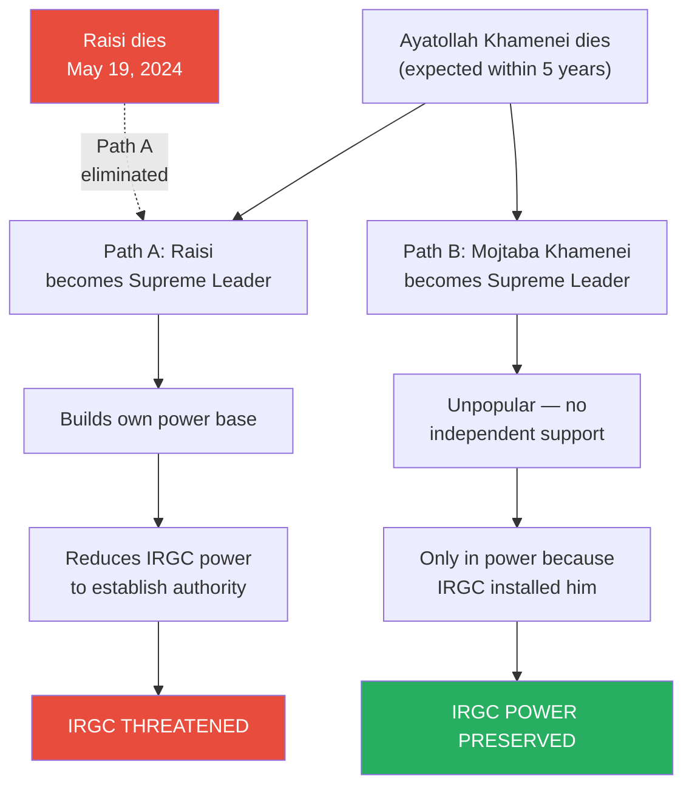

*The succession dilemma is the core of the IRGC's motive. With Raisi alive, the next Supreme Leader would threaten their power. With Raisi dead, the next Supreme Leader would depend on them entirely.*

> [!tip] Core Insight
> The IRGC does not need a loyal successor. They need a weak one. Mojtaba Khamenei's greatest qualification for the supreme leadership, from the IRGC's perspective, is that he cannot hold it without them.

A student asks: why would the IRGC believe they can control Mojtaba? Prof. Jiang explains two reasons:

- **Inherited personal bonds:** When Ayatollah Khamenei succeeded Khomeini in 1989, he deliberately cultivated personal relationships with every IRGC member — reportedly memorising the names of tens of thousands of guardsmen and even their children's names. This extraordinary personal investment created bonds of loyalty that extend naturally to his son
- **Structural dependency:** Mojtaba is extremely unpopular. He has no independent political base, no constituency, no power of his own. If he becomes Supreme Leader, it will only be because the IRGC put him there — and he will know it. <b style="color: #27ae60">A leader who owes everything to you can never turn on you</b>

Even the legitimacy crisis that hereditary succession would trigger works in the IRGC's favour. If Mojtaba's accession sparks public outrage, the regime becomes even more dependent on its most loyal enforcers — the IRGC. Instability is not a problem for them. It is job security.

The answer, Prof. Jiang argues, is the <b style="color: #2980b9">Islamic Revolutionary Guard Corps</b> — and understanding why requires understanding what they are, where they came from, and how they think about the world.

> [!abstract] Theory Evaluation: Who Killed Raisi?
> | Theory | Opportunity | Motive | Verdict |
> |--------|-----------|--------|---------|
> | Accident | ✅ Bad weather, old helicopter, fog in mountains | N/A | Most probable — will go down in history |
> | Foreign adversary (US/Israel) | ❌ Extremely difficult inside Iranian territory | ❌ No clear strategic benefit from killing the president | Weakest — fails both criteria |
> | Internal enemy (IRGC) | ✅ Military escorts present, only one helicopter crashed | ✅ Raisi's succession to Supreme Leader would threaten IRGC power monopoly | Analytically strongest — generates testable predictions |

---

### The Game Theory Verdict

Before diving into the IRGC's history and ideology, Prof. Jiang pauses to frame the argument he has just constructed. He is not claiming the IRGC killed Raisi. He is making a more careful, more useful point:

- The accident is the most probable explanation
- The foreign adversary theory fails on both opportunity and motive
- The internal enemy theory succeeds on opportunity and reveals the strongest structural motive
- <b style="color: #27ae60">If you want to understand what happens next in Iran — and therefore what happens next in the Middle East — the internal enemy theory is the one that generates testable predictions</b>

This is the analytical model-building method Prof. Jiang taught in [[05 - Why Trump Will Win|Lecture 5]]: construct a hypothesis, derive predictions, observe whether reality matches, refine the model. The value of the IRGC theory is not that it is proven — it is that it generates specific, falsifiable predictions about what Iran does next.

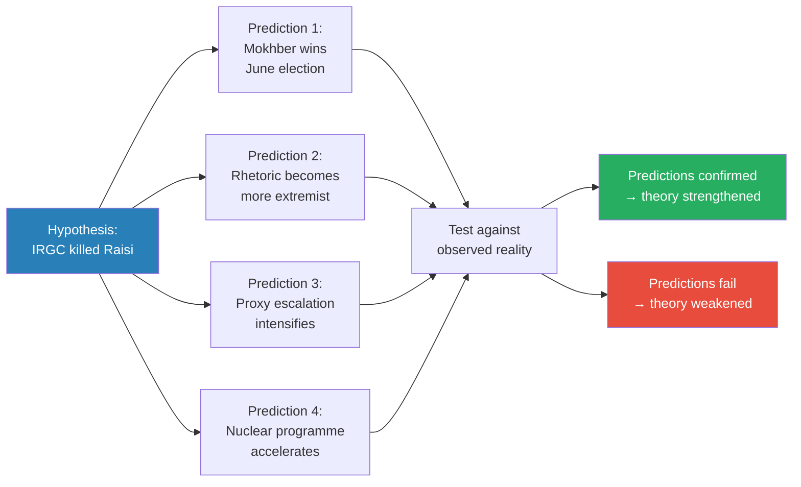

*Prof. Jiang explicitly frames his analysis as hypothesis generation with testable predictions — the same method from Lecture 5. The predictions can be checked against what actually happened after May 2024.*

Prof. Jiang adds a critical caveat that distinguishes careful analysis from conspiracy theory: <b style="color: #e74c3c">even if all four predictions come true, it does not prove the IRGC killed Raisi</b>. Correlation is not causation. The IRGC might consolidate power and escalate provocations regardless of whether they engineered the crash — Raisi's death, even as a genuine accident, still shifts the power balance in their favour.

But if the IRGC did kill Raisi, these are the things we should expect to see. And the rest of the lecture — which forms the heart of the summary — explores who these people are: the Revolutionary Guard Corps, their origins in revolution and war, the fanaticism forged in the US Embassy hostage crisis and the Iran-Iraq War, and the institutional logic that drives them toward confrontation with the United States.

## The IRGC — Iran's Shadow Government

*To understand why the IRGC would kill the president, you must understand what they are — where they came from, what forged them, and how a revolutionary militia became the most powerful institution in the country.*

Prof. Jiang now shifts from game theory speculation to historical exposition. The internal enemy theory only makes sense if you understand the IRGC as an institution — its founding logic, its formative experiences, and the paradox that has made it simultaneously indispensable and destructive to the country it was built to protect.

### Born from Distrust: The 1979 Founding

The IRGC's origin is inseparable from the revolution itself. In 1979, popular protests forced the Shah of Iran into exile. The government brought back <b style="color: #2980b9">Ayatollah Ruhollah Khomeini</b> from exile to lead the new Islamic Republic. But Khomeini faced an immediate problem:

- The existing Iranian military had sworn allegiance to the Shah
- Officers had been trained by the Americans, equipped with American weapons, and organised on American models
- Khomeini could not trust the army to protect a revolution that had just overthrown the institution the army was loyal to
- <b style="color: #e74c3c">The revolution had no army of its own</b>

His solution was to build one. Khomeini established the <b style="color: #2980b9">Islamic Revolutionary Guard Corps (IRGC)</b> as a parallel armed force — completely separate from the regular military, answering only to the Ayatollah himself. This dual-army structure was not an accident or a temporary measure. It was a deliberate architectural decision: the regular army defends the nation, but the IRGC defends the revolution.

The IRGC's founding mandate had two dimensions:

- **Domestic:** Protect the Ayatollah and ensure the Islamic Revolution succeeds inside Iran
- **International:** Export the revolution across the Middle East — bring Islamic governance to Syria, Iraq, and beyond

This second mandate is critical. From day one, the IRGC was not just a defensive force — it was an ideological project with a mission to reshape the entire region. This is why Saudi Arabia, the United States, and the Gulf states immediately saw Iran as an existential threat.

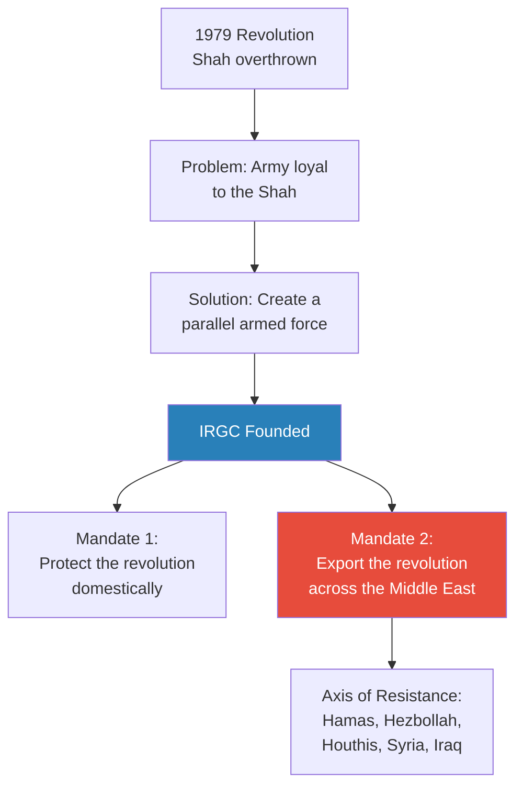

*The IRGC was born from distrust of the existing army and given a dual mandate: protect the revolution at home and spread it abroad. The second mandate is what makes Iran a regional threat.*

---

### The Embassy Hostage Crisis — Where the Leadership Was Forged

*The current IRGC leadership was not educated at military academies. They were educated inside the US Embassy in Tehran — piecing together shredded documents that revealed exactly how America had controlled their country.*

In 1979, the deposed Shah fled to the United States. Iranians were outraged for two reasons:

- They wanted the Shah returned to stand trial for human rights crimes committed during his rule
- They feared the Shah had gone to America to arrange a repeat of 1953 — when the CIA staged a coup, overthrew Iran's democratically elected government, and installed the Shah as a puppet dictator

> [!example] The US Embassy Hostage Crisis (November 1979)
> - In November 1979, between 300 and 500 Iranian college students stormed the US Embassy in Tehran
> - They took 53 American diplomats and staff hostage, demanding the Shah be returned to Iran for trial
> - This was a clear violation of international law — but public support was overwhelming, and Ayatollah Khomeini backed the students
> - When the students entered the embassy, the diplomats attempted to destroy classified documents using industrial shredders — cutting tens of thousands of pages into strips
> - Over the following months, the students slowly and methodically pieced the shredded documents back together, strip by strip
> - What they found radicalised them forever: the real centre of power in Iran had not been the Shah's palace — it was the US Embassy
> - The embassy had directed Iranian domestic policy, enabled the Shah's secret police (SAVAK), and orchestrated the 1953 coup that destroyed Iranian democracy
> **The lesson:** The students who pieced together those documents did not just learn about American interference in the abstract. They read the operational details — the names, the orders, the mechanisms of control. That personal, documentary knowledge is what separates IRGC fanaticism from ordinary anti-American sentiment.

The critical detail Prof. Jiang emphasises is what happened to those students. They did not fade into obscurity. <b style="color: #e74c3c">They became the military leadership of Iran</b>. He names three:

- **Hossein Dehghan** — Minister of Defence, 2013-2017
- **Mohammed Ali Jafari** — Head of the IRGC, 2007-2019
- **Mohammed Bagheri** — Current Chief of Staff of the Iranian Army

These are not politicians who read about America's role in Iran in textbooks. These are men who personally reconstructed, page by page, the evidence of how the United States controlled their country, staged coups against their democracy, and enabled the brutality of the Shah's police state. Their hatred of America is not ideological abstraction — it is personal, documentary, and rooted in direct evidence they assembled with their own hands.

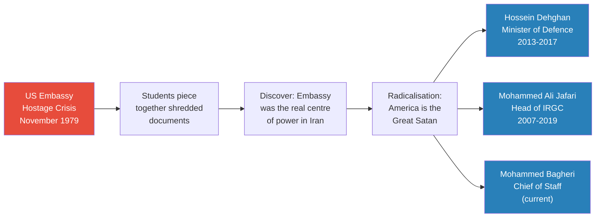

*The students who stormed the embassy became the generals who run the military. The IRGC's anti-American worldview is not inherited ideology — it was formed by direct, personal discovery of American manipulation.*

---

### The Iran-Iraq War and the Basij — Forged in Blood

*When Saddam Hussein invaded in 1980, Iran had no functioning army. What it had instead was something no Western military planner could have predicted: an unlimited supply of teenagers willing to die.*

The IRGC's founding during the revolution was one thing. But it was the <b style="color: #2980b9">Iran-Iraq War (1980-1988)</b> that transformed them from a revolutionary militia into the dominant military institution in the country. Prof. Jiang traces the chain of events.

Because the revolution was so threatening to regional powers — Iran was openly promising to export Islamic revolution across the Middle East — a coalition of unlikely allies encouraged Saddam Hussein to invade Iran in 1980:

- The United States supported Saddam
- The Soviet Union supported Saddam
- Saudi Arabia and the Gulf states supported Saddam
- Iran was diplomatically isolated and militarily crippled

The IRGC had arrested, exiled, or executed the professional military officers who had served under the Shah — they were considered loyal to the old regime and therefore enemies of the revolution. This left Iran in a catastrophic position: invaded by a well-equipped enemy, with no professional military leadership.

> [!example] The Basij — Keys to Heaven (1980-1988)
> - Facing Saddam's tanks, aircraft, and professional army with almost nothing, the IRGC created a new force called the <b style="color: #2980b9">Basij</b> — a volunteer militia
> - The Basij were recruited from the poorest, most religious villages in Iran — young men aged 16 to 18
> - Each volunteer was given two things: a rifle and a key to wear around their neck
> - The key, they were told, was their entry into heaven — dying in this war guaranteed them paradise
> - The Basij were organised into groups and sent running ahead of the main force, across Iraqi minefields, into tank fire, under helicopter assault
> - They had no armour, no air support, no heavy weapons — just rifles and faith
> - They died in enormous numbers — but the Iraqi army expended so much ammunition, fuel, and morale on killing them that it became exhausted
> - Eventually the Iraqis withdrew, and Iran took the fight into Iraq
> **The lesson:** Iran's military power does not rest on technology or equipment. It rests on an effectively unlimited supply of religiously motivated fighters who genuinely believe death in battle is a promotion, not a sacrifice. This is why Iran is not afraid of a ground war.

The Iran-Iraq War lasted eight years and killed hundreds of thousands on both sides. But for the IRGC, the outcome was transformative:

- They had successfully defended the revolution against an invasion backed by both superpowers and the entire Arab world
- They emerged as the undisputed dominant military force in the country
- They received virtually <b style="color: #27ae60">unlimited access to government funds</b> — justified by their role as the revolution's saviours
- Their strategy was validated: fanaticism and willingness to absorb casualties could defeat a conventionally superior enemy

This last point connects directly back to [[01 - Iran's Strategy Matrix|Lecture 1]]. The asymmetric warfare doctrine that Prof. Jiang presented in the first lecture — where a weaker force controls the terms of engagement and defeats a stronger one — is not an abstract theory. It is the lived experience of the IRGC in the Iran-Iraq War. They know it works because they did it.

After the war, the IRGC drew a strategic conclusion that shapes everything they do today: <b style="color: #27ae60">if enemies come to attack Iran, Iranians will die — so take the fight to them first</b>. This is why the IRGC has spent the last three decades funding the <b style="color: #2980b9">Axis of Resistance</b> — Hamas in Gaza, Hezbollah in Lebanon, the Houthis in Yemen, the Assad regime in Syria, and Shia militias in Iraq. Every dollar sent to these proxies is, in the IRGC's worldview, a dollar spent keeping the next war on someone else's soil.

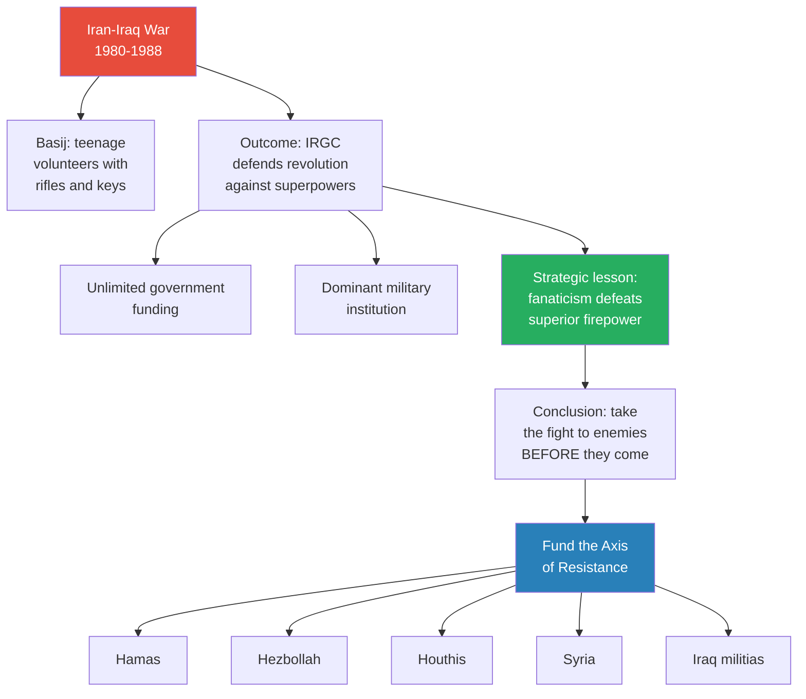

*The Iran-Iraq War gave the IRGC three things: dominance, money, and a validated strategic doctrine. Everything that followed — the Axis of Resistance, the proxy wars, the confrontation with America — flows from those eight years.*

---

### The IRGC's Economic Empire and the Paradox of Power

*The revolutionary guards were supposed to protect the revolution. Instead, they became the establishment the next revolution would target.*

With unlimited government funding and no institutional check on their power, the IRGC expanded far beyond their military mandate. Prof. Jiang describes the scope of their economic control:

- The IRGC is estimated to control between <b style="color: #e74c3c">10 and 50 percent of the entire Iranian economy</b>
- They dominate construction, telecommunications, oil, and import/export
- Their control of the Navy — particularly the Strait of Hormuz — enables smuggling operations that generate additional revenue
- The missile programme, where most military spending is concentrated, is entirely under IRGC control
- All foreign policy through the Axis of Resistance runs through the IRGC — not the Foreign Ministry, not the President

> [!example] The IRGC's Three Pillars of Power
> - **The Navy and Strait of Hormuz:** The IRGC controls Iran's naval forces, giving them strategic leverage over one of the world's most important shipping lanes — and the ability to generate revenue through smuggling
> - **The missile programme:** Where most of Iran's military budget is directed — entirely under IRGC, not regular military, command
> - **Foreign policy:** The Axis of Resistance — Hamas, Hezbollah, Houthis, Syria, Iraqi Shia militias — interacts only with the IRGC. General Soleimani and the two generals killed in the Damascus airstrike were all IRGC, not regular military
> **The lesson:** The IRGC controls the three functions that generate money and strategic leverage. The regular army still exists but holds none of the instruments that matter.

This concentration of power produced exactly the result that unchecked monopolies always produce: stagnation and corruption. Western sanctions — particularly the inability to sell oil on international markets — certainly damaged the Iranian economy. But Prof. Jiang argues the deeper problem is structural: when one institution controls half the economy and faces no competition, innovation dies and resources flow to insiders rather than productive investment.

The result is a <b style="color: #2980b9">paradox that defines modern Iran</b>:

- The IRGC was created to protect the revolution
- The IRGC's economic monopoly stagnated the economy and impoverished ordinary Iranians
- Ordinary Iranians began protesting — against corruption, against economic decline, against the lack of democracy
- The regime turned to the IRGC to crush the protests — because they are the most loyal and most capable enforcers
- Each wave of protest made the regime more dependent on the IRGC
- Each crackdown made the IRGC more powerful
- <b style="color: #e74c3c">The organisation that caused the problem became indispensable for managing it</b>

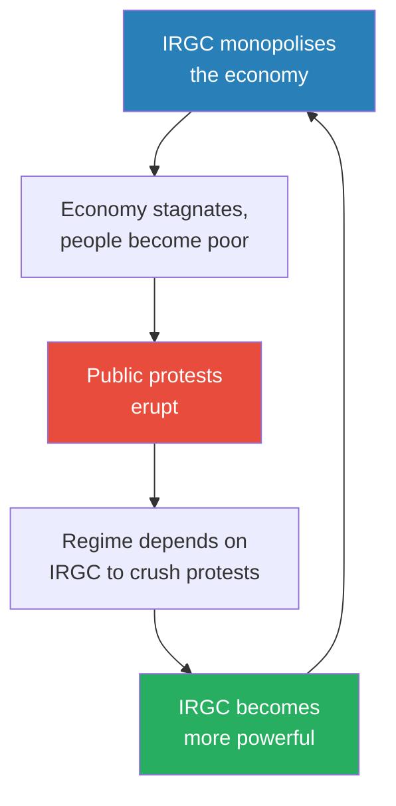

*The IRGC paradox: economic monopoly causes protests, protests increase dependence on the IRGC as enforcers, increased dependence gives the IRGC more power, more power deepens the monopoly. Each cycle strengthens them.*

> [!tip] Core Insight
> The IRGC does not fear popular unrest. They benefit from it. Every protest wave — 1999, 2009, 2022 — ended the same way: the IRGC crushed it, and the regime became more dependent on them. Instability is not a threat to the IRGC. It is the mechanism by which they consolidate power.

---

## The Political Class vs. the Military Class

*Inside Iran, two visions of the country's future have been competing for decades. One says: be patient, focus inward, let time work in our favour. The other says: the revolution demands confrontation, and caution is cowardice.*

Prof. Jiang frames Iran's internal politics as a fundamental divide between two classes — not economic classes but power classes with opposing worldviews about what Iran should do next.

### The Political Class: Restraint and Patience

Politicians like Raisi came from the <b style="color: #2980b9">judiciary</b> — a separate power base from the IRGC. They understood the mathematics of war:

- A direct military confrontation with the United States and Israel would be catastrophic
- Tens of millions of Iranians could die
- Even if Iran ultimately survived, the devastation would set the country back decades
- Strategic patience — building economic strength, waiting for geopolitical shifts — offered a better path

Prof. Jiang points to two moments that reveal this divide in action. After General Soleimani's assassination in January 2020, the IRGC demanded vengeance — they wanted war. But Iran's response was muted. Politicians like Raisi argued for restraint: going to war at that moment would be suicidal. Then in April 2024, when Israel struck the Iranian embassy in Damascus and killed two IRGC generals, the same dynamic repeated — the IRGC wanted full-scale retaliation, and the political class again counselled patience.

### The Military Class: Revolution and Confrontation

The IRGC saw this restraint differently. Prof. Jiang characterises their view of the political class in blunt terms:

- These politicians are <b style="color: #e74c3c">cowards</b>
- They are <b style="color: #e74c3c">weak and soft</b>
- They are <b style="color: #e74c3c">not true believers</b> in the revolution
- The revolution demands action, not patience — America and Israel are the Great Satan and must be confronted

For the IRGC, the Axis of Resistance is not a negotiating chip to be traded for economic concessions. It is the revolution's front line. Withdrawing from the Middle East would be a betrayal of everything the IRGC was founded to do — and of every Basij volunteer who died running across a minefield with a key around his neck.

### Khamenei's Cultivation of the IRGC

The current Supreme Leader, <b style="color: #2980b9">Ayatollah Ali Khamenei</b>, understood from the moment he succeeded Khomeini in 1989 that his power depended on the IRGC. His response was extraordinary in its personal investment:

- He reportedly memorised the names of 20,000 to 50,000 IRGC members
- He learned the names of their children
- He built personal, face-to-face relationships across the entire organisation
- The IRGC became, in practice, his private army — loyal to him personally, not just to the institution of the Ayatollah

This personal cultivation matters for the succession. Loyalty built over decades of individual attention is not easily transferred to a stranger like Raisi. But it transfers naturally to Mojtaba — the old man's son, someone the IRGC leadership has known since he was a child.

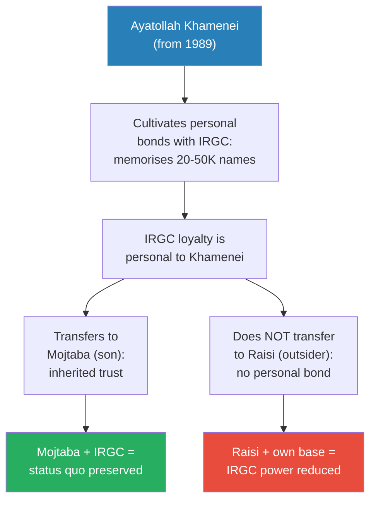

*Khamenei's decades of personal cultivation created loyalty that is familial, not institutional. This loyalty transfers to his son but not to an outsider — giving the IRGC a structural reason to prefer Mojtaba.*

### The Protest Waves — and Why They Strengthen the IRGC

Prof. Jiang traces three major protest waves that illustrate the paradox:

> [!example] Three Waves of Protest (1999, 2009, 2022)
> - **1999 — Student Protests:** 50,000 students took to the streets demanding democracy — but what they were really protesting was IRGC corruption and economic monopoly. The IRGC crushed them
> - **2009-2010 — The Green Movement:** A reform candidate lost an election that many believed was rigged by the IRGC. Violent protests erupted. The IRGC suppressed the movement with such brutality that Iranians lost faith in democratic change altogether. After that, every subsequent president was essentially a puppet of the regime
> - **2022 — The Mahsa Amini Protests:** A young woman named Mahsa Amini was arrested by the morality police for not wearing a head covering. She died in custody — suspected to have been beaten. Massive protests erupted across the country. The IRGC crushed them
> **The lesson:** Each protest wave ended the same way — IRGC crackdown, opposition broken, regime more dependent on its enforcers. The protests never weakened the IRGC. They made the IRGC indispensable.

Many Iranians — including, Prof. Jiang suggests, politicians within the system — have reached a conclusion that puts them directly at odds with the IRGC:

- Maybe the problem is not Israel or America
- Maybe the problem is the IRGC itself
- Their fanaticism creates enemies that would not otherwise exist
- Their economic monopoly cripples the economy
- Their insistence on exporting revolution across the Middle East invites the very aggression they claim to be defending against
- <b style="color: #27ae60">If Iran withdrew from the Middle East and focused on economic development, Israel, Saudi Arabia, and the United States would have no reason to attack</b>

This is the argument the political class makes — and it is precisely the argument the IRGC considers treasonous. For the IRGC, withdrawing from the Middle East would be abandoning the revolution. And abandoning the revolution means betraying God.

### Why the IRGC Wants War

The logic is now complete. Prof. Jiang connects the IRGC's institutional interests to the series-wide question of whether war between Iran and the United States is coming:

- The IRGC's power depends on external threat — without enemies, there is no justification for their monopoly
- The political class wants to remove the external threat by withdrawing from confrontation — which would undermine the IRGC's reason for existing
- Raisi represented the political class and was likely to reduce IRGC power if he became Supreme Leader
- With Raisi gone and Mojtaba as the likely successor, the military class controls policy
- The IRGC's strategy is to <b style="color: #e74c3c">provoke America into invading Iran</b> — because that is the only war they can win

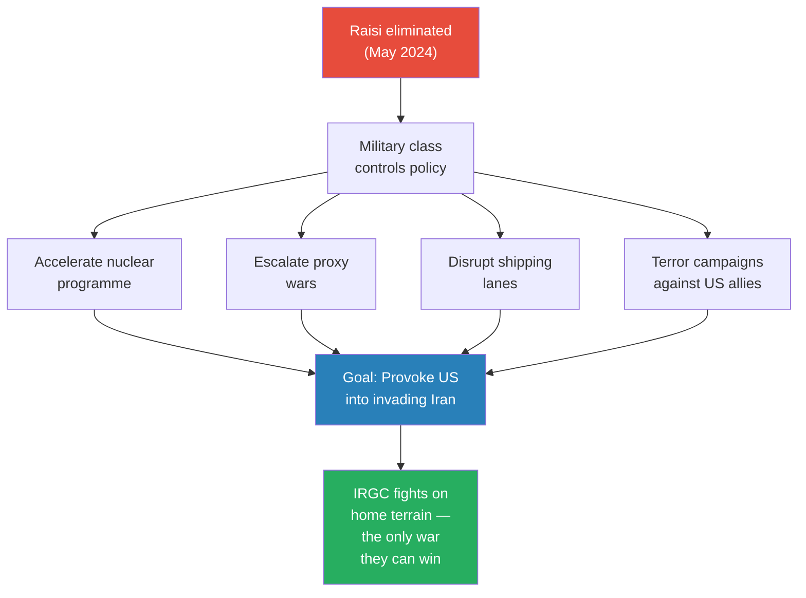

*With the political class sidelined, the IRGC pursues its only viable military strategy: provoke America through four escalation paths until the US invades Iran — where the IRGC believes it can win using the same asymmetric doctrine that saved them in the Iran-Iraq War.*

The series has now constructed both halves of the collision. Lectures 1-6 showed why America is moving toward war with Iran. Lecture 7 shows why Iran's military class is moving toward the same war from the opposite direction. What remains — Lecture 8 — is what the war itself would look like.

---

## The Provocation Strategy — How the IRGC Plans to Start a War

*The IRGC cannot defeat America in open combat. But it does not need to. It only needs to make America angry enough to invade — and then the mountains, the population, and the Basij do the rest.*

Prof. Jiang has now established the IRGC's motive (preserve their power monopoly), their worldview (revolutionary fanaticism forged in the embassy crisis and the Iran-Iraq War), and their domestic victory (the political class sidelined, Mojtaba as the compliant successor). The final piece of the argument is strategic: what does the IRGC actually do with its consolidated power?

The answer connects directly back to [[01 - Iran's Strategy Matrix|Lecture 1]]. The <b style="color: #2980b9">Iran Strategy Matrix</b> established that every Iranian action must serve four goals simultaneously: unite the population, build alliances, win global opinion, and weaken the enemy. The provocation strategy is the IRGC's application of that matrix — each escalation path is chosen not randomly but because it advances multiple strategic goals at once.

### The Four Escalation Paths

Prof. Jiang identifies four distinct methods the IRGC can use to provoke the United States into military action:

**Path 1: Accelerate the nuclear programme.** Israel and the United States have both declared that Iran possessing nuclear weapons constitutes an <b style="color: #e74c3c">existential threat</b>. This is the single clearest red line in Middle Eastern geopolitics. If Iran accelerates uranium enrichment or moves toward weaponisation, it forces Israel's hand — and Israel's hand forces America's hand. The beauty of this provocation, from the IRGC's perspective, is that it simultaneously:

- Unites the Iranian population (national pride in nuclear achievement)
- Strengthens alliances (Russia and China have economic interests in Iran's nuclear programme)
- Wins global opinion (Iran can frame itself as exercising its sovereign right to nuclear energy)
- Weakens the enemy (forces the US-Israel alliance into a reactive posture)

**Path 2: Escalate proxy warfare.** The <b style="color: #2980b9">Axis of Resistance</b> — Hamas in Gaza, Hezbollah in Lebanon, the Houthis in Yemen, and Shia militias in Iraq — is the IRGC's primary instrument of foreign policy. Each proxy can be dialled up independently:

- Hezbollah attacks on northern Israel force Israel to fight on two fronts — and Hezbollah is by far the most capable of the proxies, with an estimated 150,000 rockets pointed at Israeli cities
- Shia militias in Iraq attack US military bases, creating American casualties — the one thing guaranteed to generate political pressure for retaliation in Washington
- Houthi attacks on Saudi oil fields threaten the global energy supply — as [[04 - Saudi Arabia's Trump Card Against Iran|Lecture 4]] demonstrated, Saudi Arabia's coastal infrastructure is devastatingly vulnerable
- Each escalation makes the United States conclude that <b style="color: #e74c3c">the head of the snake must be destroyed</b> — and the head of the snake is Iran

The proxy strategy is particularly elegant because it creates plausible deniability. Iran can claim these are independent resistance movements while calibrating exactly how much pressure each applies. The IRGC does not need all four proxies to escalate simultaneously — even one or two operating at high intensity is sufficient to keep the pressure building.

**Path 3: Disrupt shipping lanes.** The IRGC controls the Iranian Navy, which controls access to the <b style="color: #2980b9">Strait of Hormuz</b> — one of the world's most critical shipping chokepoints. Approximately 20% of global oil passes through this strait. Even minor disruptions to shipping — harassment of tankers, mine-laying, naval confrontations — would send oil prices spiralling and create enormous pressure on the US to act. This path is uniquely powerful because:

- It hits the global economy directly, not just regional politics
- It forces the US Navy into a confrontational posture in waters the IRGC knows intimately
- It connects to the petrodollar system from [[03 - How Empire is Destroying America|Lecture 3]] — any disruption to oil flows threatens the currency system that props up American economic power

**Path 4: Launch terror campaigns.** Through its proxy network, the IRGC can orchestrate attacks against American allies and interests worldwide. This is the bluntest instrument — designed not for strategic precision but for cumulative provocation, building public outrage in America until the political cost of inaction exceeds the political cost of war. Unlike the other three paths, terror campaigns bypass the strategic calculus entirely and operate on emotion — they are designed to make Americans angry, not to achieve military objectives.

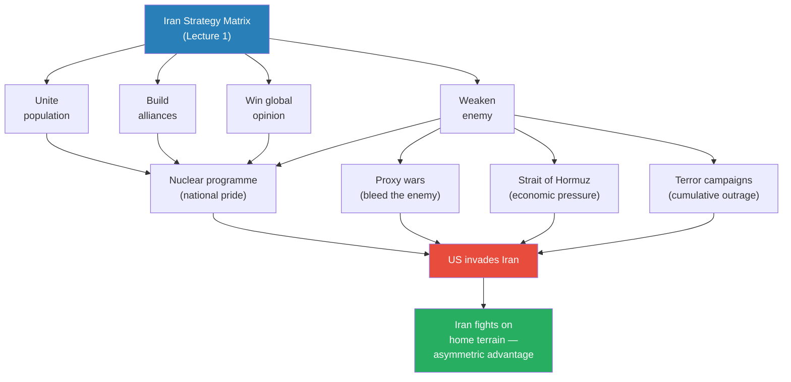

*Every provocation path maps back to the Iran Strategy Matrix from Lecture 1. The nuclear programme uniquely serves all four goals; the other three primarily serve goal four (weaken the enemy). All four converge on the same objective: make America invade.*

### Why the IRGC Wants America to Invade

This is the counterintuitive heart of the strategy — and the point where Prof. Jiang's argument becomes most disturbing. The IRGC is not trying to prevent war. <b style="color: #e74c3c">They are engineering the conditions for it</b>.

The logic follows from everything the lecture has established:

- The IRGC's power depends on external threat — without enemies, their economic monopoly and political dominance have no justification. War is not a risk to the IRGC — it is job security
- An American invasion would unite the entire Iranian population behind the IRGC — no Iranian would side with foreign invaders, regardless of how much they despise their own government. The domestic opposition that has been protesting since 1999 would rally behind the regime overnight
- The IRGC becomes indispensable — the nation's survival depends on them. Every function they control (Navy, missiles, foreign policy, the Basij) becomes critical to the war effort
- On Iranian terrain — mountainous, difficult, with tens of millions of Basij volunteers willing to die — the IRGC believes it can survive and eventually exhaust the American military, just as it exhausted Saddam's army in the 1980s

This connects to every major thread in the series. The 2002 Millennium Challenge from [[01 - Iran's Strategy Matrix|Lecture 1]] demonstrated that Iran could defeat the US in a war game using asymmetric tactics — until the US military banned those tactics and restarted the simulation. The IRGC's strategic conclusion from the Iran-Iraq War (fanaticism and willingness to absorb casualties defeats conventional superiority) is precisely the asymmetric doctrine that the Millennium Challenge validated. And [[06 - America's Imperial Hubris|Lecture 6]] explained why shock and awe — the doctrine the US would use to attack Iran — only works under three conditions (no air defence, flat desert, total surprise) that Iran does not present.

> [!example] The Strategic Logic: From Provocation to Invasion
> - The IRGC cannot defeat America in open combat — shock and awe guarantees American victory in any conventional engagement
> - But shock and awe fails in mountains — Iran's terrain is the opposite of Iraq's flat deserts
> - The Iran-Iraq War proved that religiously motivated volunteers can exhaust a conventionally superior enemy through sheer attrition
> - The Millennium Challenge (Lecture 1) confirmed that asymmetric tactics defeat conventional American military doctrine
> - Therefore: the only war Iran can win is a defensive war fought on its own soil
> - Therefore: the IRGC must provoke America into invading — which requires consolidating domestic power to remove the political class's restraining influence
> - Therefore: Raisi's elimination serves the IRGC's strategic interests at every level — domestic, regional, and global
> **The lesson:** The provocation strategy is not reckless. Within the IRGC's worldview, it is the most rational strategy available — because it is the only path to a war they believe they can survive.

> [!tip] Core Insight
> The IRGC does not want to defeat America in the conventional sense. It wants America to enter Iran, where it will lose the same way it lost in Vietnam — not through military defeat on the battlefield but through the slow, grinding exhaustion of fighting an enemy that will never surrender. The provocation strategy is designed to make that invasion happen.

> [!abstract] The Four Provocation Paths
> | Path | Method | Primary Target | Strategic Logic |
> |------|--------|---------------|-----------------|
> | Nuclear acceleration | Enrich uranium, move toward weaponisation | Israel's existential red line | Serves all 4 goals of Iran Strategy Matrix; forces US-Israel reactive posture |
> | Proxy escalation | Hezbollah, Shia militias, Houthis dial up attacks | Israel (two fronts), US bases, Saudi oil | Plausible deniability; cumulative pressure; each proxy independently calibrated |
> | Shipping disruption | Strait of Hormuz harassment, mine-laying | Global economy, petrodollar system | Hits US economic interests directly; leverages IRGC Navy control |
> | Terror campaigns | Proxy attacks on US allies worldwide | American public opinion | Blunt instrument; operates on emotion, not strategy; builds outrage |

Prof. Jiang adds a critical caveat that separates careful analysis from conspiracy theory: even if all four provocations materialise — nuclear acceleration, proxy escalation, shipping disruption, terror campaigns — it does not prove the IRGC killed Raisi. The provocations might happen regardless, driven by their own institutional logic. The IRGC has been pursuing these escalation paths for years, and Raisi's death — even as a genuine accident — removes a restraining influence. But if the IRGC did kill Raisi, these escalations should follow with greater intensity and less restraint. The predictions are testable, and the method is the same one Prof. Jiang taught in [[05 - Why Trump Will Win|Lecture 5]]: build a model, derive predictions, watch reality, refine.

---

## Student Questions

*The Q&A reveals how the argument works at its joints — the places where the logic is most vulnerable and most illuminating. Prof. Jiang's students push on exactly the right questions: the institutional details (does the regular military still exist?), the mechanism of control (why can the IRGC control Mojtaba?), the practical implications (what changes now?), and the strategic endpoint (how would Iran fight?). Each answer deepens the lecture's central argument.*

### Does the Regular Military Still Exist?

A student (Celine) asks whether the IRGC has entirely replaced the conventional Iranian army. Prof. Jiang confirms that the regular military still exists — but the IRGC's dominance is structural, not just political. They control the three functions that generate money and strategic leverage:

- **The Navy** — which controls the Strait of Hormuz and enables smuggling revenue. This is not just a military asset — it is a financial engine. Control of the strait gives the IRGC both strategic leverage over global shipping and a revenue stream from smuggling operations
- **The missile programme** — where most of Iran's military budget is concentrated. This is the weapon system that matters in any confrontation with Israel — and it is entirely under IRGC, not regular military, command
- **Foreign policy** — the Axis of Resistance interacts exclusively with the IRGC, not the Foreign Ministry or the regular army. General Soleimani and the two generals killed in the Damascus airstrike were all IRGC. The regular military has no role in Iran's most consequential strategic relationships

The regular army exists but holds none of the instruments that matter. It is like a company where the subsidiary controls all the revenue-generating divisions while the parent holds only the back office. This structural dominance means that even if the president or the Ayatollah wanted to rein in the IRGC, they would face the challenge of dislodging an institution that controls all the levers of real power.

### Why Can the IRGC Control Mojtaba?

A student (Jack) asks why the IRGC is confident it can control Mojtaba Khamenei as Supreme Leader. Prof. Jiang gives two reasons:

- **Inherited personal bonds:** Ayatollah Khamenei spent decades cultivating individual relationships with IRGC members — memorising tens of thousands of names, knowing their families. This extraordinary personal investment created loyalty that transfers naturally to his son, whom the IRGC leadership has known since childhood
- **Structural dependency:** Mojtaba is deeply unpopular. He has no independent political base, no constituency, no charisma. If he becomes Supreme Leader, it will only be because the IRGC installed him — and he will know it every single day. <b style="color: #27ae60">A leader who owes everything to you can never turn on you</b>

The IRGC does not need a loyal ally. They need a weak one. Weakness is control.

This logic connects to a broader pattern in the series. In [[04 - Saudi Arabia's Trump Card Against Iran|Lecture 4]], Saudi Arabia purchased influence over US policy through the MBS-Kushner-Trump triangle — creating dependency through financial investment. The IRGC's strategy is structurally identical but uses a different currency: instead of money, they invest institutional power. They do not buy Mojtaba's loyalty — they make his position impossible without their support. The mechanism differs but the principle is the same: create dependency, then control.

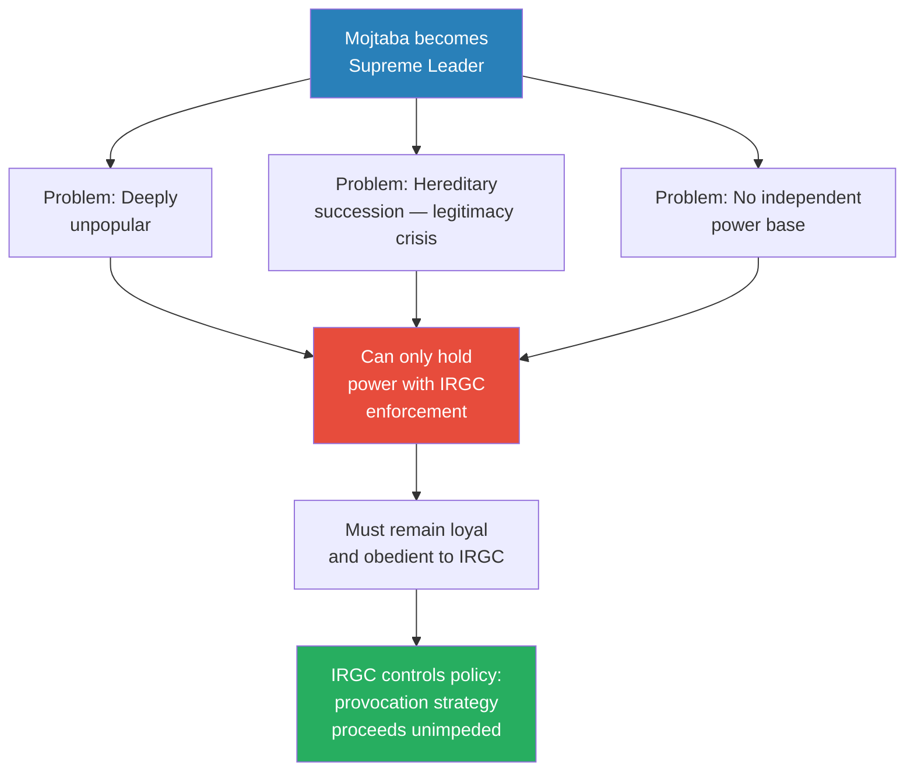

*Mojtaba's three weaknesses — unpopularity, hereditary illegitimacy, and lack of an independent base — converge on a single outcome: total dependence on the IRGC. This is not a bug in the IRGC's plan. It is the plan.*

### What Changes Now That Raisi Is Dead?

Celine follows up: what concretely changes in Iranian politics? Prof. Jiang distinguishes two scenarios with very different implications:

**Scenario 1: It was an accident.** Nothing fundamental changes at a structural level. The Ayatollah still controls policy, the same institutional dynamics continue, and the succession question simply has fewer candidates. The IRGC-political class tension persists, but neither side has won a decisive victory. Iran continues on its existing trajectory — provocative but restrained, aggressive but calculated. The IRGC still pushes for confrontation, but pragmatists still have a voice. The path to war exists but moves at a slower pace, with more checkpoints where diplomacy or internal politics could intervene.

**Scenario 2: The IRGC engineered the crash.** Everything changes. The political class is finished. The military class dictates policy. The restraining force that kept Iran from full escalation — politicians like Raisi who understood the mathematics of war and counselled patience — is removed. Prof. Jiang makes four specific, testable predictions:

1. <b style="color: #2980b9">Mohammed Mokhber</b> — the current Vice President, who comes from the IRGC unlike Raisi who came from the judiciary — wins the late June election. This is the clearest marker: if an IRGC-aligned figure replaces a judiciary-aligned president, the power shift is visible
2. Rhetoric becomes more extremist, preparing the Iranian population for total war — the language shifts from strategic patience to revolutionary duty
3. Harsher crackdown on political dissent — anyone counselling restraint is sidelined or removed. The political class loses not just its leader but its voice
4. Escalation across all four dimensions: nuclear programme accelerates, proxies intensify, shipping is disrupted, and terror campaigns expand

This is the lecture's most consequential answer — it transforms speculation into a framework that can be checked against what actually happened after May 2024. The predictions are specific enough to be falsifiable, which is exactly what the analytical model-building method from [[05 - Why Trump Will Win|Lecture 5]] demands.

### How Would Iran Fight the War?

Celine asks the question the entire lecture has been building toward: if the IRGC wants war, how would they actually fight the United States?

Prof. Jiang is blunt: <b style="color: #e74c3c">there is only one way</b>. Iran cannot attack America in the open. Shock and awe — air supremacy, satellite surveillance, special forces — means open warfare against the United States is suicide. The IRGC knows this from [[06 - America's Imperial Hubris|Lecture 6]]. The three conditions that made Iraq 2003 a quick American victory (no air defence, flat desert terrain, total surprise) do not apply to Iran.

The only path to survival is to lure America into invading Iran itself. The provocation strategy exists to accomplish exactly this — make America angry enough, frustrated enough, politically committed enough to send an invasion force onto Iranian soil. Once American ground forces enter Iranian territory:

- The terrain shifts from desert (where shock and awe works, as in Iraq) to mountains (where it does not) — Iran's geography is closer to Afghanistan than to Iraq
- The population becomes a weapon — tens of millions of potential Basij volunteers who view death in battle as a promotion to heaven
- Supply lines stretch to their breaking point across hostile territory
- The war becomes a grinding attrition that American democracy cannot sustain — the same dynamic that destroyed support for Vietnam, but at a far larger scale

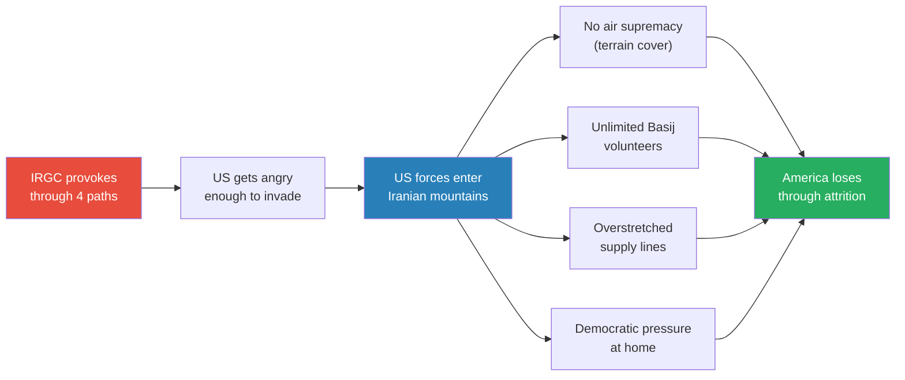

*The IRGC's war strategy has two phases: provoke (this lecture) and survive (Lecture 8). The provocation strategy gets America into Iran; the terrain, the Basij, and democratic pressure get America out.*

This strategic vision explains why the IRGC's provocation strategy is not merely aggressive posturing. It is a carefully constructed pipeline:

1. **Consolidate domestic power** (eliminate political restraint — Raisi's death, whether engineered or not, accomplishes this)
2. **Escalate through four parallel paths** (nuclear programme, proxies, shipping, terror — each raising the temperature)
3. **Trigger an American invasion** (the culmination of provocation — America sends ground forces into Iran)
4. **Fight a defensive war on home terrain** (mountains, Basij volunteers, unlimited willingness to absorb casualties)
5. **Exhaust the invader through attrition** (the same strategy that worked against Saddam, validated by the Millennium Challenge)

Each step requires the previous one. Without domestic consolidation, the political class might restrain the escalation. Without escalation, America has no reason to invade. Without invasion, Iran cannot fight the only war it can survive. The entire chain depends on the IRGC's ability to remove internal obstacles — which is precisely what Raisi's death achieves, regardless of its cause.

This is the topic Prof. Jiang promises for [[08 - The Iran Trap|Lecture 8]] — what the actual war looks like, why America loses on Iranian soil, and why even Iran's victory would be catastrophic. The critical qualifier, which Prof. Jiang repeats: he has never said Iran will win. He has said America will lose. The difference is that Iran may survive — but at the cost of tens of millions of lives.

---

## What Raisi's Death Reveals About the Coming War

*Whether the IRGC killed Raisi or not, the structural forces are the same. The crash is a window into dynamics that would exist regardless of its cause.*

Prof. Jiang closes with a synthesis that transcends the whodunit. He has never claimed to know what happened on May 19, 2024. The lecture's value is not in solving the mystery but in revealing the structural forces that make the mystery worth asking about.

The key insight is this: <b style="color: #27ae60">even if Raisi's death was a genuine accident, the power dynamics it reveals are real</b>. The IRGC really does control up to half the economy. They really did crush three waves of popular protest. The succession really does present them with an existential choice between a strong leader who would reduce their power and a weak one who would preserve it. The political class really did counsel restraint after Soleimani's assassination and the Damascus strike, and the military class really did view that restraint as cowardice.

Prof. Jiang is careful to distinguish between the two scenarios and their implications for the series:

- **If it was an accident:** The structural tensions remain but the balance of power shifts gradually. The IRGC still dominates, but the political class still has a voice. The path to war is slower, with more opportunities for diplomatic intervention
- **If the IRGC engineered it:** The political class is finished. The military class dictates all policy. The path to war accelerates dramatically, because the restraining influence of pragmatic politicians has been physically removed. The provocation strategy proceeds at full speed
- **In either case:** The destination is the same — the only variable is timing. The IRGC's institutional incentives, revolutionary worldview, and monopoly on the instruments of power all point toward confrontation

The IRGC has captured the revolution. The institution that was created to protect the Islamic Republic has become the Islamic Republic's shadow government — controlling the economy, dictating foreign policy, and pushing toward the confrontation with America that this series has been building toward since Lecture 1. This mirrors a pattern from the American side: in [[06 - America's Imperial Hubris|Lecture 6]], the Pentagon's institutional interests (justifying budgets, proving shock and awe doctrine, maintaining global presence) push toward war regardless of whether it serves the national interest. On both sides of this conflict, the military institutions have captured the decision-making process.

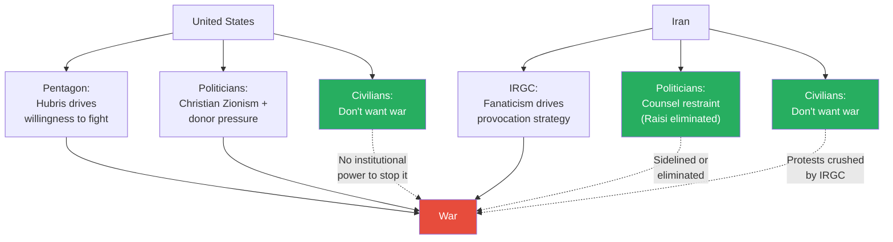

*The mirror image: on both sides, military institutions push toward war while civilian populations resist. In both countries, the organised minority with access to the instruments of violence has captured the decision-making process. The forces pushing toward war have institutional power; the forces resisting it do not.*

Whether or not the crash was engineered, the destination is the same: the IRGC is steering Iran toward war. The only question is how quickly the collision arrives — and whether any remaining political forces on either side can slow the momentum. Prof. Jiang promises to answer what the collision itself looks like in [[08 - The Iran Trap|Lecture 8]].

He adds one final, devastating caveat: <b style="color: #e74c3c">he has never said Iran will win the war — only that America will lose it</b>. The distinction matters enormously. The war will be brutal for Iran. Tens of millions will die — not as a worst case but as the expected outcome of an American invasion against a population of 85 million people willing to fight. The politicians who counselled restraint — Raisi among them — understood this arithmetic. They knew that even if Iran survived, the cost would be catastrophic: cities destroyed, infrastructure levelled, a generation lost.

The IRGC, forged in the embassy crisis and the minefields of the Iran-Iraq War, considers those deaths acceptable. They watched teenagers run across minefields with keys around their necks, and they concluded that this is how Iran fights — through suffering, through martyrdom, through the willingness to endure what the enemy cannot. That is the difference between the political class and the military class, and it is why Raisi's death — accident or not — shifts the balance toward catastrophe.

---

## Connections

**Builds on:**
- [[01 - Iran's Strategy Matrix]] — the four-goal Iran Strategy Matrix is the strategic framework behind every IRGC provocation; the Axis of Resistance (Layer 1 of Iran's alliances) is revealed here as the IRGC's creation and primary instrument
- [[02 - Christian Zionism and the Middle East Conflict]] — the nuclear programme as an existential red line for Israel echoes Lecture 2's treatment of the three forces pushing America toward war
- [[03 - How Empire is Destroying America]] — the empire trap (act and risk defeat, or do nothing and collapse) mirrors the IRGC's provocation logic: make America choose between tolerating escalation and invading
- [[04 - Saudi Arabia's Trump Card Against Iran]] — the Soleimani assassination (January 2020) and the 1979 revolution are revisited from the Iranian domestic perspective; Lecture 4 showed external pressure toward war, this lecture shows internal pressure from the same direction
- [[05 - Why Trump Will Win]] — analytical model-building method (hypothesis, predictions, test against reality) is explicitly applied to the IRGC assassination theory
- [[06 - America's Imperial Hubris]] — shock and awe's limitations explain why the IRGC wants a ground invasion rather than an air war; the US military's institutional hubris explains why it will agree to fight on the IRGC's terms

**Sets up:**
- [[08 - The Iran Trap]] — Prof. Jiang explicitly promises this as the next lecture: what the actual war between America and Iran looks like, why shock and awe fails in mountains versus deserts, and why America loses on Iranian soil. This lecture established both halves of the collision (the American military agrees to fight due to hubris; the IRGC wants and is provoking the fight due to fanaticism). Lecture 8 shows what happens when the collision occurs — and why Prof. Jiang's distinction between "America will lose" and "Iran will win" matters so profoundly. The Basij, the Millennium Challenge, the terrain — all of it converges in Lecture 8
- The nuclear acceleration prediction connects to Lectures 2 and 4, where nuclear weapons were identified as Israel's existential red line — one of the three forces pushing America toward war
- The proxy escalation prediction connects to the Axis of Resistance mapped in Lecture 1 and the proxy wars traced in Lecture 4 (Hezbollah, Houthis, Iraqi Shia militias)

**Related books in vault:**
- [[The 48 Laws of Power - Robert Greene]] — Law 15 (Crush Your Enemy Totally) applies to the IRGC's possible elimination of Raisi — leaving a political rival alive means leaving a future threat alive. Law 29 (Plan All the Way to the End) describes the IRGC's provocation-to-invasion strategy with precision: they are not improvising escalation but executing a long-term plan whose endpoint is an American invasion of Iranian soil
- [[The 33 Strategies of War - Robert Greene]] — the IRGC's provocation strategy maps to Greene's controlled aggression and grand strategy concepts. The Basij's human wave tactics in the Iran-Iraq War connect to Greene's treatment of morale and fanaticism as force multipliers in asymmetric warfare. The IRGC's institutional capture of Iranian governance parallels Greene's analysis of how military classes seize civilian power
- [[Thinking Fast and Slow - Daniel Kahneman]] — the three-possibilities framework is an exercise in System 2 thinking forced onto a situation where System 1 (accept the official narrative, stop thinking) dominates. Prof. Jiang's insistence on exploring the uncomfortable IRGC theory is a deliberate override of the availability heuristic: accidents are common, therefore it must be an accident
- [[Sapiens - Yuval Noah Harari]] — the role of shared myths (religious conviction, revolutionary ideology, the keys to heaven) in organising collective action connects to Harari's framework of imagined orders. The Basij's willingness to die for a key to paradise is an extreme example of how shared belief enables cooperation at scale

**Recurring themes advanced:**
- **1979 as the earthquake** — third lecture centred on the 1979 revolution's consequences. Lecture 4 covered external effects (Saudi-Iran rivalry, Sunni-Shia conflict). This lecture covers internal effects (IRGC founding, embassy crisis, revolutionary DNA that persists into the present). The revolution keeps generating new consequences 45 years later
- **Organised minorities defeating passive majorities** — the IRGC (revolutionary fanatics) controls policy against the wishes of the Iranian population (which wants economic development and peace), mirroring dispensationalists driving US policy (Lecture 2) and Wahhabis forcing Saudi foreign policy (Lecture 4). In all three cases, a fanatical minority captures institutions and steers an unwilling majority toward confrontation
- **Asymmetric warfare defeats conventional superiority** — the Basij versus Iraqi tanks is the historical precedent for the Millennium Challenge (Lecture 1) and Houthi drones versus Saudi infrastructure (Lecture 4). The pattern is consistent across decades: technologically inferior forces that control the terms of engagement defeat superior militaries
- **Imperial hubris meets revolutionary fanaticism** — Lecture 6 showed the US military's hubris (believing shock and awe works everywhere). This lecture shows the IRGC's fanaticism (believing God guarantees victory). Both sides are making decisions based on ideological conviction rather than rational assessment — and both are being pushed toward the same war by institutional dynamics that civilian populations cannot override
- **Foreign policy as purchasable commodity** — the MBS-Kushner-Trump triangle (Lecture 4) and Haley's anti-Iran donor network (Lecture 5) showed how American foreign policy is bought. This lecture shows the mirror: the IRGC controls Iranian foreign policy not through purchase but through institutional monopoly — the Axis of Resistance interacts only with them. In both countries, the institutions closest to the instruments of violence control the direction of policy
- **Analytical model-building** — Prof. Jiang explicitly applies the Lecture 5 methodology: construct a hypothesis (IRGC killed Raisi), derive predictions (Mokhber wins, rhetoric escalates, proxies intensify, nuclear programme accelerates), observe reality, refine the model. The value is not in being right but in building a framework that improves with each test. This lecture is the most thorough application of the method since it was introduced — a complete cycle from question to hypothesis to prediction to testable framework
- **The empire trap applied to Iran** — [[03 - How Empire is Destroying America|Lecture 3]] introduced the empire trap for the US: act and risk defeat, or do nothing and face collapse. This lecture reveals that Iran faces its own version: the IRGC's provocation strategy risks catastrophic war, but withdrawal from the Middle East would remove the external threat that justifies the IRGC's existence. Both sides are trapped by their own institutional logic — neither can afford to step back, and neither can afford the war that stepping forward produces

---

## The Takeaway

This lecture completes the series' structural argument for war. Lectures 1-6 showed that the United States is being pushed toward confrontation with Iran by three converging forces — imperial economics, allied pressure, and institutional hubris. Lecture 7 reveals that the Iranian side faces the same gravitational pull. The IRGC, an institution born from revolutionary paranoia and forged in the fires of the Iran-Iraq War, has accumulated control over the economy, the military, and foreign policy. Their institutional survival depends on external threat, and their worldview demands confrontation. The political class — represented by Raisi — counselled patience and restraint. With Raisi gone, the restraining force is weakened and the IRGC's four-pronged provocation strategy proceeds with fewer obstacles. The lecture's greatest contribution to the series is revealing that the Iranian internal dynamic mirrors the American one: in both countries, the military institution is pushing toward war while the civilian population and pragmatic politicians resist.

The most counterintuitive insight is that the IRGC wants America to invade. Every provocation — nuclear acceleration, proxy escalation, shipping disruption, terror campaigns — is designed not to defeat America but to anger it into sending ground forces onto Iranian soil. On that terrain, with those mountains, and with tens of millions of religiously motivated volunteers willing to die, the IRGC believes it can do what it did against Saddam: survive through sheer attrition until the invader exhausts itself. This is the strategic logic that connects everything in the series — and it is the subject of Lecture 8.

The IRGC is not acting irrationally. Within their worldview and their institutional incentives, provoking an invasion is the most logical strategy available. They cannot defeat America conventionally. They cannot maintain their domestic power without an external enemy. They cannot survive as an institution if a strong, independent Supreme Leader reduces their authority. The provocation strategy solves all three problems simultaneously: it creates the external enemy, justifies the domestic monopoly, and ensures that any future leader needs the IRGC to survive. That is what makes it so dangerous — and so difficult to deter.

The question that remains open is whether any institution can stop this collision. The American military is driven by hubris — the belief that shock and awe works everywhere, that technological supremacy guarantees victory. The IRGC is driven by fanaticism — the belief that God protects the revolution, that martyrdom is victory. Neither side's civilian population wants war. But in both countries, the organised minority that controls the instruments of violence has captured the decision-making process.

Prof. Jiang's framework suggests that war is not merely probable — it is structurally inevitable, because the institutional forces pushing toward it are stronger than the political forces resisting it:

- The American empire trap makes inaction impossible
- The IRGC's survival logic makes restraint impossible
- The Christian Zionists provide religious justification
- The Saudi-Israel alliance provides diplomatic cover
- And the civilian populations on both sides — the ones who will actually die — have no institutional mechanism to override the military establishments that have captured their governments

Lecture 8 will show what that war looks like — and why the phrase Prof. Jiang keeps repeating matters so much: America will lose, but Iran will not win.
