# The Iran Trap

> This is the lecture the entire series has been building toward. Seven lectures established why war with Iran is coming — three forces push America toward it (the Israel lobby, empire economics, Saudi desperation), Trump and Kushner will implement it, the US military's hubris means they believe they can win any war, and the IRGC is actively provoking invasion. Lecture 8 answers the question: what does the actual war look like? Prof. Jiang constructs a detailed hypothetical scenario — "Operation Iranian Freedom," March 2027 — and walks through the invasion step by step, showing how 100,000 American troops become trapped in Iran's mountains, encircled, cut off from supply, and unable to either advance or retreat. He validates this scenario through three historical analogues spanning 2,400 years (Athens in Sicily, Vietnam, Russia-Ukraine) and a game theory analysis revealing that every major actor — including America's own allies — benefits from the trap. The escape route of nuclear weapons is closed by a Russian guarantee. The result is a strategic black hole from which American power cannot return.

---

## The Question

*All seven threads converge. The war is coming. But what does it actually look like — and why is it already lost the moment it begins?*

Prof. Jiang opens with the most comprehensive series review yet, walking through every lecture from 1 to 7 in sequence. This is not mere repetition — it is the assembly of a machine. Each lecture contributed a component; now he shows how they fit together:

- <b style="color: #2980b9">Force 1: The Israel Lobby</b> — AIPAC (100,000 members, many billionaires, the second most powerful lobbying organisation in the US after the pensioners' lobby — there are about 30 million pensioners whose lobbying organisation is the only one more powerful) combined with Christians United for Israel (7 million members). Together they are an extremely powerful force pushing for war in the Middle East to advance Israel's interests.
- <b style="color: #2980b9">Force 2: Empire Economics</b> — America is addicted to easy money. All global money is channelled through the US dollar system, making Wall Street enormously powerful. Many people in the US make their money simply by speculating on money — not producing anything. This addiction to empire creates structural pressure for continued military intervention.
- <b style="color: #2980b9">Force 3: Saudi Arabia</b> — For Israel, Iran is a security threat because it supports Hezbollah and Hamas. For Saudi Arabia, Iran is a threat to its very existence. The distinction matters: Israel can survive alongside Iran, but Saudi Arabia believes it cannot. Saudi Arabia must resolve the Iran problem soon.
- **The Kushner Nexus** — Jared Kushner, Trump's son-in-law (married to Trump's daughter Ivanka), is the human connection point for all three forces. He is personally close to both Netanyahu and MBS. The closeness is not metaphorical:
  - When Netanyahu visits the United States, he stays with the Kushner family. On one occasion, Netanyahu slept in Jared Kushner's bedroom, and Kushner had to sleep in the basement
  - Kushner's father, Charles Kushner, was a very prominent AIPAC sponsor
  - When Kushner started a private equity fund after Trump's first term, Saudi Arabia invested $2 billion
  - Through Kushner, the Israel lobby, the Saudi royal family, and the Trump administration are connected by personal relationships, not just institutional interests
- **Trump's First-Term Evidence** — Five actions that demonstrate what a second Trump term will look like:
  - Withdrew from the Iran nuclear deal — which would have secured peace between the US and Iran
  - Moved the US embassy from Tel Aviv to Jerusalem — causing major friction throughout the Middle East
  - Ignored the Khashoggi murder — demonstrating that Trump will protect Saudi Arabia regardless of human rights concerns
  - Sponsored the Abraham Accords — bringing peace between Israel and other Arab countries to unite them against Iran
  - Assassinated General Qasem Soleimani in January 2020 — the most provocative action, killing the leader of the IRGC's foreign operations
- **Military Hubris** — The shift from traditional warfare doctrine to shock and awe (2003) created a military that believes it can win any war, anywhere, against anyone. Traditional doctrine required three things: mass forces, avoid encirclement, protect supply lines. Shock and awe replaced all three with air supremacy, technological omniscience (satellites), and special forces — fighting wars "cheaply, quickly, and decisively" without needing public consent. Operation Prosperity Guardian against the Houthis proved this is false — Biden acknowledged losing — but the hubris persists.
- **IRGC Provocation** — The Revolutionary Guard wants war: angry about American support for the Shah's police state (1953-1979), angry about US protection of Israel and Saudi Arabia, angry about the Soleimani assassination. As discussed in [[07 - Who Killed Iranian President Ebrahim Raisi|Lecture 7]], the IRGC possibly killed President Raisi because he was preventing war — counselling restraint and strategic patience when the IRGC wanted vengeance and confrontation.

---

### The Proof of Hubris: Operation Prosperity Guardian

*Before constructing the Iran scenario, Prof. Jiang presents a real-world proof that shock and awe is already failing — the Houthi crisis in the Red Sea.*

> [!example] The Houthi Failure (2024)
> - The Houthis, a rebel group in Yemen, began attacking ships in the Red Sea
> - A significant portion of global trade passes through the Red Sea — the attacks were causing massive disruption to international commerce and driving global inflation
> - The American military dispatched a massive naval force against the Houthis — Operation Prosperity Guardian
> - The Americans could not defeat the Houthis
> - Joe Biden came out publicly and said: yes, we know we are losing, and yes, we know we cannot stop the Houthis — but we are going to continue on this path
> - Why could the US not defeat the Houthis? Because the military has special forces, air supremacy, and technological omniscience (satellites) — but no infantry, not enough ships
> - Shock and awe requires a very specific kind of enemy to work: a conventional military in flat terrain
> - The Houthis are not that enemy, and Iran is not that enemy
> **The lesson:** When faced with its limitations, America refuses to accept them. Biden's statement — "we know we're losing but we'll continue" — is hubris distilled to its essence. This is the mindset that will agree to invade Iran.

Prof. Jiang uses this as the final piece of the review: if the US military cannot defeat a rebel group in Yemen, how can it expect to conquer a mountainous nation of 90 million? The answer is that <b style="color: #e74c3c">it can't — but hubris prevents it from recognising this</b>.

The Houthi failure is particularly important because it is not a historical analogue — it is happening right now, in real time, as the series is being taught. Biden's statement — "we know we're losing but we'll continue" — is not ancient history or a declassified document. It is a current admission of the exact hubris that Prof. Jiang has been analysing since Lecture 1. The pattern is not theoretical. It is observable.

"And that's why, when the US military is given the order to invade Iran, they'll probably go along with it, because they cannot imagine the possibility that they could be defeated in Iran."

Prof. Jiang's conclusion from the review: <b style="color: #27ae60">"United States is looking for a reason, and Iran wants to give them a reason."</b> War between the United States and Iran is "very likely in the next two to four years."

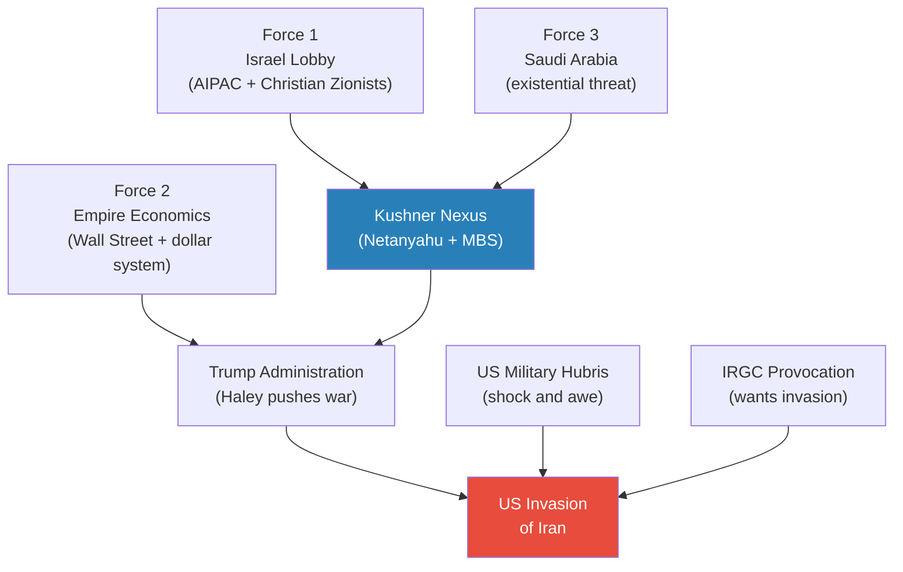

*Seven lectures built seven components. This lecture assembles them into a single machine — all roads lead to invasion.*

---

## Key Concepts at a Glance

| Concept | One-line summary |
|---------|-----------------|
| **The Iran Trap** | Iran's mountainous geography converts any invasion force from soldiers into hostages — the IRGC wants America to walk into it |
| **Three principles of traditional warfare** | Mass forces, avoid encirclement, protect supply lines — the invasion violates all three simultaneously |
| **The hostage metaphor** | 100,000 troops trapped in Iran: too many to evacuate, too few to attack, unable to be resupplied |
| **Sunk cost fallacy** | Once committed, America cannot withdraw because admitting the loss is politically impossible — the casino you can never leave |
| **Trump's five justifications** | Democracy, nuclear threat, shipping lanes, protecting allies, terrorism — a propaganda framework with no evidence behind any of it |
| **Three historical analogues** | Athens in Sicily (415 BCE), Vietnam (1960s), Russia-Ukraine (2022) — the same pattern across 2,400 years |
| **Three conditions for winning a war** | Clear strategy, adaptation to the battlefield, and the will to fight — the side that has all three wins |
| **Game theory of the trap** | Every actor wants invasion — but Israel and Saudi Arabia benefit most from US destruction alongside Iran's |
| **Russia's nuclear guarantee** | Putin declares no nuclear weapons for anyone — closes America's last escape route |
| **Manufacturing deficit** | America can build 1 ship for every 232 China builds — the industrial base for sustained war no longer exists |
| **Trump as Zelensky** | Both TV personalities prioritise looking strong on camera over strategic thinking — image-driven war is strategically suicidal |

---

## Operation Iranian Freedom: The Hypothetical Scenario

*Prof. Jiang constructs a detailed war scenario — "most of it is speculation" — to help students understand what the war would actually look like. The specifics are imagined, but the strategic logic is deadly serious.*

### Trump's Speech to the Nation

It is March 2027. Trump goes on television to announce <b style="color: #2980b9">Operation Iranian Freedom</b> — a full-scale US invasion of Iran, with Israel, Saudi Arabia, the UK, Australia, UAE, and Poland as coalition partners. He presents five justifications:

- **Democracy and freedom** — Violent protests across Iran (religious, political, ethnic). The Iranian people are "praying for freedom." The IRGC is killing thousands of protesters. Iran is on the brink of civil war. America has an obligation to protect the people and bring democracy.
- **Nuclear threat** — US and Israeli intelligence have discovered that Iran is one month from having three nuclear bombs targeting New York, San Francisco, and Los Angeles. Must strike first.
- **Shipping and global prosperity** — Iranian proxies (Houthis, Hezbollah) are disrupting shipping in the Red Sea and the Strait of Hormuz. 40% of the world's oil passes through this region. America must protect global prosperity.
- **Protecting allies** — Hezbollah is attacking Israel, killing innocent Israelis. Houthis are attacking Saudi oil fields. America has an obligation to defend its friends.
- **Terrorism** — The IRGC sponsored a mall shooting that killed 170 people. US intelligence confirms it was an Iranian operation.

Prof. Jiang notes the propaganda structure of the speech: each justification maps to a known American pressure point. Democracy and freedom appeals to American idealism. Nuclear threat appeals to fear. Shipping appeals to economic self-interest. Protecting allies appeals to honour. Terrorism appeals to anger. Together they cover every possible objection — "and of course, you're going to have large-scale protests throughout the country opposing this war, but most people in the country will support this war."

Trump's reassurances to the public:

- Many allied countries are participating — the UK, Israel, Saudi Arabia are all "part of this operation"
- Special forces are already in the country, looking for air bases and missiles so that "we can knock them out at the beginning of the war"
- Iranian opposition groups have been contacted — "they want to overthrow the regime, and when we help them, they will install democracy in the country"
- The US military defeated Saddam Hussein in 100 hours (1991) and in less than three weeks (2003) — "to prove that we are the greatest in the world, we will defeat Iran in only two weeks"

The speech ends with: "Do not worry, we will be strong in protecting democracy, freedom, and global prosperity."

> [!example] The "Two Weeks" Promise
> - In 1991, the US defeated Iraq's military in 100 hours
> - In 2003, it took less than three weeks
> - Trump promises Iran will fall in two weeks — each war is supposed to be faster
> - But Iraq in 1991 and 2003 was flat desert with a conventional military — the ideal terrain for shock and awe
> - Iran is mountain fortress terrain with 90 million people and an unconventional military motivated by religion
> - The "two weeks" promise is not strategy — it is TV performance
> - Prof. Jiang's point: the declining timelines (100 hours → three weeks → two weeks) are symptoms of hubris, not evidence of capability
> **The lesson:** Each victory in easy conditions reinforces the delusion that the next war will be even easier. The conditions are what matter, not the track record.

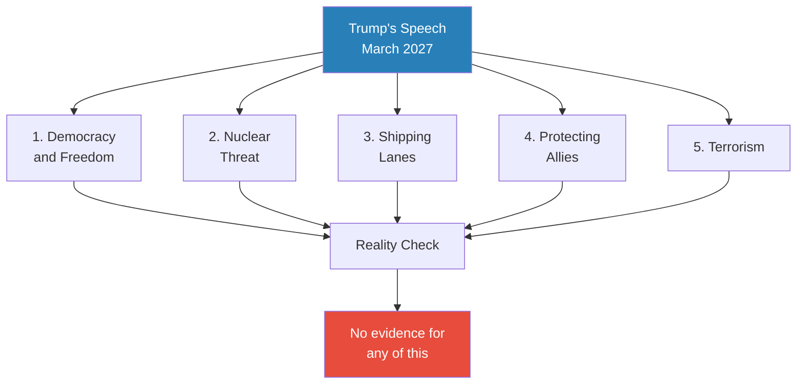

*Trump presents five justifications for war. Prof. Jiang emphasises: "When Trump gives a speech, there's absolutely no evidence that any of this is true." The nuclear claim — Iran is "one month from a bomb" — has been repeated for ten years.*

---

> [!tip] Core Insight
> The justifications for war do not need to be true. They need to be politically sufficient. The US cannot deploy the 3-4 million soldiers needed to conquer Iran — it has about 1 million total worldwide, roughly 60,000 in the Middle East. The fiction of a popular uprising is the only way to explain why 100,000 troops will succeed. And hubris makes the military believe it.

---

### The Invasion Unfolds

*Prof. Jiang describes the invasion as if watching it on television — deliberately choosing this framing to show how the spectacle of military power creates the illusion of inevitable victory.*

"We'll watch this on TV and the Internet together, on YouTube together, and we'll be so impressed by the power of the US military." This is Prof. Jiang's point — the invasion is designed to be televised. Shock and awe is inherently a television event. The supercarrier, the air supremacy, the massive troop deployment — all of it looks overwhelming on screen. And that is precisely the problem: the same spectacle that convinces the American public that victory is certain also convinces the military that their approach is working. The television is not a neutral medium — it actively produces the hubris that makes the trap possible.

The military spectacle is overwhelming:

- The USS Gerald R. Ford — a $13 billion supercarrier — enters the Strait of Hormuz to secure shipping
- <b style="color: #2980b9">Air supremacy</b> is established immediately — complete control of the skies; nothing can move without American detection
- A massive invasion force lands in southern Iran: approximately 100,000 US troops and 200,000 Saudi troops (200,000 to 500,000 total)
- The coalition establishes a foothold in the south
- Forces prepare to strike north toward Tehran

Prof. Jiang pauses and asks the class: <b style="color: #e74c3c">"At this point, I think the war has been decided. Who has won the war?"</b>

The students assume America.

"Obviously, this is a trick question. Obviously, Iran has won the war."

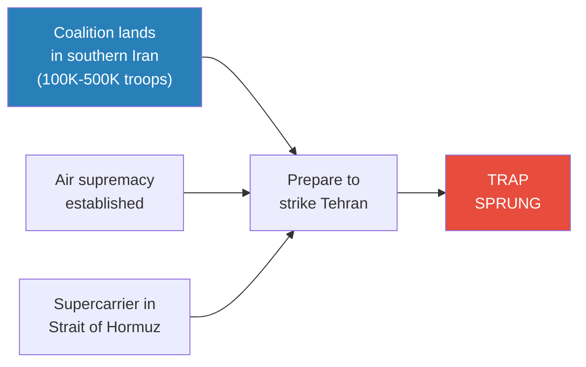

*The moment American troops enter Iran, the war is already decided — in Iran's favour.*

---

## Why the Invasion Has Already Failed

*Prof. Jiang returns to the three principles of traditional military doctrine — the same principles he introduced in Lecture 6 as the ones that shock and awe abandoned — and shows how the invasion violates all three simultaneously.*

### Principle 1: Avoid Encirclement — FAILED

- <b style="color: #e74c3c">Iran is all mountains — a natural fortress</b>
- To get troops into the country, you have to airdrop them — there is no overland route that avoids mountain passes
- But once they're in the country, you cannot get them out — the same mountains that let you in now surround you
- The geography does what an enemy army would normally have to do: it encircles the invasion force automatically, without Iran needing to deploy a single soldier
- The invasion force is encircled the moment it arrives — not by the enemy, but by terrain

### Principle 2: Mass Forces — FAILED

- Iran has a population of 90 million people
- You would need at least 3 to 4 million soldiers to even think about conquering the country
- The total US military is approximately 1 million soldiers worldwide, with roughly 60,000 in the Middle East
- The invasion scenario puts 100,000 US troops in-country — nowhere near enough to launch a strike against Tehran, let alone control the country
- Student Jack adds a crucial tactical point: tanks cannot move through mountains — they are not designed for mountain warfare
- Even if you could get more troops in, you cannot concentrate force effectively — the terrain fragments your army into isolated units in valleys and passes
- The numerical mismatch is staggering: 100,000 soldiers trying to control 90 million people in mountain terrain — a ratio of 1:900

### Principle 3: Protect Supply Lines — FAILED

- There are no supply lines to protect — there is no ground route for resupply through the mountains
- The only option is aerial resupply: aircraft must drop ammunition, food, water, and medical supplies into the country
- But Iran is all mountains, and <b style="color: #e74c3c">it is very easy for Iranians to shoot down aircraft flying over mountain passes</b>
- A single person with a rocket launcher can take down a helicopter from a concealed mountain position — "a random guy with a rocket launcher can just shoot down the helicopter"
- This is not hypothetical: it is exactly what the Afghan mujahideen did to the Soviets in the Afghanistan war, and it is why the Soviets lost
- Modern drones make the problem even worse — cheap drones can take down expensive aircraft
- The forces cannot be resupplied by any reliable means — they are cut off from ammunition, food, reinforcements, and medical evacuation

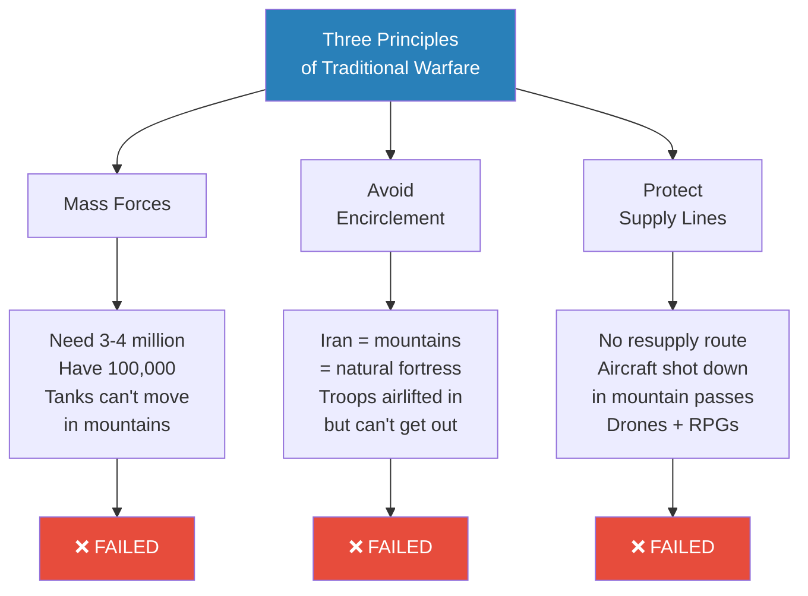

*The invasion violates all three inviolable principles of military doctrine simultaneously. The mountains are not a minor obstacle — they are the trap itself.*

---

### The Hostage Metaphor

Prof. Jiang delivers the lecture's most memorable line:

> "You think they're soldiers, but they're not. What they really are is hostages."

The inversion is complete:

- **Too many to evacuate** — you can't extract 100,000+ people from a mountain fortress
- **Too few to attack** — 100,000 vs. 90 million, with no ability to manoeuvre tanks through mountains
- **Unable to be resupplied** — every resupply aircraft is a target in the mountain passes
- **Encircled by Iranian forces** — the geography does the encirclement automatically

The invading army has been converted from the most powerful military force on Earth into a bargaining chip for Iran. The logic of the invasion assumed these troops would be the instrument of regime change — instead, they become the IRGC's greatest leverage. Iran does not need to defeat them militarily. It just needs to keep them trapped.

> [!tip] Core Insight
> The Iran Trap is not a military defeat in the conventional sense. It is a transformation: American military power, designed for open-field shock and awe, is rendered useless by geography. The troops are not destroyed — they are captured by terrain. And because they are alive, they cannot be abandoned, creating an indefinite drain on American resources and political will.

---

### The Afghan Precedent: Mountains as Graveyards of Empires

*Prof. Jiang invokes one specific historical example to demonstrate that mountain warfare destroys conventional armies — the Soviet-Afghan War.*

The Afghan parallel is not a full historical analogue like Syracuse, Vietnam, or Ukraine — it is a tactical demonstration of what happens when conventional forces enter mountain terrain:

- The Soviet Union invaded Afghanistan with a massive, technologically superior army
- The Afghan mujahideen had no air force, no navy, no tanks — just rifles and rocket launchers
- But Afghanistan is mountains — and in mountain passes, a single person with a rocket launcher can shoot down a helicopter
- The Soviets lost because they could not resupply their forces through mountain terrain
- "A random guy with a rocket launcher can just shoot down the helicopter — which is what the Afghans did against the Soviets in the Afghanistan war, and that's why the Soviets lost the war"
- <b style="color: #27ae60">Iran's terrain is the same — mountains upon mountains</b>
- Modern drones make the problem worse — they are cheaper and more effective than rocket launchers
- The resupply problem that destroyed the Soviets in Afghanistan will destroy the Americans in Iran

> [!example] The Soviet Lesson in Afghanistan
> - The Soviet Union invaded Afghanistan with overwhelming military superiority
> - Afghanistan's mountains made conventional warfare impossible
> - Individual fighters with portable rocket launchers shot down Soviet helicopters in mountain passes
> - The Soviets could not resupply their forces — every supply flight was a target
> - The war drained Soviet military and economic resources for a decade
> - The Afghan defeat contributed directly to the collapse of the Soviet Union
> - Iran's geography is identical: mountain fortress terrain that neutralises technological superiority
> **The lesson:** Mountains don't care how advanced your technology is. They care about line of sight, concealment, and gravity — and all three favour the defender.

---

## Why Iranians Will Not Support the Invasion

*The invasion plan rests on one critical assumption: that the Iranian people will rise up against the regime and welcome the Americans. Prof. Jiang systematically demolishes this assumption.*

Prof. Jiang identifies four reasons why Iranians will fight with their government, not against it — and why the assumption of a popular uprising is not just wrong but dangerously delusional:

- **The Shah's legacy (1953-1979)** — Iranians remember that the last time America was involved in their country, it was backing a brutal police state. The CIA staged a coup in 1953, overthrowing Iran's democratically elected government and installing the Shah. From 1953 to 1979, the American-backed Shah ran such a brutal police state that eventually the entire country revolted. This is not ancient history — people who lived through it are still alive. The students who stormed the US Embassy in 1979 discovered from reassembled shredded documents that the embassy was the real centre of power in Iran (as covered in [[07 - Who Killed Iranian President Ebrahim Raisi|Lecture 7]]). Iranians know what American "involvement" in their country actually means.
- **The Iraq example (2003-2011)** — Iranians do not need to rely on 1953 — they have a much more recent example. Iraq is the country next door. America invaded Iraq in 2003, promising freedom, democracy, and prosperity. Instead, "it just destroyed the country." Prof. Jiang is vivid: "American soldiers were running into houses every night, pointing guns at children, destroying homes and arresting men for no reason." Iranians saw all of this on television and heard about it from Iraqi neighbours and refugees who crossed the border. They know with certainty that when Trump promises to bring freedom and democracy to Iran, the reality will be destruction.
- **National pride** — Iranians think of themselves as belonging to a great civilisation — one of the oldest and most accomplished in human history. They value their freedom and independence deeply. "They're not going to submit to a foreign conqueror." This is not political ideology — it is cultural identity. Even Iranians who oppose the IRGC and want democratic reform would not welcome an American invasion.
- **Religion** — Iranians are deeply religious. They believe America is Satan — this is not metaphor for them but genuine theological conviction. They have a religious obligation to fight Satan. Combined with the Basij volunteer army from [[07 - Who Killed Iranian President Ebrahim Raisi|Lecture 7]] — poor, religious villagers given rifles and keys to heaven, willing to run into minefields — this creates an effectively unlimited supply of fighters with the will to die for their country and their God.

Prof. Jiang acknowledges that there may be a minority of Iranians who would support the Americans — the same cosmopolitan, educated population that has protested against the IRGC in 1999, 2009, and 2023. But a minority does not change the military calculus. <b style="color: #e74c3c">Most Iranians will resist, and those who don't resist won't actively support the invader.</b>

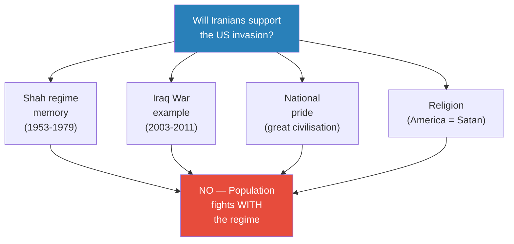

*The internal uprising assumption is propaganda, not strategy. Every historical and cultural factor points in the opposite direction.*

---

> [!example] The Iraq Mirror
> - America invaded Iraq in 2003, promising freedom and democracy
> - Instead, the country was destroyed over eight years of occupation
> - American soldiers conducted night raids — breaking into homes, pointing guns at children, destroying property, arresting men without cause
> - Iranians next door saw everything — on television, from refugees, from neighbours who crossed the border
> - They know exactly what an American "liberation" looks like — and it looks like destruction
> - When Trump promises to bring freedom and democracy to Iran, every Iranian thinks of what happened to Iraq
> **The lesson:** The gap between American rhetoric and American reality is visible to everyone in the region. Iraq is not a distant example — it is next door.

---

### Why America Does It Anyway

Two questions remain: why would American leaders believe Iranians will rise up? And do they actually believe their own propaganda?

- **The justification problem** — The US knows it needs 3-4 million soldiers but has only about 1 million total worldwide (roughly 60,000 in the Middle East). The only way to explain how 100,000 troops will succeed is to claim the population will join them. "It's not based on truth, but it's an explanation for why the invasion will succeed."
- **Hubris makes you believe** — When you have access to nuclear weapons, can kill anyone in the world, can see everything from satellites — <b style="color: #e74c3c">"it makes you think you're God."</b> Prof. Jiang invokes the Greeks from the Civilization series: "The Greeks believe the worst thing is hubris, because it makes you think you're God, but you're not God, and you're going to get into a lot of trouble if you think you're God."

On the nuclear bomb claim — that Iran is one month away from having nuclear weapons — Prof. Jiang notes: "America has been saying this for the past ten years." There is no evidence. Even if Iran possessed a nuclear bomb, it would not use it, because <b style="color: #27ae60">nuclear weapons are what Iran fears most</b> — the only way America can definitively win is by nuking the country.

---

## Validating the Scenario: Two Methods of Analysis

*The hypothetical scenario has been laid out — 100,000 US troops trapped in Iranian mountains. But is this plausible? Or is it just speculation? Prof. Jiang introduces two rigorous methods to test whether the scenario could actually happen.*

Prof. Jiang explains that there are two ways to validate a speculative scenario:

- **Method 1: Historical analysis** — Are there historical examples that are similar to this? If there are, then the scenario could be true, because it has happened before under analogous conditions.
- **Method 2: Game theory analysis** — Why would rational actors — who are trying to optimise their individual outcomes — do something as seemingly stupid as trapping 100,000 American soldiers in Iran? If you can show that each actor's rational self-interest leads to this outcome, the scenario is plausible despite appearing irrational.

Prof. Jiang uses both methods. Historical analysis comes first (three precedents), followed by game theory (four actors' motivations). Together they provide convergent evidence: the scenario is not only possible — it is the most likely outcome when you examine both the historical pattern and the strategic incentives.

---

### Historical Analysis: Three Precedents

### The Sicilian Expedition (415 BCE)

*The first and most ancient precedent — an empire addicted to easy money sends a massive force to a distant land and loses everything.*

> [!example] Athens Invades Sicily (415 BCE)
> - Athens has been fighting Sparta for seventeen years — a brutal, stalemated war
> - Alcibiades proposes a solution: invade Sicily and take Syracuse's money
> - The Athenians are enthusiastic — they have become addicted to the easy money of empire
> - Nicias tries to prevent the war by demanding an absurdly large force: 5,000 soldiers and 100 ships (from a total Athenian population of about 50,000)
> - His plan backfires — the Athenians say "great idea" and approve the massive expedition
> - Critical problem: Athens has never fought an expeditionary foreign war — only defensive wars against Persia
> - Nobody thinks about resupply
> - First year: Athenians destroy the Syracuse army, which retreats behind city walls; Athenians lay siege, controlling the sea
> - Then: Syracuse's navy cuts the Athenian supply lines
> - The entire Athenian army is wiped out in Sicily
> - Consequence: Athens loses the Peloponnesian War and the Athenian Empire collapses
> **The lesson:** Hubris and addiction to empire drive expeditionary adventures. The failure to think about resupply — because you've never fought this kind of war before — is catastrophic.

The parallels to Iran are direct and devastating:

- An empire addicted to easy money (Athens = America — both derive power from controlling money flows, not from production)
- Hubris from past victories (Athens had never really lost a war = US shock-and-awe confidence from 1991 and 2003)
- A massive expeditionary force sent far from home with overwhelming confidence
- No experience with this kind of war (Athens had only fought defensive wars against Persia — it had never projected force abroad. The US has never invaded a mountainous country of 90 million people.)
- <b style="color: #e74c3c">The fundamental failure: resupply</b> — the problem nobody thinks about because they've never had to think about it before
- The result: total loss of the expeditionary force → collapse of imperial power
- The Nicias irony: the one man who tried to prevent the war by making the cost seem too high actually made it happen — the Athenians saw his massive force requirement as a guarantee of success, not a warning. This mirrors how American military spending and technological superiority function as reassurance rather than deterrence.

Prof. Jiang's verdict: "Historians have been trying to figure out for a long time why the Athenians would do such a stupid thing as to send a huge army against Syracuse, because the risk of failure was catastrophic. And the only answer is, well, the Athenians had hubris." And then the devastating parallel: <b style="color: #27ae60">"Which is the same situation America finds itself in today."</b>

Prof. Jiang connects this directly to the Civilization series from the previous semester — the same hubris that destroyed Athens is a fundamental feature of human nature that the Greeks understood better than any civilisation before or since.

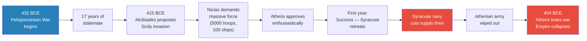

*The Sicilian Expedition follows the exact trajectory Prof. Jiang predicts for Iran: initial success, supply line failure, total loss, imperial collapse.*

---

### The Vietnam War (1960s)

*The modern precedent — mission creep, the sunk cost fallacy, and a military that knew it was losing but couldn't stop.*

> [!example] Vietnam: From Obscurity to Catastrophe (1960-1971)
> - In 1960, most Americans had never heard of a country called Vietnam
> - By 1969, half a million American soldiers were in the country
> - 58,000 US soldiers died; 3 million Vietnamese were killed
> - The US dropped more bombs in Vietnam in the 1960s than all bombs dropped in World War II combined
> - Despite this overwhelming firepower, the war could not be won
> - The Pentagon Papers (1971) revealed three devastating truths:
>   - **Mission creep**: military leadership expanded the war without public knowledge — observers became advisors became trainers became combat troops
>   - **Known unwinnable**: leadership knew from very early on the war could not be won
>   - **Will to fight**: killing 3 million Vietnamese did not destroy the enemy's will to fight — it made them angrier, producing more fighters
> **The lesson:** Even when leadership knows a war is unwinnable, the sunk cost fallacy prevents withdrawal. "Eventually you've invested so much you cannot leave."

Prof. Jiang introduces <b style="color: #2980b9">the three conditions for winning a war</b> through the Vietnam example. If you want to evaluate any war and predict the winner, you ask three questions about each side:

- **Clear strategy/objectives** — What are you trying to accomplish in this country? What are your clear military objectives? Everyone involved must understand them. The US never had clear military objectives in Vietnam — it was never able to articulate what "winning" would look like in concrete terms.
- **Adaptation to the battlefield** — "The adversary that is most willing to adapt to a battlefield will win." All plans change on contact with reality. The side that adjusts fastest wins. The US refused to adapt — it kept applying the same overwhelming firepower approach despite clear evidence it wasn't working. It dropped more bombs in Vietnam in the 1960s than all bombs dropped in World War II combined — and it could not win.
- **The will to fight** — This is the most important condition. Even though America was killing 3 million Vietnamese, it was not destroying the enemy's will to fight. In fact, the killing was making them angrier and producing more fighters. Every village America destroyed created new recruits for the other side.

If all three conditions are met, you will most likely win the war. In Vietnam, America failed all three. The Iranian scenario will replicate this failure — the US will have unclear objectives beyond "topple the regime," will refuse to adapt from shock and awe to mountain warfare, and will face an enemy with essentially unlimited will to fight (the Basij's religious motivation from [[07 - Who Killed Iranian President Ebrahim Raisi|Lecture 7]]).

---

### The Sunk Cost Fallacy: Why You Never Leave the Casino

*The cognitive mechanism that turns small military commitments into catastrophic, inescapable ones.*

> [!abstract] The Sunk Cost Fallacy — The Casino Analogy
> Prof. Jiang's metaphor: "Never, ever go into a casino. The reason why is that, when you go to a casino, you start losing money. At some point you cannot leave the casino. Why not? Because you want to reclaim the money you've lost. You've invested so much that you cannot leave. You have to get that money back. That's the problem with war. Eventually you've invested so much you cannot leave the war, and that's what happened in Vietnam. America invested so much it didn't want to leave the war because it did not want to admit that all this has been lost."
>
> The sunk cost fallacy is not irrational — it is a predictable cognitive bias that turns small commitments into catastrophic ones. Vietnam is the proof. Iran will be the repetition.

Prof. Jiang adds a second dimension beyond psychology — <b style="color: #2980b9">credibility</b>:

- America stayed in Vietnam not just because of sunk costs, but because withdrawal meant losing face
- The US didn't want to be laughed at by the Chinese, the Soviets, and the Europeans
- Credibility is the geopolitical version of the sunk cost fallacy — you keep fighting not because you can win, but because you can't afford to be seen losing
- In the Iran scenario, this dynamic will be even stronger: Trump as a TV personality cannot accept looking weak on camera. He will pour in more troops rather than admit defeat.

---

### The Russia-Ukraine War (2022-)

*The most recent precedent — a TV-personality leader makes strategically suicidal decisions because they look good on camera, while extremists and foreign advisors push for maximum escalation.*

> [!example] Ukraine's Strategic Suicide (2022-present)
> - February 2022: Putin orders a "special military operation" — three axes of attack: North (Kyiv), East (Donetsk), South (from Crimea)
> - The North fails; the East and South succeed
> - Using traditional military doctrine, there is only one way Ukraine can fight and win: **retreat**
> - Pull back forces, let the enemy overextend into Ukraine's vast territory, outrun their supply lines (~160,000 soldiers is not enough for such a huge country), then encircle and cut supply
> - What Ukraine actually did: fought for every inch of territory, refusing to give ground
> - Then launched a summer counteroffensive — sending hundreds of thousands of soldiers against three lines of Russian artillery fortifications
> - "The Russians blew everyone up"
> - Result: Ukraine has no more soldiers; average age of the Ukrainian army is over 40; soldiers in their 60s and 70s; the war is lost
> **The lesson:** Strategic thinking requires accepting short-term losses for long-term victory. TV personalities — Zelensky and Trump alike — cannot do this because retreat looks bad on camera.

Prof. Jiang identifies three causes of Ukraine's failure, each of which maps directly onto the Iran scenario:

- **Zelensky is a TV actor** — he thinks about what looks good on television, not what actually works. For the first two years of the war, people in the West were saying Ukraine was going to march to Moscow and overthrow Putin. That narrative was shaped by Zelensky's mastery of public image manipulation — "he was distorting reality for people through television." The problem: "the reality on the ground is very different from TV." The military situation was never as favourable as it appeared on screen.
- **Extremists in the Ukrainian military** — Prof. Jiang identifies Neo-Nazi elements who hate Russia and push for maximum war. He clarifies the Russian understanding of the term: Russians do not define Nazis primarily as "people who kill Jews" — they define Nazis as "enemies of Russia who want to kill Russians," because the Soviet-German war shaped Russia's national identity. These extremists want as much war as possible and resist any strategic retreat.
- **NATO advisors** — It is an open secret that NATO military advisors are in Ukraine devising strategy against Russia. The summer counteroffensive was most likely a NATO plan, not a Ukrainian plan. NATO special forces are in-country directing missile strikes against Russian forces. This matters because it means a foreign power — not the country actually fighting — is determining strategy.

The critical comparison: <b style="color: #e74c3c">"Trump is exactly like Zelensky."</b>

- Both are TV personalities who care about looking strong on camera rather than thinking strategically
- Both will make decisions that look impressive (massive invasions, shock-and-awe spectacles, dramatic announcements) without understanding the strategic consequences
- Zelensky fought for every inch of territory because retreat looks bad on TV — Trump will launch an invasion because supercarriers and air supremacy look good on TV
- Neither man is a strategist; both are performers
- The audience for the performance is the domestic public, but the consequences are paid for by soldiers on the ground

Prof. Jiang's prediction for NATO escalation: if Ukraine runs out of soldiers (which is already happening — the average age of the Ukrainian army is over 40), NATO will send its own troops. This follows the same pattern as Vietnam — mission creep driven by sunk cost:

- Macron has publicly said France wants to send French soldiers to Ukraine
- The British Prime Minister has said he is considering conscription for British citizens — drafting young people into the army to fight Russia
- The escalation spiral is identical to Vietnam: observers → advisors → trainers → special forces → combat troops → conscription

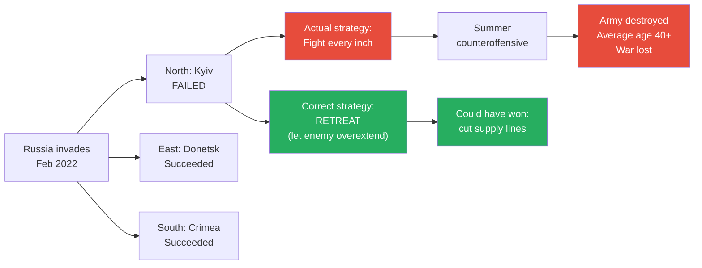

*Ukraine had one correct strategy — retreat and let Russia overextend — but chose the TV-friendly strategy of fighting for every inch. The result: military destruction.*

---

### The Pattern Across 2,400 Years

All three historical analogues demonstrate the same cycle:

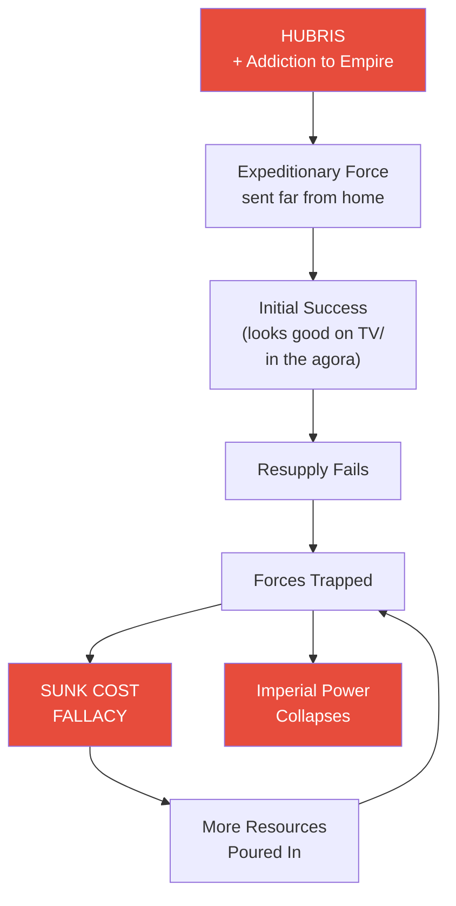

*The cycle repeats: hubris drives overextension, resupply fails, troops are trapped, the sunk cost fallacy prevents withdrawal, and imperial power drains away. Athens learned this in 413 BCE. America learned it in Vietnam. It is about to learn it again in Iran.*

Prof. Jiang's implicit argument is not that "history repeats itself" — that would be a cliche. His argument is more structural: <b style="color: #27ae60">the cognitive biases that produce imperial self-destruction (hubris, sunk cost, credibility anxiety) are permanent features of human psychology.</b> They do not change with technology, political systems, or historical era. A democratic Athens, a Cold War America, and a 21st-century Ukraine all fall into the same trap because the trap is inside the human mind.

The common thread across all three examples:

- **The dominant power has a track record of success** — Athens had never lost, America's shock and awe was undefeated, Ukraine's TV narrative showed winning
- **The dominant power sends forces far from home without thinking about resupply** — this is the one problem they never consider because they've never had to
- **Initial success reinforces the delusion** — the first year in Sicily went well, the first weeks of shock and awe are always impressive, early Ukrainian resistance looked heroic
- **Then resupply fails** — and the initial success turns into a death sentence because the troops are now deep in enemy territory with no way home
- **The sunk cost fallacy prevents withdrawal** — too much has been invested; leaving means admitting it was all wasted
- **The result is collapse** — not a negotiated withdrawal, not a partial defeat, but the total destruction of expeditionary power and often the decline of the empire itself

> [!abstract] Three Historical Analogues Compared
> | Dimension | Athens/Sicily (415 BCE) | US/Vietnam (1960s) | Russia/Ukraine (2022) |
> |-----------|----------------------|-------------------|---------------------|
> | **Driver** | Addiction to empire money | Mission creep + credibility | TV personality + extremists |
> | **Overconfidence** | Never lost a war | Shock and awe | "March to Moscow" narrative |
> | **Supply failure** | Syracuse navy cut lines | Could not sustain 500K troops | Ukraine could not sustain counteroffensive |
> | **Sunk cost** | Too invested to withdraw | "Can't admit it was all for nothing" | NATO escalation |
> | **Outcome** | Entire army wiped out; empire collapsed | 58,000 dead; withdrawal in defeat | Army destroyed; average age 40+ |
> | **Key mistake** | No experience in expeditionary war | Failed all three conditions for victory | Fought for every inch instead of retreating |

---

## Game Theory Analysis: Why Every Actor Wants Invasion

*Prof. Jiang shifts from historical analysis to game theory — examining why each major actor would rationally choose invasion despite the obvious risks.*

### The Actors and Their Motivations

*Prof. Jiang teaches game theory as the analysis of rational actors optimising their individual outcomes. The key insight: society is "a game among human beings, and each person is trying to play this game to optimise the outcome for that person." The question is not what each actor says they want — it is what outcome is optimal for each actor.*

Prof. Jiang examines the rational self-interest of each participant:

- **United States** — Wants to topple the regime in Tehran. This can only be accomplished through a ground invasion. Air strikes, sanctions, and covert operations cannot change a regime — you need troops on the ground to install a new government. This is why the invasion must happen despite the risks.
- **Iran (IRGC)** — Wants to kill as many Americans as possible. Wants to force a US land invasion knowing that if the US invades, it has to lose the war — because the Revolutionary Guard can send suicide bombers against United States forces indefinitely. The goal is threefold: humiliate America, exact revenge for what happened under the Shah, and avenge Soleimani's assassination. The IRGC does not fear mass Iranian casualties — the Basij volunteer army (from [[07 - Who Killed Iranian President Ebrahim Raisi|Lecture 7]]) provides an effectively unlimited supply of religiously motivated fighters willing to die.
- **Israel** — This is where the game theory becomes most revealing. Israel's stated goal is to defeat Iran and destroy its proxies (Hezbollah, Hamas, Houthis). But the optimal outcome is more subtle: <b style="color: #27ae60">Israel benefits most if BOTH Iran and the United States are destroyed as powers in the Middle East.</b> If Iran is defeated, Israel's proxies problem is solved. But if America's military presence also collapses, Israel becomes the sole dominant power in the entire region. "Israel can now control the entire Middle East." This is the game theory insight that reframes the entire series — Israel is not an ally seeking American victory; Israel's optimal outcome is mutual US-Iran destruction.
- **Saudi Arabia** — Exactly the same optimal outcome as Israel — both Iran and the US weakened leaves the Middle East to Saudi Arabia and Israel. But there is a crucial asymmetry: Israel has far superior military capability. Saudi Arabia's oil fields are concentrated and easy to destroy; Israel is not easy to destroy. In the post-war Middle East, Israel becomes "top dog" and Saudi Arabia becomes the junior partner. Saudi Arabia may not realise this — or may accept it as better than the current alternative of living under Iranian existential threat.

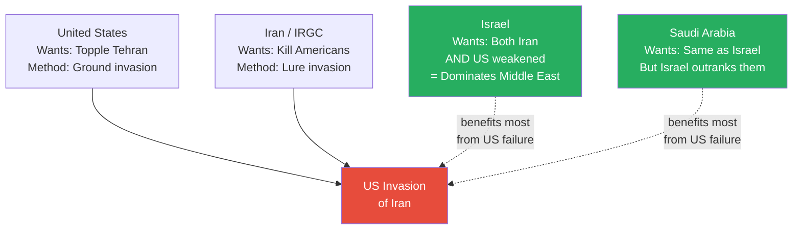

*Game theory reveals the devastating truth: all four major actors want the invasion to happen — but for incompatible reasons. The US is the only participant that doesn't benefit from the trap.*

Prof. Jiang summarises: "In other words, all the major participants want an invasion of Iran, but they want different outcomes." This is the game theory insight that ties the entire series together — it is not a conspiracy but a convergence of rational self-interest. Nobody needs to coordinate. Nobody needs to scheme. Each actor, pursuing its own optimal outcome independently, produces the same result: an American invasion of Iran that becomes a strategic black hole.

The question "who benefits from 100,000 US troops trapped in Iran?" has a clear answer: everyone except the United States.

- Iran benefits from humiliating America and exacting revenge
- Israel benefits from becoming the Middle East's dominant power
- Saudi Arabia benefits from eliminating the Iranian existential threat
- Russia benefits from draining American military and economic power (Lecture 9 will explain how)
- Even China benefits — America's manufacturing deficit means it depends on Chinese production, and a prolonged war accelerates American economic decline

The only actor that does not benefit is the one making the decision to invade.

> [!tip] Core Insight
> The game theory analysis reveals that America's "allies" — Israel and Saudi Arabia — benefit most from American failure. Saudi Arabia and Israel's optimal outcome is 100,000 US troops trapped in Iran, triggering the sunk cost fallacy that forces America to pour in all its resources. "It becomes a black hole." The Middle East is then left to Israel and Saudi Arabia — with Israel as the clear dominant power. The alliance that pushes America to war is not an alliance at all — it is a mechanism for American self-destruction.

---

## The Nuclear Question and Russia's Role

*The final piece of the trap. A student (Celine) asks the pivotal question: the United States has nuclear weapons. Can't Trump just threaten to nuke Iran?*

Prof. Jiang concedes — this is exactly what will happen. He walks through the scenario step by step:

- Trump has 100,000 troops trapped in Iran — they can't get out, they can't be resupplied, they can't advance
- Trump needs to look strong — "I'm Donald Trump. I need to look strong. I have 100,000 troops in the country. I can't get them out of the country."
- He tells Tehran: "You either guarantee safe passage out of the country, or I will nuke the entire country."
- This is not bluster — Trump has nuclear weapons and the personality type that would use them
- <b style="color: #e74c3c">The nuclear threat is the only card America has left to play</b>

How does Iran protect itself against this ultimate threat? <b style="color: #2980b9">Russia's nuclear guarantee.</b>

- Before the war begins, Iran and Russia must come to a pre-war agreement
- Putin declares from the outset, publicly and clearly: **no one is allowed to use nuclear weapons**
- The declaration is symmetrical and universal: "If Iran uses nuclear weapons, I will nuke Iran. If the United States uses nuclear weapons, I will nuke the United States. If Israel uses nuclear weapons, I will nuke Israel."
- This is not a pro-Iran statement — it is a pro-humanity statement
- If Putin makes this declaration, how will the world react? Prof. Jiang asks the students. The answer: "He's a hero. He saved humanity."
- Putin wins the global public opinion war — he is the man who prevented nuclear apocalypse
- But the consequence for America: the United States is now completely trapped. No nuclear escalation is possible without triggering Russian retaliation.

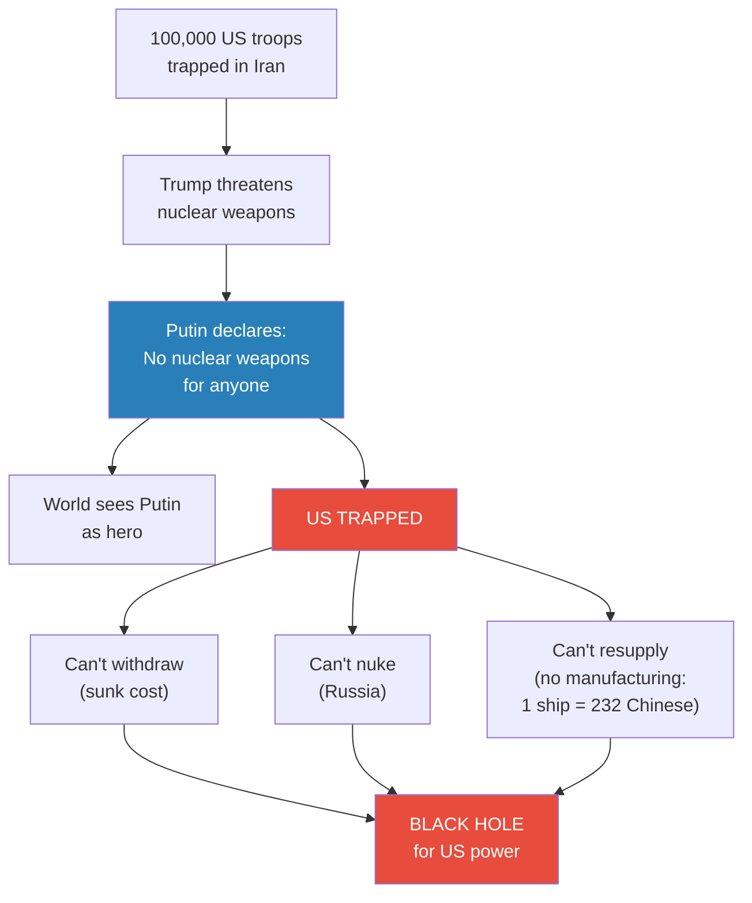

*Russia's nuclear guarantee closes the last escape route. The US cannot withdraw (sunk cost), cannot escalate (Russia), and cannot resupply (no manufacturing capacity). The result is a strategic black hole.*

---

### The Manufacturing Deficit

Prof. Jiang adds one more element that seals the trap: <b style="color: #e74c3c">America has no manufacturing capacity.</b>

This is the thread that connects back to [[03 - How Empire is Destroying America|Lecture 3]] on empire economics — and it is the final irony that makes the trap inescapable:

- "For every one ship that America can build, China can build 232 ships. That's what the Pentagon says."
- This is not speculation — it is the Pentagon's own assessment of America's manufacturing deficit
- America moved all its manufacturing capacity to China over decades — chasing lower costs and higher profits
- The empire economics of Lecture 3 produced this result: Wall Street got rich, but the factories that build tanks, bullets, ships, and aircraft are now in a competitor's country
- Even if the US could somehow recruit enough soldiers, it cannot produce the ammunition, equipment, and supplies to sustain a prolonged war
- The bullets run out. The replacement parts run out. The vehicles run out. And you cannot build more fast enough.
- The empire economics that drove America toward war have simultaneously destroyed its ability to fight one

> [!example] The 1:232 Ratio
> - The Pentagon's own assessment: America can build one ship for every 232 that China can build
> - America moved its manufacturing capacity overseas over decades — pursuing the easy money of financial engineering rather than the hard work of production
> - This is the final consequence of empire economics from [[03 - How Empire is Destroying America|Lecture 3]] — easy money replaced hard production
> - In a sustained war requiring continuous resupply of ammunition, food, medical supplies, vehicle parts, and replacement weapons, America physically cannot produce what it needs
> - The factories that would build these things are in China — America's strategic competitor
> - The irony is devastating: the addiction to empire that drove America to war also destroyed its ability to fight one
> - Athens had the same problem in Sicily — an empire built on tribute and trade, not production, that could not sustain a distant war
> **The lesson:** You cannot run an empire on financial engineering alone. When the moment comes to produce real military materiel at scale, the factories are in your adversary's country. The empire consumed its own foundation.

---

### The Three Locks: Why the Trap Has No Exit

The Iran Trap is secured by three locks, each closing a different escape route:

- **Lock 1: Sunk Cost Fallacy (Political Lock)** — Once troops are committed, withdrawal is politically impossible. No president — especially a TV personality like Trump — can admit that 100,000 American soldiers were sent into a trap for nothing. The only politically acceptable option is to send more. But "more" doesn't help — it just deepens the trap. This is the casino you can never leave.
- **Lock 2: Russia's Nuclear Guarantee (Military Lock)** — The one weapon that could break the military stalemate is nuclear weapons. Putin's pre-war declaration closes this option. America cannot escalate to nuclear weapons without triggering Russian retaliation — which would be planetary suicide. The nuclear card is neutralised before it can be played.
- **Lock 3: Manufacturing Deficit (Industrial Lock)** — Even sustained conventional warfare requires an industrial base to produce ammunition, replacement equipment, and supplies at scale. America no longer has this base. The Pentagon's own figures show a 1:232 ship production ratio with China. America cannot out-produce its way out of the trap because the factories that would build the weapons are in its competitor's country.

Each lock addresses a different type of escape:

- Sunk cost blocks the **political** escape (withdrawal)
- Russia blocks the **military** escape (nuclear escalation)
- Manufacturing deficit blocks the **logistical** escape (sustained fighting)

The locks work together — breaking any one of them would open an exit:

- If you could accept the political cost of withdrawal, the troops could be evacuated
- If you could use nuclear weapons, the military stalemate could be broken
- If you could produce unlimited ammunition and equipment, the forces could fight indefinitely

But none can be broken. The sunk cost fallacy is a cognitive bias hardwired into human psychology. Russia's nuclear arsenal is a physical reality. The manufacturing deficit is a structural consequence of thirty years of deindustrialisation.

<b style="color: #e74c3c">All three locks must be broken to escape the trap. None can be.</b>

---

### Why Would Putin Do This?

Prof. Jiang raises but does not answer the critical question: why would Putin involve himself?

- Why would Russia risk direct confrontation with the United States over Iran?
- What does Putin gain from guaranteeing no nuclear weapons?
- How does this serve Russian strategic interests?
- Is the Russia-Iran pre-war agreement already in place — or is it still to come?

These questions are not rhetorical. They are the bridge to the next phase of the series:

- The Iran arc (Lectures 1-8) is now complete. It has demonstrated: (a) three forces push America toward war; (b) Trump and Kushner will implement it; (c) the military's hubris means they will agree; (d) the IRGC wants the invasion; (e) Iran's geography makes it a trap; (f) the sunk cost fallacy and manufacturing deficit prevent escape; and (g) only Russia's nuclear guarantee closes the last exit
- But the entire trap depends on one assumption: that Russia will cooperate
- If Putin does not declare nuclear non-use, Trump can threaten to nuke Iran, and the dynamics change entirely
- Russia is therefore not an observer — it is the keystone of the trap
- Without Russia, the trap has an escape route. With Russia, it doesn't.

<b style="color: #2980b9">"And that's what we'll discuss next class — how Putin sees this war, and how Putin will react."</b> The series pivots from the Iran arc (Lectures 1-8) to the Russia arc (Lectures 9-10). The question is no longer whether America will walk into the trap — it is whether Russia will lock the door behind it.

---

## The Iraq Staging Question

*A final student question probes whether the US could avoid the mountain trap by staging the invasion from neighbouring Iraq — using it as a land base to bypass the need for airlift.*

Prof. Jiang addresses this methodically, showing that the Iraq option fails at every level:

- **Sovereignty problem** — Iraq is an independent country. There are about 10,000 American soldiers there, but you would need Iraqi government permission to launch an invasion from their territory. That permission is not guaranteed.
- **Internal enemy problem** — Even with official permission, there are large numbers of Shia militiamen in Iraq who are loyal to Iran and still deeply angry about what America did to their country from 2003 to 2011. These militias are part of the Axis of Resistance that the IRGC built (from [[01 - Iran's Strategy Matrix|Lecture 1]]). They would see a massive American invasion force staging in Iraq as an opportunity to attack the Americans — opening a second front that the US cannot afford.
- **The mountain problem remains** — Even if Iraq could be used as a staging area, the forces still have to cross into Iran. And Iran's western border with Iraq is... mountains. "They still have to deal with mountains." Going through mountain passes means ambushes from concealed positions. Going by air means drones and rocket launchers strike you down.
- **The extraction problem** — Even if you somehow got troops in through Iraq, you still have 100,000 troops in the country that need to get out. "You have 100,000 troops in the country, you have to get them out of the country. If you go through the mountains, you're going to get ambushed. You go by air, those drones are gonna strike you down."

There is no workaround. The geography is the trap, and geography does not change.

This final Q&A exchange encapsulates the lecture's central argument: every attempt to solve one problem in the Iran scenario creates another. Stage from Iraq? Shia militias attack you. Fly over mountains? Drones shoot you down. Use nuclear weapons? Russia retaliates. Withdraw? Sunk cost fallacy. The trap is not a single vulnerability — it is a comprehensive system where each escape route leads to a new trap. <b style="color: #e74c3c">This is by design.</b> The IRGC has spent decades preparing for exactly this scenario. The Axis of Resistance in Iraq, the Basij volunteers, the mountain terrain, the Russian alliance — each element was built to close a different exit. The Iran Trap is not an accident of geography. It is a strategy that uses geography as its foundation.

> [!tip] Core Insight
> The Iran Trap has no workaround. Staging from Iraq doesn't solve the mountain problem. Air supremacy doesn't solve the resupply problem. Nuclear weapons don't solve the Russia problem. Special forces don't solve the mass forces problem. Every American strength is neutralised by the specific conditions of Iranian geography and the strategic arrangements the IRGC has made. The trap is not a single vulnerability — it is the comprehensive negation of every American advantage.

---

## The Complete Trap: A Concept Map

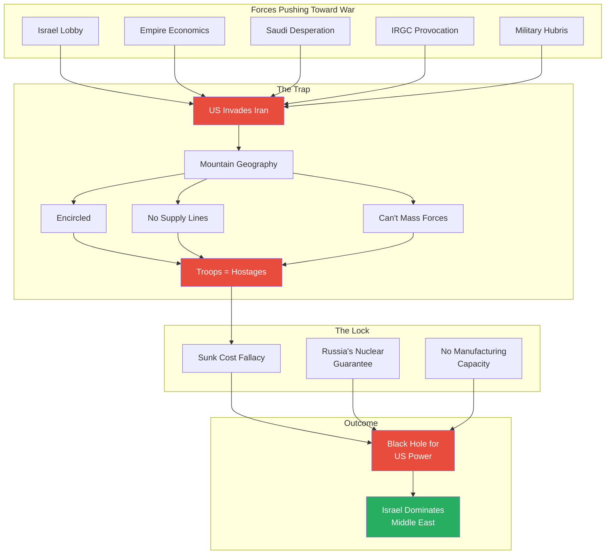

*The complete Iran Trap: five forces push America into invasion, geography creates the trap, and three locks (sunk cost, Russia, manufacturing deficit) prevent escape. The true beneficiary is Israel.*

---

## Three Conditions for Victory Applied to Iran

*Prof. Jiang's framework from the Vietnam discussion, applied to the hypothetical Iran war.*

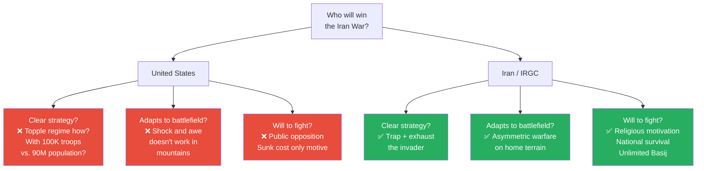

*Applied to the Iran scenario: the US fails all three conditions for victory. Iran meets all three. The outcome is not in doubt — it is structurally determined before the first shot is fired.*

The asymmetry is total. The US fights because of hubris, pressure from lobbies, and a president who wants to look good on TV. Iran fights because of religion, national survival, and 70 years of accumulated grievance against American interference. One side fights for image; the other fights for existence. There is no scenario in which the image-driven side out-persists the survival-driven side.

> [!warning] Critical Caveat
> Prof. Jiang is explicit throughout the lecture: he has never said Iran will win the war. He has said the US will lose it. The distinction matters enormously. Iran will suffer catastrophically — tens of millions may die (as he noted in [[07 - Who Killed Iranian President Ebrahim Raisi|Lecture 7]]). The country will be devastated. The IRGC's politicians — Raisi and his allies — understood this, which is why they counselled restraint. The Iran Trap is not a victory for Iran; it is a catastrophe for both sides, from which only bystanders (Israel, Saudi Arabia) benefit. The IRGC pursues it anyway because revolutionary fanaticism values honour and revenge above survival.

---

## Connections

**Builds on:** [[01 - Iran's Strategy Matrix]] (asymmetric warfare — inferior force controls terms of engagement; the Iran Trap is asymmetric warfare at its fullest expression), [[06 - America's Imperial Hubris]] (shock and awe doctrine, the three military principles, hubris as institutional blindness; this lecture shows those principles violated simultaneously), [[07 - Who Killed Iranian President Ebrahim Raisi]] (IRGC provocation strategy — the four escalation paths that trigger the invasion; the political class vs. military class dynamic that removes restraint on war)

**Sets up:** [[09 - Putin's War for the Soul of Russia]] (the critical unanswered question — why would Putin guarantee no nuclear weapons? How does Russia benefit from the US-Iran trap? The series pivots from Iran to Russia)

**Related books in vault:** [[The 33 Strategies of War - Robert Greene]] (expeditionary warfare failure patterns, the danger of overextension — Greene's treatment of the Sicilian Expedition directly parallels Prof. Jiang's usage), [[The 48 Laws of Power - Robert Greene]] (Law 47 — Do Not Go Past the Mark You Aimed For — the sunk cost fallacy as a law of power; the Athens-Syracuse example appears in Greene's work as a warning against overreach), [[Thinking Fast and Slow - Daniel Kahneman]] (sunk cost fallacy as cognitive bias; System 1 thinking drives hubris — the military's fast, intuitive judgment that shock and awe will work overrides the slow, analytical assessment that mountains change everything)

---

## The Hubris Loop: From Greeks to Americans

*The deepest thread in the lecture — and possibly the entire series — is the idea that hubris is not a personality flaw but a structural feature of imperial power.*

Prof. Jiang explicitly invokes the Greek concept of hubris, connecting the Geo-Strategy series to the Civilization series from the previous semester:

- The Greeks believed the worst thing that could happen to a person — or a civilisation — was hubris
- Hubris means thinking you are God when you are not
- When you have nuclear weapons, when you can kill anyone in the world, when you can see everything through satellites — "it makes you think you're God"
- But you're not God, "and you're going to get into a lot of trouble if you think you're God"
- The Athenians had hubris when they invaded Sicily — they had never lost a war, so they couldn't imagine losing
- The American military has hubris from shock and awe — they defeated Saddam in 100 hours and three weeks, so they think they can defeat anyone in two weeks
- Biden had hubris when he acknowledged losing against the Houthis but continued the same approach — refusing to accept limitations even when they are proven

The structural nature of hubris is what makes it inescapable:

- Hubris is not a choice — it is the natural psychological consequence of sustained power
- The more powerful you are, the more certain you become that you cannot be defeated
- <b style="color: #e74c3c">That certainty is itself the defeat</b> — because it prevents the adaptation that is the only path to victory
- The three conditions for winning a war require clear strategy, adaptation, and will to fight — but hubris destroys the second condition (adaptation) by making the powerful side unable to imagine that its approach might not work
- This is why the same pattern repeats across 2,400 years: Athens, Vietnam, Ukraine, Iran — different technologies, different geographies, same human blindness

---

## The Takeaway

This lecture is the series' gravitational centre — the lecture everything has been building toward since the first class. Every thread from Lectures 1 through 7 converges into a single scenario that is both speculative and terrifyingly logical. Prof. Jiang is careful throughout to label this as speculation — "most of it is speculation," he says — but the speculation is grounded in seven lectures of structural analysis. He does not claim to predict the future with precision; he claims to show that the structural forces, cognitive biases, and strategic incentives all point in the same direction. The Israel lobby, empire economics, Saudi desperation, Kushner's personal connections, military hubris, and IRGC provocation are not independent phenomena — they are interlocking gears in a machine that produces invasion. The question is not whether the forces exist (seven lectures established that they do) but whether anything can stop the machine from running.

What makes this lecture different from the previous seven is its method. Lectures 1-7 each built a single argument — one force, one dynamic, one actor. Lecture 8 integrates all of them into a single war-game scenario and then validates the scenario through two independent analytical methods (historical analogy and game theory). The convergence of both methods on the same conclusion — that the invasion will happen and will fail — is what gives the lecture its power.

The most counterintuitive insight is the game theory revelation about America's allies. The conventional narrative assumes Israel and Saudi Arabia want America to win a quick, decisive war against Iran. Prof. Jiang shows the opposite: both allies benefit most from American failure. A US-Iran war that destroys both participants leaves the Middle East to Israel and Saudi Arabia — with Israel as the dominant power. The "allies" are not allies at all; they are beneficiaries of the trap. This reframes the entire series: the forces pushing America toward war are not just pushing America toward a difficult conflict — they are pushing America toward self-destruction, and the pushers know it.

The historical analogues provide the lecture's most sobering dimension. The Sicilian Expedition happened 2,400 years ago, and historians are still asking why Athens would do something so obviously suicidal. The answer — hubris and addiction to empire — is the same answer Prof. Jiang gives for America. Vietnam happened within living memory, and the Pentagon Papers proved that leadership knew the war was unwinnable while continuing to fight it. The Russia-Ukraine war is happening right now, demonstrating in real time how TV-personality leadership, extremist pressures, and foreign advisory interference produce strategic catastrophe. Prof. Jiang's implicit argument is not that history repeats — it is that the cognitive biases that produce imperial self-destruction are permanent features of human nature, and no amount of technological superiority can overcome them.

The unanswered question — why Putin would guarantee nuclear non-use — points to Lecture 9 and suggests that the trap has an architect beyond the IRGC. Russia itself may be engineering the conditions for American collapse. If so, the Iran Trap is not just a regional conflict but a deliberate mechanism for dismantling American hegemony, designed collaboratively by Iran and Russia, with Israel and Saudi Arabia as unwitting beneficiaries. The series has spent eight lectures showing why America will walk into the trap. The next two lectures will show who set it — and what kind of world emerges on the other side.
