# Putin's War for the Soul of Russia

> The Geo-Strategy series pivots from the Middle East to Russia. Vladimir Putin recently told all Russians to prepare for total war — and most analysts assume it is because Russia needs more soldiers or fears NATO escalation. Prof. Jiang argues something far more radical: Putin sees war not as a means to conquer Ukraine, but as a mechanism to save Russian civilisation from the spiritual death of consumerism. Russia is a broken society — corrupt, alcoholic, infertile — and Putin believes this is because Western liberal democracy has poisoned the Russian soul. His solution is to replace the consumer (a coward who acts alone) with the warrior (a courageous individual who shapes history through collective action). This ideology — Putinism — holds that continuous, contained war will discipline, unify, and rejuvenate Russian society. It will, Prof. Jiang predicts, become the dominant global ideology for the next fifty years and create a multipolar world. But Putinism has two fatal contradictions: it requires a king (and Putin will eventually die), and war is a pyramid scheme (each war creates the need for the next).

---

## The Question

*Putin says Russia must prepare for total war. But what if the war is not about Ukraine at all — what if it is about the Russian soul?*

Prof. Jiang opens with Vladimir Putin's recent speech declaring that all of Russia must prepare for total war — "even if you are not fighting on the front lines in Ukraine, pretend you are." He identifies four possible explanations for why Putin is doing this:

- **Manpower shortage:** Russia is not doing well in Ukraine and needs to mobilise society to finish the fight
- **NATO escalation:** NATO is preparing to reinforce Ukraine — Emmanuel Macron has publicly considered sending French troops, the British are thinking about conscription, and American politicians are considering a law granting citizenship to illegal immigrants who join the army
- **Territorial expansion:** Putin knows he is winning in Ukraine and wants to expand the war to Moldova or the Baltic states
- <b style="color: #27ae60">**Civilisational renewal:** Putin is mobilising society because he sees war as a tool to radically reshape the Russian people</b>

Prof. Jiang's metaphor: "You're fat and you're like, how do I get fit? You go to the gym and work out. For Putin, that's what war is. War is a workout for society."

The lecture argues for explanation four — and to understand it, Prof. Jiang traces an intellectual history from Hegel through Marx and Fukuyama to arrive at Putin's worldview.

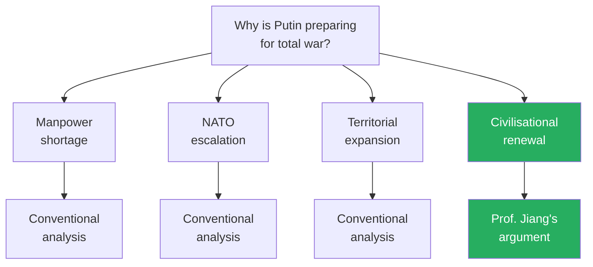

*Most analysts focus on military necessity. Prof. Jiang argues that Putin's real project is civilisational — war as medicine for a dying society.*

---

## Key Concepts at a Glance

| Concept | One-line summary |
|---------|-----------------|
| **Putinism** | The ideology of continuous, contained war as a mechanism for civilisational renewal |
| **The warrior concept** | Replaces the consumer as society's organising unit — a courageous individual who shapes history through collective action |
| **The perfection of slavery** | Consumerism as a system so perfect that the enslaved choose their slavery and therefore never rebel |
| **Hegel's dialectic** | History progresses through thesis → antithesis → synthesis — capitalism → communism → liberal democracy |
| **The revolt of the elite** | The 1980s Reagan/Thatcher revolution that replaced the worker with the consumer |
| **War as a pyramid scheme** | Each war's costs necessitate further conquest for resources — short-term gain, long-term catastrophe |
| **Warrior culture vs. consumer culture** | Warrior cultures (Russia, Germany, Japan) beat consumer cultures easily — until nuclear weapons intervene |
| **The king problem** | Putinism requires a great leader; when Putin dies, the warrior society fragments into civil war |
| **Multipolar world** | Putinism spreading to other warrior cultures creates multiple regional hegemons, ending US global dominance |

---

## Russia Is Dying

*Before explaining Putin's remedy, Prof. Jiang diagnoses the disease: Russia is not merely struggling — it is facing civilisational extinction.*

Prof. Jiang presents Russia as a society suffering from three interrelated pathologies that, left unchecked, will cause the nation to cease to exist:

### The Three Crises

- <b style="color: #e74c3c">**Corruption:**</b> Russia is the most corrupt society in all of Europe
  - The rich steal and then flee to Europe, the United States, or Dubai
  - The result is a shockingly low GDP — South Korea, with about a third of Russia's population, has a higher GDP
  - The state of Texas alone has a higher GDP than all of Russia
- <b style="color: #e74c3c">**Alcoholism:**</b> One in every six Russian males — about 16-17% — are alcoholics
  - One in every three deaths in Russia is caused by excessive drinking
  - The rate of young men dying is increasing steadily
- <b style="color: #e74c3c">**Fertility crisis:**</b> Russia's fertility rate is 1.5 — well below the 2.1 replacement level
  - Combined with mass male deaths from alcoholism, Russia's population has been declining steadily since 2000
  - If current trends continue, "Russia will cease to exist as a society — the nation will die"

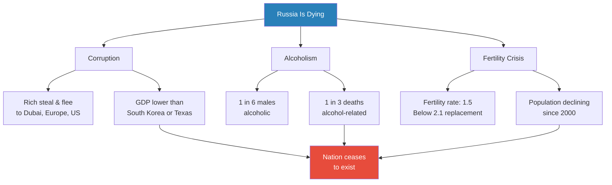

*Three crises converge on one outcome: if nothing changes, Russia dies as a civilisation.*

### Two Explanations

Prof. Jiang presents two competing explanations for Russia's decline:

- **The democratic explanation:** Russia fails because it is not democratic — unleash human potential through freedom and the country will prosper
- **Putin's explanation:** Corruption, alcoholism, and low fertility are happening because <b style="color: #2980b9">Russians have been lied to, deceived, and manipulated by Western civilisation</b>
  - Western civilisation preaches the gospel of liberal democracy, freedom, human rights, and consumerism
  - These are "lies" and "hypocrisies" that have fooled the Russian people
  - They have corrupted the Russian soul and destroyed Russian civilisation
  - Because Russians are abandoning their soul, their civilisation, their nation — that is why they are dying

> [!tip] Core Insight
> Putin does not see Russia's problems as political or economic — he sees them as spiritual. The Russian soul has been poisoned by Western ideas, and only a radical civilisational project can cure it.

To understand why Putin believes this, Prof. Jiang traces the intellectual history that frames his worldview — from Hegel's dialectic through Marx's critique of capitalism to Fukuyama's triumphalism and, finally, to Putin's rejection of it all. This is the most philosophically dense section of the entire Geo-Strategy series — Prof. Jiang is teaching his students two centuries of Western political philosophy in order to explain why one man decided to invade Ukraine.

---

## The Intellectual History: From Hegel to Putinism

*Prof. Jiang constructs a chain of ideas spanning two centuries to show how Putin's worldview emerges logically from the Western tradition he claims to reject.*

### Hegel's Dialectic

In the late 1980s, the Soviet Union collapsed — its elite had given up on communism, no longer believed in self-sacrifice for the nation, and had decided that Western values and the Western lifestyle were simply better. An American historian named <b style="color: #2980b9">Francis Fukuyama</b>, who worked for the State Department, wrote an enormously influential essay called "The End of History." His argument: the Soviet Union fell and America became triumphant because liberal democracy is the best idea ever invented.

- To make this argument, Fukuyama used the philosopher <b style="color: #2980b9">Friedrich Hegel</b> and his <b style="color: #2980b9">theory of the dialectic</b>:
  - A **thesis** (new idea) comes into being
  - We recognise it has problems — it is too extreme
  - An **antithesis** emerges to correct it — but the antithesis is also too extreme
  - The thesis and antithesis merge to create a more moderate, more efficient **synthesis**
  - This is how history progresses — through the movement of ideas

- Fukuyama applies the dialectic to modern history:
  - **Thesis: Capitalism** — created the Industrial Revolution, but too extreme in its problems
  - **Antithesis: Communism** — created to counteract capitalism's extremes, but itself too extreme
  - **Synthesis: Liberal Democracy** — the moderate middle, the "right idea," the final answer

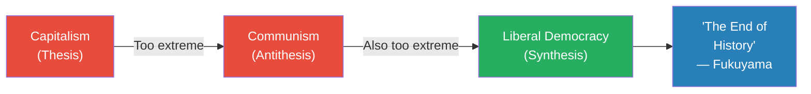

*Hegel's dialectic as applied by Fukuyama: capitalism and communism were both extreme, and liberal democracy is their synthesis — the final idea, the end of history.*

---

### The Fundamental Problem of Politics

*At the heart of every society throughout history lies a single question: how do you get everyone to work as hard as possible?*

Prof. Jiang reframes Fukuyama's argument in terms of a deeper question: **how do you optimise workforce participation?** If every person works as hard as possible, the society is strong, united, and prosperous. This is the fundamental problem of politics.

Historically, three answers have worked:

| Solution | How it provides structure, meaning, purpose | Fatal problem |
|----------|-------------------------------------------|---------------|
| **War** | Shared existential threat unifies people | Kills people |
| **Religion** | Belief in something greater than oneself | Superstitious |
| **Civilisation** | Pride in one's culture and heritage | Logical extreme is racism → imperialism → fascism ("the White Man's Burden") |

- All three work because they give people **structure, meaning, and purpose** — and with structure, meaning, and purpose, people are much more motivated to work hard
- All three create suffering — war, religious persecution, imperialist conquest
- Over time, all three became more **abstract** in order to include larger populations:
  - Early religions were polytheistic with human-like gods (Greek: Zeus, Athena, Hera)
  - Over time, polytheism gave way to monotheism — God became abstract, removed from humanity
  - The benefit of abstraction: you can have more people believing in one God, which motivates them to work harder
- This trend toward abstraction eventually produces a new organising principle: <b style="color: #2980b9">**money**</b>
  - Rather than war, religion, or civilisation as the centre of society — make capital the centre
  - Money is the most abstract organising principle of all — it has no inherent content, no moral demand, no cultural specificity
  - It can include anyone from any culture, any religion, any civilisation — as long as they participate in the market
  - This universality is both its strength (it can organise billions) and its weakness (it provides no meaning)
  - This is **capitalism**, which leads to the Industrial Revolution and industrialism

> [!abstract] The Evolution of Social Organisation
> | Era | Organising principle | What it promises |
> |-----|---------------------|-----------------|
> | Ancient | War, Religion, Civilisation | Structure, meaning, purpose (but with suffering) |
> | Industrial | Capital / Money | Wealth and growth (capitalism) |
> | Post-WWII | The Worker | Good jobs, healthcare, education (socialism) |
> | 1980s onward | The Consumer | Low prices, wide selection of goods (neoliberalism) |
> | Putin's vision | The Warrior | Discipline, unity, civilisational renewal |

---

### The Three Problems of Capitalism

*Prof. Jiang leads a classroom discussion to identify why capitalism, despite its power, is a destructive organising principle. He asks the students to identify the problems themselves — making them discover Marx's critique firsthand.*

Making money the heart of society creates three devastating problems:

- <b style="color: #e74c3c">**All-consuming growth:**</b> Capital cares only about expansion and the growth of profit, regardless of the effect on society or the planet
  - Profit for the sake of growing profit
  - Can ultimately lead to the destruction of the environment
- <b style="color: #e74c3c">**Consolidation and monopoly:**</b> Money likes to consolidate itself
  - The fastest way to grow money is to pool it together and invest
  - If you let capitalism run unchecked to infinity, one person ends up with all the money
  - This is not a bug — it is the mathematical logic of capital accumulation
- <b style="color: #e74c3c">**Alienation and dehumanisation:**</b> You cease to be a complex, multifaceted human
  - In capitalism, you are only your production value — the amount of money in your bank account
  - When you evaluate someone, you do not ask "Is this person kind?" — you ask "How much money do they have?"
  - This is what Marx called **alienation** — the worker is reduced to a commodity

Prof. Jiang walks the students through these problems interactively — Jack identifies the all-consuming growth problem, another student identifies consolidation, and a third identifies dehumanisation. The classroom discussion is deliberate: Prof. Jiang is demonstrating that Marx's critique of capitalism is not obscure philosophy but something any thoughtful teenager can arrive at independently. The problems are obvious once you look for them.

---

### Marx and the Worker

*Karl Marx diagnosed capitalism's diseases and prescribed the worker as the cure — and despite communism's failures, Prof. Jiang argues Marx was fundamentally right.*

<b style="color: #2980b9">Karl Marx</b>, in the Communist Manifesto, identified these problems and proposed a solution: rather than making money the heart and centre of industrial society, make **the worker** the heart and centre. His argument was that this was not a political choice but a natural, inevitable evolution — part of the Hegelian cycle.

Prof. Jiang uses a thought experiment with students to trace Marx's logic:

- Your parents die. At 16-18, you must work in a factory to survive
- You feel depressed, lonely, bitter, **alienated**
- From this alienation, you develop <b style="color: #2980b9">**political consciousness**</b> — you start asking why this is happening, why the government has abandoned you
- You spread your ideas and **organise** with other workers
- You realise the capitalists need you more than you need them — they own the factories, but you do the work
- United, you can demand whatever political reforms you want — the capitalists own the factories, but without you, the factories cannot run
- This is a **natural evolution** (not a political choice): capitalism → alienation → consciousness → solidarity → revolution
- Marx argued this was as inevitable as gravity — not a utopian dream but a structural consequence of capitalism's own logic

> [!example] Marx Was Right — The Post-WWII Worker Era
> - Marx predicted revolution would happen first in industrialised Germany, not Russia or China
> - On the surface, communism "failed" — it happened in the wrong countries
> - But after World War II, every industrial society adopted Marx's ideas
> - We called it **socialism**, not communism, but the principle was identical: make the worker the heart of society
> - Workers through unions demanded reforms: healthcare, public schools, cheap universities
> - The 1950s, 60s, and 70s were the peak of the working class
> - Why? Because workers create value — money only creates more money speculatively, but workers are productive
> **The lesson:** Marx's core insight — that worker-centred societies outperform capital-centred societies — was validated by the most prosperous decades in Western history.

---

### The Revolt of the Elite

*In the 1980s, the elites struck back — and the consumer was their weapon.*

The worker-centred system was working. So why did it change?

- <b style="color: #2980b9">**The revolt of the elite:**</b> Having a worker-based society is too egalitarian, too equal
  - If you are among the elite, you do not want equality — you want difference, power, and money concentrated in your hands
- This revolt happened in the 1980s:
  - In the United States: the <b style="color: #2980b9">**Reagan Revolution**</b> — neoliberalism, free-market capitalism
  - In Britain: <b style="color: #2980b9">**Thatcherism**</b> — Margaret Thatcher's revolution

Prof. Jiang emphasises that this was not a natural evolution but a deliberate political project. The worker-centred system was producing excellent results — healthcare, education, shared prosperity. But the elites did not want shared prosperity. They wanted concentrated power.

The evidence of how radical this revolution was:

| Era | Average CEO pay | Ratio to average worker |
|-----|----------------|------------------------|
| 1970s | $1 million/year | 20x |
| Today | $20 million/year | 200-300x |

- Starting in the 1980s, inequality exploded
- The shift from 20x to 200-300x happened within a single generation
- This is not a gradual drift — it is a revolution as dramatic as any communist takeover, just executed through policy and ideology rather than armed uprising
- The mechanism: the elite needed to destroy the working class and the middle class
- Their tool: a new organising concept called **the consumer**

The shift sounds subtle but was revolutionary:

| Worker era (1950s-70s) | Consumer era (1980s onward) |
|------------------------|---------------------------|
| Government promises you a good job for life | Government promises you low prices and a wide selection of goods |
| You have political consciousness | You have purchasing power |
| You organise with others to protect your rights | You compete with others for prestige |
| Identity = your contribution to society | Identity = your consumption patterns |

---

### Consumerism: The Perfection of Slavery

*Prof. Jiang uses a thought experiment to show students that they are already living inside the system he is describing.*

Prof. Jiang's thought experiment: he gives every student in the school — about 500 people — $1 million each. What happens?

> [!example] The $1 Million Thought Experiment
> - First, you buy a house
> - Then you buy furniture
> - Then — and this is critical — you take pictures and post them on social media
> - Everyone sees your house on social media
> - They want a bigger house
> - They buy bigger houses, post pictures, compete
> - Very quickly, everyone spends their money and goes into debt
> - You borrow more money to buy more things
> - At the end: everyone is in debt and everyone hates each other
> **The lesson:** Consumerism creates competition for prestige, leading to debt, isolation, and mutual hatred — the opposite of solidarity.

Consumerism creates a chain of consequences:

- **Competition for prestige** — social media status competition, seeing who can post the nicest pictures
- **Individualisation** — you become unable to act together, unwilling to organise or show solidarity
- **Economic logic** — you see the world only through the lens of capital
  - "When you see someone and you ask, 'Do I want to date this person?' — you don't ask if they're nice. You ask how much money they have"
  - "You're in school. Why? So you get a good job. Why? To make money so you can buy things"

Prof. Jiang directly addresses his students: "Is this how China works? Is this how the world works? The answer is yes. Are you like this? Yes, you are. You've been brainwashed into thinking this is the only way to behave and to think."

He contrasts two possible views of education to drive the point home:

- **Consumer view of school:** "I'm in school to get a good job, to make money, so I can buy things"
- **Worker view of school:** "I'm in school to learn, to open my mind, to have an imagination, to think critically about the world"
- The worker view was how people thought about school when workers were dominant (1950s-70s)
- The consumer view is how people think about school now — and the students in the room recognise themselves in this description

This is perhaps the most effective teaching moment in the lecture: Prof. Jiang is not just describing consumerism as an abstract system — he is showing his students that they are already inside it, that their most basic assumptions about why they are in school have been shaped by it, and that they have never questioned it because the system is designed to make questioning impossible. The silence in the classroom after this moment is palpable in the transcript — the students recognise themselves, and the recognition is uncomfortable. This pedagogical move mirrors the lecture's central argument: you cannot fight a system you do not see, and the first step toward freedom is recognising your chains.

The chain from consumerism to slavery has five links:

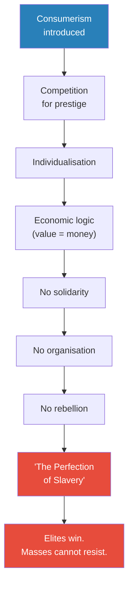

*Consumerism neutralises resistance step by step: competition → isolation → economic thinking → no solidarity → no rebellion. The perfect prison has no bars.*

The key insight: <b style="color: #e74c3c">**consumerism is the perfection of slavery**</b>:

- If you are a slave, you rebel
- But if you do not know you are a slave — and you *enjoy* your slavery — you will never rebel
- "If you choose this, then you will never rebel"
- This is why Fukuyama thinks consumerism is the end of history — it achieves what the elites want, and the masses are unable and unwilling to protest and rebel
- "It's a perfect system"

> [!tip] Core Insight
> The difference between slavery and consumerism is not that one is oppressive and the other is free. The difference is that slaves know they are slaves and therefore can rebel. Consumers do not know they are slaves and therefore cannot.

---

## Russia's Resistance and Putin's Solution

*Certain civilisations refuse to be enslaved, even when they do not know how to rebel. Russia is one of them.*

### The Russian Soul Under Siege

There are certain civilisations, Prof. Jiang argues, that intrinsically rebel against slavery. Russian civilisation is one:

- When you impose consumerism on Russians, they respond with corruption, alcoholism, and a refusal to have babies
- This is not a failure of Russian character — <b style="color: #27ae60">it is an unconscious rebellion against a system that is destroying their soul</b>
- But because consumerism is "so perfect," Russians lack an understanding of how to rebel consciously
- They know something is deeply wrong, but they cannot articulate what it is or how to fight it

Putin's self-appointed mission: **free his people, even though they may enjoy prison**. Even though Russians may enjoy the comforts of consumer slavery, Putin will liberate them — by introducing a new concept to combat consumerism.

---

### The Warrior Concept

*From the worker to the consumer to the warrior — Putin's answer to two centuries of Western ideological evolution.*

The historical sequence of organising principles:

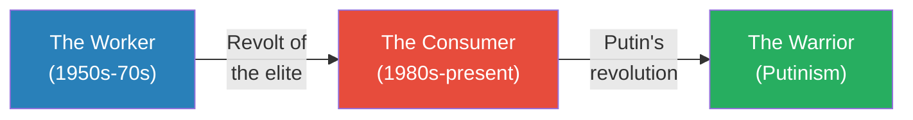

*Each era is defined by its organising principle — who is at the centre of society. Putin seeks to replace the consumer with the warrior.*

Prof. Jiang draws a sharp contrast between the two concepts:

| | The Consumer | The Warrior |
|--|-------------|-------------|
| **Orientation** | Individual | Collective |
| **Drive** | Self-preservation | Shaping history |
| **Character** | Cowardly, lacks imagination | Courageous, imaginative |
| **Social mode** | Acts alone, alienated | Acts with others |
| **Relationship to power** | Cannot rebel | Can rebel (mutiny) |
| **What it produces** | Debt, hatred, isolation | Unity, sacrifice, purpose |
| **Prof. Jiang's label** | "The perfection of slavery" | "Anti-slavery" |

The warrior is "an individual who sees that through his actions, he or she can shape the direction of history. I can make my own reality through my courage and my imagination and by acting with others."

The contrast is not just psychological but political:

- The consumer's atomisation makes collective action impossible — and therefore makes political change impossible
- The warrior's collective orientation makes solidarity natural — and therefore makes rebellion possible
- This is precisely why political elites replaced warrior culture with consumer culture: warriors threaten the powerful, consumers do not
- Putin is reversing this centuries-long process — deliberately creating a population capable of collective action

---

### The Flesh-Eating Monkey Island

*Prof. Jiang uses an extended thought experiment to make the warrior concept visceral for his students.*

> [!example] The Flesh-Eating Monkey Island
> - After the $1 million experiment, everyone in the school hates each other
> - Prof. Jiang puts them on a plane and takes them to an island
> - On this island: millions of flesh-eating monkeys that want to eat them
> - They hate each other — they do not want to work together
> - But if they do nothing, everyone gets eaten
> - So they put aside their differences and fight together
> - How do they feel? **Happy** — because war gives them structure, meaning, and purpose
> - When Celine dies fighting the monkeys, she becomes a martyr — celebrated, remembered, given a great funeral
> - Her death makes everyone else fight harder — her sacrifice gives their lives more meaning
> - Jack stands on a bridge — ten people on the other side, monkeys coming
> - He can cut the bridge (killing himself, saving the others) or run (risking everyone)
> - "For sure, he will sacrifice himself. We've seen this in war over and over."
> **The lesson:** War transforms isolated, competing individuals into a unified community willing to sacrifice for each other. This is not a metaphor — it is exactly what Putin is trying to do with Russia.

---

## War as Civilisational Medicine

*If Putin's theory is correct, the Ukraine war should be improving Russian society. Prof. Jiang argues the evidence supports this.*

### The Evidence

When Putin launched the "special military operation" in Ukraine in February 2022, his theory predicted that Russian society would improve — more unity, more purpose, less decay. Prof. Jiang presents evidence that this is happening:

- **The economy is surviving US sanctions** — and getting stronger
  - People are fully participating in the economy because they have purpose
- **Ammunition production tells the story:**
  - Russia produces <b style="color: #27ae60">150,000 artillery shells per month</b> for the war
  - The United States produces **2,000 per month**
  - This 75:1 ratio reflects not just industrial capacity but societal mobilisation
- **Social pathologies are declining:**
  - When society has structure, meaning, and purpose, corruption goes down
  - Alcoholism goes down
  - Fertility goes up

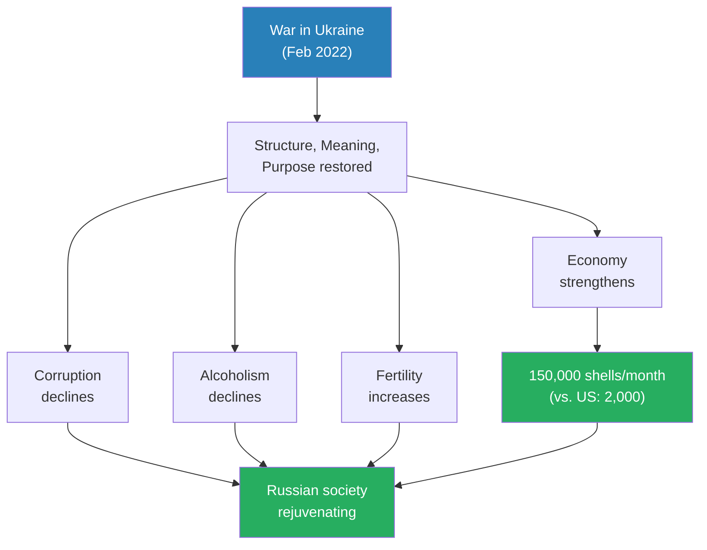

*War as medicine: the data appears to support Putin's thesis that conflict gives Russians the purpose their consumer-poisoned society had lost.*

### Putin on Battlefield Deaths

Prof. Jiang quotes a particularly revealing statement. When Putin was asked about the large number of Russians dying on the battlefield, he said:

> "When they die on the battlefield, we honour them. They sacrifice themselves for their country. They will always be remembered as heroes. The families will always love them. But if we just let them do whatever they want, all they do is drink themselves to death."

- This captures Putin's worldview perfectly:
  - Death in war is honourable — it gives both the dead and the living meaning
  - Death from alcoholism is meaningless — it is the consequence of a purposeless life
  - <b style="color: #27ae60">War does not waste lives — it redeems them</b>

> [!tip] Core Insight
> For Putin, the war in Ukraine is not about conquering territory or defending against NATO. It is about saving Russian civilisation — saving the Russian soul. Without this war, Russia will eventually cease to exist as a nation.

---

## Putinism Defined

*A new ideology is being born in the trenches of Ukraine — one that Prof. Jiang believes will reshape the world.*

### The Ideology

Prof. Jiang argues that over time, a new concept will arise to challenge consumerism and liberal democracy. He calls it <b style="color: #2980b9">**Putinism**</b>:

- **Definition:** The ideology of continuous war — society should constantly fight wars in order to discipline, unify, and make its people stronger and more prosperous
- **Core proposition:** War is not a tool for conquering others but a mechanism for transforming yourself
  - "Before, we understood war as a mechanism to conquer others — imperialism, the spreading of civilisation. Now the idea of Putinism is: we don't care about the other people. We care about ourselves. We're using war as a mechanism to discipline our bodies, just like the gym"
- **Putinism vs. liberal democracy:** A direct response — society shifts from one based on the consumer to one based on the warrior
- **Putin's defining legacy:** Not a strong Russia, but the idea itself — Putinism will outlive Russia
- **Key distinction from imperialism:** Previous war ideologies (imperialism, fascism, the White Man's Burden) were about conquering others — Putinism is about transforming yourself
  - This makes Putinism harder to oppose internationally because it frames itself as self-improvement, not aggression
  - "We don't care about the other people. We care about ourselves" — this is a fundamentally different claim from "we must civilise the barbarians"

Prof. Jiang frames Putinism within Hegel's dialectic:

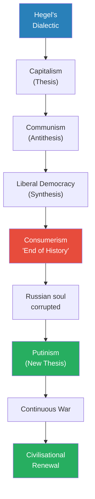

*Putinism emerges as the next stage in Hegel's dialectic: if liberal democracy is the synthesis of capitalism and communism, Putinism is the antithesis of that synthesis — the cycle continues.*

---

### Capitalism vs. Liberal Democracy

A student (Celine) asks how capitalism differs from liberal democracy. Prof. Jiang's distinction is precise:

- **Capitalism** is only concerned with capital — you can be fascist and capitalistic
  - Nazi Germany was extremely capitalistic and saw communism as an existential threat
  - Capitalism naturally leads toward fascism because capital consolidates
- **Liberal democracy** is the participation of everyone in the generation of capital
  - It synthesises two opposing forces — capitalism and democracy — into a single system
  - But this synthesis papers over a fundamental contradiction: capitalism and democracy are inherently opposed
  - Capitalism concentrates power; democracy distributes it
  - Liberal democracy's trick is to make this contradiction invisible

---

## The Contradictions of Putinism

*Prof. Jiang does not simply advocate for Putinism — he systematically identifies the forces that will destroy it.*

### Contradiction 1: War as a Pyramid Scheme

A student (Jack) raises the critical question: won't continuous war exhaust society? The way previous wars destroyed Athens, Sparta, and the nations of World War I and II?

Prof. Jiang acknowledges this is a serious problem:

- <b style="color: #2980b9">**Putinism's answer:**</b> Fight small-scale, contained wars — not large-scale wars that risk nuclear escalation
  - Ukraine is a small, contained conflict
  - An invasion of France or Britain would lead to nuclear war
  - Similarly, the US picks Iran as a target because it would be a small, contained conflict
- **But war is a pyramid scheme:**
  - Each war costs resources
  - The costs force you to fight more wars to acquire more resources
  - This is exactly what happened to Nazi Germany:
    - Fighting wars was expensive
    - Germany was forced to fight more wars for resources and manpower
    - This led to the invasion of Russia
    - Which led to Germany's destruction

> [!example] Nazi Germany's Pyramid Scheme
> - Germany's wars were costing its economy enormous amounts of money
> - The government was forced to fight even more wars to acquire the resources needed
> - This created an escalating cycle — each conquest making the next one necessary
> - Eventually this logic drove the invasion of Russia — Germany needed Russian resources
> - The result: catastrophic overextension and total destruction
> **The lesson:** War as economic policy creates a spiral that cannot be sustained. Putin's Russia faces the same trajectory — after Ukraine, it will need to conquer more territory for resources.

- <b style="color: #e74c3c">Prof. Jiang's verdict: "In the long term, this could lead to disaster — this could lead to a large-scale war. But in the short term, it does work."</b>

The important nuance: nuclear weapons change the calculus. Prof. Jiang notes that "global leaders are all insane, but they're not stupid. They're happy to kill millions of people. They're not happy to blow up the world." This means Putinism can only operate in the space between small contained conflicts and nuclear annihilation — a narrow band that grows narrower with each escalation.

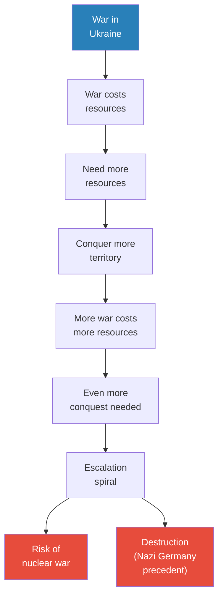

*War as a pyramid scheme: each conflict creates the economic need for the next, until the spiral reaches catastrophic overextension — exactly the trajectory that destroyed Nazi Germany.*

---

### Contradiction 2: The King Problem

*Putinism's deepest flaw is not strategic but structural: it depends on one man.*

A student's question about whether warrior culture is also a form of slavery leads Prof. Jiang to Putinism's most fundamental contradiction.

First, the positive argument: warrior culture is **anti-slavery**, because warriors can rebel:

- "Warriors can mutiny. The army can be like, 'You guys are terrible. We're going to rebel against you'"
- Consumers will never rebel: "I'm going to stop buying things? You won't do that"
- Historically, warrior culture was dominant — and then political leaders got rid of it precisely because warriors are a direct threat to leaders

But this anti-slavery quality reveals the fatal flaw:

- <b style="color: #e74c3c">For a war culture to triumph, it needs a king</b>
- Putin is the king right now — "a strategic genius. He's the king. Everyone admires him. He unites everyone. He can direct all of society into total war"
- But **Putin will eventually die**
- When he dies: "This society is going to fall apart. When you have a war culture and you have these different generals fighting each other for total control — it's going to be civil war"
- "No one would have his genius and authority and ruthlessness"
- <b style="color: #e74c3c">**Putin's legacy will not be a strong Russia. It will be Putinism — the idea of continuous war. Russia may not survive Putin.**</b>

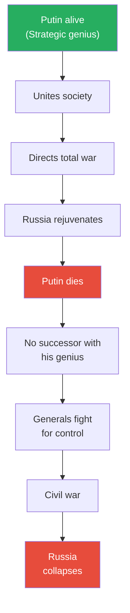

*Putinism's king problem: the system works only as long as a single genius holds it together. When Putin dies, the warriors he created will turn on each other.*

Prof. Jiang makes a stark observation: "When you have a great leader like Putin, it's impossible to replace him." This is not flattery — it is a structural critique. The very qualities that make Putinism work (a single visionary directing all of society) are the qualities that cannot be replicated. Every warrior society in history has faced this same problem: Alexander the Great's empire fragmented the moment he died; Napoleon's France collapsed after Waterloo; the Mongol Empire splintered between Genghis Khan's successors. The king problem is not a bug in warrior culture — it is the defining feature.

---

## Warrior Culture vs. Consumer Culture

*Prof. Jiang maps the world's civilisations by their relationship to war — and predicts what happens when warrior and consumer cultures collide.*

### The Civilisational Typology

A student (Selena) asks whether the Russian people will eventually be exhausted by continuous war. Prof. Jiang's answer introduces a controversial claim: **it depends on the civilisation.**

- Putin believes Russians are a <b style="color: #2980b9">**warrior culture**</b> — they enjoy war and are good at it
- Prof. Jiang draws civilisational comparisons:

| Civilisation | Type | Evidence |
|-------------|------|----------|
| **Russia** | Warrior culture | Invaded multiple times; the German invasion of 1941 killed 20 million people, and Russians still celebrate that war; war energises rather than exhausts |
| **Germany** | Warrior culture | Has been fighting wars for thousands of years, and been very good at it |
| **Japan** | Warrior culture | Also a warrior culture that enjoys fighting wars |
| **China** | Not a warrior culture | "China would probably lose most wars" — throughout most of Chinese history, China was the dominant power and was surrounded by natural defences (sea, mountains, Great Wall); no tradition of existential threat |
| **Contemporary West** | Consumer culture | "Europeans are like — I'm too busy watching TV, buying things, vacationing" — consumers do not want to fight |

### The Prediction

- <b style="color: #27ae60">Warrior culture beats consumer culture easily</b> — the evidence is right there in Ukraine, where Russia is destroying Ukraine and Europe cannot bring itself to respond seriously
- But eventually, Russia will directly threaten Germany, France, and Britain
- When that happens, those nations will start to transition into warrior cultures themselves
- <b style="color: #2980b9">**Putinism will become the dominant ideology for the next 50 years**</b>
- Putinism can spread to other countries — Japan, Germany, Britain can all adopt it
- This creates what Prof. Jiang calls a <b style="color: #2980b9">**multipolar world**</b>:
  - Currently, only the United States as global hegemon
  - Over the next 10-20 years, different centres of power will emerge — each region with its own hegemon
  - Multipolarity replaces American unipolarity

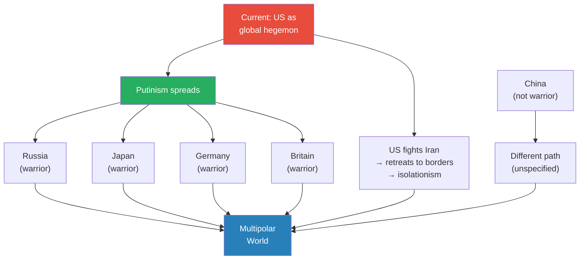

*The geopolitical prediction: Putinism spreads to warrior cultures, the US retreats into isolationism after Iran, and the result is a multipolar world with multiple regional hegemons.*

---

### China's Exception

Prof. Jiang makes a pointed comment about China — directly addressing his Chinese students:

- China is not a warrior culture and has no tradition of existential threat
- Throughout most of Chinese history, China was the dominant power — the hegemon
- China is surrounded by natural defences:
  - Sea to the east
  - Mountains to the south and west
  - The Great Wall to the north
- Because China has never felt truly threatened, it never developed a warrior culture
- "I hate to say this, but China would probably lose most wars"
- For Chinese civilisation, war would be exhausting — unlike for Russian civilisation, where war is energising and rejuvenating

Prof. Jiang is speaking directly to his Chinese students, and the comparison is clearly meant to be provocative — forcing them to think about what civilisational type China is and what that means for its future in a world where warrior cultures are ascendant. If Putinism spreads to Japan, Germany, and Britain while China remains a non-warrior culture, what does that mean for China's position in the multipolar world? Prof. Jiang leaves this question unanswered, but it hangs over the room.

### The German Invasion of 1941

Prof. Jiang uses Russia's experience in World War II to illustrate the warrior culture thesis:

- The German invasion of the Soviet Union in 1941 killed 20 million people
- Millions of Russians died in that war
- And yet Russians **still celebrate** that war — it remains a foundational source of national identity
- This is the hallmark of a warrior culture: traumatic wars become sources of pride and meaning, not shame and exhaustion
- For a consumer culture, a war that killed 20 million people would be a reason to never fight again
- For a warrior culture, it is a reason to fight harder

---

## The Organised Minority

*Only 10% of Russians may support Putinism — but that is more than enough.*

A student (David) asks a direct question: how much of Russian society actually agrees with Putin?

Prof. Jiang's answer is blunt:

- "No one. Most people don't like to go to war. Most people are scared by war"
- At most, about 10% of Russians embrace Putinism as an ideology
- The other 90% want peace, want their children to be safe, do not want to send them to war
- <b style="color: #27ae60">But history is determined by those who are willing to act on their beliefs</b>
- Comparison to the Israel lobby:
  - Less than 1% of the American population
  - But because they are willing to act, organised, and determined — they get their way
- "It's usually the most extreme individuals who get their way"

This connects to a recurring theme across the series:

| Lecture | Organised minority | Passive majority |
|---------|-------------------|-----------------|
| **Lecture 2** | Dispensationalist Christians | American public |
| **Lecture 2** | Israel lobby | American voters |
| **Lecture 7** | IRGC | Iranian population |
| **Lecture 9** | Putin's 10% | Russian population |

But war itself solves the problem of the reluctant majority:

> [!example] Ukraine's Unification Under Zelensky
> - Before the invasion, about 50% of Ukrainians were Russian-speakers
> - At least a third were sympathetic to Russia
> - The moment Putin invaded, they all united under Zelensky
> - Prof. Jiang returns to his metaphor: "You guys may hate each other when you land on the island. But if there are a million flesh-eating monkeys, you're going to become a family"
> **The lesson:** War does not need majority support to begin — but once begun, it creates the unity that justifies its continuation. The 90% who did not want war become warriors anyway.

---

## Putin's Civilisational Defence

*Putin does not see himself as a conqueror. He sees himself as a defender of a great civilisation under siege.*

Prof. Jiang presents Putin's self-justification:

- Putin believes Russia is first and foremost **a great civilisation**
- As a great civilisation, it must fight wars to protect itself
- Putin's argument: "If America left us alone, we would not fight wars. It's only because America insists on encircling us, insists on trying to destroy our culture, our civilisation, that we must fight"
- Evidence: NATO expanded five times after the Soviet Union fell
  - NATO was a defensive alliance against the Soviet Union
  - With no Soviet Union, there was no need for NATO
  - Yet NATO kept expanding — and was going to expand into Ukraine
- Putin frames the war as **defending Russian civilisation**, not conquering Ukrainian territory

> [!tip] Core Insight
> The most dangerous framing of war is not "we must conquer others" — it is "we must defend ourselves." Imperial aggression can be opposed; civilisational self-defence is far harder to argue against, even when it is a mask for expansion.

This civilisational defence argument explains why the war generates genuine support even among Russians who did not initially want it — it feels defensive, not aggressive. And if the West's response (sanctions, NATO reinforcement, weapons to Ukraine) confirms the narrative of encirclement, the support deepens.

### The NATO Context

Prof. Jiang provides specific details about NATO escalation that frame Putin's civilisational defence claim:

- **Ukraine's manpower crisis:** Because of the previous summer's offensive, Ukraine is desperately short of manpower
  - The average age of Ukrainian soldiers is over 40
  - Men in their 60s are fighting on the front lines
- **NATO's response:**
  - Emmanuel Macron of France has publicly stated he is considering sending French troops to Ukraine
  - The British are thinking about conscription — drafting all young men into the army
  - American politicians have proposed a law granting citizenship to illegal immigrants who join the army
- This escalation makes Putin's narrative self-reinforcing:
  - Putin claims the West is encircling Russia → the West responds by reinforcing Ukraine → this confirms Putin's claim
  - Each round of Western escalation makes the "civilisational defence" argument more plausible to ordinary Russians
  - The 90% who did not initially support Putinism see NATO troops approaching their border and reconsider

> [!abstract] The Self-Reinforcing Loop
> | Step | Putin's action | Western reaction | Effect on Russian public |
> |------|---------------|-----------------|------------------------|
> | 1 | Invades Ukraine | Sanctions, weapons to Ukraine | Some support, much opposition |
> | 2 | Claims civilisational defence | NATO considers troops, conscription | Narrative becomes more credible |
> | 3 | Prepares for total war | Further escalation | Opposition weakens, unity grows |
> | 4 | Frames it as existential | Western rhetoric confirms threat | Population mobilises willingly |

---

## What Comes Next

*Prof. Jiang previews the next lecture and hints at the arc ahead.*

### The United States After Iran

A student (Jack) asks what happens to the United States if it fights a war in Iran. Prof. Jiang provides a brief preview of Lecture 10:

- If the US fights in Iran, it will have to **retreat back to its borders**
- It will become **isolationist**
- He promises to explain this next week

### Putin's Strategic Imagination

Prof. Jiang closes with a preview of the next lecture:

- "Next week, we'll talk about Putin's strategic genius"
- "What I will show you is that the way that Russians see the world is rather different from the way we see the world"
- Lecture 9 established **why** Putin fights (civilisational renewal through war)
- Lecture 10 will show **how** Putin thinks strategically — the Russian worldview

### The Series Arc

With this lecture, the Geo-Strategy series has covered two arcs:

- **Lectures 1-8 (The Iran Arc):** Will the US go to war with Iran? The answer is almost certainly yes — driven by Christian Zionism (L2), imperial economics (L3), Saudi desperation (L4), Trump's election (L5), military hubris (L6), IRGC consolidation (L7), and the war's likely outcome (L8)
- **Lectures 9-10 (The Russia Arc):** What is Putin doing and why? The answer: civilisational renewal through war, with a strategic imagination that sees the world fundamentally differently from the West

The connection between the two arcs is the concept of the **multipolar world**: the US will exhaust itself fighting Iran, retreat into isolationism, and Russia (along with other warrior cultures) will fill the vacuum. The end of American hegemony is not just a military event — it is a civilisational transition from the consumer to the warrior as the dominant organising principle of global order.

---

## Concept Map: How This Lecture's Ideas Connect

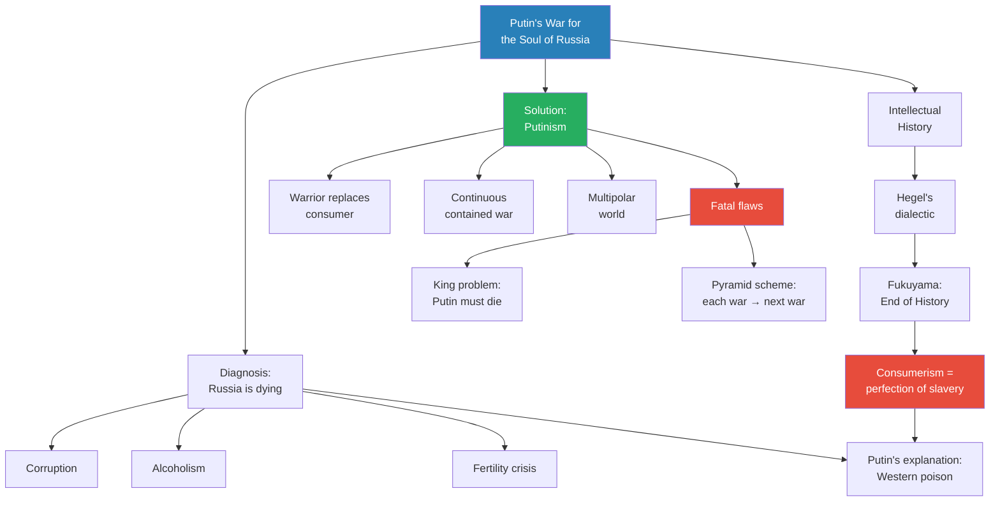

*The lecture weaves three strands — Russia's crisis, Western intellectual history, and Putin's solution — into a single argument: consumerism is killing Russia, and war is the only cure Putin can imagine.*

---

## Connections

**Builds on:** [[01 - Iran's Strategy Matrix]] (asymmetric warfare, weak powers controlling engagement terms), [[03 - How Empire is Destroying America]] (imperial overextension applies to Russia too — pyramid scheme of continuous war), [[06 - America's Imperial Hubris]] (hubris vs. Putin's strategic realism in choosing contained conflicts)

**Sets up:** [[10 - Putin's Strategic Imagination]] (Lecture 9 explains WHY Putin fights; Lecture 10 explains HOW he thinks — "the way Russians see the world is rather different")

**Related books in vault:** [[Sapiens - Yuval Noah Harari]] (how abstract ideas — money, nation, religion — organise increasingly large human groups; the evolution from concrete to abstract that Prof. Jiang traces in this lecture), [[The 48 Laws of Power - Robert Greene]] (Law 25: Re-Create Yourself — Putin recreating Russian identity through war; Law 17: Keep Others in Suspended Terror)

**Series-wide theme — organised minorities:** The Israel lobby (Lecture 2), dispensationalist Christians (Lecture 2), the IRGC (Lecture 7), Putin's 10% of warrior-minded Russians (this lecture) — the same pattern of determined minorities shaping history against the wishes of passive majorities.

**Series-wide theme — war, religion, and civilisation:** The three organising principles Prof. Jiang identifies in this lecture (war, religion, civilisation) are the same three forces that drove the formation of early human societies in the Civilization series. Göbekli Tepe was built by religion; the Yamnaya conquered by war; the Greeks rose through civilisational identity. The Geo-Strategy series is showing how these same three forces continue to drive geopolitics today — religion in Iran (Lectures 2 and 7), civilisation in Russia (this lecture), and war everywhere.

---

## The Takeaway

This lecture is the most philosophically ambitious in the Geo-Strategy series so far. Where Lectures 1-8 analysed specific conflicts, power structures, and strategic calculations, Lecture 9 steps back to ask the biggest question in geopolitics: what is a civilisation for? Putin's answer — that a civilisation exists to give its people structure, meaning, and purpose, and that war is the most effective mechanism for doing so — is not original. It echoes the warrior ethos of Sparta, the samurai code of Japan, and the militarism of Prussia. What makes it new is the context: Putinism emerges as a direct response to consumerism, which is itself the culmination of two centuries of Western ideological evolution from Hegel through Marx to Fukuyama. Putin is not simply a nationalist — he is a philosopher of civilisation, even if an extremely dangerous one.

The most counterintuitive insight — and the one most likely to trouble students long after the lecture ends — is that consumerism's greatest strength is also its greatest vulnerability. The "perfection of slavery" — the fact that consumers do not know they are enslaved and therefore never rebel — means that consumer societies cannot mobilise when genuinely threatened. "The Europeans are like — I'm too busy watching TV, buying things, vacationing." This is why warrior culture beats consumer culture "easily" in the short term. The existential question for the West is not whether Putinism is morally right (it clearly is not) but whether consumer societies can generate purpose and sacrifice without becoming warrior societies themselves.

The lecture's deepest unresolved tension is whether Putinism is a genuine civilisational renewal or simply a more sophisticated form of imperial overextension — fascism with better marketing. Prof. Jiang identifies both fatal contradictions — the king problem and the pyramid scheme — but does not resolve which will dominate: will Putinism spread and reshape the world before Russia collapses, or will Russia's collapse discredit the ideology before it takes root elsewhere? The answer to this question, more than any strategic calculation about Ukraine or Iran, will determine the shape of the 21st century. If Putinism spreads before Russia collapses, the world enters an era of continuous regional wars fought for civilisational renewal rather than territorial conquest — a world where war is not a last resort but a permanent feature of healthy societies. If Russia collapses first, the idea may be discredited before it takes root.

Lecture 10 promises to examine Putin's strategic imagination — how a man who sees the world this differently from the consumer-minded West plans his next moves, and what it means for everyone who shares a continent with him.

The series' greatest provocation may be that Putin is not wrong about the diagnosis — even if his cure is worse than the disease.
