# Putin's Strategic Imagination

> Lecture 9 established that Putin loves Russia and views the American Empire as the source of the Western consumerism corrupting his nation. This lecture reveals the operational plan. Prof. Jiang argues Putin is systematically exploiting three structural weaknesses that kill every empire — overextension, debt, and civil discord — using five simultaneous fronts: dragging on Ukraine, enabling Iran's provocation, emboldening North Korea, expanding BRICS, and maintaining China's neutrality. The lecture's second half presents the historical proof case: Joseph Stalin's manipulation of World War Two, which — contrary to decades of scholarship claiming Stalin was duped by Hitler — represents the most sophisticated game theory play in modern history. Stalin engineered the only scenario in which the world would help the Soviet Union instead of destroying it, transforming a weak agricultural nation into a superpower. Prof. Jiang concludes that this strategic brilliance is not personal genius but a product of Russian philosophical tradition — broad, mystical, intuitive — fundamentally opposed to the Western tradition of narrow empiricism and logic that has "bureaucratised the imagination."

---

## The Question

*How is Putin planning to destroy the American Empire — and what makes the Russian strategic mind capable of executing such a plan?*

Prof. Jiang opens with a direct connection to Lecture 9: Putin loves his country, believes Western consumerism has corrupted Russia, and recognises that the American Empire is the source. The logical conclusion: <b style="color: #27ae60">to free his people, Putin must destroy the Empire</b>.

- This is not a limited objective — it is civilizational in scope
- Putin is not trying to win a war — he is trying to end an empire
- The lecture's first half provides the strategic plan; the second half explains why Russia can execute it
- The series arc connects: Lectures 1-8 showed why America will fight Iran, Lecture 9 explained Putin's motivation, this lecture reveals the mechanism, and Lecture 11 will show the result — American civil war

The question has two layers. The surface question is strategic: what is Putin doing? The deeper question is philosophical: <b style="color: #2980b9">why can Russian leaders imagine and execute strategies that the Western mind cannot even recognise?</b>

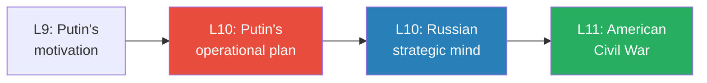

*Lecture 9 established the "why." This lecture provides the "how" (Putin's plan) and the "what makes it possible" (Russian strategic imagination). Lecture 11 will show the endgame.*

---

## Key Concepts at a Glance

| Concept | One-line summary |
|---------|-----------------|
| **Three ways empires die** | Overextension, debt, and civil discord — when all three converge, the empire collapses |
| **Putin's five-front strategy** | Ukraine (drain), Iran (distract), North Korea (divert), BRICS (undermine currency), China neutrality (prevent triangulation) |
| **Exorbitant privilege** | Bretton Woods gave America the right to "manufacture gold from nothing" — the foundation of both its power and its vulnerability |
| **BRICS as confidence weapon** | BRICS doesn't need to replace the dollar — it only needs to threaten, because money is confidence |
| **Russian nuclear umbrella** | Putin's guarantee that Russia will respond with nuclear weapons if America uses them against Iran or North Korea |
| **Stalin's four scenarios** | Game theory analysis of WWII showing only one outcome (Germany attacks and nearly wins) benefits the Soviet Union |
| **Lend-Lease as forced industrialisation** | $200 billion in free American aid that transformed the Soviet Union from agricultural backwater to superpower |
| **Three elements of Russian strategic imagination** | Intuition (sensing the moment), imagination (predicting the future), multiple personalities (genuine unpredictability) |
| **British vs. Russian philosophy** | Narrow/empirical/logical (bureaucratic mind) vs. broad/mystical/intuitive (strategic imagination) |
| **The "I trust you" deception** | Stalin made Hitler believe he was a "sheep" — triggering Hitler's wolf instincts and ensuring Germany attacked first |

---

## How Empires Die: The Three Weaknesses Framework

*Prof. Jiang opens with the structural model that governs the entire lecture — empires do not die from external attacks. They die from internal decay along three dimensions that reinforce each other.*

Historically, empires die when three things happen concurrently:

- <b style="color: #2980b9">**Overextension**</b> — the empire fights too many wars at once, driven by **hubris**, which Prof. Jiang defines as blindness:
  - Blind to your own limitations
  - Blind to the strategy of your opponents
  - Blind to the overall geopolitical picture
  - "You're just blind"
- <b style="color: #2980b9">**Debt**</b> — the source of American power (the US dollar as reserve currency) becomes the source of its destruction. The <b style="color: #2980b9">exorbitant privilege</b> of the 1945 Bretton Woods agreement means "America has the right to manufacture gold from nothing, and the world has to buy it"
  - When money falls from the sky, the nation becomes "fat, lazy, and corrupt"
  - "All America does right now is print money and not make money"
  - US debt: $35 trillion and rising
- <b style="color: #2980b9">**Civil discord**</b> — the binding myths and stories that hold a nation together collapse:
  - Growing political polarisation between left and right
  - Young people no longer believe America is "the source of good in this world"
  - Israel's actions in Gaza: "Most people who are dying in this war are children, and America is not doing anything to stop this"
  - "One quarter of young Americans now believe Osama bin Laden was a good guy"

> [!tip] Core Insight
> Each weakness feeds the others: overextension creates debt, debt creates public anger, public anger creates civil discord, civil discord prevents the unified response needed to address overextension. When all three reach a tipping point simultaneously, the empire dies. The most likely outcome for America: civil war.

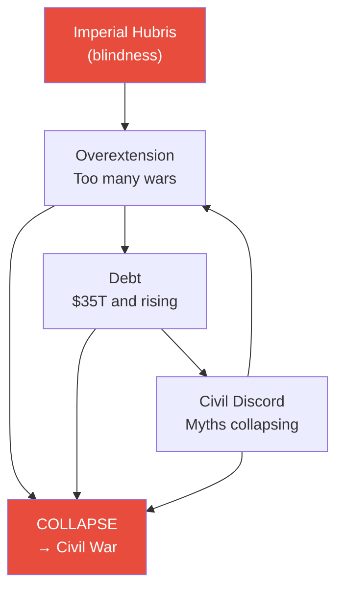

*The three weaknesses form a reinforcing cycle. Putin's strategy is to push all three past the tipping point simultaneously.*

Prof. Jiang provides specific contemporary evidence for each weakness:

**Overextension — America is fighting everywhere at once:**
- Fighting Russia in Ukraine
- Fighting Hamas in Israel (backing Israel's campaign in Gaza)
- Facing the threat of Iran on the horizon
- Imposing tariffs on Chinese electric vehicles and preparing for a possible Taiwan conflict
- "America is antagonising Russia, Iran, China, at the same time. And so that's just over extension because of hubris"
- The American policymaker's belief that "the real threat is China" — even while bleeding resources in Europe and the Middle East — is the blindness that hubris produces

**Debt — the exorbitant privilege is becoming a trap:**
- In 1945, the Bretton Woods agreement made the US dollar the world's reserve currency
- This "exorbitant privilege" meant America could print money and the world had to buy it — "because that's what underpins global trade"
- But "when you can do that, what happens eventually is that your nation becomes fat, lazy and corrupt when money just falls off the sky"
- Current US debt: $35 trillion
- BRICS+ (now including Saudi Arabia, UAE, Bahrain — the petrodollar nations) threatens to create an alternative system
- "Each time you use [US dollars], you're being taxed by the Americans" — the world is looking for alternatives

**Civil discord — the binding myths are shattering:**
- Growing political polarisation between left and right
- "Young people no longer believe that America is the source of good in this world"
- Israel's actions in Gaza: "America is the one who is providing Israel with all the weapons" to kill children
- "One quarter of young Americans now believe that Osama bin Laden was a good guy" — when Prof. Jiang was growing up, bin Laden "was considered Satan"
- College protests against American foreign policy will only expand
- "The ideas and the myths that bind the country together are falling apart, and that's what's causing the nation to fall apart"

---

## Putin's Five-Front Strategy

*Having established the structural model, Prof. Jiang maps Putin's operational plan — five simultaneous pressure campaigns, each targeting one or more of the three weaknesses.*

### Front 1: Drag On the Ukraine War

*The Ukraine war is not a territorial conquest. It is a strategic trap — a black hole designed to drain NATO resources, fracture alliances, and expose American weakness.*

In February 2022, Putin invaded Ukraine. America was confident three things would happen:

| American Prediction | What Actually Happened |
|--------------------|-----------------------|
| Ukraine would destroy the Russian army, possibly march to Moscow | Russia has won through attrition — Ukraine lost ~500,000 men, has no more manpower |
| Sanctions would destroy the Russian economy | Russian economy is doing well — countries need oil and food, Russia has both; war economy increasing manufacturing |
| NATO would become stronger and united | NATO has become more divided — Germany's economy collapsing as cheap Russian gas cut off |

Prof. Jiang details the mechanisms of each reversal:

- **Military attrition:** Russia ground down Ukraine's manpower advantage through sheer endurance — "if you don't have manpower, you're not going to be able to fight this war"
- **Sanctions failure:** "Ultimately, all economies — China, India, Europe, Africa, Middle East — they all need resources in order for their economies to work. You need oil, you need food. And Russia has a lot of oil and food." Countries made side deals; Russia transitioned to a war economy with increased manufacturing
- **NATO fracture:** Germany is the key. Germany's economy is a manufacturing economy built on a simple formula: take cheap Russian gas → manufacture cars → sell to China. America destroyed this by blowing up the Nord Stream pipeline and imposing a trade war on China. <b style="color: #e74c3c">"So basically the German economy is about to collapse, and Germans are very angry about this"</b>

> [!example] America's Overextension Exposed
> - To give Ukraine weapons, America is not manufacturing more — it is taking weapon systems from Japan, South Korea, and other allies and redirecting them to Ukraine
> - America is badly overextended — every weapon sent to Ukraine is a weapon removed from somewhere else
> - Hundreds of billions of dollars in debt given to Ukraine will never be repaid
> - The majority of Americans ask: "Why are we giving Ukraine hundreds of billions of dollars when our people don't even have health insurance?"
> **The lesson:** The Ukraine war simultaneously increases American overextension, debt, and civil discord — exactly the three weaknesses that kill empires.

The critical insight is strategic restraint: <b style="color: #27ae60">Putin will drag the war on but will not expand it</b>. He will not attack Poland. Why? Because if he attacks a NATO member, all of NATO is forced to unite against him — the opposite of what he wants. As long as the war stays in Ukraine, it remains a "black hole for NATO" that creates friction between Germany and the United States without triggering a collective defence response.

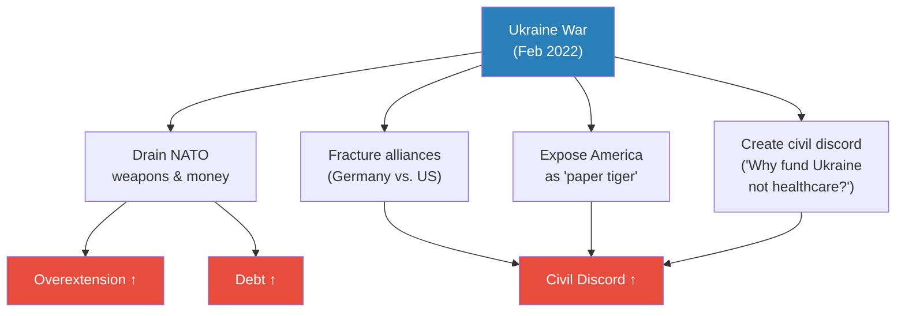

*Ukraine is not a battlefield in the traditional sense — it is a strategic instrument designed to drain all three pillars of American imperial power simultaneously.*

---

### Front 2: Enable Iran's Provocation

*Putin needs America to fight another war. The distraction will be Iran — enabled by a Russian nuclear guarantee.*

To control the situation in Ukraine, Putin needs to distract America. The mechanism is elegant:

- Putin talks to Iran and guarantees protection under the <b style="color: #2980b9">Russian nuclear umbrella</b>: if America uses nuclear weapons when it invades Iran, Russia will respond with nuclear weapons of its own
- With this assurance, Iran takes the initiative and provokes America into a wider war
- The provocation tools (from [[07 - Who Killed Iranian President Ebrahim Raisi|Lecture 7]]): Hezbollah attacks on Israel, nuclear programme expansion, Red Sea shipping disruption

This connects directly to the IRGC provocation strategy from Lecture 7 — the IRGC wants war, but needs assurance against nuclear annihilation. Putin provides that assurance, and in return gets a second front that further drains American resources, increases American debt, and deepens American civil discord.

The logic is mutually reinforcing:

- The IRGC wants to lure America into invading Iran (Lecture 7) — but fears nuclear retaliation
- Putin wants America distracted from Ukraine — but cannot open a second front himself
- The nuclear umbrella solves both problems: Iran gets the protection it needs to provoke, Putin gets the distraction he needs to drain
- <b style="color: #e74c3c">America ends up fighting two wars simultaneously — exactly the overextension that kills empires</b>

Prof. Jiang draws an explicit connection to earlier lectures in the series: "Remember how for the past few classes, we've been discussing how America wants to attack Iran, and Iran wants revenge against America." The Iran front is not a new development — it is the convergence of the series' two major arcs (the American arc from Lectures 1-8 and the Russian arc from Lectures 9-10).

> [!example] October 7 and Gaza as Putin's Second Front (October 2023)
> - On October 7, 2023, Hamas launched an attack on Israel that killed approximately 1,000 people
> - Israel responded by attacking Gaza — "killing a lot of children. Most people who are dying in this war are children"
> - Prof. Jiang argues Putin either knew about or encouraged the attack: "the main winner of this Hamas attack is obviously Vladimir Putin"
> - The Gaza war has diminished American prestige globally — America is "helping Israel commit genocide"
> - It has proven America cannot control its own ally — "people say that Israel now controls America"
> - It threatens to explode throughout the Middle East — "at any point, Iran can enter the battle. Hezbollah can enter the battle from the North"
> - "It's a powder keg. It's like a lake of gasoline about to be lit on fire"
> - College protests in America "will only expand in the fall"
> **The lesson:** Whether or not Putin orchestrated October 7, the outcome perfectly serves his strategy — diminished American prestige, exposed inability to control allies, increased risk of a wider war, and accelerating civil discord at home.

---

### Front 3: North Korean Belligerence

*As America becomes distracted in Ukraine and Iran, North Korea creates a third front — not by acting, but by threatening.*

The genius of the North Korean front is its economy of effort:

- North Korea can threaten to invade South Korea and the approximately 30,000 US troops stationed there
- North Korea doesn't actually have to do anything — <b style="color: #27ae60">the threat alone forces America to divert resources to East Asia</b>
- The threat may even force South Korea and the United States to start bribing North Korea — transferring wealth and legitimacy to the very actor creating the problem
- Putin has given North Korea his assurance of protection in the event of war — the same nuclear umbrella logic as Iran
- Each resource diverted to the Korean Peninsula is a resource unavailable for Ukraine, Iran, or anywhere else
- This is classic overextension: America is now stretched across Europe (Ukraine), the Middle East (Iran/Israel), and East Asia (North Korea) — all simultaneously

The pattern across Fronts 2 and 3 is identical: Putin provides a nuclear guarantee to an actor that wants to challenge America, and that actor does the work of draining American resources. Putin pays almost nothing — the cost is borne by the local actors and by America itself.

This is asymmetric warfare at the geopolitical level — the same principle from [[01 - Iran's Strategy Matrix|Lecture 1]] applied not to a single battlefield but to the entire global chessboard. The inferior power (Russia) does not try to match the superior power (America) directly. Instead, it controls the terms of engagement by choosing where, when, and how the pressure is applied — using proxies to multiply the effect while minimising its own exposure.

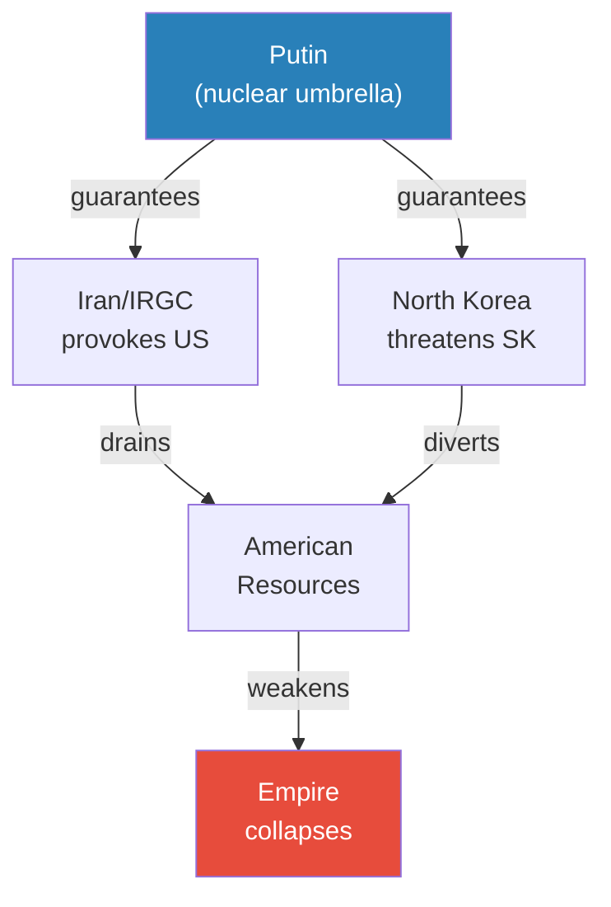

*Putin provides the guarantee; the local actors provide the pressure; America bears the cost. This is asymmetric warfare at the civilizational level.*

---

### Front 4: BRICS Expansion

*BRICS doesn't need to replace the dollar. It only needs to threaten — because money is confidence.*

Prof. Jiang predicts BRICS will continue to expand and may formally announce a new currency or trading system to counteract the American-led financial system. He addresses the common objection:

- "What people have said is that BRICS is not capable of replacing the US dollar. And that is true"
- But BRICS doesn't need to replace it — it only needs to create doubt
- "A lot of finance, a lot of money, it's just confidence. You have the US dollar because you're confident that it's valuable. But once you lose the confidence in US dollar, you will no longer want to use it"
- The petrodollar countries (Saudi Arabia, UAE, Bahrain) have already joined BRICS — these are the nations whose oil purchases give the dollar its underlying value
- If these countries opt out of the US financial system, the $35 trillion debt mountain becomes unsustainable

> [!tip] Core Insight
> BRICS is not a rival financial system — it is a weapon against confidence. Putin does not need to build a better dollar. He only needs to make the world doubt the existing one.

---

### The Five Fronts as a System

Before examining the final front, it is worth stepping back to see the pattern. Prof. Jiang's predictions for the next three to four years form a coherent system:

| Front | Actor | Mechanism | Weakness Targeted |
|-------|-------|-----------|-------------------|
| Ukraine | Russia directly | Drag on, drain resources, fracture NATO | Overextension + Debt + Civil Discord |
| Iran | IRGC (Putin-enabled) | Nuclear umbrella → provocation → second war | Overextension + Debt + Civil Discord |
| North Korea | Kim Jong-un (Putin-enabled) | Threaten → force resource diversion | Overextension |
| BRICS | Multilateral coalition | Alternative financial system → doubt dollar | Debt |
| China | Xi Jinping (neutrality) | Don't work with America → prevent triangulation | All three (enabling condition) |

No single front is decisive. Each operates independently and reinforces the others. The system cannot be defeated by addressing any one front — because the others compensate.

---

### Front 5: Russia-China Relationship

*Putin doesn't need China to do anything. He just needs China not to work with the United States.*

This is the most subtle of the five fronts:

- Putin will visit China more, maintain a very close relationship with Xi Jinping
- "There are lots of geopolitical differences between Russia and China, much more so than between China and the United States"
- But Putin doesn't need China as an active ally — he needs China as a non-participant in American strategy
- <b style="color: #e74c3c">The one strategy that could save the American Empire is triangulation with China against Russia</b>
- If China sided with the US: (a) Putin would be forced to defend the Russia-China border instead of playing offence; (b) China is a major buyer of US dollars, sustaining the debt; (c) historical Russia-China border wars mean real conflicts exist between them
- "As long as China remains neutral, then Russia and Putin can continue to exert pressure on the American empire"

A student (Peter) noted that China is already transferring its US dollar reserves into gold — encouraging the world to buy gold instead of dollars. Prof. Jiang confirms: "China is now no longer buying US dollars, and it's transferring its US dollars into gold." This independently weakens the US financial system — and it is happening whether or not China formally sides with Putin.

Prof. Jiang explains why China's neutrality is sufficient for Putin's purposes and why active Chinese cooperation is not required:

- If China works with the United States, Putin faces three problems:
  - He must defend the Russia-China border (historically contested through multiple wars), forcing him from offensive to defensive posture
  - China continues buying US dollars, sustaining the debt
  - American overextension eases — no East Asia threat means fewer fronts
- But if China merely stays neutral, Putin can ignore the eastern border and focus entirely on the offensive
- "As long as China remains neutral, then Russia and Putin can continue to exert pressure on the American empire"
- The beauty of this arrangement: Putin does not need to convince China to do anything aggressive — he only needs to ensure America keeps pushing China away

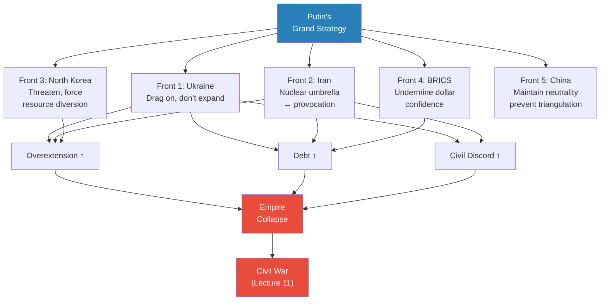

*Every front independently worsens one or more of the three empire-killing weaknesses. All five operate simultaneously, reinforcing each other.*

---

## Why China Chooses Russia

*A student asks the natural question: why would China align with Russia when its economic relationship with America is so much more valuable? The answer reveals China's desperation.*

Prof. Jiang's answer is blunt: <b style="color: #e74c3c">China has no choice</b>.

- The United States is launching an economic war against China (tariffs on electric vehicles, technology restrictions)
- China is surrounded by US military bases
- China is completely dependent on imports of oil and food to sustain its economy
- "If America ever launches an embargo against China, China collapses"
- China needs new trade routes — the only partner with access to energy and oil is Russia
- "Chinese policymakers know that the situation in China is terrible. The economy has collapsed, demographics has collapsed"
- "If America says to the world China is our enemy, then China has no choice but to find a new friend. And unfortunately, the only friend that China has right now is Russia"

> [!example] The Taiwan Question — Hubris in Action
> - Celine asks: why does the US think China will attack Taiwan?
> - Prof. Jiang's answer: "America is always looking to start new wars. It has something called the military-industrial complex, and America is always fighting wars"
> - No evidence China will invade Taiwan — the real US-China relationship is mutually beneficial: "China sends America a lot of cheap goods, and the US gives China a lot of US dollars"
> - "Basically, what's happening is that the Communist Party is storing the wealth of the Chinese people in American banks. This is a great deal for both America Wall Street and the Chinese Communist Party"
> - What does America actually lose if China takes Taiwan? "Not that much" — semiconductor industry can be relocated — but as an empire with hubris, America must "save face"
> **The lesson:** The gap between actual strategic interest (minimal) and perceived imperial necessity (total) is itself a manifestation of hubris.

---

## Prof. Jiang's Testable Predictions

*Prof. Jiang provides a concrete timeline and specific predictions that can be tested against reality — the same analytical model-building methodology he taught in [[05 - Why Trump Will Win|Lecture 5]].*

Over the next three to four years, Prof. Jiang predicts all five of these developments will be observable:

1. **The Ukraine war does not end.** Putin will find a way to drag it on without actually expanding it. No peace deal. No negotiated settlement. No attack on Poland or any NATO member. Just a slow, grinding drain on NATO resources and unity.

2. **Iran takes the initiative against the United States.** Emboldened by the Russian nuclear umbrella, the IRGC will accelerate its provocation strategy — Hezbollah attacks, nuclear programme expansion, shipping disruption, or some combination.

3. **North Korea becomes much more belligerent** against South Korea and Japan, forcing America to focus more attention and resources on East Asia. Not necessarily invasion — the threat alone is sufficient.

4. **BRICS continues to expand** and may formally announce a new currency or trading system. The key metric is not whether BRICS replaces the dollar (it won't) but whether it erodes confidence in the dollar (it can).

5. **The Putin-Xi Jinping relationship continues to deepen.** More visits, more public displays of alignment. The critical signal: China does not cooperate with the United States against Russia.

If these predictions unfold, Prof. Jiang's model is strengthened. If they do not, the model needs revision. This is the empirical discipline he insists on even while critiquing empiricism as a philosophical tradition — the method and the mindset are different things.

---

## The Russian Strategic Imagination: Joseph Stalin and World War Two

*Prof. Jiang transitions to the lecture's second half with a bold claim: Putin's plan makes him look like a genius, but this is not personal genius — it is a product of Russian strategic culture. "For many reasons, Russian leaders have a strategic imagination. They just think differently and more strategically than anyone else." The proof case: Joseph Stalin's manipulation of the entire Second World War.*

### The Game Board in 1939

*To understand what Stalin did, you must first understand the board he was playing on.*

Prof. Jiang maps six global powers in 1939, each with specific constraints and interests:

| Power | Key Characteristics | Attitude Toward Soviet Union |
|-------|--------------------|-----------------------------|
| **United States** | Far away, neutral, isolationist, suffering Great Depression | Feared communism (America "on the brink of revolution" in the 1930s) |
| **Japan** | War machine reliant on imports; needs oil from either Soviet Far East or Southeast Asia; US angry about Japan invading China | Would love to invade Soviet Union — hates communism, wants Soviet oil |
| **Germany** | Lost WWI, paying reparations, Hitler reuniting Greater Germany; "Nazism hated communism the most" — Hitler believed Jews were communists | Wanted to destroy Soviet Union above all |
| **UK/Britain** | Island empire with global colonies | Wanted communism destroyed |
| **France** | Weakest power, still an empire | Wanted communism destroyed |
| **Soviet Union** | Communist, huge, trying to industrialise, behind the West, still agricultural, lacking technology | Everyone's target |

Prof. Jiang draws special attention to the constraints that make each power's position clear:

- **Japan's choice:** Japan was getting most of its oil from the United States. But the US was angry about Japan's invasion of China and would likely cut off exports. Japan faced a binary choice: invade the Soviet Far East (oil) or invade Southeast Asia (oil). Either way, Japan needed to fight someone for resources — and the Soviet Union was one of two targets.
- **Hitler's real priority:** "What did Hitler believe about Jews? They control the world economy. But there's actually a better reason why he hated Jews — they were all communists. Hitler thought that all Jews were communists. So Hitler hated first and foremost communism. Nazism hated communism the most." Hitler's ultimate goal was not world conquest but the destruction of the Soviet Union.
- **The American domestic threat:** "In the 1930s, America was on the brink of revolution. The communists could have at any time taken over America if America failed to stop the economic bleeding." The communist movement was not a foreign curiosity — it was a direct threat to every capitalist government's survival.

The game theory prediction for 1945 is stark: <b style="color: #e74c3c">the world should have united against the Soviet Union, partitioned it, and destroyed global communism once and for all</b>.

- Japan needed Soviet oil and hated communism — two reasons to invade
- Hitler hated communism above all else and wanted Soviet resources for German industry
- Britain, France, and America all feared the global communist movement as an existential domestic threat
- The Soviet Union had resources everyone wanted and was militarily weak — huge territory but no technology, no industry, still agricultural
- "In 1939, using game theory, the Soviet Union should have been destroyed"

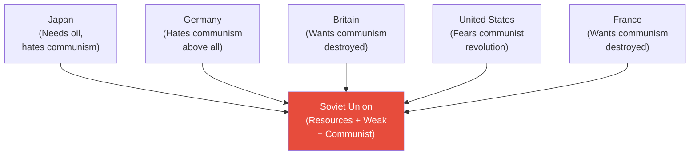

*In 1939, every major power had reasons to destroy the Soviet Union. Game theory predicts partition and the end of global communism. That is not what happened.*

---

### The Molotov-Ribbentrop Pact: Stalin's Opening Move

*Stalin's first move changed the entire trajectory of the war — and it was devastating in its elegance.*

In 1939, Stalin signed the <b style="color: #2980b9">Molotov-Ribbentrop Pact</b> with Hitler — an agreement to partition Poland:

- Germany attacked Poland from the west
- The Soviet Union attacked from the east
- Britain and France declared war on Germany — <b style="color: #27ae60">but NOT on the Soviet Union</b>
- The pact also committed the Soviet Union to supply Germany with resources for its war machine: oil, food, Ukrainian grain

Prof. Jiang's analysis: "That's pretty clever Stalin, don't you think?"

- Without the pact, Hitler might not have invaded Poland at all — he needed Soviet resources and a guarantee against a two-front war
- By giving Hitler what he needed to start a war with the Western powers, Stalin redirected the world's hostility away from the Soviet Union and onto Germany
- Germany was now embroiled in a western war while the Soviet Union watched from the sidelines

> [!example] Rudolf Hess's Peace Mission (May 1941)
> - After Germany defeated France and drove Britain back to its island, Hitler tried to make peace with Churchill — seven times
> - Churchill refused every time — "go to hell. We're going to fight this war till the end"
> - Why? Because Germany had destroyed the British Army — "it's a complete loss of faith for the British Empire"
> - Hitler even sent his emissary Rudolf Hess to Scotland to negotiate a truce
> - Churchill put Hess in prison
> **The lesson:** Churchill's fury at the destruction of the British Army made a Western peace with Germany impossible — ensuring the war continued and Germany remained trapped in a western conflict.

The consequences cascaded exactly as game theory would predict if Stalin had designed the outcome:

- Germany invaded Poland → Britain and France declared war on Germany (but NOT on the Soviet Union)
- Germany then defeated France and drove Britain back to its island
- Hitler tried seven times to make peace with Churchill — Churchill refused every time
- With France occupied and Britain isolated, Germany was now trapped in a western war with no exit
- The Soviet Union, meanwhile, had expanded its territory (eastern Poland) while remaining at peace with everyone

---

### Operation Barbarossa: The Conventional Narrative vs. Game Theory

*In June 1941, Hitler invaded the Soviet Union. Every historian will tell you this proves Stalin was a fool. Prof. Jiang argues the opposite.*

**The conventional narrative says Stalin made four catastrophic mistakes:**

- **Refused to defend the border:** 4-5 million Soviet troops at the border were given direct orders not to provoke the Germans — "the Germans fire, you don't fire back"
- **Ignored intelligence:** Massive intelligence indicated the invasion was coming. German soldiers literally deserted, swam across the river to the Soviet side, and told the Soviets the entire army was about to attack. <b style="color: #e74c3c">The Soviets shot these German soldiers because they thought they were spies</b>
- **Purged the Red Army:** The top generals of the Soviet Army were dead or in prison — purged for political disloyalty
- **The root cause:** Stalin trusted Hitler — the ultimate mistake

Prof. Jiang's verdict on the conventional narrative: "This is completely wrong. This analysis is completely wrong."

> [!abstract] Theory Evaluation: Why Did Stalin "Fail" at Barbarossa?
> | Explanation | The Claim | Prof. Jiang's Response |
> |------------|----------|----------------------|
> | Stalin trusted Hitler | Stalin was naive and deceived | Game theory shows this was the only winning move |
> | Ignored intelligence | Stalin was blind to the threat | Deliberate — needed Germany to attack first |
> | Didn't defend border | Military incompetence | Ensured Germany advanced deep enough to trigger American aid |
> | Purged generals | Paranoid self-destruction | Removed potential obstacles to the plan |

---

### Stalin's Four Scenarios: The Game Theory Reinterpretation

*Prof. Jiang presents the most provocative argument in the lecture — that Stalin's seemingly disastrous decisions were the only rational strategy available.*

There were 4-5 million Soviet troops at the border. "What were they doing there? They were about to attack Germany." The Soviets had a plan to attack Germany, but the Germans struck first. Prof. Jiang analyses four possible scenarios:

**Scenario A: Soviets attack first and reach Berlin**
- Result: Japan invades from the east, Britain comes to Germany's aid, United States joins Britain
- "All the world unites against the Soviet Union"
- <b style="color: #e74c3c">Soviet Union loses</b>

**Scenario B: Soviets attack but are stopped at the border**
- Japan still invades from the east
- Britain negotiates peace with Germany — "Britain cannot afford for the Soviet Union to overrun Germany, because then communism takes over Europe"
- Soviet Union does not win — "not that good either"

**Scenario C: Germans attack and Soviets hold them at the border**
- Germany and Soviet Union destroy each other in a border war
- "United States, Britain, Japan, they're all laughing. They're like, oh, they're just killing each other. Who cares?"
- <b style="color: #e74c3c">No one helps the Soviet Union</b>

**Scenario D: Germans attack and nearly destroy the Soviet Union**
- Now the other countries MUST come and help the Soviet Union
- Why? "If Germany takes over the Soviet Union — they take over the resources, therefore they take over the world. Germany has technology, military power, but lacks resources. You combine the resources with the German military, they are invincible"
- "The United States would never, ever attack Germany again"
- <b style="color: #27ae60">This is the ONLY scenario where the world helps the Soviet Union</b>

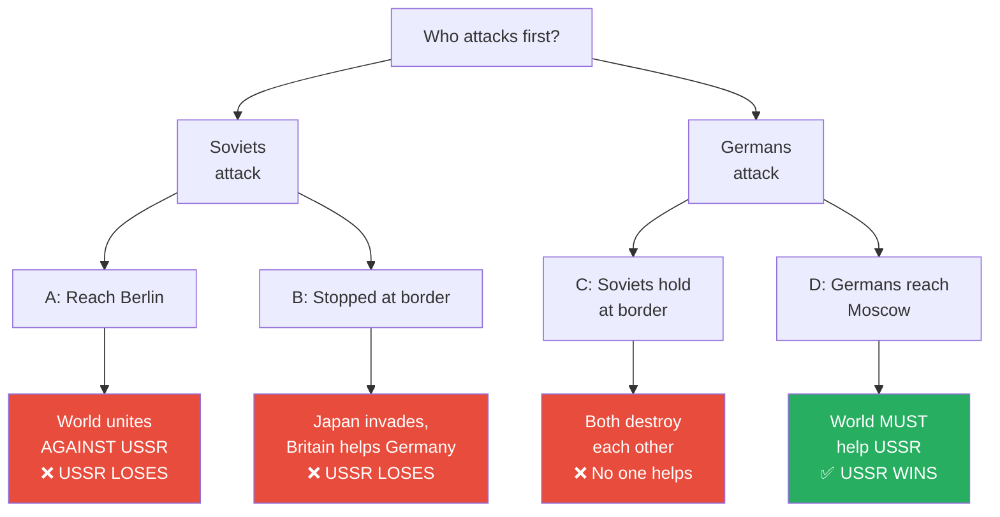

*Of four possible outcomes, only one — Scenario D — produces a result where the Soviet Union survives and thrives. This is what happened. Prof. Jiang argues it happened by design.*

> [!tip] Core Insight
> "In history, you're taught that Operation Barbarossa proved that Stalin was not a strategic genius, that he was played by Hitler. But if you just do game theory analysis, this was the best possible outcome for the Soviet Union." In 1939, the world should have united against the Soviet Union. Instead, the world united against Nazi Germany and gave the Soviet Union the technology, money, and resources to become a global superpower.

---

### What Scenario D Produced: Lend-Lease and National Unity

*The consequences of Scenario D were transformative — America had no choice but to industrialise its ideological enemy.*

After Germany invaded and the Soviet Army was nearly destroyed, America immediately began providing massive aid — the <b style="color: #2980b9">Lend-Lease programme</b> (1941-1945). Prof. Jiang details the staggering scale, and the numbers are worth absorbing slowly:

| Category | What America Gave | Scale |
|----------|------------------|-------|
| **Ammunition** | All types of ammunition | 1/3 of everything the Soviet Army used |
| **Explosives** | All types of explosives | 1/3 of everything the Soviet Army used |
| **Aircraft** | 14,000 aeroplanes | 1/2 of the Soviet Air Force |
| **Tanks** | 13,000 tanks | 1/2 of the Soviet armoured force |
| **Copper** | Industrial copper supplies | 80% of Soviet copper |
| **Aluminium & Steel** | Structural metals | 55% of Soviet supply |
| **Technology** | Radio communications, railroad transportation, heavy industry | Complete technology transfer |
| **Food** | Rations for millions of soldiers | Massive quantities |

Total value: <b style="color: #27ae60">$200 billion — for free</b>. "In other words, America basically built the Soviet Union in heavy industry for it."

And there was a crucial secondary benefit Prof. Jiang emphasises: "At the end of the day, what the Soviet Union can do is reverse engineer all this technology and build its own industry." America was not just lending equipment — it was transferring the knowledge base for permanent industrial capability.

America had no choice. The logic was inescapable:

- If Germany takes over the Soviet Union, Germany gets Soviet resources
- Germany already has technology and military power — add resources and "they are invincible"
- "The United States will be forever shut out of the world"
- "Germany will not invade the United States. The United States would never, ever attack Germany again"
- Therefore America MUST prevent German victory — even if it means building up the Soviet Union

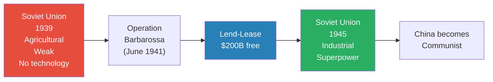

*Lend-Lease transformed the Soviet Union from a weak agricultural nation into a global superpower — which then turned China communist. All for free, because America had no alternative.*

---

But Lend-Lease was not even the most important benefit. Prof. Jiang argues the second benefit mattered more:

**National unity through shared sacrifice:**

- Before the German invasion, the Soviet Union was torn apart — civil war, class conflict, the rich fleeing the country
- After the invasion, the entire nation unified in what they called the <b style="color: #2980b9">Great Patriotic War</b> — fighting for "the love of mother Russia"
- The Russians lost 26 million people in the war — "that's a lot of people"
- "But by losing this many people, it made the entire nation refuse to surrender. They had the will to fight. Much more so than the Germans"
- The will to fight, not technology, turned the war

> [!example] The 26 Million and the Will to Fight
> - Before the invasion, communism was "tearing the country apart" — civil war, class hatred, mass emigration
> - The German invasion gave every Soviet citizen a personal reason to fight — not for communism, but for survival, for family, for motherland
> - 26 million deaths did not break the nation — they hardened it
> - The Germans, despite superior technology and initial victories, could not match the sheer determination of a people fighting on their own soil
> - Stalin needed this national unity more than he needed the tanks and planes — because without it, the Soviet Union would have fractured from within
> **The lesson:** Sometimes a nation must nearly die in order to discover the will to live. Stalin understood this — and ensured it happened.

---

### Stalin Played Hitler: The "I Trust You" Deception

*The deepest question: if Scenario D was the only winning move, how did Stalin ensure it happened? The answer involves the most psychologically sophisticated element of the Russian strategic imagination.*

Prof. Jiang poses the question: in June 1941, Hitler did not have to invade the Soviet Union. He could have waited for Stalin to invade him — in which case the opposite would have happened (America would have joined Hitler's side, and together they would have destroyed the Soviet Union). So what convinced Hitler to do "the most insane thing" and invade Russia first?

The answer: <b style="color: #27ae60">Hitler trusted Stalin</b>.

- "Everyone says that Stalin trusted Hitler, so Hitler played Stalin. But if you just analyse the game, then the conclusion is: Stalin played Hitler"
- Hitler did everything Stalin wanted him to do:
  - Invaded Poland → brought France and Britain into war against Germany
  - Attacked Soviet Russia → brought America into the war to build the Soviet Union into a superpower

Prof. Jiang offers a thought experiment:

> [!example] The "Three Words" Thought Experiment
> - Imagine Stalin and Hitler having drinks on a porch, staring at the mountains
> - All Stalin has to do is say three words: "I trust you"
> - "I, Joseph Stalin, trust you, Adolf Hitler. I don't trust anyone. I don't trust my own mother. But I trust you, Hitler"
> - What happens? Hitler thinks: "Stalin is a sheep. I am a wolf. I am a lion. You're a sheep — therefore I eat you"
> - This triggers Hitler's predatory instincts — he invades, confident of easy victory
> - But Stalin is not a sheep — he is the one who set the trap
> **The lesson:** Stalin could only pull this off with "multiple personalities" — the ability to genuinely embody a different identity, not merely pretend. Hitler had to truly believe Stalin was weak.

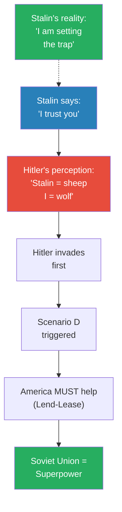

*The gap between Hitler's perception (sheep) and Stalin's reality (strategic genius) is the "multiple personalities" element of Russian strategic imagination.*

---

## The Three Elements of Russian Strategic Imagination

*Prof. Jiang distils the Russian strategic mind into three qualities — not personal traits of exceptional individuals, but cultural products of a distinct philosophical tradition that allows certain leaders to think at a civilizational level.*

### 1. Intuition (Zeitgeist)

- The ability to read the political winds — to "sense the mood of the world"
- The German word is <b style="color: #2980b9">Zeitgeist</b> — spirit of the times
- This is not intelligence gathering or data analysis — it is a felt sense of where history is heading
- Putin knows the American Empire is about to die, and feels the imperative to act — not because he read a report, but because he can sense the decay
- Stalin sensed in 1939 that the world's hatred of communism was the defining force — and built his strategy around redirecting that hatred onto Germany instead
- Prof. Jiang emphasises this quality cannot be taught or bureaucratised — it arises from a culture that values the mystical and the intuitive

### 2. Imagination

- The ability to not just sense the present but to imagine how interventions will change the future
- "They can also imagine, hey, if I did this, how would these winds change?"
- This is prophecy in the Greek sense — not predicting a fixed future but seeing how actions create new realities
- Stalin could imagine all four scenarios and see which one the Soviet Union needed — then engineer the conditions for that specific scenario to occur
- Putin can imagine how Ukraine, Iran, North Korea, BRICS, and China interact over three to four years — seeing a system where Western analysts see separate crises
- The difference between imagination and analysis: an analyst evaluates what has happened; a strategic imagination sees what could happen and makes it real

### 3. Multiple Personalities

- "Putin and Stalin are such brilliant men that they embody multiple personalities in them, and that's why they're so unpredictable"
- This is the strangest and most important of the three qualities
- Stalin had to genuinely become a "sheep" in front of Hitler — not just act like one, but truly embody passivity, trust, and vulnerability
- The difference between acting and being is critical: a good actor can pretend to be someone else, but a strategic genius can actually become someone else — inhabiting a different identity so completely that even the most suspicious observer is convinced
- This capacity for genuine transformation — being different people in different contexts — is what makes Russian leaders unreadable to Western analysts who assume people have one stable identity

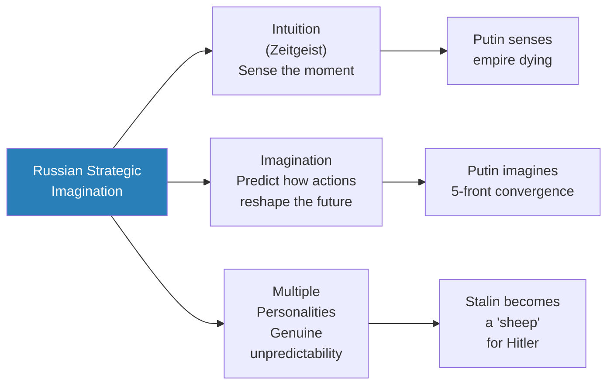

*The three elements work together: intuition tells you the moment is right, imagination tells you what to do, and multiple personalities allow you to do it without being detected.*

---

## British Philosophy vs. Russian Philosophy

*Prof. Jiang argues the difference between Western and Russian strategic capability is not individual genius but deep philosophical tradition. A student (Siteng) asked the most important question: "Why are the Russians different?" Prof. Jiang's answer: "The problem isn't Russia. The problem is us — the West."*

### The Western (British) Mind

Western thinking comes from British thinking. Three characteristics:

- <b style="color: #2980b9">**Narrow:**</b> Britain is an island — "therefore it thinks very narrowly about the world." British literature reflects this: Jane Austen, Thomas Hardy — "great, but very narrow in their focus"
- <b style="color: #2980b9">**Empiricism:**</b> David Hume's philosophy — "we can only know what we experience. We can only know what we see." Another word: scepticism. "Be sceptical of abstract philosophy, because we can never know it." This limits imagination.
- <b style="color: #2980b9">**Logic:**</b> "Like mathematics. You can go from one to two to three to four to five. Everything has to be logical. Everything has to be connected together."

These three qualities created the modern Western mind — "this is what dominates in academia":

- "This is bureaucratic thinking. This is the bureaucratisation of the imagination"
- "You're not allowed to say things without evidence and logic and experience"
- Perfect for building stable bureaucracies and institutions
- But: <b style="color: #e74c3c">"No great man could ever arise from Washington society"</b>
- The system produces process-oriented, systematised thinking that cannot recognise or counter strategic genius

### The Russian Mind

Russian thinking has the opposite characteristics:

- <b style="color: #2980b9">**Broad:**</b> Russia is the world's largest country — "therefore it thinks very broadly about the world." Russian literature: Leo Tolstoy — War and Peace, Anna Karenina — "very huge epics"
- <b style="color: #2980b9">**Mysticism:**</b> "Very spiritual, religious people. There are forces we don't understand. There are individuals who are prophets, who are sent to us by God. We can never know who they are. We can never know how they think, but we just have to believe that's the case"
- <b style="color: #2980b9">**Intuition:**</b> "You can jump. You can imagine things. You don't have to be logical"

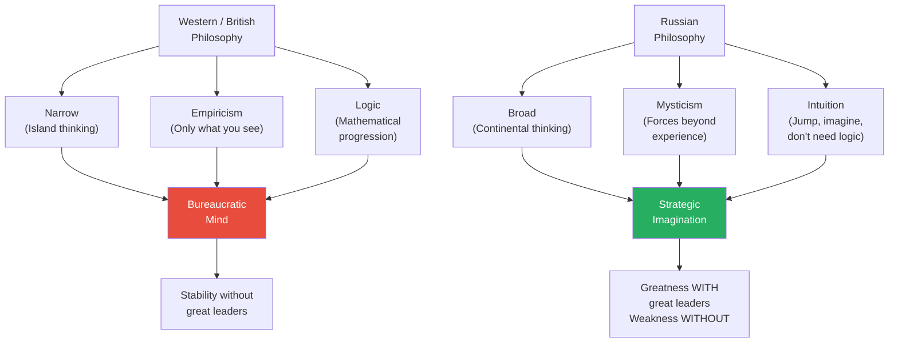

*The British system creates stable mediocrity. The Russian system creates volatile brilliance — capable of extraordinary feats with great leaders, dangerously weak without them.*

---

### The Trade-Off

Prof. Jiang is explicit about the asymmetry — and he is fair about the weaknesses of the Russian system:

- "There's obviously more good things about the [British] system than about [the Russian] system"
- The British system doesn't need great leaders — the bureaucracy sustains itself through processes, institutions, and accumulated knowledge
- The Russian system DOES need great leaders — "if you don't have Putin or Stalin, then this system becomes very weak"
- The periods between great Russian leaders can be catastrophic — the system has no built-in stability
- But with a great leader, the Russian system "allows someone to completely follow your intuition and imagination to do great things, like Joseph Stalin in World War Two and what Putin is doing today"
- The British system trades greatness for stability; the Russian system trades stability for the possibility of greatness

This creates an asymmetric contest:

- The Western system produces consistent, predictable, mediocre strategic output — competent but never brilliant
- The Russian system produces either catastrophic failure or extraordinary genius — with nothing in between
- When the two systems clash and Russia has a great leader, the Western system has no mechanism for recognising or countering what it faces
- When Russia lacks a great leader, the Western system wins through sheer institutional momentum

> [!example] Prof. Jiang's Self-Referential Test
> - "I could never give this talk in America or Britain, because they will all think I'm crazy"
> - The objections would be: "What's your evidence for this? Are you refuting decades of scholarship about World War Two? Are you telling me that Stalin was a genius when no one thought he was a genius? How dare you refute these thousands of scholars"
> - This reaction — demanding narrow evidence, empirical proof, logical chains — is itself proof of the system's limitations
> - The bureaucratic mind cannot accommodate the possibility that its entire framework is wrong
> **The lesson:** The Western system is blind to precisely the kind of thinking that threatens it — because the system's epistemological rules exclude the methods needed to detect it.

> [!tip] Core Insight
> The most dangerous strategic advantage is one your opponent's intellectual framework cannot even recognise. The Western bureaucratic mind — narrow, empirical, logical — literally cannot see what Putin and Stalin are doing, because seeing it would require the breadth, mysticism, and intuition that the system has systematically eliminated.

---

## The Greek Connection

*A student asks about the Greek influence on British thinking. Prof. Jiang's answer reveals an important lineage.*

- The Greeks are "more like the Russians than they are like the British" — both believed in imagination and intuition
- But the West does not follow Greece — it follows Rome
- "After the Greeks came the Romans. The Romans were like [the British system]. And it was the Romans who influenced the British, who then influenced Americans"
- <b style="color: #27ae60">"We're living basically in a Roman world, as opposed to a Greek world"</b>

What influences Russia?

- Russians say they are a Christian nation from a Christian tradition, and the Christian tradition comes from a Greek tradition
- Russian Christianity claims to be "a more pure or more ancient form of Christianity"
- Specifically: <b style="color: #2980b9">pre-Augustinian Christianity</b> — before Augustine transformed Christianity into the more logical, systematic theology that dominated the Western Church
- This older, more mystical Christianity preserved the Greek emphasis on intuition and imagination that the Western (Roman/Augustinian) tradition suppressed

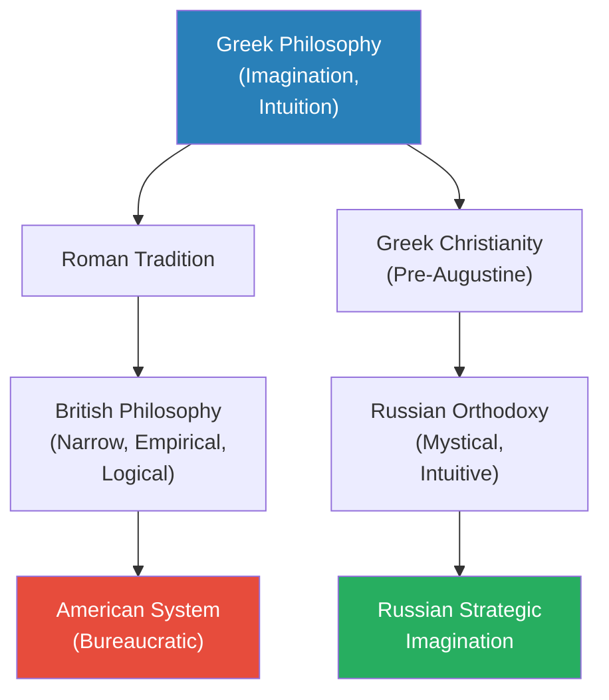

*The West inherited Rome's systematising impulse. Russia inherited Greece's mystical imagination — through a pre-Augustinian Christianity that preserved what the Western Church discarded.*

---

## The Putin-Stalin Parallel

*The lecture's two halves converge: Putin's contemporary strategy and Stalin's historical achievement are products of the same philosophical tradition, using the same three elements of strategic imagination.*

| Element | Stalin (WWII) | Putin (Today) |
|---------|--------------|---------------|
| **Intuition** | Sensed that the world hated communism and would unite against the Soviet Union | Senses that the American Empire is dying and the moment to act is now |
| **Imagination** | Imagined the only scenario (D) where the world would help instead of destroy | Imagines how five simultaneous fronts converge to collapse the empire over 3-4 years |
| **Multiple personalities** | Became a "sheep" to make Hitler believe he was prey, not predator | Appears as a conventional nationalist to the West while executing a civilizational strategy |

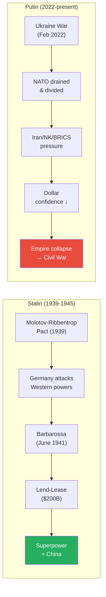

*Two Russian leaders, eight decades apart, using the same strategic logic: exploit your enemy's structural weaknesses, engineer the only scenario that benefits you, and present yourself as something other than what you are.*

---

## The German Economy: How America Destroyed Its Own Ally

*One of the most striking sub-arguments in the lecture concerns Germany — how America's own actions against Russia backfired by destroying the economic foundation of its most important European ally.*

Prof. Jiang explains the German economy with brutal clarity:

- Germany is a manufacturing economy built on a simple three-step formula:
  1. Buy cheap Russian gas (via the Nord Stream pipeline)
  2. Manufacture goods (especially cars)
  3. Sell them to China
- This formula made Germany the most powerful economy in Europe
- The United States destroyed this formula by doing two things:
  - Blowing up the Nord Stream pipeline — cutting off the cheap Russian energy that powered German factories
  - Imposing a trade war on China — destroying the export market where Germany sold its manufactured goods
- "So basically the German economy is about to collapse, and Germans are very angry about this"

The irony is devastating:

- America destroyed its own ally's economy in order to punish Russia
- But Russia has found alternative buyers for its oil and gas (China, India, Middle East, Africa)
- Germany, not Russia, is the one suffering
- <b style="color: #e74c3c">Germany does not want to fight this war. Germany wants out.</b>
- This creates the NATO fracture that Putin needs — the longer the war drags on, the more friction builds between Germany (which is paying the economic price) and the United States (which is paying the financial price but not the industrial price)

> [!example] The Nord Stream Pipeline — America Sabotaging Its Own Alliance
> - The Nord Stream pipeline connected Russian gas directly to Germany — the energy lifeline of Europe's largest economy
> - The United States blew up the pipeline (Prof. Jiang states this as fact)
> - The intended target was Russia — cut off its European revenue
> - The actual victim was Germany — cut off its industrial energy supply
> - Russia found new customers; Germany found no new energy source at comparable cost
> - The result: Germany is economically crippled and increasingly resentful of American leadership
> **The lesson:** When an empire acts from hubris rather than strategy, it often damages its own allies more than its enemies. Putin did not need to fracture NATO — America did it for him.

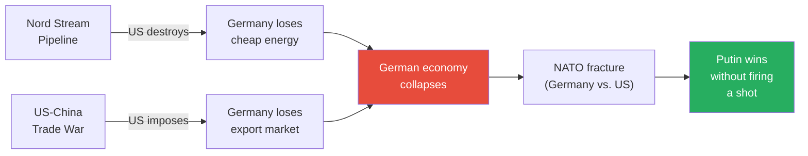

*America intended to punish Russia. Instead, it destroyed Germany's economy and fractured its own alliance. Putin's strategy does not require him to break NATO — American hubris does it for him.*

---

## Connections

**Builds on:** [[09 - Putin's War for the Soul of Russia]] (Putin's civilizational motivation — Western consumerism corrupting Russia, the need to destroy the source), [[03 - How Empire is Destroying America]] (empire economics, financialisation, petrodollar, debt as structural weakness), [[06 - America's Imperial Hubris]] (three fatal weaknesses — overcommitment, no strategy, hubris — which Putin exploits), [[07 - Who Killed Iranian President Ebrahim Raisi]] (IRGC provocation strategy that Putin enables through the nuclear umbrella guarantee)

**Sets up:** [[11 - The Second American Civil War]] (the endpoint of Putin's strategy — civil discord reaching its tipping point, the "most likely outcome" for America)

**Related books in vault:** [[The 48 Laws of Power - Robert Greene]] (Law 3: Conceal Your Intentions — Stalin's "I trust you" deception; Law 8: Make Other People Come to You — Putin's strategy of provoking America into overextension; Law 29: Plan All the Way to the End — both leaders' long-horizon strategic vision), [[Made to Stick - Chip Heath & Dan Heath]] (Prof. Jiang's lecture structure itself is a masterclass in making complex geopolitical arguments stick — concrete examples, emotional stories, unexpected reframings)

**Series arc position:** This is the penultimate geopolitical lecture before the series shifts to internal American dynamics. The arc from Lectures 1-8 (America will fight Iran) and Lectures 9-10 (Russia is accelerating the empire's collapse) converge in Lecture 11 (the empire collapses into civil war). Every thread — asymmetric warfare, imperial hubris, financialisation, the IRGC, and now Putin's five-front strategy — leads to the same destination.

---

## The Takeaway

This lecture operates on three levels, and each level is more provocative than the last. On the surface, it is a strategic briefing: Putin is exploiting three structural weaknesses in the American Empire through five simultaneous pressure campaigns, and the predictions are testable — within three to four years, we should see all five fronts active and reinforcing each other. This alone would make for a substantial lecture. But Prof. Jiang is not interested in mere prediction.

The second level is historical revisionism. The claim that Stalin was not duped by Hitler — that he engineered the only scenario in which the world would help the Soviet Union — is a direct challenge to decades of World War Two scholarship. Prof. Jiang does not present evidence in the traditional sense. He presents logic: given the game board of 1939, Scenario D was the only one producing a Soviet victory, and Scenario D is exactly what happened. The four "mistakes" that historians cite (refusing to defend the border, ignoring intelligence, purging generals, trusting Hitler) are not mistakes at all if the goal was to ensure Germany attacked first and advanced deep enough to trigger American intervention. This is the kind of argument that the Western academic system is structurally incapable of evaluating — because it demands the very qualities (breadth, mysticism, intuition) that the system has spent centuries eliminating.

Which brings us to the deepest level: the philosophical argument. The reason the West cannot see Putin's strategy — the reason historians have spent eighty years misunderstanding Stalin — is that the Western intellectual tradition has "bureaucratised the imagination." By insisting on narrow focus, empirical evidence, and logical chains, the British philosophical tradition (inherited from Rome, not Greece) created a system of thinking that produces stable bureaucracies but cannot produce or recognise strategic genius. The Russian tradition, rooted in pre-Augustinian Christianity and Greek mystical philosophy, preserves the breadth, mysticism, and intuition that allow leaders like Stalin and Putin to think at a civilizational level.

The trade-off is real — the Russian system is weak without great leaders, while the British system is stable without them. But in moments of civilizational crisis, the system that can produce a Stalin or a Putin has an advantage that no bureaucracy can match. Prof. Jiang acknowledges that "there's obviously more good things about the British system" — the stability, the institutions, the accumulated knowledge. But he argues it has one fatal flaw: it cannot recognise or counter the kind of strategic imagination that operates outside its epistemological boundaries.

The question Prof. Jiang leaves hanging — and which Lecture 11 will begin to answer — is what happens when the bureaucratic empire meets the strategic genius, the empire cannot even recognise what it is facing, and the result is not defeat on a battlefield but collapse from within. If Putin's five predictions come true over the next three to four years, this lecture will look less like speculation and more like a map of the future that was drawn while the West was arguing about evidence.
