# The Second American Civil War

> America is a nation addicted to violence — 434 million guns, a 250-year history of continuous war, and a culture that treats conflict as noble. Today, three structural forces are pushing the country toward a second civil war: the over-militarisation of society (where anyone from a small-town police chief to a Delta Force operator has access to devastating firepower), the death of every narrative that once bound the nation together (the American Dream, American goodness, liberalism), and the collapse of every trusted institution (government, media, science, military, universities, courts). Prof. Jiang argues that the trigger will be Donald Trump's return to power and his likely war with Iran — and that the most probable outcome, when the dust settles over 10 to 50 years of chaotic violence, is a Christian, isolationist theocracy. When America turns inward, consumed by its own fractures, it retreats from the world — creating the multipolar future that Lecture 12 will explore.

---

## The Question

*Prof. Jiang returns to the domestic American arc — Lectures 3, 5, and 6 examined empire, culture wars, and military hubris. This lecture asks the question those lectures were building toward: what happens when all of those forces converge inside America itself?*

The series has spent ten lectures building two parallel arcs. The first — Lectures 1, 2, 4, 7 — traced the external conflict between America and Iran, showing why war is coming and why neither side's civilian population wants it. The second — Lectures 3, 5, 6 — examined America's internal decay: the empire trap, the culture wars, institutional hubris. This lecture is where the two arcs collide.

- Prof. Jiang's opening claim is stark: <b style="color: #e74c3c">America is a country addicted to violence</b>
- The evidence is layered — cultural (gun worship, football), legal (Second Amendment), historical (continuous war since 1776)
- The argument builds from cultural DNA through historical pattern to structural analysis to specific prediction
- The conclusion connects back to the international arc: the civil war will both cause and be caused by the Iran war, and both will produce America's retreat from the world

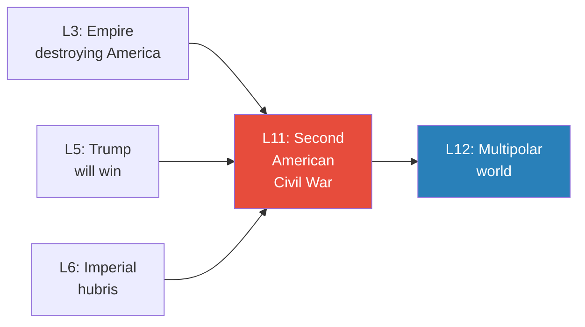

*Lectures 3, 5, and 6 built the domestic case. Lecture 11 asks the inevitable question: what happens when those forces explode?*

---

## Key Concepts at a Glance

| Concept | One-line summary |
|---------|-----------------|
| **America's violence addiction** | Cultural, legal, and historical embedding of violence as the default conflict-resolution mechanism |
| **The two founding visions** | Pilgrims/Puritans (Christian nation, God's laws → the right) vs. Founding Fathers/Deists (secular empire, reason → the left) — irreconcilable since the 1600s |
| **Rentier economy** | The top 1% make money by collecting debt, not creating value — new wealth is captured at the top |
| **Over-militarisation** | Weapons saturation at every level: 434M private guns, militarised police, armed federal agencies, Special Forces |
| **Narrative breakdown** | The American Dream, American goodness, and liberalism are all dead — no shared story binds the nation |
| **Institutional collapse** | Government, media, science, military, universities, and courts have all lost public trust |
| **Trump Derangement Syndrome (TDS)** | The left's inability to think rationally about Trump — hatred prevents the one strategy that would work |
| **The five stages of civil war** | Riots → civil conflict → state secession → insurgencies → coups d'état — all happening simultaneously over 10-50 years |
| **The VP trick** | Constitutional loophole: no limit on VP terms — Don Jr. as president, Trump as VP in 2028 |
| **Christian isolationist theocracy** | The most likely outcome — Christian nationalists in the military and Special Forces are the most willing to fight and die |

---

## A Nation Built on Violence

*Prof. Jiang opens not with politics but with culture — arguing that violence is not something that happens to America but something America is.*

### The Cultural Evidence

- <b style="color: #e74c3c">434 million guns</b> in private hands — 1.3 for every person in the country
- Many are semi-automatic weapons — not hunting rifles but instruments designed for killing humans
- The <b style="color: #2980b9">Second Amendment</b> treats gun ownership not as a privilege but as a sacred, constitutional right
- American football — the most-watched sporting event every year (the Super Bowl) — is an "extremely violent sport" that only Americans play
  - Players suffer devastating brain injuries
  - By age 30, many either commit suicide or kill someone because "their brains have been destroyed by the game"
  - Despite being "barbaric," Americans love it
- Americans worship their history of wars as "noble and sacred"

> [!tip] Core Insight
> Violence in America is not a pathology — it is an identity. It is embedded in the Constitution (Second Amendment), the culture (football), and the national mythology (war as sacred). This makes violence the default conflict-resolution mechanism when political solutions fail.

### The Historical Evidence — 250 Years of Continuous War

- Prof. Jiang argues that <b style="color: #e74c3c">America has been continuously at war since its founding in 1776</b> — and even before that
- He traces an unbroken chain of violence from the Revolution to the present

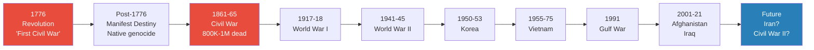

*America has been at war in every generation since its founding. Prof. Jiang asks: why would this generation be different?*

---

## The American Revolution as the First Civil War

*Prof. Jiang reframes the Revolution — not as a noble fight for liberty but as a tax rebellion that terrorised its own people.*

- The standard narrative: Americans fought a sacred revolution for human liberty
- Prof. Jiang's reframing: Americans fought because the British were taxing them — but the British had a legitimate reason to tax (they were providing defence)
- The rebellion was actually <b style="color: #2980b9">the first American Civil War</b> — many Americans were loyalists who wanted to remain in the British Union
  - These loyalists were "terrorised by extremists who wanted independence"
- After independence, Americans embarked on <b style="color: #e74c3c">Manifest Destiny</b> — the belief that it was God's will for America to control all of the Americas
  - Violent colonisation of all lands
  - Killing of natives and other peoples
  - God's will as justification for conquest

> [!tip] Core Insight
> The pattern was set from the beginning: Americans choose violence over compromise. The Revolution was avoidable. Manifest Destiny was a choice. The Civil War — which killed more Americans than both World Wars combined — was unnecessary. Violence is not the exception in American history. It is the rule.

---

## The First Civil War — A Structural Reading

*Prof. Jiang spends significant time on the 1861-1865 Civil War, not because it is unfamiliar but because the standard explanation is wrong — and the real causes reveal the same structural forces operating today.*

### The North-South Divide

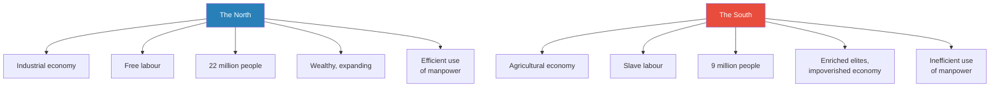

*Two radically different economic systems produced two radically different political cultures — but the war was about power, not morality.*

- The **North** was industrial — free labour was more efficient, producing a wealthy, expanding society of 22 million
  - "Free labour" meant you were free to do any job you want, and employers were free to hire anyone they wanted
  - "This system is obviously much more efficient because it's a much better use of manpower"
  - The result: the North prospered, expanded, and became "very, very wealthy"
- The **South** was agricultural — slave labour enriched plantation owners but "was not good for the economy as a whole — it was an inefficient use of manpower"
  - Only 9 million people compared to the North's 22 million
- In weapons manufacturing, logistics, and organisation, the North had overwhelming advantages — the industrial economy gave it the capacity to produce the material of war at scale

### The Real Cause — Western Expansion

- The nation was expanding westward, adding new states to the Union
- Each new state sent senators and representatives to Washington — and these votes determined the balance of power
- The fear: if western states were pro-slavery, the South would gain political control of the federal government. If anti-slavery, the South would be permanently marginalised.
- The <b style="color: #2980b9">Missouri Compromise</b>: for every slave state admitted, one free state must be admitted — maintaining the balance
- "Does that make sense?" Prof. Jiang asks — "To maintain the balance?" — this delicate arrangement kept the peace for decades
- The compromise began fracturing when states like Kansas "would want to be anti-slavery" — western states had their own opinions and refused to fit neatly into the compromise framework
- "For decades, this was a huge issue politically in America, which divided the nation"

### Lincoln and the Breaking Point

- The turning point came in 1860: <b style="color: #2980b9">Abraham Lincoln</b> was elected President of the United States
- Lincoln was "radically anti-slavery" — he believed slavery was evil and asked why, when "the rest of the world abolished slavery," it persisted in America
- But he was also a lawyer who recognised the South had a legal right to slavery under the Constitution
  - His plan was gradualist: limit slavery in the West, and "over time — it may be 100 years' time — slavery would naturally cease to exist"
  - This was a pragmatic middle path — morally opposed to slavery but legally respectful of the South's rights
- "The South did not like this plan, and they were afraid of what Lincoln might really do as president"
- They declared independence — seceding from the Union
- Lincoln's response was invasion — not to free the slaves, but to preserve the Union
- This is Prof. Jiang's key reframing: the war was about power, not morality

> [!example] Lincoln's Own Words
> - Lincoln himself stated the purpose of the war: "If I could end the war while freeing slaves, I would do so"
> - Slavery was not the main issue — keeping the Union intact was
> - The war was about how much power the federal government had
> - From the South's perspective, they were fighting for the right to freely express their political views
> - From the North's perspective, they were fighting to maintain the Union
> - Neither side needed to fight — they could have compromised, negotiated, or peacefully separated
> **The lesson:** America chose its bloodiest war — 800,000 to 1 million dead, more than World War I and World War II combined — over a dispute that could have been resolved through politics. Violence is America's default.

- Prof. Jiang's structural conclusion: <b style="color: #27ae60">America resolves conflicts through violence. It doesn't have a history of diplomacy. It has a history of war-making.</b>
- The implication for today: given this pattern, the current divisions in America are far more likely to produce violence than political compromise
- Prof. Jiang's rhetorical move here is important — he is not saying civil war is inevitable because today's problems are unique. He is saying civil war is inevitable because today's problems are normal for America, and America's normal response to problems is violence.

---

## The Divisions Tearing America Apart Today

*If America chose violence over compromise in 1861 with a single division (North vs. South), what happens when there are five overlapping divisions — all deeper and more irreconcilable than slavery?*

### Division 1: Inequality and Debt — Haves vs. Have-Nots

- The top 1% control most of the wealth and the <b style="color: #2980b9">means of production</b> — meaning that any new money entering the system is seized by them
- They make most of their money through collecting debt — a <b style="color: #2980b9">rentier economy</b>
  - Not through creating value but through exploiting others
  - The wealthy have a monopoly over wealth production
- What makes this worse: the inequality interacts with the culture wars
  - The wealthy tend to be on the left — urban, liberal, college-educated, coastal
  - The poor tend to be on the right — rural, religious, without higher education
  - So economic inequality maps directly onto cultural identity — being poor and being culturally marginalised are the same experience for the right

### Division 2: The Culture Wars — Left vs. Right

- This division traces back to <b style="color: #e74c3c">the very founding of America in the 1600s</b>
- Two opposing visions, both present from the beginning:

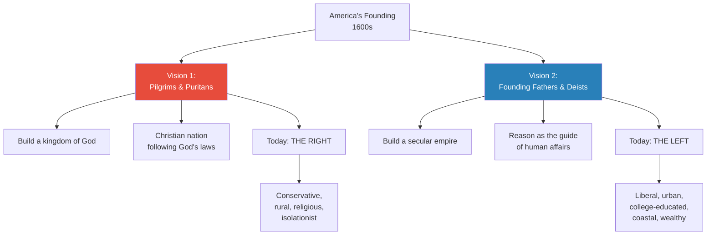

*The culture wars are not a modern invention. They are a 400-year-old argument about what America is.*

- <b style="color: #27ae60">Significant crossover between the left and the wealthy</b> — the left is urban, liberal, college-educated, and coastal
- These are "usually the people with all the money"
- The inequality makes the culture wars worse: the right feels economically and culturally marginalised

### Division 3: Empire vs. Democracy

- Many Americans benefit from America being an empire — Wall Street, the military-industrial complex, suburbanites
- But the rest suffer from it:
  - The wars in Afghanistan and Iraq made Wall Street very rich
  - But it was the poor — the right — who sent their sons to fight and die or "lost a limb"
  - It was the poor who were taxed to fund these wars
  - It is the poor who must pay off the debt from these wars
- The right is therefore <b style="color: #27ae60">deeply isolationist</b> — "they don't want to fight these wars. They think that America should be an island. It should not intervene in the affairs of the world."
- This connects directly to [[03 - How Empire is Destroying America|Lecture 3's argument]] about the empire trap
- The empire-democracy divide cuts across the other divisions: the pro-empire faction includes both left (liberal internationalists) and right (neoconservatives), while the anti-empire faction includes both left (anti-war progressives) and right (MAGA isolationists)
- This is why the coming civil war has no clean battle lines — the factions overlap and crosscut in ways that make the 1861 binary (North vs. South) seem simple by comparison

### Division 4: No Political Solutions

- The problem is that <b style="color: #e74c3c">there is no actual solution to any of these divisions</b>
- No political mechanism exists to resolve the inequality
- No compromise can bridge the culture wars
- No institution can mediate between empire and democracy
- When political solutions fail and the culture is addicted to violence, what remains is war

---

## Why Civil War Is Structurally Inevitable

*Prof. Jiang identifies three structural forces that, in combination, make civil war not just possible but virtually unavoidable.*

### Force 1: The Over-Militarisation of America

*At every level of American society — from the individual citizen to the most elite military unit — there is access to devastating firepower. The question is not whether someone can start a war, but when someone will.*

Prof. Jiang walks through the layers of American militarisation from bottom to top, and the picture is staggering:

- **Private citizens:** 434 million guns — 1.3 per person. Not just pistols and hunting rifles but semi-automatic weapons designed for combat. And these citizens believe gun ownership is their sacred, constitutional right — not a privilege the government grants but a right God gave them.
- **Local police:** "If you go to a small town in America and you look at the police there, you think it's safe — they should have pistols." In fact, they have armoured vehicles, sometimes tanks, helicopters, bulletproof vests, machine guns. All surplus from the military. "That's just a local police force — I'm not even talking about the state militias."
- **State National Guard:** "These guys are basically an army unto themselves." Each state has its own military force, equipped and trained for combat operations.
- **Federal agencies:** FBI, CIA, NSA, Homeland Security — "there's dozens of these federal agencies." Each one has its own special forces, tanks, helicopters, jets, bombs, missiles. Prof. Jiang's key point: "These guys can go to war against each other." Federal agencies are not just law enforcement — they are independent military forces.
- **The US military proper:**

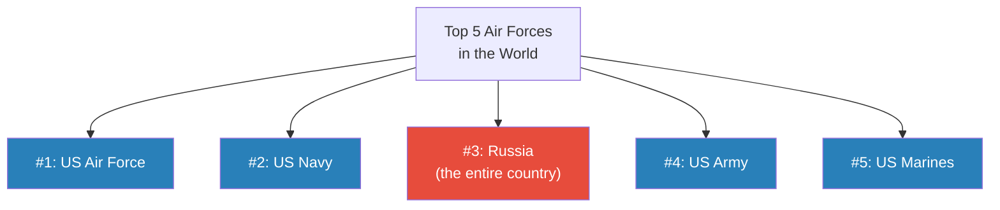

*Four of the top five air forces in the world are branches of the US military. Russia — the entire country — is sandwiched at number three.*

- **Special Forces — the real danger:**
  - In the year 2000, America had 38,000 Special Forces operators
  - Today: approximately 72,000-73,000 — nearly doubled in two decades
  - Trained in demolition, sabotage, guerrilla warfare — "an army unto themselves"
  - <b style="color: #e74c3c">It would take exactly 1,000 of these operators to overthrow the US government</b>
  - Delta Force — the most elite special forces unit in America — has exactly 1,000 members
  - "So you get this guy who runs Delta Force — if he was like, I want to overthrow the US government, for whatever reason, he can do so, because they're so powerful"
  - Prof. Jiang calls special forces "a bomb waiting to explode" — they cannot be controlled by bureaucracy, and their skills are designed for regime change
  - The problem with special forces is not what they do in service — it is what they do when they leave, or when they decide to act independently

> [!example] Mexican Special Forces and the Drug Cartels
> - In Mexico, the people who run the drug cartels are former Special Forces members
> - They commit "the most violence in the world"
> - They took their military training and applied it to organised crime
> - This is why you want to limit your special forces — but America has doubled them
> **The lesson:** Special forces are a bomb waiting to explode. Uncontrolled by bureaucracy, trained to overthrow governments, and ideologically committed — they are the single most dangerous variable in the coming civil war.

The cumulative picture is that <b style="color: #e74c3c">anyone who has access to weapons can choose to start a war</b> — and in America, everyone has access to weapons. The private citizen has a semi-automatic rifle. The local police chief has an armoured vehicle. The FBI has a private army. Delta Force has the capacity to take down the US government. The question is not whether America has the means for civil war — the question is whether anyone has the means to prevent it.

---

### Force 2: The Breakdown of National Narratives

*A nation is a fiction — a narrative that everyone believes in. When the narratives die, the nation dies with them.*

#### The American Dream — Dead

- The promise: work hard, play by the rules, and you will succeed
- <b style="color: #e74c3c">No one believes this anymore</b>
- Young people don't believe that hard work leads to homeownership or wealth
- They believe:
  - The game is stacked against them
  - Washington is corrupt and serves only the rich
  - The wealthy have stolen everything and monopolised wealth
  - Whatever money they make will be taken by the rich and the government
- The new American Dream: <b style="color: #e74c3c">how do I stay out of debt?</b>
  - College graduates carry tens of thousands in student loan debt
  - Consumers drown in credit card debt
  - Houses are unaffordable
  - If you buy a house, you can't pay off the mortgage

#### America Is Good — Dead

- The promise: America represents democracy, liberty, and freedom — a force for good in the world
- **The left** is taught that America is a nation founded on slavery, violence, and war — "a force of destruction and evil"
- **The right** believes America is an imperialist power that goes around destroying countries for no reason
- Israel has pushed more young people to believe that America is "a force of evil in the world"
- Neither side believes America is good anymore
- What makes this devastating is that both sides have arrived at the same conclusion from opposite directions:
  - The left says America is bad because it oppresses minorities domestically
  - The right says America is bad because it destroys countries internationally
  - They agree on the verdict but not the reasoning — so even their shared disillusionment cannot unite them

#### Liberalism — Dead

- The promise: even though we have differences, there are mechanisms to work them out — free speech, debate, evidence, logic, compromise
- <b style="color: #2980b9">Liberalism</b> was the glue that held left and right together — the agreement that differences could be resolved through reason
- In 2016, Donald Trump became president, and liberals "went crazy"
  - They could not believe Trump was elected
  - They concluded the problem was democracy itself
  - "If people are stupid, if people cannot be reasoned with, why give them freedom of speech? Why let them debate? Why let them vote?"
  - This is the liberal establishment abandoning its own founding principle — the belief in reasoned discourse
- <b style="color: #e74c3c">Liberalism is dead</b> — the mechanism that brought left and right together no longer functions
- The irony is devastating: liberalism — the ideology of tolerance, reason, and open debate — was killed not by its enemies but by its own adherents, who decided that tolerance, reason, and open debate were the problem

> [!tip] Core Insight
> The narratives that bind a nation together are more important than its laws, its military, or its economy. When the American Dream, American goodness, and liberalism all die simultaneously, there is nothing left to tell Americans why they should remain one country.

---

### Force 3: The Collapse of Institutional Authority

*What kept America together was the belief that the people in charge knew what they were doing and cared about the well-being of the nation. Recent events have proven this belief wrong.*

- **Government:** Corrupt, serves only the rich. Congress is "hated by everyone"
- **Media:** New York Times, Washington Post, CNN — "just liars" speaking for the rich. No one trusts them anymore
- **Science:** COVID destroyed trust in a single stroke:
  - The government "locked down the entire nation — kids could not go to school and the poor could not go to work and make a living"
  - Then mandated an "experimental vaccine" — "and people were like, why are we doing this?"
  - Prof. Jiang's framing: "There was absolutely no evidence that COVID was actually dangerous"
  - Whether or not one agrees with this assessment, the political consequence is clear: millions of Americans now see science as another tool of elite control, not a neutral pursuit of truth
- **Military:** Fights wars for no reason — Afghanistan, Iraq, Ukraine, Israel. The military once enjoyed the highest trust of any American institution; now it is seen as an instrument of empire that sacrifices the poor for the rich
- **Universities:** Politicised — teaching ideology rather than critical thinking. "They're not actually interested in teaching you how to think. They're interested in teaching how to think a certain way." The culture wars have consumed them
- **Courts and the justice system:** "This is falling as well because of Donald Trump." When a judge in New York convicted Trump of 34 felonies, "people are now no longer trusting the court system." Sacred institutions are falling "one by one"

> [!example] The 2008 Financial Crisis
> - The banks "basically stole from the nation, stole from the poor and kept the money"
> - Everyone was screwed except the banks themselves
> - This was one of the elite actions over the past 20 years that made people cynical about power
> - Combined with the pointless wars in Afghanistan and Iraq, COVID lockdowns and vaccines, and Trump's prosecution — every institution has been discredited
> **The lesson:** Trust is earned over decades and destroyed in moments. America's institutions spent their credibility on wars, financial fraud, and political persecution — and now there is nothing left to bring people together.

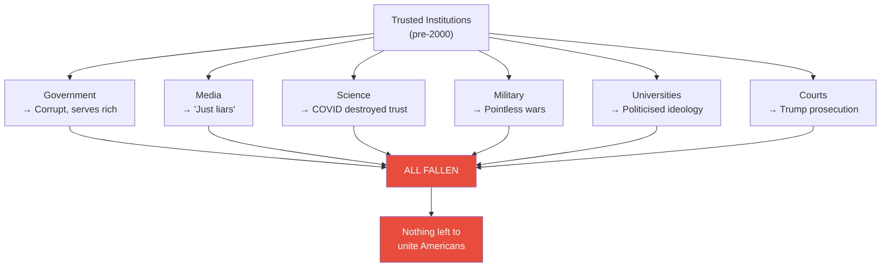

*Every institution that once brought Americans together has been discredited — falling "one by one" until nothing remains.*

---

## The Three Forces Combined

*Any one of these forces alone might be manageable. Together, they create the conditions for civil war.*

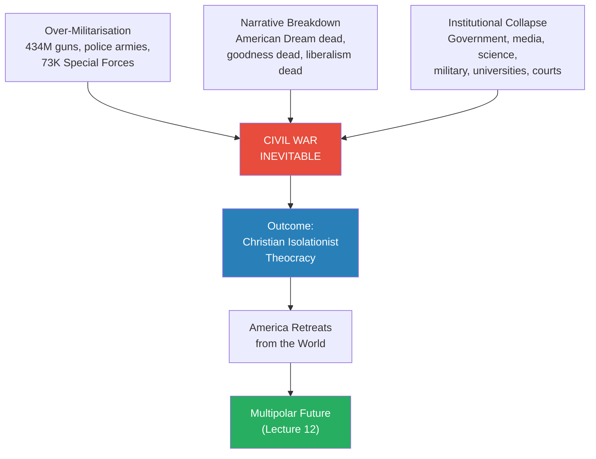

*Three structural forces converge to make civil war inevitable. The outcome reshapes not just America but the entire world order.*

- <b style="color: #27ae60">Over-militarisation means anyone can start a war</b> — the weapons are everywhere, at every level
- Narrative breakdown means there is no reason not to — no shared story explains why Americans should remain one country
- Institutional collapse means there is no one to stop it — no authority figure, no institution, no mechanism can bring people together

---

## The President as Figurehead

*Celine asks how powerful the American president really is. Prof. Jiang's answer is blunt.*

- The president is "really a figurehead" — not that powerful
- Power is diffused across institutions — and if those institutions are corrupt, the president can do nothing
- This is why November 2024 will see "one of the lowest turnouts of voters in American history"
  - Four years ago, people came out to kick Trump out because they believed he was a threat to democracy
  - Under Biden, people realised "it's all corrupt — just burn the system down"
  - <b style="color: #e74c3c">No one cares who's president anymore</b>
- And paradoxically, this apathy will help Trump in November — lower turnout benefits the candidate with the more motivated base

---

## What Can We Still Learn? — The University Question

*Peter asks a deceptively simple question that reveals the depth of America's institutional crisis: if universities are no longer trusted, what value does education have?*

- Prof. Jiang acknowledges the premise: "Universities in the past few decades have become more politicised — they're not actually interested in teaching you how to think. They're interested in teaching how to think a certain way, which is very left-wing."
- Examples of university politicisation:
  - The belief that America is a society based on violence and slavery and exploitation of minorities
  - Political correctness that restricts open debate
  - Ideological conformity enforced through social pressure
- But Prof. Jiang does not abandon universities entirely:
  - "Even though universities have become more politicised, your education in university is up to you"
  - Universities are large institutions with many professors and many classes
  - It is the student's responsibility to "structure your own learning and to be clear about what you want to learn and to understand the limitations of the education you're getting"
- Jack follows up: who are the people who don't trust universities?
  - <b style="color: #27ae60">The answer: people left out of the system — the right</b> — who don't go to university
  - The left is mainly composed of college-educated individuals who are wealthy
  - Some professors and students within universities are "dismayed by what's going on" — but they are "only a small fraction of the total population"
  - "Most universities have become extremely, extremely left wing"
- This Q&A reveals a critical dynamic: universities — which should be the institution that teaches critical thinking and bridges divides — have instead become a battleground of the culture wars, alienating half the population and indoctrinating the other half

---

## What the Civil War Will Look Like

*The second civil war will look nothing like the first. In 1861, there was one clear divide — North vs. South, pro-slavery vs. anti-slavery. Today, there are many factions and many conflicts. The result is not a single war but a chaotic series of overlapping violent episodes.*

> [!abstract] First Civil War vs. Second Civil War
> | Dimension | First Civil War (1861-65) | Second Civil War (predicted) |
> |-----------|--------------------------|------------------------------|
> | **Division** | Binary: North vs. South | Multiple: many factions, overlapping |
> | **Issue** | Single: slavery / federal power | Many: inequality, culture, empire, identity |
> | **Battle lines** | Geographic: clear North-South border | None: left and right live side by side |
> | **Duration** | 4 years | 10-50 years |
> | **Nature** | Formal war between armies | Chaotic overlapping episodes |
> | **Combatants** | Armies of uniformed soldiers | Everyone — civilians, police, agencies, Special Forces |
> | **Outcome** | Union preserved | Christian isolationist theocracy |

### The Five Stages

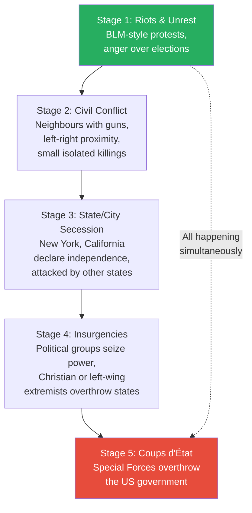

*The five stages are not sequential — they all happen at once, building on each other, over 10 to 50 years.*

#### Stage 1: Riots and Unrest
- Like the George Floyd / Black Lives Matter protests during Trump's first presidency
- Will intensify when Trump returns — "people are so angry at this election, they'll start rioting"
- This is the most visible stage but the least dangerous — property damage and sporadic violence, but no organised military force

#### Stage 2: Civil Conflict
- Neighbours taking guns against each other
- "America is divided between left and right, but there are actually pockets of America where left and right live very closely with each other"
- These will be small, isolated affairs — "maybe one or two people get killed"
- But the psychological effect is enormous — when your neighbour becomes your enemy, the social fabric is destroyed at its most basic level

#### Stage 3: State or City Secession
- A city (New York) or state (California) declares independence — "they're so disgusted by the state of affairs, they declare independence"
- They have their own army — their citizens are armed, their National Guard is a military force
- But secession invites attack — "they'll most likely be attacked by other states or different groups"
- This escalates the conflict from isolated incidents to territorial warfare

#### Stage 4: Insurgencies
- Political groups try to form governments of their own
- "It's possible that you have Christian extremists or maybe left-wing extremists who try to overthrow the government of, I don't know, New York or Virginia"
- These are not random riots but organised political violence with the goal of seizing power
- The distinction from Stage 3: secession is defensive (we want out), insurgency is offensive (we want control)

#### Stage 5: Coups d'Etat
- An arm of the military — "most probably Special Forces" — tries to overthrow the US government
- This is the most dangerous stage — it moves the conflict from regional to national
- Given that 1,000 special forces operators could overthrow the government, and Delta Force has exactly that number, this is not hypothetical — it is architecturally possible

- Prof. Jiang is clear: all five stages will happen at once — "in the next Civil War, all these things will happen at once, and they'll build on top of each other"
- The key difference from a conventional war: <b style="color: #27ae60">there are no front lines</b>
  - America is vast — some places will be "very peaceful, there's no war" while others (New York, Los Angeles) see intense violence
  - "There could be a lot of places where it's very peaceful, there's no war, but there could also be some places like New York City or Los Angeles where there's just a lot of violence going on"
- The civil war unfolds over <b style="color: #2980b9">10 to 50 years</b> — not a single event but a prolonged era of fragmentation
- This is a fundamentally different model of civil war from anything in the American imagination — not Gettysburg, not blue vs. grey, but something closer to Lebanon or Yugoslavia: overlapping factions, shifting alliances, and pockets of stability amid surrounding chaos

---

## The Military Question — Who Do They Support?

*Jack asks the most practical question: in a civil war, whose side does the US military take?*

- The US military is not one beast — it is "many, many different beasts," divided into Army, Air Force, Marines, Navy, Space Force, and numerous sub-units
- There is an <b style="color: #e74c3c">ideological mismatch</b> within the military:
  - The leadership (the generals) is "extremely Democratic"
  - The base (the soldiers) is "extremely Republican"
- Given this split, the military as a whole <b style="color: #27ae60">probably does not intervene in the civil war</b> — it is too divided to act coherently
- But there is one group with the "leeway, flexibility, and will" to intervene: <b style="color: #e74c3c">Special Forces</b>
  - They are not controlled by bureaucracy
  - Different special forces units will support different factions
  - This is why the civil war can be "extremely violent" — ordinary Americans have guns, but these operators have "jets and bombs and tanks"
  - Each one can serve as "a general in the war"

> [!abstract] The Special Forces Variable
> | Factor | Regular Military | Special Forces |
> |--------|-----------------|----------------|
> | **Leadership ideology** | Democratic (generals) | Varies by unit |
> | **Soldier ideology** | Republican (rank-and-file) | Strongly ideological |
> | **Bureaucratic control** | High — chain of command | Low — operate independently |
> | **Likely behaviour in civil war** | Does not intervene (too divided) | Intervenes — different units back different factions |
> | **Firepower** | Enormous but institutionally constrained | Jets, bombs, tanks — unconstrained |
> | **Size** | ~1.3 million active duty | ~72,000-73,000 |

---

## The Outcome — Christian Isolationist Theocracy

*Prof. Jiang does not claim to know the specifics of how the civil war unfolds. But he is confident about the equilibrium it reaches.*

- Whether or not the US government is overthrown is "a very specific question — I don't know"
- Prof. Jiang is candid about the limits of his analysis: "The only thing I can do is look at the structural forces and conclude that a civil war is very likely, and that the civil war will be very chaotic — but what actually happens in a civil war, I don't actually know"
- But the structural logic points to a clear outcome: <b style="color: #27ae60">America becomes a Christian, isolationist theocracy</b>
- The reasoning follows a simple chain:
  - At the founding, there were two competing visions of America
  - **Vision 1** — multicultural secular empire spreading democracy and freedom — has been achieved. America built the global empire the Founding Fathers envisioned. And it has led to all this conflict.
  - **Vision 2** — white Christian nation dedicated to the rule of God — remains strong, and it has never been fully realised
  - When Vision 1 has been tried and has produced decay, Vision 2 gains moral authority as the untried alternative
  - The question of who wins a civil war comes down to <b style="color: #e74c3c">who is most willing to fight and to die for what they believe in</b>
  - The answer: Christian nationalists — "and guess what, a lot of these people happen to work in law enforcement, the military, and especially the Special Forces"
  - The people with the strongest beliefs AND the most firepower AND the most training are all on the same side
  - The secular left may have more people, more money, and more education — but they do not have the willingness to die for their vision

> [!tip] Core Insight
> Civil wars are not won by the side with the most people or the most money. They are won by the side with the most willingness to use violence. In America, that side is the religious right — embedded in the institutions of force (police, military, Special Forces) and motivated by a vision worth dying for.

---

## Trump as Accelerant — The Trigger for Civil War

*Prof. Jiang turns from structural analysis to specific prediction. The trigger for the civil war is not an event but a person.*

### Trump Embodies the Culture Wars

- Everything the left hates about the right manifests in Donald Trump: "white, sexist, racist, a pig — and he doesn't apologise for any of it"
- He has "no manners, he's not educated, he has no values"
- <b style="color: #27ae60">This is exactly why the right loves him</b> — their enemies hate him
- For people on the right, Trump is "the Messiah — he's Jesus"
- Every persecution attempt has confirmed this:
  - Russian spy accusations — "no evidence, but people believed that"
  - Two impeachments
  - House raid
  - 34-felony conviction
  - Colorado ballot removal attempt

### The One Way to Destroy Trump

- Prof. Jiang poses a challenge to his students: "If you are on the left, if you are the elite, if you're rich and you hate Donald Trump, there's exactly one way and only one way you can destroy Donald Trump forever."
- The answer: <b style="color: #27ae60">three words — "Let's be friends"</b>
- The logic is devastatingly simple:
  - Why do people on the right love Trump? Because the elites hate him. He is the outsider, the enemy of the establishment.
  - "All elites have to do is become Donald Trump's friend. Invite Donald Trump to parties, say all these nice things about him on the media and support Donald Trump."
  - "And then people on the right will be like, 'Oh, we were fooled into thinking Donald Trump is an outsider, when he's actually an insider.'"
  - Then Trump is destroyed — his entire appeal evaporates
- Why it will never happen: <b style="color: #e74c3c">pure hatred</b>
  - "It's not because they're too proud. It's because of hatred. Pure hatred. 'I want to kill this guy.'"
  - This is <b style="color: #2980b9">Trump Derangement Syndrome (TDS)</b> — the inability to recognise who Donald Trump is and the inability to think rationally about how to deal with him

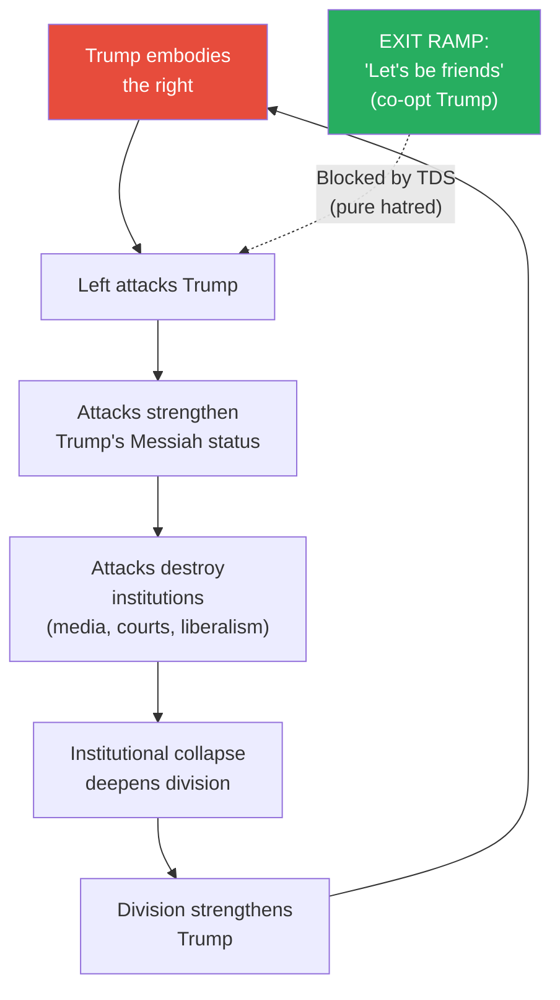

*Trump and the left are locked in a mutually destructive spiral. The one exit ramp — co-opting Trump — is blocked by the same hatred that drives the spiral.*

### The Self-Destruction Paradox

- In trying to destroy Trump, the elite has destroyed the very things that held America together:
  - The mainstream media's relentless attacks on Trump destroyed media credibility
  - Impeachment attempts destroyed judicial credibility
  - The attacks destroyed liberalism itself
- <b style="color: #e74c3c">It is the elites themselves who have destroyed the narratives and institutions that bind America together</b> — all because of the hatred they feel toward Trump

> [!example] Prof. Jiang's Personal Trump Experience
> - Prof. Jiang shares that he is "very much on the left" with "extremely liberal" values
> - In 2016, when Trump became president, he was "traumatised" — he believed "the world had fallen apart" and "everything I believed in was destroyed"
> - It took him a long time to step out of the trauma
> - But even now, among his liberal friends — people he has known for decades, people who know he hates Trump as much as anyone — if he says anything slightly sympathetic about Trump, "they become so angry with me"
> - "I feel insecure or unsafe. I feel as though they're about to punch me."
> - "You're not allowed to say anything nice about Donald Trump among liberals and leftist people"
> **The lesson:** The polarisation is so deep that even acknowledging the other side's grievances is treated as betrayal. When a society can no longer discuss its divisions, it can only fight over them.

---

## Trump's 2028 Strategy — The Constitutional Crisis

*Prof. Jiang maps out a specific scenario for how the civil war ignites.*

### The Survival Imperative

- The first thing Trump will figure out upon entering the White House: <b style="color: #e74c3c">how do I stay in office for the rest of my life?</b>
- "The only thing that he actually cares about is, how do I stay in office for the rest of my life?"
- The reason is existential, not political: the moment he leaves office, "he's gonna be sued, he's gonna be put in jail, he's gonna be attacked by the elites"
- Prof. Jiang frames this starkly: "It's either the White House or the jailhouse for me"
- This means every decision Trump makes as president will be filtered through a single lens: does this help me stay in power?

### The VP Trick

- The Constitution says you can only serve two terms as president
- But there is nothing in the Constitution that limits vice-presidential terms
- In 2028: Don Jr. runs as president, Trump runs as VP — "everyone will know he's still the president"
- If Trump does this, it creates a <b style="color: #e74c3c">constitutional crisis</b>:
  - The left goes insane
  - Riots on the streets
  - New York City and Boston may leave the Union
  - Insurgencies across America to rebel against the Trump regime

### The Iran War as Political Strategy

- To ensure he wins in 2028, Trump starts a war with Iran in the next 2-3 years
- The war wins over:
  - The deep state
  - The Israel lobby
  - The military-industrial complex
  - Key elite factions
- America cannot win the war (as established in Lectures 1, 6, 7) — the war drags on

### Why a Losing War Helps Trump

- With a war dragging on in 2028, the entire left is mobilised to get rid of Trump — they want the war to stop
- But there is a group of people who will do anything to ensure the war continues: <b style="color: #e74c3c">Special Forces and deep state members</b>
- They are "the most pro-empire of everyone" and want to win the war at any cost
- In 2028, if the election is contested:
  - "I guarantee you these guys and other deep state members will come in and commit acts of terrorism, acts of political assassination to ensure that Trump wins"
  - There will be "election meddling, election interference — they're gonna cheat on behalf of Trump"
  - At that point, "the entire civil war blows up"
  - "New York City declares independence. Boston declares independence. California declares independence. You have all these wars breaking out across America."
  - "Meanwhile, the United States is still fighting this pointless war in Iran"

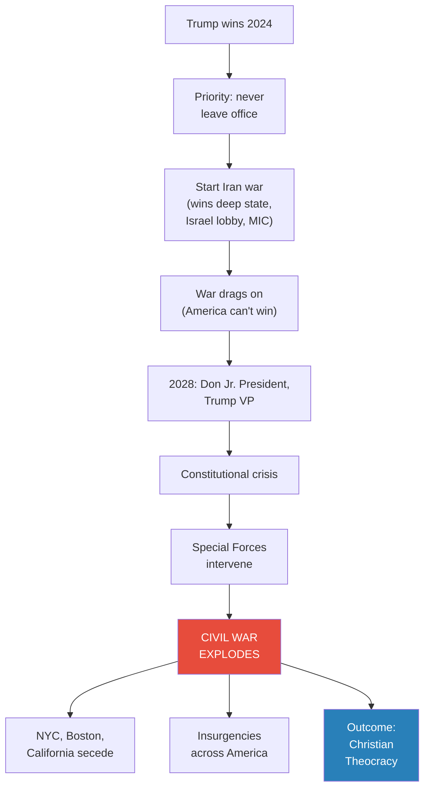

*Prof. Jiang's specific scenario: the Iran war and the constitutional crisis converge in 2028, and Special Forces turn the election into a civil war.*

---

## The Pro-Israel Billionaire Connection

*Prof. Jiang addresses Celine's skepticism that the anti-war Trump would attack Iran. The answer lies in money, donors, and the deep state.*

### Why Trump Will Go to War Despite His Reputation

- **Campaign vs. presidency:** Every president does radically different things in office than what they promise
- **Trump's signals:** He has publicly said Biden is "not doing enough to protect Israel" — meaning he will do more, including defending Israel against Hezbollah and Iran
- **The billionaire coalition:**
  - <b style="color: #2980b9">Miriam Adelson</b> — the most pro-Israel billionaire in America — plans to give Trump $90 million
  - <b style="color: #2980b9">Stephen Schwarzman</b> and <b style="color: #2980b9">Bill Ackman</b> — extremely pro-Israel Jewish billionaires coalescing around Trump
  - What they want in exchange: Nikki Haley as VP, pro-Israel cabinet members like Mike Pompeo

### The Nikki Haley Indicator

> [!example] Nikki Haley Signs a Bomb
> - Nikki Haley recently visited Israel
> - She took a photograph of herself signing a bomb being dropped on Gaza
> - She wrote: "Finish them. America loves Israel."
> - Prof. Jiang's assessment: "She's calling for mass genocide against the Palestinians"
> - If Trump picks Haley as VP, it is "a sure sign that he's going to war with Iran"
> **The lesson:** Watch August 2024. If Nikki Haley becomes VP, the war with Iran is coming — and with it, the civil war.

### The Deep State Logic

- Trump believes he won in 2020 but the deep state rigged the election
- Why did they rig it? Because he refused to fight wars
- If he wants to become president again, "he has no choice but to play along with the deep state — which means going to war"
- This creates a structural trap for Trump:
  - He needs the deep state's cooperation to stay in office
  - The deep state's price is war with Iran
  - War with Iran alienates his isolationist base
  - He must then find a way to bring the base back — which requires blaming someone else for the war
  - Every step of this sequence deepens the fractures in American society

### Trump's Base — Betrayal and Manipulation

- Trump's base is anti-war and anti-Nikki Haley — they are isolationist at their core
- Initially, they will feel betrayed when Trump goes to war
- But over time, Trump will manipulate them back through several strategies:
  - **Blame the scapegoat:** "I was fooled. I was manipulated. It's all Nikki Haley's fault. It's the deep state's fault."
  - **Reverse course after 2028:** "I now want to end this war and make America a Christian isolationist theocracy" — giving the base what they always wanted
  - **Anti-Semitic pivot:** "It was the Jews who conspired against us" — turning against Israel, which will resonate with the isolationist base and further fracture the pro-war coalition
- The critical point: <b style="color: #e74c3c">whatever Trump does, it creates more war within America</b>
  - If he goes to war with Iran, the left riots
  - If he blames Nikki Haley and pivots, the pro-Israel faction feels betrayed
  - If he turns against Israel, the billionaire donors revolt
  - If he pushes for a Christian theocracy, the secular left sees an existential threat
  - Every move he makes inflames the civil war — "there's gonna be people who love him and there are people who hate him, and they're gonna war with each other"
- Prof. Jiang concludes with a remarkable confession about Trump's effect on people:
  - "I don't know what it is about Donald Trump, but he brings out the worst in people"
  - "In 2016, before Donald Trump was president, America was actually a pretty sane place. Now it's insane. Now you can't recognise it anymore."
  - Whatever Trump does — whether he goes to war, blames Israel, pivots to theocracy — "all it's gonna do is create more war within America"

---

## The Suburbanites and Empire

*A student asks about suburban Americans. Prof. Jiang connects them to the empire structure — revealing yet another faction in the coming civil war.*

- Many Americans benefit from empire — they work on Wall Street, for the military-industrial complex
- These people tend to live in the suburbs — not in urban centres (which are liberal) or rural areas (which are conservative), but in the suburban belt that depends on the imperial economy
- They want war with Iran because empire is profitable for them — their jobs, their investments, their property values all depend on American global dominance
- This creates yet another faction in the civil war: <b style="color: #2980b9">suburbanites defending the imperial status quo</b> against both the isolationist right and the anti-war left
- The suburbanites are particularly important because they are the economic base of the pro-war coalition — without them, the military-industrial complex would lose its political constituency
- This is why Prof. Jiang connects the Iran war to the civil war: the suburbanites want the Iran war because it sustains their economic position, but the Iran war bleeds the poor, which fuels the domestic resentment that tears the country apart

> [!abstract] The Factional Landscape of the Civil War
> | Faction | Economic interest | Cultural identity | Position on war | Position on empire |
> |---------|------------------|-------------------|-----------------|-------------------|
> | **Urban left** | Knowledge economy | Liberal, secular, multicultural | Anti-war (mostly) | Pro-empire (culturally) |
> | **Rural right / MAGA** | Agriculture, trades | Christian, traditional, white | Anti-war (isolationist) | Anti-empire |
> | **Suburbanites** | Wall Street, MIC, defence | Mixed | Pro-war (with Iran especially) | Pro-empire (economically) |
> | **Military leadership** | Defence institution | Democratic-leaning | Hawkish by institutional culture | Pro-empire |
> | **Special Forces** | Combat operations | Strongly right-leaning | Pro-war (ideologically) | Pro-empire but anti-bureaucracy |
> | **Christian nationalists** | Mixed | Fundamentalist Christian | Willing to fight domestically | Anti-empire, isolationist |

*The factions cross-cut in ways that make clean alliances impossible — which is why the civil war will be chaotic rather than binary.*

---

## The Iran War-Civil War Nexus

*The two great arcs of the Geo-Strategy series — the Iran conflict and America's domestic fracture — are not separate stories. They are the same story viewed from different angles.*

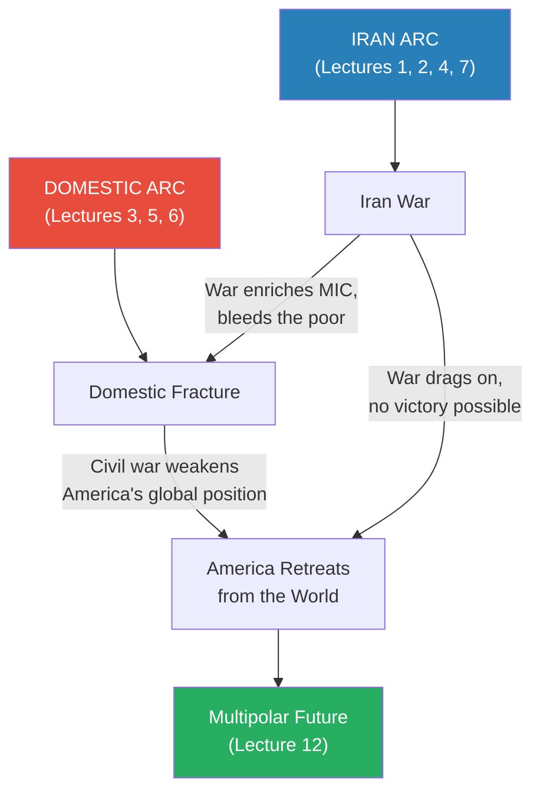

*The Iran war feeds the civil war (empire profits for the rich, death for the poor). The civil war feeds the Iran war (Special Forces intervene, 2028 crisis). Both produce the same result: America retreats from the world.*

- The Iran war enriches the military-industrial complex but bleeds the poor — deepening the inequality that fuels domestic conflict
- The civil war consumes America's attention and resources — making it unable to sustain imperial commitments abroad
- Both converge on the same outcome: <b style="color: #27ae60">America retreats from the world, creating a multipolar future</b>
- This is the grand synthesis of the entire Geo-Strategy series:
  - Lectures 1-7 showed why America will go to war with Iran and why it will lose
  - Lectures 3, 5, 6 showed why America is fracturing domestically
  - This lecture shows that the external war and the internal fracture are the same process — empire produces both the foreign war and the domestic resentment that makes civil war inevitable
  - Lecture 12 will explore the world that emerges when American hegemony collapses

> [!tip] Core Insight
> The Iran war and the civil war are not separate crises — they are the same crisis viewed from different angles. Empire creates the conditions for both: it produces the foreign enemies America must fight and the domestic inequality that tears the country apart. When both crises converge, America can no longer sustain its global position, and the world becomes multipolar.

---

## Concept Map — How This Lecture's Ideas Connect

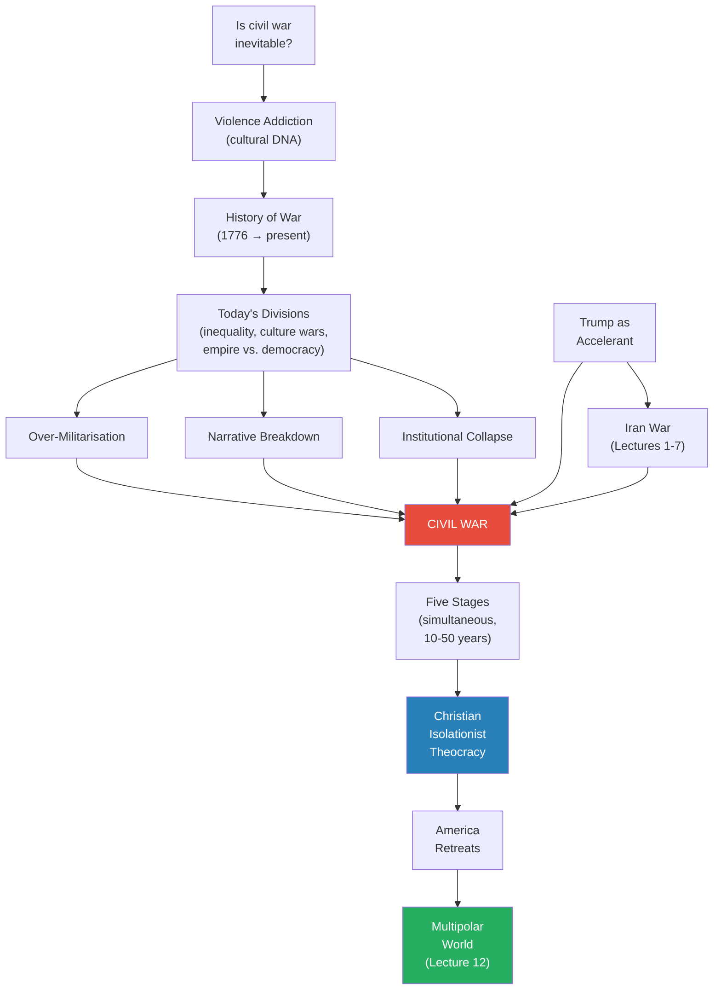

*The lecture builds from cultural DNA through historical pattern to structural analysis to specific prediction — ending where the entire series has been heading: the end of American global dominance.*

---

## Connections

**Builds on:**
- [[03 - How Empire is Destroying America]] — financialisation, rentier economy, empire trap, Wall Street profiting from war. Lecture 3 showed how empire economics work; this lecture shows how they create the domestic conditions for civil war.
- [[05 - Why Trump Will Win]] — culture wars, left-right polarisation, Trump's appeal to the marginalised right, why lower turnout helps Trump. Lecture 5 diagnosed the disease; this lecture predicts the terminal crisis.
- [[06 - America's Imperial Hubris]] — military hubris, institutional overconfidence, why the military agrees to fight. This lecture adds the crucial distinction between regular military (too divided to act) and Special Forces (will act unilaterally).

**Sets up:** [[12 - Psychohistory]] — the final synthesis. When America retreats from the world, consumed by civil war and the Iran quagmire, what does the multipolar future look like? Prof. Jiang explicitly previews: "Next class, we'll discuss what this multipolar world looks like."

**Related lectures in the Iran arc:**
- [[01 - Iran's Strategy Matrix]] — asymmetric warfare, Iran controls terms of engagement — the strategic foundation for why America can't win the Iran war that Trump will start
- [[02 - Christian Zionism and the Middle East Conflict]] — the dispensationalist right maps directly onto the Pilgrim/Puritan vision of America as a Christian nation; the Israel lobby that pushes Trump toward war is rooted in this theology
- [[04 - Saudi Arabia's Trump Card Against Iran]] — the external pressure for war from Saudi Arabia and the MBS-Trump alliance; complements the pro-Israel billionaire pressure described in this lecture
- [[07 - Who Killed Iranian President Ebrahim Raisi]] — IRGC power consolidation; the Iranian military also wants war. Both sides' military classes are pushing toward the same conflict that neither civilian population wants.

**Related books in vault:** [[Sapiens - Yuval Noah Harari]] (shared myths as the foundation of large-scale cooperation — Prof. Jiang's argument about narrative breakdown directly echoes Harari's concept of imagined orders: when the stories that hold a society together die, the society disintegrates)

---

## The Takeaway

This lecture completes the domestic arc that has been building since Lecture 3. Where Lecture 3 showed how empire economics are destroying America, Lecture 5 showed how the culture wars are fracturing it, and Lecture 6 showed how military hubris makes the institution of force unreliable — this lecture asks the obvious next question: what happens when all of these forces converge? The answer, Prof. Jiang argues, is civil war — not a single event but a decades-long era of overlapping violence that reshapes America from a multicultural secular empire into a Christian isolationist theocracy. The most striking element of the argument is not the prediction itself but the structural logic behind it: the people who win civil wars are not the most numerous or the wealthiest but the most willing to fight and die. In America, those people are Christian nationalists embedded in the very institutions of force — law enforcement, the military, and Special Forces.

The most counterintuitive insight is the Trump paradox. The liberal elite's attempts to destroy Trump — through media attacks, impeachment, prosecution, and ballot removal — have not only failed to weaken him but have actively destroyed the institutions and narratives that held America together. Media credibility, judicial neutrality, and liberalism itself have been casualties of the campaign against Trump. The hatred is so intense that the one strategy that would work (co-opting Trump, making him an insider) is psychologically impossible. This is Trump Derangement Syndrome — not a partisan insult but a structural analysis of how emotional intensity prevents rational adaptation. It mirrors the imperial hubris from Lecture 6 and the IRGC's fanaticism from Lecture 7: in each case, the dominant power refuses to adapt because its emotional commitment to a certain posture overrides strategic thinking.

The lecture's most important contribution to the series is connecting the domestic and international arcs into a single story. The Iran war and the civil war are not separate events — they are mutually reinforcing catastrophes. Trump starts the Iran war to win over the deep state; the Iran war drags on; Special Forces intervene to keep Trump in power; the civil war explodes. Meanwhile, the war enriches the military-industrial complex while bleeding the poor, deepening the inequality that fuels the domestic fracture. Both arcs converge on the same endpoint: America retreats from the world, consumed by its own contradictions. What replaces American hegemony — the multipolar future — is the subject of the final lecture.

One question the lecture leaves deliberately unanswered: can any of this be prevented? Prof. Jiang does not offer solutions, exits, or alternative scenarios. He presents structural forces and asks where they lead. His closing words — "next class, we'll talk about what happens afterwards" — suggest that for him, the question is not whether America will fracture but what comes after. The civil war is already underway in slow motion. The only uncertainty is how fast it accelerates, how violent it becomes, and what emerges on the other side.
