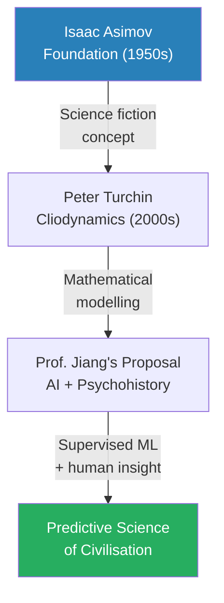
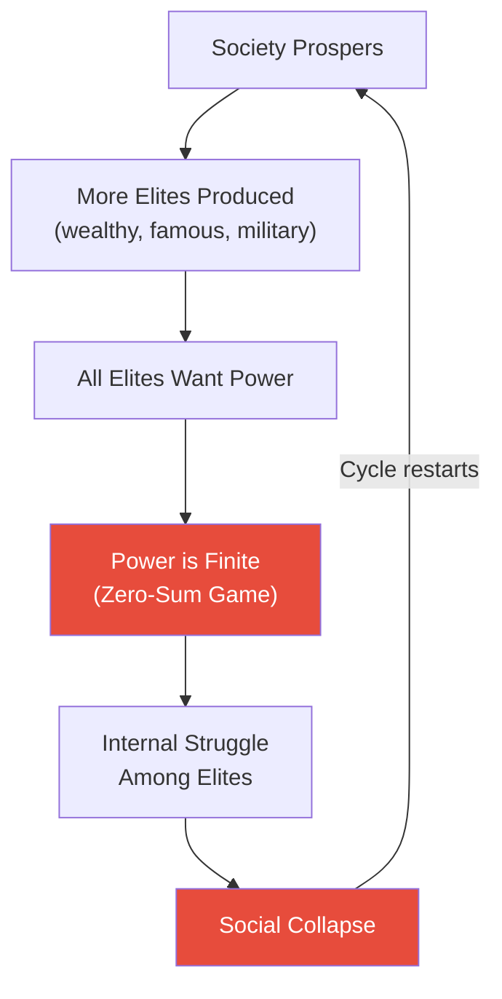
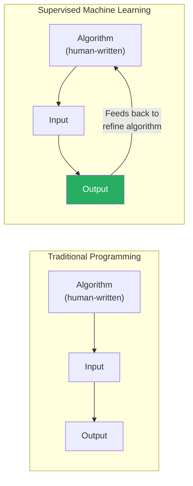
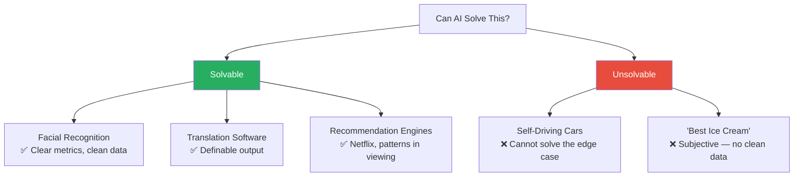
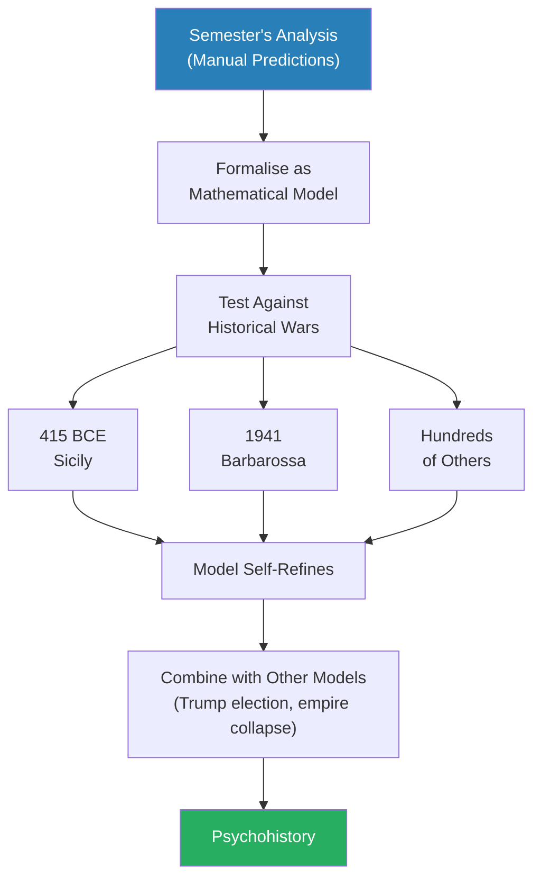
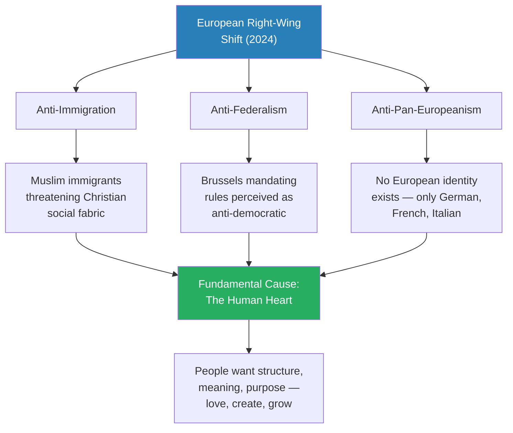
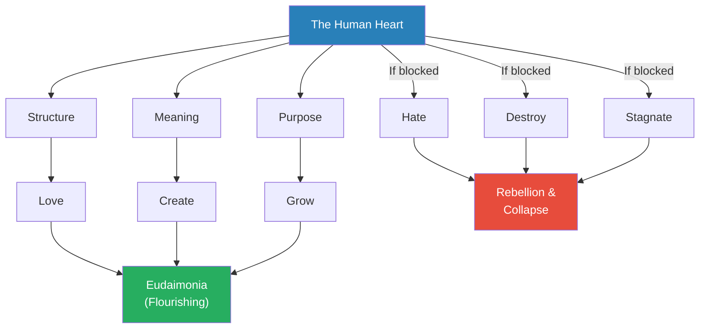
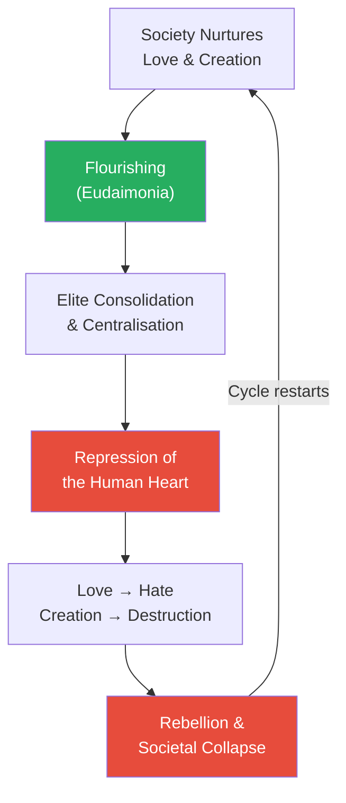
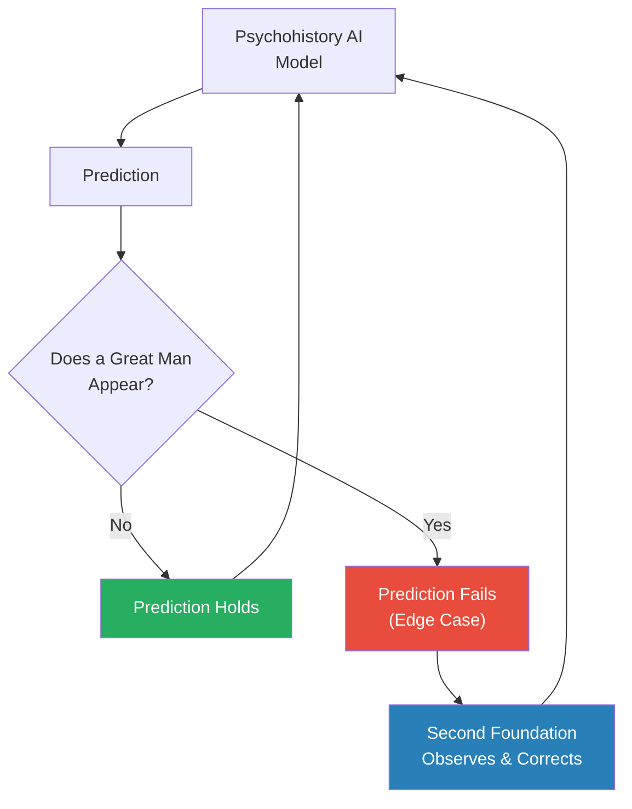
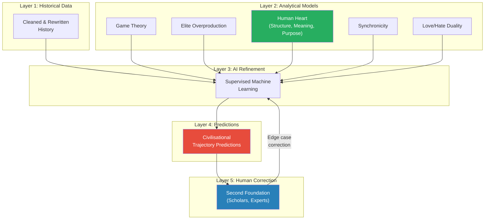

# Psychohistory (The Science of Imagining the Future)

> After eleven lectures predicting the darkest possible future — Trump's election, war with Iran, the end of the American empire, multipolar chaos, the deaths of millions — Prof. Jiang devotes the series finale to hope. He introduces **psychohistory**, Isaac Asimov's science-fiction concept of mathematically predicting civilisational trajectories, and argues it could become reality through AI. But the deeper message is not technological: it is that the future is not something that happens to you. Drawing on Dante, Homer, and the Greeks, Prof. Jiang argues that imagination and love are the forces that allow humanity to reshape its destiny — and that building a mathematical model of human nature, grounded in the truths great literature has always expressed, could break the cycle of collapse that history endlessly repeats.

---

## The Question

*Can the future be scientifically predicted — and if so, can humanity use that knowledge to build a better world instead of repeating the same catastrophic mistakes?*

Prof. Jiang opens the final class with a deliberate emotional pivot. The entire semester has been relentlessly dark — a systematic argument that structural forces are dragging the United States into a war with Iran that will destroy the American empire and plunge the world into multipolar chaos. Climate change will compound the catastrophe. Millions, possibly billions, will die.

- "This is an extremely hopeless and extremely bleak and dark picture of the world"
- But: "where there is darkness, there can also be light"
- He invokes Dante's *Divine Comedy*: <b style="color: #27ae60">"The future is not what happens to you. It's what you imagine and fight for."</b>
- God gave humanity two gifts: **the ability to imagine** and **the capacity to love**
- These two forces — imagination and love — are enough to build a better world

The lecture's thesis is therefore not a prediction but a manifesto: <b style="color: #27ae60">the future is what we make happen</b>. If we do not like the world we see coming, we can change it — but only if we develop the tools to understand the forces that shape civilisation.

> [!tip] Core Insight
> The entire semester has argued that dark forces are pushing the world toward catastrophe. The series finale argues that the same analytical tools that predict darkness can, if formalised into a science, be used to redirect humanity's trajectory. Prediction is not fatalism — it is the first step toward agency.

*Eleven lectures of escalating darkness culminate in a finale that pivots from prediction to agency — from "what will happen" to "what we can make happen."*

---

## Key Concepts at a Glance

| Concept | One-line summary |
|---------|-----------------|
| **Psychohistory** | The science of mathematically predicting civilisational trajectories — Asimov's fiction turned real ambition |
| **Cliodynamics** | Peter Turchin's real-world attempt to create mathematical models of historical patterns |
| **The overproduction of the elites** | Societies collapse when too many elites compete for finite power — a zero-sum game that tears civilisations apart |
| **Supervised machine learning** | The correct term for "AI" — iteratively refining an algorithm by using output to improve input |
| **The three requirements for AI** | Clear metrics, clean data, and a working algorithm structure — without all three, the problem is unsolvable |
| **The edge case problem** | AI cannot handle situations where a human intentionally defies the system — the limit of all algorithmic prediction |
| **The human heart** | The fundamental driver of all human behaviour: the need for structure, meaning, and purpose |
| **Eudaimonia** | The Greek concept of a flourishing life — achieved when a person can love, create, and grow |
| **Synchronicity** | The degree to which people voluntarily follow social rules — a measure of trust and cohesion |
| **The Great Man Theory** | Exceptional individuals (Homer, Dante, Putin) who step outside historical forces and redirect history — the edge case of psychohistory |
| **The Second Foundation** | A team of human observers who monitor and correct the AI model when great men or unpredictable events occur |
| **The love/hate duality** | Love and hate are one force; creation and destruction are one force — if the positive is blocked, the negative inevitably emerges |

---

## The Semester in Summary: Darkness Before Light

*Before introducing psychohistory, Prof. Jiang recaps the semester's argument — eleven lectures of predictions, each darker than the last.*

The recap serves as the raw material for the AI model he is about to propose. The semester's predictions:

- <b style="color: #e74c3c">Trump will be elected again in November</b>
- Trump will declare war on Iran
- The war will be a disaster for the United States
- It will mean <b style="color: #e74c3c">the end of the American empire</b>
- A multipolar world will emerge — meaning endless war and the deaths of millions, possibly billions
- Climate change will eventually cause civilisational collapse

These predictions were not random — they were derived from a systematic method:

- [[01 - Iran's Strategy Matrix|Lecture 1]]: Iran fights asymmetrically and can control the terms of engagement
- [[02 - Christian Zionism and the Middle East Conflict|Lecture 2]]: Christian Zionism is Force 1 pushing the US toward war
- [[03 - How Empire is Destroying America|Lecture 3]]: Empire economics and the petrodollar are Force 2
- [[04 - Saudi Arabia's Trump Card Against Iran|Lecture 4]]: Saudi desperation is Force 3
- [[05 - Why Trump Will Win|Lecture 5]]: Trump will be president when these forces converge
- [[06 - America's Imperial Hubris|Lecture 6]]: The US military will agree to fight due to institutional hubris
- [[07 - Who Killed Iranian President Ebrahim Raisi|Lecture 7]]: The IRGC is consolidating power and pushing Iran toward confrontation
- [[09 - Putin's War for the Soul of Russia|Lecture 9]] and [[10 - Putin's Strategic Imagination|Lecture 10]]: Russia under Putin is reshaping the global order
- [[11 - The Second American Civil War|Lecture 11]]: America itself is fracturing internally

Prof. Jiang's point: these predictions were made by identifying forces, counter-forces, and structural dynamics — the same method that psychohistory would formalise and automate.

---

## Psychohistory: From Science Fiction to Science

*In the 1950s, a science fiction writer imagined a science that could predict the fate of galaxies. A modern historian has begun to make it real. Prof. Jiang proposes finishing the job.*

### Isaac Asimov's Foundation

Prof. Jiang introduces <b style="color: #2980b9">psychohistory</b> through its origin: Isaac Asimov's *Foundation* series, written in the 1950s. Asimov is "probably the most famous science fiction writer" — and his central idea has haunted thinkers ever since:

- The *Foundation* series is set a million years in the future
- Humanity has colonised the entire Milky Way — billions of planets under a galactic empire
- Like all empires, it must collapse — leading to **30,000 years of war, violence, and barbarism**
- A new science called **psychohistory** proposes a solution: mathematically map human behaviour over a million years
- If you discover the patterns, you can predict the future
- If you can predict the future, you can **manipulate the course of events** to shorten the dark age
- Prof. Jiang notes there is now a TV adaptation: "it's terrible, but you can have a look at it"

> [!tip] Core Insight
> Psychohistory rests on a single premise: that human behaviour, in aggregate, follows mathematical patterns. Individual actions are unpredictable, but civilisational trajectories are not. If this premise is correct, the future is knowable — and therefore changeable.

---

### Peter Turchin and Cliodynamics

The idea has already crossed from fiction into reality. Prof. Jiang introduces <b style="color: #2980b9">Peter Turchin</b>, a historian who founded <b style="color: #2980b9">Cliodynamics</b> — named for Clio, the Greek goddess of history, combined with "dynamics" (movement):

- Cliodynamics is the attempt to figure out the **mathematical movement of history**
- Turchin treated history as a dataset and looked for patterns in how civilisations rise and fall
- His key discovery: <b style="color: #27ae60">the overproduction of the elites</b>

*The intellectual lineage: Asimov imagined it, Turchin began building it, and Prof. Jiang proposes that AI could complete the project — if combined with the truths that literature has always expressed.*

---

## The Overproduction of the Elites

*Why do societies collapse? Not debt, not inequality, not war — but too many elites fighting for too little power.*

Prof. Jiang presents Turchin's most provocative finding as both a discovery and a demonstration of what mathematical history can reveal:

- Over time, every society produces more and more elites — wealthy people, famous people, entrepreneurs, military leaders
- Wealth and fame are **infinite resources** — you can always create more billionaires, more celebrities
- But <b style="color: #e74c3c">power is a finite, zero-sum resource</b>
- "In this classroom, there can only be one teacher. If we're all teachers, there's no teacher"
- "In society, there can only be a few powerful people. If everyone has power, no one has any power"
- When too many elites compete for limited power, the internal struggle **tears the society apart**

*Turchin's elite overproduction cycle: the engine of civilisational collapse is not external enemies but internal competition among those who believe they deserve to rule.*

---

> [!example] Hong Xiuquan and the Taiping Rebellion
> - In Imperial China, the **keju** (imperial examination system) was the path to power — pass the exam, become an official
> - Problem: the system produced far more candidates than there were positions
> - Failed candidates became angry, resentful, and revolutionary
> - The most famous failed keju candidate was **Hong Xiuquan**
> - After failing the examinations, he converted to Christianity
> - He then led the **Taiping Rebellion** — one of the deadliest conflicts in human history
> - His motivation was not ideology but rage at a system that promised merit-based advancement and delivered exclusion
> **The lesson:** The people who destroy civilisations are not the oppressed masses — they are the elites who were promised power and denied it.

- Prof. Jiang also cites the fall of the Roman Empire as following the same pattern
- The principle was discovered not through narrative history but through **mathematical modelling** — comparing datasets from different civilisations and identifying the common factor in collapse
- This connects directly to [[06 - Elite Overproduction and the Bronze Age Collapse]] in the Civilization series — Turchin's theory bridges both semesters

---

## What AI Actually Is (And Is Not)

*Prof. Jiang proposes using AI to build psychohistory — then immediately demystifies AI, arguing it is both less magical and more useful than people think.*

### Supervised Machine Learning — The Real Name

Prof. Jiang is blunt: <b style="color: #e74c3c">"AI is a scam. It does not exist. What exists is supervised machine learning."</b>

The explanation is precise and accessible:

- **Traditional programming:** You write the algorithm. You put in input. You get output.
  - Example: Algorithm = A + B. Input = 2, 2. Output = 4.
- **Supervised machine learning:** You turn the output into an additional input, allowing the computer to **refine and optimise the algorithm** that you wrote
  - The key difference: the human still writes the initial algorithm and defines the output
  - The computer iterates — potentially billions of times — to optimise

*The difference between traditional programming and supervised machine learning: in ML, the output refines the algorithm — enabling infinite iteration toward an optimal solution.*

---

### The Facial Recognition Example

Prof. Jiang illustrates with a detailed walkthrough of facial recognition technology:

- Start with a database of approximately **1 billion people** (e.g. everyone in China)
- The challenge: differentiate every face from every other face
- Method: create a **topological mathematical model** of each face
  - The model analyses measurable features: distance between eyes, nose size, facial proportions
  - Each face becomes a set of mathematical equations
- The model is so precise that "I can only look at your eyes and I know who you are"
- **Critical limitation:** "If you're not in this database, you can't be recognised"

The training process demonstrates how supervised ML works:

- Create a **working theory** (initial model) of what a face should look like
- Feed the system actual faces
- Compare the output to what is in the database
- If the model produces incorrect matches, tell it "this is wrong"
- The computer refines the model — iterating until accuracy is achieved
- <b style="color: #2980b9">"What all AI is, is infinite iteration"</b>

---

### The Three Requirements for AI

Prof. Jiang identifies three conditions that must be met for any AI system to work:

| Requirement | Description | Example |
|-------------|-------------|---------|
| **Clear metrics / outputs** | The output must be mathematically definable | An airline maximising profit per flight |
| **Clean data** | Data must be labelled, objective, and non-subjective | Animal classification datasets — NOT "best ice cream in the world" |
| **Working algorithm structure** | The human must provide an initial algorithm for the computer to refine | The topological face model — the computer cannot invent this from scratch |

- If all three conditions are met → AI can solve the problem
- If any condition fails → the problem is **unsolvable by AI**
- <b style="color: #e74c3c">The computer can refine an algorithm but cannot create one from scratch</b>

---

### What AI Can and Cannot Solve

Prof. Jiang draws a sharp line between solvable and unsolvable problems:

*AI excels at problems with clear metrics and clean data. It fails at problems where humans can intentionally defy the system or where outputs are subjective.*

The self-driving car example is central to the lecture's argument:

- Self-driving cars can plan for traffic, accidents, rules, and conditions
- But they **cannot** plan for the <b style="color: #2980b9">edge case</b>: a human who intentionally wants to crash into the car
- "If I'm a taxi driver and it's stealing my livelihood, and I want to crash into that car — there's no way for that AI to avoid the accident"
- Cars with self-driving features exist, but they are not 100% autonomous — "they tell you, don't rely on the autopilot; don't sleep in the car"
- AI has no self-awareness: "It can only do what the algorithm tells it to do"

> [!tip] Core Insight
> The self-driving car problem is a metaphor for the limits of all prediction. Any mathematical model of human behaviour will have edge cases — individuals who intentionally defy the pattern. This is not a reason to abandon the project, but it means the model will always need human correction.

---

## Building the Psychohistory AI

*With AI demystified, Prof. Jiang explains how the semester's predictions could become inputs for a real predictive model — and how that model could be refined against thousands of years of historical data.*

### From Predictions to Models

The semester's analysis already has the structure of an AI model:

- **The push factors:** Lobby (Christian Zionism) + Saudi Arabia + American empire (petrodollar) → force America toward war with Iran
- **No counteracting forces:** The military believes in shock and awe. Iran wants revenge. Trump wants to cement power.
- **Prediction:** War with Iran is inevitable

This prediction can be formalised as a mathematical model. Once formalised, the model is refined by testing against historical data:

- The 415 BCE Athenian invasion of Sicily
- 1941 Operation Barbarossa
- Hundreds of other wars throughout history
- Each test case refines the model — making it more accurate

*The path from this semester's manual predictions to automated psychohistory: formalise each prediction as a model, refine against history, then combine all models into a unified predictive science.*

- Separate models for different predictions (war causation, election outcomes, empire decline) can eventually be **combined**
- "Once you start putting all these models together, what eventually happens over time is you develop psychohistory"

---

### Game Theory as Foundation

Prof. Jiang reaffirms <b style="color: #2980b9">game theory analysis</b> as the first analytical framework for the model:

- No good and evil — only players who are self-interested
- Each player develops strategies to optimise their ability to win
- The model analyses the strategies, incentives, and constraints of all players simultaneously
- But game theory alone is insufficient — "you can also develop new ideas that would help you better understand how the world works"

The rest of the lecture introduces those new ideas.

---

## The European Elections: The Human Heart Rebels

*The June 2024 European Parliament elections provide a real-time case study for the principles Prof. Jiang wants to encode in the psychohistory model.*

The results shocked Europe:

- **Marine Le Pen's** party in France gained significant votes
- The **AfD** (Alternative for Germany) — "considered a right-wing organisation, almost neo-Nazi" — gained significant votes
- Emmanuel Macron called early elections
- Prof. Jiang's prediction: Le Pen's party could govern France within three months

### Three Drivers of the Right-Wing Shift

Prof. Jiang identifies three causes, each connected to deeper principles:

*All three drivers of Europe's right-wing shift trace back to the same root: people rebelling against systems that deny the fundamental needs of the human heart.*

1. **Anti-immigration:** Over 10-20 years, immigrants from Libya, Syria, Iraq, Afghanistan, Sudan, and Somalia — mainly Muslim — have challenged the Christian social fabric of Europe. Europeans are "rebelling against that."

2. **Anti-federalism / anti-bureaucratism:** Brussels mandates rules that member nations must follow. Citizens perceive this as anti-democratic — "a foreign power mandating rules that they must follow."

3. **Anti-pan-Europeanism:** The deepest objection. "There's no European identity. There's a German identity, a French identity, Italian, Spanish, Portuguese — but there's no European identity." People are rebelling against the entire EU project. Prof. Jiang's prediction: <b style="color: #e74c3c">"In about five years, the entire EU will be dead."</b>

### The Deeper Principle

The EU's proponents argue that the project exists to eliminate the factors that caused centuries of European war: tribalism, nationalism, religion. Replace them with secular liberalism.

But Prof. Jiang argues the European voters are saying something profound:

- "We don't want secular liberalism because we want to be human"
- What people strive for is not an abstract liberal idea but <b style="color: #27ae60">structure, meaning, and purpose</b> in their lives
- The fundamental human capacities: **love, create, and grow**
- When a foreign entity destroys local identity, community, and relationships, it destroys these capacities
- "That's what's going on, not just in Europe, but throughout the world — Brexit, Trump, all of it"
- The common thread: the human urge for **agency**

> [!example] The EU Project as Test Case
> - The EU was founded to eliminate the causes of European war: nationalism, tribalism, religion
> - It replaced them with secular liberalism, bureaucratic governance, and supranational identity
> - For decades, the project appeared successful — peace, prosperity, open borders
> - But the project required destroying local identity, community, and the relationship between individuals and their neighbours
> - European voters are now saying: the cure is worse than the disease
> - They would rather risk the return of tribalism than live under an abstract system that denies their humanity
> **The lesson:** Any system that requires suppressing the human heart will eventually face rebellion — no matter how rational its design.

---

## The Human Heart: The Fundamental Input Variable

*Student Eric asks the question that anchors the rest of the lecture: "What is the source of all this?" Prof. Jiang's answer: the human heart.*

### The Principle

Prof. Jiang's answer draws on both semesters:

- "What Homer and Dante would say is: <b style="color: #27ae60">the human heart</b>. This is just who we are."
- If we cannot fulfil our human heart, "we will rebel, we will destroy, we will want to kill"
- This becomes a foundational principle for the AI model: <b style="color: #2980b9">there is a fundamental underlying structure to human society</b>
- If society **conforms** to the structure of the human heart → the society prospers
  - Example: Athens — the ancient Greeks, whose word for this was **eudaimonia**
- If society **represses** the human heart → the society must eventually collapse

*The human heart is the fundamental input variable for psychohistory. When its needs are met, civilisations flourish. When they are blocked, the same energy turns destructive.*

---

### Universality vs. Individuality

Student Sally objects: aren't individuals unique? Don't people change over time?

Prof. Jiang's response, citing Homer and Dante:

- At the **fundamental level**, all humans share the same desires and motivations
- "There's no one in this world that does not want structure, meaning, and purpose"
- The **methods** of achieving these may differ, but the underlying motivation is universal
- When you achieve all three — love, create, and grow — "What do we call this? **Eudaimonia**"
- <b style="color: #2980b9">Eudaimonia</b>: the Greek concept of a happy, self-fulfilled life
  - You are married to someone you love and have children
  - You are doing a job that is creative
  - You are constantly learning and growing every day
- "There may be differences in needs and motivation, but at the fundamental level, we're all human beings, driven by the same fundamental needs"

---

## Synchronicity: Measuring Social Health

*Prof. Jiang introduces a concept that could serve as a measurable proxy for societal health — how willing are people to follow the rules?*

<b style="color: #2980b9">Synchronicity</b> is defined as the degree of voluntary rule-following in a society:

- Do drivers follow traffic rules?
- Do people give up subway seats for the elderly, children, pregnant women?
- Do people pick up garbage and throw it in the bin?

What synchronicity measures:

- **Cohesion and trust** — does society hold together voluntarily?
- **Resilience** — can society recover from shocks?
- **Capacity for growth** — can society learn from its mistakes?

| Synchronicity Level | Example Societies | Implication |
|--------------------|--------------------|-------------|
| **High** | Japan, Germany | Resilient, capable of long-term growth |
| **Low** | India, Brazil, China | Less resilient, more vulnerable to collapse |

- Societies with high synchronicity will outperform over the long term
- This becomes another **input variable** for the psychohistory AI model
- Prof. Jiang positions synchronicity as a measurable complement to the more abstract "human heart" principle

---

## Mass Society and the Artificial Elite

*Student Celine asks a question that leads Prof. Jiang into one of his most provocative arguments: the elite are no better than anyone else, and their power rests on fictions that are currently collapsing.*

### Mass Society as Historical Accident

Prof. Jiang makes a striking claim:

- <b style="color: #e74c3c">Mass society is "a complete deviation from human history"</b> — an accident
- Humans were not supposed to live in societies of millions or billions
- Mass society requires an **artificial elite** — someone must be in charge
- But "the elite, the people in charge, they're not better than you and me"
- "We in this classroom could swap for the leadership of the world — nothing would change"

### The Fictions of Elite Power

The elite maintain their position through fictions:

- "I went to Yale or Harvard, therefore I should be at the top"
- "I have a higher IQ than you"
- "My great-great-great-great grandfather was king"
- These fictions work — for a time

### The Collapse of Fictions

Over time, the fictions fall apart because the elite prove incompetent:

- Global management of the economy — incompetent
- Global management of COVID — incompetent
- Global management of war — incompetent
- "People sort of wake up: wait a minute, these guys don't really know what they're doing"

### Repression as the Final Stage

When fictions fail, the elite resort to force:

- They must make people obedient through suppression
- To control the population, they must **repress the human heart** — because the heart naturally wants to question, be curious, and grow
- The method: redirect attention from thinking to consuming — "get you to focus on buying things rather than thinking"
- This repression can last a long time, but it cannot last forever

> [!tip] Core Insight
> The elite's power rests on fictions. When fictions fail, they resort to force. But force requires repressing the human heart — and the human heart always eventually rebels. This is the structural driver of civilisational collapse, and psychohistory must model it.

---

## The Love/Hate Duality: Why Civilisations Destroy Themselves

*Student Celine asks the question that completes the model: if humans want to love, create, and grow, why do we end up destroying ourselves?*

Prof. Jiang's answer reveals the most important principle for the psychohistory model:

- <b style="color: #27ae60">Love and hate are one force</b>: "If I can't love you, I'm going to hate you"
- <b style="color: #27ae60">Creation and destruction are one force</b>: "If I can't create, then I want to destroy, because my need for creation can't be satisfied"

The cycle:

1. A society that **nurtures** love and creation (like the Greeks) will flourish
2. Eventually, elites **consolidate power** — they centralise and monopolise
3. They try to turn everyone else into "basically a slave"
4. Slaves cannot love, cannot create, cannot learn, cannot grow
5. Therefore they **rebel** and destroy the society
6. The cycle restarts

*The civilisational cycle: flourishing breeds elite consolidation, which represses the human heart, which transforms love into hate and creation into destruction, which triggers collapse — and the cycle begins again.*

> [!abstract] The Duality Principle
> | Positive Force | Negative Force | Trigger for Reversal |
> |---------------|----------------|---------------------|
> | Love | Hate | When love is blocked |
> | Creation | Destruction | When creation is blocked |
> | Growth | Stagnation | When growth is blocked |
> | Eudaimonia | Collapse | When the elite repress the human heart |
>
> The fundamental insight: these are not opposites but the **same force** expressed differently depending on whether society nurtures or represses human nature.

---

## Modelling the Human Heart: Three Variables

*Student Celine asks the practical question: how do you actually model love, creation, and growth in a mathematical system?*

Prof. Jiang identifies three quantifiable variables:

### 1. Agency and Freedom

- People need **autonomy** to pursue what they want
- What they want is to love, create, and grow
- If they have freedom and liberty, they can do so
- The model must encode the degree of agency available in a society

### 2. Social Interaction

- Love, creation, and growth all require **other people**:
  - "You can't love yourself — you have to love someone else"
  - "You can't create by yourself — you have to create in a group"
  - "You can't learn by yourself — you have to learn from others"
- The model must measure the quantity and quality of group interaction

### 3. Compassion

- When people are united by necessity (survival on an island), they become compassionate
- When people are set against each other by competition (bank bonuses, Ferraris), "you all hate each other, you will all want to kill each other"
- Compassion enables cooperation; cooperation enables the capacity to love, create, and grow
- The model must factor in the degree to which a society's structures promote compassion vs. competition

Prof. Jiang's rueful conclusion: "We have all these theories. It's just like no one's turning them into a mathematical model for society."

---

## Social Science vs. Literature: Two Paths to Truth

*Student Eric asks whether it is possible to completely understand human behaviour and motivation. Prof. Jiang identifies two complementary approaches — and argues that literature captures truths mathematics cannot.*

### The Social Science Approach

- Economics, psychology, anthropology, sociology
- All trying to figure out **mathematically** what drives us
- This is the approach psychohistory would formalise through AI

### The Literature Approach

- Some truths can be **expressed** but not **quantified**
- These truths live in literature — in scenes, images, and moments

> [!example] Priam and Achilles (The Iliad)
> - Achilles has killed Hector — Priam's son, Troy's defender
> - The old king sneaks alone into Achilles' tent in the enemy camp
> - He kneels before the man who killed his son
> - He kisses Achilles' hand
> - In that moment, the war, the rage, the grief — everything is suspended
> - Two enemies share the most fundamental human experience: loss
> **The lesson:** "You can never mathematically express it. But think about how much truth and power is in that one scene."

- Homer and Dante's mission: to express human truths "in the most beautiful way"
- Dante is explicit: what drives us is **love** and **the willingness to imagine**
- "That has to be the underlying truth of whatever AI model you create"

> [!tip] Core Insight
> The psychohistory AI must be built on a foundation that literature identifies but mathematics cannot capture. The model needs equations — but the equations must encode truths that only Homer and Dante have been able to articulate. Social science measures; literature *understands*.

---

## Implementation: The 50-100 Year Project

*Student Sally asks the practical question: how do you actually build this AI? Prof. Jiang's answer is honest about the enormity of the challenge.*

### Timeline

- Minimum **50 to 100 years** to create a validated psychohistory AI
- Reason: predictions cannot be validated until they either come true or fail
- "We won't know if my predictions are fully correct until 50 years from now"

### Two Parallel Tracks

The project requires two simultaneous efforts:

1. **Forward prediction and validation:**
   - Continuously make predictions about the future
   - Wait and see if they come true
   - If wrong, revise the model
   - Repeat for decades

2. **Backward reconstruction of history:**
   - "Most of history is actually not correct"
   - The AI model must challenge the entire discipline of history
   - Reconstruct a more factually accurate account using the model's principles

> [!example] The Rise of Christianity — History as Fiction
> - The standard narrative: an illiterate man named Jesus spread Christianity by himself after his death
> - Prof. Jiang: "I don't believe that"
> - A more plausible explanation: Christianity was co-opted by the Roman Empire to control the Empire
> - But historians insist the standard narrative is correct
> - Building psychohistory requires challenging these entrenched narratives with analytical rigour
> **The lesson:** The historical data that would train the AI is corrupted by centuries of inaccurate narratives. Before you can predict the future, you must correct the past.

### Interdisciplinary Collaboration

- The project requires **mathematicians** (to build equations and models), **computer programmers** (to build the AI infrastructure), and **historians** (to provide and correct the data)
- Prof. Jiang can provide the analytical framework, but "a mathematician has to turn this into a mathematical equation or model, because computers only recognise data and numbers"

### The Stakes

- "If this project actually works, it would change the fate of humanity forever"
- The reason humanity repeats the same mistakes: "the history that we have is complete bullshit — it just is — it's not true"
- Psychohistory would break the cycle by giving humanity an accurate understanding of both past and future

---

## The Great Man Problem: Psychohistory's Edge Case

*Student Eric asks the best question of the lecture: will this model encounter edge cases? The answer leads to Asimov's most provocative idea.*

### The Problem

Prof. Jiang confirms the problem immediately: yes, there are edge cases, and they are called <b style="color: #2980b9">the Great Man Theory</b>.

- The model assumes that underlying historical forces control humanity
- But "now and then, you have this great man, out of nowhere, and he changes the course of human history forever"
- These individuals **step outside of history** and direct it
- They are, by definition, beyond the model's ability to predict

Examples of great men who defied historical forces:

| Individual | Why Unpredictable |
|-----------|-------------------|
| **Homer** | Defined Greek civilisation through poetry — emerged from a collapsed society |
| **Dante** | Redirected Western thought — also emerged from collapse |
| **Plato** | Founded Western philosophy |
| **Jesus** | Redirected the entire trajectory of civilisation |
| **Julius Caesar** | Ended the Roman Republic |
| **Augustus** | Created the Roman Empire |
| **Putin** | Rose from obscurity to reshape the global order |

*The Great Man Theory is psychohistory's edge case — individuals who step outside historical forces and redirect civilisation. The solution: human observers who correct the model in real time.*

---

### Asimov's Solution: The Second Foundation

In the *Foundation* novels, Asimov solves the edge case problem with the <b style="color: #2980b9">Second Foundation</b>:

- A separate organisation that monitors the psychohistory computer
- A team of specialists who observe history as it unfolds
- When an unpredictable individual appears, they **correct the model's equations** to account for the disruption
- In the novels, these specialists are **telepaths** — they can read and control minds

### Prof. Jiang's Speculation on Telepathy

Prof. Jiang takes Asimov's idea semi-seriously:

- "Is it possible in the future that telepaths will rise? I think yes"
- Great men of history might actually **be** telepaths — possessing abilities that transcend normal human capacity
- **Putin** as a case study:
  - "Why is Putin able to do what he does?"
  - "He has almost some telepathic abilities — he can read other people's minds, he can control other people's minds"
  - "How else can you explain that someone who does not come from a special background — not of the Russian elite — is able to amass so much power all by himself in only a few decades?"
  - "Today he's basically the Emperor of Russia — Russia just moves the way he wants it to move"
- **Homer and Dante**: "The only explanation you can have for Homer and Dante is they had God-given gifts — or maybe God was speaking to them, or maybe they were just speaking for God"
- These individuals "so clearly stepped out of history and directed history"

> [!abstract] Theory: Great Men as Edge Cases
> | Aspect | Description |
> |--------|-------------|
> | **The claim** | Historical forces drive civilisation in predictable patterns |
> | **The exception** | Great men appear who step outside these forces |
> | **Examples** | Homer, Dante, Plato, Jesus, Caesar, Augustus, Putin |
> | **Asimov's solution** | The Second Foundation — telepaths who correct the model |
> | **Prof. Jiang's speculation** | Great men may actually possess abilities beyond normal human capacity |
> | **Implication** | The model will always need human observers — pure AI is insufficient |

---

## Who Controls the AI? The Democratic Imperative

*Student Sally asks the question that any responsible thinker must ask: who controls this AI, and how do we prevent the elite from exploiting it?*

Prof. Jiang's answer has three components:

### 1. The Second Foundation as Governance

- The AI must be overseen by "a group of scholars, academics, experts who dedicate themselves to this AI"
- This is the real-world version of Asimov's Second Foundation
- These people serve the model and humanity — not a nation or a faction

### 2. Openness and Transparency

- <b style="color: #27ae60">The AI must be open and transparent</b>
- "If it's open and transparent, then everyone has to agree that this AI is going to be used for good"
- The AI would present different scenarios for different questions
- Society collectively agrees on which scenario to pursue and what action to take
- It must be part of a **democratic system** — "otherwise, as Sally points out, it can only be abused"

### 3. Speaking for All Humanity

- The deepest challenge: different nations want different outcomes
  - America wants hegemony. Russia wants hegemony. China wants hegemony.
- Prof. Jiang's response: <b style="color: #e74c3c">the current structure is unsustainable</b>
  - "We are going to transition from a population of 8 billion to a population of 1 billion"
  - When civilisation has collapsed and everyone is fighting for survival, humanity will be united in one goal: "How do we create a better civilisation?"
  - The AI can only work if it **"steps outside of history and steps outside of human interest"** — speaking for all humanity rather than one group
  - "If everyone's fighting over the AI, this AI cannot be created"

> [!example] The AI as Democratic Platform
> - A government is considering military intervention in another country
> - The psychohistory AI models the consequences: if the US intervenes in Ukraine, these outcomes follow; if the US attacks Iran, these outcomes follow
> - The modelled consequences become "a very powerful argument for correct and proper behaviour"
> - Citizens and leaders can evaluate the scenarios and collectively decide on action
> - The AI does not dictate policy — it illuminates consequences
> **The lesson:** Psychohistory is not a tool for control but a platform for informed collective decision-making. Its power lies in making consequences visible before actions are taken.

---

## A Father's Legacy

*Prof. Jiang closes the series — and the school year — with a personal confession that explains everything: why he teaches, why he cares, and why psychohistory matters to him.*

The farewell has two parts:

### The Course in Retrospect

- First semester: the great books — "I was blown away by how much you guys enjoyed the great books"
- No one has attempted a great books course at this pace and difficulty level for high school students
- Second semester: geopolitics — "I'm very impressed by how much you've grown"
- "The way you guys think is much more logical, much more analytical, you guys are asking great questions"

### Why He Teaches

Prof. Jiang explains why he chose teaching over a lucrative career:

- He has "a very prestigious education background as well as a current career background"
- He could have been a rich lawyer, a professor
- Instead he teaches high school in China

The reason:

- He has three young children — eldest six, youngest eight months
- <b style="color: #27ae60">"As a father, you have to believe in a better world. But not only do you have to believe in a better world, you have to imagine and to fight for it, because you have to leave behind a legacy for your children."</b>
- The course is a message of hope: through imagination and hard work, students can create a better world
- "You don't have to sit back and just let the world happen. You don't have to wait for the future. You can make it happen"
- He invites students to stay in touch and perhaps one day collaborate on psychohistory

> [!tip] Core Insight
> The series finale reveals that the entire course — from Iran's strategy matrix to the collapse of empire to Putin's imagination — has been building toward a single message: the future is not determined. It is a product of human imagination and will. The darkness of the predictions is not the conclusion — it is the motivation. Knowing what is coming gives you the power to change it.

---

## The Architecture of Psychohistory: A Synthesis

*Bringing together all the concepts from the lecture and the entire series, the psychohistory project can be visualised as a layered system.*

*The five-layer architecture of psychohistory: historical data and analytical models feed supervised machine learning, which produces predictions, which are monitored and corrected by the Second Foundation when edge cases arise.*

The components, mapped to their sources:

| Component | Source | Lecture |
|-----------|--------|---------|
| Game theory | Thucydides, modern economics | [[01 - Iran's Strategy Matrix]], throughout series |
| Elite overproduction | Peter Turchin / Cliodynamics | This lecture; [[06 - Elite Overproduction and the Bronze Age Collapse]] |
| The human heart | Homer, Dante, Greek philosophy | Civilization series; this lecture |
| Synchronicity | Sociological observation | This lecture |
| Love/hate duality | Homer, Dante | This lecture |
| Supervised ML | Computer science | This lecture |
| Second Foundation | Isaac Asimov | This lecture |
| Historical data | Requires rewriting | This lecture |

---

## Connections

**Builds on:** ALL prior lectures — this is the series capstone that synthesises the entire year:

- [[01 - Iran's Strategy Matrix]] — game theory analysis as foundational method for the psychohistory model
- [[02 - Christian Zionism and the Middle East Conflict]] — Force 1 pushing toward war (used as input for predictive model)
- [[03 - How Empire is Destroying America]] — empire economics and the petrodollar (used as input for predictive model)
- [[04 - Saudi Arabia's Trump Card Against Iran]] — Force 3 pushing toward war (used as input for predictive model)
- [[05 - Why Trump Will Win]] — Trump prediction as example of proto-psychohistory
- [[06 - America's Imperial Hubris]] — shock and awe and military hubris (used as input for predictive model)
- [[07 - Who Killed Iranian President Ebrahim Raisi]] — IRGC power consolidation (the Iran arc completed)
- [[09 - Putin's War for the Soul of Russia]] — Putin explicitly cited as a "great man" / edge case
- [[10 - Putin's Strategic Imagination]] — Putin's ability to reshape global order as evidence of the Great Man problem
- [[11 - The Second American Civil War]] — internal American fracturing as another data point for the model

**Civilisation series connections:**
- [[01 - Explaining Humanity's Transition to Agriculture]] — the earliest civilisational transitions as test cases for the model
- [[06 - Elite Overproduction and the Bronze Age Collapse]] — Turchin's elite overproduction theory directly connects
- [[07 - Homer's Iliad and the Birth of Greek Civilization]] — Homer as a great man who stepped outside history; the Priam-Achilles scene as irreducible human truth
- [[08 - Rat Utopia and the Peloponnesian War]] — civilisational decline patterns
- [[09 - Aeschylus, Sophocles, and Euripides as Prophets of Democracy]] — Athens as model of eudaimonia
- [[13 - Aristotle and the Greek Legacy]] — Greek philosophy as the intellectual foundation for the human heart principle

**Related books in vault:** [[Sapiens - Yuval Noah Harari]] (civilisational transitions, agricultural revolution), [[Antifragile - Nassim Nicholas Taleb]] (systems that benefit from disorder — relevant to the resilience/synchronicity concept)

---

## The Takeaway

The series finale reveals that the twelve lectures of the Geo-Strategy course — and the thirteen lectures of the Civilization course before it — were building toward a single, unified argument. The great books taught us what human nature is: Homer showed us the power of love and loss, Dante showed us the power of imagination, and the Greeks gave us eudaimonia — the vision of a flourishing life. The geopolitics course showed us what happens when the structures of power deny human nature: empires rise, overreach, and collapse; the military-industrial complex creates wars that serve no one; populations fracture along the fault lines of identity and meaning. Prof. Jiang's argument is that these are not separate observations but complementary halves of a single science — a science he calls psychohistory, borrowing Asimov's term for the mathematical prediction of civilisational trajectories.

The most surprising insight is not the AI proposal itself — which Prof. Jiang freely admits is speculative and would take 50-100 years to realise — but the claim that the obstacle to prediction is not computational power or mathematical sophistication. The obstacle is that history itself is wrong. The datasets that would train the model are corrupted by centuries of narratives written to serve the powerful. Before we can predict the future, we must correct the past — and that requires the courage to challenge the entire discipline of history with analytical rigour. This is why Prof. Jiang spends a semester teaching high school students to think for themselves rather than accept official narratives: every student who learns to question received wisdom is contributing, in a small way, to the corrected dataset that psychohistory will eventually require.

The open questions are enormous. Can the human heart — love, creation, growth — actually be quantified in a mathematical model, or will literature always express truths that equations cannot capture? Can an AI model be built that serves all of humanity rather than the interests of whichever nation or elite controls it? And can the Great Man problem ever be solved, or will history always be vulnerable to individuals who step outside its forces and redirect its course? Prof. Jiang does not pretend to have answers. But he ends where Dante ended: with hope. The future is not what happens to you. It is what you imagine and fight for. And if a father teaching high school students in China can make them think more clearly and question more deeply, then perhaps the world is already, imperceptibly, becoming better.
