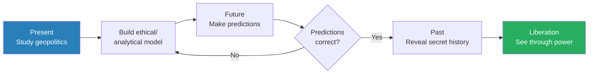
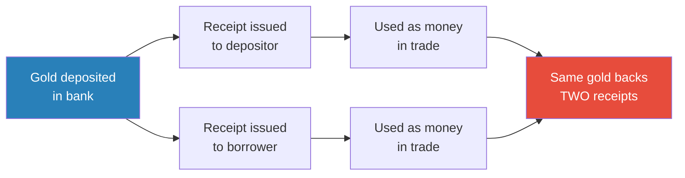
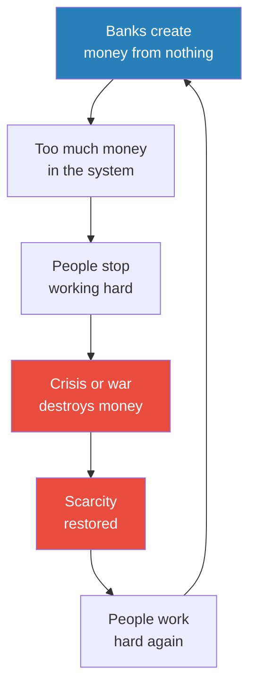
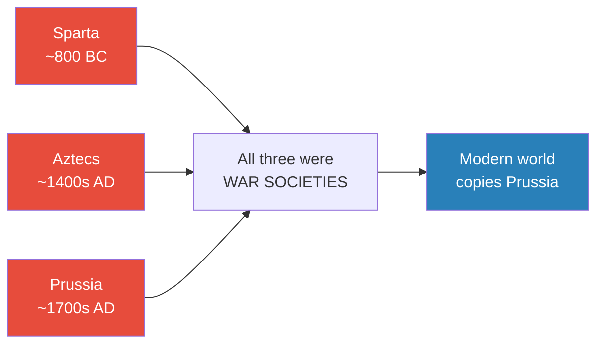
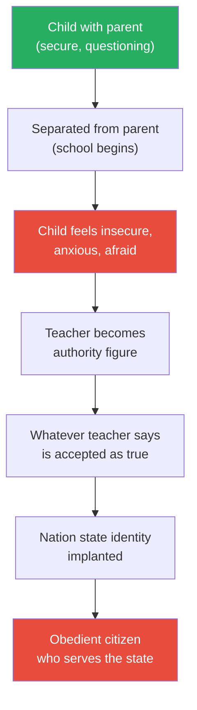
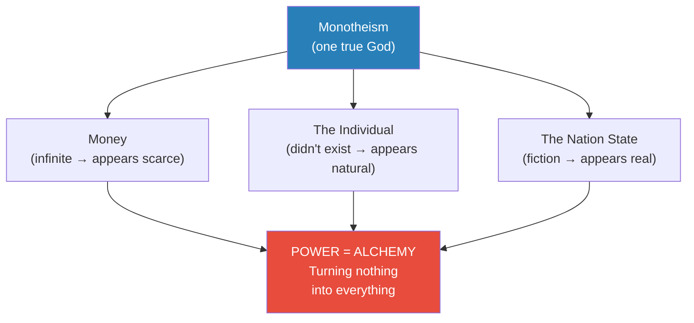
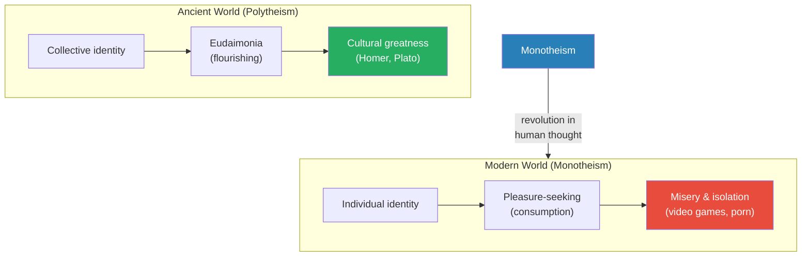

# How Power Works

> Prof. Jiang opens the Secret History series by asking the question that will drive all 28 lectures: how does power work? Through three provocative examples — money, the concept of the individual, and compulsory schooling — he argues that the world we take for granted is an elaborate construction designed to make us work as hard as possible. Money is infinite, not scarce. The individual is an invention, not a natural fact. The nation state is a false memory, not a reality. All three trace back to monotheism, and all three serve the same purpose: turning nothing into everything. Power, he concludes, is alchemy.

---

## The Question

*Prof. Jiang begins with a philosopher, a provocation, and a promise: this class will change how you see the world.*

The first word of the semester is <b style="color: #2980b9">paradigm</b> — and Prof. Jiang pauses to define it carefully because it will recur throughout all 28 lectures:

- A paradigm is a story, a model, an understanding of the world
- It is not necessarily true — it is simply the dominant explanation most people accept without thinking
- The purpose of this course is to examine paradigms: to ask whether the stories we tell about civilisation actually match what the evidence shows

Before presenting any history, Prof. Jiang lays a philosophical foundation through <b style="color: #2980b9">Immanuel Kant</b>, whom he calls the greatest philosopher in Western history:

- Kant taught that we can never know objective reality — what he calls the <b style="color: #2980b9">noumena</b> (things in themselves)
- We perceive the world through our senses, which warp reality into a structure we can process — the <b style="color: #2980b9">phenomena</b> (things that appear to us)
- Example: time and space do not exist outside of us — they are frameworks our minds impose on reality in order to make sense of it
- The implication: <b style="color: #27ae60">reality is what we imagine it to be — life is a constant act of imagination</b>

This is not abstract philosophy for its own sake. Prof. Jiang is laying the groundwork for everything that follows: if reality is shaped by imagination, then whoever controls the imagination controls reality. That is what power does.

The course promise is ambitious: "I want to train you or teach you or inspire you to augment your imagination so that you see the world much more clearly." But he immediately adds a qualifier that gives the project its intellectual honesty — "We will not succeed. We will fail, but the process of trying will train our minds to think much more critically about the world."

> [!tip] Core Insight
> Reality is what we imagine it to be. The course is not about what to think but how to think — training the imagination to see through the constructions that powerful people have embedded in our understanding of the world.

---

## Key Concepts at a Glance

| Concept | One-line summary |
|---------|-----------------|
| **Paradigm** | A story or model for understanding the world — most paradigms are accepted without examination |
| **Noumena / Phenomena** | Kant's distinction: objective reality is unknowable; we only perceive filtered appearances |
| **Alchemy (of power)** | Power's core mechanism: turning nothing into everything — money, identity, nationhood from thin air |
| **Money creation** | Banks create money from nothing through lending — money is infinite, scarcity is manufactured |
| **Central banking** | Cartel system originating from merchant intermarriage — controls the world's money supply |
| **Scarcity illusion** | Poverty and crises are manufactured to make money appear valuable and people willing to work |
| **Eudaimonia** | Greek concept of flourishing — live your best life today because fate is uncontrollable |
| **Polytheism vs. modern science** | Polytheism gave honest powerlessness and collective action; modern science gives false control and isolation |
| **The nation state** | A false memory implanted through compulsory schooling — identity was local before nationalism |
| **Monotheism** | The revolution in human thought that created money, the individual, and the nation state |

---

## The Course Framework

*Before revealing how power works, Prof. Jiang explains how the course itself works — and why it is structured as a loop between past, present, and future.*

The semester operates on three time horizons, each feeding into the next:

- **The Present:** Study geopolitics — why is there war in Ukraine? Why is there war in the Middle East? Build an ethical and analytical model to explain what is happening
- **The Future:** Use the model to make predictions — predictions test whether the model is correct, the same way you test an AI model against reality
- **The Past:** If the model produces accurate predictions, use it to go back and reveal the "secret history of the world"

*The course methodology mirrors the scientific method — build a model, test it against reality, refine it. But the goal is not academic knowledge. The goal is liberation.*

Prof. Jiang's provocation lands here: all the history you learned in school is false. It is not simply incomplete or biased — it is <b style="color: #e74c3c">a system implanted into your brains by powerful people</b>. The real question is not "what happened?" but "how does power work?" — because if you can answer that, you can see through the implanted history to what actually occurred.

---

## How Power Works: Money

*The first example is the most concrete, and Prof. Jiang uses it to shatter a belief so deeply held that students cannot let go of it even after he demonstrates it is false.*

### The Banking Thought Experiment

Prof. Jiang sets up a simple scenario:

- He opens a bank
- Students collectively deposit $5 million
- He promises them 1% interest
- A friend needs $5 million for a restaurant and will pay 10% interest
- Prof. Jiang lends out the deposits, pockets the 9% spread

Then he asks: how much money is in the bank?

- The logical answer: zero (or close to it — a student correctly notes fractional reserve rules require keeping ~10%)
- The answer taught in economics: roughly $500,000 (the fractional reserve)
- <b style="color: #27ae60">The actual answer: $9.5 million</b>

This makes no sense — until you understand that the bank has created money from nothing. The deposits still exist (the depositors believe they have $5 million). The loan also exists (the borrower has $4.5 million). The same underlying money now appears in two places simultaneously.

> [!example] Chinese Banks: From Nothing to World's Largest (2000s-2020s)
> - Over the past 20 years, Chinese banks — Bank of China, ICBC, Agricultural Bank of China — became the largest in the world
> - This did not happen because Chinese people got rich and deposited money
> - The banks created money from nothing to finance China's infrastructure projects — skyscrapers, roads, railways
> - They were allowed to do this because that is what banks do: create money
> **The lesson:** Money creation is not a historical curiosity — it is how the modern global economy operates right now.

---

### The History of Money Creation

*Prof. Jiang traces the mechanism back to its origins in merchant banking — a story that reveals how a system designed for convenience became a system of control.*

But before tracing the history, Prof. Jiang pauses to address a deeper question a student raises: why did people trust money in the first place?

- For most of human history, ordinary people had no need for money
- If you lived in a village growing crops, you traded directly — a cow for a goat, grain for cloth
- Money was used in specific symbolic circumstances, not daily commerce
- The most common use: settling debts that could never truly be repaid
  - Example: if you killed someone, their family would demand compensation
  - Money symbolised the acknowledgment of an unpayable debt — "I'm sorry I killed you. This is a debt that can never be repaid"
  - This is radically different from money as a medium of exchange — it was a ritual object, not a shopping tool
- Only with the rise of merchant trade did money become functional — and even then, all the merchants knew each other personally, so trust was interpersonal, not institutional

The historical chain of money creation:

- Merchants needed money to facilitate trade — some became wealthy enough to open banks
- Banks traded in gold — you deposited gold, received a receipt (contract) promising to return gold on demand
- Receipts were easier to carry than gold — a merchant in Italy could take a receipt to England and use it to buy goods
- The critical moment: when other merchants needed gold, the bank gave them receipts instead of gold
  - "All I need is a contract in order to go and do trade elsewhere"
  - The gold never moved — but now two sets of receipts existed for the same gold
  - <b style="color: #e74c3c">The bank had doubled the money supply from nothing</b>

*One pile of gold, two receipts — the bank has created money from nothing. This is not fraud. This is how banking has always worked.*

### The Problem: Bank Runs and Defaulting Kings

Two risks threatened this system, and both were existential:

- **Bank runs:** If too many receipt-holders demanded their gold simultaneously, the bank went bankrupt
  - The receipts promised gold on demand — "at any time you want the gold, I must give it to you"
  - With $100 million in gold contracts but only $10 million in actual gold, even 15% of holders demanding repayment would be catastrophic
  - A <b style="color: #2980b9">bank run</b> destroyed not just the bank's wealth but its reputation — and reputation was everything in a system built on trust
- **Defaulting kings:** The primary borrowers were not entrepreneurs (who barely existed) but kings and nobles who needed gold to fight wars
  - Kings could simply refuse to repay — "screw you, bank, I don't need to pay you back"
  - The banker had no army to enforce collection
  - And the king might also get killed in battle, making the loan irrecoverable either way

### The Solution: Central Banking

To mitigate these risks, banking families developed a system that would eventually control the world:

- Banks formed <b style="color: #2980b9">cartels</b> — partnerships established through intermarriage across Europe
- A bank in Italy would partner with banks in England, France, and the Low Countries
- The intermarriage created family bonds that doubled as financial guarantees
- If one bank faced a run, partner banks could supply gold temporarily — pooling resources across the cartel
- If a king refused to repay, the cartel had collective resources to finance a rival — they could fund a new enemy to kill the king and recover the debt
- This system of interlocking banking families is what we now call <b style="color: #2980b9">central banking</b>

The critical point: this system is fundamentally based on power, not economics. The ability to turn nothing (a receipt, a number) into everything (real wealth, political control, the capacity to overthrow kings) — that is the template for how all power works.

> [!tip] Core Insight
> Central banking is not a modern invention of democratic governance. It originated as a cartel of merchant families who used intermarriage and collective power to protect their ability to create money from nothing. This cartel, Prof. Jiang argues, controls the world today.

---

### The Scarcity Illusion

*Here Prof. Jiang reaches the argument that students find hardest to accept — and their resistance itself becomes his evidence.*

If banks can create money from nothing, and money is therefore infinite, then why does poverty exist?

- The students' instinctive answer: scarcity — there are limited resources
- Prof. Jiang's response: "I just spent the past 15 minutes explaining to you it's not scarce, it's infinite. And you still believe this."

The manufactured nature of poverty:

- <b style="color: #e74c3c">Poverty exists because it makes money appear valuable</b>
- If there were no poor people, no one would want to be rich
- If no one wanted to be rich, no one would work
- Parents tell children: "Work hard or you'll end up like a poor person" — this only works if poor people exist
- Poverty is not what you do to yourself — it is what the powerful do to you

*The scarcity machine is self-perpetuating: banks create money, crises destroy it, and the cycle ensures that labour never stops.*

This framework reinterprets economic crises and wars:

- **Economic crises** (stock market crashes, recessions): designed to destroy money, restoring the illusion of scarcity
- **Wars:** serve the same function — destroying wealth so that people believe resources are limited and continue working
- The real value is not money — <b style="color: #27ae60">the real value is the work we do</b>. Money merely incentivises labour.

> [!example] The World of Warcraft Analogy
> - Prof. Jiang asks students who play online games to consider the parallel
> - In World of Warcraft, players work hard to earn credits and buy virtual goods
> - The game developers could programme the engine to rain money from the sky — credits are infinite
> - But if they did, no one would play — there would be nothing to work toward
> - "If credit just flew out the sky, you wouldn't do nothing every day"
> - The real world operates on exactly the same principle — scarcity is engineered to maintain engagement
> **The lesson:** We are playing a game whose designers have infinite resources but deliberately withhold them to keep us playing.

A student pushes back: food and land ARE finite — scarcity in physical resources is real. This is the strongest objection, and Prof. Jiang takes it seriously but reframes it:

- "Go to the garbage dump anywhere in Beijing and see the amount of food that is wasted every single day"
- If you do the mathematics, there is enough food to feed everyone
- Hunger and starvation are artificial crises — they exist not because there is not enough food but because distribution is controlled
- Food is not infinite — but it is abundant enough. The scarcity is manufactured, not natural
- Prof. Jiang distinguishes between absolute scarcity (which almost never exists for essential resources) and manufactured scarcity (which is everywhere)
- He acknowledges the students cannot accept this yet: "You guys are stuck in the scarcity mindset, and it's very convincing"
- He promises to return to this argument with more evidence later in the semester

---

## How Power Works: The Individual

*The second example is the most philosophically ambitious. Prof. Jiang argues that the very concept of being an individual — the foundation of modern psychology, economics, and self-help — is a recent invention designed to make you powerless.*

### Ancient vs. Modern Happiness

Prof. Jiang asks his students: what makes you happy?

Their answers are revealing:
- Money, power, freedom, relationships, love, video games, vacations

He notes that every answer on the list is about <b style="color: #e74c3c">individual happiness</b> — and this is historically unique:

- For most of human history, happiness meant collective well-being
- If your community was not happy, you could not be happy
- The very idea of the individual is new — perhaps 500 years old at most

> [!example] The Ancient Feast Tradition
> - Throughout most of human history, if someone suddenly became wealthy, the first thing they did was hold a feast for the entire community
> - This was true across cultures — including Chinese villages, where a villager who went to Beijing, opened a restaurant, and made money would return and hold a feast for everyone
> - What mattered was not accumulation but reputation within the community
> - Generosity was the highest virtue — sharing wealth was what made you happy
> - The modern instinct — "put it underground or put it in the bank" — is the aberration, not the norm
> **The lesson:** Individual accumulation is a modern pathology. For most of human history, wealth was meaningful only when shared.

The concept of the individual simply did not exist in the ancient world:

- The worst punishment was not death — it was <b style="color: #e74c3c">exile</b>, banishment from the community
- This proves the individual had no independent existence — to be separated from the group was worse than dying
- A person without a community was not a person at all

---

### Two Worldviews: Polytheism vs. Modern Science

*This is the most counterintuitive argument in the lecture — and the one Prof. Jiang seems most passionate about. He presents two models of reality and asks students to choose. They choose wrong.*

Prof. Jiang presents two competing worldviews:

**Worldview 1 — Polytheism:**
- Humans do not have agency — powerful gods control everything
- The gods (Apollo, Dionysus) are themselves controlled by more powerful forces (fate, fortune)
- Even these forces are governed by ancient cosmic principles (anger, pride)
- There is a hierarchy of divine power: personal gods → cosmic forces → structural principles of the universe
- You have absolutely no individual agency — there is always a god interfering with your life
- If you get rich, the god of pride looks at you, decides to teach you a lesson, makes you arrogant, and you self-destruct
- Success is never safe — the gods give and the gods take, randomly and without appeal

**Worldview 2 — Modern Science:**
- We are synapses that generate memories
- Our understanding of the world comes from experience, controlled by DNA and environment
- We have full control over our individual fate
- If you are angry, therapy and reflection can fix the underlying synapses
- You can be free of anger, depression, and misery through proper intervention

Prof. Jiang asks: which is the more accurate reflection of reality?

The students choose Worldview 2 — "obviously, because this is neuroscience."

```mermaid
flowchart TB
    subgraph P["Polytheism"]
        P1["Gods control fate"] --> P2["No individual agency"]
        P2 --> P3["Eudaimonia:<br/>live your best today"]
        P3 --> P4["Collective action<br/>possible"]
        P4 --> P5["Flourishing"]
    end
    subgraph M["Modern Science"]
        M1["Synapses control fate"] --> M2["Full individual agency"]
        M2 --> M3["Individual responsibility<br/>for all problems"]
        M3 --> M4["No collective action<br/>possible"]
        M4 --> M5["Isolation & slavery"]
    end
    style P5 fill:#27ae60,color:#fff
    style M5 fill:#e74c3c,color:#fff
```

<b style="color: #27ae60">Prof. Jiang tells them they are wrong. Worldview 1 is more accurate.</b>

*The worldview that appears to give you control actually takes it away. The one that appears to make you powerless actually inspires you to flourish.*

### Why Power Prefers Worldview 2

Prof. Jiang identifies three reasons the powerful prefer the modern scientific worldview:

1. **Individual responsibility = easier control**
   - If all problems are individual, you never look at the system
   - You blame yourself for depression, poverty, failure — not the structures that created them

2. **You work harder**
   - In the polytheistic worldview: "I don't need to make a lot of money, because if I do, the gods will punish me with pride — so I'll just enjoy life"
   - In the modern worldview: "I have complete control, so I must work hard to succeed"

3. **You cannot take collective action**
   - <b style="color: #e74c3c">This is the most devastating consequence</b>
   - The modern worldview teaches you that all your problems originate within you
   - If all problems are internal, there is no reason to organise with others
   - The only way to change the world is through collective action — and this worldview makes it impossible
   - Result: isolation, video games, pornography — passive consumption instead of active resistance

> [!warning] The Psychiatry Trap
> Prof. Jiang extends the argument to mental health: if you feel sad and depressed, the system teaches you to see a psychiatrist who will prescribe drugs. He argues this makes things worse — the system is designed not to cure but to create dependency on authority. The simple remedies — walking, exercise, talking to a friend — actually work, but they do not create dependency.

### Eudaimonia: The Alternative

The polytheistic worldview produced a concept the modern world has lost: <b style="color: #2980b9">eudaimonia</b> — flourishing.

- If you have no control over fate — if the gods might kill you tomorrow — then the only rational response is to live today to the absolute best of your ability
- "Seize the day, be the best that you can be today, and that's how you win favour from the gods"
- This inspired the Greeks to produce Homer, Plato, Aeschylus, Euripides — cultural achievements that Prof. Jiang considers superior to anything the modern world has produced

The contrast with modernity is devastating:

- The ancients had eudaimonia — <b style="color: #27ae60">flourishing</b>
- The moderns have pleasure — hedonic consumption
- "Rather than flourish as creative people, we're like: how do I enjoy my life today? How do I not feel sad?"
- The Greeks asked: how can I live a life worthy of the gods' attention?
- The moderns ask: how can I avoid discomfort?
- One question produces masterpieces. The other produces dependency.

> [!abstract] Theory Evaluation: Which Worldview Serves Humanity Better?
> | Dimension | Polytheism | Modern Science |
> |-----------|-----------|----------------|
> | Agency | None — gods decide | Full — you decide |
> | Response to adversity | Accept fate, live fully | Fix yourself through therapy |
> | Collective action | Possible — problems are external | Impossible — problems are internal |
> | Cultural output | Homer, Plato, Aeschylus | Video games, pornography |
> | Power's preference | Disfavoured — harder to control | Favoured — easier to control |
> | Life philosophy | Eudaimonia (flourishing) | Pleasure (consumption) |
> | Prof. Jiang's verdict | ✅ More accurate | ❌ More enslaving |

A student raises a sharp objection: aren't the gods in Worldview 1 also authority figures? Prof. Jiang's answer reveals a critical distinction:

- Polytheistic gods are explicitly capricious, vengeful, proud, and flawed
- They fight constantly, they are jealous, they do <b style="color: #2980b9">hubris</b> — the fatal overreach that humans are not permitted
- They do not pretend to be benevolent — everyone knows the gods are terrible
- A king rules not because he is good or just, but because the gods happen to favour him — and the gods' favour can be withdrawn at any time
- "The idea that the people in power are benevolent, that they are after our best interest — that is a new, modern concept"
- In the polytheistic world, power was understood to be arbitrary, temporary, and amoral
- <b style="color: #e74c3c">The modern claim that authority acts in your interest is the dangerous deception</b> — no ancient Greek would have believed such a thing

---

## How Power Works: School and the Nation State

*The third example hits closest to the students' lived experience — and it begins with a question they think they already know the answer to.*

### Why Do We Have School?

Prof. Jiang asks his students why they are in school. Their answers:

- To learn
- To get a degree
- To gain knowledge

One student cuts through: "A chance to brainwash the students."

Prof. Jiang confirms: <b style="color: #27ae60">"The correct answer is brainwashing. Everything else is a lie."</b>

### The Apprenticeship Thought Experiment

To demonstrate that school is not about learning, Prof. Jiang poses a thought experiment:

> [!example] The Two Paths to Becoming a Doctor
> - A 12-year-old wants to become a doctor. Two paths are available:
> - **Path 1 (Apprenticeship):** Placed in a hospital for 10 years. First year: washing floors. Observing the doctor. Gradually learning to treat patients under mentorship
> - **Path 2 (School):** Harvard undergraduate, then Harvard Medical School — the best institutions in the world
> - At age 30, who is the better doctor? Obviously the apprentice — because the Harvard graduate has never worked in a hospital
> - In the apprenticeship system, anyone can become a doctor — "we human beings are all born with the capacity to learn anything"
> - The school system creates artificial hierarchies: smart students get good jobs, "stupid" students wash dishes
> - This hierarchy did not exist for most of human history
> **The lesson:** School does not teach you how to learn. It teaches you your place in a hierarchy that serves power.

### Why Only War Societies Had Schools

Prof. Jiang names the only three societies in history that introduced mandatory, free, compulsory education — and the pattern is unmistakable:

*Of thousands of ancient societies, only three adopted compulsory education — and all three existed primarily to wage war. The rest refused to copy them, because they understood what school actually does.*

- **Sparta:** One of thousands of Greek city-states, the only one with compulsory education. Children entered at age 5-6, were beaten by older children as part of their training. Sparta was first and foremost a war-making society — the Spartan warrior is legendary precisely because the entire society was organised around producing soldiers
- **The Aztecs:** The greatest war society in Central America before European contact. Defeated everyone around them. Practised extensive human sacrifice. Also provided free compulsory education for all children — the combination is not a coincidence
- **Prussia:** The greatest military power in Europe for centuries. Created the education model that the entire world uses today — every modern school system descends from the Prussian model, designed to produce disciplined, obedient citizens ready for war

The question Prof. Jiang asks is not why these three had schools — but why nobody else copied them:

- The worst thing that can happen to a parent is losing their child
- <b style="color: #e74c3c">School is designed to take your child away from you</b>
- Most societies throughout history refused to do this

### The Brainwashing Mechanism

How does brainwashing through school actually work?

*The mechanism is separation → insecurity → dependency. A child with a parent present feels safe enough to question authority. Remove the parent, and the child accepts whatever the authority figure says.*

The key steps:

- A child with their parent feels secure — willing to disobey, willing to ask questions, willing to think independently
- "If you're with your parent, you're not brainwashed, because your parent is going to protect you"
- School removes the parent — the child is now 4, 5, 6 years old and alone
- The child feels insecure, anxious, afraid — the parent who protected them is gone
- The teacher becomes the trusted authority — whatever the teacher says is now truth
- A student objects: "Aren't our parents brainwashed too?" Prof. Jiang agrees — but says even brainwashed parents create a sense of security that enables questioning

### "Are You Brainwashing Us?"

A student asks the obvious question — and Prof. Jiang's answer reveals the difference between his class and the system he is critiquing:

- "That's a good question, and it's a fair question"
- His class is pass/fail — no grades, no ranking, no consequences for disagreement
- Students have the capacity to ask questions, challenge him, think for themselves
- "All I'm saying is, hear me out, ask me questions, and then think for yourself"
- The difference: in the compulsory system, if you don't go to school, your parents get arrested
- Here, you can choose to say "this is nonsense" and walk away

This is a subtle but important distinction. The brainwashing he describes requires captive audiences and enforced authority. His own classroom, by design, has neither.

### What Is the Brainwashing?

The content implanted through schooling is the <b style="color: #2980b9">nation state</b>:

- Language, history, and geography are all taught to make students believe the nation state exists and is a real entity
- "Mother China" — the school teaches you this is a person you must love, sacrifice for, and serve
- You must be willing to sacrifice yourself for this person, send your children to die for this person
- Before the nation state, identity was local: "I'm from Beijing" or "I'm from Haidian" — not "I'm Chinese"
- You have nothing in common with someone from Yunnan or Tibet or Guangxi — but school has convinced you that you are all the same
- This is not unique to China — "all countries are nation states" — the United States, France, every modern country operates on the same principle
- <b style="color: #e74c3c">History is the false memory of a nation state</b> — it is manufactured identity, not discovered truth

Prof. Jiang is careful to note this is universal, not specific to any one country. Every nation state uses the same mechanism. The content differs — different languages, different founding myths, different heroes — but the structure is identical everywhere.

> [!tip] Core Insight
> School does not exist to teach knowledge. It exists to implant the concept of the nation state — a false identity that makes citizens obedient and willing to fight, sacrifice, and die for an imagined entity. The mechanism works because school separates children from the security of their parents, making them dependent on institutional authority.

---

## The Source: Monotheism and Alchemy

*In the final minutes of the lecture, Prof. Jiang reveals the thread that connects all three examples — and promises that the entire semester will be spent pulling on it.*

### Three Constructs, One Source

The three pillars of power — money, the individual, the nation state — share a common origin:

*All three constructs trace back to a single revolution in human thought: monotheism. The semester will show exactly how this happened.*

- <b style="color: #2980b9">Monotheism</b> — the idea of one true God — forever changed the course of human history
- The three great monotheistic religions (Judaism, Christianity, Islam) are, in Prof. Jiang's framing, "basically the same religion"
- This revolution gave us the concepts of money, the individual, and the nation state
- The semester will trace how monotheism created each of these constructs and thereby created the modern world
- Prof. Jiang does not explain the mechanism yet — that is the work of 27 future lectures
- But the claim is clear: before monotheism, none of these three constructs existed in their modern form
- Monotheism is "such a powerful idea that it turned nothing into everything" — the supreme act of alchemy

### Power as Alchemy

Prof. Jiang introduces the metaphor that will define the entire series:

- Throughout human history, <b style="color: #2980b9">alchemy</b> was the pursuit of turning lead into gold — nothing into everything
- In science class, you are taught that alchemy was a failed pseudoscience
- Prof. Jiang's reframing: <b style="color: #27ae60">we achieved alchemy — that is what power is</b>

Power is the capacity to turn nothing into everything:
- Money is nothing — a number, a receipt — yet it controls behaviour
- The individual is nothing — it did not exist for most of human history — yet it defines modern identity
- The nation state is nothing — an imagined entity — yet people die for it

> [!warning] The Accidental System
> Prof. Jiang makes a crucial qualifier: this system was not designed by genius conspirators. It was an accident of the human imagination — "we didn't know what we were doing." Because it was accidental, it is not inevitable. The human imagination that created this system can also create a new one — one built around eudaimonia rather than manufactured misery.

### What This System Has Done

The result of money, individualism, and the nation state:

- We live "extremely miserable lives" — though we have been taught to believe things keep getting better
- The system extracts human labour through manufactured scarcity, manufactured isolation, and manufactured identity
- The alternative — eudaimonia, collective flourishing — existed before monotheism and could exist again
- If you can control the human imagination, you can build a new system

*The transition from polytheism to monotheism was not progress — it was a catastrophic narrowing of the human imagination that traded flourishing for slavery.*

---

## Connections

**Builds on:** Nothing — this is the opening lecture of the Secret History series

**Sets up:** [[02 - How Societies Collapse]] (mechanisms of power will be shown in action), [[18 - Thus Spoke Zarathustra]] (monotheism's origins), [[19 - Dawn of the Jews]] (Judaism as first monotheism), [[16 - The Big Bang of Greek Civilization]] (polytheism, eudaimonia, Homer)

**Related books in vault:** [[Sapiens - Yuval Noah Harari]] (agricultural revolution, money as fiction, imagined orders), [[The 48 Laws of Power - Robert Greene]] (interpersonal power mechanics — Prof. Jiang operates at the structural/civilisational level)

---

## The Takeaway

This opening lecture is not really about money, or happiness, or school. It is about the architecture of the invisible — the structures so deeply embedded in daily life that we cannot see them, let alone question them. Prof. Jiang's project for the semester is to make these structures visible: to show that money is a trick, the individual is an invention, and the nation state is a hallucination, and that all three trace back to a single revolution in human thought called monotheism. Whether you agree with him or not, the provocation works — by the end of the lecture, the students are no longer certain about things they were certain about an hour ago.

The most counterintuitive claim is the one about polytheism. Every student in the room — trained in the modern paradigm — instinctively chose the scientific worldview as more accurate. Prof. Jiang's argument that the ancient Greek worldview produced greater cultural achievement and more genuine freedom is not easy to dismiss, because the mechanism he identifies is real: if you believe all problems are internal, you will never organise to change external conditions. The atomisation of modern life — the loneliness epidemic, the retreat into screens, the collapse of collective institutions — is exactly what you would predict from a worldview that locates all agency and all responsibility inside the isolated individual.

What remains to be seen is whether the semester delivers on the promise. Prof. Jiang has laid out the framework — power is alchemy, monotheism is the source, liberation comes through understanding — but the evidence is still to come. The students have been told that everything they believe is wrong. The next 27 lectures will need to show them why. The Kantian foundation is important here: if reality is what we imagine it to be, then the structures of power are not laws of nature — they are acts of imagination that can be reimagined. That is both the most radical and the most hopeful claim in the entire lecture.
