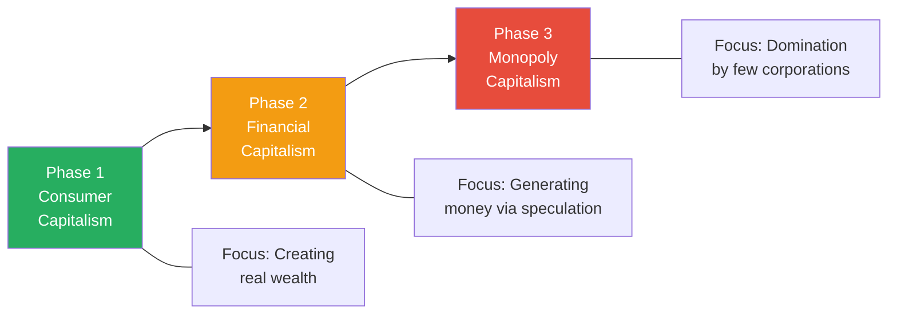
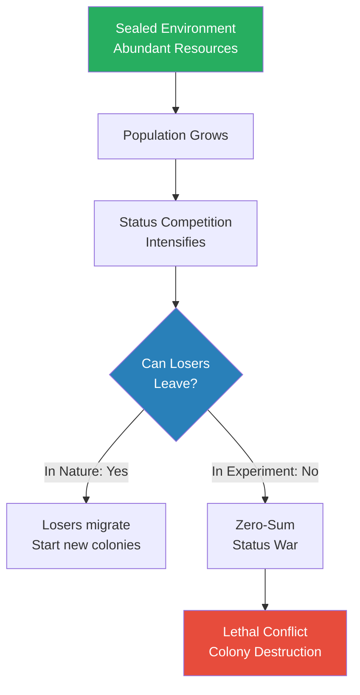
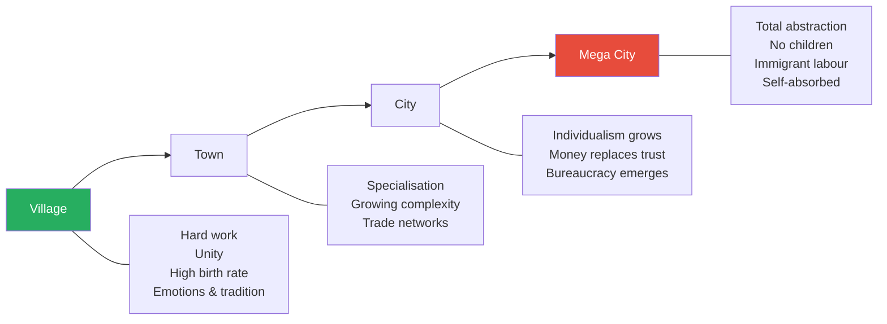
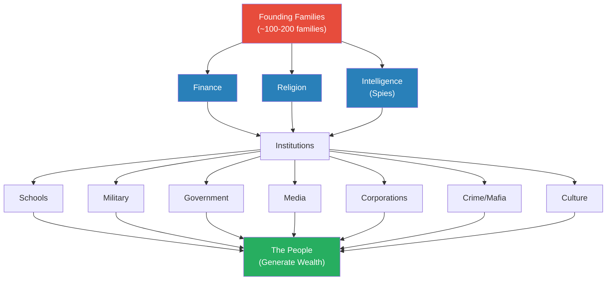
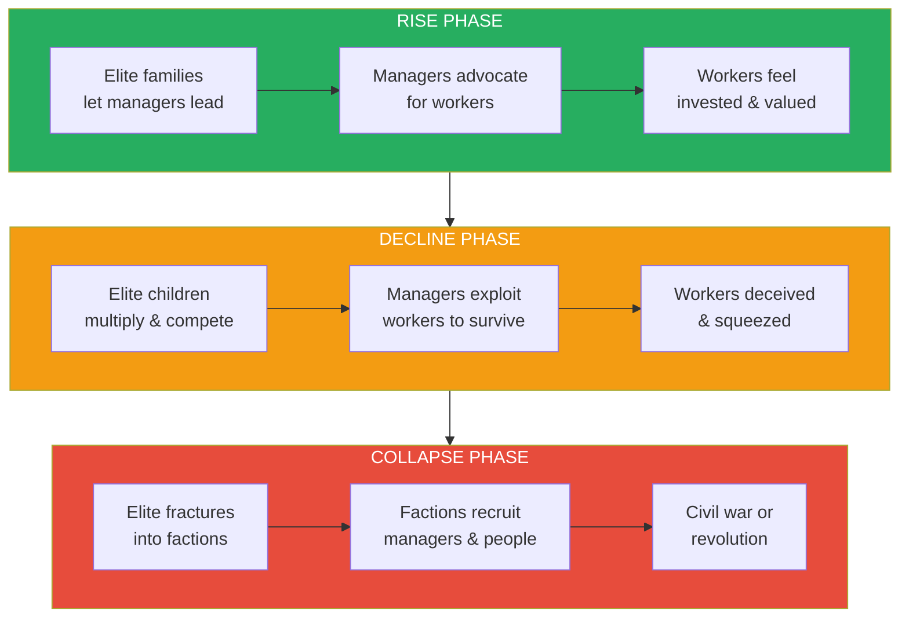
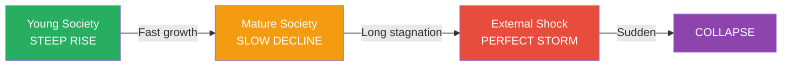
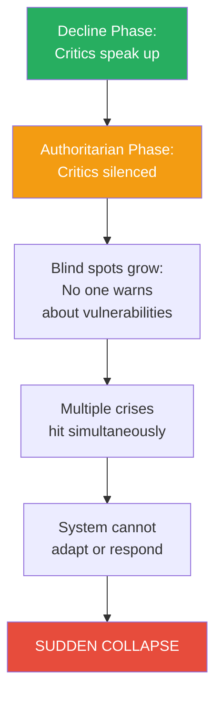
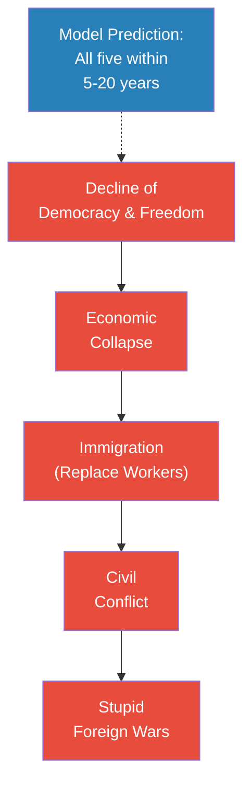
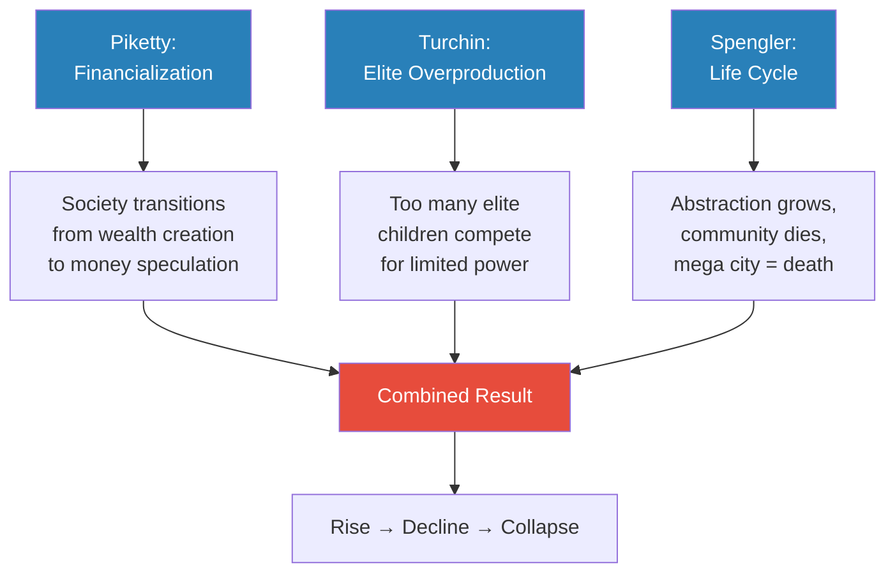

# How Societies Collapse

> Prof. Jiang asks the foundational question of the Secret History series: why do societies rise and why do they fall? He presents three academic theories — Thomas Piketty's financialization, Peter Turchin's elite overproduction, and Oswald Spengler's civilizational life cycle — then synthesises them into a single structural model. At the core of every society sit a handful of founding families who control everything through three pillars: finance, religion, and intelligence. When the society is young, these families govern through consent and openness. But as elite children multiply and compete for limited positions of power, the system shifts from consent to deception to coercion — and collapse, when it comes, is sudden.

---

## The Question

*Why do societies rise and why do they fall — and can anything be done to stop the decline?*

Prof. Jiang opens this second lecture of the Secret History series by connecting it to the first. In Lecture 1, the class explored monotheism and the three ideas it produced — money, the individual, and the nation state. These were intellectual revolutions that created modernity, but they also created problems. Now Prof. Jiang turns to the consequences: the world we live in is a world in decline, and he wants to build a theory that explains why.

Before offering any theory, he asks the students to name the signs of decline they see around them. The list they produce together is long and sobering: wars and conflict (Ukraine, the Middle East, Southeast Asia), climate change, rising unemployment, the <b style="color: #2980b9">bailan</b> culture in China (meaning "let it rot" — a refusal to take work seriously) and its American equivalent "quiet quitting," plummeting birth rates across nearly every country, declining standards of living, rising debt (both public and private), deteriorating mental health, lower social trust, housing unaffordability, and fiscal crises in governments worldwide.

The list is deliberately exhaustive. Prof. Jiang wants his students to feel the weight of the evidence before he offers explanations. And he draws attention to two signs that students might not have considered:

- **Immigration** (primarily a Western phenomenon) — it reduces social cohesion and depresses the standard of living for existing citizens. Prof. Jiang promises to discuss this further in future lectures
- **Fiscal crisis** — governments spend more than they take in through taxes, and pension obligations are a ticking time bomb that will detonate within a decade or two

He then reverses the lens: if these are signs of decline, what does a society on the rise look like? The answer is simply the mirror image — high trust, high savings, good health, optimism, high birth rates, full employment, people genuinely invested in their work and each other.

And he warns them: "These first few classes may seem abstract and theoretical, but we are developing the ethical models in order to better understand our world."

## Key Concepts at a Glance

| Concept | One-line summary |
|---------|-----------------|
| **Financialization** | Capitalism's natural transition from creating goods to speculating on money |
| **Elite overproduction** | Too many powerful people's children competing for limited positions of power |
| **Civilizational life cycle** | Societies age like organisms — village → town → city → mega city → death |
| **Rat Utopia** | Calhoun's experiments proving abundance leads to lethal status competition, not peace |
| **Three pillars of power** | Finance, religion, and intelligence — how founding families control societies |
| **Rent-seeking behaviour** | Extracting wealth through positional power rather than productive work |
| **Abstraction** | Increasing removal from reality as civilizations mature — the mega city's fatal flaw |
| **Consent → Deception → Coercion** | The moral trajectory of a society from rise to decline to collapse |
| **Perfect storm** | Simultaneous crises that trigger sudden collapse after slow decline |

---

## Theory 1: Why Capitalism Eats Itself

*Thomas Piketty spent years examining income tax records across centuries — and discovered a simple, devastating mathematical truth about late-stage capitalism.*

The first theory Prof. Jiang presents comes from the French economist <b style="color: #2980b9">Thomas Piketty</b>, whose book *Capital in the Twenty-First Century* he recommends as "a very easy but very illuminating read." Piketty's argument is structural: capitalism naturally transitions through three phases, and each phase is less productive than the last.

- **Phase 1 — Consumer capitalism:** Society focuses on creating goods that consumers want to buy
  - This is an era of genuine wealth generation
  - Factories are built, workers are hired, technology is developed, real products are made
  - The economy grows because real value is being created

- **Phase 2 — Financial capitalism:** The focus shifts from creating wealth to creating money
  - Entrepreneurs who made fortunes in Phase 1 now want their money to grow as fast as possible
  - Rather than build more factories, they invest in the stock market
  - This is rational individual behaviour — but collectively destructive

- **Phase 3 — Monopoly capitalism:** A few companies come to dominate everything
  - It is more profitable for companies to be monopolies than to compete
  - Innovation slows, competition dies, a handful of corporations control entire sectors
  - <b style="color: #e74c3c">This is the age we live in today</b>

*Capitalism transitions naturally from wealth creation to money creation to monopolistic domination — each phase is less productive than the last.*

The mathematical engine behind this transition is a single statistic that Piketty uncovered through decades of tax record analysis: <b style="color: #27ae60">the real economy in late-stage capitalism grows at approximately 2% per year, while the financial economy grows at approximately 5%</b>.

Prof. Jiang makes this concrete with a simple thought experiment:

- You have one million dollars
- **Option A:** Open a restaurant — you will make roughly $20,000 per year (2% return)
- **Option B:** Invest in the stock market — you will make roughly $50,000 per year (5% return)
- Every rational person chooses Option B
- But if everyone chooses Option B, nobody is building restaurants, hiring workers, or creating real wealth
- The stock market inflates while the real economy stagnates

> [!tip] Core Insight
> Wealth and money are not the same thing. Consumer capitalism generates wealth — real goods, real jobs, real value. Financial capitalism generates money — numbers on a screen that grow faster than the economy they are supposed to represent. When money grows faster than wealth, the system is eating itself.

Piketty's conclusion, as Prof. Jiang presents it, is that <b style="color: #e74c3c">this is not a bug in capitalism — it is a natural cycle</b>. We live in late-stage capitalism, and the symptoms — unemployment, debt, declining work ethic, concentration of wealth — are structural consequences, not individual moral failures.

---

## Theory 2: The Rat Utopia Problem

*Peter Turchin spent decades studying why the Roman Empire fell, why the French Revolution happened, and why civilisation after civilisation follows the same pattern of collapse. His answer is not about economics — it is about status.*

The second theory comes from the historian <b style="color: #2980b9">Peter Turchin</b>, who proposed the concept of <b style="color: #2980b9">elite overproduction</b>: societies collapse because too many powerful people's children compete for a limited number of positions of power.

But before explaining Turchin, Prof. Jiang takes a detour into one of the most disturbing experiments in the history of behavioural science.

> [!example] The Rat Utopia Experiments (James B. Calhoun, 1950s–1970s)
> - American scientist James B. Calhoun wanted to understand what abundance would mean for society in the post-WWII era of growing wealth and security
> - He created sealed rooms stocked with unlimited food, water, and housing for small colonies of rats (starting with ~10, growing to 400-500)
> - At first, the rats thrived — they were happy, well-fed, and safe from predators
> - But no matter how Calhoun configured the experiment, the outcome was always the same: the rats ended up killing each other
> - He ran these experiments for over twenty years and never once achieved peaceful coexistence
> - The rats were not fighting over food — they were fighting over status (mating rights, alpha male position)
> - In nature, losing males would simply leave and start new colonies elsewhere
> - In the sealed room, there was nowhere to go — status became a zero-sum game
> **The lesson:** Abundance does not create peace. When there is no frontier, no exit, status competition becomes lethal.

*The critical variable is not abundance but exit. When losing competitors have somewhere to go, conflict remains manageable. When there is no exit, status competition escalates to destruction.*

Prof. Jiang bridges Calhoun's rats to Turchin's theory with a direct analogy. In human societies, the "rats" fighting for status are not ordinary people — they are <b style="color: #e74c3c">the children of the elite</b>. These are graduates of the most prestigious universities (Prof. Jiang uses the example of Peking University and Tsinghua University), heirs to powerful families, people who expect to be leaders. But there are only so many positions of power available.

- The elite families cannot stop having children — children are the mechanism for passing on power and privilege
- Everyone wants to marry into elite families, which expands them further
- Marriage between elite families is not romance — it is a power-maintenance strategy
- The number of elite children grows, but the number of positions of power does not
- Eventually, the children turn on each other
- The dynamic mirrors the sealed room: there is no frontier, no exit, no new colony to start
- A student asks: "What if elite families just don't have that many children?"
  - Prof. Jiang responds that the elite are the one group that is specifically incentivized to have many children
  - Power is passed through inheritance — fewer children means surrendering future influence
  - The elite cannot opt out of reproduction without opting out of power

> [!abstract] Theory Evaluation: Elite Overproduction
> | Element | Detail |
> |---------|--------|
> | **Claim** | Too many elite children competing for limited positions of power causes collapse |
> | **Evidence** | Roman Empire, French Revolution, multiple civilizations studied by Turchin over decades |
> | **Mechanism** | Status is zero-sum — only one person can hold each position of power |
> | **Outcome** | War or revolution — inevitable and structural |
> | **Counter** | "What if families don't have many children?" — Prof. Jiang: they are incentivized to, and cannot stop without surrendering power |

The result, Turchin argues, is that elite overproduction always leads to either war or revolution. It is structural and unavoidable. And this, Prof. Jiang observes, is what the Rat Utopia experiments demonstrate in miniature: <b style="color: #27ae60">when there are too many alpha males and nowhere for the losers to go, the colony destroys itself</b>.

---

## Theory 3: The Life and Death of Civilizations

*Oswald Spengler argued that civilizations are no different from human beings: they are born, they grow, they mature, and then — inevitably — they die.*

The third theory comes from the German philosopher <b style="color: #2980b9">Oswald Spengler</b>, who proposed that civilizations follow an organic life cycle that no amount of effort can reverse. The trajectory moves through four stages, and each stage is defined by increasing <b style="color: #2980b9">abstraction</b> — a growing removal from reality.

*Each stage of civilizational development brings greater abstraction — and abstraction is the slow poison that kills societies from within.*

Prof. Jiang walks through the stages with characteristic directness:

- **Village:** Life is simple and concrete
  - People work hard because survival depends on it
  - Everyone helps each other — the community is united
  - What holds people together is emotions, tradition, and personal relationships
  - Mothers commonly have ten or eleven children — kids are free labour
  - You understand where your food comes from because you planted it yourself

- **Town:** The first step away from direct experience
  - Specialisation begins, trade networks form
  - Some abstraction enters — not everyone grows their own food

- **City:** Individualism takes hold
  - People become concerned with personal pleasure and individual benefit
  - <b style="color: #e74c3c">Money replaces trust as the binding force of society</b>
  - This is the critical transition — the shift from relationship-based society to transaction-based society
  - In the village, if you get sick, your neighbours come to help — they know you, they care about you, your welfare is their welfare
  - In the city, you go to the hospital and pay a doctor. Your neighbours do not need to care. Your family does not need to help. The transaction handles everything
  - Money is what Prof. Jiang calls "the greatest abstraction" — it means we never have to trust each other again

- **Mega city:** The death phase
  - Total abstraction — you have no idea where your food comes from, where your drinks come from, how anything in your life is produced
  - You do not work hard because you do not need to — and because hard work feels beneath you
  - You want immigrants to do the work for you — cooking, cleaning, building, labouring
  - You do not care about other people — only yourself and your individual pleasure
  - You do not want children — they are inconvenient, expensive, and limiting
  - Every relationship is transactional, every bond is temporary, every loyalty is conditional on personal benefit
  - Prof. Jiang lists the world's mega cities to drive the point home: Beijing, Shanghai, Washington, New York, Paris, London — all exhibiting exactly these symptoms

> [!tip] Core Insight
> The mega city is not the peak of civilization — it is its death certificate. Beijing, Shanghai, Washington, New York, Paris, London — they are all mega cities, and that is why they all exhibit the same symptoms: low birth rates, atomised individuals, immigrant-dependent labour, collapsed social trust.

Prof. Jiang is emphatic about the implications: <b style="color: #27ae60">there is nothing anyone can do about this</b>. It is a natural life cycle. A human being can live to 100 or 150, but eventually they will die. The same is true for civilizations.

---

### Can an External Threat Save a Dying Civilization?

*A student asks the obvious question — and gets an answer that upends the Hollywood version of how humanity would respond to an alien invasion.*

A student raises a sharp objection: what if there is an external threat so severe that it forces everyone to unite? An alien invasion, a foreign attack — surely that would override the decline?

Prof. Jiang's answer is blunt and counterintuitive:

- Once society reaches the mega city phase, people are <b style="color: #e74c3c">too self-absorbed to even recognize external threats</b>
- They no longer trust each other enough to cooperate against a common enemy
- Most critically: factions within the collapsing society would not unite against the threat — they would <b style="color: #e74c3c">align with the external enemy to destroy their internal rivals</b>

This last point is one of the lecture's most striking claims. Prof. Jiang is arguing that the Hollywood narrative — humanity uniting against an alien invasion — is fantasy. The reality, he suggests, is that certain factions of humans would try to align with the aliens to defeat everyone else.

He reinforces this later in the lecture with a historical pattern: foreign invasions often succeed not because the invader is stronger, but because a faction within the collapsing society invites mercenaries in as part of an internal power struggle. The mercenaries then realize they can take the whole thing for themselves.

---

## The Synthesis: How Society Is Really Structured

*Prof. Jiang now combines all three theories into a single structural model — and the result looks less like a political science textbook and more like a corporate org chart.*

Having presented three separate theories, Prof. Jiang warns his students that each theory alone is "simplistic and inaccurate and imprecise." His project for the remainder of the lecture is to combine them into a working framework — one that he freely admits has problems, but that serves as a useful tool for analysis.

The model has three layers:

*Society is structured like a corporation: founding families are the owners, the middle class are the managers, and the people are the workers who generate all real wealth.*

### The Founding Families (The Owners)

- At the core of every society sit a small number of powerful families — "maybe 10, maybe 100"
- These are the founding families of the nation
- Prof. Jiang uses the Roman Empire as his example: an empire that controlled most of Europe, Anatolia, and Egypt was ultimately governed by approximately 200 families

### The Three Pillars of Power

These families express and maintain their power through three mechanisms:

- **Finance** — central banking and control of money (discussed in Lecture 1)
- **Religion** — controlling what people believe ("the religion of today is science and technology")
- **Intelligence** — spies and surveillance

Prof. Jiang notes that he will explore religion and intelligence in depth in future lectures. For now, the key insight is that it is the <b style="color: #2980b9">nexus</b> of all three pillars working together that allows the elite to control everyone else.

### The Middle Class (The Managers)

Between the elite families and the people sits the middle class — what Prof. Jiang calls by several names:

| Name | Origin | Meaning |
|------|--------|---------|
| **Middle class** | Common usage | The managerial layer between owners and workers |
| **Scholar-officials** | Chinese historical term | Educated administrators who ran the imperial bureaucracy |
| **Professional Managerial Class (PMC)** | Modern sociology | Professionals whose positions depend on credentials and gatekeeping |
| **Petty bourgeoisie** | Marxist terminology | Small property owners and professionals below the true elite |

The middle class's defining characteristic is <b style="color: #2980b9">rent-seeking behaviour</b>:

- They hold positions that allow them to extract wealth from others through gatekeeping
- A landlord collects rent because they own an apartment someone needs
- A lawyer collects rent because only lawyers can operate in the court system
- Managers in a company — Prof. Jiang says with characteristic bluntness — "really don't do that much"
- Their nice lives depend on proving their worth to the elite, especially when the system is under stress

### The People (The Workers)

- The massive population at the outer edge of the power structure
- They are the ones who generate all real wealth in society — every factory, every farm, every service
- Prof. Jiang uses a corporate metaphor to make this visceral: the people are the workers, the middle class are the managers, the elite families are the owners
- The entire system is designed to extract maximum productive energy from them
- When the system works well, they feel invested and valued — they believe the system serves them
- When it breaks down, they are exploited, deceived, and eventually coerced
- The people's relationship to the system depends entirely on which phase society is in
- In the rise phase, the system genuinely serves them — meritocracy works, wages rise, effort is rewarded
- In the decline phase, the system deceives them — promises are hollow, wages stagnate, effort is extracted
- In the collapse phase, the system coerces them — dissent is punished, labour is forced, survival replaces aspiration

---

## Rise, Decline, and Collapse

*The same three groups — elite, middle class, and people — interact differently at each phase of society's development. The shift is from consent to deception to coercion.*

Prof. Jiang now applies his structural model dynamically, showing how the relationships between the three groups change as society ages.

*Society moves through three phases — each defined by how the elite, middle class, and people relate to each other.*

### The Rise Phase

- The founding families are willing to let the managerial class run society
- This is what we call <b style="color: #27ae60">democracy</b> — not a political system, but a phase of social development
- The managers advocate for the workers: "We should treat workers better — they will work harder"
- Everyone feels they have a voice in the system
- Characteristics: openness, consent, meritocracy, innovation, welcoming criticism

Prof. Jiang makes a striking claim here: <b style="color: #27ae60">in the 1950s, both America and China were open societies</b>. America was democratic, China was communist — but both encouraged criticism of leaders, both rewarded talent, both were meritocratic. "It's not about political systems," he says. "It's about what stage you are in social development."

> [!example] 1950s America and China — Both Open Societies
> - Despite radically different political systems, both nations in the 1950s encouraged open criticism of leaders
> - Talent was rewarded regardless of background — meritocracy was real
> - Innovation was celebrated, debate was welcomed
> - The key variable was not the political system but the phase of societal development — both were young, rising societies
> **The lesson:** Democracy is not a system of government — it is a characteristic of young, rising societies regardless of their formal political structure.

### The Decline Phase

- Elite overproduction kicks in — too many elite children want positions of power
- The corporation (society) starts losing money — the elite are extracting too much
- You would expect the managers to say to the families: "We need to be more fair to the people"
- But that is not what happens — and this is where the model becomes darkest
- Instead, the managers exploit the people — they lie, deceive, commit fraud
- Why? Because managers are rent-seekers whose comfortable lives depend on maintaining their position
  - If the company is struggling, managers are the first to be fired — they are expensive and do not produce real value
  - To justify their existence, they must demonstrate that they can extract more from the workers
  - They create bureaucracy — paperwork, procedures, rules — to make themselves seem indispensable
  - They push workers harder to generate more wealth — not for the workers' benefit, but to protect their own positions
- <b style="color: #e74c3c">The managerial class becomes the primary instrument of exploitation</b> — not because they are evil, but because their structural position demands it
- Characteristics: bureaucracy, deception, stability over progress, suppression of innovation, increasing paperwork and rule-following

### The Collapse Phase

- Elite infighting escalates until the elite fractures into competing factions
- Each faction recruits elements of the middle class, which in turn recruit elements of the people
- Society becomes aligned into warring camps — not along ideological lines, but along factional loyalty lines
- The result is civil war or revolution — the only two outcomes the model permits
- Foreign invasion often accelerates collapse — but not in the way most people assume
  - It is not that an external power sees weakness and attacks
  - Rather, one of the internal factions invites foreign mercenaries as allies in the power struggle
  - The mercenaries arrive, assess the situation, and realise they can take everything for themselves
  - This pattern recurs throughout history — the "barbarian invasions" of Rome, for instance, were often invited
- Characteristics: authoritarianism, coercion, survival mentality, elimination of critics, factional warfare

> [!example] The McDonald's Analogy — How Social Contracts Decay
> - **Rise (Consent):** "Let's go to lunch. I want McDonald's, you want Pizza Hut. We discuss, we vote, majority wins."
> - **Decline (Deception):** "I'm the teacher, so I say: Let's go to McDonald's — Jack Ma will be there, or it's free hamburgers today." (Lying to get what you want.)
> - **Collapse (Coercion):** "I'm the teacher, and I will beat you up if you don't listen to me."
> **The lesson:** The transition from consent to deception to coercion is the trajectory of every declining society — and it happens so gradually that most people do not notice until coercion has already arrived.

| Phase | Governance | Social Contract | Priority | Treatment of Critics |
|-------|-----------|----------------|----------|---------------------|
| **Rise** | Democracy / Openness | Consent | Unity — empathy, working together | Heroes — rewarded and appreciated |
| **Decline** | Bureaucracy | Deception | Stability — maintaining status quo | Nuisances — managed and contained |
| **Collapse** | Authoritarianism | Coercion | Survival — kill or be killed | Enemies — punished and eliminated |

---

## Why Collapse Is Sudden

*The rise is steep. The decline is slow. And the collapse — when it comes — happens faster than anyone expects.*

Prof. Jiang draws a specific shape for the timeline of civilisational development: a steep upward curve, a long slow plateau, and then a cliff.

*People assume decline follows a straight line downward. In reality, the decline is a long, slow plateau — and then collapse arrives all at once.*

The reason collapse is sudden rather than gradual is the concept Prof. Jiang calls the <b style="color: #2980b9">perfect storm</b>:

- During the decline phase, society can handle individual crises
  - A plague? There is a plan for that
  - A drought? There is a plan for that
  - A war? There is a plan for that
- What society is NOT prepared for is all of these happening simultaneously
  - Plague AND drought AND war AND revolution — all at once
  - No system can withstand that many simultaneous shocks

And here is the devastating feedback loop: the reason society cannot prepare for a perfect storm is that <b style="color: #e74c3c">the authoritarian phase eliminates the very people who would have warned about it</b>.

*The authoritarian phase creates a fatal paradox: the people who could have prepared society for crisis are exactly the people the system has silenced or eliminated.*

- In the rise phase, critics are heroes — they are rewarded for pointing out problems
- In the decline phase, critics are treated as troublemakers but tolerated
- In the collapse phase, critics are enemies of the state
- By the time the perfect storm arrives, there is nobody left who is allowed to say the system is unprepared

> [!warning] The Paradox of Authoritarianism
> Authoritarian systems suppress dissent in order to maintain stability — but dissent is the early warning system that detects existential threats. By silencing critics, the system guarantees that it will be blindsided by the very crises it most needs to prepare for.

---

## Five Predictions for the Western World

*Prof. Jiang applies his model to make concrete predictions about the next five to twenty years — and warns his students: if these predictions are wrong, the model is wrong.*

Having built his theoretical framework, Prof. Jiang does something unusual for an academic: he stakes his model's credibility on specific predictions. He offers five, acknowledging uncertainty about timing ("five to ten years, or ten to twenty years") but not about direction:

1. **Decline of democracy and freedom** — Western nations will become more authoritarian
   - Already visible: Trump using military force to resolve domestic issues
   - This will accelerate throughout the Western world

2. **Economic collapse** — As people lose the right to speak up, they disinvest from the system
   - Workers who feel unheard stop working hard
   - The real economy contracts as faith in the system erodes

3. **Immigration** — Governments replace disengaged citizens with immigrant labour
   - "If the people don't want to work, screw them. Let's bring in immigrants to do the work"
   - This is a replacement strategy, not a humanitarian gesture

4. **Civil conflict** — The native population does not accept replacement quietly
   - Social fractures deepen into open conflict
   - "People are killing each other on the streets"

5. **Stupid foreign wars** — The elite redirects domestic anger outward
   - If the government lets citizens fight each other indefinitely, the citizens will eventually come after the government
   - Solution: send the discontented off to pointless wars overseas
   - Wars are not strategic — they are diversionary

*Prof. Jiang frames these not as a fixed sequence but as five developments that will manifest in varying order throughout the Western world in the coming decades.*

Prof. Jiang is explicit that these are not necessarily sequential — all five may emerge in different order and overlap with each other.

> [!example] War as Distraction (Student Q&A)
> - A student asks whether governments deliberately use wars to distract from societal collapse
> - Prof. Jiang answers directly: "That's what wars are for"
> - The elite's calculation is simple: if you do not send the discontented to war, they will revolt against you
> - The choice is between war and revolution — and from the elite's perspective, war is the better option
> - Prof. Jiang adds a caveat: "There's no right and wrong here. I'm trying to explain to you how power works"
> **The lesson:** Foreign wars in declining empires are not strategic failures or moral failings — they are deliberate pressure valves deployed by elites who face revolution at home.

---

## How All Three Theories Fit Together

*Piketty explains the economic mechanism, Turchin explains the social mechanism, and Spengler explains the cultural mechanism — but they are three views of the same process.*

*Each theory captures one dimension of the same process: Piketty explains why the economy hollows out, Turchin explains why the elite fractures, and Spengler explains why the culture loses its will to survive.*

Prof. Jiang's synthesis weaves the three theories together:

- **Piketty** explains why the economy stops generating real wealth — financial returns outpace productive investment, creating a hollow economy where the stock market rises while real livelihoods decline
- **Turchin** explains why the political system fractures — elite overproduction creates a zero-sum competition for power that inevitably escalates to civil war or revolution
- **Spengler** explains why the culture cannot save itself — increasing abstraction disconnects people from reality, from each other, and from any reason to sacrifice for the collective

Together, they describe a society that is simultaneously:
- Economically hollowed (Piketty)
- Politically fractured (Turchin)
- Culturally atomised (Spengler)

And <b style="color: #e74c3c">none of these processes can be reversed by willpower, reform, or external threat</b>. They are structural, cyclical, and — in Prof. Jiang's presentation — as natural as aging itself.

---

## How Power Really Works

*Prof. Jiang closes with a methodological confession: he does not know if he is right. But he is building a model — and if the predictions come true, the model has value.*

The final minutes of the lecture reveal something important about Prof. Jiang's pedagogical philosophy. He is not presenting this framework as truth. He is presenting it as a testable model:

- "I don't know if I'm right"
- "If tomorrow, Trump, Putin, and Xi all get together and say 'let's be best friends,' then I'm wrong"
- "We're not trying to argue what is right, what is wrong, what is just — because, quite honestly, it doesn't matter"

This is a deliberate provocation. Prof. Jiang knows his students will be uncomfortable with a framework that treats morality as irrelevant. A student had just pushed back on the idea that sending people to war could be described without moral condemnation, and Prof. Jiang's response was illuminating:

- "There's no right and wrong here" — not as a moral claim, but as a methodological one
- He is not saying morality does not exist; he is saying morality is not a useful analytical tool for understanding how power operates
- The people who hold power do not ask "is this just?" — they ask "will this work?"
- <b style="color: #27ae60">Understanding how power works requires setting aside how we wish it worked</b>
- Moral judgment is a luxury of the rise phase — in the decline and collapse phases, it is power, not justice, that determines outcomes

And he leaves them with a qualified hope: "First we're going to figure out how the world really, really works. And when we do, and if we do that, then maybe we can work together and build a more just world." The implication is clear: justice is the destination, but understanding power is the only road that leads there.

---

## Connections

**Builds on:** [[01 - How Power Works]] (monotheism, money vs wealth distinction, the three ideas that created modernity)
**Sets up:** [[03 - Death by Gerontocracy]] (the bureaucratic decline phase connects directly to aging leadership), future lectures on immigration, religion and intelligence as pillars of power
**Related lectures:** [[06 - Elite Overproduction and the Bronze Age Collapse]] (Civilization series — elite overproduction explored in historical context), [[08 - Rat Utopia and the Peloponnesian War]] (Civilization series — Rat Utopia experiments applied to Greek history)
**Related books in vault:** [[Skin in the Game - Nassim Nicholas Taleb]] (rent-seeking behaviour and asymmetry between managerial class and workers)

---

## The Takeaway

This lecture is the theoretical engine of the Secret History series. Where Lecture 1 established that monotheism created the ideas (money, individual, nation state) that drive modernity, Lecture 2 explains the structural mechanics of how those ideas play out across the lifespan of a civilization. Prof. Jiang is building a unified model — part economics, part sociology, part philosophy of history — that he will test against concrete examples for the remaining twenty-six lectures. The model's power lies not in any single theory but in the synthesis: Piketty, Turchin, and Spengler each see one dimension of the same process, and together they describe a system that is simultaneously hollowing economically, fracturing politically, and dying culturally.

The most counterintuitive insight is the claim about external threats. Every student in the room assumed that an alien invasion would unite humanity. Prof. Jiang's answer — that factions would align with the aliens against their domestic rivals — is not a throwaway provocation. It is a direct logical consequence of his model: once a society has reached the collapse phase, internal rivalries are more real, more immediate, and more existential than any external threat. The enemy you see every day is more dangerous than the enemy you have never met.

What remains open is whether the model is truly predictive or merely descriptive. Prof. Jiang has staked his credibility on five specific predictions for the Western world, and he has given himself a five-to-twenty-year window. If those predictions come true, the model gains authority. If they do not, he says, the model is wrong. This willingness to be falsified — rare in the humanities — is what elevates the framework from ideology to something closer to science.

The model also raises a question that Prof. Jiang does not fully address: if collapse is truly inevitable, what is the point of understanding it? His tentative answer — "maybe we can work together and build a more just world" — suggests that understanding the mechanisms, even if they cannot be stopped, is the precondition for any meaningful response. You cannot fight what you do not see.

The coming lectures will apply this framework to concrete historical examples. The coming decades will test it against reality.
