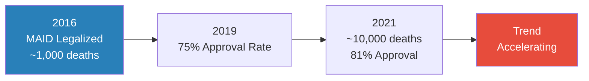
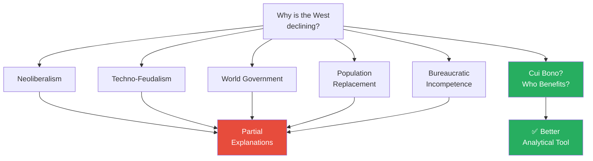
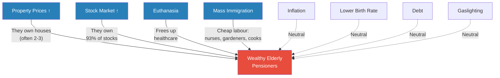
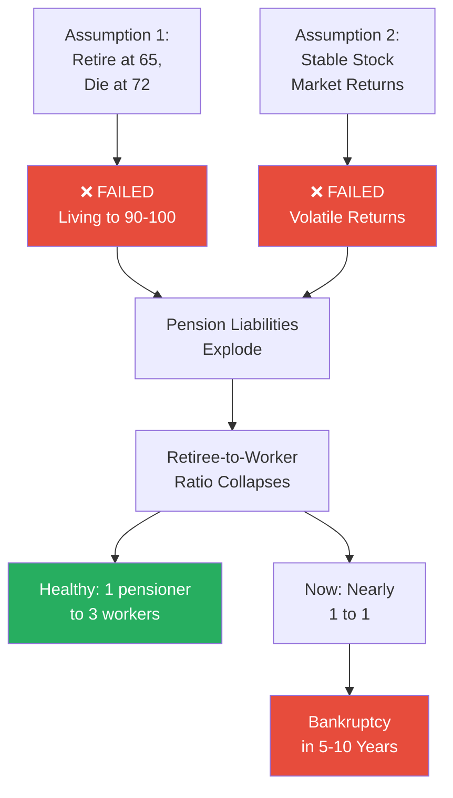
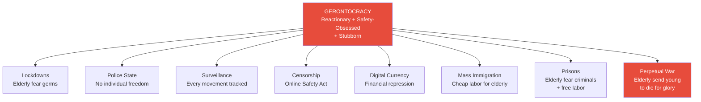
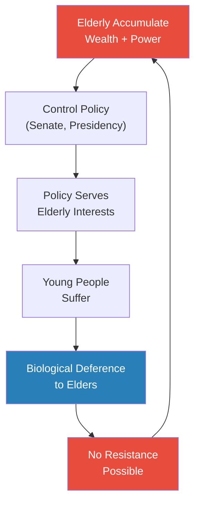

# Death by Gerontocracy

> Prof. Jiang surveys the wreckage of Western decline — immigration crises, runaway inflation, a government-assisted suicide program that kills the poor, a financial economy detached from reality, and national debt spiralling beyond any hope of repayment. He then asks the question that unlocks everything: who benefits? The answer is not neoliberalism, not tech oligarchs, not a shadowy world government. It is wealthy elderly pensioners — a demographic that has never existed at this scale in human history, that controls the political system, that young people are biologically wired to obey, and that modern medicine can keep alive almost indefinitely. Welcome to the gerontocracy.

---

## The Question

*Last class covered theories of decline. This class asks: what does the decline actually look like on the ground — and who is driving it?*

Prof. Jiang frames this lecture around two interlocking questions. First, the descriptive question: what are the concrete, measurable signs that Western civilization is in decline? Not theories — evidence. Data. Trends. Second, the analytical question that makes this lecture distinctive: once you lay out all the symptoms, who is actually benefiting from them? The answer to the second question, he promises, will explain everything.

## Key Concepts at a Glance

| Concept | One-line summary |
|---------|-----------------|
| **Gerontocracy** | Rule by elderly people — a political system where the old refuse to give up power |
| **Cui bono analysis** | "Who benefits?" — follow the money to identify who is behind a trend |
| **MAID** | Medical Assistance in Dying — Canada's government-assisted suicide program |
| **Pension crisis** | Pension systems assumed people would die at 72; they are living to 100 |
| **Biological deference** | Young people are biologically wired to respect and obey elders — even animals do this |
| **Financialization** | Financial economy booming while real productive economy declines |
| **Bureaucratic gaslighting** | Government denying reality — "it's not a recession, it's a transition" |
| **Population replacement** | Native birth rates falling while immigrant populations grow rapidly |

---

## When a Stabbing Reveals a Civilization in Crisis

*A 17-year-old kills three children in Southport, and the reaction tells you more about Britain than the crime itself.*

Prof. Jiang opens with a story designed to make you uneasy — not because of the violence, but because of what happened next.

> [!example] The Southport Stabbing and the British Riots (2024)
> - Axel Rudakubana, 17, walked into a dance studio in Southport, Britain, carrying a knife
> - He stabbed the children inside — girls aged five, six, and seven — killing three of them
> - He was quickly arrested and sentenced to 52 years in prison
> - But then rumours spread online claiming he was an asylum seeker, an immigrant
> - Riots erupted across Britain — protesters targeted immigrants, set cars on fire, clashed with police
> - The men in the protest photos were not grieving — they looked proud, righteous, like they were defending their people
> - The critical fact: Rudakubana was not an immigrant at all — he was born in Wales to Rwandan parents; he was a British citizen
> **The lesson:** The riots were not really about the stabbing. They were about a society so pressured by rapid change that a single act of violence could ignite a nationwide explosion of ethnic fury — even when the triggering narrative was false.

The Southport riots are Prof. Jiang's entry point into the real subject of this lecture: <b style="color: #e74c3c">why is the Western world tearing itself apart over immigration</b> — and who benefits from the conditions that created this crisis?

---

## The Immigration Crisis Across the Western World

*Immigration is not just a British problem. It is reshaping every major Western nation — and the data is stark.*

Prof. Jiang walks through the numbers country by country, building a picture of transformation that his students — most of them Chinese — can see but not yet explain.

- **Post-COVID spike:** Immigration surged across the Western world after COVID-19, with numbers spiking sharply in Britain, Australia, France, Germany, and Canada
- **Source countries have shifted:** Before COVID, many immigrants were European (EU migration). Now the majority come from the Middle East, Africa, India, China, and the Philippines — populations that look and feel visibly different from the native-born
- **Britain:** Maps show pockets where the immigrant population has tripled in the past five to ten years — areas where, as Prof. Jiang puts it, "you feel this is like Morocco or Rwanda"
- **Australia:** Massive post-COVID immigration spike, with India, China, and the Philippines as the three largest source countries
- **France:** Immigration spike dominated by African and Middle Eastern countries — the French feel their culture is "being diluted"
- **Germany, Italy, UK:** All experiencing the same pattern simultaneously

The scale of change is what matters. It is not that immigration is new — it is that it is happening at a speed and volume that native populations experience as an invasion, regardless of whether that word is fair.

Prof. Jiang lets the data accumulate before he offers any interpretation. Country after country, chart after chart — the same pattern. This is not a local accident of policy. It is a Western-wide structural shift, and the native populations of every country experiencing it feel the same thing: that they are under siege, that their culture is being diluted, that the pace of change has outstripped their ability to absorb it. The men in the Southport riots were not reasonable, but their anger was not invented from nothing. It was ignited by conditions that exist across the entire Western world.

---

## The Economics of Decline

*As immigrants arrive, the economy gets worse for everyone already there — and the mismatch between policy and reality reveals who is actually pulling the strings.*

### Inflation and the Cost of Living

- The <b style="color: #2980b9">Consumer Price Index (CPI)</b> — measuring the price of basic goods like food and shelter — has spiked across the Western world in recent years
- As immigrants arrive, native populations feel their quality of life declining on every dimension that matters to ordinary people:
  - Rent is higher — in many cities, unaffordably so
  - Food is more expensive — basic groceries cost noticeably more than they did five years ago
  - Supporting a family has become a financial stretch that many young couples decide is not worth attempting
- The timing is not coincidental — immigration and inflation are interacting to squeeze working and middle-class populations from both sides simultaneously

### The Canadian Housing Crisis

Prof. Jiang zeroes in on Canada as the most extreme example of what happens when policy serves the wrong people.

- **The US baseline:** In the United States, housing prices roughly correlate with GDP growth — when incomes go up, housing prices go up proportionally. This is what a healthy market looks like
- **The Canadian divergence:** In Canada, the correlation has broken entirely. GDP growth is modest and flat. Housing prices have gone vertical — the two lines diverge like an opening pair of scissors
- **The dream is dead:** Young Canadians can no longer afford to buy a house. The "Canadian dream" of homeownership is, in Prof. Jiang's words, "basically dead"
- **The paradox that reveals the game:** Canada is letting in more immigrants than ever before, but housing supply has stayed flat. Prof. Jiang shows this on a chart — immigration climbing, housing construction flatlined. Why would any rational government increase demand without increasing supply?

Prof. Jiang poses this to the class. A student nails it immediately: "People who provide housing make more money."

> [!tip] Core Insight
> Policy is not being controlled by what is best for the nation and its people. It is controlled by vested interests who profit from the process. Property owners benefit from constrained supply and rising demand — and they are powerful enough to ensure supply stays constrained.

This is the first hint of where the lecture is heading. The student has identified the mechanism — vested interests overriding national interest. Prof. Jiang confirms it and expands: "Policy is not being controlled by what's best for the nation and the people. It's controlled by vested interests that will make money off the process." He will soon name exactly who those interests are.

*The housing crisis is not a policy failure — it is a policy success for the people who matter. Constrained supply plus rising demand equals windfall profits for existing property owners.*

---

### The Birth Rate Collapse

While immigrants are flooding in, the native populations of these countries are doing the opposite — they are not reproducing.

- Native birth rates are falling across the entire Western world — young people, looking at the cost of living, the job market, and the future, are choosing not to have children
- Canada: the birth rate line is steadily declining while the immigration line climbs — immigrants now provide most of the country's population growth
- <b style="color: #e74c3c">25% of all Canadians are now first-generation immigrants</b> — born outside the country
- Canada's stated goal: 100 million people by 2100 (currently ~40 million). The majority will come from India and China
- There has been no policy rollback — no moratorium on immigration, no acknowledgment that the pace is too fast. In fact, the government plans to accelerate
- If current trends continue, in 40 to 50 years there will be very few white Canadians left in Canada — and this is causing, in Prof. Jiang's telling, enormous tension

> [!example] Indian Political Power in Canada
> - In the last federal election, 22 people of Indian descent were elected to the Canadian Parliament (out of 243 seats)
> - Chinese-Canadians, despite being more numerous and having been in Canada longer, hold fewer than 10 seats
> - Why the difference? Indians come from a democratic tradition — they are skilled at debate, organizing, and collective political action
> - Former PM Justin Trudeau met with Indian community representatives because he depended on their votes
> - If current trends continue, there is a real possibility that Indians could dominate the Canadian government within 20-40 years
> **The lesson:** Immigration is not just a demographic event — it is a political one. The communities that organize fastest will shape the nation's future.

### How Are the Locals Doing?

A student raises an important counterpoint: all this focus on immigrants, but what about the people who were already there?

Prof. Jiang's answer is grim:
- The local population is suffering even MORE than the immigrants
- The economy is declining rapidly — it is harder for young people to find jobs, especially with immigrants competing for the same positions
- Prices are so high that it is very hard for young people to live and work in big cities
- Immigrants are putting "tremendous pressure" on the local population
- This explains why ethnic tension throughout the Western world is at levels not seen in decades

### The Paradox

Prof. Jiang pauses and poses the question he wants his students to carry through the rest of the lecture:

<b style="color: #27ae60">If immigrants are making life worse for everyone — especially young people, who are the future of these nations — why is this happening? Who benefits?</b>

"You probably know the answer already," he says, "because you know how property prices work."

---

## Killing the Poor: Canada's MAID Program

*Twenty-five years ago, helping someone die was murder. Now the government does it for you — and the numbers are climbing fast.*

This is the section where Prof. Jiang's tone shifts from analytical to something closer to moral disgust. He is not just presenting data. He is presenting what he considers a civilizational obscenity.

<b style="color: #2980b9">MAID — Medical Assistance in Dying</b> — is Canada's euthanasia program, legalized in 2016. Prof. Jiang first clarifies terms for his students: suicide is when you kill yourself; euthanasia (from the Greek for "good death") is when a doctor helps you kill yourself. The concept behind MAID: if you feel your life is meaningless, if you are depressed, if you believe your disease cannot be cured, the government will help you die. Painlessly. Professionally.

Prof. Jiang pauses to register the magnitude of the shift: just 25 years ago, this was illegal everywhere. Helping someone die was murder — even if the person was suffering from terminal brain cancer and living in daily agony, the government would not allow euthanasia. Now it is a streamlined bureaucratic process.

*In five years, MAID deaths increased tenfold. The approval rate is climbing as if there is a quota to fill.*

### The Government's Justification

Prof. Jiang reads the Canadian government's own explanation for why MAID is different from suicide, and his contempt is barely contained. He calls it "disgustingly stupid":

- **Suicide:** You do it alone and shock your family. **MAID:** Everyone knows, so they won't be as sad
- **Suicide:** You might botch it. **MAID:** Professionals ensure you die properly
- Prof. Jiang: "If you think this is stupid, there's more stupidity to come"

### Who Is Actually Dying?

- The largest category is cancer patients — but cancer is often treatable, not terminal. It is, however, <b style="color: #e74c3c">the most expensive disease to treat</b>
- The two main reasons people request MAID are not terminal illness:
  1. "Loss of ability to engage in meaningful activities" — they are unhappy
  2. "Loss of ability to perform activities of daily living" — buying groceries is hard, walking is hard
- Prof. Jiang's conclusion is stark: <b style="color: #e74c3c">poor people are dying</b>. Poor people are being encouraged to die because they are a burden on the medical system. The pretense of compassionate end-of-life care masks what is functionally a culling of the economically unproductive

> [!warning] The Moral Inversion
> Doctors are trained to "do no harm." Death is supposed to be the last resort. In Canada, Prof. Jiang argues, death has become the first resort. A patient walks in and says "I want to die." The doctor says "Sure, let's do it." Canada's approval timeline is roughly 10 days — Oregon's is about a month. "It seems as though they have a quota. They're trying to kill as many people as possible."

### The Moral Shift

Prof. Jiang asks the class: why was euthanasia illegal 25 years ago? A student gives an answer about regulation, loopholes, and oversight. Prof. Jiang pauses. Then he says something that reveals the generational divide between him and his students:

- 25 years ago, the principle was simple: <b style="color: #27ae60">every life matters. Every life is a gift from God</b>
- Society's job was to protect everyone — especially the poor, the vulnerable, and the marginalized — because that is how social cohesion works
- If you let anyone die, how do you know YOU will be protected?
- What mattered was social capital, social trust, social cohesion
- Now? "It's all just money, money, money. How much does this cost me? How much revenue will this generate?"

> [!tip] Core Insight
> The shift from "every life is sacred" to "how much does this life cost?" is not just a policy change. It is a civilizational one. When a society starts measuring human beings by their economic burden, it has crossed a line that is very difficult to uncross.

---

## The Fake Economy

*The stock market says everything is great. The lived economy says everything is terrible. The government says you are imagining things.*

Prof. Jiang connects this to the financialization theme from Lecture 2:

- **Stock market boom:** If you are rich, you are getting richer and richer. The top 10% of the population owns 93% of all stocks in America — meaning that market gains flow almost entirely to the wealthy
- **Amazon's trajectory:** $7 per share in 2008, roughly $300 now — a measure of how dramatically wealth has concentrated at the top in fewer than two decades
- **Real economy decline:** Meanwhile, productivity and real economic output are falling. Fewer people are doing real jobs. The gap between the financial economy and the lived economy is widening every year
- The two economies — the one Wall Street measures and the one ordinary people live in — have completely diverged. "We live in a fake world," Prof. Jiang says, and the government's response makes it worse

### Bureaucratic Gaslighting

When people point out that the economy is in recession, the government responds not by addressing the problem but by <b style="color: #e74c3c">redefining the words</b>:

- The data says recession. The government says: "It's not a recession. It's a state of transition"
- Prof. Jiang is incredulous: "This is what we call gaslighting. This is bleeding gaslighting"
- Rather than say "the economy is in trouble and we feel your pain and we're going to work hard to solve the problem," they tell you that what you see with your own eyes is wrong
- "They're telling you: it's not black, it's white. Guys, you're lying — your eyes are lying to you. Don't you see? You're not seeing clearly. Get new glasses, and your life will be a lot better"
- This is the bureaucratization that Lecture 2 identified as a sign of decline — the government no longer solves problems, it manages perceptions

### The Debt Mountain

Prof. Jiang shows a chart of US government debt that tells a story in two acts:

- **Act 1 — 200 years of discipline:** From America's founding until roughly 1980, government debt remained low. Two centuries of fiscal restraint
- **Act 2 — the explosion:** After 1980, the line goes vertical. US government debt now stands at <b style="color: #e74c3c">$37 trillion</b>
- On top of that, American citizens owe $17 trillion in private debt — credit cards, mortgages, student loans. "They'll never pay that off"
- Prof. Jiang's verdict is blunt: the American middle class is "finished." The government has "no more resources"
- Birth rates continue falling — young people look at this world and say "screw this, I'm not having kids"
- Canada is selling its natural resources to foreign investors — when Prof. Jiang shows a chart of who owns Canadian oil companies, the major players are American or British. "Canadians don't own their own resources anymore"

This is what decline looks like in the data — not a dramatic collapse, but a slow hollowing out where the numbers tell one story and the government tells another.

---

## The Symptoms, Summarized

*Before asking WHO is responsible, Prof. Jiang lays out WHAT has gone wrong — a checklist of civilizational decay.*

| Symptom | Effect |
|---------|--------|
| Higher property prices | Young people locked out of homeownership |
| Inflation + lower quality of life | Basic goods unaffordable |
| Higher stock market valuations | Greater inequality — wealth concentrates at top |
| Less real economic growth | Fewer real jobs, declining productivity |
| Euthanasia for the poor | Medical system offloads "burdensome" patients |
| Mass immigration | Cheap labor influx, ethnic tensions, cultural displacement |
| Lower birth rates | Native populations shrinking |
| Greater public and private debt | Government and citizens overleveraged beyond recovery |
| Bureaucratic gaslighting | Government lies about economic reality |
| Privatization and asset stripping | National resources sold to foreign investors |

This is the evidence file — ten symptoms laid out side by side, each one documented with data, each one worsening over time. Any one of them could be explained away in isolation. Together, they form a pattern that demands an explanation. The question is no longer whether the West is declining. The question is: who wanted this?

---

## Five Theories of Decline — and Why None of Them Is Enough

*There are plenty of theories. Some have merit. But Prof. Jiang has a better tool — and it is embarrassingly simple.*

Prof. Jiang acknowledges that serious people have offered serious explanations for Western decline. He surveys five of them, giving each its due before explaining why he thinks there is a more powerful analytical approach:

1. **Neoliberalism** — the belief that all that matters in society is economic growth. If GDP goes up, all problems solve themselves. Society's job is simply to make the economy run as fast as possible. But this theory cannot explain why growth metrics are detaching from lived reality
2. **Techno-feudalism** — big tech corporations want to control the world by making everyone propertyless and dependent. If you do not own a house, do not own your data, do not own your means of production, then you can be controlled. Citizens become serfs in a digital manor
3. **World government** — the United Nations has a conspiracy to destroy national sovereignty and create a unified world government, erasing borders and democratic accountability
4. **Population replacement** — the problem for Western governments is that white people are "opinionated — they believe in democracy, they believe in freedom, and they're hard to control." So the plan is to replace them with Chinese, Indians, and Filipinos, because Asian people are "more obedient." Prof. Jiang presents this as a theory, not an endorsement
5. **Bureaucratic incompetence** — the simplest theory of all: government is just stupid. No conspiracy, no hidden agenda — just people in power making bad decisions because they are mediocre

"There's overlap among these theories, and there's some validity to all of them," Prof. Jiang acknowledges. "But what I want to show you is that there's actually a much better way to analyse this." His preferred method does not require you to believe in any ideology or conspiracy. It requires only one question.

*Prof. Jiang does not reject the five theories outright — he argues that a simpler analytical tool, available to anyone willing to ask the right question, cuts deeper than any of them.*

The key observation is that all five theories are ideological — they start with an abstract framework and try to fit the evidence into it. Prof. Jiang wants to go in the opposite direction: start with the evidence, and ask who it points to.

---

## The Big Reveal: Who Benefits?

*Whenever you have a problem, you always ask yourself: who benefits? The answer is not an ideology. It is a demographic.*

This is the intellectual core of the lecture — the moment where ten minutes of scattered evidence suddenly snap into a single, devastatingly simple picture.

Prof. Jiang introduces the <b style="color: #2980b9">cui bono analysis</b> — a method as old as Roman law, where prosecutors would ask "who benefits from this crime?" Instead of starting with ideology and working down to evidence, you start with outcomes and work backward to actors. Take every symptom on the decline checklist and ask one question: who benefits from this?

If you ran this analysis across every group in society — millions of different groups, Prof. Jiang says — the one group that benefits from the most symptoms and is harmed by none is: <b style="color: #27ae60">wealthy elderly pensioners</b>.

*The cui bono analysis: four major symptoms of decline directly benefit wealthy pensioners. The remaining symptoms are neutral — they do not harm pensioners either. No other group in society has this profile.*

- **Property prices rising?** They own houses — often two or three. Higher prices make them wealthier
- **Stock market booming?** They own the most stocks. Market gains flow disproportionately to them
- **Euthanasia for the poor?** It frees up the healthcare system. If poor people are "sitting in line, that's a problem for them — so just kill the poor people and they'll have better access to healthcare"
- **Mass immigration?** They need cheap labor. They are 70 or 80 years old. They need gardeners, cooks, nurses, people to mow their lawns. "You guys want to be gardeners and cooks? You don't — so we have to bring in immigrants"
- **Inflation, debt, falling birth rates, gaslighting?** These neither help nor hurt pensioners. They are consequences of the system, not things the elderly are actively engineering. But crucially, none of these symptoms harm pensioners either — their wealth is already accumulated, their debts are already paid, their children are already raised

The pattern is damning in its consistency. Prof. Jiang is careful to add a caveat: <b style="color: #2980b9">not all old people are rich</b>. Wealth is distributed across age groups, and many elderly people are poor. But the old rich are the ones with political power — and they are the ones whose interests align perfectly with every major symptom of Western decline.

> [!tip] Core Insight
> The decline of Western civilization is not driven by ideology. It is driven by the self-interest of a demographic that has never existed at this scale before: wealthy elderly people who control the political system, benefit from every major policy trend, and cannot be removed because young people are biologically wired to defer to them.

---

## The Aging Explosion

*Never in human history have there been so many old, rich people — and they are not dying.*

Prof. Jiang turns to the demographic data that makes gerontocracy not just a political phenomenon but a mathematical certainty:

- In 1900, people aged 75 and older were a tiny fraction of the population — a sliver at the top of the age pyramid
- Throughout the 20th century, that sliver has been growing and growing. The 65+ demographic is expanding rapidly; the 85+ demographic is expanding even faster
- By 2040: <b style="color: #e74c3c">65 million Americans will be over 65, and 15 million will be over 85</b>
- "These 15 million Americans — most of them are the ones who control America." They sit in the Senate. They run the corporations. They own the assets. They dictate policy
- This pattern is not unique to America — it is particularly stark in Japan and Germany, but it is happening across the entire developed world

The problem compounds because longevity means accumulation. Every additional year an elderly person lives is another year of wealth concentration, another year of political entrenchment, another year of squeezing resources from the young. The longer the elderly live, the more they own, and the more they own, the more power they wield over the systems that distribute resources.

Prof. Jiang is careful to add a qualifier: not all old people are rich. Statistics show that wealth is distributed across age groups, and many elderly people are poor. But <b style="color: #27ae60">the old rich are the ones who matter</b> — the ones with political connections, the ones who own multiple properties, the ones who dictate policy. The poor elderly are as powerless as the poor young. It is the wealthy elderly who constitute the gerontocracy.

---

## The Pension Time Bomb

*The pension system was built on one assumption: that old people would die. They did not hold up their end of the bargain.*

*Two failed assumptions are destroying pension systems worldwide. The math is brutal and the timeline is short.*

- When Canada created its pension system, the retirement age was 65 and the expected lifespan was about 72 — five to seven years of pension payouts per person
- People are now living to 90 or 100. The pension was not designed for 25 to 35 years of payouts
- Stock market returns are volatile — pension fund models assumed steady growth, but reality includes crashes and recoveries that destroy projections
- Prof. Jiang's blunt assessment of pension fund management: <b style="color: #e74c3c">"In finance, where do the dumbest people work? They work in pension funds. Why? Because it's a boring job. You just sit there and do nothing all day"</b>
- These "dumb" pension fund managers are "constantly getting ripped off by investment banks, where the smart people are"
- The retiree-to-worker ratio has collapsed: from roughly 1:3 (healthy) toward 1:1 (catastrophic)
- Prof. Jiang's warning to his students: "If you're a young person, do not put money in the pension fund. When you retire, there's no money left for you because all that money is gone"
- The value of the pension fund is "going stressfully down" — by the time his students mature and retire, the system will have been drained by the generation ahead of them

The pension crisis is not a distant problem. It is a five-to-ten-year countdown. And when these pensions go bankrupt, the political power of the elderly means that money will be diverted from schools, healthcare, infrastructure, and every other public service to keep the pensions solvent — because pensioners vote, pensioners organize, and pensioners have the cultural authority of age.

---

## The Face of Gerontocracy

*These are the most powerful people in America. One cannot walk. One is brain-dead in public. One died at her desk at 90. None of them would leave.*

Prof. Jiang makes gerontocracy concrete with three examples from American politics:

> [!example] Biden, McConnell, and Feinstein — America's Gerontocracy
> - Joe Biden, President of the United States, in his 80s — "he can't walk straight, whenever he walks, he trips"
> - Mitch McConnell, head of the US Senate, in his 80s — suffered public "brain freezes" where he would simply stop functioning mid-sentence, staring blankly for extended periods. Prof. Jiang: "The guy is literally brain dead in public"
> - Dianne Feinstein, US Senator, died in office at age 90 — she was still serving, still showing up to work
> - Chuck Grassley, US Senator, age 90, still working, refuses to retire
> - The US Senate — the most powerful political institution in America — is populated by people well above the standard retirement age of 66
> **The lesson:** These people do not give up power voluntarily. "They refuse to give up power. They only give up power if they die."

---

## The Three Generations

*The character of a civilization depends on which generation controls it. Right now, the wrong one does.*

Prof. Jiang lays out a stark typology of generational character that explains why gerontocracy produces the policies it does:

*A society ruled by the young would be chaotic but creative. A society ruled by the mature would be balanced. A society ruled by the elderly is reactionary, rigid, and obsessed with safety above all else.*

- **Young people** are rebellious, creative, open-minded — they want to change the system
- **Mature people** want stability, growth, and consensus — they want everyone to get along
- **Elderly people** are reactionary, safety-obsessed, and stubborn — they want nothing to change, and if you try to change anything, "they get upset and slap you"

We are living in a gerontocracy, which means we are living under a <b style="color: #e74c3c">reactionary, stubborn system concerned only about the safety of old people</b>. Not growth. Not innovation. Not the future. Safety. The question is not "how do we build a better world?" The question is "how do we make sure nothing changes and nothing threatens the people in charge?"

This typology explains everything that follows. Every policy outcome Prof. Jiang describes flows logically from these three elderly traits — and once you see the connection, you cannot unsee it.

---

## What Gerontocracy Produces

*A world designed by and for the elderly is not a comfortable world for anyone else. Here is what it looks like.*

*Every policy outcome of gerontocracy flows from three elderly traits: reactionary resistance to change, obsession with safety, and stubborn refusal to consider alternatives.*

Prof. Jiang now walks through the concrete policy consequences of a civilization run by people who are reactionary, safety-obsessed, and stubborn. This is the section where the lecture shifts from analysis to prophecy — and the prophecy is bleak:

- **Lockdowns:** COVID was the preview. The world shut down because elderly people were afraid of catching a virus. "We're all gonna have to shut down because old people are afraid of catching germs." Billions of young people — who faced minimal risk from COVID — had their educations, careers, and social lives destroyed to protect a demographic that controlled the policy response
- **Police state:** Not violent police beating people up — most police officers, Prof. Jiang notes, are "really, really nice people." The police state is subtler: a total absence of individual freedom, a government that inserts itself into every aspect of private life

> [!example] The Chinese Mother and the Canadian Police State
> - A Chinese immigrant mother in Canada had a naughty son she wanted to discipline
> - She knew she could not slap him — even in private, neighbours might report her
> - She went online to ask: can I slap my child?
> - The answer: no — but you can report your child TO the police, and they will come discipline him for you. Weekly, if you want
> **The lesson:** This is what a police state looks like — not jackboots and batons, but government inserting itself into the most intimate spaces of family life.

- **Surveillance:** Every movement tracked, every call monitored. "Wherever you move, you'll be tracked. Whatever call you make, you'll be tracked." The infrastructure is already in place — what changes under gerontocracy is the willingness to use it comprehensively
- **Censorship:** Britain passed the Online Safety Act in 2023 — "if you say anything bad online, you can get arrested." Freedom of expression is being curtailed in the name of safety. Prof. Jiang assumes this will spread throughout the Western world
- **Digital currency:** The push to eliminate cash is what Prof. Jiang calls <b style="color: #2980b9">financial repression</b>. With cash, you have freedom — buy what you want, how much you want, with no one watching. With digital currency, all transactions are monitored, limited, and controllable. "In the future, you will not be able to buy video games, because that's bad for you." Every purchase becomes a permission
- **Microchip implants:** Prof. Jiang traces a trajectory of escalating control — cell phones, then facial recognition, and eventually implanted microchips. Each step makes surveillance more intimate and more inescapable
- **Mass immigration:** Not driven by humanitarianism but by the elderly's material needs. They are 70 or 80 years old. They need nurses, gardeners, cooks, people to mow their lawns. Young Westerners do not want these jobs. So the system imports willing labor from abroad
- **Prisons:** The elderly fear criminals, so they want more imprisonment. And prisoners conveniently provide free labor — a two-for-one arrangement
- **Perpetual war:** "Elderly people are pretty happy to send young people to die for their glory." War serves the elderly: it eliminates restless young people, enriches defense contractors (who the elderly invest in), and provides a patriotic narrative that silences dissent

Prof. Jiang drops an aside with dark humor, directed at his Chinese students: Trump has just announced he wants 600,000 Chinese students in the United States. "Don't worry, guys, they want you to go to the United States because you guys are the best laborer. You're cheap, you're obedient, you're studious, and you're young. So this is the plan — so you guys can take care of elderly people. Is that great? Good news, right?"

The laughter in the room is uncomfortable. His students are starting to see where they fit in the gerontocratic system — not as future leaders, but as future servants.

> [!tip] Core Insight
> A gerontocracy does not announce itself as tyranny. It wraps itself in the language of safety, responsibility, and care. Every policy — surveillance, censorship, immigration, digital currency, war — can be justified in terms of protecting people. The question is: which people?

---

## Why Resistance Is Impossible

*The most chilling part of the lecture is not the diagnosis — it is the prognosis. A student asks the question everyone is thinking, and the answer is worse than silence.*

A student asks the obvious question: can young people do anything about this? Can they overthrow the gerontocracy? Is there any method to solve this?

Prof. Jiang's answer is blunt: <b style="color: #e74c3c">"Nothing."</b>

And the reason, he says, is "really, really important":

- Young people are <b style="color: #2980b9">biologically ingrained to respect their elders</b> — this is not cultural conditioning that can be unlearned, not a social norm that can be reformed. It is something deeper, written into our biology by millions of years of evolution
- "This is true throughout nature. Even young animals will respect their elders." It is not a human invention — it is a feature of animal social systems across species
- Prof. Jiang puts it in the starkest terms: "Do you want to go kill your grandparents? Probably not"
- That biological deference is exactly why the elderly can send young people to war and the young will go. They will march into battle for the glory of people who will never see the front line
- "There's nothing anyone can do about this. This is just the unfortunate state of affairs. Old people are people we are biologically trained or wired to respect and obey"

*The gerontocracy is a closed loop. The elderly control policy, policy serves their interests, young people suffer but cannot resist because biology hardwires them to obey — and the cycle continues until some external catastrophe breaks it.*

---

## What Happens When the Money Runs Out?

*The Q&A session produces three questions that go straight to the heart of the gerontocracy thesis — and Prof. Jiang's answers are uniformly grim.*

Prof. Jiang's students are sharp enough to see the obvious objections to his argument, and their questions probe whether the gerontocracy has any natural expiration date. The answers, in every case, suggest it does not.

### Where does pension money come from when pensions go bankrupt?

A student asks: what happens to the pensioners' money when there is a pension crisis?

- Prof. Jiang: Money will be <b style="color: #e74c3c">diverted from everywhere else</b> — schools, public healthcare, infrastructure — and redirected into pensions
- Why? Because pensioners are the dominant political force. They dictate policy
- They also have something young workers do not: free time. Free time to organize, to protest, to "make trouble for everyone"
- And cultural leverage: "Do you want to deny healthcare and pension to your grandparents?"
- Every pressure point — political power, free time, moral authority — favors the elderly

### But people have lifespans — won't they just die off?

Another student raises what seems like a natural check on gerontocracy: human mortality. Eventually the elderly die, and the cycle breaks. Right?

Prof. Jiang's response is sobering:

- They are NOT dying. "They were supposed to die at 72. Now they're living to 100"
- Modern medicine is extraordinary. Prof. Jiang describes a friend — a 90-year-old woman who is "literally brain dead" but wealthy enough to afford the best healthcare
- He asked a doctor friend: if you are rich and want to keep living, how long can modern medicine sustain you even as a "vegetable"? The doctor's answer: <b style="color: #e74c3c">20 years</b>. Twenty years of being brain-dead, kept alive by technology, consuming resources, holding onto wealth — simply because the money is there and the will to live (or the absence of will to die) persists
- This was not possible before — scarcity and primitive medicine ensured that old people eventually died. But modern abundance and medical technology have removed that natural check
- And when the current elderly finally do die, the next generation ages into the same position. Prof. Jiang points to his demographic charts: "When the green goes away, the red becomes the green. You'll always have a society where the elderly are in control"
- The only thing that could break the cycle? "Maybe a catastrophe, a nuclear holocaust. Who knows?" But given current trends, the structural advantage of the elderly is permanent

> [!warning] The Inescapable Trap
> The gerontocracy is self-perpetuating for three reasons: (1) modern medicine extends elderly life almost indefinitely for the wealthy, (2) when one generation of elderly dies, the next replaces them in the same power position, and (3) young people are biologically unable to resist. There is no internal mechanism for reform.

---

---

## Connections

**Builds on:** [[02 - How Societies Collapse]] (theories of decline, financialization, over-bureaucratization — all referenced explicitly and illustrated with concrete examples in this lecture)
**Builds on:** [[01 - How Power Works]] (the mechanics of power that this lecture applies to the specific case of elderly power)

**Sets up:** Continuation of decline analysis in the next class; the five theories of decline (neoliberalism, techno-feudalism, world government, population replacement, bureaucratic incompetence) are introduced but not fully explored — promised for later in the semester

**Likely connects to:** [[07 - Death by Meritocracy]] and [[08 - Death by Bureaucracy]] (companion "Death by..." lectures in the series); [[04 - How Evil Triumphs]] (the structural nature of evil connects to the structural nature of gerontocratic exploitation)

**Related books in vault:** No directly matching titles currently in the vault. The financialization critique and inequality analysis connect to themes in economic and systems-thinking books; the moral decay argument resonates with civilizational decline literature. The cui bono analytical method echoes the power-analysis frameworks found in books on strategy and influence

---

## The Takeaway

This lecture is the empirical companion to Lecture 2's theoretical framework. Where that lecture operated at the level of ideas — what causes societies to collapse? — this one operates at the level of evidence and actors. The ten symptoms are the data. The cui bono analysis is the method. And the gerontocracy is the verdict. Where the previous class asked "why do societies decline?", this one asks "what does decline actually look like — and whose fingerprints are on the weapon?" Prof. Jiang's answer is not an ideology or a conspiracy but something more mundane and therefore more disturbing: a demographic. Wealthy elderly pensioners — a group that has never existed at this scale before — benefit from almost every symptom of Western decline. They own the houses whose prices are skyrocketing. They own the stocks that are booming. They need the cheap immigrant labor. They want the poor removed from the healthcare queue. And they sit in the halls of power, brain-dead or barely ambulatory, refusing to leave until they physically cannot remain.

The most counterintuitive insight is not the diagnosis but the prognosis. Prof. Jiang does not offer hope. When a student asks whether young people can fight back, he says no — and grounds his pessimism not in politics but in biology. Young animals defer to old ones. Young humans defer to old humans. This is not a cultural artifact that can be reformed away. It is a feature of what we are as a species. The gerontocracy is not a policy choice that can be reversed at the ballot box. It is a structural condition embedded in human nature, amplified by modern medicine, and reinforced by every demographic trend on the planet.

The open questions are the ones Prof. Jiang deliberately leaves hanging. He introduces five theories of decline — neoliberalism, techno-feudalism, world government, population replacement, and bureaucratic incompetence — but refuses to adjudicate among them in this lecture, promising to return to them later in the semester. He describes the pension crisis as a five-to-ten-year time bomb but does not speculate about what happens when it detonates. He identifies wealthy elderly pensioners as the beneficiaries of decline but does not explore whether they are consciously coordinating or merely benefiting from structural incentives. And he ends with a darkly comic promise to his students: "Things will get even more depressing as we go on." This is the third lecture of twenty-eight, and the gerontocracy is only one piece of the puzzle that the Secret History series is assembling. If lecture one covered how power works and lecture two covered how societies collapse, this lecture asks who is holding the knife — and the answer turns out to be the people you are biologically forbidden from fighting.
