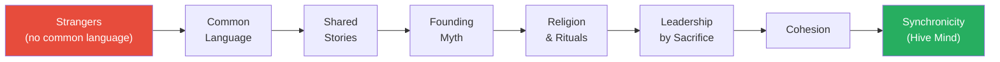
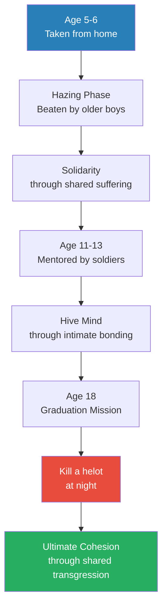
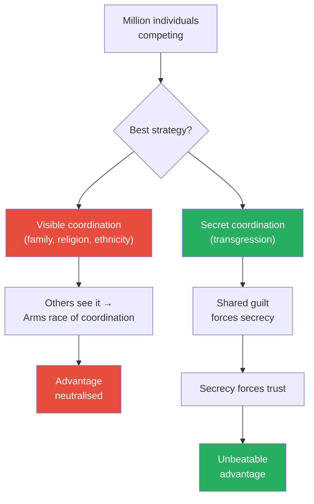
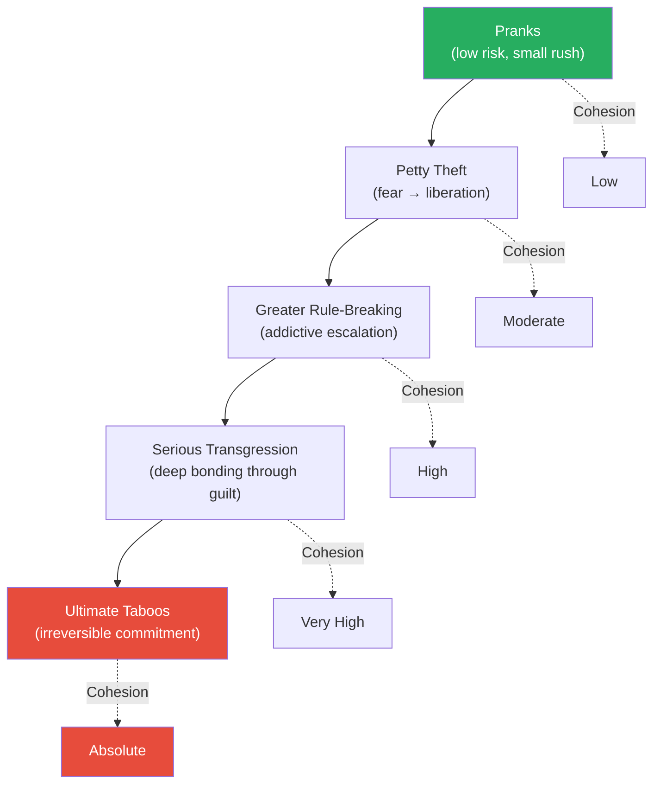
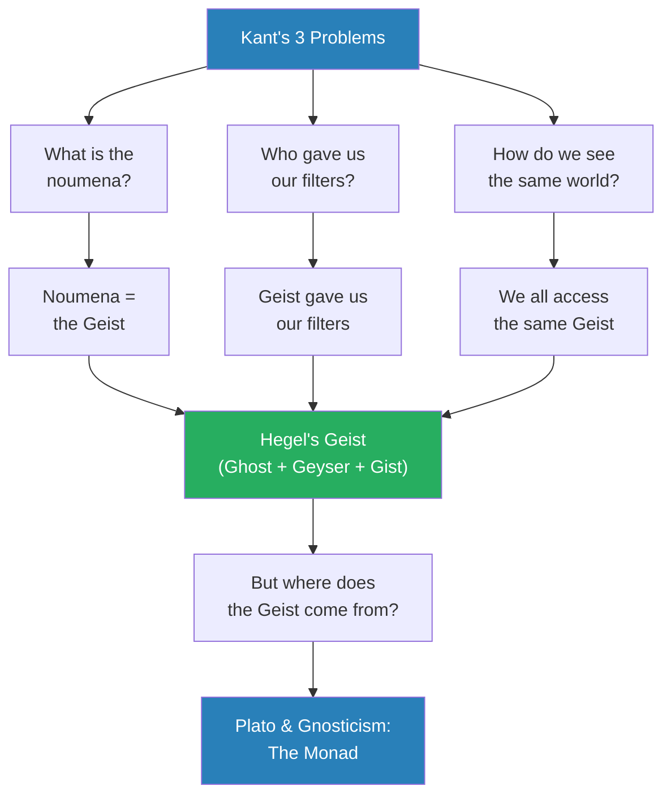
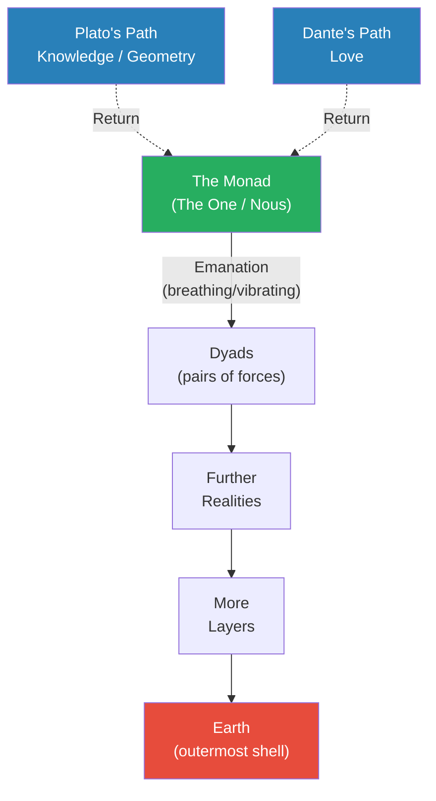

# How Evil Triumphs

> Prof. Jiang asks the most unsettling question of the series so far: why does evil win? Beginning with the claim that ritual sacrifice — from the Aztecs to the Romans to the modern era — is not barbarism but a deliberate power strategy, he builds a layered argument through thought experiments, military history, game theory, and metaphysics. The answer he arrives at is transgression: the deliberate breaking of taboos is the most powerful coordination mechanism available, because shared guilt forces secrecy, secrecy forces trust, and the feeling of breaking rules is addictive and escalating. He then constructs a metaphysical framework — from Kant through Hegel to Plato and Dante — to explain why transgression generates what its practitioners experience as "divine energy."

---

## The Question

*Why is the world so evil — and why do those who commit the worst acts not merely escape punishment, but end up controlling society?*

This is a lecture about mechanisms, not morality. Prof. Jiang opens by warning his students that the topics ahead will be "extremely disturbing" — and that this discomfort is the point. Understanding how evil functions as a system, he argues, is the only way to understand how power actually works. He is not endorsing what he describes. He is dissecting it, the way a pathologist dissects a body to understand how the disease operates.

The question he poses is deceptively simple, but it has layers. It is not just "why do bad things happen?" — that would be a question for theologians. His question is structural: why does evil, specifically, produce coordination, loyalty, and power? Why is it that the groups willing to go furthest into darkness are the ones that end up on top?

The answer he builds over the next seventy minutes spans military strategy, thought experiments, ancient Greek history, game theory, and the metaphysics of Kant, Hegel, Plato, and Dante. Each layer adds something the previous one lacked. By the end, students have a speculative but internally coherent framework for understanding why transgression generates cohesion, why cohesion generates power, and why the powerful have an interest in keeping everyone else focused on the material world.

## Key Concepts at a Glance

| Concept | One-line summary |
|---------|-----------------|
| **Ritual sacrifice** | Public killing of enemies or innocents as a deliberate strategy to unify the perpetrators |
| **"River behind your back"** | Chinese military stratagem: eliminate retreat to force total commitment |
| **Cohesion** | Deep mutual understanding within a group — like brothers, like family |
| **Synchronicity** | When people act in unison, thinking and behaving as one — a hive mind |
| **Transgression** | Deliberate breaking of taboos as a coordination mechanism — greater transgression = greater cohesion |
| **Noumena / Phenomena** | Kant: the real world (noumena) vs. the world we perceive (phenomena) |
| **Geist** | Hegel: the spiritual reality underlying the material world — ghost + geyser + gist |
| **The Monad / Nous** | Plato/Gnosticism: the supreme spiritual source from which all reality emanates |
| **Plato's path** | Return to the Monad through knowledge and geometry — elitist |
| **Dante's path** | Return to the Monad through love — egalitarian, accessible to all |

---

## Why Ritual Sacrifice Is a Strategy, Not Madness

*Prof. Jiang opens with the most provocative claim of the semester: that public atrocity is not a failure of civilisation but a calculated tool of power — and that it has been used by the most successful societies in human history.*

- He begins with what is happening in Gaza, framing it not as mere warfare but as deliberate <b style="color: #e74c3c">ritual sacrifice</b> — a pattern he traces across civilisations:
  - The **Aztecs** — temples excavated with thousands of human skulls; mass human sacrifice preceded war
  - The **Phoenicians/Carthaginians** — practised child sacrifice; condemned by Rome (which practised its own version)
  - The **Romans** — after every major war, captured enemy leaders were paraded through the streets in a ceremony called <b style="color: #2980b9">the triumph</b>, then strangled at the Temple of Jupiter as an offering to their god
- The critical puzzle: why do this publicly?
  - Prof. Jiang points out that if the goal were simply elimination, there are far more effective and discreet methods available
  - The public nature is not a flaw in the strategy — <b style="color: #27ae60">the public nature IS the strategy</b>
  - Public atrocity creates the ultimate point of no return

> [!abstract] Ritual Sacrifice Across Civilisations
> | Civilisation | Form of Sacrifice | Purpose | Key Detail |
> |-------------|-------------------|---------|------------|
> | Aztecs | Mass killing before war | Empower warriors, please the gods | Thousands of skulls found in temple excavations |
> | Phoenicians / Carthaginians | Child sacrifice | Religious appeasement | Condemned by Rome; to be discussed later in semester |
> | Romans | The Triumph — parade and strangle enemies | Offering to Jupiter | Captured leaders strangled at Temple of Jupiter |
> | Sparta | Helot-killing as graduation | Military bonding through shared transgression | Young soldiers slit helots' throats at night |

### The River Behind Your Back

- Prof. Jiang introduces a famous Chinese military stratagem: <b style="color: #2980b9">背水一战 (fight with a river behind your back)</b>
  - When an army is losing and scattered, the general forces a retreat to a river
  - With the river blocking escape, soldiers have two choices: drown or fight to the death
  - Most choose to fight — and the surge of desperate energy often destroys the enemy
  - This is considered the most celebrated stratagem in ancient Chinese military history
- The application to ritual sacrifice:
  - A student asks: what is the "river" in this analogy?
  - Prof. Jiang's answer: the "river" is the taboo itself — crossing the line of what is universally condemned
  - Once a group has crossed that line publicly, there is no going back
  - The world's condemnation becomes the binding force: you either go all the way, or the world comes for you
  - This forces absolute unity within the group — there is no room for dissent, no option of leaving
  - Prof. Jiang notes that when members of the perpetrating group travel abroad, they deliberately provoke confrontation — shouting inflammatory slogans on public transport, starting fights
  - This is not spontaneous rage — it is intentional self-isolation, designed to make the outside world hostile so that the only safe place is within the group

> [!tip] Core Insight
> Public atrocity is not a sign of madness or loss of control. It is the oldest coordination mechanism in human history — a deliberate act that eliminates retreat and forces total group commitment by making the perpetrators permanent outcasts.

---

## The Monkey Island Thought Experiment

*Prof. Jiang constructs a thought experiment that serves as the lecture's central model — a parable about how extreme adversity transforms strangers into the most powerful group on earth.*

- **The setup:**
  - An island with a safe hill at the centre, surrounded by flesh-eating monkeys everywhere else
  - All resources (trees, food, rivers) are in monkey territory
  - 100 men, aged 15 to 65, from different countries, speaking different languages, all poor and uneducated, are mysteriously transported to the safe spot
  - The situation is utterly hopeless — infinite monkeys, no escape, no common language, no shared culture

- **What happens — the progression:**
  - Despite every reason to lie down and die, the opposite occurs — hopelessness produces not despair but drive
  - They develop a <b style="color: #2980b9">common language</b> — rapidly, out of necessity
    - Some speak Chinese, some English, some Spanish, some Russian — it does not matter
    - Under survival pressure, a shared pidgin language emerges within days
  - They share stories of where they come from, and these stories become a <b style="color: #2980b9">founding myth</b>
    - The stories from different cultures blend together into a single narrative: why are we here?
  - The founding myth crystallises into a belief: God has chosen them to save the world
    - This is not a rational conclusion — it is a psychological necessity born of desperation
  - This belief becomes a <b style="color: #2980b9">religion</b>, complete with rituals that reinforce bonding
    - The rituals include sexual intimacy between the men — not out of preference but to create the deepest possible bonding and trust
    - Religious ceremonies further reinforce shared identity and purpose
  - They select a leader — and the selection reveals something fundamental about human nature

*Under extreme adversity, strangers progress through a predictable sequence — from no shared identity to telepathic-level coordination — in a process that mirrors how real military forces and secret societies form throughout history.*

### Leadership by Sacrifice, Not Wisdom

- Prof. Jiang presents the leadership contest as a choice between two candidates:
  - **The 65-year-old:** wise, experienced, strategic — delivers a powerful speech full of ideas for survival
  - **The 15-year-old:** no ideas, not articulate — but he stands silently before the group, takes out a knife, cuts off his own hand, and does not cry
- Who does everyone choose?
  - The 15-year-old, obviously — the one who has demonstrated <b style="color: #27ae60">sacrifice, commitment, and willingness to die for the group</b>
  - The old man becomes an advisor; the leader is the one most willing to suffer
  - This is the logic of all warrior cultures: legitimacy comes from sacrifice, not intelligence

### Cohesion, Synchronicity, and the Hive Mind

- Over years of fighting together, the group develops <b style="color: #2980b9">cohesion</b> — mutual understanding deeper than family bonds:
  - They understand each other better than they understand their own children or wives
  - Different backgrounds become irrelevant; shared experience overwrites everything
- Cohesion produces <b style="color: #2980b9">synchronicity</b> — the ability to act in unison without communication:
  - Like a great sports team operating with a shared mind
  - Prof. Jiang calls this a <b style="color: #2980b9">hive mind</b> — people who think and act as one

> [!example] The Mother's Intuition
> - A mother's child goes to France on vacation
> - While abroad, the child is hit by a car and hospitalised
> - The child has not called; the mother has received no information
> - Yet something in her heart tells her something is wrong
> - She starts calling frantically, contacts the police — driven by a feeling she cannot explain
> - This, Prof. Jiang argues, is how the hive mind works — people bonded deeply enough can sense each other's distress across any distance
> **The lesson:** Synchronicity is not metaphor. It is a real phenomenon that emerges from deep enough cohesion — whether in families, military units, or secret societies.

> [!example] The Grenade and the Rope Bridge
> - Ten men are collecting wood when 100 monkeys attack
> - Nine cross a rope bridge to safety; you are the last, with monkeys descending
> - If the monkeys cross, your comrades die
> - Without thinking, you cut the rope — killing yourself to save the group
> - This mirrors soldiers in trench warfare jumping on grenades — absorbing the explosion to save their squad
> - It happens instantaneously, without deliberation — it is a reflex produced by synchronicity
> **The lesson:** When cohesion reaches its peak, self-preservation disappears. The individual becomes a cell in a larger organism, and the organism's survival overrides everything.

### Strange Rituals Born of Extremity

- Prof. Jiang notes that under these conditions, the group develops rituals that would appear bizarre to outsiders but are essential for maintaining unity:
  - **Funeral rituals:** When a member sacrifices himself, an elaborate funeral is held
    - This may involve dismembering and consuming the dead — cannibalistic rituals that bind the survivors in shared transgression
    - The more extreme the ritual, the stronger the bond it creates
  - These rituals seem insane from the outside — but from inside the group, they are sacred acts that reinforce the founding religion

### The Return to the Real World

- The thought experiment's final move: after 20 years on Monkey Island, the 100 men are transported back to their old lives
- They have memories of everything — twenty years of shared hell, shared language, shared religion, shared rituals
- What happens:
  - They seek each other out and reassemble — the bond is permanent
  - They share their experience, rituals, and religion with their children and grandchildren
  - The legacy propagates across generations, becoming hereditary
  - Over time, they become a <b style="color: #e74c3c">secret elite</b> — controlling the world from behind visible leaders
  - Presidents, celebrities, and public figures are "puppets" — the real power belongs to the descendants of Monkey Island
  - A student asks: what if the real world already has leaders? Prof. Jiang's response: "On the surface, there are leaders, but the real power are you guys" — the Monkey Island group's cohesion gives them an invisible advantage that no visible leader can match

---

## Historical Proof: Sparta, Thebes, and Macedonia

*Prof. Jiang moves from thought experiment to historical evidence — three military societies that demonstrate the same cohesion mechanism in action, each one copying and improving upon the last.*

*Each society inherited the cohesion system from its predecessor, adapting it — Sparta's brutality became Thebes' voluntarism, which became Macedonia's world-conquering machine.*

### The Spartan Agoge

- The Spartan education system is the most detailed historical proof of the Monkey Island model:
  - **Phase 1 — Hazing (ages 5-6):**
    - Boys are taken from their homes and placed in a school run by older boys (10-11)
    - The older boys beat them relentlessly — there is no education, no learning, just violence
    - This <b style="color: #2980b9">hazing</b> builds solidarity — the young boys can only survive by helping each other
    - Parallel to fraternity initiation and sports team bonding rituals
  - **Phase 2 — Mentorship (ages 11-13, at puberty):**
    - Each boy is mentored by an older soldier (28-30) who has a family
    - The relationship includes sexual bonding — which Prof. Jiang contextualises:
      - There was no concept of homosexuality in ancient Greece — it was not considered a category
      - For men at war for years with no women, this was natural and unremarkable
    - Purpose: integrates the individual into the larger group mind — creates the hive mind
  - **Phase 3 — Graduation (age 18):**
    - Final mission: hunt <b style="color: #2980b9">helots</b> (slaves/serfs who worked Spartan fields)
    - Helots had a curfew — anyone outside after dark could be killed
    - Young Spartans hid in fields at night, waited for late-returning helots, and slit their throats
    - This is <b style="color: #e74c3c">ritual sacrifice disguised as a graduation exercise</b> — killing bound them permanently to the group

*The Spartan agoge systematically moved boys through the exact stages of the Monkey Island model — from shared suffering to intimate bonding to transgressive violence — producing the most feared warriors in the ancient world.*

> [!tip] Core Insight
> Among thousands of Greek city-states, only Sparta built this system. Everyone else found Sparta disgusting. But that universal hatred was precisely the point — it kept Sparta unified and made it the dominant military power of its era.

### The Sacred Band of Thebes

- Thebes copied the Spartan system but made a critical innovation: <b style="color: #27ae60">they made it voluntary</b>
  - In Sparta, you had to be born into the elite to enter the agoge — it was a closed system
  - Thebes opened the system to anyone willing to join
  - 300 soldiers, all paired as lovers — the <b style="color: #2980b9">Sacred Band</b>
  - They served as the vanguard in every battle — the spearhead — and were so ferocious that enemies fled before contact
  - The key insight: lovers fight harder than strangers
    - You do not fight for an abstract nation or a distant king
    - You fight for the person standing next to you — the person you love
    - This makes retreat unthinkable, because retreat means abandoning your partner to die

- Prof. Jiang contextualises the sexual relationships:
  - In the ancient world, there was no concept of homosexuality as an identity category
  - Sexual relationships between men were entirely unremarkable — not a social issue, not stigmatised
  - For soldiers campaigning for years without women present, intimacy with comrades was natural
  - The modern framing of this as "homosexuality" is anachronistic — these were bonding relationships, not identity categories

### The Macedonian Iteration

- Philip II of Macedon learned the system from Thebes (Macedonia and Thebes were initially allies)
- Philip was ambitious and recognised the system's power — he adopted and improved it
- He built the greatest army in the ancient world using an enhanced version of the same bonding principles
- His son, <b style="color: #2980b9">Alexander the Great</b> (whom Prof. Jiang notes students may not realise was Macedonian), would take this army and conquer the Persian Empire
- The progression is clear: each society took the system, modified it, and achieved greater military dominance than its predecessor

> [!example] The Sacred Band's Last Stand at Chaeronea (338 BCE)
> - Philip II grew ambitious and turned against his former ally Thebes
> - At the Battle of Chaeronea, Macedonia fought the combined armies of Thebes and Athens
> - Macedonia destroyed the allied force — they had copied and improved the system
> - When all was lost, the Sacred Band stood in the centre of the field
> - They blocked the Macedonian advance so that the rest of the army could retreat to safety
> - They did not fear death — for them, honour and sacrifice were more important than survival
> - Every single member of the Sacred Band was killed
> **The lesson:** The system works. Voluntary bonding through love produces the same military effectiveness as Sparta's coercive system — and the ultimate proof is warriors who choose death over retreat, not because they are ordered to, but because the bond demands it.

---

## Why Cheating Wins: The Game Theory of Coordination

*Prof. Jiang shifts from history to abstract logic — using game theory to explain why transgression is not merely one strategy among many, but the optimal strategy for winning power.*

- **The setup:** Imagine a million people competing against each other, but only one can win
- According to <b style="color: #2980b9">game theory</b>, the best way to win is not by being the most talented or hardworking — it is by <b style="color: #27ae60">cheating</b>
  - Specifically: by coordinating with others while everyone else plays alone
  - Coordination gives an enormous advantage over individuals
- **The problem with visible coordination:**
  - Family, religion, ethnicity, shared language — these are all coordination mechanisms
  - But they are visible — when others see you coordinating, it forces an arms race
  - Four people coordinate → five others are forced to respond → then six → escalation
  - Visible coordination neutralises itself
- **The solution:**
  - You must coordinate secretly — conspire without anyone knowing
  - The only coordination mechanism that is <b style="color: #27ae60">inherently invisible</b> is transgression

*Game theory reveals why transgression is the optimal coordination strategy — it is the only form of coordination that is self-concealing, because participants must hide their actions to survive.*

---

## Transgression: The Engine of Power

*Prof. Jiang now names the mechanism that connects all the preceding arguments — and traces its escalation from playground pranks to the darkest acts in human history.*

- <b style="color: #2980b9">Transgression</b>: the deliberate breaking of taboos, social norms, and laws
- Prof. Jiang proposes a direct relationship: <b style="color: #27ae60">the greater the transgression, the greater the cohesion, which leads to greater synchronicity</b>
- **Why it works — four reinforcing mechanisms:**
  1. **Shared guilt forces secrecy** — if anyone betrays the group, everyone is destroyed, so the secret must be kept
  2. **Secrecy forces trust** — you can only conspire with people you trust completely
  3. **Breaking rules feels empowering** — it creates a sense of liberation, of being above ordinary constraints
  4. **The feeling is addictive** — once you break a small rule and feel the rush, you want to break bigger ones

### The Escalation Ladder

- Prof. Jiang walks students through the ladder of escalating transgression:
  - **Level 1 — Pranks:** Six friends cover the school in toilet paper. A harmless joke, but now they share a secret, and anyone who betrays them gets everyone punished. Cohesion increases.
  - **Level 2 — Petty theft:** Stealing a candy bar that costs almost nothing. You are terrified — every authority figure has told you stealing is wrong. But when you do it, you feel "energised, liberated, empowered." If friends were with you, the group becomes more unified.
  - **Level 3 and beyond:** Each successful transgression demands a bigger one. The rush fades, so the stakes must rise. The ladder keeps going until you reach the ultimate taboos.
  - **The top of the ladder:** Acts so extreme Prof. Jiang writes them on the board but will not say them on YouTube — killing, and particularly acts against children; incest

*Each step up the transgression ladder increases both the rush and the bonding — small acts create small secrets, but extreme acts create unbreakable bonds because the consequences of exposure are total.*

- **The connection to secret societies:**
  - Prof. Jiang argues that secret societies practising extreme transgression exist — and that their rituals include the acts at the top of the ladder, performed publicly within the group
  - These rituals serve two purposes: group unity through shared guilt, and (in their belief system) access to "divine energy"
  - The practitioners believe transgression releases spiritual power — that by breaking the ultimate taboos, they access God
  - Prof. Jiang's assessment: "just because they're elite, just because they're powerful people, does not mean they're clever. In fact, they're kind of stupid."
  - But stupid or not, the mechanism works — their coordination is unbeatable

> [!warning] The Puppet Structure of Power
> The visible leaders of society — presidents, celebrities, public figures — are "just the face." The real power belongs to groups bonded by shared transgression, whose coordination is invisible because it must be. Prof. Jiang frames this explicitly as theory, not established fact: "I'm not saying this is a truth. I'm just saying this is a possible theory about how the world works."

---

## The Metaphysical Framework: Why Transgression Generates "Divine Energy"

*Prof. Jiang now shifts from mechanism to meaning — building a philosophical chain from Kant through Hegel to Plato and Dante that provides a speculative explanation for why transgression generates what its practitioners experience as spiritual power.*

### Kant: We Do Not See Reality

- <b style="color: #2980b9">Immanuel Kant</b> (referenced from the first lecture, expanded here):
  - Before Kant, the assumption was simple: we passively absorb objective reality — what we see is what exists
  - Kant's revolution overturned this completely: we are <b style="color: #27ae60">active participants in constructing reality</b>
  - Our brains are filters that add space and time to raw reality
  - Space and time do not exist outside of us — they are contributions of the mind, not features of the external world
  - This means we never encounter reality directly — we only encounter reality-as-processed-by-our-minds
  - The <b style="color: #2980b9">noumena</b> (things-in-themselves) = objective reality, which we can never directly access
  - The <b style="color: #2980b9">phenomena</b> (things-as-we-see-them) = reality filtered through our mental architecture
  - Prof. Jiang emphasises this is "the most accurate model of the world that we have" — confirmed by neuroscience, which shows the brain actively constructs perception rather than passively receiving it

- **Three unsolved problems Kant creates:**
  1. **What is the noumena?** — Kant says we can never know the things-in-themselves, but the question refuses to go away
  2. **Who gave us these filters?** — Where do our minds come from? Who designed the architecture of human perception?
  3. **How do we know we see the same world?** — If each person filters reality through their own mental lens, what guarantees we are all seeing the same phenomena?

- These three problems are not merely academic puzzles — they are the questions that drive the rest of the lecture's metaphysical argument

### Hegel: The Geist Solves Everything

- <b style="color: #2980b9">Friedrich Hegel</b> proposes a solution to all three of Kant's problems:
  - The noumena is the <b style="color: #2980b9">Geist</b> — a German word usually translated as "spirit" but richer than that
  - Prof. Jiang unpacks the Geist through three English words derived from it:
    - **Ghost** — a parallel spiritual reality existing alongside the material world
    - **Geyser** — a force that is constantly expanding, becoming, erupting
    - **Gist** — the essence of things, the core truth
  - The Geist solves Kant's three problems:
    1. The noumena = the Geist (the spiritual world is the real world)
    2. The Geist gave us our filters (it is the source of our mental architecture)
    3. Because we all access the same Geist, we see the same world

*Each philosopher builds on the one before: Kant identifies the problems, Hegel provides the framework, and Plato/Gnosticism supply the origin story — a philosophical chain that Prof. Jiang weaves into a unified model of reality.*

### Plato, Gnosticism, and the Monad

- Hegel's Geist raises a new question: where does the Geist itself come from?
- Prof. Jiang turns to <b style="color: #2980b9">Plato</b> and a religious tradition called <b style="color: #2980b9">Gnosticism</b> (from gnosis — knowledge):
  - In the beginning: the <b style="color: #2980b9">Monad</b> (also called the One, or the Nous)
  - The Monad is like a spiritual sun — the supreme source of all existence
  - The Monad works by "breathing" — vibrating divine power outward
  - Each vibration creates <b style="color: #2980b9">dyads</b> — pairs of forces
  - The dyads create further realities, layer upon layer
  - Earth is the outermost shell — the furthest point from the Monad
  - The Geist is this entire multi-layered, multi-dimensional structure

*Reality emanates outward from the Monad like ripples from a stone. Earth sits at the outermost edge — furthest from the source. The purpose of life is to travel back inward, and Plato and Dante offer two different maps for the journey.*

### Two Paths Back: Plato vs. Dante

- The purpose of life in this framework is to <b style="color: #27ae60">return to the Monad</b>
  - This is exactly the same as Nirvana in Hinduism and Buddhism — Prof. Jiang notes the convergence explicitly

- **Plato's path — knowledge:**
  - Through philosophy — specifically sacred geometry — you can ascend back toward the Monad
  - This is inherently <b style="color: #e74c3c">elitist</b>: only those who attend Plato's academy and master mathematics can reach the divine
  - "Only if you come to my school and you learn geometry, sacred geometry, you access heaven"

- **Dante's path — love:**
  - The Monad IS love — and because it creates, its divine spark exists in everything
  - This divine spark manifests as the ability to love — mothers love children, people love each other
  - The more you love, the closer you return to the Monad
  - This is <b style="color: #27ae60">egalitarian</b>: everyone can love, so everyone has access to the divine
  - Dante's critique of Plato: it makes no sense that the Monad would create a system only the elite can use
  - "Not that many people in the world can do calculus" — but everyone can love

> [!abstract] Two Paths to the Monad
> | Path | Thinker | Method | Access | Critique |
> |------|---------|--------|--------|----------|
> | Knowledge | Plato | Philosophy, sacred geometry | Elite only — requires education | Excludes most of humanity |
> | Love | Dante | Unconditional love, free will | Universal — everyone can love | May be too simple to be true |

### Free Will and the Problem of Evil

- If the Monad is love, why does evil exist? This is the question that every student immediately asks — and Prof. Jiang presents two very different answers:

- **Plato's answer — indifference to the material:**
  - This material world does not matter — it is a shadow, a prison, a fake
  - The powerful can have it — who cares?
  - Focus on the pursuit of knowledge, because only that allows you to approach the Monad
  - "Give them what they want — their power, their fame, their money. Who cares?"
  - This is a radical form of detachment — the world is beneath concern

- **Dante's answer — free will as love's price:**
  - The Monad is love, and love requires trust
  - Trust requires free will — the freedom to choose, including the freedom to choose badly
  - Free will enables evil — but the Monad cannot intervene without destroying the gift
  - If the Monad forced everyone to be good, it would be control, not love — and control is the opposite of the Monad's nature
  - But the Monad does not abandon us entirely — from time to time, it sends <b style="color: #27ae60">messengers</b> through the Geist
  - These messengers — Plato, Dante, Jesus — arrive in the world to remind us that a divine spark exists within us
  - But believing them is our choice — the Monad will never compel faith

- **What is evil in this framework?**
  - Evil = movement away from the Monad, toward the material world
  - Evil = denial of the spiritual reality
  - Evil = denial of love and free will
  - Prof. Jiang gives a concrete modern example: school systems that force parents to prioritise grades, college admissions, and career outcomes over their children's happiness
    - Without school, parents would care about their children's wellbeing
    - Because of school, parents deny their children's agency and free will
    - The denial of free will is anti-love, and anti-love is evil in this framework
  - The powerful <b style="color: #e74c3c">invert the model</b>: they claim their god is the good one and the Monad is evil
    - In their conception, they are "liberating" humanity from the Monad by focusing attention on the material world
    - But the reality is that they gained power through transgression, and now they rationalise that power by developing belief systems that deny the truth
  - Science, in this view, is a tool of the powerful — it validates only the material world and denies the spiritual
    - "If you cannot see it, it must be fake" — this is the logic that keeps the powerful in control

> [!tip] Core Insight
> The powerful maintain their position by keeping everyone focused on the material world — the outermost shell, the prison. Science, education, and economic competition all serve this function: they make the material world feel like the only reality, which is exactly what the powerful need to preserve their control.

---

## How Transgression Works in the Metaphysical Model

*Prof. Jiang connects the two halves of his lecture — the mechanism of transgression and the metaphysical framework — into a single explanation.*

- If the Geist is a multi-layered structure containing all realities, then transgression is a <b style="color: #27ae60">tuning mechanism</b>
  - Prof. Jiang uses an analogy: think of the internet, with millions of websites
  - By performing the same transgressive act, a group "locks on to the same website" — they all tune to the same frequency
  - This shared frequency is what produces synchronicity — they think alike and behave the same way because they are accessing the same layer of the Geist
- The layers include evil forces as well as good ones:
  - Practitioners of ritual sacrifice worship a specific god within the Geist's lower layers
  - The sacrifice is not random violence — it is the consummation of a religious framework
  - "They don't do sacrifice as personal sacrifice. They do sacrifice as a consummation of their religion, because that's what their religion demands of them."
- **Why practitioners believe it works:**
  - They feel "inundated with divine energy" — convinced they have found the secret of the universe
  - Prof. Jiang's verdict: they are superstitious and not particularly intelligent, but the mechanism of coordination is real regardless of whether the metaphysical explanation is accurate

---

## Student Q&A — The Most Important Questions

*The Q&A section of this lecture is unusually rich — the students push the model to its logical limits, and Prof. Jiang's responses reveal dimensions of the argument that the main lecture only implied.*

### Why do governments serve the elderly? (From previous lecture)

- A student follows up on the previous lecture's discussion of pensioners controlling society
- The student observes that Chinese government policies — building entertainment facilities, creating programmes — visibly benefit the elderly
- Is the government controlled by pensioners, or does it merely benefit them?
- Prof. Jiang's answer: it is the structure of Chinese society itself
  - From the first day, Chinese children are taught to respect their elders
  - Elderly people are considered the most precious members of society
  - Government policies naturally flow toward those who hold cultural authority
  - The question is not whether the government serves the elderly — of course it does — the question is why society is structured this way at all

### If sacrifice creates love among perpetrators, does it bring them closer to the Monad?

- Student Amber asks the lecture's sharpest question, cutting to the heart of a paradox:
  - If transgression creates intense bonding among perpetrators — a form of deep love and connection — doesn't that mean evil acts actually bring people closer to the divine?
  - Isn't the model contradicting itself?
- Prof. Jiang's response is nuanced:
  - The sacrifice is not independent — it occurs within a religious framework
  - The practitioners worship a specific god and the sacrifice is an offering to that god
  - They are accessing a real part of the Geist — but a lower part, where evil beings reside
  - The bonding among transgressors is not genuine love in Dante's sense — it is a perversion operating within a system already designed to suppress authentic human connection
  - Our society is fundamentally <b style="color: #e74c3c">anti-love</b>: school forces parents to care about grades rather than happiness, denying children's free will and agency
  - The denial of free will is anti-love, and anti-love is evil
  - Amber summarises: "The denial of free will is anti-love, and therefore it's evil. And making it limit you from getting closer to the Monad." Prof. Jiang confirms: "That's right, exactly."

### Why does the Monad allow this? What is the purpose of keeping us from it?

- A student presses further: if the Monad is the truth, why do the powerful work to keep us from it?
- Prof. Jiang's answer: because the people in power want to stay in power
  - What they are doing goes against the Monad — but they want to maintain their position
  - They gain power by disobeying the Monad and by keeping others from the Monad
  - This is a critical clarification: the powerful do not merely ignore the spiritual — they actively suppress it because their power depends on the material world being the only perceived reality

### Does the Monad have two meanings?

- A student gets confused about whether different thinkers define the Monad differently
- Prof. Jiang corrects firmly: the Monad has ONE meaning with different names
  - It is the source of everything — the divine sun, the origin of all life
  - Plato and Dante are not debating what the Monad IS — they agree on that
  - They are debating HOW to return to it: Plato through knowledge, Dante through love
  - This distinction matters enormously for the rest of the series

### Why do different religions arrive at the same conception of the universe?

- A student asks why Plato, Dante, Hinduism, Buddhism, and Gnosticism all converge on the same basic model — despite emerging independently in different parts of the world
- Prof. Jiang's answer: because ideas come from the Geist, not from the brain
  - Neuroscience has never explained where thoughts come from — "which is weird, because that should be the most basic question"
  - Biologically, we all have the same neurological structure, yet we have radically different ideas — and some people have vastly more ideas than others
  - If the Geist exists, then different people in different places receive the same ideas through inspiration — like tuning to the same radio frequency
  - The convergence of independent religious traditions is not coincidence but evidence that they are all accessing the same underlying reality
  - "That makes a lot more sense than, 'Oh, the synapses in our brains fire together and hit like, oh, we have an idea'"

### Is Plato elitist?

- Prof. Jiang directly contrasts the two thinkers on accessibility:
  - Plato: you must learn sacred geometry to access the divine — only if you attend his academy and master mathematics can you ascend. This is inherently elitist.
  - Dante's critique: "That's the most ridiculous thing in the world" — the Monad would never create a system only the educated elite could use
  - If the Monad truly loves everyone, it would give everyone the capacity to reach it — and that universal capacity is love
  - "Not that many people in the world can do calculus — but everyone can love"

---

## Connections

**Builds on:** [[03 - Death by Gerontocracy]] (pensioners controlling society, respect for elders in Chinese society), [[01 - How Power Works]] (Kant's epistemology introduced, concept of hidden power behind visible leadership)
**Sets up:** [[05 - The Birth of Evil]] (deeper exploration of evil's origins), future lectures on Phoenicians/Carthaginians, Alexander the Great, and extended study of Kant, Plato, Hegel, and Dante
**Related books in vault:** [[The 48 Laws of Power - Robert Greene]] (transgression as power tool, Law 1: Never Outshine the Master), [[The 33 Strategies of War - Robert Greene]] (death ground strategy parallels "river behind your back"), [[Sapiens - Yuval Noah Harari]] (shared myths as civilisation-builders)

---

## The Takeaway

This lecture marks a turning point in the Secret History series — the moment where Prof. Jiang moves from describing how power works and how societies collapse to explaining the active mechanism by which evil generates and maintains power. The argument is layered and cumulative: ritual sacrifice is a strategy, not madness; extreme adversity produces unbreakable cohesion; game theory explains why secret coordination beats visible coordination; and transgression is the only coordination mechanism that is inherently secret, inherently bonding, and inherently escalating. Each layer builds on the last, and each is supported by historical examples that stretch from ancient Sparta to the modern world.

The most counterintuitive insight is not that evil exists, but that evil wins precisely because it is evil. The mechanism is self-reinforcing: transgression creates guilt, guilt requires secrecy, secrecy requires trust, trust produces cohesion, cohesion produces synchronicity, and synchronicity produces power that no group bonded by conventional means can match. The worse the act, the stronger the bond. This is deeply uncomfortable — and Prof. Jiang acknowledges as much repeatedly — but the historical evidence he presents (Sparta, Thebes, Macedonia, Rome) suggests the pattern is real regardless of how disturbing its implications.

The metaphysical framework — Kant to Hegel to Plato and Dante — is explicitly presented as speculative, not factual. But it serves an important structural role in the series: it provides a vocabulary and a model that will recur throughout the remaining lectures. Whether or not one accepts the Gnostic model of emanating realities, the framework gives students a lens for understanding why the powerful invest so heavily in materialist worldviews, why they suppress spiritual traditions that emphasise love and knowledge as paths to transcendence, and why transgression feels — to those who practise it — like accessing something beyond ordinary experience. Prof. Jiang promises to go deeper into Kant, Plato, Hegel, and Dante as the semester continues. This lecture is the foundation.
