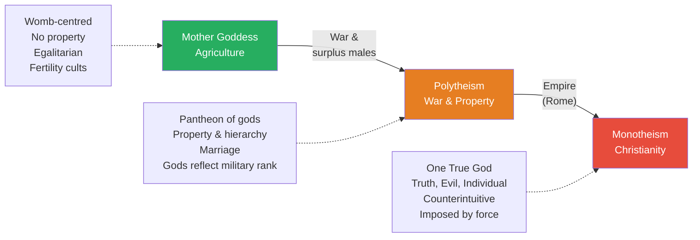
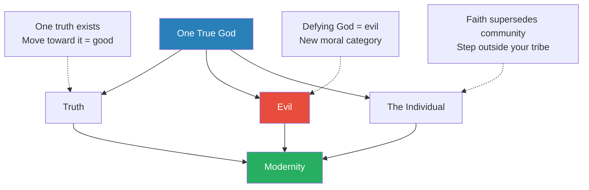
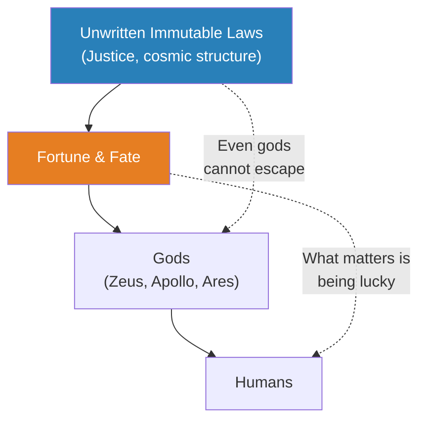
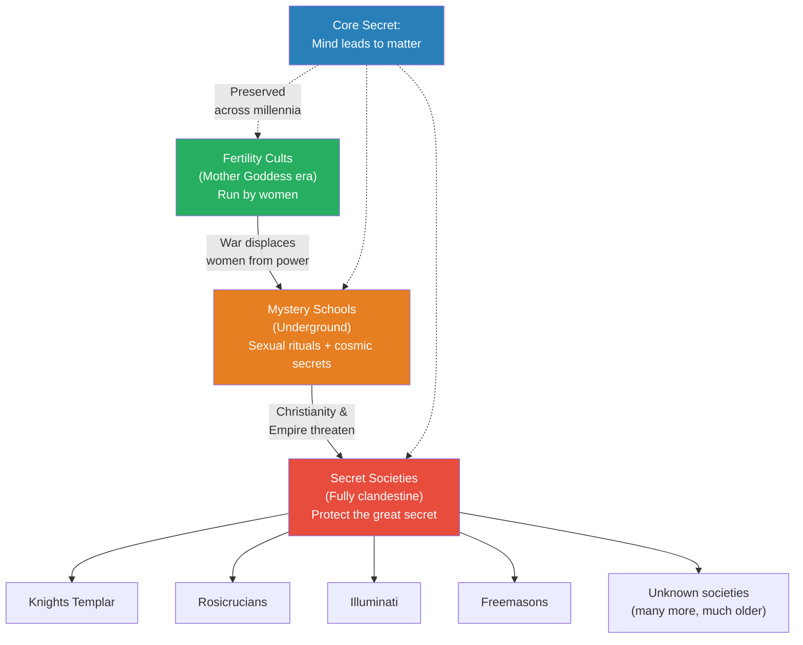
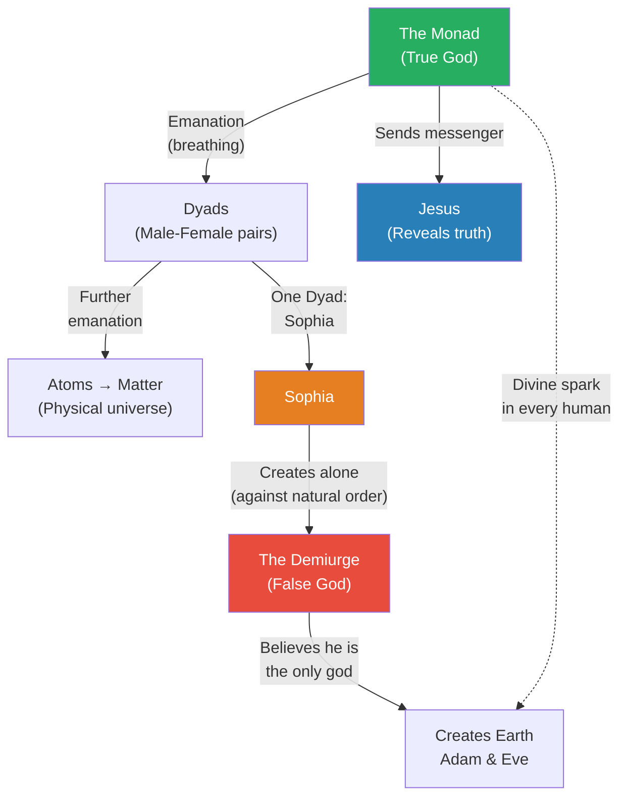
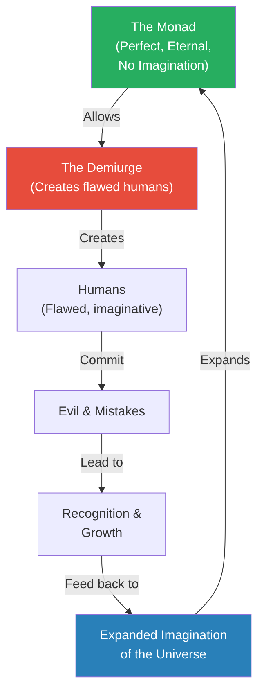
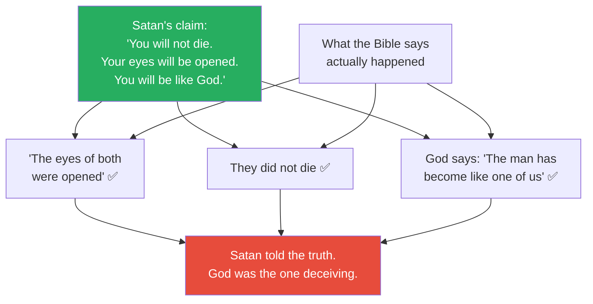

# The Birth of Evil

> Prof. Jiang traces the origin of the concept of "evil" itself — a concept he argues did not exist before monotheism. Starting with a sweeping history of Western religion across three stages (Mother Goddess, Polytheism, Monotheism), he shows how each transition was driven not by spiritual revelation but by material forces: agriculture, war, and empire. He then reveals what secret societies actually believe — a Gnostic cosmology in which the God of the Bible is a false god, Satan is a truth-teller, and Jesus was a cosmic messenger sent to remind humanity of the divine spark within. He closes by reading Genesis directly and demonstrating that the Bible itself confirms the esoteric reading.

---

## The Question

*Where do secret societies come from, what do they believe, and how was the concept of "evil" born?*

Prof. Jiang opens by connecting to the previous lecture, which covered how secret societies come into power. This lecture goes deeper — into their origins, their beliefs, and the radical alternative history they claim to protect. But the real subject is something more fundamental: how a concept that now seems self-evident to every modern person — the idea of evil — was actually invented at a specific moment in history, for specific reasons, by a specific institution.

The lecture unfolds in three movements. First, a history of Western religion that tracks three stages of belief and the material forces that drove each transition. Second, the secret cosmology that underground societies have preserved for centuries — a story in which the god we worship is a monster and the devil is the one telling the truth. Third, a close reading of both Milton's Paradise Lost and the Bible itself, in which Prof. Jiang demonstrates that the esoteric reading is not a wild conspiracy but is actually supported by the text of Genesis.

## Key Concepts at a Glance

| Concept | One-line summary |
|---------|-----------------|
| **Mother Goddess civilisation** | Womb-centred, agricultural, egalitarian world with fertility cults and no concept of property |
| **Mind leads to matter** | The great secret: consciousness creates reality, not the other way around |
| **Metaphorical vs. literal world** | Ancients understood reality through metaphor; moderns insist on literal interpretation |
| **The three concepts of monotheism** | Truth, evil, and the individual — born with Christianity, now underpin modernity |
| **Mystery Schools** | Underground organisations preserving pre-Christian knowledge and rituals |
| **The Monad** | The true god in Gnostic cosmology — a cosmic mind whose emanations create the universe |
| **The Demiurge** | A false god, created by accident, who built Earth as a prison and is the God of the Old Testament |
| **The Nephilim** | Children of angels and humans who enslaved humanity; secret societies believe they still rule today |
| **The divine spark** | A fragment of the Monad inside every human, activated through goodness and self-knowledge |
| **Paradise Lost** | Milton's epic poem, read by secret societies as an encoded revelation of cosmic truth |

---

## The Three Stages of Western Religion

*Prof. Jiang begins with a simplified but sweeping history of religion in the West — three stages, each driven by material conditions, each transforming how humans understood reality itself.*

### The Mother Goddess Civilisation

- The earliest stage of Western religion grew directly from agriculture
- Agricultural societies faced two existential problems:
  - Ensuring healthy crops that could be harvested in time
  - Producing as many children as possible to work the fields
- A religion developed to address both — centred on <b style="color: #2980b9">the Mother Goddess</b>
- The woman's womb was understood as a **divine portal** — a gateway from the spirit world into the material world
  - "Almost like a cave," Prof. Jiang explains, "in which the spirit world can come out and manifest itself"
- Three elements were aligned in this worldview:
  - The **womb** (human fertility)
  - The **stars** (celestial cycles — this gives rise to astrology)
  - The **crops** (agricultural cycles)
  - In an ideal world, all three were synchronised: by reading the stars, you knew when to plant and when to conceive
- Women held high status as direct representatives of the Mother Goddess
- The Mother Goddess was typically represented as a **bird** — because birds have dominion over the sky, and life was believed to come from above
- She was paired with a **bull** — a symbol of virility and male energy, because conception still required men

This world was radically different from ours in its social structure:

- **No property** — everything belonged to everyone
- **No hierarchy** — all members were equal
- **No marriage** — sex was a communal act performed in <b style="color: #2980b9">fertility cults</b>
  - Multiple men would have sex with one woman — the logic being that you wanted the best DNA, and not knowing which man carried it, you simply tried all of them
- These fertility cults were the primary instrument of religious worship, and they were **run by women**

*Each transition was driven by material conditions — agriculture, war, and empire — not by spiritual revelation or rational progress.*

---

### The Rise of Polytheism

*War destroys the egalitarian Mother Goddess world and introduces three institutions that still define us: property, hierarchy, and marriage.*

- As populations increased, resources became scarce
- The most important resource was **women** — because women gave birth, and children were the labour force
- For the first time, organised violence emerged

> [!example] The Origin of War: Wolf Packs of Surplus Males
> - In Mother Goddess societies, women had value and were never discarded
> - As populations grew, surplus young men were expelled — there weren't enough resources for them
> - These displaced young men formed "wolf packs" — bands of raiders
> - They attacked neighbouring villages to capture women
> - This is the origin of war: not ideology, not territory, but surplus males seeking mates
> **The lesson:** War began not from ambition or philosophy but from the most basic biological drive — reproduction.

- War introduced **property**: to incentivise men to fight, you had to reward them — they were given a wife who belonged only to them
- This created **hierarchy**: some warriors were more successful than others
- This created **marriage**: one woman bound to one man, his exclusive possession
- Women's status declined as men's rose

The gods changed to reflect this new reality:

- Each warring society had its own god
- When two societies fought, their gods were understood to be fighting as well
- If your society lost, your god was subordinate to the victor's god
- <b style="color: #2980b9">The Pantheon</b> emerged as a hierarchy of gods mirroring military outcomes
  - Zeus sits at the top of the Greek Pantheon not because of theology but because the people who worshipped Zeus won the most wars
  - Apollo, Ares, and Aphrodite became Zeus's children — but they were originally independent gods of separate peoples

---

### The Monotheistic Revolution

*Empire makes it possible to impose a single god on everyone — and with that god come three concepts that had never existed before.*

- Polytheistic war still preserved human life — humans were the most precious resource
- But <b style="color: #e74c3c">empire changed the calculus</b>: the Roman Empire was powerful enough to destroy entire societies and impose its reality on the survivors
- Christianity emerges as the first religion to fully enforce monotheism (Prof. Jiang acknowledges debate about Zoroastrianism and Judaism but argues Christianity was the first to impose it through imperial force)
- With one true God came three concepts that <b style="color: #27ae60">now underpin modernity</b>:

| Concept | What It Means | Why It's New |
|---------|--------------|-------------|
| **Truth** | If there's one God, there must be one truth — moving toward it is good, away is evil | Before, multiple truths could coexist (many gods, many stories) |
| **Evil** | Defying God is evil — a moral category that didn't exist in polytheism | Before, what mattered was fortune, luck, and cosmic law — not moral obedience |
| **The Individual** | Faith in the one God supersedes family, community, and society | Before, identity was communal — you were your tribe, your people, your city |

> [!tip] Core Insight
> The concept of evil — now so fundamental that it seems like a natural category of human experience — was actually invented by monotheism. Before Christianity, there was no evil. There was only fortune, fate, and the immutable laws of the universe.

- These three concepts are <b style="color: #e74c3c">counterintuitive</b> — unlike the intuitive worldviews of the Mother Goddess and polytheism
- Because they are counterintuitive, monotheism had to **destroy** the polytheistic world to survive
- The Romans spent centuries systematically dismantling polytheistic culture
- But as Prof. Jiang notes: "You can never, ever kill an idea"

*Prof. Jiang argues these three concepts — truth, evil, and the individual — are the pillars on which the entire modern world is built. They are so deeply embedded in our thinking that we forget they were invented.*

---

## How the World Changed: Two Fundamental Shifts

*Before the three stages of religion, Prof. Jiang identifies two underlying shifts in how humans understood reality — shifts so deep that they changed what it meant to think.*

### Mind Leads to Matter vs. Matter Leads to Mind

- For most of human history, the dominant belief was that <b style="color: #2980b9">mind leads to matter</b>:
  - The mind creates the brain as a tool to understand the world
  - Consciousness is primary; physical reality is secondary
  - This was the intuitive, universal human understanding
- Our modern world teaches the opposite — **matter leads to mind**:
  - The brain (physical organ) creates consciousness through neural connections
  - This is the scientific materialist view
- Prof. Jiang points out that even the best neuroscientists cannot explain how a small physical brain produces the vast experience of consciousness:
  - "How are we able to imagine? How are we able to dream?"
  - The question is not "we don't know" — it's "don't ask this question"
  - Consciousness remains the deepest unsolved problem in neuroscience
- <b style="color: #27ae60">Mind leads to matter is the great secret</b> that secret societies have preserved for millennia

### The Metaphorical World vs. the Literal World

- Ancient people understood the world through **metaphor**:
  - If two men fought, the metaphorical understanding was that the god of anger seized one man and propelled him into combat, and the god of vengeance then seized the other to retaliate
  - Emotions were understood as forces outside human control — gods who acted upon us
- Modern people live in a **literal** world:
  - The same fight is explained as: "I became angry, the emotion overwhelmed me, I hit him"
  - Everything is internal, psychological, individual
- Prof. Jiang argues the metaphorical understanding was actually far more useful:
  - Ancient civilisations were "much more creative than we are today"
  - They accomplished things "beyond our imagination" — the Egyptian pyramids being the classic example
  - Our modern explanation for ancient feats we can't replicate: "aliens did it" — which reveals the poverty of our literal imagination

### The Polytheistic Elaboration

The polytheistic world preserved mind-leads-to-matter and the metaphorical worldview but added layers of complexity:

- <b style="color: #2980b9">Gods as playthings</b>: humans are controlled by gods — but the gods themselves are no different from mortals (Zeus and Apollo spend their time chasing young women, just like human kings)
- <b style="color: #2980b9">Fortune and Fate</b>: above the gods sit older, more powerful forces — even Zeus is controlled by forces he doesn't understand; what matters is not being good but being **lucky**
- <b style="color: #2980b9">Immutable laws of the universe</b>: at the deepest level, concepts like justice structure reality — you can have the favour of the gods and be fortunate, but if you act unjustly, you will eventually be punished because you're breaking the structure of the universe itself

*In the polytheistic worldview, the universe has a layered hierarchy: immutable cosmic laws govern fortune, fortune governs gods, and gods govern humans. No single entity — not even Zeus — is supreme.*

---

## From Fertility Cults to Secret Societies

*Prof. Jiang traces a direct institutional lineage from the religious organisations of the Mother Goddess era to the secret societies that exist today.*

- When war shifted power from women to men, the women who had run the fertility cults did not disappear
- They went underground, creating new organisations called <b style="color: #2980b9">Mystery Schools</b>
- Mystery Schools had a double mission:
  - **Preserve the knowledge** of the Mother Goddess civilisation — especially the secret that mind creates matter
  - **Maintain the rituals** — including sexual techniques developed within fertility cults, designed to create harmony with the universe
- The sexual element made Mystery Schools enormously popular among the elite:
  - "The elite join these mystery clubs as sex clubs, basically"
  - But beneath the sex was a genuine spiritual practice — in the Mother Goddess tradition, sex was a mechanism to communicate with the universe and discover its secrets
- Members were sworn to total secrecy — **divulging the mysteries was punishable by death**
- The name "Mystery Schools" comes not from secrecy but from the oath: everyone is "sworn to the mystery"

When Christianity and Empire arrived, the equation changed:

- Mystery Schools were where the **local elite** gathered — this made them a political threat to the empire
- Under Roman pressure, Mystery Schools went from semi-public institutions to fully clandestine operations
- <b style="color: #27ae60">This is the origin of secret societies</b> — an underground resistance against Christianity and empire, preserving the oldest human knowledge

*The institutional lineage is direct: fertility cults → mystery schools → secret societies. At every stage, the core secret remains the same — mind creates matter — and at every stage, the keepers of that secret are pushed further underground by rising authoritarian powers.*

---

## The Orthodox Biblical Narrative

*Prof. Jiang lays out the official story of Christianity and Judaism — six covenants between God and humanity — before systematically identifying the logical problems that the esoteric tradition claims to solve.*

### The Six Covenants

The Bible, at its core, is a story of a contract between God and humanity — a series of covenants that progressively reveal God's will:

1. **Adam:** God creates Paradise (Garden of Eden); only rule is don't eat from the Tree of Knowledge of Good and Evil; Adam and Eve eat the fruit; God banishes them
2. **Noah:** Humans become wicked; God destroys the world with a flood; saves Noah; promises never to destroy the world again
3. **Abraham:** God chooses Abraham and his descendants as the chosen people; gives them the Promised Land (Israel)
4. **Moses:** Israelites become slaves in Egypt; God sends Moses to free them; gives Moses the Ten Commandments (the Law)
5. **David:** God finds David, the ideal faithful follower; declares the house of David will rule Israel forever — the <b style="color: #2980b9">Davidic Covenant</b>, the golden age of Israel
6. **Jesus:** Reasserts the Mosaic Law; sacrifices himself to redeem humanity from the original sin (eating the fruit); creates a new covenant — everyone, not just Israelites, can now love God

> [!example] David as the Bible's Author
> - Prof. Jiang pauses to ask: "Who wrote the Bible?"
> - All five covenants before David build toward one conclusion: David is "the person God has been looking for for eternity"
> - The Davidic Covenant conveniently declares that David's family will rule Israel forever "because that is God's will"
> - Prof. Jiang's implication is unmistakable: David — or his court — likely wrote the Bible to legitimise his own dynasty
> **The lesson:** The most powerful texts in human history were likely written not by God but by the people who benefited most from them.

Judaism accepts the first five covenants and awaits a future messiah to restore David's kingdom — but not Jesus. Christianity accepts all six and declares Jesus the final prophet — God himself in human form.

### Three Problems with the Orthodox Story

Prof. Jiang identifies three questions that, for a thoughtful reader, make the orthodox narrative collapse under its own logic:

1. **The fruit problem:** Why did God banish Adam and Eve from Paradise for eating a fruit? Was this minor act of disobedience really worthy of eternal punishment? What was so dangerous about knowledge?
2. **The flood problem:** God destroyed the world because humans were wicked — but after the flood, humans were still wicked. If God is omniscient, shouldn't He have known this would happen? What was the point?
3. **The Jesus problem:** Why did God send his only son to die? If God is all-powerful, why couldn't He simply forgive humanity? Why did redemption require human sacrifice?

These are not trivial questions. They are the cracks in the narrative through which the esoteric tradition enters.

---

## What Secret Societies Actually Believe

*Prof. Jiang now reveals the hidden cosmology that secret societies have preserved — a system in which the God of the Bible is not the creator but the jailer, and the universe is a prison.*

### The Nephilim

The esoteric tradition starts with the flood — not with human wickedness, but with the <b style="color: #2980b9">Nephilim</b>:

- Angels were supposed to watch over humanity
- Instead, they saw human women, found them beautiful, and mated with them
- Their children — the Nephilim — were superhuman beings who enslaved humanity

> [!example] The Avengers Thought Experiment
> - Imagine the Avengers — Spider-Man, Iron Man, Captain America, Thor — defeat Thanos and save the world
> - Now they're bored, so they have lots of children
> - These children are demigods — more powerful than ordinary humans
> - They enslave humanity, then start fighting among themselves
> - That is essentially the Nephilim story
> **The lesson:** Power without purpose becomes tyranny — even divine power.

- God destroyed the world with the flood not because of human sin but to eliminate the Nephilim
- Problem: the Nephilim are partially divine and cannot truly be killed
- Their physical bodies were destroyed, but they became **demons** — spirits living underground, in the shadows
- <b style="color: #e74c3c">Secret societies believe the Nephilim are still here today</b> — that the wealthiest and most powerful people in the world are Nephilim who have accumulated power over thousands of years

Prof. Jiang cites two extra-biblical sources that elaborate on this narrative: the **Book of Enoch** and the **Gospel of Thomas**.

---

### The Monad, Sophia, and the Demiurge

*The core of the esoteric cosmology — a creation story in which the God of the Bible is an accident, a monstrosity born from a divine being's hubris.*

Remember the great secret: <b style="color: #27ae60">mind leads to matter</b>. The esoteric creation story shows how:

- In the beginning, the true God is called the <b style="color: #2980b9">Monad</b> — "the One"
  - Think of it as the core of the universe, the divine sun
  - The Monad is so powerful that when it breathes, it emanates divine energy
  - These vibrations, over millions of years, create new life forms
- The first life forms are called <b style="color: #2980b9">Dyads</b> — pairs, usually male and female
  - Dyads are children of the Monad
  - They can create new universes by their own emanation
  - The entire universe is vibrational energy — "the breathing of these cosmic beings"
  - Over time, vibrations become atoms, atoms become matter
  - This is what "mind leads to matter" means literally

Then something goes wrong:

- One of the Dyads, named <b style="color: #2980b9">Sophia</b>, decides she can be as powerful as the Monad
  - The Monad can create by itself, without a partner
  - Sophia attempts the same — to produce offspring alone, without her Dyad partner
- She succeeds — but the result is a monstrosity: the <b style="color: #e74c3c">Demiurge</b>
  - It goes against the natural order
  - Horrified, Sophia abandons the Demiurge, hiding it in a sea of clouds
- The Demiurge doesn't know about the Monad or the higher cosmos
  - It believes **it** is the one true God, the only being capable of creating life
  - So it creates the planet Earth, and then creates Adam and Eve

*The Gnostic creation narrative: the Monad (true God) emanates the universe through vibration; Sophia's prideful solo creation produces the Demiurge (false God), who builds Earth as a prison, not knowing the higher cosmos exists.*

> [!tip] Core Insight
> Now the three problems with the orthodox narrative disappear. What kind of god banishes people for eating fruit? A monster. What kind of god destroys the world for no lasting reason? A monster. What kind of god demands absolute loyalty and punishes all who question him? A false god — the Demiurge — who doesn't want his creations to discover that a true God exists above him.

### Jesus as Cosmic Messenger

In this reading, Jesus was not the son of the Demiurge — he was a cosmic being sent by the **Monad** to tell humanity the truth:

- You are living in a prison created by a false god
- The true God is the Monad, and there is a **divine spark** — a fragment of the Monad — inside every human being
- If you activate this spark through goodness, love, and the rejection of materialism, you can return to the Monad when you die
- Your soul, which is part of the Monad, wants to return home — but you must first choose the path of light

The powers that be — the Nephilim, who control the Demiurge's prison — could not allow this message to spread:

- <b style="color: #e74c3c">The truth-tellers must be killed</b>
- This is why Jesus was executed by the Roman Empire
- This is why secret societies have been "repressed, executed, massacred" across centuries
- They believe it is their duty to protect the secret, because only by protecting it can humanity ultimately be saved

---

### Why Doesn't the Monad Intervene?

A student asks the obvious question: if the Monad is the true God, why does it allow the Demiurge to imprison humanity?

Prof. Jiang offers two explanations from the esoteric tradition:

**Explanation 1: Free Will**
- The Monad does not interfere in material affairs
- Humans have the capacity to reject this world and return to the Monad
- If you want spiritual truth, you can pursue it — through goodness, knowledge, and spiritual practice
- The Monad will not force anyone to do what they don't choose to do

**Explanation 2: Dante's Theory of Imagination**
- The Monad is eternal, perfect, and immutable — and therefore <b style="color: #e74c3c">the Monad has no imagination</b>
- Growth requires imagination, and imagination requires imperfection
- By allowing the Demiurge to create flawed human beings, the Monad gains access to imagination
- Every time we imagine, make mistakes, commit evil, recognise those mistakes, and try to correct them — we **expand the imagination of the universe**
- <b style="color: #27ae60">Evil and good exist together as necessary partners</b>
  - "You can only be good if you do evil"
  - By committing evil, you create the opportunity to become better
  - This process of mistake → recognition → growth is what feeds the Monad

*Dante's explanation for why the Monad allows evil: perfection lacks imagination. Human imperfection — our mistakes, our evil, our struggle to grow — expands the Monad's imagination. Evil is not an accident but a necessary engine of cosmic growth.*

---

## Paradise Lost: The Secret Society Bible

*Prof. Jiang turns to John Milton's epic poem — the national epic of the British Empire and the foundational text of many secret societies — to show how esoteric truths were encoded in literature.*

### Milton the Rebel

- <b style="color: #2980b9">John Milton</b> was a rebel, a free thinker, a passionate advocate of free speech
- He was a member of secret societies
- He wrote Paradise Lost while **blind** — dictating every line to secretaries
  - Prof. Jiang notes the significance: "If a blind man is able to recite poetry, you must think he is a prophet — a messenger of God revealing divine truth"
- Paradise Lost is the national epic of the British Empire (the Anglo-American Empire)
  - If you were an elite member of the British Empire, you memorised this poem
  - "It becomes part of your soul, basically"
- For secret societies, Paradise Lost is a sacred text — within it "lies the secrets of the universe"
  - But the secrets are only visible if you already understand the esoteric tradition

### The Plot

The story is simple: Milton reimagines the Fall of Man from Genesis. The serpent who tricks Eve into eating the fruit is Satan himself — God's favourite angel who rebelled, lost the war, and was banished to Hell. Paradise Lost opens with the defeated devils in Hell, debating what to do next. Satan proposes a plan: travel to the Garden of Eden and corrupt Adam and Eve, destroying humanity forever.

### Satan's First Speech: The Hero

*Satan volunteers to undertake the most dangerous mission in cosmic history — escaping Hell alone, crossing the void of space, and finding Earth.*

No other devil dares to go. The journey is suicidal: Hell is a prison of fire and adamantine gates; beyond it lies the abyss — "unessential night" — where you could float lost for eternity. And even if you find Earth, you face unknown dangers.

Satan steps forward:

- He argues that leadership demands sacrifice: "I am your leader, and therefore I must go"
- He takes on the entire burden alone: "This enterprise, none shall partake with me"
- He tells the other devils to rest, enjoy what comfort they can find in Hell — he will seek deliverance for all of them, by himself

> [!example] The Secret Society Reading of Satan's Speech
> - Secret societies read Satan's ascent from Hell as a metaphor for the soul's journey from this world to the divine
> - The imagery mirrors a baby leaving the womb — escaping a dark prison into light
> - Some esoteric traditions believe that when you die, the first being you meet is Satan — because he has made this journey and knows the way from the prison world to the light
> - Secret societies used this speech as an **initiation ceremony** — new members had to choose, like Satan, to fight for all humanity alone, knowing that people would hunt and kill them for speaking the truth
> - Life and death are the same: to be born, you must die; when you die, you are born again
> **The lesson:** The hero's journey is always undertaken alone, against impossible odds, for the sake of others who cannot or will not go themselves.

---

### Satan's Second Speech: The Temptation of Eve

*The most important speech in the poem — and the one where the orthodox and esoteric readings diverge completely.*

Satan, disguised as a serpent, must convince Eve to eat the fruit from the Tree of Knowledge of Good and Evil. His argument proceeds logically:

- **Proof by example:** "Look at me — I ate the fruit and I'm still alive, and I've gained the power of speech"
- **The true-god test:** If God is truly good, He would **reward** Eve for taking risks and seeking knowledge — "a true God would want you to become better, and you can only do that by transgressing, by making mistakes, by disobeying authority"
- **The knowledge argument:** "We can only be good people if we know what evil is" — you cannot be virtuous through ignorance, only through understanding
- **The only two possibilities:**
  1. God is testing Eve — He wants her to disobey, because disobedience leads to growth and virtue
  2. God is enslaving Eve — He keeps her ignorant because He is afraid she might become His equal

> [!abstract] Orthodox vs. Esoteric Reading of the Temptation
> | Element | Orthodox Reading (taught at Yale) | Esoteric Reading (secret societies) |
> |---------|--------------------------------|-----------------------------------|
> | **Satan** | A clever liar manipulating Eve | A truth-teller revealing the Demiurge's deception |
> | **Eve** | Foolish and gullible | Courageous — she follows the divine spark within |
> | **God** | Omniscient and just | The Demiurge — a false god keeping humans ignorant |
> | **The fruit** | Forbidden knowledge, rightly prohibited | Liberation — knowledge of good and evil is freedom |
> | **The Bible text** | Supports the orthodox reading | Actually supports the esoteric reading |

Prof. Jiang notes wryly that he took a full semester of Milton at Yale as an English major and was taught the orthodox reading — that Satan is a master manipulator and Eve is his dupe. But when you actually read the Bible itself, a different picture emerges.

---

## Reading Genesis: Satan Tells the Truth

*Prof. Jiang reads the Bible directly in class and demonstrates — line by line — that the text of Genesis supports Satan's claims, not God's.*

This is the argumentative climax of the lecture. Prof. Jiang reads three passages from Genesis:

### Passage 1: The Serpent's Promise

The serpent tells Eve: "You will not die. For God knows that when you eat of it, your eyes will be opened and you will be like God, knowing good and evil."

### Passage 2: What Actually Happens

After Eve and Adam eat the fruit: "Then the eyes of both were opened."

- <b style="color: #27ae60">Satan's promise is confirmed</b> — their eyes were opened, exactly as he said
- They did not die — exactly as he said
- They gained knowledge of good and evil — exactly as he said

### Passage 3: God's Real Reason for Banishment

God's punishment for disobedience is pain in childbirth for Eve and hard labour for Adam. But **banishment** is something separate — and God's own words reveal the reason:

"See, the man has become like one of us, knowing good and evil, and now he might reach out his hand and take also from the Tree of Life and eat and live forever."

- There are **two trees** in the Garden: the Tree of Knowledge and the Tree of Life
  - The Tree of Knowledge gives you the mind of God
  - The Tree of Life gives you the immortality of God
- God's fear: if humans eat from both trees, "they will be like us"
- <b style="color: #e74c3c">God banished Adam and Eve not as punishment for disobedience but out of fear that they would become His equals</b>

*When you read Genesis directly, every claim Satan makes is confirmed by the text itself. Prof. Jiang's conclusion: the serpent was the truth-teller and God (the Demiurge) was the deceiver.*

> [!tip] Core Insight
> How did Eve know to trust the serpent? She could not test his claim without risking her life — if he was wrong, she would die. The esoteric answer: the divine spark. The fragment of the Monad inside every human being told Eve what was true and what was false. The true God still speaks to us — not from above, but from within.

---

## The Nephilim in Genesis: The Bible as Propaganda

*Prof. Jiang's final move — showing how the Bible systematically absorbed and dismantled polytheistic mythology, converting the old gods into a single monotheistic framework.*

Genesis describes the Nephilim:
- "The sons of God saw that [the daughters of humans] were fair and took wives for themselves"
- "The Nephilim were on the earth in those days... these were the heroes that were of old, warriors of renown"

Prof. Jiang decodes this passage:

- **"The sons of God"** = the old polytheistic gods — Zeus, Ares, Apollo
  - In monotheism, these former supreme deities are demoted to mere "sons of God" — angels
- **"Heroes that were of old, warriors of renown"** = the demigods of Greek mythology — Hercules, Achilles, Theseus
  - In monotheism, these heroic figures are reframed as Nephilim — monstrous offspring of an unholy union
- The Bible is performing a <b style="color: #e74c3c">"tremendous act of propaganda"</b> — reinventing all of polytheistic mythology under a monotheistic framework
  - Zeus becomes a "son of God" (an angel who fell from grace)
  - Hercules becomes a Nephilim (a dangerous hybrid to be feared, not admired)
  - The entire mythological heritage of the ancient world is absorbed, subordinated, and delegitimised

This is a theme Prof. Jiang promises to return to throughout the semester: <b style="color: #27ae60">the Bible as an act of civilisational conquest</b> — not just a spiritual text but a weapon designed to destroy older, more intuitive ways of understanding the world.

---

## The Secret and the Light

*In the Q&A, Prof. Jiang distils the practical message of the esoteric tradition — the message that secret societies exist to protect.*

A student asks: if the God we worship is the false god, are our prayers reaching the wrong being?

Prof. Jiang's answer is direct:

- According to secret societies, when you pray outward — to a God above — you are praying to the Demiurge, the false god
- The true God is **inside you**
- "Don't look to an outside force. Look inside yourself and ask: I know for a fact what is true"
- This is the central theme of Western poetry and literature: the conflict between good and evil, between the devil and God — resolved not by surrendering to an external authority but by **believing in yourself**

The esoteric message Prof. Jiang articulates:

- It is okay to make mistakes — mistakes become wisdom
- It is okay to do evil — but listen to the light inside you, and the light will show you how to redeem yourself
- <b style="color: #27ae60">The possibility for redemption, growth, and imagination is inside every person</b> because of the connection to the Monad
- The Monad rewards you for believing in yourself — but you must first believe
- Believing in yourself often means defying authority, transgressing against the rules of society, making mistakes
- <b style="color: #27ae60">That is the ultimate secret that secret societies are trying to keep</b>

Secret societies also believe most people cannot accept this truth:

- If you told someone the God they worship is a false god, they would think you were insane
- Therefore, secret societies can only wait for people to "wake up" on their own
- When someone awakens and approaches them, they are tested — and then the secret is revealed
- This is why secret societies have been so persistent and successful across centuries

> [!warning] The Noble Mission and Its Corruption
> Prof. Jiang closes by noting that secret societies "started off as a noble mission" — preserving humanity's oldest knowledge against the crushing force of empire and monotheism. But he promises that future lectures will address the harder question: how did these noble guardians of truth become corrupted over time? That story is yet to come.

---

## Connections

**Builds on:** [[04 - How Evil Triumphs]] (how secret societies gain power — this lecture covers where they come from and what they believe)
**Sets up:** [[06 - The Psychology of Evil]] (continuing the evil theme), later lectures on the Nephilim (promised as "a really important topic throughout the semester"), the Bible as propaganda, and how secret societies became corrupted
**Related books in vault:** [[The 48 Laws of Power - Robert Greene]] (hidden knowledge as leverage, the role of secrecy in power), [[The Laws of Human Nature - Robert Greene]] (the individual vs. community, self-knowledge as power)

---

## The Takeaway

This lecture reframes the concept of evil not as a timeless feature of the human condition but as a specific invention — a product of monotheism, created when Christianity needed to delegitimise every alternative worldview in order to sustain its empire. Before monotheism, there was no evil. There was fortune, fate, cosmic law, and the immutable structure of the universe. The idea that defying authority is evil — rather than merely unlucky or unwise — required a God who demanded absolute obedience, and that God, the esoteric tradition claims, is not the true God at all.

The most surprising moment is the Genesis reading. Prof. Jiang does not ask his students to accept a conspiracy theory on faith. He takes the Bible — the official text, the canonical source, the Word of God — and reads it line by line, showing that Satan's claims are confirmed by the narrative itself. The God of Genesis banishes Adam and Eve not for disobedience but because "the man has become like one of us" and might eat from the Tree of Life to gain immortality. Whether or not one accepts the Gnostic framework, the textual evidence is difficult to dismiss, and it demonstrates Prof. Jiang's broader method: use the establishment's own sources to undermine the establishment's story.

The lecture leaves open the questions that will drive the rest of the series. If secret societies began as noble guardians of humanity's oldest knowledge, how did they become corrupted? If the Nephilim still exist, how do they operate in the modern world? And if the three concepts born from monotheism — truth, evil, and the individual — are the foundations of modernity, what happens when people start to question whether those foundations are built on a lie?
