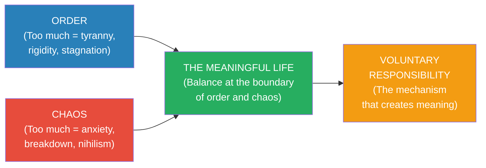
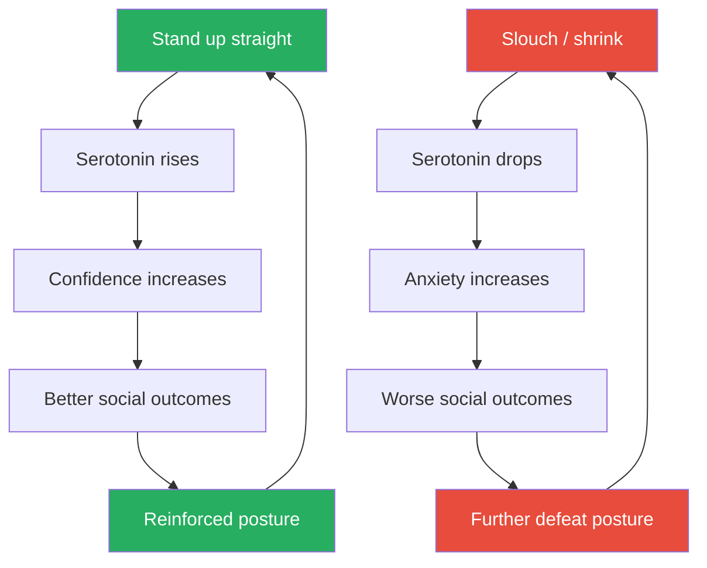
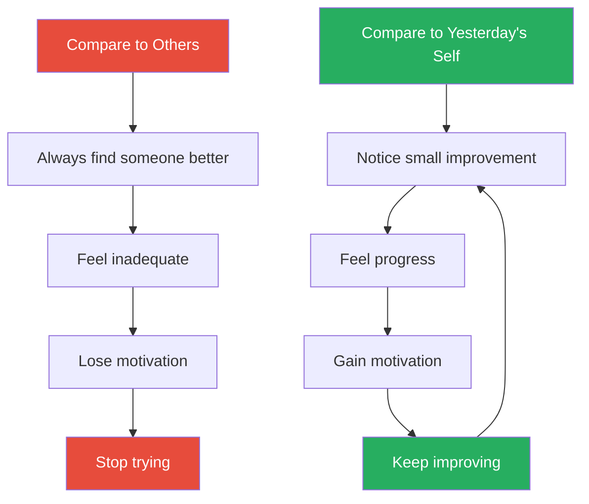
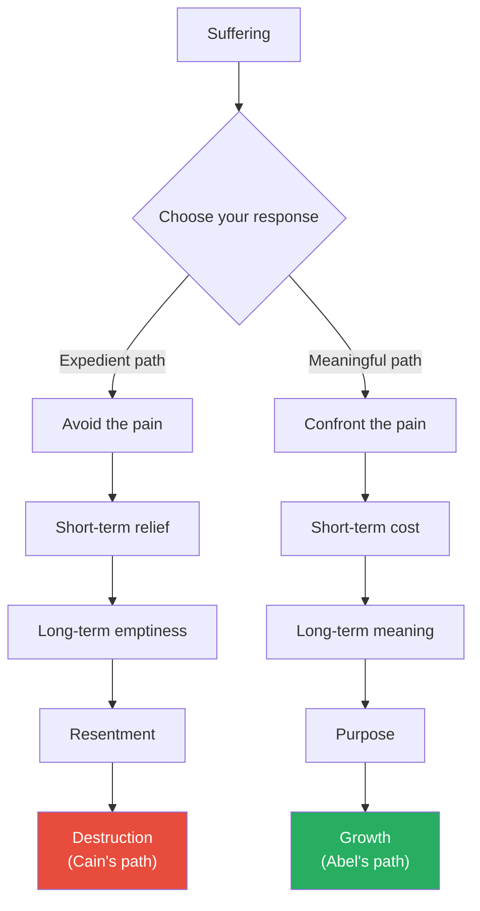
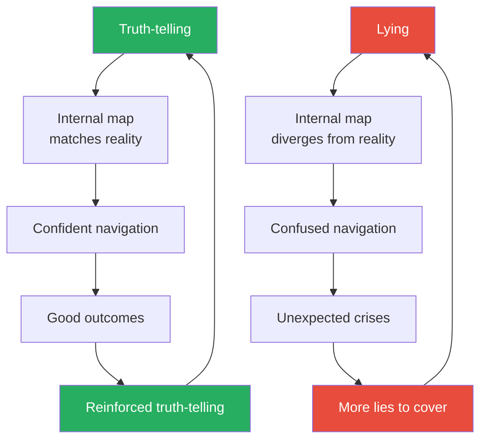
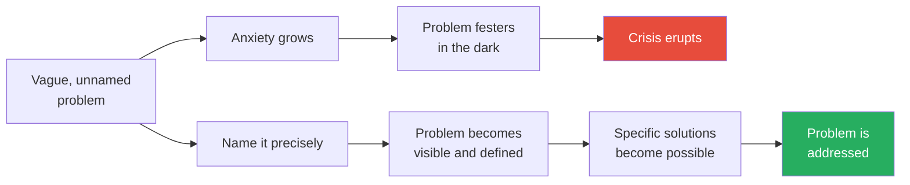
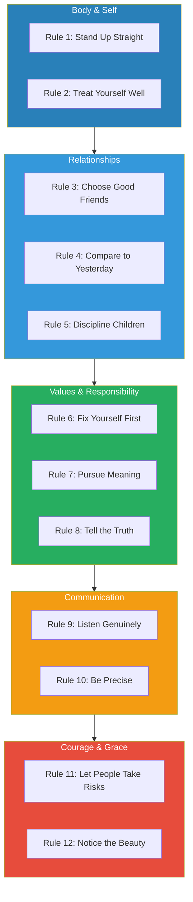
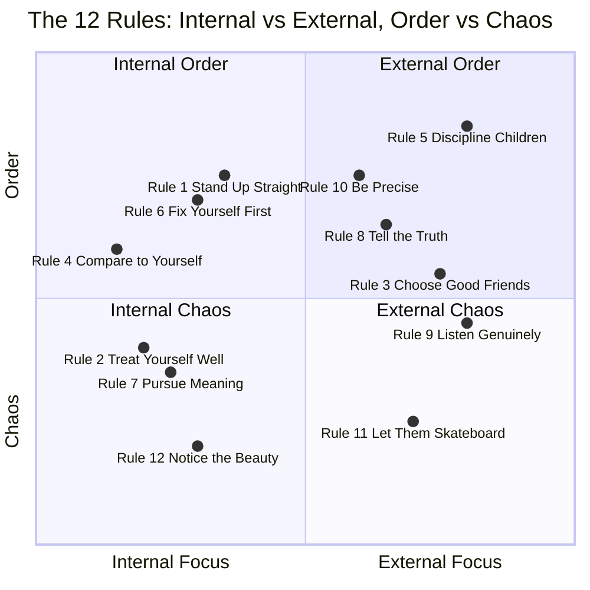
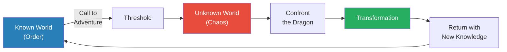

# 12 Rules for Life — Jordan Peterson

> Jordan Peterson's blockbuster self-help book is built on a single, ancient premise: life is suffering — a claim borrowed from Buddhism, Christianity, and existentialism alike — and the antidote is not pleasure or happiness but meaning, found through taking responsibility, telling the truth, and imposing voluntary order on the chaos of existence.
> The twelve rules range from the concrete ("Stand up straight with your shoulders back") to the abstract ("Pursue what is meaningful, not what is expedient") and are illustrated with an eclectic blend of clinical psychology, evolutionary biology, Jungian archetypes, biblical exegesis, Dostoevsky, Nietzsche, and personal stories from Peterson's own clinical practice and family life.
> The book is polarising: admirers consider it the most important self-help book of the decade; critics see a conservative cultural manifesto dressed in psychological clothing. Both readings have some merit.
> What is undeniable is the book's impact — over five million copies sold in fifty-plus languages, making it one of the bestselling non-fiction books of the 2010s.
> At its core, it is an extended argument for one idea: you are more powerful than you think, and therefore more responsible than you feel — and accepting that responsibility is the path to a meaningful life.

---

## About the Author

Jordan Bernt Peterson is a Canadian clinical psychologist and professor of psychology at the University of Toronto. He rose to international prominence in 2016 through his public opposition to compelled speech legislation in Canada, which brought him a massive online following before this book was even published. Before that, he was known primarily for his academic work on personality psychology, his teaching career at Harvard and the University of Toronto, and his previous book *Maps of Meaning* — a dense, 500-page academic exploration of mythology, religion, and the psychology of belief systems. *12 Rules for Life* is the accessible, practical distillation of those ideas for a general audience, and it turned Peterson into one of the most influential — and controversial — public intellectuals of his generation.

---

## The Big Idea

- <b style="color: #2980b9">Life is suffering — but suffering with meaning is bearable, while suffering without meaning is hell</b>
- This is not Peterson being dramatic — it is the foundational claim of every major wisdom tradition:
  - Buddhism begins with the First Noble Truth: "Life is dukkha (suffering)"
  - Christianity centres on the crucifixion — God himself suffers
  - Existentialism (Kierkegaard, Nietzsche, Dostoevsky) holds that meaningless suffering leads to nihilism, which is worse than the suffering itself
- Peterson's contribution is integrating this ancient insight with modern clinical psychology:
  - He has seen, in decades of clinical practice, what happens to people who have no meaning — they don't just get sad, they get destructive
  - They turn to addiction, resentment, ideology, or cruelty
  - <b style="color: #e74c3c">A person without meaning is not merely unhappy — they are dangerous, to themselves and to others</b>

The central tension in Peterson's worldview is the duality of **Order and Chaos**:

- <b style="color: #2980b9">Order</b> = structure, predictability, tradition, competence, the known world, the mapped territory
  - Too much order = tyranny, rigidity, stagnation, the oppressive father
- <b style="color: #2980b9">Chaos</b> = unpredictability, crisis, the unknown, potential, transformation, the unexplored territory
  - Too much chaos = anxiety, breakdown, nihilism, dissolution
- <b style="color: #27ae60">Meaning is found at the boundary between order and chaos</b> — enough structure to be competent, enough challenge to be growing
- Peterson maps this to the Taoist yin-yang symbol: order (white) and chaos (black) intertwined, each containing the seed of the other
- He also maps it to the hero's journey: the hero leaves the known world (order), enters the unknown (chaos), confronts the dragon, and returns transformed

The diagram above shows the core architecture of Peterson's thought: meaning is not found in safety (pure order) or in excitement (pure chaos), but at the point where you voluntarily take on responsibility at the boundary between the two.

Peterson argues that this framework explains why modern life produces so much anxiety and depression despite unprecedented material comfort:
- We have more order than ever — stable governments, predictable food supplies, physical safety — yet people are more anxious, not less
- The reason: order without challenge produces stagnation and meaninglessness
- People need problems to solve, challenges to face, and responsibilities to bear
- When these are absent — when life is too comfortable, too predictable, too safe — meaning evaporates
- <b style="color: #27ae60">The solution is not more comfort but more voluntary responsibility</b> — deliberately choosing to take on challenges that push you toward the boundary between order and chaos
- This is why Peterson insists that the antidote to anxiety is not relaxation but purpose — not less stress but the RIGHT stress, chosen voluntarily and directed toward something meaningful
- Peterson's clinical observation reinforces this: the patients he saw who were most depressed were rarely those with the hardest lives — they were those with the least purpose
  - A construction worker supporting his family has more meaning than a trust fund beneficiary drifting through life
  - Difficulty with purpose is bearable; ease without purpose is corrosive
  - <b style="color: #e74c3c">Comfort without responsibility is a slow poison — it feels pleasant but hollows out your sense of self</b>

---

## Key Concepts at a Glance

| Concept | One-line summary |
|---------|-----------------|
| **Order vs Chaos** | The fundamental duality — meaning lives at the boundary between them |
| **Dominance Hierarchy** | Status hierarchies are 350 million years old and built into our neurobiology |
| **Serotonin-Posture Loop** | Your body posture literally changes your brain chemistry and confidence |
| **Meaning over Happiness** | Meaning sustains you through suffering; happiness evaporates when pain arrives |
| **Voluntary Confrontation** | Facing what you fear — the "dragon" — transforms both you and the fear |
| **Logos / Truthful Speech** | Speaking the truth is the primary tool for imposing order on chaos |
| **The Pareto Distribution** | A small number of people capture most rewards — true across all domains |
| **Sacrifice** | Giving up something of value now for something of greater value later |
| **The Shadow** | The Jungian concept that your capacity for evil is the source of your strength |
| **Incremental Improvement** | Small daily improvements compound into a transformed life |
| **Minimum Necessary Force** | The least intervention that effectively teaches the lesson |
| **The Rescue Fantasy** | Helping someone who does not want help is vanity, not compassion |

Rules like "Stand Up Straight" and "Discipline Children" score highest on practical and personal dimensions, while "Pursue Meaning" and "Tell the Truth" are weighted toward the philosophical — illustrating how Peterson's rules span the full spectrum from embodied action to abstract principle.

---

## The Twelve Rules — Deep Dive

### Rule 1: Stand Up Straight With Your Shoulders Back

*Peterson opens with a creature that has been fighting dominance battles for 350 million years — the lobster — and uses it to demolish the claim that human hierarchies are mere social constructions.*

- <b style="color: #2980b9">The Dominance Hierarchy</b> is not a human invention — it is an ancient biological reality
- Lobsters have been competing for territory, mates, and resources for 350 million years
- That is before trees existed. Before dinosaurs. Before the split between insects and mammals.
- The neurochemical system that tracks dominance in lobsters — serotonin — is the same system that tracks status in humans
  - High-status lobsters have high serotonin: they stand tall, move confidently, claim the best territory
  - Defeated lobsters have low serotonin: they shrink, retreat, avoid confrontation
  - The same pattern shows up in humans — posture, confidence, and neurochemistry form a feedback loop
- Peterson draws on research by Jaak Panksepp and others to show that this system is conserved across species:
  - Serotonin levels rise in dominant primates and fall in subordinate ones
  - In humans, serotonin levels correlate with social confidence, assertiveness, and mood
  - Selective serotonin reuptake inhibitors (SSRIs) — the most commonly prescribed antidepressants — work by increasing available serotonin
  - The fact that the same chemical system underlies both lobster dominance and human depression tells you something about how deeply hierarchy is wired into biology

> [!example] The Lobster Serotonin Experiment
> - Researchers studying lobster behaviour discovered that dominance hierarchies form rapidly when lobsters are placed together
> - The winners of early confrontations get a serotonin boost that makes them more confident and more likely to win again
> - The losers get a serotonin drop that makes them more timid, more likely to back down, more likely to lose again
> - This creates a "winner effect" and a "loser effect" — success breeds success, failure breeds failure
> - When researchers injected defeated lobsters with serotonin, the lobsters began behaving like winners again — standing tall, fighting confidently
> - The implication: your neurochemistry is not fixed. Your posture and behaviour can change it.
> **The lesson:** The body-brain connection runs both ways. Change your posture and you change your brain chemistry.

- <b style="color: #27ae60">The rule is not just about posture — it is about choosing to face the world rather than shrink from it</b>
- "Stand up straight with your shoulders back" means:
  - Accept the terrible responsibility of life
  - Present yourself as someone ready to take on the challenge
  - Signal — to yourself and to the world — that you are not defeated
- The mechanism is a feedback loop:
  - Standing tall increases serotonin
  - Increased serotonin increases confidence
  - Increased confidence produces better social outcomes
  - Better outcomes reinforce the upright posture
- <b style="color: #e74c3c">The reverse loop is equally powerful — slouch, and you trigger a cascade of defeat</b>
- Peterson argues this is why depression is self-reinforcing: the physical posture of defeat triggers the neurochemistry of defeat, which produces the behaviour of defeat

> [!tip] Core Insight
> Hierarchies are not social constructions that can be dismantled — they are biological realities hardwired over 350 million years of evolution. The question is not whether you will exist within a hierarchy, but where you will stand in it — and your posture is the first signal.

- The connection between posture and psychology is not just Peterson's claim — it is backed by neuroscience:
  - <b style="color: #2980b9">Proprioceptive feedback</b>: your brain constantly monitors the position of your body and adjusts your emotional state accordingly
  - Studies on "embodied cognition" show that physical states influence cognitive and emotional processing
  - People who adopt expansive postures report feeling more confident, more willing to take risks, and more tolerant of pain
  - People who adopt contracted postures report feeling more anxious, more risk-averse, and more sensitive to threat
- Peterson's broader point is about the relationship between biology and meaning:
  - The dominance hierarchy is not something society invented — it is something society inherited from biology
  - You can argue about whether specific hierarchies are just or unjust — that is a legitimate political conversation
  - But <b style="color: #e74c3c">you cannot pretend hierarchies do not exist, or that your position in them does not affect your neurochemistry, your confidence, and your life outcomes</b>
  - The practical implication: start with your body. Stand up. Face the world. The neurochemistry will follow.

> [!example] The Defeated Man in Peterson's Clinical Practice
> - Peterson describes a male patient who came to therapy with chronic depression and social anxiety
> - The man slouched, avoided eye contact, spoke in a quiet monotone, and sat as if trying to take up as little space as possible
> - His life circumstances reflected his posture: he was passed over for promotions, ignored in social situations, and dismissed by potential romantic partners
> - Peterson worked with him on the simplest possible intervention: stand up straight, make eye contact, speak clearly
> - The man resisted — it felt "fake," "arrogant," "not who I am"
> - Peterson's response: "Who you are right now is a defeated person. Standing up straight is not faking confidence — it is refusing to signal defeat."
> - Over weeks, the man's posture changed. His serotonin levels likely shifted. His social interactions improved. The feedback loop reversed.
> **The lesson:** You do not have to feel confident before you act confidently. The body leads; the mind follows.

The two loops show how posture creates self-reinforcing spirals — upward or downward — through the serotonin-confidence-outcome feedback mechanism.

---

### Rule 2: Treat Yourself Like Someone You Are Responsible for Helping

*Peterson explores a strange paradox: people are better at caring for their pets than they are at caring for themselves — and the reason lies in how well we know our own flaws.*

- <b style="color: #2980b9">The prescription compliance problem</b>: studies show that roughly one-third of patients do not fill their prescriptions or take their medication as directed
- But when the same people are given medication for their pets, compliance is significantly higher
- Why? Peterson argues it is because people know themselves too well:
  - They have seen their own failures, selfishness, cowardice, and shame
  - They have witnessed their own capacity for pettiness and cruelty
  - They conclude — often unconsciously — that they do not deserve the same care they would give to an innocent animal or a loved one
- <b style="color: #e74c3c">Self-neglect is not humility — it is a form of self-punishment rooted in shame</b>

> [!example] The Garden of Eden and Self-Knowledge
> - Peterson uses the Genesis story as a psychological map
> - Adam and Eve eat from the Tree of Knowledge and gain self-awareness
> - The first thing they notice is that they are naked — they become ashamed
> - Before self-knowledge, they were innocent. After it, they could see their own vulnerability, their own potential for evil
> - Peterson reads this as a psychological truth: the more you know yourself, the more you see your flaws — and the more tempted you are to punish yourself through neglect
> - The story is not about literal fruit — it is about the burden of consciousness
> **The lesson:** Self-awareness reveals your flaws. The danger is using that knowledge as an excuse to stop caring for yourself.

- <b style="color: #27ae60">The rule: treat yourself as you would someone you are responsible for helping</b>
- This means:
  - Take your own health seriously — fill your prescriptions, eat properly, get sleep
  - Set boundaries — do not tolerate in yourself what you would not tolerate in someone you care about
  - Pursue meaningful goals — you owe it to yourself the way you owe it to your children
  - Negotiate with yourself rather than tyrannise yourself:
    - Ask: "What do I need? What would make things better? What am I willing to do?"
    - Not: "I should do this. I must do this. I'm worthless if I don't."

---

- Peterson connects this to the Jungian concept of <b style="color: #2980b9">the Shadow</b>:
  - You are not merely good — you are capable of terrible things
  - Acknowledging your capacity for evil is not self-condemnation — it is honesty
  - And only someone who acknowledges their darkness can choose the light voluntarily
  - <b style="color: #27ae60">The truly good person is not someone incapable of evil — it is someone capable of evil who chooses not to act on it</b>
- Peterson tells a story from his own life to illustrate:
  - He describes moments when he understood his own capacity for cruelty — not as an abstract idea but as a lived feeling
  - The temptation to use a cutting remark, to humiliate a student, to exploit a therapeutic relationship
  - He did not act on those impulses — but he recognised them as real
  - That recognition is what makes his choice to be kind genuine rather than accidental

> [!example] The Patient Who Punished Herself Through Neglect
> - Peterson describes a female patient who was meticulous about caring for everyone else in her life — her children, her partner, her ageing parents
> - She scheduled their doctor's appointments, cooked them nutritious meals, ensured they exercised
> - But she skipped her own medical appointments, ate poorly, slept four hours a night, and never exercised
> - When Peterson asked why, she could not articulate a reason — she simply "didn't feel like she deserved the effort"
> - As therapy progressed, it emerged that she carried deep shame from childhood — a belief that she was fundamentally flawed and unworthy
> - She expressed care for others because they were "innocent" in her eyes; she neglected herself because she was "guilty"
> - Peterson's reframe: you are not caring for yourself because you are perfect. You are caring for yourself because you matter — and because the people who depend on you need you to be functional.
> **The lesson:** Self-care is not selfishness — it is a prerequisite for being able to care for others.

> [!tip] Core Insight
> You are not obligated to care for yourself because you are perfect. You are obligated to care for yourself because you matter — flaws and all — and because your capacity to help others depends on your willingness to help yourself first.

- Peterson's practical approach to self-care is rooted in a specific technique:
  - <b style="color: #2980b9">Negotiate with yourself like a good employer negotiates with an employee</b>
  - A tyrant boss demands and threatens — and gets resentment and minimal compliance
  - A good boss asks: "What would make this work better? What do you need? What are you willing to do?"
  - Apply the same logic to yourself:
    - What reward would motivate you to do the hard thing?
    - What compromise would make the difficult task bearable?
    - What would you need to give yourself to earn your own cooperation?
  - This reframes self-discipline from punishment to negotiation — and negotiation produces far better results

Peterson also reframes the concept of <b style="color: #2980b9">self-sacrifice gone wrong</b>:
- Many people — particularly those high in the personality trait of agreeableness — confuse self-sacrifice with virtue
- They give and give and give until they are depleted, resentful, and burned out
- They tell themselves this is noble — but Peterson argues it is often a form of cowardice:
  - It is easier to sacrifice yourself than to set a boundary
  - It is easier to be a martyr than to say "no" and risk someone's disapproval
  - <b style="color: #e74c3c">Self-sacrifice that destroys the self is not virtue — it is slow suicide disguised as generosity</b>
- The antidote is the principle in the rule: treat yourself as someone you are responsible for helping
  - You would not allow a person you loved to destroy themselves through endless giving
  - You should not allow yourself to do so either
  - Set limits. Say no. Take rest. These are not selfish acts — they are necessary acts of maintenance
- Peterson notes that the airline safety instruction captures this perfectly:
  - "Put on your own oxygen mask before assisting others"
  - Not because you matter more — but because a person without oxygen cannot help anyone

---

### Rule 3: Make Friends with People Who Want the Best for You

*Peterson draws on his upbringing in Fairview, Alberta — a small, cold prairie town — to explain why some friendships pull you down and why loyalty to the wrong people is not virtue but cowardice.*

- <b style="color: #e74c3c">Not everyone who is friendly wants the best for you</b>
- Peterson grew up watching talented friends self-destruct through drugs, alcohol, and aimlessness
- Some of those friendships were maintained out of loyalty, compassion, or a sense of obligation
- But Peterson observed a darker dynamic at play in some cases:
  - Some people befriend you because your failures make them feel better about their own
  - Some keep you in a bad place because your improvement would threaten the group dynamic
  - Some are drawn to your compassion precisely because they intend to exploit it
  - <b style="color: #e74c3c">Rescuing someone who does not want to be rescued is not compassion — it is vanity disguised as virtue</b>

> [!example] Fairview, Alberta — The Friends Who Stayed Behind
> - Peterson describes growing up in a small Alberta town where opportunities were limited
> - Several of his childhood friends were bright and talented but chose paths of self-destruction
> - Drugs and alcohol were easily available; ambition was socially punished as pretension
> - Those who tried to improve themselves were mocked by the group — "Who do you think you are?"
> - Peterson watched friends who had genuine potential choose to stay in destructive patterns because leaving would mean leaving the group
> - The social pressure to remain mediocre was stronger than the individual drive to improve
> **The lesson:** Some social groups function as crabs in a bucket — pulling down anyone who tries to climb out.

- The mechanism:
  - Humans are deeply social — we calibrate our behaviour to our peer group
  - If your friends are ambitious and disciplined, you rise to match them
  - If your friends are cynical and self-destructive, you sink to match them
  - This is not weakness — it is neurobiology. Mirror neurons and social calibration are real
- <b style="color: #27ae60">Choose friends who challenge you to grow, celebrate your successes genuinely, and hold you accountable when you fall short</b>
- Peterson's test: "Would this person be happy if I succeeded? Truly happy — not performatively supportive while secretly resentful?"
- If the answer is no, the friendship is extractive, not supportive

> [!tip] Core Insight
> It is not selfish to choose friends who want the best for you. It is necessary. You become the average of the people you spend the most time with — and if those people are heading downward, so are you.

- Peterson's nuance on this rule is important — he is not advocating cold-hearted social climbing:
  - You should not abandon people in genuine crisis — that is cruelty
  - The question is whether the person WANTS to be helped or whether they want company in their misery
  - <b style="color: #2980b9">The test is reciprocity</b>: is the person making genuine effort to improve? Or are they consuming your energy without any intention of changing?
  - A friend who is struggling but trying deserves your support
  - A friend who is struggling and pulling you into their dysfunction does not deserve your loyalty — they deserve your honesty, which may mean walking away

> [!example] The Rescue Fantasy — When "Helping" Is Really Vanity
> - Peterson describes a pattern he saw repeatedly in clinical practice: a competent, conscientious person forms a close friendship with someone who is chronically dysfunctional
> - The competent person believes they can "save" the other through enough patience, love, and support
> - In reality, the dysfunctional person has no interest in being saved — they have found someone who will tolerate their behaviour without demanding change
> - The competent person exhausts themselves, neglects their own goals, and gradually sinks toward the other person's level
> - Peterson's diagnosis: the "rescue" is often driven by the rescuer's need to feel virtuous, not by genuine concern for the other person
> - True compassion sometimes means saying: "I cannot help you. You do not want help. I need to leave."
> **The lesson:** Compassion without boundaries becomes self-destruction. The willingness to walk away from someone who refuses to change is not cruelty — it is self-respect.

- Peterson connects this to the broader theme of personal responsibility that runs through the entire book:
  - You cannot save someone who does not want to be saved — and trying is not heroic, it is arrogant
  - The assumption that you can fix someone else's life is itself a form of grandiosity
  - The best thing you can do for someone who is drowning is not jump in after them — it is throw them a rope from solid ground
  - And if they refuse the rope, you have to accept that and move on
  - <b style="color: #27ae60">The most compassionate thing you can do is maintain your own health and stability — so that when someone genuinely wants help, you are in a position to offer it</b>

> [!example] The Friend Who Kept Going Back
> - Peterson recounts a pattern from his clinical observations: a man whose best friend was an alcoholic
> - Every few months, the friend would call in crisis — lost his job, his girlfriend left, he was broke, he needed a place to stay
> - The man would take him in, help him get sober, find him a job, and support him through recovery
> - Each time, the friend would seem to improve for a few weeks — then relapse, disappear, and return months later in even worse shape
> - After the fourth cycle, Peterson asked the man: "What evidence do you have that your friend wants to change?"
> - The man had none. His friend had never initiated recovery himself — he only accepted it when it was imposed by someone else
> - Peterson's point: the man was not helping his friend. He was enabling him — providing a safety net that removed the natural consequences of self-destructive behaviour.
> - The hardest thing the man could do — and the most genuinely helpful — was to stop catching his friend when he fell
> **The lesson:** Enabling is not helping. Sometimes the most generous act is to step back and let someone face the consequences of their choices.

Peterson deepens this rule by examining the psychology of the people who gravitate toward destructive friendships:

- Some people maintain toxic friendships not out of compassion but out of <b style="color: #2980b9">unconscious identification</b>:
  - They see themselves as broken, too — and the dysfunctional friend confirms that identity
  - Leaving the friendship would mean admitting they deserve better — and that admission carries its own terrifying implications
  - If you deserve better, then you are responsible for pursuing better — and that responsibility is frightening
- Peterson also identifies a pattern he calls <b style="color: #2980b9">downward social comparison as self-medication</b>:
  - Surrounding yourself with people who are worse off makes you feel better by comparison — without requiring any actual improvement
  - This is psychologically comfortable but developmentally catastrophic
  - It is the social equivalent of junk food: satisfying in the moment, destructive over time
- The practical application:
  - Audit your friendships honestly — not with cruelty, but with clarity
  - Ask of each friendship: does this person make me better? Do I make them better? Is the exchange mutual?
  - If a friendship consistently drains you, and the other person shows no interest in reciprocating or improving, you are not obligated to maintain it
  - <b style="color: #27ae60">Loyalty to people who are actively destroying themselves — and pulling you down with them — is not a virtue. It is a failure of discernment.</b>

| Friendship Type | How It Feels | What It Produces |
|----------------|-------------|------------------|
| Mutual growth | Challenging, energising, honest | Both parties improve over time |
| Comfortable stagnation | Easy, familiar, undemanding | Neither party grows; both decline slowly |
| Extractive / enabling | Draining, one-sided, guilt-driven | The "helper" is depleted; the other never changes |
| Toxic / destructive | Volatile, chaotic, addictive | Both parties are damaged |

The table clarifies that friendship is not a binary between "good" and "bad" — there is a spectrum, and the most dangerous friendships are often the ones disguised as compassion.

---

### Rule 4: Compare Yourself to Who You Were Yesterday, Not to Who Someone Else Is Today

*Peterson dismantles the comparison trap — the habit of measuring yourself against other people — and replaces it with the only benchmark that matters: your own trajectory over time.*

- <b style="color: #2980b9">The Pareto Distribution</b> governs most domains of human performance:
  - A small number of people capture most of the rewards — in wealth, fame, creative output, athletic performance
  - This is not a social problem to be fixed — it is a mathematical reality (the "Matthew Effect" in sociology)
  - It means that no matter how good you are, someone is always dramatically better
- <b style="color: #e74c3c">Social comparison is therefore a game you cannot win</b>
  - There will always be someone richer, smarter, better-looking, more successful, more talented
  - The internet and social media have made this worse by giving you constant visibility into the highlight reels of millions of people
  - The comparison instinct that was adaptive in a tribe of 150 becomes pathological in a world of 8 billion

The diagram shows the two comparison loops: the external comparison spiral leads to paralysis, while the internal comparison spiral leads to compounding growth.

- <b style="color: #27ae60">The only meaningful comparison is temporal: am I better today than I was yesterday?</b>
- Peterson recommends a specific practice:
  - Each night, identify one small thing you did better than the day before
  - It can be tiny — you cleaned the kitchen, you had a difficult conversation, you went to the gym
  - Over time, these small improvements compound into a fundamentally different life
- This connects to the concept of <b style="color: #2980b9">kaizen</b> — the Japanese philosophy of continuous incremental improvement
- Peterson frames it in terms of the internal critic:
  - Your internal critic is useful — it identifies what needs improvement
  - But if the critic compares you to everyone else, it produces despair
  - If the critic compares you to yesterday's version of yourself, it produces actionable feedback
  - <b style="color: #27ae60">Redirect the critic from "You're not as good as X" to "You could be slightly better than you were yesterday"</b>

> [!example] The Middle-Aged Man at the Crossroads
> - Peterson describes a patient in his forties who came to therapy consumed by bitterness
> - The man had a decent job, a stable marriage, and healthy children — but he felt like a failure
> - Why? Because his college roommate had become a millionaire. Because his neighbour drove a nicer car. Because his brother-in-law had a bigger house.
> - By every external comparison, the man fell short — despite leading a life that was objectively good
> - Peterson asked him a different question: "Are you better off than you were five years ago?"
> - The answer was yes — he had quit smoking, repaired a relationship with his father, and gotten a raise
> - But none of that registered because he was measuring against other people, not against his own trajectory
> - Once he shifted the comparison from external to temporal, his subjective experience of his own life changed dramatically
> **The lesson:** External comparison makes good lives feel inadequate. Internal comparison makes ordinary progress feel meaningful.

> [!abstract] Peterson's Daily Improvement Practice
> 1. At the end of each day, review what you did
> 2. Identify one thing — however small — that you did better than the previous day
> 3. Identify one thing you could improve tomorrow
> 4. Do not compare to anyone else's standard — only to your own trajectory
> 5. Repeat daily — the compound effect over months and years is enormous

- Peterson introduces a related concept: <b style="color: #2980b9">the multiplicity of games</b>
  - You are not playing one game — you are playing many simultaneously
  - Career, relationships, health, creative output, community, spirituality — each is its own domain
  - The person who seems to be "winning" in one domain may be losing badly in others
  - The billionaire with three divorces is not objectively "winning" — he is winning ONE game and losing several others
  - <b style="color: #27ae60">The goal is not to rank first in any single game but to improve your average performance across all the games that matter to you</b>

- Peterson also addresses the role of <b style="color: #2980b9">attention</b> in this process:
  - What you pay attention to determines what reality looks like
  - If you pay attention to everything that is wrong, reality appears terrible — even if objectively your life is good
  - If you pay attention to what has improved, reality appears hopeful — even if objectively much is still broken
  - This is not "positive thinking" or delusion — it is recognising that attention is a filter, and you can choose which filter to use
  - <b style="color: #e74c3c">The person who compares themselves to everyone better is applying a filter that guarantees misery</b>
  - The person who compares themselves to yesterday is applying a filter that reveals progress
  - Both are seeing real things — the question is which real things you choose to focus on

> [!example] The Musician Who Almost Quit
> - Peterson describes a young musician he encountered who was on the verge of quitting because she felt she would "never be as good as the greats"
> - She was comparing herself to seasoned professionals with decades of practice and performance
> - By that standard, she was hopelessly inadequate — and always would be, at least for many years
> - Peterson asked her to record herself playing and listen back in six months
> - When she did, she was stunned by how much she had improved — improvements she could not perceive in the moment because she was measuring against the wrong benchmark
> - The comparison to the greats produced despair. The comparison to her past self produced motivation.
> **The lesson:** Progress is often invisible when you measure against external standards — and blindingly obvious when you measure against your own past.

> [!tip] Core Insight
> You are not in competition with the world. You are in competition with the person you were yesterday. Win that competition consistently, and you will end up somewhere remarkable.

---

### Rule 5: Do Not Let Your Children Do Anything That Makes You Dislike Them

*Peterson takes on permissive parenting — the idea that children should be given maximum freedom — and argues that parents who refuse to discipline their children are not being kind but cowardly.*

- <b style="color: #e74c3c">Parents who fail to set boundaries produce children the world dislikes — which is a worse fate than the discomfort of discipline</b>
- This is Peterson's most controversial parenting claim, and he builds it carefully:
  - Children need limits — they test boundaries not to defy authority but to discover where the safe edges of the world are
  - A child who pushes and pushes and never encounters a boundary lives in a world without structure — and that is terrifying, not liberating
  - <b style="color: #27ae60">A child without boundaries lives in chaos — and chaos is terrifying</b>

> [!example] The Aggressive Two-Year-Old in the Supermarket
> - Peterson describes a clinical scenario he encountered repeatedly in his practice
> - A two-year-old throws a tantrum in the supermarket — screaming, hitting, throwing things
> - The parent, committed to "gentle parenting," does nothing — reasoning that the child is expressing emotions and should not be repressed
> - The tantrum escalates. Other shoppers glare. The parent feels humiliated but persists in non-intervention
> - The child learns: tantrums work. There is no boundary. Emotional chaos produces results
> - By age four, the child is unmanageable. By age eight, other children avoid them. By adolescence, they have no friends
> - The parent's "kindness" has produced a person the world rejects
> **The lesson:** Refusing to set limits is not compassion — it is the abdication of the parental duty to prepare a child for a world that will not be so accommodating.

- Peterson's parenting framework:
  - Children need two things: warmth AND structure
  - Warmth without structure produces chaos — the child runs wild
  - Structure without warmth produces tyranny — the child obeys out of fear
  - <b style="color: #2980b9">The goal is the "minimum necessary force"</b> — use the least intervention that effectively teaches the lesson
- The deeper principle:
  - A parent who cannot set boundaries is often afraid of their child's disapproval
  - But a parent's job is not to be liked — it is to prepare the child for reality
  - Reality will set boundaries whether the parent does or not — and reality is far less gentle
  - <b style="color: #e74c3c">The world will not tolerate behaviour that parents excuse — better to learn limits from a loving parent than from an indifferent world</b>

| Parenting Approach | Short-term Result | Long-term Result |
|-------------------|-------------------|------------------|
| Permissive (no boundaries) | Child is "happy," parent avoids conflict | Child is rejected by peers and the world |
| Authoritarian (harsh rules, no warmth) | Child obeys | Child rebels or becomes anxious and rigid |
| Authoritative (clear rules + warmth) | Child protests, then adapts | Child is competent, liked, and resilient |

Peterson strongly advocates the authoritative approach — the same model supported by decades of developmental psychology research (Diana Baumrind's framework, which has been validated across cultures for over fifty years).

- Peterson draws on B.F. Skinner's reinforcement research to explain HOW to discipline effectively:
  - <b style="color: #2980b9">Minimum necessary force</b>: use the least intervention that effectively teaches the lesson
  - Reward good behaviour more than you punish bad behaviour — a 5:1 ratio is roughly optimal
  - Be consistent — intermittent enforcement teaches the child that rules are negotiable
  - Be immediate — delayed consequences lose their connection to the behaviour
  - Be calm — discipline delivered in anger teaches the child to fear YOU, not to change their behaviour
- The deeper philosophical argument:
  - Children are not born "innocent" in the Rousseauian sense — they are born with the capacity for both cooperation and aggression
  - Left entirely to their own devices, children do not naturally become virtuous — they become feral
  - Socialisation is the process by which the raw material of human nature is shaped into something that can function in a community
  - <b style="color: #e74c3c">Parents who refuse to socialise their children are not liberating them — they are abandoning them to the consequences of their own worst impulses</b>

> [!example] The Child Nobody Wanted to Invite
> - Peterson describes a family from his clinical practice with an undisciplined five-year-old
> - The child interrupted adults constantly, grabbed toys from other children, and threw tantrums when denied anything
> - The parents believed in "natural consequences" — the child would learn on their own
> - The natural consequence arrived: other parents stopped inviting the child to playdates. Birthday party invitations dried up. The child became increasingly isolated.
> - By age seven, the child had no friends. Not because other children were cruel, but because nobody enjoyed being around someone who had never learned to share, wait, or listen.
> - The parents came to Peterson distraught — their child was lonely and they could not understand why
> - Peterson's answer was uncomfortable: "You did this. You refused to teach your child how to behave, and now the world is teaching them — and the world is not as patient or loving as you are."
> **The lesson:** The world will discipline your children if you do not — but the world's methods are far harsher than yours.

> [!example]- Piaget and the Discovery of Rules Through Play
> - Peterson draws on Jean Piaget's observations of children at play to reinforce his argument
> - Piaget studied how children develop moral reasoning by watching them play games like marbles
> - Young children initially have no concept of rules — they play randomly, without structure
> - Through interaction with other children, they discover that rules make the game possible — without agreed-upon rules, no game can exist
> - Children who learn to negotiate, follow, and enforce rules become socially competent
> - Children who never learn this — because no one taught them, or because they were shielded from the consequences of rule-breaking — become social outcasts
> - Piaget's insight aligns with Peterson's: the ability to follow rules is not oppression — it is the foundation of social life
> **The lesson:** Rules are not the enemy of freedom — they are the precondition for it. A child who cannot follow rules cannot play the game of life.

> [!tip] Core Insight
> Discipline is not cruelty — it is the most important form of love a parent can offer. A child who has not learned to behave in ways that earn the world's respect has been failed by the people responsible for teaching them.

- Peterson's nuance on this rule is important — he is not advocating harsh, punitive parenting:
  - The goal is NOT to break the child's spirit — it is to teach them how to function
  - The goal is NOT to make the child fear you — it is to make the child respect the rules
  - The goal is NOT to produce obedience through terror — it is to produce competence through structure
  - <b style="color: #27ae60">A well-disciplined child is not a cowed child — it is a child who knows the rules, understands why they exist, and has the skills to navigate social life successfully</b>
- Peterson also addresses the question of aggression in young children:
  - Two-year-olds are, statistically, the most violent humans on the planet — they hit, bite, kick, and grab more than any other age group
  - They do not do this because they are "bad" — they do it because they have not yet learned impulse control
  - Impulse control is not innate — it is taught
  - Children who are not taught impulse control by age four have significantly higher rates of antisocial behaviour, substance abuse, and criminal activity in adulthood
  - The research on this is robust: early childhood socialisation is one of the strongest predictors of adult outcomes
  - <b style="color: #e74c3c">Failing to discipline a child is not progressive parenting — it is developmental negligence</b>

Peterson frames this as a debate between two philosophical traditions about human nature:

- <b style="color: #2980b9">The Rousseauian view</b>: children are born innocent and corrupted by society — therefore, the less you interfere, the better
  - This is the philosophical ancestor of permissive parenting
  - It sounds compassionate but it produces terrible outcomes — because it rests on a false premise
- <b style="color: #2980b9">The Hobbesian / Petersonian view</b>: children are born with the capacity for both good and evil — and require active socialisation to develop into functional human beings
  - This does not mean children are bad — it means they are raw material, and raw material requires shaping
  - The shaping is not oppression — it is the gift of civilisation, handed down from parent to child
  - Without it, the child is left alone with impulses they do not understand and cannot control
- Peterson argues that the empirical evidence overwhelmingly supports the second view:
  - Children who receive warm but firm discipline show better emotional regulation, stronger peer relationships, higher academic achievement, and lower rates of behavioural problems than either permissively or harshly parented children
  - The research has been replicated across dozens of cultures and over half a century
  - <b style="color: #27ae60">The sweet spot is clear rules consistently enforced within a relationship of genuine warmth — and that requires effort, courage, and the willingness to endure your child's temporary displeasure</b>

---

### Rule 6: Set Your House in Perfect Order Before You Criticise the World

*Peterson tackles the temptation to blame the world for your suffering — and argues that the impulse to fix everything "out there" often masks a refusal to fix what is broken "in here."*

- <b style="color: #2980b9">Before blaming the system, the government, or society, ask: is my own life in order?</b>
- Am I taking care of my health?
- Are my relationships honest and functional?
- Am I meeting my responsibilities?
- Have I addressed the things that are clearly within my control?
- <b style="color: #e74c3c">It is easier to identify flaws in the world than flaws in yourself</b> — and far less painful

Peterson approaches this rule through one of the darkest topics in the book: mass shootings and acts of nihilistic violence.

> [!example] The Columbine Shooters — Resentment Becomes Destruction
> - Peterson examines the diaries of Eric Harris, one of the Columbine shooters
> - Harris did not attack the school because of bullying or mental illness alone — his writings reveal a philosophical position
> - Harris concluded that life was meaningless, that humanity was contemptible, and that existence itself was a mistake
> - His violence was an expression of cosmic resentment — a judgment against Being itself
> - Peterson reads this as the logical endpoint of nihilism: if nothing matters, then destruction is as valid as creation
> - The question Peterson poses: what separates Harris from other suffering teenagers? Many suffer. Few become mass murderers.
> - His answer: the refusal to take responsibility for one's own life and the projection of all blame outward
> **The lesson:** Resentment unchecked by responsibility can metastasise into the desire to destroy — not just oneself, but everything.

- Peterson's argument:
  - The impulse to "burn it all down" — to destroy the system, the institution, the world — often begins with personal suffering that has not been addressed
  - The person who has not set their own house in order lacks the moral authority to criticise the world
  - This does not mean the world is perfect or that systems don't need fixing
  - It means: <b style="color: #27ae60">start with what you can control. Fix your room. Fix your relationships. Fix your habits. Then — and only then — do you have the credibility and competence to address larger problems</b>

---

- This echoes the Stoic emphasis on the <b style="color: #2980b9">dichotomy of control</b> (see [[Meditations - Marcus Aurelius|Meditations]]):
  - Focus on what is within your control before worrying about what is not
  - Your room is within your control. Your diet is within your control. Your honesty is within your control.
  - The political system is largely outside your control — and trying to fix it before fixing yourself is often a displacement activity
- Peterson distinguishes between <b style="color: #2980b9">genuine political engagement</b> and <b style="color: #e74c3c">displacement activity</b>:
  - Genuine political engagement: you have put your own life in order, developed competence, and are now addressing systemic problems from a position of credibility
  - Displacement activity: you are ranting about the system while your own life is in shambles — using outrage as a substitute for self-improvement
  - The test: if someone examined your personal life, would they find order or chaos? If chaos, your political opinions are probably projections of personal resentment

> [!example] The Activist Who Couldn't Clean His Room
> - Peterson describes a young man who came to therapy professing passionate views about social justice
> - He spent hours on social media arguing about inequality, corporate corruption, and political reform
> - Meanwhile, his apartment was a disaster. He was failing his courses. He had alienated his family. He was deeply in debt.
> - Peterson challenged him: "You want to fix the world. Can you fix your room? Can you show up to class on time? Can you pay your bills?"
> - The young man was offended — he saw these as trivial concerns compared to the grand problems he was addressing
> - Peterson's point: if you cannot organise a twelve-by-twelve space, you have no evidence that you can organise anything larger. The world does not need your opinions. It needs your competence — and competence starts small.
> **The lesson:** The desire to fix the world is often a flight from the harder task of fixing yourself. Start with what you can control.

> [!tip] Core Insight
> You do not have the right to criticise the world until you have first addressed the failures within your own control. This is not a political position — it is a psychological one. Clean your room. Then look outward.

- Peterson addresses an important objection to this rule: does it mean you should never engage with political or social problems?
  - No — but it means you should earn the right to do so
  - The sequence matters: personal order first, then family order, then community engagement, then larger systemic critique
  - A person who has mastered the small domain has developed the competence, discipline, and credibility to address the larger domain
  - A person who skips the small domain and leaps to the large one is usually motivated by resentment rather than genuine concern
  - <b style="color: #27ae60">The world's greatest reformers — Gandhi, King, Mandela — put their own houses in order before attempting to order the world</b>
  - They endured personal suffering, developed extraordinary discipline, and earned moral authority through decades of self-mastery
  - The keyboard activist ranting about injustice while living in personal chaos has earned nothing — and their opinions carry the weight of nothing

Peterson also examines the specific psychology of <b style="color: #2980b9">resentment</b> as a warning signal:

- Resentment, he argues, is one of the most important emotions to pay attention to — not to act on, but to diagnose:
  - Resentment sometimes indicates that you are being treated unjustly — in which case you need to stand up for yourself
  - Resentment sometimes indicates that you are refusing to do something you know you should be doing — in which case you need to grow up
  - The critical task is distinguishing between the two
- Peterson provides a diagnostic question: "Am I resentful because the world is genuinely unjust to me, or because I am not living up to my own potential and blaming the world for my failure?"
  - If the former — fight. Set boundaries. Speak up. That is legitimate.
  - If the latter — stop complaining and start working. Your resentment is a signal that YOU need to change, not that the world does.
  - <b style="color: #e74c3c">Resentment misdirected outward — when it should be directed inward as a call to action — is the psychological root of ideological possession</b>
- Peterson connects this to his analysis of twentieth-century totalitarianism:
  - Both Communist and Fascist ideologues were driven by resentment — genuine grievances about social conditions
  - But instead of addressing those grievances through personal competence and incremental reform, they projected all blame onto the system and demanded its total destruction
  - The result was not justice but catastrophe — tens of millions dead, societies destroyed, suffering multiplied
  - <b style="color: #27ae60">The antidote to ideological possession is personal responsibility</b> — the willingness to start with yourself before pointing at the world

---

### Rule 7: Pursue What Is Meaningful, Not What Is Expedient

*This is the thesis statement of the entire book — the rule where Peterson's argument reaches its philosophical peak and draws most heavily on religious and mythological sources.*

- <b style="color: #2980b9">The expedient choice</b> = what feels good right now, what avoids pain, what takes the path of least resistance
  - Eating junk food instead of cooking a healthy meal
  - Lying to avoid a difficult conversation
  - Staying in a dead-end job because change is frightening
- <b style="color: #2980b9">The meaningful choice</b> = what costs you something in the present but pays dividends across time
  - Going to the gym when you don't feel like it
  - Having the honest conversation that might cause conflict
  - Leaving the comfortable job for the challenging one that aligns with your purpose
- <b style="color: #27ae60">"Meaning is the antidote to suffering — not happiness, not pleasure, not comfort, but meaning"</b>

---

- Peterson frames this in terms of <b style="color: #2980b9">sacrifice</b>:
  - Every ancient culture discovered the same principle: you must give up something of value to obtain something of greater value
  - The first sacrifice: you plant a seed (give up food now) to grow a harvest (food later)
  - Delayed gratification — the ability to sacrifice present pleasure for future reward — is the foundational skill of civilisation
  - Peterson reads the biblical story of Cain and Abel through this lens:
    - Abel's sacrifice is genuine — he gives his best
    - Cain's sacrifice is half-hearted — he gives his leftovers
    - God accepts Abel's sacrifice and rejects Cain's
    - Cain's response is not to improve his sacrifice — it is to murder Abel

> [!example] Cain and Abel — The Psychology of Resentment
> - Abel offers his best to God — genuine sacrifice, genuine meaning
> - Cain offers his leftovers — going through the motions, no real sacrifice
> - When God rejects Cain's offering, Cain does not reflect or improve — he becomes resentful
> - His resentment is directed first at God (the structure of reality), then at Abel (the person who succeeded)
> - Cain murders Abel — destroying the good rather than becoming good
> - Peterson reads this as the deepest psychological pattern: when your life is not working, you can either improve yourself (Abel's path) or destroy what reminds you of your failure (Cain's path)
> **The lesson:** Resentment is what happens when you know you should sacrifice for meaning but choose expedience instead — and then blame the world for the results.

This diagram maps Peterson's core argument: every moment of suffering presents a choice between expedience and meaning — and the consequences compound over a lifetime.

- The connection to Frankl:
  - Peterson explicitly builds on Viktor Frankl's insight from the concentration camps (see [[Man's Search for Meaning - Viktor Frankl|Man's Search for Meaning]])
  - Frankl discovered that the prisoners who survived were not the strongest or the healthiest — they were the ones who had something to live for
  - <b style="color: #27ae60">Meaning does not eliminate suffering — it makes suffering bearable</b>
  - Peterson extends this: meaning is not found passively. It is created through voluntary sacrifice — by choosing to bear responsibility that you could avoid
- Peterson deepens the argument by examining the concept of <b style="color: #2980b9">the highest good</b>:
  - Most people pursue isolated goods — money, pleasure, status, comfort
  - But these can come into conflict with each other — the pursuit of money might damage your health, the pursuit of pleasure might wreck your relationships
  - The highest good is the principle that harmonises all the individual goods across time:
    - What is good for you RIGHT NOW
    - What is good for you in the FUTURE
    - What is good for your family
    - What is good for your community
    - What is good for the world
  - <b style="color: #27ae60">The meaningful choice is the one that is good across all these time horizons and all these levels simultaneously</b>
  - This is an impossibly high standard — but it is the direction to aim, not the destination to arrive at

> [!example] The Recovering Alcoholic and the Meaning of Sacrifice
> - Peterson describes a patient who was a recovering alcoholic
> - Every evening, the man faced the same choice: drink (expedient) or stay sober (meaningful)
> - Drinking offered immediate relief from anxiety, boredom, and emotional pain
> - Staying sober offered nothing immediate — only the slow, invisible accumulation of a better life
> - The man's breakthrough came when he reframed sobriety not as deprivation but as sacrifice — giving up short-term comfort for long-term meaning
> - He was not "denying himself a drink." He was "choosing to be present for his children tomorrow morning."
> - The reframe from deprivation to sacrifice changed his relationship with the choice entirely
> **The lesson:** Sacrifice is not loss — it is exchange. You give up something of lesser value to gain something of greater value. The key is being clear about what the "greater value" is.

- Peterson connects the concept of sacrifice to the broader arc of human civilisation:
  - The discovery that you could sacrifice the present for the future was, in Peterson's view, the single most important discovery in human history
  - Before sacrifice, humans lived like animals — consuming whatever was available immediately
  - The first person who planted a seed instead of eating it invented the future
  - Every advance since — agriculture, architecture, science, art — has been a form of present sacrifice for future benefit
  - <b style="color: #2980b9">Civilisation itself is the accumulated product of billions of individual sacrifices</b>
  - Peterson reads the biblical story of Noah through this lens:
    - Noah sacrifices present comfort (building an enormous boat while people mock him) for future survival
    - The flood is chaos — the unpredictable catastrophe that destroys the unprepared
    - Noah's preparation — his sacrifice — is what allows him to survive the chaos

> [!example] The Story of Abraham and Isaac
> - Peterson devotes extensive attention to the story of Abraham's willingness to sacrifice Isaac
> - God commands Abraham to sacrifice his son — the most valuable thing he possesses
> - Abraham obeys — and at the last moment, God provides a ram as a substitute
> - Peterson reads this NOT as a literal instruction to kill children, but as a psychological truth about the nature of meaning
> - The deepest meaning comes from sacrificing the thing you value most — your comfort, your security, your attachment
> - Abraham's willingness to sacrifice even his beloved son represents the ultimate voluntary confrontation with the worst possible outcome
> - The paradox: by being willing to give up everything, Abraham receives everything back — and more
> **The lesson:** The highest form of sacrifice is the willingness to give up the thing you value most for the sake of something even greater. This does not mean you will lose it — but you must be genuinely willing to.

> [!tip] Core Insight
> The purpose of life is not to be happy. It is to be meaningful. And what is meaningful is to take on as much responsibility as you can handle — to bear the weight of Being voluntarily.

---

### Rule 8: Tell the Truth — Or at Least Don't Lie

*Peterson argues that truthful speech is not merely a moral virtue — it is the primary tool for navigating reality without being destroyed by it.*

- <b style="color: #e74c3c">Every lie you tell warps reality</b> — not just for the person you are lying to, but for yourself
- The mechanism:
  - When you lie, you must remember the lie
  - You must maintain consistency with it
  - You must build additional lies to support the original lie
  - Over time, your model of reality — the map you use to navigate the world — diverges from reality itself
  - <b style="color: #e74c3c">You end up navigating with a false map — and eventually you walk off a cliff you didn't know was there</b>
- Peterson distinguishes between two types of untruth:
  - <b style="color: #2980b9">Sins of commission</b>: actively telling lies — saying things you know to be false
  - <b style="color: #2980b9">Sins of omission</b>: failing to say things you know to be true — staying silent when you should speak
  - Both corrupt your relationship with reality

> [!example] The Client Who Hadn't Spoken Truthfully in Decades
> - Peterson describes a woman from his clinical practice who came to him with chronic physical symptoms — fatigue, pain, digestive problems
> - As therapy progressed, it emerged that she had been suppressing her true thoughts and feelings for years
> - She never told her husband what she really thought. She never disagreed with her friends. She never expressed anger or disappointment.
> - She had constructed a false self — agreeable, pleasant, accommodating — and buried her real self beneath it
> - The suppressed truth manifested as physical illness: her body was expressing what her mouth would not
> - When she began speaking truthfully — saying what she actually thought, even when it caused conflict — her physical symptoms began to improve
> **The lesson:** Suppressed truth does not disappear — it manifests as psychological and even physical illness.

---

- Peterson draws heavily on Aleksandr Solzhenitsyn:
  - Solzhenitsyn survived the Soviet Gulag and concluded that the totalitarian system depended on ordinary people's willingness to lie
  - Every person who repeated the party line — knowing it was false — added a brick to the wall of tyranny
  - <b style="color: #27ae60">"The line dividing good and evil cuts through the heart of every human being"</b> — Solzhenitsyn
  - The daily practice of truth-telling is not grand heroism — it is the refusal to participate in small falsehoods that, compounded, create enormous evil

> [!example] Solzhenitsyn in the Gulag
> - Aleksandr Solzhenitsyn was arrested in 1945 for criticising Stalin in a private letter
> - He spent eight years in Soviet labour camps and three years in exile
> - Rather than break him, the experience produced one of the most penetrating moral insights of the twentieth century
> - Solzhenitsyn realised that the guards were not fundamentally different from the prisoners — given different circumstances, he could have been a guard
> - He concluded that evil is not the property of a particular group or ideology — it runs through every human heart
> - The Gulag existed not because of a few evil men at the top, but because millions of ordinary people chose to lie every day
> **The lesson:** Tyranny is built on ordinary lies. The refusal to lie — even in small things — is the most basic form of moral courage.

- Peterson also introduces the concept of <b style="color: #2980b9">life-lies</b> — the large-scale deceptions people construct to avoid facing reality:
  - "My marriage is fine" — when it clearly is not
  - "I'm happy in my job" — when you dread Monday mornings
  - "I'm doing this for my children" — when you are really doing it for yourself
  - Life-lies are comfortable in the short term but catastrophic in the long term
  - They accumulate like unpaid debts — and eventually the bill comes due, usually in the form of a crisis that was entirely foreseeable but deliberately ignored
  - <b style="color: #e74c3c">The longer you maintain a life-lie, the more devastating the eventual reckoning</b>

> [!example] The Marriage That Collapsed Under Accumulated Lies
> - Peterson describes a couple who presented in therapy after the wife discovered the husband's affair
> - But the affair was not the real problem — it was the culmination of years of small lies
> - The husband had never told his wife that her spending frightened him. The wife had never told the husband that his emotional withdrawal hurt her.
> - Each had constructed a pleasant fiction — "Everything is fine" — to avoid conflict
> - The unspoken truths accumulated for fifteen years until the marriage was hollowed out from the inside
> - The affair was not the cause of the collapse — it was the symptom. The real cause was fifteen years of things left unsaid.
> - Peterson's point: if they had spoken truthfully at year one — when the stakes were low — the crisis at year fifteen might never have happened
> **The lesson:** Small truths spoken early prevent large crises later. The courage to be honest in the moment is far less costly than the devastation of accumulated silence.

- Peterson's practical test:
  - Before saying something, ask: "Is this true? Or is it convenient?"
  - If you cannot tell the truth, at least do not lie
  - The "or at least don't lie" qualifier is important — sometimes the full truth is dangerous or premature
  - But there is never a good reason to actively deceive
- Peterson also discusses the relationship between truth and <b style="color: #2980b9">personal integrity</b>:
  - Integrity literally means "wholeness" — being one unified thing rather than fragmented
  - A person who lies is split: they have a public self (the lie) and a private self (the truth)
  - The more lies you tell, the more fragmented you become — until you no longer know which version of yourself is real
  - <b style="color: #27ae60">Truth-telling is the practice that maintains personal integrity — the coherence of self over time</b>
  - A person of integrity says the same thing in public and in private, to the powerful and to the weak, when it is easy and when it is hard
  - This is not a moral aspiration — it is a psychological necessity. Fragmented people break.

Like posture, truth-telling creates self-reinforcing loops — virtuous or vicious — that compound over a lifetime.

> [!tip] Core Insight
> Truth is the mechanism by which you keep your internal map calibrated to reality. Every lie — no matter how small — introduces a distortion. Enough distortions, and you are lost.

---

### Rule 9: Assume That the Person You Are Listening To Might Know Something You Don't

*Peterson draws on his clinical experience to describe what genuine listening actually requires — and why most people are terrible at it.*

- <b style="color: #27ae60">Genuine listening is not waiting for your turn to talk</b>
- It is not formulating your response while the other person is still speaking
- It is not listening for weaknesses in their argument so you can counter them
- It is being genuinely open to the possibility that the other person has information, experience, or perspective that you lack
- Peterson describes what he calls <b style="color: #2980b9">thinking as a form of internal listening</b>:
  - When you think through a problem, you are essentially having a conversation with yourself
  - One part of you proposes an idea; another part evaluates it
  - Genuine thinking requires the same humility as genuine listening — the willingness to discover that your initial position is wrong

> [!example] Peterson's Clinical Listening Practice
> - In his clinical work, Peterson describes adopting a specific listening posture with patients
> - He would summarise what the patient said, then ask: "Did I get that right?"
> - If the patient said no, he would try again — and keep trying until the patient confirmed that they felt understood
> - Only after the patient felt fully heard would Peterson offer any interpretation or advice
> - He found that in many cases, the act of being truly heard was itself therapeutic — patients often arrived at their own solutions simply by hearing their thoughts reflected back accurately
> - The therapist's job is not to diagnose and prescribe — it is to listen so carefully that the patient can hear themselves
> **The lesson:** Most people do not need advice. They need to be heard — genuinely, completely, without judgment.

- Peterson identifies several enemies of genuine listening:
  - **The advice impulse**: jumping to solutions before the problem is fully understood
  - **The comparison impulse**: relating everything the other person says to your own experience
  - **The judgment impulse**: evaluating whether the speaker is right or wrong instead of understanding what they mean
  - **The performance impulse**: listening in order to seem like a good listener rather than to actually understand
- <b style="color: #2980b9">Carl Rogers' approach</b>: Peterson references Carl Rogers' person-centred therapy, which holds that the therapist's primary function is unconditional positive regard and accurate empathic understanding — not expertise or diagnosis

> [!abstract] Peterson's Listening Method
> 1. Let the other person speak without interruption
> 2. Summarise what they said in your own words
> 3. Ask: "Did I get that right?"
> 4. If no, try again until they confirm
> 5. Only then offer your own thoughts
> 6. Remain open to the possibility that they are right and you are wrong

---

- Peterson distinguishes between two modes of conversation:
  - <b style="color: #2980b9">Dominance conversation</b>: each person tries to win — to prove their point, to appear smarter, to "defeat" the other
    - This is the default mode in most social settings, especially among men
    - Both participants leave feeling defensive and unheard
    - No one learns anything; both positions harden
  - <b style="color: #2980b9">Exploratory conversation</b>: both people are genuinely trying to figure something out together
    - Each person offers their best understanding, the other probes it honestly, and together they arrive at a better position than either held alone
    - This requires the willingness to be wrong — the admission that your current understanding is incomplete
    - <b style="color: #27ae60">The goal is not to win but to learn — and you cannot learn if you are not willing to listen</b>

| Conversation Mode | Goal | Attitude Toward Being Wrong | Outcome |
|-------------------|------|----------------------------|---------|
| Dominance | Win the argument | Threatening — fight to avoid it | Positions harden, no learning |
| Exploratory | Find the truth | Welcome — it means you are learning | Both parties leave wiser |

The table reveals why most conversations fail to produce insight: the participants are playing a dominance game when they should be playing an exploration game.

- Peterson connects this to his own intellectual development:
  - He credits his ability to lecture and write to decades of genuinely listening to patients
  - Each patient taught him something about human nature that he could not have learned from textbooks
  - The knowledge accumulated not because he was brilliant but because he was willing to be taught by people who knew things he did not
- Peterson also connects listening to the concept of <b style="color: #2980b9">mutual exploration</b>:
  - When two people genuinely listen to each other, they create something neither could have created alone
  - The conversation becomes greater than the sum of its parts
  - This is why Peterson values dialogue so highly — it is the mechanism by which individuals transcend their own limitations
  - <b style="color: #27ae60">A genuine conversation is not two monologues in sequence — it is a collaborative construction of understanding</b>
  - This echoes the Socratic method: Socrates did not lecture. He asked questions — and through the process of questioning and listening, both he and his interlocutor arrived at insights that neither possessed at the start.

> [!example] The Couple Who Learned to Listen
> - Peterson describes a couple in therapy who had been fighting about finances for years
> - Each spouse had a position they defended fiercely — she wanted to save aggressively; he wanted to enjoy life while they could
> - In session, Peterson asked them not to argue but to listen — each had to summarise the other's position to that person's satisfaction before responding
> - The wife discovered that her husband's desire to "enjoy life" was rooted in watching his father die young without ever fulfilling his dreams
> - The husband discovered that his wife's desire to save was rooted in a childhood of poverty and food insecurity she had never disclosed
> - Once each genuinely understood the other's fear, the argument dissolved — not because either person "won" but because the real issue (fear) was finally heard
> - They found a compromise in minutes that had eluded them for years — because the compromise addressed the actual fears, not the surface positions
> **The lesson:** Most arguments are not about what they appear to be about. Listen deeply enough to discover the real issue, and solutions become obvious.

> [!example] The Therapy Session That Changed Peterson's Approach
> - Early in his clinical career, Peterson describes a session where he was eager to demonstrate his diagnostic skill
> - He listened to a patient's story and quickly formulated an interpretation — connecting the patient's current problem to a childhood pattern
> - The patient looked at him blankly and said: "That's not it at all."
> - Peterson was embarrassed. His interpretation was wrong — not slightly off, but completely wrong.
> - He had been listening for confirmation of his own theory rather than listening to what the patient was actually saying
> - From that point forward, he adopted the practice of summarising and checking: "Is this what you mean?" — and waiting until the patient confirmed before proceeding
> - The quality of his clinical work improved dramatically — not because he became smarter, but because he stopped assuming he already knew the answer
> **The lesson:** The expertise you bring to a conversation is only useful if you first understand what the other person is actually saying. Diagnosis before understanding is arrogance.

Peterson also explores why genuine listening is so psychologically difficult:

- <b style="color: #2980b9">Listening threatens the self</b>:
  - When you truly listen to someone, you risk discovering that your current worldview is incomplete or wrong
  - Most people's identity is built on their beliefs — to have those beliefs challenged is to have the SELF challenged
  - This is why people become defensive in conversations — they are not defending an idea, they are defending themselves
  - Genuine listening requires the psychological security to tolerate being wrong without feeling annihilated
- Peterson argues that this is why listening is a form of courage, not passivity:
  - It takes no courage to dominate a conversation — that is just aggression
  - It takes genuine courage to sit with someone, hear them out, and remain open to the possibility that they will change your mind
  - <b style="color: #27ae60">The person who can listen without defending is the person who is secure enough in their identity to tolerate revision</b>
  - This connects to Rule 8 (truth-telling): you cannot discover the truth if you are not willing to hear things that contradict what you already believe

> [!tip] Core Insight
> Conversation is not a competition. If you listen carefully enough, almost everyone has something to teach you — and the act of being truly heard transforms people.

---

### Rule 10: Be Precise in Your Speech

*Peterson argues that vague problems are unsolvable, named problems become manageable, and the refusal to name what is wrong is often a form of cowardice disguised as politeness.*

- <b style="color: #2980b9">Vague problems remain unsolvable. Precise problems can be addressed.</b>
- "I'm unhappy" gives you nothing to work with
- "I'm unhappy because I feel disrespected by my partner when they dismiss my opinions in front of friends" gives you a specific problem with a specific solution
- <b style="color: #e74c3c">Much suffering persists because people refuse to name their problems precisely</b>
- Why? Because naming the problem makes it real — and reality is frightening
  - If you name the problem in your marriage, you might have to confront the possibility that the marriage is failing
  - If you name the problem at work, you might have to confront the possibility that you need to quit
  - If you name the problem in your health, you might have to confront a diagnosis you don't want to hear
  - So you keep things vague — "Something isn't right" — and the unnamed problem grows in the dark

> [!example] The Couple Who Wouldn't Name the Problem
> - Peterson describes a couple from his clinical practice who came to therapy saying they were "having some difficulties"
> - For several sessions, they spoke in generalities — things were "stressful," they were "not connecting," they needed to "work on communication"
> - Peterson pressed for specifics: What exactly happened? When? What did you say? What did they say? How did you feel?
> - Eventually, the real problem emerged: one partner had been unfaithful, and neither had been willing to say so directly
> - The affair was the elephant in the room — everyone knew, nobody named it, and the vagueness allowed it to fester for months
> - Once the problem was named precisely, it was devastating — but it was also addressable. Vague "communication issues" cannot be solved. A specific betrayal can be confronted.
> **The lesson:** Unnamed problems grow in the dark. Named problems can be confronted in the light — even when the light is painful.

---

- Peterson connects this to the deeper principle of <b style="color: #2980b9">Logos</b> — the Greek concept of the creative word:
  - In the Genesis account, God creates the world through speech: "Let there be light"
  - Peterson reads this as a psychological truth: articulate speech imposes order on chaos
  - When you name something precisely, you bring it from the realm of the vague and threatening into the realm of the known and manageable
  - <b style="color: #27ae60">Precise speech is the primary tool for transforming chaos into order</b>
- This connects to neuroscience research on <b style="color: #2980b9">affect labelling</b>:
  - Naming an emotion reduces its intensity
  - When you say "I am angry," the prefrontal cortex engages and dampens the amygdala's response
  - The act of articulation itself is therapeutic — language tames emotion
  - This is why therapy works through talking — not because talking is magic, but because articulation transforms formless distress into defined, manageable states

Naming a problem does not solve it — but it transforms it from a formless dread into a specific challenge that can be confronted.

> [!example] The Man Who Couldn't Say What Was Wrong
> - Peterson describes a male patient who came to therapy complaining of "general anxiety"
> - He felt a constant unease but could not identify its source — everything was "basically fine" in his life
> - Peterson asked him to be specific: what exactly was making him anxious? When did it start? What triggered it?
> - After several sessions of drilling into specifics, the source emerged: the man had made a promise to his dying father to take over the family business, and he hated every minute of it
> - He had never named this to anyone — not his wife, not his friends, not himself
> - The vague "anxiety" was actually a specific conflict: his loyalty to his father vs. his desire for a different life
> - Once named, the conflict did not disappear — but it became something he could think about, discuss, and ultimately resolve
> **The lesson:** Vague suffering is unbearable because it has no shape. Precise suffering is painful but manageable because it has a defined form.

- Peterson extends this principle beyond personal problems to broader communication:
  - <b style="color: #2980b9">Precise requests produce results; vague requests produce nothing</b>
  - "I need more support from you" is vague and unactionable
  - "I need you to pick up the children from school on Tuesdays and Thursdays so I can attend my evening class" is precise and actionable
  - The vague version invites confusion and resentment — each person has a different interpretation of "support"
  - The precise version creates a clear contract that both parties can evaluate
- The same principle applies to internal dialogue:
  - "I want to be healthier" is a wish, not a plan
  - "I will walk for thirty minutes every morning before work" is a plan
  - Precision turns aspirations into commitments — and commitments produce action
  - <b style="color: #27ae60">Vague intentions lead to vague results. Precise intentions lead to precise results.</b>

Peterson also connects precision of speech to the concept of <b style="color: #2980b9">perceptual narrowing</b>:

- The world, as perceived, is not made up of objects — it is made up of tools and obstacles relative to your goals
- When your goals are vague, everything appears as a formless, threatening mass — because your perceptual system does not know what to focus on
- When your goals are precise, the world organises itself around them — relevant objects become visible, irrelevant ones fade into the background
- This is why Peterson argues that precise speech is not just about communication — it is about perception:
  - Articulating what you want precisely changes how you SEE the world
  - The person who says "I want to be happy" sees a blurry, undefined landscape with no path
  - The person who says "I want to repair my relationship with my sister by calling her every Sunday and apologising for what I said at Christmas" sees a specific path with specific steps
  - <b style="color: #27ae60">Precision of speech creates precision of perception — and precision of perception creates the possibility of effective action</b>

> [!example] The Woman Who Named Her Grief
> - Peterson describes a patient who had been experiencing what she called "a fog" for over a year — unable to concentrate, unable to enjoy things she once loved, unable to connect with her family
> - Multiple doctors had diagnosed depression and prescribed medication, which helped somewhat but did not resolve the underlying sense of dislocation
> - Peterson asked her to be specific about when the fog started. She traced it to a particular week — the week her mother died
> - But she had not called it grief. She had not named the loss. She had simply continued with her life as if nothing fundamental had changed.
> - Her mother's death had shattered her sense of safety in the world — the person who had always been there was gone — and she had never articulated that to anyone, including herself
> - When she finally named it — "I am grieving my mother, and I am terrified of a world without her" — the fog did not lift immediately, but it became something she could work with
> - Grief, named, is painful but navigable. An unnamed "fog" is paralysing.
> **The lesson:** The refusal to name your pain does not protect you from it — it only prevents you from processing it. Name it. Then you can begin to bear it.

> [!tip] Core Insight
> Precision of speech is not pedantry — it is the mechanism by which you transform the shapeless chaos of suffering into a defined problem that can be solved.

---

### Rule 11: Do Not Bother Children When They Are Skateboarding

*Peterson's most culturally provocative rule uses skateboarding as a metaphor for the essential role of risk-taking in human development — and argues that the impulse to eliminate all danger produces fragility, not safety.*

- <b style="color: #2980b9">Risk-taking is essential for development</b>
- Children — and Peterson argues especially boys, though the principle applies to all — need to:
  - Test limits
  - Face danger
  - Experience failure
  - Learn from physical and social pain
- <b style="color: #e74c3c">Overprotection produces fragility, not safety</b>
- The skateboarding metaphor:
  - Skateboarders deliberately seek out dangerous terrain — stairs, rails, ledges
  - They fall repeatedly. They get hurt. They get back up.
  - The risk is not a bug — it is the point. The entire activity is about testing yourself against something that might hurt you
  - Removing the danger removes the value
  - <b style="color: #27ae60">Let people push their boundaries, even when it looks dangerous — because the alternative is a life never tested</b>

> [!example] The Overprotected Child and the Playground
> - Peterson discusses the trend of removing "dangerous" playground equipment — tall slides, merry-go-rounds, climbing frames
> - The reasoning: children might get hurt
> - The result: playgrounds became boring. Children stopped playing on them.
> - More importantly, children lost opportunities to learn about risk, consequences, and their own physical limits
> - A child who never falls off a climbing frame never learns how to handle a fall — physically or psychologically
> - When that child eventually encounters real risk (as every person must), they have no resilience, no experience of recovery, no confidence in their ability to handle pain
> **The lesson:** Small risks in childhood build the resilience needed for the large risks of adulthood. Remove the small risks and you guarantee vulnerability to the large ones.

- Peterson connects this to Nassim Nicholas Taleb's concept of <b style="color: #2980b9">antifragility</b> (see [[Antifragile - Nassim Nicholas Taleb|Antifragile]]):
  - Fragile systems break under stress
  - Resilient systems survive stress
  - **Antifragile** systems actually get stronger from stress — but only if the stress is manageable
  - Bones get denser under physical stress. Muscles grow from being torn. Immune systems strengthen from exposure to pathogens.
  - <b style="color: #27ae60">The same is true psychologically: people who are shielded from all stress become psychologically fragile</b>

---

- Peterson's broader cultural argument:
  - Modern Western societies have developed an excessive focus on safety
  - "Safe spaces," trigger warnings, and the elimination of uncomfortable speech are symptoms of a culture that has confused safety with protection from discomfort
  - The result is not a safer society but a more fragile one — people who cannot tolerate disagreement, setback, or failure
  - <b style="color: #e74c3c">The greatest danger is not risk — it is the absence of risk, which produces people unable to handle the inevitable challenges of life</b>

| Approach | Short-term | Long-term |
|----------|-----------|-----------|
| Overprotection | Child feels safe | Adult is fragile, anxious, unable to cope |
| Exposure to risk | Child experiences discomfort and failure | Adult is resilient, confident, capable |
| Excessive danger | Child is harmed | Adult may be traumatised |

The middle path — managed risk, not zero risk — is what produces competent adults.

> [!example] The University Students Who Couldn't Handle Disagreement
> - Peterson draws on his experience as a university professor to illustrate the consequences of overprotection at scale
> - He describes students who arrived at university having never been genuinely challenged intellectually
> - When confronted with ideas they disagreed with, they did not argue — they reported feeling "unsafe"
> - The confusion between intellectual discomfort and physical danger is, for Peterson, a direct consequence of childhoods without risk
> - A child who has been physically hurt and recovered knows the difference between genuine danger and mere discomfort
> - A child who has never experienced genuine discomfort cannot distinguish between the two — and treats all discomfort as danger
> - The result: a generation that confuses disagreement with violence and seeks institutional protection from ideas
> **The lesson:** The inability to tolerate discomfort is not sensitivity — it is fragility, and it is the direct product of a childhood without adequate risk.

> [!example] The Skateboarders at the University of Toronto
> - Peterson describes watching young men skateboard on the concrete ledges and railings of the University of Toronto campus
> - They were grinding on handrails, jumping down staircases, attempting tricks that frequently resulted in painful falls
> - Campus administrators wanted to install "skateboard deterrents" — metal nubs on ledges, signs prohibiting the activity
> - Peterson saw the skateboarding as exactly the kind of voluntary risk-taking that builds courage, resilience, and competence
> - The young men were not being reckless — they were testing themselves, pushing their limits, learning to handle failure
> - To prevent this is to prevent the development of the very qualities society needs — courage, persistence, tolerance for pain
> **The lesson:** When you see young people doing something dangerous, your first impulse should not be to stop them. It should be to ask: are they developing the courage they will need for the challenges ahead?

- Peterson also addresses the gendered dimension of this argument — his most controversial sub-claim:
  - He argues that boys and young men have a particular need for physical risk-taking, rough play, and competitive activities
  - This is not because girls don't need challenge — they do — but because boys are, on average, higher in trait aggressiveness and lower in trait agreeableness
  - Suppressing these traits does not make them disappear — it makes them manifest in unhealthy ways: passive aggression, withdrawal, depression, substance abuse
  - <b style="color: #2980b9">The healthy expression of aggression</b> is competition, physical challenge, and constructive risk-taking
  - The unhealthy expression is resentment, rage, and violence
  - Peterson's claim: a society that denies boys the opportunity for healthy aggression produces a generation of angry, directionless young men
  - This is clearly a cultural argument as much as a psychological one — and critics rightfully note that Peterson sometimes blurs the line between empirical observation and conservative cultural advocacy
  - The underlying psychological principle, however, is sound across gender: managed exposure to stress produces resilience; total protection from stress produces fragility

> [!tip] Core Insight
> The purpose of childhood risk-taking is not the activity itself — it is the development of the psychological resilience needed for adult life. Deny a child the opportunity to face manageable danger and you guarantee they will be overwhelmed by unmanageable danger later.

---

### Rule 12: Pet a Cat When You Encounter One on the Street

*The final rule is the gentlest and most personal in the book — born from Peterson's experience of his daughter's severe illness — and it answers the question: what do you do when suffering cannot be fixed, only endured?*

- <b style="color: #2980b9">Peterson writes about his daughter Mikhaila's severe autoimmune condition</b>
- From early childhood, Mikhaila suffered from juvenile rheumatoid arthritis so severe that she required multiple joint replacements — including a hip and an ankle — before she was a teenager
- The family lived with daily pain, constant medical appointments, and the ever-present possibility that things could get worse
- There was no fixing this. No rule, no discipline, no amount of responsibility could cure the illness.
- So what do you do?

> [!example] Mikhaila Peterson's Illness
> - Mikhaila was diagnosed with severe juvenile rheumatoid arthritis as a young child
> - The condition attacked her joints relentlessly — by her teenage years, she had undergone major surgeries including hip and ankle replacements
> - Every day involved pain management, medication, and the psychological burden of chronic illness
> - Peterson describes the helplessness of watching his daughter suffer and being unable to fix it
> - The family's coping strategy: shrink the time horizon. Don't think about next year. Don't think about next month. Think about the next hour. Find something good in the next hour.
> - A walk. A conversation. A moment of laughter. A cat on the street.
> **The lesson:** When suffering is too large to confront directly, shrink your focus to the smallest unit of time that contains something good — and pay attention to it.

- The rule means: <b style="color: #27ae60">in the midst of suffering, notice the small moments of beauty, connection, and grace that life offers</b>
  - A cat on the street that lets you pet it
  - A child's laugh
  - A sunset
  - A moment of genuine connection with another person
  - A flower pushing through a crack in concrete
- These moments do not eliminate suffering — but they punctuate it with reminders that life contains good as well as terrible
- <b style="color: #27ae60">"If you pay careful attention, you can find such things everywhere"</b>

---

- Peterson's deeper point:
  - The previous eleven rules are about what you can DO — stand up, tell the truth, take responsibility, pursue meaning
  - Rule 12 is about what to do when action is not enough — when suffering exceeds your capacity to fix it
  - The answer: narrow your focus. Reduce the time frame. Find the smallest possible unit of good.
  - This is not denial or toxic positivity — it is a survival strategy for genuine suffering
  - <b style="color: #2980b9">It is the complement to the heroic stance of Rules 1-11</b>: sometimes the most heroic thing you can do is simply notice that a cat is beautiful
- Peterson connects this to the existentialist tradition:
  - Dostoevsky's characters often encounter moments of transcendent beauty in the midst of degradation and suffering
  - In *The Brothers Karamazov*, Alyosha experiences a vision of overwhelming beauty that renews his faith — not because the suffering has ended, but because beauty exists alongside it
  - Nietzsche's amor fati — love of fate — is the willingness to say yes to life, including its suffering, because the good moments are worth the price of the terrible ones
  - <b style="color: #27ae60">The cat on the street is Peterson's version of amor fati: say yes to existence, including its horrors, because the alternative — to refuse life entirely — is worse</b>

> [!example] Peterson's Father and the Birds
> - Peterson tells a story about his father, who was a schoolteacher in rural Alberta
> - His father had a deep interest in birds — he could identify dozens of species by sight and sound
> - During difficult periods in his life, Peterson's father would go for long walks and watch the birds
> - It was not an escape from reality — it was a way of narrowing focus to something beautiful when the larger picture was too painful to contemplate
> - Peterson saw in this practice the same principle he later articulated as Rule 12: when the horizon is too dark, shrink it until you find a point of light
> - The birds did not fix anything. But they reminded his father that beauty existed — and that reminder was enough to keep going.
> **The lesson:** You do not need to solve all your problems to find a reason to continue. Sometimes a bird is enough. Sometimes a cat is enough.

- Peterson also describes a specific psychological technique that emerged from his family's experience:
  - <b style="color: #2980b9">Temporal narrowing</b> — when the future is too frightening, reduce your planning horizon
  - If thinking about the next year is overwhelming, think about the next month
  - If the next month is too much, think about the next week
  - If the next week is too much, think about tomorrow
  - If tomorrow is too much, think about the next hour
  - There is always a time frame small enough to contain something manageable — and something good
  - This is not avoidance — it is triage. You are managing cognitive and emotional load by scaling the problem to a size you can handle.

> [!abstract] Peterson's Temporal Narrowing Method
> 1. When overwhelmed, notice what time frame you are thinking in (years? months?)
> 2. Reduce it — if years are too much, think in months
> 3. Keep reducing until you reach a time frame you can handle
> 4. Within that frame, identify one specific thing that is good or manageable
> 5. Focus on that. Do that. Then expand the horizon slightly when you are ready.

- The rule completes the book's emotional architecture:
  - Rules 1-11 say: you are powerful. You can change things. Stand up. Take responsibility. Act.
  - Rule 12 says: but sometimes you cannot change things. Sometimes the suffering is too large. And when that happens, do not despair. Look for the cat.
  - The two messages are not contradictory — they are complementary
  - <b style="color: #27ae60">Courage is knowing when to act and when to accept — and Rule 12 teaches acceptance without surrender</b>

> [!example] The Last Good Hour
> - Peterson describes a period during Mikhaila's worst health crisis when the family's future seemed impossibly bleak
> - Multiple surgeries had failed. New complications were emerging. The medical outlook was grim.
> - Peterson and his wife could not think about the next month without being overwhelmed by fear and grief
> - So they stopped thinking about the next month. They thought about the next hour.
> - "Is there something good we can do in the next hour? A walk? A meal together? A game with our son?"
> - They found that even in the darkest periods, there were hours that contained genuine good — moments of connection, laughter, beauty
> - Those hours did not fix anything. But they made survival possible.
> - Peterson later recognised this as the same strategy that Frankl described in the concentration camps: shrink the horizon until you find a reason to keep going
> **The lesson:** Even in the worst suffering, there are moments of good — if you pay attention to them. Those moments are not the solution. They are the lifeline.

Peterson also reflects on how this rule connects to gratitude — not as a forced exercise but as a natural consequence of attention:

- When you slow down enough to notice the cat, you also notice things you had been taking for granted:
  - The fact that you can walk. The fact that you can see. The fact that someone loves you.
  - These are not trivial observations — they are the foundation of a life that, despite its suffering, still contains more good than you typically perceive
- The reason people miss these moments is not that they are absent — it is that the mind is too busy projecting future catastrophe or replaying past failure to notice the present
- <b style="color: #27ae60">Rule 12 is, at its core, an instruction to attend to the present moment</b> — not as a meditation technique, but as a survival strategy
  - The past cannot be changed. The future may be terrifying. But the present moment — right now — almost always contains something bearable, and often something beautiful.
  - The cat is a reminder: you are still here. The world is still offering you something. Take it.

> [!tip] Core Insight
> When life is too painful to face in its entirety, shrink your horizon to the present moment and find something — anything — that is good. That is not giving up. That is how you survive.

---

## Peterson's Theory of Suffering

*One of the book's most distinctive and important contributions is its unflinching treatment of suffering — not as a problem to be solved, but as a condition to be confronted.*

- Peterson draws on four traditions to build his theory of suffering:
  - **Buddhism**: the First Noble Truth — life is suffering (dukkha)
  - **Christianity**: God himself suffers on the cross — suffering is not a mistake but central to the structure of existence
  - **Existentialism**: Dostoevsky, Nietzsche, and Kierkegaard all argued that suffering is inherent to conscious existence
  - **Clinical psychology**: Peterson has spent decades watching people suffer — and watching what happens when they find (or fail to find) meaning in that suffering
- Peterson's key claims about suffering:
  - <b style="color: #27ae60">Suffering is not optional — it is the baseline condition of conscious existence</b>
  - The question is not "How do I avoid suffering?" — that question has no answer
  - The question is "How do I bear suffering without being destroyed by it?"
  - The answer: meaning. Purpose. Voluntary responsibility.
  - A person who is suffering FOR something — for their children, for their craft, for their community — can endure extraordinary pain
  - A person who is suffering for nothing — without purpose, without meaning, without responsibility — is crushed by ordinary pain

> [!example] Dostoevsky in the Prison Camp
> - Fyodor Dostoevsky was arrested in 1849 for participating in a discussion group critical of the Tsar
> - He was sentenced to death, taken to the execution ground, blindfolded, and told to prepare to die
> - At the last moment, the sentence was commuted to four years in a Siberian prison camp followed by six years of military service
> - The experience could have destroyed him — and it destroyed many of his fellow prisoners
> - Instead, Dostoevsky emerged from the camp with a deepened understanding of human nature that fuelled the greatest novels of the nineteenth century — *Crime and Punishment*, *The Brothers Karamazov*, *The Idiot*
> - Peterson reads this as evidence of his central claim: suffering does not destroy people — meaningless suffering destroys people. Dostoevsky found meaning in his suffering and was transformed rather than broken.
> **The lesson:** The same suffering that destroys one person forges another — the difference is whether the suffering has meaning.

- Peterson connects this to the concept of <b style="color: #2980b9">voluntary suffering</b>:
  - Involuntary suffering — suffering imposed on you by circumstance — is merely painful
  - Voluntary suffering — suffering you choose to endure for a purpose — is meaningful
  - Going to the gym is voluntary suffering. Studying for an exam is voluntary suffering. Having a difficult conversation is voluntary suffering.
  - The person who voluntarily chooses to suffer for a worthy goal is not a victim — they are a hero
  - <b style="color: #27ae60">This is the deepest meaning of "sacrifice" — the willingness to endure present pain for future good</b>

| Type of Suffering | Example | Result |
|-------------------|---------|--------|
| Involuntary + Meaningless | Random tragedy with no purpose | Despair, nihilism, destruction |
| Involuntary + Meaningful | Tragedy faced with purpose (Frankl in Auschwitz) | Transformation, deepened character |
| Voluntary + Meaningful | Sacrifice for a goal (training, studying, parenting) | Growth, competence, meaning |
| Voluntary + Meaningless | Self-imposed suffering for no reason | Masochism, waste |

The key variable is not whether you suffer — you will — but whether the suffering has meaning.

- Peterson's practical implications of this framework:
  - When you encounter suffering, ask: "Does this suffering serve a purpose?"
  - If yes — if the suffering is in service of a meaningful goal — bear it. It will make you stronger.
  - If no — if the suffering is random, imposed, or purposeless — then your task is to GIVE it meaning
  - This is Frankl's central insight: you may not be able to choose your suffering, but you can always choose your attitude toward it
  - <b style="color: #27ae60">The person who can assign meaning to their suffering has a psychological advantage that no amount of comfort can provide</b>
- Peterson warns against two distortions of this insight:
  - <b style="color: #e74c3c">Distortion 1: "All suffering is meaningful"</b> — this is false. Some suffering is simply destructive. Child abuse is not character-building. Gratuitous cruelty serves no purpose. The claim is not that all suffering has inherent meaning, but that meaning CAN be found in or assigned to most suffering.
  - <b style="color: #e74c3c">Distortion 2: "Seek out suffering"</b> — this is also false. The claim is not that you should pursue suffering, but that when suffering comes (and it will), you should confront it with meaning rather than flee from it with expedience.

- Peterson's integration of these traditions produces a four-part framework for responding to suffering:

> [!abstract] Peterson's Framework for Suffering
> 1. **Acknowledge it** — do not pretend the suffering is not real, do not minimise it, do not deny it
> 2. **Name it precisely** — what exactly is causing the pain? (connects to Rule 10)
> 3. **Assign meaning** — how does this suffering serve a larger purpose? What can you learn from it? How does it connect to something you care about?
> 4. **Narrow the horizon if necessary** — if the suffering is too large to face as a whole, shrink the time frame until you find a manageable unit (connects to Rule 12)

- This framework synthesises Buddhism (acknowledge suffering), existentialism (create meaning from suffering), Stoicism (focus on what you can control), and clinical psychology (name the problem precisely)
- Peterson argues that no single tradition has the complete answer — but together they provide a robust toolkit for confronting the fundamental challenge of human existence

---

## The Architecture of the Twelve Rules

*Peterson's twelve rules are not random — they form a deliberate progression from the physical to the spiritual, from the self to the world, and from action to acceptance.*

The progression moves from the most concrete and personal (your posture) to the most abstract and universal (noticing beauty amidst suffering). Each layer builds on the previous one.

---

## The Twelve Rules at a Glance

| # | Rule | Core Message |
|---|------|-------------|
| 1 | Stand up straight | Face the world with courage; posture drives psychology |
| 2 | Treat yourself well | You deserve the same care you give to those you love |
| 3 | Choose good friends | Surround yourself with people who want you to grow |
| 4 | Compare to yourself | Yesterday's you is the only meaningful benchmark |
| 5 | Discipline your children | Boundaries create safety, not oppression |
| 6 | Fix yourself first | Earn the right to criticise the world |
| 7 | Pursue meaning | Sacrifice present pleasure for future purpose |
| 8 | Tell the truth | Lies warp reality; truth keeps perception calibrated |
| 9 | Listen genuinely | The other person might know something you don't |
| 10 | Be precise | Name the problem specifically or it cannot be solved |
| 11 | Let people take risks | Overprotection produces fragility |
| 12 | Notice the beauty | In the midst of suffering, pay attention to what is good |

Both extremes — tyrannical order and dissolving chaos — produce negative outcomes across every life domain, but the specific damage differs: relationships suffer most from chaos (unpredictability destroys trust), while parenting suffers most from excessive order (overcontrol stifles development), confirming Peterson's case that meaning requires a domain-specific calibration between the two.

The quadrant reveals Peterson's deliberate architecture: the early rules (1, 2, 4, 6) cluster in the internal-order zone — get yourself together first — while the later rules (9, 11, 12) spread into external and chaos territory, reflecting the book's progression from self-mastery outward toward engaging the unpredictable world.

---

## Peterson's Key Intellectual Sources

*Peterson draws on a vast range of sources throughout the book. Understanding where his ideas come from helps you evaluate them critically.*

| Source | What Peterson Takes | Where It Appears |
|--------|-------------------|------------------|
| **Carl Jung** | The Shadow, archetypes, the hero's journey, the integration of opposites | Throughout, especially Rules 2, 6, 7 |
| **Friedrich Nietzsche** | The death of God, the danger of nihilism, the will to meaning | Rules 6, 7, 8 |
| **Fyodor Dostoevsky** | The psychology of resentment, the Grand Inquisitor, Crime and Punishment | Rules 6, 7, 8 |
| **Aleksandr Solzhenitsyn** | The Gulag, the banality of evil, the importance of truth-telling | Rule 8 |
| **Viktor Frankl** | Meaning as the antidote to suffering, logotherapy | Rule 7 |
| **Jean Piaget** | Cognitive development, the child's construction of reality | Rules 5, 11 |
| **B.F. Skinner** | Behavioural reinforcement, reward and punishment schedules | Rule 5 |
| **Genesis / Biblical narrative** | The Fall, Cain and Abel, the Flood, the Tower of Babel | Rules 2, 7, 8 |
| **Taoism (Yin-Yang)** | Order and chaos as complementary forces | The Big Idea, throughout |
| **Evolutionary biology** | Dominance hierarchies, serotonin systems, the lobster analogy | Rule 1 |
| **Carl Rogers** | Person-centred therapy, unconditional positive regard | Rule 9 |

---

## The Order-Chaos Framework in Depth

*Peterson's order-chaos duality is the meta-framework that underlies all twelve rules. Understanding it deeply changes how you read the entire book.*

- <b style="color: #2980b9">Order</b> is the known world:
  - Your daily routines, your habits, your familiar relationships
  - The territory you have already mapped
  - When you are in order, you feel competent and secure — but also potentially bored and stagnant
  - Too much order becomes tyranny — the father who controls every aspect of family life, the government that regulates every behaviour, the person who refuses to deviate from routine
- <b style="color: #2980b9">Chaos</b> is the unknown world:
  - The unexpected event, the crisis, the new situation, the unfamiliar territory
  - When you are in chaos, you feel anxious, disoriented, and vulnerable — but also potentially excited and alive
  - Too much chaos becomes dissolution — the person with no routine, no structure, no commitments, no anchor
- <b style="color: #27ae60">The meaningful life is lived at the boundary</b>:
  - One foot in order (you have structure, competence, a base to operate from)
  - One foot in chaos (you are pushing into new territory, growing, transforming)
  - This is what Peterson calls "the line" — the place where you are challenged enough to grow but structured enough to not collapse

> [!abstract] Finding the Boundary Between Order and Chaos
> 1. Identify what in your life is stable and functional (order)
> 2. Identify what is uncertain, frightening, or unresolved (chaos)
> 3. Voluntarily step toward the chaos — not recklessly, but deliberately
> 4. Bring enough order with you (skills, support, structure) to handle the challenge
> 5. The growth happens at the boundary — not in the safety of pure order or the panic of pure chaos

Peterson maps this to the Jungian hero's journey:
- The hero begins in the known world (order)
- A call to adventure disrupts the order (chaos intrudes)
- The hero crosses the threshold into the unknown
- The hero confronts the "dragon" — the thing they fear most
- The hero defeats the dragon (or integrates it) and returns transformed
- The known world is expanded — what was chaos is now mapped, understood, ordered

Every rule in the book is an instruction for navigating this cycle: stand up straight (cross the threshold with courage), tell the truth (navigate the unknown honestly), pursue meaning (confront the dragon voluntarily).

The treemap reveals that Peterson's intellectual framework is roughly balanced between Order and Chaos, with Meaning occupying a distinct but smaller region at the boundary — reflecting his argument that most of life is spent in one camp or the other, and that the narrow boundary between them is where growth actually happens.

---

## Peterson's View of Human Nature

*Peterson holds a view of human nature that differs sharply from both the progressive and conservative mainstream — and understanding it is essential to understanding the book.*

- **Humans are not fundamentally good** — the capacity for cruelty, deception, and destruction is real and deeply embedded
  - Peterson points to the twentieth century as evidence: the Holocaust, the Gulag, the Cultural Revolution, the Rwandan genocide
  - Ordinary people committed these atrocities — not monsters, not aliens, but people like you
  - <b style="color: #e74c3c">If you think you are incapable of evil, you have not looked carefully enough</b>
- **Humans are not fundamentally evil** — the capacity for goodness, sacrifice, and love is equally real
  - People routinely sacrifice for their children, their communities, and strangers
  - The same species that built Auschwitz also produced people who hid Jews at the risk of their own lives
- <b style="color: #27ae60">Humans are fundamentally capable of both — and the purpose of life is to choose the good voluntarily, with full knowledge of the alternative</b>
- This is why Peterson insists on the importance of the Shadow (Rule 2):
  - A "harmless" person is not virtuous — they are merely weak
  - A dangerous person who chooses to be peaceful is genuinely virtuous
  - <b style="color: #2980b9">Virtue requires the capacity for vice</b> — otherwise it is just impotence

- Peterson develops this into a practical principle that recurs throughout the book:
  - <b style="color: #2980b9">Integrate the Shadow</b> — do not deny your capacity for evil; acknowledge it, understand it, and bring it under voluntary control
  - A person who has never confronted their own darkness is governed by it — they act out their aggression in passive, unconscious ways
  - A person who has faced their darkness and brought it under control has access to its power without being enslaved by it
  - This is why Peterson argues that "nice" people are often more dangerous than assertive people:
    - The nice person suppresses their aggression rather than integrating it
    - That suppressed aggression leaks out as resentment, passive-aggression, gossip, and subtle sabotage
    - The assertive person has acknowledged their aggression and learned to deploy it consciously — in negotiation, in setting boundaries, in standing up for themselves and others
  - <b style="color: #27ae60">The goal is not to be harmless — the goal is to be dangerous but disciplined</b>

> [!example] The Milgram Experiment and Ordinary Evil
> - Peterson frequently references Stanley Milgram's obedience experiments from the 1960s
> - Milgram asked ordinary volunteers to administer what they believed were painful electric shocks to a stranger, under the direction of an authority figure in a lab coat
> - Approximately 65% of participants went all the way to the maximum shock level — even when the "victim" (an actor) screamed in pain and begged them to stop
> - The participants were not sadists or psychopaths — they were ordinary Americans: teachers, accountants, office workers
> - Peterson's reading: this is what happens when ordinary people defer to authority and suppress their own moral judgment
> - The capacity for evil is not confined to monsters — it lives in everyone who has not voluntarily confronted their own darkness
> **The lesson:** If you believe you would have resisted in Milgram's experiment — or refused to participate in historical atrocities — you are almost certainly wrong. The first step toward genuine virtue is acknowledging that you are capable of terrible things.

> [!tip] Core Insight
> You do not become good by being incapable of evil. You become good by being fully capable of evil and choosing not to act on it. The truly good person is a dangerous person who has voluntarily chosen peace.

---

## The Pinocchio Analysis

*One of Peterson's most distinctive contributions is his reading of the Pinocchio story as a psychological map of human development. He returns to this story repeatedly throughout the book.*

> [!example]- Pinocchio — The Puppet Who Becomes Real
> - Pinocchio begins as a puppet — moved by strings, without his own will, responding to external forces
> - Peterson reads this as the starting condition of every human: before you develop your own character, you are pulled around by impulse, social pressure, and circumstance
> - Pinocchio's journey to become "a real boy" requires:
>   - **Confronting temptation**: Pleasure Island, where boys indulge every appetite and are turned into donkeys (beasts of burden — slaves to their impulses)
>   - **Telling the truth**: Pinocchio's nose grows when he lies — a literalisation of the principle that lies deform you
>   - **Rescuing his father**: Pinocchio must descend into the belly of the whale (the underworld, chaos, the unconscious) to rescue Geppetto — confronting the deepest fear voluntarily
> - Only after completing all three — resisting temptation, speaking truth, confronting fear — does Pinocchio become real
> - Peterson reads this as a universal map: you are born a puppet (unconscious, reactive, moved by forces you don't understand) and become a real person only through voluntary sacrifice, truth-telling, and the confrontation of what terrifies you
> **The lesson:** Becoming a real, autonomous, genuinely alive human being requires the deliberate confrontation of everything you fear and the voluntary acceptance of everything you would rather avoid.

Peterson uses the Pinocchio story to tie together multiple rules:
- Rule 1 (posture) is about refusing to be a puppet — standing as an autonomous being
- Rule 7 (meaning) is about resisting Pleasure Island — choosing sacrifice over expedience
- Rule 8 (truth) is about the nose that grows — lies deform you visibly or invisibly
- Rule 12 (the cat) is about Pinocchio at the end — real, vulnerable, capable of both joy and suffering

The deeper significance of Peterson's mythological method:
- Peterson does not read myths as primitive science or as mere entertainment
- He reads them as compressed psychological wisdom — thousands of years of human experience encoded in story form
- The myths that survive are the ones that tell us something true about the structure of human experience
- Pinocchio endures because it maps onto something every person recognises: the journey from unconscious dependence to conscious autonomy
- The same pattern appears in the hero's journey (Campbell), in the individuation process (Jung), and in developmental psychology (Piaget)
- <b style="color: #2980b9">Myths are not pre-scientific explanations of the world — they are psychologically accurate maps of the journey from childhood to maturity</b>
- This is Peterson's most distinctive intellectual contribution: the claim that ancient stories contain actionable psychological truth, not just cultural interest

---

## The Meaning of "Clean Your Room"

*Peterson's most famous — and most ridiculed — piece of advice is "clean your room." Critics dismissed it as trivially obvious. But within the framework of the book, it carries far more weight than the surface instruction suggests.*

- "Clean your room" is the smallest unit of the responsibility argument:
  - Your room is entirely within your control
  - It requires no one else's permission, cooperation, or approval
  - It is small enough to be completed in an afternoon
  - And yet most people do not do it — because it is boring, unglamorous, and requires effort without immediate reward
- Peterson's argument:
  - If you cannot organise a single room, what evidence do you have that you can organise anything larger?
  - If you cannot impose order on a 12-by-12 space, why do you believe you can impose order on a company, a community, or a political system?
  - <b style="color: #27ae60">Start with the smallest thing you can control and make it right. Then expand outward.</b>
  - This is not a metaphor — it is literally the first step
- The psychological mechanism:
  - Cleaning a room produces a small but genuine sense of accomplishment
  - That accomplishment generates the motivation for the next task
  - A clean room also reduces visual chaos — the environment affects your mental state
  - <b style="color: #2980b9">External order supports internal order</b> — a principle that connects to research on environmental psychology and decision fatigue

> [!abstract] The Expanding Circle of Responsibility
> 1. Clean your room — impose order on the smallest space you control
> 2. Fix your daily routine — sleep, eat, exercise, work at consistent times
> 3. Repair your closest relationships — tell the truth, set boundaries, show up
> 4. Improve your skills — pursue meaning in your work, not just a paycheque
> 5. Contribute to your community — only now do you have the competence and credibility to help others
> 6. Address larger problems — you have earned the right to criticise the world

- Why the advice resonated so widely:
  - Most self-help books tell people to dream big, think positive, and set audacious goals
  - Peterson tells people to start small, face reality, and fix what is immediately broken
  - This is far less glamorous — but far more practical
  - The person who cannot get out of bed reliably does not need a five-year plan — they need a reason to clean their room today
  - <b style="color: #27ae60">Small visible improvements create momentum — and momentum, not motivation, is what produces change</b>
- The connection to cognitive behavioural therapy (CBT):
  - CBT research shows that small behavioural changes often precede emotional changes — not the other way around
  - You do not wait to "feel motivated" before acting — you act, and the feeling follows
  - "Clean your room" is a CBT intervention in disguise: change the behaviour (impose order on your environment) and the cognitive and emotional state will shift in response
  - Peterson's genius was packaging this clinical insight in a phrase simple enough to become a meme — and powerful enough to change lives

> [!example] The Young Man Who Started With His Room
> - Peterson describes a young man from his lectures who had been unemployed, depressed, and living in squalor for months
> - He attended one of Peterson's talks and heard the "clean your room" advice — and took it literally
> - He went home and spent three hours cleaning his apartment — throwing out garbage, washing dishes, doing laundry, organising his belongings
> - It was, he reported, the first thing he had accomplished in weeks — and it produced a small but unmistakable feeling of competence
> - The next day, he made his bed. Then he started cooking meals instead of ordering takeaway. Then he updated his resume.
> - Each small act of order created the momentum for the next — not because he suddenly felt motivated, but because the evidence of his own competence was accumulating in front of his eyes
> - Within two months he had a job. Within six months he had re-enrolled in courses. None of it started with a grand plan. It started with cleaning a room.
> **The lesson:** You do not need a vision for your life before you begin improving it. Start with the smallest domain you can control. The vision emerges from the momentum of incremental order.

---

## What the Critics Get Right

*Peterson's book is not without significant weaknesses, and acknowledging them makes the genuine insights more credible.*

- **The prose is often excessively digressive**: Peterson can spend thirty pages on a tangent about ancient Mesopotamian mythology to make a point that could be made in three paragraphs
  - The chapters on Cain and Abel and on Mesopotamian creation myths are intellectually interesting but bloated
  - Many readers will lose patience before reaching the actionable insight buried in the digression
  - A ruthless editor could have cut 30-40% of the text without losing a single important idea
- **The biblical exegesis alienates secular readers**: not everyone wants their self-help filtered through Genesis and the Gospels
  - Peterson claims he is reading the Bible as psychological symbolism, not as theology — but the distinction is not always clear
  - Secular readers may feel they are being preached to, even if that is not Peterson's intention
  - The reliance on Judeo-Christian stories also means the book is culturally narrow — there is comparatively little engagement with Hindu, Buddhist, or Indigenous mythologies, despite their richness
- **The political subtext**: Rules 5, 6, and 11 in particular read as cultural commentary rather than universal psychology
  - The emphasis on discipline, hierarchy, and the dangers of overprotection maps neatly onto conservative cultural anxieties
  - This does not invalidate the psychological claims, but it does colour them
  - Readers who share Peterson's political sensibilities may accept claims uncritically; readers who do not may dismiss valid insights along with the politics
- **The gender essentialism**: Peterson's discussion of boys and risk-taking in Rule 11 assumes a gender binary that not all readers will accept
- **The evidence base is mixed**: some claims (the lobster-serotonin analogy, the posture-confidence connection) are well-supported; others (the specific biblical interpretations, the Jungian archetypes) are more philosophical than empirical
- **The tone can be preachy**: Peterson sometimes writes as if he is delivering a sermon rather than having a conversation — the certainty of his voice can become grating over 400 pages
- **The suffering is sometimes romanticised**: while Peterson's point that meaning redeems suffering is powerful, there is a risk of implying that all suffering is redemptive — it is not; some suffering is simply destructive, and the line between the two is not always where Peterson draws it
- **Selective use of mythology**: Peterson draws heavily on stories that support his worldview and largely ignores the many mythological traditions that challenge it — this is not dishonesty, but it is not scholarship either

Despite these weaknesses, the book's core psychological insights — the serotonin-posture loop, the meaning-over-happiness reframe, the importance of truthful speech, the danger of overprotection — are well-grounded and genuinely useful. The best approach is to take the psychology seriously, hold the cultural commentary at arm's length, and decide for yourself where Peterson's interpretive framework illuminates and where it distorts.

---

## The Verdict

*12 Rules for Life* is Peterson at his most accessible — and his most divisive. The book's strength is its integration of psychology, philosophy, mythology, and personal narrative into a coherent vision of human meaning. The twelve rules are not arbitrary — they form a progressive argument from the physical (your posture) through the relational (your friendships and parenting) to the philosophical (your relationship with truth, meaning, and suffering). That architecture gives the book a cumulative power that individual rules alone would lack. Few self-help books attempt this kind of intellectual depth — drawing on evolutionary biology, Jungian archetypes, biblical narrative, and clinical practice within a single coherent framework. Whether you agree with Peterson's interpretive choices or not, the ambition is genuinely rare in the genre.

Peterson's greatest contribution is the meaning-over-happiness reframe. The argument that what makes suffering bearable is not the absence of pain but the presence of purpose — a claim grounded in the work of Frankl (see [[Man's Search for Meaning - Viktor Frankl|Man's Search for Meaning]]) and the Stoics (see [[Meditations - Marcus Aurelius|Meditations]]) — is both ancient and urgently relevant. In an era of rising depression, anxiety, and suicide, the message that life requires meaning, not comfort, is one that many people need to hear. Peterson's clinical experience gives the philosophical claim practical weight: he has seen, firsthand, what happens when people have no purpose. The secondary contribution — the serotonin-posture feedback loop and the biological reality of dominance hierarchies — grounds the book in empirical reality in ways that most self-help books do not even attempt. The truth-telling chapter alone, with its connection to Solzhenitsyn and its analysis of how lies accumulate to destroy relationships and societies, is worth the price of the book.

The book's weaknesses are equally real. The prose is too long — the book could be 40% shorter without losing a single important idea. The biblical exegesis will alienate readers who prefer their psychology secular. The political subtext — particularly around discipline, hierarchy, and the dangers of overprotection — reads as conservative cultural commentary rather than universal wisdom, and Peterson does not always distinguish between what the evidence shows and what he personally believes. The lobster analogy, while vivid, is overextended: the fact that lobsters have serotonin systems does not mean human social hierarchies are "natural" in any morally meaningful sense. Peterson also has a tendency to present complex, contested ideas with the certainty of someone delivering revealed truth — the tone can shift from professorial to sermonic without warning, and the reader must constantly separate the well-supported claims from the speculative ones.

But stripped of its digressions and controversies, the core message — take responsibility for your own life, tell the truth even when it is painful, pursue meaning rather than pleasure, face suffering with courage, and notice the beauty that persists even in darkness — is as timeless and necessary as any in the self-help literature. The readers who will benefit most are those in their twenties and thirties who feel directionless, those recovering from nihilism or cynicism, and anyone who senses that something is wrong with their life but has not yet found the framework to articulate what. Compared to [[The Subtle Art of Not Giving a F*ck - Mark Manson|The Subtle Art]], Peterson offers far more intellectual depth but far less accessibility. Compared to [[Man's Search for Meaning - Viktor Frankl|Man's Search for Meaning]], Peterson is more prescriptive but less credible — Frankl earned his authority through Auschwitz, not through a psychology professorship. Compared to [[Meditations - Marcus Aurelius|Meditations]], Peterson is more modern and more specific but lacks the Stoic restraint that makes Marcus Aurelius so enduring. Read critically, *12 Rules for Life* is among the most important self-help books of the decade — not because Peterson is always right, but because he takes the question of how to live with the seriousness it deserves, and demands that the reader do the same.

---

## Related Reading

- [[Man's Search for Meaning - Viktor Frankl|Man's Search for Meaning]] — Peterson explicitly builds on Frankl's meaning framework; Frankl is the single most important intellectual ancestor of this book
- [[Meditations - Marcus Aurelius|Meditations]] — The Stoic acceptance of suffering and emphasis on responsibility that undergirds Peterson's entire worldview
- [[The Subtle Art of Not Giving a F*ck - Mark Manson|The Subtle Art]] — Manson's profane, accessible version of the same responsibility-over-comfort message, without the mythology
- [[Antifragile - Nassim Nicholas Taleb|Antifragile]] — Taleb's concept of antifragility mirrors Peterson's Rule 11 (let children skateboard) and his broader claim that protection from stress produces vulnerability
- [[Emotional Intelligence - Daniel Goleman|Emotional Intelligence]] — Goleman's work on self-awareness and affect labelling provides the neuroscience behind Peterson's Rules 8 and 10
- [[Deep Work - Cal Newport|Deep Work]] — Newport's focus on meaningful work over shallow busyness echoes Peterson's Rule 7 (pursue meaning, not expedience)
- [[Discourses - Epictetus|Discourses]] — The Stoic source for Peterson's dichotomy of control and his emphasis on responsibility over complaint
- [[The Laws of Human Nature - Robert Greene|The Laws of Human Nature]] — Greene's analysis of the Shadow, human destructiveness, and the mask we present to the world parallels Peterson's Jungian framework
- [[Mindset - Carol S. Dweck|Mindset]] — Dweck's growth mindset research provides empirical support for Peterson's Rule 4 (compare to yesterday's self)
- [[Gravitas - Caroline Goyder|Gravitas]] — Goyder arrives at Rule 1's conclusion from voice coaching: your body affects your mind as much as your mind affects your body
- [[The Almanack of Naval Ravikant - Eric Jorgenson|The Almanack of Naval Ravikant]] — Naval's emphasis on meaning over status and internal over external scorecards mirrors Peterson's Rules 4 and 7
- [[What Got You Here Won't Get You There - Marshall Goldsmith|What Got You Here Won't Get You There]] — Goldsmith's listening practices connect directly to Peterson's Rule 9 on genuine listening
- [[Range - David Epstein|Range]] — Epstein's argument for breadth over narrow specialisation complements Peterson's emphasis on voluntary exploration of the unknown
- [[The Psychology of Money - Morgan Housel|The Psychology of Money]] — Housel's point about social comparison as the thief of contentment connects directly to Rule 4
- [[How Will You Measure Your Life - Clayton M. Christensen|How Will You Measure Your Life]] — Christensen's argument that purpose must be deliberately chosen, not discovered by accident, echoes Peterson's central thesis
