# 13 Things Mentally Strong People Don't Do — Amy Morin

> Amy Morin lost her mother suddenly to a brain aneurysm at twenty-three, her husband Lincoln to a heart attack at twenty-six, and her father-in-law Rob to cancer a few years later. She is also a licensed psychotherapist who spent years helping clients overcome the same destructive patterns she fought against in her own grief.
> This book is her answer to a question most self-help books ignore: what should you *stop* doing? Rather than piling on positive habits, Morin argues that your bad mental habits are the weights dragging you down — and no amount of good habits will compensate for them.
> Each chapter identifies one destructive pattern, explains the psychology behind why we fall into it, and uses stories from Morin's therapy practice and from extraordinary people to show what it looks like to break free.
> The approach is practical, research-backed, and honest about the difficulty of change — written by someone who has lived through the kind of loss that would break most people.
> It is the rare self-help book that earns its authority through the author's own suffering rather than just her credentials.

---

## About the Author

Amy Morin is a licensed clinical social worker and psychotherapist whose personal experience with loss gives her writing an authenticity that most self-help authors lack. She lost her mother to a brain aneurysm at age twenty-three, her husband Lincoln to a sudden heart attack just three years later when he was only twenty-six, and then her father-in-law Rob to cancer several years after that. It was while facing Rob's terminal diagnosis that she sat down and wrote the original list of thirteen things mentally strong people don't do — partly as a clinical framework, partly as a personal lifeline. The list became a viral blog post on LifeHack.org — accumulating over 30 million views — before becoming this book. The viral response was itself evidence of the book's thesis: millions of people recognised the destructive patterns in themselves but had never seen them articulated so clearly. She now writes for Forbes, Psychology Today, and Verywell Mind, and is the author of several follow-up books on mental strength for adults, parents, and young people. Her TEDx talk, "The Secret of Becoming Mentally Strong," has been viewed over 20 million times and further cemented her position as one of the most accessible voices in applied psychology.

---

## The Big Idea

- Mental strength is not about adding more good habits — it is about <b style="color: #27ae60">eliminating the bad habits that sabotage you</b>
- Morin's central analogy: a man goes to the gym every day for two hours but eats a dozen doughnuts on the drive home
  - He can't understand why he isn't losing weight — he is only looking at his good habits
  - The bad habit (doughnuts) completely cancels the good habit (exercise)
  - **"You're only as good as your worst habits"**
- This subtractive framing is what sets Morin apart from most self-help authors:
  - The standard approach is additive — meditate more, journal more, exercise more, network more
  - Morin argues that adding good habits on top of destructive ones is like pouring water into a bucket with holes
  - You have to plug the holes first — then the good habits can actually accumulate
- <b style="color: #2980b9">Mental strength</b> is the ability to regulate your emotions, manage your thoughts, and behave positively despite your circumstances
  - It is not about acting tough or suppressing feelings
  - It is not about positive thinking — overly positive thoughts are as dangerous as overly negative ones
  - It is not about being self-reliant — asking for help is a sign of strength, not weakness
- Mental strength requires a <b style="color: #2980b9">three-pronged approach</b>:
  - **Thoughts:** identifying irrational thoughts and replacing them with realistic ones
  - **Behaviors:** acting in a positive manner despite how you feel
  - **Emotions:** controlling your emotions so they don't control you
- These three elements form a self-reinforcing cycle — change one, and the others begin to shift

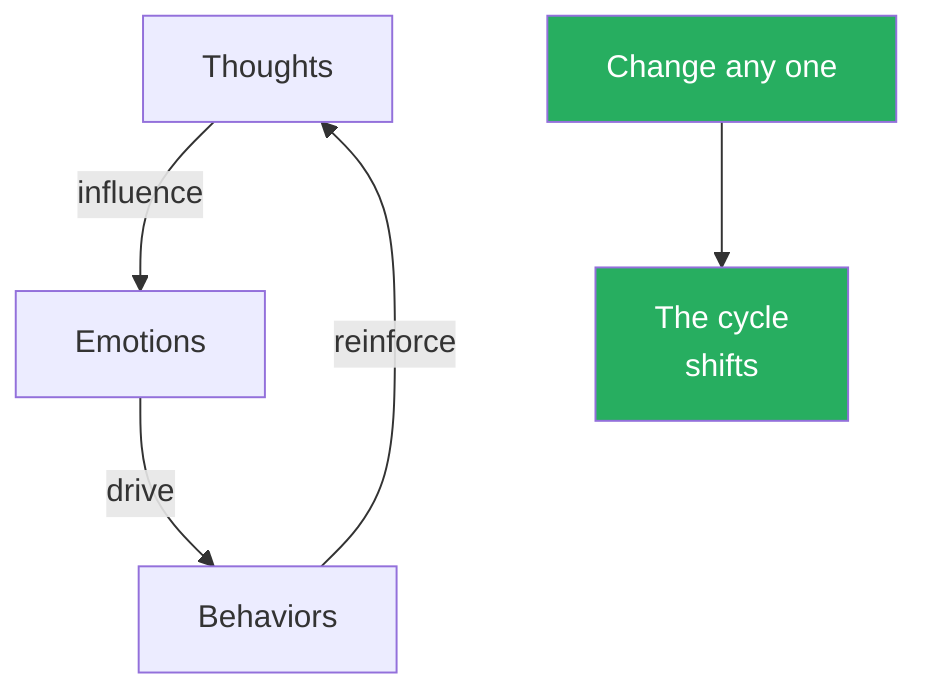

This cycle works in both directions: a negative spiral (irrational thoughts trigger painful emotions trigger destructive behaviour) or a positive one (realistic thoughts enable emotional control enable productive action).

The roughly even distribution across thought, behavior, and emotion confirms Morin's central argument: mental strength cannot be built by addressing only one dimension — the 13 habits attack all three prongs of her model with near-equal frequency, which is why the self-reinforcing cycle between thoughts, emotions, and behaviors is so difficult to break.

- <b style="color: #e74c3c">Common misconceptions about mental strength:</b>
  - It is NOT about acting tough or having a tough exterior — it is about acting according to your values
  - It does NOT require suppressing emotions — it requires understanding them well enough to know when to follow them and when to act contrary to them
  - It is NOT positive thinking — overly positive thoughts can be just as detrimental as negative ones
  - It is NOT about being self-reliant — admitting you need help is a sign of strength
  - It is NOT synonymous with mental health — you can be mentally strong while managing depression, anxiety, or other conditions, just as a person with diabetes can be physically strong

---

- Three factors that influence your baseline mental strength:
  - **Genetics** — predisposition to mood disorders, ADHD, etc.
  - **Personality** — natural tendencies toward realistic thinking and positive behaviour
  - **Experiences** — how your life has shaped your beliefs about yourself and the world
- You can't change your genetics or erase your past, but you can build mental strength through deliberate practice — just like physical strength
- The comparison to physical fitness runs deep:
  - A person with a naturally fast metabolism still needs to exercise to be fit
  - A person with a naturally calm temperament still needs to practise resilience to be mentally strong
  - Both physical and mental strength require consistent effort and degrade without maintenance
  - And both have a critical distinction between *feeling* strong and *being* strong — a person who feels confident but crumbles under pressure has the appearance of strength without the substance

- Morin's subtractive philosophy in context:
  - The dominant approach in self-help is additive: read more, meditate more, journal more, network more, exercise more
  - Morin's approach is subtractive: identify what's holding you back and eliminate it
  - The additive approach works for people with no destructive habits — they just need more good habits
  - But most people have destructive habits that cancel their good ones — and adding more good habits on top of destructive ones produces diminishing returns
  - The doughnut analogy is the book's thesis in four sentences: a man goes to the gym for two hours every day but eats twelve doughnuts on the way home; he can't understand why he isn't losing weight; he's only looking at his good habits; the bad habit is cancelling the good one
  - Morin's prescription: fix the doughnuts before adding more gym time
  - This framing also explains why many people who are "doing everything right" (meditation, exercise, journaling, therapy) still feel stuck — they have an unexamined bad habit that's undermining all their good ones
  - The book functions as a diagnostic: read through the thirteen chapters and see which ones provoke the strongest "that's me" response — that's where the doughnuts are

---

## Key Concepts at a Glance

| Concept | One-line summary |
|---------|-----------------|
| **Self-pity** | Addictive and self-destructive — exchange it for gratitude |
| **Giving away power** | Letting others control how you think, feel, and behave |
| **Shying away from change** | Fear, discomfort, and grief keep people stuck |
| **Focusing on the uncontrollable** | Trying to control everything increases anxiety, not safety |
| **People-pleasing** | Saying yes to everyone means saying no to yourself |
| **Fearing calculated risks** | Emotion-based risk assessment leads to avoidance |
| **Dwelling on the past** | Rumination prevents healing and blocks the future |
| **Repeating mistakes** | Without studying failures, you repeat them |
| **Resenting others' success** | Insecurity and unclear values breed envy |
| **Giving up after failure** | Grit matters more than talent or IQ |
| **Fearing alone time** | Solitude enables processing, creativity, and self-awareness |
| **Entitlement** | Expecting the world to deliver what you think you deserve |
| **Expecting instant results** | Delayed gratification predicts success in every domain |

Self-pity is overwhelmingly an emotional habit (score 10), while controlling uncontrollables is primarily a thought distortion (score 10) and people-pleasing is fundamentally a behavioral pattern (score 10) — confirming Morin's three-pronged model and showing why different habits require different intervention strategies.

---

## Quick Lookup Table

| # | Habit | Thematic Group |
|---|-------|---------------|
| 1 | They don't waste time feeling sorry for themselves | Emotional Traps |
| 2 | They don't give away their power | Emotional Traps |
| 7 | They don't dwell on the past | Emotional Traps |
| 9 | They don't resent other people's success | Emotional Traps |
| 3 | They don't shy away from change | Fear & Avoidance |
| 6 | They don't fear taking calculated risks | Fear & Avoidance |
| 10 | They don't give up after the first failure | Fear & Avoidance |
| 4 | They don't focus on things they can't control | Boundaries & Agency |
| 5 | They don't worry about pleasing everyone | Boundaries & Agency |
| 12 | They don't feel the world owes them anything | Boundaries & Agency |
| 8 | They don't make the same mistakes over and over | Growth & Discipline |
| 11 | They don't fear alone time | Growth & Discipline |
| 13 | They don't expect immediate results | Growth & Discipline |

The thirteen habits cluster into four themes: emotional traps that drain your energy, fears that prevent action, boundary failures that give others control over your life, and discipline gaps that block long-term growth. Morin does not present these clusters explicitly, but the connections between chapters are constant — she cross-references throughout, and the interplay between habits is as important as any single habit on its own.

**Emotional Traps** (Chapters 1, 2, 7, 9) are about feelings that hijack your rational mind — self-pity, resentment, dwelling, and the surrender of emotional control to others. These are the habits that drain your energy from the inside.

**Fear & Avoidance** (Chapters 3, 6, 10) are about things you refuse to do because of fear — embracing change, taking risks, or persisting after failure. These are the habits that prevent action.

**Boundaries & Agency** (Chapters 4, 5, 12) are about misallocated effort — trying to control what you can't, trying to please everyone, or expecting the world to give you what you want. These are the habits that waste your finite resources.

**Growth & Discipline** (Chapters 8, 11, 13) are about the practices that accelerate or inhibit long-term development — learning from mistakes, embracing solitude, and tolerating slow progress. These are the habits that determine your trajectory.

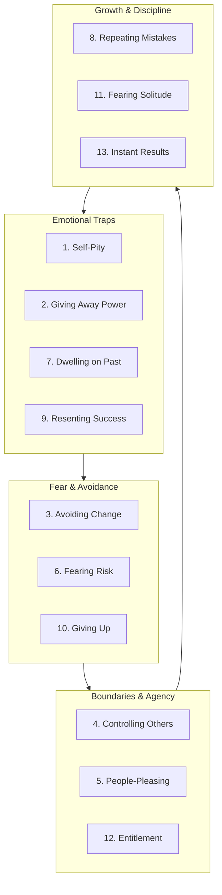

The four clusters form their own cycle: emotional traps breed fear, fear undermines your boundaries, weak boundaries prevent growth, and lack of growth feeds the emotional traps that started the cycle.

Understanding this cycle is practically useful: if you're struggling with a growth habit (e.g., you can't learn from mistakes), the problem may actually be an emotional trap upstream (e.g., self-pity prevents you from examining what went wrong). Similarly, if you're struggling with a fear (e.g., you can't take risks), the problem may be a boundary issue (e.g., people-pleasing makes you afraid of what others will think). The interconnection means that sometimes the fastest way to solve a problem in one cluster is to address its root in another cluster.

Emotional Traps occupy the largest area because they contain four habits and carry the highest combined destructive weight — Morin explicitly positions them as the foundational cluster that enables the other three, which is why Chapter 1 (self-pity) opens the book.

---

## The 13 Things: Chapter by Chapter

### Chapter 1: They Don't Waste Time Feeling Sorry for Themselves

*Morin argues that self-pity is the most seductive of all destructive habits — it feels comforting in the moment but slowly destroys your ability to function.*

Morin opens the book with self-pity because she considers it the foundational bad habit — the one that enables many of the other twelve. A person mired in self-pity has a built-in excuse for avoiding change (Chapter 3), avoiding risk (Chapter 6), giving away their power (Chapter 2), and expecting the world to compensate them for their suffering (Chapter 12). The chapter draws heavily on her personal experience with loss and on her clinical work with clients who had turned self-pity into a lifestyle. Her argument is not that bad things don't happen — they clearly do, and they happened to her repeatedly — but that the narrative you construct around bad events determines whether they strengthen or destroy you.

> [!example] Jack and the School Bus
> - Jack, a young boy, was struck by a school bus and broke both legs
> - His parents pulled him from school, homeschooled him, and warned him constantly that his legs might never fully heal — even though doctors predicted a complete recovery
> - Jack's mood plummeted: a once-happy child became irritable and withdrawn
> - His parents took him to a therapist, who refused to offer sympathy — instead she said enthusiastically, "I've never met a kid who could beat a school bus!"
> - Jack created a book called *How to Beat a School Bus*, drawing himself in a wheelchair wearing a superhero cape
> - The therapist helped his parents see Jack as a survivor, not a victim — and coached the school to let Jack share his story with classmates
> - Over time, Jack's identity shifted from "the kid who got hurt" to "the kid who beat a school bus"
> - The shift did not happen because Jack's circumstances changed — his broken legs were the same — it happened because the frame around his story changed
> **The lesson:** The frame you put around someone's story determines whether they see themselves as a victim or a hero.

- <b style="color: #e74c3c">Self-pity is addictive</b> — it gives momentary comfort while separating you from reality
- Morin draws a clear distinction between self-pity and other painful emotions:
  - **Sadness** is about the pain itself — "I lost someone I love"
  - **Grief** is about the process of accepting that pain — "I'm learning to live without them"
  - **Self-pity** is about the injustice of the pain — "I shouldn't have to feel this"
  - The first two move you forward; the third keeps you circling
  - Jack's parents were stuck in self-pity — not grieving the accident, but protesting it — and their frame trapped Jack with them
- Why we indulge:
  - It delays confronting real fears — if the situation is "bad enough," no one expects you to act
  - It buys time — if your circumstances are terrible enough, doing nothing feels justified
  - It attracts attention and sympathy from others — a form of social currency
  - It becomes a competition — "who has it worse" becomes a badge of honour among people who bond over shared victimhood
  - It serves as defiance against the universe: "I deserve better than this"
  - It provides a sense of moral superiority — the person who suffers more is somehow more noble, more deserving of sympathy
  - It protects against future disappointment — if you expect the worst, you can't be surprised when it arrives; self-pity becomes a form of pre-emptive suffering
  - It provides an identity — "the person who's been through a lot" is a role, and roles are easier to maintain than to change; giving up self-pity means giving up a familiar identity
- The temporal trap of self-pity:
  - Morin notes that self-pity operates outside of normal time — it keeps you locked in the moment of the injury, even as the world moves forward
  - Jack's parents were still living in the moment of the accident weeks after it happened — while Jack himself was ready to move forward
  - The adult version is the person who lost a job three years ago and still talks about it as though it happened yesterday — not because they're processing it, but because they've built their identity around the loss
  - Self-pity freezes the clock at the moment of maximum pain and refuses to let time do its healing work
  - This temporal freezing is what distinguishes self-pity from grief: grief moves through time (denial, anger, bargaining, depression, acceptance); self-pity stays fixed at anger and bargaining ("this shouldn't have happened" and "I deserve compensation")
- The deeper psychological mechanism at work:
  - Self-pity activates the brain's reward centres in the short term — the feeling of being comforted, understood, and validated releases small amounts of dopamine
  - This creates a pattern similar to any addictive behaviour: short-term relief, long-term damage
  - Each episode of self-pity makes the next one more likely, because the brain associates the feeling with temporary comfort
  - Over time, self-pity becomes the default response to any difficulty — not because it helps, but because it's familiar
  - The cycle is insidious because self-pity *mimics* productive emotion — it feels like you're processing your pain, but you're actually rehearsing it
  - The rehearsal deepens the neural grooves: the more you tell yourself the story of your suffering, the more your brain treats suffering as your defining characteristic
- The damage it causes:
  - Wastes mental energy without changing anything — the cognitive load of maintaining the "poor me" narrative is substantial
  - Triggers cascading negative emotions — anger, resentment, loneliness each feed back into more self-pity
  - Becomes a self-fulfilling prophecy: feel pitiful, perform pitifully, get more reasons to feel pitiful
  - Blocks genuine grief, sadness, and anger — emotions that actually need processing
  - Causes you to overlook the good in your life — gratitude and self-pity cannot coexist
  - Prevents problem-solving — the brain cannot simultaneously feel sorry for itself and generate solutions
  - Repels people over time — initial sympathy from friends and family erodes as the pattern continues, creating the loneliness that feeds more self-pity
  - Morin emphasises that some of her clients had been in self-pity cycles for years — entire segments of their lives lost to rehearsing pain rather than addressing it

---

> [!example] Skydiving on Lincoln's Birthday
> - Four months after Lincoln died, Morin dreaded the approach of what should have been his 27th birthday
> - She pictured the family sitting in a circle sharing tissues and talking about how unfair life was
> - When she asked her mother-in-law how she planned to spend the day, the answer was immediate: "What do you think about skydiving?"
> - They jumped out of a plane to honour Lincoln's adventurous spirit — and it became an annual tradition
> - Each year they choose a new adventure: swimming with sharks, riding mules into the Grand Canyon, trapeze lessons
> - Lincoln's 88-year-old grandmother was first in line for ziplining
> - The tradition reframed grief into celebration without denying the loss — they weren't pretending Lincoln was alive; they were honouring how he had lived
> - Morin says this tradition saved her — without it, she believes the birthdays would have become annual rituals of despair rather than annual rituals of courage
> **The lesson:** You can choose to celebrate what you had instead of pitying yourself for what you lost.

- <b style="color: #27ae60">The antidote to self-pity is gratitude</b>
- Morin cites a 2003 study in the *Journal of Personality and Social Psychology* showing gratitude improves:
  - Physical health — better immune systems, lower blood pressure, more exercise
  - Emotional well-being — more happiness, joy, and energy
  - Social connection — more willing to forgive, more outgoing, less lonely
- The mechanism behind gratitude's power:
  - It shifts your brain's attention from what is missing to what is present
  - It interrupts the self-pity feedback loop — you cannot simultaneously feel grateful and pitiful; the two states are neurologically incompatible
  - It creates a new narrative: instead of "poor me," the story becomes "look what I still have"
  - Neurologically, gratitude activates the hypothalamus and ventral tegmental area — regions associated with dopamine production and reward
  - A regular gratitude practice physically rewires neural pathways over time, making the grateful response more automatic
  - This is not about forced positivity — Morin is clear that gratitude coexists with pain; you can be grateful for what you have while mourning what you've lost
  - The skydiving tradition is the perfect illustration: the family was not pretending Lincoln was alive — they were choosing to respond to his absence with adventure rather than paralysis

> [!tip] Core Insight
> Self-pity says "I deserve better." Gratitude says "I have more than I deserve." The shift between these two thoughts changes everything.

- Morin offers a practical exercise for building gratitude:
  - Keep a gratitude journal — but not the generic kind that lists "family, health, home" every day
  - Be specific: not "I'm grateful for my wife" but "I'm grateful that my wife noticed I was stressed and made my favourite dinner without me asking"
  - Specificity engages the brain differently — generic gratitude becomes rote; specific gratitude forces you to notice details you would otherwise miss
  - She recommends writing three specific things each morning for at least 30 days before evaluating whether it's working
  - The 30-day minimum matters: most people try gratitude for a few days, feel nothing, and conclude it doesn't work — but neuroplasticity requires repetition
  - Clients who stuck with it for 30 days reported a noticeable shift around week three — the brain begins to scan for things to be grateful for, just as it previously scanned for things to complain about
  - The shift is not from negativity to positivity — it is from blindness to awareness; you start seeing things that were always there but that self-pity rendered invisible
  - An additional benefit: gratitude journaling creates a record you can return to during difficult times
  - When self-pity resurfaces — and Morin is honest that it will — reading past gratitude entries serves as evidence against the "my life is terrible" narrative
  - The journal becomes a counter-argument to your worst thoughts: "You felt life was wonderful last Tuesday; what changed?" — usually nothing changed except your mental state

---

> [!example] Jeremiah Denton — POW Who Chose Gratitude
> - Commander Denton was a U.S. naval aviator shot down over Vietnam in 1965
> - He spent seven years as a prisoner of war, beaten, starved, and tortured daily
> - During a propaganda interview, he blinked T-O-R-T-U-R-E in Morse code while pretending the lights bothered his eyes — confirming for the first time that American prisoners were being tortured
> - Upon release in 1973, his first words were: "We are profoundly grateful to our commander in chief and to our nation for this day. God bless America."
> - He later served as a U.S. senator for Alabama
> - Seven years of torture, and his first public words were about gratitude — not complaint, not anger, not self-pity
> - Morin uses Denton to demolish the excuse that "my circumstances are too bad for gratitude" — if a man tortured for seven years can lead with gratitude, so can anyone
> **The lesson:** Even in the worst circumstances imaginable, gratitude is a choice — and it fuels action rather than paralysis.

---

- <b style="color: #2980b9">Self-pity vs. healthy sadness</b> — an important distinction:
  - Healthy sadness acknowledges pain and moves through it — "This hurts, and I'm going to process it"
  - Self-pity magnifies pain and stalls — "This shouldn't be happening to me, and it's not fair"
  - Grief is productive; self-pity is not
  - Morin emphasises that she is not asking people to suppress painful emotions — she is asking them to avoid the trap of indulging those emotions past the point where they serve any purpose
  - The difference is temporal: grief has a direction (toward acceptance); self-pity has a loop (back to the same complaint)
  - Many of her therapy clients could not tell the difference at first — they believed their self-pity was grief, and were surprised when Morin pointed out that grief moves forward while self-pity circles
- How to tell the difference in practice:
  - If you feel differently about the event after thinking about it, you are grieving
  - If you feel the same way every time you revisit it, you are indulging self-pity
  - If talking about it with a friend brings relief, you are processing
  - If talking about it with a friend feels like performing your pain, you are seeking sympathy, not healing
- The social dimension of self-pity:
  - Self-pity creates a gravitational pull on other people — the "pity party" phenomenon
  - People who indulge in self-pity attract others who also indulge — creating mutual reinforcement
  - "Can you believe what happened to me?" met with "That's nothing — wait until you hear what happened to ME" — a competition with no winners
  - Morin notes that some friendships are built entirely on shared complaint — and these friendships dissolve the moment one person starts to improve, because improvement threatens the dynamic
  - The "crab bucket" effect: crabs in a bucket will pull down any crab that tries to climb out — and friend groups built on mutual self-pity operate the same way
  - Breaking the self-pity habit sometimes means changing who you spend time with — which connects to Chapter 3 (change) and Chapter 6 (risk)
- The connection to later chapters:
  - Self-pity feeds entitlement (Chapter 12) — "because I've suffered, the world owes me"
  - Self-pity blocks gratitude, which blocks the ability to celebrate others' success (Chapter 9) — "how can I be happy for them when my life is so hard?"
  - Self-pity is the emotional fuel for dwelling on the past (Chapter 7) — it gives you a reason to stay stuck
  - Self-pity prevents risk-taking (Chapter 6) — "why try when the universe is against me?"
  - Self-pity is the gateway drug of the thirteen habits — Morin sees it as the starting point for many of the other twelve, because it provides the emotional justification for giving away power, avoiding change, dwelling, resenting others, and feeling entitled

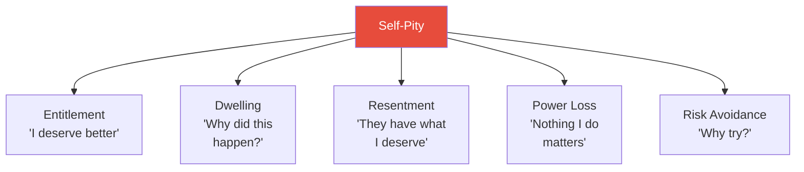

Self-pity sits at the centre of a web that connects to at least five other habits — addressing it first often loosens the grip of several others simultaneously.

| Self-Pity Cycle | Gratitude Cycle |
|---|---|
| Something bad happens | Something bad happens |
| "Why me? This isn't fair" | "This is painful, but what do I still have?" |
| Withdrawal, isolation | Connection, perspective |
| Energy drains, helplessness grows | Energy builds, agency strengthens |
| Next difficulty hits harder | Next difficulty hits the same or lighter |
| Identity: "I'm a victim" | Identity: "I'm a survivor" |

This comparison reveals the compounding nature of both cycles — self-pity makes each subsequent challenge worse, while gratitude makes each one more manageable. The difference is not in the events that happen to you but in the narrative you construct around them.

> [!abstract] Breaking the Self-Pity Habit
> 1. Catch yourself in the act — notice when "this is hard" becomes "poor me"
> 2. Replace the complaint with one thing you're grateful for — even if it's small
> 3. Set a timer for 10 minutes of gratitude journaling — listing specific things, people, and moments
> 4. When someone invites you to a "pity party," politely decline — change the subject or offer a genuine solution
> 5. Ask yourself: "What would I tell a friend in this situation?" — then follow your own advice
> 6. Notice the physical cues — self-pity often comes with slumped posture, sighing, and withdrawal; changing your body can interrupt the mental loop

---

### Chapter 2: They Don't Give Away Their Power

*Morin shows that every time you let someone else determine how you feel, you hand them the remote control to your life — and most people don't even realise they've done it.*

Morin opens this chapter with a paradox: people who are controlled by others often don't feel controlled — they feel justified. "Of course I'm upset — look what she did!" The feeling of righteous anger masks the reality that someone else is steering your emotional state. The distinction between "I have a right to be upset" (true) and "she made me upset" (false) is the entire chapter in miniature. You can acknowledge that someone's behaviour is unacceptable while still retaining ownership of your emotional response.

> [!example] Lauren and the Monster-in-Law
> - Lauren's mother-in-law Jackie made unannounced visits several times a week, undermined her parenting rules in front of her children, and once told her she should exercise more because she looked like she'd gained weight
> - Lauren seethed internally but smiled politely — then complained to friends and took her frustration out on her husband
> - In therapy, Morin asked Lauren to draw two pie charts: one showing how much *time* she spent with Jackie, and one showing how much *mental energy* she devoted to Jackie
> - Lauren spent about 5 hours per week with Jackie physically — but devoted an additional 5+ hours thinking and complaining about her
> - She was giving Jackie power over her marriage, her evenings, and her emotional state
> - The pie chart exercise made the disproportion visible and undeniable: Jackie occupied 5% of Lauren's time but 30% of her mental bandwidth
> - Together with her husband, Lauren set boundaries: no more unannounced visits, no more undermining her parenting rules
> - The boundaries didn't change Jackie's personality — but they changed how much of Lauren's life Jackie could disrupt
> **The lesson:** You can be firm and respectful at the same time — and boundaries are not disrespectful.

- <b style="color: #2980b9">Giving away your power</b> means allowing other people or external circumstances to control how you think, feel, and behave
- Signs you've given it away:
  - Your mood depends entirely on other people's behaviour — one critical comment can ruin your entire day
  - You change your goals based on what others say you "should" do
  - You hold grudges that consume your energy
  - You can't set boundaries without feeling guilty
  - You replay conversations in your mind, crafting the perfect response you wish you'd given
  - You track what other people think about you and adjust your behaviour accordingly
  - You feel responsible for other people's emotions — if they're unhappy, you assume it's your job to fix it
  - You ruminate on criticism long after the person who delivered it has forgotten the conversation
- The mechanism is subtle:
  - Most people don't consciously decide to hand over power — it happens through language habits
  - Phrases like "he made me angry" or "she ruined my day" encode the belief that other people control your inner state
  - Over time, this linguistic habit becomes a psychological habit — you genuinely begin to believe you have no choice in how you feel
  - The belief itself becomes self-fulfilling: if you believe someone has power over your emotions, you stop trying to regulate them, which makes the belief appear more true
  - Morin connects this to cognitive behavioural therapy: the thought "she made me angry" is an automatic thought that needs to be identified, challenged, and replaced
  - The insidious part is that giving away power often feels like the morally correct thing to do — "of course I'm upset, anyone would be" — which makes it harder to challenge
- The power equation:
  - Every person in your life has exactly as much power over your emotions as you grant them
  - Some people deserve significant emotional influence — your spouse, your children, your closest friends
  - The problem arises when people who don't deserve that influence — a rude stranger, a critical coworker, a toxic acquaintance — receive as much emotional real estate as the people who matter most
  - Lauren was giving Jackie — someone she saw five hours a week — more emotional power than her husband and children
- The hidden cost of power-giving in close relationships:
  - Power dynamics in romantic relationships are particularly complex
  - A husband who says "my wife makes me angry" has given his wife control over his emotional state — and she didn't ask for it
  - The burden falls on both parties: the person giving away power loses autonomy; the person receiving it gains an unwanted responsibility ("I have to manage his moods")
  - Morin sees this pattern destroy marriages: one partner's emotional dependence on the other creates a lopsided dynamic where the "powerful" partner feels burdened and the "powerless" partner feels resentful
  - The healthiest relationships are between two people who retain their own power while choosing to be emotionally vulnerable with each other — a critical distinction
  - Vulnerability is choosing to share your emotions; power-giving is making your emotions someone else's responsibility
  - The first builds intimacy; the second builds codependence

---

- <b style="color: #27ae60">Reframe your language</b> to reclaim power:
  - Instead of "My boss makes me so mad" — "I don't like my boss's behaviour, but I choose how to respond"
  - Instead of "I have to go to work tomorrow" — "I choose to go to work because the consequences of not going are worse"
  - Instead of "My mom makes me feel bad about myself" — "My mom makes critical comments, but I choose whether to let them define me"
- This is not just wordplay — it is a fundamental shift in your relationship to your own emotions:
  - When you say "she made me angry," you position yourself as passive — things happen *to* you
  - When you say "I felt angry about what she said," you position yourself as active — you are experiencing a reaction and can choose what to do with it
  - The first framing robs you of agency; the second preserves it
  - Over weeks and months, this reframing changes your automatic thoughts — the brain begins to default to agency rather than victimhood
  - Morin notes that this is one of the most common interventions in CBT — and one of the most effective, despite its simplicity
  - Clients often resist it at first because it feels like they're being asked to excuse bad behaviour — but the reframe is not about excusing the other person; it's about empowering yourself

| Powerless Language | Empowered Language |
|---|---|
| "He makes me so angry" | "I feel angry when he does that — and I choose how to respond" |
| "I have to do this" | "I'm choosing to do this because..." |
| "She ruined my day" | "I allowed the situation to affect my mood" |
| "I can't help how I feel" | "I can choose how long I dwell on this" |
| "They forced me into it" | "I agreed because I didn't want the alternative" |
| "He always pushes my buttons" | "I notice strong reactions when he does that" |

This table shows the shift from victim to agent — same situation, completely different relationship to it. The empowered column is not about denying the emotion — it is about owning it.

- Morin suggests a practical exercise for clients learning to reclaim their power:
  - **The mental energy audit:** at the end of each day, list every person or situation that consumed significant mental energy
  - Next to each one, write how much time you actually spent with that person or in that situation
  - Calculate the ratio: mental energy divided by actual time
  - Lauren's audit: Jackie consumed 30% of mental energy for 5% of her time — a 6:1 ratio
  - Any ratio above 2:1 signals that you've given away your power — the person or situation occupies far more mental real estate than the actual exposure warrants
  - Repeat for a week and patterns emerge: you discover who holds disproportionate power over your emotional state
  - The audit doesn't fix the problem — but it makes the problem visible, and visibility is the first step toward change
  - Morin notes that clients are often shocked by their own audits — they had no idea how much mental bandwidth was being consumed by people they don't even like

> [!example] Officer Steven McDonald's Forgiveness
> - In 1986, NYPD Officer Steven McDonald stopped to question teenagers about bicycle thefts — a fifteen-year-old shot him in the head and neck, paralysing him from the neck down
> - McDonald's wife was six months pregnant at the time; he'd only been married eight months
> - Rather than harbouring rage, McDonald chose to forgive his attacker
> - When the young man called from prison to apologise years later, McDonald not only accepted — he proposed they travel the country together promoting peace
> - The young man was killed in a motorcycle accident three days after his release, so McDonald spread the message alone
> - McDonald said: "The only thing worse than a bullet in my spine would have been to nurture revenge in my heart"
> - He spent the rest of his life as a quadriplegic and never once publicly expressed bitterness toward his shooter
> - His son grew up to become an NYPD detective — inspired not by his father's injury but by his father's response to it
> **The lesson:** Forgiveness is not about excusing behaviour — it is about refusing to let someone else's actions define your life.

---

- The psychology of forgiveness and power:
  - Holding a grudge feels powerful — "I'm punishing them by staying angry"
  - But the person you're angry at is usually unaware of or unaffected by your grudge
  - The only person who suffers from sustained resentment is the person holding it
  - Forgiveness is not reconciliation — you can forgive someone without resuming the relationship
  - Forgiveness is not approval — you can forgive the person while condemning the act
  - Forgiveness is not forgetting — it's choosing not to let the memory control your present
  - Morin frames forgiveness as the ultimate act of retaining power — when you forgive, you reclaim the emotional energy that resentment was consuming
- The stages of forgiveness — Morin's clinical model:
  - **Stage 1: Acknowledge the hurt** — don't minimise it or pretend it didn't matter
  - **Stage 2: Separate the person from the act** — "What they did was wrong" is different from "They are an evil person"
  - **Stage 3: Choose to forgive for your benefit, not theirs** — forgiveness is a decision, not a feeling; you can decide to forgive before you feel like forgiving
  - **Stage 4: Release the need for justice** — you may never get an apology, an admission, or a consequence; waiting for these keeps you chained to the person who hurt you
  - **Stage 5: Redirect the energy** — the mental bandwidth that was consumed by resentment is now available for your own goals, relationships, and growth
  - The stages are not linear — Morin's clients often cycle between them, especially between stages 3 and 4, where the intellectual decision to forgive collides with the emotional desire for justice
  - McDonald's forgiveness of his shooter was not instantaneous — it was a decision that he had to remake repeatedly over years
  - The decision gets easier over time — not because the hurt diminishes, but because the habit of forgiveness strengthens
- The physical toll of resentment:
  - A 2005 study: anger increased psychological distress and decreased pain tolerance in chronic low back pain patients; willingness to forgive increased pain tolerance
  - A 2012 study in the *Journal of Behavioral Medicine*: people who only forgave under conditions (the other person apologises, promises not to repeat it) had a higher risk of early death than those who forgave unconditionally
  - Elevated cortisol levels from chronic anger suppress immune function
  - Blood pressure spikes during resentful thinking patterns
  - Sleep quality declines when you ruminate on perceived injustices
  - The cardiovascular system is under constant strain — the heart literally works harder when the mind is trapped in resentment
  - Morin presents resentment as a form of self-harm that the person mistakes for righteous anger — you think you're punishing the other person, but your body is the one paying the price

> [!example] Oprah Winfrey — From Potato Sacks to Power
> - Oprah grew up in extreme poverty, was sexually abused throughout childhood, bounced between her mother, father, and grandmother, ran away from home repeatedly, and became pregnant at fourteen — the infant died shortly after birth
> - She started working at a local radio station during high school and worked her way through media jobs
> - She landed a TV news anchor position — but was later fired
> - Rather than giving that employer the power to define her career, she created her own talk show
> - By age 32, her show was a national hit; by 41, her net worth exceeded $340 million
> - She started her own magazine, radio show, and TV network, won an Academy Award, and created a leadership academy for girls in South Africa
> - A woman once teased for wearing potato sacks as dresses was named one of the world's most powerful women by CNN and Time
> - At every stage, someone else's judgement could have defined her — and at every stage, she refused to let it
> - The pattern is consistent: abuse, poverty, professional rejection — and at no point did she allow the person or institution responsible to determine her trajectory
> **The lesson:** Oprah's story is not about luck or talent alone — it is about refusing to let other people's actions, judgements, or cruelty determine who she would become.

---

- <b style="color: #e74c3c">Holding grudges keeps your body in a state of chronic stress</b>
- <b style="color: #2980b9">The boundary spectrum</b> — how power-giving manifests in relationships:
  - **No boundaries:** you absorb everyone else's moods, demands, and expectations as your own — Lauren before therapy
  - **Rigid boundaries:** you wall yourself off entirely — this looks like reclaiming power but is actually another form of being controlled (by fear)
  - **Healthy boundaries:** you decide what behaviour you will accept and what you won't — and communicate it clearly without aggression — Lauren after therapy
- Each position on the spectrum has a different relationship to power:
  - No boundaries: you give power away freely to anyone who asks for it — or even to people who don't
  - Rigid boundaries: you retain power but at the cost of connection — you control your emotions by refusing to feel anything
  - Healthy boundaries: you retain power while remaining emotionally available — the hardest position to maintain, but the only one that works long-term
- Morin observes that people often oscillate between no boundaries and rigid boundaries:
  - They spend months absorbing everyone's demands (no boundaries), then explode and wall themselves off entirely (rigid boundaries)
  - The explosion feels like progress — "I finally stood up for myself!" — but it's actually another form of reactivity
  - The person went from being controlled by others' demands to being controlled by their own anger
  - Neither position is stable; both are reactions rather than choices
  - Healthy boundaries require a third option: calm, clear communication of what you will and won't accept — without anger, without guilt, and without apology
  - Lauren's therapy was about finding this third option: she didn't need to stop seeing Jackie (rigid boundaries) or continue absorbing Jackie's behaviour (no boundaries); she needed to see Jackie on her terms, with clear expectations communicated in advance
- The connection to Chapter 5 (people-pleasing):
  - Giving away power is about letting others control how you *feel*
  - People-pleasing is about trying to control how others *feel about you*
  - Both involve a loss of autonomy, but the direction is reversed
  - Solving one often requires solving the other — a person who can't set boundaries (Chapter 2) will also struggle to say no (Chapter 5)
  - The common root is the same: a belief that other people's emotional states are your responsibility
  - Morin notes that this belief — "I am responsible for how others feel" — is one of the most deeply ingrained and destructive beliefs she encounters in therapy
  - It often goes unquestioned because it sounds generous: "I care about people's feelings"
  - But there is a crucial difference between caring about someone's feelings (healthy empathy) and taking responsibility for them (codependency)
  - The first says: "I notice you're upset, and I care" — the second says: "I notice you're upset, and it's my job to fix it"
  - This distinction runs through both chapters and forms one of the book's most important practical insights

> [!abstract] How to Reclaim Your Power
> 1. Identify who you've given power to — use the mental energy audit for a week
> 2. Reframe your language — replace "they made me feel" with "I chose to feel"
> 3. Decide what behaviour you'll tolerate and communicate it clearly
> 4. Practice forgiveness — not for their sake, but for yours
> 5. Stop tracking other people's opinions of you — their opinions are about them, not about you
> 6. When you catch yourself ruminating about someone, redirect your energy to something within your control

- The cultural dimension of power:
  - Many cultures teach that it's virtuous to absorb other people's emotions — "be the bigger person," "turn the other cheek," "don't make waves"
  - Morin is careful to distinguish between genuine emotional resilience and the toxic version where people are taught to accept mistreatment
  - "Being the bigger person" should mean choosing your response wisely — not enduring abuse in silence
  - The difference: a strong person who chooses not to react is exercising power; a person who doesn't react because they believe they don't deserve to is giving it away
  - This distinction is particularly important for people from backgrounds where assertiveness was discouraged — they need to learn that setting boundaries is not aggression; it is self-respect

> [!tip] Core Insight
> When you decide that no one else has the power to control how you feel, you experience empowerment. Retaining your power reduces your risk of depression, anxiety, and other mental health issues.

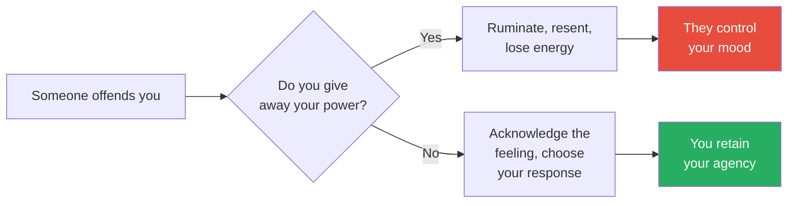

The fork in this diagram is Morin's central point: the same event leads to two completely different outcomes depending on whether you keep or surrender your power.

---

### Chapter 3: They Don't Shy Away from Change

*Morin dismantles the myth that willpower alone drives change, revealing that readiness, incremental steps, and emotional management matter far more than sheer determination.*

This chapter contains one of Morin's most practical contributions: the recognition that change is not a single skill but a category of skills, each requiring its own approach. Most self-help books treat "change" as monolithic — here's how to change, full stop. Morin argues that this is like saying "here's how to cook" without distinguishing between baking a cake and grilling a steak. The chapter is grounded in two main client stories — Richard (weight loss) and Andrew (career change) — both of whom failed at change until they matched their strategy to the type of change they were attempting.

> [!example] Richard's Incremental Transformation
> - Richard, 44, was 75 pounds overweight and newly diagnosed with diabetes
> - He tried to change everything at once — threw out all junk food, bought a gym membership, planned to cook healthy meals every night
> - Within two days he was back to his old habits; he'd only gone to the gym twice
> - In therapy, Morin helped him focus on one change at a time: swap afternoon cookies for carrot sticks
> - He kept a list of reasons to go to the gym in his car — reading it on tempted days helped him resist going straight home
> - He moved junk food to the basement so healthy snacks were more convenient — reducing friction for the good choice, increasing it for the bad one
> - As small wins accumulated, motivation increased — and change became self-reinforcing
> - Within three months, the man who couldn't sustain a gym visit was exercising four times a week — because each small success built confidence for the next challenge
> - The key: Richard didn't become a different person — he became the same person with better systems
> **The lesson:** Trying to change everything at once is a recipe for failure. One small change, successfully maintained, creates momentum for the next.

- The psychology behind why "changing everything at once" fails:
  - The brain has a limited pool of self-regulation resources — this is the basis of willpower depletion theory (also called ego depletion)
  - Each change you attempt draws from this same pool: resisting the cookies draws from the same pool as motivating yourself to go to the gym, which draws from the same pool as planning healthy meals
  - When you try to make five changes simultaneously, you deplete the pool five times as fast — and when the pool is empty, the brain defaults to the path of least resistance (old habits)
  - Richard's collapse after two days was not a character failure — it was predictable resource depletion
  - Morin's one-at-a-time approach works because each new habit, once established, becomes automatic — and automatic habits no longer draw from the self-regulation pool
  - Once the afternoon cookie swap became automatic (about three weeks), Richard had freed up self-regulation resources for the next change (going to the gym)
  - The sequential approach is slower but dramatically more reliable — and three months of sequential changes produced more lasting results than Richard's years of failed all-at-once attempts
  - This connects directly to Chapter 13 (instant results): the one-at-a-time approach requires patience, and the patient approach produces permanent change while the impatient approach produces temporary change followed by relapse

- <b style="color: #2980b9">The Five Stages of Change</b> (Prochaska model):
  1. **Precontemplation** — no awareness a problem exists; you don't think anything needs to change
  2. **Contemplation** — weighing pros and cons; you know something should change but aren't ready
  3. **Preparation** — making a concrete plan; you're ready and gathering resources
  4. **Action** — implementing the plan; you're doing the work
  5. **Maintenance** — sustaining the change through obstacles and temptation
- What most people miss about this model:
  - The stages are not one-directional — most people cycle back and forth between stages multiple times before permanent change occurs
  - Relapsing from Action back to Contemplation is normal, not failure
  - The critical insight is that different stages require different interventions — pushing someone in Contemplation to take Action before they've completed Preparation almost guarantees failure
  - Most self-help advice is pitched at the Action stage — "just do it" — which is useless for someone still in Contemplation
  - Morin's therapist training makes her sensitive to this: you can't skip stages any more than you can skip the foundation when building a house

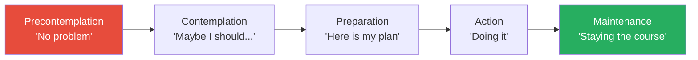

Most New Year's resolutions fail because people try to jump from Precontemplation straight to Action, skipping the crucial Preparation stage.

- Each stage has its own internal logic — and its own traps:
  - **Precontemplation trap:** denial disguised as contentment — "Things aren't that bad" when they clearly are
  - **Contemplation trap:** analysis paralysis — weighing pros and cons endlessly without ever deciding; Morin has seen clients stay in Contemplation for years
  - **Preparation trap:** over-planning as avoidance — buying the gym clothes, reading the diet books, researching the programmes, but never actually starting
  - **Action trap:** burnout from trying too hard too fast — Richard's two-day collapse after throwing out all junk food is the classic example
  - **Maintenance trap:** complacency — "I've changed enough" followed by a slow drift back to old patterns; the most dangerous stage because it feels like you've already won
- Morin emphasises that understanding which stage you're in is itself a form of progress:
  - If you're in Contemplation, your job is not to take action — it's to finish contemplating honestly
  - If you're in Preparation, your job is not to feel guilty about not starting yet — it's to prepare well
  - Matching your expectations to your stage prevents the frustration that causes people to abandon the process entirely

---

- <b style="color: #2980b9">Six types of change</b> — not all changes work the same way:
  - **All-or-nothing change** — having a child, ending a marriage — irreversible once done
  - **Habit change** — eliminating a bad habit or creating a good one — reversible, can be tested
  - **Trying-something-new change** — volunteering, taking a class — low stakes, high learning
  - **Behavioural change** — attending every child's game, acting friendlier — specific and measurable
  - **Emotional change** — becoming less irritable, less anxious — requires examining underlying thoughts
  - **Cognitive change** — thinking less about the past, worrying less — the deepest and hardest to sustain
- <b style="color: #27ae60">The key insight about change</b> is that it's not one thing — it's a category that includes at least six different types, each requiring a different strategy
  - Treating a cognitive change (stop worrying) the same way you treat a habit change (stop smoking) is a recipe for frustration
  - Match your strategy to the type of change you're attempting
  - Richard was trying all-or-nothing change when he needed habit change — once he matched the strategy to the type, progress followed
  - This taxonomy of change types is one of Morin's most practically useful contributions — most people fail at change not because they lack willpower but because they're using the wrong tool for the job

| Type of Change | Example | Strategy | Common Mistake |
|---|---|---|---|
| **All-or-nothing** | Having a child, divorce | Prepare thoroughly; accept irreversibility | Rushing in without preparation |
| **Habit** | Quit smoking, eat healthier | Small steps, environment design | Going cold turkey on everything at once |
| **Trying something new** | Volunteering, new class | Low-stakes experimentation | Treating it as permanent commitment |
| **Behavioural** | Attend every game, be friendlier | Specific, measurable actions | Vague goals like "be a better parent" |
| **Emotional** | Less irritable, less anxious | Examine underlying thoughts | Trying to suppress the emotion directly |
| **Cognitive** | Stop worrying, stop dwelling | Thought replacement, therapy | Using the same approach as habit change |

This table reveals why one-size-fits-all change advice fails: each type requires a fundamentally different approach, and matching the wrong strategy to the change type is one of the most common reasons people give up.

- Three forces that prevent change:
  - **Fear** — "What if it gets worse?" keeps people in unsatisfying situations
    - This is not just fear of failure — it's fear of the unknown
    - The familiar, even if painful, feels safer than the uncertain
    - Fear of change often masquerades as contentment: "Things aren't that bad"
    - Morin sees this pattern constantly: clients who stay in bad relationships, bad jobs, bad living situations — not because they're happy, but because the known misery feels less threatening than unknown possibility
  - **Discomfort avoidance** — we systematically underestimate our ability to tolerate short-term pain
    - Richard knew what to eat and how to exercise but dreaded giving up foods he liked and feeling the burn of a workout
    - It wasn't until he gained confidence in his ability to tolerate discomfort that he made further changes
    - The tolerance builds: each successfully endured discomfort makes the next one easier
    - The parallel to physical training is exact: the first day at the gym hurts the most, and each subsequent day hurts a little less — not because the exercise is lighter, but because your capacity has grown
  - **Grief** — every change means giving something up, and that loss needs mourning
    - Tiffany came to therapy for out-of-control spending — but shopping with friends was her social life
    - She thought cutting spending meant losing friendships — she'd rather risk financial ruin than loneliness
    - Even positive changes involve loss — getting married means losing certain freedoms; getting promoted means losing the comfort of your old role
    - Until you grieve what you're giving up, you'll keep reaching back for it
    - Morin is one of the few self-help authors who acknowledges that change always involves mourning — most present change as purely aspirational, ignoring the genuine loss embedded in even the best decisions

- The interplay between these three forces:
  - Fear, discomfort avoidance, and grief don't operate independently — they reinforce each other
  - Fear creates anticipatory discomfort (imagining how bad the change will feel), which activates discomfort avoidance (choosing to stay in the current situation), which prevents mourning (because you never commit to the change enough to grieve what you're leaving behind)
  - The result is a person who is simultaneously afraid of change, unwilling to tolerate the discomfort of change, and unable to grieve the old situation because they're still in it
  - Richard experienced all three: he feared that healthier eating would feel punishing (fear), he dreaded the physical discomfort of exercise (discomfort avoidance), and he hadn't mourned the loss of his favourite foods (grief)
  - Morin's strategy was to address one at a time: first reduce the fear (start small, not all at once), then build discomfort tolerance (one new habit at a time), and then allow mourning (it's okay to miss the doughnuts — just don't eat them)
  - The sequential approach is important: trying to overcome all three simultaneously is as overwhelming as trying to change everything at once
  - Richard needed to feel safe before he could tolerate discomfort, and he needed to tolerate discomfort before he could grieve — the order matters

---

> [!example] Andrew's Fear Trap
> - Andrew was stuck in a low-paying job after a car accident left him with huge medical bills
> - He was terrified to apply for new jobs — worried he might not like a different one, worried about losing his seniority, worried about the unknown
> - Only when he created a budget and saw he'd be $200 short each month did fear of staying outweigh fear of leaving
> - The exercise revealed something important: his fear of change was based on vague anxiety, while the cost of not changing was concrete and measurable
> - Once he saw the numbers, the "risk" of applying for new jobs transformed from terrifying to obvious
> - Andrew's case illustrates a pattern Morin sees frequently: people stay in painful situations because the pain is familiar, and the alternative — while potentially better — is unknown
> **The lesson:** Fear of change thrives on vagueness. The moment you quantify the cost of staying the same, the case for change often makes itself.

> [!example] Mary Deming — From Grief to Half a Million Dollars
> - Mary's mother died of breast cancer when Mary was 21; her father had already passed away when she was a teenager
> - At 50 — the same age her father was when he died — she began thinking about her own mortality
> - She started fundraising: first the American Cancer Society's Relay for Life, then a 60-mile walk, raising $38,000 (one thousand for each year her mother had been gone)
> - Three years into her fundraising, a severe car accident caused a traumatic brain injury with significant speech and cognitive issues
> - She went to speech therapy eight times a week and said: "I'm not going out like that"
> - It took five years, but she returned to teaching and resumed fundraising — ultimately raising nearly half a million dollars for breast cancer research
> - The brain injury would have been a justifiable reason to stop — but Mary saw it as another obstacle to overcome, not a verdict
> - Her determination was not blind stubbornness — it was fuelled by a clear purpose that was bigger than her pain
> **The lesson:** Change doesn't require a single dramatic leap. It requires the willingness to keep going even when the obstacles are enormous.

> [!example] Judge Greg Mathis — Criminal to Courtroom
> - Raised in the projects of Detroit, arrested multiple times as a teenager, dropped out of school to join a gang
> - At 17, while incarcerated, his mother was diagnosed with colon cancer — he promised her he'd change
> - Started working at McDonald's, earned acceptance to Eastern Michigan University, went to law school
> - Couldn't get a lawyer job due to criminal record, so he became manager of Detroit Neighbourhood City Halls
> - Ran for judge and beat the 20-year incumbent — became the youngest judge in Michigan history
> - Now hosts a TV show and runs Youth and Education Expos encouraging young people to make better choices
> - His mother's diagnosis provided the emotional catalyst, but the change itself happened through years of daily decisions
> - Each stage — McDonald's, university, law school, politics — was its own change, requiring its own preparation and its own grief over what he was leaving behind
> **The lesson:** Positive change leads to increased motivation, and increased motivation leads to more positive change — the cycle works both ways.

---

> [!abstract] Creating a Successful Plan for Change
> 1. Set a goal for what you'd like to accomplish in the next 30 days
> 2. Identify at least one concrete behaviour change you can make each day
> 3. Anticipate specific obstacles and plan how you'll respond to each one
> 4. Establish accountability — enlist friends, family, or write down daily progress
> 5. Monitor your progress with a written record to maintain motivation
> 6. Identify which type of change you're making (habit, behavioural, emotional, cognitive) and match your strategy accordingly

- The role of environment in sustaining change:
  - Morin emphasises that willpower is a depletable resource — you can't rely on it alone
  - Richard's decision to move junk food to the basement is an example of environment design: make the healthy choice the easy choice and the unhealthy choice the hard choice
  - Tiffany's spending was partly environmental: her social circle's primary activity was shopping; changing the spending habit required changing the social context
  - This connects to the marshmallow experiment (Chapter 13): the children who successfully delayed gratification didn't just resist harder — they changed their environment (covering the marshmallow, turning away)
  - Morin recommends that for any change plan, at least one step should involve modifying the physical or social environment:
    - If you want to exercise more, put your gym bag by the door the night before
    - If you want to stop checking your phone, charge it in another room
    - If you want to stop drinking, don't keep alcohol in the house
    - If you want to stop people-pleasing, temporarily reduce exposure to the people whose approval you're seeking
  - Environment design is not a replacement for internal change — but it creates conditions where internal change is more likely to succeed

- The connection between Chapter 3 and other chapters:
  - Change requires tolerating discomfort (Chapter 6 on risk) — you cannot change without accepting some level of uncertainty
  - Change requires releasing the past (Chapter 7) — clinging to "how things were" prevents "how things could be"
  - Change requires patience (Chapter 13) — most meaningful changes take months or years, not days
  - Fear of change often masks people-pleasing (Chapter 5) — "What will people think if I change careers?" keeps people stuck
  - Change produces mistakes (Chapter 8) — which need to be studied, not feared
- Morin's clinical observation about why most people fail at change:
  - They set the goal too high (lose 75 pounds) instead of setting the first step (swap one snack)
  - They try to change by willpower alone instead of changing their environment — Richard moved junk food to the basement, which is environment design, not willpower
  - They confuse motivation with readiness — feeling motivated is not the same as being prepared; motivation fluctuates daily, while preparation creates systems that work regardless of mood
  - They treat relapse as failure instead of as data — every relapse contains information about what triggered the reversion and what the change plan was missing
  - They try to change alone — accountability partners increase success rates significantly; Richard's wife became an ally once she understood the plan
  - They change behaviour without examining the underlying thoughts — behavioural change without cognitive change is unsustainable; you can force yourself to go to the gym, but if you still believe "I'm not a gym person," the behaviour will eventually match the belief
  - The deepest changes require all three prongs: new thoughts ("I am someone who takes care of my health"), new behaviours (going to the gym), and new emotional regulation (tolerating the discomfort of early workouts without quitting)

---

### Chapter 4: They Don't Focus on Things They Can't Control

*Morin reveals the paradox of control: the harder you try to control everything, the more anxious and helpless you become — while accepting your limits actually increases both happiness and effectiveness.*

This chapter addresses what Morin considers one of the most counterintuitive truths about mental strength: giving up control over things you can't control makes you more powerful, not less. The intuition runs the other way — surely trying harder to control outcomes should produce better outcomes? But the evidence from her clinical practice and from research is consistent: people who focus exclusively on what they can control outperform people who try to control everything. The energy saved by releasing the uncontrollable is redirected to the controllable, producing better results with less anxiety.

> [!example] James and the Custody Battle
> - James was consumed by his custody battle with ex-wife Carmen — he tried to control her parenting, her dating life, even spent his visitation time texting angry messages to her instead of enjoying time with his daughter
> - He once told Carmen he saw her boyfriend with another woman, hoping they'd break up — she threatened a restraining order
> - In therapy, James admitted that the judge's custody order wasn't going to change and his repeated court appearances were only wasting money
> - His breakthrough moment: "I should have focused on having fun with my daughter when we went whale watching, rather than spending the entire trip texting angry messages to her mother"
> - He decided to focus on being the best role model he could be — the only thing actually within his control
> - The shift was not about resignation — it was about strategic reallocation of energy from futile battles to winnable ones
> - Morin draws the distinction: James didn't stop caring about his daughter's welfare — he stopped trying to achieve it through channels that were closed to him
> **The lesson:** Trying to control what you can't control doesn't reduce anxiety — it increases it, and damages the things you actually can control.

- <b style="color: #2980b9">Locus of Control</b> — a psychological framework developed by Julian Rotter for understanding control beliefs:
  - **External locus:** "Whatever's meant to be will be" — fate determines outcomes
  - **Internal locus:** "I control my own destiny" — effort determines everything
  - **Bi-locus of control** (optimal): recognises what you can influence while accepting what you can't
- The nuance Morin adds to this framework:
  - Most self-help books push people toward an internal locus — "you control everything!"
  - But an extreme internal locus is just as harmful as an extreme external one
  - If you believe you control everything, you blame yourself for things outside your control — the economy, other people's choices, random events
  - The healthiest position is bi-locus: work hard on what you can control, accept what you can't
  - This is not passive acceptance — it is strategic focus
  - The distinction is subtle but crucial: a person with bi-locus control works just as hard as a person with internal locus — but they direct that effort more wisely, because they don't waste energy on things that can't be changed

| Locus of Control | Belief | Strength | Weakness |
|---|---|---|---|
| **External** | Fate decides everything | Accepts uncertainty | Passive, no initiative |
| **Internal** | I control everything | Driven, proactive | Anxious, blames self for everything |
| **Bi-locus** (balanced) | I control my effort; I accept the rest | Resilient, adaptive | Requires constant self-awareness |

Research shows maximum happiness comes from bi-local expectancy — people who work hard while acknowledging that luck and circumstances also play a role.

- Morin's most useful diagnostic for control issues is a simple two-column exercise:
  - Draw a line down the middle of a page
  - Left column: "Things I can control" — your effort, your attitude, your preparation, your response
  - Right column: "Things I cannot control" — other people's actions, the weather, the economy, the past, random events
  - Write every current worry in the appropriate column
  - Then commit to spending energy *only* on items in the left column
  - James (the custody case) did this exercise and was stunned: nearly 80% of his mental energy was directed at items in the right column
  - The exercise doesn't eliminate worry — but it redirects it, channelling energy from futile battles to productive ones
  - Morin recommends repeating this exercise weekly during periods of high stress — because stress pushes people toward control-seeking behaviour, and the list serves as a corrective

---

- The damage of trying to control everything:
  - **Increased anxiety** — every failed attempt to control the outcome makes you feel more helpless, creating a cycle of more control attempts and more anxiety
  - **Wasted energy** — worrying about things outside your control takes energy away from problems you can actually solve
  - **Damaged relationships** — telling people what to do and how to do it pushes them away
  - **Harsh judgment of others** — if you credit all your success to your abilities, you'll criticise people who haven't achieved the same
  - **Self-blame for everything** — if you believe everything is within your control, you'll take responsibility for things that aren't your fault
  - **Decision fatigue** — trying to control every variable exhausts your mental resources for the decisions that actually matter
  - **Burnout** — the person who tries to control everything works harder than everyone else, not because their goals are bigger but because their target list includes things that can't be controlled
  - Morin notes that many of her high-achieving clients suffered from this pattern — they were successful despite their need for control, not because of it
- The control paradox in specific domains:
  - **Work:** the manager who micromanages every detail produces less output than the manager who delegates and trusts — because the micromanager's energy is divided across everyone's work instead of concentrated on their own
  - **Parenting:** the parent who controls every aspect of their child's life produces a child who can't function independently — the very outcome the parent feared most
  - **Health:** the person who obsessively monitors every health metric creates chronic anxiety that damages their health — the stress of monitoring outweighs the benefit of the information
  - **Relationships:** the partner who tries to control their spouse's friendships, activities, and appearance pushes the spouse away — creating the isolation the controlling partner feared
  - In every domain, the pattern is the same: excessive control produces the opposite of its intended effect
  - The mechanism is consistent: control attempts create resistance, which creates anxiety about loss of control, which triggers more control attempts — a self-defeating cycle
  - James's custody case is the purest example: his attempts to control Carmen's life drove her to threaten a restraining order — the exact opposite of the closeness he was seeking

> [!example] Jenny's Mother — Control Disguised as Love
> - Jenny, 20, dropped out of college to pursue art instead of a math teaching degree
> - Her mother called every day to say Jenny was "ruining her life" and threatened to cut off contact
> - Jenny stopped answering the phone and stopped going to dinner — not because she didn't love her mother, but because every interaction became a lecture
> - The mother's attempt to control Jenny's career choice destroyed the relationship it was meant to protect
> - The irony: Jenny's mother feared losing her daughter — and her controlling behaviour made that fear come true
> - Morin draws the connection: control disguised as love is still control, and it produces the same resistance
> - The mother genuinely believed she was helping — and that belief made it impossible for her to see the damage she was causing until Jenny disappeared from her life entirely
> **The lesson:** You can influence people through your behaviour, but trying to force them to change only pushes them further away.

- <b style="color: #27ae60">Influence vs. control</b> — strategies for working with others without trying to force them:
  - Listen first, speak second — people are less defensive when they feel heard
  - Share your opinion once — repeating it doesn't make it more persuasive; it makes you more irritating
  - Change your own behaviour — a wife who wants her husband to drink less can choose to spend time with him when he's sober and be absent when he's drinking
  - Point out genuine progress — but avoid "I told you so" or backhanded compliments
  - Accept that the outcome is not yours to determine — you can create conditions for change, but you cannot force it
- The distinction is crucial:
  - Control says "do what I want or I'll punish you"
  - Influence says "here's what I think — and here's what I'll do regardless of what you decide"
  - Control erodes relationships; influence strengthens them
  - This connects directly to Chapter 2 (giving away power) — when you try to control someone, you also give them power over your emotions, because your mood now depends on whether they comply

> [!abstract] The Serenity Test for Control Issues
> 1. Write down the situation that's causing you stress
> 2. Circle every element that is within your control (your effort, your attitude, your choices)
> 3. Cross out every element that is outside your control (other people's choices, random events, the past)
> 4. For each circled item: create a specific action plan
> 5. For each crossed-out item: write "I release this" and mean it
> 6. Redirect all energy from crossed-out items to circled items
> 7. Repeat weekly during periods of high stress

- The application to specific life domains:
  - **Career:** you can control the quality of your work, your attitude, and your preparation for opportunities; you cannot control whether you get the promotion, what your boss thinks, or the economy
  - **Health:** you can control your diet, exercise, and sleep habits; you cannot control your genetics, whether you get sick, or how your body responds to treatment
  - **Relationships:** you can control how you communicate, whether you set boundaries, and whether you invest time; you cannot control whether the other person reciprocates, grows, or stays
  - In each domain, the mentally strong response is the same: maximise your effort on controllable variables and release the rest
  - The release is not resignation — it is strategic focus; the person who releases the uncontrollable doesn't care less; they simply redirect their caring toward channels that can actually produce change
  - **Parenting:** you can control the environment you create, the values you model, and the conversations you have; you cannot control your child's personality, their peer group's influence, or the person they ultimately become
    - Jenny's mother tried to control Jenny's career choice and lost the relationship entirely
    - A parent who focuses on influence (creating an environment where good choices are natural) rather than control (dictating which choices are acceptable) produces better outcomes with less conflict
    - This is one of the hardest applications because the stakes feel highest — your child's future — but the principle is the same: focus on what you can control and release what you can't

---

> [!example] Heather Von St. James — Lung Leavin' Day
> - Diagnosed with mesothelioma at 36 after wearing her father's asbestos-exposed construction jacket as a child
> - Doctors gave her 15 months to live; she chose to have a lung removed, along with half her diaphragm and heart lining
> - She couldn't control the cancer — but she could control how she related to her fears about it
> - To commemorate the anniversary of her surgery, she created "Lung Leavin' Day" — writing fears on plates and smashing them into a fire
> - The event has grown to 80+ attendees who all write and smash their own fears
> - She now works as a patient advocate for mesothelioma, speaking with newly diagnosed patients
> - The plate-smashing ritual does not change anything about the cancer — it changes the person's relationship to their fear of the cancer
> **The lesson:** Acknowledging your fears about what you can't control — and symbolically releasing them — is more powerful than pretending they don't exist.

> [!example] Terry Fox's Marathon of Hope
> - At eighteen, Terry Fox was diagnosed with osteosarcoma; doctors amputated his leg and gave him a 50% survival rate
> - Three weeks after surgery, he was walking on a prosthetic limb
> - Inspired by a story about an amputee running the NYC Marathon, Fox decided to run across Canada — a marathon every single day — to raise money for cancer research
> - He ran for 143 consecutive days, covering over 3,000 miles, before chest pain revealed the cancer had spread to his lungs
> - His run raised $1.7 million directly; a telethon raised $10.5 million more; total donations exceeded $23 million
> - Fox died in June 1981 — but the annual Terry Fox Run has since raised over $650 million worldwide
> - The contrast is striking: Fox couldn't add a single day to his own life — but the days he spent running have funded decades of research that has extended millions of lives
> - He focused entirely on what he could control (running, fundraising, inspiring) and released what he couldn't (his diagnosis, his prognosis, whether anyone would care)
> **The lesson:** Fox couldn't control his cancer. He couldn't stop people from getting sick. But he controlled what he could — his effort and his purpose — and the results were extraordinary.

> [!tip] Core Insight
> You can host a good party, but you can't control whether people have fun. You can give your child tools to be successful, but you can't make them a good student. Focus on what you can control — your behaviour and attitude — and let go of the rest.

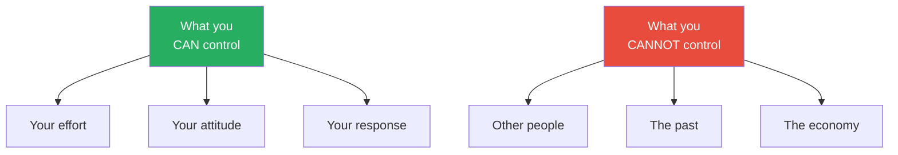

Morin's message is simple: put all your energy into the green box (things you can control) and stop pouring energy into the red box (things you cannot).

- The Stoic connection Morin doesn't make explicit but that runs through this chapter:
  - This is essentially the [[Discourses - Epictetus|Stoic dichotomy of control]] — focus on what's "up to you" (your judgements, desires, actions) and accept what isn't
  - [[Man's Search for Meaning - Viktor Frankl|Viktor Frankl's]] central insight — "the last of human freedoms" is choosing your attitude — is the same principle applied under extreme conditions
  - The difference is that Morin provides clinical case studies rather than philosophical arguments, making the concept accessible to people who would never pick up Epictetus
- The connection between control and anxiety — the clinical evidence:
  - Morin cites research showing that people who try to control uncontrollable variables experience significantly higher rates of anxiety and depression
  - The mechanism is straightforward: if you believe you should be able to control something and you can't, you experience helplessness — and helplessness is one of the primary precursors to depression
  - The paradox is that releasing control over uncontrollables actually reduces helplessness — because you stop failing at an impossible task
  - James felt less anxious after his therapy breakthrough, not because his custody situation improved, but because he stopped trying to control something that was never within his power
  - The anxiety had been generated not by the situation itself but by the gap between what he was trying to control and what he could actually control
  - Closing that gap — by shrinking his control attempts to match his actual control — eliminated the source of the anxiety
  - This is counterintuitive: most people think anxiety comes from not controlling enough; Morin shows it often comes from trying to control too much

---

### Chapter 5: They Don't Worry About Pleasing Everyone

*Morin draws a critical distinction: giving away your power (Chapter 2) is about letting others control how you feel — people-pleasing is about trying to control how others feel about you.*

> [!example] Megan's "Yes" Problem
> - Megan, a married mother of two with a part-time job, also taught Sunday school, led a Girl Scout troop, and babysat for her sister for free
> - Church members called Saturday nights asking her to bake muffins for Sunday; her cousin called constantly for favours
> - Her number-one rule: "Never say no to family"
> - But saying yes to extended family meant she wasn't home for dinner or bedtime with her own children
> - Her biggest fear: "People will think I'm selfish" — but in therapy, she realised that her people-pleasing was the selfish act, because it was about being liked, not about helping
> - The irony was devastating: her "selfless" behaviour was driven by the entirely self-focused desire to be seen as a good person
> - Morin encouraged her to simply say "No, I'm not able to do that" — no excuse, no explanation
> - The more she practised, the easier it became — and people didn't react as badly as she'd feared
> - In fact, some people respected her more after she started saying no — the boundary signalled that her time had value
> **The lesson:** Your fear of someone's negative reaction is almost always worse than their actual reaction.

- <b style="color: #e74c3c">People-pleasing is a form of control</b> — you're trying to manage other people's perceptions of you
- It comes from confusing "being a good person" with "making everyone happy"
- The costs are severe and compounding:
  - You lose sight of your own values and goals — they get replaced by other people's expectations
  - You build resentment toward the people you're trying to please — resentment that leaks out sideways
  - You teach people that your boundaries don't matter — and they learn the lesson well
  - You rob yourself of time and energy for the things you care about most
  - Your relationships become transactional — people come to you when they need something, not because they value you
  - Eventually, you can't distinguish your own preferences from other people's expectations
  - The resentment is particularly corrosive because it targets the wrong person — you resent the person who asked, when you should be examining why you said yes
- The psychological mechanism behind people-pleasing:
  - It often stems from childhood conditioning — children learn that love is conditional on compliance
  - The child who was praised for being "easy" or "no trouble" internalises the message: my worth depends on making others comfortable
  - This becomes an adult pattern: any discomfort in someone else triggers an automatic need to fix it
  - Over time, the people-pleaser loses the ability to distinguish between genuine generosity and fear-driven compliance
  - The internal experience is exhausting: constant scanning of other people's moods, constant adjustment of your own behaviour, constant anxiety about whether you've done enough
  - Morin distinguishes between two types of people-pleasers: those who want to be liked (the more common type) and those who want to avoid conflict (the more hidden type) — both are driven by fear, but the second type is harder to identify because their compliance looks like agreeableness

- The cognitive distortions that fuel people-pleasing:
  - **Mind reading:** "They'll think I'm selfish if I say no" — assuming you know what others will think, usually in the worst possible light
  - **Catastrophising:** "If I decline, they'll never speak to me again" — imagining the worst possible outcome of a boundary
  - **Personalisation:** "She looks upset — I must have done something wrong" — assuming that other people's moods are caused by you
  - **All-or-nothing thinking:** "Either I'm completely helpful or I'm a terrible person" — no middle ground between total compliance and total rejection
  - **Emotional reasoning:** "I feel guilty, so I must be doing something wrong" — treating the emotion of guilt as evidence of wrongdoing
  - Each distortion has the same effect: it inflates the perceived cost of saying no while deflating the perceived cost of saying yes
  - Morin works with people-pleasing clients to identify which distortions are active and to challenge them with evidence: "Has anyone actually stopped speaking to you because you said no to one request?"
  - The answer is almost always: "No — but it feels like they would"
  - The gap between the feared consequence and the actual consequence is the people-pleaser's most powerful insight — and closing that gap is the core of the therapeutic work

---

> [!example] Herb Kelleher's "We Will Miss You" Letter
> - Southwest Airlines founder Herb Kelleher received a complaint letter from a frequent flyer who was unhappy about the airline's lack of assigned seating, first class, and meals
> - Rather than trying to please this one customer at the expense of Southwest's business model, Kelleher simply wrote back: "We will miss you"
> - He understood that trying to please everyone would mean pleasing no one — and would destroy the very thing that made Southwest successful
> - Southwest's consistent identity — low fares, no frills, friendly service — made it one of the most profitable airlines in history
> - Kelleher's three words accomplished what most companies never manage: a clear statement of who they were and who they weren't for
> - The genius of the response was its brevity — no defensiveness, no explanation, no attempt to persuade; just a clear statement of position
> **The lesson:** Knowing who you're not for is just as important as knowing who you are for.

- The spectrum of people-pleasing — from mild to severe:
  - **Mild:** saying yes to social invitations you don't want to attend — costing you an evening but not your identity
  - **Moderate:** taking on extra work at the office because you don't want your boss to think you're not a team player — costing you evenings, weekends, and family time
  - **Severe:** changing your beliefs, appearance, or goals to match what someone else wants — Megan's territory, where the pleaser loses the ability to identify their own preferences
  - **Extreme:** staying in an abusive relationship because leaving would make the other person unhappy — the most dangerous form, where people-pleasing becomes self-destruction
  - Most of Morin's clients fall in the moderate range — they're not in abusive situations, but they're systematically sacrificing their own needs for other people's comfort
  - The progression from mild to severe is gradual and often invisible: each individual "yes" is small, but they accumulate into a lifestyle of compliance
- The real cost of people-pleasing shows up in lost identity:
  - You lose track of who you actually are and what you stand for
  - You build invisible resentment toward the very people you're trying to please
  - You teach others that your time and boundaries are negotiable
  - You sacrifice deep relationships (family, spouse) for shallow approval from acquaintances
  - Eventually, you can't distinguish your own preferences from other people's expectations — Megan couldn't remember what she actually wanted to do on Saturday nights
  - Morin asks clients a simple diagnostic question: "If you knew no one would judge you, what would you do differently?" — the gap between their answer and their current behaviour reveals the scope of their people-pleasing
- <b style="color: #27ae60">The difference between being kind and being a pushover:</b>
  - Kind people choose to help because it aligns with their values
  - Pushovers agree to help because they fear the consequences of saying no
  - The same action — baking muffins for church — can be either one, depending on the motivation behind it
  - The test: if you would resent doing it, your "yes" is not kindness — it's capitulation
  - And the resentment always leaks: it comes out as irritability with your spouse, impatience with your kids, or passive-aggressive comments to the very person you're trying to please

---

- A 2008 study in the *Journal of Experimental Psychology* found that people have significantly more willpower when making choices on their own terms versus trying to please someone else
  - If you're only doing something to make someone else happy, you'll struggle to sustain it
  - Genuine motivation comes from alignment with your own values
  - This explains why people-pleasers often burn out despite appearing productive — their productivity is externally driven, which is far more exhausting than internally driven effort
  - The willpower depletion is real and measurable — every "yes" that conflicts with your values drains the same pool of self-regulation resources that you need for everything else in your life
- Morin's practical guidance for recovering people-pleasers:
  - Start with low-stakes refusals — say no to a minor request before tackling a major one
  - Give yourself permission to disappoint people — their discomfort is their responsibility, not yours
  - Notice the gap between feared reaction and actual reaction — it's almost always smaller than you expected
  - Remember: every yes to someone else is a no to something in your own life — the question is whether that trade-off is one you'd consciously choose
  - Track your yeses for a week — write down every request you agree to, and next to each one, write what you gave up to do it

> [!abstract] How to Say No
> 1. Be direct: "No, I'm not able to do that"
> 2. Don't offer excuses — excuses invite negotiation
> 3. Don't apologise — you haven't done anything wrong
> 4. If pressed, repeat: "I understand, but I'm not able to"
> 5. Accept that some people will be disappointed — that is their right
> 6. Remember that a clear no is kinder than a resentful yes

- The Megan–Kelleher parallel is important:
  - Megan said yes to everyone and lost her evenings with her own children
  - Kelleher said no to one customer and built one of the most successful airlines in history
  - Both had the same choice: please everyone and lose your identity, or be clear about who you are and accept that some people won't like it
  - The connection to [[Essentialism - Greg McKeown|Essentialism]] is direct — "If you don't prioritise your life, someone else will"
- Morin's five-step recovery plan for chronic people-pleasers:
  - **Week 1:** Simply notice — without trying to change anything, count how many times you say yes when you want to say no
  - **Week 2:** Say no to one low-stakes request — something where the consequences of refusal are minimal
  - **Week 3:** Notice the gap between your feared reaction and the actual reaction — keep a written record
  - **Week 4:** Say no to a medium-stakes request — something that matters to you but won't destroy a relationship
  - **Week 5 and beyond:** Gradually increase the stakes — the muscle gets stronger with use, just like any other muscle
  - The key principle: start so small that failure is almost impossible, then build gradually
  - Morin found that most clients could say no to low-stakes requests within a week — and were surprised at how little pushback they received
  - The people who pushed back the hardest were usually the ones who had benefited most from the people-pleasing — and their resistance said more about them than about the boundary-setter
- The relationship between people-pleasing and the other chapters:
  - People-pleasers give away their power (Chapter 2) by making their mood dependent on others' approval
  - People-pleasers avoid change (Chapter 3) because change might displease someone
  - People-pleasers avoid calculated risks (Chapter 6) because risk might lead to failure, and failure might lead to criticism
  - People-pleasers expect instant results (Chapter 13) — they want the new boundary to feel comfortable immediately, and when it doesn't, they retreat
  - The habit is deeply interconnected with the rest of the thirteen — which is why it's often one of the hardest to break

> [!tip] Core Insight
> Saying no to one thing always means saying yes to something else. The question is whether you're saying yes to what matters most to you — or to what matters most to someone else.

---

### Chapter 6: They Don't Fear Taking Calculated Risks

*Morin reveals how our emotional "fear metres" are wildly miscalibrated — and that most people avoid risk not because the risk is too high, but because their fear feels too big.*

> [!example] Dale's Part-Time Furniture Business
> - Dale had taught high school shop for nearly 30 years and dreamed of opening a furniture business
> - His wife rolled her eyes and called him a dreamer; a past real estate investment that lost money made him terrified of financial risk
> - In therapy, Dale's entire demeanour changed when he talked about furniture — his face lit up, his body language shifted from slumped to energised
> - The breakthrough: Dale didn't have to quit teaching to start a business — he could build furniture on nights and weekends, sell online, and only expand if there was demand
> - He had been framing the decision as binary — teach OR build furniture — when the actual decision was teach AND test furniture
> - Once he started making furniture part-time, something unexpected happened: he enjoyed teaching shop again, because his business reignited his passion
> - The binary framing is one of the most common risk-assessment errors Morin encounters — people see only two options (all in or do nothing) when there are usually intermediate positions that reduce risk while preserving upside
> **The lesson:** Risk doesn't have to be all-or-nothing. Finding ways to reduce the downside often makes the upside accessible.

- Morin distinguishes between two types of risk-avoidance that she sees in therapy:
  - **Catastrophic thinking:** imagining the worst possible outcome and treating it as the most likely outcome — "If I start a business, I'll go bankrupt and lose my house and my wife will leave me"
  - **Black-and-white framing:** seeing only two options (total risk or no risk) when a spectrum of intermediate options exists — Dale's "quit teaching or give up the dream" is the classic example
  - Both are cognitive distortions — errors in thinking that feel like clear-eyed realism
  - Catastrophic thinking overestimates the probability of the worst case; black-and-white framing underestimates the number of available options
  - Most of Morin's risk-averse clients have both: they imagine the worst case AND they see no middle ground — which makes any risk feel suicidal
  - The therapeutic intervention is to challenge both: "What's the actual probability of the worst case?" AND "What options exist between all-in and doing nothing?"
  - Dale needed both: he needed to see that furniture-making wouldn't bankrupt him (challenging the catastrophe) AND that he could start part-time (challenging the binary)
- <b style="color: #e74c3c">We base risk decisions on emotion, not logic</b> — and our emotional assessments are deeply flawed:
  - We incorrectly judge how much control we have (driving feels safer than flying, but the odds of dying in a car crash are 1 in 5,000 vs. 1 in 11 million in a plane)
  - We overcompensate when safeguards exist (people speed more when wearing seatbelts; safety features correlate with higher accident rates)
  - We confuse skill with chance (gamblers throw dice harder when they need a high number — as if force could influence probability)
  - We grow comfortable with familiar risks (daily speeding stops feeling risky because it's routine)
  - We're influenced by media coverage that distorts actual risk levels — shark attacks get headlines; heart disease does not
  - We fall prey to the availability heuristic — if we can easily recall an example of something going wrong, we overestimate its likelihood
  - We let one bad experience calibrate our entire risk tolerance — Dale's single real estate loss made him treat all financial risk as catastrophic

---

- The psychology behind risk aversion:
  - <b style="color: #2980b9">Loss aversion</b> — losing $100 feels roughly twice as painful as gaining $100 feels good
  - This means we need the potential gain to be approximately double the potential loss before a risk feels "worth it"
  - But this emotional calculus is often wrong — it systematically overweights unlikely downsides and underweights likely upsides
  - Morin's point is not that you should ignore risk — it's that you should evaluate risk with logic, not with the fear response that evolved to protect you from predators, not from career changes
  - Dale's one bad real estate investment made him treat ALL future risks as equally dangerous — his emotional risk meter was stuck on the reading from that single bad experience
  - The brain generalises from bad experiences: one failure with money becomes "all money risks are dangerous," just as one rejection becomes "all social risks are dangerous"
  - This generalisation was useful when we lived on savannas — one encounter with a predator near a watering hole correctly generalised to "all watering holes might have predators" — but it's profoundly unhelpful in a modern context where the risks are financial, social, and emotional rather than physical
- Five cognitive biases that distort risk assessment:
  - **Negativity bias** — bad experiences register more strongly than good ones; one failed investment overshadows ten successful ones
  - **Anchoring** — the first risk-related number you hear becomes your reference point, regardless of its accuracy; a friend who lost $50,000 sets your anchor even if your risk is $500
  - **Confirmation bias** — once you've decided something is risky, you selectively notice information that confirms that assessment and ignore evidence to the contrary
  - **Status quo bias** — the current situation feels safe simply because it's familiar, regardless of whether it's actually good; Andrew's low-paying job felt safer than change, despite being objectively insufficient
  - **Sunk cost fallacy** — "I've already invested too much to change now" keeps people in bad situations long past the point where leaving would be rational
- Morin notes that awareness of these biases doesn't eliminate them — but it allows you to compensate for them:
  - When you notice negativity bias, deliberately list positive outcomes alongside negative ones
  - When you notice anchoring, seek multiple data points instead of relying on one story
  - When you notice status quo bias, quantify the cost of inaction (Andrew's $200/month shortfall)

> [!example] Albert Ellis and the 130 Women
> - Albert Ellis, later named the "greatest living psychologist" by Psychology Today, was incredibly shy as a young man and terrified of rejection
> - He went to a local botanical garden every day for a month and sat next to any woman sitting alone on a bench, forcing himself to start a conversation within one minute
> - He found 130 opportunities: 30 women got up and walked away immediately; he talked to the remaining 100 and asked each on a date
> - One said yes — but she didn't show up
> - Ellis didn't despair — the exercise proved he could tolerate rejection, which later influenced his development of Rational Emotive Behaviour Therapy (REBT)
> - His key insight: the problem was never rejection itself — it was his catastrophic beliefs about what rejection meant
> - The 130-woman experiment became a foundational story in REBT: evidence that our beliefs about events, not events themselves, cause our suffering
> - What makes the story powerful is the scale: 130 attempts, zero success — and Ellis emerged from the experiment more confident, not less
> **The lesson:** The cure for fear isn't the absence of failure — it's the discovery that failure won't destroy you.

> [!abstract] Calculating Risk Properly
> 1. What are the potential costs — financial, emotional, social?
> 2. What are the potential benefits?
> 3. How does this risk help me achieve my bigger goals?
> 4. What are the alternatives between "all in" and "do nothing"?
> 5. What's the best-case scenario and how would it impact my life?
> 6. What's the worst-case scenario and how could I reduce the chance it happens?
> 7. How much will this decision matter in five years?
> 8. Am I evaluating this with logic or with fear?

- The "five-year test" (question 7) is one of Morin's most powerful practical tools:
  - Most risks that feel enormous in the moment are trivial in a five-year frame
  - Will you remember the embarrassment of a failed speech in five years? Probably not
  - Will you remember the regret of never giving the speech? Almost certainly
  - Dale's furniture business: in five years, would he regret trying and failing, or would he regret never trying at all?
  - The five-year test reframes the question from "What if this goes wrong?" to "What will I regret not having attempted?"
  - Morin finds that regret for inaction almost always outweighs regret for action — we regret the risks we didn't take far more than the ones we did
  - The five-year test also reduces catastrophising: "This will ruin my life" becomes "Will this matter in five years?" — and the answer is usually no
  - Research on deathbed regrets confirms Morin's observation: people overwhelmingly regret risks not taken, words not spoken, and paths not explored — not the failures they experienced along the way
  - The five-year test harnesses this insight proactively: instead of waiting until the end of life to realise you should have taken more risks, ask the question now and act accordingly
  - Ellis's 130-woman experiment: the rejection hurt in the moment, but in five years (and for the rest of his career), what mattered was the insight it produced, not the pain it caused
  - Morin notes that almost every client who takes a calculated risk — even one that fails — reports being glad they tried; the regret of inaction is almost always worse than the pain of a failed attempt

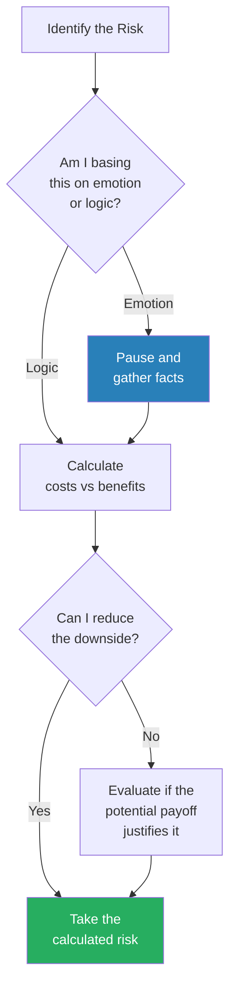

This flowchart captures Morin's core message about risk: separate emotion from logic, then look for ways to reduce the downside before deciding.

- The concept of "risk tolerance" as a trainable skill:
  - Most people treat risk tolerance as fixed — "I'm just not a risk-taker"
  - Morin argues it's more like a muscle: the more small risks you take, the more comfortable you become with uncertainty
  - Ellis's 130-woman experiment is the extreme version of this: he didn't start by asking someone out — he started by sitting next to a stranger, then by speaking, then by asking
  - Each successful toleration of a small risk builds the capacity for a slightly larger one
  - Dale didn't quit his job to start a business — he started by building furniture on evenings and weekends
  - Morin's graduation speech wasn't the first time she'd spoken in public — but it was the biggest, and the mitigation strategy (friends who would cheer) reduced the perceived risk enough to make it tolerable
  - The principle: you don't build risk tolerance by taking one big risk — you build it by taking many small ones and surviving each one
  - This is essentially the same mechanism as exposure therapy for phobias: graduated, repeated exposure reduces the fear response over time
  - The person who avoids all risk never builds tolerance; the person who takes small risks regularly builds tolerance that eventually makes big risks manageable
- The distinction between calculated risk and gambling:
  - Calculated risk involves research, planning, and risk mitigation — Dale researching online selling, building a portfolio, testing demand
  - Gambling involves emotion, hope, and no mitigation — buying a lottery ticket, making an impulsive investment, quitting your job with no plan
  - The first is a skill; the second is a wish
  - Morin notes that many people confuse the two: they either avoid all risk (treating every decision as a gamble) or take reckless risks (treating every gamble as a calculated decision)
  - The seven-step risk evaluation framework she provides is the tool for distinguishing between the two

---

> [!example] Morin's Valedictorian Speech
> - As valedictorian, Morin was required to give a graduation speech — but she was incredibly shy and rarely spoke in class
> - Her biggest fear wasn't the speech itself — it was the silence afterward: she imagined finishing her speech to dead silence, hundreds of faces staring blankly
> - She devised a plan with friends: they would stand up and cheer after her speech, no matter what
> - On graduation day, her voice cracked through the entire speech — but when she finished, her friends leapt up in a standing ovation, and the crowd followed
> - Was the ovation earned? "Maybe. Probably not. And to this day, that part doesn't really matter to me"
> - What mattered was that she identified her biggest fear (silence) and found a way to mitigate it (friends who would cheer) — the rest took care of itself
> - This is risk mitigation in its simplest form: you don't eliminate the risk — you eliminate the worst-case scenario
> **The lesson:** You don't have to eliminate all risk — you just have to identify your biggest fear and find a way to mitigate it.

> [!example] Othmar Ammann — Career Change at 60
> - Ammann worked as chief engineer and later director of engineering at the Port Authority of New York — a prestigious position by any measure
> - But he had always dreamed of becoming an architect — designing the structures, not just engineering them
> - At sixty years old, he left his secure job and opened his own firm
> - He went on to design some of America's most impressive bridges, including the Verrazano-Narrows and the Delaware Memorial
> - He continued creating masterpieces until he was eighty-six
> - His most celebrated work came after the age most people retire — because he was willing to take the calculated risk that every well-meaning friend told him was foolish
> - The "well-meaning friends" factor is one Morin highlights repeatedly: the people who discourage your risks are usually projecting their own fears, not assessing yours
> **The lesson:** At an age when most people avoid risk entirely, Ammann took the calculated risk that defined his legacy.

- The relationship between risk and the other chapters:
  - Fear of risk connects to fear of change (Chapter 3) — the same emotional overreaction to uncertainty drives both
  - Risk aversion connects to people-pleasing (Chapter 5) — fear of social disapproval stops people from taking chances
  - Risk aversion connects to giving up after failure (Chapter 10) — past failures inflate the emotional weight of future risks
  - The connection to [[Thinking in Bets - Annie Duke|Thinking in Bets]] is direct: Duke's "resulting" problem — judging decisions by outcomes rather than process — is precisely the error Morin describes when people let one bad investment prevent all future risk-taking
- <b style="color: #27ae60">The middle path between recklessness and paralysis:</b>
  - Reckless people take risks without evaluating them — they confuse impulsivity with courage
  - Paralysed people evaluate risks endlessly without taking them — they confuse analysis with prudence
  - Mentally strong people evaluate risks honestly, mitigate what they can, and then act — they accept residual uncertainty as the price of growth
  - Dale found the middle path: not quitting his job (reckless), not giving up his dream (paralysed), but testing the dream part-time (calculated)

---

### Chapter 7: They Don't Dwell on the Past

*Morin uses her own grief to illustrate the seductive pull of the past — and shows that dwelling is not the same as remembering, reflecting, or mourning.*

This is the most personal chapter in the book, and the one where Morin's authority as both therapist and griever is most visible. She describes her own struggle with clinging to Lincoln's memory — keeping his toothbrush for two years, arranging his belongings exactly as he left them — with an honesty that strips away the clinical veneer. The chapter's power comes from this dual perspective: Morin knows intellectually that dwelling is destructive (she taught it to clients daily), but she experienced firsthand how irresistible the pull of the past can be when the loss is catastrophic. Her argument is not that remembering is bad — it is that remembering with the intent to relive is different from remembering with the intent to learn, and the distinction makes all the difference between healing and stagnation.

> [!example] Gloria and Her Enabled Daughter
> - Gloria, 55, blamed herself for being a bad mother — too much drinking and dating after her divorce, not enough parenting
> - Her adult daughter, 28, had moved back in at least a dozen times and was now unemployed, watching TV all day, not even cleaning up after herself
> - Gloria tolerated it all because she felt she "owed" her daughter for the childhood she didn't provide
> - In therapy, Gloria began to see that her guilt-driven enabling was actually *continuing* her bad parenting rather than making amends for it
> - The guilt had created a perverse logic: "I was a bad parent, so I owe her — and the way I pay that debt is by letting her live without consequences"
> - She set rules: her daughter could stay only if she actively looked for work, and within two months she'd need to pay rent
> - Within weeks, her daughter had a job — and was talking about career aspirations for the first time
> - Gloria's insight: "The only thing worse than being a bad parent for eighteen years would be to be a bad parent for another eighteen years"
> - The daughter's rapid transformation proved something Gloria hadn't expected: her daughter was capable — she had simply never needed to be, because Gloria's guilt ensured she was never required to try
> **The lesson:** Guilt about the past doesn't earn you permission to make bad decisions in the present. The best apology for yesterday's mistakes is today's better choices.

- The difference between Gloria's dwelling and productive guilt:
  - Productive guilt leads to corrective action: "I was a bad parent, so I'll be a better one now"
  - Dwelling guilt leads to enabling: "I was a bad parent, so I'll let her do whatever she wants to make up for it"
  - The first uses the past as fuel for improvement; the second uses the past as justification for worse behaviour
  - Gloria's therapy was not about forgiving herself — it was about redirecting her guilt from destructive penance (enabling) to constructive repair (setting boundaries that actually helped her daughter grow)
  - The daughter's rapid transformation was the evidence Gloria needed: good parenting was still available to her — she just had to stop using guilt as an excuse to avoid it
- Morin's own experience with dwelling:
  - After Lincoln died, she wanted to freeze everything in time — his clothes hung the same way, his books in the same order
  - She thought that if she studied his belongings long enough, she'd learn something new about him and create new memories even though he was gone
  - <b style="color: #e74c3c">It took her two years to throw away Lincoln's toothbrush</b> — she knew he didn't need it, but throwing it away felt like betrayal
  - She eventually recognised that the past was where Lincoln lived, but staying stuck there while the world moved forward would prevent her from ever being happy again
  - "As a therapist I help people work on their rational thinking, but grief brought on a lot of irrational thoughts"
  - Her honesty about her own struggle is what gives this chapter its weight — she is not prescribing from a position of mastery but describing a battle she fought and nearly lost
  - The toothbrush became a symbol: a small, irrational attachment that represented the larger struggle of releasing the past without erasing it
  - She eventually remarried — Steve — and credits her willingness to release the past with making that new relationship possible; if she had remained frozen in Lincoln's memory, she would have closed the door on future love

---

- <b style="color: #e74c3c">Dwelling is not the same as reflecting</b> — and the distinction matters:
  - **Reflection** asks: "What can I learn from this?" — it leads to insight and action
  - **Dwelling** asks: "Why did this happen to me?" — it leads to the same loop of regret on repeat
  - Reflection moves you forward; dwelling keeps you circling
  - The test: if you've thought about the same event more than three times without generating any new insight, you're dwelling, not reflecting
  - Reflection has a natural endpoint — once the lesson is extracted, the emotional charge fades
  - Dwelling has no endpoint — each repetition refreshes the emotional charge, keeping it as raw as the original experience
  - Morin sees this distinction constantly in therapy: clients come in saying they're "processing" an event, but when she asks what they've learned, they have nothing new — they've been replaying, not reflecting
  - The "processing" label is itself a trap: it gives dwelling a therapeutic-sounding name that legitimises the loop
  - Genuine processing produces diminishing emotional intensity — each time you think about the event, it hurts a little less, because you're integrating it into your broader life narrative
  - Dwelling produces stable or increasing emotional intensity — each replay hurts the same or more, because you're re-opening the wound without stitching it
  - Morin's clinical test for clients: "On a scale of 1-10, how painful was this event the first time you thought about it? And how painful is it now?" — if the number hasn't decreased, you're dwelling; if it has decreased, you're processing

| Dwelling | Reflecting |
|---|---|
| "Why did this happen to me?" | "What can I learn from this?" |
| Replays the same scene over and over | Examines the scene once for lessons |
| Produces more pain with each cycle | Produces clarity that reduces pain |
| Keeps you trapped in the past | Connects the past to future action |
| Feels productive but changes nothing | Actually generates insight |
| The emotional intensity stays the same or increases | The emotional intensity gradually decreases |
| Identity: "I am defined by what happened" | Identity: "I am shaped by how I responded" |
| Time orientation: backward only | Time orientation: backward to extract, then forward to apply |
| Outcome: paralysis | Outcome: action informed by experience |

This comparison reveals why dwelling is so dangerous — it mimics productive thought while actually locking you into a repetitive loop.

- The biological basis of dwelling:
  - Rumination activates the brain's default mode network — the same system that activates during productive self-reflection
  - This is why dwelling feels productive: it uses the same neural circuitry as genuine reflection
  - But the output is different: reflection produces insight (new neural pathways), while dwelling reinforces existing patterns (deepening existing grooves)
  - Morin compares it to a record player: reflection moves the needle forward through the song; dwelling keeps the needle stuck in the same groove, playing the same few seconds over and over
  - The brain cannot distinguish between a real threat and a remembered one — every time you replay a painful event, your stress response activates as if it's happening right now
  - This means dwelling is not just emotionally costly — it is physiologically expensive; your body pays the full price of the original stress every time you replay it
  - Over months and years, this chronic re-activation contributes to the inflammatory markers and health consequences Morin cites

- Common forms of past-dwelling:
  - Replaying embarrassing moments and imagining saying something different — the "staircase wit" phenomenon, where you think of the perfect response hours or days too late
  - Romanticising "the good old days" to escape present problems — distorting the past to make the present seem worse
  - Punishing yourself for mistakes you can no longer fix
  - Using guilt as penance — "If I feel bad long enough, I'll have earned forgiveness"
  - The 40-year-old former quarterback who still wears his varsity jacket — using past glory to avoid present mediocrity
  - Constantly retelling the same story of how someone wronged you — each retelling deepens the groove rather than healing it
  - Keeping physical artifacts as anchors to a time that no longer exists — Morin's toothbrush, Gloria's guilt, the quarterback's jacket

---

- Why dwelling is destructive at a physiological level:
  - You miss the present while replaying the past
  - You can't plan for the future when your mind is stuck in history
  - Romanticising "the good old days" distorts both past and present
  - A 2013 University of Ohio study found that ruminating on negative events increases inflammation in the body — linked to heart disease, cancer, and dementia
  - Dwelling becomes a self-reinforcing cycle: sad thoughts trigger sad mood trigger more sad thoughts
  - Cortisol levels spike during rumination, keeping the body in a chronic stress state even though no current threat exists
  - Sleep quality deteriorates because the brain replays events during the transition to sleep, creating insomnia or restless sleep
  - The inflammation finding is particularly alarming: dwelling doesn't just hurt your mood — it damages your physical body through the same inflammatory pathways associated with serious disease
- The four types of past-dwelling Morin identifies in clinical practice:
  - **Regret dwelling:** "If only I had done X differently" — focused on decisions you wish you could unmake
    - The antidote: acknowledge the decision was the best you could make with the information you had at the time — hindsight is not a fair judge of past decisions
  - **Grudge dwelling:** "I can't believe they did that to me" — focused on someone else's actions
    - The antidote: recognise that the grudge punishes you, not them — and choose forgiveness as an act of self-liberation (Chapter 2)
  - **Nostalgia dwelling:** "Things were so much better back then" — focused on an idealised past
    - The antidote: recognise that memory is selective — you're comparing the highlights of the past to the full experience of the present, which is inherently unfair
  - **Guilt dwelling:** "I'm a terrible person for what I did" — focused on moral self-punishment
    - The antidote: separate the act from the identity — you made a bad decision, but that doesn't make you a bad person; make amends where possible, then move forward
    - Gloria's case was guilt dwelling: her guilt about being a bad mother kept her stuck in behaviour that made her a worse mother
  - Each type requires a different intervention, but all four share the same diagnostic test: "Am I learning anything new from this repetition? If not, I'm dwelling."

> [!example] Morin's Two-Year Toothbrush
> - After Lincoln died, Morin kept his toothbrush in the bathroom for two years
> - She knew it was irrational — he wasn't coming back to use it
> - But throwing it away felt like throwing away the last proof that he had existed — as if the toothbrush was a thread connecting her to him
> - Every morning she saw the toothbrush and it triggered both comfort (he was still "here") and grief (he wasn't)
> - The day she finally threw it away was not a breakthrough — it was one small step in a long process of releasing the past without erasing it
> - She learned the difference between preserving a memory (looking at photos, telling stories) and clinging to an artifact (keeping the toothbrush as if he might return)
> - "I could honour Lincoln's memory without preserving every trace of his physical presence in our home"
> - The toothbrush is the most humanising detail in the entire book — a licensed therapist, an expert on grief, held onto a toothbrush for two years because the heart does not follow the brain's rules
> **The lesson:** There is a difference between honouring someone's memory and living in their ghost. The first is healthy; the second traps you.

- <b style="color: #27ae60">The antidotes to dwelling:</b>
  - Set a time limit for reflection — 20 minutes, then move to action or distraction
  - Write down the lessons learned, then close the notebook — the act of writing externalises the thought, reducing its hold on you
  - Change your physical environment when you notice the loop starting — take a walk, call a friend, do something with your hands
  - Seek professional help if you can't stop on your own — Morin is clear that some forms of dwelling require therapy, not just willpower
  - Create a "what I learned" summary for significant past events — once you've captured the lesson, you have permission to release the event itself
  - Practice the "redirect" technique: when you catch yourself dwelling, don't try to suppress the thought (suppression makes thoughts stronger); instead, redirect attention to a current task that requires focus
  - The redirect works because the brain has limited attentional bandwidth — if you fully engage with a present-moment task, there isn't room for the past-dwelling loop
  - The more you practice redirecting, the faster the brain learns to do it automatically — just like reframing language (Chapter 2), the new response eventually replaces the old one

> [!abstract] The Dwelling Interruption Protocol
> 1. Notice: "Am I reflecting or dwelling?" — use the test: have I learned anything new since last time?
> 2. If dwelling, acknowledge it without judgement: "I'm stuck in a loop"
> 3. Write down any new insight — if there is none, write "No new insight — this is dwelling"
> 4. Redirect: choose a task that requires active attention (cooking, exercise, conversation)
> 5. If the loop returns within an hour, repeat — the brain learns through repetition, not through a single successful interruption
> 6. If you can't break the loop after multiple attempts, schedule a therapy session — persistent dwelling may need professional intervention
  - Ask the reflection test: "Have I learned anything new since the last time I thought about this?" — if the answer is no, you're dwelling
- The connection to other chapters:
  - Dwelling on the past feeds self-pity (Chapter 1) — "look what happened to me"
  - Dwelling blocks the ability to embrace change (Chapter 3) — "things were better before"
  - Dwelling prevents learning from mistakes (Chapter 8) — dwelling replays the pain without extracting the lesson
  - The Stoic perspective from [[Discourses - Epictetus|Epictetus]] applies: the past is among "things not up to us" — spending energy on it is by definition wasted

> [!tip] Core Insight
> Self-reflection is healthy. Dwelling is destructive. The difference: reflection leads to learning and action. Dwelling leads to the same loop of regret playing on repeat.

---

### Chapter 8: They Don't Make the Same Mistakes Over and Over

*Morin argues that mistakes are inevitable — but repeating them is a choice, and a costly one. The difference between people who grow and people who stagnate is not the number of mistakes they make, but whether they study those mistakes afterward.*

> [!example] Reshma's Pattern of Wrong Partners
> - Reshma came to therapy after yet another failed relationship — her third in five years, each ending the same way
> - She kept choosing partners who were emotionally unavailable or manipulative
> - In therapy, she discovered a pattern: she was attracted to men who reminded her of her emotionally distant father — the challenge of "earning" their love felt familiar and exciting
> - Once she identified the pattern, she could interrupt it — not by avoiding relationships, but by being aware of what was pulling her toward the wrong ones
> - She began choosing partners based on values and behaviour rather than emotional familiarity
> - The shift was not instant — she had to catch herself several times when the old attraction pattern surfaced — but awareness made the pattern visible, and visibility made it manageable
> - Morin notes that Reshma's pattern is one of the most common she sees in therapy: people confuse emotional intensity (which dysfunction creates) with genuine connection (which stability creates)
> **The lesson:** You can't break a pattern you haven't identified. The first step to stopping repeated mistakes is recognising that they are, in fact, repeated.

- <b style="color: #27ae60">Studying your mistakes is the only way to stop repeating them</b>
- The fundamental challenge is that mistakes are painful, and the brain's natural response to pain is avoidance:
  - Physical pain teaches you not to touch the hot stove again — simple, one-time learning
  - But psychological pain is more complex — the brain often avoids the analysis that would extract the lesson, because the analysis itself is painful
  - The result: the lesson goes unlearned, and the same mistake recurs in a slightly different form
  - Reshma's three failed relationships were the same mistake wearing different faces — she didn't see the pattern because each relationship looked different on the surface
  - The pattern was only visible at the level of emotional dynamics, not at the level of surface details
- Most people fail to learn from mistakes because:
  - They don't take full responsibility (blame external factors) — "the market crashed" rather than "I invested without doing due diligence"
  - They don't study what specifically went wrong — they move on too quickly, eager to escape the discomfort
  - They make excuses rather than examining patterns — "it was bad timing" or "that person was the problem"
  - They lack a written record of past decisions and outcomes — memory is unreliable, especially for painful events
  - They move on too quickly, eager to escape the discomfort of the mistake
  - They confuse "feeling bad about it" with "learning from it" — guilt is not the same as analysis
  - They focus on the emotional aftermath rather than the decision that preceded it — "I felt terrible when it failed" is not the same as "here is what I would do differently"
  - They overgeneralise: "I'm bad at this" instead of identifying the specific variable that went wrong — the generalisation protects the ego (it's a character flaw, not a correctable error) but prevents growth

- The role of ego in repeated mistakes:
  - Morin identifies ego as the single biggest obstacle to learning from mistakes
  - Admitting "I made a mistake" requires tolerating a temporary blow to self-image
  - Most people would rather repeat the mistake indefinitely than endure that blow
  - This creates a paradox: the person trying hardest to protect their self-image (by avoiding admission of error) is the person most likely to damage it (by repeating the same visible mistakes)
  - Lucas (Chapter 12) couldn't learn from his workplace mistakes because his MBA-fuelled ego prevented him from admitting he had anything to learn
  - Reshma couldn't learn from her relationship mistakes because admitting her attraction pattern was dysfunctional meant admitting something uncomfortable about her relationship with her father
  - In both cases, the ego's need for protection blocked the analysis that would have prevented recurrence
  - Morin's clinical strategy: she doesn't ask clients to lower their ego — she asks them to separate their identity from their decisions; "I made a bad choice" is very different from "I am a bad person," and learning to maintain that distinction is the key to studying mistakes without shame spiralling

- The five levels of mistake analysis — from shallow to deep:
  - **Level 1: "I failed."** No analysis, just the label — this is where most people stop
  - **Level 2: "I failed because..."** Assigns a cause — often an external one ("the market crashed")
  - **Level 3: "I contributed to the failure by..."** Takes partial responsibility for the outcome
  - **Level 4: "The specific decision I made was... based on the reasoning that... which turned out to be wrong because..."** Full forensic analysis of the decision process
  - **Level 5: "The pattern I notice across multiple similar failures is... and the underlying belief driving this pattern is..."** Identifies the systemic cause, not just the proximate one
  - Most people operate at Level 1 or 2 — which produces no useful learning
  - Reshma needed to reach Level 5 to break her relationship pattern: it wasn't about this boyfriend or that boyfriend (Level 1-2); it was about her attraction to emotional unavailability (Level 5), which was rooted in her childhood experience with her father
  - The deeper the analysis, the more generally applicable the lesson — and the less likely the mistake is to recur in a different form

- The distinction between a mistake pattern and bad luck:
  - Some people genuinely do experience bad luck — and telling them to "study their mistakes" is unhelpful if the problem wasn't their decision
  - Morin's test: if the same type of problem keeps happening in different contexts (different jobs, different relationships, different cities), it's probably a pattern, not bad luck
  - If the same type of problem happens once, it might be bad luck or a one-time error
  - The person who has been fired from three jobs "because every boss was terrible" is almost certainly contributing to the pattern — the variable that remains constant across all three situations is them
  - The person who was laid off once due to a corporate restructuring may genuinely have experienced bad luck
  - Reshma's three failed relationships followed the same emotional dynamic despite involving different men in different circumstances — the common variable was her attraction pattern
  - Hershey's three failures involved different cities and different markets — but the common variable was his business skill gaps, which he systematically addressed
  - The question to ask: "What is the common element across all my similar failures? And is that element me?"
  - If the answer is yes, you have a pattern — and patterns can be changed

---

> [!example] Milton Hershey's Three Failures
> - Milton Hershey failed at his first candy business in Philadelphia after six years
> - He failed again in New York City
> - He failed a third time in Chicago
> - Each time, he studied what went wrong and applied the lessons to his next venture
> - In Philadelphia, he learned about manufacturing and the importance of recipe quality
> - In New York, he learned about market positioning and the challenge of competing in a saturated market
> - In Chicago, he learned about distribution and the need for a loyal workforce
> - Finally, he returned to Pennsylvania and created a milk chocolate formula that became the foundation of the Hershey Chocolate Company — one of the most successful candy businesses in history
> - He even supported a former employee, H.B. Reese, who started a competing candy company in the same town — their companies eventually merged, and Reese's Peanut Butter Cups remain one of Hershey's most popular products
> - Each city taught him something the previous one hadn't — the failures were not random; they were cumulative education
> **The lesson:** Hershey didn't just fail three times — he learned three times. Each failure contained information that made the next attempt better.

- Morin's framework for learning from mistakes involves four steps:
  - **Acknowledge** the mistake without making excuses — "I messed up" not "it wasn't my fault"
  - **Identify** what went wrong and why — be specific about the decision, the reasoning, and the outcome
  - **Create a written plan** for how to handle a similar situation differently — writing forces precision that mental reflection cannot
  - **Review past mistakes** before making major decisions — your mistake log is your most valuable reference
- The emphasis on writing is important:
  - Morin finds that her clients who write down their mistakes and lessons learn significantly faster than those who only think about them
  - Writing forces specificity — "I made a bad investment" becomes "I invested $5,000 in a stock I didn't research because my coworker recommended it and I didn't want to seem unsophisticated by asking questions"
  - The second version contains actionable lessons; the first does not
  - The written record also serves as evidence against the brain's tendency to minimise or distort past mistakes — you can't gaslight yourself when the facts are on paper

> [!abstract] Questions to Ask After a Mistake
> 1. What went wrong?
> 2. What could I have done better?
> 3. What can I do differently next time?
> 4. What did I learn from this that I didn't know before?
> 5. Is there a pattern in my mistakes that I need to address?
> 6. What was I feeling when I made the decision — and was that feeling a reliable guide?

- Why people repeat mistakes — the deeper psychology:
  - **They don't accept responsibility** — blaming external factors means you never identify what *you* did wrong; if the problem is always "out there," you never examine what's "in here"
  - **They don't study the mistake** — they move on too quickly, eager to forget the discomfort; but discomfort is information, and ignoring it wastes the lesson
  - **They make excuses** — "it was bad timing" or "that person was the problem" prevents learning; excuses are a form of self-protection that blocks growth
  - **They lack a written record** — without documentation, it's easy to forget the lessons; memory is unreliable, especially for painful events, which the brain naturally wants to suppress
  - **They confuse the emotion with the lesson** — feeling terrible about a mistake is not the same as understanding why it happened; guilt without analysis is just suffering without growth
  - **They generalise incorrectly** — "I'm bad at relationships" instead of "I tend to choose partners who are emotionally unavailable because the intensity feels like connection"

---

- <b style="color: #27ae60">The key difference between a mistake and a repeated mistake:</b> the first time is a learning opportunity; the second time is a choice
- Morin's "decision autopsy" technique for clients:
  - After any significant mistake, conduct a formal review — not a guilt session, but a forensic analysis
  - **What was the decision?** State it precisely — "I invested $5,000 in a stock I hadn't researched" not "I made a bad investment"
  - **What information did I have at the time?** Be honest about what you knew and didn't know
  - **What was I feeling when I made the decision?** Was the decision driven by fear, excitement, peer pressure, or genuine analysis?
  - **What would I do differently with the same information?** This question separates bad decisions from bad luck — if you wouldn't change anything, the outcome was bad luck; if you would, the outcome was a bad decision
  - **What's the specific lesson?** Not a vague lesson like "be more careful" but a specific one like "don't invest in stocks I haven't researched for at least two weeks, regardless of who recommends them"
  - **Where does this lesson apply elsewhere?** The specific lesson about stock research might generalise to "don't make major financial decisions based on other people's enthusiasm"
  - The decision autopsy takes 15-20 minutes and produces more learning than months of guilt
  - The key discipline: do the autopsy within 48 hours of recognising the mistake, while details are fresh — delayed autopsies are corrupted by memory distortion
- The connection to other chapters:
  - Dwelling on the past (Chapter 7) is about reliving mistakes without learning from them — the emotional replay without the analytical extraction
  - Studying mistakes is about extracting the lesson and then moving forward — the person who dwells replays the same scene endlessly; the person who studies watches it once, takes notes, and applies them
  - This also connects to Chapter 10 (giving up after failure) — studying your mistakes is what makes it possible to try again intelligently rather than just persistently
  - And to Chapter 1 (self-pity) — the person who feels sorry for their mistakes is not the same as the person who learns from them

> [!example] Reshma's Written Pattern Log
> - After identifying her pattern with emotionally unavailable partners, Reshma started keeping a journal of her relationship decisions
> - Before each date, she wrote down what attracted her to the person — and checked whether the attraction matched her old pattern or her new criteria
> - She noticed that "mysterious and hard to read" — traits she once found exciting — were actually code for "emotionally unavailable"
> - Over six months, she became skilled at distinguishing genuine interest from familiar dysfunction
> - The journal didn't just help her avoid bad relationships — it helped her recognise and appreciate good ones
> - She eventually entered a relationship with someone she initially found "boring" — but boring meant "emotionally available and consistent," which turned out to be exactly what she needed
> - The transformation was not about willpower — it was about changing the information she used to make decisions
> **The lesson:** A written record transforms vague awareness into actionable pattern recognition.

> [!tip] Core Insight
> The difference between a mistake and a repeated mistake is a written record and five minutes of honest analysis. Most people skip both because the discomfort of examining failure feels worse than the cost of repeating it.

---

### Chapter 9: They Don't Resent Other People's Success

*Morin exposes resentment as a disguised form of insecurity — and shows that celebrating others' success is not generosity but strategy.*

> [!example] Dan's Neighbourhood Envy
> - Dan lived in an affluent neighbourhood but earned less than his neighbours — a single-income family in a dual-income world
> - He drove a nicer car than he could afford, bought his kids designer clothes, and hosted lavish barbecues — all to keep up appearances
> - His wife had chosen to be a stay-at-home parent, a decision they both valued — but Dan began resenting the neighbours whose dual incomes allowed bigger houses and nicer cars
> - His resentment leaked into every area: he argued with his wife about money, was irritable at the barbecues he was spending too much to host, and spent beyond his means to maintain an illusion
> - In therapy, Dan realised he'd lost sight of his own definition of success — spending time with family and raising kids according to his values
> - Once he stopped comparing himself to neighbours and started comparing himself to his own goals, his resentment dissolved
> - The irony: by his own definition of success — engaged parenting, strong family values — he was already more successful than many of the neighbours he envied
> - The barbecues stopped being lavish and started being enjoyable — because he was no longer performing affluence but actually spending time with people he liked
> **The lesson:** You can't resent someone else's success if you're clear about what success means to you.

- <b style="color: #2980b9">Resentment stems from two sources:</b>
  - **Insecurity** — when you feel bad about yourself, someone else's success magnifies your shortcomings; their achievement becomes a mirror reflecting what you haven't done
  - **Unclear values** — when you don't know what you want, you covet whatever others have (even contradictory things); Dan envied the neighbour with the big house AND the friend who quit to travel — because he hadn't decided what success meant to him
- The mechanism of resentment is a comparison loop:
  - Step 1: You observe someone else's success
  - Step 2: You compare their achievement to your current situation
  - Step 3: You conclude that you've fallen behind — that their success highlights your failure
  - Step 4: Rather than using their success as motivation, you resent it — because motivation requires admitting you need to change, and resentment lets you blame the unfairness of the world instead
  - Step 5: The resentment consumes mental energy that could be directed at your own goals
  - Step 6: Your own progress slows because your mental energy is being consumed by resentment
  - Step 7: The next comparison is even more unfavourable, because you've fallen further behind — and the cycle deepens
  - Dan was trapped in this loop: the more he resented his neighbours, the more energy he wasted on maintaining appearances instead of building genuine satisfaction, which made the gap between his life and theirs feel even wider
- Research evidence for how resentment works:
  - A 2013 study, "Their Pain, Our Pleasure: Stereotype Content and Schadenfreude," found that people took more pleasure in a "rich professional" getting splashed by a taxi than in any person receiving good fortune — all based on stereotypes
  - A 2013 "Envy on Facebook" study found that people felt the most anger and resentment when friends shared vacation photos, leading to an overall decline in life satisfaction
  - The more time spent on social media, the stronger the effect — passive browsing (looking without posting) was worse than active engagement
  - The schadenfreude finding is particularly revealing: we don't just resent others' success — we actively enjoy their misfortune, especially when their success triggers our insecurity
  - Morin notes that schadenfreude is the toxic endpoint of unchecked resentment: first you envy their success, then you track their life for signs of failure, then you feel pleasure when you find them
  - This progression — from envy to tracking to pleasure in misfortune — is the resentment habit at its worst, and it happens so gradually that most people don't notice it until they catch themselves smiling at someone else's bad news
  - The awareness itself is often the wake-up call: "I just felt happy that my coworker's project failed — what kind of person am I becoming?"
  - Morin uses that moment of self-recognition as a therapeutic entry point: the discomfort of realising you've become the kind of person who enjoys others' failure is powerful motivation to change
  - The antidote is not to suppress the schadenfreude but to redirect the energy: "What would I gain from their failure? Nothing. What would I gain from studying their success? Potentially a lot."
  - This redirection — from passive consumption of others' misfortune to active study of their success — is the essence of Morin's prescription for resentment

---

- The social media dimension amplifies the problem:
  - People post curated highlights, not daily reality
  - You compare your behind-the-scenes to everyone else's highlight reel
  - The more time spent on social media, the more opportunities for unfavourable comparison
  - The comparison is inherently unfair — you're comparing your worst moments with other people's best presentations
  - This creates a distorted baseline: you think everyone else is doing better than they actually are, which makes your own progress seem inadequate
  - Morin notes that this isn't just about social media — the same dynamic plays out in neighbourhoods (Dan's story), workplaces, and even families
  - The remedy is not to avoid social media but to notice when comparison is happening and redirect attention to your own definition of success

- How resentment becomes self-reinforcing:
  - When you resent someone's success, you unconsciously begin to root for their failure — and you start tracking their life for evidence of problems
  - This tracking consumes mental bandwidth that could be directed at your own goals
  - Your own progress slows because your attention is divided
  - You then have more reason to resent — the gap between your progress and theirs has widened
  - The cycle accelerates: more resentment, more tracking, less progress, more gap, more resentment
  - Dan's barbecue spending is a perfect example of this cycle in action: money spent performing success for neighbours was money not invested in the family activities that actually defined his success
  - The exit from the cycle is always the same: define your own success, stop tracking others, redirect all energy to your own goals
  - The first few weeks are the hardest, because the comparison habit is deeply ingrained — Morin describes it as "withdrawal" from the comparison habit, with similar discomfort to any habit change

> [!example] Herb Brooks and the Miracle on Ice
> - In 1960, Herb Brooks was the last person cut from the U.S. Olympic hockey team — he watched his former teammates win the first men's hockey gold medal in U.S. history
> - Rather than expressing bitterness, Brooks approached the coach and said: "Well, you must have made the right decision — you won"
> - He continued playing, competing in the 1964 and 1968 Olympics, then became a coach
> - In 1980, he coached the U.S. Olympic team to the "Miracle on Ice" — a stunning upset of the dominant Soviet team
> - After the winning game, Brooks left the ice immediately so his players could celebrate without sharing the spotlight
> - His famous advice: "Write your own book instead of reading someone else's book about success"
> - The 20-year arc from being cut to coaching the greatest upset in Olympic hockey history is the longest-form example of turning resentment into fuel
> - Brooks could have spent 1960 to 1980 bitter about being the last cut — instead, he spent it preparing for an achievement that dwarfed the one he missed
> **The lesson:** The man who could have been destroyed by resentment chose cooperation over competition — and produced one of the greatest moments in sports history.

| Resentment Mindset | Growth Mindset |
|---|---|
| Their success diminishes me | Their success inspires me |
| Life is a zero-sum game | Success is abundant |
| I should have what they have | I should define my own goals |
| They got lucky | They worked hard — what can I learn? |
| Compete with everyone | Cooperate and learn from everyone |
| Comparison is how I measure myself | My own goals are how I measure myself |

Morin's key insight: when you stop viewing people as competitors and start viewing them as teammates, you gain access to their knowledge, motivation, and support.

- The zero-sum trap:
  - Resentment assumes life is a zero-sum game — their gain is your loss
  - But most of life is not zero-sum: your neighbour's promotion doesn't reduce your chances; your friend's happy marriage doesn't make yours less happy; your colleague's book deal doesn't prevent yours
  - The only domain where success is genuinely zero-sum is direct competition (only one person wins the gold medal) — and even then, Herb Brooks shows that losing in one competition can fuel winning in a bigger one
  - Morin observes that the most successful people she knows are the least prone to resentment — not because success made them generous, but because their generosity helped make them successful
  - When you celebrate someone's success, they remember — and the next time an opportunity arises, they think of you
  - When you resent someone's success, they sense it — and they avoid sharing opportunities with you
  - Resentment is not just emotionally corrosive; it is strategically counterproductive
  - Bookman's response to leaving Fusion-io before it became a billion-dollar company is the purest example: by celebrating his former colleagues' success rather than resenting it, he maintained relationships, preserved his reputation, and moved forward to new opportunities unburdened by bitterness
  - The counterfactual is easy to imagine: a bitter Bookman, spending years calculating how much money he "should have" made, alienating former colleagues, and poisoning future opportunities with the toxic energy of resentment
  - The version of Bookman that chose celebration over resentment is objectively better off in every measurable dimension — emotionally, socially, professionally, and probably financially
- The internal cost of resentment:
  - Every minute spent resenting someone else's success is a minute not spent building your own
  - Resentment is a form of passive time-wasting — it feels urgent (their success is a threat!) but produces nothing
  - Dan's hours spent envying neighbours were hours he could have spent enjoying his children — the very thing he defined as success
  - Morin draws the parallel: resentment is the emotional equivalent of staring at someone else's test during an exam instead of answering your own questions
- The counterintuitive practice Morin recommends: actively celebrating others' success
  - When someone gets a promotion, congratulate them genuinely — not performatively
  - When a friend's business succeeds, ask them what they learned and apply it to your own situation
  - When a competitor wins an award, study what they did right rather than what went wrong for you
  - This practice is uncomfortable at first — the resentment instinct is strong — but it produces two benefits:
    - It breaks the comparison loop by replacing resentment (passive, energy-draining) with learning (active, energy-generating)
    - It builds relationships with successful people who may become allies, mentors, or collaborators
  - Brooks exemplified this at the highest level: instead of resenting the team that cut him, he became one of the greatest coaches in the sport's history — and his players, not he, received the glory

---

- <b style="color: #27ae60">How to create your own definition of success:</b>
  - Imagine being at the end of your life looking back — what accomplishments would give you the greatest sense of peace?
  - Would those accomplishments involve money? Contributions to others? The family you built? The difference you made?
  - Write down your definition and revisit it when you feel the pull of comparison
  - Remember: Dan was miserable trying to match his neighbours' material wealth — he found peace when he remembered his definition of success was about time with his family
  - This echoes [[How Will You Measure Your Life - Clayton M. Christensen|Clayton Christensen's]] deathbed test — what will matter when you're looking back, and does your current behaviour reflect those priorities?
  - The exercise is simple but surprisingly difficult — most people have never formally defined what success means to them, which means they default to society's definition (money, status, possessions)

> [!abstract] Defining Your Own Success
> 1. Imagine yourself at 80, looking back — what three accomplishments would give you the most pride?
> 2. Write down your current definition of success — be honest about whether it's yours or borrowed from your parents, peers, or culture
> 3. Compare your daily behaviour with your definition — how much of your time is spent pursuing what you actually value?
> 4. When you feel resentment toward someone, ask: "Is their version of success actually what I want?"
> 5. Revisit your definition quarterly — it will evolve, and that's healthy

> [!example] Peter Bookman — Celebrating Success You Could Have Had
> - Bookman was the founder of the company that eventually became Fusion-io, a computer hardware firm whose clients included Facebook and Apple
> - After three and a half years building the business, investors told him they had a different vision — so Peter left
> - The company went on to become a billion-dollar business, earning the founders $250 million
> - Rather than resenting them, Peter feels happy for his former colleagues
> - "I don't see how their success robs me of anything. I am happy to have played my part"
> - He went on to other ventures, secure in the knowledge that their success and his were independent quantities
> - Most people in Bookman's position would have spent years calculating what they "lost" — he chose to calculate what he gained from the experience
> - The distinction is subtle but profound: resentment treats success as a fixed pie (their gain is your loss); maturity treats success as abundant (their gain and your gain are independent)
> **The lesson:** Other people's success doesn't subtract from yours — unless you let resentment convince you it does.

- The mechanism behind resentment and the connection to other chapters:
  - Resentment is a form of self-pity (Chapter 1) — "they have what I deserve"
  - Resentment involves giving away your power (Chapter 2) — someone else's achievement now controls your mood
  - Resentment is often fueled by dwelling on the past (Chapter 7) — "I should have done what they did back when I had the chance"
  - The antidote — defining your own success — requires the courage to take calculated risks (Chapter 6) toward your own goals rather than copying someone else's path
  - Resentment is also linked to entitlement (Chapter 12) — "I deserve what they have" is both a resentment statement and an entitlement statement

> [!tip] Core Insight
> Create your own definition of success. When you're tempted to resent others, remind yourself: their path is not your path, and their success doesn't diminish yours.

---

### Chapter 10: They Don't Give Up After the First Failure

*Morin challenges the belief that talent is innate and failure is final — showing that grit, deliberate practice, and self-compassion predict success far better than IQ or natural ability.*

This chapter is where Morin's clinical and personal experiences converge most powerfully. She has seen countless clients who gave up after a single failure — a failed diet, a failed relationship, a failed business — and constructed an entire identity around the belief that they were incapable. And she has experienced firsthand what it means to persist through compounding loss: her mother's death, Lincoln's death, Rob's diagnosis. The chapter's argument is not motivational — it is evidence-based and clinically grounded: the research on grit, deliberate practice, and self-compassion consistently shows that persistence predicts outcomes better than talent, and that the way you respond to failure matters more than whether you fail.

> [!example] Susan's Return to College
> - Susan had always wanted to be a teacher but dropped out of college halfway through her first semester — homesick, shy, and overwhelmed
> - She got a job as a school receptionist and spent years thinking she was "not college material"
> - A pattern emerged in therapy: whenever Susan failed at anything on the first attempt — making the basketball team, losing weight, learning guitar — she gave up permanently
> - She had constructed an identity around the belief that first-attempt failure meant permanent inability — "If I couldn't do it the first time, I was never going to be able to"
> - Morin showed her a headline about a woman earning her high school diploma at age 94 — Susan's "I'm too old" excuse collapsed
> - She discovered online classes that required minimal time away from family, enrolled part-time, and said she'd "found what was missing"
> - The breakthrough was not enrolling — it was dismantling the belief that one failure meant permanent inability
> - Susan's pattern of first-attempt surrender had cost her decades of potential growth — not because she lacked ability, but because she believed she lacked it
> **The lesson:** The belief "if I failed once, I'll fail again" is not evidence — it's a story you tell yourself. And stories can be rewritten.

- <b style="color: #27ae60">Key research findings about failure and persistence:</b>
  - **Deliberate practice > natural talent** — after 10 years of daily practice, people can surpass those with natural talent; after 20 years, many achieve world-class performance
  - **Grit > IQ** — perseverance and passion for long-term goals predict achievement more accurately than intelligence; Angela Duckworth's research at West Point showed that grit predicted who would survive "Beast Barracks" better than SAT scores, physical fitness, or leadership potential
  - **Self-compassion > self-esteem** — a 2012 study found students who took a compassionate view of their failure studied 25% longer and scored higher on retests than those who focused on bolstering self-esteem
  - **Praise for effort > praise for intelligence** — a 1998 study by Carol Dweck showed children praised for intelligence chose to look at lower-scoring tests (to feel better); children praised for effort chose higher-scoring tests (to learn)
  - The cumulative weight of this research points in one direction: the primary determinant of success is not what you start with but what you do after you fail

---

- The distinction between self-compassion and self-esteem is one of Morin's most important points:
  - Self-esteem says "I'm great" — it feels good but doesn't help you recover from failure
  - Self-compassion says "I'm human, and humans fail" — it doesn't feel as good but creates space for growth
  - People with high self-esteem but low self-compassion often crumble when they fail, because failure threatens their identity — "I'm great" cannot coexist with "I failed"
  - People with self-compassion treat failure as information, not identity — "I failed" is a statement about an event, not about who you are
  - This connects directly to [[Mindset - Carol S. Dweck|Carol Dweck's growth mindset]] — the fixed mindset treats failure as proof of inability; the growth mindset treats failure as evidence that you haven't mastered something *yet*
  - Morin finds self-compassion particularly challenging for high achievers — they've built their identity around success, so failure feels existentially threatening rather than merely inconvenient
- The practical difference between self-compassion and self-esteem in therapy:
  - **Self-esteem intervention after failure:** "You're still great! That failure doesn't define you! You're smart and capable!"
  - **Self-compassion intervention after failure:** "Everyone fails sometimes. This hurts, and that's normal. What can you learn from this, and what will you try differently next time?"
  - The first feels better in the moment but provides no path forward
  - The second hurts a little more but includes the seeds of recovery: normalisation (everyone fails), validation (it hurts), learning (what happened), and action (try differently)
  - Morin uses a simple exercise to illustrate the difference: ask clients what they would say to a friend who failed at something important
  - Almost universally, clients offer self-compassion to their friends: "It's okay, everyone fails, what can you learn from this?"
  - Then ask them what they say to themselves after a failure: "I'm such an idiot, I should have known better, why do I always mess things up?"
  - The gap between how they treat friends and how they treat themselves is the self-compassion deficit
  - The exercise itself is therapeutic: once clients see the gap, they can't unsee it, and the next time they fail, the memory of the exercise interrupts their self-criticism
  - Over time, the internal voice begins to sound more like the voice they use with friends — not because they're trying to be positive, but because they've recognised that their self-critical voice is applying a double standard
  - Morin observes that her clients who respond to failure with self-compassion recover faster and perform better on subsequent attempts than those who try to bolster their self-esteem
  - The self-esteem group spends energy defending their identity ("I'm not a failure!"); the self-compassion group spends energy solving the problem ("What went wrong?")
  - This exercise connects directly to Chapter 8 (repeating mistakes): the self-compassion response includes the analytical component ("What can you learn?") that the self-esteem response omits
  - Self-compassion is the emotional prerequisite for studying failure — you can't examine what went wrong while simultaneously defending against the implication that something is wrong with you
  - The combination of self-compassion (Chapter 10) and mistake analysis (Chapter 8) produces what Morin calls "productive failure" — failure that makes you better rather than just making you feel bad
  - Susan's decades-long paralysis was a self-esteem response to failure: one failure threatened her identity as a capable person, so she avoided all future tests rather than risk another identity threat
- The mechanism behind giving up:
  - A single failure creates a belief ("I'm not good at this")
  - The belief shapes future interpretation ("See? Failed again — I knew it")
  - The interpretation prevents future attempts ("Why bother? I'll just fail")
  - The lack of attempts ensures no improvement — confirming the original belief
  - This is a textbook self-fulfilling prophecy: the belief in failure creates the conditions for failure
  - Susan lived inside this prophecy for years: she believed she couldn't finish college, so she never tried again, which meant she never disproved the belief

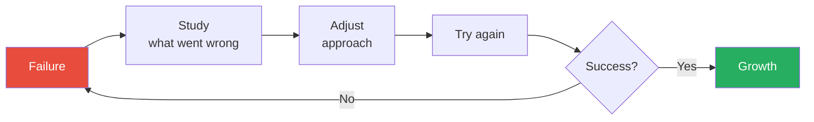

Morin's point: failure is not a dead end — it's a loop. Each iteration through the loop makes the next attempt better, as long as you study what went wrong.

- The cost of the "giving up" cycle:
  - Susan's pattern of first-attempt abandonment is extremely common — Morin estimates that a significant portion of her clients share it
  - The pattern is costly not just in terms of unrealised goals (Susan never became a teacher) but in terms of self-concept
  - Each time you give up, the internal narrative deepens: "I'm not someone who finishes things"
  - This narrative generalises: from "I can't do college" to "I can't do hard things" to "I'm not capable"
  - The generalisation is the real damage — it's not one abandoned goal that hurts; it's the identity that accumulates from multiple abandonments
  - Reversing the cycle requires the same mechanism in reverse: one small completion builds the narrative "I can finish things," which makes the next completion more likely
  - Susan's online classes were the beginning of a new identity: "I am someone who can learn" — an identity that would have been impossible to build while she was still operating under the old narrative
  - The connection to Chapter 8 (repeating mistakes) is direct: Susan was repeating the same mistake (first-attempt abandonment) without studying why she was doing it; once she identified the pattern (the belief that first failure equals permanent inability), she could interrupt it

---

> [!example] Walt Disney's Journey from Bankruptcy to Empire
> - Disney opened Laugh-O-Gram studios, which went bankrupt within a few years
> - He and his brother started Disney Brothers' Studio; a distributor stole the rights to their character Oswald the Lucky Rabbit — leaving them with nothing
> - They quickly created Mickey Mouse — but couldn't find a distributor until sound was incorporated into film
> - During the Great Depression, Disney's films generated huge revenue — he built Disneyland for $17 million, and it became a massive success
> - Disney won more Academy Awards than any other person in history
> - The character that built his empire — Mickey Mouse — was born from the ashes of the character that was stolen from him
> - Each failure contained the seed of the next success: the bankruptcy taught him about cash management; the Oswald theft taught him about intellectual property; the distribution struggles taught him about the power of innovation
> **The lesson:** The same cartoons that were rejected by everyone became the foundation of a billion-dollar corporation — because Disney refused to treat failure as final.

> [!example] Wally Amos — Famous Amos Cookies
> - Amos worked as a talent agent, sending homemade cookies to celebrities — friends urged him to open a cookie business
> - "Famous Amos" became wildly successful, earning him a presidential Award of Entrepreneurial Excellence
> - But as a high school dropout lacking business knowledge, the empire crumbled — he was forced to sell the company and lost his home to foreclosure
> - He tried to launch a new cookie company but was sued by the new owners for using his own name — imagine being told you can't use your own name on your own product
> - He renamed it "Uncle Noname" — it also failed, and he filed for bankruptcy
> - Finally, he opened a muffin company, this time leaving day-to-day operations to a partner with business expertise — he had learned, at last, that his genius was in recipes, not in management
> - When Keebler acquired Famous Amos, they hired him as spokesperson — and he gratefully returned
> - The arc of Amos's career illustrates Morin's argument perfectly: he didn't just persist — he persisted differently each time, applying the lessons from each failure to the next attempt
> **The lesson:** Amos didn't just fail — he failed spectacularly, multiple times, and each failure taught him something essential about what he needed to do differently.

---

- The cultural narrative about failure that Morin challenges:
  - Modern culture tells two contradictory stories about failure:
    - Story 1: "Failure is not an option" — you should avoid it at all costs
    - Story 2: "Fail fast, fail often" — Silicon Valley's mantra that glorifies failure as a badge of honour
  - Both are wrong, and Morin rejects both:
    - Avoiding failure entirely means avoiding risk, which means avoiding growth
    - Glorifying failure without studying it means repeating mistakes while feeling virtuous about it
    - The correct position: failure is inevitable, painful, and valuable — but only if you study it
  - Disney studied his failures and adjusted; Amos eventually studied his and adjusted; Susan never studied hers and spent decades stuck
  - The difference is not in the failure itself — everyone fails — but in the response to failure
  - Morin also notes that our culture's relationship with failure is gendered: men are often expected to brush off failure and try again quickly; women are often expected to take failure as evidence that they don't belong; both expectations are harmful, because neither allows for the careful study that makes failure useful
- The relationship between Chapters 8 and 10 is worth noting:
  - Chapter 8 is about *learning* from mistakes — the analytical side
  - Chapter 10 is about *persisting* despite mistakes — the emotional side
  - You need both: learning without persistence produces someone who understands failure but never tries again; persistence without learning produces someone who repeats the same mistake endlessly
  - The combination — studying failure AND trying again — is what Morin means by mental strength in the context of setbacks
  - Disney studied each failure and tried again; Amos eventually studied his failures and tried differently; Susan's problem was that she never tried again at all

- The relationship between failure and identity:
  - Morin observes that how you respond to failure reveals and shapes your identity:
  - **Fixed identity:** "I am my results" — success defines me as capable; failure defines me as incapable
    - This person avoids challenges, quits after failure, and interprets struggle as evidence of inadequacy
    - Susan lived in this identity: one failed semester defined her as "not college material" for decades
  - **Growth identity:** "I am my effort" — success is evidence of progress; failure is evidence of a gap to close
    - This person seeks challenges, studies failure, and interprets struggle as the process of learning
    - Disney lived in this identity: three business failures were three lessons that led to an empire
  - The shift from fixed to growth identity is one of the hardest psychological changes to make — because identity is the deepest layer of the self
  - Morin's approach: don't try to change the identity directly ("tell yourself you're a growth person"); instead, change the behaviour (study one failure), and let the identity follow the behaviour over time
  - This connects to Chapter 3's insight about cognitive change being the hardest type — identity change is cognitive change at its deepest level

| Giving Up Mindset | Persistence Mindset |
|---|---|
| Failure proves I can't do it | Failure shows me what to adjust |
| Talent is fixed at birth | Skill is built through practice |
| One failure = permanent inability | One failure = one data point |
| "I'm not smart enough" | "I haven't learned this yet" |
| Self-esteem: "I need to feel good" | Self-compassion: "I'm human, and humans fail" |
| Past failure predicts future failure | Past failure informs future approach |

This table maps directly onto Dweck's growth vs. fixed mindset framework — Morin arrives at the same conclusion from a clinical rather than academic direction.

> [!tip] Core Insight
> The most reliable predictor of success is not talent, IQ, or resources — it is the willingness to fail, study the failure, and try again. Self-compassion, not self-esteem, makes this possible.

---

### Chapter 11: They Don't Fear Alone Time

*Morin argues that our addiction to constant stimulation is not a sign of productivity — it is a sign that we're afraid of what we'll find when the noise stops.*

This is the chapter that most clearly bridges Morin's clinical work with the broader cultural conversation about attention, distraction, and the digital age. While she wrote the book before the full explosion of smartphone dependency, her observations about constant stimulation have only become more relevant. The chapter's central argument — that solitude is not a luxury but a cognitive necessity — is supported by neuroscience research on the default mode network and by her own clinical observations of clients who had systematically eliminated every quiet moment from their lives.

> [!example] Vanessa's Racing Mind
> - Vanessa, a successful real estate agent, stayed constantly busy — working, dining out, networking, using social media, listening to podcasts while cooking
> - She said she never had worrisome thoughts during the day, but at night her mind raced uncontrollably — a cascade of anxieties that kept her awake for hours
> - When Morin suggested her brain might need "processing time" during the day, Vanessa laughed — she didn't want to "waste one second not being productive"
> - She agreed to try journaling for 10 minutes before bed without any distractions — no TV, phone, or radio
> - Silence felt uncomfortable at first — she described it as "itchy" — but she noticed she fell asleep faster
> - She eventually added meditation each morning and found it became one of the highlights of her day
> - Her focus improved, she felt more organised, and her racing thoughts diminished significantly
> - The irony: by "wasting" 20 minutes a day on silence, she gained hours of productive time that had previously been lost to insomnia and distraction
> - Vanessa's word for the initial discomfort — "itchy" — perfectly captures what many people feel when they first sit with silence: not pain, but an urgent desire to reach for stimulation
> **The lesson:** A brain that never gets downtime processes everything at once when you finally stop — usually at 2 a.m.

- <b style="color: #2980b9">Being alone is not the same as being lonely</b>
  - Loneliness is about perceiving that no one is there for you — you can feel lonely in a crowded room
  - Solitude is a deliberate choice to be with your own thoughts
  - The distinction matters because many people avoid solitude by confusing it with loneliness
  - Loneliness is an involuntary state of disconnection; solitude is a voluntary state of reflection
  - A person who fears solitude is not afraid of being alone — they are afraid of being alone with themselves
  - The fear is often about what they'll discover: unresolved emotions, uncomfortable truths about their relationships or career, questions they've been avoiding by staying busy

| Loneliness | Solitude |
|---|---|
| Involuntary | Deliberate |
| Feeling disconnected from others | Feeling connected to yourself |
| Drains energy | Restores energy |
| Accompanied by sadness or anxiety | Accompanied by clarity and calm |
| You wish someone were there | You choose to be alone |
| The absence of connection | The presence of self-awareness |
| Can happen in a crowded room | Requires intentional separation |

This distinction is essential because people who fear solitude are actually afraid of themselves — and the more they avoid solitude, the less they know themselves, which increases the anxiety they feel when they are alone, which drives them to avoid solitude even more intensely.

---

- Why we avoid solitude:
  - Cultural messages: "Being alone = punishment" (time-outs, solitary confinement, being "left out")
  - The busy calendar as status symbol — the more plans you have, the more important you must be
  - Fear of uncomfortable thoughts — if you stop moving, you might have to think about things you've been avoiding
  - Productivity guilt — "sitting and thinking" doesn't produce tangible results and feels like laziness
  - The dopamine economy — phones, social media, and entertainment provide constant micro-rewards that make silence feel unbearable by comparison
  - Social pressure — telling people you spent Sunday afternoon alone can provoke concern rather than admiration
  - Morin notes a generational shift: younger clients find solitude almost unbearable, having grown up with constant digital stimulation as the norm — they've never experienced extended silence and have no framework for it
- The phone as the modern enemy of solitude:
  - Morin notes that the smartphone has eliminated the natural periods of solitude that previous generations experienced without trying
  - Waiting rooms, commutes, lunch breaks, walking between meetings — all were once moments of quiet processing
  - Now every gap is filled: scrolling, texting, watching, listening
  - The brain never gets its "idle time" — the processing gaps that used to happen automatically now have to be deliberately scheduled
  - Vanessa's nightly racing thoughts are the predictable result: a brain that was never given processing time during the day dumps everything at once when the phone is finally put down
  - Morin recommends what she calls "phone sabbaticals" — even 30 minutes a day without the phone can produce noticeable effects within a week
  - The initial discomfort is intense and predictable — clients describe feeling anxious, bored, restless, and physically uncomfortable during the first few phone-free sessions
  - The discomfort itself is diagnostic: the intensity of your reaction to being without your phone tells you how dependent on it you've become
  - A person who feels mild boredom has a healthy relationship with stimulation
  - A person who feels anxiety, restlessness, or the physical need to check their phone has developed a dependency that's actively suppressing their default mode network
  - Morin connects this to the concept of tolerance in addiction research: just as an alcoholic needs progressively more alcohol to achieve the same effect, a phone-dependent person needs progressively more stimulation to feel "normal" — and silence feels progressively more intolerable
  - The good news: the tolerance reverses quickly — within a week of regular phone sabbaticals, most clients report that silence has shifted from unbearable to neutral, and within a month, many actually look forward to their quiet time
  - The reversal mirrors the gratitude practice in Chapter 1: the brain that has been trained to scan for stimulation can be retrained to appreciate silence — and the retraining happens faster than most people expect
  - The discomfort fades within a week for most people — and is replaced by a calm alertness they hadn't experienced in years

- <b style="color: #27ae60">Research-backed benefits of solitude:</b>
  - Moderate alone time linked to fewer behavioural problems and lower depression in adolescents (1997 study)
  - Solitude at the office increases productivity — better performance than open workspaces and brainstorming sessions (2000 study)
  - Alone time increases empathy — constant social contact creates "us vs. them" thinking; solitude allows you to consider perspectives without the pressure of group dynamics
  - Solitude sparks creativity — many artists, writers, and musicians credit isolation for their best work
  - Solitary skills linked to increased happiness, life satisfaction, and stress management
  - The productivity finding is particularly relevant: the open-plan office trend — designed to increase collaboration — has actually decreased both productivity and satisfaction, because it eliminates the solitude that deep thinking requires

- The neuroscience behind the benefits:
  - The brain has a <b style="color: #2980b9">default mode network</b> that activates during quiet reflection
  - This network is responsible for consolidating memories, processing emotions, and generating creative insights
  - Constant stimulation suppresses this network — meaning your brain never gets to do its most important background work
  - This explains Vanessa's racing thoughts: her brain was saving all its processing for the one quiet moment in her day — bedtime
  - The parallel to [[Deep Work - Cal Newport|Deep Work]] is direct — Newport argues that the ability to concentrate deeply is becoming rare and therefore valuable; Morin argues that the ability to sit quietly with your own thoughts is becoming rare and therefore essential
  - The default mode network also plays a role in self-awareness — without activating it, you lose touch with your own internal state, which makes every other mental strength habit harder to practise

---

| Constant Stimulation | Deliberate Solitude |
|---|---|
| Brain never processes backlog | Brain consolidates and integrates |
| Creative insights suppressed | Default mode network activates |
| Racing thoughts at bedtime | Calmer transitions to sleep |
| Shallow relationships (quantity) | Deeper self-knowledge (quality) |
| Feels productive | Actually is productive |
| Self-awareness: low | Self-awareness: high |

This table captures the paradox: what feels productive (constant busyness) often produces less than what feels unproductive (quiet reflection).

- The surprising relationship between solitude and better relationships:
  - People who spend regular time alone tend to have deeper, more authentic relationships than people who are always socialising
  - The mechanism: solitude builds self-awareness, which builds emotional intelligence, which builds the capacity for genuine connection
  - The person who has never sat with their own thoughts doesn't know themselves well enough to be truly known by others — they present a curated version, which produces curated (shallow) relationships
  - The person who has done the work of self-examination can be authentic, which produces authentic (deep) relationships
  - Vanessa's relationships improved after she started meditating — not because meditation taught her social skills, but because it taught her who she actually was, which allowed her to stop performing and start connecting
  - Morin frames this as the hidden benefit of solitude: it looks antisocial but it actually enhances your capacity for genuine social connection
  - The connection to [[The Charisma Myth - Olivia Fox Cabane|The Charisma Myth]] is relevant: Cabane argues that presence — being fully engaged in the moment with another person — is the foundation of charisma; Morin argues that presence requires first being present with yourself, which requires solitude

> [!example] Wim Hof — The Iceman
> - Dutch middle-aged man nicknamed "The Iceman" for his ability to use meditation to tolerate extreme cold
> - Holds over 20 world records, including being immersed in ice for well over an hour
> - Has climbed Mount Kilimanjaro and run marathons in the polar circle wearing nothing but shorts
> - Attempted to hike halfway up Mount Everest in shorts before a foot injury stopped him
> - Skeptical researchers confirmed he maintains a consistent body temperature during meditation despite extreme cold exposure
> - He now teaches others how to control their own "thermostats" through meditation — a practice that begins with simply sitting quietly
> - Hof's story demonstrates the far end of what's possible when you master your relationship with your own mind — most people won't climb Kilimanjaro in shorts, but the underlying skill (mental control through solitude practice) is available to everyone
> **The lesson:** The connection between mind and body is far more powerful than most people realise — and meditation is the bridge.

> [!example] Dan Harris — Panic Attack to 10% Happier
> - Dan Harris, co-anchor of ABC's Nightline, had a panic attack live on the air — voice cracking, struggling to breathe, forced to cut the segment short
> - The attack was linked to his use of ecstasy and cocaine to self-medicate depression — a man who was never alone with his thoughts, even chemically
> - While reporting on religion, he was introduced to meditation and became unexpectedly captivated
> - He wrote *10% Happier*, acknowledging meditation didn't magically fix everything but improved his mood by 10 percent — an honest and refreshingly modest claim
> - His key line: "Until we look directly at our minds we don't really know what our lives are about"
> - Harris's story illustrates Morin's point perfectly: the man who ran hardest from his own thoughts was the one most transformed by finally sitting with them
> - The 10% framing is important: Harris doesn't oversell the benefits, which makes his endorsement more credible than those who promise meditation will transform your entire life overnight
> **The lesson:** The most important relationship you'll ever have is the one with your own mind — and it requires time alone to develop.

---

> [!abstract] Simple Meditation Steps
> 1. Sit in a relaxed position with a straight spine
> 2. Focus on your breath — feel each inhale and exhale
> 3. When thoughts enter your mind (they will), gently return focus to your breathing
> 4. Start with 5 minutes a day and gradually increase
> 5. Don't judge the quality of the session — showing up is the point
> 6. If sitting is too difficult at first, try walking meditation — the same practice, but while moving slowly

- Morin's practical progression for building a solitude practice:
  - **Week 1:** Turn off the radio in the car for one commute per day — just sit with silence
  - **Week 2:** Eat one meal alone without any screens — just you and the food
  - **Week 3:** Take a 15-minute walk without headphones — observe what your mind does
  - **Week 4:** Try 5 minutes of seated meditation — sit, breathe, notice thoughts without following them
  - **Beyond:** Gradually increase meditation duration and add journaling if it feels helpful
  - The key principle: start with situations where silence is merely uncomfortable, not unbearable
  - Most people fail at meditation because they start with 20-minute sessions and no preparation — like trying to run a marathon without training
  - Vanessa started with 10 minutes of journaling before bed — a form of solitude that includes an activity (writing), making the silence more tolerable
  - Only after building comfort with journaling did she progress to meditation — a form of solitude with no activity at all
  - The progression mirrors the Prochaska model from Chapter 3: precontemplation (silence is pointless), contemplation (maybe I should try it), preparation (turn off the radio in the car), action (begin journaling), maintenance (daily meditation practice)
  - Morin emphasises that any progression toward more solitude is progress — the goal is not to become a monk; it is to give your brain enough quiet time to do its processing work
  - Even five minutes a day of genuine silence — no phone, no music, no podcasts — is better than zero minutes, which is what most people currently provide
- The connection to other chapters:
  - Solitude is where you process the emotions that self-pity (Chapter 1) tries to avoid
  - Solitude is where you develop the self-awareness to stop giving away your power (Chapter 2)
  - Solitude is where you do the reflection that turns mistakes into lessons (Chapter 8) rather than dwelling (Chapter 7)
  - Without alone time, all thirteen habits are harder to break — because you never create the space to observe your own patterns
  - Solitude is the diagnostic tool: if you can't sit quietly with your own thoughts, that itself tells you something about which of the thirteen habits has the strongest grip on you
  - This chapter is arguably the operational prerequisite for all the others — without the self-awareness that solitude provides, you can't identify the patterns you need to change

> [!tip] Core Insight
> If you avoid solitude, you avoid yourself. Every other mental strength skill requires the self-awareness that only comes from spending time with your own thoughts.

---

### Chapter 12: They Don't Feel the World Owes Them Anything

*Morin shows that entitlement comes in two forms — superiority ("I'm special") and victimhood ("I've suffered enough") — and both prevent you from earning things on merit.*

This chapter addresses what Morin considers the most culturally reinforced of the thirteen bad habits. Modern Western culture — through participation trophies, "everyone is special" messaging, reality TV fame, and social media validation — actively cultivates entitlement. The result is a generation that has been told they deserve success without being taught that success must be earned. But Morin is careful not to make this only a generational argument — entitlement exists at every age, and her client Lucas represents the version that many older adults have as well: competence-based entitlement, where genuine skill is accompanied by the belief that skill alone entitles you to recognition without the relational work that recognition requires.

> [!example] Lucas the MBA Who Demanded a Promotion
> - Lucas, fresh out of his MBA programme, constantly offered unsolicited advice to coworkers with decades of experience
> - He scheduled a meeting with his boss to request a promotion — despite being new to the company and having not yet proven himself in any measurable way
> - His supervisor told him to "tone it down" or risk losing his job; HR recommended counselling
> - In therapy, Lucas created a list of behaviours his employer would want from the best employees — and realised he wasn't doing most of them (supporting others, showing respect, listening before advising)
> - He began reframing his thoughts: instead of seeing coworkers as "stupid," he told himself they "simply did things differently" — and that different didn't mean inferior
> - When he stopped forcing advice on people, they started seeking his opinion voluntarily
> - The shift was not immediate — his first instinct was still to correct people — but over time, the pause between impulse and action grew longer, and his reputation changed entirely
> - Lucas's MBA knowledge was genuine — the problem was never his competence but his belief that competence entitled him to recognition without the social capital that recognition requires
> **The lesson:** The fastest way to be valued is to start being valuable — not to demand that others recognise how valuable you think you are.

- <b style="color: #e74c3c">Entitlement operates through two channels:</b>
  - **Superiority entitlement:** "I'm special, talented, or educated — I deserve more than other people"
    - Often rooted in genuine competence — Lucas really did have useful knowledge from his MBA
    - But competence without humility produces arrogance, which repels the very people whose recognition you seek
    - The tragedy: entitled people often *are* talented, but their entitlement prevents them from deploying that talent in ways others value
    - Morin notes that superiority entitlement is often invisible to the person who has it — Lucas genuinely believed he was being helpful, not arrogant
  - **Victimhood entitlement:** "I've suffered enough — the world owes me compensation"
    - Often rooted in genuine suffering — Gloria (Chapter 7) really was a bad parent and really did owe her daughter better
    - But suffering doesn't earn you the right to make more bad decisions — it gives you the responsibility to make better ones
    - This form of entitlement turns real pain into a permanent exemption from effort
    - It is the intersection of self-pity (Chapter 1) and entitlement — "my suffering justifies my demands"
  - Both prevent you from earning things through merit and effort

---

- Jean Twenge's research on the narcissism epidemic identifies three drivers:
  - **Self-esteem programmes** that teach kids "you're all special" without connecting it to effort or behaviour — shirts that read "IT'S ALL ABOUT ME," constant reassurance of specialness regardless of achievement
  - **Overindulgent parenting** that shields children from consequences — kids get everything they want regardless of behaviour, never learn the connection between effort and reward
  - **Social media** that fuels self-promotional beliefs — "selfies" and self-promotional posts create an echo chamber of self-importance; likes and followers become a metric of worth
- Twenge's data is alarming:
  - The Narcissistic Personality Inventory scores among college students increased significantly between the 1980s and the 2000s
  - The trend correlates with the rise of participation trophies, self-esteem curricula, and social media
  - Morin does not argue that self-esteem is bad — she argues that unearned self-esteem is bad
  - There is a critical difference between "you can do anything if you work hard" (earned confidence) and "you're special just because you exist" (unearned entitlement)
  - The first creates motivation; the second creates expectation
  - The parenting connection is important: Morin sees entitlement as primarily a learned behaviour, not a personality trait
  - Children who are never told "no" grow into adults who can't tolerate hearing it
  - Children who receive trophies for showing up grow into adults who expect recognition for existing
  - Children whose parents solve every problem for them grow into adults who expect the world to solve their problems
  - The antidote is not harsh parenting — it's honest parenting: praising effort rather than identity, allowing natural consequences rather than rescuing, and teaching that "fair" doesn't mean "equal" or "easy"
  - Lucas's MBA programme taught him knowledge; his upbringing taught him that knowledge alone entitled him to status — the education was excellent; the conditioning was destructive
  - Lucas demonstrated both: his MBA gave him earned confidence in his knowledge, but his upbringing gave him unearned entitlement to recognition — and the second undermined the first
- The damage of entitlement is both personal and social:
  - You stop earning things on merit and start demanding them as rights
  - You make unrealistic demands in relationships — "I deserve to be cared for" without offering equal care in return
  - You lose the capacity for empathy — "Why donate to others when I deserve nice things for myself?"
  - You develop bitterness when reality doesn't deliver what you "deserve"
  - You confuse rights with privileges — "the right to be happy" becomes "the right to have everything go my way"
  - You repel the people and opportunities that could actually help you, because entitled behaviour is deeply unattractive
  - The bitterness compounds: each time the world fails to deliver what you feel you deserve, your sense of injustice grows — and so does your entitlement

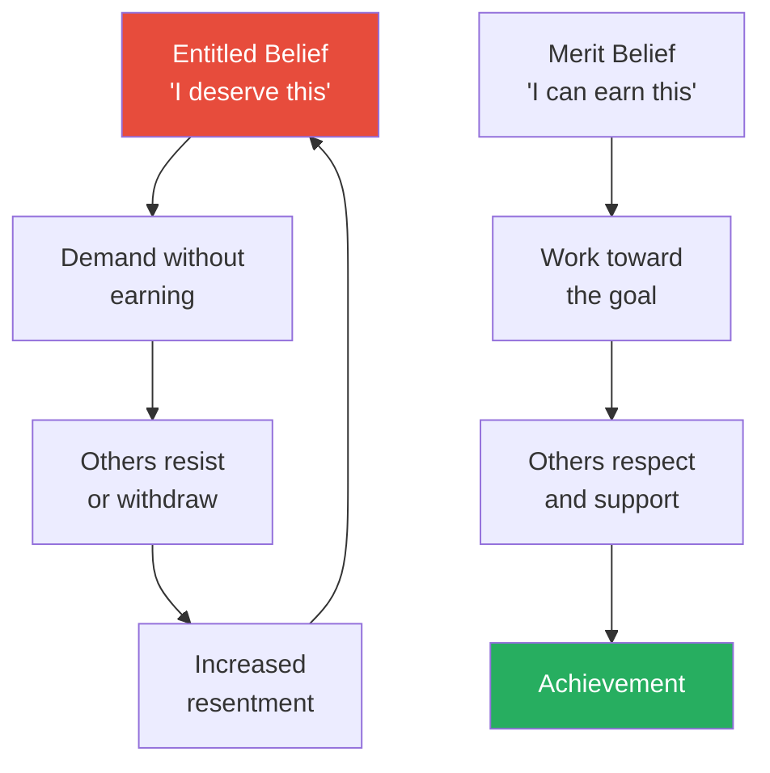

The entitled cycle is self-reinforcing: demand, resistance, resentment, more demands. The merit cycle is also self-reinforcing, but in a productive direction: effort, respect, achievement, more effort.

- The spectrum of entitlement — Morin's clinical observation:
  - **Mild:** expecting recognition for effort that doesn't produce results — "I worked so hard, I deserve a good grade" regardless of the quality of the work
  - **Moderate:** expecting exceptions to rules that apply to everyone else — "I shouldn't have to wait in line / follow that policy / meet that deadline"
  - **Severe:** expecting the world to compensate you for suffering — "After everything I've been through, I shouldn't have to deal with this"
  - **Extreme:** believing that rules simply don't apply to you — the "affluenza" case
  - Most of Morin's clients fall in the mild to moderate range — and most are unaware of their entitlement until she points out the pattern
  - The diagnostic challenge is that mild entitlement feels like fairness: "I worked hard — don't I deserve recognition?" sounds reasonable until you realise that entitlement lies in the word "deserve" — as if effort automatically entitles you to a specific outcome
  - Hard work increases your probability of a good outcome; it doesn't guarantee it; and the gap between "increases probability" and "guarantees" is where entitlement lives

---

> [!example] The "Affluenza" Defence
> - A Texas teenager killed four people in a drunk driving accident
> - His defence team argued he suffered from "affluenza" — meaning his wealthy upbringing prevented him from understanding that laws applied to him
> - The teenager received rehabilitation and probation but no jail time
> - The case became a lightning rod for the debate about whether society has become too tolerant of entitlement
> - Morin uses this as the extreme example of what happens when entitlement goes completely unchecked — when no one in a person's life ever says "the rules apply to you too"
> - The case also illustrates how entitlement can be enabled by the systems meant to hold people accountable — the court's acceptance of "affluenza" as a mitigating factor reinforced the very entitlement it was supposed to address
> **The lesson:** When entitlement goes unchecked, it can reach the point where people genuinely believe they are above the rules that govern everyone else.

- The connection to Chapter 1 (self-pity) is important:
  - Self-pity says "my situation is unfair" — entitlement says "therefore the world owes me compensation"
  - They are two sides of the same coin: one focuses on what happened, the other on what's owed
  - Breaking the self-pity habit (Chapter 1) makes it much harder for entitlement (Chapter 12) to take root
  - Gloria (Chapter 7) illustrates both: she pitied herself for being a bad mother AND felt entitled to her daughter's tolerance because of her guilt

> [!example] Sarah Robinson — "The Luckiest Woman Alive"
> - Sarah was diagnosed with a brain tumour at twenty-four and underwent surgery and chemotherapy for eighteen months
> - Instead of asking "Why me?", she focused on helping other cancer patients who were driving five hours each way for treatment — some were sleeping in their cars at Walmart parking lots
> - She pitched the idea of a hospitality house to her Rotary Club and worked tirelessly on the project, even getting up at night during chemo to work on it
> - She told her family: "I'm not leaving the party early, I'm getting there first"
> - Sarah died in December 2011 at age twenty-six — but her family raised nearly a million dollars and built "Sarah's House," a nine-room facility that never turns patients away
> - In her journal, as her husband had to dress her because she could no longer put on her own pyjamas, she wrote: "I'm the luckiest woman alive!!!"
> - The woman dying of cancer, who needed help getting dressed, called herself the luckiest woman alive — while healthy people around her complained about traffic and weather
> - Sarah's story is the book's most powerful argument against entitlement — not because it shames people for complaining, but because it shows what becomes possible when you replace "I deserve" with "I can give"
> **The lesson:** The woman who had every reason to feel the world owed her something spent her final months focused on what she could give to the world.

---

- The contrast between the affluenza teenager and Sarah Robinson is the most powerful juxtaposition in the book:
  - The teenager had everything and believed the world owed him even more — specifically, exemption from its rules
  - Sarah had a terminal diagnosis and believed she owed the world whatever she could still contribute
  - The teenager's response to privilege was entitlement; Sarah's response to suffering was generosity
  - The teenager's entitlement destroyed lives; Sarah's generosity built a shelter that continues to serve cancer patients years after her death
  - Morin does not make this comparison explicitly, but the reader cannot miss it — the two stories sit in the same chapter, and the contrast is devastating
  - The implicit question: which response do you want to model? And the answer is obvious, which is why the question has power
- <b style="color: #27ae60">The antidote to entitlement is a focus on what you can give, not what you're owed</b>
  - This doesn't mean being a doormat (Chapter 5) — it means replacing "I deserve" with "I will earn"
  - It means recognising that life isn't fair AND that this unfairness doesn't exempt you from effort
  - Sarah Robinson is the ultimate counterexample to entitlement — she had every justification for feeling owed, and she chose giving instead
  - The distinction between generosity (Chapter 5 territory) and anti-entitlement: a people-pleaser gives to be liked; a mentally strong person gives because it aligns with their values
  - Lucas learned this distinction: when he stopped demanding recognition and started earning it, recognition came naturally — proving that the merit path is not just morally superior but practically more effective
- How to test yourself for entitlement — Morin's diagnostic questions:
  - Do you believe you've paid your dues and shouldn't have to prove yourself anymore?
  - When something doesn't go your way, is your first reaction "that's unfair" rather than "what can I do differently?"
  - Do you find yourself thinking "I should be further along by now" compared to peers?
  - Do you believe that if people really understood how talented you are, they'd give you more opportunities?
  - Do you feel that your suffering — past trauma, difficult childhood, health problems — entitles you to special treatment?
  - If you answer yes to three or more, you may be operating from an entitlement framework without realising it
  - The diagnostic is valuable because entitlement is often invisible to the person who has it — Lucas genuinely believed he was being helpful, not arrogant; Gloria genuinely believed she was being generous, not enabling

> [!tip] Core Insight
> Life isn't fair. Your problems aren't unique. You aren't more deserving than anyone else. These aren't harsh truths — they're liberating ones, because they free you from waiting for the world to deliver and push you toward creating what you want.

---

### Chapter 13: They Don't Expect Immediate Results

*Morin concludes with the habit that undermines all the others: the expectation that change should happen quickly, easily, and without discomfort.*

Morin places this chapter last deliberately — it is the meta-habit, the one that determines whether any of the other twelve changes will stick. You can identify your self-pity pattern (Chapter 1), learn the language of empowerment (Chapter 2), and understand the stages of change (Chapter 3) — but if you expect these changes to produce results in days rather than months, you'll abandon all of them before they've had time to work. Impatience is the number one reason her therapy clients relapse: they do the work for a few weeks, don't see dramatic transformation, and conclude the process doesn't work. The process works — it just works slowly, and slowly is something modern culture has made almost intolerable.

> [!example] Marcy and the $1,000/Week Weight-Loss Shakes
> - Marcy arrived at therapy expecting to be "fixed" within a session or two — she was surprised when Morin suggested they'd need multiple sessions over several months
> - She revealed she'd been paying $1,000 a week for weight-loss shakes because she wanted fast results
> - When Morin asked whether she'd change her eating habits if the shakes worked, Marcy said no — she just wanted a quick solution that didn't require effort or discomfort
> - This pattern repeated across her life: she expected instant results without doing the underlying work
> - The $1,000 weekly spend was itself a symptom — she was willing to pay any price to avoid the slow, uncomfortable process of genuine change
> - The shakes weren't just a weight-loss product — they were an attempt to buy her way out of the discomfort that real change requires
> - Morin notes that the weight-loss industry is built on this pattern: sell the promise of instant results to people who are unwilling to endure the slow process that actually works
> **The lesson:** There are no shortcuts that skip the work. Products and programmes that promise instant results exploit the gap between what you want and what you're willing to do.

- Morin's observations about the instant-results industry:
  - Diet pills, get-rich-quick schemes, weekend seminars that promise transformation, apps that guarantee fluency in a new language in 30 days — all exploit the instant-results expectation
  - The business model is simple: promise fast results, charge premium prices, and rely on customers blaming themselves when the product fails ("I must not have followed the programme correctly")
  - The customer's self-blame is the business's protection — no one demands a refund for their own perceived inadequacy
  - Marcy's $1,000 shakes are the extreme version, but Morin sees the same pattern at every price point:
    - The $30 book that promises "change your life in 7 days"
    - The $200 supplement that promises rapid weight loss
    - The $5,000 seminar that promises business success in 90 days
  - In each case, the promise is the same: transformation without the discomfort that transformation requires
  - Morin's clinical response: "If it were that easy, everyone would do it — and the fact that the product exists proves that the problem is common, which proves that easy solutions don't work"
  - The irony: the money spent on instant solutions could fund the slow, genuine changes that actually produce results — Marcy's $4,000/month on shakes could have paid for a nutritionist, a personal trainer, and weekly therapy sessions with money left over

- <b style="color: #2980b9">The Stanford Marshmallow Experiment</b> — one of psychology's most famous studies:
  - Preschoolers were offered one marshmallow now or two if they waited fifteen minutes
  - Follow-up studies revealed that children who could delay gratification had higher SAT scores, lower rates of substance abuse, better interpersonal skills, and healthier weights as adults
  - The ability to delay gratification was a stronger predictor of success than IQ
- What makes the marshmallow experiment so powerful is not just the result — it's the mechanism:
  - Children who succeeded didn't just "try harder" — they used strategies (looking away, singing songs, covering the marshmallow with their hands)
  - Delayed gratification is a skill, not a character trait — it can be learned and practised
  - This means the capacity for patience is available to everyone, not reserved for the naturally disciplined
  - The parallel to Morin's three-pronged approach is exact: the children who waited changed their thoughts (distraction), their behaviour (looking away), and their emotional response (reframing waiting as a game)
  - Morin acknowledges the experiment's limitations — later research has shown that socioeconomic factors influence delayed gratification — but argues the core finding remains: the ability to tolerate short-term discomfort for long-term gain is a critical skill, however it develops

---

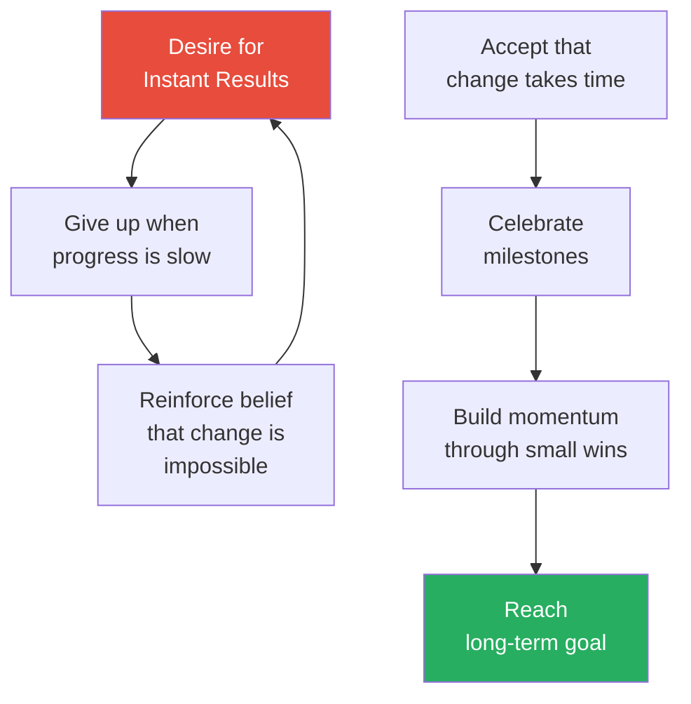

The left loop is the instant-gratification trap: expect fast results, quit when they don't come, conclude that change doesn't work. The right path is Morin's prescription: patience, milestones, and momentum.

- The modern acceleration of instant-result expectations:
  - Same-day delivery, on-demand streaming, instant messaging — modern life has trained us to expect everything immediately
  - When we apply this expectation to personal growth — which operates on biological timescales, not technological ones — frustration is inevitable
  - Neural rewiring takes weeks to months; habit formation takes 21 to 66 days depending on complexity; meaningful life changes take months to years
  - The gap between technological speed and biological speed creates constant friction — we expect our bodies and minds to change as fast as our apps update
  - Morin sees this in therapy constantly: clients who are furious that four sessions haven't "fixed" them, as if their brain were a device that needed a software patch
  - The reality is that therapy works — but it works slowly, through repetition, practice, and the gradual rewiring of automatic thoughts and behaviours
  - Marcy's $1,000 shakes were an attempt to bypass biology — and biology doesn't accept bribes
  - The parallel to [[The Psychology of Money - Morgan Housel|The Psychology of Money]] is illuminating: Housel argues that wealth is built through patience and compounding, not through dramatic moves; Morin argues that mental strength works the same way — small, consistent improvements compound over time into dramatic transformation, but only if you're patient enough to let the compounding work
- The measurement problem — why slow progress feels like no progress:
  - Daily changes are too small to notice — like watching hair grow
  - Weekly changes are almost invisible — you feel the same as you did last Monday
  - Monthly changes are noticeable only if you measure — and most people don't
  - Quarterly changes are where the transformation becomes obvious to others — but most people quit long before the quarterly mark
  - This creates a cruel paradox: the people most in need of change quit before the change becomes visible, while the people who persist see results that reinforce their persistence
  - Morin recommends a simple fix: take a weekly "mental health snapshot" — three sentences about how you're feeling, what patterns you noticed, and what you're working on
  - After eight weeks, read the first snapshot — the difference is usually dramatic, and it provides the evidence of progress that day-to-day experience doesn't
  - Dyson's 5,000 prototypes illustrate this: prototype 4,999 didn't feel much different from prototype 4,998 — but the distance from prototype 1 was enormous

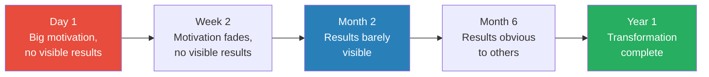

Most people quit somewhere between Day 1 and Month 2 — the zone where motivation has faded but results aren't yet visible. The people who push through this zone are the ones who experience transformation.

---

> [!example] James Dyson — 5,000 Prototypes, 14 Years
> - Dyson was frustrated that his vacuum cleaner lost suction and decided to build a better one using centrifugal force
> - He spent five years building over 5,000 prototypes until he was satisfied with the design
> - Then spent several more years trying to find a manufacturer — no one was interested in a product that competed with the established vacuum industry and their lucrative replacement bag business
> - He opened his own manufacturing plant; the first Dyson vacuum went on sale in 1993, fourteen years after he started
> - The Dyson vacuum became the biggest-selling vacuum in Britain — one in four households owned one by 2002
> - Dyson now sells products in 24 countries, generating over $10 billion annually
> - Each of the 5,000 "failures" was not a dead end but a refinement — each prototype was slightly better than the last, and each taught him something the previous one hadn't
> - The story's power lies in the number: 5,000 prototypes is not a metaphor — it is a literal count of how many times Dyson built something, tested it, found it lacking, and built something better
> **The lesson:** If Dyson had expected results in months rather than decades, the world's most innovative vacuum cleaner would never have existed.

- <b style="color: #27ae60">Research on delayed gratification:</b>
  - Self-discipline is more important than IQ for predicting academic success
  - College students' self-control scores correlate with higher self-esteem, better GPAs, less binge eating, and better interpersonal skills
  - Delayed gratification is associated with lower rates of depression and anxiety
  - Children with high self-control have fewer mental and physical health problems, fewer criminal convictions, and greater financial security as adults
  - The effect compounds: early self-discipline creates habits that produce more self-discipline, which produces more achievement, which builds confidence in the process — a virtuous cycle that accelerates over time
  - The compounding effect is Morin's key point: patience is not just a virtue — it is an investment strategy where the returns accelerate over time
- The science of habit formation and time:
  - Popular culture claims habits take 21 days to form — this is based on a misreading of Dr. Maxwell Maltz's observations about plastic surgery patients
  - Research by Philippa Lally at University College London found that habit formation takes between 21 and 254 days, with an average of 66 days
  - Simple habits (drinking water with lunch) form faster; complex habits (daily exercise) take much longer
  - The variation is enormous — which means that the person who quits a new habit after 30 days because "it should be automatic by now" may be quitting right before the habit locks in
  - Morin uses this research to set realistic expectations: when a client starts a new behaviour, she warns them that it may take two months or more before the behaviour feels natural
  - The 21-day myth is itself an instant-results expectation — and Morin treats it as such
  - The implication for all thirteen habits: breaking a bad habit or building a new one requires months of consistent effort, not weeks
  - This is perhaps the most practically important research finding in the entire book: the timeline for change is longer than most people expect, and knowing this in advance prevents premature abandonment

---

> [!abstract] Strategies for Delaying Gratification
> 1. Keep your end goal visible — write it on a note, make it your screensaver, visualise it daily
> 2. Celebrate milestones along the way — don't wait until the finish line
> 3. Create a plan to resist temptation before temptation arrives
> 4. Deal with frustration and impatience as normal parts of the process, not signs of failure
> 5. Pace yourself — burnout is the enemy of long-term change
> 6. Track progress in writing — slow progress is still progress, and a written record makes it visible

- The concept of "productive impatience" vs. "destructive impatience":
  - Not all impatience is bad — productive impatience drives you to work harder, find efficiencies, and stay focused
  - Destructive impatience causes you to abandon the process entirely because results aren't arriving on your preferred schedule
  - The difference is in the response: productive impatience says "how can I make this faster while still doing it right?"; destructive impatience says "this isn't working, I'm quitting"
  - Dyson was productively impatient — he built 5,000 prototypes in five years because he was driven to solve the problem quickly; but he never quit when a prototype failed
  - Marcy was destructively impatient — she wanted weight loss without the process of eating differently and exercising; she was willing to pay $1,000/week to skip the discomfort
  - The test: is your impatience driving you to work harder on the process, or to abandon the process for a shortcut?
  - If it's driving harder work, channel it; if it's driving abandonment, recognise it as the instant-results trap
  - Morin notes that the same person can be productively impatient in one domain (career) and destructively impatient in another (health) — the skill is domain-specific and must be developed in each area where you want to grow

> [!example] "Rudy" Ruettiger — The Danger of Shortcuts
> - Daniel "Rudy" Ruettiger is one of the most famous underdog stories in American sports
> - Rejected from Notre Dame three times, he was finally accepted on his fourth application
> - Despite being undersized, he made the practice squad through sheer determination — and played in the final game of his senior season, recording a sack
> - His story became a hit movie and a symbol of perseverance — proof that patience and persistence could overcome any odds
> - Decades later, the SEC charged Rudy with securities fraud — he participated in a "pump-and-dump" scheme for a sports drink company bearing his name
> - The man once celebrated for patience and persistence fell prey to a get-rich-quick scheme — the very opposite of everything his story represented
> - He paid a $382,000 penalty and his reputation was permanently damaged
> - The irony could not be sharper: the man whose entire legacy was built on doing things the hard way destroyed part of that legacy by trying to take a shortcut
> **The lesson:** Even people with proven grit can be seduced by instant gratification. Delaying gratification requires constant vigilance, not a one-time decision.

- <b style="color: #e74c3c">Warning signs that you're expecting instant results:</b>
  - You assume that if things don't get better right away, they never will
  - You look for shortcuts that skip the underlying work — Marcy's $1,000 shakes
  - You quit programmes, diets, or plans after a few weeks because "it's not working"
  - You measure progress by how you feel today rather than by long-term trends
  - You get frustrated when other people seem to achieve things faster than you
  - You conflate "slow progress" with "no progress" — a distinction that matters enormously
  - You interpret the difficulty of the process as evidence that you're doing it wrong, rather than evidence that you're doing something worthwhile
- This chapter is the keystone for all the others:
  - Every one of the twelve preceding chapters requires time and patience to implement
  - Gratitude doesn't replace self-pity overnight (Chapter 1)
  - Reclaiming your power takes months of conscious language shifts (Chapter 2)
  - Change happens through stages, not explosions (Chapter 3)
  - Learning to control only what you can takes constant practice (Chapter 4)
  - Saying no gets easier with repetition, not immediately (Chapter 5)
  - If you expect any of these changes to produce instant results, you will quit — and conclude that mental strength "doesn't work for me"
  - That conclusion is itself the instant-results trap: you expected quick change, didn't get it, and gave up
- The relationship between Chapter 13 and the marshmallow experiment's deeper lesson:
  - The children who succeeded didn't have more willpower — they had better strategies
  - They looked away from the marshmallow, covered it with their hands, sang songs to distract themselves
  - The lesson is not "try harder to resist temptation" — it is "design your environment so resistance is easier"
  - Richard (Chapter 3) moved junk food to the basement — a strategy, not willpower
  - Dale (Chapter 6) started his furniture business part-time instead of quitting his job — a strategy, not courage
  - The marshmallow children and Morin's therapy clients arrived at the same place: success comes from strategy more than from raw willpower
  - The implication for patience: you don't need superhuman patience — you need systems that make patience easier
  - Writing down milestones, celebrating small wins, tracking progress visually — these are patience strategies, not patience itself
  - Morin's approach is fundamentally practical: don't try to become a more patient person (that's a character change, the hardest kind); instead, build systems that make impatience less likely to derail you

> [!tip] Core Insight
> The biggest threat to lasting change is not difficulty — it is impatience. Most people don't fail because the challenge is too hard; they fail because they quit before the change has time to take hold.

---

## Conclusion: Maintaining Mental Strength

*Morin ends by emphasising that mental strength is not a destination — it's a practice.*

The Conclusion is brief — only a few pages — but it contains one of the book's most important ideas: mental strength is not an achievement to unlock; it is a practice to maintain. Like physical fitness, it degrades without use. Like dental hygiene, neglecting it creates problems that are far more expensive to fix than the daily maintenance required to prevent them. The thirteen habits don't disappear once you've addressed them — they recede into the background, waiting for a moment of stress, grief, or exhaustion to resurface. The mentally strong person is not the one who has eliminated these habits; it is the one who recognises them quickly when they return and corrects course before they take hold.

- Mental strength requires ongoing maintenance, just like physical fitness
  - Your mental muscles atrophy without regular exercise
  - There will always be bad days when emotions take over, irrational thoughts win, or destructive behaviour slips in
  - The difference is that these days become fewer and farther between
  - The goal is not perfection — it is awareness and course correction
  - Morin uses the analogy of dental hygiene: you don't brush your teeth once and declare your mouth permanently clean
  - Mental hygiene works the same way — daily maintenance prevents problems that would require intensive intervention
  - Every client who relapses tells the same story: "I was doing so well that I thought I didn't need to keep practising"
  - The relapse itself is not the problem — it is evidence that maintenance was skipped, and the solution is to resume the practice, not to conclude that it doesn't work
- <b style="color: #27ae60">Coach yourself</b> using the three-pronged approach:
  - **Monitor your behaviour** — look for times you repeat mistakes, shy away from change, or give up after failure
  - **Regulate your emotions** — catch self-pity, entitlement, resentment, and people-pleasing before they take hold
  - **Think about your thoughts** — evaluate whether they're realistic before acting on them
- The thirteen habits are interconnected — weakening one strengthens the others:
  - Overcoming self-pity (Chapter 1) makes it harder to feel entitled (Chapter 12)
  - Reclaiming your power (Chapter 2) makes it easier to stop people-pleasing (Chapter 5)
  - Embracing change (Chapter 3) makes it easier to take calculated risks (Chapter 6)
  - Accepting what you can't control (Chapter 4) reduces dwelling on the past (Chapter 7)
  - Learning from mistakes (Chapter 8) feeds the persistence to try again after failure (Chapter 10)
  - Embracing solitude (Chapter 11) creates the self-awareness needed for all twelve other habits
  - Patience with the process (Chapter 13) prevents you from quitting any of the others too early
- The interconnection means that progress in any one area creates momentum across all thirteen — which is why Morin recommends starting with whichever chapter resonated most strongly rather than trying to tackle all thirteen at once
- She also notes that different life events will trigger different chapters at different times — a job loss might activate Chapters 1, 3, and 6; a breakup might activate Chapters 2, 7, and 9 — and the book is designed to be returned to as circumstances change
- Morin's maintenance protocol for ongoing mental strength:
  - **Daily:** notice your automatic thoughts — are they realistic or distorted? If you hear "I can't," ask whether that's fact or feeling
  - **Weekly:** review your behaviour — did you avoid any risks out of fear? Say yes when you wanted to say no? Dwell on something past the point of productivity?
  - **Monthly:** audit your mental energy — who has disproportionate influence over your mood? Where are you investing energy in things you can't control?
  - **Per event:** after any significant setback, do the four-step mistake review (acknowledge, identify, plan, review) before moving on
  - **Annually:** revisit your definition of success — has it changed? Are you still pursuing what matters to you, or have you drifted toward what matters to others?
- The power of this maintenance protocol is that it's lightweight:
  - It doesn't require journaling for an hour or meditating for thirty minutes
  - It requires momentary awareness — a few seconds of noticing your own patterns
  - The cost of maintenance is trivial compared to the cost of rebuilding after a relapse
  - Morin compares it to brushing your teeth: two minutes a day prevents problems that would require hours in a dentist's chair

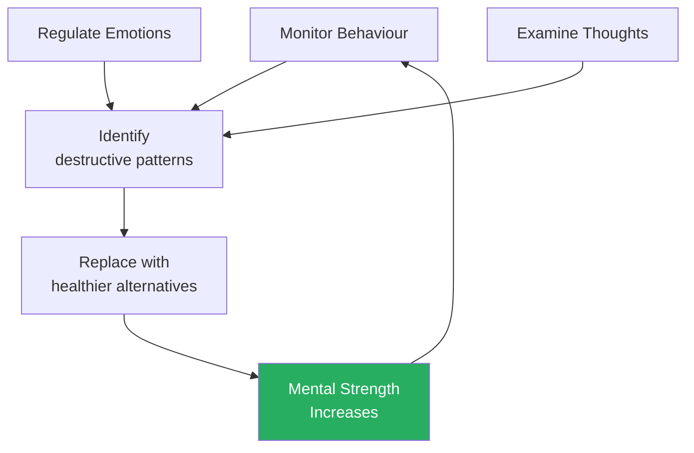

The maintenance cycle: continuously observe your own thoughts, emotions, and behaviour — catch the bad habits before they take hold — and replace them with healthier alternatives.

- Morin's final metaphor: mental strength as a garden
  - You don't plant a garden once and walk away — you tend it regularly
  - Weeds (bad habits) grow back if you don't pull them regularly
  - The flowers (good habits) need ongoing care — water, sunlight, pruning
  - The garden doesn't have to be perfect — a few weeds are inevitable — but neglected gardens get overrun
  - The thirteen habits are the thirteen most common weeds; the antidotes are the gardening tools
  - The person who tends their garden daily spends minutes on maintenance; the person who neglects it for months faces hours of restoration
  - This is the book's final argument for the daily practice of mental strength: prevention is always easier than cure, and awareness is always cheaper than crisis

---

> [!example] Lawrence Lemieux — The Sailor Who Gave Up a Medal
> - Lemieux was in second place at the 1988 Seoul Olympics sailing competition when he spotted the capsized Singaporean team's dinghy
> - One sailor was injured and clinging to the hull; the other was drifting away in eight-foot waves
> - Without hesitation, Lemieux turned his boat around and rescued both sailors, waiting with them until the Korean navy arrived
> - He finished the race in 22nd place — and cost himself an almost certain medal
> - The International Olympic Committee awarded him the Pierre de Coubertin medal for sportsmanship
> - His decision was instantaneous — proof that mental strength, when practised consistently, becomes automatic rather than deliberative
> - He didn't agonise over the choice; he acted according to his values without needing to think about it
> - The speed of his decision reveals the depth of his character — values that are truly internalised don't require calculation in a crisis
> **The lesson:** Mental strength isn't about winning — it's about knowing that you'll be okay no matter what happens, and living according to your values even when it costs you.

- The Lemieux story is Morin's argument made flesh: mental strength is not about what you get — it's about who you are
  - Lemieux gave up a medal — something most athletes would consider the pinnacle of their career
  - But he gained something more valuable: the knowledge that when it mattered most, he acted according to his values without hesitation
  - This is the end state of mental strength: values so deeply internalised that they operate automatically, even under extreme pressure
  - Every chapter in the book is preparation for moments like Lemieux's — moments where your character is tested and your response reveals who you've become
  - Most people will never face a choice between saving a life and winning a medal — but every day presents smaller versions of the same test: do you act according to your values, or do you take the easy path?
  - Mental strength is what determines which path you take — and the thirteen habits are the obstacles that push you toward the easy path when you should be on the hard one

- Morin's closing argument:
  - Mental strength is not a fixed trait — it is a practice, like brushing your teeth
  - Some days will be harder than others — the goal is not to be perfect but to recognise when you've slipped and correct course
  - The thirteen habits are not thirteen separate problems — they are thirteen expressions of the same underlying challenge: choosing long-term well-being over short-term comfort
  - Every person reading this book will recognise themselves in at least a few chapters — and that recognition is the first step toward change
  - The woman who wrote these thirteen principles did so while her father-in-law was dying — she needed them as badly as any reader ever will
  - The authenticity of that origin — writing a clinical framework while experiencing the very grief it addresses — is what makes this book more than a self-help list; it is a document of applied courage
- A final insight that runs beneath the entire book:
  - Mental strength is not about never experiencing negative emotions — it is about choosing what you do with them
  - Every chapter follows the same structure: here is a destructive pattern, here is why your brain defaults to it, here is what it costs you, and here is a healthier alternative
  - The alternative is never "stop feeling this" — it is always "feel this, understand it, and then choose a response that serves you rather than one that harms you"
  - Morin's framework is fundamentally compassionate: she never shames people for having bad habits — she simply shows them the price those habits are charging, and offers a different option
  - The choice remains yours — and that is the point
  - Mental strength is the decision to choose, and the skill to follow through
  - The woman who wrote these thirteen principles — sitting by her dying father-in-law, having already lost her mother and her husband — chose to channel her grief into a framework rather than into despair
  - That choice is the most powerful illustration of the book's thesis: it was made by someone with every reason to feel sorry for herself, every reason to dwell on the past, every reason to feel the world owed her something
  - She made the opposite choice — and in doing so, she created something that has helped millions of people make the same choice in their own lives
  - The book is the living proof of its own argument
  - And the argument, stripped to its essence, is simple: stop doing the things that make you weak, and the strength that was always there will emerge
  - You don't have to add strength — you have to stop subtracting it

---

## The 13 Habits: Quick Reference

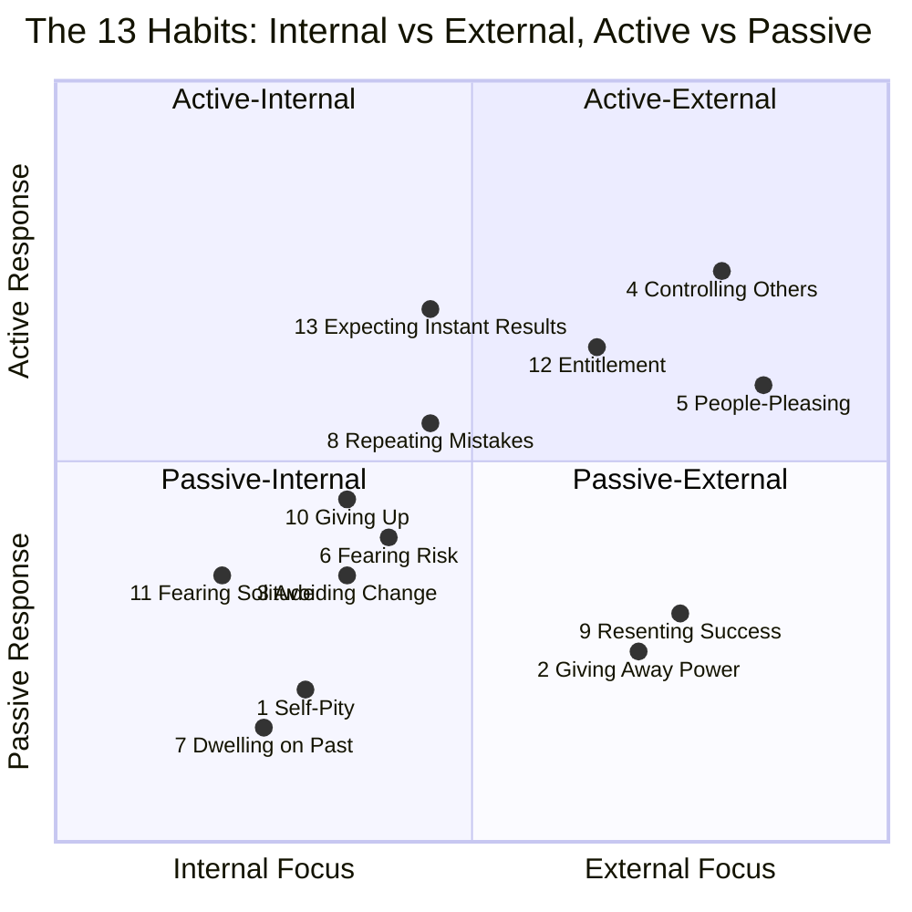

The quadrant exposes a critical pattern: the most damaging habits (self-pity, dwelling, giving away power) cluster in the passive zones where inaction compounds over time, while the externally-focused active habits (controlling others, people-pleasing, entitlement) waste energy on things outside your influence — together explaining why Morin's framework emphasizes both stopping passive rumination and redirecting misplaced effort.

| # | Bad Habit | Core Problem | Antidote |
|---|---|---|---|
| 1 | Feeling sorry for yourself | Delays action, becomes addictive | Exchange self-pity for gratitude |
| 2 | Giving away your power | Others control your emotions | Reframe language; set boundaries |
| 3 | Shying away from change | Fear and discomfort avoidance | Incremental steps; Five Stages model |
| 4 | Focusing on the uncontrollable | Increases anxiety, wastes energy | Develop bi-locus of control |
| 5 | Pleasing everyone | Lose your own values and time | Learn to say no without guilt |
| 6 | Fearing calculated risks | Emotion-based avoidance | Separate emotion from logic |
| 7 | Dwelling on the past | Prevents growth and healing | Reflect, learn, then let go |
| 8 | Repeating mistakes | No learning from failure | Study mistakes; keep written records |
| 9 | Resenting others' success | Insecurity and unclear values | Define your own success |
| 10 | Giving up after failure | Fixed mindset about abilities | Grit + self-compassion + try again |
| 11 | Fearing alone time | Unprocessed emotions build up | Schedule solitude; learn meditation |
| 12 | Feeling entitled | Prevents earning on merit | Focus on giving, not taking |
| 13 | Expecting instant results | Quit before real progress | Celebrate milestones; pace yourself |

- How to use this table:
  - Read through the "Core Problem" column and notice which descriptions trigger the strongest recognition — "that's me"
  - Those are your primary habits to address — start with the one that resonates most
  - Don't try to address all thirteen simultaneously — Morin is explicit that this is a recipe for the same kind of overwhelm that killed Richard's diet in Chapter 3
  - Focus on one or two habits for a month, then reassess — you may find that addressing one habit loosens the grip of several others, because the thirteen are interconnected
  - Use the "Antidote" column as a starting point, then revisit the chapter for detailed strategies
  - The table is designed for periodic reference — return to it quarterly to check whether old habits have crept back or new ones have emerged
  - Morin designed the book to be revisited, not just read once — different chapters become relevant at different life stages, and the same chapter may offer different insights the second time through

---

## Verdict

Morin's greatest contribution is the reframing itself: mental strength is about what you *stop* doing, not what you start. Most self-help books pile on positive habits — meditate, journal, exercise, network — without addressing the destructive patterns that make those habits ineffective. Morin's "dozen doughnuts after the gym" analogy captures this perfectly. The subtractive approach is psychologically sound: research consistently shows that eliminating negative behaviours produces larger gains in well-being than adding positive ones. The book also benefits enormously from Morin's dual authority — she's not just a therapist prescribing solutions; she's someone who has lived through the kind of compounding loss that would break most people. Her stories about Lincoln's toothbrush and the skydiving tradition on his birthday carry a weight that pure clinical writing never could. The viral origin of the list — written while her father-in-law was dying, posted on LifeHack.org, read by millions before it became a book — also speaks to its resonance. People recognised themselves in the list not because it was novel, but because it named patterns they had felt but never articulated.

The book's weakness is one of depth rather than substance. Morin covers thirteen concepts that could each sustain their own book, which means some chapters feel like introductions to ideas rather than thorough explorations. The client case studies follow a predictable structure (person has problem, comes to therapy, sees the light, makes progress) that occasionally feels formulaic — and the resolution is always positive, which underrepresents the reality that some people don't break their patterns despite good therapy. The research citations, while useful, tend to be cherry-picked supporting evidence rather than rigorous literature reviews — a common limitation of the genre. The Prochaska model and the marshmallow experiment, for instance, are presented without the significant criticisms that later research has raised about both. The marshmallow experiment's replication challenges and the role of socioeconomic factors in delayed gratification outcomes are completely absent. Some chapters also overlap considerably — the distinction between self-pity (Chapter 1) and dwelling (Chapter 7), or between controlling the uncontrollable (Chapter 4) and people-pleasing (Chapter 5), can feel blurry rather than sharp. And the book's scope — thirteen distinct habits in roughly 250 pages — means that no single habit receives the deep treatment that a more focused book like [[Deep Work - Cal Newport|Deep Work]] or [[Influence - Robert Cialdini|Influence]] can provide.

The reader who benefits most from this book is someone in the middle — not in acute crisis, but stuck. If you know something is wrong but can't articulate what, Morin's thirteen-point diagnostic often identifies the specific mental habit dragging you down. It's also excellent for people who have already built strong positive habits but aren't seeing results — the "gym plus doughnuts" crowd. The framing as "things to stop doing" makes it immediately actionable in a way that aspirational self-help often isn't. The book works particularly well as a diagnostic tool: read through the thirteen chapters, notice which ones trigger the strongest "that's me" reaction, and start there. People in acute crisis should seek professional help; people who are already thriving may find the advice too basic. But for the vast middle — people who function well but sense they could function better — this book is a practical, honest, and surprisingly moving guide. It is also an excellent recommendation for people who are sceptical of self-help: Morin's clinical credentials, her personal losses, and her evidence-based approach disarm the usual objections.

Compared to [[Mindset - Carol S. Dweck|Mindset]], which explores one concept (growth vs. fixed mindset) in deep detail, Morin's book is a broader survey — useful as a starting point and a diagnostic tool, but lacking the transformational depth of books like [[Man's Search for Meaning - Viktor Frankl|Man's Search for Meaning]] or [[Deep Work - Cal Newport|Deep Work]], which fundamentally reshape how you think about a single domain. It sits comfortably alongside [[The Subtle Art of Not Giving a F-ck - Mark Manson|The Subtle Art of Not Giving a F*ck]] in the "practical mental health for normal people" category, though Morin's clinical background gives her framework more rigour than Manson's conversational philosophy. Where Manson is provocative and philosophical, Morin is methodical and clinical — both are valuable, and together they cover the territory more completely than either does alone. Among taxonomy self-help books, it is more accessible than [[12 Rules for Life - Jordan Peterson|12 Rules for Life]] and more grounded than most of the genre. Its greatest lasting value may be less in the specific thirteen habits and more in the meta-principle that binds them: the radical idea that your worst habits are doing more damage than your best habits are doing good — and that subtracting the bad may be more powerful than adding more good.

---

## Related Reading

| Book | Connection |
|------|-----------|
| [[Mindset - Carol S. Dweck]] | The growth mindset framework that underlies Chapter 10's arguments about failure and persistence |
| [[Man's Search for Meaning - Viktor Frankl]] | The deepest exploration of choosing your response to suffering, echoed in Chapters 1, 2, and 4 |
| [[Essentialism - Greg McKeown]] | The art of saying no and eliminating non-essentials, closely tied to Chapter 5 |
| [[Deep Work - Cal Newport]] | The case for solitude and focused attention, expanding on Chapter 11 |
| [[The Subtle Art of Not Giving a F-ck - Mark Manson]] | A parallel approach to mental resilience through accepting what you can't control |
| [[Thinking in Bets - Annie Duke]] | A rigorous framework for risk calculation that complements Chapter 6 |
| [[12 Rules for Life - Jordan Peterson]] | Personal responsibility and meaning-making, resonant with Chapters 2, 7, and 8 |
| [[Antifragile - Nassim Nicholas Taleb]] | The argument that stress and failure don't just build strength — they're required for it |
| [[Discourses - Epictetus]] | The Stoic dichotomy of control that runs beneath Chapter 4's entire argument |
| [[The Psychology of Money - Morgan Housel]] | Patience and compounding as wealth-building principles, mirroring Chapter 13's emphasis on delayed gratification |
| [[The Charisma Myth - Olivia Fox Cabane]] | Presence and self-awareness as foundations for connection, expanding on Chapter 11 |
| [[The Gaslight Effect - Robin Stern]] | Understanding when others manipulate your reality, deepening Chapter 2's power dynamics |
| [[Emotional Blackmail - Susan Forward]] | Recognising and resisting emotional manipulation, complementing Chapters 2 and 5 |

These books form a constellation around Morin's themes. For deep dives into specific chapters: Frankl for suffering (Chapters 1, 2, 4), Dweck for failure (Chapter 10), Newport for solitude (Chapter 11), Duke for risk (Chapter 6), McKeown for boundaries (Chapter 5), and Epictetus for control (Chapter 4). Together, they provide the depth that Morin's survey format necessarily omits.
