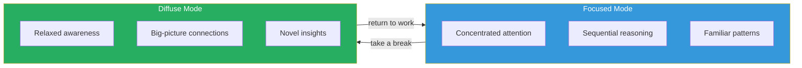
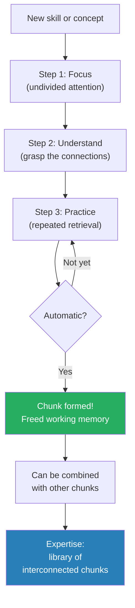
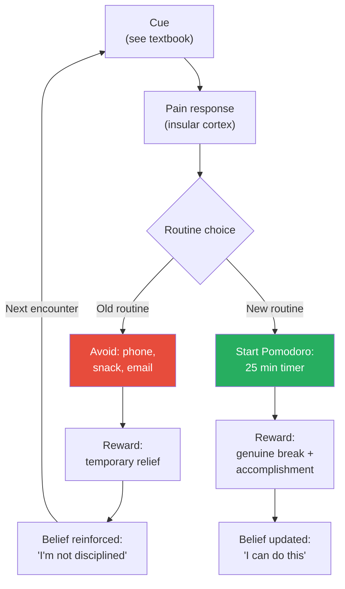
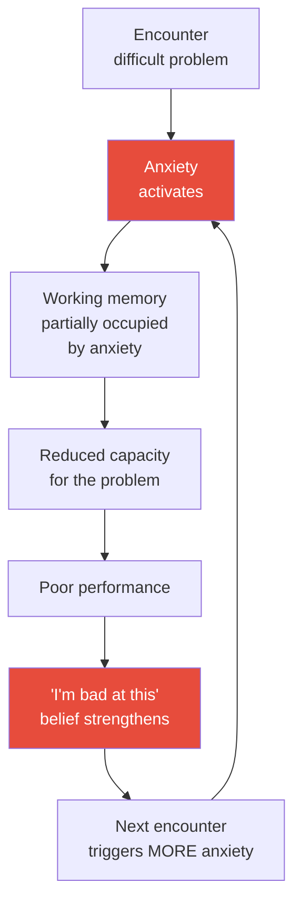
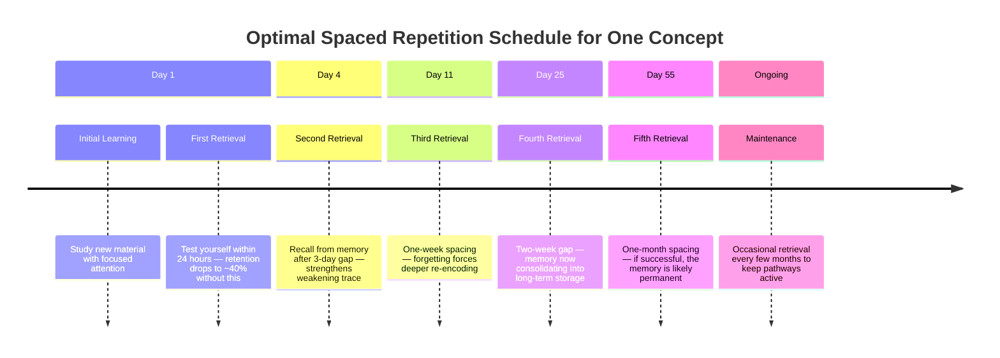
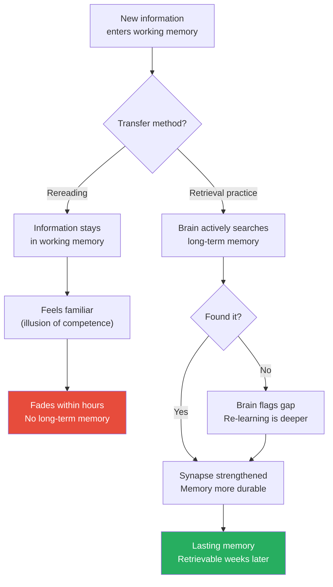
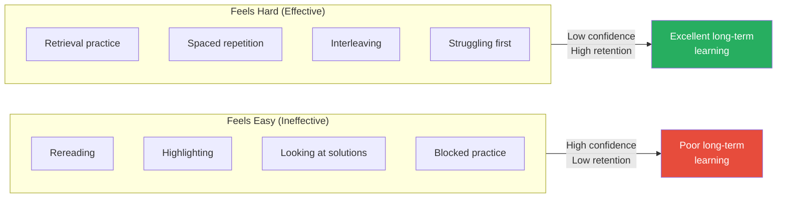
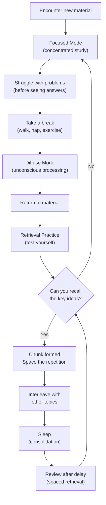

# A Mind for Numbers — Barbara Oakley

> Barbara Oakley flunked math and science all through school. She hated them. She joined the Army, learned Russian, and worked on Soviet fishing trawlers in the Bering Sea.
> Then, at age 26, she decided to retrain her brain. She went back to school, earned a degree in engineering, then a PhD, then became a professor.
> This book explains the neuroscience behind how she did it — and how anyone can learn difficult material by working with the brain's natural architecture instead of against it.
> Her Coursera course "Learning How to Learn," based on this book, became the most popular online course in the world with over 3 million students.
> The core argument: learning is not about talent or hours — it is about technique. Use the right methods and the brain will do the rest.

---

## About the Author

Barbara Oakley is Ramsey Professor of Engineering at Oakland University and a Fellow at the Institute of Electrical and Electronics Engineers. Her path to engineering was anything but conventional — she flunked math and science throughout school, deliberately avoided both subjects, and joined the Army at 18, where she learned Russian and rose to the rank of Captain. She served on Soviet fishing trawlers in the Bering Sea as a translator and eventually taught Russian at the University of Minnesota. At 26, she decided to retrain her brain for math and science — subjects she had believed she was "naturally bad at." She started from scratch with algebra, then calculus, then engineering, eventually earning a PhD in Systems Engineering. She co-teaches "Learning How to Learn" on Coursera with neuroscientist Terrence Sejnowski — the course became the most popular MOOC in the world with over 3 million enrolments.

---

## The Big Idea

- <b style="color: #2980b9">Your brain has two fundamentally different thinking modes — Focused and Diffuse — and effective learning requires alternating between both</b>
- Most students over-rely on focused mode and never activate diffuse mode, which is where creative connections and breakthrough insights happen
- The brain is not a fixed machine — it is an adaptive organ that physically changes in response to how you use it
  - Neurons form new connections when you practise
  - Existing connections strengthen through retrieval
  - Unused pathways weaken and are pruned away
- <b style="color: #27ae60">The single most effective study technique is retrieval practice — testing yourself — not rereading or highlighting</b>
- Decades of cognitive science show that the techniques most students rely on (rereading, highlighting, passive note-taking) produce the least learning
- The techniques that feel hardest (self-testing, spacing, interleaving) produce the most durable knowledge
- Oakley's argument runs deeper than tips and tricks — she is making a case that our entire intuition about what "studying" means is backwards
  - We think effortless comprehension is the goal
  - In reality, productive struggle is the mechanism
  - The discomfort of retrieval failure IS the learning event, not an obstacle to it
- Anyone can learn anything difficult, provided they use the right techniques consistently — Oakley is living proof

---

## Key Concepts at a Glance

| Concept | One-line summary |
|---------|-----------------|
| **Focused Mode** | Tight, sequential concentration on familiar patterns and procedures |
| **Diffuse Mode** | Relaxed, wide-ranging processing that finds novel connections |
| **Chunking** | Compressing multiple pieces of information into one retrievable unit |
| **Pomodoro Technique** | 25 minutes focused work + 5 minutes break; commit to process, not product |
| **Illusions of Competence** | Rereading and highlighting feel productive but build almost no lasting memory |
| **Retrieval Practice** | Testing yourself strengthens memory more than any other technique |
| **Spaced Repetition** | Distributing practice over time beats cramming by orders of magnitude |
| **Interleaving** | Mixing different problem types builds flexible, transfer-ready knowledge |
| **Einstellung Effect** | An existing mental pattern blocks you from seeing a better solution |
| **Working Memory** | The brain's ~4-item scratchpad through which all learning must pass |
| **Desirable Difficulty** | Study techniques that feel harder produce better long-term retention |
| **Transfer** | Applying knowledge learned in one context to a completely different one |
| **Process vs Product** | Focusing on time spent rather than outcome eliminates procrastination triggers |

---

The treemap reveals that Oakley's framework divides roughly equally between understanding *how* the brain works (modes, memory) and *what to do about it* (techniques, support systems) — with active techniques occupying the largest share of her practical advice.

---

## Chapter 1 — Open the Door

*Oakley opens with her own story — the most unlikely origin for a book about learning math and science.*

- Oakley grew up hating math and science
  - She flunked her way through both subjects in school
  - She would stare at equations and feel nothing but confusion
  - She assumed this was her permanent identity — she was simply "not a math person"
- After high school she joined the U.S. Army, where she learned Russian
  - Language came naturally to her — she thrived in an area far from numbers
  - She served on Soviet fishing trawlers in the Bering Sea as a translator
  - She rose to the rank of Captain

> [!example] Oakley's Turning Point (Age 26)
> - After leaving the Army, Oakley realised her career options were narrow without technical skills
> - She decided to retrain her brain for math and science — subjects she had always believed were beyond her
> - She enrolled in college and started from the very beginning: basic algebra
> - The early months were agonising — she felt like a fraud surrounded by students who "got it" naturally
> - But she persisted, using study techniques she would later identify as neuroscientifically optimal
> - She earned a degree in electrical engineering, then a master's, then a PhD in systems engineering
> - She is now a professor at Oakland University and one of the world's most cited experts on learning science
> **The lesson:** "Not a math person" is a description of a current state, not a permanent identity.

- The chapter sets up the book's central promise: <b style="color: #27ae60">anyone can learn anything, provided they understand how the brain actually learns and use techniques that work with its architecture instead of against it</b>
- Oakley's personal transformation is not presented as exceptional talent discovered late — it is presented as the predictable result of applying the right methods consistently
- She introduces the idea that <b style="color: #e74c3c">most educational institutions teach content but never teach students how to learn</b> — leaving them with the equivalent of a toolbox they do not know how to open
- The chapter promises that the rest of the book will provide that toolkit, grounded not in opinion but in decades of neuroscience and cognitive psychology research

---

## Chapter 2 — Easy Does It: Why Trying Too Hard Can Sometimes Be Part of the Problem

*The two modes of thinking are the foundation of everything that follows — and most learners have never heard of one of them.*

### The Pinball Machine Metaphor

Oakley uses a pinball machine to explain the two modes:

- <b style="color: #2980b9">Focused mode</b> = bumpers close together
  - The ball follows tight, familiar paths
  - Great for working through known procedures, calculations, and logical sequences
  - This is the mode most people default to when they sit down to study
  - The prefrontal cortex directs attention like a flashlight beam — narrow but intense
- <b style="color: #2980b9">Diffuse mode</b> = bumpers far apart
  - The ball bounces widely, making unexpected connections
  - Great for creative insights, big-picture thinking, and solving problems where the familiar approach does not work
  - This mode activates when you step away from the problem
  - Neural activity spreads across the brain rather than concentrating in one region

| Feature | Focused Mode | Diffuse Mode |
|---------|-------------|-------------|
| **Attention** | Tight, concentrated | Relaxed, wandering |
| **Thinking style** | Sequential, logical | Associative, creative |
| **Best for** | Working through known procedures | Making novel connections |
| **Activated by** | Deliberate concentration | Stepping away (walks, naps, showers) |
| **Risk** | Tunnel vision (Einstellung Effect) | Inability to execute on details |
| **Feels like** | Effort | Daydreaming |
| **Brain region** | Prefrontal cortex dominant | Default mode network active |

- <b style="color: #e74c3c">You cannot be in both modes simultaneously</b> — they are mutually exclusive, like a coin showing heads or tails
- Effective learning requires deliberately switching between them
- The mistake most students make is staying in focused mode until frustration, then quitting entirely — never giving diffuse mode a chance to work

The two modes are not competing — they are collaborating across time. Focused mode defines the problem; diffuse mode finds the unexpected solution.

---

> [!example] Edison's Ball Bearings
> - Thomas Edison would sit in his chair to think through a difficult problem
> - He held ball bearings in his hand as he relaxed and let his mind drift
> - As he slipped into the edge of sleep — diffuse mode activating — his hand would relax
> - The ball bearings clattered to the floor and woke him up
> - He often woke with a fresh insight or a new angle on the problem
> - Salvador Dali used the same technique with a key dangling over a metal plate
> **The lesson:** The great inventors understood intuitively what neuroscience has now confirmed — breakthroughs come from alternating between focused concentration and relaxed diffusion.

> [!tip] Core Insight
> Most learners stay in focused mode until they are frustrated, then quit. They never activate diffuse mode because they never take genuine breaks. Scrolling social media is still focused activity — just focused on the wrong thing. A genuine break means walking, showering, exercising, or napping.

- Oakley is careful to distinguish between productive diffuse mode and mere distraction
  - Checking Instagram is NOT diffuse mode — it is focused attention on trivial content
  - Diffuse mode requires that the brain be allowed to wander freely without any specific target
  - Walking without headphones, showering, lying quietly, light exercise — these are genuine diffuse-mode triggers
  - The key test: is your mind free to wander wherever it wants? If yes, you are in diffuse mode. If no, you are in focused mode on something else.

---

## Chapter 3 — Learning Is Creating: Lessons from Thomas Edison's Fumbles

*Oakley shows that the greatest learners in history were not geniuses who got things right the first time — they were persistent experimenters who got things wrong repeatedly.*

- Edison famously tested thousands of materials for the lightbulb filament before finding one that worked
  - He did not consider the failures to be wasted effort — each one eliminated a wrong answer
  - "I have not failed. I've just found 10,000 ways that won't work"
- <b style="color: #27ae60">Learning is inherently messy — it requires false starts, mistakes, and confusion before clarity emerges</b>
- The chapter challenges the myth of the "aha moment" as something that arrives spontaneously
  - In reality, the aha moment is the output of a long process of focused struggle followed by diffuse-mode processing
  - It feels sudden because you are only conscious of the result, not the background computation
  - The focused mode plants the seed; the diffuse mode grows it; you only notice when the plant breaks through the soil

> [!example] Santiago Ramon y Cajal — The Delinquent Who Became the Father of Neuroscience
> - As a boy, Cajal was a terrible student and a juvenile delinquent
> - He was expelled from multiple schools for poor behaviour
> - His father, a doctor, apprenticed him to a shoemaker and then a barber as punishment
> - But Cajal became fascinated by the structure of cells when he looked through a microscope
> - He taught himself to draw detailed anatomical illustrations
> - Through sheer persistence — not innate brilliance — he became the father of modern neuroscience
> - He won the Nobel Prize in Physiology or Medicine in 1906
> - Cajal himself wrote that persistence compensated for his lack of natural talent
> **The lesson:** Persistence and method matter more than raw intelligence. Cajal was not born a genius — he made himself one through relentless, focused practice.

- Oakley draws a contrast between two types of learners:
  - **Race car learners** — pick things up quickly, feel confident fast, but often build shallow understanding
  - **Hiker learners** — learn slowly, struggle more, but build deeper and more flexible knowledge
- <b style="color: #e74c3c">Fast learning is not better learning</b> — the hiker who takes longer to reach the summit sees more of the landscape along the way
- The race car learner often suffers from the illusion of competence: things feel easy, so they assume they understand deeply
- The hiker learner builds more robust chunks because they wrestle with the material longer
- Oakley identifies herself as a hiker learner — and argues that her slow, struggle-filled path actually built more durable expertise than a fast path would have

> [!example] The Race Car vs the Hiker
> - In Oakley's engineering classes, she noticed a recurring pattern
> - Students who grasped concepts quickly would move on without struggle — and often forgot them within weeks
> - Students who struggled longer with each concept were initially slower — but their understanding persisted through exams and into professional life
> - The quick learners had fluency without depth; the slow learners had depth without fluency
> - Over a semester, the slow learners often caught up and surpassed the fast ones
> **The lesson:** Speed of acquisition tells you nothing about quality of understanding. The struggle IS the learning.

---

## Chapter 4 — Chunking and Avoiding Illusions of Competence

*This chapter introduces the two most important concepts in the book: how expertise is built (chunking) and why most people think they have learned when they have not (illusions of competence).*

### Chunking — The Building Blocks of Expertise

- A <b style="color: #2980b9">chunk</b> is a network of neurons that fire together because they have been practised together
- When you first learn to drive, you are overwhelmed — steering, pedals, mirrors, traffic, all at once
  - Each element occupies a slot in working memory
  - With only ~4 slots available, you quickly max out
- After practice, "driving" becomes a single chunk — one mental unit that frees attention for conversation or navigation
- Chunks are the atoms of expertise — experts in any field have built vast libraries of chunks that fire automatically
  - A chess master does not see 32 pieces — they see patterns (chunks) of 4-5 pieces that carry strategic meaning
  - A surgeon does not think about each hand movement — hundreds of procedural steps have been chunked into smooth sequences

Building chunks requires three steps:

1. **Focused attention** — You must concentrate fully while forming the chunk. Multitasking prevents chunk formation.
2. **Understanding** — You must grasp WHY each step connects to the next. Memorising without understanding creates fragile, context-dependent knowledge.
3. **Practice** — Repetition wires the neurons together until the chunk fires automatically. Without practice, the connections remain weak and decay.

Each chunk, once formed, occupies only one slot in working memory — freeing the other three for higher-level thinking.

> [!example] The Guitar Chord Analogy
> - When you first learn a guitar chord, every finger placement requires conscious thought
> - You think about which fret, which string, the angle of the wrist, the pressure needed
> - Each of these elements occupies working memory — leaving no room for rhythm, melody, or expression
> - After weeks of practice, the chord becomes automatic — a single chunk
> - Now your working memory is free for the music itself: timing, dynamics, improvisation
> - An expert guitarist has thousands of these chunks — chord shapes, scale patterns, rhythmic figures — all automatic
> **The lesson:** Expertise is not about holding more in your head. It is about compressing more into automatic chunks so your conscious mind can focus on what matters.

- Oakley emphasises that chunks must be built with understanding, not just repetition
  - A student who memorises the quadratic formula without understanding what it does has a fragile chunk — it only works in familiar contexts
  - A student who understands that the formula finds where a parabola crosses zero has a flexible chunk — it transfers to new situations
  - <b style="color: #27ae60">Understanding is the glue that holds chunks together. Without it, the pieces scatter under pressure.</b>

---

### Illusions of Competence — The Biggest Learning Trap

- <b style="color: #e74c3c">Rereading a textbook chapter makes the material feel familiar, but familiarity is not understanding</b>
- Highlighting gives the feeling of active engagement while the brain remains passive
- Looking at a solution and thinking "I get it" is NOT the same as being able to produce the solution yourself
- These are all forms of the <b style="color: #2980b9">illusion of competence</b> — the dangerous gap between recognising something and actually knowing it
- The mechanism behind the illusion:
  - When you reread, the information enters working memory and feels fluent — easy to process
  - Your brain interprets fluency as learning: "If it feels easy to understand, I must know it"
  - But fluency is about the current moment — it says nothing about whether you can retrieve the information tomorrow, next week, or under pressure

> [!example] Karpicke's Retrieval Practice Experiment
> - Cognitive psychologist Jeffrey Karpicke at Purdue University ran a landmark study
> - One group of students studied a passage by rereading it multiple times
> - Another group read the passage once, then practised recalling it from memory
> - The rereading group predicted they would score higher on a later test
> - On the actual test a week later, the retrieval group dramatically outperformed the rereading group
> - The most popular study method (rereading) is the least effective
> - The least popular method (self-testing) is the most effective
> **The lesson:** What feels productive and what IS productive are often opposites.

| Feels Effective But Is Not | Actually Effective |
|---------------------------|-------------------|
| Rereading | Retrieval practice (testing yourself) |
| Highlighting | Writing summaries from memory |
| Reviewing notes passively | Teaching the material to someone else |
| Watching lectures without pausing | Pausing to predict what comes next |
| Reading solutions first | Attempting problems before looking at answers |
| Concept mapping while reading | Concept mapping from memory |

- <b style="color: #27ae60">The fix is simple: close the book and try to recall the main ideas. If you cannot, you have not learned them.</b>
- This takes 5 minutes. It converts exposure into learning. And almost nobody does it.
- Oakley calls this the "recall after reading" technique — the simplest and most powerful study method in existence

> [!tip] Core Insight
> The only reliable test of whether you have learned something: can you explain it from memory, without looking? If the answer is no, you are experiencing an illusion of competence — not actual knowledge.

---

## Chapter 5 — Preventing Procrastination: Enlisting Your Zombies

*Oakley devotes more attention to procrastination than any other single topic — because it is the largest barrier standing between you and effective learning.*

### Why Procrastination Happens

- Procrastination is not a character flaw — it is a neurological response
- When you think about a task you find unpleasant, the brain's <b style="color: #2980b9">insular cortex</b> (the pain centre) activates
- You experience literal discomfort — not metaphorical, actual neural pain signals
- Your brain, seeking to avoid the pain, redirects attention to something more pleasant
  - Social media, snacking, reorganising your desk, checking email
- The avoidance provides temporary relief — a dopamine hit that reinforces the procrastination habit
- Critically, Oakley points out that the pain is anticipatory — it exists BEFORE you start, not during the work itself
  - Research shows that once people actually begin the dreaded task, the pain subsides within minutes
  - The brain's pain response is about the THOUGHT of doing the work, not the work itself
  - This means the entire procrastination cycle is based on a false signal

### The Four Components of a Habit

Oakley deconstructs procrastination using the habit loop:

1. **The Cue** — A trigger that launches the habitual response (seeing your textbook on the desk, receiving a notification)
2. **The Routine** — The automatic behavioural response (picking up your phone instead of your pen)
3. **The Reward** — The pleasure that reinforces the habit (the dopamine hit from social media, the relief of avoidance)
4. **The Belief** — The underlying story that sustains the pattern ("I work better under pressure," "I'm just not disciplined")

This diagram shows how the same cue can lead to two different outcomes depending on which routine is activated — and why the Pomodoro technique works by replacing the routine, not fighting the cue.

> [!abstract] Breaking Procrastination at Each Level
> 1. **Cue:** Remove temptation — put your phone in another room, close irrelevant tabs, create a distraction-free environment
> 2. **Routine:** Replace the avoidance routine with a productive one — when you feel the urge to check your phone, start a Pomodoro instead
> 3. **Reward:** Give yourself a genuine reward AFTER focused work — a walk, a snack, a conversation
> 4. **Belief:** Replace "I work better under pressure" with "Spaced practice produces better outcomes than cramming"

---

### The Process vs Product Mindset

This is one of the most actionable insights in the entire book:

- **Product focus:** "I need to finish this chapter" → triggers anxiety → triggers avoidance
- **Process focus:** "I will work for 25 minutes" → non-threatening → easy to start
- The psychology is straightforward: products are intimidating because you do not control the outcome; processes are manageable because you control the input
- <b style="color: #2980b9">Process vs product</b> is not just a reframing trick — it changes the brain's response to the task
  - Product-focused thinking activates the insular cortex (pain)
  - Process-focused thinking does not — because there is nothing to fear about putting in 25 minutes

| Product Mindset | Process Mindset |
|----------------|----------------|
| "I need to write 2,000 words" | "I will write for 45 minutes" |
| "I need to understand this chapter" | "I will read and take notes for 30 minutes" |
| "I need to solve this problem" | "I will work on this problem for 25 minutes" |
| "I need to master this skill" | "I will practise for 20 minutes with full attention" |

- <b style="color: #27ae60">When you focus on process, you remove the anxiety of the outcome. The Pomodoro timer IS the process. You do not have to finish anything — you just have to show up for 25 minutes.</b>
- And once you have started, momentum often carries you forward — the pain of beginning is almost always worse than the pain of continuing

---

## Chapter 6 — Zombies Everywhere: Digging Deeper to Understand the Habit of Procrastination

*Oakley goes deeper on the habit loop, showing how procrastination becomes automatic and self-reinforcing — and how to hijack the loop.*

- The "zombie" metaphor refers to the brain's habit system
  - Habits run on autopilot — you do not consciously decide to procrastinate
  - The cue triggers the routine before your conscious mind has a chance to intervene
  - This is why willpower alone fails — you are fighting an automatic system with a manual override that tires quickly
- <b style="color: #e74c3c">The key insight: you do not need to change the cue or the reward. You only need to change the routine.</b>
  - The cue (seeing the textbook) will always be there
  - The reward (feeling relief) can be redirected
  - But the routine — what you actually DO when the cue fires — is the intervention point
- Oakley notes that this is the same mechanism behind all habits, not just procrastination
  - Smoking, overeating, excessive social media use — all follow the same cue → routine → reward loop
  - The research on habit change consistently shows that replacing the routine is more effective than trying to eliminate the cue

### Planning and the Zombie

- Oakley recommends writing a brief task list the night before
  - This engages diffuse mode overnight — your brain begins pre-processing the tasks while you sleep
  - In the morning, you have a plan ready instead of facing a blank slate (which triggers avoidance)
  - The planning itself is a form of chunking — it compresses "everything I need to do" into a manageable sequence
- <b style="color: #2980b9">Planning your quitting time is just as important as planning your start time</b>
  - Without a defined end, work expands to fill available time (Parkinson's Law)
  - A firm quitting time creates urgency that helps you stay focused
  - It also ensures you get adequate leisure and sleep — both essential for diffuse-mode processing

> [!example] The Homework Procrastination Spiral
> - A student receives a difficult assignment on Monday, due Friday
> - Monday evening: "I have plenty of time" — does nothing
> - Tuesday: glances at the assignment, feels a stab of anxiety, opens social media instead
> - Wednesday: the anxiety is worse, the avoidance stronger — now there is guilt layered on top
> - Thursday night: panic studying, cramming, producing substandard work at 2am
> - The student concludes "I work better under pressure" — but the evidence says otherwise
> - The same student, using a process mindset, would start with a single Pomodoro on Monday — 25 minutes, no product expectation — and build momentum from there
> **The lesson:** Procrastination compounds. A small avoidance on Monday becomes a crisis by Thursday. The Pomodoro breaks the cycle by making the first step trivially small.

> [!example] The "Eat Your Frogs" Principle
> - Mark Twain allegedly said that if you eat a live frog first thing in the morning, nothing worse will happen to you the rest of the day
> - Oakley adapts this: do your hardest, most-avoided task first in the day
> - Willpower is a depletable resource — it is highest in the morning and lowest in the evening
> - If you tackle the hard task when willpower is full, you win twice: the task gets done, and the rest of the day feels lighter by comparison
> - Students who consistently do their hardest work first report lower overall stress and better results
> **The lesson:** Front-load the pain. The rest of the day takes care of itself.

---

## Chapter 7 — Chunking versus Choking: How to Increase Your Expertise and Reduce Anxiety

*Oakley connects chunking to test anxiety and shows why some students freeze under pressure while others perform better.*

### Why Anxiety Destroys Performance

- Anxiety occupies working memory
  - Worried thoughts take up slots that should be used for the problem
  - With fewer working memory slots available, even well-learned material becomes hard to access
- This creates a vicious spiral:

The anxiety spiral is self-reinforcing — each failure makes the next attempt more anxious, which makes failure more likely.

### Chunking as the Antidote to Choking

- Well-formed chunks operate below conscious awareness — they do not require working memory
- A student who has chunked the quadratic formula does not need to "remember" it — it fires automatically
- <b style="color: #27ae60">The more thoroughly you chunk foundational skills, the more working memory you free for higher-level thinking — and the less vulnerable you are to anxiety-induced choking</b>
- This is why experts perform BETTER under pressure while novices perform WORSE
  - Experts have chunked the basics; their working memory is available for the challenge
  - Novices must hold the basics in working memory; anxiety steals the space they need

| Learner Type | Working Memory Usage | Under Pressure |
|-------------|---------------------|---------------|
| **Novice** | Basics consume 3-4 slots | Anxiety takes remaining capacity — chokes |
| **Intermediate** | Basics consume 1-2 slots | Some anxiety impact, but can function |
| **Expert** | Basics are fully chunked (0 slots) | Full capacity available — performs better |

The table reveals the paradox: the more you have automated through practice, the more you benefit from pressure rather than suffering from it.

### Breaking the Anxiety Spiral

Oakley provides specific techniques:

1. **Reframe the emotion** — "I feel anxious" becomes "My body is preparing me to work hard." Research shows reframing anxiety as excitement improves performance.
2. **Start easy** — Begin each session with problems you CAN solve. Build confidence before tackling hard ones.
3. **Use the Pomodoro** — The 25-minute commitment is small enough that anxiety cannot build to overwhelm.
4. **Space the exposure** — Short daily sessions reduce anxiety more than long, infrequent marathons.
5. **Focus on process, not product** — "I will work for 25 minutes" does not trigger the same anxiety as "I must solve this problem."

> [!example] Oakley's Personal Math Anxiety
> - As a teenager, Oakley experienced severe math anxiety
> - Seeing an equation triggered a physical stress response — racing heart, sweaty palms
> - She avoided math entirely for years, reinforcing the belief that she was "not a math person"
> - When she returned to math at 26, she started with basic algebra — far below her intellectual level
> - The easy problems rebuilt confidence and gave her chunks to build on
> - Gradually, the anxiety diminished as competence grew
> - By the time she reached calculus, she had enough chunks that the material felt manageable, not threatening
> **The lesson:** Anxiety is not a permanent trait — it is a response that can be extinguished through gradual, chunked exposure.

---

## Chapter 8 — Tools, Tips, and Tricks

*A practical chapter on the specific tools Oakley recommends for implementing everything discussed so far.*

### The Pomodoro Technique — In Detail

- <b style="color: #2980b9">The Pomodoro Technique</b> is Oakley's most-recommended practical tool:
  - Set a timer for 25 minutes
  - Work with full focus — no phone, no email, no distractions
  - When the timer rings, stop and take a 5-minute break
  - The break is not optional — it activates diffuse mode
- The genius of the Pomodoro is that it fights procrastination by committing to a process (25 minutes of effort) rather than a product (finish the chapter)
  - Process commitments are non-threatening
  - Product commitments trigger anxiety
- Oakley notes that the Pomodoro also creates a natural spacing effect
  - Each break interrupts the focused session, requiring a small act of retrieval when you return
  - This micro-spacing within a study session adds an extra layer of memory reinforcement

| Procrastination Pattern | Why It Happens | Pomodoro Solution |
|------------------------|----------------|-------------------|
| "I'll start after I check email" | Brain avoids anticipated pain | Commit to 25 minutes — just start |
| "I need to feel inspired first" | Waiting for motivation that rarely comes | Motivation follows action, not the reverse |
| "This is too hard, I'll do it later" | Overwhelm from product-focus | Focus on process, not product |
| "I work better under pressure" | Self-deception based on adrenaline | Spaced sessions produce better work than panic |

### Metaphor and Analogy as Learning Tools

- Oakley argues that metaphors and analogies are not just literary devices — they are powerful learning tools
- "Electricity flows like water through a pipe" has taught more people about circuits than any textbook
- "Chunks are like Lego bricks" — small, modular units that can be combined into any structure
- <b style="color: #27ae60">The brain learns by connecting new information to existing patterns. Metaphors provide the bridge.</b>
- When learning something new, ask: "What is this like? What do I already know that works the same way?"
- Even imperfect metaphors create useful neural scaffolding
- As understanding deepens, the metaphor can be refined or replaced — but it provides the essential first handhold

---

## Chapter 9 — Procrastination Zombie Wrap-Up

*Oakley consolidates her procrastination advice into an actionable daily system.*

> [!abstract] Oakley's Daily Anti-Procrastination System
> 1. Write a brief task list the night before (engages diffuse mode overnight)
> 2. Plan a firm quitting time (creates urgency and protects sleep)
> 3. Eat your frogs first — do the hardest task at the start of the day
> 4. Use Pomodoro intervals — 25 minutes on, 5 minutes off
> 5. Reward yourself after each Pomodoro with a genuine break
> 6. Track your Pomodoro count (not your output) to build the habit
> 7. Delay gratification — resist checking email or social media until a break

- The system works because it targets process, not product
- You never commit to finishing anything — you commit to showing up
- <b style="color: #e74c3c">The trap to avoid: skipping the break. The break IS the method. Without it, you stay in focused mode and never activate diffuse processing.</b>
- Oakley emphasises that this system should be adapted, not adopted rigidly
  - Some people work best in 40-minute blocks; others in 15
  - The principle (commit to process, not product) is universal; the specific timing is personal

---

## Chapter 10 — Enhancing Your Memory

*Oakley reveals why some information sticks and most does not — and how to shift the odds dramatically in your favour.*

### Working Memory vs Long-Term Memory

Your brain has two memory systems:

| System | Capacity | Duration | Analogy |
|--------|----------|----------|---------|
| **Working memory** | ~4 items at once | Seconds | A blackboard you keep erasing |
| **Long-term memory** | Virtually unlimited | Days to decades | A warehouse with billions of shelves |

- <b style="color: #2980b9">Learning is the process of moving information from working memory into long-term memory — and the process requires active effort, not passive exposure</b>
- Rereading keeps information in working memory temporarily but does not transfer it
- Retrieval practice forces the brain to retrieve FROM long-term memory, strengthening the neural pathway each time
- Each successful retrieval makes the next retrieval faster and more reliable
- The relationship between the two systems is not like copying a file — it is more like building a road
  - The first retrieval is like walking through a forest, creating a faint trail
  - The second retrieval widens the trail
  - The tenth retrieval paves it
  - Eventually, the path is so well-established that retrieval is instantaneous

### Memory Techniques Oakley Recommends

- **Visual imagery** — converting abstract ideas into vivid mental images
  - The more bizarre, funny, or emotionally charged the image, the more memorable it becomes
  - Example: to remember that cortisol is the stress hormone, imagine a court of law (court-isol) where everyone is stressed and screaming
  - The brain's visual processing system is ancient and powerful — far more so than its verbal system
- **Memory Palace (Method of Loci)** — placing items to remember along a familiar route
  - Walk through your house mentally, placing each item at a specific location
  - The spatial memory system is ancient and powerful — it evolved long before written language
  - This technique was used by Greek and Roman orators to deliver hours-long speeches from memory
- **Spaced repetition** — reviewing at increasing intervals
  - The forgetting curve (Ebbinghaus, 1885) shows that memory decays exponentially without reinforcement
  - Each retrieval "resets" the curve and extends the interval before the next retrieval is needed

> [!abstract] The Spacing Schedule
> 1. Review within 24 hours (prevents initial forgetting)
> 2. Review again after 3 days
> 3. Review again after 1 week
> 4. Review again after 2 weeks
> 5. Review again after 1 month
> Each review must be RETRIEVAL (trying to recall), not rereading. If you can recall it after a month, it has likely consolidated into long-term memory.

Each spacing interval roughly doubles the previous one — the forgetting that occurs between sessions is not a failure but the mechanism that forces deeper re-encoding, making each subsequent retrieval stronger and more durable.

---

### Synaptic Strengthening

Every time you successfully retrieve a memory, the synaptic connections involved become stronger. Every time you fail to retrieve and then re-learn, the connections form in new, more robust patterns.

This diagram explains why testing yourself is more effective than rereading — even when you get the answer wrong during self-testing, the attempt itself strengthens the neural pathway.

---

## Chapter 11 — More Memory Tips

*Oakley continues building out the memory toolkit with techniques for making abstract information concrete and memorable.*

- **Songs and mnemonics** — "Every Good Boy Does Fine" has taught millions of music students the notes on a treble clef
  - Mnemonics work because they convert arbitrary sequences into meaningful patterns
  - They are especially powerful for lists, sequences, and taxonomies
  - The key is to make the mnemonic vivid, silly, or emotionally charged — bland mnemonics are forgotten as easily as the original material
- **Handwriting vs typing** — research suggests that writing by hand produces better retention than typing
  - Typing is too fast — you transcribe without processing
  - Handwriting forces you to summarise and rephrase, which is a form of elaboration
  - The physical act of writing also engages motor memory, adding another neural pathway for retrieval
- **Creating meaningful groups** — rather than memorising 12 isolated facts, group them into 3 clusters of 4
  - This reduces the load on working memory from 12 items to 3 chunks
  - The grouping itself is a form of understanding — it reveals structure

> [!example] The Memory Palace in Action
> - Ancient Roman orators used the method of loci to deliver hours-long speeches without notes
> - They would mentally walk through a familiar building, placing each point of their speech at a specific location
> - The entrance hall held the opening argument; the dining room held the evidence; the courtyard held the conclusion
> - When delivering the speech, they simply "walked" through the building in their mind
> - The technique exploits the brain's powerful spatial memory — we remember places far more easily than lists
> - Oakley notes that medical students have used the same technique to memorise hundreds of anatomical terms
> **The lesson:** The brain was not designed to memorise abstract lists — it was designed to remember places. Attach your information to places and the brain will do the rest.

> [!tip] Core Insight
> The best memory techniques share one feature: they force you to PROCESS information actively rather than receive it passively. Whether you are creating a visual image, building a memory palace, or writing a summary from memory, the common thread is active engagement.

---

## Chapter 12 — Learning to Appreciate Your Talent

*Oakley addresses the comparison trap — the tendency to look at faster learners and conclude that you lack talent.*

- <b style="color: #2980b9">Race car learners vs hiker learners</b>
  - Race car learners pick things up quickly, feel confident fast
  - Hiker learners learn slowly, struggle more, take longer to reach the same point
  - But hiker learners often build deeper, more flexible understanding
  - They see more of the landscape because they spend more time in it
- Oakley extends the metaphor: the race car stays on the highway — fast, efficient, but limited to paved roads
  - The hiker goes off-trail, encounters unexpected terrain, develops broader navigational skills
  - In the long run, the hiker can navigate unfamiliar territory that the race car cannot reach

> [!example] The Tortoise and the Hare of Learning
> - In Oakley's classes, the students who learned fastest were not always the ones who performed best over the long term
> - Quick learners often skipped the struggle phase — they understood the surface and moved on
> - Slower learners who wrestled with each concept built more robust chunks
> - On novel problems that required flexible thinking, the "slow" learners often outperformed the "fast" ones
> - Speed of initial acquisition tells you nothing about depth of eventual mastery
> **The lesson:** If you learn slowly, you are not at a disadvantage — you may be building a deeper foundation. The race car gets there first, but the hiker knows the terrain.

- <b style="color: #e74c3c">The most dangerous form of the comparison trap: concluding that struggle means stupidity</b>
  - In reality, struggle is the feeling of neural pathways being built
  - It is uncomfortable and necessary
  - The moment you reframe struggle from "I can't do this" to "this is my brain growing," everything changes
- Oakley draws on Cajal again here — the Nobel Prize winner who was expelled from multiple schools
  - Cajal explicitly wrote that he succeeded not because of talent but because he refused to quit
  - <b style="color: #27ae60">Persistence, when combined with effective technique, compensates for any deficit in natural speed</b>

---

## Chapter 13 — Sculpting Your Brain

*Oakley presents the neuroscience of neuroplasticity — the brain's ability to physically change in response to experience.*

- The brain is not a fixed machine — it is an adaptive organ
  - New neurons grow (neurogenesis), especially in the hippocampus
  - Existing connections strengthen with use and weaken without it
  - The brain you have today is not the brain you will have in six months, if you practise deliberately
- <b style="color: #27ae60">Exercise promotes neurogenesis — the growth of new neurons, particularly in the hippocampus (the memory centre)</b>
  - A single session of moderate exercise improves focus and memory for several hours
  - Regular exercise is associated with better academic performance and reduced cognitive decline
  - Exercise is not a break FROM learning — it is a catalyst FOR learning

> [!example] London Taxi Drivers' Brains
> - Neuroscientist Eleanor Maguire studied the brains of London taxi drivers
> - To earn their licence, London cabbies must memorise 25,000 streets and thousands of landmarks — a process called "The Knowledge" that takes 3-4 years
> - MRI scans showed that experienced drivers had physically larger hippocampi than control subjects
> - The longer a driver had been on the job, the larger the hippocampus
> - When drivers retired, the hippocampus gradually shrank back toward normal size
> **The lesson:** The brain physically changes in response to how you use it. Learning does not just add information — it reshapes the organ itself.

- <b style="color: #2980b9">Exercise is a learning tool, not just a health practice</b>
  - A 20-minute walk before a study session produces better results than spending those 20 minutes studying
  - The neurochemical benefits (increased BDNF, improved blood flow, elevated mood) create an optimal state for chunk formation
  - BDNF (brain-derived neurotrophic factor) acts like fertiliser for neurons — it promotes the growth of new connections and strengthens existing ones

> [!example] The BDNF Research
> - Scientists studying mice found that exercise dramatically increased levels of BDNF in the brain
> - Mice with access to running wheels grew significantly more new neurons in the hippocampus than sedentary mice
> - The exercising mice also performed better on maze-learning tasks
> - In humans, studies show that a single bout of moderate exercise elevates BDNF levels for several hours
> - Regular exercisers have consistently higher baseline BDNF levels and better memory performance
> **The lesson:** Exercise does not just make you feel better — it chemically prepares your brain to learn more effectively.

---

## Chapter 14 — Developing the Mind's Eye through Equation Poems

*Oakley reveals how experts "see" equations and formulas differently from novices — and how to develop that vision.*

- Novices see equations as strings of symbols to be memorised
- Experts see equations as compressed stories — each symbol represents a concept, and the equation tells how they relate
- <b style="color: #27ae60">Understanding an equation means being able to tell the story it represents in plain language</b>
  - F = ma is not just "force equals mass times acceleration"
  - It is the story of how pushing something harder makes it speed up faster, and how heavier things are harder to accelerate
- Oakley calls these "equation poems" — seeing the beauty and meaning behind the symbols
- This connects to chunking: an equation, properly understood, becomes a single chunk that encapsulates an entire relationship
- The technique extends beyond math:
  - In music, a written chord symbol is a compressed chunk that an expert "hears" internally
  - In programming, a well-known algorithm name evokes an entire procedure
  - In medicine, a diagnosis is a chunk that compresses dozens of symptoms into a single concept

> [!example] The Power of Equation Storytelling
> - A physics student memorises F = ma and can plug numbers into the formula on a test
> - But when asked "Why is it harder to push a shopping cart when it is full of groceries?" they struggle to connect the equation to the real world
> - An expert sees F = ma and immediately understands: the same force (F) applied to a larger mass (m) produces less acceleration (a)
> - The equation is not a formula to them — it is a story about how the world works
> - Students who learn to "read" equations as stories perform dramatically better on transfer problems
> **The lesson:** If you cannot tell the story an equation represents, you have memorised it without understanding it. That is the illusion of competence applied to mathematics.

> [!tip] Core Insight
> If you cannot explain an equation in plain English — what it means, why it matters, what story it tells — then you have memorised it without understanding it. That is an illusion of competence. True understanding means you can translate between the symbols and the ideas they represent.

---

## Chapter 15 — Renaissance Learning

*Oakley makes the case for broad learning — drawing from multiple disciplines rather than specialising too narrowly too soon.*

- <b style="color: #2980b9">Renaissance learning</b> means developing competence across multiple fields
- Oakley argues that breadth creates unique advantages:
  - Cross-domain connections produce original insights that pure specialists miss
  - Each new domain provides fresh metaphors for understanding existing knowledge
  - Breadth protects against the Einstellung Effect — you have more mental models to draw from
- The argument echoes the work of David Epstein (whose book [[Range - David Epstein|Range]] makes the same case with extensive evidence)
  - Specialists know one thing deeply; generalists can connect things that specialists cannot see
  - In rapidly changing fields, breadth often beats depth because the landscape shifts beneath the specialist's feet

### The Einstellung Effect — When Expertise Becomes a Prison

- "Einstellung" is German for "setting" or "installation"
- The <b style="color: #2980b9">Einstellung Effect</b> occurs when an existing mental pattern blocks you from seeing a better solution
  - A chess player who has memorised a winning pattern may apply it even when a simpler move is available
  - A programmer who knows one approach may spend hours forcing it to work when a different approach would take minutes
  - A doctor who has seen a pattern a hundred times may diagnose reflexively and miss an atypical presentation
- <b style="color: #e74c3c">The more expert you are, the more susceptible you become — your rich mental patterns are an asset when they are right and a prison when they are wrong</b>

How to break free:

1. **Take a break** — Diffuse mode can see past the rut that focused mode is stuck inside
2. **Ask someone with different expertise** — They do not have your ruts
3. **Start from scratch** — Close your work and begin the problem from zero
4. **Explain your approach aloud** — The act of explaining often reveals the assumption you are trapped inside

> [!example] The Einstellung Effect in Chess
> - In a famous experiment, experienced chess players were shown a board position with an obvious (but suboptimal) solution
> - Most players locked onto the familiar pattern immediately — it matched something they had seen before
> - They failed to see a simpler, better move that was available because their existing pattern captured their attention first
> - Less experienced players, who lacked the familiar pattern, were more likely to find the better move
> - Expertise, paradoxically, made the experts blind
> **The lesson:** When you are stuck, the problem may not be that you lack knowledge — it may be that your existing knowledge is blocking a better solution. Step back. Look again with fresh eyes.

---

## Chapter 16 — Avoiding Overconfidence

*Oakley tackles the problem of overconfidence — and shows why checking your work from a different angle is not optional.*

- Overconfidence is the illusion of competence applied to problem-solving
  - You solve a problem, feel satisfied with the answer, and move on
  - But your focused mode may have locked onto the wrong approach without you realising it
- <b style="color: #27ae60">The left hemisphere of the brain tends to cling to its initial interpretation — it interprets, it explains, it constructs narratives</b>
  - It will construct a plausible story around an incorrect answer and present that story as confidence
  - The right hemisphere is better at global, big-picture checking — but it requires stepping back
- Oakley recommends always checking your work with a "big picture" scan
  - Does the answer make sense in context?
  - Does it pass the "sniff test" — is it in the right ballpark?
  - Can you solve the problem a different way and get the same answer?

### The Value of Study Groups

- Other people's brains provide the diffuse-mode perspective that your own brain cannot access while in focused mode
- A study partner who arrives at a different answer forces you to examine your assumptions
- <b style="color: #e74c3c">But study groups only work if you have done the work first</b> — showing up unprepared turns a study group into a social event
- The ideal study group is 3-4 people who have each worked the material independently and come together to compare understanding
  - Agreement confirms; disagreement reveals gaps
  - The act of explaining to others is itself a powerful form of retrieval practice

---

## Chapter 17 — Test Taking

*Oakley reframes tests — not as evaluations to fear, but as one of the most powerful learning tools available.*

### The Hard-Start-Jump-to-Easy Technique

> [!abstract] Hard-Start-Jump-to-Easy
> 1. Start the test by reading through all the problems
> 2. Begin with the hardest problem
> 3. Work on it for 1-2 minutes until you get stuck
> 4. Jump to an easier problem and solve it
> 5. Return to the hard problem — your diffuse mode has been processing it in the background
> 6. Repeat as needed

- This technique harnesses the focused/diffuse cycle WITHIN a timed exam
- Starting hard loads the problem into your brain for diffuse processing
- Switching to easy problems keeps you productive while diffuse mode works on the hard one
- When you return to the hard problem, you often find new approaches available
- <b style="color: #27ae60">The technique is counterintuitive — most test-taking advice says start easy. But starting hard leverages the brain's two modes within the time constraints of an exam.</b>

### The Testing Effect

- <b style="color: #2980b9">The testing effect</b> is one of the most robust findings in cognitive science
  - Taking a test on material produces better long-term retention than an equivalent period of studying
  - This is true even when the test includes no feedback
  - The act of retrieval — searching your memory for the answer — is itself the learning event
- <b style="color: #27ae60">Tests are not just assessments — they are learning opportunities. Every retrieval attempt strengthens the memory, whether you get the answer right or wrong.</b>

> [!example] Roediger and Karpicke's Testing Studies (2006)
> - Henry Roediger and Jeffrey Karpicke at Washington University conducted a series of experiments
> - Students who took practice tests on material retained significantly more after one week than students who spent the same time re-studying
> - Even students who got answers wrong on the practice test outperformed those who never tested themselves
> - The researchers concluded that retrieval practice is the single most effective study strategy known to science
> **The lesson:** Do not avoid tests — seek them out. Self-testing is not an assessment of what you know. It is the mechanism by which you build knowledge.

---

## Chapter 18 — Unlock Your Potential

*Oakley's closing chapter returns to her own story and makes the case that method — not talent — determines who learns and who does not.*

- The book's central promise, stated plainly: <b style="color: #27ae60">if you use the right techniques consistently, you can learn anything, regardless of where you start</b>
- Oakley went from failing math to a PhD in engineering — not because she discovered hidden talent, but because she discovered how the brain learns and worked with it instead of against it
- The techniques are simple:
  - Alternate between focused and diffuse modes
  - Test yourself instead of rereading
  - Space your practice over time
  - Interleave different problem types
  - Build chunks through focused practice
  - Sleep well and exercise regularly
- The difficulty is not in understanding the techniques — it is in doing them consistently when they feel harder than the comfortable alternatives
- Oakley closes with a message about identity: you are not defined by what you believe you are good or bad at
  - Identities like "I'm not a math person" or "I'm not creative" are not genetic facts — they are stories
  - Stories can be rewritten when you apply the right methods

> [!example] Oakley's Message to "Non-Math People"
> - Oakley spent years believing she was genetically incapable of mathematics
> - She avoided the subject entirely, letting the belief become a self-fulfilling prophecy
> - When she finally tried — using spaced practice, retrieval, and deliberate chunk-building — she discovered the belief was false
> - She is now a professor of engineering who teaches the world how to learn
> - Her message: "I'm not a math person" is not a fact about your brain. It is a story you tell yourself. And stories can be rewritten.
> **The lesson:** Method matters more than talent. Always.

---

## Desirable Difficulties: Why Harder Feels Better (Eventually)

*Psychologists Robert and Elizabeth Bjork coined the term "desirable difficulty" — and Oakley builds her entire study methodology on their research.*

| Desirable Difficulty | Why It Feels Hard | Why It Works |
|---------------------|-------------------|-------------|
| **Retrieval practice** | You fail, you struggle, you feel stupid | Every retrieval attempt strengthens the pathway, even when you get it wrong |
| **Spacing** | You forget between sessions and have to re-learn | Forgetting and re-learning builds stronger memory traces than never forgetting |
| **Interleaving** | You feel confused switching between topics | The confusion forces deeper processing — you must identify WHICH strategy applies |
| **Generation** | Attempting before seeing the answer is frustrating | The attempt creates a scaffold that makes the answer more memorable |
| **Variation** | Practising in different contexts feels disorienting | Context-independent knowledge transfers better to new situations |

- <b style="color: #e74c3c">Learners resist desirable difficulties because they use "fluency" — how easily something comes to mind — as a proxy for how well they have learned it</b>
  - Material studied through rereading feels fluent (easy to recognise)
  - Material studied through retrieval feels disfluent (hard to recall)
  - Learners choose rereading because it feels better
  - But what feels easiest to recall now is NOT what you will remember in a month
  - What feels hardest to recall now IS
- The Bjorks' research overturns the intuition that easy practice is good practice
  - Easy practice builds confidence without competence
  - Hard practice builds competence despite discomfort
  - The feeling of difficulty is not a sign that you are failing — it is a sign that you are learning

The paradox of effective studying: the techniques that feel worst produce the best results.

The radar chart starkly illustrates Oakley's central paradox: the techniques students prefer most (rereading, highlighting) score highest on ease and preference but lowest on every measure of actual learning — while the techniques that feel hardest produce dramatically superior retention and transfer.

---

## The Complete Learning Cycle

*Putting all of Oakley's techniques together into one integrated system.*

This cycle is not linear — it loops back on itself, with each iteration deepening understanding and strengthening memory.

### The Full Learning Process — Step by Step

1. **Encounter** — Read, listen, or observe. This is the beginning, not the end.
2. **Focus** — Engage with the material using full attention. No multitasking.
3. **Struggle** — Attempt to solve problems BEFORE looking at solutions. The struggle is where learning happens.
4. **Break** — Step away. Walk, exercise, nap, shower. Activate diffuse mode.
5. **Connect** — When you return, notice what new connections have formed.
6. **Retrieve** — Test yourself. Close the book. Try to recall. Write from memory.
7. **Space** — Wait a day. Test yourself again. Wait a week. Test again.
8. **Interleave** — Mix this material with other topics.
9. **Teach** — Explain the concept to someone else. If you cannot teach it clearly, you do not fully understand it.

---

## The 10 Rules of Good Studying vs The 10 Rules of Bad Studying

### Good Studying

1. **Use recall** — After reading, look away and recall the main ideas
2. **Test yourself** — On everything, all the time
3. **Chunk your problems** — Work solutions step by step until each step is automatic
4. **Space your repetition** — Spread practice over days, not hours
5. **Alternate techniques** — Interleave different problem types
6. **Take breaks** — Use diffuse mode deliberately
7. **Use simple analogies** — Explain the concept in simple terms
8. **Focus** — Turn off interruptions; use the Pomodoro
9. **Eat your frogs first** — Do the hardest thing at the start of the day
10. **Make a mental contrast** — Visualise where you want to be AND where you are now

### Bad Studying

1. **Passive rereading** — Eyes moving across the page, brain disengaged
2. **Highlighting without processing** — Colouring sentences yellow does not move them into your brain
3. **Glancing at solutions** — Looking at an answer and thinking "I get it"
4. **Waiting until the last minute** — Cramming eliminates spacing
5. **Studying the same way repeatedly** — If your method is not working, doing more of it will not help
6. **Social studying without testing** — Study groups that become social groups
7. **Not reading before class** — Hearing a concept for the first time in lecture means starting from zero
8. **Not seeking feedback** — Asking for help is not weakness; it is the fastest path to correction
9. **Multitasking** — Every task switch costs 15-25 minutes of refocusing time
10. **Not sleeping enough** — Without sleep, none of the other techniques work

---

## Sleep and Learning

*Oakley treats sleep not as a lifestyle recommendation but as a non-negotiable component of the learning process.*

- During sleep, the brain replays and consolidates what you learned during the day
  - Neural patterns from the day's study sessions are reactivated and strengthened
  - Connections between new material and existing knowledge are formed
  - The hippocampus transfers memories to the cortex for long-term storage
- <b style="color: #2980b9">The glymphatic system</b> flushes out metabolic waste products that accumulate during waking hours
  - These waste products (including beta-amyloid) impair cognitive function
  - Sleep literally cleans your brain — without it, you are thinking through a fog of metabolic debris
  - The glymphatic system operates primarily during deep sleep — light or fragmented sleep does not provide the same benefit
- Studying before sleep is particularly effective
  - The brain processes the material overnight
  - Students who study in the evening and sleep retain more than students who study in the morning and stay awake
- <b style="color: #e74c3c">Sleep deprivation does not just make you tired — it physically prevents memory consolidation. You cannot learn effectively without adequate sleep.</b>

> [!example] The All-Nighter Experiment
> - Researchers compared two groups of students preparing for the same exam
> - Group A studied for 8 hours and then pulled an all-nighter reviewing
> - Group B studied for 4 hours — half as long — and slept normally
> - Group B scored significantly higher on the exam
> - The cramming produced short-term familiarity (enough to feel prepared) but prevented consolidation
> - Group A felt more prepared but performed worse — a textbook illusion of competence
> **The lesson:** If you must choose between studying more and sleeping more, choose sleep. Always.

---

## Transfer of Learning

*One of the most valuable sections of the book addresses transfer — applying knowledge from one context to a completely different one.*

### Why Transfer Is Hard

- Most people learn things in one context and cannot apply them in another
  - You learn negotiation principles in a book, then fail to use them in an actual negotiation
  - You learn project management in a course, then revert to old habits at work
- <b style="color: #2980b9">Transfer fails because most learning is context-dependent</b> — the knowledge is stored with its original context and only activates when that context reappears
- The fix: learn the same principle in MULTIPLE contexts
  - If you learn a concept from three different sources, in three different settings, the principle becomes context-independent
  - This is why interleaving is so powerful — it strips away context and forces the brain to recognise the underlying principle

### Techniques for Improving Transfer

1. **Interleaving** — Mix different problem types during practice, forcing your brain to identify WHICH approach applies
2. **Elaboration** — Restate ideas in your own words and connect them to other knowledge
3. **Metaphor and analogy** — Finding what a concept is "like" creates bridges to existing knowledge
4. **Varied practice environments** — Study in different locations, at different times, under different conditions

> [!tip] Core Insight
> After learning any new concept, ask: Where else does this apply? What existing knowledge does this connect to? Can I find three different contexts where this principle is relevant? If you can connect it to three domains, you have created transfer-ready knowledge.

---

## Expert Learners vs Novice Learners

| Behaviour | Novice Learner | Expert Learner |
|-----------|---------------|---------------|
| **First encounter** | Reads passively, highlights | Takes notes in own words, pauses to think |
| **After reading a section** | Moves to the next section | Closes the book and tries to recall key ideas |
| **Practice problems** | Looks at the solution first | Attempts the problem first, THEN checks |
| **Study schedule** | Crams the night before | Spaces practice over weeks |
| **Breaks** | Feels guilty about breaks | Takes breaks deliberately for diffuse mode |
| **Struggling** | Interprets as "I'm stupid" | Interprets as "I'm learning" |
| **Variety** | Does 20 problems of the same type | Mixes different problem types (interleaves) |
| **Sleep** | Sacrifices sleep for study time | Protects sleep as non-negotiable |
| **Teaching** | Avoids explaining to others | Actively seeks chances to teach |
| **Mistakes** | Feels shame, avoids repeating | Analyses errors, targets weaknesses |

- The difference between novice and expert learners is not intelligence — it is <b style="color: #2980b9">metacognition</b>: awareness of how you learn and the ability to choose strategies deliberately
- Expert learners know WHEN to use focused mode, WHEN to switch to diffuse, WHEN to test themselves, and WHEN to space their practice
- This metacognitive ability is itself a skill — and it can be learned
- That is what this book teaches

---

## The Oakley Learning Toolkit: Complete Reference

| Technique | What It Is | When to Use It | Time Required |
|-----------|-----------|----------------|--------------|
| **Pomodoro** | 25 min focused + 5 min break | When starting any study session | 30 min per cycle |
| **Retrieval Practice** | Test yourself from memory | After reading anything important | 5 min per topic |
| **Spaced Repetition** | Review at increasing intervals | After initial learning | 5-10 min per review |
| **Interleaving** | Mix different problem types | During practice sessions | Built into practice |
| **Elaboration** | Restate in your own words | When processing notes | 10 min per concept |
| **Chunking** | Focus → Understand → Practice | When learning any new procedure | Hours to weeks |
| **Metaphor/Analogy** | Connect new ideas to familiar ones | When encountering unfamiliar concepts | 2-5 min per concept |
| **Mode Alternation** | Work hard, then step away | Throughout every session | Built into breaks |
| **Sleep** | Prioritise 7-9 hours | Every night | 7-9 hours |
| **Exercise** | 20-30 min moderate activity | Before study sessions | 20-30 min |
| **Teaching** | Explain to someone else | After reaching basic understanding | 15-30 min per topic |

---

## A Complete Study Session: Step by Step

| Time | Activity | Technique | Mode |
|------|----------|-----------|------|
| 0:00 | Set intention for the session | Process focus | — |
| 0:05 | Review yesterday's material FROM MEMORY | Retrieval + spacing | Focused |
| 0:15 | Start Pomodoro 1: new material | Focused study | Focused |
| 0:40 | 5-minute break: walk, stretch | Activate diffuse mode | Diffuse |
| 0:45 | Start Pomodoro 2: attempt problems without solutions | Deliberate struggle | Focused |
| 1:10 | 5-minute break | Diffuse mode | Diffuse |
| 1:15 | Start Pomodoro 3: interleave different problem types | Interleaving | Focused |
| 1:40 | 5-minute break | Diffuse mode | Diffuse |
| 1:45 | Final 10 minutes: write down everything from memory | Retrieval + elaboration | Focused |
| 1:55 | Plan tomorrow's session | Priming for spacing | — |

> [!tip] Core Insight
> The most important moment in any study session is the LAST 10 minutes — when you close everything and write down what you learned from memory. This retrieval practice converts the entire session's exposure into durable long-term memory. Those 10 minutes are worth more than the other 110 combined.

The polar area chart shows that focused Pomodoro blocks dominate an ideal session, but the smaller segments — especially breaks for diffuse-mode processing and the final retrieval dump — deliver disproportionate learning value relative to their time investment.

---

## The Myth vs Reality of Learning

| The Myth | The Reality |
|----------|-----------|
| "Some people are born smart" | Intelligence is not fixed — the brain physically changes with practice |
| "The best students study the longest" | The best students study the smartest — technique matters more than hours |
| "Rereading is studying" | Rereading is exposure. Retrieval practice is studying. |
| "Highlighting helps memory" | Highlighting creates familiarity without memory formation |
| "If I understand it in class, I've learned it" | Understanding is not memory. Retrieval converts understanding into knowledge. |
| "I'm not a math person" | There is no math gene. There is only the right practice, applied consistently. |
| "Cramming works" | Cramming works for tomorrow. Spacing works for the rest of your life. |
| "Study until you get it right" | Study until you cannot get it wrong. Getting it right once is not mastery. |
| "Breaks are wasted time" | Breaks activate diffuse mode — where breakthrough insights happen |
| "Struggling means I'm stupid" | Struggling means you are learning. The brain only grows when challenged. |

---

## The Verdict

*A Mind for Numbers* is misleadingly titled — it is not about math. It is about how the brain learns anything difficult: a language, an instrument, a profession, a sport. Oakley has produced what may be the most practical book on learning science ever written, grounded in decades of cognitive neuroscience research and distilled into techniques anyone can use immediately.

The book's greatest contribution is making invisible processes visible. Most people have no idea how their brain learns — they assume that reading equals learning, that struggle equals inability, and that talent is fixed. Oakley dismantles all three assumptions with evidence and replaces them with a clear, actionable framework: alternate between focused and diffuse modes, test yourself instead of rereading, space your practice, interleave your topics, build chunks, and sleep. The techniques are simple. The science is solid. The only variable is whether you will use them.

The main weakness is structural repetition and the narrowness of the title. The book repeats its core ideas across multiple chapters, which reinforces learning but can feel redundant on a single read-through. More importantly, the title "A Mind for Numbers" causes many non-STEM readers to skip a book that applies to ALL learning, not just math and science. Some advice is also school-specific — tips about office hours and exam preparation do not translate directly to self-directed adult learners. The book also gives limited attention to motivation and social learning, both of which are critical for sustained improvement.

This is the ideal first book for anyone who wants to learn how to learn. Students, self-directed learners, career changers, and professionals acquiring new skills will find immediately actionable techniques. If you have ever concluded "I'm just not smart enough," this book will change your mind. Oakley is living proof that the right methods matter more than innate talent. For deeper exploration of related ideas, pair with [[Deep Work - Cal Newport|Deep Work]] for environmental design, [[Peak - Anders Ericsson|Peak]] for the path to mastery-level performance, and [[Mindset - Carol S. Dweck|Mindset]] for the belief system that makes deliberate practice psychologically sustainable.

The return on investment is nearly infinite: the techniques apply to everything you will ever learn, for the rest of your life.

---

## Related Reading

- [[Deep Work - Cal Newport|Deep Work]] — Focused mode is deep work; diffuse mode requires the breaks Newport sometimes underemphasises. Together, these two books create a complete system for learning and producing.
- [[Peak - Anders Ericsson|Peak]] — Ericsson's deliberate practice is the expert-level application of Oakley's chunking principles. Oakley explains the mechanism; Ericsson explains the path to mastery.
- [[How to Take Smart Notes - Sonke Ahrens|How to Take Smart Notes]] — The Zettelkasten's elaboration method is retrieval practice applied to reading and writing. Ahrens provides the system; Oakley provides the science.
- [[Range - David Epstein|Range]] — Interleaving and sampling across domains as paths to flexible expertise. Epstein and Oakley agree on interleaving; Epstein extends it to career strategy.
- [[Mindset - Carol S. Dweck|Mindset]] — Dweck's growth mindset is the belief system that makes Oakley's techniques psychologically accessible. If you believe you can learn, you will use the techniques.
- [[Essentialism - Greg McKeown|Essentialism]] — McKeown's discipline of saying no creates the space for Oakley's deep learning. You cannot learn effectively while multitasking across 15 priorities.
- [[Thinking in Bets - Annie Duke|Thinking in Bets]] — Duke's framework for separating decision quality from outcome quality parallels Oakley's process-over-product mindset.
- [[The Effective Executive - Peter Drucker|The Effective Executive]] — Drucker's time management advice pairs with the Pomodoro: both argue that focused, time-boxed work beats unfocused, unlimited effort.
