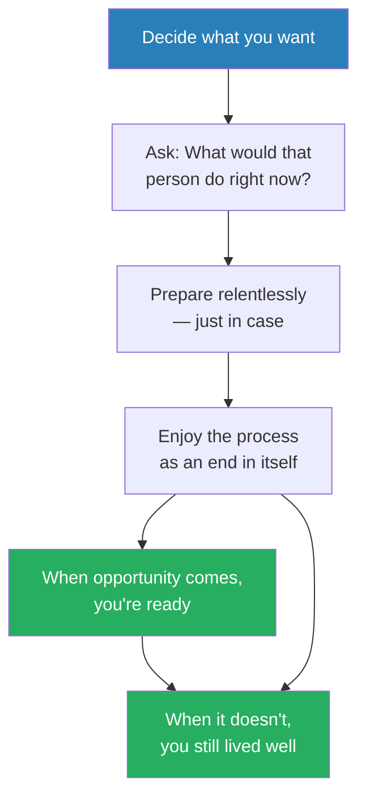
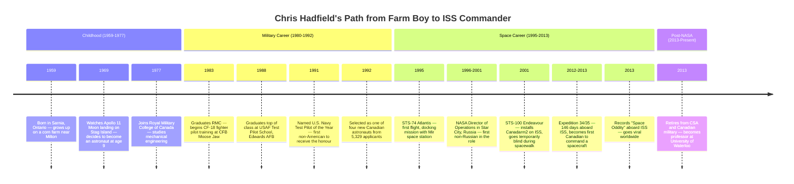
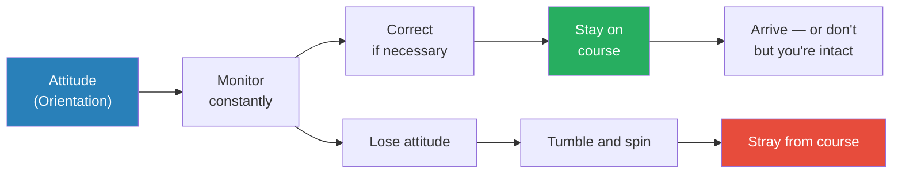
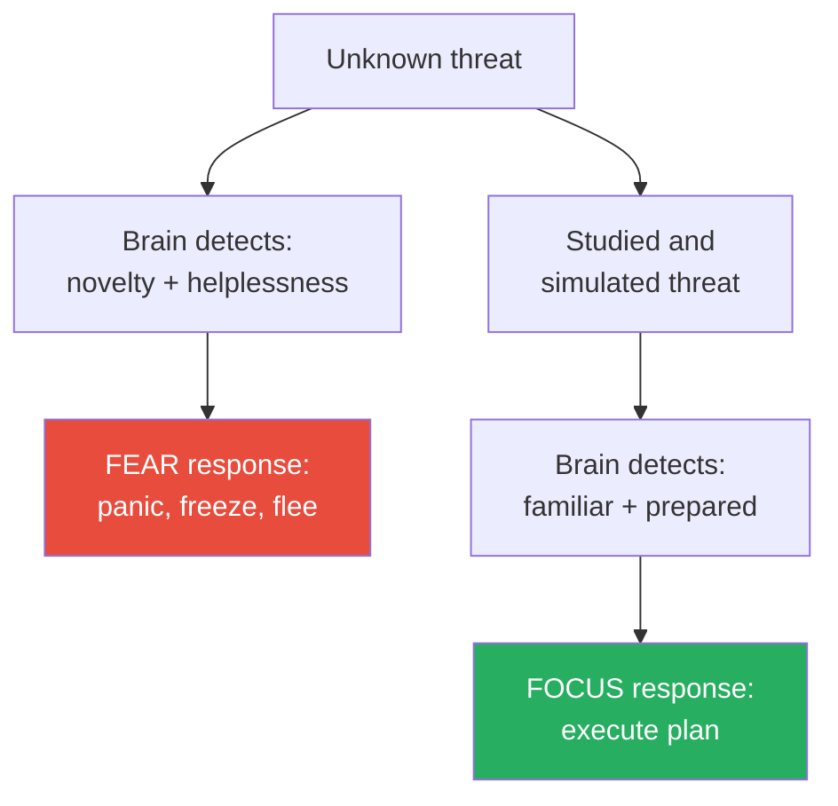
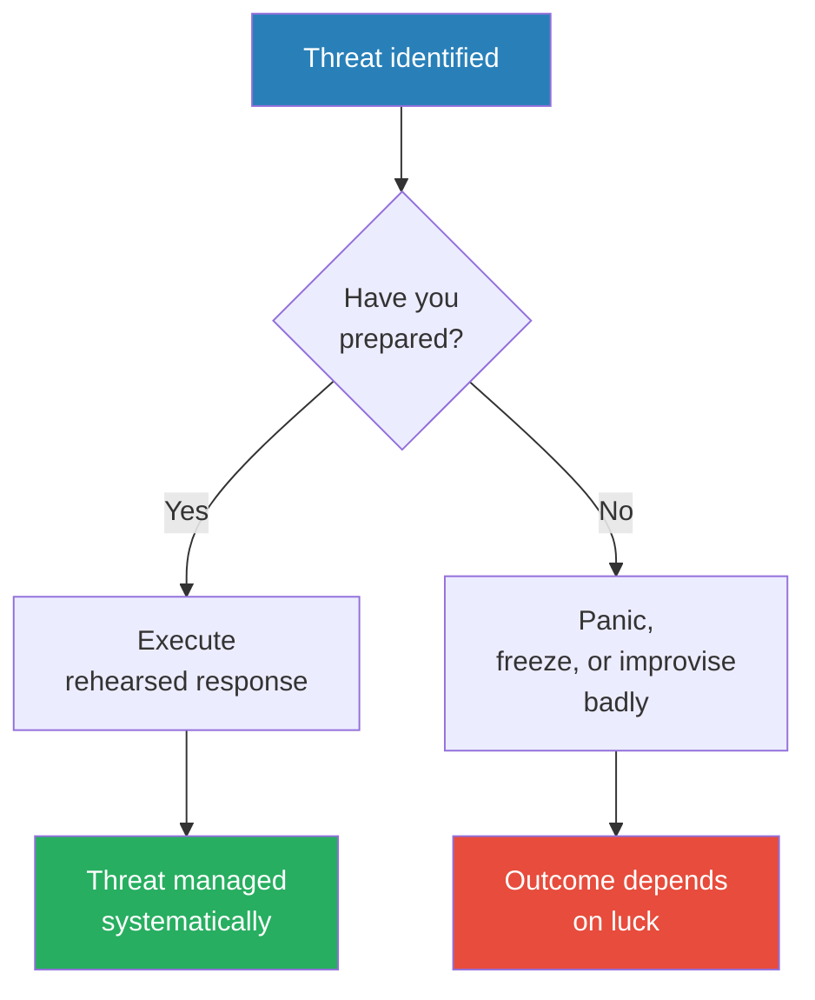
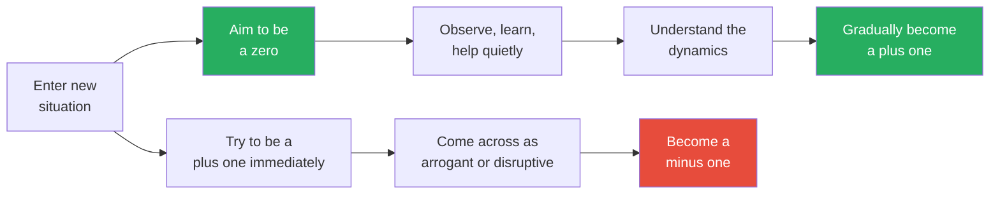
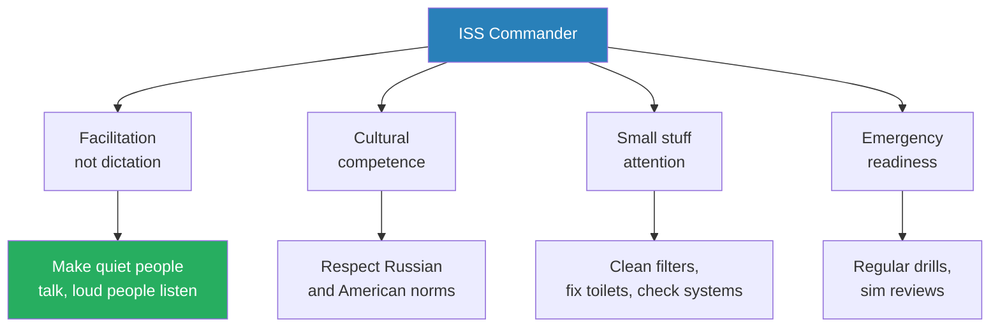
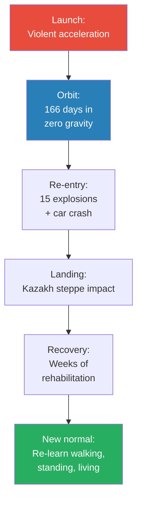
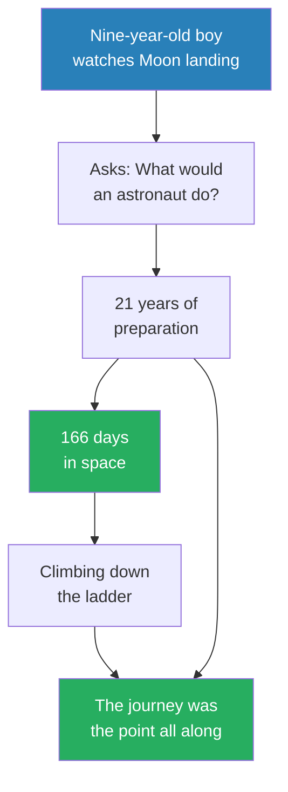

# An Astronaut's Guide to Life on Earth — Chris Hadfield

> Chris Hadfield — Canadian astronaut, fighter pilot, test pilot and the first Canadian to command the International Space Station — distils a lifetime of high-stakes preparation into a surprisingly humble philosophy of living. The core argument is counterintuitive: the best way to reduce fear is to imagine everything that can go wrong; the best way to succeed is to aim to be a zero, not a hero; and the journey of getting ready for something matters far more than the moment itself. Hadfield flew three space missions over twenty years, spent 166 days in orbit, performed two spacewalks, and commanded the ISS during Expedition 35 — yet he insists the real lessons were learned on the ground, through thousands of hours of preparation, simulation and quiet, unglamorous work. This is not a book about space. It is a book about how to live with competence, humility and relentless curiosity — told by a man who happened to learn those lessons while orbiting the Earth at 17,500 miles per hour.

---

## About the Author

Chris Hadfield was born in 1959 in Sarnia, Ontario, and grew up on a corn farm near Milton. He decided to become an astronaut at age nine after watching Neil Armstrong walk on the Moon — despite the fact that Canada did not even have a space agency at the time. He attended Royal Military College, became a CF-18 fighter pilot, graduated top of his class at the U.S. Air Force Test Pilot School at Edwards Air Force Base, and was named U.S. Navy Test Pilot of the Year in 1991. Selected by the Canadian Space Agency in 1992, he flew on Space Shuttle Atlantis (STS-74, 1995), Space Shuttle Endeavour (STS-100, 2001), and the Russian Soyuz to the ISS (Expedition 34/35, 2012-2013), where he became the first Canadian to command a spacecraft. His rendition of David Bowie's "Space Oddity," recorded aboard the ISS, became one of the most-watched music videos in YouTube history.

---

## The Big Idea

- <b style="color: #27ae60">The real work of becoming an astronaut — or becoming excellent at anything — happens during the long, unglamorous years of preparation, not during the brief moments of glory</b>
  - Hadfield spent 21 years as an astronaut but only 166 days in space
  - The ratio of preparation to performance is measured in years to single days
  - Most of an astronaut's career is spent training, studying, simulating and supporting other people's missions
  - The preparation itself is not the price of admission — it is the point
- Hadfield's philosophy rests on several counterintuitive principles that invert popular self-help wisdom:
  - <b style="color: #e74c3c">Don't think positive — think negative</b>: visualise everything that can go wrong and prepare for it, because that's what actually neutralises fear
  - <b style="color: #27ae60">Sweat the small stuff</b>: obsessive attention to mundane details is what keeps people alive in extreme environments — and what builds genuine competence everywhere else
  - <b style="color: #2980b9">Aim to be a zero, not a hero</b>: in any new situation, the smartest move is to contribute quietly without making waves, rather than trying to prove your brilliance
- The book draws its power from Hadfield's voice — warm, self-deprecating, deeply practical
  - He writes about space with genuine wonder but refuses to be precious about it
  - The stories are specific, vivid and often funny: broken tractors, bees inside visors, snakes in cockpits, toilet repairs during spacewalks
  - Every space story comes paired with an Earth lesson — the book's subtitle is the point, not the backstory
- What separates this from typical motivational writing is the evidence base:
  - Hadfield is not theorising about preparation — he survived it, literally
  - The stakes were not metaphorical — a missed checklist item could kill six people
  - His failures are presented as openly as his successes, which gives the advice credibility that "believe in yourself" platitudes cannot match

This diagram captures Hadfield's central philosophy: preparation is not sacrifice — it is the substance of a good life, regardless of whether the big moment ever arrives.

The force diagram reveals that Hadfield's principles are not a list but a web — Preparation sits at the centre with the most connections, reinforcing his argument that the journey of getting ready is itself the substance of a meaningful life.

---

## Key Concepts at a Glance

| Concept | One-line summary |
|---------|-----------------|
| **"What would an astronaut do?"** | The childhood heuristic that turned a dream into a decision framework |
| **Attitude as orientation** | Like a spacecraft, your attitude determines your trajectory — monitor and correct constantly |
| **The power of negative thinking** | Visualise worst cases to neutralise fear and build genuine confidence |
| **Sweat the small stuff** | Obsessive attention to mundane detail is what keeps people alive — and competent |
| **Minus one / zero / plus one** | Framework for entering any new group: aim to be a zero before trying to be a plus one |
| **Expeditionary behaviour** | Putting group needs above personal ego, especially in confined or high-stakes environments |
| **"Just in case" preparation** | Constant skill-building for opportunities that may never come — and being at peace with that |
| **Competence through simulation** | Practice until the real thing feels like a repeat, not a first attempt |
| **Bold strokes vs. small stuff** | Dramatic acts get glory, but quiet attention to detail is what keeps people alive |
| **Climbing down the ladder** | Ending a chapter with as much care, attention and grace as you used to begin it |

---

## Introduction: Mission Impossible

*Hadfield opens with the image that defines his life — a square astronaut trying to squeeze through a round hole — and traces the improbable path from a nine-year-old boy on an Ontario island to the commander of the International Space Station.*

- The book begins mid-spacewalk: Hadfield is floating in the airlock before his first EVA, tools strapped to his chest, oxygen pack on his back, trying to wiggle through a small circular hatch
  - The cinematic moment he'd imagined — elegantly pushing off into infinite space — was replaced by the reality of trying not to snag his spacesuit or get tangled in his tether
  - <b style="color: #2980b9">"Square astronaut, round hole"</b> — his metaphor for every challenge in his life: figuring out how to get where you want to go when just getting out the door seems impossible
  - This image frames the entire book: the gap between the glamorous idea of a thing and the messy, unglamorous reality of actually doing it

> [!example] The Night on Stag Island (July 20, 1969)
> - Nine-year-old Chris and his brother Dave were spending the summer at the family cottage on Stag Island, Ontario
> - They had no television, so they crossed to a neighbour's cottage and crammed into the living room with everyone else on the island
> - They watched Neil Armstrong descend the ladder and step onto the Moon — grainy footage, but unmistakable
> - The room erupted; walking back to the cottage, Chris looked up at the Moon and decided he wanted to be an astronaut
> - He knew it was impossible — astronauts were American, Canada had no space agency — but Armstrong had just done the impossible
> - The next morning, he began asking himself: "What would an astronaut do if he were nine years old?"
> **The lesson:** You don't need a roadmap to start pursuing an impossible goal — you just need a heuristic that shapes daily decisions.

- From that night, Hadfield's dream provided direction without becoming an obsession:
  - He never announced the goal publicly — it would have sounded as plausible as wanting to be a movie star
  - Instead, he made each choice through the filter of <b style="color: #2980b9">"What would an astronaut do?"</b>
    - Would an astronaut eat vegetables or potato chips?
    - Would an astronaut sleep in or get up early to read?
    - Would an astronaut skip mathematics or work through the hard problems?
  - This heuristic was not a guarantee of success — it was a decision filter that aligned daily choices with a long-term aspiration
  - He joined Air Cadets at 13, got his glider licence at 15, started flying powered planes at 16
  - He attended military college, majored in mechanical engineering, and kept a picture of the Space Shuttle over his desk

---

> [!example] The Broken Tractor Drawbar
> - As a teenager on the family farm, Hadfield drove a tractor up a hedgerow too confidently and hooked the drawbar on a fence post, breaking it
> - His father didn't say "That's all right, go play" — he told Chris to learn to weld the bar back together, then get back to work
> - Chris welded it, reattached it, went back to the field — and broke it again the exact same way
> - No one needed to yell at him; he was already furious at his own foolishness
> - He welded it a second time and headed out again, considerably more cautiously
> **The lesson:** The farm taught accountability — you break it, you fix it, and you learn not to break it again.

- The farm upbringing shaped Hadfield's character in ways that military and academic training later refined:
  - Farm kids learn mechanical competence by necessity — broken equipment doesn't fix itself, and the nearest mechanic is expensive and far away
  - They learn that complaining about a problem doesn't solve it — only action does
  - They learn to assess risk in real terms: a tractor can kill you, a combine can maim you, and these are not hypothetical dangers
  - <b style="color: #27ae60">This practical, hands-on relationship with consequence became the foundation of Hadfield's approach to preparation</b>

---

- The path from dream to reality was anything but straight:
  - Fighter pilot training at CFB Moose Jaw, Saskatchewan — long, cold, grueling
  - Posted to CFB Bagotville, Quebec (not Europe as expected) — flying CF-18s, learning to be content wherever the military sent him
  - Nearly quit to become an airline pilot — <b style="color: #27ae60">Helene intervened</b>: "You don't really want to be an airline pilot. Don't give up on being an astronaut."
  - Won a slot at the U.S. Air Force Test Pilot School at Edwards Air Force Base, graduating top of his class in 1988
  - Named U.S. Navy Test Pilot of the Year in 1991 — the first non-American to receive the honour
  - Then the Canadian Space Agency advertised: "Wanted: Astronauts"

> [!example] The CSA Selection Process (1992)
> - Hadfield submitted a professionally printed and bound resume — approximately the size of a phone book — in both English and French
> - It arrived alongside 5,329 other applications
> - Five months of nerve-wracking elimination rounds followed: psychiatric evaluations, interviews with industrial psychologists in hotel rooms, medical tests, panel interviews
> - In the final round of 20 candidates in Ottawa, during his hour-long panel interview, someone asked a tough question and Hadfield blurted out: "Mac, you want to take this one?" — referencing the panel chair's habit of fielding questions
> - It was a gamble that could have been read as arrogance, but the panel laughed and it bought him time to think
> - On a Saturday in May, the call came at 1:00 p.m. — Mac Evans asked if he wanted to be an astronaut
> - His main emotion was not joy but "an enormous rush of relief"
> **The lesson:** Even at the moment of achieving a lifelong dream, the feeling was relief that years of preparation hadn't been wasted — not euphoria.

> [!tip] Core Insight
> The dream of being an astronaut was never about the destination — it was about the kind of person the pursuit would make him become.

The timeline reveals that Hadfield spent 44 years preparing for a cumulative 166 days in space — a preparation-to-performance ratio that underscores his central argument: the journey of getting ready *is* the life.

---

## Part I: Pre-Launch

### Chapter 1: The Trip Takes a Lifetime

*Hadfield dismantles the glamorous image of astronaut life and reveals that the real substance of the job is the thousands of unglamorous days spent preparing on the ground.*

- <b style="color: #27ae60">An astronaut is someone who's able to make good decisions quickly, with incomplete information, when the consequences really matter</b>
  - Space flight alone doesn't confer this ability — it takes years of ground-based training, simulation and operational experience
  - After his first mission (STS-74, 1995), Hadfield felt he'd been to space but hadn't yet become an astronaut
  - The difference between him and veteran Jerry Ross was enormous in terms of what they could contribute
  - Being a rookie in space is like being a medical student in an operating room — you're technically present, but you're not yet competent enough to lead

> [!example] Jerry Ross's Bouncing Knee (STS-74, 1995)
> - Jerry Ross was the most seasoned astronaut on the crew — it was his fifth space flight
> - He was quietly competent, immensely calm, the archetype of the trustworthy astronaut
> - Throughout training, whenever Hadfield was unsure what to do, he'd look at Jerry
> - Five minutes before launch, Hadfield noticed something he'd never seen: Jerry's right knee was bouncing up and down
> - Hadfield thought: "Something really incredible must be about to happen if Jerry's knee is bouncing"
> - During ascent, Hadfield became aware his own face hurt — he'd been smiling so hard his cheeks were cramping
> **The lesson:** Even the most experienced professionals feel the intensity of peak moments — the difference is they channel it into focus, not panic.

---

- The CAPCOM role taught Hadfield more than any single space flight:
  - <b style="color: #2980b9">CAPCOM (Capsule Communicator)</b> — the main conduit between Mission Control and astronauts on orbit
  - He served as Chief CAPCOM and worked 25 Shuttle flights from the ground
  - The job required constant analysis, quick judgment, and the ability to translate dense technical jargon into clear, actionable communication
  - It was "like being coach, quarterback, water boy and cheerleader, all in one"
  - Every communication had to be precise — the wrong word at the wrong time could cause a crew to execute the wrong procedure

- The CAPCOM role also taught him <b style="color: #2980b9">the difference between being on a team and leading one</b>:
  - On the ground, you see the full picture — telemetry, weather, trajectory data — that the crew in space cannot see
  - You must decide what information to share, when to share it, and how to phrase it
  - Too much information overwhelms; too little leaves the crew flying blind
  - The discipline of filtering and communicating clearly became one of Hadfield's most transferable skills

> [!tip] Core Insight
> Being on the ground for six years between his first and second flights made Hadfield a much better astronaut. The unglamorous years weren't wasted — they were the education.

- Astronauts are fundamentally in the service profession:
  - Public servants tasked with making space exploration safer and more scientifically productive — for others, not for themselves
  - The job description is not "experience personal thrills in space"
  - Most days involve training, classes, exams, ground jobs supporting other astronauts' missions
  - Millions of dollars are invested in each astronaut's training; they're entrusted with billions of dollars of equipment
  - <b style="color: #e74c3c">The astronaut who treats the role as a personal adventure rather than a public service doesn't last long</b>

- Hadfield's three missions illustrate the progression from passenger to commander:
  - **STS-74 (1995):** His first flight, aboard Atlantis — a docking mission with the Russian space station Mir; Hadfield was primarily a mission specialist, learning the basics of space operations while veterans like Jerry Ross ran the show
  - **STS-100 (2001):** Aboard Endeavour, Hadfield installed Canadarm2 — the robotic arm — on the ISS and performed two spacewalks; this was the mission where he was temporarily blinded by contaminated anti-fog solution in his visor during an EVA, yet continued working
  - **Expedition 34/35 (2012-2013):** His final mission, launched on a Soyuz, spending 146 days aboard the ISS and commanding it for the final two months; this was the culmination of 21 years of preparation
  - The gap between flights — six years between his first and second, eleven between his second and third — was not wasted time but the most intensive learning period of his career
  - Each gap was filled with ground assignments that deepened his understanding of space operations far beyond what a single flight could teach
  - The trajectory from passenger to commander took 17 years — and Hadfield argues this is exactly how long it should take

The bar chart makes visible the staggering asymmetry between preparation and performance: Hadfield spent 11 years preparing for his final mission that lasted 146 days — a ratio that vindicates his philosophy that the preparation itself must be the reward, not just the price of admission.

> [!example] NASA's Director of Operations in Star City, Russia
> - Between his first and second flights, Hadfield was assigned to Star City — the Soviet-era cosmonaut training facility outside Moscow
> - He was the first non-Russian to serve as NASA's Director of Operations there
> - He lived in a Russian apartment building, shopped at Russian markets, learned to navigate Russian bureaucracy
> - The experience taught him that cross-cultural competence isn't optional in international operations — it's a survival skill
> - His Russian language ability, developed during this period, later proved essential when he commanded a crew that included two Russian cosmonauts on the ISS
> **The lesson:** The most valuable skills are often the ones nobody tells you to develop — you seek them out because curiosity and thoroughness demand it.

---

### Chapter 2: Have an Attitude

*Hadfield borrows a term from spacecraft navigation — "attitude" means orientation — and argues that maintaining the right mental attitude is the single variable within your control, and the one that matters most.*

- In space flight, <b style="color: #2980b9">attitude</b> refers to which direction your vehicle is pointing relative to the Sun, Earth and other spacecraft
  - If you lose control of your attitude, two things happen:
    - The vehicle starts to tumble and spin, disorienting everyone
    - It strays from its course, potentially fatally
  - Astronauts constantly monitor and adjust attitude using every available cue
  - <b style="color: #27ae60">Maintaining attitude is fundamental to success — losing attitude is worse than not reaching your destination</b>
  - The parallel to life is exact: you cannot always control your circumstances, but you can always control your orientation toward them

- Hadfield applied this directly to his life on Earth:
  - He couldn't control whether he'd get assigned to a mission — too many variables were beyond his control
  - What he could control was his attitude during the journey
  - He viewed space flight as "a bonus, not an entitlement"
  - This pessimistic-sounding realism actually helped him love his job for over two decades
  - <b style="color: #e74c3c">Astronauts who view flight as an entitlement become bitter during the long waits between assignments — and bitterness is corrosive to performance</b>

| Mindset | Approach | Result |
|---------|----------|--------|
| **Entitled** | "I deserve to fly — training is just the toll" | Misery during training, devastation if scrubbed |
| **Realistic** | "I may never fly — training is the work" | Enjoyment every day, resilience if scrubbed |
| **Hadfield's** | "Space flight is a bonus — the journey is the point" | Two decades of sustained motivation |

The difference between these mindsets isn't about talent or credentials — it's about where you locate your sense of purpose.

> [!example] Preparing to Play "Rocket Man" with Elton John
> - Hadfield was invited to an air show in Windsor, Ontario, that overlapped with an Elton John concert
> - The organisers planned to ask Elton John to cross-promote the air show
> - Hadfield thought: the odds are near zero, but what's the most extreme thing that could happen?
> - He imagined Elton John discovering that a guitar-playing astronaut was at the air show and inviting him on stage
> - There was only one possible song: "Rocket Man"
> - So Hadfield sat down and learned to play it, practising until he was confident he wouldn't be booed off stage
> - He met Elton John at the concert, had a nice ten-minute conversation — and never got near the stage
> - He has no regrets about being ready
> **The lesson:** "I spend my life getting ready to play 'Rocket Man.'" Preparation for unlikely events is never wasted if you enjoy the process.

---

- <b style="color: #27ae60">"Be ready. Work. Hard. Enjoy it!"</b> — Hadfield's universal saying, applicable to any situation
  - His children found it so reliably deployed that they created a game called "The Colonel Says," parroting his favourite expressions
  - Another favourite, barked from beneath the family car: "No one ever accomplished anything great sitting down"
  - These weren't hollow slogans — they were the distilled output of a lifetime spent turning preparation into purpose

- The "just in case" mentality drove every career decision:
  - He asked to be trained to fly the Soyuz — knowing a North American would only fly one if the Russian commander was completely incapacitated
  - He learned Russian, moved into a Russian apartment building in Star City, embraced the culture
  - He got qualified as a flight engineer cosmonaut and to perform spacewalks in the Russian spacesuit
  - None of this was required, and he was never called on to command the Soyuz — but the extra knowledge helped him in his day job and made him a more effective colleague
  - <b style="color: #27ae60">Every skill he acquired "just in case" made him more versatile, more valuable, and more interesting — whether or not the specific scenario ever materialised</b>

> [!example] Learning to Fly Russian Helicopters
> - While stationed at Star City, Hadfield noticed that the cosmonauts all trained extensively in Russian helicopters
> - No one asked him to learn — it wasn't part of his assignment
> - But he reasoned that understanding how Russians train would make him a better colleague and a more effective operations director
> - He spent weeks learning to fly the Mi-8, mastering Russian aviation terminology and cockpit procedures
> - The helicopter training never directly contributed to a space mission — but it gave him credibility with his Russian counterparts that no amount of diplomatic friendliness could have matched
> **The lesson:** Competence is the universal language of respect. People trust you when they see you've put in the work to understand their world.

> [!tip] Core Insight
> You are getting ahead if you learn, even if you wind up staying on the same rung. Advancement means learning, not climbing.

---

Whether in a Soyuz capsule or a career, the principle is the same: you can't always control where you end up, but you can control which direction you're facing.

---

### Chapter 3: The Power of Negative Thinking

*Hadfield inverts the self-help industry's favourite mantra and explains why astronauts are trained to imagine the worst — and why this practice, far from being pessimistic, is the most reliable way to neutralise fear.*

- <b style="color: #e74c3c">Fear comes from not knowing what to expect and not feeling you have control over what's about to happen</b>
  - When you feel helpless, everything is alarming
  - When you know the facts and have rehearsed your responses, fear transforms into focused readiness
  - Hadfield's main emotion at launch was not fear — it was relief: "At last"
  - This is not bravado — it is the predictable outcome of years of systematic desensitisation through knowledge and practice

- Astronauts neutralise fear through exhaustive simulation:
  - They spend years in "sims" — highly realistic simulations where instructors throw every conceivable failure at them
  - The question they learn to ask: <b style="color: #2980b9">"Okay, what's the next thing that could kill me?"</b>
  - By the time they sit on a real rocket, they've already "experienced" hundreds of emergencies
  - The real launch feels like a particularly well-run simulation — familiar, not terrifying
  - The sim instructors are legendary for their sadism — they pile failures on top of failures, deliberately overwhelming the crew to find their breaking points
  - The goal is not to produce anxiety-free astronauts but anxiety-competent ones — people who can function under extreme stress because they've practised it
  - <b style="color: #2980b9">The sim supervisor</b> is the unsung hero of spaceflight — this person designs scenarios specifically to overwhelm and break the crew, then debriefs every failure in detail
  - After each simulation, the crew reviews what went wrong, what they missed, and what they'd do differently — this feedback loop is where the real learning happens

> [!example] Hadfield and the Black Widow Spider
> - Early in his career, Hadfield was bitten by a black widow spider and had a significant reaction
> - For years afterwards, he was wary of spiders — a manageable fear on Earth, but a potential problem in space
> - During a spacewalk training exercise, a spider built a web inside his spacesuit visor
> - In zero gravity, there was nothing he could do — he couldn't remove his visor, couldn't blow the spider away, couldn't scratch his face
> - He had to continue the spacewalk with a spider crawling across his field of vision
> - The reason he managed it: years before, he'd deliberately educated himself about spiders — which ones were dangerous, which weren't, how they behaved
> - By the time the spider appeared in his visor, his knowledge had neutralised most of his fear
> **The lesson:** The antidote to fear is not courage — it's competence. Learn everything about the thing you fear, and it shrinks to manageable size.

---

- Hadfield extends the "power of negative thinking" beyond space:
  - He applies it to everyday situations — imagining worst cases while driving, flying, or managing household emergencies
  - His dinner party game: "What's the most likely thing that would kill you right now?"
    - Most people say cancer or heart attack
    - Hadfield walks them through the actual probabilities of the specific room they're in: fire exits, structural risks, medical supplies
  - <b style="color: #27ae60">The point is not to be morbid but to be prepared — once you've thought through the worst case, you can stop worrying about it</b>
  - The paradox: people who refuse to think about worst cases live in more anxiety than those who confront them directly

> [!example] Simulating Launch Failures
> - Before every Shuttle launch, astronauts spend weeks in the simulator practising what to do if the rocket explodes, loses an engine, or experiences a systems failure during the most dangerous phase of ascent
> - They rehearse emergency landings at airports they'll never see — runways in Spain, Senegal, the Azores — because in certain abort scenarios, those are the only places to land
> - They practise evacuating a burning launch pad, sliding down zip lines in their pressure suits, leaping into armoured vehicles
> - The simulations are so realistic that by launch day, the crew has "failed" hundreds of times — and survived every failure
> - When the real launch happens, the crew's nervous systems respond with focus rather than panic because the stimuli are already familiar
> **The lesson:** You can't eliminate danger, but you can eliminate surprise. And surprise, not danger, is what triggers panic.

---

> [!abstract] Hadfield's Fear Neutralisation Process
> 1. Identify the specific thing you're afraid of
> 2. Learn everything you can about it — mechanisms, probabilities, actual risks
> 3. Walk through the worst-case scenario in detail: what would happen, step by step?
> 4. Determine what actions you could take at each step to improve the outcome
> 5. Practice those actions until they become automatic
> 6. When the situation arises, your fear has been replaced by a plan

- The difference between positive and negative thinking in high-stakes environments:

| Approach | Before launch | During emergency | After emergency |
|----------|--------------|-----------------|-----------------|
| **Positive thinking** | "It'll be fine!" | Panic — no prepared response | "I got lucky" |
| **Negative thinking** | "What if X fails?" | Execute rehearsed procedure | "The training worked" |

Hadfield doesn't argue against optimism — he argues against unprepared optimism. <b style="color: #e74c3c">Hoping for the best without preparing for the worst is not confidence — it's complacency.</b>

---

- The mechanism behind negative thinking is rooted in how fear actually works in the brain:
  - Fear is triggered by novelty and helplessness — the brain detects an unfamiliar threat and concludes it has no response available
  - Preparation attacks both triggers simultaneously:
    - It makes threats familiar (reducing novelty)
    - It provides rehearsed responses (reducing helplessness)
  - The result is not the absence of fear but the presence of a plan — and a plan is the opposite of panic
  - <b style="color: #27ae60">Competence is the real antidote to fear, and competence is built through the systematic practice of imagining things going wrong</b>

This is the neurological mechanism behind Hadfield's argument: preparation rewires the brain's threat response from panic to procedure.

---

### Chapter 4: Sweat the Small Stuff

*Hadfield takes direct aim at the popular "don't sweat the small stuff" philosophy and explains why, in space and on Earth, the small stuff is the only stuff that matters — because it's where catastrophes begin.*

- <b style="color: #27ae60">At NASA, there is no problem so small it is not worth solving</b>
  - The culture of sweating small stuff is not neurotic perfectionism — it's survival
  - In space, a loose bolt, a misread gauge, or a forgotten checklist item can kill everyone on board
  - On Earth, the same principle applies: small competencies compound into reliable excellence
  - The Challenger disaster (1986) was caused by an O-ring — a small rubber gasket — that failed because engineers' concerns about cold-weather performance were dismissed

- Hadfield learned this on the ground first, during jet training in Moose Jaw, Saskatchewan:
  - The Canadian Forces basic jet training was brutally demanding: 200 hours in a CT-114 Tutor, each flight evaluated
  - A poor flight meant a "re-ride" — posted on a board for everyone to see
  - Too many re-rides and you were expelled from the program
  - The system taught that small errors matter because they compound, and public accountability prevents complacency
  - <b style="color: #e74c3c">The students who washed out were rarely the least talented — they were the ones who dismissed small mistakes as unimportant</b>

> [!example] Nearly Going Down the Drain in a T-38
> - During advanced training, Hadfield was flying a T-38 Talon — a high-performance supersonic jet
> - He became distracted by something inside the cockpit — a small, mundane detail that pulled his attention
> - In the seconds he looked away, the aircraft's attitude changed
> - By the time he looked up, the jet was in a dangerous descent — what pilots call "going down the drain"
> - He recovered, but the incident stayed with him: a moment of inattention in a high-performance environment nearly cost him his life
> - The cause wasn't incompetence — it was a momentary lapse in attention to small details
> **The lesson:** In high-performance environments, the gap between routine and catastrophe is measured in seconds of inattention.

---

- The principle extends to the mundane realities of space life:
  - <b style="color: #2980b9">Checklists</b> are a way of life for astronauts — not because they can't remember procedures, but because human memory is unreliable under stress
  - Every spacewalk is choreographed years in advance by hundreds of people
  - Even basic tasks like going to the toilet require careful procedure in zero gravity
  - Hadfield's underwear protocol for space — pack extras, dispose of used ones properly — sounds trivial but reflects the culture of obsessive attention to detail
  - The same crew that builds a robotic arm on the outside of the station also meticulously cleans the air filters inside it
  - <b style="color: #27ae60">In space, there is no division between "important work" and "trivial maintenance" — it is all critical, because neglecting anything can cascade into catastrophe</b>

- Hadfield connects this to everyday life with characteristic directness:
  - People who dismiss small tasks as beneath them rarely excel at large ones either
  - The discipline of paying attention to details builds the muscle of awareness that serves you when the stakes are genuinely high
  - Sweating the small stuff is not anxiety — it is professionalism

> [!example] The Checklist Culture at NASA
> - Every procedure on the ISS — from scientific experiments to changing light bulbs — has a written checklist
> - The checklists are not suggestions; they are legal documents that the crew must follow step by step
> - When Hadfield needed to repair the station's toilet, he followed a checklist developed by engineers on the ground who had spent weeks perfecting the procedure
> - He didn't improvise, even though he was an experienced mechanical engineer — because the checklist represented the collective intelligence of dozens of specialists
> - This is the same principle that makes aviation safe: individual brilliance is unreliable, but systematic procedures are repeatable
> **The lesson:** Checklists are not crutches for the incompetent — they are tools that allow competent people to perform reliably under stress.

> [!tip] Core Insight
> Bold strokes get the attention, but expeditionary behaviour — the willingness to attend to boring, unglamorous details — is what actually keeps people alive and missions on track.

- Hadfield draws a distinction between <b style="color: #2980b9">bold strokes</b> and <b style="color: #2980b9">expeditionary behaviour</b>:
  - **Bold strokes** are the dramatic, visible acts — launching into space, making a critical repair, commanding the ISS
  - **Expeditionary behaviour** is the quiet, sustained attention to small things — checking seals, cleaning filters, reviewing checklists, maintaining equipment
  - In reality, bold strokes are only possible because of the thousands of small acts of expeditionary behaviour that precede them
  - The astronaut who can fix a toilet is more valuable than the one who can give a great speech about space exploration
  - <b style="color: #27ae60">Expeditionary behaviour is the connective tissue between preparation and performance — it's what makes the dramatic moments possible</b>

| Type of Work | Visibility | Frequency | Impact |
|-------------|-----------|-----------|--------|
| **Bold strokes** | High — everyone notices | Rare — once in a career | Depends entirely on preparation |
| **Expeditionary behaviour** | Low — no one notices | Daily — constant | Compounds into reliability and trust |

The paradox: bold strokes receive all the recognition, but they are the product of expeditionary behaviour, which receives none.

---

### Chapter 5: The Last People in the World

*Hadfield describes what happens when a room full of people who have always been the smartest and most capable person around suddenly discover they are merely average — and how some handle it and others don't.*

- Every astronaut arrives at the Johnson Space Center believing they are the best of the best:
  - They've spent decades outperforming everyone around them
  - Selection rates are staggeringly low — 2 from 5,351 in Canada's 2009 round, 9 from 3,564 at NASA that same year
  - A Ph.D. is "just table stakes" and a nose polyp is a deal breaker
  - By the time you arrive, you feel like the creme de la creme

> [!example] Getting Off the Elevator at JSC (1992)
> - Hadfield and 23 other new ASCAN (Astronaut Candidate) members rode the elevator up to the Astronaut Office, quietly giddy
> - They thought they'd arrived at the pinnacle
> - Then the elevator doors opened and they were surrounded by people who had already been to space multiple times
> - These veterans had walked on the outside of spacecraft, operated billion-dollar robotic arms, and made life-or-death decisions in real time
> - The new astronauts' carefully cultivated sense of superiority evaporated instantly
> - They went from feeling like rock stars to realising they were the most junior people in the room
> **The lesson:** No matter how accomplished you are, there's always a room where you're the least experienced person — and that's exactly where the learning happens.

---

- <b style="color: #e74c3c">The most dangerous astronauts are those who can't handle not being the best</b>
  - Some gifted people cross a threshold during training where raw talent is no longer sufficient — the volume of material is simply too great to wing it
  - Those who adapt — who "buckle down and study" — continue to develop
  - Those who don't — who rely on natural ability and assume they'll figure it out — fall behind in a classic tortoise-and-hare pattern
  - These people don't recognise their own weaknesses and resist taking responsibility when things go wrong
  - They go from being considered rock stars to having a reputation as people you can't count on

- The mechanism behind this failure is predictable:
  - Lifelong high achievers develop an identity built on being the best
  - When they enter an environment where everyone is equally talented, their identity is threatened
  - Some respond by doubling down on effort — they treat the challenge as an opportunity to grow
  - Others respond by protecting their ego — they blame the system, dismiss the training, or coast on charm
  - <b style="color: #e74c3c">The ego-protection strategy works briefly but fails catastrophically in high-stakes environments where competence is eventually tested under real pressure</b>

- Key personality differences that determine astronaut success:

| Trait | Succeeds | Fails |
|-------|----------|-------|
| **Response to difficulty** | Buckles down, studies harder | Assumes talent will carry them |
| **Ego management** | Accepts being a beginner again | Can't handle not being the best |
| **Accountability** | Owns mistakes, seeks feedback | Blames circumstances, deflects |
| **Work ethic** | Sustained, methodical effort | Brilliant bursts, inconsistent follow-through |
| **Team orientation** | Puts group needs first | Prioritises personal visibility |

These differences are not about intelligence — every astronaut is exceptionally smart. They're about how people respond when intelligence alone is no longer sufficient.

> [!example] The Astronaut Who Couldn't Adapt
> - Hadfield describes (without naming) a colleague who arrived at JSC with a stunning resume and enormous natural talent
> - In early training, this person excelled — breezing through material that others found challenging
> - But as the training intensified and the volume became overwhelming, natural talent was no longer enough
> - Instead of adjusting their study habits, this person began blaming the training program, criticising the instructors, and coasting on their reputation
> - Over time, their crewmates lost trust — not because they weren't smart, but because they weren't reliable
> - In space, reliability matters more than brilliance — you need to know that the person beside you has done the work, not just understood the concept
> **The lesson:** Talent gets you in the door. Sustained effort, humility, and accountability keep you there.

---

### Chapter 6: What's the Next Thing That Could Kill Me?

*Hadfield makes the case for continuous threat assessment — not as paranoia, but as a practical method for staying alive in environments where complacency kills.*

- The chapter title captures the question astronauts learn to ask themselves constantly during dynamic operations:
  - Not "What might go wrong eventually?" but "What's the next thing that could kill me right now?"
  - The question forces immediate, specific, actionable awareness
  - It's the opposite of complacency — it keeps attention sharp without inducing panic
  - <b style="color: #2980b9">The question is not driven by anxiety — it's driven by discipline</b>

> [!example] The Bee in the Visor
> - During basic jet formation training, Hadfield was flying third in a row of four aircraft, boxed in, when he noticed movement inside his visor
> - A bee — a large one — was crawling slowly near his eyeball, groggy from the thin air at altitude
> - He couldn't blow on it (wearing a mask), couldn't swat it (hands needed for flying), couldn't break formation (would endanger pilots on either side)
> - He had to continue flying his plane steadily while a potentially disoriented bee crawled inches from his eye
> - Eventually the bee settled and the formation completed safely
> - The experience taught him: when you can't eliminate a threat, you manage it by maintaining focus on the most critical task
> **The lesson:** Sometimes the right response to danger is not to fight it but to calmly continue doing your primary job.

---

- <b style="color: #2980b9">Expeditionary behaviour</b> in high-stakes situations means staying systematic:
  - During an ammonia leak alarm on the ISS — the most dangerous emergency scenario — the crew followed their training step by step
  - They sealed hatches between modules, checked each other's eyes for signs of ammonia exposure, donned emergency oxygen masks
  - The systematic response turned a potential catastrophe into a manageable event
  - The alarm turned out to be false, but the response validated years of simulation practice
  - <b style="color: #27ae60">The crew didn't know it was a false alarm when they responded — they treated it as real, and that discipline is the whole point</b>

> [!example] The ISS Ammonia Leak Alarm (January 2013)
> - During Hadfield's time aboard the ISS, the alarm for an ammonia leak sounded — ammonia is used in the station's cooling system and is lethal if inhaled
> - This is the most feared emergency on the ISS: ammonia is colourless, and by the time you can smell it, you may already have lethal exposure
> - The crew immediately executed their emergency procedures: sealing the hatches between the U.S. and Russian segments, checking each other's eyes for the telltale white crystals that indicate ammonia exposure
> - Hadfield communicated calmly with Houston throughout, reporting their status and actions
> - Every step was exactly as they had practised in simulations — the crew didn't need to think about what to do, they just did it
> - When the alarm was determined to be a false positive from a faulty sensor, the crew unsealed the hatches and resumed work
> **The lesson:** You don't get to choose when emergencies happen, but you do get to choose how well you've prepared for them. The crew responded perfectly because they'd practised the response dozens of times.

> [!tip] Core Insight
> The difference between complacency and confidence is preparation. Complacency says "it won't happen." Confidence says "I know what to do if it does."

This is the fundamental mechanism behind Hadfield's approach to fear: preparation converts unknown threats into known procedures, and known procedures don't trigger panic.

---

- The principle applies well beyond emergencies:
  - Hadfield uses the same "what's the next thing that could kill me?" discipline in routine operations
  - During spacewalks, the question is literal — every few minutes, you assess your suit integrity, tether attachment, tool security, and communication link
  - During car journeys on Earth, he runs a version of the same scan: road conditions, other drivers' behaviour, escape routes, vehicle performance
  - <b style="color: #27ae60">The discipline of continuous threat assessment is not paranoia — it is simply awareness maintained as a habit rather than summoned as a crisis response</b>

---

## Part II: Liftoff

### Chapter 7: Tranquility Base, Kazakhstan

*Hadfield takes us to the Baikonur Cosmodrome in Kazakhstan, where Soviet-era traditions, quarantine protocols and the sheer strangeness of launching from a Central Asian steppe reveal a space program that is equal parts awe-inspiring and wonderfully absurd.*

- <b style="color: #2980b9">Baikonur Cosmodrome</b> is the world's oldest and largest space launch facility:
  - It is where Yuri Gagarin launched in 1961 — the tree he planted is somehow still thriving on a barren plain
  - The town feels like a ghost town with camels wandering through holes in fences and stray dogs howling
  - In December, frost forms on your eyelashes within minutes of going outside
  - The cosmodrome is a relic of the Soviet space age, but the Soyuz rocket it launches is one of the most reliable vehicles ever built
  - The contrast is jarring: a facility that looks like it hasn't been updated since the 1960s launches human beings into space with a safety record that surpasses anything the West has produced
  - <b style="color: #27ae60">Hadfield learned to respect the Russian approach — function over form, reliability over elegance, tradition alongside innovation</b>

- The pre-launch rituals are a blend of superstition, tradition and practical necessity:
  - Two weeks of quarantine in the "Cosmonaut Hotel" — spacious suites with massive Jacuzzis
  - Floors and walls wiped with bleach daily to prevent illness before launch
  - Every crew watches the film *White Sun of the Desert* — a Russian western from 1970 — the night before launch
  - Each cosmonaut plants a tree in the avenue of cosmonauts' trees
  - Gagarin reportedly stopped to urinate on the bus tire en route to the launch pad — cosmonauts have repeated this ritual ever since
  - <b style="color: #2980b9">The rituals serve a psychological function beyond superstition</b> — they create a sense of continuity with every cosmonaut who came before, anchoring the crew in a tradition of survival

> [!example] The Quarantine and Cultural Immersion
> - For two weeks before launch, the crew is isolated at the Cosmonaut Hotel in Baikonur
> - The quarantine serves a practical purpose: getting sick before launch could scrub a mission costing hundreds of millions of dollars
> - But it also serves an emotional purpose: the crew bonds during this period, playing Ping-Pong, working out, eating together
> - Hadfield's Russian language skills — developed years earlier during his time as NASA's Director of Operations in Star City — allowed him to participate fully in the Russian rituals and conversations
> - Understanding the culture wasn't just pleasant — it was operationally essential for commanding a crew that included Russian cosmonauts
> **The lesson:** Cultural competence isn't a nice-to-have in international teams — it's a mission-critical skill.

---

> [!example] The Cosmodrome Bus Tire Ritual
> - On launch day, the crew rides a bus from the Cosmonaut Hotel to the launch pad
> - The bus stops partway, and the cosmonauts exit — in their bulky Sokol pressure suits — to urinate on the right rear tire of the bus
> - This ritual reportedly began with Gagarin, who needed to relieve himself during the drive to the pad in 1961
> - Female cosmonauts bring a vial of urine to splash on the tire instead
> - Hadfield found the whole thing absurd and wonderful — a billion-dollar space program pausing so grown adults in spacesuits could pee on a bus
> - But he participated without hesitation, because the ritual was part of the culture, and respecting it signalled his commitment to the team
> **The lesson:** Participating in a team's rituals — even the ridiculous ones — is an act of solidarity, not superstition.

---

### Chapter 8: How to Get Blasted (and Feel Good the Next Day)

*The experience of launching into space aboard a Soyuz rocket — from the ridiculous snowsuits to the ceremonial kick to the violent, beautiful, terrifying ride upward.*

- The physical experience of a Soyuz launch is visceral:
  - The crew is bundled into custom Sokol pressure suits, then — for the December 2012 launch — wrapped in additional "pillowy white snowsuits" to protect against the brutal Kazakh winter
  - Walking to the launch pad, they looked like "Michelin men, overstuffed and big of rear end"
  - Partway up the stairs to the rocket, the chief of Energia gave Hadfield a swift kick on the rear — the Russian equivalent of "break a leg"

- Inside the Soyuz, the experience is dramatically different from the Shuttle:
  - Three people crammed into a capsule barely larger than the front seat of a car
  - <b style="color: #2980b9">The Soyuz has been flying since 1967</b> — it is the longest-serving crewed spacecraft in history
  - The ride is rougher, louder, more violent — "like being shaken in a huge dog's jaws"
  - But the fundamental emotion is the same: a mixture of focused professionalism and barely contained wonder
  - <b style="color: #27ae60">The training made the real thing feel manageable — not routine, but familiar enough to channel adrenaline into focus</b>

> [!example] Comparing the Shuttle and the Soyuz
> - Hadfield is one of the very few people who has launched aboard both the Space Shuttle and the Soyuz
> - The Shuttle was like riding in a luxury SUV — spacious, smooth (relatively), with multiple redundant systems and a large crew
> - The Soyuz is like being fired from a cannon in a sports car — cramped, violent, and bare-bones
> - But in terms of safety record, the Soyuz is arguably more reliable — its simplicity is a feature, not a bug
> - Hadfield came to appreciate the Russian engineering philosophy: build it simple, build it tough, test it exhaustively, and don't change what works
> **The lesson:** Sophistication and reliability are not the same thing. Sometimes the simpler, less glamorous approach is the one that keeps you alive.

| Feature | Space Shuttle | Soyuz |
|---------|--------------|-------|
| **Crew size** | Up to 7 | 3 |
| **Cabin space** | Large cargo bay, mid-deck living area | Phone booth |
| **Ride quality** | Relatively smooth | "Shaken in a dog's jaws" |
| **Design philosophy** | Complex, multi-purpose | Simple, single-purpose |
| **Service history** | 1981-2011 (135 missions) | 1967-present (140+ missions) |
| **Safety record** | 2 losses (Challenger, Columbia) | 1 fatal flight since 1971 |

The comparison illustrates a principle Hadfield values deeply: reliability beats elegance.

---

### Chapter 9: Aim to Be a Zero

*Hadfield introduces his most counterintuitive framework: a three-point scale for measuring your impact in any new situation — and why "zero" is the smartest target.*

- <b style="color: #2980b9">The Minus One / Zero / Plus One Scale</b>:
  - **Minus one (-1):** Someone who actively makes things worse — creates problems, causes friction, damages team dynamics
  - **Zero (0):** Someone who is competent, doesn't create waves, doesn't cause problems — neutral impact
  - **Plus one (+1):** Someone who adds genuine value — makes the team better than it was before

- <b style="color: #27ae60">The counterintuitive insight: when entering any new situation, aim to be a zero</b>
  - Most high-achievers instinctively try to be a plus one immediately — to prove their value, demonstrate competence, make an impact
  - But trying to be a plus one before you understand the situation almost always backfires
  - You don't know where anything is, how things work, what the unwritten rules are, or who the key people are
  - Premature plus-one behaviour often comes across as arrogance, disruption, or tone-deafness
  - <b style="color: #e74c3c">The fastest way to become a minus one is to try too hard to be a plus one before you've earned the right</b>

- The framework explains why brilliant people sometimes fail in new environments:
  - They arrive with a mandate (real or self-imposed) to make an immediate impact
  - They begin reorganising, suggesting improvements, and asserting their expertise before understanding the context
  - The existing team perceives this as disrespect — their established methods and knowledge are being dismissed by someone who doesn't yet understand them
  - The newcomer generates resistance, resentment, and friction — becoming a minus one while trying to be a plus one
  - <b style="color: #27ae60">The zero approach works because it builds trust first and contribution second</b>

> [!example] Jerry Ross and the Commander's Inbox
> - On STS-74, Hadfield noticed that Jerry Ross — the most experienced astronaut on the crew — arrived at the office an hour early every day
> - Ross was quietly plowing through the commander's administrative inbox, handling all the tedious details so the commander could focus on important matters
> - No one asked him to do this; he never mentioned it or expected recognition
> - It was "classic expeditionary behaviour" — putting the group's needs first without fanfare
> - Ross acted as though no task was beneath him, as though he considered himself a zero: competent, but no better than anyone else
> - This made a lasting impression on Hadfield — the most experienced person on the crew was also the most humble
> **The lesson:** The person who quietly does the unglamorous work to make everyone else's job easier is often the most valuable person on the team.

---

> [!example] Arriving at the ISS as the "New Guys" (December 2012)
> - After launching from Baikonur and docking with the ISS, Hadfield's crew discussed how to handle their arrival
> - On Earth, they'd been treated like conquering heroes — but on the ISS, they were just the new guys who didn't know where anything was
> - The existing crew of three had been living and working there for months — they had their own routines, their own shorthand, their own ways of doing things
> - Hadfield's crew agreed: don't try to be heroes on day one; figure out where the trash goes and what food someone is saving before trying to reorganise anything
> - They aimed to be zeros — present, competent, not causing problems
> - Only after understanding the existing dynamics did they gradually begin to contribute in more significant ways
> **The lesson:** Observing before acting isn't weakness — it's the foundation of effective contribution in any new environment.

The path from zero to plus one is natural and earned. The shortcut from newcomer to hero almost always loops through minus one.

The radar chart reveals the counterintuitive truth at the heart of Hadfield's framework: the Minus One scores highest only on immediate visibility — the very trait that makes them destructive — while the Zero's patient profile naturally evolves into the Plus One's across every dimension that actually matters.

---

### Chapter 10: Life off Earth

*Hadfield pulls back the curtain on the mundane reality of daily life aboard the International Space Station — sleeping bags Velcroed to walls, floating food, mandatory exercise, toilet logistics and the overwhelming emotional impact of seeing Earth from above.*

- The ISS is a <b style="color: #2980b9">one-million-pound spaceship the size of a football field</b>, with an acre of solar panels:
  - Inside, there's more living space than a five-bedroom house
  - It's so large, with so many modules, that you can go nearly a full day without seeing another crewmate
  - Fifteen nations cooperated to build and maintain it
  - It orbits the Earth every 90 minutes at 17,500 miles per hour

- Daily life is highly structured but surprisingly domestic:
  - **Sleep:** Floating in sleeping bags Velcroed to the wall of a phone-booth-sized crew quarter; it's the best sleep of your life because there's no pressure on any part of your body
  - **Food:** Rehydrated meals and canned goods; tortillas instead of bread (crumbs float into equipment); condiments from home countries help combat blandness
  - **Exercise:** Two hours daily is mandatory to prevent bone density loss and muscle atrophy — the body deteriorates rapidly without gravity's constant resistance
  - **Hygiene:** No shower — only sponge baths with wet towels; water clings to skin in blobs rather than running off
  - **Toilets:** Complex vacuum systems that require careful procedure — and break down regularly
  - **Free time:** Rare, but treasured — Hadfield played guitar, photographed Earth, and video-called his family
  - **Communication:** Email and occasional video calls to family; the delay is negligible in low Earth orbit, but the emotional distance is real — Hadfield's children grew up with an absent father, and he acknowledges this cost

> [!example] Going Blind During a Spacewalk (STS-100, 2001)
> - During his first spacewalk to install Canadarm2 on the ISS, Hadfield's anti-fog solution — a diluted detergent applied inside the visor — contaminated his left eye
> - The eye began to water and sting; in zero gravity, tears don't fall — they pool, forming a growing blob of liquid that spread across his vision
> - Within minutes, both eyes were affected and he was effectively blind, tethered to the outside of the ISS, unable to see his hands or his path back to the airlock
> - He reported the situation to Houston calmly, following protocol: "I can't see"
> - Mission Control talked through options — ultimately, he opened a valve to vent a small amount of air from his suit, which carried the contaminated tears away from his eyes
> - His vision gradually returned and he completed the remaining tasks on the EVA checklist
> **The lesson:** The worst emergencies are the ones you didn't train for specifically — but the general principles of staying calm, communicating clearly, and thinking systematically apply universally.

> [!example] Toilet Repair During an EVA (April 2013)
> - While two cosmonauts, Roman and Pavel, were outside the station doing a spacewalk, Hadfield used the toilet
> - There was the usual clatter and whir — then suddenly nothing: no suction, and a bit of a mess
> - He was the only person available to fix it — Tom was in an experiment where he couldn't move, Chris and Sasha were inside their Soyuz
> - Houston talked him through a full disassembly — gloves, goggles, mask, double- and triple-bagging each component
> - Midway through, Mission Control in Russia called: close the EVA hatches before the cosmonauts go outside
> - He dashed between toilet duty and hatch duty for three hours, removing and redonning protective gear each time
> - Everything got done — hatches sealed properly, toilet repaired, EVA completed successfully
> **The lesson:** In real leadership, you toggle between high-stakes coordination and fixing the plumbing — and neither is beneath you.

---

- The emotional experience of seeing Earth from space is profound:
  - Hadfield describes watching 16 sunrises and sunsets every 24 hours, each one unique
  - The view reframes your understanding of the planet — borders are invisible, weather systems are vast and indifferent to human concerns
  - He found himself photographing Earth obsessively, trying to capture what he was seeing
  - The images he shared on social media connected millions of people to the experience of space in an unprecedented way
  - <b style="color: #27ae60">The overview effect — seeing Earth as a single, fragile, interconnected system — changed Hadfield's perspective permanently</b>
  - From the ISS, you can see environmental damage directly — deforestation, air pollution, the shrinking Aral Sea — but you also see the overwhelming beauty and resilience of the planet
  - Night passes reveal entire cities glowing beneath you, with lightning storms flickering silently across continents
  - The thin blue line of the atmosphere — all that separates life from the vacuum of space — looks impossibly fragile from orbit

> [!example] Photographing Earth from the Cupola
> - The ISS Cupola is a seven-windowed observation module — the largest window ever flown in space
> - Hadfield spent hours floating in the Cupola, photographing the Earth below
> - He arrived as a mediocre photographer and gradually improved through constant practice and feedback from ground-based photography experts
> - His images of cities at night, aurora borealis, and desert landscapes became social media sensations
> - He photographed his hometown of Milton, Ontario, and was struck by how small and fragile it looked from 400 kilometres up
> - The photography wasn't just documentation — it was a form of communication that connected millions of people to the reality of the Earth as seen from space
> **The lesson:** Skills developed as secondary interests can become primary contributions — Hadfield's photography communicated the experience of space more effectively than any technical report.

> [!tip] Core Insight
> The most meaningful part of living in space was not the adventure or the achievement — it was the shift in perspective. Seeing Earth from above made every problem on it seem simultaneously more urgent and more solvable.

---

### Chapter 11: Square Astronaut, Round Hole

*The chapter returns to the book's central metaphor — fitting an oddly-shaped person through a round opening — and explores how Hadfield adapted, improvised and grew in ways he never expected during his time as ISS Commander.*

- <b style="color: #2980b9">Leadership aboard the ISS is facilitation, not dictation</b>:
  - The commander can't give orders and walk away — you're all trapped in the same tin can
  - Effective ISS leadership means ensuring everyone's voice is heard, conflicts are resolved quickly, and morale stays high
  - Hadfield's leadership philosophy: make the quiet people talk and the loud people listen
  - International crews add complexity — cultural norms around authority, communication style, and conflict resolution vary enormously between Russian, American, Canadian, and other astronauts

- Adapting to unexpected challenges was a constant theme:
  - <b style="color: #27ae60">Photography:</b> Hadfield arrived as a mediocre photographer and left as a competent one — through deliberate practice, not natural talent
    - NASA brought in professional photographers to teach astronauts, but the instruction was like "waxing lyrical about shutter speeds while a bunch of fighter pilots say, 'Just tell me which button to push'"
    - On the ISS, Hadfield practised constantly, sought feedback from the ground, and gradually developed his eye
  - <b style="color: #27ae60">Social media:</b> He became the first astronaut to make space exploration feel personal and immediate through Twitter and YouTube
    - His posts about daily life — brushing teeth in zero gravity, making a sandwich, sleeping — made the ISS feel like a place people could relate to, not just a distant laboratory
  - <b style="color: #27ae60">Music:</b> He recorded a version of David Bowie's "Space Oddity" aboard the ISS, which became a global sensation
    - Playing guitar in zero gravity requires adaptation — you can't sit down, the instrument floats, vibrations behave differently
    - The video was a creative expression but also a communications triumph — it connected millions of people emotionally to the experience of space

> [!example] Recording "Space Oddity" in Zero Gravity
> - Hadfield had played guitar his entire life and had brought one aboard the ISS
> - His son Evan suggested he record Bowie's "Space Oddity" — the most obvious song choice, yet somehow perfect
> - Recording in zero gravity meant floating the guitar, positioning a laptop for the camera, and playing without any of the physical anchors a musician relies on
> - The video was released on the final day of his mission and was viewed millions of times within hours
> - David Bowie himself responded, calling it "the most poignant version of the song ever done"
> - Hadfield had no idea it would go viral — he was just doing what he'd always done: sharing his enthusiasm and connecting with people
> **The lesson:** The skills you cultivate "just in case" — like playing guitar — can become your most powerful tool for connection and impact in ways you never predicted.

---

- Hadfield's leadership on the ISS reflected all the principles he'd developed over decades:
  - He applied the zero framework: he started by observing the existing crew's routines before making any changes
  - He sweated the small stuff: he personally checked systems, cleaned filters, and maintained equipment alongside the crew
  - He used negative thinking: he ran through emergency scenarios with the crew regularly, keeping their responses sharp
  - He maintained attitude: when problems arose — a failed experiment, a personality clash, a broken piece of equipment — he stayed oriented toward solutions rather than blame

ISS leadership is a synthesis of every principle in the book — applied simultaneously, under pressure, with no option to take a break.

---

## Part III: Coming Down to Earth

### Chapter 12: Soft Landings

*Hadfield describes the violent, terrifying, exhilarating process of re-entering Earth's atmosphere in a Soyuz capsule — and the surprisingly difficult challenge of readapting to life under gravity.*

- Soyuz re-entry is, in Hadfield's memorable phrase, <b style="color: #e74c3c">"like 15 explosions followed by a car crash"</b>:
  - The capsule separates from the orbital and propulsion modules with explosive bolts — loud staccato bangs
  - It hits the upper atmosphere and begins decelerating violently — the heat shield glows orange, then white, as temperatures exceed 1,600 degrees Celsius
  - Parachutes deploy with massive jerks; retro-rockets fire in the final seconds
  - The landing itself is a hard impact on the Kazakh steppe — you don't so much land as crash in a controlled manner

> [!example] Soyuz Re-entry (May 2013)
> - After 146 days in space, Hadfield and his crewmates strapped into the Soyuz for the ride home
> - After the deorbit burn fired for 4 minutes and 20 seconds, they passed the point of no return — committed to falling into the atmosphere
> - The wild 54-minute tumble to Earth began: explosive bolts blasted the modules away, the capsule was engulfed in plasma
> - Inside, the crew felt enormous G-forces pressing them into their seats — their bodies, weakened by months in zero gravity, struggled under the sudden weight
> - The parachute opened with a massive jolt; the final retro-rockets fired just before impact
> - They hit the ground hard on the Kazakh steppe, the capsule rolling to a stop on its side
> - Search and rescue teams extracted them from the capsule — Hadfield couldn't walk, couldn't stand, could barely hold his head up
> **The lesson:** Even the most carefully prepared landing is violent and unpredictable — the training doesn't eliminate the difficulty, it makes the difficulty survivable.

---

- The physical aftermath of five months in space was severe:
  - <b style="color: #2980b9">Vestibular confusion:</b> The inner ear, adapted to zero gravity, was overwhelmed by Earth's gravity — resulting in extreme nausea, like "the most sickening ride at the fair"
  - Bone density loss, muscle atrophy, fluid redistribution
  - Anti-nausea medication needed for about 10 days; full physical recovery took weeks
  - The "smell of Earth" was overwhelming — after months of recycled air, the natural world smelled intensely alive and almost overpowering
  - <b style="color: #e74c3c">Simple acts like holding a cup, turning a doorknob, and walking on grass became challenges</b> — his body had forgotten how to operate under gravity

> [!abstract] Post-Flight Physical Effects
> 1. **Vestibular system:** Inner ear confused by gravity after months of weightlessness — extreme nausea and disorientation
> 2. **Muscles:** Significant atrophy despite 2 hours of daily exercise — unable to walk or stand unaided
> 3. **Bones:** Measurable density loss, especially in load-bearing bones — recovery takes months
> 4. **Cardiovascular:** Blood volume reduced, heart deconditioned — orthostatic intolerance (fainting when standing)
> 5. **Vision:** Some astronauts experience permanent changes due to intracranial pressure shifts
> 6. **Skin:** Hypersensitive — ordinary textures feel intense and unfamiliar
> 7. **Smell:** The scent of Earth — grass, rain, air — is overwhelming after months of recycled atmosphere

> [!example] The First Shower Back on Earth
> - After being extracted from the Soyuz and flown by helicopter to a medical tent, Hadfield was eventually transported back to Houston
> - His first shower in five months was an overwhelming sensory experience
> - The water felt strange — it ran down his body instead of clinging in blobs as it did in space
> - The smell of soap was almost painfully intense — his olfactory system, dulled by months of recycled air, was hypersensitive
> - He had to sit on a stool because standing in a shower was too demanding for his weakened legs and confused vestibular system
> - A simple daily act that most people don't think about became a vivid reminder of how thoroughly space changes the human body
> **The lesson:** Re-entry is not just atmospheric — it's physical, neurological, and psychological. Coming home is its own kind of mission.

---

The arc from launch to recovery mirrors the book's larger argument: the dramatic moments get the attention, but the long, unglamorous process of adaptation is where the real work happens.

---

### Chapter 13: Climbing Down the Ladder

*In the final chapter, Hadfield addresses the question that every high-achiever must face: how do you let go of the thing that defined you? His answer is characteristically practical — you descend the ladder with the same care, attention and purpose you used to climb it.*

- <b style="color: #27ae60">Climbing down a ladder well is as important as climbing up</b>
  - Most people focus on ascending — achieving, acquiring, advancing
  - Very few think about how to descend gracefully when a chapter ends
  - Hadfield retired from the astronaut corps and the Canadian military after his third flight — the pinnacle of his career was behind him
  - He had to face the question: "Who am I if I'm not an astronaut?"
  - <b style="color: #e74c3c">Many astronauts struggle with this transition — depression, divorce, and identity crises are common in the post-flight years</b>

- Hadfield's approach to climbing down reflected his core philosophy:
  - He didn't cling to the identity of "astronaut" — he treated retirement as a new phase, not an ending
  - He applied the same preparation mindset to his post-NASA life that he'd applied to space flight
  - He became a university professor, author, public speaker, and television personality
  - Each new role required him to be a zero again — a beginner, learning new skills, earning new credibility
  - <b style="color: #27ae60">The willingness to start over — to be a zero in a new field — is the ultimate test of the philosophy he preaches</b>

> [!example] The Snake in the Cockpit
> - Years before his ISS mission, Hadfield was flying a twin-engine Beechcraft Baron with a friend over the Florida Panhandle
> - He felt something brush his bare leg — he was wearing shorts in the summer heat
> - He shifted away, but it happened again — he looked down and saw a black snake rising up from the floor of the cockpit
> - Both pilots froze for a moment, then his friend grabbed the snake with a clipboard and pinned it down
> - They landed safely, handled the snake, and the flight became a memorable story
> - The snake was unexpected, potentially dangerous, and completely outside their training scenarios — but the principles of staying calm, thinking systematically, and doing the next right thing applied perfectly
> **The lesson:** The skills you build for extraordinary situations are the same ones that serve you in ordinary ones — calm under pressure, clear thinking, and doing what needs to be done next.

---

- Hadfield's approach to "climbing down" reflects all his core principles:
  - <b style="color: #27ae60">Maintain attitude</b> — keep your orientation even when the destination has changed
  - <b style="color: #27ae60">Sweat the small stuff</b> — handle the transition details with the same care you gave to launch preparation
  - <b style="color: #27ae60">Aim to be a zero</b> — in your new life, you're a beginner again; don't expect celebrity treatment
  - <b style="color: #27ae60">Enjoy the process</b> — retirement is not an ending but a new phase of learning

> [!example] Hadfield's Return to Teaching (2013)
> - After retiring from NASA and the Canadian Space Agency, Hadfield accepted a professorship at the University of Waterloo
> - He went from commanding a spaceship to standing in front of undergraduates who knew him primarily from YouTube
> - The classroom required completely different skills — patience with repetition, the ability to simplify without distorting, engaging students who hadn't chosen to be there
> - He approached teaching the same way he'd approached every new role: as a zero, willing to learn, asking for feedback, improving incrementally
> - He didn't lean on his celebrity — he earned respect by being prepared for every lecture and genuinely caring about his students' learning
> **The lesson:** True competence is transferable. The principles that make a good astronaut — preparation, humility, attention to detail — make a good professor too.

- The emotional challenge of climbing down is genuine and underestimated:
  - Hadfield acknowledges that leaving NASA was not easy — the organisation had been his life for two decades
  - The camaraderie, the mission focus, the daily sense of purpose — all of it changed when he walked out the door
  - He had to rebuild his sense of identity from the ground up
  - The public still recognised him, still wanted to hear space stories — but he was no longer an astronaut in any operational sense
  - <b style="color: #e74c3c">The danger of defining yourself by a single role is that when the role ends, you can feel like nobody</b>
  - Hadfield avoided this trap by applying his own advice: he treated post-retirement life as a new mission, with its own preparation requirements, its own learning curve, and its own rewards
  - But the same principles that had served him in space served him on the ground: prepare, stay curious, put the work in, and find meaning in the process rather than the outcome

> [!tip] Core Insight
> The book's final argument is that preparation is not a means to an end — it is the end. The person you become through the process of getting ready matters more than whether the opportunity ever arrives.

- The book's final reflection circles back to the beginning:
  - A nine-year-old boy looked up at the Moon and decided to become an astronaut
  - He spent 44 years preparing for, performing, and recovering from three space missions totalling 166 days
  - The 166 days were extraordinary — but the other 16,000 days of preparation, training, learning and serving were the substance of his life
  - <b style="color: #27ae60">If you define success as the quality of the journey rather than the moment of arrival, you can't fail — because the journey is already the reward</b>

The arrow from "21 years of preparation" directly to "The journey was the point all along" is the book's final argument: the destination mattered, but the person you became en route mattered more.

---

## Verdict

Hadfield's greatest contribution is making the case that preparation is not a cost you pay for future success — it is the substance of a well-lived life. In a culture that celebrates results and dismisses process, that worships the moment of triumph and ignores the decades of work behind it, this is a genuinely important reframing. His "just in case" philosophy transforms preparation from drudgery into adventure: you're not grinding toward a goal, you're building a life that happens to include the possibility of extraordinary achievement. The fact that this message comes from someone who actually did achieve the extraordinary — commanding a spaceship — gives it credibility that a motivational speaker couldn't match.

The book's weaknesses are real but modest. Hadfield is such a naturally optimistic and likeable narrator that he occasionally glosses over the genuine costs of his lifestyle — the strain on his family, the colleagues who didn't make it, the moments of genuine despair. His wife Helene is mentioned frequently and always heroically, but we hear almost nothing about what those decades of sacrifice actually felt like from her perspective — the international moves, the months of single parenting, the constant uncertainty. The book could also be accused of survivorship bias: Hadfield's "just in case" philosophy worked spectacularly for him, but plenty of equally prepared people never got the call from Mac Evans. He acknowledges this in passing but doesn't fully reckon with it. The writing, while warm and engaging, occasionally drifts into repetition — the same core principles are restated in slightly different language across multiple chapters, which can feel circular rather than deepening.

There is also a structural tension the book doesn't quite resolve. Hadfield argues that preparation is its own reward — that you should enjoy the process regardless of outcomes. But he is making this argument from the position of someone for whom the outcomes were spectacular. It is easier to say the journey was the point when the journey ended at the top. Someone who prepared just as diligently and never got selected might tell a different story. This doesn't invalidate his advice, but it does mean the reader should treat it as a philosophy to live by rather than a guarantee of results.

The reader who benefits most from this book is anyone in a long-haul pursuit — graduate students, early-career professionals, athletes in training, entrepreneurs building something that won't pay off for years. If you're in a phase of life where the daily grind feels disconnected from the ultimate goal, Hadfield's perspective is genuinely reorienting. He teaches you to find meaning in the preparation itself, not just in the payoff. Parents will also find useful material here — his "what would an astronaut do?" heuristic is a brilliantly simple framework for teaching children about decision-making without lecturing them.

Compared to other books in the mindset and self-mastery space, this sits closest to [[Deep Work - Cal Newport]] in its emphasis on sustained, deliberate effort, and to [[Man's Search for Meaning - Viktor Frankl]] in its argument that meaning comes from the quality of your engagement with life's circumstances, not from the circumstances themselves. It shares DNA with [[The Checklist Manifesto - Atul Gawande]] in its reverence for small details and systematic procedures. Where it stands apart is in voice — Hadfield writes with a warmth, humility and self-deprecating humour that makes even the most extraordinary experiences feel accessible and applicable. Where [[Essentialism - Greg McKeown]] argues for doing less, Hadfield argues for doing more — but doing it for the right reasons, with the right attitude, and finding the reward in the doing itself.

---

## Related Reading

- [[Deep Work - Cal Newport]] — The discipline of sustained, focused effort
- [[Mindset - Carol S. Dweck]] — Growth mindset as the foundation of lasting achievement
- [[Man's Search for Meaning - Viktor Frankl]] — Finding purpose in the journey, not the destination
- [[The Checklist Manifesto - Atul Gawande]] — The power of systematic attention to detail
- [[Essentialism - Greg McKeown]] — Focusing on what matters most and eliminating the rest
- [[12 Rules for Life - Jordan Peterson]] — Personal responsibility and incremental self-improvement
- [[The Culture Code - Daniel Coyle]] — How high-performing teams build trust and psychological safety
- [[Peak - Anders Ericsson]] — Deliberate practice as the mechanism for developing expertise
