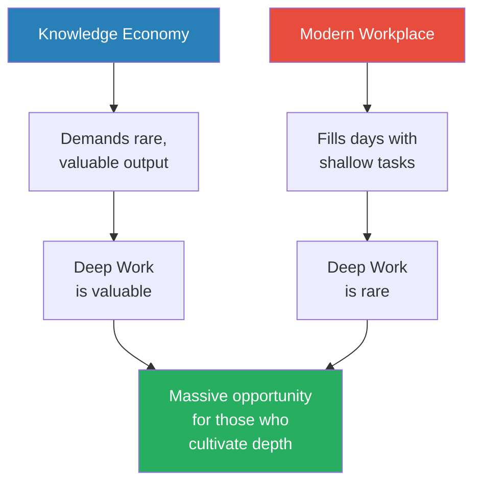
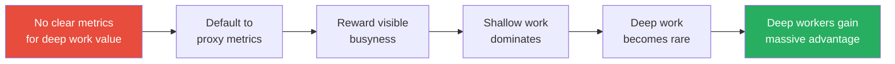
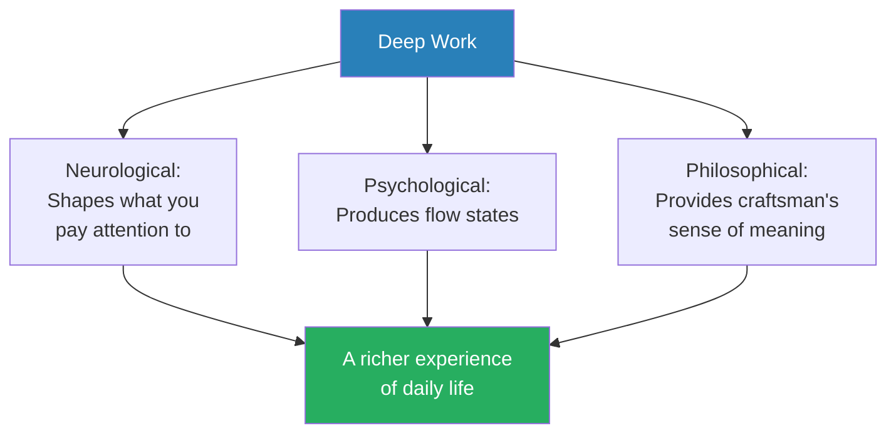
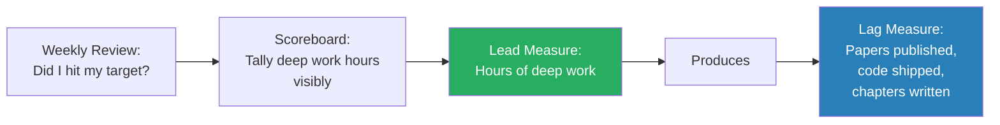
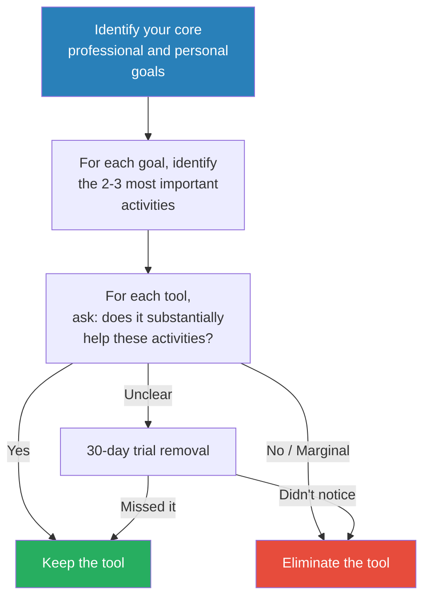
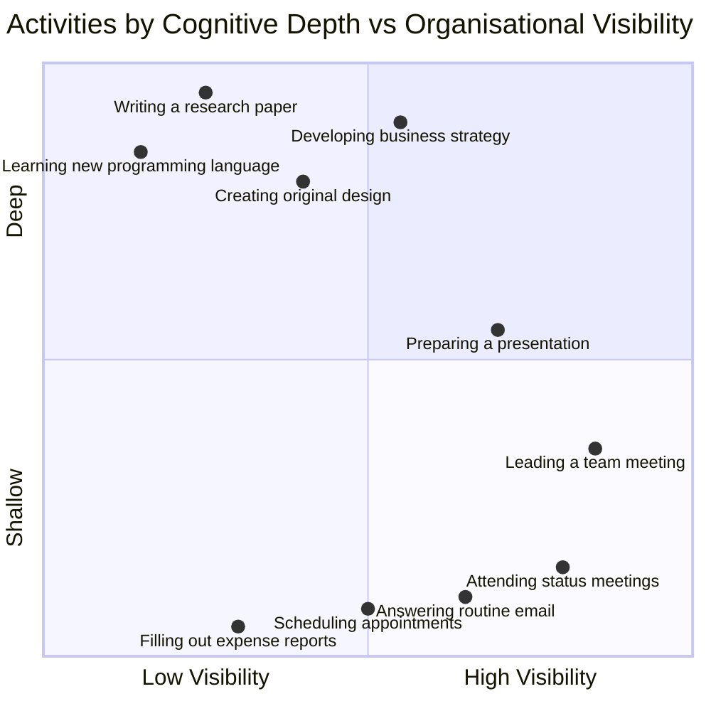
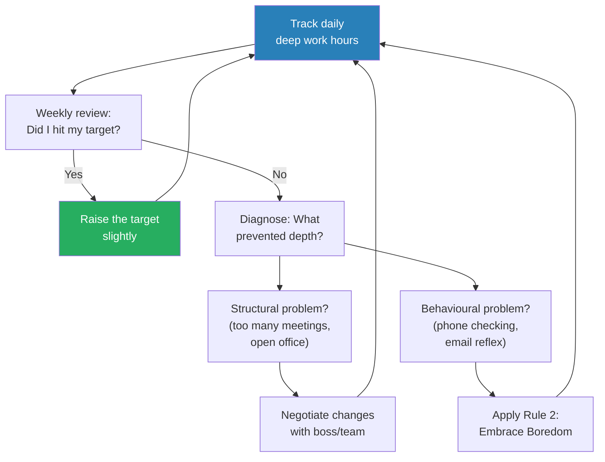
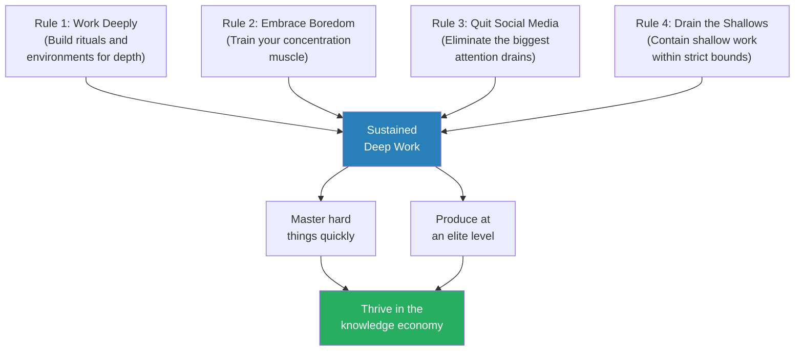

# Deep Work — Cal Newport

> Cal Newport's argument is simple and urgent: the ability to focus without distraction on a cognitively demanding task is becoming both increasingly valuable and increasingly rare — and those who cultivate this ability will dominate the knowledge economy.
> He calls this ability "deep work" and contrasts it with "shallow work" — the logistical, low-value tasks (email, meetings, Slack, social media) that fill most knowledge workers' days and create the illusion of productivity while producing almost nothing of lasting value.
> The book is half argument (why deep work matters) and half manual (how to restructure your life to do more of it), drawing on examples from Carl Jung to J.K. Rowling to a Georgetown professor who publishes at twice the rate of his colleagues.
> Newport writes with the methodical precision of the computer science professor he is — every claim is backed with research or a concrete example, and the framework is clean enough to implement immediately.
> It is the most important productivity book of the last decade — not because it offers tricks, but because it reframes the entire question from "how do I get more done?" to "how do I do the work that actually matters?"

---

## About the Author

Cal Newport is a computer science professor at Georgetown University who has published seven books and numerous peer-reviewed academic papers — while rarely working past 5:30pm. He does not have a social media account, a fact he wields as both evidence and provocation. He is the author of [[So Good They Can't Ignore You - Cal Newport|So Good They Can't Ignore You]], which argues that "follow your passion" is bad career advice — and *Deep Work* is its natural sequel, explaining how to build the rare and valuable skills that make you indispensable. Newport's research on distributed algorithms and his writing on productivity share an unlikely thread: both involve understanding how systems perform under constraints.

---

## The Big Idea

- <b style="color: #2980b9">Deep Work</b> = professional activities performed in a state of distraction-free concentration that push your cognitive capabilities to their limit
  - They create new value, improve your skill, and are hard to replicate
  - Examples: writing a book chapter, proving a theorem, mastering a new programming language, developing a business strategy
- <b style="color: #e74c3c">Shallow Work</b> = non-cognitively demanding, logistical-style tasks, often performed while distracted
  - They tend not to create much new value and are easy to replicate
  - Examples: answering email, attending status meetings, filling out expense reports, scrolling social media
- <b style="color: #27ae60">The Deep Work Hypothesis:</b> The ability to perform deep work is becoming increasingly rare at exactly the same time it is becoming increasingly valuable in our economy. As a consequence, the few who cultivate this ability will thrive.
- Newport's argument rests on a collision of two economic forces:
  - The knowledge economy increasingly rewards people who can produce rare and valuable output — original thought, complex problem-solving, creative synthesis
  - The modern workplace increasingly fills people's days with shallow obligations — open-plan offices, instant messaging, email expectations, meeting culture — that make deep work nearly impossible
- The gap between these two forces creates a massive opportunity: if you can figure out how to do deep work consistently, you will outproduce and outperform the vast majority of your peers, who are drowning in shallowness
- This is not a metaphor — Newport quantifies it throughout the book with concrete examples of people who produce two, three, even ten times more valuable output than their colleagues by protecting their deep work hours

This diagram captures Newport's core thesis: the collision of increasing value and increasing rarity creates an outsized advantage for anyone willing to swim against the current of distraction.

---

## Key Concepts at a Glance

| Concept | One-line summary |
|---------|-----------------|
| **Deep Work Hypothesis** | Deep work is rare + valuable = massive opportunity for those who do it |
| **Attention Residue** | Switching tasks leaves cognitive residue that degrades performance for minutes afterward |
| **Deliberate Practice** | Deep work is the mechanism through which you get better at things that matter |
| **Four Philosophies** | Monastic, Bimodal, Rhythmic, Journalistic — four ways to schedule deep work |
| **Grand Gestures** | Extreme environments (rented cabins, cancelled trips) that signal commitment to depth |
| **Ritualize** | Build routines and rituals to reduce the willpower needed to enter deep work states |
| **4DX Framework** | Focus on the wildly important, act on lead measures, keep a scoreboard, create accountability |
| **Attention Residue** | Your mind stays partially on the previous task after switching, reducing quality |
| **Productive Meditation** | Use physical activity (walking, running) to focus on a single professional problem |
| **Any-Benefit vs Craftsman** | Stop adopting tools for "any benefit" — adopt only those whose benefits substantially outweigh costs |
| **Drain the Shallows** | Ruthlessly minimize time spent on low-value logistical tasks |
| **Fixed-Schedule Productivity** | Set a firm end to your workday, then work backward to fit in what matters |
| **Be Boring** | Schedule every minute of your day; embrace boredom; quit social media |
| **Shutdown Ritual** | End each workday with a specific ritual that signals your brain to release work thoughts |

---

Newport's book splits into two halves of roughly equal weight: Part 1 builds the case for why deep work matters (valuable, rare, meaningful), while Part 2's four rules provide the practical system for achieving it — with "Work Deeply" receiving the most detailed treatment.

## Part 1: The Idea — Why Deep Work Matters

*Newport spends the first half of the book building an airtight case that deep work is simultaneously the most valuable and most neglected skill in the modern economy. Part 1 contains three chapters: deep work is valuable, deep work is rare, and deep work is meaningful. Together they form an argument that is economic, sociological, and philosophical.*

### Chapter 1: Deep Work Is Valuable

*In the new economy, three kinds of people will thrive — and two of them require deep work as a prerequisite. Newport builds this case from labour economics, deliberate practice research, and a simple productivity equation.*

Newport identifies <b style="color: #2980b9">three groups who will capture a disproportionate share of economic value</b>:

| Group | What They Do | Why They Win |
|-------|-------------|--------------|
| **High-Skilled Workers** | Work with and alongside intelligent machines | Can master complex tools and extract value from them |
| **Superstars** | Best in the world at what they do | Winner-take-all markets amplify small quality differences |
| **Owners** | Those with capital to invest | Money makes money — but this group is not relevant to the argument |

- The first two groups share a critical requirement: <b style="color: #27ae60">the ability to quickly master hard things and to produce at an elite level, in terms of both quality and speed</b>
- Both of these core abilities depend on your capacity for deep work
- If you cannot learn hard things quickly, you will fall behind as technologies change
- If you cannot produce at an elite level, your talent is theoretical rather than practical

---

#### Two Core Abilities

**Core Ability #1: The ability to quickly master hard things**

- The modern economy shifts constantly — new tools, platforms, languages, and frameworks appear every year
- Those who can learn them fast stay relevant; those who cannot, stagnate
- <b style="color: #2980b9">Deliberate practice</b> — the concept developed by K. Anders Ericsson — is the mechanism through which humans improve at complex tasks
- Deliberate practice requires two things that are impossible without deep work:
  - Your attention must be focused tightly on the specific skill you are trying to improve
  - You must receive and process feedback so you can correct your approach
- Distraction destroys deliberate practice because it prevents the tight focus that drives myelin development in the brain — the neurological basis of skill improvement
- Newport draws on neuroscience: when you focus intensely on a specific skill, the relevant neural circuit fires repeatedly, and the surrounding myelin sheath thickens — making the circuit faster and more efficient
- <b style="color: #e74c3c">Without sustained focus, the myelin doesn't develop. You can spend ten thousand hours on a skill and still not improve if those hours are fragmented and unfocused.</b>
- This is the neurological reason why deep work and deliberate practice are inseparable — both require the same kind of sustained, concentrated attention to trigger the physical brain changes that drive improvement

> [!example] The Myelin Connection — Daniel Coyle's Research
> - Daniel Coyle, author of *The Talent Code*, spent years studying talent hotbeds — tiny places that produce world-class performers at disproportionate rates
> - He found that the common factor was not genetics or resources but the quality of practice
> - Deep, focused, repetitive practice — what Ericsson calls "deliberate practice" — triggers myelin growth around the relevant neural circuits
> - Myelin acts as insulation around nerve fibres, making signals travel faster and more accurately
> - The more you practise with intense focus, the thicker the myelin, the faster and more automatic the skill
> - This is why ten hours of distracted practice produces less improvement than two hours of deep, focused practice
> **The lesson:** Skill improvement is a physical process in the brain — and it requires the kind of sustained, undistracted focus that only deep work provides.

---

**Core Ability #2: The ability to produce at an elite level**

- Mastering a skill is not enough — you must then apply that skill to produce things that people value
- Production at an elite level requires long, uninterrupted stretches of concentration
- Newport introduces the formula: <b style="color: #27ae60">High-Quality Work Produced = (Time Spent) × (Intensity of Focus)</b>
- This formula explains why some people produce far more in fewer hours: their intensity of focus is dramatically higher
- It also explains why most knowledge workers produce so little despite working long hours: their focus intensity is near zero because of constant interruption

> [!tip] Core Insight
> Deep work is the mechanism that connects ability to output. You can be brilliant, but if you cannot focus, your brilliance remains unrealised. Deep work is how potential becomes production.

---

#### Attention Residue: The Hidden Tax on Task-Switching

- <b style="color: #2980b9">Attention residue</b> is the key mechanism that explains why fragmented work produces so little
- Sophie Leroy, a business professor at the University of Minnesota, conducted experiments showing that when you switch from Task A to Task B, your attention does not immediately follow
  - A <b style="color: #e74c3c">residue of your attention remains stuck on Task A</b>, reducing your cognitive performance on Task B
  - The residue is especially strong if Task A was unfinished or had no clear stopping point
  - Even if you "finish" Task A before switching, the residue persists — your brain continues processing the previous task in the background
- This has devastating implications for the typical knowledge worker's day:
  - Every email check between deep work sessions creates a new layer of residue
  - Every quick Slack glance fragments your attention even if you don't respond
  - Every meeting squeezed between focus blocks makes both the meeting and the focus block worse
  - The cumulative residue from a day of constant switching means that by afternoon, most knowledge workers are operating at a fraction of their cognitive capacity

> [!example] Sophie Leroy's Attention Residue Experiments
> - Leroy designed experiments where subjects worked on Task A (a word puzzle) and were then told to switch to Task B (reading resumes and making hiring decisions)
> - Some subjects were told they could finish Task A later; others were told it was complete
> - Both groups showed attention residue — their performance on Task B was worse than a control group that had only worked on Task B
> - The residue was strongest in the group told Task A was unfinished — their brains kept pulling attention back to the incomplete puzzle
> - Leroy's conclusion: "People experiencing attention residue after switching tasks are likely to demonstrate poor performance on that next task"
> - The practical implication is stark: if you check email before a deep work block, you carry email-residue into your deep thinking, degrading its quality
> **The lesson:** The cost of a "quick email check" is not the two minutes it takes — it is the twenty minutes of degraded cognitive performance that follows.

| Day Pattern | Attention Residue Level | Deep Work Quality |
|-------------|------------------------|-------------------|
| Email → Meeting → Email → Deep Work → Slack → Email | Massive residue accumulation | Near zero |
| Email batch → 3hr Deep Work → Email batch → 2hr Deep Work | Minimal residue | Very high |
| Deep Work → Deep Work → Lunch → Deep Work → Email batch | Almost no residue during focus | Maximum |

This table illustrates Newport's core scheduling principle: batch your shallow work to minimise switching, and protect long uninterrupted blocks for deep work.

---

> [!example] Adam Grant's Batching Strategy
> - Adam Grant, a professor at Wharton, was the youngest full professor to receive tenure at the school
> - His secret was not working more hours — it was batching his teaching into one semester
> - During his research semester, he would stack his deep work into multi-day stretches, often working on a single paper for days without interruption
> - During his teaching semester, he remained fully available to students
> - The result: Grant published at a rate that astonished his colleagues — more papers in peer-reviewed journals, more books, more citations
> - His peers, who spread their teaching and research across both semesters, could never achieve the same intensity of focus
> **The lesson:** It is not about how many hours you work — it is about how many of those hours are spent in uninterrupted deep work.

> [!example] Nate Silver and the Power of Focus
> - Nate Silver built FiveThirtyEight into the most respected data journalism outlet in America
> - His competitive advantage was not superior data — everyone had access to the same polls and statistics
> - His advantage was the ability to concentrate for long stretches on complex statistical models, finding patterns that more distracted analysts missed
> - While TV pundits offered shallow hot takes between commercial breaks, Silver was doing deep work — and consistently outpredicting them
> **The lesson:** In knowledge work, the ability to think deeply about complex problems is a competitive superpower — especially when everyone else is skimming the surface.

---

### Chapter 2: Deep Work Is Rare

*If deep work is so valuable, why is it so rare? Newport identifies the structural forces that push knowledge workers toward shallow work — and explains why those forces are unlikely to reverse.*

- <b style="color: #e74c3c">The modern office is an anti-depth machine</b>
  - Open-plan offices destroy concentration
  - Instant messaging creates a state of permanent interruption
  - Email generates an endless stream of small tasks
  - Meeting culture fragments the day into unusable scraps
- Three forces conspire to keep things this way:

**The Metric Black Hole**

- In knowledge work, it is very difficult to measure the value of individual contributions
- Unlike a factory where you can count widgets per hour, there is no easy metric for "quality of thinking"
- <b style="color: #2980b9">Because deep work's value is hard to measure, organisations default to proxy metrics that favour visible activity</b>
  - Emails sent and replied to quickly
  - Meetings attended
  - Hours visible in the office
  - Slack messages exchanged
- These proxy metrics systematically reward shallow work and penalise deep work

**The Principle of Least Resistance**

- In the absence of clear feedback on what matters, knowledge workers default to whatever is easiest in the moment
- <b style="color: #e74c3c">It is easier to reply to an email than to do deep thinking. It is easier to attend a meeting than to wrestle with an unsolved problem.</b>
- Without clear metrics showing that deep work produces more value, the path of least resistance always leads to shallowness
- This is not laziness — it is a rational response to a poorly designed incentive environment

**Busyness as a Proxy for Productivity**

- In the absence of clear indicators of value, many knowledge workers turn to busyness as a signal of productive value
- If you are visibly busy — responding to emails, attending meetings, posting on Slack — you appear productive
- <b style="color: #e74c3c">Busyness is the opposite of productivity. The busiest people often produce the least valuable output.</b>
- Newport calls this "the cult of the internet" — the unquestioned assumption that connectivity and constant availability are good
- Companies adopt tools like Slack and open-plan offices not because evidence shows they increase productivity, but because they feel modern and collaborative

> [!example] The Open-Plan Office Trap
> - Newport cites research showing that open-plan offices reduce productivity by up to 15%
> - Employees in open-plan environments report higher stress, lower concentration, and more frequent illness
> - Yet companies continue adopting them — not because they work, but because they are cheaper per square foot and signal a "collaborative culture"
> - The workers who suffer most are those who need deep concentration: programmers, writers, analysts, designers
> - The workers who benefit most are managers who want easy access to everyone — the exact people whose work is already shallow
> **The lesson:** Office design often optimises for managerial convenience, not for the deep work that produces the most value.

---

> [!tip] Core Insight
> Deep work is rare not because people are lazy but because the modern workplace systematically rewards visible busyness over invisible depth. Fixing this requires deliberate, structural intervention — not just willpower.

This self-reinforcing cycle explains why deep work is structurally rare — and why anyone who breaks the cycle gains an outsized competitive advantage.

---

### Chapter 3: Deep Work Is Meaningful

*Newport makes a surprising move: beyond arguing that deep work is economically valuable, he argues it is psychologically and philosophally fulfilling — that a deep life is a good life.*

Newport draws on three separate arguments to make the case that deep work produces meaning:

**The Neurological Argument**

- Winifred Gallagher, a science writer who was diagnosed with cancer, discovered something unexpected: when she focused her attention on the positive aspects of her life rather than the diagnosis, her experience of life improved dramatically
- <b style="color: #2980b9">Your experience of life is shaped by what you pay attention to</b>
  - If your attention is fragmented across emails, social media, and shallow tasks, your world feels fragmented and anxious
  - If your attention is focused on meaningful, challenging work, your world feels purposeful and rich
- This is not a metaphor — neuroscience research confirms that the brain's wiring is shaped by habitual focus
- A life spent in deep work is literally experienced as more meaningful than a life spent in shallow distraction

**The Psychological Argument**

- Mihaly Csikszentmihalyi's research on <b style="color: #2980b9">flow states</b> shows that people are happiest when they are absorbed in challenging tasks that match their skill level
- Flow — the state of complete absorption — is one of the most reliable predictors of life satisfaction
- Ironically, Csikszentmihalyi's research found that people report higher satisfaction during work (when flow is possible) than during leisure (when they tend to be passive)
- <b style="color: #27ae60">Deep work is the most reliable pathway to flow</b>
  - It provides exactly the conditions flow requires: clear goals, immediate feedback, and a challenge that stretches your abilities
  - Shallow work prevents flow because it fragments attention and lacks cognitive challenge

> [!example] Csikszentmihalyi's ESM Research
> - Csikszentmihalyi developed the Experience Sampling Method (ESM) — pinging subjects randomly throughout the day and asking them to report their current state
> - The counter-intuitive finding: people reported being happier, more engaged, and more satisfied during work than during leisure time
> - During work, they were often in flow — absorbed in challenging tasks that matched their abilities
> - During leisure, they were often passive — watching TV, scrolling, or sitting idle — which produced mild depression rather than restoration
> - The conclusion shattered the common assumption that we work to enjoy our free time — in fact, well-structured work IS the enjoyment
> **The lesson:** The good life is not found in escaping work but in doing work that demands your full concentration.

**The Philosophical Argument**

- Newport draws on the work of Hubert Dreyfus and Sean Dorrance Kelly (*All Things Shining*) to argue that craftsmanship provides a source of meaning in a secular age
- In pre-modern societies, meaning came from religion and shared narratives
- In the modern world, those sources have weakened — but the experience of skilled engagement with difficult problems still provides a sense of the sacred
- <b style="color: #27ae60">A woodworker shaping a beautiful piece of furniture, a programmer solving an elegant problem, a writer finding the perfect sentence — all experience a connection to something larger than themselves through the act of skilled, focused work</b>
- Deep work is not merely economically useful — it is one of the few reliable pathways to a life that feels meaningful
- Newport cites the example of Ric Furrer, a blacksmith who hand-forges swords using medieval techniques
  - Furrer describes the act of shaping metal with total concentration as "a source of meaning," even though the economic returns are modest
  - The meaning does not come from the product — it comes from the quality of attention he brings to the process
  - This is the craftsman's insight: skilled, focused work generates meaning independent of its outcomes

> [!example] The Wheelwright's Craft — Matthew Crawford
> - Matthew Crawford, a philosopher and motorcycle mechanic, left a Washington think-tank job to open a motorcycle repair shop
> - He found that the intellectual demands of diagnosing and repairing engines — which required deep, focused attention — were more satisfying than the fragmented, shallow work of policy analysis
> - Crawford's book *Shop Class as Soulcraft* argues that manual trades provide a kind of cognitive engagement that much modern knowledge work lacks — precisely because they demand concentration
> - The irony: a motorcycle mechanic doing deep work may experience more meaning than a knowledge worker trapped in shallow work
> **The lesson:** Meaning comes from the quality of attention, not the prestige of the task. Deep work on any worthy problem produces a sense of significance that shallow work on important-sounding tasks never can.

> [!tip] Core Insight
> Newport's most unexpected argument: deep work is not just a productivity technique — it is a philosophy of the good life. A deep life is a rich life, regardless of the specific content of that depth.

Newport's three arguments converge: deep work makes you more productive (Chapter 1), and it also makes your life feel richer, more purposeful, and more meaningful (Chapter 3). The economic and existential cases reinforce each other.

---

## Part 2: The Rules — How to Do Deep Work

*The second half of the book shifts from argument to manual. Newport presents four rules, each with specific strategies, for building a life centred on deep work.*

### Rule 1: Work Deeply

*You have a finite amount of willpower that depletes as you use it. The key to deep work is not trying harder but building routines and rituals that minimise the amount of willpower required to enter and sustain a state of concentration.*

#### The Willpower Problem

- Many people think the solution to distraction is simply "trying harder to concentrate"
- <b style="color: #e74c3c">This fails because willpower is a depletable resource</b> — the psychological research (Roy Baumeister's ego depletion studies) shows that making decisions and resisting temptation depletes the same limited pool of mental energy
- If you rely on willpower alone to protect your deep work, you will lose that fight every time — especially in an environment designed to distract you
- <b style="color: #27ae60">The solution is to build routines, rituals, and environments that make deep work the default state rather than a constant battle against temptation</b>

---

#### The Four Philosophies of Deep Work Scheduling

Newport identifies four distinct approaches to scheduling deep work. Each suits a different kind of work and life structure.

| Philosophy | Description | Best For | Trade-offs |
|-----------|-------------|----------|------------|
| **Monastic** | Eliminate or radically minimise shallow obligations entirely | People whose value comes from one thing done exceptionally well | Eliminates collaboration and responsiveness |
| **Bimodal** | Dedicate defined stretches (days, weeks, months) to deep work, leaving the rest for everything else | People who need both depth and availability at different times | Requires flexibility and the ability to disappear for stretches |
| **Rhythmic** | Transform deep work into a simple regular habit at the same time each day | People with standard work schedules who need consistent output | May never achieve the intensity of longer immersive periods |
| **Journalistic** | Fit deep work wherever you can into a busy, unpredictable schedule | Experienced practitioners who can switch into deep work mode quickly | Requires significant practice; not suitable for beginners |

<b style="color: #2980b9">The four philosophies form a spectrum from most to least isolation</b> — the monastic philosophy requires near-total withdrawal from the world, while the journalistic philosophy requires none. Most people will find the rhythmic or bimodal philosophy most practical.

The monastic philosophy maximises isolation and intensity at the cost of all accessibility, while the journalistic approach inverts this trade-off entirely — the rhythmic philosophy offers the most balanced profile for most knowledge workers.

---

> [!example] Neal Stephenson's Monastic Approach
> - Neal Stephenson, author of *Cryptonomicon* and *Snow Crash*, is famously unreachable
> - He does not maintain a public email address and does not do most interviews
> - His explanation is blunt: "If I organize my life in such a way that I get lots of long, consecutive, uninterrupted time-chunks, I can write novels"
> - He views responsiveness and writing as fundamentally incompatible — you can be responsive or you can write novels, but not both
> - For Stephenson, the calculus is simple: the world values his novels far more than it would value his email replies
> **The lesson:** The monastic philosophy demands a clear, honest assessment of where your value lies — and the courage to sacrifice everything else.

> [!example] Carl Jung's Bimodal Retreat at Bollingen (1922–1961)
> - While running a busy clinical practice in Zurich, Carl Jung built a stone tower in the village of Bollingen on the shore of Lake Zurich
> - He would retreat there for weeks at a time to think, write, and develop his theoretical work
> - The tower had no electricity initially, no telephone, and no easy access for visitors
> - During his Bollingen periods, Jung was effectively unreachable — doing the deep intellectual work that produced his most important contributions
> - During his Zurich periods, he was a fully engaged clinician and public intellectual
> - The bimodal split allowed him to compete with Freud — who had a head start of decades — by ensuring his limited deep work hours were spent at maximum intensity
> **The lesson:** The bimodal philosophy works for people who cannot abandon shallow obligations entirely but who need long, uninterrupted stretches to do their best thinking.

> [!example] Jerry Seinfeld's Chain Method (Rhythmic Philosophy)
> - A young comic once asked Jerry Seinfeld for advice on how to get better at comedy
> - Seinfeld's advice was simple: write jokes every day. Get a big wall calendar and put a red X on every day you write. After a few days, you'll have a chain. "Don't break the chain."
> - This is the rhythmic philosophy in its purest form — transform deep work from a decision (which costs willpower) into a habit (which is automatic)
> - The chain method works because it removes the daily negotiation with yourself about whether to do the work
> - You do the work because it is 9am and that is when you write — not because you feel inspired
> **The lesson:** The rhythmic philosophy trades the excitement of long immersive stretches for the consistency of daily practice — and for most people, consistency wins.

> [!example] Walter Isaacson's Journalistic Deep Work
> - Walter Isaacson, biographer of Steve Jobs, Einstein, and Benjamin Franklin, wrote major sections of his books in the cracks between a demanding schedule as CEO of the Aspen Institute
> - He could switch into deep work mode within minutes — writing for thirty minutes in a hotel room, then returning to meetings, then writing again during a flight
> - This ability was not natural — it was developed over decades of practice as a journalist, where deadlines forced him to concentrate under any conditions
> - Newport warns that this philosophy is not suitable for beginners — it requires a trained ability to switch into deep focus that most people have not developed
> **The lesson:** The journalistic philosophy is the most flexible but the most demanding — you need years of practice before you can reliably drop into deep work on command.

---

#### Ritualise Your Deep Work

- <b style="color: #27ae60">Don't wait for inspiration. Build a ritual that makes starting automatic.</b>
- Newport observes that almost every prolific creator in history had rigid rituals — not because rituals are magical, but because they eliminate decision fatigue
- Your deep work ritual should specify:
  - **Where** you will work and for how long — the location matters because context cues trigger the right mental state
  - **How** you will work once you start (rules like "no internet," "phone in another room," "door closed") — these rules must be non-negotiable
  - **How** you will support your work (coffee prepared in advance, food ready, materials laid out) — removing friction before you start means the start itself is effortless
- The goal is to reduce the friction between deciding to work and actually working
- Every decision you eliminate saves willpower for the actual cognitive effort
- Newport emphasises that the specific ritual matters less than its consistency — what matters is that you do the same things in the same order every time, so that starting deep work becomes automatic rather than effortful

> [!example] Charles Darwin's Ritual at Down House
> - Charles Darwin followed an almost identical routine every day for decades at his home, Down House, in Kent
> - He rose early, took a short walk, worked in his study from 8:00 to 9:30, read letters until 10:30, then returned to deep work until noon
> - After lunch, he walked, rested, worked again briefly in the afternoon, and stopped by early evening
> - This rigid ritual produced one of the most important scientific works in history — *On the Origin of Species*
> - Darwin did not wait for inspiration — he showed up at the same desk at the same time and let the ritual carry him into depth
> **The lesson:** Rituals do not constrain creativity — they liberate it. By making the starting process automatic, you reserve all your mental energy for the work itself.

> [!abstract] Building a Deep Work Ritual
> 1. Choose a dedicated deep work location (same desk, same room, same library table)
> 2. Set a fixed start time and fixed end time — never open-ended
> 3. Define your rules: no email, no phone, no browser, no Slack
> 4. Prepare your environment: coffee, water, materials, noise management
> 5. Start with the same trigger action every time (same music, same notebook, same first step)
> 6. End with a clear stopping ritual (review what you accomplished, note where to start tomorrow)

---

#### Collaboration and Deep Work: The Hub-and-Spoke Model

- Newport acknowledges that deep work is not always solitary — some of the best deep work happens in collaboration
- But he distinguishes between <b style="color: #2980b9">two kinds of collaboration</b>:
  - **Shallow collaboration** — open-plan offices, constant Slack channels, and meetings where everyone talks and no one thinks
  - **Deep collaboration** — two or three people locked in a room, working on a hard problem together with full concentration
- The ideal model is <b style="color: #2980b9">hub-and-spoke</b>:
  - The **hub** is a communal area where serendipitous encounters and idea-sharing happen naturally
  - The **spokes** are private offices or quiet rooms where individuals retreat to do deep work on the ideas that emerged in the hub
- The problem with most modern offices is that they are all hub and no spokes — constant interaction with no protected space for concentration

> [!example] Building 20 at MIT
> - Building 20 at MIT, a "temporary" structure built during World War II, became one of the most productive creative spaces in history
> - It housed an unlikely mix of departments — linguistics, electronics, nuclear science, acoustics — in a cramped, ugly building with poor insulation
> - The building's layout forced researchers from different disciplines to cross paths constantly in shared hallways and bathrooms
> - But crucially, each researcher also had a private office where they could retreat into deep work
> - The combination produced a remarkable output: Noam Chomsky's linguistics revolution, the development of radar technology, the Bose Corporation, and dozens of other breakthroughs
> - Building 20 embodied the hub-and-spoke model: communal spaces for serendipity, private spaces for depth
> **The lesson:** Innovation requires both random interaction and deep concentration. Open offices provide the first and destroy the second. The best environments provide both.

---

#### Grand Gestures

- Sometimes the best way to signal commitment to deep work is through a <b style="color: #2980b9">grand gesture</b> — a radical change in environment or investment that makes procrastination psychologically harder
- The psychology is simple: when you invest significant money, time, or effort into creating the conditions for deep work, the sunk cost pushes you to follow through
- The grander the gesture, the stronger the psychological commitment

> [!example] J.K. Rowling's Hotel Room (2007)
> - While struggling to finish *Harry Potter and the Deathly Hallows*, J.K. Rowling checked into a suite at the Balmoral Hotel in Edinburgh
> - The suite cost hundreds of pounds per night — money spent purely to create an environment free from the distractions of her home
> - The grand gesture worked: the change of environment plus the financial investment made it psychologically impossible to waste the time
> - She finished the book there
> **The lesson:** Sometimes the best way to start deep work is to make it embarrassing not to.

> [!example] Bill Gates's Think Weeks (1980s–2000s)
> - Twice a year, Bill Gates would leave Microsoft and retreat to an isolated cabin in the Pacific Northwest
> - He brought nothing but a stack of papers and books — no phone, no meetings, no email
> - During these "Think Weeks," Gates would read, think, and write memos about Microsoft's future direction
> - Many of Microsoft's most important strategic decisions originated in Think Week memos — including the famous 1995 "Internet Tidal Wave" memo that pivoted the company toward the web
> - Gates understood that the daily demands of running a company left no room for the deep thinking that determined the company's future
> **The lesson:** The people who shape the future are the ones who create space to think about it. You cannot think deeply while drowning in operational detail.

---

#### The 4DX Framework for Deep Work

Newport adapts <b style="color: #2980b9">The 4 Disciplines of Execution (4DX)</b>, a business strategy framework, for individual deep work practice:

> [!abstract] The 4DX Framework Applied to Deep Work
> 1. **Focus on the Wildly Important** — Identify the small number of outcomes that really matter. Say no to everything else.
> 2. **Act on Lead Measures** — Track your hours of deep work (the lead measure) rather than your output (the lag measure). You cannot directly control output, but you can control how many hours you spend in deep focus.
> 3. **Keep a Compelling Scoreboard** — Newport kept a physical tally of deep work hours on a card by his desk. Seeing the number grow creates motivation.
> 4. **Create a Cadence of Accountability** — Review your scoreboard weekly. Ask: did I hit my deep work target? If not, why? What will I change?

- The critical insight is the distinction between <b style="color: #2980b9">lead measures</b> and <b style="color: #2980b9">lag measures</b>:
  - **Lag measures** describe the thing you are ultimately trying to improve (papers published, revenue generated, chapters written) — but they come too late to change your behaviour
  - **Lead measures** describe the behaviours that will drive the lag measures (hours of deep work per day) — and they are within your direct control
- <b style="color: #27ae60">Track your deep work hours. That is the single most important metric for a knowledge worker.</b>

This diagram illustrates the 4DX feedback loop: track the input you control (deep work hours) to drive the output you want (valuable production).

---

#### Be Lazy: The Shutdown Ritual

- Newport argues that <b style="color: #27ae60">a firm end to the workday is essential for sustained deep work over time</b>
- He uses a <b style="color: #2980b9">shutdown ritual</b> — a specific sequence of actions at the end of each workday:
  - Review every incomplete task and capture it in a trusted system
  - Check the calendar for the next day
  - Make a rough plan for tomorrow
  - Say a specific phrase out loud: "Shutdown complete"
- Once the ritual is finished, no more work thinking is permitted until the next morning
- Why this matters:
  - **Downtime aids insights** — the unconscious mind processes problems during rest, often producing better solutions than conscious grinding
  - **Downtime recharges** — Attention Restoration Theory (Kaplan, 1995) shows that the capacity for directed attention is finite and requires nature, rest, and disengagement to restore
  - **The work that evening work replaces is usually not deep** — by evening, your willpower is depleted and you cannot do deep work anyway, so you are only adding shallow hours

> [!tip] Core Insight
> Shutting down completely at the end of the workday is not laziness — it is a strategy. Your brain needs downtime to consolidate learning, recharge attention, and produce the insights that conscious effort cannot. Working more hours of shallow work in the evening destroys tomorrow's deep work capacity.

#### The Zeigarnik Effect and Why Shutdown Rituals Work

- The <b style="color: #2980b9">Zeigarnik Effect</b> is the psychological finding that incomplete tasks dominate our attention — your brain keeps nagging you about unfinished business
- This is why knowledge workers lie in bed at night thinking about work emails they haven't answered
- Newport's shutdown ritual works precisely because it addresses the Zeigarnik Effect:
  - By reviewing all open tasks and either completing them or capturing them in a trusted system with a plan, you give your brain permission to release them
  - The specific phrase "Shutdown complete" is a verbal cue that signals the transition — like a period at the end of a sentence
- Without a shutdown ritual:
  - Your brain continues processing work tasks during your evening and sleep
  - This degrades the quality of your rest
  - Which degrades the quality of tomorrow's deep work
  - Creating a vicious cycle of diminishing returns
- With a shutdown ritual:
  - Your brain releases work tasks because they are captured and planned
  - Your evening is genuinely restorative
  - Tomorrow's deep work starts from a fully recharged state

> [!abstract] Newport's Shutdown Ritual
> 1. Review your task list and email inbox — capture anything new
> 2. For each open item, either complete it (if quick) or transfer it to your task system with a specific next action
> 3. Check tomorrow's calendar — ensure nothing is forgotten
> 4. Make a rough plan for tomorrow's deep work blocks
> 5. Say out loud: "Shutdown complete"
> 6. Do not check email, Slack, or work-related material for the rest of the evening — no exceptions

---

### Rule 2: Embrace Boredom

*Newport's second rule flips a common assumption: the problem is not that you lack the ability to focus during deep work sessions — it is that you have trained your brain to expect constant stimulation during every other moment of the day.*

#### The Boredom Problem

- Most people, when facing a moment of boredom — waiting in a queue, sitting in a waiting room, commuting — reflexively reach for their phone
- <b style="color: #e74c3c">Every time you do this, you train your brain to expect stimulation and to resist boredom</b>
- A brain trained to need constant stimulation cannot suddenly concentrate for four hours just because you schedule "deep work" on your calendar
- The ability to concentrate is like a muscle — it must be trained through practice, not just through scheduling

#### Don't Take Breaks from Distraction — Take Breaks from Focus

- Newport's key reframe: most people think of distraction as the default and focus as the exception — "I'll focus during my deep work block and check my phone the rest of the time"
- <b style="color: #27ae60">Reverse this: make focus the default. Schedule specific times when you are allowed to use the internet or check your phone. Outside those windows, resist the urge.</b>
- This is not about the specific internet-use schedule — it is about training your brain to tolerate the absence of stimulation
- The key rule: when you feel the urge to switch tasks or check something, note the urge and resist it until your next scheduled break
- Over time, your ability to sustain focus without stimulation grows dramatically

> [!abstract] Internet Scheduling Protocol
> 1. Decide in advance when you will use the internet (e.g., 10:00–10:15, 12:30–1:00, 3:00–3:15)
> 2. Outside those windows, the internet is off-limits — no exceptions
> 3. If you discover you need information from the internet for your current task, either restructure your work or wait until the next scheduled internet block
> 4. The point is not to reduce internet time — it is to train your brain to resist switching at the first hint of boredom
> 5. Do this even when you are at home — the training must be constant, not limited to work hours

---

#### Productive Meditation

- <b style="color: #2980b9">Productive meditation</b> = using a period of physical activity (walking, running, commuting, showering) to focus your entire attention on a single professional problem
- This practice trains two skills simultaneously:
  - The ability to sustain concentration on a single problem without distraction
  - The ability to resist mental looping — the tendency to circle back to what you already know instead of pushing deeper
- Newport recommends doing this two to three times per week

> [!abstract] Productive Meditation Technique
> 1. Identify a specific professional problem that requires deep thought (not administrative)
> 2. Begin a physical activity that occupies your body but not your mind (walking is ideal)
> 3. Direct your full attention to the problem
> 4. When your mind wanders — and it will — gently bring it back to the problem
> 5. Watch for **looping**: the tendency to re-examine what you already know rather than pushing to the next step. When you notice looping, deliberately redirect to the next open question.
> 6. Structure your thinking: identify the relevant variables, define the next-step question, work through solutions, then consolidate your answer

- Two common pitfalls:
  - **Distraction** — your mind drifts to other concerns (dinner plans, email you forgot to send). Notice the drift and redirect.
  - **Looping** — you keep reviewing the same comfortable territory instead of pushing into uncertain new ground. This feels like thinking but produces nothing new.

---

#### Structure Your Deep Thinking

- Newport warns that most people, even when they attempt productive meditation, think in circles rather than making progress
- <b style="color: #2980b9">Structured deep thinking</b> requires a specific approach:
  - **Step 1: Identify the variables** — What are the relevant factors in this problem? What do you already know? What do you need to figure out?
  - **Step 2: Define the next-step question** — Not "how do I solve the whole problem?" but "what is the single next question I need to answer?"
  - **Step 3: Work through possible answers** — Consider each one seriously, test it mentally against what you know
  - **Step 4: Consolidate** — Once you reach a conclusion, review it. Then move to the next question.
- This structure prevents the two most common failures of deep thinking:
  - **Going in circles** — re-examining what you already know feels like thinking but produces nothing new
  - **Jumping to conclusions** — reaching for the first plausible answer instead of exploring the problem space fully

---

#### Train Your Memory

- Newport recommends memory training (specifically, card memorisation) as a way to strengthen concentration
- Memorising a deck of cards requires sustained, focused attention — exactly the skill deep work demands
- <b style="color: #27ae60">The point is not to become a memory champion but to train the concentration muscle that deep work requires</b>
- Daniel Kilov, an Australian memory champion, improved his academic performance dramatically after taking up competitive memory training — not because he memorised his textbooks, but because the practice developed his ability to concentrate
- The technique Newport recommends uses the <b style="color: #2980b9">memory palace</b> method:
  - Associate each card with a memorable person or object
  - Walk through a familiar location in your mind (your house, your commute)
  - Place each card-image at a specific point along the route
  - To recall, simply walk through the route again
- The value is not in the card trick — it is in the concentration required to build and maintain the mental images
- Each practice session is, in effect, a deep work session for your attention circuits

> [!example] Daniel Kilov's Transformation
> - Daniel Kilov was a below-average student in high school — unfocused, disorganised, and struggling academically
> - He took up competitive memory training as a hobby and discovered that the intense concentration required to memorise decks of cards and long number sequences transferred to everything else
> - Within a few years, he became one of Australia's top memory athletes
> - More importantly, his academic performance improved dramatically — not because he memorised his textbooks, but because his ability to concentrate had been transformed
> - He went from a struggling student to a graduate researcher
> **The lesson:** Concentration is a general-purpose skill. Train it in one domain, and it improves performance across all domains.

---

### Rule 3: Quit Social Media

*Newport's most provocative chapter takes aim at social media — not on moral grounds, but on the same cost-benefit logic a craftsman uses to select tools.*

#### The Any-Benefit Mindset vs. The Craftsman Approach

- Most people adopt tools using the <b style="color: #e74c3c">Any-Benefit Mindset</b>: if a tool offers any possible benefit, or if anyone you know uses it, you adopt it
  - "I use Twitter because sometimes I find interesting articles"
  - "I use Facebook because it helps me keep in touch with old friends"
  - "I use Instagram because it inspires me"
- Newport argues this is irrational — it considers only benefits while ignoring costs
- Replace it with the <b style="color: #27ae60">Craftsman Approach to Tool Selection</b>: adopt a tool only if its positive impacts on the factors you have identified as most important to your life substantially outweigh its negative impacts
- This requires you to first identify what matters most in your professional and personal life, then evaluate each tool against those priorities

This decision tree forces an honest cost-benefit analysis on every tool rather than the default "might be useful" thinking.

---

> [!example] The Farmer's Tool Selection Analogy
> - Newport compares the Any-Benefit approach to a farmer who buys every tool in the catalogue because each one "might help"
> - A real craftsman — a skilled farmer, a carpenter, a blacksmith — is far more selective
> - They choose a small number of high-quality tools that are essential to their most important tasks and ignore everything else
> - A carpenter does not buy a tool because it "might be useful someday" — they buy the tools that directly serve the work they do every day
> - Social media tools should be evaluated with the same rigour
> **The lesson:** You are not obligated to use every tool that exists. Be a craftsman, not a hoarder.

#### The Social Media Experiment

- Newport recommends a <b style="color: #2980b9">30-day social media detox</b>: quit all social media platforms for thirty days without announcing your departure
- After thirty days, ask two questions about each platform:
  1. Would the last thirty days have been notably better if I had been able to use this service?
  2. Did people care that I wasn't using this service?
- If the answer to both is "no," quit permanently
- <b style="color: #e74c3c">Most people discover that social media mattered far less to their lives than they assumed — and that the "fear of missing out" was largely manufactured by the platforms themselves</b>

> [!example] Forrest Pritchard's Social Media Detox
> - Newport describes the experience of a young writer who quit social media as an experiment
> - She expected withdrawal symptoms and a sense of isolation
> - Instead, she found that her free time expanded dramatically and that she used it for activities that were more fulfilling — reading, walking, conversation
> - When she checked back after thirty days, she had missed nothing of consequence
> - The people who mattered to her had not noticed her absence from social media — they had contacted her through other means
> **The lesson:** Social media creates the illusion of indispensability. A 30-day experiment reveals the truth: you will miss it far less than you expect.

---

#### The Law of the Vital Few (The 80/20 Rule Applied to Tools)

- Newport connects his tool-selection argument to a broader principle: <b style="color: #2980b9">the law of the vital few</b> (also known as the Pareto Principle)
- In most areas of life, roughly 20% of inputs produce roughly 80% of results
- Applied to tools and platforms:
  - A small number of your tools and habits produce most of your valuable output
  - The rest create the illusion of productivity while consuming attention that could be directed toward the vital few
- The same principle applies to activities within social media:
  - A small number of your online interactions produce genuine value (close friendships maintained, specific industry insights gained)
  - The vast majority (scrolling feeds, watching suggested content, responding to acquaintances) produce nothing and cost everything
- <b style="color: #27ae60">Focus on the vital few activities that produce real value. Eliminate or drastically reduce everything else.</b>

---

#### Don't Use the Internet to Entertain Yourself

- Newport extends his critique beyond social media to internet entertainment generally
- <b style="color: #e74c3c">Using the internet as your default source of entertainment trains your brain for distraction and fragmentation</b>
- The problem is not the content consumed — it is the habit of seeking stimulation whenever a moment of stillness arises
- This habit carries over into your work: a brain trained to need entertainment during every idle moment will demand entertainment during every difficult moment of deep work
- The alternative: put more thought into your leisure time
  - Read books instead of scrolling news feeds
  - Engage in structured hobbies that demand concentration (woodworking, playing an instrument, cooking complex meals)
  - Have face-to-face conversations
  - Exercise with purpose rather than watching a screen
- Arnold Bennett, in his 1910 book *How to Live on 24 Hours a Day*, argued that the sixteen hours outside of work represent a "day within a day" — and most people waste it through thoughtless consumption
- <b style="color: #27ae60">Give your brain meaningful work during leisure hours, and it will be better prepared for meaningful work during professional hours</b>
- This is not about productivity during leisure — it is about training your brain's baseline expectations
  - A brain accustomed to deep reading during evenings will find deep work during mornings natural
  - A brain accustomed to scrolling during evenings will resist deep work during mornings

> [!example] Arnold Bennett's "Day Within a Day" (1910)
> - Arnold Bennett, a popular British novelist, wrote a short book called *How to Live on 24 Hours a Day* that anticipated Newport's argument by over a century
> - Bennett observed that most London commuters treated their evening hours as recovery time — passive, aimless, and wasted
> - He argued that those sixteen non-work hours were a second life — and that filling them with structured mental activity (reading serious literature, studying a subject, engaging in demanding hobbies) would make people both happier and sharper
> - Bennett was not advocating more work — he was advocating more intentional living
> - His insight maps directly onto Newport's argument: how you spend your leisure hours shapes your capacity for depth during your work hours
> **The lesson:** Your evenings train your brain for tomorrow's mornings. Fill them with depth and your mornings will follow. Fill them with distraction and your mornings will resist you.

---

### Rule 4: Drain the Shallows

*Newport's final rule addresses the practical reality that shallow work cannot be eliminated — it must be managed, minimised, and contained so it does not consume the hours that should belong to depth.*

#### Schedule Every Minute of Your Day

- <b style="color: #2980b9">Time-block planning</b>: at the start of each workday, divide every minute into blocks assigned to specific activities
- This is not about rigidity — Newport expects the schedule to break and be rebuilt several times a day
- The point is <b style="color: #27ae60">intentionality</b>: making conscious decisions about how you spend your time rather than drifting through the day reacting to whatever arrives
- Without a schedule, the default is to spend time on whatever feels urgent (email, messages, interruptions) rather than what is important (deep work)

> [!abstract] Time-Block Planning Method
> 1. At the start of each day, open a notebook or document
> 2. Divide the day into blocks (minimum 30 minutes each)
> 3. Assign every block to a specific activity — including "email batch," "meeting," "lunch," and "deep work"
> 4. When the plan breaks (and it will), take five minutes to rebuild the schedule from the current time forward
> 5. The goal is not to follow the plan perfectly — it is to make deliberate decisions about your time throughout the day
> 6. At the end of the day, review: how many blocks were deep work? How many were shallow? What is the ratio?

---

#### Quantify the Depth of Every Activity

- Newport proposes a simple test to determine whether a task is deep or shallow: <b style="color: #2980b9">"How long would it take (in months) to train a smart recent college graduate to do this task?"</b>
- If the answer is "a few days" — it is shallow (email, scheduling, basic data entry)
- If the answer is "many months" or "years" — it is deep (writing an original research paper, designing a complex system, developing a new strategy)
- This test cuts through the ambiguity that normally surrounds task classification
- Once you can identify shallow tasks, you can begin to contain them

| Task | Training Time | Depth Classification |
|------|--------------|---------------------|
| Answering routine email | Hours | Shallow |
| Attending status meetings | Days | Shallow |
| Scheduling appointments | Hours | Shallow |
| Writing a research paper | Many months | Deep |
| Developing a business strategy | Months | Deep |
| Learning a new programming language | Months | Deep |
| Creating an original design | Months | Deep |
| Filling out expense reports | Hours | Shallow |

The training-time heuristic reveals that most of the tasks consuming your day could be done by someone with minimal training — which means they are not the tasks that make you valuable.

The quadrant reveals Newport's central paradox: the deepest, most valuable work tends to be the least visible to the organisation, while the shallowest work dominates organisational attention — creating a systematic bias against depth.

> [!tip] Core Insight
> The depth test is uncomfortable because it forces you to confront how much of your day is spent on tasks that anyone could do. For many knowledge workers, the answer is 60-80% — which means they are spending the vast majority of their time on work that does not require their unique skills, training, or expertise.

---

#### The Bias Toward Shallow Work

- Newport identifies a structural bias in most organisations: shallow work is easier to assign, easier to measure, and easier to see
- <b style="color: #e74c3c">Managers reward visible activity because it is measurable — even when invisible deep thinking produces more value</b>
- This creates a perverse incentive:
  - An employee who spends three hours in deep concentration and produces a breakthrough idea looks idle
  - An employee who sends fifty emails and attends four meetings looks productive
  - The first employee added more value; the second consumed more attention
- Breaking this bias requires making deep work visible:
  - Track and report your deep work hours
  - Connect deep work outputs to measurable business results
  - Educate your team about the cost of shallow interruptions

---

#### Ask Your Boss for a Shallow Work Budget

- Newport recommends having an explicit conversation about the percentage of time that should be spent on shallow versus deep work
- <b style="color: #27ae60">Most bosses, when forced to state a number, will say something between 30% and 50% shallow work — which means 50-70% of your time should be deep</b>
- This number then becomes a tool: when you are asked to take on additional shallow obligations, you can point to the agreed budget and decline
- The conversation itself is valuable because it forces the organisation to confront the cost of shallow work explicitly rather than letting it accumulate by default

---

#### Fixed-Schedule Productivity

- <b style="color: #2980b9">Fixed-schedule productivity</b>: choose a firm endpoint for your workday (Newport uses 5:30pm) and do not work past it
- Then work backward: given that you must stop at 5:30, how do you ensure the important deep work happens within those bounds?
- This constraint forces a series of beneficial decisions:
  - You become ruthless about eliminating shallow work that threatens your deep work blocks
  - You stop saying "yes" to every meeting and obligation
  - You learn to communicate boundaries professionally
  - You develop a sense of urgency during your deep work blocks because you know the clock is ticking

> [!example] Newport's Own Fixed Schedule
> - Cal Newport, while producing academic papers at a rate that earned him tenure at Georgetown, rarely worked past 5:30pm
> - He did not work on weekends
> - His peers, many of whom worked evenings and weekends, published less
> - The difference was not talent — it was structure. Newport's fixed schedule forced him to protect deep work hours ruthlessly and eliminate shallow obligations aggressively
> - The constraint of limited time made him more productive, not less
> **The lesson:** Working less can produce more — if you use the constraint to force yourself into depth rather than spreading yourself across more shallow hours.

> [!example] Radhika Nagpal's Professor Protocol
> - Radhika Nagpal, a Harvard computer science professor, published an essay describing the strict rules she followed to protect her time
> - She set a fixed number of work hours per week and treated that limit as inviolable
> - She said no to most invitations, committees, and service obligations
> - She prioritised deep research over shallow academic busyness
> - The result: she was one of the most productive researchers in her department while maintaining a sustainable schedule
> - Her peers, who said yes to everything, burned out and published less
> **The lesson:** Saying no is not selfish — it is the prerequisite for doing your best work. The world will always demand more of your time than you can give. You must set the boundary yourself.

---

#### Become Hard to Reach

Newport closes with three concrete strategies for managing email — the single largest source of shallow work for most knowledge workers:

**Strategy 1: Make People Who Send You Email Do More Work**

- Most email comes easily because sending an email costs the sender almost nothing
- Create a "sender filter" — make it slightly harder for people to reach you
  - Use a different address for different purposes
  - Post clear guidelines about what you respond to and what you don't
  - Do not have a generic "contact me" link — specify what you need from the sender

**Strategy 2: Do More Work When You Send or Reply to Email**

- Most email conversations drag on because each reply is lazy and ambiguous
- <b style="color: #27ae60">When you reply, answer the question fully and close the loop</b>
  - Instead of "Sure, let's meet sometime" → "I'm free Tuesday at 3pm or Thursday at 10am. Which works? Here's the address. I'll bring the report."
  - This takes more effort per email but dramatically reduces the total number of back-and-forth messages

**Strategy 3: Don't Respond**

- Not every email deserves a response
- Newport suggests a simple heuristic: if an email is ambiguous, non-urgent, or would lead to a conversation you don't want, don't respond
- <b style="color: #e74c3c">The fear that not responding will cause problems is almost always unfounded — most emails simply fade away if unanswered</b>
- The "professorial email" standard: imagine you are a busy professor who receives hundreds of emails a day. You can only respond to the ones that are clearly important and clearly actionable. Everything else gets deleted.
- This sounds harsh, but the alternative — responding to every email — is what creates the shallow work tsunami that prevents deep work

> [!abstract] The Process-Centric Email Method
> When you must reply to an email, follow this protocol:
> 1. **Identify the project** — What is the underlying project or outcome this email relates to?
> 2. **Identify the next action** — What is the very next physical action required to move this forward?
> 3. **Close the loop** — Include all the information the recipient needs to take that action without another email exchange
> 4. **Propose specifics** — Instead of "let's discuss," propose a time, place, and agenda
> 5. **Eliminate ambiguity** — If there are options, narrow them to two or three and ask for a selection
>
> Each reply takes longer, but the total number of emails drops dramatically — often by 50% or more.

---

## Common Objections and Newport's Responses

*Newport anticipates several objections to his framework. Here are the most common and his rebuttals.*

| Objection | Newport's Response |
|-----------|-------------------|
| "My job requires constant email responsiveness" | Most email urgency is manufactured by culture, not necessity. Test it: delay replies by 30 minutes and see if anything breaks. |
| "I can't quit social media — my industry requires it" | Apply the Craftsman Approach honestly. If a specific platform genuinely drives your core professional outcomes, keep it. Most do not. |
| "Deep work is a privilege for professors, not for me" | The four philosophies offer a range of approaches. Even the rhythmic philosophy — one hour of deep work at the same time each day — is achievable for almost anyone. |
| "Open offices make deep work impossible" | Negotiate for headphones, a closed door, or work-from-home days. If the organisation will not accommodate depth, that is information about the organisation. |
| "I am a manager — my value comes from being available" | Even managers need deep thinking time. Batch your availability into specific hours and protect the rest. Your team will adapt. |

Newport's responses share a common structure: most objections assume the current way of working is necessary rather than merely habitual. When you actually test the assumption — by delaying email replies by thirty minutes, scheduling internet blocks, or protecting deep work hours — you almost always discover that the world does not end. The perceived "necessity" of constant availability is, in most cases, a cultural expectation rather than a structural requirement.

- <b style="color: #27ae60">The question is not "Can I afford to do deep work?" but "Can I afford not to?"</b>
- If your most valuable output requires concentration, and your current schedule prevents concentration, then your current schedule is actively destroying value — no matter how busy it makes you feel
- The objections are real, but they are solvable — and the cost of not solving them is an entire career spent on shallow work

---

## What a Deep Work Day Actually Looks Like

*Newport doesn't leave this to the imagination — he provides concrete examples of how a restructured day creates dramatically more output than the typical fragmented schedule.*

| Time | Typical Knowledge Worker | Deep Worker (Rhythmic Philosophy) |
|------|-------------------------|----------------------------------|
| 7:00–7:30 | Check email on phone, scroll news | Morning routine, no screens |
| 7:30–8:00 | Commute while listening to podcast | Commute: productive meditation on one problem |
| 8:00–8:30 | Email, Slack, catching up | Settle in, review plan, begin deep work block |
| 8:30–11:30 | Fragmented: email → meeting → email → start deep work → Slack notification → email | **Deep Work Block 1** — phone off, email closed, door shut |
| 11:30–12:30 | Another meeting, more email | Shallow work batch: email, admin, scheduling |
| 12:30–1:30 | Lunch at desk, scrolling | Lunch away from desk, short walk |
| 1:30–4:30 | More meetings, email, "quick" tasks | **Deep Work Block 2** — phone off, email closed |
| 4:30–5:00 | Scramble to finish things | Final shallow batch: email, plan tomorrow |
| 5:00–5:30 | Still at desk, answering "one more email" | **Shutdown ritual** — "Shutdown complete" |
| Evening | Checking email, worrying about tomorrow | Free: reading, family, hobbies, rest |

- The deep worker in this example gets 6 hours of concentrated, undistracted work
- The typical knowledge worker gets perhaps 1-2 hours of fragmented focus — if they are lucky
- <b style="color: #27ae60">The deep worker produces more valuable output by 11:30am than the typical worker produces all day</b>
- This is not because the deep worker is smarter — it is because they have structured their day to protect focus rather than fragment it
- Newport's own daily schedule follows this pattern closely:
  - He arrives at Georgetown in the morning and immediately begins deep work on his current research paper or book chapter
  - He batches all email, administrative tasks, and student meetings into the afternoon
  - He stops working at 5:30pm and does not check email until the next morning
  - This schedule produces a research output that is two to three times higher than the departmental average

The deep worker achieves four times more concentrated work (6 hours vs 1.5) by compressing shallow obligations into tight batches — the total workday length is similar, but the composition is radically different.

> [!tip] Core Insight
> The difference between a productive day and an unproductive day is rarely the number of hours worked — it is the number of hours spent in uninterrupted deep concentration. Restructuring your day to protect even three or four hours of deep work can double or triple your most valuable output.

---

## The Deep Work Scoring System

This feedback loop turns deep work from an aspiration into a measurable practice with continuous improvement.

---

## How It All Fits Together

This diagram shows how the four rules work as an integrated system — each rule addresses a different threat to deep work, and together they create the conditions for sustained, high-quality cognitive output.

---

## Key Quotes

Newport's writing is precise rather than lyrical, but several lines crystallise his argument:

- "Who you are, what you think, feel, and do, what you love — is the sum of what you focus on."
- "Two core abilities for thriving in the new economy: quickly mastering hard things and producing at an elite level."
- "If you don't produce, you won't thrive — no matter how skilled or talented you are."
- "Clarity about what matters provides clarity about what does not."
- "The ability to concentrate intensely is a skill that must be trained."
- "A deep life is a good life, any way you look at it."
- "Less mental clutter means more mental resources available for deep thinking."
- "Don't take breaks from distraction. Instead take breaks from focus."

---

## The Verdict

*Deep Work* is not a productivity book in the traditional sense — it is a philosophical argument about what kind of work matters and a practical manual for creating the conditions to do it. Newport's strongest contribution is the way he reframes productivity from "getting more done" to "doing what matters deeply." The concept of attention residue alone — the finding that switching tasks leaves cognitive debris that degrades your performance for minutes afterward — demolishes the case for multitasking with a single research citation. The four philosophies of scheduling make the framework applicable to anyone, not just tenured professors with flexible schedules, and the 4DX adaptation gives readers a concrete system for tracking and improving their deep work output.

The book's weaknesses are real but limited. Newport's disdain for social media sometimes reads as self-congratulatory rather than pragmatic — his personal decision to avoid all social platforms is easier to make when you are a tenured professor with no need for self-promotion. The examples skew heavily toward academics and writers, which may make the framework feel less applicable to people in collaborative, meeting-heavy roles where responsiveness is genuinely important (not just culturally expected). Newport also gives relatively little attention to the challenge of doing deep work when your organisation actively resists it — the section on asking your boss for a shallow work budget is thin compared to the structural forces he describes in Part 1. And the ego depletion research he cites (Baumeister) has faced significant replication challenges since the book's publication.

Who benefits most? Anyone who produces value through thinking rather than through physical presence — writers, programmers, analysts, researchers, strategists, designers, and anyone whose best work requires sustained concentration. The book is most powerful for people who already sense that their days are too fragmented but lack a framework for changing that. It is less useful for people whose work is genuinely collaborative and interruptible by nature (frontline managers, customer service, trading floors), though even they will find the attention residue research eye-opening.

How does it compare? *Deep Work* occupies a unique position in the productivity literature. [[Essentialism - Greg McKeown|Essentialism]] makes a similar argument about elimination but is more philosophical and less practical. [[The Effective Executive - Peter Drucker|The Effective Executive]] anticipates many of Newport's arguments about time management but was written before the digital attention crisis. [[Your Brain at Work - David Rock|Your Brain at Work]] provides the neuroscience that explains *why* Newport's advice works. And Newport's own [[So Good They Can't Ignore You - Cal Newport|So Good They Can't Ignore You]] is the philosophical prequel — arguing that rare and valuable skills matter most, while *Deep Work* explains how to build them. Together, the two books form the most coherent and practical argument for deliberate skill-building in the modern knowledge economy.

---

## Related Reading

These books complement, extend, or challenge Newport's arguments about depth, focus, and meaningful work.

- [[So Good They Can't Ignore You - Cal Newport|So Good They Can't Ignore You]] — Newport's companion book on building career capital through deliberate practice
- [[Essentialism - Greg McKeown|Essentialism]] — The disciplined pursuit of less — a philosophical cousin to deep work
- [[The Effective Executive - Peter Drucker|The Effective Executive]] — Drucker's time management anticipates Newport's arguments by 50 years
- [[Your Brain at Work - David Rock|Your Brain at Work]] — The neuroscience of why attention residue happens and how the brain manages focus
- [[How to Take Smart Notes - Sonke Ahrens|How to Take Smart Notes]] — A deep work-compatible system for thinking and writing
- [[Mindset - Carol S. Dweck|Mindset]] — Dweck's growth mindset research complements Newport's argument for deliberate practice
- [[Range - David Epstein|Range]] — A counterpoint: Epstein argues for breadth where Newport argues for depth
- [[Thinking in Systems - Donella H. Meadows|Thinking in Systems]] — Systems thinking helps explain why shallow work self-perpetuates in organisations
- [[Never Split the Difference - Chris Voss|Never Split the Difference]] — Voss's tactical empathy requires the kind of deep concentration Newport advocates
- [[Relentless - Tim S. Grover|Relentless]] — Grover's concept of "cleaning" — obsessive focus on what matters — mirrors Newport's argument for depth over breadth
- [[Feel the Fear and Do It Anyway - Susan Jeffers|Feel the Fear and Do It Anyway]] — The psychological resistance to deep work often manifests as fear of failure; Jeffers addresses the underlying dynamic
