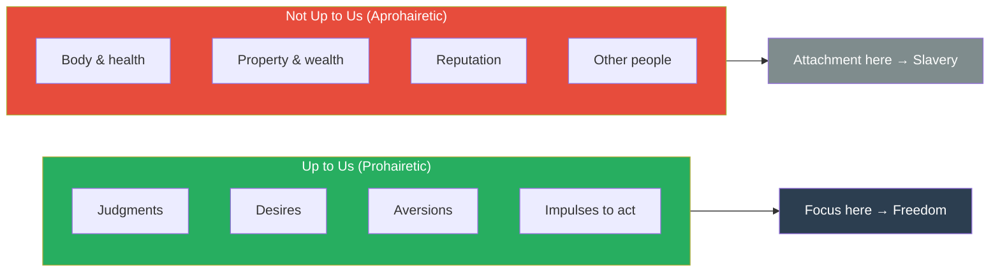
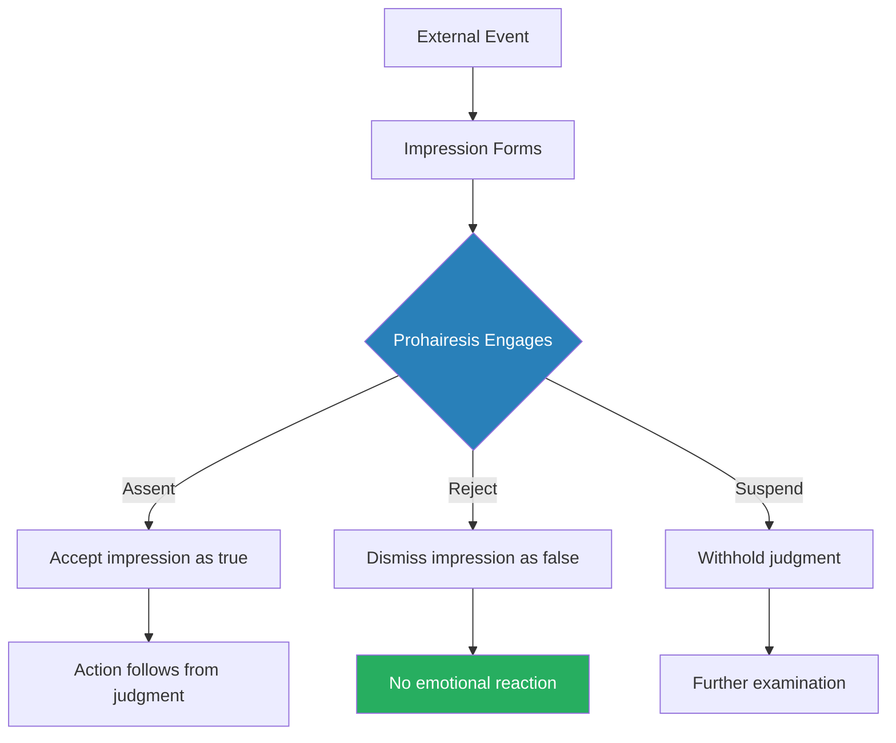
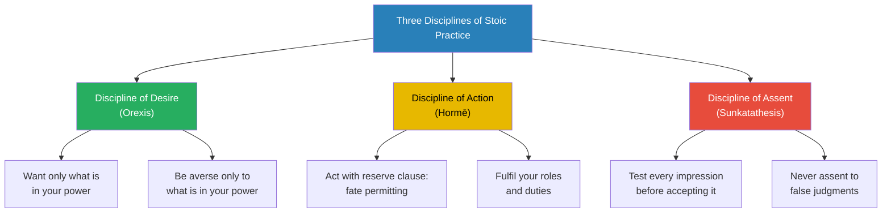
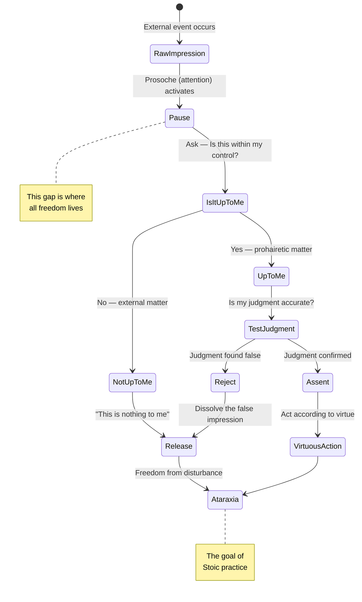
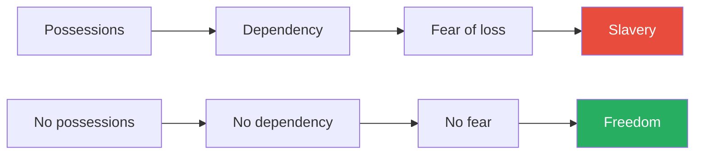
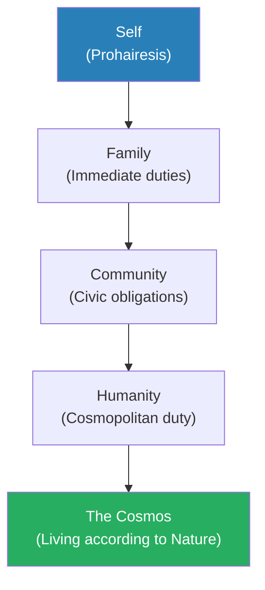
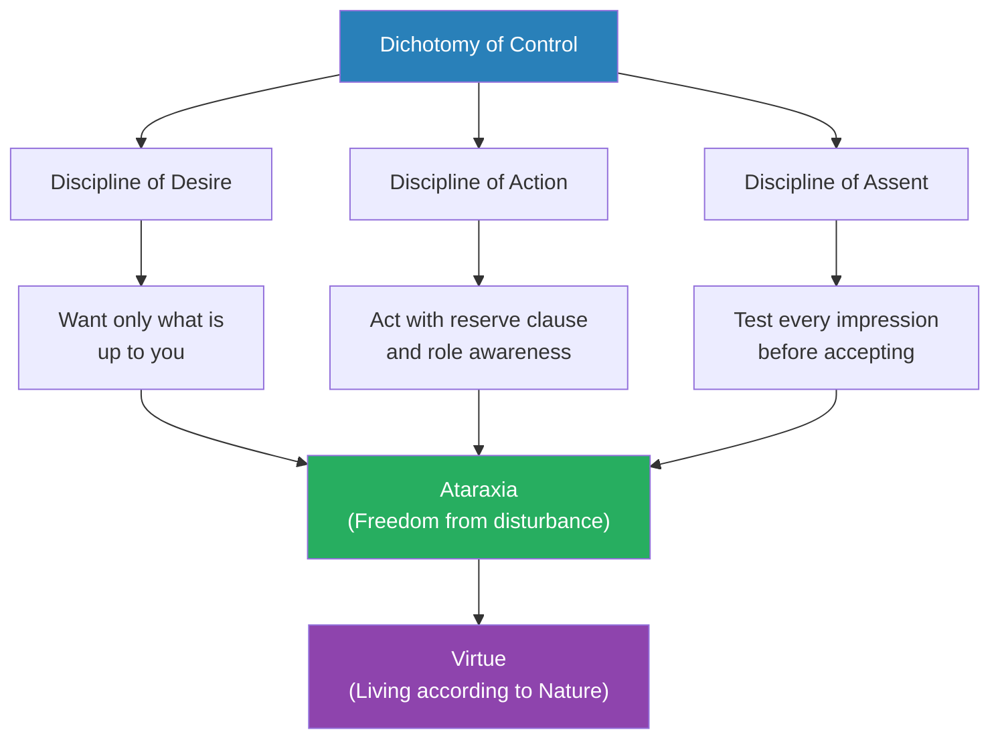

# Discourses — Epictetus

> Epictetus was born a slave. His master, Epaphroditus, once twisted his leg. Epictetus said calmly, "You're going to break it." When it broke, he said, "I told you so." He became one of the most influential philosophers in the Roman world — more systematic than Marcus Aurelius, more practical than Seneca, and more demanding than either. The *Discourses* are his lectures, recorded by his student Arrian: four surviving books of conversations, arguments, and exercises in how to live as a free person regardless of external circumstances. His central teaching is devastatingly simple: distinguish between what is up to you and what is not. Want only what is within your power. You will be invincible.

---

## About the Author

Epictetus (c. 50–135 CE) was born into slavery in Hierapolis, Phrygia (modern Turkey). He studied Stoic philosophy under Musonius Rufus while still enslaved — attending lectures with his master's permission. After being freed (the circumstances are unclear — possibly after Nero's death), he taught in Rome until Emperor Domitian expelled philosophers from the city in 89 CE. He then established a school in Nicopolis, northwest Greece, that attracted students from across the empire, including members of the Roman senatorial class. He wrote nothing himself. His student Arrian recorded the *Discourses* (originally eight books, four survive) and compiled the *Enchiridion* (Handbook) as a portable summary. His influence on Marcus Aurelius was profound — Marcus refers to Epictetus repeatedly in the *Meditations* and considered him the greatest Stoic teacher.

---

## The Big Idea

- <b style="color: #2980b9">The Dichotomy of Control</b> is the foundation of everything Epictetus teaches: some things are "up to us" (*eph' hēmin*) — our judgments, desires, aversions, and impulses — and everything else is "not up to us"
- Freedom, happiness, and virtue all come from wanting only what is within your power and being genuinely indifferent to what is not
- This is not a theory to understand but a practice to train — Epictetus designed exercises, analogies, and progressive challenges to build this capacity the way an athlete builds muscle
- <b style="color: #27ae60">Events do not disturb you. Your judgments about events disturb you. Change the judgment and you change the experience.</b>

The *Discourses* differ from most Stoic texts because they are not private reflections (like Marcus's *Meditations*) or polished literary essays (like Seneca's letters). They are live teaching — Epictetus arguing with students, challenging their assumptions, mocking their excuses, and demanding they actually practise what they claim to believe:

- Epictetus repeatedly catches students who can recite Chrysippus perfectly but panic when they lose money or face criticism
- His standard is not intellectual understanding but behavioural proof — if you still get angry at insults, you have not learned the dichotomy of control
- He compares philosophical theory without practice to a carpenter who lectures about tools but never builds anything

The diagram above captures the entire operating system of Epictetus's philosophy — every teaching, exercise, and argument flows from this single distinction.

---

## Key Concepts at a Glance

| Concept | One-line summary |
|---------|-----------------|
| **Dichotomy of Control** | Only your judgments, desires, and actions are truly yours — everything else is borrowed |
| **Prohairesis** | Your moral choice / ruling faculty — the one thing no tyrant can seize |
| **Prosoche** | Constant attention to your own impressions before you assent to them |
| **Discipline of Desire** | Want only what is in your power; be averse only to what is in your power |
| **Discipline of Action** | Pursue goals with a "reserve clause" — do your best, accept the outcome |
| **Discipline of Assent** | Test every impression: is this within my control? Is my judgment accurate? |
| **Role Ethics** | You occupy multiple roles — each has duties; fulfil them without complaint |
| **Impressions** | Raw mental data before interpretation — neutral until you add judgment |
| **The Open Door** | Death is always available as an exit — this makes all suffering voluntary |
| **The Actor Analogy** | You did not choose your role; you choose how well to play it |
| **The Banquet Metaphor** | Take what is offered moderately; do not grab or clutch |
| **Reserve Clause** | "I will do X, fate permitting" — pursue outcomes without demanding them |

The force diagram reveals how the Dichotomy of Control sits at the gravitational centre of Epictetus's system — every other concept either flows from it or feeds back into the ultimate goal of ataraxia (freedom from disturbance).

---

## Book I: Foundations — What Is and Is Not Up to Us

*Epictetus lays the groundwork for his entire philosophy by establishing the single distinction that everything else depends on: the boundary between what belongs to you and what does not.*

### The Dichotomy of Control

- <b style="color: #2980b9">The Dichotomy of Control (*ta eph' hēmin* and *ta ouk eph' hēmin*)</b> is the master framework — Epictetus opens the *Enchiridion* with it and returns to it in virtually every lecture
- Within our power: our opinions, motivations, desires, aversions — in a word, whatever is our own doing
- Not within our power: our body, property, reputation, political office — whatever is not our own doing
- <b style="color: #27ae60">If you try to control what is not up to you, you will be frustrated, anxious, and enslaved. If you focus exclusively on what is up to you, nothing can harm you.</b>

The logic is relentless:

- If you desire something outside your control (a promotion, another person's love, good health), you have handed your happiness to something you cannot guarantee
- If you are averse to something outside your control (death, poverty, illness), you live in perpetual fear of what may come regardless of your efforts
- <b style="color: #e74c3c">The person who desires what is not up to them is by definition a slave — even if they wear a crown</b>
- The person who desires only what is up to them is by definition free — even if they wear chains

> [!tip] Core Insight
> Freedom is not the absence of constraints on your body. Freedom is the absence of constraints on your will. A slave with a trained prohairesis is freer than an emperor with an untrained one.

The doughnut reveals a striking asymmetry at the heart of Stoic practice: only four categories (shown in green) are truly within your power, yet these four — judgments, desires, aversions, and impulses — are the only things that determine your happiness, while the six external categories (shown in red/orange) that most people obsess over are entirely outside their control.

---

### Prohairesis — Your Ruling Faculty

*The most important technical term in Epictetus — the capacity that makes you human and the only thing that is truly, irrevocably yours.*

- <b style="color: #2980b9">Prohairesis</b> is Epictetus's term for the distinctly human capacity to choose how to interpret events and respond to them
- It is the seat of moral agency — the "I" behind every decision
- Animals have impressions and impulses but no prohairesis — they react automatically
- Humans can receive an impression ("I've been insulted") and then choose what to do with it — assent to the impression's claim, reject it, or suspend judgment
- This capacity is what makes ethical life possible — without the ability to choose, virtue and vice are meaningless

The revolutionary claim:

- <b style="color: #27ae60">No external force can compel your prohairesis. Your body can be imprisoned, tortured, or killed, but no one can make you judge something to be good that you believe is bad.</b>
- A tyrant can threaten death. He cannot make you afraid unless you assent to the judgment that death is something to fear.
- This is not theoretical bravery — Epictetus tested it personally. His master broke his leg. His prohairesis remained untouched.

> [!example] Epictetus and Epaphroditus's Cruelty (c. 65 CE)
> - Epictetus's master Epaphroditus was twisting his leg — whether as punishment or casual cruelty is unclear
> - Epictetus said calmly, without pleading or anger: "You are going to break it"
> - Epaphroditus continued. The leg broke.
> - Epictetus said: "There — I told you so"
> - He walked with a limp for the rest of his life
> - He never mentioned the incident with resentment — only as a teaching example of the difference between what is up to us (our response) and what is not (our body)
> **The lesson:** The body is not yours. Your judgment about the body is.

> [!example] The Tyrant's Threat (Discourse I.2)
> - Epictetus poses a scenario to his students: a tyrant says "I will chain you"
> - The correct response: "You will chain my leg. My prohairesis you cannot chain."
> - The tyrant says: "I will cut off your head"
> - The correct response: "When did I tell you my head cannot be cut off? But my moral purpose — that you cannot touch"
> - The tyrant has power over the body. He has zero power over the will.
> - Students who flinch at this exercise reveal that they have not yet internalised the dichotomy of control
> **The lesson:** The tyrant's real power ends where your prohairesis begins.

This diagram shows the moment of freedom that Epictetus's entire philosophy depends on — the gap between impression and assent where prohairesis operates.

---

### The Discipline of Impressions

*Every experience begins as raw data. Suffering is what you add to it.*

- <b style="color: #2980b9">Impressions (*phantasiai*)</b> are the raw sensory and mental events that present themselves to consciousness — "someone said something about me," "there is a pain in my leg," "my money is gone"
- These are neutral. They carry no inherent emotional charge.
- <b style="color: #e74c3c">Suffering occurs when you add judgment to the impression</b>: "this is terrible," "this shouldn't happen," "this is unfair," "I can't bear it"
- The judgment — not the event — produces the emotional reaction

Epictetus's training method:

- When an impression strikes, pause. Do not react immediately.
- Ask: "Is this about something within my control?"
- If yes, respond with appropriate action
- If no, train yourself to say: "This is nothing to me" (*ouden pros eme*)
- <b style="color: #27ae60">This is not cold indifference — it is radical prioritisation. You conserve all your emotional and cognitive energy for the things you can actually change.</b>

| Impression | Untrained Response | Trained Response |
|------------|-------------------|-----------------|
| "He insulted me" | Anger, desire for revenge | "He made sounds. My character is untouched." |
| "I lost my money" | Panic, despair | "Property was returned. It was never truly mine." |
| "I might get sick" | Anxiety, obsessive worry | "My body is not up to me. My response to illness is." |
| "She rejected me" | Humiliation, self-doubt | "Her preferences are not up to me. My worth is not determined by her choice." |
| "I will die" | Terror | "All mortals die. How I live until then is up to me." |

> [!abstract] The Impression-Testing Protocol
> 1. Notice the impression as it arises — "Something is happening"
> 2. Pause before reacting — create the gap between stimulus and response
> 3. Ask: "Is this up to me or not up to me?"
> 4. If not up to you: "This is nothing to me" — release it
> 5. If up to you: "What is the virtuous response?" — act on it
> 6. Check your judgment: "Am I adding a story that isn't there?"

---

### Prosoche — The Practice of Attention

*Epictetus's students did not just study philosophy — they trained their attention the way wrestlers trained their bodies.*

- <b style="color: #2980b9">Prosoche</b> means constant self-monitoring — watching your own impressions, judgments, and impulses in real time
- Without prosoche, philosophical knowledge is useless — you understand the dichotomy of control in the lecture hall but forget it the moment someone cuts in front of you
- Epictetus compares it to a wrestler who must stay alert at all times during a match — one lapse in attention and you are thrown
- The practice is exhausting at first and becomes habitual over time — like any skill, attention improves with repetition

> [!tip] Core Insight
> Philosophy is not something you study. It is something you practise — moment by moment, impression by impression, for the rest of your life. The exam is not in the classroom. The exam is every moment of every day.

---

## Book I (continued): Freedom, Slavery, and the Things That Matter

### True Freedom vs. False Freedom

*Epictetus redefines freedom in a way that makes wealth, power, and political liberty irrelevant to the question.*

- Most people define freedom as the ability to do what you want — go where you please, own what you choose, say what you like
- Epictetus's definition is radically different: <b style="color: #27ae60">freedom is wanting only what is in your power and being averse only to what is in your power</b>
- Under this definition, a rich man who fears losing his wealth is a slave to his wealth
- A powerful man who fears losing his position is a slave to his position
- A famous man who fears losing his reputation is a slave to other people's opinions
- Only the person who has trained themselves to desire nothing outside their prohairesis is genuinely free

> [!example] The Rich Man's Slavery (Discourse I.9)
> - Epictetus describes a wealthy Roman who owned estates, slaves, and political connections
> - The man could not sleep because he feared losing his property
> - He could not eat without anxiety because he worried about his enemies
> - He could not travel freely because he feared bandits
> - He surrounded himself with guards — but who guards the guards?
> - The man was nominally free — a Roman citizen with full legal rights
> - By Epictetus's standard, he was more enslaved than any chain-gang labourer
> **The lesson:** If your peace depends on keeping something you cannot guarantee, you have traded freedom for the illusion of security.

> [!example] Diogenes the Cynic — Radical Freedom (Discourse I.24)
> - Epictetus frequently cites Diogenes of Sinope as the exemplar of freedom
> - Diogenes owned nothing — not even a cup (he threw it away when he saw a child drinking from cupped hands)
> - He feared nothing — not poverty, not exile, not death
> - When captured by pirates and sold as a slave, he told the auctioneer: "Sell me to that man — he needs a master"
> - Alexander the Great visited Diogenes and asked if there was anything he could do for him. Diogenes said: "Yes — stop blocking my sunlight"
> - The most powerful man in the world could not give Diogenes anything he wanted, because Diogenes wanted nothing that was not up to him
> **The lesson:** Freedom is not having everything. It is needing nothing that depends on someone else.

---

### The Open Door

*One of Epictetus's most startling teachings — and one that is easily misunderstood.*

- <b style="color: #2980b9">The Open Door</b> is Epictetus's metaphor for death as a permanent exit from any situation
- "The door is open" — meaning: if life becomes truly unbearable, you can always leave
- <b style="color: #e74c3c">This is NOT an encouragement to suicide. It is a reframing of suffering.</b>
- The argument: if you choose to stay alive in a difficult situation, you have chosen to stay. Your suffering is therefore voluntary, not imposed.
- This removes the victim's claim: "I have no choice." You always have a choice. If you choose to endure, own the choice.
- The practical effect is surprisingly liberating — once you accept that staying is a choice, you stop feeling trapped

Epictetus uses this teaching to challenge students who complain about their circumstances:

- "The room is smoky? If it's too much, leave. If you stay, don't complain."
- The metaphor extends to all of life: if you stay in a bad situation, it means you have judged that staying is better than leaving
- <b style="color: #27ae60">Take responsibility for the judgment. You are not a prisoner of circumstance — you are a person who has chosen, moment by moment, to remain.</b>

---

## Book II: Training the Will — Desire, Aversion, and Action

*Book II moves from theory to practice. Epictetus introduces his three disciplines — the systematic training programme that transforms philosophical understanding into lived virtue.*

### The Three Disciplines

These three disciplines form the complete Stoic training programme — master them in sequence.

The Discipline of Desire is the emotional foundation — hardest to feel but most transformative for daily life — while the Discipline of Assent demands the greatest intellectual rigour and longest mastery time, explaining why Epictetus insists students tackle them in sequence rather than jumping to the most intellectually appealing one.

---

#### The Discipline of Desire (*Orexis*)

*The first discipline to master, because untrained desire is the source of most human suffering.*

- <b style="color: #2980b9">The Discipline of Desire</b> teaches you to want only what is within your power and to be averse only to what is within your power
- Most people desire things outside their control: wealth, fame, health, other people's approval, specific outcomes
- Most people are averse to things outside their control: poverty, illness, death, rejection, failure
- This guarantees frustration — you will inevitably fail to get some things you desire and fail to avoid some things you fear

The training:

- **Phase 1:** Stop desiring externals entirely. Not "desire them less" — stop.
  - This sounds extreme, but Epictetus is practical: you can still prefer health to illness, wealth to poverty
  - The difference between preference and desire: preference says "I would like X, but I will be fine without it"; desire says "I must have X or I will be miserable"
- **Phase 2:** Redirect desire toward the only thing that is genuinely up to you — your own virtue, your own correct use of impressions
  - Desire to be wise. Desire to be courageous. Desire to be just. These are within your power.
- **Phase 3:** Train aversion away from externals. Do not be averse to death, poverty, or illness — be averse only to vice, cowardice, and injustice
  - <b style="color: #27ae60">When your only fear is your own moral failure, you become fearless in every other domain</b>

> [!example] The Student Who Feared Poverty (Discourse II.1)
> - A student confessed to Epictetus that he could not stop worrying about losing his family's wealth
> - Epictetus asked: "What happens if you lose it?"
> - The student: "I would be miserable. I could not live the way I'm accustomed to."
> - Epictetus: "So your happiness depends on money — something a thief can take, a fire can destroy, or an emperor can confiscate?"
> - The student: "What else would it depend on?"
> - Epictetus: "Your prohairesis. Your ability to respond well to whatever happens. Can a thief steal that?"
> - The student fell silent — recognising that his philosophical training had not yet reached his actual desires
> **The lesson:** You have not mastered Stoicism until your peace no longer depends on anything a thief could take.

---

#### The Discipline of Action (*Hormē*)

*The second discipline governs how you act in the world — pursuing goals without being enslaved by outcomes.*

- <b style="color: #2980b9">The Discipline of Action</b> teaches you to act with a "reserve clause" — to pursue goals energetically while accepting that outcomes are not entirely up to you
- The reserve clause (*huphexhairesis*): "I will do X, fate permitting"
  - Not "I will succeed" but "I will try my best, and accept whatever results"
  - Not "I will be promoted" but "I will do excellent work, and accept the judgment of others"
  - Not "I will cure my illness" but "I will follow the best treatment, and accept the body's response"

This discipline also governs <b style="color: #2980b9">Role Ethics</b> — Epictetus's framework for understanding duty:

- You occupy multiple roles simultaneously: human being, citizen, parent, child, friend, neighbour, student, professional
- Each role carries duties — not chosen by you, but inherent in the role itself
- Your job is to identify your roles, understand their duties, and fulfil them to the best of your ability
- <b style="color: #e74c3c">Complaining about the duties of your role is like an actor complaining about their lines — you did not write the play, but you chose to be on stage</b>

> [!example] The Actor Analogy (Enchiridion 17)
> - Epictetus tells his students: "Remember that you are an actor in a play determined by the playwright"
> - If the playwright wants the play short, it is short; if long, long
> - If he wants you to play a beggar, play even this role with excellence
> - And so with a cripple, a ruler, or a common citizen
> - Your job is not to choose the role — it is to play the assigned role superbly
> - Epictetus himself had been assigned the role of slave, then cripple — and played both with such excellence that his students travelled across the empire to learn from him
> **The lesson:** You did not choose your circumstances. You choose how you respond to them. Play your role with excellence.

> [!abstract] The Reserve Clause in Practice
> 1. Set your intention: "I will pursue X" (a goal, a project, a conversation)
> 2. Add the reserve clause: "fate permitting" or "if nothing prevents it"
> 3. Give maximum effort — the reserve clause is NOT an excuse for laziness
> 4. When the outcome arrives, accept it — whether success or failure
> 5. Evaluate: "Did I give my best effort? Was my intention virtuous?"
> 6. If yes: you succeeded, regardless of the external outcome
> 7. If no: correct your effort or intention, and try again

---

#### The Discipline of Assent (*Sunkatathesis*)

*The most advanced discipline — the moment-by-moment practice of testing every impression before accepting it as true.*

- <b style="color: #2980b9">The Discipline of Assent</b> is the skill of examining impressions before agreeing with them
- An impression arrives: "He insulted me." The untrained mind assents immediately — agrees the impression is true and reacts with anger.
- The trained mind pauses: "Wait. What actually happened? He said words. Those words are sounds. Whether they constitute an insult depends on my judgment. Do I choose to judge this as an insult?"
- <b style="color: #27ae60">The pause between impression and assent is where all freedom lives. Lengthen that pause, and you become unshakeable.</b>

The three questions for testing impressions:

1. **Is this impression about something within my control?** If not, it requires no emotional response.
2. **Is my judgment about this impression accurate?** Am I adding a story? Am I catastrophising? Am I assuming intentions?
3. **What would a wise person do with this impression?** How would Socrates respond? Diogenes? Zeno?

> [!tip] Core Insight
> Most emotional suffering comes from assenting to impressions you never examined. The angry person did not choose anger — they sleepwalked into it by automatically agreeing with the impression "I have been wronged." Wake up. Examine the impression. Choose whether to assent.

This state diagram traces the complete journey from raw impression to inner peace — the critical insight is that the "Pause" state, where prosoche engages before automatic reaction, is the single intervention point that separates the trained Stoic from the person enslaved by their own reflexes.

---

## Book II (continued): Education, the Philosopher, and True Progress

### What Philosophy Is — And What It Is Not

*Epictetus is scathing toward students who treat philosophy as intellectual entertainment rather than spiritual training.*

- Philosophy is not the ability to recite Chrysippus or parse logical syllogisms
- <b style="color: #e74c3c">Philosophy is the ability to remain calm when your child is sick, your money is stolen, or your reputation is attacked</b>
- A person who can explain the dichotomy of control but panics when their ship is in a storm has learned nothing
- Epictetus draws a sharp line between **academic philosophy** (understanding arguments) and **practical philosophy** (living according to them)

He uses a devastating analogy:

- A carpenter who lectures about joints, planes, and dovetails but cannot build a table is not a carpenter
- A philosopher who lectures about virtue but cannot control his temper is not a philosopher
- <b style="color: #27ae60">The test of philosophy is not in the classroom. It is in the moment of crisis — when your impressions are screaming and your prohairesis must hold firm.</b>

> [!example] The Student Who Could Recite Chrysippus (Discourse II.17)
> - A student boasted to Epictetus that he could explain all of Chrysippus's arguments about the dichotomy of control
> - Epictetus asked: "If your ship were sinking, would you recite Chrysippus to the waves?"
> - The student laughed
> - Epictetus did not laugh: "When your ship is sinking — when you are frightened, when you are angry, when you lose someone you love — THAT is when you need Chrysippus. Not on the page. In your soul."
> - The student who reads but does not practise is like a patient who memorises prescriptions but never takes the medicine
> **The lesson:** Philosophy that stays in the head and never reaches the hands, the heart, and the daily choices is not philosophy. It is entertainment.

> [!example] The Sick Philosopher (Discourse II.18)
> - Epictetus notes that many philosophers fall apart when they are physically ill
> - They preach indifference to the body, then moan and complain when they have a fever
> - "Where are your principles now? Did you leave them in your lecture notes?"
> - A true philosopher uses illness as an opportunity to practise: "My body has a fever. My prohairesis does not."
> - The illness tests what the lecture hall cannot: whether you have internalised the teaching or merely memorised it
> **The lesson:** The test of a Stoic is not what they say when comfortable — it is what they do when suffering.

---

### Signs of Philosophical Progress

*Epictetus provides a diagnostic checklist for genuine versus superficial progress in philosophy.*

- <b style="color: #2980b9">The marks of the progressing student (*prokoptōn*)</b> are behavioural, not intellectual:
  - You blame no one — not others, not yourself — for anything that happens to you
  - You praise no one, blame no one, and accuse no one
  - You never speak of yourself as if you are someone important or as if you know something special
  - When frustrated, you blame your own lack of training, not external circumstances
  - You watch your own desires and aversions with suspicion, knowing they are the source of suffering
  - You are gentle with others, hard on yourself
  - You laugh at anyone who praises or criticises you — knowing that neither opinion changes what is up to you

| Sign of Progress | Sign of No Progress |
|-----------------|-------------------|
| Blames no external person or event | Blames others for their feelings |
| Desires only what is up to them | Desires wealth, fame, approval |
| Fear only of their own vice | Fears poverty, illness, rejection |
| Gentle when contradicted | Angry when challenged |
| Silent about their own achievements | Boasts about philosophical knowledge |
| Practises daily, quietly | Studies occasionally, talks frequently |
| Tested by crisis and remains steady | Collapses under pressure despite knowing theory |

---

## Book III: Specific Situations — Applying the Principles

*Book III is the most practical section of the Discourses. Epictetus takes the abstract principles from Books I and II and shows how they apply to specific life situations: loss, illness, dealing with difficult people, managing desire, and facing death.*

### Handling Loss and Grief

*Epictetus's teaching on loss is among the most challenging in all of Stoic philosophy — and the most frequently misunderstood.*

- <b style="color: #2980b9">The principle of preconception (*prolepsis*)</b>: everything you "have" is on loan from nature. Your property, your health, your loved ones, your life — none of it belongs to you permanently.
- When you lose something, you are not being robbed — you are returning what was borrowed
- <b style="color: #e74c3c">"Never say of anything: 'I have lost it.' Say instead: 'I have returned it.'"</b>
- Your child dies? You have returned them. Your money is stolen? You have returned it. Your health fails? The body is returning to its natural state.

This sounds cold — and Epictetus knows it. He addresses the objection directly:

- He does not say: "Do not grieve." He says: "Do not grieve as if you have been wronged."
- Grief is natural. The judgment "this should not have happened" is not.
- A person who grieves while accepting that loss is part of life suffers once — the pain of loss
- A person who grieves while raging against reality suffers twice — the pain of loss plus the pain of believing the universe has treated them unjustly
- <b style="color: #27ae60">The Stoic does not suppress emotion. The Stoic removes the false judgment that amplifies emotion into torment.</b>

> [!example] The Jar and the Child (Discourse III.24)
> - Epictetus instructs students: "When you kiss your child goodnight, whisper to yourself: 'Tomorrow you may die'"
> - Students recoil: "That's morbid!"
> - Epictetus: "Is it morbid, or is it true? Children die. Pretending otherwise does not protect them — it only guarantees that you will be destroyed if it happens."
> - He is not asking you to love your child less. He is asking you to love your child while remembering that you do not own them.
> - Begin the practice with small things: "This is a favourite cup. Cups break." When the cup breaks, you will say "I knew this could happen" instead of "How could this happen to me?"
> - Graduate to larger things: "This is my health. Bodies fail." "This is my friend. People die."
> **The lesson:** Rehearse impermanence not to diminish love, but to prevent the illusion of permanence from destroying you when reality arrives.

> [!example] Socrates and the Death of His Children
> - Epictetus cites Socrates as a model of how to handle loss
> - Socrates loved his children — he was a devoted father
> - But he loved them as a free man loves: deeply, without the delusion that they belonged to him
> - When facing his own death, Socrates's concern was not for what he was losing but for how he would comport himself in the final act
> - He drank the hemlock calmly, continued teaching his friends until the poison took effect, and died as he had lived — with his prohairesis intact
> **The lesson:** You can love fully and still accept loss with dignity. The two are not in conflict.

---

### The Banquet Metaphor

*One of Epictetus's most elegant analogies — simple enough for a child to understand, deep enough to reorient a life.*

- <b style="color: #2980b9">Life is like a banquet</b>: dishes are passed around the table
- When a dish comes to you, take a moderate portion. Do not grab.
- When the dish has passed you by, do not reach after it
- When the dish has not yet arrived, do not strain toward it with longing
- Apply this to health, wealth, relationships, career opportunities, life itself
- <b style="color: #27ae60">Enjoy what comes to you. Do not clutch it. Let go gracefully when it passes.</b>

The metaphor extends:

- If you pass up every dish entirely (the ascetic extreme), you become "not just a fellow-diner but worthy of sharing the gods' rule" — but Epictetus notes this is for advanced practitioners
- For most students, the goal is moderation: take what is offered, enjoy it, release it
- The person who grabs and hoards at the banquet ruins the experience for everyone — including themselves
- <b style="color: #e74c3c">The person who clutches past pleasures or future hopes misses the only dish actually in front of them: the present moment</b>

---

### Dealing with Difficult People

*Epictetus devotes considerable attention to interpersonal friction — because other people are the most common trigger for losing our philosophical composure.*

- When someone insults you, they are exercising their prohairesis — which is not up to you
- Your reaction is exercising your prohairesis — which is up to you
- The insult cannot harm your character unless you allow it to
- "If someone reports that a certain person speaks ill of you, do not make excuses. Say: 'He does not know my other faults, or he would have mentioned those as well.'"

The mechanism Epictetus identifies:

- We are not angry at the event — we are angry at our judgment about the event
- "He should not have said that" — this is a judgment, not a fact
- Replace it with: "He said what he said. His words are his business. My response is my business."
- <b style="color: #27ae60">The Stoic response to insult is not suppression of anger — it is the removal of the judgment that produces anger in the first place</b>

> [!example] The Philosopher and the Abuser (Discourse III.22)
> - A man publicly berated a Stoic philosopher in the marketplace
> - The philosopher listened without responding
> - The abuser, frustrated by the lack of reaction, screamed louder
> - The philosopher finally said: "If you are trying to upset me, you will have to try harder. You are competing with twenty years of training."
> - The crowd laughed. The abuser left humiliated — not by counter-attack, but by the philosopher's unshakeable calm
> **The lesson:** The person who cannot be provoked has already won. Anger is the abuser's only weapon, and it requires your cooperation to work.

| Situation | Untrained Response | Epictetan Response |
|-----------|-------------------|-------------------|
| Insulted publicly | Anger, counter-attack, humiliation | "His words are his business. My character is untouched." |
| Betrayed by a friend | Rage, desire for revenge | "He acted according to his nature. I will act according to mine." |
| Passed over for recognition | Self-pity, resentment | "Recognition is not up to me. My effort was." |
| Criticised unfairly | Defensiveness, self-justification | "Is the criticism accurate? If yes, improve. If no, dismiss." |
| Someone spreads rumours | Anxiety, damage control | "My reputation is not up to me. My character is." |

---

### Illness, Pain, and the Body

*Epictetus — who lived with a permanent disability — had an unusually practical perspective on physical suffering.*

- The body is not up to you. It will get sick. It will age. It will die.
- Pain is an impression. It becomes suffering only when you add the judgment: "this should not be happening"
- <b style="color: #2980b9">The lameness principle</b>: Epictetus's own lame leg was his constant teaching aid
  - "Lameness is an impediment to the leg, but not to the will"
  - The body has limitations. The prohairesis does not.
  - Every physical setback is an opportunity to demonstrate the distinction between body and will

> [!example] Epictetus on His Own Lameness
> - Students occasionally expressed pity about his disability
> - Epictetus consistently redirected: "You pity my leg. I pity your judgment."
> - His lameness demonstrated his philosophy more powerfully than any lecture: here was a man with a broken body and an unbreakable will
> - He would say: "Is lameness a hindrance to my foot? Yes. Is it a hindrance to my prohairesis? Only if I choose to let it be."
> - He turned his disability into his most convincing argument
> **The lesson:** The body's limitations prove the freedom of the will — because the will continues to function perfectly even when the body does not.

> [!abstract] Epictetus's Protocol for Physical Pain
> 1. Acknowledge the sensation: "There is pain"
> 2. Remove the judgment: NOT "This is terrible" — just "There is pain"
> 3. Ask: "Is this pain up to me?" The sensation: no. My response to it: yes.
> 4. Choose your response: endure with dignity, seek treatment if available, or exit if the pain exceeds what you choose to bear (the Open Door)
> 5. Use the pain as training: "This is an opportunity to practise what I teach"

---

## Book III (continued): The Cynic Ideal and Models of Virtue

### Diogenes and the Cynic Way of Life

*Epictetus holds up Diogenes the Cynic as the highest example of freedom — a man who needed nothing, feared nothing, and therefore answered to no one.*

- <b style="color: #2980b9">The Cynic ideal</b> is the most radical expression of Stoic freedom — stripping away every external dependency until only virtue remains
- Diogenes lived without property, without a home, without social standing
- He was not deprived — he was liberated. Every possession is a chain. Remove the possessions and you remove the chains.
- Epictetus admires Diogenes but does not expect all students to live this way — the Cynic life is for rare individuals with exceptional constitutions

> [!example] Diogenes and Alexander the Great
> - Alexander, having conquered most of the known world, sought out Diogenes to see what wisdom the famous philosopher possessed
> - He found Diogenes sunbathing near his barrel
> - Alexander offered: "I am Alexander the Great. Ask me for anything you want."
> - Diogenes: "Yes — stop blocking my sunlight."
> - Alexander's officers were outraged. Alexander himself said: "If I were not Alexander, I would wish to be Diogenes."
> - The conqueror of empires recognised that the man who needed nothing was freer than the man who owned everything
> **The lesson:** The person who needs nothing from you has absolute power in the relationship — because you have no leverage.

> [!example] Diogenes Captured by Pirates
> - Diogenes was captured by pirates and brought to a slave market
> - When asked what skills he had, he said: "I know how to govern men"
> - He pointed to a wealthy buyer in the crowd: "Sell me to that man — he needs a master"
> - The buyer, amazed by his boldness, purchased him and eventually made Diogenes the tutor of his children
> - Diogenes had been enslaved in body but remained free in spirit — he governed his "master" through moral authority
> **The lesson:** External status (slave/free, rich/poor) has no bearing on internal freedom. The slave who governs himself is the real master.

The Cynic path to freedom: subtract everything external until nothing remains that can be taken from you.

---

### Socrates as the Philosophical Ideal

*If Diogenes represents radical freedom through renunciation, Socrates represents philosophical excellence within ordinary life.*

- Epictetus refers to Socrates more than any other historical figure
- Socrates lived in society — he had a wife, children, friends, civic duties
- He did not withdraw from the world. He engaged with it while maintaining absolute inner integrity.
- <b style="color: #27ae60">Socrates proved that you do not need to live in a barrel to be free. You need to live with a trained prohairesis.</b>

Key Socratic moments Epictetus highlights:

- **The trial:** Socrates was convicted by an Athenian jury on charges of impiety and corrupting the youth. He could have fled. He chose to stay and accept the verdict — because he had lived under Athens's laws and would die under them.
- **The prison:** Socrates spent his final hours not in despair but in philosophical conversation with his friends. He discussed the immortality of the soul, comforted those who wept for him, and drank the hemlock with calm.
- **The refusal to escape:** Socrates's friend Crito arranged an escape. Socrates refused — not because he wanted to die, but because escaping would violate his principles. He had always taught that one must obey just laws. He would not contradict a lifetime of teaching to save his body.

> [!tip] Core Insight
> Socrates did not demonstrate courage once, in a dramatic moment. He demonstrated it continuously — in every conversation, every trial, every choice — for decades. The death was simply the final act of a consistent life.

---

## Book IV: The Final Teachings — Independence, Serenity, and the Examined Life

*Book IV brings together the threads of the entire Discourses. Epictetus addresses the most advanced challenges: how to maintain philosophical composure under extreme pressure, how to avoid the subtle traps of pride and complacency, and how to live every day as if it were both your first and your last.*

### On Freedom from Disturbance (*Ataraxia*)

*The ultimate goal of Stoic practice is not toughness or indifference — it is a deep, unshakeable serenity that comes from wanting only what is up to you.*

- <b style="color: #2980b9">Ataraxia</b> — freedom from disturbance — is the natural result of mastering the three disciplines
- It is not emotional numbness. It is the absence of unnecessary emotional turmoil.
- The Stoic still feels pleasure, pain, affection, and loss — but does not feel the amplifying judgments that turn natural emotions into torment
- "This is painful" is a natural response. "This is unbearable and should not be happening" is a judgment that doubles the suffering.

| Emotion | Natural (Acceptable) | Amplified by Judgment (Unnecessary) |
|---------|---------------------|-------------------------------------|
| Grief | "I miss them" | "It's not fair. They shouldn't have died." |
| Pain | "This hurts" | "I can't stand this. Why is this happening to me?" |
| Disappointment | "I didn't get what I wanted" | "I've been cheated. The world is against me." |
| Fear | "This situation is dangerous" | "Something terrible will happen. I can't cope." |
| Anger | "That was unjust" | "He did that on purpose. He must be punished." |

The left column represents what Epictetus considers appropriate responses. The right column represents the unnecessary suffering that comes from adding false judgments to natural emotions.

---

### Avoiding the Traps of Pride and Complacency

*Epictetus warns that philosophical progress itself creates new dangers — the student who knows they are progressing may become proud of their progress, which is itself a form of attachment to externals.*

- <b style="color: #e74c3c">The worst student is not the one who knows nothing — it is the one who thinks they know everything</b>
- A student who has memorised all of Chrysippus but cannot control their temper has learned nothing useful
- A student who has controlled their temper but becomes proud of their self-control has acquired a new vulnerability — attachment to their self-image as a disciplined person
- Genuine progress is invisible to the person progressing — because the truly progressing student has stopped monitoring their own progress and started simply living according to nature

Signs that pride has infected your practice:

- You correct others' philosophical mistakes (unsolicited)
- You compare your composure favourably to others' emotional reactions
- You feel superior to people who have not studied philosophy
- You use philosophical vocabulary to signal sophistication rather than to clarify thought
- <b style="color: #27ae60">The true philosopher does not advertise their philosophy. They simply live it — quietly, consistently, without audience.</b>

> [!example] The Boasting Student (Discourse IV.8)
> - A student returned from a social event and reported to Epictetus: "I was the calmest person there. Everyone else was upset about the news from Rome, and I alone remained composed."
> - Epictetus: "And now you are disturbed — by your pride in being undisturbed."
> - The student had exchanged one attachment (to external events) for another (to his self-image as a Stoic)
> - True ataraxia does not notice itself. The moment you congratulate yourself on your composure, you have lost it.
> **The lesson:** The ego will use your philosophy against you. It will turn your detachment into another form of attachment — attachment to being detached.

---

### On Anger and Its Cure

*Anger is the emotion Epictetus addresses most frequently — because anger is the clearest evidence that your prohairesis has failed its assignment.*

- Anger arises when you judge that something "should not have happened" — but everything that happened was either up to you or not up to you
- If it was up to you and you failed: correct yourself, do not rage at the world
- If it was not up to you: rage is pointless — you are shouting at physics
- <b style="color: #e74c3c">Anger is never a sign of strength. It is always a sign that you have invested your happiness in something outside your control.</b>

The Stoic cure for anger operates in stages:

- **Prevention:** Morning preparation — expect difficult people and difficult events before they arrive
- **Interruption:** When anger begins to rise, catch it immediately. The longer you wait, the harder it is to stop.
- **Examination:** Ask: "What judgment am I making? Is it accurate? Is this thing up to me?"
- **Reframing:** Replace "he should not have done that" with "he did what his nature and understanding dictated — just as a fig tree produces figs"
- **Release:** Anger that has been examined and found baseless dissolves on its own. You do not need to suppress it — you need to remove the false judgment that feeds it.

> [!example] The Angry Father (Discourse I.28)
> - A father came to Epictetus in a rage because his daughter was ill and he had fled the house, unable to bear watching her suffer
> - Epictetus asked: "Was your reaction natural?"
> - The father: "Of course!"
> - Epictetus: "Natural, yes. But was it correct? Is running from your sick daughter the act of a loving father?"
> - The father grew quiet
> - Epictetus: "Your anger was not at the illness. It was at your own helplessness. You wanted to control her health — which is not up to you. When you could not, you raged — and your rage drove you away from the one place you were needed."
> - The father wept and returned home
> **The lesson:** Anger at what you cannot control does not protect the people you love. It drives you away from them.

---

### Living with Others: Community, Duty, and Cosmopolitanism

*Despite his emphasis on individual inner freedom, Epictetus insists that Stoicism is not an individualistic philosophy. The Stoic has duties to others — family, city, and humanity.*

- <b style="color: #2980b9">Cosmopolitanism</b>: Epictetus teaches that you are a citizen of the cosmos first, and of your particular city second
- You have obligations that radiate outward: to yourself (maintain your prohairesis), to your family (fulfil your roles), to your community (be a good citizen), to humanity (act with justice toward all)
- The Stoic does not withdraw from society. The Stoic engages with society while maintaining inner independence.
- <b style="color: #27ae60">You are a thread in the fabric of the cosmos. Act in harmony with the whole, not just in the interest of the thread.</b>

Epictetus on specific relationships:

- **Parents:** Honour them, even when they are difficult. Their role is "parent" — yours is "child." Fulfil your role regardless of whether they fulfil theirs.
- **Friends:** Be honest, be loyal, be useful. A friend who flatters is an enemy. A friend who challenges you to be better is a treasure.
- **Rulers:** Obey just laws. Resist unjust commands — but resist through moral integrity, not through violence or complaint.
- **Strangers:** Treat every person as a fellow citizen of the cosmos. Their nationality, status, and wealth are externals — irrelevant to their fundamental dignity.

Epictetus's circles of duty — responsibility radiates outward from the self, but the self must be trained first.

---

### The Morning and Evening Practice

*Epictetus prescribes a daily rhythm of philosophical practice — bookending each day with deliberate examination.*

> [!abstract] Epictetus's Daily Practice
> **Morning:**
> 1. Before leaving the house, review: "What is up to me today? My judgments, my desires, my impulses, my effort."
> 2. Prepare for difficulty: "I will encounter rude people, ungrateful people, dishonest people. They act from ignorance, not malice."
> 3. Set your intention: "I will maintain my prohairesis regardless of what happens."
>
> **Throughout the day:**
> 4. Practice prosoche — watch your impressions in real time
> 5. When triggered, pause: "Is this up to me?"
> 6. Apply the reserve clause to every action: "I will do X, fate permitting"
>
> **Evening:**
> 7. Review the day: "Where did I fail to maintain my prohairesis? Where did I succeed?"
> 8. Do not punish yourself for failures — simply note them and resolve to improve
> 9. "What impression did I handle badly today? What would the wise person have done?"

This practice echoes Pythagoras's evening review, which Epictetus explicitly cites. The purpose is not guilt but calibration — adjusting your practice based on honest self-observation.

---

### On Death and the End of Life

*Epictetus returns to death repeatedly throughout the Discourses — not with morbid fascination, but because the fear of death is the ultimate test of the dichotomy of control.*

- Death is not up to you. Your response to the knowledge of death is.
- <b style="color: #e74c3c">If you fear death, you have declared that something outside your control has power over your happiness — and you have violated the fundamental principle</b>
- The practice: when death-anxiety arises, examine the impression
  - "I will die" — true, and not up to you
  - "Death is terrible" — a judgment, not a fact, and up to you to accept or reject
  - "I should be afraid" — false. You should be aware. Awareness is not fear.

Epictetus's attitude toward death is remarkably practical:

- Death is like the end of a banquet — you leave the table, and others take your place
- Death is like the end of a play — the actor exits the stage, and the play continues
- Death is like returning a borrowed item — you came into life with nothing, you leave with nothing
- <b style="color: #27ae60">The person who has lived well has no reason to fear death. They have played their role with excellence. What more can be asked?</b>

> [!example] Socrates's Final Hours (Discourse IV.1)
> - Epictetus describes Socrates in his final hours as the supreme demonstration of philosophical living
> - Socrates's friends were weeping. Socrates was calm.
> - He discussed philosophy. He comforted others. He made jokes.
> - When the jailer brought the hemlock, Socrates took it without trembling
> - His final words to Crito: "We owe a rooster to Asclepius. Pay it and do not neglect it."
> - Even in death, Socrates attended to his duties — small, practical, human duties
> - He did not deliver a grand speech. He paid a debt. He maintained his character to the last breath.
> **The lesson:** A good death is not heroic or dramatic. It is simply the final act of a consistent life — played with the same attention and virtue as every other act.

---

## Recurring Themes Across All Four Books

### The Carpenter Analogy: Philosophy as Craft

*Epictetus returns again and again to the comparison between philosophy and skilled trades — because both require practice, not just theory.*

- A carpenter does not become a carpenter by reading about carpentry
- A musician does not become a musician by studying music theory
- <b style="color: #2980b9">A philosopher does not become a philosopher by reading about philosophy</b>
- Each requires daily practice, repetition, correction, and gradual improvement
- You will fail many times. The craftsman expects this. The philosopher should too.
- <b style="color: #27ae60">The question is never "Do I fail?" — it is "Do I get back to practice after failing?"</b>

---

### Education vs. Training

*A distinction Epictetus considers fundamental — and one that most students miss.*

- **Education** gives you knowledge: you understand what the dichotomy of control means
- **Training** gives you capacity: you can apply the dichotomy of control when your child is sick, your money is lost, or your enemy is at the door
- Most students are educated. Almost none are trained.
- The distance between education and training is the distance between reading about swimming and swimming

| Education | Training |
|-----------|----------|
| Knows the dichotomy of control | Applies it under pressure |
| Can explain prohairesis | Uses prohairesis in crisis |
| Recites Stoic principles | Lives Stoic principles |
| Understands impressions | Catches impressions in real time |
| Admires Socrates | Imitates Socrates |

> [!tip] Core Insight
> If you can explain the dichotomy of control perfectly but lose your composure when someone insults you, you are educated but not trained. Epictetus is not interested in education. He is interested in training.

Epictetus identifies three stages of training that every student must pass through:

- **Stage 1: The Discipline of Desire** — learn to want only what is up to you. This is the foundation. Until your desires are corrected, nothing else can be built.
- **Stage 2: The Discipline of Action** — learn to act appropriately, fulfilling your roles with a reserve clause. This requires the first discipline as a prerequisite — you cannot act well if your desires are pulling you toward externals.
- **Stage 3: The Discipline of Assent** — learn to test every impression with philosophical rigour. This is the most advanced stage, requiring both corrected desires and disciplined action as foundations.

Most students want to start at Stage 3 — the intellectual work of examining impressions. Epictetus insists they must start at Stage 1 — the emotional work of retraining desire. Skipping stages produces the student who can analyse brilliantly but crumbles under pressure.

---

### The Comparison with Athletics

*Epictetus compares philosophical training to athletic training — one of his favourite and most revealing analogies.*

- The Olympic athlete does not train only on competition day — they train every day for years
- They do not expect to win every contest — they expect to compete with excellence
- They do not complain about the difficulty of training — they chose to be athletes
- They do not blame the opponent when they lose — they return to the gymnasium
- <b style="color: #2980b9">The philosophical student must approach inner training with the same seriousness that the athlete approaches physical training</b>

> [!example] The Wrestler and the Philosopher (Discourse III.15)
> - Epictetus compares the philosopher to a wrestler in training
> - The wrestler practises holds, throws, and escapes every day — not because there is a match today, but because there might be one tomorrow
> - The philosopher practises testing impressions, redirecting desire, and maintaining composure — not because there is a crisis today, but because there might be one tomorrow
> - The wrestler who skips training loses the match. The philosopher who skips practice loses their composure.
> - Both failures are self-inflicted. Both are correctable through consistent discipline.
> **The lesson:** Philosophy is a contact sport. You must spar daily with your own impressions, or you will be thrown by the first serious challenge.

---

### What You Call "Yours"

*A theme Epictetus hammers relentlessly: the dangerous word "mine."*

- "My" money. "My" reputation. "My" body. "My" children.
- Each "my" is a lie. You do not own any of these things. They are on temporary loan.
- <b style="color: #e74c3c">Every time you use the word "mine" about something outside your prohairesis, you create a vulnerability</b>
- When the "mine" thing is taken — as it inevitably will be — you experience the loss not as the natural return of a borrowed item but as a theft
- The practice: catch yourself saying "mine." Replace it with "currently in my care" or "on loan to me"

> [!abstract] The "Mine" Audit
> 1. List everything you consider "mine" — property, relationships, health, reputation, status
> 2. For each item, ask: "Can this be taken from me without my consent?"
> 3. If yes: it is not truly yours. It is on loan. Enjoy it, but do not depend on it.
> 4. If no: it is part of your prohairesis. This is the only thing that is genuinely yours.
> 5. Notice how short the "genuinely mine" list is. That is your entire kingdom. Defend it.

---

### Desire, Pleasure, and the Good Life

*Epictetus challenges the assumption shared by most people in every era: that pleasure and comfort are the goals of a good life.*

- Most people pursue pleasure and avoid pain as the organising principle of their lives
- Epictetus inverts this: <b style="color: #27ae60">the good life is not the pleasant life — it is the virtuous life. Pleasure may accompany virtue, but pursuing pleasure directly leads to slavery.</b>
- The mechanism: when you organise your life around pleasure, you become dependent on external conditions — weather, food quality, other people's behaviour, physical health
- When any of these conditions fails (and they always do), your "good life" collapses
- The person who organises their life around virtue — correct judgment, appropriate action, tested impressions — has built on the only foundation that cannot be taken away

> [!example] The Man Who Lived for Comfort (Discourse III.24)
> - Epictetus describes a man who arranged his entire life for maximum comfort — the best food, the softest bed, the most beautiful surroundings
> - When a storm destroyed his estate, the man was inconsolable
> - Epictetus: "You built your happiness on a foundation of wood and stone. The storm destroyed the wood and stone. Did you expect them to last forever?"
> - The man had confused comfort with the good life — and discovered the difference when fortune withdrew its cooperation
> **The lesson:** Comfort is a pleasant companion. It is a terrible foundation. Build on virtue, and no storm can reach you.

---

## The Stoic System: How Everything Connects

Everything starts with the dichotomy of control and ends with virtue. The three disciplines are the training programme that bridges the gap between intellectual understanding and lived practice.

---

## How Epictetus Differs from Other Stoics

*Understanding where Epictetus stands relative to Marcus Aurelius and Seneca illuminates what makes the Discourses unique.*

| Dimension | Epictetus | Marcus Aurelius | Seneca |
|-----------|-----------|----------------|--------|
| **Format** | Live teaching, recorded by a student | Private journal, never meant to be read | Polished literary essays and letters |
| **Audience** | Students in a classroom | Himself | Friends, patrons, the reading public |
| **Tone** | Challenging, demanding, sometimes mocking | Self-critical, gentle, melancholic | Eloquent, persuasive, occasionally preachy |
| **Emphasis** | The dichotomy of control and prohairesis | Impermanence, duty, and cosmic perspective | Emotional management and practical wisdom |
| **Background** | Born a slave, became a teacher | Born a patrician, became emperor | Born wealthy, became advisor to Nero |
| **Strength** | Systematic, practical, demanding | Honest, reflective, deeply human | Accessible, beautifully written, wide-ranging |
| **Weakness** | Can feel harsh and repetitive | Unsystematic, circles the same ideas | Can feel self-indulgent, occasionally hypocritical |
| **Best for** | Readers who want instruction | Readers who want inspiration | Readers who want counsel |

Where Marcus reminds himself to accept fate, Epictetus explains *why* and *how* — with logical arguments, analogies, and progressive exercises. He is the instructor; Marcus is the practitioner; Seneca is the counsellor.

> [!tip] Core Insight
> If you could only read one Stoic text: read the *Discourses* for the system, the *Meditations* for the soul, and Seneca's *Letters* for the style. But if you want to actually practise Stoicism — start with Epictetus. He is the teacher. The others are graduates.

---

## The Enchiridion: A Pocket Summary

*The Enchiridion (Handbook) is Arrian's condensation of the Discourses into a portable manual — 53 short chapters that distil the essential teachings.*

- Epictetus did not write the Enchiridion himself — Arrian compiled it for students who wanted a quick reference
- It opens with the dichotomy of control and proceeds through practical applications
- <b style="color: #2980b9">The Enchiridion is to the Discourses what a field manual is to an officer's training course</b> — the essentials for daily use, stripped of extended argument and illustration

Key entries:

- **Chapter 1:** The dichotomy of control — the foundation of everything
- **Chapter 5:** "It is not things that disturb us, but our judgments about things"
- **Chapter 8:** "Don't demand that events happen as you wish. Wish them to happen as they do, and you will go on well."
- **Chapter 15:** The banquet metaphor — take what is offered, do not grab
- **Chapter 17:** The actor analogy — play your assigned role with excellence
- **Chapter 33:** Rules for daily conduct — speak little, laugh sparingly, avoid crude entertainment, eat simply
- **Chapter 46:** "Never call yourself a philosopher. Do not speak of your principles to laypeople. Act on them."

---

## Epictetus's Legacy: From Ancient Nicopolis to Modern Psychology

*The influence of Epictetus extends far beyond the Stoic tradition — his ideas resurfaced in unexpected places across two millennia.*

- <b style="color: #2980b9">Cognitive Behavioural Therapy (CBT)</b>, developed by Aaron Beck in the 1960s, is built on essentially Epictetan principles:
  - Beck's core insight: "It is not events that cause emotional disturbance, but your interpretation of events"
  - This is a direct echo of Epictetus's "It is not things that disturb us, but our judgments about things"
  - CBT's technique of identifying and challenging "automatic thoughts" mirrors Epictetus's discipline of assent
  - Albert Ellis, who developed Rational Emotive Behavior Therapy (REBT) before Beck, explicitly cited Epictetus as a foundational influence

- <b style="color: #2980b9">Viktor Frankl's logotherapy</b> — developed in the concentration camps of World War II — rediscovered prohairesis independently:
  - Frankl's famous formulation: "Between stimulus and response there is a space. In that space is our power to choose our response."
  - This is the discipline of assent stated in twentieth-century language
  - Frankl, like Epictetus, lost everything external — body, property, freedom, family — and found that the one thing no one could take was his capacity to choose his attitude

- **James Stockdale**, a US Navy pilot and prisoner of war in Vietnam for seven years, survived captivity by applying Epictetus's teachings directly:
  - Stockdale had studied the *Enchiridion* as a graduate student at Stanford
  - When shot down over Vietnam, his first thought was reportedly: "I'm leaving the world of technology and entering the world of Epictetus"
  - He used the dichotomy of control to endure torture, isolation, and uncertainty for 2,714 days
  - He later wrote that Epictetus saved his life — and his sanity

> [!example] James Stockdale in the Hanoi Hilton (1965–1973)
> - Stockdale was the highest-ranking American POW in Vietnam
> - He was tortured repeatedly, kept in solitary confinement, denied medical treatment for his injuries
> - He applied Epictetus's dichotomy of control systematically: "I cannot control whether they torture me. I can control whether I betray my fellow prisoners."
> - He observed that the prisoners who suffered most were the optimists — those who kept saying "We'll be out by Christmas" — because their hope depended on something outside their control
> - The realists who accepted their situation and focused on their own behaviour fared far better
> - Stockdale credited Epictetus with giving him a framework for maintaining dignity and purpose in conditions designed to destroy both
> **The lesson:** Epictetus's philosophy was not designed for comfortable lives. It was designed for the worst moments of human existence — and it works there best.

---

## The Verdict

The *Discourses* are the most actionable text in the Stoic canon. If *Meditations* is the book you read for inspiration, *Discourses* is the book you read for instruction. Where Marcus offers beautiful private reflections, Epictetus provides a systematic training programme — with exercises, progressions, and diagnostic criteria for measuring your own development. His three disciplines (desire, action, assent) form a complete curriculum for emotional and moral education that has not been improved upon in two thousand years.

The weaknesses are real but manageable. Epictetus can be repetitive — the same core ideas appear in slightly different forms across all four books, and readers who want a linear argument will be frustrated by the lecture format. His standard of indifference to externals can sound cold, even cruel, when applied to genuine loss and grief — "return what was borrowed" is easy to say and devastating to practise when the thing "returned" is a child. And his philosophy, like all Stoicism, is stronger on individual character than on systemic change — it tells you how to endure injustice with dignity but offers limited guidance on how to prevent injustice from occurring. A slave who maintains inner freedom is admirable, but a system that produces slaves is not thereby justified.

The reader who benefits most is the one who already knows what they should do but cannot bring themselves to do it consistently. If you understand that anger is a choice but still lose your temper, if you know that other people's opinions do not define you but still seek approval, if you agree that the future is uncertain but still lie awake worrying — Epictetus is not interested in teaching you new ideas. He is interested in training you to live the ones you already have. He will challenge you, mock you, and refuse to accept your excuses. He will also provide the clearest, most systematic programme for inner freedom that the ancient world produced.

Compared to other books in this space: the *Discourses* sit between [[Meditations - Marcus Aurelius|Meditations]] (more beautiful, less systematic) and [[The Daily Stoic - Ryan Holiday|The Daily Stoic]] (more accessible, less deep). If Marcus is the journal you keep on your nightstand and Holiday is the calendar you check each morning, Epictetus is the training manual you study when you are serious about changing how you think, feel, and act. His authority is unimpeachable — he was a slave who became free, not by changing his circumstances but by changing his mind. He lived the philosophy he taught.

---

## Related Reading

- [[Meditations - Marcus Aurelius|Meditations]] — Marcus was a student of Epictetus's philosophy; the *Meditations* are the private application of these public teachings
- [[The Daily Stoic - Ryan Holiday|The Daily Stoic]] — Holiday draws heavily from the *Discourses* for modern daily meditations
- [[Man's Search for Meaning - Viktor Frankl|Man's Search for Meaning]] — "Between stimulus and response there is a space" — Frankl rediscovered prohairesis in Auschwitz
- [[12 Rules for Life - Jordan Peterson|12 Rules for Life]] — Peterson's Rule 7 (pursue meaning not happiness) parallels Epictetus's discipline of desire
- [[The Four Agreements - Don Miguel Ruiz|The Four Agreements]] — "Don't take anything personally" is the dichotomy of control in Toltec language
- [[Antifragile - Nassim Nicholas Taleb|Antifragile]] — Taleb's concept of antifragility extends the Stoic insight that obstacles can strengthen rather than weaken
- [[Essentialism - Greg McKeown|Essentialism]] — McKeown's "less but better" echoes Epictetus's insistence on focusing exclusively on what is within your power
