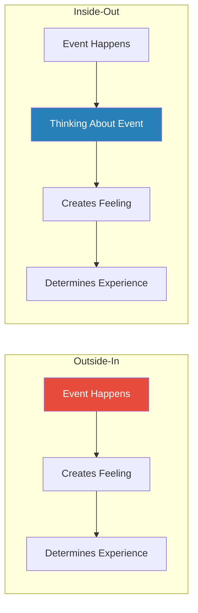
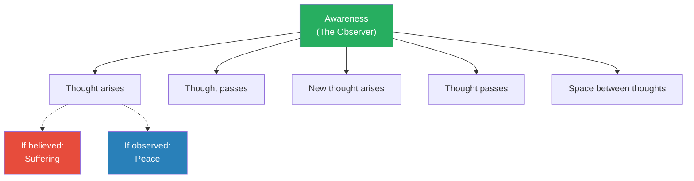
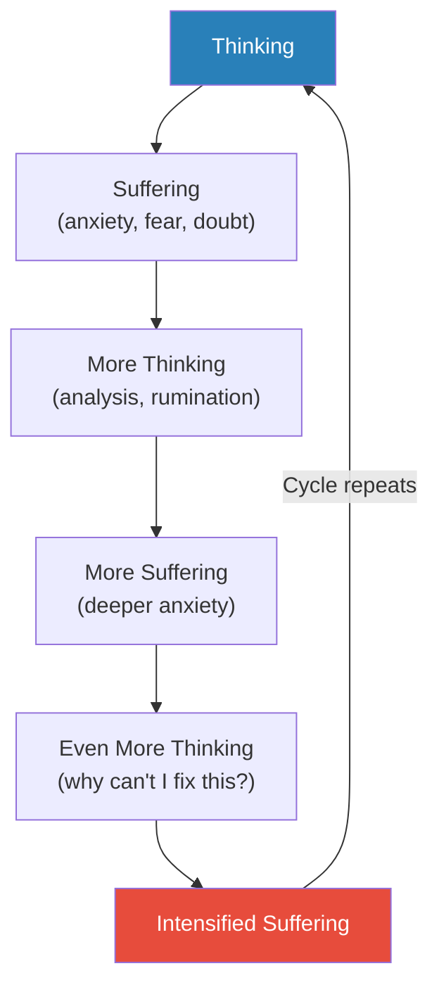
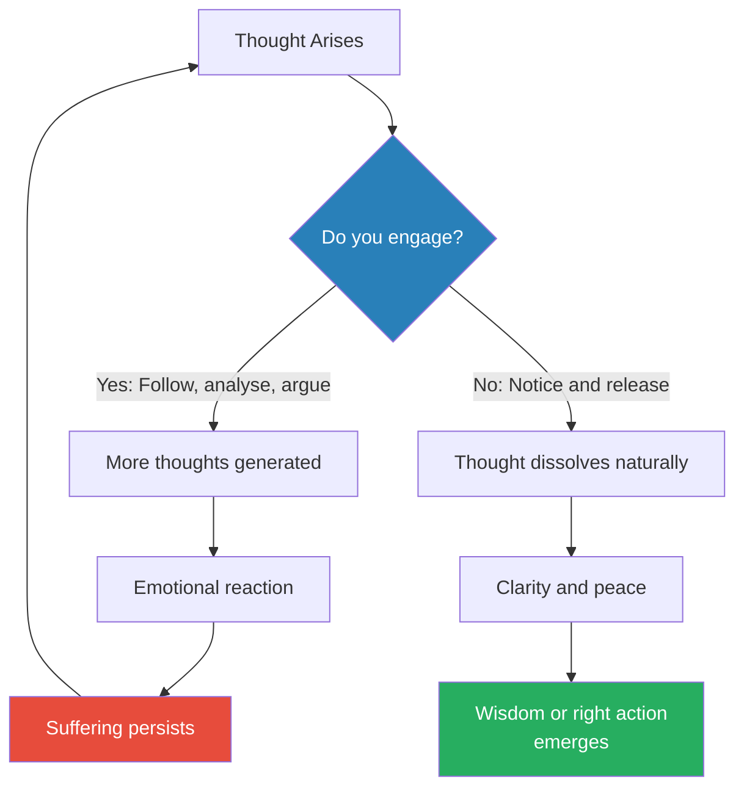
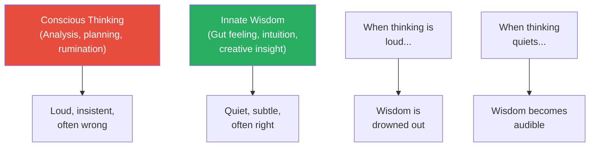
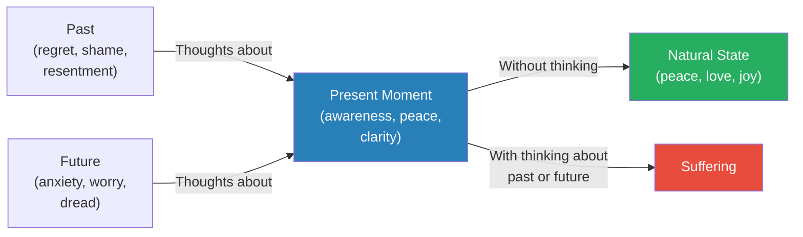
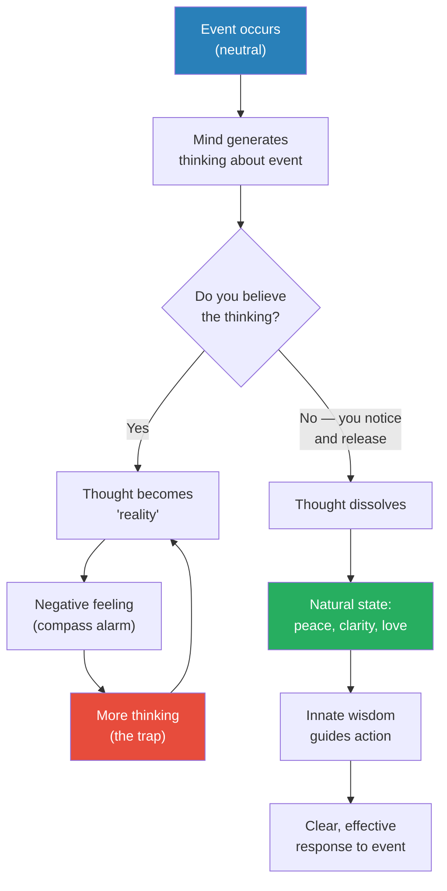
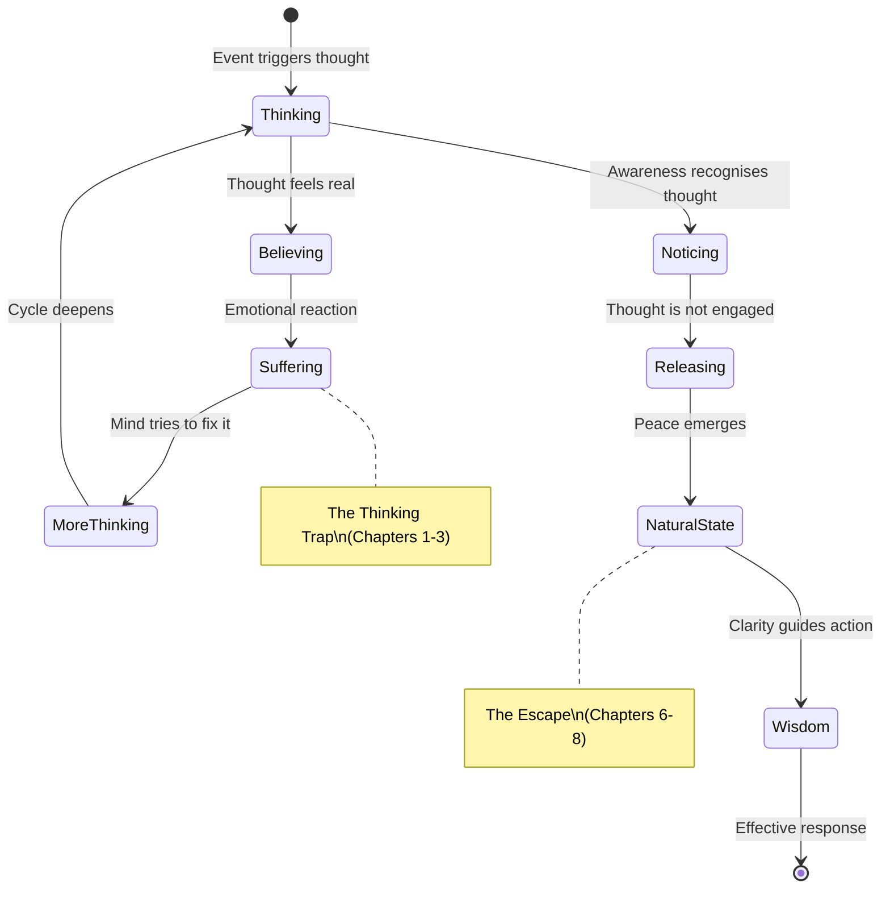

# Don't Believe Everything You Think — Joseph Nguyen

> Joseph Nguyen's short, quietly radical book makes a single argument: all psychological suffering — every ounce of anxiety, resentment, jealousy, frustration, and despair — is caused not by events, people, or circumstances, but by believing the thoughts we generate about those things.
> Strip away the thinking, and what remains is not emptiness but an innate state of peace, love, joy, and clarity that was always there underneath.
> Nguyen writes from personal experience — years of anxiety, self-doubt, and searching through self-help books before a single insight changed everything — and the book reads less like instruction and more like a conversation with a friend who stumbled onto something transformative and cannot stop sharing it.
> The approach is deliberately anti-technique: there is no five-step method, no morning routine, no journaling protocol. Understanding alone is the mechanism of change.
> At roughly 100 pages, it is one of the shortest books on this shelf, but its central insight — that you are the awareness observing your thoughts, not the thoughts themselves — is among the most consequential.

---

## About the Author

Joseph Nguyen is a Vietnamese-American author, podcaster, and speaker whose work centres on the intersection of mindset, consciousness, and inner peace. He spent years consuming self-help content — books, seminars, podcasts — searching for a solution to chronic anxiety and self-doubt, only to find that the accumulation of techniques and strategies made things worse rather than better. The breakthrough came when he stopped trying to fix his thinking and instead questioned the entire premise that his thinking was trustworthy. *Don't Believe Everything You Think* (2022) became a surprise bestseller, resonating particularly with readers exhausted by the productivity-and-optimisation approach to personal growth. Nguyen's voice is gentle, repetitive by design, and almost meditative — he circles the same core insight from different angles until it sinks in, much like a Zen teacher returning to the same koan.

---

## The Big Idea

- <b style="color: #2980b9">The Root Cause of Suffering</b> is not what happens to you — it is the thinking you do about what happens to you
  - Events are neutral raw material; thinking assigns meaning, and that meaning creates your emotional experience
  - A traffic jam is just cars on a road. The suffering comes from the thoughts: "I'm going to be late," "This always happens to me," "The universe is against me"
  - Remove the thinking, and the traffic jam is still there — but the suffering disappears
- This is not a new idea — Epictetus said "It's not things that upset us, but our judgments about things" two thousand years ago — but Nguyen's contribution is presenting it as a complete operating system rather than a philosophical observation
- <b style="color: #27ae60">The solution is not better thinking — it is less thinking</b>
  - Every self-help book that tells you to "reframe" your thoughts, "challenge" your negative beliefs, or "replace" bad thoughts with good ones is still operating within the paradigm that thinking is the answer
  - Nguyen argues this is like trying to put out a fire with a different kind of fire
  - The actual solution is to recognise thinking for what it is — a tool that has its uses but is not who you are — and to stop treating every thought as truth
- <b style="color: #2980b9">The Inside-Out Paradigm</b> flips the conventional model of how experience works:
  - Most people operate "outside-in" — they believe circumstances create feelings ("I'll be happy when I get the promotion / the relationship / the money")
  - Nguyen argues all experience is generated "inside-out" — thought creates feeling, and circumstance is irrelevant to your fundamental state
  - This means you do not need to change anything external to access peace, joy, and clarity — you only need to see how the system actually works

The critical difference: in the inside-out model, there is an intermediary step — thinking — between events and feelings. That intermediary is where all suffering is manufactured.

---

## Key Concepts at a Glance

| Concept | One-line summary |
|---------|-----------------|
| **Root Cause of Suffering** | All psychological pain comes from believing your thinking, not from external events |
| **Inside-Out Paradigm** | Experience is generated by thought from within, not imposed by circumstances from without |
| **Thinking vs Awareness** | You are the awareness that observes thoughts, not the thoughts themselves |
| **Non-Thinking** | The practice of disengaging from thought — not suppressing it, but ceasing to follow it |
| **The Thinking Trap** | A self-reinforcing loop: thinking creates suffering, which triggers more thinking |
| **Feeling as Compass** | Negative feelings are signals that you are lost in thinking, not signals about reality |
| **Natural State** | Peace, love, joy, and clarity exist beneath thinking as your default condition |
| **Innate Wisdom** | A deeper intelligence beyond conscious thought that emerges when thinking quiets |
| **The Truth About Control** | Trying to control thoughts is itself more thinking — the solution is letting go, not gripping tighter |
| **Living Without Thinking** | Not mindlessness, but a state of present awareness where action flows from clarity rather than anxiety |

The radar chart reveals a near-perfect inversion: the thinking approach scores highest on anxiety, control, and reactivity — the very dimensions where awareness scores lowest — demonstrating Nguyen's claim that the two modes produce opposite experiential signatures.

---

## Chapter 1: The Root Cause of All Suffering

*Nguyen begins by making a claim that sounds extreme until you test it: every form of psychological suffering you have ever experienced was caused not by what happened, but by what you thought about what happened.*

- The chapter opens with a question Nguyen spent years trying to answer: why do some people experience devastating circumstances with equanimity while others are destroyed by comparatively minor setbacks?
  - The difference cannot be circumstances, because the same event produces wildly different responses in different people
  - The difference cannot be personality, because the same person responds differently to the same type of event at different times
  - The only variable that consistently tracks with suffering is **thinking** — the narrative a person constructs about what is happening
- <b style="color: #2980b9">Psychological suffering</b> (as Nguyen defines it) is distinct from physical pain:
  - Physical pain is a biological signal — you touch a hot stove, nerves fire, you pull your hand away. This is not caused by thinking
  - Psychological suffering is the mental anguish layered on top of events — the rumination, the "why me," the catastrophising, the replaying of scenarios
  - A broken leg causes physical pain. The suffering comes from "My career is over," "I'll never walk properly again," "This is so unfair"
- <b style="color: #27ae60">Suffering requires a story</b>
  - Without a narrative about what an event means, events produce sensations but not suffering
  - The story always involves thinking — interpreting, judging, predicting, comparing, regretting
  - Remove the story, and what remains is the raw experience, which is almost always manageable

> [!example] Nguyen's Anxiety Spiral
> - Nguyen describes years of chronic anxiety that no technique could resolve
> - He tried positive affirmations, gratitude journals, meditation apps, therapy, self-help books by the dozen
> - Each technique worked temporarily, then the anxiety returned — often worse, because now he had the additional thought: "Nothing works for me"
> - The breakthrough came not from a new technique but from a simple recognition: the anxiety was not caused by his life circumstances. It was caused by his thinking about his life circumstances
> - When he stopped trying to fix his thoughts and simply stopped believing them, the anxiety dissolved — not gradually, but almost immediately
> **The lesson:** The search for better thinking is itself a form of thinking that perpetuates the problem.

---

- <b style="color: #e74c3c">The fundamental error</b> most people make is treating their thoughts as accurate reports about reality:
  - A thought says "Everyone is judging me" — and you feel anxious, as though this is a fact
  - A thought says "I'll never be good enough" — and you feel despair, as though this is a diagnosis
  - A thought says "This relationship will end badly" — and you feel dread, as though this is a prediction from a reliable source
  - But thoughts are not reports. They are generated content — the mind's speculations, projections, and pattern-matching, most of which are inaccurate, biased, or irrelevant

> [!tip] Core Insight
> You do not suffer because of what happens. You suffer because you believe what your thinking tells you about what happens.

---

## Chapter 2: You Are Not Your Thoughts

*The most liberating idea in the book arrives early: if you can observe a thought, you cannot be the thought — just as you can observe your hand and know you are not your hand. This single distinction changes everything.*

- <b style="color: #2980b9">The Awareness Distinction</b> is the conceptual foundation for everything that follows:
  - Most people have a completely fused relationship with their thoughts — they experience thoughts as "me" rather than as "something happening in me"
  - When a thought arises that says "I'm worthless," the person does not experience a thought occurring — they experience worthlessness as a fact about their identity
  - Nguyen argues this fusion is the core problem. Once you realise you are the awareness that notices thoughts — not the thoughts themselves — the power of any individual thought is broken
- The evidence that you are not your thoughts is experiential, not philosophical:
  - You can watch a thought arise, persist, and pass away
  - You can have a thought and choose not to act on it
  - You can recognise that the same "you" was present during radically different thought states — when you were anxious and when you were calm, when you were angry and when you were at peace
  - The thoughts changed. The awareness watching them did not
  - <b style="color: #27ae60">You are the constant; thoughts are the weather</b>

The diagram illustrates that awareness is the constant backdrop against which thoughts come and go. The choice to believe or simply observe a thought determines whether it produces suffering or passes harmlessly.

---

> [!example] The Sky and Weather Analogy
> - Nguyen uses a metaphor that runs through the entire book: you are the sky, and thoughts are the weather
> - Storms roll through — anger, anxiety, sadness, fear — and they can be intense, dark, even frightening
> - But storms are temporary. They pass. The sky was never damaged by any storm
> - Most people identify with the weather: "I am anxious," "I am depressed," "I am angry"
> - The shift is to say: "There is anxiety passing through," "There is a sad thought arising," "Anger is here right now"
> - This is not semantic trickery — it reflects a genuinely different relationship with inner experience
> **The lesson:** You are the sky, not the storm. No thought has ever damaged you — only your belief in it caused suffering.

- <b style="color: #e74c3c">The danger of identification</b> with thoughts:
  - When you fuse with a thought, you defend it as though you are defending yourself
  - This is why people cling to beliefs that cause them suffering — challenging the belief feels like an attack on their identity
  - "I'm not smart enough" becomes load-bearing — the person builds their entire self-concept around it, avoids challenges, explains away successes, and reinforces the thought at every opportunity
  - The thought was never true. But because it was mistaken for identity, it became a self-fulfilling prophecy

---

| Relationship with Thought | Experience | Result |
|--------------------------|------------|--------|
| **Fused** (I AM this thought) | Thought feels like fact | Suffering, reactivity, defensiveness |
| **Entangled** (fighting the thought) | Constant mental battle | Exhaustion, amplified thinking |
| **Observing** (noticing the thought) | Thought is just a thought | Peace, clarity, choice |
| **Non-thinking** (thought settles naturally) | Quiet awareness | Innate wisdom, natural state |

Most people oscillate between the first two rows. Nguyen's book is about moving to the third and fourth.

---

> [!example] The Meditation Practitioner Who Missed the Point
> - Nguyen describes someone who meditated daily for years, tracking streaks, optimising session length, researching techniques
> - Their goal: to achieve a state of "no thought" through practice
> - But the practice itself became a thinking project — "Am I doing this right?" "Why isn't this working?" "My mind wandered again — I'm bad at this"
> - They experienced moments of peace during meditation but could never carry it into daily life
> - The issue was not insufficient practice — it was that they were using thinking (planning, evaluating, judging their meditation) to try to escape thinking
> - The shift came when they realised awareness was already happening — they did not need to manufacture it through effort
> **The lesson:** You cannot achieve non-thinking through effort. You are already the awareness you are looking for.

- <b style="color: #27ae60">The practical implication of the awareness distinction</b> is not philosophical but immediate:
  - When you are fused with a thought ("I am a failure"), there is nothing to do — you ARE the problem, and there is no vantage point from which to address it
  - When you see a thought as a thought ("There is a 'failure' thought arising"), you have space — you can observe it, question it, or simply wait for it to pass
  - The awareness distinction does not require years of meditation practice. It requires a single moment of recognition: "I am noticing this thought. Therefore I am not this thought"
  - Once seen, this cannot be unseen. The thought may still arise, but it has lost its authority
- Why this distinction matters for identity:
  - Most people's self-concept is built from accumulated thoughts about themselves — "I'm shy," "I'm not creative," "I'm bad with money," "I'm the kind of person who..."
  - These are not observations — they are thoughts that have been repeated so often they hardened into identity
  - When you recognise that you are awareness rather than thought, these identity-thoughts lose their permanence
  - You do not need to replace "I'm not creative" with "I am creative" (which is still a thought). You simply recognise that "I'm not creative" is a passing thought, not a feature of awareness

---

## Chapter 3: The Thinking Trap

*Nguyen reveals why thinking about thinking never solves the thinking problem — and why most self-help creates an elaborate hamster wheel rather than an exit door.*

- <b style="color: #2980b9">The Thinking Trap</b> is Nguyen's term for a self-reinforcing loop:
  - Thinking creates suffering (anxiety, fear, self-doubt)
  - Suffering triggers more thinking (analysis, rumination, problem-solving)
  - More thinking creates more suffering
  - More suffering triggers even more thinking
  - The loop accelerates until the person is trapped in a storm of their own creation
- The trap is invisible because thinking is the only tool most people know:
  - When you feel bad, the automatic response is to think about why you feel bad
  - When thinking about why you feel bad makes you feel worse, the automatic response is to think about why that thinking made you feel worse
  - Each layer of meta-thinking adds fuel, not resolution
  - <b style="color: #e74c3c">You cannot think your way out of a problem created by thinking</b>

This is the trap Nguyen describes — a closed loop with no exit as long as thinking is the only tool being used. The exit is not better thinking but stepping outside the loop entirely.

The treemap shows that Nguyen's book organizes around four pillars of roughly equal weight — diagnosing the root cause, shifting the paradigm, developing a practice, and uncovering the natural state — with "Awareness vs Thought" and "Peace & Clarity" as the two largest conceptual blocks.

---

> [!example] The Self-Help Treadmill
> - Nguyen describes meeting people who have read dozens of personal development books yet remain anxious and unhappy
> - Each new book promises a framework: reframe your thoughts, build new habits, practise daily affirmations, challenge cognitive distortions
> - The reader implements the framework, experiences temporary relief, and then — when suffering returns — concludes they need another book, another technique, another framework
> - The self-help industry profits from this cycle because the fundamental premise is never questioned: that you can think your way to happiness
> - Nguyen argues the treadmill stops only when you realise the treadmill itself is the problem
> **The lesson:** The search for the right technique is itself a thinking pattern that perpetuates suffering.

> [!example] Overthinking a Relationship
> - Nguyen describes a common scenario: someone starts dating a new person and feels genuine connection and joy
> - Then thinking begins: "Do they really like me?" "What if they're talking to other people?" "Am I good enough for them?"
> - None of these thoughts arose from evidence — they arose from the mind's habit of generating worst-case narratives
> - The person starts acting differently — becoming clingy, distant, or testing — based on thoughts that have no basis in reality
> - The relationship that was genuine and joyful becomes strained and anxious — not because anything changed externally, but because thinking contaminated the experience
> - The tragic irony: the thinking that was meant to protect the relationship is exactly what damages it
> **The lesson:** Thinking does not protect you from bad outcomes — it often creates them.

---

- Why the trap is so hard to see:
  - Thinking is invisible to most people — it is the medium through which they experience everything, like water to a fish
  - Society reinforces the primacy of thinking: "Think it through," "Be rational," "What are you thinking?"
  - Intelligence is culturally equated with more and better thinking — so the suggestion to think less feels like a suggestion to become stupid
  - But Nguyen draws a distinction between **functional thinking** (solving a math problem, planning a route, building a shelf) and **psychological thinking** (ruminating about self-worth, replaying past conversations, catastrophising about the future)
  - <b style="color: #27ae60">Functional thinking is a tool you pick up and put down. Psychological thinking is a machine that runs continuously without your permission</b>

> [!example] The Entrepreneur's Spiral
> - Nguyen describes an entrepreneur who launched a successful business but could not enjoy the success
> - Every milestone triggered more thinking: "What if it doesn't last?" "What if a competitor takes my market?" "What if my team leaves?"
> - Revenue doubled — and so did the anxiety, because now there was more to lose
> - The entrepreneur sought coaching, read business books, built contingency plans — all forms of thinking about the thinking
> - None of it helped, because the anxiety was not about the business. It was about the thinking the mind generated about the business
> - The business was fine. The thinking was the problem
> **The lesson:** Success does not end the thinking trap — it often deepens it, because the mind simply finds higher-stakes material to worry about.

- The thinking trap explains a pattern that many people recognise but cannot explain:
  - Why achieving a goal often produces a brief spike of satisfaction followed by a return to baseline anxiety
  - Why weekends and holidays — which should be restful — are often filled with just as much mental noise as workdays
  - Why lying in bed at 3am, with no problems to solve, the mind races hardest
  - In each case, the external conditions are favourable. The thinking machine does not care about external conditions — it generates narratives regardless
  - <b style="color: #e74c3c">You can give a compulsive thinker a perfect life, and they will find something to worry about. You can put a non-thinker in difficult circumstances, and they will navigate them with surprising calm</b>

---

## Chapter 4: Feelings as Your Compass

*Nguyen reframes negative emotions not as problems to be solved but as signals — a built-in navigation system telling you that you have drifted into unnecessary thinking.*

- <b style="color: #2980b9">The Feeling Compass</b> is one of Nguyen's most practical ideas:
  - Negative feelings (anxiety, irritation, resentment, jealousy, dread) are not caused by circumstances — they are caused by thinking
  - Therefore, whenever you notice a negative feeling, it is a reliable signal that you are engaged in unnecessary thinking
  - The feeling is not the problem to be solved — it is the alarm telling you that thinking has taken over
- This reframe changes the entire relationship with negative emotions:
  - Instead of asking "Why am I anxious?" (which triggers more thinking), you recognise: "I'm feeling anxious, which means I'm caught in thinking right now"
  - Instead of trying to fix the feeling, you turn your attention to the source — the thinking that is generating it
  - And the "fix" for the thinking is not more thinking — it is simply noticing that you are thinking and allowing the thoughts to pass

> [!tip] Core Insight
> Negative feelings are not problems — they are the compass needle pointing to the true problem: you are believing your thinking.

---

- <b style="color: #27ae60">Positive feelings are equally informative</b>:
  - When you feel peace, love, joy, gratitude, or flow, it is because thinking has quieted
  - You are experiencing your natural state — the state that exists underneath the noise of thought
  - You do not need to "create" positive feelings through techniques — you only need to stop generating the thinking that covers them up
  - This is why people feel most alive in nature, in flow states, during physical exercise, or in moments of deep connection — these are all situations where thinking naturally decreases
- The compass model works in both directions:

| Feeling | Signal | Response |
|---------|--------|----------|
| Anxiety, dread, worry | You are thinking about the future | Notice the thinking, let it pass |
| Resentment, anger, bitterness | You are thinking about the past | Notice the thinking, let it pass |
| Jealousy, inadequacy, comparison | You are thinking about yourself relative to others | Notice the thinking, let it pass |
| Peace, joy, love, flow | Thinking has quieted | You are in your natural state — nothing to do |
| Curiosity, creativity, wonder | Awareness is engaged, not compulsive thinking | Follow the energy — this is wisdom, not noise |

Every slice of the doughnut is a form of thinking — future-oriented anxiety and past-oriented regret together account for over half of all psychological suffering, reinforcing Nguyen's point that the present moment, experienced without thought, is almost always fine.

---

> [!example] The Argument That Wasn't
> - Nguyen describes a time when he received a text from a friend that seemed dismissive
> - His mind immediately generated a narrative: "They don't respect me," "They think they're better than me," "I should say something sharp back"
> - He felt a wave of irritation — the feeling compass was sounding
> - Instead of firing off a response, he noticed: "I'm feeling irritated. That means I'm caught in thinking right now"
> - He set the phone down. Within minutes, the thoughts passed. The irritation dissolved
> - When he re-read the text with fresh eyes, it was completely neutral — the dismissiveness existed only in his thinking
> - Had he responded from the thought-created irritation, a real conflict would have been born from an imaginary one
> **The lesson:** The feeling compass saved him from creating a problem that did not exist.

> [!example] The Job Loss That Became Freedom
> - Nguyen tells the story of someone who lost their job unexpectedly
> - The initial thinking was catastrophic: "I'll lose my house," "No one will hire me," "I'm a failure"
> - These thoughts created panic, despair, and sleeplessness
> - A friend asked a simple question: "Setting aside what you think might happen — how do you feel about this right now, in this actual moment?"
> - In that moment, without the future-projecting thoughts, the person felt something unexpected: relief
> - They had been unhappy in the job for years. The loss, stripped of catastrophic thinking, was actually a door opening
> - Within months, they had started a business they loved — something they never would have pursued while trapped in the "safety" of the old job
> **The lesson:** The event was neutral. The thinking made it a catastrophe. Beneath the thinking was a truer signal.

---

## Chapter 5: The Inside-Out Understanding

*Nguyen builds the philosophical core of the book: all of human experience is generated from the inside out, never from the outside in — and misunderstanding this direction is the source of most human misery.*

- <b style="color: #2980b9">The Outside-In Illusion</b> is the default model most people operate from:
  - "If I get the promotion, I'll feel successful"
  - "If they love me back, I'll feel worthy"
  - "If I make enough money, I'll feel secure"
  - "If I move to a new city, I'll feel free"
  - Every one of these statements places the source of feeling outside the person — in an event, a person, or a circumstance
- The outside-in model is not just wrong — it is the source of an enormous amount of unnecessary suffering:
  - It creates dependency on things you cannot control
  - It postpones wellbeing to a future that may never arrive
  - It trains you to believe that your current state is deficient and needs external correction
  - It makes you fragile — because if the external thing is removed, the feeling goes with it
- <b style="color: #27ae60">The inside-out reality</b> works differently:
  - You never feel an event directly — you feel your thinking about the event
  - Two people in identical circumstances have completely different experiences because they have completely different thinking
  - Change the thinking, and the experience changes — even if the circumstance does not
  - Better yet: stop the thinking, and the default experience is peace

---

> [!example] Two People on the Same Flight Delay
> - Nguyen paints a scene at an airport where a flight is delayed by four hours
> - Passenger A is furious: pacing, complaining, calling the airline, writing angry tweets, snapping at gate agents
> - Passenger B settles into a chair, opens a book, strikes up a conversation with the person next to them, enjoys an unhurried coffee
> - Same event. Same delay. Same gate. Completely different experiences
> - The difference is not personality or temperament — it is the thinking each person is generating about the situation
> - Passenger A's thinking: "This is unacceptable. I'm going to miss my meeting. This always happens. They don't care about customers"
> - Passenger B's thinking is largely absent — they are simply present with what is
> **The lesson:** The delay did not cause Passenger A's suffering. Passenger A's thinking about the delay caused it.

---

- Nguyen connects this to the persistent cultural myth that "more" leads to "better":
  - More money, more success, more recognition, more possessions — and you will feel more happy, more secure, more at peace
  - But research and common observation consistently show that beyond basic needs, more does not correlate with better
  - Lottery winners return to baseline happiness. Wealthy people are not measurably happier than comfortable people. Status-seeking is a treadmill
  - The inside-out model explains why: <b style="color: #e74c3c">if happiness is generated by thought, not circumstance, then changing circumstance cannot reliably change happiness</b>
  - The only reliable path is changing your relationship with thinking itself

> [!tip] Core Insight
> You have never experienced anything "out there." Every experience you have ever had was generated by your own thinking. Change the thinking, and the experience changes — regardless of what happens externally.

---

## Chapter 6: Non-Thinking — The Path to Peace

*The most counterintuitive chapter: Nguyen argues that the solution is not better thinking, not positive thinking, not mindful thinking — it is non-thinking, a state where the compulsive thought machine simply turns off.*

- <b style="color: #2980b9">Non-Thinking</b> is not:
  - Suppression (actively pushing thoughts away — this is more thinking)
  - Mindlessness (zoning out, numbing, dissociating)
  - Stupidity (refusing to use the intellect when it is needed)
  - Meditation (though meditation can quiet thinking, non-thinking is broader than any technique)
- Non-thinking **is**:
  - The natural state that emerges when you stop feeding the thought machine
  - What happens when you recognise a thought as just a thought and decline to follow it
  - The space between thoughts — which, when you stop filling it compulsively, expands into a vast, quiet awareness
  - <b style="color: #27ae60">Not an achievement but a return — you are not creating a new state, you are uncovering the one that was always there</b>

---

> [!abstract] How Non-Thinking Works in Practice
> 1. A thought arises (this is automatic and cannot be controlled)
> 2. You notice the thought (awareness recognises it as a thought)
> 3. You do NOT engage — you do not argue with it, analyse it, reframe it, or follow its narrative
> 4. The thought, unfed, naturally dissolves (thoughts require attention to persist)
> 5. What remains is clarity, peace, and often — surprisingly — the right course of action

- The mechanism is simple but challenging to implement because of lifelong habit:
  - Most people have been engaging with every thought since childhood
  - The habit of following thoughts is so automatic that it feels like not following them requires effort
  - In reality, following thoughts is the effort. Non-thinking is the relaxation of effort
  - <b style="color: #e74c3c">You do not need to do anything to achieve non-thinking — you need to stop doing the thing you are already doing</b>

---

> [!example] The Athlete in Flow
> - Nguyen describes a basketball player at the free-throw line in a championship game
> - The player has practised this shot ten thousand times. The body knows exactly what to do
> - If the player starts thinking — "Don't miss, everyone is watching, what if I choke" — the shot suffers
> - The best performance comes when thinking drops away and the body acts from its trained intelligence
> - Athletes call this "the zone" or "flow" — it is a state of non-thinking, where awareness is fully present but the conscious mind is quiet
> - Nguyen argues this is not a special state available only to athletes — it is the natural state available to everyone, obscured by the constant noise of compulsive thinking
> **The lesson:** Your best work, your deepest connections, and your clearest decisions all happen when thinking gets out of the way.

> [!example] A Child Before Conditioning
> - Nguyen points to how young children operate before they learn to overthink
> - A toddler falls down, cries for thirty seconds, and then is laughing again — there is no narrative: "I'm clumsy," "People saw me fall," "What does this mean about me?"
> - A child draws a picture without worrying whether it is good enough, plays without strategising, loves without calculating reciprocity
> - This is the natural state — present, engaged, un-self-conscious, free of the thinking that adults layer onto every experience
> - Growing up does not mean gaining wisdom — it often means accumulating thinking patterns that obscure the wisdom that was already there
> **The lesson:** Non-thinking is not something you learn. It is something you remember.

---

This diagram shows the fork in the road that occurs with every thought. The left path (engagement) feeds the thinking trap. The right path (non-engagement) allows the natural state to emerge.

---

## Chapter 7: The Natural State

*Beneath the noise of compulsive thinking, Nguyen says, there is something already present — a baseline of peace, love, and clarity that does not need to be constructed, only uncovered.*

- <b style="color: #2980b9">The Natural State</b> is Nguyen's term for the experience beneath thought:
  - It is characterised by peace (not excitement — quiet, settled wellbeing)
  - It includes love (not romantic love — a general warmth toward life and others)
  - It features clarity (not intellectual analysis — an intuitive knowing of what matters)
  - And joy (not giddiness — a gentle aliveness and appreciation)
- The natural state is not something you build — it is what remains when thinking clears:
  - Think of a glass of muddy water. You do not need to add anything to make it clear — you just need to stop stirring. The mud settles on its own, and clarity appears
  - <b style="color: #27ae60">You are not broken and in need of repair. You are clear and in need of less stirring</b>
  - This is a fundamentally different premise from most self-help, which starts with "You have a problem, and here is the solution"
  - Nguyen's premise: "You are already whole. The problem is that you keep generating thinking that tells you otherwise"

---

> [!example] Waking Up Before Thought
> - Nguyen describes a phenomenon almost everyone has experienced: the moment of waking before the mind starts its daily narrative
> - For a few seconds — sometimes longer — you are simply aware. Present. At peace. Not yet "you" in the storied sense
> - Then thinking begins: "What day is it? What do I have to do? Did I finish that project? Why did I say that thing yesterday?"
> - Peace vanishes. The day's burdens arrive. But the burdens arrived with the thinking, not with the day
> - Those few seconds of pre-thinking awareness are not a fluke — they are a glimpse of the natural state
> - The question is not how to get back to those seconds but how to recognise that they are always available underneath the thinking
> **The lesson:** Your natural state is not something you lost — it is something you keep covering up.

---

- Why the natural state matters practically:
  - Decisions made from the natural state tend to be clearer and wiser than decisions made from anxious thinking
  - Relationships experienced from the natural state are warmer, more generous, and less transactional
  - Creative work done from the natural state flows more easily and is often better quality
  - Physical health benefits from reduced psychological stress — sleep improves, tension decreases, digestion normalises
  - <b style="color: #e74c3c">The natural state is not a luxury for people with easy lives — it is the foundation from which difficult lives become navigable</b>

---

| State | Source | Quality | Duration |
|-------|--------|---------|----------|
| **Happiness from achievement** | Outside-in (circumstance) | Excitement, relief, validation | Temporary — fades as you adapt |
| **Happiness from substances** | Chemical alteration | Artificial high | Very temporary — crashes follow |
| **Happiness from entertainment** | Distraction from thinking | Pleasant numbness | Lasts only while distracted |
| **Natural state peace** | Inside-out (thought clearing) | Quiet, settled, alive | Available always — no dependency |

Nguyen argues that only the fourth type is reliable, because it depends on nothing external.

---

> [!example] The Vacation That Changed Nothing
> - Nguyen describes a couple who saved for months to take a dream holiday — the trip was supposed to fix their stress, recharge them, and restore their relationship
> - The first two days were wonderful: no emails, no obligations, nowhere to be
> - By day three, the thinking machine caught up: "We're spending too much money," "I should have prepared that report before leaving," "What if something goes wrong at work while I'm gone?"
> - By the end of the trip, they were as stressed as when they left — just stressed in a different location
> - The external circumstances were objectively peaceful: a beach, good food, no responsibilities. But the mind brought its thinking along
> - Nguyen's point is not that vacations are useless — it is that the relief vacations provide comes not from the location but from the temporary quieting of thought. Once thinking resumes, the suffering returns, regardless of where you are
> **The lesson:** You cannot outrun your thinking. But you can learn to see through it — and that works everywhere, not just on a beach.

- The natural state also explains why acts of generosity, kindness, and service feel inherently good:
  - When you help someone without calculation or expectation, thinking about yourself temporarily drops away
  - In that moment — when the "what's in it for me" narrative is absent — the natural state surfaces: warmth, connection, aliveness
  - This is why volunteering, anonymous giving, and small acts of kindness produce disproportionate wellbeing
  - The wellbeing is not caused by the act itself but by the brief silencing of self-referential thinking that the act enables
  - <b style="color: #27ae60">Kindness is not a virtue you perform — it is what happens naturally when thinking about yourself quiets</b>

---

## Chapter 8: Innate Wisdom and Deeper Intelligence

*Nguyen makes his most ambitious claim: beneath conscious thinking lies a deeper intelligence — an innate wisdom that knows what to do, whom to trust, and where to go, if only the noise of compulsive thought would quiet long enough for it to be heard.*

- <b style="color: #2980b9">Innate Wisdom</b> is the intelligence that operates below the level of conscious thought:
  - It is what gives you a "gut feeling" about someone before you can articulate why
  - It is what produces the right word, the creative solution, the sudden insight — always after you stop trying to force it
  - It is the intelligence that runs your body — heartbeat, breathing, digestion, immune response — without any conscious thought required
  - Nguyen argues this same intelligence can guide decisions, relationships, and creative work if thinking does not drown it out
- The relationship between thinking and wisdom is inversely proportional:
  - More compulsive thinking = less access to innate wisdom
  - Less compulsive thinking = more access to innate wisdom
  - <b style="color: #27ae60">Wisdom does not arrive through more analysis. It arrives when analysis stops</b>

---

> [!example] The Scientist's Shower Insight
> - Nguyen references the well-documented phenomenon of creative breakthroughs happening in the shower, on walks, or just before sleep
> - The scientist who struggled for weeks on a problem finds the answer while washing dishes — not because dishwashing is intellectually stimulating, but because it allows thinking to quiet
> - Archimedes famously solved the problem of measuring volume while getting into a bath — "Eureka!" arrived when active problem-solving stopped
> - This pattern is so well-documented in creativity research that it has a name: the incubation effect
> - Nguyen's interpretation: these are not random events. They are what happens reliably when compulsive thinking releases its grip on the mind
> **The lesson:** The answer you are searching for is often already there — thinking is not helping you find it, it is blocking you from seeing it.

> [!example] The Parent Who Just Knew
> - Nguyen tells the story of a parent who woke at 3am with a sudden certainty that something was wrong with their child
> - They went to check and found the child having a silent allergic reaction — no noise, no visible distress from the hallway
> - No conscious thought led to this knowledge. No analytical process was involved
> - The parent acted from a knowing that bypassed thought entirely
> - Nguyen argues this is innate wisdom in action — a deeper intelligence that is always operating but is usually drowned out by the noise of conscious thinking
> **The lesson:** Innate wisdom is not mystical — it is the processing power beneath conscious thought that has access to more information than the analytical mind.

---

Nguyen's model is not anti-intellect but anti-noise. Conscious thinking is a useful tool for specific tasks; innate wisdom is the operating system that runs beneath it.

---

- How to distinguish thinking from wisdom:
  - **Thinking** feels urgent, pressured, repetitive, and anxious. It demands action. It generates fear
  - **Wisdom** feels quiet, settled, clear, and calm. It does not pressure. It gently points
  - **Thinking** often contradicts itself — one moment saying "do it" and the next saying "don't"
  - **Wisdom** is consistent — it may take time to emerge, but when it speaks, it does not argue with itself
  - <b style="color: #27ae60">If it feels like noise, it is thinking. If it feels like signal, it is wisdom</b>
  - The feeling compass from Chapter 4 applies here: anxiety, pressure, and urgency signal thinking. Calm clarity signals wisdom

---

## Chapter 9: Living Beyond Thought

*The final chapters of the book address the obvious question: if thinking causes suffering, how do you function in a world that runs on thinking? Nguyen answers: surprisingly well.*

- A common objection to Nguyen's argument is the fear that without thinking, you would become passive, incompetent, or unable to function:
  - "If I stop thinking about my bills, they won't pay themselves"
  - "If I stop thinking about my relationship, problems will go unaddressed"
  - "If I stop thinking about my career, I'll fall behind"
- <b style="color: #e74c3c">Nguyen addresses this objection directly:</b> he is not advocating for the elimination of all thought
  - Functional thinking — planning a route, calculating a budget, writing an email — is a tool you use intentionally and then put down
  - What he is arguing against is **compulsive psychological thinking** — the uninvited, repetitive narrative about yourself, others, and the future that runs on autopilot
  - The distinction matters: a carpenter does not carry a hammer 24 hours a day. Thinking is a tool, not an identity

---

> [!abstract] Functional vs Compulsive Thinking
> - **Functional thinking** = intentional use of thought to solve a specific, concrete problem
>   - Has a clear beginning and end
>   - Addresses something actionable
>   - You pick it up when needed and put it down when done
>   - Examples: planning a trip, doing math, composing an email
> - **Compulsive thinking** = uninvited repetitive thought about abstract or uncontrollable matters
>   - Has no clear end — loops and repeats
>   - Addresses things you cannot act on right now
>   - Runs continuously whether you want it to or not
>   - Examples: replaying arguments, worrying about what people think, catastrophising about the future

---

> [!example] The Surgeon and the Worrier
> - Nguyen draws a comparison between a surgeon and an anxious overthinker
> - The surgeon uses thinking with extraordinary precision — analysing scans, planning incisions, making split-second decisions during surgery
> - But the best surgeons report that during the actual operation, they enter a state closer to flow than analysis — training takes over, hands move with trained intelligence, the conscious mind quiets
> - After surgery, the surgeon does not spend the evening replaying every cut, wondering if they made the right decisions, catastrophising about what might go wrong tomorrow
> - They put the thinking down. It served its purpose. It is done
> - The anxious overthinker, by contrast, never puts the tool down — they carry the hammer to dinner, to bed, into the shower, into their dreams
> **The lesson:** Mastery is not more thinking. It is knowing when to think and when to stop.

---

- <b style="color: #2980b9">Nguyen's model for action without overthinking</b>:
  - When a situation requires action, the right action often becomes obvious when thinking clears — not when thinking intensifies
  - This is because compulsive thinking narrows perception (tunnel vision, confirmation bias, fear-based reasoning), while clear awareness widens it
  - The most effective people in any field — athletes, leaders, artists, first responders — consistently describe their best moments as states where thinking dropped away and something deeper took over
  - <b style="color: #27ae60">Clarity of action comes from clarity of mind, and clarity of mind comes from the absence of unnecessary thinking</b>

---

## Chapter 10: The Truth About Control

*Nguyen tackles the illusion that we can — or should — control our thoughts, and explains why every attempt at thought control is itself more of the problem.*

- The self-help industry has built an empire on the idea that you can control your thoughts:
  - "Choose positive thoughts"
  - "Replace negative self-talk with affirmations"
  - "Take control of your inner dialogue"
  - "Your thoughts create your reality — so think better thoughts"
- <b style="color: #e74c3c">Nguyen argues this is fundamentally misguided</b>:
  - You cannot choose which thoughts arise — thoughts are generated automatically, below conscious control
  - Trying to suppress a thought increases its frequency (the well-known "don't think about a white bear" effect, studied by Daniel Wegner)
  - Trying to replace a negative thought with a positive one is still treating thoughts as reality — you are just picking a preferred fiction
  - Affirmations often backfire because the mind recognises the disconnect between the affirmation ("I am confident") and the felt experience ("I am terrified"), creating additional cognitive tension

---

> [!example] The White Bear Experiment
> - Nguyen references the classic psychology experiment by Daniel Wegner at Harvard
> - Participants told "do not think of a white bear" thought of white bears more frequently than a control group given no instruction
> - The effort of suppression creates a monitoring process — the mind must continuously check whether the forbidden thought is present, which keeps the thought active
> - This is why "stop worrying" never works — the instruction to stop worrying requires ongoing monitoring of whether you are worrying, which is itself a form of worrying
> - Nguyen uses this as evidence that thought control is not just difficult but paradoxical — the mechanism of control is the mechanism of perpetuation
> **The lesson:** You cannot control thoughts. You can only stop taking them so seriously.

---

- The alternative to control is <b style="color: #27ae60">allowing</b>:
  - Let thoughts arise — they will anyway
  - Let thoughts exist — resisting them gives them power
  - Let thoughts pass — they always do, if unfed
  - Your only job is not to believe them, not to feed them, and not to build your identity on them
- This requires a fundamental shift in self-concept:
  - The person who tries to control thoughts believes: "I am my thoughts, and bad thoughts make me a bad person"
  - The person who allows thoughts believes: "I am the awareness in which thoughts occur, and no thought defines me"
  - The first person is at war with themselves. The second is at peace

---

| Approach | Mechanism | Result |
|----------|-----------|--------|
| **Thought suppression** | Actively pushing thoughts away | Rebound effect — thoughts return stronger |
| **Thought replacement** | Substituting positive for negative | Temporary relief, cognitive dissonance |
| **Cognitive restructuring** | Analysing and reframing thoughts | Helpful for some, but still treats thinking as reality |
| **Non-engagement (Nguyen's)** | Noticing thoughts without following them | Thoughts dissolve; natural state emerges |

Nguyen does not dismiss CBT or other therapeutic approaches — he simply argues they still operate within the thinking paradigm, whereas his approach steps outside it entirely.

---

> [!example] The Affirmation Backfire
> - Nguyen describes a woman who practised daily affirmations for self-worth: "I am enough. I am worthy. I am loved"
> - Every morning she stood in front of the mirror and repeated these statements
> - But deep down, her felt experience contradicted the words — she felt inadequate, unloved, and small
> - The affirmations created a war between two sets of thinking: the affirmation-thoughts and the deeply-held belief-thoughts
> - The result was not empowerment but exhaustion — she now had two layers of thinking to manage instead of one
> - Nguyen's alternative: instead of replacing "I'm not enough" with "I am enough," simply recognise "I'm not enough" as a thought — one that arose automatically, is not who you are, and will pass on its own if not fed
> - No replacement needed. No counter-argument required. Just recognition
> **The lesson:** Trying to fix thinking with better thinking is like trying to calm water by stirring it differently.

- Why "letting go" is harder than it sounds:
  - The phrase "just let it go" sounds dismissive — as though suffering is a choice that people stubbornly refuse to make
  - Nguyen acknowledges this and reframes: letting go is not an action you take. It is the cessation of an action you are currently taking (namely, gripping the thought)
  - You do not let go of a hot coal by doing something new — you let go by stopping what you are currently doing: holding on
  - The difficulty is not in the letting go itself but in recognising that you are holding on in the first place
  - Most people do not realise they are gripping their thoughts. They experience the thoughts as reality rather than as a grip they could release
  - <b style="color: #27ae60">The moment you see the grip, the grip loosens</b>

---

## Chapter 11: Relationships and Other People

*Nguyen extends his framework to interpersonal life: most relationship suffering comes not from the other person but from the thoughts you generate about them.*

- <b style="color: #2980b9">The relationship application</b> of the inside-out model:
  - When you are angry at someone, you are not reacting to them — you are reacting to your thinking about them
  - The proof: the same person can make you furious one day and amuse you the next. They did not change. Your thinking did
  - Two people can describe the same partner in completely contradictory terms — because they are not describing the partner, they are describing their thinking about the partner
- <b style="color: #e74c3c">Most relationship conflicts are between two sets of thinking, not between two people</b>:
  - Each person is responding to what they think the other meant, not what the other actually said
  - Each person is defending against imagined attacks that exist only in their thinking
  - Each person is projecting fears and insecurities that have nothing to do with the person in front of them
  - Strip away the thinking, and what remains is usually two people who care about each other and have far less actual disagreement than their thinking would suggest

---

> [!example] The Silent Treatment Loop
> - Nguyen describes a common relationship dynamic
> - Partner A comes home quiet after a hard day. Partner B thinks: "They're angry at me. What did I do?"
> - Partner B becomes defensive and distant. Partner A thinks: "Why are they being cold? I just wanted some quiet"
> - Partner A withdraws further. Partner B thinks: "See, they don't care about me"
> - A full conflict develops — not from any real disagreement, but from two parallel streams of thinking that never intersected with reality
> - Neither partner checked their thinking against the actual situation. Each treated their thoughts as facts and acted accordingly
> - The resolution is almost absurdly simple once thinking is set aside: "I had a hard day and needed some quiet." "Oh. I thought you were upset with me." End of conflict
> **The lesson:** Most relationship conflicts are conflicts between two people's thinking, not between two people.

---

- <b style="color: #27ae60">When thinking quiets, love becomes the default</b>:
  - Nguyen argues that love is not something you have to create, work at, or earn — it is the natural state between people when thinking is not in the way
  - Young children love unconditionally not because they have learned to love but because they have not yet learned to think their way out of it
  - The warmth you feel toward a stranger in a moment of genuine connection — helping someone carry groceries, sharing a laugh with a fellow traveller — is not created by effort. It is revealed by the temporary absence of judging, comparing, and evaluating
  - Romantic love feels magical at the beginning partly because both people's thinking is temporarily suspended by novelty and infatuation — they are seeing each other clearly, without the usual filters
  - When thinking resumes — expectations, comparisons, fears, projections — the magic appears to fade. But the magic did not go anywhere. The thinking covered it up

---

> [!example] The Comparison Trap in Friendship
> - Nguyen tells of a man who grew up with a close friend and felt genuine warmth and connection for years
> - In their thirties, the friend became financially successful — new house, new car, foreign holidays
> - The man's thinking shifted: "He's doing better than me," "Why can't I achieve that," "He probably looks down on me now"
> - None of these thoughts came from the friend's behaviour, which was unchanged — generous, warm, loyal
> - The thoughts came from the man's own mind, comparing, measuring, projecting
> - The friendship that once brought joy now brought resentment — not because the friend changed, but because the thinking changed
> - When the man eventually saw what was happening — that his thinking was manufacturing a problem — the resentment evaporated and the friendship returned to its original warmth
> **The lesson:** Comparison is a thinking pattern, not a perception of reality. The friend never changed. The thinking did.

- <b style="color: #2980b9">Nguyen's relational principle</b> can be summarised simply:
  - Every complaint you have about another person is actually a complaint about your thinking about that person
  - This does not mean other people never behave badly — it means your suffering about their behaviour is generated internally
  - A person who insults you has made sounds with their mouth. The suffering comes from the meaning your thinking assigns to those sounds
  - This is not a call to be passive or to accept abuse — it is a call to respond from clarity rather than from thought-created emotional storms
  - <b style="color: #27ae60">When you stop believing your thinking about other people, you see them more clearly — and clarity is a better basis for decisions than reactivity</b>

---

## Chapter 12: Finding Your Purpose and Direction

*Nguyen argues that purpose is not something you find through analysis but something that reveals itself when thinking clears — like a path that becomes visible when the fog lifts.*

- Most people approach purpose as a thinking problem:
  - "What should I do with my life?" (analysis)
  - "What are my strengths?" (categorisation)
  - "What career would make me happy?" (prediction)
  - "What would my 10-year plan look like?" (projection)
- <b style="color: #e74c3c">Nguyen argues this analytical approach often makes the problem worse</b>:
  - Overthinking purpose creates paralysis — the more options you analyse, the more confused you become
  - Thinking about purpose generates anxiety about making the "wrong" choice, which creates avoidance
  - Purpose discovered through analysis tends to be fragile — because it is based on thoughts about what should matter rather than a felt sense of what actually matters

---

> [!tip] Core Insight
> Purpose is not discovered through more thinking. It is revealed when thinking quiets long enough for you to feel what genuinely pulls you forward.

- <b style="color: #27ae60">The non-thinking approach to purpose</b>:
  - When compulsive thinking quiets, you begin to notice what naturally draws your attention and energy
  - These signals are not loud or dramatic — they are quiet, consistent interests and pulls that thinking usually drowns out
  - The person who "doesn't know what they want" almost always does know — they just cannot hear it over the noise of what they think they should want, what others expect, and what seems safe or practical
  - <b style="color: #2980b9">Innate wisdom</b> already knows your direction — the job is to stop drowning it out with analysis

> [!example] The Spreadsheet That Solved Nothing
> - Nguyen describes someone who approached the question of purpose like a business case
> - They built a spreadsheet with columns: salary potential, personal interest, market demand, family approval, location flexibility, growth trajectory
> - They scored each career option across every dimension, weighted the scores, and produced a ranked list
> - The "winner" was management consulting — high on salary, market demand, and prestige
> - They pursued it, succeeded, and were miserable within two years
> - The spreadsheet captured what thinking valued — status, money, logic. It could not capture what the person actually felt drawn to, because feelings are not inputs to a spreadsheet
> - Nguyen argues that the spreadsheet approach to purpose is the thinking trap applied to life's biggest question
> **The lesson:** You cannot analyse your way to purpose. Purpose is felt, not calculated.

---

> [!example] Nguyen's Own Career Pivot
> - Nguyen describes his own experience of searching for purpose through conventional means
> - He made lists, took personality assessments, asked mentors, read career-guidance books
> - The more he analysed, the more paralysed he became — each option generated a cascade of "but what if" thoughts
> - The breakthrough came when he stopped trying to figure it out and simply paid attention to what he was naturally drawn to when thinking wasn't directing traffic
> - He noticed he kept returning to questions about consciousness, the nature of thought, and inner peace — not because anyone told him to, but because the interest was quietly persistent
> - The book you are reading is the result of following that quiet signal rather than the loud analysis
> **The lesson:** Purpose is not something you figure out. It is something you notice when you stop trying to figure it out.

---

## Chapter 13: Living in the Present Moment

*Nguyen arrives at a concept shared by nearly every wisdom tradition: the present moment is the only place where life actually happens, and thinking is the mechanism that removes you from it.*

- <b style="color: #2980b9">The present moment</b> is where all experience occurs:
  - You have never experienced the past — you experience memories (which are thoughts occurring now)
  - You have never experienced the future — you experience projections (which are thoughts occurring now)
  - The only direct experience you ever have is right now
  - All suffering is either about the past (regret, resentment, shame) or the future (anxiety, worry, dread) — and both past and future exist only as thoughts
- <b style="color: #27ae60">The present moment, experienced without thinking, is almost always fine</b>:
  - Right now, in this exact moment, you are probably physically safe, adequately fed, breathing, alive
  - Suffering arrives when thinking transports you to a remembered past or an imagined future
  - This is not a denial that real problems exist — it is the observation that even real problems are best addressed from present-moment clarity rather than from anxious thinking about them

---

> [!example] The Student and the Exam
> - Nguyen describes a student who spends three weeks before an exam in a state of constant anxiety
> - The thinking: "What if I fail? I'll disappoint my parents. My GPA will drop. I won't get into graduate school. My life is over"
> - The suffering during those three weeks is immense — sleepless nights, lost appetite, irritability, inability to focus
> - The exam itself takes two hours. The student passes
> - Three weeks of suffering for a two-hour event that went fine
> - Even if the student had failed, the three weeks of pre-suffering would not have helped — it would have actively hindered preparation by degrading sleep, focus, and memory consolidation
> - The suffering was entirely manufactured by thinking about a future that had not arrived and, in this case, never did
> **The lesson:** Almost all suffering occurs in time periods when nothing is actually wrong — thinking imports suffering from imagined futures and remembered pasts.

---

This diagram captures Nguyen's model: the present moment is the hub. Thinking pulls you into past or future and creates suffering. Releasing thought returns you to the present, where the natural state lives.

---

- The connection between presence and performance:
  - Peak performance in any field — sports, music, surgery, public speaking — occurs in the present moment
  - When an athlete is "in the zone," they are not thinking about the last play or the next one. They are completely here
  - When a musician plays their best, they are not monitoring their performance. They are inside the music
  - <b style="color: #27ae60">Presence is not a spiritual luxury — it is the state in which human beings function best</b>
  - Every tradition that has investigated consciousness — from Zen Buddhism to Stoic philosophy to modern performance psychology — converges on this point

---

## Chapter 13.5: Fear, Ego, and the Stories We Tell

*Nguyen dedicates significant attention to two of thinking's most powerful products: fear and ego. Both, he argues, are thought-created constructs that feel absolutely real but have no substance once examined.*

- <b style="color: #2980b9">Fear as a thought product</b>:
  - Nguyen distinguishes between biological fear (a car swerves toward you, your body reacts) and psychological fear (you imagine being rejected, judged, or failing, and your body reacts as though the imagined scenario is real)
  - Biological fear is useful — it protects you from physical danger
  - Psychological fear is thought-generated — it protects you from nothing, because the danger exists only in thought
  - The body cannot distinguish between real danger and imagined danger. When you think about a worst-case scenario, your nervous system responds as though it is happening now
  - <b style="color: #e74c3c">This means most fear is suffering about events that have not happened and may never happen</b>

> [!example] Stage Fright and the Imaginary Audience
> - Nguyen describes the experience of stage fright — one of the most common forms of psychological fear
> - The person standing backstage is physically safe. No predator is present. No one is threatening them
> - But their thinking is generating a vivid narrative: "What if I forget my lines? What if they laugh at me? What if I'm humiliated? What if this ruins my reputation?"
> - The body responds to these thoughts with a full fight-or-flight reaction — racing heart, sweating palms, nausea, dry mouth
> - The suffering is entirely manufactured by thinking about a future that has not arrived
> - Seasoned performers do not eliminate these thoughts — they learn to perform despite them, which is a form of non-engagement with thinking
> - The best performances happen when the performer forgets about the audience entirely and becomes absorbed in the material — which is another way of saying: when thinking stops and presence begins
> **The lesson:** Stage fright is not fear of the stage. It is fear of the thoughts about the stage.

---

- <b style="color: #2980b9">The Ego</b> as Nguyen uses the term is not Freud's ego but the thinking-constructed sense of self:
  - It is the collection of thoughts you have about who you are: your name, your story, your achievements, your failures, your personality traits, your preferences
  - None of these are awareness — they are all content within awareness
  - The ego feels real because it has been reinforced by decades of repetition — you have thought "I'm the kind of person who..." ten thousand times
  - But it is no more you than any other thought. It is just the most rehearsed thought
- The ego creates suffering in predictable ways:
  - It needs constant validation (because it is not real and unconsciously knows it)
  - It takes everything personally (because it interprets events as being "about me")
  - It compares relentlessly (because it can only measure itself against other egos)
  - It fears death (because the end of the body feels like the end of the story — and the ego is the story)
  - <b style="color: #27ae60">When you recognise that the ego is a thought-construction rather than your identity, its demands lose their urgency</b>

---

## Chapter 14: The Simplicity of Truth

*In the book's closing chapters, Nguyen steps back and reflects on why something so simple is so hard to accept — and why the mind resists the very insight that would free it.*

- <b style="color: #2980b9">The Resistance Paradox</b>:
  - The truth Nguyen presents is extremely simple: stop believing your thinking, and suffering ends
  - But simplicity is suspicious to the thinking mind, which expects problems to require complex solutions
  - The mind will generate objections: "It can't be that simple," "This doesn't account for real trauma," "What about chemical depression," "This is just spiritual bypassing"
  - Nguyen acknowledges these objections but frames them as — unsurprisingly — more thinking
  - He is not saying external help (therapy, medication, community) is never needed. He is saying that the core mechanism of suffering is thinking, and understanding this mechanism is itself transformative
- <b style="color: #e74c3c">Why the mind resists its own liberation</b>:
  - Thinking has been the dominant tool for navigating life since childhood
  - Questioning thinking feels like questioning your primary survival mechanism
  - The ego — the sense of "I" built from accumulated thoughts — feels threatened by the idea that thoughts are not reliable
  - If your thoughts are not you, and your thoughts are not reliable, then the entire edifice of self-concept built on decades of thinking begins to wobble
  - This is uncomfortable. The mind would rather keep suffering with a familiar identity than risk the unknown of life beyond compulsive thought

---

> [!example] The Prisoner Who Won't Leave the Cell
> - Nguyen uses a metaphor of a prisoner who has been in a cell for so long that the cell feels like home
> - One day the door swings open. Freedom is available
> - But the prisoner hesitates. The cell is cramped and dark, but it is known. The world outside is vast and uncertain
> - Many people have the same relationship with their thinking: it causes suffering, but it is familiar
> - The suggestion to let go of thinking feels like a suggestion to let go of yourself — and that feels more frightening than the suffering itself
> - Nguyen argues that what you let go of is not yourself — it is a case of mistaken identity. You were never the thoughts. You were always the awareness that noticed them
> **The lesson:** The prison door is open. The only thing keeping you inside is the belief that the cell is who you are.

---

- <b style="color: #27ae60">Simplicity is the ultimate sophistication</b>:
  - Nguyen deliberately keeps the book short and circular — returning to the same insight from different angles rather than piling on new concepts
  - He argues that understanding — real, felt understanding, not just intellectual agreement — is the only thing required
  - You do not need more information. You do not need a technique. You do not need practice (though practice may help the understanding deepen)
  - You need to see, clearly and personally, that thinking creates suffering and you are not your thoughts
  - Once this is truly seen — not just read about but seen — the change is immediate and self-sustaining

> [!example] The Finger Pointing at the Moon
> - Nguyen uses the classic Zen metaphor: a teacher points at the moon. The student stares at the finger
> - Every concept in this book — the thinking trap, the feeling compass, the natural state, non-thinking — is a finger pointing at the moon
> - The moon is the direct experience of seeing, for yourself, that you are awareness rather than thought
> - No amount of reading about the moon is the same as looking up and seeing it
> - Nguyen acknowledges that his book can only point — the seeing must happen within the reader, in their own experience, in their own moment of recognition
> - This is why the book is deliberately repetitive: not because the ideas are complex, but because the seeing requires multiple angles before it clicks
> **The lesson:** Understanding this book intellectually is the finger. Living it is the moon.

---

- <b style="color: #2980b9">Why repetition is the book's method</b>:
  - Nguyen circles the same insight roughly fifteen times from different angles
  - This is not padding — it is intentional, borrowed from oral teaching traditions
  - The mind needs to hear the same truth in multiple contexts before it shifts from intellectual agreement to lived understanding
  - Each pass through the core idea — thinking creates suffering, you are not your thoughts — lands differently because the reader's resistance softens with each exposure
  - By the end of the book, most readers report that they are not learning something new in the final chapters — they are recognising something they already understood halfway through but had not yet fully absorbed
  - <b style="color: #27ae60">The book teaches the way water shapes stone: not through force, but through patient repetition</b>

---

## Connections Across the Book

Nguyen's ideas do not exist in isolation — they echo and intersect with several major thinkers:

| Thinker / Book | Shared Insight | Where They Differ |
|---------------|----------------|-------------------|
| **Epictetus** ([[Discourses - Epictetus\|Discourses]]) | "It's not things that upset us, but our judgments about things" | Epictetus emphasises disciplined practice; Nguyen emphasises pure understanding |
| **Viktor Frankl** ([[Man's Search for Meaning - Viktor Frankl\|Man's Search for Meaning]]) | The gap between stimulus and response | Frankl focuses on finding meaning; Nguyen focuses on releasing the need to find meaning through thought |
| **Eckhart Tolle** | The "pain body" and identification with thinking | Tolle is more metaphysical; Nguyen is more conversational and accessible |
| **Michael Singer** | The "inner roommate" — the voice in your head that won't stop talking | Singer uses more spiritual language; Nguyen stays colloquial |
| **Cal Newport** ([[Deep Work - Cal Newport\|Deep Work]]) | Quiet mind produces better work | Newport focuses on cognitive performance; Nguyen focuses on psychological peace |
| **Greg McKeown** ([[Essentialism - Greg McKeown\|Essentialism]]) | Clearing the nonessential to reveal what matters | McKeown focuses on external commitments; Nguyen focuses on internal noise |
| **Don Miguel Ruiz** ([[The Four Agreements - Don Miguel Ruiz\|The Four Agreements]]) | The "domesticated mind" filled with unchosen beliefs | Ruiz offers four specific agreements; Nguyen argues even agreements are more thinking |

---

## The Complete Model

Bringing together every concept in the book into a single framework:

This is the entire book in one diagram. Every chapter elaborates on one node or one arrow in this system.

The state diagram captures the book's entire mechanism: the left loop (Thinking → Believing → Suffering → More Thinking) is the trap that most people cycle through endlessly, while the right path (Noticing → Releasing → Natural State → Wisdom) is the exit that opens the moment awareness replaces belief.

---

## Verdict

Nguyen's greatest contribution is stripping the insight down to its bare minimum. Where Eckhart Tolle takes 300 pages and a quasi-spiritual cosmology to make the same point, and Michael Singer wraps it in Hindu metaphysics, Nguyen presents the core mechanism — thinking creates suffering, you are not your thoughts, let thinking pass and peace remains — in roughly 100 pages of plain, conversational English. For readers who have bounced off more esoteric presentations of this idea, Nguyen's directness is genuinely valuable. The book functions less as an argument and more as a mirror: it keeps showing you the same thing until you actually see it, and for many readers, the moment of seeing arrives during the read.

The book's weaknesses are real but predictable given its scope. Nguyen makes no distinction between types of suffering — the anxiety of a first date and the grief of losing a child are both attributed to thinking, which feels reductive. He does not engage with neuroscience, clinical psychology, or the established literature on trauma, where "just stop believing your thoughts" is inadequate and potentially harmful. His treatment of clinical depression and anxiety disorders is essentially nonexistent — he writes as though all suffering is the garden-variety overthinking of a healthy mind, which risks dismissing people whose suffering has biological and neurochemical components that require professional treatment. The book's deliberate repetitiveness, while effective for some readers, can feel like the same page rewritten fifteen times.

The ideal reader is someone drowning in overthinking — not clinical illness, but the chronic anxiety, self-doubt, and rumination that characterise modern life. If you have read a dozen self-help books and implemented a dozen techniques and still feel anxious, Nguyen's argument that the techniques are the problem may be the most useful thing you encounter. The book is also well-suited to readers who sense that something like this is true but have been put off by the spiritual or religious framing of similar ideas in Eastern philosophy or New Age literature. Nguyen is secular, practical, and brief.

In the landscape of "mind and consciousness" books, this sits alongside Eckhart Tolle's *The Power of Now*, Michael Singer's *The Untethered Soul*, and Sydney Banks's work on the Three Principles — all of which make essentially the same argument with different flavours. Nguyen's version is the most accessible and the shortest, making it the best entry point for sceptics and pragmatists. It lacks the depth and nuance of Tolle or Singer, but what it loses in richness it gains in clarity. Paired with [[Discourses - Epictetus|Epictetus]] for the philosophical foundation and [[Man's Search for Meaning - Viktor Frankl|Frankl]] for the existential dimension, it forms a powerful triad on the relationship between thought and suffering.

---

## Related Reading

- [[Discourses - Epictetus]] — The original Stoic argument that judgments, not events, cause suffering
- [[Man's Search for Meaning - Viktor Frankl]] — Finding meaning in the gap between stimulus and response
- [[Deep Work - Cal Newport]] — How a quiet mind produces better cognitive output
- [[Essentialism - Greg McKeown]] — Clearing the nonessential to reveal what matters
- [[The Four Agreements - Don Miguel Ruiz]] — The domesticated mind and the beliefs you never chose
- [[12 Rules for Life - Jordan Peterson]] — A contrasting approach that emphasises meaning through responsibility rather than release through non-thinking
- [[The Subtle Art of Not Giving a F-ck - Mark Manson]] — Another argument for caring about less, though Manson stays firmly in the thinking paradigm
- [[The Almanack of Naval Ravikant - Eric Jorgenson]] — Naval's perspective on happiness as the absence of desire and mental noise
