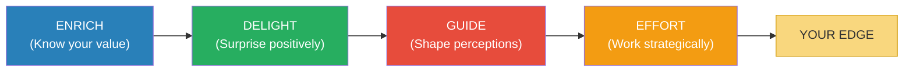
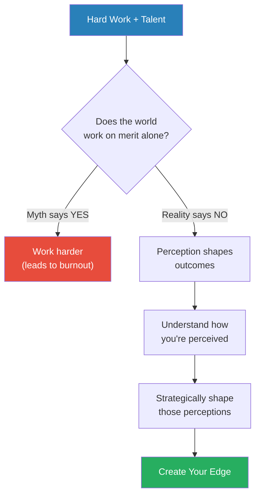
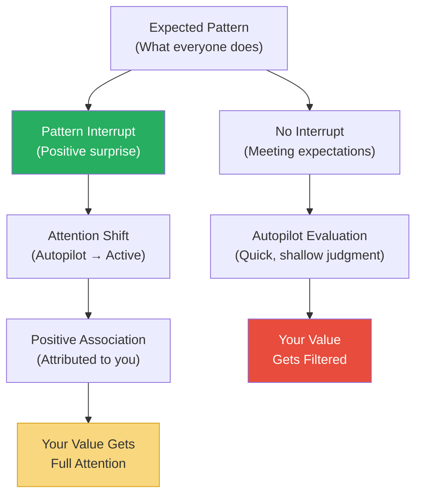
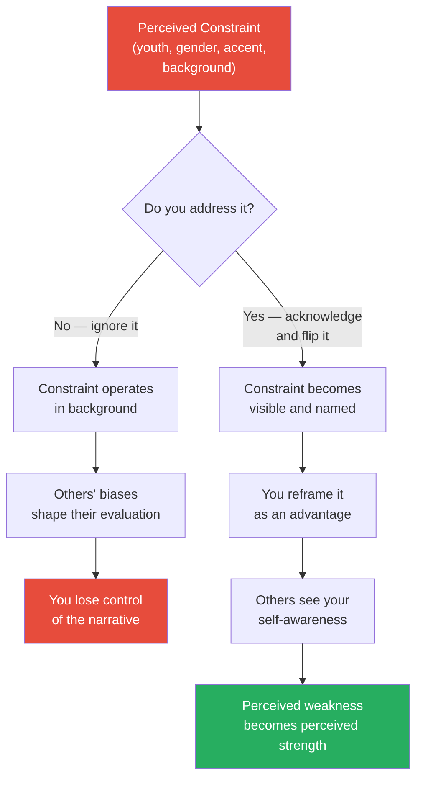
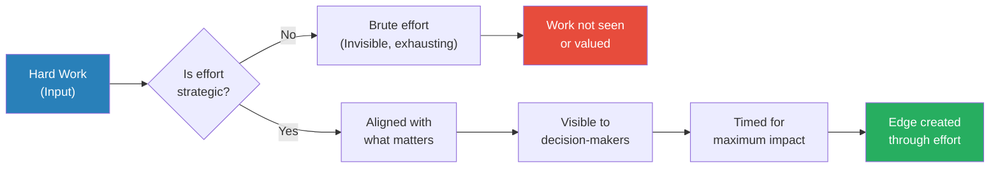
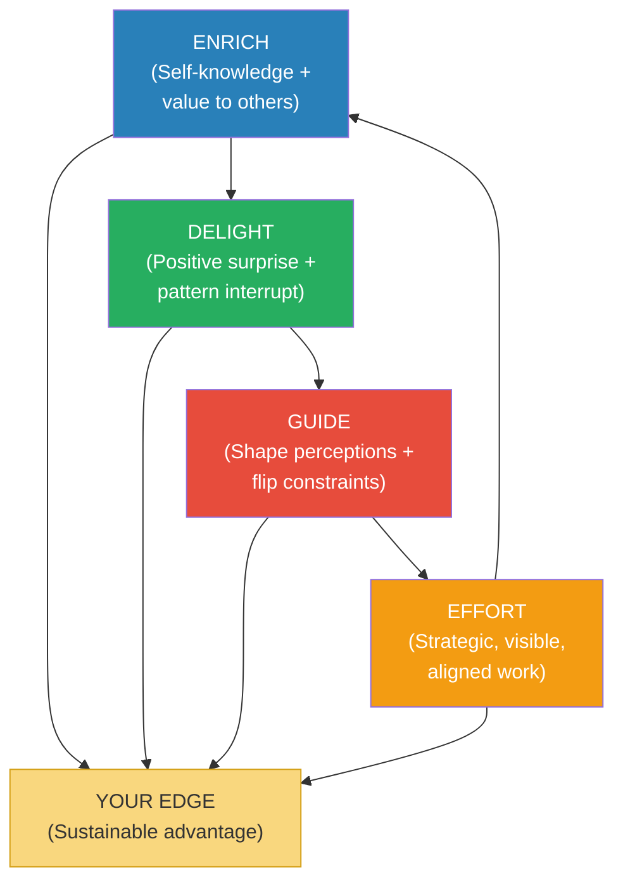
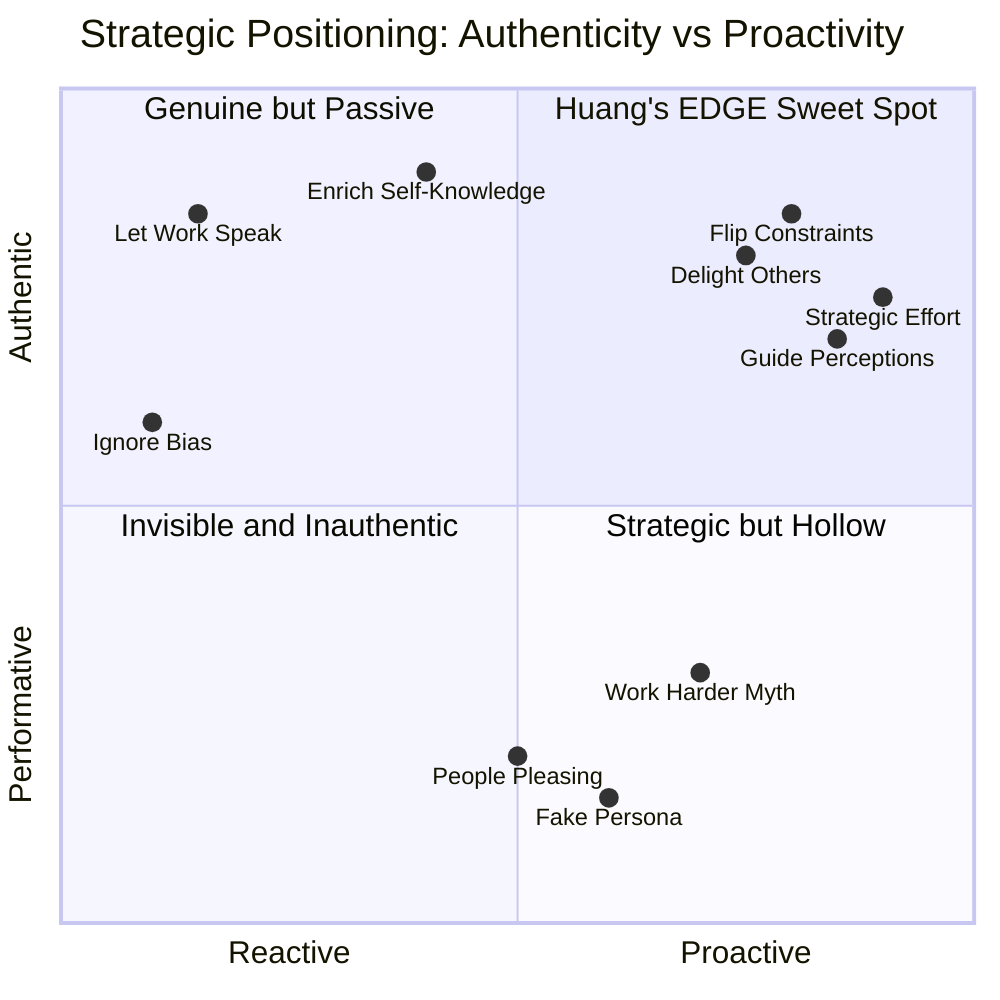

# Edge — Laura Huang

> Laura Huang, a Harvard Business School professor, dismantles the comforting myth that hard work and merit alone determine success. Drawing on years of research into investor decision-making, hiring bias, and interpersonal perception, she demonstrates that the world runs on snap judgments, stereotypes, and gut feelings — and that pretending otherwise leaves you powerless. Her solution is not cynicism but strategy: the EDGE framework (Enrich, Delight, Guide, Effort) teaches you to understand how others perceive you and actively shape those perceptions to your advantage. This is a book about taking the very things that work against you — your background, your appearance, your outsider status — and flipping them into your greatest assets. Huang writes with the authority of a researcher and the warmth of someone who has lived through the biases she studies.

---

## About the Author

Laura Huang is an associate professor of business administration at Harvard Business School, where her research focuses on interpersonal relationships, implicit bias, and entrepreneurship. She earned her PhD from UC Irvine and previously held positions at the Wharton School and the University of Cambridge's Judge Business School. Her academic work has been published in top-tier journals including the Academy of Management Journal, Administrative Science Quarterly, and the Journal of Business Venturing. Named one of the 40 Best Business Professors Under 40 by Poets & Quants, Huang brings a rare combination of rigorous research and personal experience as an Asian-American woman who has navigated the very biases she studies.

---

## The Big Idea

- The world is not a meritocracy — <b style="color: #e74c3c">hard work alone does not guarantee recognition, promotion, or success</b>
- People make decisions about you in seconds, based on gut feelings, stereotypes, and perceptions that have nothing to do with your actual abilities
- Most advice tells you to either "work harder" or "fight the system" — both miss the point
- <b style="color: #27ae60">Your edge comes from understanding how others perceive you and strategically redirecting those perceptions</b>

Huang's central framework is <b style="color: #2980b9">EDGE</b>:

- **Enrich** — know your unique value and how it serves others
- **Delight** — provide unexpected positive surprise that makes people want to pay attention
- **Guide** — steer how others perceive you rather than leaving it to chance
- **Effort** — direct hard work strategically so it is visible, valued, and aligned with what matters

The framework is not manipulative — it is about authenticity expressed strategically. You are not becoming someone you are not. You are making sure the real you is seen, heard, and valued by the people who matter.

The four components of EDGE are not sequential steps — they are interlocking capabilities that reinforce each other continuously.

---

## Key Concepts at a Glance

| Concept | One-line summary |
|---------|-----------------|
| **EDGE Framework** | Enrich, Delight, Guide, Effort — the four pillars of creating advantage |
| **Basic Goods** | Your unique combination of attributes, skills, and perspectives that create value |
| **The Meritocracy Myth** | Hard work and talent alone do not determine outcomes — perception does |
| **Flipping Constraints** | Acknowledging stereotypes and turning them from liabilities into assets |
| **Perception Gap** | The gap between how you see yourself and how others see you |
| **Strategic Effort** | Directing work where it will be visible, valued, and aligned with what matters |
| **Delight Factor** | Providing unexpected positive surprise that shifts the power dynamic |
| **Pattern Interrupt** | Breaking someone's expectations to create an opening for genuine attention |
| **The Hard Work Trap** | Working harder at the wrong things instead of strategically at the right ones |
| **Diamond-in-the-Rough Fallacy** | The belief that great work will be discovered on its own |

The radar reveals that Guide has the highest impact but also the highest difficulty — it requires navigating bias and stereotypes in real time — while Effort is the most controllable and frequent but has the lowest standalone impact, supporting Huang's argument that hard work alone is insufficient.

---

## Introduction: The Meritocracy Myth

*Huang opens by demolishing the most comforting lie in professional life — that the cream always rises to the top.*

- The narrative we are all raised on is simple: work hard, develop your skills, and you will be rewarded
- <b style="color: #e74c3c">This narrative is a myth</b> — not because hard work doesn't matter, but because it is necessary and nowhere near sufficient
- The reality is that decisions about hiring, funding, promoting, and partnering are made by humans with biases, preferences, and blind spots
- These biases are not always conscious — they operate at the level of gut feeling, snap judgment, and "cultural fit"
- Huang's own research demonstrates this with uncomfortable clarity

> [!example] Huang's Venture Capital Research
> - Huang spent years studying how venture capitalists evaluate entrepreneurs during pitch meetings
> - She found that investors made gut-level decisions about founders in the first few minutes — often the first few seconds
> - The quality of the business plan, the market analysis, and the financial projections mattered far less than the investors' perception of the founder
> - Factors like attractiveness, gender, accent, and confidence significantly influenced funding decisions
> - The data showed that the "best idea" frequently lost to the "best-perceived founder"
> **The lesson:** The pitch deck matters less than the person holding it.

- <b style="color: #2980b9">The meritocracy myth</b> is dangerous because it leads people to a single strategy: work harder
- When that doesn't produce results, the conclusion is "I must not be working hard enough" — which leads to burnout, not success
- Huang's alternative: understand the system of perception and learn to operate within it

---

> [!tip] Core Insight
> Success is not determined by what you can do. It is determined by what others believe you can do — and you have more power to shape that belief than you think.

---

The introduction also establishes Huang's personal stake in the argument:

- As a young Asian-American woman in academia and business, she experienced bias firsthand
- She was underestimated, overlooked, and subjected to assumptions about her competence
- Rather than simply fighting against these perceptions, she studied them — and learned to redirect them
- The book is both a research synthesis and a personal narrative
- Huang's tone throughout is pragmatic, not bitter — she writes as someone who has turned understanding into advantage

The distinction between Huang's approach and traditional self-help:

- Most books say "believe in yourself and work hard" — as if self-belief and effort exist in a vacuum
- Huang acknowledges that self-belief and effort operate in a world of other people's perceptions
- The question is not "how do I become better?" but "how do I make sure my betterness is seen?"
- This shift — from internal improvement to external perception management — is the book's core contribution
- It is a complement to skill-building, not a replacement for it

This diagram captures Huang's foundational argument: the path to advantage runs through perception, not just performance.

---

## Part I: Enrich

### Chapter 1: Know Your Own Value

*Before you can create an edge, you need to know what makes you irreplaceably valuable — and most people have no idea.*

- <b style="color: #2980b9">Enriching</b> begins with self-knowledge — not vague self-esteem, but precise understanding of your unique value
- Huang calls these your <b style="color: #2980b9">basic goods</b> — the specific combination of skills, experiences, perspectives, and attributes that you bring to every situation
- Basic goods are not your resume bullet points — they are deeper than that
  - Your unusual combination of expertise (e.g., engineering + psychology)
  - Your background that gives you a perspective others lack
  - Your personality traits that create specific kinds of value
  - Your hard-won insights from failure and adversity
- <b style="color: #27ae60">The people who create the strongest edges know exactly what they bring that nobody else can</b>

Most people make one of two mistakes with self-knowledge:

| Mistake | What it looks like | Why it fails |
|---------|-------------------|-------------|
| **Overestimating generic strengths** | "I'm a hard worker" / "I'm a team player" | Everyone says this — it creates no differentiation |
| **Undervaluing unique attributes** | "My unusual background isn't relevant" | Your uniqueness is precisely what makes you valuable |
| **Mimicking others' value** | "I should be more like [successful person]" | You cannot out-them them — you can only out-you everyone |

These three errors all stem from the same root: not doing the hard work of genuine self-inventory.

---

> [!example] The Entrepreneur Who Knew His Value
> - A first-time entrepreneur was preparing to pitch to venture capitalists in Silicon Valley
> - His background was unusual — he had spent a decade working in logistics in Southeast Asia before moving to tech
> - Most pitch coaches told him to downplay this and focus on the technology
> - Instead, he leaned into his background, explaining how his decade of on-the-ground logistics experience gave him insights into supply chain problems that no Stanford MBA could match
> - The investors were intrigued precisely because he was different from the parade of identical founders they saw every week
> - He secured funding, with investors specifically citing his unique background as a key factor in their decision
> **The lesson:** Your unusual background is not a liability to be hidden — it is a differentiator to be leveraged.

- The process of enrichment requires honest self-assessment:
  - What do you know that most people in your field do not?
  - What experiences have you had that shaped your perspective in ways others haven't been shaped?
  - What problems can you see that others are blind to?
  - What connections can you make between domains that others treat as separate?
- <b style="color: #e74c3c">The worst thing you can do is try to be a slightly better version of everyone else</b>
- Your edge does not come from being the best at the standard game — it comes from bringing something to the table that changes the game entirely

---

### Chapter 2: Enrich Others

*Knowing your own value is only half the equation — the other half is understanding what value you create for the specific people in front of you.*

- Enrichment is not a one-way street — it is relational
- <b style="color: #27ae60">Your edge strengthens when you can articulate not just what you offer, but what you offer to this person, in this situation, at this moment</b>
- This requires empathy and research — understanding what the other person needs, values, fears, and hopes for
- It is not transactional ("I'll do X if you do Y") — it is genuinely understanding how your basic goods serve their interests

Huang's research on investor-entrepreneur interactions revealed a pattern:

- Entrepreneurs who pitched by saying "my product is great" got polite nods
- Entrepreneurs who said "here's what this means for your portfolio" got leaned-in attention
- The difference was not confidence or charisma — it was <b style="color: #2980b9">value framing</b>
- Value framing means translating your worth into terms that matter to your audience

> [!example] The Pitch That Worked
> - Two entrepreneurs pitched the same type of product — a healthcare technology platform — to the same investor panel
> - Entrepreneur A spent 80% of his time on product features, market size, and competitive analysis
> - Entrepreneur B spent 40% of her time on the product and 60% on why this specific investment fit the investors' stated thesis of "healthcare innovation that reduces costs by 30% or more"
> - Entrepreneur B explicitly named the gap in the investors' portfolio and showed how her company filled it
> - Entrepreneur A was technically stronger — better product, bigger market, more traction
> - Entrepreneur B got the funding
> **The lesson:** Value is not what you have — it is what you create for the person across the table.

- The psychology behind this is straightforward:
  - People process information through a self-referential lens — "What does this mean for me?"
  - When you do that translation for them, you reduce their cognitive effort
  - Reduced cognitive effort creates a feeling of ease, which gets attributed to you as a person
  - The person who makes things easy to understand feels trustworthy

---

> [!tip] Core Insight
> Enrichment is not about inflating your own value — it is about knowing your value precisely enough to connect it to what others need.

---

Huang provides a framework for thinking about value creation:

- <b style="color: #2980b9">Functional value</b> — what you can do (skills, expertise, capabilities)
- <b style="color: #2980b9">Emotional value</b> — how you make people feel (trust, energy, calm, inspiration)
- <b style="color: #2980b9">Network value</b> — who you connect people to (introductions, access, community)
- <b style="color: #2980b9">Perspective value</b> — how you help people see differently (fresh viewpoints, non-obvious insights, cross-domain connections)

Most people focus exclusively on functional value — "I can code, I can sell, I can manage." But functional value is the easiest to replicate and the hardest to differentiate on. The other three forms of value are harder to copy and more memorable.

> [!example] The CFO Who Created Emotional Value
> - A newly hired CFO at a mid-size company was technically competent but unremarkable — there were dozens of candidates with similar financial acumen
> - What set her apart was not her spreadsheet skills but her ability to translate complex financial information into narratives that the non-financial leadership team could understand and act on
> - She turned monthly financial reviews from dreaded, jargon-heavy presentations into strategic conversations where every executive felt informed and empowered
> - The CEO later said: "We didn't hire a CFO — we hired a translator. She makes everyone in the room smarter."
> - Her edge was not functional (financial expertise) — it was emotional (making people feel competent) and perspective-based (reframing numbers as strategic stories)
> **The lesson:** The most powerful enrichment often comes from how you make others feel, not what you can do.

---

The enrichment chapters establish the foundation of the EDGE framework:

- You cannot delight, guide, or strategise effort until you have clarity on what you actually bring
- Self-knowledge is the prerequisite for everything else
- But self-knowledge directed outward — toward the needs of others — is what transforms it from introspection into advantage

---

## Part II: Delight

### Chapter 3: The Power of Surprise

*Huang argues that meeting expectations is table stakes — your edge comes from exceeding them in unexpected ways that make people genuinely want to pay attention to you.*

- <b style="color: #2980b9">Delight</b> is the second component of the EDGE framework
- It means providing an unexpected positive experience that breaks someone out of their autopilot
- Delight is not people-pleasing, flattery, or sycophancy — it is genuine, creative, and surprising
- When you delight someone, you create a cognitive opening — their brain shifts from evaluating to engaging
- This matters because <b style="color: #27ae60">most interactions are on autopilot — delight snaps people into active attention</b>

The psychology of delight:

- Human attention is a limited resource — people spend most of their day on autopilot, making quick, low-effort judgments
- When something unexpected and positive happens, the brain's reward system activates
- This activation creates a positive association with the person who triggered it
- The result: the delighted person is now actively looking for reasons to say yes rather than reasons to say no
- This is not manipulation — it is creating the conditions for your genuine value to be seen

---

| Delight | NOT Delight |
|---------|-------------|
| Genuine, creative surprise | Flattery or gift-giving for favour |
| Shows insight into the other person | Shows desperation for approval |
| Breaks expectations in a positive direction | Breaks norms in an inappropriate way |
| Makes the other person feel seen | Makes the other person feel targeted |
| Creates a memorable moment | Creates an uncomfortable moment |

This distinction is critical — delight that feels calculated backfires spectacularly.

---

> [!example] The Cupcake Candidate
> - A job candidate was interviewing at a company known for its rigid, formal culture
> - She had researched the company thoroughly and knew the team she'd be joining was exhausted from a gruelling product launch
> - Instead of just bringing a polished resume and rehearsed answers, she brought a box of cupcakes from a local bakery the team was known to love
> - She presented them not as a bribe but casually: "I know you've been working incredibly hard — I figured you could use these"
> - The gesture was so unexpected in the formal interview context that it immediately shifted the dynamic
> - The interviewers relaxed, the conversation became genuine, and her actual qualifications — which were strong — got the full attention they deserved
> - She got the offer, and the hiring manager later said the cupcakes signalled something important: she paid attention to people, not just processes
> **The lesson:** Delight is not about the cupcakes — it is about showing that you see people as humans, not gatekeepers.

- Delight works because it signals several things simultaneously:
  - **Confidence** — you are secure enough to deviate from the script
  - **Social intelligence** — you read the situation and responded to it, not to a template
  - **Generosity** — you thought about the other person's experience, not just your own agenda
  - **Memorability** — in a sea of identical candidates or pitches, you stand out

---

### Chapter 4: Humour, Disruption, and the Pattern Interrupt

*Huang explores how the most effective delighters use humour and strategic disruption to create openings that pure competence cannot.*

- Delight does not require being naturally funny — it requires being willing to break the expected pattern
- <b style="color: #2980b9">The pattern interrupt</b> is what happens when someone expects one thing and you deliver something unexpectedly better
- This is related to research on <b style="color: #2980b9">expectancy violations</b> — when positive violations occur, the violator gains credibility and attention
- The key is that the surprise must be positive — negative surprises (rudeness, arrogance, boundary-crossing) destroy rather than create edge

> [!example] The Accent That Became an Asset
> - An entrepreneur from India was pitching to Silicon Valley investors
> - He was acutely aware that his thick accent had been a barrier in previous pitches — investors seemed to check out when they had to work to understand him
> - Instead of trying to minimise his accent (which felt inauthentic) or ignoring it (which left the elephant in the room), he opened his pitch with a joke
> - "I know my accent is thick. I want to assure you that my business model is even thicker — with margins"
> - The room laughed, the tension dissolved, and suddenly his accent became a non-issue — even a positive association
> - By naming the thing everyone was thinking about, he took control of the narrative
> - The investors later said they found him refreshingly self-aware — a quality they valued in founders
> **The lesson:** Naming the awkward thing in the room with humour transforms it from a barrier into a bond.

- <b style="color: #27ae60">Humour works as an edge-builder because it demonstrates real-time social intelligence</b> — you cannot fake situational humour
- But Huang is careful to distinguish between types of humour:
  - **Self-deprecating humour** that shows awareness works (the accent joke)
  - **Punching-down humour** that targets others backfires catastrophically
  - **Forced humour** that feels rehearsed creates cringe, not connection
  - **Situational humour** that responds to the moment is the most powerful

---

> [!abstract] How to Create Delight (Huang's Principles)
> 1. Research the person or audience — delight requires knowing what they expect
> 2. Identify the expected script — what does everyone else do in this situation?
> 3. Find a positive deviation — what could you do that breaks the pattern in a way they'll appreciate?
> 4. Ensure authenticity — if the gesture does not feel natural to you, do not force it
> 5. Keep it proportional — small delights work better than grand gestures, which feel performative

---

- Huang also warns about the dangers of over-delighting:
  - <b style="color: #e74c3c">Delight has diminishing returns — do it once and it's memorable; do it every time and it becomes your schtick</b>
  - The cupcake candidate who brought cupcakes to every subsequent meeting would quickly shift from "thoughtful" to "that cupcake person"
  - Delight must be varied, spontaneous, and proportional to the relationship stage
  - Early in a relationship, small delights build connection; later, substance must carry the weight

The connection between delight and vulnerability:

- Delight requires a willingness to deviate from the safe, expected script
- This means accepting the risk that your surprise might fall flat
- <b style="color: #27ae60">The willingness to take that social risk is itself a signal of confidence and authenticity</b>
- People who only play it safe never create delight — and never create edge
- But the risk must be calculated — a bad joke in a board meeting is not delight, it is career damage

> [!example] The Presentation That Broke the Rules
> - A consultant was presenting a quarterly business review to a client's executive team
> - The standard format was a 60-slide deck with dense charts and corporate language
> - She knew the executives were fatigued from a full day of similar presentations
> - She opened with a single slide that said: "Everything you need to know is on this one slide. The other 59 are backup."
> - That one slide contained five key metrics, each with a red/yellow/green status indicator
> - The executives, who had been checking their phones, put them down and leaned forward
> - The subsequent discussion was the most engaged the client team had been all quarter
> - Her approach signalled: I respect your time, I know what matters, and I'm confident enough to skip the padding
> **The lesson:** Sometimes the most delightful thing you can do is remove friction rather than add sparkle.

---

The delight chapters connect directly to the enrich chapters:

- You can only delight someone if you understand them (enrichment of others)
- You can only pull off authentic surprise if you know your own strengths (enrichment of self)
- Delight without substance is entertainment — delight with substance is edge

This diagram shows the diverging paths: delight creates active engagement while meeting expectations leaves you subject to default (often biased) evaluation.

---

## Part III: Guide

### Chapter 5: Steering Perception

*Huang moves to the most provocative part of her argument — that you cannot control how people see you, but you can guide their perceptions far more than you think.*

- <b style="color: #2980b9">Guiding</b> is the third and arguably most important component of EDGE
- It addresses the uncomfortable truth: people form opinions about you based on stereotypes, assumptions, and first impressions long before they learn about your actual abilities
- <b style="color: #e74c3c">Ignoring these perceptions does not make them go away — it just means they operate unchecked</b>
- Guiding means actively steering how others perceive you, not through deception, but through strategic framing

Huang's research provides hard evidence for how perception shapes outcomes:

- In her studies of venture capital, she found that <b style="color: #e74c3c">attractiveness helped male entrepreneurs but hurt female entrepreneurs</b>
  - Attractive men were seen as competent and trustworthy — the "halo effect" worked in their favour
  - Attractive women were seen as less serious, less competent, and more likely to be "just a pretty face"
  - Same quality (attractiveness), opposite effects — based entirely on the perceiver's stereotypes
- This is not an isolated finding — it is a pattern that runs through hiring, promotion, evaluation, and funding decisions across every industry

---

> [!example] The Attractiveness Paradox in VC Funding
> - Huang and her colleagues studied hundreds of pitch interactions between entrepreneurs and venture capitalists
> - They coded the entrepreneurs' physical attractiveness and tracked funding outcomes
> - For male entrepreneurs, being more attractive correlated with significantly higher funding rates
> - For female entrepreneurs, being more attractive correlated with lower funding rates
> - The mechanism: investors unconsciously applied different stereotypes — attractive men triggered "competent leader," attractive women triggered "not a serious businessperson"
> - The entrepreneurs' business plans were equally strong — the difference was entirely perceptual
> **The lesson:** The same attribute can be an asset or a liability depending on which stereotypes it triggers.

The gap between the blue bars (what actually predicts success) and the red bars (what drives funding decisions) is Huang's core argument visualized — gut feeling and founder confidence massively outweigh business fundamentals, while female attractiveness uniquely carries a negative weight, making the perception gap not just real but measurable.

- This finding leads to Huang's key insight about guiding:
  - You need to know which stereotypes are active in others' minds about you
  - You cannot change the stereotypes themselves (not in the moment, anyway)
  - But you can change which of your attributes become salient in someone's evaluation
  - <b style="color: #27ae60">Guiding is the art of making the right attributes visible at the right time</b>

---

| Approach to Bias | Strategy | Outcome |
|-----------------|----------|---------|
| **Ignore it** | "I'll just let my work speak for itself" | Biases operate unchecked; you lose |
| **Fight it** | Confront stereotypes head-on, demand fairness | Creates defensiveness; rarely works in the moment |
| **Guide it** | Acknowledge the perception, then redirect attention | Takes control of the narrative; creates edge |

Huang argues that the third approach — guiding — is the most effective because it works with human psychology rather than against it.

---

> [!tip] Core Insight
> You cannot control first impressions, but you can decide which "second impression" people form — and the second impression is the one that sticks.

---

### Chapter 6: Flipping Constraints

*This is the book's most powerful chapter — Huang shows how the very things that hold you back can become your greatest advantages if you learn to flip them.*

- <b style="color: #2980b9">Flipping constraints</b> is the specific technique for guiding perceptions when those perceptions start as negative
- A constraint is any attribute that others view as a limitation: your age, gender, race, accent, background, lack of pedigree, physical appearance, personality type
- Most people either hide their constraints or fight against them — both strategies are exhausting and often ineffective
- Huang's approach: <b style="color: #27ae60">acknowledge the constraint openly, then reframe it as an advantage</b>

The psychology of flipping:

- When you acknowledge a perceived weakness, you do something counterintuitive — you take the power away from the person who was going to use it against you
- This is related to <b style="color: #2980b9">stereotype threat</b> research by Claude Steele — the finding that people perform worse when they're aware that a negative stereotype about their group is relevant to the task
- Huang's twist: stereotype threat only hurts you when the stereotype is unaddressed
- When you name it, own it, and redirect it, the threat dissolves and you gain control

> [!example] The "Inexperienced" Founder
> - A twenty-three-year-old woman was pitching her healthcare startup to a room of seasoned investors
> - She knew exactly what they were thinking: she was too young, too inexperienced, and too far from the "pattern" of successful healthcare founders (usually older, male, with medical backgrounds)
> - Instead of ignoring these doubts or overcompensating with bravado, she opened her pitch by naming them directly
> - "I know what you see: someone who looks like she should be applying for internships, not running a healthcare company. But here's what my age gives me that your typical healthcare founder doesn't — I have zero attachment to how things have always been done. I am unencumbered by legacy thinking."
> - She went on to show how her fresh perspective had led her to solutions that industry veterans had missed because they were trapped in conventional approaches
> - The investors' skepticism transformed into curiosity, and then into conviction
> - She closed the round at a higher valuation than she'd initially targeted
> **The lesson:** Naming your perceived weakness takes the weapon out of the other person's hand and puts it in yours.

---

Here is the logic chain of flipping constraints:

This diagram shows the two paths: ignoring a constraint lets bias control your narrative, while flipping it puts you in charge.

---

Common constraints and their flips:

| Constraint | How others see it | The flip |
|-----------|-------------------|----------|
| **Youth** | Inexperienced, naive | Fresh perspective, unencumbered by legacy thinking |
| **Outsider status** | Doesn't understand the industry | Sees patterns insiders are blind to |
| **Non-traditional background** | Not qualified, not credible | Unique cross-domain insights |
| **Accent** | Hard to understand, "foreign" | Global perspective, diverse market knowledge |
| **Introversion** | Not a leader, lacks presence | Deep thinker, careful listener, builds trust |
| **Over-qualification** | Will leave, can't be managed | Brings depth and network that juniors cannot |

Each of these flips follows the same pattern: acknowledge the perception, then redirect to the advantage embedded within it.

---

> [!example] The Engineer Who Became a Leader
> - A senior software engineer had been passed over for promotion to engineering director three times
> - His manager's feedback was always the same: "You're an incredible individual contributor, but you don't have the leadership presence we're looking for"
> - He was quiet, methodical, and deeply introverted — the opposite of the "natural leader" stereotype
> - Instead of trying to become an extrovert (which felt fake and came across as awkward), he leaned into his introversion
> - In his next promotion discussion, he said: "I know I'm not the loudest person in the room. But here's what that means — my team trusts me because I listen more than I talk. My reports have the highest retention rate in the company because people feel heard."
> - He presented data showing that his team's performance, retention, and satisfaction scores were the highest in the engineering organisation
> - He framed his introversion not as a limitation but as a leadership superpower — and he got the promotion
> **The lesson:** The flip works because it reframes a perceived weakness using evidence the audience already values.

- Important nuance from Huang:
  - <b style="color: #e74c3c">Flipping does not mean pretending weaknesses do not exist</b>
  - It means finding the genuine advantage that is the other side of the same coin
  - If the advantage is not real, the flip will not work — people detect inauthenticity quickly
  - The flip must be supported by evidence, not just assertion
  - "I'm not inexperienced, I'm innovative" is empty — "I'm not trapped in legacy thinking, and here's the innovation that proves it" is convincing

---

> [!abstract] How to Flip a Constraint
> 1. Identify the constraint — what do people assume about you before they know you?
> 2. Name it honestly — acknowledge the perception without defensiveness
> 3. Find the embedded advantage — what is the genuine upside of this trait?
> 4. Gather evidence — have concrete examples that demonstrate the advantage in action
> 5. Deliver the flip naturally — work it into conversation, don't announce it as a speech

---

Huang discusses the emotional cost of flipping:

- Flipping constraints is effective, but it is not easy
- It requires you to confront the stereotypes that are applied to you — which can be painful
- <b style="color: #e74c3c">There is a real psychological toll in constantly having to prove yourself against assumptions</b>
- Huang is honest about this: she does not pretend the framework eliminates the unfairness, only that it gives you agency within it
- The key is to see flipping as empowerment, not as an additional burden
  - You are not performing for the other person's comfort
  - You are taking strategic control of a situation that would otherwise control you
  - The emotional stance is assertive, not accommodating

> [!example] The Immigrant Professor
> - A professor from Eastern Europe joined a prestigious American university's faculty
> - His colleagues consistently assumed he was less sophisticated because of his accent and unfamiliar cultural references
> - He was assigned to teach introductory courses while American-born professors of similar rank got the graduate seminars
> - Rather than filing complaints or stewing in resentment, he turned his outsider status into his calling card
> - He began his lectures by saying: "I come from a country where the university system was destroyed and rebuilt three times in my lifetime. I can teach you something about resilience that no textbook contains."
> - His unique perspective — shaped by political upheaval, economic collapse, and cultural reinvention — became the reason students sought out his classes
> - Within three years, he was teaching the most popular graduate seminar in the department
> **The lesson:** The constraint that others see as your limitation often contains the very experience that makes you extraordinary.

---

The deeper mechanism behind flipping constraints:

- Flipping works because of a psychological principle called <b style="color: #2980b9">expectancy violation theory</b>
- When someone expects you to be weak in an area (due to a stereotype) and you demonstrate strength, the positive surprise is amplified
- This amplification effect means that overcoming a low expectation creates a stronger impression than meeting a high one
- The math of bias can actually work in your favour:
  - If you are expected to score 5/10 and you deliver 8/10, the perceived jump is 3 points
  - If someone else is expected to score 8/10 and they deliver 8/10, the perceived jump is 0
  - Same performance, very different impact — because the baseline was different
- <b style="color: #27ae60">This is the hidden advantage of being underestimated: exceeding low expectations is more impressive than meeting high ones</b>

---

The guiding chapters represent the heart of Huang's argument:

- Enrichment gives you self-knowledge
- Delight creates an opening for attention
- Guiding ensures that attention lands on the right things
- Without guiding, even delightful, enriched people get trapped by others' default perceptions

---

## Part IV: Effort

### Chapter 7: Hard Work Is Necessary But Not Sufficient

*Huang tackles the most sacred cow in the meritocracy myth — the belief that working harder is always the answer.*

- The first three components of EDGE (Enrich, Delight, Guide) might seem to suggest that effort doesn't matter — Huang is explicit that this is wrong
- <b style="color: #27ae60">Effort is the foundation — without it, nothing else works</b>
- But effort alone, without the other components, produces diminishing and often zero returns
- This chapter explains why

The <b style="color: #2980b9">hard work trap</b>:

- Many people respond to lack of progress by simply working more hours
- This creates a vicious cycle:
  - Not getting results → work harder → still not getting results → work even harder → burnout
  - At no point does the person ask: "Am I working on the right things?"
  - The assumption is that effort is linear — twice the work should produce twice the results
  - <b style="color: #e74c3c">In reality, undirected effort often produces zero additional results because the bottleneck is not effort — it is perception, positioning, or strategy</b>

> [!example] The 80-Hour Student
> - A graduate student in Huang's class was working 80 hours a week — more than anyone else in the program
> - She took on every project, volunteered for every committee, and produced more work than any of her peers
> - Yet she was consistently passed over for awards, fellowships, and the best job offers
> - Her peers who worked 50-hour weeks but were more strategic about which projects they chose — and more intentional about who saw their work — outperformed her on every measurable career outcome
> - When Huang asked her what her strategy was, the student was confused by the question: "My strategy is to work harder than everyone else"
> - Huang pointed out that working harder was not a strategy — it was just more of the same input
> - The student needed to think about which 40 of those 80 hours actually moved her forward and which were invisible busy-work
> **The lesson:** Working harder is not a strategy. Working strategically is.

- Huang distinguishes between two types of effort:
  - **Brute effort** — more hours, more tasks, more output, with no thought to positioning or perception
  - **Strategic effort** — fewer, better-chosen tasks, aligned with what decision-makers value, made visible to the right people
- The difference is not about being lazy — it is about being intentional

---

| | Brute Effort | Strategic Effort |
|--|-------------|-----------------|
| **Focus** | Doing more | Doing the right things |
| **Visibility** | Hopes to be noticed | Ensures the right people see the work |
| **Direction** | Determined by whoever asks | Determined by what creates the most value |
| **Result** | Exhaustion with uncertain return | Higher impact with sustainable energy |
| **Assumption** | Effort is proportional to outcomes | Effort is multiplicative when well-directed |

Strategic effort is not about working less — it is about making every hour count toward your edge.

---

> [!tip] Core Insight
> The question is never "Am I working hard enough?" The question is "Am I working on the things that will actually be seen, valued, and rewarded?"

---

### Chapter 8: Making Effort Legible

*Huang argues that invisible hard work is, for all practical purposes, work that never happened — and shows how to make effort count.*

- This chapter confronts the <b style="color: #2980b9">diamond-in-the-rough fallacy</b> — the comforting belief that great work will eventually be discovered
- <b style="color: #e74c3c">It will not</b>
- In an ideal world, quality would speak for itself — in the real world, quality needs an advocate, a stage, and an audience
- Making effort legible is not bragging or self-promotion — it is ensuring that the people who make decisions about your future can actually see what you've done

The mechanics of legible effort:

- **Alignment** — your effort must address problems that the decision-maker actually cares about
  - Working 60 hours on a project your boss doesn't value is invisible, no matter how excellent it is
  - Understanding what your stakeholders value (enrich others) directs where effort should go
- **Visibility** — your work must be seen by the right people
  - This does not mean showboating — it means structuring your work so that results naturally surface
  - Sharing progress updates, presenting findings, and connecting your work to organizational priorities
- **Timing** — effort that arrives at the right moment has outsized impact
  - The same piece of work has different values depending on when it is delivered
  - Strategic timing is part of making effort count

> [!example] The Invisible Star Performer
> - A mid-level manager at a technology company was consistently rated as the top performer by her direct manager
> - She delivered exceptional results: projects on time, under budget, with high quality
> - But she was never promoted, never given stretch assignments, and never mentioned in leadership discussions
> - The reason: her manager hoarded credit and her work was invisible to anyone above her immediate team
> - When she finally began presenting her own results to skip-level leaders — not by going over her manager's head, but by volunteering for cross-functional projects that gave her natural visibility — everything changed
> - Within a year, she was promoted twice
> - Her work quality had not changed — her work visibility had
> **The lesson:** You can be the best performer in the company and still be invisible if your effort is not legible to the people who make decisions.

- Huang's research shows that effort is perceived differently based on who is making the effort:
  - The same level of effort from a person who "looks like a leader" (tall, confident, male, white) is perceived as competence
  - The same level of effort from someone who does not fit that stereotype is perceived as "trying hard" — a subtle but devastating difference
  - <b style="color: #e74c3c">Being seen as "trying hard" implies you're not naturally capable — you're compensating</b>
  - This is why guiding perceptions (Part III) must accompany effort — without it, your effort may actually reinforce negative stereotypes

---

This diagram illustrates that effort must pass through three filters — alignment, visibility, and timing — to create genuine advantage.

---

> [!abstract] Making Your Effort Count (Huang's Framework)
> 1. **Audit your effort** — list everything you spend time on and ask: does the decision-maker care about this?
> 2. **Cut the invisible work** — reduce time on tasks that no one who matters will ever see
> 3. **Increase strategic work** — invest more time in projects that are aligned with organizational priorities
> 4. **Create natural visibility** — volunteer for cross-functional projects, present your own results, share progress proactively
> 5. **Time your contributions** — deliver results when they will have the most impact (during planning cycles, before reviews, when problems are acute)

---

Huang also addresses the politics of effort visibility:

- Making effort visible can feel uncomfortable — especially for people raised to believe "good work speaks for itself"
- This discomfort is often gendered and cultural:
  - Women are socialised to be humble about their accomplishments
  - Many cultures value modesty and view self-advocacy as distasteful
  - Introverts may find the idea of making their work visible exhausting
- <b style="color: #e74c3c">But the alternative — invisible excellence — is worse</b>
- Huang reframes visibility not as bragging but as a service:
  - If you have done excellent work, the organisation benefits when decision-makers know about it
  - Keeping your accomplishments hidden is not modesty — it is a failure of communication
  - The goal is not to talk about yourself — it is to connect your work to outcomes others care about

> [!example] The Quiet Achiever Who Was Passed Over
> - A research scientist at a pharmaceutical company had produced breakthrough results that led to two patent filings
> - She never mentioned her contributions in team meetings, never presented at company-wide events, and never updated her leadership on the significance of her work
> - Her manager, who was responsible for 40 direct reports, was barely aware of what she had accomplished
> - When promotions were discussed, her name never came up — not because her work was bad, but because no one in the room knew about it
> - Her less accomplished colleague, who regularly shared progress updates and volunteered for high-visibility projects, got promoted instead
> - When the scientist finally began sharing her work — presenting at internal conferences, sending brief updates to senior leadership — the response was immediate: "Why didn't we know about this sooner?"
> - She was promoted within six months
> **The lesson:** Invisible excellence is indistinguishable from non-existence in the eyes of decision-makers.

---

The relationship between effort and the other three components:

| EDGE Component | Without Strategic Effort | With Strategic Effort |
|---------------|------------------------|----------------------|
| **Enrich** | Self-knowledge stays theoretical | Self-knowledge becomes demonstrated value |
| **Delight** | One-time charm with no follow-through | Memorable impression backed by substance |
| **Guide** | Perception management without evidence | Guided perceptions confirmed by results |

This table shows why effort is the anchor — the other components create openings, but effort fills them with substance.

---

The effort chapters complete the EDGE framework:

- Without effort, enrichment is just navel-gazing
- Without effort, delight is just entertainment
- Without effort, guiding is just spin
- <b style="color: #27ae60">But effort without enrichment, delight, and guiding is just grinding — necessary, unseen, and unrewarded</b>

---

## The EDGE Framework: How the Pieces Fit Together

*Huang's conclusion synthesises the four components into an integrated system for creating sustainable advantage.*

- EDGE is not a step-by-step process — it is a set of interlocking capabilities
- Each component amplifies the others:
  - **Enrich** gives you the self-knowledge to know what to delight with, what perceptions to guide, and where to direct effort
  - **Delight** creates the opening for your enriched value to be seen and for your guided narrative to land
  - **Guide** ensures that the attention created by delight lands on the right attributes, not the wrong stereotypes
  - **Effort** provides the substance behind everything — without it, the rest is hollow

The circular flow shows that EDGE is a reinforcing cycle — each component feeds the others, creating compounding advantage over time.

The force diagram reveals that EDGE is not a linear pipeline but a gravitational system — each component pulls on the others, with "YOUR EDGE" at the centre attracting all four pillars, while the sub-skills (Flip Constraints, Pattern Interrupt, etc.) cluster around their parent components.

---

Huang is careful to address potential objections:

- **"Isn't this just self-promotion?"**
  - No — self-promotion is about making noise. Edge is about making the right signal visible
  - The distinction is between demanding attention and earning it through genuine value and strategic presentation
- **"Shouldn't a true meritocracy reward talent regardless?"**
  - Yes, it should — but we do not live in a meritocracy
  - Pretending we do leaves you vulnerable to the biases that actually drive decisions
  - Creating edge is a pragmatic response to the world as it is, not as it should be
- **"Doesn't this put the burden on the victim of bias?"**
  - This is the most uncomfortable question, and Huang addresses it directly
  - She is not saying bias is acceptable — she is saying that while working to change the system, you also need tools to navigate it as it exists right now
  - Fighting for systemic change and building personal edge are complementary, not contradictory

---

## Key Themes Across the Book

### Authenticity as Strategy

- Huang insists throughout that edge must be built on authenticity
- <b style="color: #27ae60">The most effective edge amplifies who you actually are — it does not create a persona</b>
- Fake delight is cringe, fake confidence is transparent, fake value claims collapse under scrutiny
- The entire framework depends on genuine self-knowledge and genuine value

> [!example] The Failed Persona
> - A technology executive tried to reinvent himself as a "visionary leader" — adopting the mannerisms, vocabulary, and presentation style of well-known Silicon Valley CEOs
> - He started wearing black turtlenecks, using phrases like "insanely great," and giving presentations that mimicked TED talk structure
> - His team, who knew the real him — a detail-oriented, methodical, quietly brilliant problem-solver — found it absurd
> - Clients found it off-putting because his persona didn't match the substance of his conversations
> - When he eventually dropped the act and leaned into his actual strengths — deep technical knowledge, careful analysis, and a dry wit — his effectiveness soared
> - He stopped trying to be Steve Jobs and started being a better version of himself
> **The lesson:** Your edge must be built on who you actually are — borrowed personas always ring false.

The quadrant chart shows that Huang's EDGE strategies cluster in the upper-right (authentic and proactive) while common mistakes like "work harder," "fake it till you make it," and "let your work speak for itself" scatter across the less effective quadrants — confirming that the winning combination is being genuinely yourself while actively shaping how that self is perceived.

---

### The Perception-Reality Gap

- One of Huang's most important contributions is naming the <b style="color: #2980b9">perception gap</b>
- This is the difference between:
  - What you know about yourself (your abilities, your value, your potential)
  - What others perceive about you (their assumptions, stereotypes, first impressions)
- Most people are aware of this gap but have no strategy for closing it
- The EDGE framework is, at its core, a systematic method for closing the perception gap

| | What You Know | What They Perceive | The Gap |
|--|---------------|-------------------|---------|
| **Skills** | Deep expertise | "Seems competent enough" | Your depth is invisible |
| **Motivation** | Passionate and driven | "Seems to work hard" | Your passion reads as effort, not talent |
| **Potential** | Ready for the next level | "Good at current role" | Your ceiling is defined by their floor |
| **Uniqueness** | Rare combination of skills | "One of many candidates" | Your differentiation is lost |

The EDGE framework addresses each row of this table.

---

### Bias as a Redirectable Force

- Huang's most nuanced argument is that bias is not just an obstacle — it is a force that can be redirected
- Like a martial artist using an opponent's momentum, you can use the energy of bias to your advantage
- This does not mean bias is good — it means that understanding its direction and strength gives you power
- The alternative — pretending bias doesn't exist — leaves you at its mercy

> [!example] Turning Gender Bias Into Advantage
> - A female entrepreneur pitching in a male-dominated industry anticipated that investors would question her technical credibility
> - Rather than ignoring this or bristling at it, she structured her pitch so that the most technical, data-heavy section came first
> - She presented the technical architecture in granular detail — more than her male counterparts typically did — knowing that this would exceed their (biased) expectations
> - The result: investors were impressed precisely because they hadn't expected that level of technical depth from her
> - Their low expectations, which were a product of bias, became the baseline against which her performance was measured
> - By exceeding a low baseline dramatically, she created a stronger impression than a male founder who merely met an already-high baseline
> - She flipped the gender bias from a headwind into a tailwind
> **The lesson:** Low expectations, created by bias, can become your greatest advantage when you dramatically exceed them.

- This is a deeply pragmatic stance:
  - It acknowledges that bias is real and harmful
  - It refuses to let bias be the final word
  - It provides a tactical framework for turning disadvantage into advantage
  - It does not excuse the system — it arms you to navigate it

---

### EDGE in Different Contexts

Huang applies her framework across multiple domains, showing its versatility:

**In job interviews:**
- Enrich: know what you bring that other candidates do not
- Delight: break the expected interview script with genuine, thoughtful surprise
- Guide: address the assumptions interviewers are making about you before they harden into judgments
- Effort: research the company, the role, and the interviewer with a level of depth that signals serious intent

**In negotiations:**
- Enrich: understand what the other side values (not just what you want)
- Delight: create unexpected moments of alignment or generosity that shift the dynamic
- Guide: frame your position in terms that align with the other side's self-image
- Effort: prepare more thoroughly than the other side expects, but reveal your preparation strategically

**In entrepreneurship:**
- Enrich: know your unique founder-market fit — why you specifically should build this company
- Delight: make your pitch memorable in a sea of identical presentations
- Guide: address investor concerns before they become objections
- Effort: demonstrate traction and commitment with specifics, not just passion

| Context | Biggest EDGE Lever | Why |
|---------|-------------------|-----|
| **Job interviews** | Guide | First impressions and stereotypes are most active |
| **Negotiations** | Enrich | Understanding the other side's needs creates leverage |
| **Entrepreneurship** | Delight | Investor attention is scarce; memorability is everything |
| **Promotions** | Effort (strategic) | Decision-makers need visible evidence of impact |
| **New teams** | Delight + Enrich | First interactions set the tone for long-term perception |

Each context emphasises different components, but all four are always in play.

---

> [!example] The Career Changer Who Used All Four
> - A former high school teacher decided to transition into technology product management at age 38
> - She had no technical background, no tech industry connections, and no MBA
> - **Enrich:** She identified her unique value — years of explaining complex concepts to disengaged teenagers had made her an exceptional communicator who could translate technical jargon into plain language
> - **Delight:** In interviews, instead of a traditional portfolio, she brought a "lesson plan" for the product she would manage, structured the way she would teach it to a class of 15-year-olds — it was creative, clear, and completely unexpected
> - **Guide:** She addressed her age and non-traditional background head-on: "I know you're wondering why a 38-year-old teacher is applying for this role. Here's why that's exactly the point."
> - **Effort:** She spent three months learning the product inside out, speaking to current customers, and building a competitive analysis that was more thorough than what most internal PMs had produced
> - She was hired — and her hiring manager later said she was the strongest candidate they had seen that year
> **The lesson:** EDGE is not about having the right background — it is about making whatever background you have work for you.

---

## Huang's Research: Key Findings

*Throughout the book, Huang draws on her own peer-reviewed research to support her arguments. Here are the most significant findings.*

- **Investor gut feelings predict funding decisions better than business fundamentals**
  - In studies of pitch meetings, investors' gut reactions in the first minutes were more predictive of funding than the quality of the business plan
  - This is not because investors are irrational — it is because gut feelings encode complex pattern matching that investors have developed over years
  - The implication: you need to influence the gut, not just the spreadsheet

- **Attractiveness has gendered effects on funding**
  - Attractive male entrepreneurs received more funding; attractive female entrepreneurs received less
  - The mechanism: attractiveness activates different stereotypes for men (competence, leadership) and women (not serious, decorative)
  - This finding was published in Proceedings of the National Academy of Sciences

- **Stereotype acknowledgment reduces stereotype threat**
  - When people openly acknowledge the stereotypes they face, the negative performance effects of those stereotypes decrease
  - This supports the "flipping constraints" technique — naming it neutralises it

- **Effort perception varies by demographics**
  - The same level of effort is perceived as "natural talent" in some people and "compensating" in others
  - This perception is heavily influenced by race, gender, and socioeconomic background
  - Implication: effort alone is not a neutral signal — it is read through a lens of bias

---

## What EDGE Is Not

*Huang is deliberate about drawing boundaries around her framework — understanding what EDGE is not prevents misapplication.*

- <b style="color: #e74c3c">EDGE is not manipulation</b>
  - Manipulation involves deception — presenting a false version of reality to gain advantage
  - EDGE involves strategic presentation of truth — making the real you visible in the most effective way
  - The distinction matters: manipulation collapses when discovered; EDGE strengthens over time because it is built on genuine value

- <b style="color: #e74c3c">EDGE is not a substitute for competence</b>
  - The framework assumes you have real skills, real knowledge, and real value to offer
  - If you try to create edge without substance behind it, the framework fails immediately
  - Delight without substance is entertainment; guiding without substance is spin; effort without substance is busy-work
  - The foundational requirement is genuine competence — EDGE is about making sure that competence is seen and valued

- <b style="color: #e74c3c">EDGE is not about gaming the system</b>
  - Huang's framework is not about finding shortcuts or exploiting loopholes
  - It is about understanding how the system actually works (through perception, bias, and human judgment) and operating effectively within it
  - The goal is not to trick people into valuing you — it is to remove the barriers that prevent them from seeing your actual value

- **EDGE is not permanent**
  - Your edge must evolve as your context changes
  - The constraints you flip in one environment may not be relevant in another
  - The value you enrich with must grow as your capabilities grow
  - Edge is a practice, not a destination — it requires continuous self-awareness and adaptation

> [!tip] Core Insight
> EDGE is the discipline of ensuring that the gap between who you are and how you are perceived is as small as possible — and that when gaps exist, they work in your favour.

---

## The Emotional Architecture of Edge

*Beneath the strategic framework, Huang weaves a deeply personal narrative about what it feels like to navigate a world that does not see you clearly.*

- Huang does not shy away from the emotional reality of living with bias:
  - The frustration of being underestimated despite excellence
  - The exhaustion of constantly having to "prove" yourself
  - The anger of watching less capable people succeed because they fit the expected pattern
  - The self-doubt that creeps in when the world consistently tells you that you are less than you know yourself to be

- Her response to these emotions is neither denial nor resignation:
  - <b style="color: #27ae60">She validates the frustration while channelling it into strategic action</b>
  - The framework is a way of converting emotional energy into practical advantage
  - This is not toxic positivity — it is pragmatic empowerment
  - You can be angry about bias AND effective at navigating it simultaneously

- The book's emotional honesty is one of its greatest strengths:
  - Huang shares her own moments of doubt, rejection, and frustration
  - She does not present herself as someone who has it all figured out
  - She presents herself as someone who has found a way to keep moving forward despite the obstacles
  - This vulnerability makes the framework feel achievable rather than aspirational

---

## Verdict

Huang's greatest contribution is making the invisible visible. The world runs on perception, bias, and gut feeling — and most people navigate this landscape blindfolded, armed with nothing but the belief that hard work will save them. By naming these forces and providing a practical framework for working with them, Huang gives readers something rare: not just awareness of the problem, but tools to address it. The EDGE framework is elegant because it does not ask you to become someone you are not — it asks you to become more strategically yourself.

The book's weakness is that it can occasionally feel like it puts the burden of navigating bias onto the person experiencing it, rather than on the systems that create it. Huang addresses this tension but does not fully resolve it, and some readers will be uncomfortable with the pragmatism. The research base, while impressive, draws heavily on entrepreneurship and venture capital — contexts that are extreme in their bias and may not perfectly map to every reader's situation. The stories, while compelling, sometimes feel curated for impact rather than representative of the messy reality of navigating bias day-to-day.

The reader who benefits most from this book is anyone who has ever felt that their talent, hard work, and value were not being seen or rewarded as they should be — which is to say, almost everyone. It is particularly powerful for people who face stereotypes and assumptions that do not match their abilities: women in male-dominated fields, people of colour in predominantly white environments, introverts in extrovert-rewarding cultures, non-traditional backgrounds in credential-obsessed industries. But the framework is genuinely universal — everyone has a perception gap, and everyone can benefit from closing it.

Huang occupies a unique position in the self-improvement landscape. Where [[So Good They Can't Ignore You - Cal Newport|Cal Newport]] argues that skills trump all, and [[The Charisma Myth - Olivia Fox Cabane|Olivia Fox Cabane]] focuses on presence, Huang bridges the gap between the two by showing that skills matter but perception of those skills matters just as much. Her work connects to [[Influence - Robert Cialdini|Cialdini's research on persuasion]], [[How to Win Friends and Influence People - Dale Carnegie|Carnegie's relational wisdom]], and [[Mindset - Carol S. Dweck|Dweck's growth mindset]], but adds something none of them address directly: the role of systemic bias in shaping individual outcomes, and the possibility of navigating it with integrity.

---

## Related Reading

- [[So Good They Can't Ignore You - Cal Newport]] — Newport argues skills are the only edge; Huang shows why that is incomplete
- [[The Charisma Myth - Olivia Fox Cabane]] — complementary approach to managing how others perceive your presence
- [[Influence - Robert Cialdini]] — the psychology of perception that underlies Huang's framework
- [[Mindset - Carol S. Dweck]] — the growth mindset that enables you to build edge over time
- [[Range - David Epstein]] — how non-traditional backgrounds create unique value (connects to "enrichment")
- [[How to Win Friends and Influence People - Dale Carnegie]] — the relational skills that power delight and guiding
- [[Thinking in Bets - Annie Duke]] — decision-making under uncertainty, relevant to navigating biased environments
- [[Pre-Suasion - Robert Cialdini]] — shaping the context before the message, closely related to "guiding"
- [[Games People Play - Eric Berne]] — understanding the interpersonal dynamics that create perception gaps
