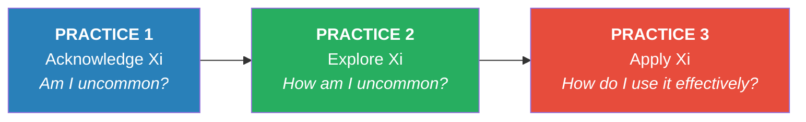
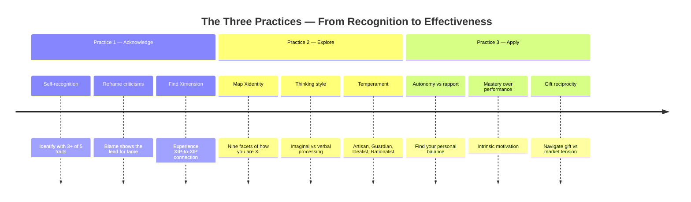
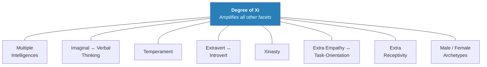
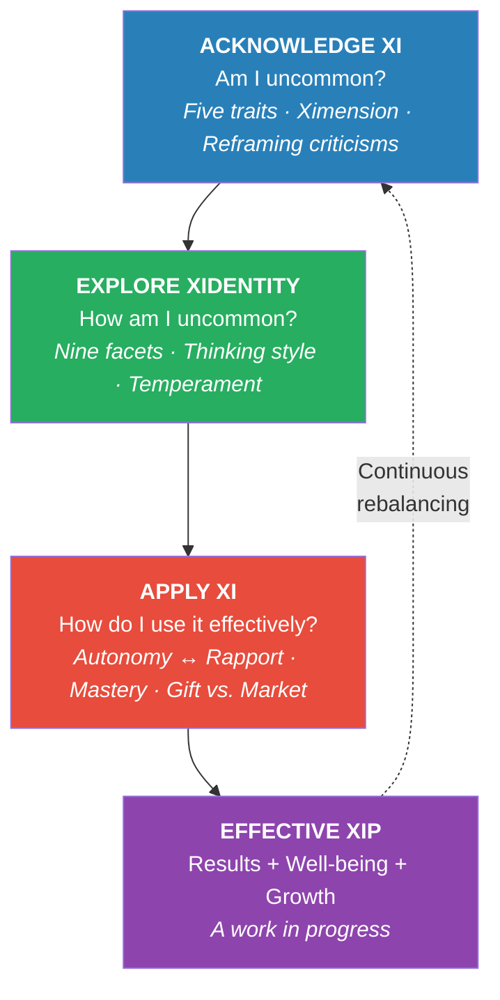

# Enjoying the Gift of Being Uncommon — Willem Kuipers

> *Published 2010. A Dutch career coach's decade-long framework for helping gifted adults recognize, explore, and effectively apply their uncommon intelligence — without waiting for anyone's permission or an IQ test to prove it.*

---

## At a Glance

| Field | Detail |
|---|---|
| **Full Title** | *Enjoying the Gift of Being Uncommon: Extra Intelligent, Intense, and Effective* |
| **Author** | Willem Kuipers |
| **Published** | 2010 (EPUB 2012) |
| **Genre** | Self-Development / Giftedness / Career Coaching |
| **Core Thesis** | About 2% of the population are eXtra Intelligent People (XIPs) who share five identifiable traits — and they can become effective by working through three Practices: Acknowledge, Explore, Apply |
| **Connections** | [[StrengthsFinder 2.0 - Tom Rath]] · [[Deep Work - Cal Newport]] · [[Originals - Adam Grant]] · [[Emotional Intelligence - Daniel Goleman]] · [[Essentialism - Greg McKeown]] |

---

## About the Author

- *Willem Kuipers — Dutch career coach, mathematician, and engineer who spent a decade developing the Xi framework with his partner Annelien van Kempen*
- Their daughter Georgina was labelled "gifted" as a young child, prompting both parents to discover they were <b style="color: #2980b9">"of the same kind" but quite different in their expression</b>
- Founded the coaching practice Kuipers & Van Kempen, specializing in career counselling and identity development for extra intelligent adults
- Coined the concepts of <b style="color: #27ae60">Xi (extra intelligence), XIP (eXtra Intelligent Person), Xidentity, and Ximension</b> starting in 2001
- His partner Annelien developed workshops and built a practitioner network while Willem built the conceptual framework — a complementary partnership that mirrors the book's themes
- A 2007 study by Dr. Ariane Oberndorff-De Wilde validated their coaching approach with sixteen clients, confirming that Xi-coaching increases self-confidence, autonomy, and workplace effectiveness
- Created the Ximension Foundation to support knowledge development and dissemination about extra intelligence

---

## The Big Idea

- *Most gifted adults are never identified — and the word "gifted" itself is part of the problem*
- <b style="color: #2980b9">About 2% of the population has an uncommonly high level of intelligence</b> — broadly defined across verbal, mathematical, musical, bodily, spatial, interpersonal, and intrapersonal domains
- <b style="color: #e74c3c">These people are not broken, difficult, or "too much"</b> — they are extra intelligent, and their intensity, complexity, and drive are features, not bugs
- <b style="color: #27ae60">You don't need an IQ test or anyone's permission</b> — if you identify with three of five character traits, you have sufficient reason to explore the hypothesis that you are an XIP
- Becoming an **Effective XIP** means working through three Practices: acknowledge your uncommon intelligence, explore the specific shape of your Xidentity, and apply your qualities to the world while managing the tension between autonomy and belonging

---

## Key Concepts at a Glance

| Concept | Description |
|---|---|
| **XIP** | eXtra Intelligent Person — or eXtra Intense Person, for those who resist the intelligence label |
| **Xi** | Extra intelligence — an uncommonly high level of one or more kinds of intelligence, self-verified |
| **The Five Traits** | Intellectually able, incurably inquisitive, needs autonomy, excessive zeal, contrast between emotional and intellectual self-confidence |
| **The Three Practices** | Acknowledge Xi → Explore Xi → Apply Xi (sequential but iterative) |
| **Xidentity** | Nine-facet model of how you are Xi — your unique combination of intelligences, thinking style, temperament, and more |
| **Ximension** | The extra dimension where being Xi goes without saying — XIP-to-XIP space for recharging and full-speed interaction |
| **Xinasty** | Family dynasty of Xi — inherited attitudes and beliefs about uncommon intelligence |
| **Imaginal Thinking** | Multi-dimensional associative thinking in images (~32 per second) — holistic, divergent, creative |
| **Gift Reciprocity** | XIPs who see their abilities as a gift feel driven to share but struggle when the gift is refused or undervalued |
| **Superstars / Strivers / Independents** | Three styles of applying Xi — visible achievers, tireless workers, creative square pegs |

---

## The 30-Second Version

- *A Dutch coach spent a decade working with gifted adults who didn't know they were gifted — and built a framework to help them*
- <b style="color: #2980b9">If you identify with three of five traits (intellectual ability, insatiable curiosity, need for autonomy, excessive zeal, and emotional-intellectual confidence gap), you may be an XIP</b>
- <b style="color: #e74c3c">The criticisms you've heard all your life — "too intense," "too many interests," "can't you just be normal?" — are actually signs of hidden uncommon assets</b>
- <b style="color: #27ae60">Effectiveness requires three Practices: acknowledge you're uncommon, explore exactly how you're uncommon, then apply your uncommon qualities to the world</b>
- *You are not too much. You are a precision instrument that needs proper tuning and the right environment to do its best work.*

---

## The 5-Minute Review

### What Is This Book?

- *A practical framework for gifted adults who have never been formally identified — or who resist the "gifted" label*
- <b style="color: #2980b9">Based on ten years of coaching practice</b> with adult XIPs in the Netherlands, validated by research showing clients gain insight, self-confidence, and workplace effectiveness
- Kuipers deliberately avoids the word "gifted" — too much baggage, too many performance expectations, too dependent on IQ tests
- Instead he coined <b style="color: #27ae60">Xi (extra intelligence)</b> as a more inclusive, self-verifiable concept that covers all forms of intelligence, not just the academic kind
- The book walks readers through three sequential Practices that transform self-recognition into sustainable effectiveness

### The Three Core Practices

1. <b style="color: #2980b9">**Acknowledge Xi**</b> — Recognize and accept being extra intelligent with all its implications. Discover other XIPs. Experience Ximension.
2. <b style="color: #27ae60">**Explore Xi**</b> — Investigate *how* you are Xi across nine facets of Xidentity. Understand your unique combination of strengths, vulnerabilities, and preferences.
3. <b style="color: #e74c3c">**Apply Xi**</b> — Put your uncommon qualities to work. Navigate the tension between autonomy and rapport. Choose mastery over performance. Enjoy the process.

### Why It Matters

- <b style="color: #e74c3c">Most gifted adults go through life feeling "different" without understanding why</b> — they carry a secret sense of not fitting in
- The word "gifted" implies an obligation to perform, an IQ test to prove it, and a rare genius-level ability — all of which prevent most XIPs from self-identifying
- <b style="color: #2980b9">Organizations lose enormous value</b> when they fail to recognize and properly manage their XIPs — instead treating their intensity as a problem to be corrected
- <b style="color: #27ae60">The reframe is simple but powerful</b>: the traits that draw the most criticism ("too intense," "too many ideas," "can't focus on one thing") are distorted expressions of uncommon assets

The three Practices form a sequential but iterative journey — most XIPs cycle back through earlier stages as new life circumstances reveal unexplored facets of their Xidentity.

---

## Practice One: Acknowledging Xi

*Part One — Chapters 1-3*

### The Five Character Traits

The heart of the book is a five-trait identification system. You don't need all five — <b style="color: #2980b9">three or more is sufficient to explore the hypothesis that you are an XIP</b>:

| # | Trait | What It Looks Like |
|---|---|---|
| 1 | **Intellectually able** | Grasps complicated issues easily, makes substantial leaps in thinking, low tolerance for stupidity, gets careless with simple tasks |
| 2 | **Incurably inquisitive** | Always curious about what's beyond the horizon, fascinated as long as something is new, pursues manifold interests, low tolerance for boredom |
| 3 | **Needs autonomy** | Prefers to work independently, reacts aversely to tight control and absolute power, will fight or flee when autonomy is threatened |
| 4 | **Excessive zeal** | Inexhaustible and keyed-up while a problem is interesting, drops it when curiosity is satisfied, invests too much energy in wrong projects |
| 5 | **Emotional-intellectual contrast** | Either emotional or intellectual self-confidence is high while the other is poorly established — can lead to perfectionism, fear of failure, or escalating know-it-all tendencies |

An acknowledged XIP channels their traits productively — high intellectual ability and autonomy become strengths — while an unacknowledged XIP often experiences excessive zeal and a widening confidence gap as the dominant, destabilising traits.

Kuipers deliberately makes this <b style="color: #27ae60">self-verifiable</b>. Unlike the traditional giftedness label — which requires a psychologist, an IQ test, and standardized conditions — Xi can be identified by the persons themselves or by someone in their environment. This is the first essential difference between Xi and giftedness. The second: Xi extends to all of Gardner's multiple intelligences — musical, bodily-kinaesthetic, interpersonal — not just the academic types measured by IQ tests. The third: giftedness implies an obligation to perform; Xi implies an "extra dose" without implicit expectations.

### The Profile: Intense, Complex, and Driven

Drawing on Mary-Elaine Jacobsen's *The Gifted Adult*, Kuipers profiles XIPs through three fundamental differences:

- <b style="color: #2980b9">**Intensity**</b> — All systems running at full throttle. More nuanced perception, more focused concentration, stronger empathy, deeper humor. When not in strength mode: depression, workaholism, ruthless debating, cynicism, becoming an "iceberg" or "unguided missile"
- <b style="color: #e74c3c">**Complexity**</b> — Absorbs, analyzes, and synthesizes information from wide-ranging domains extremely rapidly and simultaneously. Multiple interests, extraordinary intuition, massive memory, capacity for original and complex trains of thought. When mismanaged: obsession with one theme, or too little attention across too many themes, self-hate, tunnel vision, manipulation, analysis without conclusion
- <b style="color: #27ae60">**Drive**</b> — Structurally inquisitive, high bar-setters, self-starting, persistent. Natural innovators and visionaries, idealists, strong performers who are flexible and adept at achieving objectives. When frustrated: fear of failure, ultimate perfectionism, re-inventing the wheel, allowing themselves to be pushed just so they can resist, discouraging everyone through endless nagging

The key to each is the same: <b style="color: #2980b9">finding appropriate resources for expression</b>. When intensity, complexity, and drive are channeled effectively, XIPs lead productive, fulfilling lives. When they're repressed or mismanaged, the same qualities become distortions that harm the XIP and everyone around them.

> [!tip] XIP Can Also Mean eXtra Intense Person
> Many people who clearly show all five traits resist the word "intelligent" — they don't have high IQ scores, they weren't good at school, they think in images rather than words. Kuipers decided XIP can also stand for **eXtra Intense Person**. The framework applies identically. Intensity is often the most visible trait.

### The Confusing Variety

One of the most important insights: <b style="color: #e74c3c">XIPs are far more diverse than normally intelligent people</b>. A two-dimensional normal distribution shows that people at the extremes are widely separated from the center — but also from each other. No two XIPs are alike. This is why the common reasoning fails:

> "He is clearly extra intelligent due to such and such characteristics. I don't have those characteristics to such a pronounced degree, so I cannot be an XIP."

The comparison is invalid because the person you're comparing yourself to may be an XIP in a completely different way. The only commonality is the distance from the average — not the direction.

This diversity has a practical consequence that Kuipers connects to organizational diversity management. Managing XIPs is not like managing a homogeneous group — it requires what management scholar R. Roosevelt Thomas Jr. called "a craft for making quality decisions in the midst of differences, similarities, tensions and complexities." XIPs are a very diverse group internally, they form a minority within most organizations, and they have a natural affiliation with complexity because they perceive many levels of their environment simultaneously.

Allowing for the complexity that XIPs offer requires conscious effort. <b style="color: #2980b9">Promoting the average is often more practical and efficient.</b> Mass production is cheaper than custom building. But monocultures are vulnerable to disruption. XIPs can serve as change agents and early-warning sensors — they're often the first to sense organizational unrest or foresee harmful consequences of current strategies. Organizations that accommodate their variety gain adaptation potential; those that suppress it lose both their XIPs and their resilience.

> [!info] XIPs as Organizational Sensors
> Due to their innate diverse and above-average qualities, XIPs can be change agents in organizations. They may foresee harmful consequences others cannot yet imagine. They are often the first to make growing organizational unrest visible, urged by their high sensitivity for fairness and justice.

### The Emotional Barrier

Recognition is rarely rational. Kuipers finds four categories of reluctance:

1. **Fear of being linked to an exceptional group** — "I don't want to feel superior to others" or "My family never stood out." Some people resent marking differences between humans, wanting to underline what unites us. Kuipers' response: "Formula 1 race cars and mid-size sedans are both cars with four wheels. But they have different qualities to enjoy and they thrive in different environments."
2. **Incredulity about possessing uncommon intelligence** — "I often feel quite stupid" or "I didn't finish university" or "I am far too lazy." Bad academic performance at school becomes emotionally linked to a stigma of ignorance that persists for decades.
3. **Awkwardness of being your own authority** — "Who am I to say I'm extra intelligent?" In a world where authority is linked to certified experts, asserting your own uncommon intelligence feels presumptuous. The real challenge is to stop confining doubts to internal thinking and start communicating the possibility to yourself and others.
4. **Thinking the real problem must be more complex** — "The solution can't be that simple." A paradoxically XIP reaction: if an extensive body of knowledge exists about your lifelong struggles, the answer shouldn't be this obvious. XIPs have difficulties with easy tasks because they can't believe an authority would seriously propose something that simple.

Clients tell Kuipers things like: *"All my life I feel I have a secret"* and *"How did you know that about me?"* The shock of recognition is related to the unexpected confirmation of something they've always known but kept hidden.

> [!quote] The Secret
> Kuipers has heard this repeatedly: "I'm somehow different from other people." The realization of "being different," especially at a young age, does little to instil security. Many people do their utmost to keep that feeling a secret and try their best to behave normally.

### Scenarios for Acknowledgement

Acknowledgement typically follows one of two paths:

**At the workplace:**
- An escalation or outburst occurs that makes change unavoidable
- A manager notices the XIP's special qualities and refers them for coaching
- A company physician identifies extra intelligence as a possible root cause of chronic work problems
- The XIP realizes that their "wrong" job choices follow a pattern connected to unacknowledged Xi

**In personal life:**
- <b style="color: #2980b9">A child is labelled "gifted" at school, and the parents start recognizing themselves</b>: "You were just the same when you were her age..."
- A partner or friend points out patterns the XIP cannot see
- A life crisis forces reassessment of old choices made to "be normal"

Because intelligence is strongly hereditary, parents, children, siblings, and grandparents often share Xi — but family tradition, gender roles, and individual choices about visibility mean it goes unacknowledged. <b style="color: #e74c3c">A surprising number of parents, especially mothers, pour tremendous effort into helping their gifted children without ever acknowledging their own extra intelligence.</b> If they did, they would be better role models for managing Xi.

XIPs in organizations often learn very early — sometimes before school — to either stand out or blend in. Many conclude that they're better off not being labelled "highly intelligent." Some achieve great things unnoticed. Others choose inconspicuousness and mediocrity. A third group drops out and performs extremely badly. But when changes occur — a new job, a life phase, a crisis — old choices can be questioned and the opportunity arises to reevaluate one's qualities.

### Blame May Show the Lead for Fame

This is the book's most immediately useful tool — <b style="color: #2980b9">a systematic reframe of the top ten criticisms XIPs hear into the hidden assets they reveal</b>:

| Criticism | Hidden Asset |
|---|---|
| "Why are you always so intense?" | Extraordinary passion and energy |
| "Can't you just keep one career direction?" | Ability to transcend borders among disciplines |
| "You think too much!" | Depth of analysis and reflection |
| "Why do you always have to be different?" | Natural innovation and original perspective |
| "You're too sensitive!" | High empathy and perceptiveness |
| "You never finish anything!" | Ability to generate many ideas and see new possibilities |
| "Why can't you just follow the rules?" | Independent thinking and autonomy |
| "You always have to know better!" | Genuine competence and quick understanding |
| "Where do you find all these ideas?!" | Creative intelligence and associative thinking |
| "You are always so driven!" | Focused determination and persistence |

The mechanism: XIPs hear criticism and automatically throttle down because it evokes guilt. Many become convinced the criticism is deserved and begin masking their qualities. <b style="color: #e74c3c">The irony is that the very traits that draw the most heat are the most valuable</b> — just expressed at the wrong time, place, or intensity.

### Ximension: Where Being Xi Goes Without Saying

When two or more XIPs meet and drop their filters, something distinctive happens: <b style="color: #27ae60">conversation becomes faster and more intense, mutual inspiration flows, and both parties experience a kind of relief</b> — no need to slow down, simplify, or mask intensity.

Kuipers named this **Ximension** — the extra dimension where being Xi goes without saying. Key properties:

- Practical and embodied knowledge about XIP qualities is available without judgment
- A safe space for inquiring about one's uncommonness and comparing it with others'
- A recharging station — not a conservation area to retreat into permanently
- Can be physical (a meeting, a workshop) or a state of mind
- Organizations should actively facilitate it, even among XIPs who work in different departments

The mechanism: XIPs have a high level of sensory input, they process it rapidly and simultaneously, and they long to express their findings. When meeting other XIPs, the interaction becomes immediately more multifaceted. Somehow there is the experience that one's own qualities are mirrored unusually strongly in the other. But the most important aspect is the experience that one XIP can behave normally with the other — no need to throttle down pace of thinking, simplify conceptual complexity, or mask intensity of feelings. <b style="color: #2980b9">What is usually "extra" somewhere else is normal here.</b>

Ximension also stimulates personal development. Many XIPs are more ready to accept their own being Xi after experiencing the unusual quality of interaction with others whom they consider obvious XIPs:

> [!example] The Power of Ximension
> *"On many occasions I have tremendously enjoyed discussions with you, who I consider to be a very intelligent person. You indicate that talking with me is very inspiring to you, due to my input and the speed and clarity of my reactions. I have come to the conclusion that this mutual experience almost forces me to accept that I must have an uncommon intelligence too."*

For organizations, Ximension is a practical management tool. Innovative companies tend to cluster in regions that provide an inspirational climate. Within organizations, allowing XIP-to-XIP interaction — even informally, across departments — <b style="color: #27ae60">boosts both productivity and personal development</b>. The XIPs exchange information that may be unexpectedly helpful for their own work. The process of hearing another XIP's story activates creativity to solve one's own problems.

---

## Practice Two: Exploring Xidentity

*Part Two — Chapter 4*

### The Nine Facets of Xidentity

Once you acknowledge being an XIP, the next question is: *How are you Xi?* The answer lies in **Xidentity** — a model of nine characteristic facets that mutually influence each other:

The Xidentity model groups nine facets into three categories: four "multiple" facets where you compose your own blend, three polarity facets where you sit along a continuum, and two central facets — Degree of Xi and Xinasty — that amplify and contextualise all others.

The central facet — **Degree of Xi** — acts as an amplifier: the stronger your Xi, the more extreme all other facets become. Four facets are "multiple" (you draw your own composition from each), and three are polarities (you sit somewhere along a continuum).

### Imaginal vs. Verbal Thinking

One of the most practically useful facets. <b style="color: #2980b9">Imaginal thinking is thinking in a multi-dimensional associative structure of images</b> — visual, sensory, experiential — at approximately 32 images per second. This is so fast that the brain cannot consciously observe each separate image. The result arrives suddenly, as a surprise: you don't know how you got there but you're almost certain the answer is right.

**Verbal thinking** is sequential, logical, word-based — the standard form of academic reasoning. Many XIPs excel at both, but some are strongly imaginal thinkers who struggle with verbal expression.

Three essential differences:

| | Imaginal Thinking | Verbal Thinking |
|---|---|---|
| **Structure** | Holistic, all-at-once | Sequential, step-by-step |
| **Orientation** | Connected to movement, space, process | Connected to time, definitions, agendas |
| **Direction** | Divergent — like a garden sprinkler dispersing outward | Convergent — like a discussion focusing inward |

> [!warning] The Incomprehensible Explanation
> Imaginal thinkers "see" a solution in their mind and can walk around it mentally. But explaining it in words requires converting spatial, simultaneous understanding into sequential speech. The result: unfinished sentences, shifting perspectives, and audiences giving up in frustration. **Practical fix**: explain one perspective at a time, announce when switching, and keep the sprinkler anchored.

### Temperament: Four Kinds of Intelligence

Using Keirsey's framework, Kuipers maps four temperaments to four kinds of intelligence:

| Temperament | Intelligence Type | Core Drive | Excellence Looks Like |
|---|---|---|---|
| **Artisan** | Tactical | Maximum effectiveness in the here-and-now | Creating beauty, managing ten activities at once, surviving risk with grace |
| **Guardian** | Logistic | Being prepared and maintaining stability | Building reliable structures, remaining loyal, becoming a trusted leader |
| **Idealist** | Diplomatic | Understanding deeper meaning in people | Bringing harmony to dissonance, trusting intuition, promoting peace |
| **Rationalist** | Strategic | Overseeing long-term possibilities efficiently | Developing comprehensive theory, exposing logical flaws, perfect composure |

Each temperament leads differently: Artisans through immediate action, Guardians through reliable structure, Idealists through inspiring warmth, Rationalists through strategic planning. <b style="color: #27ae60">This is why no single prescription for "applying Xi" can work for all XIPs</b>.

### Xinasty: The Family Dynasty of Xi

Intelligence is strongly hereditary. Many XIPs come from families where Xi runs across generations — but family attitudes about uncommon intelligence vary enormously:

- <b style="color: #e74c3c">Inhibitory convictions</b>: "Make sure you never get noticed" / "Take it easy, otherwise it might be dangerous" / "You can't make a silk purse from a sow's ear"
- <b style="color: #27ae60">Encouraging Ximension</b>: "In our family we did things a bit differently. Our parents said it was just their preferred style"

The "birds of a feather flock together" effect means XIPs often form couples with other XIPs. Given the hereditary component, a majority of family members may show Xi characteristics — even if their expression takes extremely divergent forms. This process may have been going on for generations without anyone recognizing it.

Confusion arises when one child is "the smart one at school" while siblings excel in music, sports, or networking — and only the academic child is considered gifted. This creates stigma and denial patterns that persist for generations. A strong capacity for imaginal thinking, whether linked to dyslexia or not, or a strong psychomotor extra receptivity (unable to sit still at school) can lead to dropping out or vocational education — and a lifelong judgement of "not being particularly intelligent."

The typical female and male lines carry additional weight. For centuries, women were considered naturally less intelligent than men. Many women today still have difficulty accepting they may be Xi while readily recognizing the extra intelligence in their male partner or their children. <b style="color: #2980b9">When you acknowledge the treasure chest of exceptional qualities in your family, it helps you let your own qualities loose on the world.</b>

### Extra Empathy vs. Extra Task-Orientation

Because XIPs tend toward extremes, their people-orientation or task-orientation becomes **extra** — visible and sometimes problematic:

- <b style="color: #2980b9">Extra empathic (Xe)</b> XIPs feel what others feel with extraordinary intensity, may lose themselves in others' emotions, tend to fulfil others' expectations at the expense of their own needs
- <b style="color: #e74c3c">Extra task-oriented (Xt)</b> XIPs focus relentlessly on content and results, may seem cold or dismissive, tend to protect their autonomy at the expense of relationships

When these two types enter a relationship — at work or in personal life — the tension can escalate: the Xe becomes "extra extra empathic" and the Xt becomes "extra extra task-oriented," each amplifying the other's distortion. Using the language of Core Quadrants: exaggeration of a quality leads to too much of a good thing, which triggers an allergic response in the other, which maintains the cycle.

### Extra Receptivity

All XIPs possess heightened sensory awareness — what Kuipers calls <b style="color: #2980b9">Extra Receptivity (Xr)</b>. This isn't a separate intelligence but a general amplification of sensory input across all channels. XIPs notice more nuances, process more information simultaneously, and are more susceptible to overload.

Kazimierz Dabrowski's concept of overexcitabilities maps well here. Kuipers identifies five domains of extra receptivity:

- **Psychomotor Xr** — Surplus of physical energy, restlessness, need for movement
- **Sensual Xr** — Heightened response to sensory stimuli (textures, sounds, tastes, light)
- **Intellectual Xr** — Insatiable curiosity, love of knowledge, deep concentration
- **Imaginational Xr** — Vivid imagery, rich fantasy life, inventiveness
- **Emotional Xr** — Intense feelings, strong physical responses to emotions, deep empathy

This extra receptivity is one reason XIPs need more autonomy than most — they need to manage their sensory intake in their own way. It also explains why <b style="color: #27ae60">introversion occurs much more frequently (50%+) in XIPs</b> compared to the general population (35%): many XIPs need to withdraw not because they dislike people, but because they need to process the enormous amount of information they absorb in social settings.

### The Degree of Xi

The central facet of the Xidentity model acts as an amplifier. <b style="color: #e74c3c">The higher the degree of Xi, the more extreme all other facets become</b>. A moderately Xi person may experience mild tension between empathy and task-orientation; a profoundly Xi person may swing between extreme empathy and extreme task-focus, confusing everyone around them.

This explains why the most Xi individuals are often the most misunderstood — their qualities are so amplified that they may appear pathological or disordered to observers unfamiliar with the Xi framework. The line between "extra" and "too much" depends entirely on context and awareness.

---

## Practice Three: Applying Xi

*Part Three — Chapters 5-8*

### Superstars, Strivers, and Independents

Drawing on Marylou Streznewski's *Gifted Grownups*, Kuipers describes three fundamentally different styles of applying Xi:

| Type | Profile | Relationship to Xi |
|---|---|---|
| **Superstars** | "Taller, healthier, handsomer, wealthier, happier, and nicer." Excel visibly. Values align with society. Play hard, work hard. Their expression focuses on societal relevance. | Uninterested in the Xi framework — they've always achieved things with little effort |
| **Strivers** | Work incredibly hard at everything. Extraordinarily meticulous. Often "married to their work." Exceed expected performance but only locally and specifically. | Explain their success as hard work, not gifts. Come to coaching after burnout or a "is that all there is?" crisis |
| **Independents** | Creative and brilliant when interested, completely uncooperative when not. Square pegs in round holes. Career paths unpredictable. Expression often has great personal value but little societal relevance. | Have the most to gain from Xi awareness — most talented of the three groups but least understood |

Independents are the group most vulnerable to stagnation. If their gifts are rejected or unvalued, they may abandon their creativity entirely. Their social breakthrough can take a very long time to manifest — and in the worst cases, it never does. Kuipers notes bluntly that this "can result in them abandoning all social links or lead to criminal behaviour and even death."

Independents carry the highest creative potential but also the greatest stagnation risk — their gifts are the most vulnerable to rejection because they operate outside conventional reward systems that sustain Superstars and Strivers.

But some independents become <b style="color: #27ae60">**super pioneers**</b> — rare individuals who maintain both autonomy and rapport, keep producing uncommon ideas, refuse to wear conventional clothes, and eventually change society's expectations to fit their own expression. They manage to have it both ways: the independence to be truly original and the rapport that gives their originality a home in the world.

### Autonomy vs. Rapport

Every XIP faces a fierce competition between two needs:

- <b style="color: #2980b9">**Autonomy**</b> — XIPs need space to follow their own sensory impulses, organize work according to their own logic, and be creatively unpredictable. Their extra receptivity processes so much information that they need freedom to manage it in their own way.
- <b style="color: #e74c3c">**Rapport**</b> — XIPs experience human needs for security, social contact, and appreciation with unusual intensity. They also need others' support to realize their plans. But their uncommon opinions and ideas often make rapport elusive.

The solution is not choosing one over the other but finding <b style="color: #27ae60">**interdependence**</b> — maintaining sufficient autonomy within adequate rapport. The optimal mix depends on your Xidentity: extra task-oriented XIPs lean toward autonomy, extra empathic XIPs lean toward rapport, Artisans prioritize freedom to act, Idealists prioritize authenticity in relationships.

Ximension is especially valuable here — XIP-to-XIP rapport develops naturally, making it safer to experiment with greater autonomy. Organizations that facilitate Ximension get a double benefit: their XIPs recharge their batteries *and* inspire each other to do their regular work better.

### Gift Reciprocity vs. Market Economy

This is the book's most intellectually original contribution, drawn from Lewis Hyde's *The Gift*:

<b style="color: #2980b9">Many XIPs experience their intelligence as a gift — something bestowed, not earned.</b> They feel a drive to share their gifts with the world. But modern society runs on a market economy, where the highest esteem goes to whoever accumulates the most wealth.

| | Gift Economy | Market Economy |
|---|---|---|
| **Wealth** | Circulating — passed on to maintain relationships | Accumulated — possessed and taken out of circulation |
| **Value** | Not negotiable | Negotiated via price |
| **Status** | Highest esteem for the greatest giver | Highest esteem for the greatest taker |
| **Boundaries** | Gifts that cross boundaries dissolve them | Commodities that cross boundaries may create them |
| **Refusal** | Refusing a gift refuses the relationship | Refusing a commodity is just business |

The three types experience this tension differently:

- **Superstars** — Little tension. They give abundantly and receive recognition, power, and earnings in return
- **Strivers** — Little tension. They explain their results as perspiration, feel at ease asking market prices for their effort
- <b style="color: #e74c3c">**Independents** — Maximum tension.</b> They feel driven to share their gifts but struggle when the gifts are refused or undervalued. Rejection feels like being thrown out of a community. This can lead to stagnation, denial of their Xidentity, and abandonment of their creativity

> [!warning] The Stagnation Trap
> When an XIP offers a gift and it is criticized or refused, they may start questioning the value of the gift itself — and decide to stop using it or deny having it. "If the result of effort and creativity is not valued, one becomes critical of one's own inspiration, which usually upsets its occurrence."

### Performance Goals vs. Mastery Goals

<b style="color: #2980b9">A performance goal is about obtaining a well-defined result</b> — grades, targets, metrics. <b style="color: #27ae60">A mastery goal is about becoming proficient</b> — stretching personal limits, developing craftsmanship, finding one's own style of expression.

The word "mastery" connects to the medieval guilds, where apprentices worked and studied with a master for years before producing their own "masterpiece" — a creation that demonstrated both skill and creative identity. Striving for mastery is a strong intrinsic motivation connected to personal identity: "I created this, it is like a part of me."

Kuipers argues that performance orientation is particularly harmful for extra empathic XIPs. They become hyper-aware of others' expectations, sincerely try to fulfil them, lose touch with their own needs and qualities, fail at the task, and then concentrate even harder on others' expectations next time — a vicious spiral. Task-oriented XIPs fare somewhat better with performance goals, but even they are more effective when the task matches their autonomous preferences.

For the record, Kuipers notes one obvious complication: in the field of innovation and ground-breaking research, linking the availability of funds to a desired outcome (performance) allows little margin to discover something unexpected. The greatest breakthroughs come from mastery-oriented exploration, not target-driven production.

Mastery orientation sustains XIP motivation because:
- Difficult tasks become fascinating (something new to master)
- Perseverance is self-evident (stretching limits doesn't come cheap)
- Mistakes become learning opportunities (part of finding one's style)
- Help-seeking is natural (everyone can be a source of knowledge)
- The XIP puts their signature on their work — personal expression and professional output merge

### Excellence Is a Form of Deviance

Quoting Robert Quinn's *Deep Change*: <b style="color: #e74c3c">"Excellence, by definition, requires continued deviance from the norm. When an individual or organization excels, it will encounter pressure to return to conventional behaviour."</b>

Quinn tells the story of a CEO of a small company acquired by a large corporation. The small company's unique practices were the secret of its high performance. The CEO took bold actions to prevent the larger company from routinizing their innovative practices — because he understood that excellence requires continuous deviation from standard operating procedures.

Organizations say they want excellence but treat its manifestation as a threat. XIPs who innovate, question standard practices, or produce unconventional results face pressure to conform. Lean mass production favors consistency; innovation requires tolerance for deviation. Excellent creativity is not appreciated in an environment tailored for efficiency — but may be priceless in a company trying to reinvent itself.

This creates a paradox for XIPs: <b style="color: #2980b9">the very deviance that makes them valuable is the quality that organizations find most difficult to accommodate</b>. The XIP who sees this dynamic clearly can make better choices about where to work, how to frame their contributions, and when to fight versus when to find a different environment.

### Tools: Mindset, Embodied Cognition, and the Labyrinth

Kuipers draws on Carol Dweck's growth mindset research to warn against praising XIPs for being smart (fixed mindset) rather than for effort and learning (growth mindset). This is especially important for gifted children who may develop a fear of challenges that could reveal they're "not as smart as everyone thinks."

He introduces **embodied cognition** — the idea that thinking is not confined to the brain but involves the entire body — and **mirror neurons** — which help explain why XIPs experience such intense empathy and why Ximension feels so energizing.

The most elaborate tool is the **classical seven-circuit labyrinth** mapped to the seven chakras, creating a model for the dynamics of flowing expression and patterns of stagnation. Each circuit corresponds to a chakra (survival, emotion, willpower, love, communication, intuition, awareness), and stagnation at any point disrupts the flow of both the "liberating current" (upward energy of growth) and the "manifesting current" (downward energy of bringing ideas to life).

> [!tip] The Precision Instrument Metaphor
> Kuipers repeatedly compares XIPs to precision instruments — made for special, often complicated tasks, but delicate by nature. They need careful tuning and proper maintenance to stay in perfect condition. The three Practices are the maintenance manual.

### The Effective XIP: A Work in Progress

The book closes with a realistic message: <b style="color: #27ae60">effectiveness is not a destination but a permanent balancing act</b>. Personal development is dynamic — Xidentity changes over time, new interests emerge, workplace environments shift. The three Practices are not a one-time sequence but ongoing disciplines.

Consider the dynamics at play:
- Xidentity evolves through acquired experience and qualitative changes — Xinasty awareness deepens, extra receptivity is better managed, autonomy needs shift
- Personal efforts and results change as new interdisciplinary fields emerge, new bodies of knowledge are created, and personal interests shift
- The workplace environment changes through reorganizations, mergers, new management, and national economic shifts

All of these require the XIP to continually re-tune their precision instrument. The three Practices provide the framework for this ongoing calibration.

"Yes, XIPs can make a difference!"

---

## Best Stories & Illustrations

> [!example] The Daughter Who Started It All
> Kuipers and his partner Annelien van Kempen had their young daughter Georgina labelled "gifted" — and then made a startling discovery. Looking at the characteristics that defined giftedness, they realized they were "of the same kind" — but quite different in their expression of it. Their clients, too, seemed highly intelligent when discreetly questioned, "but would not consider themselves gifted at all." This personal awakening became the foundation for ten years of developing the Xi framework, proving that the path to understanding gifted adults often begins with their children.

> [!example] The Civil Service Manager
> Kuipers recalls talking to a manager about a struggling employee they suspected was an XIP. The manager stated with absolute certainty that "there were no gifted people in his organization, and probably never would be either, since there would not be any adequate work for them." The irony: the manager himself displayed classic XIP traits. The story perfectly illustrates how the "superhuman or Einstein" expectation blinds organizations to the 2% of XIPs hiding in plain sight — including in management.

> [!example] The Twelve IQ Tests
> Psychologist Karien Boosten tested twelve of Kuipers' coaching clients. All had struggled in their careers — no university degrees, many retries, wrong jobs. Under standardized testing conditions with impatient testers, many would have scored too low due to emotional barriers and test stress. But Boosten patiently accommodated their anxieties, and all twelve scored in the gifted range. The test score was "a major relief" — external validation of what their self-recognition had already told them. The story demonstrates both the power and limitations of formal IQ testing.

> [!example] The Garden Sprinkler
> Imaginal thinking is like a garden sprinkler: when properly anchored by its spike in the earth, it disperses water in a divergent pattern that enriches everything around it. But without the anchor, it moves chaotically — everything just gets wet without purpose. Two imaginal thinkers together create overlapping dispersal patterns, inspiring each other without censoring. Verbal thinking, by contrast, is like a discussion: two people gradually focus in on each other's statements, converging toward agreement. Organizations need both — brainstorming (imaginal) to generate ideas, discussion (verbal) to evaluate them. But without imaginal input, there can be no innovation.

> [!example] The Training Mastery Crisis
> Kuipers joins his partner's creative mastery training course, where participants must present a "material expression" in a gallery window. He has no idea what to create. All summer he's depressed about it. The evening before the deadline, he writes down why he has hated these situations his entire life. In those dark hours, he suddenly realizes his personal stagnation maps perfectly onto labyrinth circuits and chakra themes. He scribbles it down, polishes it the next morning, and the "labyrinth of stagnation" — his most original theoretical contribution — is born. The very experience of stagnation became the content of his expression. The XIP's crisis became the XIP's breakthrough.

> [!example] The Formula 1 Metaphor
> "Formula 1 race cars and mid-size sedans are both cars with four wheels. But they have different qualities to enjoy and they thrive in different environments." Kuipers uses this to defuse the "superiority" objection. The point is not that XIPs are better than non-XIPs — the point is that they need different conditions to perform optimally. You wouldn't take a Formula 1 car grocery shopping, and you wouldn't enter a sedan in a Grand Prix. The question isn't which is better, but which environment allows each to express its qualities.

---

## Practical Application

### How to Use the Three Practices

**Practice 1 — Acknowledge Xi:**

- Read the five character traits honestly. Do you identify with three or more?
- Notice which criticisms from Table 1 feel painfully familiar — they may be pointing at hidden assets
- Find other XIPs — even one person who mirrors your intensity creates Ximension
- Accept that acknowledgement is emotional, not rational — give yourself time to sit with the idea
- If "extra intelligent" feels too loaded, try "extra intense" — same framework, less baggage

**Practice 2 — Explore Xidentity:**

- Identify your strongest multiple intelligences — especially the ones dismissed as "hobbies"
- Determine your thinking style: are you predominantly imaginal (holistic, visual, spatial) or verbal (sequential, logical, analytical)?
- Find your temperament: Artisan (tactical, here-and-now), Guardian (logistic, structured), Idealist (diplomatic, people-focused), or Rationalist (strategic, systems-oriented)?
- Examine your Xinasty — what messages did your family transmit about being smart, different, or exceptional?
- Locate yourself on the extra empathy / extra task-orientation spectrum
- Map the contrast between your emotional and intellectual self-confidence — which is stronger?

**Practice 3 — Apply Xi:**

- Find your personal balance between autonomy and rapport — don't sacrifice one entirely for the other
- Choose mastery goals over performance goals wherever possible
- Recognize the gift-commodity tension: are you undercharging because sharing feels like giving? Consider whether an "agent" (literal or figurative) could handle the market side
- If you're an independent, be especially vigilant for the stagnation trap — gifts refused are not gifts proven worthless
- Remember Quinn's insight: if your excellence is creating friction, that's often a sign you're actually excelling

### For Managers and Organizations

| Challenge | Xi-Informed Response |
|---|---|
| XIP seems difficult and uncooperative | Investigate whether reproaches point to uncommon assets in the wrong role |
| XIP is bored or underperforming | Check whether the work matches their intelligences and provides sufficient complexity |
| XIP conflicts with colleagues | Consider whether the XIP needs more autonomy, or whether colleagues need context about intensity |
| XIP is burning out | Examine whether they're running on performance goals rather than mastery goals |
| XIPs seem isolated | Create opportunities for Ximension — even informal interactions between XIPs across departments |
| XIP keeps changing direction | Reframe as a strength: ability to connect across disciplines may be their highest-value contribution |

> [!tip] The Recharging Principle
> "It can be very profitable for organizations to stimulate interaction between their XIPs, even when they do not work in the same department. They will inspire and support each other to do their own job better, and recharge their batteries at the same time."

### For the XIP's Personal Life

- **Partner relationships**: True love between XIPs is common — shared intensity, complexity, and drive create mutual attraction. But the diversity of Xi means partners may excel in completely different ways. Recognize and celebrate this rather than expecting similarity.
- **Parenting**: When your child is labelled gifted, look in the mirror. Intelligence is strongly hereditary. Your own unacknowledged Xi may be the key to understanding your child — and yourself.
- **Self-care**: XIPs are precision instruments. They need maintenance — regular Ximension contact, creative outlets, autonomy in their schedule, and protection from sensory overload.
- **The long bag**: Everyone drags a bag of shadow qualities behind them. XIPs' bags are heavier because society has been stuffing them since childhood. Gently, carefully, begin retrieving what you put away to be "normal."

---

## The Architecture of Becoming an Effective XIP

---

## Key Quotes & Principles

| # | Principle |
|---|---|
| 1 | <b style="color: #2980b9">"Blame may show the lead for fame"</b> — every reproach points to an uncommon quality expressed at the wrong time, place, or intensity |
| 2 | <b style="color: #27ae60">"Ximension is the dimension where being Xi goes without saying"</b> — find your people, drop your filters, recharge |
| 3 | <b style="color: #e74c3c">"Excellence, by definition, requires continued deviance from the norm"</b> — if your work creates friction, you may be excelling |
| 4 | "In a gift society the highest esteem is for the person who gives the most. In a market economy, the highest esteem is for the person who takes the most" |
| 5 | "XIPs can be compared to a precision instrument — made for special tasks, but delicate by nature" |
| 6 | "It is a tragic waste of assets to gaze in the distance in search of mythical talents, and overlook valuable uncommon talents right under one's nose" |
| 7 | "Effectiveness is not static, but a permanent balancing of needs for personal development and needs for practical results" |
| 8 | "A gift is something we do not get by our own efforts: It is bestowed upon us" — and talents feel exactly this way to many XIPs |
| 9 | "The less one considers one's Xi to be something special, the easier it is to ask for and accept payments" — superstars and strivers earn more easily than independents |
| 10 | "XIPs are definitely among us; let us welcome them!" |

---

## Connections

| Book | Connection |
|---|---|
| [[StrengthsFinder 2.0 - Tom Rath]] | Both emphasize identifying and leveraging natural strengths rather than fixing weaknesses — Rath's "talent themes" parallel Kuipers' multiple intelligences and Xidentity facets |
| [[Deep Work - Cal Newport]] | Newport's protected deep work environments are the professional equivalent of Ximension — spaces where concentrated cognitive work can happen without interruption |
| [[Essentialism - Greg McKeown]] | The tension between XIP's excessive zeal (too many interests) and the need to focus on what matters most — McKeown's "less but better" is the XIP's hardest lesson |
| [[Originals - Adam Grant]] | Grant's analysis of how original thinkers navigate conformity pressure directly parallels Kuipers' insight that "excellence is a form of deviance" |
| [[Peak - Anders Ericsson]] | Ericsson's deliberate practice maps to Kuipers' mastery orientation — the sustained, effortful refinement that produces genuine expertise |
| [[Emotional Intelligence - Daniel Goleman]] | Goleman's framework maps directly onto the extra empathy / extra task-orientation facet of Xidentity |
| [[The Subtle Art of Not Giving a F-ck - Mark Manson]] | Manson's argument for choosing what to care about resonates with XIPs who exhaust themselves by caring about everything |
| [[How to Fail at Almost Everything and Still Win Big - Scott Adams]] | Adams' "talent stack" concept — combining mediocre skills into a rare combination — connects to multiple intelligences and XIP diversity |
| [[Edge - Laura Huang]] | Huang's work on leveraging perceived disadvantages parallels "blame may show the lead for fame" — turning stigma into strategic advantage |
| [[An Astronaut's Guide to Life on Earth - Chris Hadfield]] | Hadfield's emphasis on preparation, competence, and teamwork under extreme conditions models what effective XIP performance looks like in practice |

---

## What's Missing

This is an honest, practical book, but it has significant limitations worth noting:

- <b style="color: #e74c3c">**Limited empirical evidence**</b> — The framework is built primarily on ten years of coaching experience with an unspecified number of clients. The only formal research is Dr. Oberndorff's study of sixteen clients. No controlled studies, no comparison groups, no longitudinal data.
- **The 2% figure is loosely defined** — It maps to the traditional IQ-based gifted threshold but is applied to all multiple intelligences, which makes the actual prevalence unclear. Kuipers acknowledges it could be as high as 5%.
- **The Xidentity model is clinically unvalidated** — The nine facets were developed from coaching practice, not psychometric research. Some facets overlap, some feel arbitrary, and the model has not been independently replicated.
- **The chakra/labyrinth material** — The extended Appendix mapping personal expression onto seven chakras and labyrinth circuits will resonate with some readers but alienate those who prefer evidence-based frameworks. It's presented as personally meaningful rather than scientifically grounded.
- **Case studies lack narrative depth** — Most examples are brief, unnamed, and generic. The book would be significantly stronger with detailed, story-driven cases showing the three Practices in action.
- **Cultural context is narrow** — The framework is developed from Dutch coaching practice and may not translate directly to all cultures, particularly those with different attitudes toward authority, self-assertion, and individual difference.
- **The writing is sometimes circular** — Core ideas are restated across chapters without sufficient new content. The book could be 40% shorter without losing substance.

Despite these limitations, the core framework — five self-verifiable traits, three sequential Practices, the criticisms-to-assets reframe, and the Ximension concept — represents a genuinely useful contribution to the field of adult giftedness.

---

## Final Reflection

Kuipers ends with a dedication to his daughter Georgina, "sitting autonomously and at ease in her own Ximension." She was the muse who started it all — the child whose label prompted two adults to discover themselves and spend a decade helping others do the same.

The book's greatest strength is its accessibility. Unlike the formal giftedness literature — which requires psychologists, IQ tests, and standardized conditions — the Xi framework gives people permission to recognize themselves. The five character traits are immediately understandable. The criticisms-to-assets reframe is something you can use today. The concept of Ximension names an experience that many gifted adults have felt but never had words for.

The book's greatest limitation is its empirical thinness. Ten years of coaching practice is valuable experience, but it is not evidence in the scientific sense. The Xidentity model, the three Practices, and the coaching outcomes all await independent validation. Readers should treat the framework as a useful hypothesis — which is exactly what Kuipers himself recommends for individual self-identification.

The most enduring contribution is not any single framework but a shift in perspective: <b style="color: #2980b9">from "what's wrong with me?" to "what kind of uncommon am I?"</b> For the 2% who have spent their lives feeling too intense, too complex, and too driven, this simple reframe can be life-changing.

For managers, the message is equally clear: the employee who generates the most friction may be your most valuable asset — deployed in the wrong role, at the wrong time, or without sufficient autonomy. Before you correct the deviation, consider whether you're looking at deviance or excellence.

For families, the book offers a generational lens: the traits that frustrated your parents, that you're seeing in your children, may be the same trait expressing itself differently across a Xinasty. Understanding this breaks cycles of denial and opens the door to celebrating what your family actually is.

<b style="color: #27ae60">You are not too much. You are a precision instrument. Learn what you're made for, find the right environment, and enjoy the gift of being uncommon.</b>

---

## Extended Deep Dive: The Stagnation Patterns — Why XIPs Get Stuck

### The Anatomy of XIP Stagnation

Kuipers identifies stagnation as the central threat to XIP effectiveness. Unlike burnout — which is depletion from too much work — XIP stagnation is <b style="color: #e74c3c">the paralysis that comes from unacknowledged or misapplied Xi</b>. It's the gap between potential and expression, between what you could contribute and what you actually do.

Stagnation manifests differently depending on the XIP type:

| Type | Stagnation Looks Like | Root Cause |
|------|----------------------|------------|
| **Superstars** | Sudden loss of interest in achievements that used to satisfy; existential "is that all there is?" | Overreliance on external validation; never explored what *they* actually want vs. what society rewards |
| **Strivers** | Chronic burnout; working harder and harder with diminishing satisfaction; health breakdown | Explained all success as "hard work" and never acknowledged the Xi that makes the hard work possible — so they never learn when to stop |
| **Independents** | Creative paralysis; abandoning projects before completion; social withdrawal; bitter cynicism | Gifts offered and rejected; the pain of refusal turns into self-censorship; "Why bother creating if no one values it?" |

The stagnation trap is particularly dangerous because it's self-reinforcing. An XIP who stagnates produces less; producing less confirms the (false) belief that they were never that talented; the reduced self-assessment further suppresses output. Breaking the cycle requires recognition — either self-recognition through the five traits framework or external recognition through coaching or Ximension contact.

### The Imposter Syndrome Connection

Kuipers doesn't use the term "imposter syndrome" (Pauline Clance and Suzanne Imes coined it in 1978), but he describes its mechanics precisely. XIPs are particularly vulnerable because:

1. **Tasks that challenge others feel easy to them.** They discount their achievements because "anyone could have done that" — unaware that not everyone could have.
2. **Their thinking process is invisible.** The imaginal thinker who arrives at the right answer in seconds can't explain the journey, so the answer feels like a lucky guess rather than a legitimate insight.
3. **They compare themselves to other XIPs.** Remember the confusing variety — XIPs are widely separated from each other. The XIP who excels at systems thinking compares themselves unfavorably to the XIP who excels at interpersonal empathy, ignoring that both are extraordinary.
4. **Feedback from the environment is mixed.** "You're too intense" one moment and "You're so smart" the next. The inconsistency prevents stable self-assessment.

> [!tip] Breaking the Imposter Cycle
> Kuipers' prescription is characteristically practical:
> - **Find Ximension.** Spend time with acknowledged XIPs. Their recognition of your qualities carries weight that self-assessment cannot.
> - **Track your "blame" list.** Write down every criticism you've received and flip it using the criticisms-to-assets table. The pattern will reveal your core strengths.
> - **Adopt mastery goals.** Stop measuring yourself against outcomes you can't control and start measuring against your own growth edge.
> - **Accept the gift.** "A gift is something we do not get by our own efforts." You didn't earn your Xi any more than you earned your height. But you can choose what to do with it.

---

## Extended Deep Dive: XIPs in Relationships

### The XIP-XIP Partnership

Because intelligence is heritable and XIPs represent about 2% of the population, the odds of two XIPs forming a couple are higher than random chance would predict — what Kuipers calls the "birds of a feather" effect. XIP-XIP partnerships have distinctive qualities:

**Strengths:**
- Mutual understanding of intensity — neither partner feels "too much" for the other
- Intellectual stimulation — conversations go deeper, faster, and wider than with non-XIP partners
- Shared drive — both partners are inherently motivated, creating a dynamic household
- Natural Ximension — the relationship itself becomes a recharging space

**Challenges:**
- <b style="color: #e74c3c">Two precision instruments in one household need careful tuning.</b> Both partners have strong autonomy needs, and neither is comfortable compromising more than necessary
- Extra empathy meets extra task-orientation: when one partner is Xe (extra empathic) and the other is Xt (extra task-oriented), the escalation dynamic can be fierce — the Xe becomes more emotional while the Xt becomes more detached, each amplifying the other's distortion
- Both partners may have the "excessive zeal" trait — pursuing too many interests simultaneously, leaving insufficient time and energy for the relationship
- The degree-of-Xi amplifier means all relationship dynamics are more intense — joy is more joyful, conflict is more conflictual

### The XIP-Non-XIP Partnership

When an XIP partners with a non-XIP, different dynamics emerge:

- The XIP may feel perpetually misunderstood — unable to share the full speed and depth of their thinking without overwhelming their partner
- The non-XIP partner may feel intellectually intimidated or emotionally overshadowed
- The XIP's need for autonomy may clash with the non-XIP's need for predictable togetherness
- <b style="color: #27ae60">The key to success is explicit acknowledgment of the difference.</b> When both partners understand that the XIP's intensity, complexity, and drive are constitutional — not choices or criticisms — they can negotiate complementary roles rather than competing

### XIPs as Parents

When an XIP becomes a parent, the framework becomes urgently relevant:

- **Recognizing Xi in your child.** Since intelligence is strongly hereditary, an XIP parent is likely to have XIP children. But the child's Xi may express very differently from the parent's — different intelligences, different temperament, different thinking style. The parent who expects their child's Xi to mirror their own will miss the child's actual gifts.
- **The "gifted child" label.** Kuipers specifically notes that many parents discover their own Xi only when their child is labelled "gifted." This is both an opportunity and a risk — the parent may project their own unresolved Xi struggles onto the child.
- **Modeling Xi management.** The XIP parent who acknowledges their Xi, explores their Xidentity, and applies their qualities effectively gives their child the most powerful educational gift: a living example of how to navigate uncommonness. The parent who denies or masks their Xi teaches the child that uncommon qualities are shameful.
- **Schooling challenges.** XIP children frequently struggle in conventional school environments designed for average-intelligence students. The XIP parent who understands this can advocate effectively for their child — seeking enrichment, acceleration, or alternative environments — rather than assuming the child has a behavioral or motivational problem.

---

## Extended Deep Dive: XIPs and Organizations — A Practical Guide

### Why Organizations Fail Their XIPs

Kuipers devotes considerable attention to the organizational context because most XIPs spend most of their waking hours at work. The mismatch between XIP qualities and organizational norms is a primary source of stagnation.

**The efficiency trap.** Modern organizations are optimized for efficiency — standardized processes, predictable outputs, minimal deviation from plan. XIPs are optimized for innovation — novel approaches, unexpected connections, creative deviation from plan. These are fundamentally different modes of operation, and most organizations punish the second while claiming to value it.

**The management blind spot.** The manager who sees an XIP employee as "difficult, unfocused, and insubordinate" may be looking at their most valuable asset through the wrong lens. Kuipers' civil service manager story illustrates this perfectly: the manager was so certain there were no gifted people in his organization that he couldn't recognize the XIP struggling right in front of him — or the XIP looking back at him from the mirror.

**The meeting problem.** Standard meetings are structured for verbal, sequential, convergent discussion — the opposite of how many XIPs think. The imaginal thinker who processes holistically at 32 images per second is forced to communicate through a format that serializes, linearizes, and compresses their thinking. The result: the XIP appears inarticulate, distracted, or "all over the place" when they're actually processing at a level the meeting format can't accommodate.

### An Organizational Toolkit for XIPs

Kuipers provides implicit guidance that can be organized into an actionable toolkit:

| Organizational Challenge | Xi-Informed Strategy |
|-------------------------|---------------------|
| **Boredom and underperformance** | Request or create a "complexity portfolio" — combine roles or projects that engage multiple intelligences |
| **Meeting frustration** | Propose dual-format meetings: imaginal brainstorming (divergent, no evaluation) followed by verbal discussion (convergent, evaluative) |
| **Conflict with management** | Frame your contributions in terms of organizational benefit, not personal preference. "This approach reduces risk by..." not "I think we should..." |
| **Isolation** | Seek or create informal XIP networks across departments — even monthly lunch meetings can provide Ximension |
| **Career plateau** | Assess whether you've outgrown the role's complexity ceiling rather than assuming you've failed. Complexity-seeking is a feature, not a flaw |
| **Burnout from masking** | Calculate the "throttling tax" — how much energy you spend suppressing your natural intensity. If it's more than 30% of your capacity, the environment may be wrong |

### When to Stay vs. When to Leave

Kuipers doesn't say this explicitly, but the framework implies a decision matrix:

**Stay when:**
- The organization has genuine complexity to offer, even if your current role doesn't
- There are other XIPs in the organization (or you can find them) for Ximension
- Management is open to reframing your contributions
- You can negotiate greater autonomy within acceptable bounds

**Leave when:**
- The organization has no tolerance for deviation and actively punishes innovation
- You've exhausted Methods 1-3 (acknowledgment, exploration, application) and the environment still doesn't accommodate your Xi
- The throttling tax exceeds what you can sustain without health consequences
- Your gifts are consistently refused, and the stagnation trap is closing

> [!warning] The Activist Trap
> Some XIPs — particularly Idealist-temperament XIPs with extra empathy — try to reform organizations that don't want to be reformed. They invest enormous energy fighting systems that are designed to resist change. Kuipers' quiet advice: <b style="color: #e74c3c">sometimes the wisest application of Xi is choosing the right environment rather than trying to transform the wrong one</b>. The Formula 1 car doesn't try to convince the grocery parking lot to become a racetrack. It finds a track.

---

## Extended Deep Dive: The Long Bag — Reclaiming Suppressed Qualities

### Robert Bly's Metaphor Applied to XIPs

Kuipers references Robert Bly's concept of the "long bag" — a metaphorical sack that every person drags behind them, stuffed with qualities they've been told to suppress. For XIPs, this bag is exceptionally heavy because society has been stuffing it since early childhood.

The typical XIP stuffing sequence:

| Age | What Gets Stuffed | Why |
|-----|-------------------|-----|
| **3-5** | Intensity of emotion, volume of questions | "Why are you always so loud?" "Stop asking so many questions!" |
| **6-10** | Speed of thinking, impatience with slow instruction | "Wait for the rest of the class." "Stop calling out answers." |
| **11-14** | Originality, non-conformity | "Why can't you just be normal?" "That's not how we do things." |
| **15-18** | Idealism, moral intensity | "You can't change the world." "Be realistic." |
| **19-25** | Multiple interests, career breadth | "Pick one thing and stick with it." "You're all over the place." |
| **25+** | Authentic expression, vulnerability | "That's unprofessional." "You're too intense for this workplace." |

By adulthood, many XIPs have suppressed their most valuable qualities so thoroughly that they no longer recognize them as their own. The retrieval process — gently, carefully, pulling qualities back out of the bag — is the work of Practice 1 (Acknowledge) and Practice 2 (Explore).

The criticisms-to-assets reframe is the tool for this retrieval. Every criticism points to something that was stuffed in the bag. Every asset recovered from the bag increases effectiveness and well-being.

### The Grief of Recognition

Kuipers notes something that many coaching frameworks miss: <b style="color: #2980b9">the moment of self-recognition is often accompanied by grief, not just relief</b>. The XIP who finally understands why they've always felt different also understands the decades of unnecessary suffering, the opportunities missed, the relationships strained by unacknowledged intensity.

"How different might my life have been if I'd known this at twenty?" is a question that carries genuine pain. The coaching process must make space for this grief — it's not self-pity but a natural response to recognizing a loss. The grief, when processed, becomes fuel for the third Practice: applying Xi with greater intentionality and fewer apologies than before.

---

## What Changes After Reading This Book

**In how you see yourself:**
- From "What's wrong with me?" to "What kind of uncommon am I?"
- From "I should tone it down" to "I should find the right venue for this intensity"
- From "Why can't I just focus on one thing?" to "My ability to connect across domains is my superpower"
- From "I'm too sensitive" to "I'm highly perceptive — and that has enormous value"

**In how you see your work:**
- From "I don't fit in here" to "Does this environment fit my Xi, or do I need a different track?"
- From "My ideas keep getting rejected" to "Am I presenting gift-economy contributions in a market-economy frame?"
- From "I'm burned out" to "Am I running on performance goals when I need mastery goals?"

**In how you see others:**
- From "That person is so difficult" to "That person might be an unacknowledged XIP whose intensity is being misread"
- From "Why is my child so intense?" to "My child may be showing Xi — and I may be the best person to help them navigate it"
- From "My team can't handle this employee" to "We may be wasting our most valuable asset by treating deviance as a problem"

**In how you see your family:**
- From "Where did this kid come from?" to "The same Xinasty — different expression"
- From "My parent never understood me" to "My parent may have been an unacknowledged XIP who stuffed their own qualities to survive"
- From "Why are holidays so intense in our family?" to "A room full of XIPs is going to be... a lot. And that can be wonderful"

---

## Five Things You Can Do Tomorrow Morning

1. **Read the five character traits one more time.** Do you identify with three or more? If yes, give yourself permission to explore the hypothesis. You don't need a test. You don't need anyone's approval.

2. **Write down the three criticisms you've heard most often in your life.** Then flip them using the criticisms-to-assets table. What you find may surprise you.

3. **Identify one other person who might be an XIP.** Reach out. Have a real conversation — one where neither of you slows down, simplifies, or masks. Notice what happens to your energy level. That's Ximension.

4. **Examine your current work through the mastery lens.** Are you pursuing performance goals (meeting external targets) or mastery goals (becoming proficient at something that matters to you)? If it's all performance, find one small area where you can pursue mastery. Your motivation will shift.

5. **Forgive yourself for the years of throttling down.** You did what you had to do to survive. Now you know better. The qualities you hid are still there — patient, waiting, and ready to be used.

---

## Extended Deep Dive: The Xi Framework and Overexcitabilities — Connecting Kuipers to Dabrowski

### The Dabrowski Bridge

Kuipers draws on Kazimierz Dabrowski's theory of positive disintegration and overexcitabilities (OEs) — one of the few psychological frameworks that treats intensity as a *positive* developmental force rather than a clinical symptom. The connection between Xi and OEs is fundamental:

Dabrowski identified five domains of overexcitability — areas where gifted individuals experience stimulus more intensely than the general population. Kuipers maps these directly onto his Extra Receptivity (Xr) facet:

| Dabrowski's OE | Kuipers' Xr | What It Looks Like in Daily Life |
|----------------|------------|----------------------------------|
| **Psychomotor** | Psychomotor Xr | Can't sit still in meetings; needs to pace while thinking; taps, fidgets, or exercises intensely to discharge energy; often misdiagnosed as ADHD |
| **Sensual** | Sensual Xr | Overwhelmed by fluorescent lighting, scratchy fabrics, loud environments; also capable of intense aesthetic pleasure from music, art, nature |
| **Intellectual** | Intellectual Xr | Reads voraciously across domains; can't stop asking "why?"; fascinated by theory and systems; loses track of time when learning |
| **Imaginational** | Imaginational Xr | Rich inner world; vivid dreams; "talks to themselves" while working through problems; may be misperceived as "not present" when actually deeply processing |
| **Emotional** | Emotional Xr | Feels everything intensely — joy, grief, injustice, beauty; cries at movies, rages at unfairness, experiences physical symptoms from strong emotions |

The critical reframe that both Dabrowski and Kuipers offer: <b style="color: #2980b9">these are not disorders to be treated but developmental potentials to be channeled</b>. Dabrowski called them the "raw material" for advanced personality development. Kuipers calls them the "extra receptivity" that makes XIPs so perceptive and creative — and so vulnerable to overload.

### Practical Management of Extra Receptivity

For XIPs who struggle with sensory or emotional overwhelm, Kuipers' framework implies specific strategies:

**Environmental control:**
- Design your workspace to minimize unwanted sensory input (noise-canceling headphones, adjustable lighting, minimal visual clutter)
- Create a personal "Ximension space" at home — a room or corner optimized for your sensory preferences
- Limit social media and news intake, which exploit emotional Xr to keep you scrolling

**Energy management:**
- Track your energy across the day to identify natural peaks and troughs
- Schedule demanding cognitive work during peaks; schedule administrative work during troughs
- Build recovery time into your calendar — XIPs who schedule back-to-back without breaks will inevitably crash

**Discharge strategies:**
- Physical exercise converts psychomotor Xr from restlessness into productive energy
- Creative outlets (writing, music, art, building) give imaginational Xr a channel
- Journaling processes emotional Xr by converting overwhelming feelings into structured thought
- Nature immersion provides sensual Xr with rich, non-overwhelming input

> [!info] The XIP Energy Equation
> Kuipers implies but never states explicitly: **XIP energy = input × processing × expression**. All three variables are amplified. XIPs take in more (extra receptivity), process it more deeply (extra intelligence), and need to express it more fully (excessive zeal). When any stage is blocked — sensory overload, insufficient processing time, or suppressed expression — the system destabilizes. Managing Xi means keeping all three stages flowing.

---

## Extended Deep Dive: XIPs and Education Systems

### The School Problem

Kuipers notes that many of his adult clients trace their self-doubt to school experiences. The conventional education system is designed for the average — and XIPs are, by definition, not average. The mismatch creates predictable problems:

| School Reality | XIP Experience | Long-Term Consequence |
|---------------|---------------|----------------------|
| Lessons proceed at one pace | XIP grasps material in minutes, then waits for the class to catch up | Associates learning with boredom; develops the habit of underperformance |
| Correct answers are rewarded; questions are tolerated | XIP's questions go deeper than the curriculum allows; "But why?" is met with "Because that's how it works" | Learns that curiosity is unwelcome; stops asking |
| Group work is mandatory | XIP works faster alone or finds group dynamics frustrating | Labeled "uncooperative" or "doesn't work well with others" |
| Standardized testing | XIP may overthink simple questions or find multiple valid answers where only one is expected | Scores don't reflect actual ability; self-doubt about intelligence grows |
| Social norming | Peers notice the XIP is "different" and may exclude or bully | Associates being smart with being alone; begins masking |

The result, after 12-16 years of formal education: an adult who has been systematically trained to suppress their Xi. They've learned that being smart invites isolation, that curiosity is disruptive, that the correct answer matters more than the interesting question, and that fitting in requires throttling down. <b style="color: #e74c3c">The school system didn't educate their Xi — it educated it out of them.</b>

Kuipers' framework offers these adults a second chance. The three Practices are, in essence, a de-schooling program for the mind: acknowledge what was suppressed, explore what was hidden, and apply what was denied.

### For Parents of XIP Children

The book's Xinasty concept has urgent implications for parents:

1. **If your child is identified as gifted, examine yourself.** Intelligence is strongly hereditary. The odds that one or both parents are XIPs are high. Your own unprocessed Xi experience will shape how you respond to your child's identification.

2. **Don't project your Xi story onto your child.** If you thrived in school, your child may not — they may be Xi in completely different ways. If you suffered in school, your child may not — they may have a different temperament or thinking style that makes the same environment manageable.

3. **Model Xi acknowledgment.** The parent who says "I've always been like this too — and I've learned it's a strength" gives the child permission to accept their own uncommonness. The parent who says "Don't tell anyone you're gifted" teaches shame.

4. **Advocate for appropriate educational fit.** This may mean acceleration, enrichment, subject-specific advancement, alternative schools, or homeschooling. The specific solution matters less than the principle: <b style="color: #27ae60">the environment must match the instrument</b>.

---
