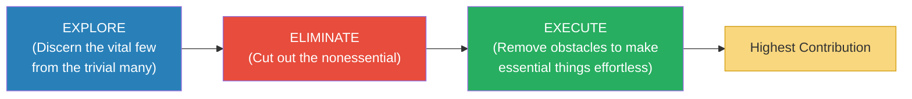
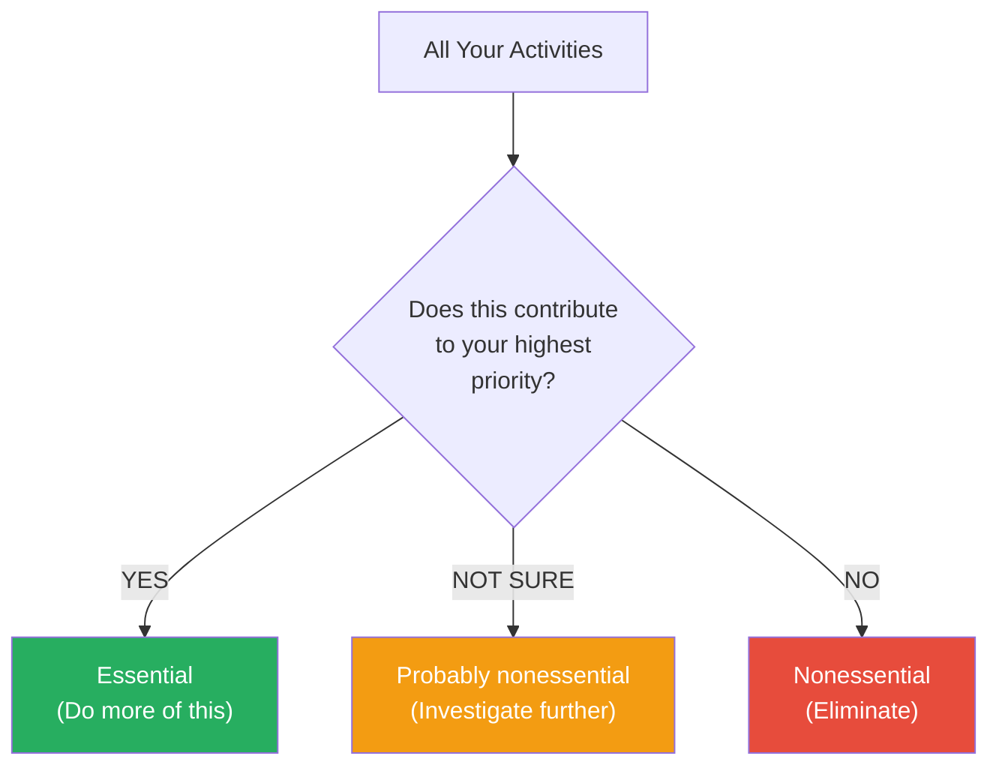
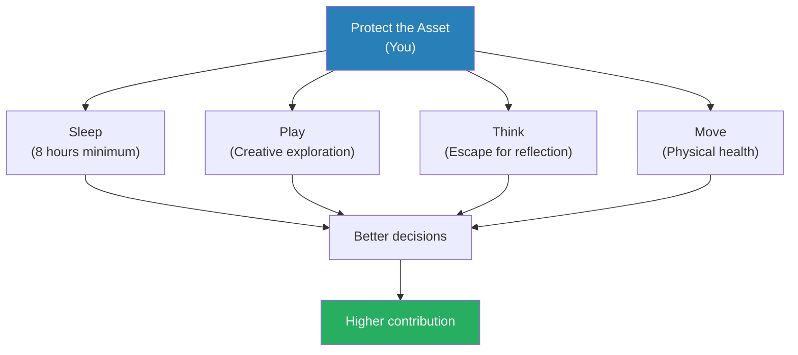
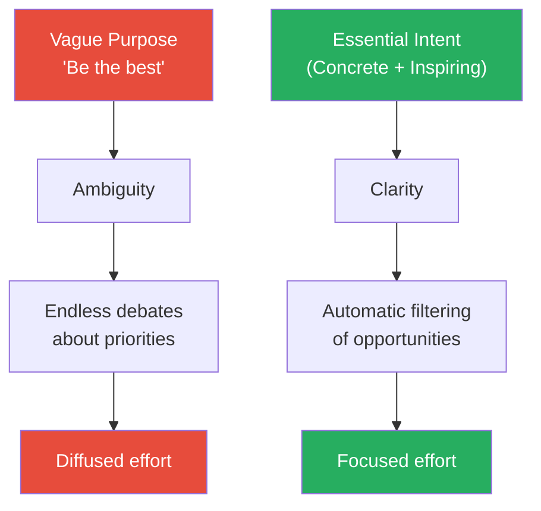
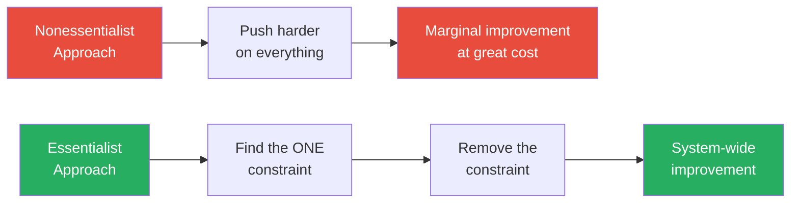
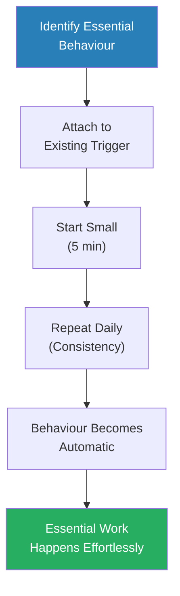
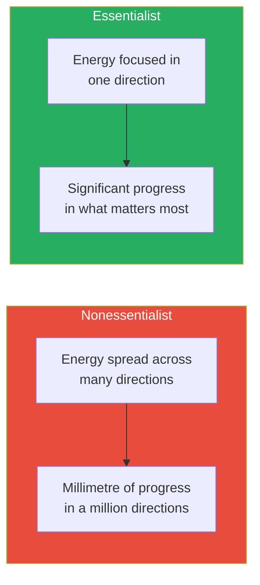
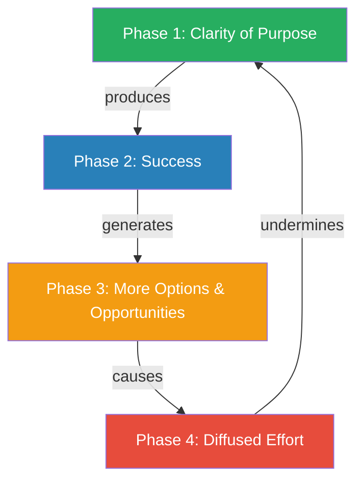

# Essentialism — Greg McKeown

> Greg McKeown's central argument can be stated in five words: if you don't prioritise your life, someone else will.
> Most successful people fall into the same trap: their success generates options and opportunities, each of which demands time and attention, until they are spread so thin that the very focus that made them successful in the first place is destroyed.
> The Essentialist's answer is not to do more, better. It is to do less, but the right things — a systematic method for discerning what is absolutely essential, then eliminating everything that is not.
> This is not a time management book. It is a thinking framework that changes what you say yes and no to.
> McKeown draws on real business cases, design philosophy, and psychology to argue that the disciplined pursuit of less is the path to the highest possible contribution.

---

## About the Author

Greg McKeown is a British-American author, public speaker, and leadership consultant who has spent his career studying why some people and organisations break through while others plateau. He studied at Stanford's Graduate School of Business and later taught a popular class there called "Designing Life, Essentially." His clients have included Apple, Google, Facebook, Salesforce, Twitter, and the World Economic Forum. The book grew from a Harvard Business Review article titled "The Disciplined Pursuit of Less," which became one of the publication's most popular and widely shared pieces. McKeown's central obsession is the question of why capable people end up stuck doing things that don't matter.

---

## The Big Idea

- <b style="color: #2980b9">Essentialism</b> is not about how to get more things done — it is about how to get the right things done
- The Nonessentialist says yes to almost everything, tries to fit it all in, and ends up spread a mile wide and an inch deep
- The Essentialist pauses, discerns what truly matters, and then makes a deliberate choice to pursue only that
- The result is not doing less for its own sake — it is <b style="color: #27ae60">making the highest possible contribution toward the things that really matter</b>

The core logic works like this:

- Almost everything is noise — only a few things are truly vital
- The relationship between effort and results is not linear — the right effort in the right place produces massively disproportionate results
- <b style="color: #e74c3c">If you don't set your own priorities, someone else will set them for you</b>
- The ability to say no to the nonessential is not a limitation — it is the very definition of strategy

McKeown organises the book into three disciplined phases:

- **Explore** — create space to discern the vital few from the trivial many
- **Eliminate** — cut out the nonessential with clarity and conviction
- **Execute** — remove obstacles so essential things happen almost effortlessly

| | Nonessentialist | Essentialist |
|--|----------------|-------------|
| **Thinks** | "I have to" / "It's all important" | "I choose to" / "Only a few things really matter" |
| **Does** | Tries to do everything | Does fewer things, better |
| **Gets** | Unfocused, overwhelmed, spread thin | Clarity, control, meaningful contribution |
| **Says yes** | By default, reactively | Only to the essential, deliberately |
| **Says no** | Rarely, and with guilt | Gracefully, frequently, without guilt |
| **Trade-offs** | Tries to avoid them | Embraces them as the essence of strategy |
| **Mindset** | "How can I fit it all in?" | "What is the ONE thing I should do?" |

This table captures the fundamental contrast that runs through every chapter of the book.


The Essentialist outperforms across every dimension — not by working harder, but by directing the same energy toward fewer, more meaningful commitments, resulting in dramatically higher focus, satisfaction, and sense of control.



The three phases are not sequential steps you complete once — they are a continuous cycle of discernment, elimination, and execution that the Essentialist practises every day.

---

## Key Concepts at a Glance

| Concept | One-line summary |
|---------|-----------------|
| **Less But Better** | The motto of Essentialism, borrowed from designer Dieter Rams |
| **The 90% Rule** | If an opportunity isn't a clear 90% "yes" on your criteria, it's a "no" |
| **Trade-offs** | Accepting trade-offs is not a weakness — it's the definition of strategy |
| **The Clarity Paradox** | Success breeds options, options breed diffusion, diffusion destroys success |
| **Protect the Asset** | You are the asset — sleep, health, and renewal are non-negotiable |
| **The Power of Graceful No** | Say no to the nonessential clearly and without guilt |
| **Routine** | Make the essential the default through habits, not willpower |
| **Buffer** | Build in time for the unexpected — plan for failure, not just success |
| **Escape** | Create space to think — without it, you cannot discern what matters |
| **Play** | Play is not trivial — it fuels exploration and creativity |
| **Uncommit** | Cut your losses on sunk costs — past investment does not justify future waste |
| **Edit** | A good editor removes — an Essentialist subtracts before adding |
| **Subtract** | Ask "What's in the way?" not "What more can I do?" |
| **Flow** | Design routines that make the essential the path of least resistance |


Each phase builds on the previous: Explore creates clarity about what matters, Eliminate removes everything that doesn't, and Execute makes the essential things happen with minimum friction — the largest blocks within each phase represent the highest-leverage tools McKeown offers.

---

## Part I: Essence — The Core Mindset

*Before learning the techniques, McKeown establishes the three foundational beliefs that separate Essentialists from everyone else.*

### Chapter 1: The Essentialist

*McKeown opens with a story that crystallises the entire book's argument — a man who succeeded by doing less, not more.*

- The book begins with the story of a young consultant who was good at everything and said yes to everything
- His managers loved his reliability, his clients loved his responsiveness, and his calendar was packed
- But the quality of his work began to slip — he was doing everything but excelling at nothing
- <b style="color: #e74c3c">He was making a millimetre of progress in a million directions</b>

> [!example] The Overcommitted Consultant
> - A talented young professional said yes to every request from colleagues and clients
> - He took on extra projects, attended every meeting, and never turned down an opportunity
> - His reputation for being helpful meant that even more requests poured in
> - Over time, the quality of his core work began declining — he had no time for deep thinking
> - He felt busy all the time but accomplished nothing of real significance
> - Only when he began systematically saying no did his career — and his satisfaction — take off
> **The lesson:** Being good at many things is not the same as being valuable. Contribution requires focus.

The Essentialist's core logic:

- <b style="color: #27ae60">Almost everything is nonessential</b> — only a few things truly matter
- The effort-to-results relationship is not linear — the right effort in the right place produces disproportionate returns
- You must actively choose where to direct your energy, or the world will choose for you
- "Less but better" is not a compromise — it is a competitive advantage

---

### Chapter 2: Choose — The Invincible Power of Choice

*McKeown argues that the ability to choose is not just a nice-to-have — it is the foundation of everything. Lose it, and nothing else in the book works.*

- The Nonessentialist has forgotten that they have a choice — they react to every demand as if it were mandatory
- <b style="color: #2980b9">Learned helplessness</b> is the psychological term for what happens when people stop believing they can choose
  - Martin Seligman's research showed that when animals (and humans) are repeatedly exposed to situations where they have no control, they eventually stop trying — even when control is restored
  - The same thing happens in organisations: people stop pushing back on unreasonable demands because they've learned that pushing back doesn't work
- The Essentialist reclaims choice as a power, not a burden
- <b style="color: #27ae60">Choice is not a thing you have — it is a thing you do</b>

> [!example] Learned Helplessness in the Workplace
> - McKeown describes professionals who have stopped believing they can say no
> - They attend meetings they know are pointless, take on projects they know are low-value, and fill their calendars with other people's priorities
> - When asked why, they say "I have to" — not "I choose to"
> - The language itself reveals the problem: "have to" strips away agency, "choose to" restores it
> - These are often the most capable people in the room — they've just forgotten they have a choice
> **The lesson:** The first step to Essentialism is reclaiming the belief that you can choose.

> [!tip] Core Insight
> The Essentialist does not ask "How can I do it all?" The Essentialist asks "What is the trade-off I want to make?" The very act of asking this question changes everything.

- The language of choice matters more than most people realise:
  - **"I have to"** implies helplessness — you are a victim of circumstances
  - **"I choose to"** implies agency — you are the author of your life
  - **"I choose not to"** is even more powerful — it acknowledges the option and deliberately declines it
  - McKeown suggests a practical exercise: for one day, replace every "I have to" with "I choose to" and notice how it changes your relationship to each activity
  - Some activities feel energising when reframed as choices — those are probably essential
  - Others feel absurd when reframed — "I choose to attend this pointless meeting" — those are probably nonessential

---

### Chapter 3: Discern — The Unimportance of Practically Everything

*Most of what we do does not matter. McKeown makes the case that the Pareto principle applies to virtually every area of life.*

- <b style="color: #2980b9">The Pareto Principle</b> (the 80/20 rule) states that roughly 80% of results come from 20% of efforts
- McKeown pushes this further: in some domains, it's more like 99/1 — an extreme minority of efforts produce the vast majority of value
- The Nonessentialist treats all tasks as equally important — every email, every meeting, every request gets the same weight
- The Essentialist recognises that <b style="color: #27ae60">certain efforts produce exponentially more results than others</b> and focuses ruthlessly on those

> [!example] Richard Koch and the 80/20 Principle
> - Richard Koch, the investor and author of *The 80/20 Principle*, discovered that a tiny fraction of his investments produced virtually all of his returns
> - He applied the same lens to his time: a small number of activities produced nearly all his happiness and professional success
> - Koch restructured his life around this insight — he stopped doing most things and poured his energy into the vital few
> - The result was not less output but dramatically more output in the areas that actually mattered
> **The lesson:** Not all effort is equal. The Essentialist identifies the few things that produce outsized results and doubles down on those.



This diagram captures the core discernment process: every activity must pass through the filter of your highest contribution.

```mermaid
quadrantChart
    title Activity Prioritisation Matrix
    x-axis Nonessential --> Essential
    y-axis Not Urgent --> Urgent
    quadrant-1 Essential & Urgent (Do Now)
    quadrant-2 Nonessential & Urgent (Delegate/Decline)
    quadrant-3 Nonessential & Not Urgent (Eliminate)
    quadrant-4 Essential & Not Urgent (Schedule & Protect)
    Deep thinking time: [0.85, 0.3]
    Strategic planning: [0.8, 0.4]
    Health and sleep: [0.9, 0.25]
    Key client crisis: [0.75, 0.9]
    Most email: [0.2, 0.6]
    Pointless meetings: [0.15, 0.55]
    Social media: [0.1, 0.15]
    Busy-work reports: [0.25, 0.35]
```

The Essentialist's insight is that the most important quadrant is the bottom-right — essential but not urgent activities like deep thinking, strategic planning, and health — yet this is precisely the quadrant that gets sacrificed first when nonessential urgencies crowd in.

---

### Chapter 4: Trade-Off — Which Problem Do I Want?

*McKeown dismantles the myth that you can have it all. Trade-offs are not a sign of failure — they are the very definition of strategy.*

- The Nonessentialist asks "How can I do both?" — the Essentialist asks "Which problem do I want?"
- <b style="color: #2980b9">A strategic trade-off</b> is not a compromise — it is a deliberate choice to be great at one thing instead of mediocre at many
- Companies and individuals who refuse to make trade-offs end up being "stuck in the middle" — they do nothing excellently
- <b style="color: #e74c3c">Trying to avoid trade-offs is itself a trade-off — you trade excellence for mediocrity across the board</b>

> [!example] Southwest Airlines — The Power of Strategic No (1971-present)
> - Southwest Airlines became the most consistently profitable airline in American history by saying NO
> - No meals, no assigned seating, no first class, no hub-and-spoke routing, no interline baggage transfers
> - Every competitor who tried to offer everything — full service, low cost, extensive routes — struggled or went bankrupt
> - Continental Airlines launched "Continental Lite" to compete with Southwest on price while maintaining its full-service model
> - Continental Lite failed spectacularly — you cannot be a low-cost carrier and a full-service airline simultaneously
> - Southwest chose one thing — low-cost, point-to-point, high-frequency travel — and did it better than anyone else on earth
> **The lesson:** Strategy is not about what you say yes to. Strategy is about what you say no to. Southwest's no's made it great.

> [!example] The Straddling Trap
> - McKeown describes companies that tried to copy Southwest's model without making Southwest's trade-offs
> - They wanted the low costs but also wanted to keep their premium lounges, assigned seating, and complex routing
> - Michael Porter, the Harvard strategist, calls this "straddling" — trying to match a competitor's advantage without making the same sacrifices
> - Every straddler failed, because you cannot optimise for two contradictory strategies simultaneously
> - The lesson applies to individuals too: you cannot be the person who does everything and the person who does the essential things brilliantly
> **The lesson:** Trade-offs are not obstacles to strategy. Trade-offs ARE strategy.

> [!tip] Core Insight
> "Which problem do I want?" is a more honest question than "How can I avoid problems?" Every choice has a cost. The Essentialist accepts this and chooses deliberately.

- The deeper psychology of trade-offs:
  - Humans have a deep aversion to loss — Kahneman and Tversky's prospect theory shows that losing something feels roughly twice as painful as gaining something of equal value
  - This means that giving up an option — even a mediocre one — triggers disproportionate pain
  - <b style="color: #e74c3c">The Nonessentialist avoids this pain by refusing to choose — but this is itself a choice, and the worst one available</b>
  - The Essentialist accepts the pain of giving up good options in exchange for the much greater reward of excelling at the essential ones
  - As Michael Porter put it: "The essence of strategy is choosing what NOT to do"

> [!example] Johnson & Johnson's Tylenol Crisis (1982)
> - In 1982, seven people in Chicago died after taking Tylenol capsules that had been laced with cyanide
> - Johnson & Johnson faced a brutal trade-off: protect short-term profits or protect the brand
> - CEO James Burke chose to recall every bottle of Tylenol in America — 31 million bottles, at a cost of over $100 million
> - Wall Street analysts said the brand was dead. Competitors rushed to fill the shelf space.
> - But by choosing decisively — prioritising safety over profit — Johnson & Johnson earned a level of public trust that competitors could not match
> - Within a year, Tylenol had regained nearly all its market share, and the recall became a textbook case of how to handle a crisis
> **The lesson:** The willingness to absorb a painful short-term trade-off can produce enormous long-term returns. Refusing to choose would have been far more costly.

---

## Part II: Explore — How to Discern the Vital Few

*The Essentialist doesn't just react to what's in front of them. They create the conditions for seeing clearly — through escape, observation, play, rest, and extreme selectivity.*

### Chapter 5: Escape — The Perks of Being Unavailable

*You cannot discern what matters if you never stop to think. McKeown argues that creating space is not a luxury — it is a prerequisite.*

- The Nonessentialist is always busy, always reachable, always reactive
- The Essentialist deliberately creates blocks of uninterrupted time for thinking — not doing, just thinking
- <b style="color: #2980b9">Escape</b> means carving out space where no one can reach you — no email, no phone, no interruptions
- This is counterintuitive in cultures that equate busyness with importance

> [!example] Bill Gates's "Think Weeks"
> - Twice a year, Bill Gates would disappear to a remote cabin for a "Think Week"
> - He brought a stack of papers and books and spent the entire time reading and thinking — no meetings, no phone calls, no visitors
> - Some of Microsoft's most important strategic decisions came out of these Think Weeks
> - Gates understood that <b style="color: #27ae60">the time you spend thinking about what to do is at least as valuable as the time you spend doing it</b>
> - In 1995, his Think Week produced the famous "Internet Tidal Wave" memo that redirected Microsoft's entire strategy toward the web
> **The lesson:** If you're too busy to think, you're too busy. Period.

> [!example] Newton's Year of Solitude (1665-1666)
> - When the Great Plague closed Cambridge University, Isaac Newton retreated to his family's farmhouse in Woolsthorpe
> - During this forced escape from the world, he developed calculus, his theory of optics, and the beginnings of his laws of motion and gravity
> - Newton later called it his "annus mirabilis" — his miracle year
> - It was not produced by hard work in a busy environment. It was produced by solitude, space, and the absence of distraction
> **The lesson:** Breakthroughs require escape. The most important work often happens when you step away from the noise.

- McKeown's practical advice for building escape into your life:
  - Schedule thinking time on your calendar — treat it as non-negotiable
  - Find a place where you will not be interrupted
  - Do not bring your phone
  - Start with even fifteen minutes of pure, unstructured thinking time
  - Gradually increase as you build the habit

> [!example] CEO Who Reads Every Morning (Jeff Weiner, LinkedIn)
> - Jeff Weiner, the former CEO of LinkedIn, blocked 90 minutes to two hours of unscheduled time on his calendar every day
> - His team initially resisted — how could the CEO of a fast-growing public company afford to "waste" two hours doing nothing?
> - Weiner explained that the time was not wasted — it was the most productive part of his day
> - Without buffer time, he was purely reactive: responding to emails, putting out fires, attending back-to-back meetings
> - With buffer time, he could think strategically, catch problems before they escalated, and make decisions from clarity rather than panic
> - He described it as "the single most important productivity tool" he had ever used
> **The lesson:** The busier you are, the more you need unscheduled time — not less. Escape is not a luxury for those with little to do; it is a survival tool for those with too much.

- The counterintuitive truth about escape:
  - The people who most need thinking time are the people who feel they least have time for it
  - <b style="color: #e74c3c">Being too busy to think is the most expensive form of busy there is</b> — you save hours but waste years by never stepping back to evaluate direction
  - Escape is not selfish or unproductive — it is the precondition for all productive action
  - Without space to think, you are operating on autopilot — and autopilot follows other people's priorities, not your own

---

### Chapter 6: Look — See What Really Matters

*Most people are too busy doing to notice what's actually happening. McKeown argues for the discipline of really looking — at the big picture, not just the immediate task.*

- The Nonessentialist hears the loudest voice and responds — the Essentialist listens for the signal beneath the noise
- <b style="color: #2980b9">Seeing what matters</b> requires slowing down and looking for the patterns beneath the surface
- Journalists are trained to find the "lead" — the one thing that matters most in a story — and ignore everything else
- The Essentialist applies the same discipline: what is the lead of my life right now? What is the ONE thing that matters most?

> [!example] The Journalist's Lead
> - McKeown describes how journalism students are taught to identify the "lead" — the single most important element of a story
> - Their teacher gave them a set of facts about a school event and asked them to write the lead
> - Most students wrote about what happened — the event details, the speakers, the schedule
> - The real lead was that there would be no school on Thursday — the fact that actually mattered to the audience
> - The lesson: most of us are so busy recording the details that we miss the point
> **The lesson:** Look for the lead in your own life. What is the one thing that actually matters right now? Everything else is detail.

- How to develop the discipline of looking:
  - Keep a journal — not for feelings, but for patterns
  - Review your journal regularly and ask: what themes keep appearing?
  - When you feel overwhelmed, step back and ask: what is the lead here?
  - Listen for what is NOT being said — the important things are often unstated
  - <b style="color: #27ae60">Scan broadly before you dive deep</b> — the Essentialist explores widely before committing narrowly

> [!example] The Dying Girl's Mother — Seeing What Matters
> - McKeown shares the story of a friend whose daughter was diagnosed with a terminal illness
> - In the midst of her grief, the mother suddenly saw her entire life with total clarity
> - Every obligation that had seemed urgent — the volunteer committees, the social events, the extra projects — fell away instantly
> - What remained was obvious: time with her daughter, her family, and nothing else
> - She described the experience as painful but strangely freeing — for the first time, she had absolute clarity about what mattered
> - McKeown uses this story not to be morbid but to ask: why do we wait for tragedy to see clearly?
> **The lesson:** Clarity about what matters should not require a crisis. The Essentialist practises seeing the lead every day — so that when pressure comes, the answer is already clear.

- The difference between looking and seeing:
  - **Looking** is passive — scanning emails, attending meetings, consuming information
  - **Seeing** is active — asking "what is the pattern here?" and "what does this actually mean?"
  - The Nonessentialist looks at a hundred data points and tries to respond to all of them
  - The Essentialist sees the one trend that actually matters and acts on that
  - <b style="color: #2980b9">Signal-to-noise ratio</b> is the Essentialist's mental model: most of what we encounter is noise, and the discipline is learning to filter for signal

---

### Chapter 7: Play — Embrace the Wisdom of Your Inner Child

*Play is not frivolous. McKeown argues it is one of the most powerful tools for discovering what is essential.*

- The Nonessentialist sees play as a waste of time — the Essentialist sees it as an essential tool for exploration
- <b style="color: #2980b9">Play</b> broadens the range of options available to you by stimulating parts of the brain that analytical thinking cannot reach
- Stuart Brown, a psychiatrist who has studied play for decades, found that play is not just beneficial for children — it is essential for adults
  - Play stimulates creativity and exploration
  - Play reduces stress and improves brain function
  - Play is how humans (and many animals) discover new possibilities
- <b style="color: #27ae60">Play is the antidote to the narrowing that comes from being too focused on productivity</b>

> [!example] Stuart Brown's Research on Play Deprivation
> - Stuart Brown studied the backgrounds of murderers in Texas prisons and found a startling common factor: virtually all of them had experienced severe play deprivation in childhood
> - This led him to spend decades researching the role of play in healthy human development
> - He found that play is not a luxury — it is a biological necessity for the brain
> - Adults who stop playing become rigid, stressed, and less creative
> - Companies like Google and Pixar that build play into their culture consistently produce more innovative work
> **The lesson:** Play is not the opposite of productivity. It is the fuel for it.

---

### Chapter 8: Sleep — Protect the Asset

*McKeown argues that the most important asset you need to protect is yourself — and sleep is the foundation of that protection.*

- The Nonessentialist sees sleep as a luxury, something to sacrifice for productivity
- The Essentialist sees sleep as a priority — one of the best investments you can make in your ability to contribute
- <b style="color: #e74c3c">Sleep deprivation is not a badge of honour — it is a form of self-sabotage</b>
- Research shows that sleep deprivation damages:
  - Decision-making ability
  - Creative problem-solving
  - Emotional regulation
  - Physical health and immune function
  - The ability to discern what is essential from what is not

> [!example] Jeff Bezos on Sleep
> - Jeff Bezos, founder of Amazon, has publicly stated that he prioritises eight hours of sleep per night
> - His reasoning: "I make a small number of key decisions, and I want to make them with a clear head"
> - Bezos recognises that the quality of his thinking — not the quantity of his hours — is what drives Amazon's success
> - He would rather make three excellent decisions than eight mediocre ones
> **The lesson:** The best way to protect your ability to think clearly is to protect your sleep.

> [!example] Violinists and Sleep — Anders Ericsson's Research
> - K. Anders Ericsson, the psychologist famous for the "10,000 hours" research on deliberate practice, found something surprising
> - The best violinists at the Berlin Academy of Music practised more deliberately than their peers — but they also slept significantly more
> - The top performers averaged 8.6 hours of sleep per night, compared to 7.8 hours for the less accomplished
> - They also napped more frequently — an average of 2.8 hours of napping per week
> - The relationship between sleep and performance was not incidental — sleep was part of how they consolidated what they'd practised
> **The lesson:** Peak performers do not sacrifice sleep for more work. They use sleep as a performance tool.

> [!tip] Core Insight
> Protecting the asset means treating yourself as the foundation on which everything else depends. If you burn out, nothing else matters. Sleep, exercise, and renewal are not selfish — they are strategic.



All four elements of self-protection feed into better decision-making, which feeds into higher contribution. This is the Essentialist's virtuous cycle.

---

### Chapter 9: Select — The Power of Extreme Criteria

*The most powerful tool in the Essentialist's kit: the 90% Rule. McKeown shows how applying extreme selectivity transforms decision-making.*

- The Nonessentialist accepts every opportunity that is "pretty good" or "decent" — and ends up with a life full of decent-but-unremarkable commitments
- The Essentialist applies <b style="color: #2980b9">the 90% Rule</b>: when evaluating an opportunity, rate it on a scale of 0-100 on your most important criterion
  - If it scores below 90, it is automatically a no
  - This forces you to trade up — to say no to good opportunities so you can say yes to great ones
- <b style="color: #27ae60">If it isn't a clear YES, then it is a clear NO</b>

> [!abstract] The 90% Rule — How to Apply It
> 1. Identify the single most important criterion for the decision (e.g., "Does this advance my most important project?")
> 2. Rate the opportunity on a scale of 0-100 against that criterion
> 3. If it scores below 90, it is an automatic no — no negotiation, no "let me think about it"
> 4. If it scores 90 or above, consider it seriously
> 5. Apply this to meeting invitations, project requests, social commitments, and every other demand on your time

- The psychology behind the 90% Rule:
  - Most people use a much lower threshold — anything above 50 or 60 gets a yes
  - This means their calendars fill up with 60% and 70% activities, leaving no room for the 95% opportunities when they arrive
  - <b style="color: #e74c3c">By saying yes to everything above average, you guarantee that your life will be average</b>
  - The 90% Rule creates space — literal calendar space — for the exceptional

> [!example] The Closet Metaphor
> - McKeown uses the analogy of cleaning out your closet
> - Most people go through their clothes and ask "Is there a chance I might wear this someday?" — the answer is almost always yes, and the closet stays full
> - The Essentialist asks "Do I absolutely love this? Does it look great on me? Do I wear it regularly?"
> - If the answer isn't a clear yes on all three, the item goes
> - Apply the same standard to your commitments: if it's not a clear "I love this and it's essential," it goes
> **The lesson:** The 90% Rule is a closet clean-out for your life. Keep only what you truly value.

> [!abstract] The Selective Criteria Method
> 1. Write down the opportunity you are considering
> 2. List three minimum criteria it MUST meet (these are non-negotiable)
> 3. List three ideal criteria you would LOVE it to meet
> 4. The opportunity must pass ALL three minimum criteria AND at least two of three ideal criteria
> 5. If it doesn't, say no — no matter how tempting it looks on the surface

This method is more structured than the 90% Rule and works well for larger decisions like job offers, projects, and long-term commitments.

- The emotional challenge of extreme selectivity:
  - The 90% Rule feels wasteful — you are deliberately saying no to opportunities that are genuinely good
  - This triggers loss aversion and fear of missing out (FOMO)
  - McKeown's response: <b style="color: #27ae60">the cost of saying yes to a 70% opportunity is not just the time it takes — it is the 95% opportunity you will have to turn down because your calendar is already full</b>
  - The Essentialist plays a long game: they endure short-term emptiness (turning down the good) in exchange for long-term fullness (being available for the great)
  - Over time, the quality of what fills your life rises dramatically — because you only accept the exceptional

> [!example] Warren Buffett's Two-List Strategy
> - Warren Buffett allegedly advised his personal pilot, Mike Flint, to make a list of his top 25 career goals
> - Then Buffett told him to circle the top 5
> - Flint assumed the remaining 20 would become a secondary priority list — things to work on in spare time
> - Buffett's response: "No. Those are your 'avoid at all costs' list. They are the things that are attractive enough to steal your attention but not important enough to deserve it."
> - The 20 items on the B-list are more dangerous than obviously bad ideas — because they are genuinely appealing, which makes them harder to resist
> **The lesson:** The biggest threat to the essential is not the obviously nonessential — it is the almost-essential. The good is the enemy of the great.

---

## Part III: Eliminate — How to Cut Out the Trivial Many

*Once you've identified what matters, the next discipline is removing what doesn't. This is where most people fail — they can see what's essential but cannot bring themselves to eliminate the rest.*

### Chapter 10: Clarify — One Decision That Makes a Thousand

*Vague purpose leads to diffuse action. McKeown argues that a clear, specific essential intent eliminates the need for thousands of smaller decisions.*

- <b style="color: #2980b9">Essential Intent</b> is McKeown's term for a purpose statement that is both concrete and inspirational
- It is not a vague mission statement ("We strive to be the best") — it is a specific, measurable, time-bound declaration of what you will accomplish
- A good essential intent is so clear that it makes a thousand subsequent decisions for you automatically
  - Every request, opportunity, or distraction can be evaluated against it
  - If it doesn't advance the essential intent, the answer is no — without agonising

| Type of Statement | Example | Problem |
|---|---|---|
| **Vague vision** | "To be the best in our industry" | Too abstract to guide daily decisions |
| **Generic values** | "We value innovation, teamwork, and excellence" | Could describe any company on earth |
| **Quarterly goals** | "Increase revenue by 12% in Q3" | Too narrow — doesn't connect to deeper purpose |
| **Essential Intent** | "Get every student reading at grade level by end of year" | Concrete, inspiring, and actionable |

The essential intent should sit in the sweet spot between too vague and too narrow — general enough to be inspiring but specific enough to be actionable.

> [!example] Martha Lane Fox and the Government Digital Service (2010s)
> - When Martha Lane Fox was asked to review the UK government's digital strategy, she distilled her essential intent into a single sentence: "Digital by default"
> - This was concrete enough to guide thousands of subsequent decisions — every government service should be available online first, with offline as the backup
> - It immediately clarified what to fund, what to cut, and what to redesign
> - A vague intent like "improve government services" would have led to endless debate; "digital by default" cut through the noise
> **The lesson:** Clarity of intent is a force multiplier. One clear decision eliminates the need for a thousand smaller ones.

> [!example] Brad Pitt and the Make It Right Foundation (2007)
> - After Hurricane Katrina devastated New Orleans, Brad Pitt founded the Make It Right Foundation
> - Rather than a vague mission to "help New Orleans," he set a specific essential intent: build 150 affordable, green, storm-resistant homes in the Lower Ninth Ward
> - This specificity — 150 homes, affordable, green, storm-resistant, in a specific neighbourhood — made every subsequent decision obvious
> - What materials? Green ones. What neighbourhood? Lower Ninth Ward. How many? 150. How much? Affordable.
> **The lesson:** The more specific your essential intent, the easier every subsequent decision becomes.



The left path is the Nonessentialist trap — vague purpose produces ambiguity, which produces diffusion. The right path is the Essentialist advantage — concrete intent produces clarity, which produces focus.

---

### Chapter 11: Dare — The Power of a Graceful No

*Saying no is the hardest skill in Essentialism — and the most important. McKeown provides both the psychology and the tactics.*

- Most people say yes by default because:
  - They want to be liked
  - They fear conflict or confrontation
  - They feel obligated by social pressure
  - They confuse "I can help" with "I should help"
  - They are conditioned by <b style="color: #2980b9">the sunk cost fallacy</b> — they've already invested time, so they feel they must continue
- <b style="color: #27ae60">The Essentialist separates the decision from the relationship</b> — you are saying no to the request, not to the person
- A clear, respectful no is better than a vague, resentful yes

> [!abstract] Eight Ways to Say No Gracefully
> 1. **The awkward pause.** When asked, simply pause and count to three before responding. The silence creates space.
> 2. **The soft "no" (or "no, but").** "I can't do this, but here's what I can do..."
> 3. **"Let me check my calendar."** Buys time and avoids the default yes.
> 4. **The email auto-reply.** Use auto-responders to set expectations about your availability.
> 5. **"What should I deprioritise?"** When a boss adds work, ask what to remove. Forces them to make the trade-off.
> 6. **Humour.** "I'd love to, but I'm overcommitted to the point of absurdity already."
> 7. **"You're welcome to use X."** Offer a resource instead of your time.
> 8. **"I can't, but X might be able to help."** Redirect to someone better positioned.

> [!example] Peter Drucker's Polite Refusals
> - Peter Drucker, the legendary management thinker, was famous for his graceful but firm no's
> - When asked to attend a conference or serve on a committee, he would decline politely: "I am greatly honoured and flattered, but I am not able to take this on"
> - He did not explain, justify, or apologise at length — he simply declined
> - Drucker understood that every yes to one thing was a no to something else — often something more important
> - His productivity and intellectual output were legendary precisely because he protected his time so fiercely
> **The lesson:** The most productive people in the world are also the most willing to say no. These two facts are not coincidental.

> [!example] Rosa Parks — The Power of No (1955)
> - On December 1, 1955, Rosa Parks refused to give up her bus seat to a white passenger in Montgomery, Alabama
> - Her "no" was not impulsive — it was the product of years of conviction about what was right
> - That single no ignited the Montgomery Bus Boycott and became a catalyst for the American civil rights movement
> - McKeown uses this example to illustrate that <b style="color: #27ae60">saying no at the right moment, for the right reason, can change everything</b>
> **The lesson:** A well-placed no is one of the most powerful acts a person can take.

- The cost of not saying no:
  - Every nonessential yes crowds out something essential
  - Resentment builds — you end up resenting the person you said yes to, which damages the very relationship you were trying to protect
  - <b style="color: #e74c3c">The short-term discomfort of saying no is always less than the long-term cost of saying yes to the wrong things</b>
  - The relationship cost of resentment is far greater than the relationship cost of a respectful no
  - People who say no clearly and gracefully are actually trusted more, not less — because their yes means something

- McKeown makes an important distinction between two types of no:
  - **The reactive no** — blurted out in frustration or overwhelm, often harsh or defensive
  - **The proactive no** — planned in advance, delivered gracefully, rooted in clarity about priorities
  - The Essentialist practises the proactive no — they know before the request arrives that certain categories of requests will receive a no
  - This advance decision makes the actual moment of saying no much easier — the deliberation happened beforehand

---

### Chapter 12: Uncommit — Win Big by Cutting Your Losses

*The sunk cost fallacy keeps us trapped in commitments we should have abandoned long ago. McKeown teaches how to cut losses without guilt.*

- <b style="color: #2980b9">The sunk cost fallacy</b> is the tendency to continue investing in something because of what you've already invested, rather than evaluating it on its future value
- This is one of the most powerful psychological traps keeping people stuck in nonessential commitments
- The Essentialist asks: "If I weren't already invested in this, would I start it now?"
  - If the answer is no, the commitment should be dropped — regardless of past investment

> [!example] The Concorde Fallacy
> - The British and French governments invested billions in the Concorde supersonic jet
> - It became clear early on that the project would never be commercially viable
> - But both governments continued pouring money in — because they had already invested so much
> - The project became a textbook example of sunk cost thinking: past investment justifying future waste
> - Economists now call irrational continuation of failing projects the "Concorde fallacy"
> **The lesson:** "We've come too far to stop" is almost always wrong. The question is not how much you've invested. The question is whether the future return justifies the future cost.

- McKeown's strategies for overcoming the sunk cost fallacy:
  - **Zero-based budgeting** — instead of adjusting last year's budget, start from zero and justify every line item fresh
  - Apply the same logic to your commitments: don't ask "should I continue?" — ask "if I had to start from scratch, would I choose this?"
  - **Get a neutral second opinion** — someone who isn't emotionally invested can see clearly what you cannot
  - <b style="color: #27ae60">Admit failure early</b> — the earlier you cut a losing commitment, the less total loss you absorb

> [!abstract] The Reverse Pilot — Testing What to Cut
> 1. Identify a commitment or activity you suspect is nonessential
> 2. Quietly stop doing it for a trial period — don't announce it, just stop
> 3. Wait and observe: does anyone notice? Does anything break? Does the world end?
> 4. If no one notices and nothing breaks, you have your answer — eliminate it permanently
> 5. If someone notices and it genuinely matters, you can always resume — but you'll be surprised how rarely this happens

- The reverse pilot is McKeown's most practical uncommitting tool:
  - Most people overestimate how much their contributions are noticed — the ego inflates the importance of everything we do
  - A reverse pilot tests reality against assumption without risk
  - <b style="color: #2980b9">You would be astonished how many commitments you can simply stop — and nobody cares</b>
  - The meetings nobody misses, the reports nobody reads, the processes nobody uses — they persist only because nobody has tested whether they matter

> [!tip] Core Insight
> Every present commitment was a past decision. If that decision no longer makes sense, continuing is not "honouring your commitment" — it is compounding your mistake.

---

### Chapter 13: Edit — The Invisible Art

*A great editor does not add — a great editor removes. McKeown argues that the Essentialist is an editor of their own life.*

- <b style="color: #2980b9">Editing</b> is the discipline of cutting, condensing, and correcting
- The best editors make a work better by removing what is unnecessary — not by adding more
- In life, the same principle applies: your highest contribution often comes from what you stop doing, not what you start doing

> [!example] Dieter Rams and "Less But Better" (Braun, 1960s-1990s)
> - Dieter Rams, the legendary German industrial designer, spent decades at Braun designing products that were ruthlessly simple
> - His design philosophy could be summarised in three German words: "Weniger, aber besser" — less, but better
> - Every Braun product was stripped to its essence — no unnecessary buttons, no decorative elements, no features that didn't serve the core function
> - Rams's designs directly influenced Jony Ive and the design philosophy of Apple — the clean lines, the simplicity, the absence of clutter
> - McKeown adopted "less but better" as the motto of Essentialism itself
> **The lesson:** The mark of great design — and a great life — is not what you add. It is what you have the courage to remove.

- The four principles of editing applied to life:
  - **Cut** — remove activities that do not contribute to your essential intent
  - **Condense** — do the essential things in the most efficient way possible
  - **Correct** — adjust course when you notice you've drifted from the essential
  - **Edit less** — not every moment needs to be optimised; sometimes the best edit is restraint

| Editing Principle | In Writing | In Life |
|---|---|---|
| **Cut** | Remove unnecessary paragraphs | Drop commitments that don't serve your essential intent |
| **Condense** | Say the same thing in fewer words | Achieve the same result with less effort and time |
| **Correct** | Fix errors and inconsistencies | Realign when you notice drift from the essential |
| **Edit less** | Know when to stop editing | Know when restraint is better than optimisation |

The parallel between editing and life design is not just a metaphor — it is the operating method. The Essentialist is a lifelong editor.

> [!example] Stephen King on "Kill Your Darlings"
> - Stephen King, in his memoir *On Writing*, advises authors to "kill your darlings" — to cut the passages you are most proud of if they don't serve the story
> - The reason is that attachment to a beautiful sentence blinds you to whether it actually belongs
> - McKeown applies the same principle to life: the commitments you are most proud of — the prestigious board seat, the flattering invitation, the passion project — may be exactly the ones you need to cut
> - Attachment to an activity because it makes you feel important is not the same as that activity being essential
> **The lesson:** The hardest things to cut are the things you love most but that no longer serve your essential purpose. That is precisely why they must be cut.

---

### Chapter 14: Limit — The Freedom of Setting Boundaries

*Boundaries are not limitations — they are liberations. McKeown argues that clear boundaries protect what matters most.*

- The Nonessentialist sees boundaries as restrictive — the Essentialist sees them as enabling
- <b style="color: #27ae60">Boundaries protect your time and energy for the things that matter most</b>
- Without boundaries, other people's priorities will always crowd out your own
- Setting boundaries proactively is far easier than trying to enforce them reactively

> [!example] The CEO Who Set Boundaries
> - McKeown describes a technology executive who was constantly interrupted by colleagues popping into his office
> - He had an open-door policy because he wanted to be seen as approachable
> - But the constant interruptions made it impossible to do his most important work
> - He established clear boundaries: a "thinking time" block each morning when his door was closed, and an "open office" block each afternoon
> - His team quickly adapted — and both his productivity and his availability improved
> **The lesson:** Boundaries do not make you less available. They make you more available for the things that matter.

- Practical boundary-setting strategies:
  - Establish "office hours" for meetings and interruptions — protect the rest
  - Set clear expectations about response times for email and messages
  - Learn to distinguish between truly urgent requests and merely loud ones
  - <b style="color: #e74c3c">Remember: if you don't set your boundaries, someone else will set them for you</b>

> [!example] The Family Who Set Technology Boundaries
> - McKeown describes a family that was losing evenings and weekends to constant device use — every member on a phone or laptop, nominally together but actually apart
> - They established a simple boundary: no devices at dinner, and all screens off by 9pm on weeknights
> - The first week was uncomfortable — withdrawal from the constant stimulation was real
> - By the third week, dinner conversations were longer, the children were reading more, and the parents reported feeling less stressed
> - The boundary did not reduce their access to technology — it channelled it, creating protected space for what mattered
> **The lesson:** Boundaries feel restrictive in the moment but liberating over time. They protect the essential from the endless demands of the nonessential.

- The deeper psychology of boundaries:
  - People who lack boundaries often believe that being always available makes them indispensable
  - In reality, being always available makes you always interruptible — which makes you always distracted
  - <b style="color: #27ae60">Boundaries communicate to others what you value — and people respect what you protect</b>
  - The initial discomfort of setting a boundary is temporary; the clarity it creates is permanent

---

## Part IV: Execute — How to Make the Essential Effortless

*Knowing what's essential and having the courage to say no are necessary but not sufficient. The final discipline is making execution of the essential as smooth and frictionless as possible.*

### Chapter 15: Buffer — The Unfair Advantage

*Most people plan for the best case. Essentialists plan for the worst — and thereby gain an unfair advantage over reality.*

- <b style="color: #2980b9">Buffers</b> are extra time, resources, or capacity built into plans to account for the unexpected
- The Nonessentialist plans assuming everything will go perfectly — and is perpetually surprised when it doesn't
- The Essentialist builds in buffer time so that when things go wrong (and they will), the essential work is protected
- <b style="color: #27ae60">Plan for the scenario you hope won't happen, and you'll be ready for whatever does</b>

> [!abstract] Building Effective Buffers
> 1. Add 50% to your time estimates — if you think something will take two hours, block three
> 2. Build slack into your schedule — back-to-back meetings leave no room for the unexpected
> 3. Prepare for three scenarios: best case, worst case, and most likely case — then plan for the worst
> 4. Keep a "buffer fund" of uncommitted time each week — at least 20% of your schedule should be unplanned
> 5. Start projects earlier than you think necessary — early starts are the cheapest buffer available

> [!example] The Planning Fallacy — Daniel Kahneman's Research
> - Daniel Kahneman and Amos Tversky documented the "planning fallacy" — people's systematic tendency to underestimate the time, cost, and risks of future actions
> - In one study, students estimated their thesis completion dates under both optimistic and realistic scenarios
> - Only 30% finished by their "realistic" estimate — and only 45% finished by their "worst case" estimate
> - Even when people tried to account for things going wrong, they still underestimated how wrong things could go
> - McKeown argues that buffers are the only reliable antidote to the planning fallacy
> **The lesson:** Your "realistic" estimate is almost certainly too optimistic. Add buffer, then add more.

> [!example] The Sydney Opera House (1959-1973)
> - The Sydney Opera House was originally estimated to take four years and cost $7 million
> - It took sixteen years and cost $102 million — more than fourteen times the original budget
> - The architects and planners were not incompetent — they were simply subject to the same planning fallacy that affects everyone
> - Complex projects with many unknowns are the most vulnerable to underestimation — and nearly every meaningful project is complex
> - McKeown uses this as a cautionary tale: if the best architects in the world can miss by a factor of fourteen, what makes you think your project estimates are accurate?
> **The lesson:** The planning fallacy is not a bug in human thinking — it is a feature. Your brain systematically underestimates difficulty. Buffers are the correction.

- Why most people resist building buffers:
  - Buffers feel like "wasted" time — unused buffer time looks like slack, not strategy
  - In organisations, having buffer time on your calendar can look like you're not busy enough
  - <b style="color: #e74c3c">But the cost of no buffer is far higher than the cost of unused buffer</b> — one unexpected crisis can derail an entire week if there's no slack in the system
  - The Essentialist reframes buffer not as wasted time but as insurance — a small, regular investment that prevents catastrophic loss

---

### Chapter 16: Subtract — Bring Forth More by Removing Obstacles

*The Nonessentialist asks "What else can I add?" The Essentialist asks "What's getting in the way?" Removing obstacles is often more powerful than adding effort.*

- <b style="color: #2980b9">Subtraction</b> is the discipline of identifying the obstacles that stand between you and the essential work, and then removing them
- This is counterintuitive — most people's instinct when progress stalls is to do more, add more, push harder
- The Essentialist's instinct is to ask: what is the constraint? What is the one thing that, if removed, would make everything else easier?
- This is related to <b style="color: #2980b9">the Theory of Constraints</b> — the idea that every system has one bottleneck, and improving anything other than the bottleneck is waste

> [!example] The Boy Scouts and the Slowest Hiker
> - McKeown uses the story of a Boy Scout troop on a hike to illustrate constraint theory
> - The troop was spread out over a mile of trail — the fastest hikers were far ahead, the slowest far behind
> - The scoutmaster realised that the speed of the entire troop was determined by the speed of the slowest hiker
> - Instead of telling the fast hikers to go even faster, he moved the slowest hiker to the front and redistributed weight from his pack
> - The entire group sped up — because the constraint had been addressed
> **The lesson:** Find the slowest hiker — the one constraint holding everything back — and address that. Pushing harder on everything else is wasted effort.



The Nonessentialist spreads effort across everything and gets marginal gains. The Essentialist concentrates effort on the one bottleneck and gets system-wide improvement.

- How to identify the constraint:
  - Ask: "What is the obstacle that, if removed, would make the biggest difference?"
  - Look for what is slowing down your most important work — not what is loudest
  - Often the constraint is not where you expect: it might be a missing piece of information, an unresolved decision, or a process step that creates friction
  - <b style="color: #27ae60">Remove the obstacle before adding more effort</b>

---

### Chapter 17: Progress — The Power of Small Wins

*Big, ambitious goals are motivating in theory but paralysing in practice. McKeown argues that small, visible wins create momentum far more reliably than grand plans.*

- The Nonessentialist sets ambitious goals and then gets overwhelmed by the gap between where they are and where they want to be
- The Essentialist starts small — ridiculously small — and builds momentum through <b style="color: #2980b9">small wins</b>
- <b style="color: #27ae60">Done is better than perfect. Starting is better than planning. Small is better than stalled.</b>
- Research on motivation shows that progress — even small, incremental progress — is the single most powerful motivator of ongoing effort

> [!example] The Police Departments and Small Wins — Karl Weick's Research
> - Karl Weick, the organisational psychologist, studied how governments tackled massive social problems
> - He found that framing issues as "serious problems requiring major solutions" actually paralysed action — the problems felt too big to solve
> - When the same issues were reframed as a series of "small, achievable wins," people took action and made progress
> - Police departments that focused on reducing one specific type of crime in one specific neighbourhood made more total progress than departments that tried to reduce all crime everywhere
> - The small wins built momentum, confidence, and public support — which enabled bigger wins later
> **The lesson:** Big problems are solved by small wins, not grand strategies. Start with what you can do today.

> [!example] Teresa Amabile's Progress Principle (Harvard)
> - Teresa Amabile, a Harvard Business School professor, studied what motivates people at work
> - After analysing 12,000 daily journal entries from 238 workers across seven companies, she found a clear winner
> - The single most powerful motivator was not money, recognition, or incentives — it was making progress on meaningful work
> - Even small progress — a tiny step forward on a project that mattered — dramatically boosted motivation and engagement
> - Conversely, setbacks on meaningful work were the single most demotivating event
> **The lesson:** Design your work for daily visible progress. The feeling of moving forward is what sustains effort over the long term.

> [!abstract] The Minimum Viable Progress Method
> 1. Identify the most important thing you need to accomplish
> 2. Ask: "What is the smallest amount of progress I can make right now?"
> 3. Do that smallest thing — even if it takes only five minutes
> 4. Celebrate the completion — acknowledge the progress, however small
> 5. Repeat — each small win builds momentum for the next

- The relationship between small wins and motivation forms a virtuous cycle:
  - Small win → feeling of progress → increased motivation → next small win → more progress
  - <b style="color: #27ae60">You do not need motivation to start — you need a start to create motivation</b>
  - This is why McKeown advises starting with something "ridiculously small" — the barrier to entry must be so low that you cannot talk yourself out of it
  - Write one sentence. Send one email. Read one page. Do one push-up.
  - The action itself generates the energy for the next action

> [!tip] Core Insight
> The Nonessentialist tries to go big and gets paralysed. The Essentialist starts small and builds momentum. Progress is the best motivator — not plans, not goals, not inspiration. Just progress.

---

### Chapter 18: Flow — The Genius of Routine

*Willpower is a finite resource. The Essentialist does not rely on willpower — they build routines that make essential behaviour automatic.*

- <b style="color: #2980b9">Routine</b> is the Essentialist's secret weapon for execution
- The reason most people fail to do the essential things consistently is that they rely on willpower and motivation — both of which are unreliable
- The Essentialist designs routines that make the essential the path of least resistance
- <b style="color: #27ae60">The right routine makes the essential thing the default — it happens without conscious effort</b>

> [!example] Michael Phelps and the "Videotape" Routine
> - Michael Phelps's coach, Bob Bowman, built an elaborate pre-race routine for the swimmer
> - Every night before a race, Phelps would "watch the videotape" — a mental rehearsal of the perfect race, stroke by stroke
> - Every morning, he would "play the videotape" again
> - By race day, Phelps had mentally rehearsed his performance hundreds of times
> - At the 2008 Beijing Olympics, Phelps's goggles filled with water during the 200m butterfly — he couldn't see the wall
> - But the routine was so deeply ingrained that he swam the race from muscle memory, hitting his stroke count perfectly, and won the gold medal
> **The lesson:** Routine removes the need for conscious decision-making in the moment. The work is done in advance, through repetition.

> [!example] Jack Dorsey's Themed Days (Twitter/Square)
> - Jack Dorsey, when running both Twitter and Square simultaneously, organised his weeks by theme
> - Monday: management and operations. Tuesday: product. Wednesday: marketing. Thursday: partnerships. Friday: company culture
> - This routine eliminated the daily decision of "What should I focus on?" — the theme was preset
> - Each day had a clear purpose, reducing context-switching and decision fatigue
> **The lesson:** Themed routines eliminate the cognitive overhead of choosing what to focus on. The decision is made once and executed automatically.

- How to build Essentialist routines:
  - Identify the essential activities that produce disproportionate results
  - Attach them to existing habits (habit stacking)
  - Do them at the same time each day — consistency builds automaticity
  - Start small — a five-minute routine that you actually do beats an hour-long routine you abandon
  - <b style="color: #e74c3c">Do not rely on motivation or willpower</b> — they are too unreliable to sustain essential behaviour



The path from intention to effortless execution runs through routine — not through motivation.

---

### Chapter 19: Focus — What's Important Now?

*The Essentialist is present. McKeown argues that the ability to focus on the present moment — what is important NOW — is the final execution discipline.*

- The Nonessentialist is mentally scattered — worrying about the past, anxious about the future, distracted by the irrelevant
- The Essentialist focuses on <b style="color: #2980b9">What's Important Now (WIN)</b> — the single most important thing in this moment
- This is not about having a master plan — it is about being fully present with whatever you're doing right now
- <b style="color: #27ae60">The future is a series of present moments. Win each one, and the future takes care of itself.</b>

> [!example] Larry Gelwix and "What's Important Now" (Highland Rugby)
> - Larry Gelwix coached the Highland High School rugby team to an astounding record: 418 wins, 10 losses over 36 years
> - His coaching philosophy centred on a single question: "What's Important Now?"
> - He taught his players to ask "WIN?" before every play, every practice, every moment
> - The question kept them focused on the present — not the last mistake, not the final score, just the next action
> - Gelwix believed that a team that wins each moment wins the game — you cannot control the outcome, only the current play
> **The lesson:** Stop worrying about the end result. Focus entirely on what matters right now. Stack enough "right now" moments together, and the result follows.

- The practice of focus:
  - When you feel scattered, stop and ask: "What is the most important thing I can do RIGHT NOW?"
  - Do not multitask — research consistently shows that multitasking is a myth; what people call multitasking is rapid task-switching, which reduces the quality of everything
  - Be present with the person in front of you, the task at hand, the decision you're making
  - <b style="color: #e74c3c">Worrying about the future and ruminating about the past both steal energy from the present — the only place where action is possible</b>

---

### Chapter 20: Be — The Essentialist Life

*The final chapter is McKeown's case that Essentialism is not a productivity technique — it is a way of being. It changes not just what you do, but who you are.*

- Essentialism is not something you do once — it is a discipline you practise every day
- The more you practise it, the more natural it becomes — the first no is the hardest; the hundredth is easy
- The payoff is not just productivity but clarity, purpose, and the feeling of living a life that is truly your own

> [!tip] Core Insight
> Essentialism is not about getting more done. It is about living a life that is aligned with what actually matters to you. The Essentialist doesn't just manage their time — they design their life.

- The Essentialist life looks different from the outside:
  - Fewer commitments, but deeper engagement with each one
  - More white space on the calendar, but more meaningful work in the hours that are filled
  - More no's to others, but more yes's to what matters most
  - Less speed, more velocity — movement in a single direction, rather than motion in many



This final diagram captures the book's entire argument in one image: the same amount of energy, directed differently, produces dramatically different results.

- McKeown's closing argument is deeply personal:
  - He shares the story of his own wake-up call — the day his daughter was born, and he went to a client meeting instead of staying at the hospital
  - His client was impressed by his "dedication" — but McKeown felt hollow
  - He had prioritised a client's approval over the birth of his child — and the client would have understood if he'd said no
  - <b style="color: #e74c3c">The worst thing about saying yes to the nonessential is not the time it costs — it is the life it steals</b>
  - This is the emotional core of the entire book: Essentialism is not a productivity hack. It is a way of reclaiming your life from the tyranny of other people's agendas.

> [!example] McKeown's Daughter's Birth — The Moment That Changed Everything
> - When McKeown's daughter was born, a colleague asked him to attend a client meeting the very same day
> - Instead of saying no — which would have been completely understandable — McKeown said yes
> - He left the hospital, attended the meeting, and returned feeling deeply wrong about his choice
> - The client was appreciative, but it was a hollow victory — he had traded an irreplaceable moment for a forgettable meeting
> - This experience became the catalyst for the book: McKeown realised he had spent years being driven by other people's priorities rather than his own
> - He vowed to never again let the nonessential crowd out the essential
> **The lesson:** If you don't know what's essential, you'll say yes to everything — including things you'll regret for the rest of your life.

---

## The Clarity Paradox

*One of McKeown's most powerful observations: the thing that makes you successful is the very thing that, left unchecked, will destroy your success.*

McKeown identifies a four-phase trap that catches successful people:

1. **Phase 1: Clarity** — when we have clarity of purpose, it leads to success
2. **Phase 2: Success** — when we have success, it leads to more options and opportunities
3. **Phase 3: Diffusion** — when we have more options, it leads to diffused efforts
4. **Phase 4: Failure** — diffused efforts undermine the very clarity that led to success in the first place



The Clarity Paradox is a vicious cycle — each turn through the loop makes it harder to escape.


The lines cross around Year 4 — the tipping point where rising commitments overtake declining focus, and the very success that generated options begins to undermine the clarity that created it.

- <b style="color: #e74c3c">The most dangerous phase is Phase 2 to Phase 3</b> — the moment when success generates new opportunities
  - This is when people start saying "Why not? I can handle one more thing"
  - Each individual addition seems small, but collectively they destroy focus
  - By the time you notice the problem, you're deep in Phase 4
- The Essentialist's defense against the Clarity Paradox:
  - Regularly reassess all commitments against your essential intent
  - Apply the 90% Rule to new opportunities — especially the ones that arrive because of past success
  - <b style="color: #27ae60">Success is not permission to do more. Success is permission to do less — better.</b>

> [!example] Jim Collins and the "Stop Doing" List
> - Jim Collins, the management researcher and author of *Good to Great*, maintains a "stop doing" list alongside his to-do list
> - He considers the stop-doing list more important — because what you stop doing frees up resources for what matters
> - Collins deliberately limits his commitments to three "big rocks" per year
> - When a new opportunity arrives, his first question is not "Is this good?" but "Is this better than what I'm already doing?"
> - He budgets his time in 50% research, 30% teaching, and 20% other — and protects those ratios ruthlessly
> **The lesson:** A stop-doing list is more valuable than a to-do list. What you eliminate matters more than what you add.

---

## The Verdict

*Essentialism* is the philosophical companion to [[Deep Work - Cal Newport|Deep Work]] — where Newport explains how to focus, McKeown explains what to focus on. The book's greatest contribution is its framework: Explore-Eliminate-Execute is immediately actionable and works at every scale, from a single afternoon to an entire career. The 90% Rule alone is worth the price of the book — it provides a simple, memorable filter that transforms decision-making from agonised deliberation to clear-cut sorting. McKeown's insight that trade-offs are not obstacles but the very definition of strategy is one of those ideas that, once absorbed, changes how you see every commitment you've ever made.

The book's weaknesses are real but not fatal. McKeown sometimes presents Essentialism as a personality type rather than a practice — as if some people are naturally Essentialist and others are not. This framing can make the philosophy feel exclusive rather than accessible. The evidence base is uneven: some chapters are grounded in solid research (the sleep chapter, the small wins chapter), while others rely more on anecdotes and business parables. The book also occasionally drifts into corporate-speak and sometimes recycles the same examples across multiple chapters. At 260 pages, the book could itself have benefited from an Essentialist edit — the irony is not lost.

The reader who benefits most from *Essentialism* is the one who already knows they're overcommitted but hasn't found a framework for doing less. If you feel perpetually busy but unfulfilled, if your calendar is full but your impact feels thin, if you keep saying yes out of guilt or obligation — this book gives you both permission and a method to change. It is particularly powerful for high-achievers trapped in the Clarity Paradox: the people whose very success has buried them in opportunities they can't say no to.

In the landscape of productivity and focus books, *Essentialism* sits alongside [[Deep Work - Cal Newport|Deep Work]], [[The ONE Thing - Gary Keller|The ONE Thing]], and [[The Effective Executive - Peter Drucker|The Effective Executive]] as one of the essential texts on doing less, better. Where it differs from its peers is in its emphasis on the philosophical and emotional dimensions of saying no — McKeown understands that the barrier to focus is not ignorance but fear. You already know you should do less. The question is whether you have the courage to actually do it.

---

## Related Reading

- [[Deep Work - Cal Newport|Deep Work]] — How to protect the time you've freed up through Essentialism and do cognitively demanding work
- [[The Effective Executive - Peter Drucker|The Effective Executive]] — Drucker's "What is the one thing I can do?" is pure Essentialism, written decades earlier
- [[So Good They Can't Ignore You - Cal Newport|So Good They Can't Ignore You]] — Building career capital through deliberate, focused practice
- [[Thinking in Systems - Donella H. Meadows|Thinking in Systems]] — Understanding constraints and leverage points connects directly to McKeown's "subtract" principle
- [[Range - David Epstein|Range]] — The counterargument: sometimes breadth and exploration matter more than focus
- [[Mindset - Carol S. Dweck|Mindset]] — The belief that you CAN choose (growth mindset) is the foundation of McKeown's Chapter 2
- [[Never Split the Difference - Chris Voss|Never Split the Difference]] — Negotiation tactics that parallel the Essentialist's art of the graceful no
- [[Making Things Happen - Scott Berkun|Making Things Happen]] — Practical project management that embodies the Execute phase of Essentialism
