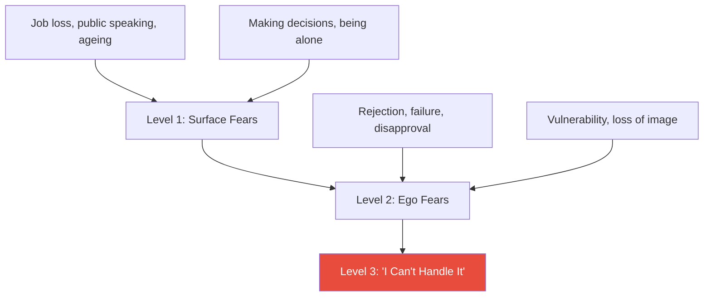
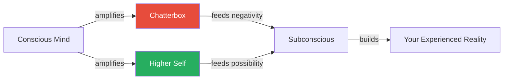
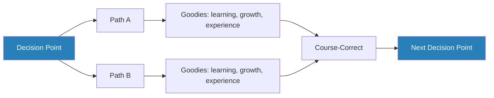
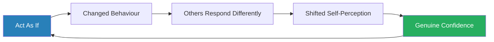

# Feel the Fear and Do It Anyway — Susan Jeffers

> Susan Jeffers' enduring self-help classic makes a single, liberating argument: fear never goes away.
> Every person who pushes into unfamiliar territory — changing careers, ending relationships, speaking up, starting over — feels fear.
> The difference between people who act and people who stay stuck is not the absence of fear but the position from which they hold it.
> Jeffers strips all fear down to one root belief — "I can't handle it" — and then spends the rest of the book proving that you can.
> The toolkit is straightforward: reframe your self-talk, take responsibility for your experience, adopt a decision model that makes every path a learning opportunity, diversify your identity so no single loss can destroy you, and expand your comfort zone one small action at a time.
> It is not a book about eliminating fear.
> It is a book about acting anyway.

---

## About the Author

Susan Jeffers held a Ph.D. in psychology and served as executive director of The Floating Hospital in New York before becoming an educator and author. Her framework emerged from personal experience — divorce, career reinvention, single parenthood — and was tested over years of teaching adult education courses at The New School for Social Research in Manhattan. She wrote the book in 1987; the 20th anniversary edition (2007) broadened the address beyond her original primarily female audience to a general readership. Jeffers was not an organisational psychologist or a clinical researcher — this is a book for anyone navigating the ordinary terrors of a life that demands growth. She died in 2012, but the book has remained continuously in print, translated into dozens of languages, and has become one of the best-selling self-help titles ever published.

---

## The Big Idea

- Jeffers' central argument is that <b style="color: #27ae60">fear is not a bug in the human operating system — it is a feature</b>
- Growth means entering unfamiliar territory, and unfamiliar territory triggers fear
- Therefore, growth and fear are inseparable
- Waiting to feel confident before acting is a trap that guarantees you never act

She identifies <b style="color: #2980b9">three levels of fear</b>:

- **Level 1** fears are situational — changing jobs, public speaking, making decisions, ageing, being alone, losing money, getting sick
  - These are the fears that feel specific and concrete, the ones people describe when asked "What are you afraid of?"
- **Level 2** fears are about the ego — rejection, failure, loss of image, vulnerability, helplessness, disapproval
  - These are deeper and less concrete
  - They sit beneath the surface fears and give them their emotional charge
  - A person is not really afraid of public speaking; they are afraid of being judged, of looking foolish, of being exposed as inadequate
- **Level 3** is the root beneath all the others: <b style="color: #e74c3c">"I can't handle it"</b>

---

- This is the master insight of the book
- If you resolved Level 3 — if you genuinely trusted your ability to handle whatever life throws at you — the upper levels would lose their paralysing grip
- You might still feel nervous before a speech, but you would not avoid it, because the deeper terror of being destroyed by the outcome would be gone
- The entire book is a manual for building that trust

The structure follows a clear arc:

- The first two chapters map the anatomy of fear — its levels, its universality, and the five truths that govern it
- Chapters three and four introduce the internal toolkit — positive thinking as practice, the Chatterbox, and the seven components of personal responsibility
- Chapter five addresses the social environment — building a support system, handling resistance from partners and family, and the Pendulum Syndrome that comes with behavioural change
- Chapter six tackles decisions, offering the No-Lose Decision Model and the Off Course/Correct Model as antidotes to paralysis
- Chapter seven introduces the Whole Life Grid for identity diversification
- Chapter eight presents the philosophy of "saying yes to your universe" — acceptance as power, not passivity
- Chapter nine covers giving as the antidote to scarcity fear
- Chapter ten moves into the Higher Self — spirituality, guided visualisation, and intuition
- Chapter eleven closes with patience, trust, and commitment to the path

---

## Key Concepts at a Glance

| Concept | One-line summary |
|---------|-----------------|
| **The Three Levels of Fear** | Surface fears (situations), ego fears (rejection, failure), and the root fear: "I can't handle it" |
| **The Five Fear Truths** | Fear never disappears, the only way past it is through it, everyone feels it, pushing through beats chronic avoidance, and the root is always "I can't handle it" |
| **The Pain-to-Power Continuum** | A spectrum from helplessness and paralysis (Pain) to choice, energy, and action (Power) |
| **The Chatterbox** | Your internal voice of negativity and doom, which feeds the subconscious a steady diet of weakness and dread |
| **Power Vocabulary** | Replacing "I can't" with "I won't," "it's a problem" with "it's an opportunity," and "what will I do?" with "I'll handle it" |
| **The No-Lose Decision Model** | Every path offers learning and growth; the only wrong decision is no decision |
| **The Off Course / Correct Model** | Like a plane off course 90% of the time but arriving through constant correction |
| **The Whole Life Grid** | Distributing your identity across multiple domains so no single loss can destroy your sense of self |
| **The Pendulum Syndrome** | When shifting from passive to assertive, people overshoot into aggression before settling into healthy assertiveness |
| **Act As If** | Behaving as though you are already confident produces the feelings — and eventually the reality — of being so |
| **Saying Yes to Your Universe** | Accepting what life hands you and creating from it, rather than resisting what has happened |
| **Giving as Antidote** | Fear of lack is dissolved by giving, not by hoarding — giving signals abundance to the subconscious |

---

## Chapter 1-2: The Anatomy of Fear

### The Three Levels

*Jeffers opens by revealing the hidden architecture beneath every fear you have ever felt — and traces them all to a single, universal root.*

- Jeffers acknowledges what every reader already knows: <b style="color: #27ae60">fear is the thing that keeps people stuck</b>
- Not ignorance, not laziness, not lack of talent — fear
- People know what they need to do — leave the dead-end job, end the bad relationship, speak up in the meeting, start the business — and they do not do it

Her answer begins with a taxonomy:

- <b style="color: #2980b9">Level 1 fears</b> are the ones people name easily
  - They divide into two categories:
    - Fears of things that happen to you (ageing, disability, accidents, losing money, being alone, dying)
    - Fears of things that require action (going back to school, making decisions, changing careers, making friends, ending relationships, public speaking)
  - These are the surface fears, and they feel very real

---

- But Jeffers argues they are symptoms, not causes
- Beneath them sit <b style="color: #2980b9">Level 2 fears</b> — the ego fears
  - These are not about specific situations but about inner states: rejection, failure, loss of image, vulnerability, helplessness, disapproval, success itself
  - The person who is afraid of public speaking is not afraid of the podium — they are afraid of being judged and found lacking
  - The person who cannot leave a bad relationship is not afraid of being single — they are afraid of rejection, of proving that they were not enough

- And beneath Level 2 sits <b style="color: #2980b9">Level 3</b>, the single root fear that powers all the others: <b style="color: #e74c3c">"I can't handle it"</b>
  - This is the master key
  - Every fear, when you drill down through the levels, arrives at the same place
  - "I'm afraid of public speaking" becomes "I'm afraid of looking foolish" becomes "I can't handle looking foolish"
  - "I'm afraid of changing careers" becomes "I'm afraid of failing" becomes "I can't handle failure"
- <b style="color: #27ae60">If you could genuinely believe that you could handle anything life threw at you, there would be nothing to fear</b>
- The fear would not disappear — you would still feel the physiological response — but it would lose its power to paralyse you

Every specific fear, no matter how varied on the surface, drills down through the ego to the same root belief — "I can't handle it" — which means building general self-trust is more efficient than fighting individual fears one by one.

---

### The Five Fear Truths

*With the anatomy mapped, Jeffers presents five foundational propositions that are simple, uncomfortable, and impossible to unsee once understood.*

**Truth 1: The fear will never go away as long as you continue to grow.**

- This is the one that strikes hardest
- Many people live as though fear is a temporary obstacle — something that will be conquered once they become experienced or confident enough
- <b style="color: #e74c3c">Jeffers says this is a fantasy</b>
- Every new stage of life — every new role, relationship, challenge, or ambition — brings fear
- The person who has conquered stage fright has not eliminated fear — they have simply moved on to fearing something new and larger
- <b style="color: #27ae60">Growth and fear are a package deal; you do not get one without the other</b>

> [!example] Jeffers' Own Cascade of Fear
> - After her divorce, she was terrified of going back to work
> - She pushed through that fear, got a role at The Floating Hospital, and felt proud
> - Then she was asked to teach a class, and a new wave of fear arrived
> - She pushed through the teaching fear, became competent and popular as an instructor
> - Then she was invited to appear on television, and the fear returned, bigger than ever
> - Each conquered fear simply revealed the next one waiting behind it
> **The lesson:** If you keep growing, you will keep fearing — the question is not "How do I stop being afraid?" but "How do I act while afraid?"

---

**Truth 2: The only way to get rid of the fear of doing something is to go out and do it.**

- You cannot think your way out of fear
- You cannot wait for readiness
- The fear of a specific action fades only through repeated exposure to that action
- Readiness comes after action, not before

> [!example] The New School Classroom Exercise
> - In her classes at The New School, Jeffers asked students to list their fears — they filled pages
> - Then she asked who had conquered a fear they once thought insurmountable
> - Every hand went up
> - In every case, the fear had been conquered the same way: by doing the thing
> - Not by reading about it, not by affirming their way through it, not by waiting until they felt ready — by doing it
> **The lesson:** Evidence of capability comes only from action, never from preparation alone.

**Truth 3: The only way to feel better about yourself is to go out and do it.**

- Self-esteem is built through evidence, not affirmation
- Each time you push through fear and act, you deposit evidence into your self-trust account
- Each time you avoid, you withdraw from it
- The person who wants to feel more confident has only one reliable path: do more things that require confidence

---

**Truth 4: Not only are you going to experience fear whenever you're on unfamiliar territory, but so is everyone else.**

- Fear is not a sign of weakness or inadequacy — it is a universal human response to the unknown
- The people who seem fearless are not feeling less fear — they are acting despite it
- Realising that everyone around you — including the people you admire, including the people who seem bulletproof — feels the same fear you do is one of the most liberating truths in the book
- They have simply learned to walk with it instead of being stopped by it

**Truth 5: Pushing through fear is less frightening than living with the underlying feeling of helplessness.**

- This truth reframes the entire cost-benefit calculus of avoidance
- The chronic, low-grade dread of knowing you are avoiding life is worse than the acute, temporary fear of acting
- Avoidance creates a background anxiety that never resolves — the persistent hum of "I should have" and "what if I had"
- <b style="color: #27ae60">Action closes the loop</b>

> [!example] Janice's Sheltered Life
> - Janice had lived a sheltered, protected life — her husband handled all the finances, all the decisions, all the external-facing responsibilities
> - She believed she was safe
> - Then her husband had a debilitating stroke, and suddenly Janice had to handle everything: money, legal matters, the household, their children's welfare
> - She was terrified — but as she pushed through each new responsibility, something unexpected happened
> - She discovered she was capable — more than capable, she was strong
> - Looking back, Janice realised that the years of "protection" had actually been years of low-grade terror — a constant, unacknowledged fear that her safety depended entirely on another person
> - The acute fear of handling things herself was painful but brief
> - The chronic fear of helplessness had been far worse, and she had not even recognised it until it was gone
> **The lesson:** The safety of avoidance is an illusion — it trades acute, temporary fear for chronic, permanent dread.

> [!tip] Core Insight
> All fear drills down to a single root: "I can't handle it." Build trust in your ability to handle anything, and the upper layers of fear lose their paralysing grip.

| Fear Truth | Core Message |
|-----------|-------------|
| **Truth 1** | Fear never disappears — it grows alongside you |
| **Truth 2** | The only cure is action, not preparation |
| **Truth 3** | Self-esteem is deposited through doing, not thinking |
| **Truth 4** | Everyone feels it — fearless people are just acting anyway |
| **Truth 5** | Chronic avoidance is worse than acute action |

The red bars dwarf the green in every scenario — chronic avoidance costs 5-12x more suffering-time than the acute fear of just doing the thing.

---

## Chapter 3: Positive Thinking and the Chatterbox

### The Chatterbox

*Jeffers reveals the hidden narrator running inside your head — and shows that the difference between people who act and people who freeze is not courage but which internal voice has been given dominance.*

- Jeffers introduces the <b style="color: #2980b9">Chatterbox</b> — her term for the internal voice of negativity
- This is the running commentary that says "you're not good enough," "this will go wrong," "who do you think you are?", "you'll make a fool of yourself"
- Everyone has it
- The question is not whether the Chatterbox exists but how much power you give it

She models the mind in three functional parts:

- The **Chatterbox** generates negativity, doom, and scarcity
- The <b style="color: #2980b9">Higher Self</b> generates creativity, trust, love, and abundance
- The **Conscious Mind** is the arbiter — the part of you that chooses which voice to amplify
- The **Subconscious** sits beneath all three and does not judge — it simply executes whatever the Conscious Mind feeds it
  - If the Conscious Mind amplifies the Chatterbox, the Subconscious builds a world of scarcity and helplessness
  - If the Conscious Mind amplifies the Higher Self, the Subconscious builds a world of possibility and action

---

- <b style="color: #27ae60">The difference between people who are paralysed by fear and people who act despite it is not courage as a personality trait — it is which internal voice has been given dominance</b>

How the Chatterbox operates in everyday life:

- A woman considers applying for a promotion: "You'll never get it. Why embarrass yourself?"
- A man thinks about asking someone on a date: "She'll say no. You're not her type."
- Someone gets an opportunity to travel alone: "Something will go wrong. You can't manage on your own."
- The Chatterbox speaks in absolutes, catastrophises freely, and always frames the self as inadequate
- Its power comes from repetition — it runs on a loop, and because most people never consciously notice it, it becomes the background radiation of their inner life

The conscious mind acts as a gatekeeper — whichever voice it feeds determines the world the subconscious constructs.

---

### The Arm Experiment

*A simple physical demonstration reveals something unsettling: your body responds to your self-talk whether you believe the words or not.*

- The most memorable demonstration in the book is the <b style="color: #2980b9">arm experiment</b>
- Jeffers uses it in her workshops and describes it in detail:
  - A volunteer extends their arm straight out to the side
  - A partner pushes down on the arm while the volunteer repeats "I am a weak and unworthy person"
  - The arm collapses easily
  - Then the exercise is repeated, but this time the volunteer says "I am a strong and worthy person"
  - The arm resists powerfully
- The effect is immediate and does not depend on whether the person believes the words
- The subconscious responds to language literally, regardless of conscious conviction
- This is Jeffers' evidence — admittedly anecdotal and not scientifically controlled — for the core claim of the chapter: <b style="color: #27ae60">the words you use to yourself change your physiological and psychological state</b>
- She argues this is not metaphor — it is mechanics

### Power Vocabulary

*Language is not a mirror reflecting your state — it is a lever that changes it.*

- This leads to Jeffers' argument for <b style="color: #2980b9">Power Vocabulary</b>: deliberately replacing disempowering language with empowering language
- The substitutions are specific:

| Pain Vocabulary | Power Vocabulary |
|----------------|-----------------|
| I can't | I won't / I choose not to |
| I should | I could |
| It's a problem | It's an opportunity |
| What will I do? | I'll handle it |
| It's terrible | It's a learning experience |
| I hope | I know |
| If only | Next time |
| Life is a struggle | Life is an adventure |

Power vocabulary scores dramatically higher across all psychological dimensions, illustrating how a simple language shift transforms your entire inner posture from helplessness to agency.

- The critical shift in the list is from "I can't" to "I won't" or "I choose not to"
  - "I can't" implies powerlessness — some external force is preventing you
  - "I won't" or "I choose not to" restores agency — you are making a decision, and you can make a different one
- <b style="color: #e74c3c">Most uses of "I can't" are actually "I won't" in disguise</b>
- "I can't leave my job" usually means "I won't leave my job because the risks feel too high"
- Acknowledging the truth of the situation is the first step toward changing it

---

> [!example] The Workshop Challenge — "I Really CAN'T"
> - A workshop participant challenged Jeffers: "But I really CAN'T leave my marriage"
> - Jeffers asked: "If someone held a gun to your child's head and said 'Leave your marriage or I pull the trigger,' could you leave?"
> - The answer was immediate: "Of course"
> - Then the barrier is not "can't" — it is "won't," for reasons that may be entirely valid, but which are choices nonetheless
> **The lesson:** The language of impossibility disguises the reality of choice.

- The practical application is straightforward: monitor your self-talk, catch the Chatterbox, and replace its scripts with Power Vocabulary
- Jeffers is clear that this is not denial or toxic positivity
- It is deliberate reprogramming of the default narrative
- The Chatterbox has been running unchallenged for years; Power Vocabulary is the intervention that breaks its monopoly

### Expanding the Comfort Zone

*The comfort zone is not a fixed boundary — it is elastic, and it grows with use.*

- Each day, Jeffers argues, you should take one action that stretches beyond your current comfort zone
- It does not need to be dramatic:
  - Making a phone call you have been avoiding
  - Speaking up in a meeting
  - Asking a stranger a question
  - Trying a new physical activity
- The specific action matters less than the principle: <b style="color: #27ae60">small expansions compound over time</b>

> [!example] Jeffers' Comfort Zone Progression
> - After her divorce, she was afraid to do anything alone — even fixing a broken vacuum cleaner felt insurmountable
> - She started there
> - Then she hosted a dinner party alone
> - Then she took a solo trip
> - Then she started teaching
> - Then she appeared on television
> - Each stretch felt terrifying in the moment and trivial in retrospect
> **The lesson:** The comfort zone grows with use — yesterday's terror becomes today's routine.

> "The only way to get rid of the fear of doing something is to go out and do it."

---

## Chapter 4: Responsibility as Power

### The Seven Components

*Jeffers makes her most challenging argument: total responsibility for your experience of life is not a burden — it is the foundation of personal power.*

- <b style="color: #27ae60">Total responsibility for your experience of life is the foundation of personal power</b>
- This is not responsibility for what happens to you — that is often outside your control
- It is responsibility for how you respond to what happens to you

She breaks this into seven components:

1. Never blame others for your feelings
2. Do not blame yourself either — no self-punishment
3. Be aware of where and how you play victim
4. Handle the Chatterbox
5. Recognise the payoffs that keep you stuck
6. Figure out what you want and act on it
7. Be aware of the multitude of choices available in any situation

- Each component is designed to close off an exit from personal agency:
  - Blaming others externalises control
  - Blaming yourself creates paralysis through guilt
  - Playing victim creates a narrative of helplessness
  - The Chatterbox reinforces all three
  - Hidden payoffs — the secret benefits of staying stuck — provide a subconscious motivation to remain exactly where you are

---

### Edward, Mara, and the Blame Trap

*Jeffers illustrates the blame trap with case studies that feel uncomfortably recognisable.*

> [!example] Edward — The Externaliser
> - Edward blames everything on external forces
> - His wife does not understand him, his boss does not appreciate him, his adult son has disappointed him
> - His health problems are due to stress caused by other people
> - Edward's entire narrative is one of victimhood — things happen TO him, caused BY others, and he is powerless to change any of it
> - Jeffers' point is not that Edward's complaints are invalid — his wife may genuinely be unsupportive; his boss may genuinely be unfair
> - The point is that as long as Edward locates the cause outside himself, he has no leverage
> - He cannot change his wife, his boss, or his son — he can only change himself, and blame prevents him from seeing that
> **The lesson:** Blame feels like an explanation but functions as a prison.

> [!example] Mara — The Post-Divorce Trap
> - Mara blames her ex-husband for her unhappiness years after the divorce
> - She recounts the betrayals, the broken promises, the emotional damage
> - The grievances may be legitimate
> - But Mara's insistence on locating her unhappiness in her ex-husband's past behaviour means she is giving a man who is no longer even in her life the power to determine her emotional state
> - The reframe is not "get over it" or "it wasn't that bad"
> - The reframe is: "He did those things, and your response to those things is now yours to choose"
> **The lesson:** Holding someone else responsible for your current emotional state hands them the remote control to your life.

- Jeffers uses her own relationships to illustrate the same point from the inside
- She describes catching herself blaming a partner for her bad mood, then stepping back and realising: <b style="color: #e74c3c">"He pushed a button, but I installed the button"</b>
- The external trigger was real, but the emotional response was hers — and once she owned it, she could change it

---

### Payoff Analysis

*The most incisive tool in this chapter: people stay stuck not because they are trapped, but because stuckness provides hidden benefits they have not yet consciously identified.*

- <b style="color: #2980b9">Payoff analysis</b> is the practice of identifying the hidden benefits that keep you in unsatisfying situations
- Jeffers argues that people stay in unsatisfying situations not because they are genuinely trapped but because the situation provides hidden benefits:
  - Comfort and predictability
  - Avoidance of rejection
  - The certainty of known misery over unknown possibility
- <b style="color: #e74c3c">Until you identify these payoffs consciously, you cannot break free from them</b> — because you are not choosing to stay; you are choosing the payoff without realising it

> [!example] Jean — Stuck in the Wrong Job
> - Jean is stuck in a job she hates and complains about it endlessly
> - She could leave — she has savings, skills, and a reasonable job market
> - But she stays
> - Jeffers asks Jean to list the payoffs of staying: no risk of rejection from job applications, certainty of competence in a role she knows well, minimal effort required, steady income, no need to prove herself in a new environment
> - Jean's stated desire is to leave — her subconscious desire is to keep the payoffs
> - Once she sees this clearly, the "trap" dissolves into a choice — and choices can be made differently
> **The lesson:** What looks like a cage from the outside often has an open door that the occupant is choosing not to walk through.

> [!example] Kevin — The Loveless Marriage
> - Kevin is in a marriage he describes as loveless but refuses to leave
> - His payoffs: psychological "home" (the familiarity of the relationship), social acceptability (married is easier than divorced), avoidance of the dating world, financial stability
> - Kevin does not want to admit that these payoffs are more important to him than romantic fulfilment
> - But they are — and until he owns that, he will remain stuck and resentful
> **The lesson:** Honesty about your real priorities is the prerequisite for change.

> [!example] Tanya — The Illness Payoff
> - Tanya is perpetually ill — headaches, stomach problems, mysterious ailments that never quite resolve
> - Her payoffs: attention, sympathy, avoidance of responsibilities and risks, a ready-made excuse for not pursuing her ambitions
> - Jeffers is careful here — she is not saying Tanya's symptoms are fake
> - She is saying that the secondary gains of illness can become powerful enough to prevent recovery
> **The lesson:** Even genuine suffering can carry hidden benefits that make recovery feel threatening.

> "You are not a victim. You are the cause of your experience."

> [!tip] Core Insight
> The reframe is not that your situation is your fault. It is that your response is your choice. Blame externalises control and renders you powerless. Responsibility reclaims agency.

---

## Chapter 5: Building Your Support System

### The Social Environment of Growth

*Jeffers argues that your environment is not neutral — the people around you are either reinforcing growth or reinforcing stagnation, whether they intend to or not.*

- The people around you either reinforce growth or reinforce stagnation
- This is not a moral judgement — it is an observation about social dynamics
- Negativity and positivity are both contagious
- Spending time with people who say "you can do it" builds confidence
- Spending time with people who say "you'll never make it" or "why bother?" reinforces fear

---

- Jeffers coins the term <b style="color: #2980b9">Moan and Groan Society</b> for groups of people who gather primarily to complain
  - These groups feel comforting because they validate your grievances
  - Someone says "my job is terrible" and five people nod and agree and share their own terrible stories
  - <b style="color: #e74c3c">The problem is that comfort and growth are different things</b>
  - The Moan and Groan Society keeps everyone stuck by making stuckness feel normal
  - If everyone is stuck, then being stuck is not a personal failing — it is just life
  - This normalisation is the enemy of action

### The Inside Edge

*Even the most accomplished self-help professionals in the country need weekly mutual reinforcement — ordinary people certainly cannot maintain a positive mindset in isolation.*

> [!example] The Inside Edge — LA's 6:15 AM Growth Group
> - Jeffers' most striking example of a growth-oriented support system was The Inside Edge
> - A group of bestselling self-help authors, motivational speakers, and personal development professionals who met weekly at 6:15 AM in Los Angeles
> - These were people who had already achieved significant success — published authors, popular speakers, financially comfortable
> - Yet they met every single week at an hour most people consider unreasonable
> - The reason: even the people who teach positive thinking need reinforcement
> - The Chatterbox does not care about your credentials — it operates in best-selling authors just as it operates in everyone else
> **The lesson:** Positive thinking is not a one-time achievement but a daily practice that requires a community to sustain it.

- Jeffers uses this to make a broader point: <b style="color: #27ae60">if the most accomplished self-help professionals in the country need weekly mutual reinforcement, then ordinary people certainly cannot be expected to maintain a positive mindset in isolation</b>
- Growth requires a community that models and reinforces growth

---

### The Pendulum Syndrome

*When someone who has been passive for years begins to assert themselves, something predictable happens: they overshoot — and this is not a failure, it is a necessary phase.*

- When someone who has been passive for years begins to assert themselves, they overshoot
- Jeffers calls this the <b style="color: #2980b9">Pendulum Syndrome</b>

> [!example] The Deferential Woman Who Overcorrected
> - A woman who had been deferential and accommodating for decades decided to start setting boundaries
> - She did not swing gently into healthy assertiveness — she swung hard into aggression
> - Saying no to everything, snapping at people who made requests, bristling at perceived impositions
> - Her family and friends were alarmed: "What happened to you? You've changed. You used to be so nice"
> - The woman, already uncertain, heard this as confirmation that she had gone too far — that the old passivity was better
> - She swung back
> **The lesson:** The pendulum must overshoot in both directions before finding its resting point.

> [!example] The Workplace Pushover's First Stand
> - A man in Jeffers' workshop had been a pushover at work for years
> - He decided to start standing up for himself
> - His first attempt was a spectacularly aggressive confrontation with his manager that nearly got him fired
> - He came to the next class dejected: "I tried being assertive and it was a disaster"
> - Jeffers reframed it: "You didn't try being assertive. You tried being aggressive. That's the first swing of the pendulum. The next swing will be closer to the middle"
> - Over several months of practice, he did find the middle — firm, clear, respectful, and effective
> **The lesson:** The overcorrection is a necessary step — healthy assertiveness lives in the middle, and the middle is found through swinging, not through precision.

- <b style="color: #27ae60">Passivity is one extreme, aggression is the other — healthy assertiveness lives in the middle</b>
- The key is to recognise the pattern and not interpret the overcorrection as evidence that change was a mistake

> "The Chatterbox... that little voice inside that tries to drive you crazy."

---

## Chapter 6: The No-Lose Decision Model

### The No-Win Trap

*Jeffers exposes the hidden assumption that makes every decision agonising — and replaces it with a framework that makes every choice an opportunity.*

- One of the book's most useful frameworks is the distinction between two ways of making decisions

<b style="color: #2980b9">The No-Win Model</b> treats every decision as a bet with a right answer and a wrong answer:

- Before the decision: agony, analysis paralysis, fear of choosing wrong
  - The mind runs scenario after scenario, trying to predict which path will lead to the best outcome
  - Both paths might be wrong
- After the decision: regret, second-guessing, "what if I had chosen the other path?"
  - The decision-maker tries to control outcomes and blames themselves when outcomes disappoint
- <b style="color: #e74c3c">This model guarantees suffering regardless of the choice made</b>

---

- Jeffers argues that the No-Win model rests on a hidden assumption: that the purpose of a decision is to produce the correct outcome
- If you accept this assumption, every decision becomes a high-stakes gamble, and every wrong outcome becomes evidence of personal failure
- The paralysis is not a bug in your psychology — it is a rational response to a framework that makes every choice terrifying

### The No-Lose Alternative

*Both paths have "goodies" — the purpose of decisions is learning and growth, not outcome control.*

- <b style="color: #2980b9">The No-Lose Model</b> starts from a different premise: <b style="color: #27ae60">both paths offer opportunities</b>
- Each path has its own set of learning, growth, and experience — its own "goodies"
  - Path A leads to one set of experiences, relationships, and capabilities
  - Path B leads to a different set
  - Neither is wrong — they are simply different
- After choosing, you throw away the picture of what the other path might have looked like
- You commit fully, extract everything the chosen path has to offer, and course-correct if needed
- The No-Lose Model does not claim all outcomes are equally desirable
- It claims that <b style="color: #27ae60">the purpose of decisions is learning and growth, not outcome control</b>
- When the frame shifts from "getting the right result" to "creating valuable experience," the paralysis dissolves

> [!example] Alex's "Wrong" Choice of Law School
> - Alex was a man agonising over whether to go to law school — he went, and he hated it
> - By the No-Win model, this was a catastrophe — a wrong decision, wasted years, confirmation of his inability to choose wisely
> - But Alex did not adopt the No-Win model
> - He enrolled, made deep friendships, developed analytical skills, and — critically — met his wife
> - After realising law was not for him, he transferred to psychology and built a fulfilling career
> - Looking back, Alex did not view the law school years as a mistake — they were a different path with their own goodies
> - The "wrong" choice produced some of the most important elements of his life
> **The lesson:** There are no wrong decisions — only different paths with different rewards.

- Jeffers contrasts this with her own career path
- Her detour through The Floating Hospital — a job that was never part of her "plan" — turned out to be the experience that led to her teaching career, which led to the book
- If she had been paralysed by the decision of whether or not to take the hospital job, the entire subsequent chain would not have happened
- The No-Lose model freed her to choose, commit, and see what the path offered

---

### The Off Course / Correct Model

*You will be off course most of the time — this is not failure, it is the normal condition of a life in motion.*

- Jeffers pairs the No-Lose Decision Model with the <b style="color: #2980b9">Off Course / Correct Model</b>, borrowed from Stewart Emery's analogy of airline navigation:
  - An airplane flying from one city to another is off course roughly 90% of the time
  - Wind, turbulence, atmospheric pressure, and minor mechanical variations push it away from its ideal trajectory constantly
  - But it arrives at its destination
  - How? Through constant small corrections
  - The inertial guidance system detects deviation and adjusts, thousands of times over the course of the flight
  - The plane does not need to be on course the entire time — it only needs to correct often enough and quickly enough

---

- Jeffers argues that life operates the same way:
  - You will be off course most of the time
  - Your career will not follow the plan
  - Your relationships will not unfold as imagined
  - Your decisions will produce unexpected consequences
  - <b style="color: #27ae60">This is not failure — it is the normal condition of a life in motion</b>
- The skill is not choosing perfectly the first time
- The skill is noticing when you are off course and correcting quickly
- Confusion and dissatisfaction are not evidence that you chose wrong — they are correction signals telling you to adjust
- <b style="color: #e74c3c">The person who treats every deviation as a catastrophe will spend their life in anxiety</b>
- The person who treats every deviation as a data point will spend their life arriving

> "There are no wrong decisions — only different paths."

> [!tip] Core Insight
> Decisions are not bets to win or lose. Both paths have goodies. Choose, commit, extract every lesson, and course-correct as needed.

Every decision leads to its own set of rewards and corrections — the only truly losing choice is no choice at all.

---

## Chapter 7: The Whole Life Grid

### The Problem of Identity Concentration

*When your entire identity is invested in a single domain, losing that domain does not merely sadden you — it annihilates you.*

- When your entire identity is invested in a single domain — work, a relationship, a role, a title — losing that domain feels like annihilation
- Jeffers argues that people who have collapsed their entire sense of self into one thing experience the loss of that thing as a kind of death
  - They are not just sad — they are existentially disoriented
  - They do not know who they are anymore

The mechanism is simple:

- If 90% of your identity comes from your marriage, then divorce destroys 90% of who you are
- If 90% of your identity comes from your job, then redundancy destroys 90% of who you are
- <b style="color: #27ae60">The intensity of the fear you feel about losing something is directly proportional to the percentage of your identity invested in it</b>
- Reduce the percentage, and you reduce the fear

---

### Louise and Nancy

*Two women, similar breakups, radically different outcomes — the difference is not resilience or character but how many cells of their identity grid were filled.*

> [!example] Louise — One Basket, One Collapse
> - Louise was devastated by her divorce — not merely saddened, but non-functional, unable to get out of bed for weeks
> - Her husband had been her entire world
> - She had no independent friendships — her social life revolved around couples they knew together
> - She had no career — she had stopped working when they married
> - She had no hobbies or personal pursuits — her leisure activities were things they did as a couple
> - When the marriage ended, there was nothing left
> - Not because she was weak, but because she had put everything into one basket, and the basket was gone
> **The lesson:** Identity concentration makes any single loss catastrophic.

> [!example] Nancy — A Full Grid
> - Nancy went through a similar breakup at the same time
> - She was sad — she grieved
> - But within months, she was not merely functioning — she was thriving
> - Nancy had a career she found meaningful, close friendships independent of her relationship, creative hobbies, a strong sense of personal purpose, and community involvement
> - The relationship had been one important element of a rich, multifaceted life
> - When it ended, the other elements held her up
> **The lesson:** A diversified identity is a resilient identity — no single loss can destroy you.

### The Grid

- Jeffers proposes the <b style="color: #2980b9">Whole Life Grid</b>: a framework for distributing your sense of self across multiple domains
- The grid has nine cells covering the major areas of life:

| Cell | Domain |
|------|--------|
| 1 | Work / career |
| 2 | Intimate relationship / romance |
| 3 | Family |
| 4 | Friends |
| 5 | Personal growth / learning |
| 6 | Leisure / fun / creativity |
| 7 | Contribution to others / community |
| 8 | Spirituality / higher self |
| 9 | Health / physical wellbeing |

This treemap shows how most people over-invest in work and romance, leaving six other identity cells dangerously underfilled — exactly the pattern Jeffers warns creates catastrophic vulnerability to loss.

- The goal is not to achieve perfect balance across all nine — that is unrealistic
- The goal is to ensure you are investing in enough cells that no single loss can destroy you
- Jeffers suggests that <b style="color: #27ae60">a minimum of five or six active cells provides a resilient identity structure</b>

---

- She is careful to distinguish the grid from dilution:
  - Distributing your identity does not mean diluting your commitment to any one domain
  - You can be deeply committed to your work AND have a rich personal life
  - You can love your partner intensely AND maintain independent friendships
  - The grid is about ensuring you are never existentially dependent on any one thing

> [!example] The Executive With One Cell Filled
> - A high-powered executive had invested his entire identity in his job title and his company
> - When the company was acquired and he was made redundant, he fell apart completely
> - He was not just unemployed — he was nobody
> - Without the title, without the corner office, without the team that reported to him, he had no idea who he was
> - His wife, his children, his health — all had been neglected in service of the career cell
> - The grid had one cell filled to overflowing and eight cells empty
> - Recovery was slow and required deliberately filling the empty cells: reconnecting with old friends, starting to exercise, volunteering, learning to cook, rebuilding the marriage that had become a formality
> - Each new cell reduced his dependence on the work cell and made the prospect of future career disruption less terrifying
> **The lesson:** Overinvestment in any single cell does not build strength — it builds fragility.

> [!tip] Core Insight
> The intensity of fear about losing something is directly proportional to the percentage of your identity invested in it. Diversify the investment, and the fear shrinks proportionally.

---

## Chapter 8: Saying Yes to Your Universe

### Acceptance as Power

*Jeffers makes her most philosophical argument: the deepest antidote to fear is not resistance but radical acceptance — not passivity, but shifting your orientation from fighting what happened to building what happens next.*

- In what is arguably the book's most philosophical chapter, Jeffers argues that the deepest antidote to fear is <b style="color: #2980b9">saying yes to your universe</b> — accepting what life hands you and looking for what can be created from it, rather than resisting what has happened

- <b style="color: #e74c3c">This is not passivity</b> — Jeffers is emphatic about this distinction:
  - Saying yes does not mean tolerating mistreatment, giving up on your goals, or pretending that bad things are good
  - It means shifting your orientation from resistance to creation
- When something goes wrong — a job loss, a rejection, a health crisis — the instinct is to say no: "This shouldn't be happening. This is unfair. I don't deserve this"
  - The no creates tension, exhaustion, and victimhood
  - It focuses all your energy on fighting what has already happened rather than building what could happen next
- <b style="color: #27ae60">Saying yes means: "This has happened. I did not choose it. But I can choose what I do with it"</b>
  - What opportunity does this create?
  - What can I learn?
  - What can I build from here?
- The yes conserves energy for action instead of spending it on resistance

---

### Charles, Frankl, and Marge

*Three stories demonstrate the "say yes" principle under conditions ranging from catastrophic to ordinary — proving it works at every scale.*

> [!example] Charles — Paralysis and Purpose
> - Charles was a young man paralysed from the chest down in a shooting
> - His life was destroyed — by any conventional measure, the shooting was pure catastrophe
> - But Charles chose to say yes
> - He found purpose in helping other people with disabilities, became an advocate, built a community
> - He did not pretend the shooting was a good thing — he did not deny the loss
> - He accepted the reality and created meaning from within it
> **The lesson:** Saying yes to your universe is not approval of what happened — it is the decision to create something from within the reality you have.

> [!example] Viktor Frankl — Meaning in the Camps
> - Viktor Frankl — whom Jeffers cites as a foundational influence — survived the Nazi concentration camps
> - In conditions of absolute horror, Frankl discovered that the one thing that could not be taken from him was his choice of how to respond
> - The guards controlled his body, his food, his physical freedom
> - They could not control his mind, his attitude, or his sense of meaning
> - Frankl's conclusion, which became the basis of logotherapy, was that meaning is always available — even in suffering
> **The lesson:** If Frankl could find meaning in a concentration camp, then the rest of us can probably find meaning in a job loss or a breakup.

> [!example] Marge — Rebuilding After Loss
> - Marge's husband died suddenly
> - She was terrified — she had never lived alone, never managed finances alone, never made a major decision without her husband's input
> - She said yes to her new reality — not happily, not without grief, but with a determination to find out what she was capable of
> - Within two years, she had built a level of independence and self-esteem she had never known during her marriage
> - She discovered strengths that had been invisible when someone else was always there to lean on
> **The lesson:** Loss can reveal capabilities that comfort concealed.

---

### The Difference Between Yes and Resignation

- Jeffers draws a crucial line between saying yes and giving up:
  - Saying yes to your universe means saying yes to the experience — accepting reality, finding possibility within it, moving forward
  - It does not mean saying yes to injustice, to bad treatment, or to situations that violate your values
- <b style="color: #27ae60">You can say no to the situation while saying yes to the growth opportunity it presents</b>
- A person who loses their job can say yes to the experience (accept it, learn from it, use it) while saying no to the structural unfairness that caused it (pursue legal recourse, rebuild elsewhere, fight for better conditions)
- The two are not in conflict

> "Say yes to your universe."

---

## Chapter 9: Giving as the Antidote to Scarcity

### The Fear of Not Enough

*In a counterintuitive chapter, Jeffers argues that the instinct to hold tighter when you feel you do not have enough is precisely the behaviour that perpetuates the feeling of not having enough.*

- Jeffers argues that <b style="color: #27ae60">fear of lack — not enough money, recognition, love, time — is dissolved by giving, not by hoarding</b>
- This runs against every instinct:
  - When you feel you do not have enough, the natural response is to hold tighter, save more, give less
  - <b style="color: #e74c3c">Jeffers says this response is precisely the problem</b>
- Hoarding signals scarcity to the subconscious:
  - When you act as though there is not enough, your subconscious obliges by constructing a world of scarcity
  - You become guarded, suspicious, competitive in a zero-sum way, and afraid
- Giving does the opposite:
  - When you give, you signal abundance to your subconscious
  - You are saying, in effect: "I have enough to share"
  - The act of giving creates the felt experience of having enough, which in turn reduces the fear of not having enough

---

### Six Domains of Giving

*Jeffers identifies six specific domains in which giving can break the scarcity cycle — each one addressing a different face of the "not enough" fear.*

| Domain | What it means | Why it works |
|--------|--------------|-------------|
| **Thanks** | Genuine gratitude, not social nicety | Reminds you of what you have |
| **Information** | Sharing knowledge instead of hoarding it | Signals confidence in your own abundance |
| **Praise** | Acknowledging others' contributions | Breaks the "if they are great, I am less great" scarcity mindset |
| **Time** | Full presence and attention | Giving the most scarce resource signals surplus |
| **Money** | Financial giving, even modest amounts | Proves to your subconscious that you have enough |
| **Love** | Unconditional, without keeping score | The most challenging and the most transformative |

Love and Time — the two domains requiring the most personal vulnerability — deliver the greatest impact on dissolving the fear of scarcity.

> [!example] The Gratitude Exercise
> - In a workshop exercise, participants were asked to go home and thank their spouse or partner for something specific, something real, something usually taken for granted
> - Many of them found it extraordinarily difficult
> - The Chatterbox resisted: "Why should I thank them? They should be thanking ME"
> - Those who pushed through reported that the simple act of genuine thanks transformed their evening — and sometimes their week
> **The lesson:** Gratitude is not a feeling to wait for — it is an action that creates the feeling.

---

- **Information** — the instinct to protect what you know — to hold your expertise close as a source of competitive advantage — is natural
  - Jeffers argues that sharing information creates reciprocity and trust
  - It signals confidence: "I have so much knowledge that sharing some costs me nothing"
- **Praise** — many people are deeply uncomfortable giving genuine praise, not because they do not see others' qualities but because praising others feels like diminishing themselves
  - The scarcity mindset whispers: "If they are great, then I am less great"
  - <b style="color: #27ae60">The abundance mindset says: "Their greatness does not diminish mine"</b>
- **Time** — giving attention and presence means being fully present with someone instead of half-listening while mentally composing your next response
- **Money** — Jeffers is not naive about financial constraints
  - She does not suggest giving away what you cannot afford
  - She suggests that the act of giving — even modest amounts — breaks the grip of financial fear by proving to your subconscious that you have enough
- **Love** — the most challenging and the most transformative: giving love without conditions, without keeping score, without expectation of return

### The Caveat

- Jeffers is clear about the boundary between giving and people-pleasing:
  - <b style="color: #27ae60">Giving from surplus is healthy — giving from depletion is self-destruction</b>
  - Genuine giving is done from a position of abundance and choice
  - People-pleasing is done from a position of fear and obligation
- <b style="color: #e74c3c">If you give because you are afraid that withholding will make people stop liking you, that is not giving — that is purchasing approval</b>
- The principle assumes you are giving freely, not transactionally
- And giving is not a strategy to receive — the moment you give in order to get something back, the mechanism breaks
- It works precisely because it is unconditional

> "Pushing through fear is less frightening than living with helplessness."

---

## Chapter 10: The Higher Self

### Spirituality and Intuition

*This is the book's most controversial chapter — and its weakest — as Jeffers moves from practical psychology into metaphysical territory.*

- Jeffers moves from practical psychology into metaphysical territory, arguing for the existence of a <b style="color: #2980b9">Higher Self</b> — a deeper, wiser part of you that operates beyond the ego, beyond the Chatterbox, and connects you to a "Universal Energy" that flows through all things
- The Higher Self, in Jeffers' framing, is the source of creativity, love, joy, and intuition:
  - It operates beneath the conscious mind and is always available
  - But the Chatterbox drowns it out
  - The work of personal growth is, in part, the work of turning down the Chatterbox's volume enough to hear the Higher Self
- She draws on a range of spiritual traditions — Eastern philosophy, Western self-help, general New Age thinking — to construct a model in which the individual self is connected to a larger universal consciousness
- Fear is, in this model, a product of the ego's sense of separation
- The Higher Self does not fear because it knows it is part of something larger and indestructible

---

### Guided Visualisation

> [!abstract] Jeffers' Guided Visualisation Technique
> 1. Sit quietly and breathe deeply
> 2. Visualise yourself moving through a feared situation with confidence, competence, and calm
> 3. See yourself walking into the room, speaking clearly, being received warmly
> 4. Imagine handling challenges with ease
> 5. The visualisation programs the subconscious with a positive template — so that when the real moment arrives, the subconscious treats it as familiar rather than threatening

> [!example] Jeffers' First Television Appearance
> - The night before her first major television appearance, Jeffers was terrified
> - She sat quietly and imagined the entire experience: arriving at the studio, sitting in the green room, walking onto the set, answering questions with poise, the interviewer smiling, the audience engaged
> - When the actual moment came, it felt — not easy, but not paralysing
> - The visualisation had given her subconscious a rehearsal, and the rehearsal took the edge off the terror
> **The lesson:** The subconscious does not distinguish between a vividly imagined experience and a real one — rehearsal works even when it is imaginary.

---

### The Law of Attraction

- Jeffers also introduces a version of the <b style="color: #2980b9">Law of Attraction</b>: the idea that positive thoughts attract positive experiences, and negative thoughts attract negative experiences
- She frames this through the concept of energy — that you are a transmitter, and the frequency you broadcast determines what you receive:
  - When you operate from the Higher Self (love, trust, abundance), you attract people and experiences that match that frequency
  - When you operate from the Chatterbox (fear, scarcity, negativity), you attract corresponding people and experiences

- <b style="color: #e74c3c">This is the book's weakest argument</b>
  - It rests on unfalsifiable metaphysical claims — there is no mechanism by which thoughts can causally attract external events
  - What Jeffers is likely describing is a real psychological phenomenon — that positive people tend to notice opportunities, attract collaborators, and create social dynamics that produce positive outcomes
  - But she frames it in quasi-mystical language that undermines the otherwise practical argument

---

## Chapter 11: Patience and the Path

### Commitment to the Process

*The final chapter is brief and functions more as a benediction than a new argument — a reminder that everything in the book takes time, and that the fear never goes away.*

- Jeffers acknowledges that everything in the book takes time:
  - The Chatterbox will not be silenced overnight
  - The comfort zone will not expand in a week
  - The Whole Life Grid will not be filled in a month
  - Growth is a lifelong process, and the fear never goes away — it simply becomes manageable, survivable, something you can walk with rather than be stopped by

---

- She urges the reader to be patient with themselves:
  - The Pendulum Syndrome will produce overcorrections
  - The Power Vocabulary will feel fake at first
  - The affirmations will seem hollow
  - The No-Lose Model will be difficult to maintain when a decision produces genuinely painful consequences
  - <b style="color: #27ae60">All of this is normal — all of this is the process working</b>

- Her closing argument echoes the opening: the only real failure is not trying
- The person who pushes through fear and stumbles is infinitely better off than the person who never pushes at all
- The fear will be there either way
- The question is whether you let it stop you

> "Feel the fear and do it anyway."

---

## Act As If

*One of the book's most practical techniques: you do not need to believe in yourself before taking action — acting as if produces the feelings, and eventually the reality, of actually being confident.*

- <b style="color: #2980b9">Acting "as if"</b> is a principle woven through several chapters rather than confined to one
- You do not need to believe in yourself before taking action
- Acting as if you are confident, competent, and capable produces the feelings — and eventually the reality — of actually being those things

The mechanism is a feedback loop:

- Behaviour shapes identity
- When you act as if you count, people treat you as if you count, which reinforces the belief that you count
- The subconscious responds to behaviour and self-talk regardless of conscious belief
- <b style="color: #27ae60">You do not need to feel confident to act confidently — the feeling follows the action, not the other way around</b>

---

> [!example] Sandy's Transformation at the "Prison Sentence" Job
> - Sandy was stuck in a temporary administrative job she felt was beneath her
> - She went to work each day with the attitude of someone serving a prison sentence — doing the minimum, disengaging, watching the clock
> - Her experience of the job was miserable
> - When Jeffers suggested she try acting "as if" the job mattered — as if she were doing important work — Sandy was sceptical but willing to try
> - She started contributing ideas in meetings, engaging with her colleagues instead of sulking at her desk, bringing energy to tasks she had previously sleepwalked through
> - Her experience of the job transformed entirely
> - The external situation had not changed — her internal posture had, and the change in posture changed everything
> **The lesson:** Your experience of a situation is shaped more by the attitude you bring to it than by the situation itself.

> [!example] The "I'm Terrific" Belt Buckle
> - In a workshop, Jeffers was given a belt buckle that read "I'm Terrific"
> - She wore it reluctantly, feeling foolish
> - But something odd happened: people responded to the belt buckle
> - They smiled, they laughed, they commented
> - The buckle gave them permission to engage with her, and their engagement — treating her as someone fun and confident — began to shift her actual self-perception
> - It was a small, almost silly experiment
> **The lesson:** External signals change internal states, which change external signals — the loop is self-reinforcing.

The "act as if" feedback loop is self-reinforcing — behaviour shapes perception shapes identity shapes behaviour.

---

- The technique is not delusion:
  - It works because there is often a gap between what you are capable of and what you project
  - Most people project less confidence, less competence, and less authority than they actually possess
  - <b style="color: #27ae60">"Act as if" closes that gap by aligning your behaviour with your potential rather than your anxiety</b>

> "Act as if you really do count."

---

## Positive Thinking as Daily Practice

*A theme that runs through the book but deserves its own treatment: positive thinking is not a one-time insight — it is a daily practice that atrophies without maintenance.*

- Jeffers insists that <b style="color: #27ae60">positive thinking is not a one-time insight but a daily practice</b>
- It is not something you understand once and then have — it is something you do every day, or it atrophies

Her analogy is physical fitness:

- No one goes to the gym once and expects to be fit for life
- Fitness requires continuous exercise
- Positive thinking works the same way
- The Chatterbox is the default mode — years of conditioning have made negativity automatic
- Positive thinking requires active overriding of this default through:
  - Affirmations
  - Environmental cues
  - Vocabulary choices
  - And — critically — community

---

- The Inside Edge group is her primary evidence for this:
  - These are not beginners — these are the most successful self-help professionals in the country
  - And they meet every week at 6:15 AM to reinforce the practice
  - If they need it, everyone needs it

> [!example] Jeffers' Own Lapse
> - Jeffers describes periods in her own life when she stopped practising
> - Life got busy, the affirmations felt like a chore, she skipped the morning routine
> - Within weeks, the Chatterbox reasserted itself
> - The negativity came back, the self-doubt crept in
> - Not because she had lost the knowledge, but because she had stopped the practice
> **The lesson:** You do not graduate from this work — you do it, or it undoes itself.

- <b style="color: #e74c3c">The neural pathways of negativity are always waiting to reassert</b>
- The positive pathways require maintenance

---

## The Verdict

*Feel the Fear and Do It Anyway* is a clear, practical, and occasionally profound manual for overcoming the internal barriers to action. Its greatest contributions are the <b style="color: #2980b9">Level 3 Fear insight</b> — the revelation that all fear reduces to a single root belief, "I can't handle it," which means building general self-trust is more efficient than fighting individual fears one by one. The <b style="color: #2980b9">No-Lose Decision Model</b> is a genuinely liberating reframe for anyone prone to decision paralysis; by shifting the purpose of decisions from "getting the right outcome" to "creating learning opportunities," Jeffers dissolves the agony of choosing without denying that some outcomes are better than others. The <b style="color: #2980b9">Pain-to-Power Vocabulary</b> and the <b style="color: #2980b9">arm experiment</b> offer a simple, repeatable technique for shifting internal narrative, and the <b style="color: #2980b9">Whole Life Grid</b> provides a structural solution to the problem of identity concentration that feels as relevant in the 2020s as it did in the 1980s. The <b style="color: #2980b9">payoff analysis</b> — identifying the hidden benefits that keep you stuck — is one of those tools that, once learned, becomes impossible to unsee.

The book's weaknesses are real and worth naming. The later chapters on the "Higher Self," "Universal Energy," and the Law of Attraction rest on unfalsifiable metaphysical claims that weaken the otherwise practical argument. Jeffers comes uncomfortably close to magical thinking in places — the idea that thoughts can attract external events is not supported by any mechanism she provides. The case studies throughout are anecdotal, drawn from Jeffers' own classes and personal life, with no systematic evidence, control groups, or longitudinal data. The neuroscience of fear — amygdala response, cognitive behavioural models, exposure therapy research — post-dates the book and would have provided much stronger grounding for many of its claims. The book also treats fear as an almost entirely internal phenomenon, with limited attention to the structural, economic, and institutional forces that constrain people's options. Someone who genuinely cannot leave their job because they will lose their health insurance is not simply choosing a "payoff" — they are navigating a structural constraint. Jeffers acknowledges these limitations briefly but does not grapple with them seriously.

The reader who benefits most from this book is the one who is not paralysed by ignorance of what to do, but by fear of actually doing it. The person who knows they need to have the difficult conversation, make the career change, end the relationship, start the project — and cannot bring themselves to act. For that reader, this book is a reliable kick in the right direction: not because it tells them something new, but because it gives them a framework for understanding their own paralysis and a toolkit for moving through it. The five Fear Truths alone are worth the price of admission. For readers seeking a more clinically grounded approach to anxiety, this book will feel too light. For readers already comfortable with action and risk, it will feel unnecessary. Its sweet spot is the intelligent person who is stuck — not because they lack capability, but because they lack the internal permission to act.

Compared to other books in the self-help canon, Jeffers sits in a tradition that includes Dale Carnegie, Norman Vincent Peale, and Tony Robbins — practical, populist, experience-based, and philosophically thin. She lacks the intellectual heft of Viktor Frankl, whose concentration camp experience gives his conclusions about meaning an authority that Jeffers cannot match. She lacks the scientific rigour of cognitive behavioural therapy researchers who have since validated many of her intuitions through controlled studies. But she has something that academic rigour often lacks: accessibility. The book is written in plain language, uses vivid stories, and gives the reader actionable tools that can be applied immediately. That is its enduring strength. Almost four decades after publication, it remains one of the most widely read and frequently recommended self-help books in the world — not because it is the best, but because it works.

---

## Key Quotes

- "Feel the fear and do it anyway." — Susan Jeffers
- "The only way to get rid of the fear of doing something is to go out and do it." — Susan Jeffers
- "Pushing through fear is less frightening than living with helplessness." — Susan Jeffers
- "The Chatterbox... that little voice inside that tries to drive you crazy." — Susan Jeffers
- "Say yes to your universe." — Susan Jeffers
- "Act as if you really do count." — Susan Jeffers
- "There are no wrong decisions — only different paths." — Susan Jeffers
- "You are not a victim. You are the cause of your experience." — Susan Jeffers

---

## Related Reading

- [[The 48 Laws of Power - Robert Greene|The 48 Laws of Power]] — where Jeffers builds courage, Greene provides the strategic intelligence to deploy it wisely; the two are complementary rather than contradictory
- [[Never Split the Difference - Chris Voss|Never Split the Difference]] — Voss' negotiation framework addresses the high-stakes conversations that Jeffers' courage prepares you for
- [[So Good They Can't Ignore You - Cal Newport|So Good They Can't Ignore You]] — Newport's argument that career capital is built through deliberate practice pairs well with Jeffers' comfort zone expansion principle
- [[The First 90 Days - Michael D. Watkins|The First 90 Days]] — for anyone whose fear centres on transitions and new roles, Watkins provides the structural playbook while Jeffers provides the emotional one
- [[Mindset - Carol S. Dweck|Mindset]] — Dweck's growth mindset research provides the scientific grounding for many of Jeffers' intuitions about self-belief and the relationship between effort and identity
- [[Relentless - Tim S. Grover|Relentless]] — Grover's relentless standard of performance shares Jeffers' emphasis on action over feeling, taken to an extreme competitive intensity
