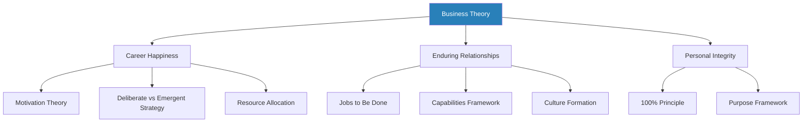
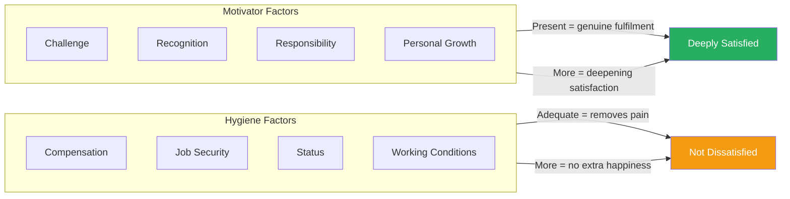
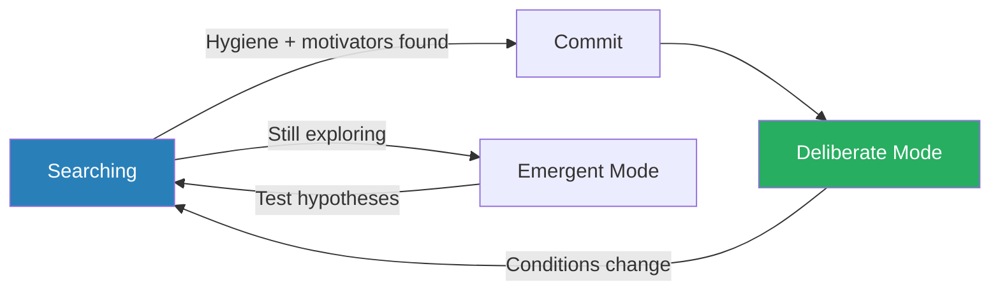
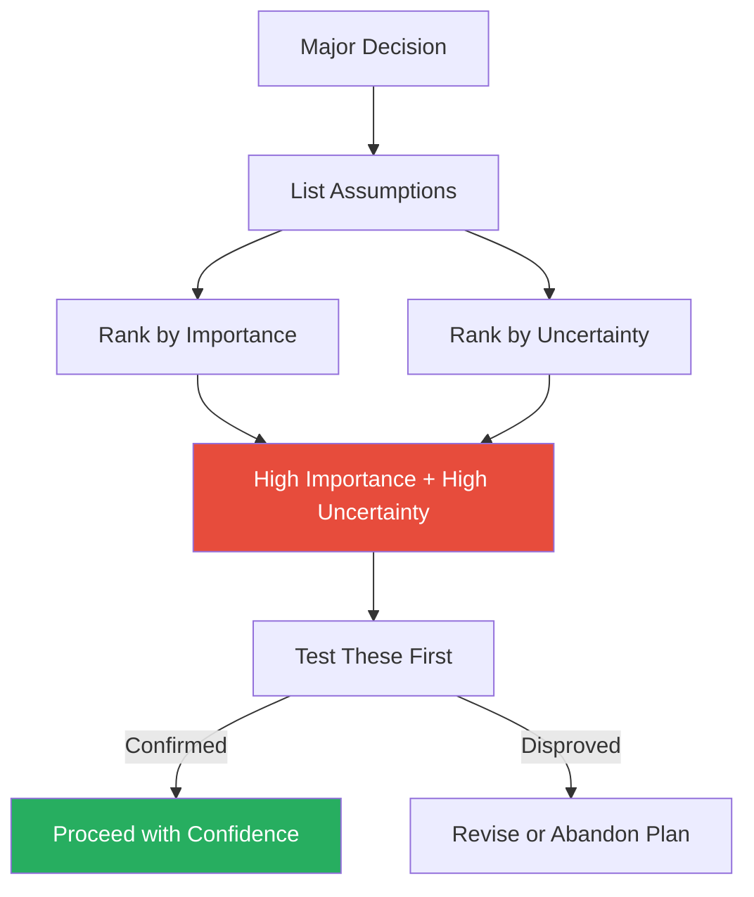
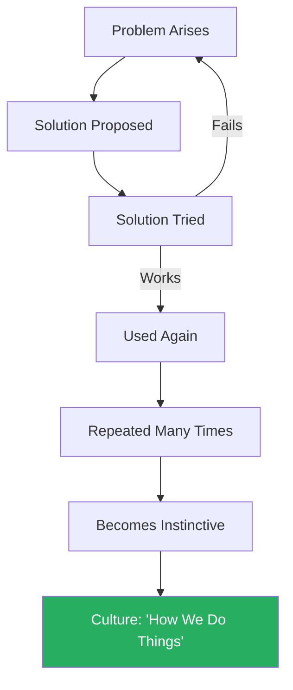
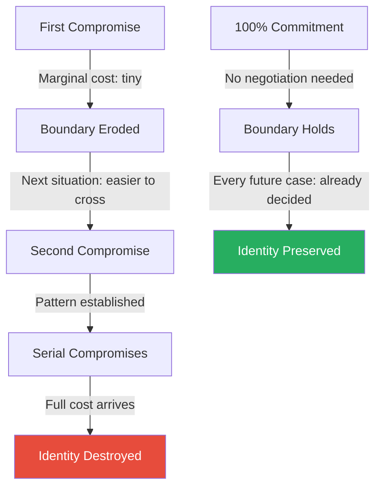
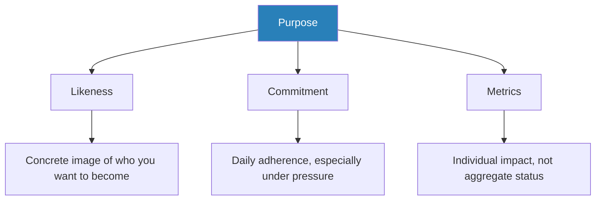

# How Will You Measure Your Life? — Clayton M. Christensen

> Clayton Christensen, the Harvard Business School professor who coined "disruptive innovation," turns his analytical lens inward. His thesis: the same management theories that predict corporate success and failure can predict personal success and failure with equal accuracy. The book applies rigorous business frameworks — Herzberg's motivation theory, emergent strategy, discovery-driven planning, resource allocation, capabilities theory — to three questions every thinking person must eventually answer: How can I be happy in my work? How can I build enduring relationships? How can I live with integrity? Written after Christensen survived cancer and a stroke, the book is a rare combination of analytical precision and hard-won personal urgency. It is a calibration instrument — a way to check whether the life you are building is the life you actually want.

---

## About the Author

Clayton M. Christensen was the Kim B. Clark Professor of Business Administration at Harvard Business School, best known for originating the theory of **disruptive innovation** in his landmark book *The Innovator's Dilemma*.
He held degrees from Brigham Young University, Oxford (as a Rhodes Scholar), and Harvard Business School.
Before academia, he worked as a consultant at Boston Consulting Group and co-founded a technology company called CPS Technologies.
He survived cancer in 2010 and then suffered a stroke in 2011 — both experiences shaped the urgency with which he wrote this book.
Co-authors James Allworth (HBS graduate, former Apple and Booz & Company) and Karen Dillon (former editor of Harvard Business Review) helped translate Christensen's famous final-day lecture at HBS into book form.
Christensen died in January 2020, aged 67.

---

## The Big Idea

*A pattern visible only at HBS reunions reveals why the smartest people in the room end up with broken lives — and the answer is structural, not moral.*

- The book was born from a pattern Christensen observed over decades of attending Harvard Business School reunions
- At the five-year reunion, his classmates were thriving — impressive titles, growing salaries, visible markers of success
- At the ten-year reunion, cracks had started to appear:
  - Marriages were strained
  - Some classmates looked successful on paper but seemed hollow in person
- By the twenty-five-year reunion, a disturbing number were divorced, estranged from their children, or unhappy in ways their professional achievements could not mask
- One classmate — Jeffrey Skilling, the CEO of Enron — was in prison

---

- These were not unintelligent people — they were among the most analytically gifted professionals in the world
- They had tools for evaluating market opportunities, building competitive strategies, and optimising returns on investment
- Yet when it came to the most important investments of all — their relationships, their integrity, their sense of purpose — they had failed spectacularly

Christensen's explanation is structural, not moral:

- <b style="color: #27ae60">Smart people fail at life for the same reason smart companies fail at strategy: they misallocate resources</b>
- They invest in whatever provides the most immediate, tangible return — promotions, bonuses, prestigious titles
- They systematically starve the things that compound over decades: deep relationships, personal integrity, and a sense of meaning
- The feedback loops are asymmetric:
  - A career achievement produces immediate recognition
  - A healthy marriage produces nothing visible in the short term
- Over years, thousands of micro-decisions compound into a life that does not match the one you intended

---

- The book's central claim is that your <b style="color: #2980b9">actual strategy</b> is not what you say it is — it is where your time, energy, and attention actually flow
- If your calendar does not match your stated priorities, your priorities are not what you think they are
- The gap between intention and allocation is where lives go wrong

Christensen applies nine business theories to life decisions across three domains: finding happiness in work, building enduring relationships, and living with integrity. The result is not a motivational book but a diagnostic one — a set of lenses for identifying exactly where and how things are drifting before the damage becomes irreversible.

The book's architecture maps business frameworks onto three life domains, with each theory illuminating a different failure mode that high-achievers are prone to.

---

## Key Concepts at a Glance

| Concept | One-line summary |
|---------|-----------------|
| **Motivation vs hygiene** | Salary prevents unhappiness; only meaningful work creates happiness |
| **Deliberate vs emergent strategy** | Know when to commit to a plan and when to stay open to pivots |
| **Discovery-driven planning** | Make assumptions explicit and test the critical ones before committing |
| **Resource allocation** | Where your time actually flows is your real strategy |
| **Good money / bad money** | Invest in relationships early and consistently, not after crisis arrives |
| **Jobs to be done** | People "hire" solutions for specific jobs — understand the real job |
| **Sacrifice and commitment** | Sacrifice transforms preference into identity |
| **Capabilities framework** | Resources, processes, and priorities determine what you can do |
| **Schools of experience** | Choose opportunities for what they teach, not what they pay |
| **Culture as autopilot** | Culture forms through repeated behaviour, not mission statements |
| **Full cost vs marginal cost** | The cumulative cost of "just this once" is who you become |
| **Purpose** | Likeness, commitment, and metrics — three parts of a deliberate life |

---

## Part I: Finding Happiness in Your Career

### Chapter 1: The Trap of Marginal Thinking (Introduction)

*The habit of asking "What is the incremental cost?" instead of "What is the full cost of the path this puts me on?" is the same error that killed Blockbuster — and it kills lives just as quietly.*

- The book opens with Christensen reflecting on his HBS class and the pattern of drift he witnessed
- He does not blame his classmates for being bad people — he blames them for being good analysts who applied the wrong framework to their own lives

The core metaphor is <b style="color: #2980b9">marginal thinking</b> — the habit of asking "What is the incremental cost of this decision?" rather than "What is the full cost of the path this decision puts me on?"

- The marginal cost of any single compromise looks trivially low
- But the full cost of the path that compromise puts you on compounds over years
- This is why the smartest analysts in the room can end up with the worst personal outcomes — they are optimising each decision locally while ignoring the trajectory

> [!example] Blockbuster's Marginal Death
> - Netflix launched as a tiny DVD-by-mail startup
> - The cost of responding to Netflix seemed negligible compared to Blockbuster's existing rental revenue
> - Blockbuster did the rational marginal thing: nothing
> - By the time Netflix was an existential threat, Blockbuster had lost all the capabilities it would have needed to respond
> **The lesson:** The marginal cost of ignoring a threat is always deceptively low — until the full cost arrives all at once.

> [!example] U.S. Steel and the Mini-Mills
> - Mini-mills could produce cheap rebar — the lowest-margin product in U.S. Steel's portfolio
> - The marginal calculation said: let them have it
> - But the mini-mills climbed the value chain year by year — rebar to angle iron to structural steel to sheet steel
> - Each step was a tiny, ignorable incursion
> - By the time they reached the high-margin products, U.S. Steel had no response left
> **The lesson:** Competitors that start at the bottom of your value chain do not stay there.

---

- <b style="color: #27ae60">The same logic applies to personal integrity, relationship investment, and life priorities</b>
- Each individual compromise seems small:
  - Skipping one family dinner for a work deadline seems rational
  - Telling one small lie to avoid a difficult conversation seems harmless
  - Accepting one job for the money instead of the meaning seems temporary
- But the <b style="color: #e74c3c">full cost of these marginal decisions — compounded over years — is the life you end up with instead of the one you intended</b>

> [!tip] Core Insight
> Marginal thinking is the mechanism of drift. Each decision looks rational in isolation; the full cost only becomes visible when it is too late to reverse course.

---

### Chapter 2: What Makes Us Tick — Motivation vs Hygiene

*The absence of pain is not the presence of pleasure — and the distinction between what prevents unhappiness and what creates happiness is the key to understanding why successful people feel empty.*

This chapter introduces Frederick Herzberg's <b style="color: #2980b9">two-factor theory</b>, one of the most replicated findings in organisational psychology.

- The core insight is counterintuitive: **job satisfaction** and **job dissatisfaction** are not opposite ends of one spectrum
- They are independent dimensions
- You can be simultaneously not dissatisfied — good salary, decent office, stable company — and deeply unsatisfied — unchallenging work, no growth, no sense of meaning
- <b style="color: #27ae60">The absence of pain is not the presence of pleasure</b>

Herzberg identified two categories of factors:

| Factor type | Examples | Effect when adequate | Effect when improved beyond adequate |
|-------------|----------|---------------------|--------------------------------------|
| **Hygiene** | Compensation, status, job security, working conditions, management quality | Removes dissatisfaction | No additional happiness |
| **Motivators** | Challenging work, recognition, responsibility, personal growth, meaningful contribution | Creates genuine fulfilment | Deepening satisfaction over time |

The motivators (green) cluster at 80–95% impact while hygiene factors (red) plateau at 15–25% — doubling your salary adds almost nothing to fulfilment once it is adequate.

- **Hygiene factors** prevent people from hating their jobs, but once adequate, making them better does not produce happiness
  - A bigger salary when your salary is already sufficient does not make you love your work
  - It removes one reason to leave — that is a fundamentally different thing
- **Motivators** operate on a deepening curve:
  - More responsibility and meaning compound into identity and purpose over time
  - People who have found true motivators describe themselves not as employees doing a job but as people fulfilling a calling

> "Management is the most noble of professions if practised well." — Christensen

---

Hygiene and motivation operate on entirely separate tracks — you can be not dissatisfied and still deeply unfulfilled, because the two systems respond to different inputs.

---

> [!example]- The High-Achiever Trap at HBS
> - Christensen's classmates graduated with exceptional options
> - Many were drawn to the highest-paying offers — investment banking, management consulting, corporate law
> - The hygiene factors were exceptional; the motivators were often absent
> - At first, it did not matter — the work was demanding enough to be absorbing, and the lifestyle was seductive
> - Then lifestyle inflated to match income:
>   - The mortgage got bigger
>   - Private school tuition kicked in
>   - The spouse adjusted expectations upward
> - Within a few years, these brilliant people were trapped — earning too much to leave for work that might fulfil them, not earning enough satisfaction to feel the trade-off was worth it
> **The lesson:** Hygiene-driven career choices become golden handcuffs — the higher the salary, the harder it is to leave for meaningful work.

> "The path to hell is paved with good intentions." — Christensen, paraphrasing Samuel Johnson

- <b style="color: #2980b9">The nonprofit counter-example</b> — Christensen points to military officers, teachers, nonprofit workers, and religious leaders as evidence that motivators, not hygiene, drive satisfaction:
  - These people often earn far less than their private-sector peers
  - They report higher levels of meaning, engagement, and purpose
  - They have inadequate hygiene but abundant motivators
  - Conversely, high-earning professionals with every hygiene factor imaginable can be profoundly unhappy
  - The theory predicts this asymmetry exactly

---

> [!example] The Doctor Who Became a Stockbroker
> - Christensen describes a former medical professional who left medicine for Wall Street
> - The salary tripled; the work became meaningless to him
> - He missed the feeling of making a tangible difference in someone's life
> - The motivators he had taken for granted — seeing patients recover, being thanked, solving diagnostic puzzles — vanished entirely
> - He discovered that no amount of bonus money could replace the sense of contribution he had walked away from
> - Yet he could not easily return — his lifestyle had expanded to fill his income
> **The lesson:** When you trade motivators for hygiene, you only discover the cost after the lifestyle trap has closed.

- <b style="color: #e74c3c">The nuance Christensen acknowledges:</b> Hygiene factors must be adequate before motivators can take effect
  - If you cannot feed your family, or your manager is abusive, or your job is genuinely insecure, those problems must be addressed first
  - The theory does not say money does not matter
  - It says money matters up to a threshold — and beyond that threshold, more money buys you nothing that matters
- Christensen is careful to note that the threshold differs for everyone:
  - Someone with student debt and a young family has a higher hygiene threshold than a single person with no obligations
  - The point is not to pursue poverty — it is to recognise when hygiene is adequate and shift your attention to motivators

> [!tip] Core Insight
> Satisfaction and dissatisfaction are independent dimensions. You can eliminate every source of unhappiness and still feel empty — because removing pain and creating meaning are entirely different operations.

---

### Chapter 3: The Balance of Calculation and Serendipity — Deliberate vs Emergent Strategy

*Most successful strategies were not the original plan — they emerged from unexpected opportunities that were recognised and seized at the right moment.*

This chapter borrows from Henry Mintzberg's research on how strategy actually forms in organisations to make a point about planning one's life.

- Strategy, whether corporate or personal, comes from two sources:
  - <b style="color: #2980b9">Deliberate plans</b> — what you set out to do
  - <b style="color: #2980b9">Emergent opportunities</b> — what you discover along the way
- The interaction between these two is where real strategy lives
- Most people assume strategy is entirely deliberate — you make a plan, you execute it
- Mintzberg's research showed that reality is far messier:
  - Intended strategies often fail or become irrelevant
  - Opportunities that nobody anticipated often become the real strategy
  - The skill is not in planning perfectly but in recognising which emergent opportunities deserve commitment

> [!example]- Honda and the Super Cub
> - In the early 1960s, Honda sent a team to the United States with a deliberate strategy: sell large motorcycles to compete with Harley-Davidson and European manufacturers
> - It was a catastrophe — Honda's large bikes leaked oil and suffered mechanical failures with American riders who drove longer distances at higher speeds
> - Dealers showed little interest
> - The Honda team had brought a few small 50cc Super Cub motorcycles for running personal errands around Los Angeles
> - People noticed them — strangers approached at traffic lights, asking where to buy one
> - A Sears buyer called to discuss carrying them
> - Honda's management resisted at first — selling cute scooters felt like admitting defeat
> - But the deliberate strategy was failing and the emergent opportunity was screaming for attention
> - They pivoted, and the Super Cub became one of the best-selling motor vehicles in history, creating an entirely new market
> **The lesson:** The right strategy often appears uninvited — the skill is recognising it and having the humility to abandon the original plan.

> [!example] Sam Walton's Small-Town Constraint
> - Sam Walton's wife, Helen, told him she would not live in a city with more than 10,000 people
> - This personal constraint forced Walton to open stores in small towns that competitors like Kmart ignored
> - What began as a limitation became Walmart's defining strategic advantage:
>   - Uncontested markets
>   - Low real estate costs
>   - A logistics network optimised for rural distribution
> - None of this was deliberate strategy — it emerged from a constraint that turned out to be an asset
> **The lesson:** Constraints that seem limiting can become the foundation of competitive advantage.

---

> [!abstract] The Deliberate vs Emergent Decision Rule
> 1. **When you have NOT yet found** work that provides both adequate hygiene factors and genuine motivators → stay in **emergent mode** — experiment, treat each role as a hypothesis, test it against your values, be willing to pivot
> 2. **When you HAVE found** the combination that genuinely satisfies you → shift to **deliberate mode** — commit, focus, stop chasing alternatives

The framework creates a clear toggle: stay open until you find the right fit, then commit fully — but remain willing to return to emergent mode if conditions fundamentally change.

---

- <b style="color: #e74c3c">The danger on both sides:</b>
  - Committing too early is dangerous — you may lock yourself into something that does not work
  - Staying emergent too long is equally dangerous — it becomes directionless drifting disguised as open-mindedness
- Christensen notes that 93% of all companies that eventually became successful had to abandon their original strategy
- The ones that succeeded were not the ones with the best initial plan — they were the ones that recognised the right emergent opportunity and committed at the right moment

> [!example] Christensen's Own Career Pivot
> - He did not set out to be a professor
> - Started in consulting at the Boston Consulting Group
> - Co-founded a technology company
> - Pivoted to academia almost by accident, following a curiosity about why good companies fail
> - Each stage was emergent — he did not have a master plan
> - When he found academic research on innovation, something clicked — he committed deliberately
> - The result was one of the most influential academic careers in business
> **The lesson:** Your career path does not need to be planned from the start — but the moment of commitment, when it arrives, must be wholehearted.

> [!tip] Core Insight
> The right strategy usually emerges rather than being planned. The critical skill is not having the best initial plan — it is recognising the right emergent opportunity and committing to it at the right moment.

---

### Chapter 4: Your Strategy Is Not What You Say It Is — Resource Allocation

*The most powerful chapter in the book reveals a simple, devastating truth: your strategy is not what you say it is — it is where your resources actually flow.*

> [!example] SonoSite's Strategy Gap
> - SonoSite, a medical device company, had a CEO with a clear strategy for penetrating a new market segment
> - The strategy was well-researched, clearly communicated, and strongly supported by data
> - The sales team ignored it entirely
> - Why? The commission structure rewarded selling to existing customers
> - Every incentive in the salespeople's daily reality pointed toward the old market, not the new one
> - The CEO's strategy existed on paper and in presentations
> - The salespeople's commissions determined the actual strategy
> **The lesson:** Incentive structures override stated strategies every time.

- The principle is simple and devastating: <b style="color: #27ae60">a strategy is not what you say it is — it is where your resources actually flow</b>

---

**The life application:**

- Most people have a stated strategy for their lives:
  - "Family comes first"
  - "I value my health"
  - "I want to build deep friendships"
  - "I care about my community"
- But then look at their calendars — look at where their time, energy, and attention actually go:
  - The career gets the best hours of the day
  - The family gets the leftovers
  - Health gets squeezed into the margins
  - Friendships get the occasional text message

- This is not hypocrisy — it is the natural consequence of <b style="color: #2980b9">asymmetric feedback loops</b>:
  - Career achievements provide fast, visible, tangible feedback
  - You finish a project, and someone notices
  - You close a deal, and the number shows up in the dashboard
  - You get promoted, and everyone congratulates you
  - Relationship investments produce no immediate visible return
  - Nobody congratulates you for being present at dinner

> "You can talk all you want about strategy; what matters is where you spend your time." — Christensen

---

- Over years, thousands of micro-decisions accumulate:
  - Each one seems trivial
  - Skipping one dinner is not a crisis
  - Working one extra weekend is not a betrayal
  - But the compound effect is a life that drifts further and further from the one you intended
- <b style="color: #e74c3c">By the time the consequences become visible — a distant spouse, children who do not confide in you, health problems that could have been prevented — the drift has been going on for years</b>

> [!example] The "Steve" Story — Resource Allocation in Action
> - Christensen tells the story of a student he calls "Steve" who was wrestling with two competing offers after graduation
> - One was a prestigious consulting position with high pay and intense travel demands
> - The other was a smaller role that would allow him to be home every evening
> - Steve chose the consulting job, telling himself it was temporary — just a few years to build financial security
> - Three years became five, then seven
> - His marriage survived, but the deep connection he had planned to build with his children never materialised
> - He had been physically absent during the years when presence mattered most
> - His calendar told the story his intentions never could
> **The lesson:** "Temporary" resource misallocation has a way of becoming permanent — because the circumstances that justify the temporary never actually change.

> [!abstract] The Resource Allocation Audit
> 1. Look at your calendar from last week
> 2. Where did your time actually go?
> 3. Where did your energy go?
> 4. Where did your money go?
> 5. Compare the answers to your stated priorities
> 6. If they do not match, you do not have a strategy problem — you have a **resource allocation problem**

Career consumes over half of all resources while the domains people claim matter most — family, health, friendships — share the remaining scraps, perfectly illustrating the gap between stated strategy and actual allocation.

- Resource allocation problems, unlike value problems, are fixable — once you can see them

> [!tip] Core Insight
> Your actual strategy is revealed by where your time goes, not by what you say matters. The gap between stated priorities and actual time allocation is where lives drift off course.

---

### Chapter 5: Discovery-Driven Planning — Test Before You Commit

*Most failures are not failures of execution but failures of untested assumptions — and the assumptions that destroy you are the ones you never questioned.*

- Before committing to any major life decision, Christensen advises making your assumptions explicit — then testing the most critical ones as cheaply as possible
- The concept comes from Ian MacMillan and Rita Gunther McGrath's work on <b style="color: #2980b9">planning under uncertainty</b>
- Their insight: every plan is built on a stack of assumptions
  - Most of those assumptions are never examined
  - They are treated as facts
  - The ones that destroy you are the ones you never questioned

> [!example] Disney Paris — The Billion-Dollar Assumption
> - When Disney built its theme park outside Paris, the financial model predicted enormous success
> - Attendance projections were based on the assumption that European guests would stay for three or four days, like their American counterparts
> - Nobody tested this assumption
> - The Paris park had only fifteen rides at launch — compared to forty-five at Disney World in Florida
> - European guests came for one day, maybe two
> - The hotel occupancy that the financial model depended on never materialised
> - Disney Paris lost over a billion dollars
> **The lesson:** A single untested assumption buried deep in a spreadsheet can destroy an entire venture.

> [!example]- Iridium's Six-Billion-Dollar Failure (1990s)
> - The Iridium satellite phone project was one of the most ambitious technology ventures of the 1990s
> - Motorola and its partners spent six billion dollars launching sixty-six satellites to create a global phone network
> - The technology worked beautifully — the market assumptions did not
> - Nobody tested whether customers would accept a phone the size of a brick that could not make calls indoors, in cars, or in most buildings
> - By the time the product launched, terrestrial mobile networks had expanded dramatically
> - Iridium's target customers had already been served by cheaper, smaller, more convenient phones
> - Iridium filed for bankruptcy within a year of launch
> **The lesson:** Technological success means nothing if the market assumptions are wrong.

---

> [!example] The Student Who Did Not Test
> - An unnamed student accepted a job at a venture capital firm largely because the firm claimed to invest 20% of its capital in developing-world companies — an area she was passionate about
> - She never tested this assumption
> - She did not ask which partners managed the developing-world portfolio, whether a dedicated fund existed, or whether the 20% figure was a target or a track record
> - She discovered, after joining, that it was an aspiration with no institutional support
> - She had committed years of her life based on an untested assumption
> **The lesson:** The more a commitment matters to you, the more aggressively you must test the assumptions it depends on.

Discovery-driven planning forces you to identify and test the assumptions that carry the most risk before committing resources you cannot recover.

---

> [!abstract] Discovery-Driven Planning for Life Decisions
> 1. Before accepting a new role, changing cities, starting a business, or making any major commitment — **write down what must be true** for it to succeed
> 2. Rank those assumptions by two criteria:
>    - How **important** they are to the outcome
>    - How **uncertain** they are
> 3. The assumptions that are both **highly important** and **highly uncertain** are the ones to test first
> 4. Test as cheaply and quickly as possible — before you are fully committed

- <b style="color: #27ae60">The key distinction is between assumptions that are merely important and assumptions that are both important and uncertain</b>:
  - An assumption like "I need to earn at least $X to cover my expenses" is important but relatively easy to verify
  - An assumption like "This company's culture will allow me to grow" is both important and highly uncertain — it requires deliberate investigation
- Christensen emphasises that most people test the easy assumptions and ignore the hard ones — precisely because the hard ones are uncomfortable to examine

> [!tip] Core Insight
> Every plan is built on a stack of assumptions. The ones that destroy you are the ones you never questioned. Test the most critical assumptions before committing — not after.

---

## Part II: Finding Happiness in Your Relationships

### Chapter 6: The Ticking Clock — Invest Before You Need Returns

*You cannot plant a sapling on the day you need shade — and the investments that matter most in relationships happen before it is obvious that they matter at all.*

Christensen adapts the concept of <b style="color: #2980b9">good money vs bad money</b> from venture capital to make a point about relationships.

- In business:
  - **Good money** is patient for growth but impatient for profit — it forces a company to find a viable business model quickly and cheaply, before scaling
  - **Bad money** is the opposite — it throws resources at growth before the business model is proven
  - Honda's frugal Super Cub entry is good money at its best
  - Iridium is the purest example of bad money — six billion dollars invested before anyone confirmed customers wanted the product

Applied to relationships, the parallel is stark and uncomfortable.

- <b style="color: #27ae60">Christensen uses the metaphor of planting a tree</b>:
  - You cannot plant a sapling on the day you need shade
  - If you want shade in ten years, you must plant the tree today, when you do not need it
  - No amount of money or effort can accelerate a decade of growth into a single season

---

**The trap of deferred investment:**

- When your work is going well and your relationships seem fine, there is no visible urgency to invest in them:
  - Your spouse is not complaining
  - Your children are doing their homework
  - Your friendships are ticking along
  - Everything looks stable
- <b style="color: #e74c3c">But stability is not the same as health, and the absence of crisis is not the same as the presence of connection</b>

- Christensen describes a pattern he witnessed repeatedly among high-achieving professionals:
  - Early in their lives, they invested enormous energy in building their relationships — dating, courtship, early parenting, close friendships
  - As their careers accelerated, the balance shifted
  - Work demanded more; relationships demanded less — or at least, they did not punish neglect as quickly
  - The implicit bargain changed: the relationship got the scraps, the career got the feast
- By the time the relationship was visibly broken — a spouse who had emotionally disconnected, children who had built their identities without parental input, friendships that had atrophied beyond revival — it was too late

---

> [!example] Risley and Hart's Language Research
> - Todd Risley and Betty Hart studied families across socioeconomic groups
> - They discovered that children in professional families heard approximately 48 million words by age three, while children in welfare families heard approximately 13 million
> - But the critical finding was not just volume — it was **"language dancing"**: the back-and-forth interaction between parent and child
> - Responsive, engaged conversation builds neural pathways that nothing else can replicate
> - This "language dancing" in the first thirty months of life had more predictive power for a child's future cognitive development than any other single variable
> - It outperformed family income, parental education, and school quality as a predictor
> **The lesson:** The investment that matters most happens before it is obvious that it matters at all.

> [!example] The Classmate Who Invested Late
> - Christensen describes a classmate who spent his thirties and forties building a career of exceptional achievement
> - By his fifties, he had the title, the income, and the recognition — and a marriage that existed in name only
> - His children were polite but distant; they did not call unless obligated
> - He attempted to "reinvest" in his family with grand gestures — expensive holidays, gifts, planned activities
> - None of it worked because the foundation had never been built
> - The daily presence, the small moments of connection, the years of being there — those could not be purchased retroactively
> - He was trying to plant a tree and sit in its shade on the same afternoon
> **The lesson:** Relationship capital compounds slowly over years. Attempting to build it rapidly after decades of neglect is like trying to cram for a test that covers an entire lifetime.

> [!tip] Core Insight
> Relationships require investment long before they show signs of distress. By the time the damage is visible, years of neglect have already compounded beyond easy repair.

---

### Chapter 7: What Job Did You Hire That Milkshake For? — Jobs to Be Done

*Understanding what job someone needs you to do is fundamentally different from projecting what you think they need — and most relationship failures are failures of understanding, not failures of effort.*

This chapter introduces Christensen's famous <b style="color: #2980b9">jobs-to-be-done</b> theory, originally developed for business strategy, and applies it to understanding what people actually need from their relationships.

- The theory begins with a question that reframes how you think about needs
- Instead of asking "What kind of person buys this product?" (demographics, psychographics, market segments), ask: <b style="color: #27ae60">"What job is the customer hiring this product to do?"</b>
- The distinction matters because:
  - Demographics tell you who the person is
  - The job tells you what the person needs
  - The same person has different jobs at different times
  - Different people have the same job in different contexts

> [!example]- The Milkshake Study
> - A fast-food chain wanted to sell more milkshakes
> - They did the usual market research — focus groups, customer surveys, demographic profiling
> - They made the milkshakes thicker, thinner, sweeter, cheaper — nothing moved the needle
> - Christensen's team took a different approach: they stood in the restaurant and watched
> - A surprising number of milkshakes were sold before 8:30 in the morning, to people alone, buying only a milkshake, then driving away
> - When interviewed, these commuters had a long, boring drive to work and needed something to:
>   - Keep them occupied
>   - Last for the entire commute
>   - Be easy to consume one-handed while driving
> - They had tried alternatives:
>   - Bananas — gone in two minutes
>   - Doughnuts — crumbs everywhere, greasy fingers on the steering wheel
>   - Bagels — dry, boring
> - The milkshake was thick enough to last, satisfying enough to kill morning hunger, and sippable through a straw
> - The same milkshake was also "hired" for a completely different job in the afternoon — parents bought them for children as a way to say "yes" after a long day of saying "no"
> **The lesson:** Same product, two completely different jobs. Understanding the job — not the customer — is what unlocks growth.

---

> [!example] IKEA and the Job Nobody Else Would Do
> - The job: "I need to furnish my apartment today" — not next week, not after waiting for delivery, today
> - IKEA's entire operation is designed around that single job:
>   - Warehouse layout
>   - Flat-pack design
>   - In-store restaurant
>   - Childcare
> - Competitors who try to copy individual elements (low prices, modern design, warehouse format) fail because they are copying features, not solving the job
> - IKEA has maintained its competitive position for over forty years because it owns the job
> **The lesson:** When you organise everything around a specific job, competitors who copy features cannot catch you.

> [!example] Scott and Barbara — Solving the Wrong Problem
> - Scott came home every day to a messy kitchen and, wanting to be helpful, cleaned it up
> - Barbara was not grateful — she was frustrated
> - It took them a long time to figure out why
> - Barbara was a stay-at-home parent who spent all day with small children
> - By evening, she was starved for adult conversation
> - She needed someone to talk to — someone who would engage with her as a person, not as a domestic problem to be solved
> - Scott was "doing a job" that Barbara had not hired him for
> - His effort — though genuine and well-intentioned — landed as dismissal rather than support
> **The lesson:** You can work extremely hard at something that does not matter to the other person, and the result is not gratitude but resentment.

---

- <b style="color: #27ae60">Understanding what job someone needs you to do is fundamentally different from projecting what you think they need</b>
- Most relationship failures are not failures of effort — they are failures of understanding
- Your effort communicates that you do not see someone clearly enough to know what they actually need
- The mechanism is identical to the milkshake study:
  - The fast-food chain worked incredibly hard to improve the product along dimensions that did not matter to the commuter's job
  - Scott worked incredibly hard at a domestic task that did not address Barbara's actual need
  - In both cases, maximum effort produced zero results because the effort was aimed at the wrong job

**The sacrifice dimension:**

- Christensen adds a layer to the jobs-to-be-done framework that most business books skip: <b style="color: #2980b9">sacrifice</b>
- When you sacrifice for someone — genuinely give up something that matters to you — it transforms the relationship from preference to identity
- You no longer merely like spending time with them; they become part of who you are
- <b style="color: #e74c3c">This is why making everything easy for someone can paradoxically weaken the bond</b> — ease does not create devotion; sacrifice does

> [!tip] Core Insight
> People do not sustain relationships based on demographics or categories. They "hire" you to do a specific job in their lives. Get the job wrong, and even maximum effort produces resentment instead of gratitude.

---

### Chapter 8: Sailing Your Kids on Theseus's Ship — The Capabilities Framework

*What people are actually made of — and whether parents build or undermine their children's development — depends on three components, only one of which is visible on a resume.*

This chapter applies the <b style="color: #2980b9">capabilities framework</b> — a model Christensen developed for evaluating companies — to parenting and human development.

The framework has three components:

| Component | Definition | Visibility | Example |
|-----------|-----------|------------|---------|
| **Resources** | What you have — money, knowledge, skills, time, credentials | Most visible | A degree, a salary, a network |
| **Processes** | How you use resources — problem-solving, planning, collaborating | Less visible, often more important | How you handle conflict, manage time |
| **Priorities** | What you choose to put first — the decision engine | Least visible, most consequential | What you sacrifice for, what you ignore |

Priorities dominate the framework because they determine which processes you develop and how you deploy your resources — yet they are the least visible and most neglected component.

- Two people with identical resources will produce radically different outcomes depending on their processes
- Priorities determine where resources and processes are directed
- The hierarchy matters: priorities drive which processes you develop, and processes determine how effectively you deploy your resources

---

> [!example]- Dell and Asus — Slow-Motion Suicide
> - In the late 1990s, Dell was the dominant personal computer company; Asus was a humble Taiwanese component manufacturer
> - Dell's management, under constant pressure to improve margins, began outsourcing manufacturing to Asus — it was cheaper
> - The stock market rewarded the decision — margins improved, returns on assets went up
> - Emboldened, Dell outsourced more:
>   - Supply chain management went to Asus
>   - Then motherboard design
>   - Then computer design itself
> - Each individual decision was rational and improved Dell's financial metrics
> - Each one transferred a critical capability from Dell to Asus
> - Eventually, Asus had accumulated all the capabilities that had once made Dell dominant — and launched its own competing brand
> - Dell was left with a logo, a supply chain it no longer controlled, and no ability to make the products it sold
> **The lesson:** Outsourcing that looks clever quarter by quarter can be a slow-motion transfer of your entire competitive advantage to a future rival.

Each outsourcing decision looked rational in isolation, but the cumulative effect was a complete transfer of Dell's competitive advantage to the company that would become its rival.

---

**The parenting application:**

- <b style="color: #e74c3c">When parents outsource every challenge their children face, they are acting like Dell</b>:
  - Hiring tutors instead of letting them struggle
  - Arranging social lives instead of letting them navigate friendships
  - Solving problems instead of letting them fail
- Each intervention seems helpful in isolation:
  - The child's grades improve
  - The social calendar fills up
  - The problems get solved
- But the child never develops the **processes** — resilience, problem-solving, self-confidence, emotional regulation — that come only from wrestling with hard problems and sometimes failing
- <b style="color: #27ae60">Resources can be given to a child; processes cannot — processes must be earned through experience</b>

---

**The schools of experience:**

- Christensen extends the capabilities framework with <b style="color: #2980b9">schools of experience</b> — the idea that the most valuable thing any experience provides is not the credential or the salary but the processes it forces you to develop
- A difficult first job that requires you to lead a struggling team teaches more than a prestigious role that requires you to execute a proven playbook
- Parents who schedule every hour of their child's day are, in Christensen's language, enrolling them in schools that teach no processes:
  - Structured activities teach compliance and execution
  - Unstructured time teaches self-direction, creativity, and boredom tolerance

- Christensen describes parents who enrol their children in an endless succession of organised activities — soccer, piano, debate club, SAT prep — believing they are building capability
- But if every hour is structured by adults, the child never learns to:
  - Structure their own time
  - Manage their own boredom
  - Solve problems that nobody has pre-packaged for them
- <b style="color: #e74c3c">The result is a young adult with impressive resources and no processes — someone who looks ready on paper but crumbles when faced with unstructured challenges</b>

> [!tip] Core Insight
> Capability is not built by giving children resources — it is built by letting them struggle with problems that develop processes. Outsourcing challenges outsources the development of the very capabilities they need.

---

### Chapter 9: The Invisible Hand Inside Your Family — Culture

*Culture is not what you announce — it is what you repeatedly do, and by the time a child is a teenager, the culture is largely set.*

This chapter applies Edgar Schein's model of <b style="color: #2980b9">culture formation</b> to argue that culture — in organisations and in families — is not what you announce. It is what you repeatedly do.

**How culture forms:**

- A group faces a problem
- Someone proposes a solution
- The group tries it
- If the solution works, they use it again next time they face the same type of problem
- After enough repetitions, the solution becomes instinctive — embedded in the group's reflexes
- People stop asking "How should we handle this?" and simply handle it according to the established pattern
- This is what Schein calls the transition from <b style="color: #2980b9">conscious problem-solving to unconscious assumption</b>
- Once a behaviour has been repeated enough times with positive results, it becomes invisible — it is just "how we do things"

Culture forms through repeated cycles of problem-solving — what works gets repeated until it becomes invisible and automatic.

---

> [!example] Enron's Cultural Fraud
> - Enron published a sixty-four-page Code of Ethics
> - Its stated values were "Respect, Integrity, Communication, and Excellence"
> - Enron's actual culture — formed by what behaviour was rewarded and what was tolerated — was the opposite
> - The people who were promoted hit their numbers, regardless of how they did it
> - Tolerated behaviour included aggressive accounting, intimidation of analysts, and systematic deception of regulators
> - The stated values existed in a binder; the actual culture existed in the daily pattern of who got ahead and who got punished
> **The lesson:** Culture is determined by what behaviour is rewarded and what is tolerated — not by what values are written down.

> [!example] Pixar's Culture of Radical Honesty
> - Pixar built a culture of unvarnished creative feedback through repeated practice
> - In "Braintrust" sessions, directors present films in progress to senior creatives who provide brutally honest assessments
> - Nobody is exempt; nobody's feelings are more important than the film's quality
> - This culture was not created by a mission statement
> - It was created by hundreds of Braintrust sessions where honest feedback was given, received without retaliation, and used to improve the films
> - The repetition made honesty instinctive — Pixar employees do not have to decide whether to be honest
> **The lesson:** Culture is built through hundreds of repetitions of the behaviour you want — not through declarations.

---

> [!example] Netflix's Culture Document
> - Netflix codified its culture in a famous public document viewed millions of times
> - The document describes a culture of freedom and responsibility, high performance, and radical transparency
> - But the document only worked because the behaviours it described were already being practised
> - Netflix did not create its culture by writing a document — it documented a culture that already existed
> **The lesson:** You can only codify a culture that has already been built through years of consistent behaviour.

| Company | Stated culture | Actual culture | Mechanism |
|---------|---------------|----------------|-----------|
| **Enron** | Respect, Integrity, Excellence | Deception, intimidation, rule-breaking | Rewarded results regardless of method |
| **Pixar** | Creative honesty | Creative honesty | Hundreds of Braintrust sessions without retaliation |
| **Netflix** | Freedom and responsibility | Freedom and responsibility | Years of consistent behaviour before documentation |

The contrast reveals the mechanism: culture is formed by what behaviour is repeatedly rewarded and tolerated, never by what values are announced.

---

> [!example] Christensen's Family Culture — The Lawn
> - Christensen wanted his children to develop a work ethic — a willingness to tackle tedious tasks without complaint
> - He could have simply announced this value: "In this family, we work hard"
> - Instead, he mowed the lawn every Saturday with his young children clinging to the handle of the lawnmower
> - He turned the chore into a shared activity — something fun, associated with togetherness and accomplishment
> - After years of this, his children did not think of lawn-mowing as a chore
> - They thought of it as something they did — part of who they were
> - The work ethic was not taught through a lecture — it was formed through repetition of a behaviour experienced as positive
> **The lesson:** Culture is set through hundreds of small moments, not through big speeches.

> "Culture, in the resistance-free path that forms over time, is what happens when nobody is managing it." — Christensen (paraphrased)

- <b style="color: #27ae60">Family culture is set in the first few years</b>, through the hundreds of small decisions parents make about:
  - How to handle conflict
  - How to treat people
  - How to respond to failure
  - What behaviour is and is not acceptable
- By the time a child is a teenager, the culture is largely set
- <b style="color: #e74c3c">You cannot announce new values to a fifteen-year-old and expect them to override ten years of established behavioural patterns</b>

The implication is urgent: if you are going to shape the culture of your family, the time to do it is now — in the small, seemingly insignificant daily moments, not in the big dramatic speeches that feel important but do not change anything.

> [!tip] Core Insight
> Culture forms through repeated behaviour, not through mission statements or declarations. In families, the culture is largely set in the first few years — through hundreds of small moments, not big speeches.

---

## Part III: Staying Out of Jail

### Chapter 10: Just This Once... — The 100% Principle

*It is easier to hold to your principles 100% of the time than 98% of the time — because crossing a line once destroys the boundary that prevented all subsequent crossings.*

This is the book's most striking and most original chapter.

- Christensen argues that <b style="color: #27ae60">it is easier to hold to your principles 100% of the time than 98% of the time</b>
- The marginal cost of "just this once" appears trivially low
- But crossing a line once destroys the boundary that prevented all subsequent crossings

> "The marginal cost of doing something wrong 'just this once' always seems alluringly low." — Christensen

> [!example]- Christensen's Basketball Game at Oxford
> - As a student at Oxford, Christensen played on the basketball team
> - The team reached the championship game — the equivalent of the Final Four
> - He discovered that the game was scheduled for a Sunday
> - He had made a commitment, rooted in his religious faith, to keep Sundays as a day of rest and worship
> - Not playing on Sundays was not a guideline — it was a bright line, absolute and non-negotiable
> - His teammates were incredulous:
>   - The team needed him
>   - The stakes were as high as they could be
>   - Surely God would understand
>   - Surely this was the exception that proved the rule
> - Christensen prayed about it and agonised
> - He concluded that if he made an exception "just this once," there would always be another "just this once"
> - He did not play; his team won without him
> - He never had to make that decision again — because the boundary was absolute and everyone knew it
> **The lesson:** By holding the line absolutely, he eliminated all future decision costs. Every subsequent situation was already decided.

---

> [!example]- Nick Leeson and the Destruction of Barings Bank
> - Nick Leeson was a trader at Barings Bank, one of the oldest financial institutions in England (founded 1762)
> - He did not wake up one morning and decide to commit fraud
> - He made a single small decision to hide a modest trading loss in an error account
> - The loss was embarrassing but manageable; the cover-up was easy
> - Then the loss grew:
>   - To cover it, he made more trades
>   - Which generated more losses
>   - Which required more cover-ups
> - Each step was a tiny extension of the previous one
> - Each "just this once" was marginal, incremental, barely a departure from what he had already done
> - The endpoint was the complete destruction of Barings Bank — a 233-year-old institution
> - Leeson paid the full cost of his principles — he just paid them in instalments so small he never noticed the total accumulating until it was catastrophic
> **The lesson:** The marginal cost of each compromise is tiny. The full cost — paid in the slow erosion of who you are — is always catastrophic.

> [!example] Blockbuster's Decade of Marginal Thinking
> - When Netflix launched its DVD-by-mail service, Blockbuster's executives ran the numbers
> - Responding would require investment in new infrastructure, logistics, and technology
> - The marginal cost of ignoring Netflix was essentially zero — existing business was enormously profitable
> - So Blockbuster did the marginally rational thing: nothing
> - Year after year, the same marginal calculation held — Netflix was still small, Blockbuster was still profitable
> - By the time Netflix was a genuine threat, Blockbuster had lost the capabilities, customer relationships, and organisational agility to respond
> - The full cost of a decade of marginal thinking was bankruptcy
> **The lesson:** The marginal cost of inaction is always zero in the short term — and always ruinous in the long term.

---

The 98% path requires a new decision at every junction — and each decision is biased toward the convenient exception. The 100% path eliminates all future decision costs.

---

**The principle for life:**

- <b style="color: #e74c3c">Each compromise erodes the internal boundary that prevented the next one</b>
- The full cost — paid not in a single dramatic failure but in the slow erosion of who you are — is always higher than the sum of the marginal costs suggested
- Ethical principles work like Blockbuster's competitive position:
  - Telling one lie is easy
  - Cutting one corner is painless
  - Breaking one promise is forgettable
  - But each one makes the next one easier

- Identify the principles that are truly non-negotiable to you — the lines you will not cross
- Then hold them absolutely — not 98%, not with exceptions for special circumstances — <b style="color: #27ae60">100%</b>

> "It's easier to hold to your principles 100% of the time than it is to hold to them 98% of the time." — Christensen

- The reason is not moral rigidity — it is cognitive efficiency:
  - When a line is absolute, you never have to decide
  - There is no negotiation, no weighing of costs and benefits, no agonising over whether this particular case is special enough
  - The decision is made once, and it holds forever
  - When a line is 98%, every single situation requires a new decision — and the decision is always biased toward the convenient exception

---

| Approach | Decision cost | Outcome over time | Risk |
|----------|--------------|-------------------|------|
| **100% commitment** | One decision, made once | Boundary holds permanently | May seem rigid in the moment |
| **98% commitment** | New decision every time | Boundary erodes gradually | "Just this once" compounds |
| **Case-by-case** | Continuous negotiation | No stable boundary at all | Drift without awareness |

The table reveals why 100% is actually easier than 98%: it reduces an infinite series of difficult decisions to a single one.

The 98% line decays exponentially while 100% holds steady — each "just this once" exception accelerates the erosion, until the original principle is unrecognisable.

> [!tip] Core Insight
> Bright-line principles are easier to maintain than almost-bright-line principles. The 100% commitment eliminates all future decision costs; the 98% commitment forces a new negotiation every time — and you will lose some of those negotiations.

---

### Epilogue: Purpose — Likeness, Commitment, and Metrics

*Without a deliberately chosen purpose, your life strategy will be shaped by default — hijacked by whatever screams loudest.*

The book closes with Christensen's framework for <b style="color: #2980b9">personal purpose</b> — the meta-strategy that determines where all other strategies point.

He frames purpose as having three components:

**1. Likeness — the person you want to become:**

- This is not a vague aspiration like "be successful" or "be happy"
- It is a concrete, specific image of the person you want to see when you look in the mirror in ten or twenty years:
  - What do they value?
  - How do they spend their time?
  - What kind of relationships do they have?
  - What have they built?
  - How do they treat people?
- <b style="color: #27ae60">The more specific the likeness, the more useful it is as a decision filter</b>
- Christensen draws from his own experience: he spent an hour every evening at Oxford thinking about what kind of person he wanted to become
- That practice — sustained over two years — produced a clarity of purpose that guided decisions for the rest of his life

---

**2. Commitment — daily adherence under pressure:**

- Purpose without daily practice is just a wish
- It is the corporate equivalent of Enron's Code of Ethics — a beautiful document with no connection to reality
- True commitment means that your purpose shapes your behaviour not just when it is convenient but precisely when it is inconvenient
- The moments when it costs you something to live by your purpose are the moments when the commitment is real
- Christensen connects this directly to the 100% principle:
  - If your purpose includes being a person of integrity, that purpose must hold in the exact moments when compromise is most tempting
  - If your purpose includes being a present parent, that purpose must hold on the exact evenings when work is most demanding

**3. Metrics — how you measure progress:**

- This is where Christensen's framework becomes most distinctive
- Most people measure their lives using <b style="color: #e74c3c">aggregate metrics</b> — money earned, titles acquired, awards received, publications listed
  - These metrics are legible, comparable, and socially validated
  - They are also, in Christensen's view, deeply misleading
- Christensen's own metric was <b style="color: #27ae60">individual impact</b> — the number of people he helped become better, one by one
  - Not the number of students he taught
  - Not the number of papers he published
  - Not the amount of money he earned
  - The individual human beings whose lives were different because he was in them

---

- He describes how this metric took him fifteen years to clarify
- It was not a revelation that arrived fully formed
- It evolved through sustained reflection — beginning at Oxford, where he spent an hour every night thinking about what kind of person he wanted to become

> "Don't worry about the level of individual prominence you have achieved; worry about the individuals you have helped become better people." — Christensen

Purpose has three interlocking components — a vivid image of the person you want to become, daily commitment to that image especially when it is costly, and a metric that measures what actually matters rather than what is most visible.

---

**The danger of default purpose:**

- <b style="color: #e74c3c">Without a deliberately chosen purpose, your life strategy will be shaped by default</b>
- Whatever screams loudest will get your attention:
  - Career demands scream loud
  - Relationship needs whisper
  - Health concerns murmur until they become emergencies
- Purpose is the mechanism that determines which voice you listen to when all of them are calling at once

- Christensen draws a parallel to companies:
  - A company without a clear purpose gets hijacked by employees who use the organisation to serve their own ends
  - The loudest voices set the agenda
  - The most politically powerful factions control the resources
  - The company drifts in whatever direction the strongest internal forces push it
- A person without a clear purpose is the same:
  - The loudest demands — career deadlines, social obligations, the immediate and the urgent — set the agenda
  - The quiet, important, long-term investments — relationships, health, meaning, growth — get starved

<b style="color: #27ae60">Purpose is the antidote to drift</b> — the mechanism that allows you to say: "My time goes here, not there. My energy goes to this, not that. This opportunity, however attractive, does not serve the person I am trying to become — so I will let it pass."

> [!example] Christensen's Oxford Evenings
> - Every evening at Oxford, Christensen spent a full hour in contemplation
> - He was not praying for career success or academic achievement
> - He was asking a single question: what kind of person do I want to become?
> - Over two years, this practice produced a deeply specific image — not of career milestones or financial targets, but of the kind of husband, father, community member, and teacher he wanted to be
> - That image became his likeness — the reference point against which every subsequent decision was measured
> - Decades later, when career opportunities, health crises, and family challenges arose, he had a filter that had been refined through years of sustained reflection
> **The lesson:** Purpose does not arrive in a flash of insight — it is built through sustained, deliberate reflection over months and years.

> [!tip] Core Insight
> Purpose is not a luxury — it is the decision engine that prevents your life from being hijacked by whatever screams loudest. Without it, the urgent always defeats the important.

---

## Key Quotes

> "The marginal cost of doing something wrong 'just this once' always seems alluringly low." — Christensen

> "You can talk all you want about strategy; what matters is where you spend your time." — Christensen

> "It's easier to hold to your principles 100% of the time than it is to hold to them 98% of the time." — Christensen

> "Management is the most noble of professions if practised well." — Christensen

> "Don't worry about the level of individual prominence you have achieved; worry about the individuals you have helped become better people." — Christensen

> "The path to hell is paved with good intentions." — Christensen, paraphrasing Samuel Johnson

> "If we study what makes people tick from Herzberg's framework, management is among the most noble professions — if it is well practised." — Christensen

---

## The Verdict

*How Will You Measure Your Life?* is not a self-help book in the usual sense. It does not tell you to believe in yourself or follow your passion. It is an analytical book that applies rigorous business theory to the question of how to build a life that does not fall apart. Its method is diagnostic rather than inspirational — it gives you lenses for identifying exactly where things are going wrong, not affirmations to make you feel better about the fact that they are.

Its greatest strengths cluster around three ideas. The **resource allocation** insight — that your actual strategy is revealed by where your time goes, not by what you say matters — is the book's most powerful single contribution. This framework alone justifies reading the book, because it transforms a vague sense of "I should spend more time on what matters" into a concrete, auditable discipline. The **Herzberg distinction** between motivation and hygiene is genuinely clarifying for anyone who has ever felt simultaneously successful and empty — it explains the mechanism behind that paradox with precision. And the **100% principle** for ethical commitments is the book's most original idea — a simple concept with profound practical implications. The argument that bright-line principles are easier to maintain than almost-bright-line principles is not just motivational advice. It is a structural claim about how human willpower and boundary maintenance actually work, supported by examples from both personal ethics and corporate strategy.

Its weaknesses are significant but bounded. The book lives entirely in the world of personal agency. It assumes you have choices. It does not address what happens when systems constrain your options, when organisational dysfunction determines outcomes regardless of individual resource allocation, or when the people around you are acting irrationally or in bad faith. The relationship chapters lean heavily on anecdote rather than research — the milkshake study is rigorous, but the stories of Scott and Barbara, "Steve," and the Christensen family are illustrative rather than evidential. The book's underlying religious framework — Christensen was a devout member of the Church of Jesus Christ of Latter-day Saints — shapes the purpose chapter in ways that are not fully acknowledged as perspective rather than universal truth. The basketball-on-Sunday story is compelling as a personal testimony, but it derives its power from a specific religious commitment that not all readers will share, and Christensen does not fully grapple with how the framework applies to secular readers defining their own principles.

The book is most valuable for readers who are achieving a great deal professionally and suspect that the life they are building is not the one they actually want. It is less useful for readers whose primary challenge is not misallocation but constraint — people who do not have abundant resources to allocate in the first place. Christensen's HBS classroom is a particular world, and the problems he addresses are the problems of that world: too many options, too much success, too little reflection on whether the success is building something meaningful.

Compared to other books in this territory, *How Will You Measure Your Life?* is more rigorous than most popular books on meaning and purpose, less comprehensive than a book like David Brooks's *The Second Mountain* on the same themes, and more practically useful than academic treatments of Herzberg or Schein. Its unique contribution is the bridge it builds between business theory and personal life — a bridge that is sometimes strained (disruption theory does not map cleanly onto relationships) but is, at its best, genuinely illuminating. As a diagnostic tool, it is exceptional. As a comprehensive guide to building a meaningful life, it is a strong starting point that benefits from being supplemented with perspectives on power, constraint, and the parts of life that do not respond to analytical frameworks.

---

## Related Reading

- [[christensen_innovators-dilemma|The Innovator's Dilemma]] — Christensen's foundational work on disruptive innovation, the theory that underpins several frameworks in this book
- [[pink_drive|Drive]] — Daniel Pink's exploration of intrinsic motivation, which complements and extends Herzberg's two-factor theory
- [[Man's Search for Meaning - Viktor Frankl]] — Viktor Frankl's non-religious framework for purpose, a useful counterweight to Christensen's faith-informed perspective
- [[Range - David Epstein|Range]] — David Epstein's argument for broad experience over early specialisation, which intersects with the "schools of experience" framework
- [[Essentialism - Greg McKeown]] — Greg McKeown's case for disciplined pursuit of less, which reinforces the resource allocation argument
- [[Deep Work - Cal Newport]] — Cal Newport's framework for protecting focused time against distraction, which parallels the resource allocation audit
- [[The Effective Executive - Peter Drucker]] — Drucker's argument that effectiveness is a learnable discipline, not a talent — connecting to Christensen's process-over-resources insight
